# SAEARP4761

# 民用飞机机载系统和设备安全性评估过程的指南和方法

郭百鑫译

民航华东地区管理局适航审定处

2007. 12

# SAE ARP 4761

GUIDELINES AND METHODS FOR CONDUCTING THE SAFETY ASSESSMENT PROCESS ON CIVIL AIRBORNE SYSTEMS AND EQUIPMENT (1996-12)

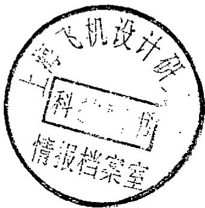

译者的话：

SAE ARP4754 和 SAE ARP4761 对于民用飞机复杂系统设计的安全性分析和适航审定是两个非常重要的，适用性很强的参考文件。出于学习、研究和应用的目的，现将这两个文件的英文版 (SAE ARP4754 CERTIFICATION CONSIDERATIONS FOR HIGHLY-INTEGRATED OR COMPLEX AIRCRAFT SYSTEMS (1996-11),SAE ARP 4761 GUIDEINES AND MEHODS FOR CONDUCTING THE SAFETY ASSESSMENT PROCESS ON CIVIL AIRBORNE SYSTEMS AND EQUIPMENT (1996-12) 翻译成了中文本。在此过程中，始终得到民航华东地区管理局适航审定处领导吴坚、钱惠德和孙安宏的大力支持、鼓励和帮助；吴坚同志审校了 SAE ARP4754 的译文，钱惠德和孙安宏同志审校了 SAE ARP4761 的译文；在文字打印和附图绘制中，得到沈国峰和徐逸乐两同志的许多帮助；严万亿先生对 SAE ARP4761 的部分译文和附图进行了打字并校对；在付印过程中，袁晓峰同志付出了许多时间和辛劳。在此，谨向他们表示诚挚的谢意。

该两个文件对于民用飞机复杂系统的设计者以及适航审定人员的工作将是很有帮助的，也可作为有关人员或学生学习的参考资料。

尽管对于SAEARP4754和SAEARP4761的译文，译者已分别校订了多次，但由于时间关系和译者水平有限，一定还存在不少错误和疏漏之处，敬请读者提出并指正。

郭百鑫

2007-12-25

# 目录

1. 范围

1.1 目的 4  
1.2 预期的用户 4  
1.3 如何使用本文件 4

2. 参考文献 6

2.1 6  
2.11 SAE出版物 6  
2.12 美国政府出版物 6  
2.13 FAR出版物 6  
2.14 RTCA出版物 6  
2.15 其它参考资料 6  
2.2 定义  
2.3 缩写 11  
3. 安全性评估过程 12  
3.1 安全性评估概述 12  
3.2 功能危险性评估（FHA） 16  
3.3 初步系统安全性评估 (PSSA) 17  
3.4 系统安全性评估 (SSA) 21  
3.5 飞机合格审定使用的验证方法 22  
4. 安全性评估分析方法 22  
4.1 故障树分析/相关图/马尔可夫分析(FTA/DD/MA) 22

FTA/DD/MA的应用 22

FTA/DD/MA中的软件 24

# 目录（续）

4.1.3 平均暴露时间概率 25  
4.2 失效模式和影响分析(FMEA) 25  
4.3 失效模式和影响摘要 (FMES) 26  
4.4 共因分析 (CCA) 26  
4.4.1 区域安全性分析 (ZSA) 27  
4.4.2 特定风险分析 (PRA) 27  
4.4.3 共模分析 (CMA) 28

5. 与安全性有关的维修工作和时间间隔 28  
6. 限时签派 30  
6.1 发动机全权数字控制 (FADEC)的应用 30

附录A 功能危险性评估（FHA） 31  
附录B 初步系统安全性评估 (PSSA) 40  
附录C 系统安全性评估 (SSA) 45  
附录D 故障树分析（FTA） 50  
附录E 相关图（DD） 104  
附录F 马尔可夫分析（MA） 108  
附录G 失效模式和影响分析(FMEA) 135  
附录H 失效模式和影响摘要 (FMES) 147  
附录I 区域安全性分析 (ZSA) 151  
附录J 特定风险分析(PRA) 156  
附录K共模分析 (CMA) 159  
附录L 连续安全性评估过程举例 168

# 致谢

S-18 委员会的领导成员非常感谢在本文件编制的这些年间作出积极贡献的委员会成员及其发起公司所付出的时间、努力和经费。没有他们的经验、协作和奉献，本文件的编制成功是不可能的。

特向下列委员会成员表示感谢。

*John Dalton, 主席

波音商用飞机集团

*Larry Lacy, 副主席

Rockwell Collins 航空电子

Michael Burkett

Allison 发动机公司

Dale Davidson

Honeywell 商用分部

*Jeff Hasson

波音商用飞机公司

Jean Pierre Heckmann

法宇航

Jay Myers

美国汽车工程师学会

\*Claus Nagel

Daimlar Benz 宇航

*Barbara Pederson

Rockwell / Collins 通用航空

*Eric Peterson

Honeywell空中运输

*Michael Peterson

Honeywell空中运输

Brett Portwood

美国联邦航空管理局

*Warren Prasuhn

Rockwell / Collins 空中运输

*Titak Sharma

波音商用飞机公司

Gerry Southcombe

英宇航

James Treacy

美国联邦航空管理局

Andrew G. Ward

Rolls Royce 发动机公司

Steve Wilson

Allied Signal 通用航空

标有“ $\star$ ”者为编辑委员会成员

# 1. 范围：

本文件说明民用飞机合格审定中进行安全性评估的指南和方法。进行安全性评估主要与表明对FAR/JAR25.1309的符合性相关。本文件所概述的方法确定一种表明符合性的系统性手段，但不是唯一的手段。本材料的子文件也可用于非25.1309的设备。本文件介绍飞机级安全性评估的概念并概述完成该任务的方法。并考虑飞机总的运行环境。

当对飞机衍生型或系统更改进行合格审定时，本文件所述的过程通常仅适用于新的设计或受到该设计更改影响的现有设计。对于新的衍生型上采用现有设计的情况，可使用其他手段（诸如使用经验）来表明其符合性。

# 1.1 目的：

本文件对工业界公认的安全性评估提供指南，评估由功能危险性评估（FHA）、初步系统安全性评估(PSSA)和系统安全性评估(SSA)所组成。

本文件也提供有关安全性评估所需的安全性分析方法的信息。这些方法包括故障树分析（FTA）、相关图（DD）、马尔可夫分析（MA）、失效模式和影响分析（FMEA）、失效模式和影响摘要（FMES）和共因分析（CCA）。〔共因分析由区域安全性分析（ZSA）、特定风险分析（PRA)和共模分析(CMA)组成〕。

# 1.2 预期的用户：

本文件预期的用户包括，但并不限于飞机机体制造商，系统综合商，设备供应商以及在民用飞机及相关系统和设备的安全性评估中所涉及到的审定当局。

# 1.3 如何使用本文件：

本文件中提供的指南和方法预期与其它适用的指导材料（包括ARP4754，RTCA/DO-178，RTCA SC-180文件DO-（待定））以及与FAR/JAR25.1309相关的咨询材料一起使用（对于发动机和螺旋桨的应用，参考适用的FAR/JAR咨询材料）。本文件的目的是鉴别民用飞机和其相关系统和设备执行安全性评估的典型的工作、方法和文档。这些工作的特定适用情况需要由进行该工作评估的机构和相应的接受者来确定。

# 1.3（续）：

本文件在评价设计安全性方面提供通用指南。介绍主要分析方法和工具以及它们之间的关系。用户如对具体的方法或工具需要更多的信息，则可以从附录A到附录K中得到。这些附录提供有关功能危险性评估（FHA）、初步系统安全性评估(PSSA)、系统安全性评估(SSA)、故障树分析(FTA)、相关图（DD)、马尔可夫分析（MA)、失效模式和影响分析(FMEA)、失效模式和影响摘要(FMES)、区域安全性分析(ZSA)、特定风险分析(PRA)和共模分析(CMA)等方面信息。附录L给出一假想的系统安全性评估过程例子。该连续分析例子说明在整个设计周期中进行飞机或系统总的安全性分析所产生的过程和方法之间的关系。

注：各个附录不作为单独文件而存在，但预期与包含在主体文件中的信息一起使用。提醒用户不要脱离该主体文件而使用各个附录。此外，对于附录L中连续分析的示例，在没有引用相应的附录以及本文件的主体内容时，不得予以使用。

本文件所陈述的示例，包括文档样式，预期仅作为指南。不得将这些示例解释为对任何要求的增补或引申。

贯穿本文件和各个附录，都使用故障树分析作为参考。这种情况应被为完成相同目的而由所要求资料的细节和类型决定可能选择相关图或马尔可夫分析的读者所理解。

ARP1834和ARP926A包含有关故障/失效树分析的信息，但对于民用飞机安全性评估目的，已由本文件所取代。它们正在被修正以反映这一取代。

# 2. 参考文献：

# 2.1 适用文件：

下列出版物在本文件规定范围内构成本文件的一部分。应使用SAE出版物的最新版本。万一本文件的文本与本文件所列参考文献之间出现矛盾，则以本文件为准。然而，本文件的任何条文都不能代替有效的法律和规章，除非它们得到专门的豁免。

2.1.1 SAE 出版物：可从 SAE 获得。地址：400 Commonwealth Drive, Warrendale, PA 15096-0001.

ARP4754 Certification Considerations for Highly-Integrated or Complex Aircraft Systems（高度综合或复杂飞机系统合格审定需要考虑的问题）

2.1.2 美国政府出版物：可从DODSSP获得。地址：Subscription Services Desk, Building 4D, 700 Robbins Avenue, Philadelphia, PA 19111-5094.

MIL-HDBK-217 Reliability Prediction of Electronic Equipment, Reliability Analysis Center（电子设备的可靠性预计，可靠性分析中心）

MIL-HDBK-338 Reliability Engineering Handbook（可靠性工程手册）

MIL-HDBK-978 NASA Parts Application Handbook (NASA 零部件应用手册)

2.1.3 FAR 出版物：可从 FAA 获得。地址：800 Independence Avenue, SW, Washington, DC 20591.

FAR 25.1309 Airworthiness Standards: Transport Category Airplane, Federal Aviation Regulations（适航标准：运输类飞机，联邦航空条例）

AC 25.19 Certification Maintenance Requirements (合格审定维修要求)

2.1.4 RTCA 出版物：可从 RTCA 公司获得。地址：1140 Connecticut Avenue, NW, Suite 1020, Washington, DC 20036.

RTCA/DO-178 Software Considerations in Airborne Systems and Equipment Certification, RTCA Inc.

（在机载系统和设备合格审定中对软件的考虑，RTCA公司）

RTCA/DO-TBD Design Assurance Guidance for Airborne Electronic Hardware (RTCA Special Committee-180)

（机载电子硬件的设计保证指南）（RTCA专门委员会-180）

# 2.1.5 其它参考文献：

<table><tr><td>JAR25.1309</td><td>Large Aeroplanes, Joint Aviation Requirements
(大型飞机, 联合航空要求)</td></tr><tr><td>AC 25.1309-1A</td><td>System Design and Analysis, Advisory Circular, FAA
(系统设计和分析, 咨询通告, FAA)</td></tr><tr><td>AMJ25.1309</td><td>System Design and Analysis, Advisory Material Joint, JAA
(系统设计和分析, 联合咨询材料, JAA)</td></tr><tr><td>NUREG-0492</td><td>Fault Tree Handbook, U.S. Nuclear Regulatory Commission
(故障树手册, 美国原子能管理委员会)</td></tr><tr><td>RAC NPRD</td><td>Nonelectronic Parts Reliability Data
(非电子零部件可靠性数据)</td></tr><tr><td>RAC FMD-91</td><td>Failure Mode/Mechanism Distribution
(失效模式/机械分配)</td></tr><tr><td>GIDEP</td><td>Government Industry Data Exchange Program
(政府工业资料交换大纲)</td></tr><tr><td>Rome Laboratory</td><td>Reliability Engineers Toolkit
(可靠性工程师工具包)</td></tr></table>

# 2.2 定义：

注：尽量使本文件的这些定义与ARP4754中的定义之间保持一致性。

Airworthiness(适航性)：产品（飞机、飞机系统或零部件）以安全的方式工作并完成其预定功能的状态。

Analysis (分析): 基于分解成简单元素的评价。

Approval(批准)：合格审定当局执行的正式核准行为。

Approved (经批准的): 当适用于特定用途时, 由审定当局认可。(ICAO)

Assessment (评估): 基于工程判断的评价。

Assumption (假设): 所提出的, 未经证明的命题、原理和/或前提。

Assurance(保证)：为提供产品或过程满足给定要求的充分置信度而制订有计划的和系统性的必要行动。（DO-178B）

At Risk Time（处于风险之中的时间）：为了导致研究中的失效影响，产品必须在该时间期间失效。这通常与在一个故障顺序中导致特定失效状态的最后故障有关。

Authority(管理当局)：在国家范围内对有关适用要求符合性进行合格审定的负责机构或人员。

Availability (可用性): 产品在给定的时间点处于有效功能状态的概率。

# 2.2 (续):

Certification(合格审定)：合格审定是合法鉴别产品，服务，机构或人员对适用要求的符合性。这种审定包含技术性地检查产品，服务，机构或人员的工作，以及采用颁发合格证件，执照，批准或其它被国家法律和程序要求用文件证明的方式，正式认可对适用要的符合性等活动。

Certification Authority (审定当局): 代表制造国对所授予的批准负责的机构或人员。

Common Cause（共因）：超越冗余度或独立性或使冗余度或独立性无效的事件或失效。

Common Cause Analysis (共因分析): 包含区域分析, 特定风险分析以及共同模式分析的通用术语。

Common Mode Failure (共模失效): 影响多个在不同情况下被认为是独立元件的事件。

Complexity(复杂性)：复杂性是系统或组件的一种属性，由于这种属性使它们的工作难于被理解。系统复杂性的增加常常由于诸如牵涉多方面的部件和多重相互关系的组件所导致。

Compliance (符合性): 成功完成所有强制性的工作; 期望的或规定的结果与实际结果之间的一致性。

Component(部件): 完成系统运行所必须的各种不同功能的任何自含零件, 零件组合、子装配件或装置。

Conformity（制造符合性）：产品的物理实际与其定义文件相一致性。

Criticality (临界状态): 与功能、硬件、软件等相关的危险程度标志, 单独、组合或与外部事件结合起来考虑的非正常属性 (功能的、硬件的或软件的等)。

Defect(缺陷)：包含与产品特性的规定要求不一致的产品状态。缺陷有可能，但不一定非导致失效不可。

Demonstration (演示): 通过观察来验证性能的一种方法。

Derived Requirements (衍生要求): 在研制过程中, 由设计或执行决策所产生的附加要求。衍生要求虽然可能影响较高层次的要求, 但对较高层次的要求不是直接可追溯的。

Design（设计）：设计过程的结果。

Design Process(设计过程)：根据一整套要求来构建系统或组件的过程。

# 2.2 (续):

Development Assurance (研制保证): 所有那些具有足够的置信度水平, 用来证明研制错误已被识别和纠正, 致使系统满足适用审定基础的有计划的和系统性的行为。

Development Error (研制差错): 在确定要求时或在设计中产生的差错。

Error(错误)：（1）由使用或维修系统的人员其不正确的动作或决策而产生的事件；（JAR AMJ25.1309）(2）在规范、设计或实施方面产生的差错。

Event（事件）：起因不是由于飞机的事件，诸如大气状态（例如突风、温度变化、结冰雷击）、跑道状态、客舱和行李着火等。本术语预期不涉及阴谋破坏。（JAR AMJ25.1309）。注：这里所叙述的定义描述外部事件。“事件”还有涉及其它方面的用途（例如在FTA中的“事件”）。

Exchanged Function（交互功能）：功能之间的相互关联。

Exposure Time（暴露时间）：已知某产品上次正确工作的时间和已知它将被再次正确工作时间之间的间隔。

Failure (失效): 系统或其零部件的功能丧失或失常。注: 本定义与ARP4754中的定义有区别, 但与AC/AMJ25.1309中的定义相一致。

Failure Condition (失效状态): 被一个或多个, 包括直接的和相继发生的失效所引起或促使, 并考虑相关不利的运行或环境条件, 具有对飞机和其乘员影响的状态。失效状态如在 FAA AC25.1309-1A 或 JAA AMJ25.1309 中规定的按照其影响的严重程度来分类。

Failure Effect (失效影响)（FE）：对系统或组件在失效状态下运行情况的描述；即失效模式具有对系统或组件运行、功能或状态的影响。

Failure Mode (失效模式)（FM）：产品发生失效的方式。

Failure Rate (失效率): 失效分布函数除以可靠性分布函数在时间  $t$  的斜率。

$$
\lambda t = F (t) / (1 - F (t))
$$

如果失效分布函数是指数函数，那么失效率是常数，并且失效率能用硬件产品总体范围内的失效次数除以装置总的使用小时数，可近似地计算得到。注：失效率也可用每飞行小时的失效次数或每一循环的失效次数来表达。

Fault（故障）：组件或系统内不希望的异常情况。

# 2.2 (续):

Functional Hazard Assessment (功能危险性评估): 对飞机功能进行系统综合的分析, 以鉴别这些功能的失效状态并按其严重性分类。

Guidelines(指南)：为达到对规章的符合的所推荐的程序。

Hardware(硬件)：一种具有物理实体的物件。通常称之为LRU、电路板、电源等。

Hazard (危害)：由于失效、失常、外部事件、差错或它们的某种组合而产生的可能不安全状态。

Implementation (实施): 依据技术规范创建物理实体的行为。

Independence (独立性):（1）确保一个组件失效不引起另一组件失效的设计概念；（由JAAAMJ25.1309衍生）(2) 确保实现客观评定的职责分开。

Inspection (检查): 按照规定标准对产品进行的检查。

Integration(综合)：（1）使某组件的各个元件的功能集中在一起的行为。（2）将许多分开的功能集中在单一执行机构内的行为。

Item（组件）：把一个或多个硬件和/或软件当作一个整体来处置。

Latent Failure（潜在失效）：一种没有被探测出何时发生和/或没有被通告何时发生的失效。

Malfunction (失常): 使用时出现超出规定限度的状态。

Novelty（新颖）：相对于研究的特定功能，对适用系统使用新工艺和以前没有被使用过的传统工艺。

Preliminary System Safety Assessment(初步系统安全性评估)：对提出的系统构架和其实施，在功能危险性评估和失效状态分类的基础上进行系统性评价，以确定所有组件的安全性要求。

Product（产品）：相应所定义的一套要求而产生的制品。

Redundant（冗余）：为完成给定功能而合并使用的多重独立方法。

Reliability（可靠性）：产品在规定条件下和规定的时间内不失效，并完成所要求功能的概率。

Requirement（要求）：技术规范中可鉴别的元素，这种元素能被认可，且相对该元素的实施能被验证。

# 2.2（续）：

Risk（风险）：事件出现的频度（概率）以及相关的危险等级。

Segregation（隔离）在两个硬件部件之间采用物理隔离方面的措施来维持其独立性。

Separation（分开）：在两个硬件部件之间采用物理距离方面的措施来维持其独立性。

Similarity（相似性）：适用于在特性和用途上与以前取证飞机所用的系统相似的系统。原则上所研究系统的各部分没有更大的风险（由于环境或安装）以及运行受力状态不比以前取证飞机的系统更严重。

Software（软件）：计算机程序、方法、规则以及有关计算机系统运行的任何相关文件。

Specification（技术规范）：构成定义系统或组件功能和属性准则的要求集合。

System（系统）：为执行特定功能而安排在一起，相互关联的产品组合。

System Safety Assessment（系统安全性评估）（SSA）：系统性、全面综合评价所实施的系统，以表明其满足相关安全性要求。

System Safety Assessment Process（系统安全性评估过程）：在系统设计期间，为建立安全性目标以及证明对FAR/JAR25.1309和其它相关安全性要求的符合性所应用的完整过程。

Validation（认可）：确定对产品的要求是充分正确的和完整的。

Verification（验证）：对实施结果进行评价，以确定适用的要求已被满足。

# 2.3 缩写：

AC Advisory Circular 咨询通告

A/C Aircraft 飞机

ACJ Advisory Circular Joint 联合咨询通告

AMJ Advisory Material Joint 联合咨询材料

ARP Aerospace Recommended Practice 宇航工业推荐的作法（SAE）

CCA Common Cause Analysis 共因分析

CMA Common Mode Analysis 共模分析

CMR Certification Maintenance Requirement 合格审定维修要求（FAA AC 25-19）

# 2.3 (续):

<table><tr><td>DD</td><td>Dependence Diagram</td><td>相关图</td></tr><tr><td>FAA</td><td>Federal Aviation Administration</td><td>联邦航空管理局</td></tr><tr><td>FAR</td><td>Federal Aviation Regulation</td><td>联邦航空规章</td></tr><tr><td>FC</td><td>Failure Condition</td><td>失效状态</td></tr><tr><td>FC&amp;C</td><td>Failure Condition and Classifications</td><td>失效状态和分类</td></tr><tr><td>FE</td><td>Failure Effects</td><td>失效影响</td></tr><tr><td>FHA</td><td>Functional Hazard Assessment</td><td>功能危险性评估</td></tr><tr><td>FM</td><td>Failure Modes</td><td>失效模式</td></tr><tr><td>FMEA</td><td>Failure Modes and Effects Analysis</td><td>失效模式和影响分析</td></tr><tr><td>FMES</td><td>Failure Modes and Effects Summary</td><td>失效模式和影响摘要</td></tr><tr><td>FTA</td><td>Fault Tree Analysis</td><td>故障树分析</td></tr><tr><td>H/W</td><td>Hardware</td><td>硬件</td></tr><tr><td>HIRF</td><td>High Intensity Radiated Fields</td><td>高强度辐射场</td></tr><tr><td>JAA</td><td>Joint Aviation Authorities</td><td>联合航空当局</td></tr><tr><td>JAR</td><td>Joint Aviation Requirements</td><td>联合航空要求</td></tr><tr><td>LRU</td><td>Line Replaceable Unit</td><td>外场可更换单元</td></tr><tr><td>MA</td><td>Markov Analysis</td><td>马尔可夫分析</td></tr><tr><td>MRB</td><td>Maintenance Review Board</td><td>维修评审委员会</td></tr><tr><td>MSG-3</td><td>Maintenance Steering group 3</td><td>维修指导小组一第3特别工作组制订的分析方法《航空公司/制造厂家维修大纲制订文件》</td></tr><tr><td>PRA</td><td>Particular Risk Analysis</td><td>特定风险分析</td></tr><tr><td>PSSA</td><td>Preliminary System Safety Assessment</td><td>初步系统安全性评估</td></tr><tr><td>RTCA</td><td>Radio Technical Commission for Aeronautics</td><td>航空无线电技术委员会</td></tr><tr><td>SAE</td><td>Society of Automotive Engineers, Inc.</td><td>汽车工程师学会有限公司</td></tr><tr><td>SSA</td><td>System Safety Assessment</td><td>系统安全性评估</td></tr><tr><td>S/W</td><td>Software</td><td>软件</td></tr><tr><td>ZSA</td><td>Zonal Safety Assessment</td><td>区域安全性评估</td></tr></table>

# 3. 安全性评估过程：

# 3.1 安全性评估综述：

安全性评估过程包括支持飞机研制活动的各项要求的产生和验证。本过程提供对飞机功能和执行这些功能的系统的设计进行评价的方法，以确认相关的危害已被正确提出。安全性评估过程是定性的，也可是定量的。

安全性评估过程必须制订计划和安排，以便对识别所有相关失效状态和考虑所有可能产生这些失效状态的重大失效组合提供必要的保证。

# 3.1 (续):

综合系统的安全性评估过程必须计及由于综合而产生的任何额外的复杂性和相互关联性。在涉及综合系统的所有情况下，安全性评估过程对于建立系统的相应安全性目标和确定设计实施满足这些目标是非常重要的。

图1以图示形式给出安全性评估过程（功能危险性评估，初步系统安全性评估和系统安全性评估）以及各种安全性评估方法如何与该过程相关。实际上，研制过程是迭代的过程。安全性评估过程是该过程的一个固有部分。安全性评估过程从方案设计开始，并衍生出有关该过程的安全性要求。随着设计的进展，进行更改，必须重新评估经更改的设计。这种重新评估可能产生新的衍生设计要求。这些新要求可能迫使进一步设计更改。随着设计满足安全性要求得以验证，安全性评估过程便结束。图的顶部示出一条典型研制周期时间线，表明安全性评估过程相对研制过程的按时间发生顺序排列的关系。连接在设计过程中的安全性评估过程用方框分组，以突出这种关系。

在飞机/系统研制周期开始时进行功能危险性评估（FHA）。此工作应识别与飞机功能和飞机功能组合相关的失效状态并进行分类。这些失效状态分类确立安全性目标。这些目标列于表1中。

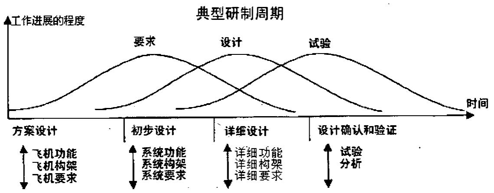

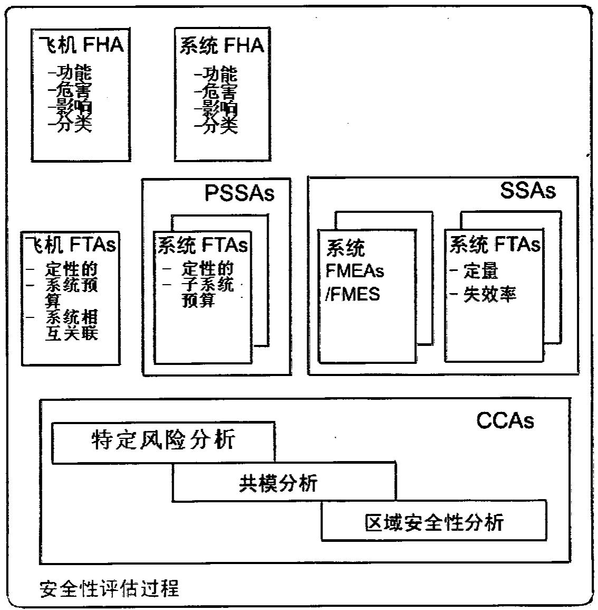  
图1 安全性评估过程概述

表 1 — 失效状态的严重性与概率目标和保证等级的关系  

<table><tr><td>概率(定量的)</td><td colspan="6">每飞行小时1.0 1.0E-3 1.0E-5 1.0E-7 1.0E-9</td></tr><tr><td rowspan="2">概率(说明性的)</td><td>FAA</td><td colspan="2">可能的</td><td colspan="2">不可能的</td><td>极不可能的</td></tr><tr><td>JAA</td><td>频繁的</td><td>相当可能的</td><td>稀少的</td><td>极稀少的</td><td>极不可能的</td></tr><tr><td rowspan="2">失效状态严重性分类</td><td>FAA</td><td colspan="2">较小的</td><td>重大的</td><td>极其重大的</td><td>灾难性的</td></tr><tr><td>JAA</td><td colspan="2">较小的</td><td>重大的</td><td>危险的</td><td>灾难性的</td></tr><tr><td>失效状态影响</td><td>FAA&amp;JAA</td><td colspan="2">-轻微降低安全性裕度-轻微增加机组的工作负荷-给乘员带来某些不方便</td><td>-显著降低安全性裕度或功能能力-显著增加机组的工作负荷或有条件地削弱机组的效率-给乘员某些不舒适</td><td>-大大降低安全性裕度或功能能力-更大的工作负荷或体力疲劳以至不可能依赖机组去准确或全部执行任务-对乘员产生不利影响</td><td>所有失效状态防碍继续安全飞行和着陆</td></tr><tr><td>研制保证等级</td><td>ARP4754</td><td colspan="2">D级</td><td>C级</td><td>B级</td><td>A级</td></tr></table>

注：相对于“无安全性影响”的研制保证等级E，其可覆盖任何概率范围。

# 3.1 (续):

进行FHA的目的在于明确识别每一失效状态以及对其分类基本理由。按设计过程将飞机功能分配到系统后，应使用FHA过程，对综合多重飞机功能的每一系统重新进行检查。更新FHA，以考虑分配到系统的单个飞机功能或组合飞机功能的失效。将FHA的输出用作进行初步系统安全性评估（PSSA）的起始点。

PSSA是对所提议的系统构架进行系统性检查，以确定失效如何引起由FHA予以识别的功能危害。PSSA的目的是建立系统的安全性要求，并确定有理由预期所提议的构架合理可满足由FHA予以识别的安全性目标。

PSSA也是与相关设计定义有关的交互过程。在系统研制的多个阶段（包括系统、组件、硬件/软件设计定义）上进行PSSA。在最低的层次上，PSSA确定与硬件和软件设计要求有关的安全性。PSSA通常采取FTA的形式（也可使用DD或MA)，且还应包括共因分析。

系统安全性评估（SSA）是对所实施的系统进行系统性的和全面的评价，以表明满足从FHA得到的安全性目标以及从PSSA得到的衍生安全性要求。SSA通常基于PSSAFTA（也可使用DD或MA）且使用从失效模式和影响摘要（FMES）得到的定量值。SSA将核实在FMES中识别的所有重大影响都被视为基本事件而包含在FTA中。FMES是通过FMEA所确认的失效摘要，该摘要是根据失效影响将它们集拢分类。SSA也应包含相应的共因分析结果。

每个系统构架确立所实施的特定系统设计的结构和边界。共因分析（CCA）应通过评价整个构架对共因事件的敏感度，支持特定系统构架以及相关系统构架的研制。这些共因事件通过完成下列分析来进行评价：特定风险分析，区域安全性分析和共模分析。飞机级共因分析的结果被输送到每个系统的PSSA和SSA中去。

当对PSSA或SSA进行FTA时，对维修工作指定的失效探测方法和在分析中使用的有关暴露时间必须与被飞机维修大纲规定的维修工作和时间间隔相一致。在许多情况下，失效探测方法通过驾驶舱的操作来提供或在系统内是固有的（例如，被自检测，通电测试等提供）。

# 3.1 (续):

相关图与FTA基本等效，两者相比选择哪一种乃是分析者个人的喜好。在处理逾期维修情况时，马尔可夫分析技术往往是有用的。附录D、E和F分别列出使用FTA、DD和MA的某些优点。

安全性评估过程不只是定量的。它也包括诸如研制保证等级、HIRF和雷击等定性问题的考虑。其中许多被包含在共因分析中（附录I、J和K）。

当SSA的结果相对于系统级和飞机级FHA被证实时，安全性评估过程便告结束。

# 3.2 功能危险性评估（FHA）：

功能危险性评估被定义为对功能进行系统而全面的检查，以鉴别这些功能的失效状态并按其严重性进行分类。FHA通常在两个级别上执行，这分别被称为飞机级FHA和系统级FHA。

飞机级FHA是在飞机研制开始时对所规定的飞机基本功能进行的高层次定性评估。飞机级FHA应识别与飞机级功能相关的失效状态并进行分类。然而，如果单独的系统使用相似的构架或相同复杂的部件并引发涉及多重功能的附加飞机级失效状态，那么，该FHA必须被修改以识别这些新的失效状态并进行分类。这些失效状态的分类，建立飞机必须满足的安全性要求。进行飞机级FHA的目的是明确标识每个失效状态以及对其严重性分类的基本理由。

系统级FHA也是定性评估，这种评估实质上是迭代的过程，且随着系统设计的逐渐进展而变得更加明确和固定。系统级FHA考虑影响飞机功能的失效或系统失效组合。对任何特定硬件或软件项目的评估不是系统级FHA的目的。然而，如果分开的各系统使用相似的构架或相同复杂的部件并引发涉及综合多重功能的附加系统级失效状态，那么，该FHA必须被修改以识别这些新失效状态并进行分类。飞机功能的研制保证等级取决于该功能的失效或研制差错对飞机、机组或乘员影响的严重程度。每个组件的研制保证等级取决于系统构架和该组件相对系统所执行功能所产生的最终失效影响。

在设计过程中将飞机功能分配到系统后，综合了多重飞机功能的每个系统必须使用系统级FHA过程重新被检查。

# 3.2（续）：

飞机级和/或系统级 FHA 的输出是安全性要求产生和分配的起始点。可使用 FTA（DD 或 MA）从进行 FHA 时所识别的那些要求中衍生出较低层次的要求（对于飞机 FHA 为飞机故障树，对于系统 FHA 为 PSSA 故障树）。应锁定这些衍生要求并作为飞机和系统技术规范中的要求。图 2 表明 FHA/FTA/FMEA 之间的总体关系。该图表明 FHA 如何产生 FTA 中的顶事件的示例，该图着重表明从 FMEA 和 FTA 得到的定量结果如何反馈到系统级和飞机级 FTA，以表明符合从 FHA 得到的数值安全性要求。

有关执行 FHA 的详细，参见附录 A。

# 3.3 初步系统安全性评估（PSSA）：

使用PSSA来完成失效状态清单以及相应的安全性要求。也用PASS来证明系统如何满足各种已识别的危害其定性和定量要求。PSSA过程识别保护性策略，计及为满足安全性目标可能需要失效安全理念和构架特性。它应识别并锁定所有衍生的系统安全性要求（例如保护性对策，诸如分区、机内自检测、非相似性、监控、与安全性相关的工作和时间间隔等）。PSSA的输出应被用作SSA和其它文件包括，但不限于系统要求、硬件要求和软件要求的输入。

PSSA是被夹在整个研制过程中的一种迭代分析法。它是开始于设计阶段的初期，将飞机功能及其要求分配到系统级的一种进行式过程。然后，将系统级要求分配到组件，最后将组件要求分配到硬件和软件。对组件的风险分配，将确定硬件的可靠性要求以及相对硬件和软件的研制保证要求（参见ARP4754）。将这些要求和研制保证等级，锁定在组件规范中。

PSSA应从系统FHA中识别出对失效状态有贡献的失效。可使用FTA、DD、MA或其它分析方法来识别导致失效状态可能起作用的因素。在PSSA中应包含硬件失效和可能的硬件/软件差错，以及由共因产生的故障，以表明它们所起的作用以及衍生必要的系统和组件安全性要求。应仔细考虑可能的潜在故障和其相关的暴露时间。

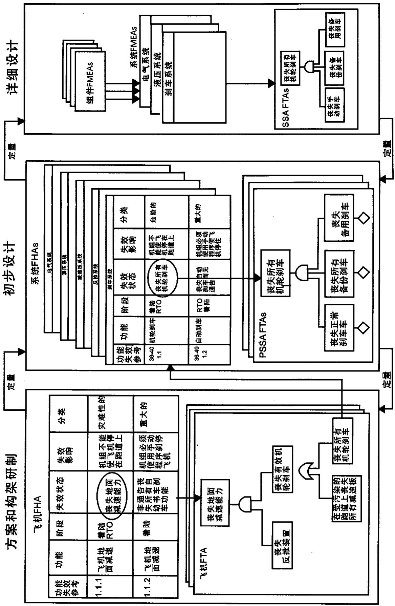  
图2 FHAs与FTA/FMEAs之间关系的例子

# 3.3 (续)：

在本分析的定性方法中包含的硬件和软件差错，表明它们对各种不同失效状态所起的作用以及对导出的研制保证等级能提供有价值的信息（参考ARP4754）。PSSA也能对于软件识别特定与安全性相关的要求，例如抑制边界定义，隔离对策和特定验证对策。应锁定存在的这样一些要求作为系统要求的一部分。

图3安全性评估图的左侧，图解示出推荐的PSSA过程步骤顺序。对于每一评估，并非所有的步骤都是必需的，但必须考虑每个步骤的适用性。下面两段文字对图3的左侧予以说明。注意，不论何处表示的FTA，它都能被诸如DD或MA等等效的分析方法所替代。

PSSA过程有两个主要输入，即系统FHA和飞机FTA。系统FHA给出下一步所需的失效状态和分类。飞机FTA确定关注的功能失效。共因分析（CCA）对飞机FTA作补充，以产生用于系统FTA的顶层失效影响。CCA还建立系统要求，诸如需要由系统设计实施的功能冗余度、功能隔离和功能独立性。

系统级的CCA补充系统FTA的输出，以给出用于组件FTA的组件级顶层失效影响。组件CCA也补充组件FTA，以进一步建立设计要求、研制保证等级以及硬件可靠性要求。已建立的这些要求用作各个组件中硬件和软件的设计规范要求。PSSA的输出是用来识别硬件失效影响、硬件和软件的研制差错影响、可靠性预计以及研制保证等级。PSSA还应确定为满足安全性目标而必需的防护性对策和构架特性。

应由PSSA故障树的基本事件产生的安全性要求，提供给FMEA分析人员。该信息可以采取失效影响和失效率预计的形式，以确保在FMEA中提出特定的失效影响。该信息有助于FMEA分析人员确定FMEA分析的重点和深度。

有关执行PSSA的详情，参见附录B。

<table><tr><td>飞机要求识别</td><td>系统要求识别</td><td>组件要求识别</td><td>组件设计实施</td><td>组件验证</td><td>系统验证</td><td>飞机验证</td></tr></table>

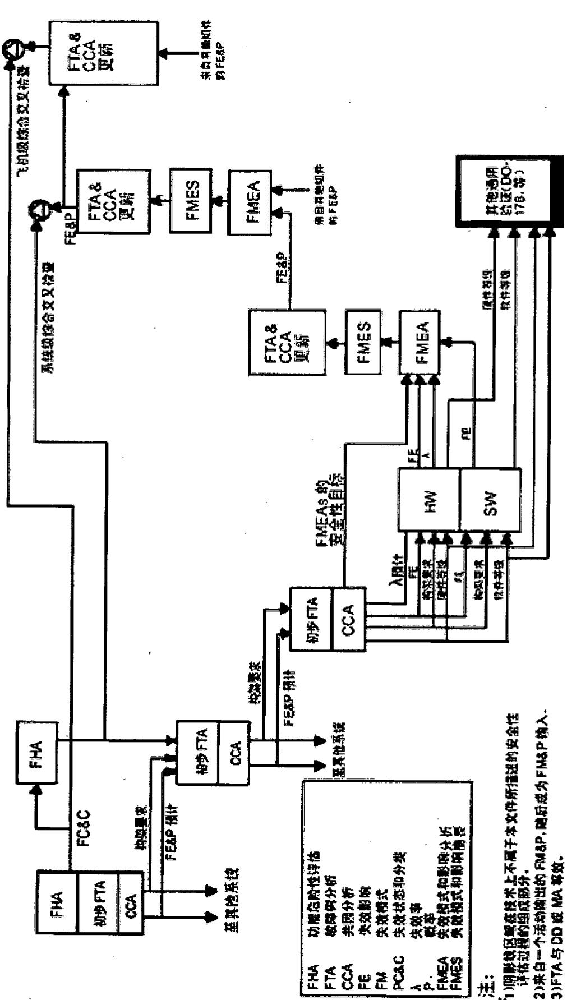  
图3 安全性评估图

# 3.4 系统安全性评估：

系统安全性评估是对所实施的系统进行系统性的综合评价，以表明其满足相关的安全性要求。本分析过程与PSSA的活动相似，但范围有所不同。PSSA与SSA之间的区别在于：PSSA是评价所提议的构架并导出系统/组件安全性要求的方法；而SSA是验证所实施的设计满足在FHA和PSSA中所定义的定性的和定量的安全性要求。

SSA综合各种分析结果，以证实整个系统的安全性并覆盖PSSA中所识别的所有具体的安全性考虑。SSA过程的文档包括相关分析的结果以及其必要的证明。这可能包含如下信息：

a. 以前认同的有关外部事件概率的清单；

b. 系统说明；

c. 失效状态清单（FHA，PSSA）；

d. 失效状态分类（FHA，PSSA）；

e 失效状态的定性分析（FTA，DD，FMES）：

f. 失效状态的定量分析（FTA，DD，MA，FMES，等）；

g. 共因分析；

h. 与安全性相关的工作和时间间隔（FTA，DD，MA，FMES，等）；

i. 硬件和软件的研制保证等级（PSSA）；  
i. 证实从PSSA得到的安全性要求已纳入设计和/或试验过程中；  
k. 非分析验证过程的结果（即试验，演示和检查等活动）。

图3安全性评估过程图的右侧，图解示出所推荐的SSA过程步骤顺序。对于每一种评估，并非所有的步骤都是必需的，但必须考虑每一步的适用性。下面两段文字对图3的右侧予以说明。注意，无论何处表明的FTA，都能被等效的安全性评估方法，诸如DD或MA所代替。

SSA过程的流程一般通过随后的验证等级来提出。通过这些上部层面的验证等级，硬件的可靠性要求，构架要求以及硬件和软件研制保证等级，相对于PSSA过程所描述的安全性要求被验证。较低的设计层面再次被评价，以确定对衍生要求的符合性。应使用DO-178的程序来验证软件编制满足所要求的研制保证等级。申请人对于得到审定当局同意的硬件必须建立适当的研制保证程序。硬件研制保证等级由RTCA-180规定的程序来进行验证。

# 3.4（续）：

执行组件级的FMEA并将其概括成为组件的FMES，以支持在组件FTA/CCA中认定的失效模式的失效率。系统的FMEA被概括成系统的FMES，以支持在系统FTA中认定的失效模式的失效率。系统经由FTA/CCA被评审，以鉴别在飞机FTA中使用的失效模式和概率。飞机FTA/CCA被用于确定与飞机FHA相比较的飞机级失效状态和概率的符合性。当组件被综合到系统以及系统被综合到飞机时，失效影响与FHA中识别的失效状态进行比较。这种比较在图3中称为综合交叉检查。

有关实施 SSA 的详情，参见附录 C。

# 3.5 用于飞机合格审定的验证方法：

对于每一个失效状态，应确定飞机/系统将如何满足安全性目标。图4描述的流程图，对给定的系统失效状态制订验证计划提供了指导。决定评估路线最困难种类是“重大的”（Major）。该流程图就如何处理分类为“重大的”（Major）失效状态的验证提供了某种指导。

# 4. 安全性评估的分析方法：

# 4.1 故障树分析/相关图/马尔可夫分析（FTA/DD/MA）：

故障树分析/相关图/马尔可分析是一种自上而下的分析技术。这些分析通过依次展开更详细（低一级）的设计层次向下进行。

当识别 FHA 中的故障状态后，可将 FTA/DD/MA 用作 PSSA 的一部分，以便确定在可能导致每个失效状态的较低层面上存在的（如果有的话）单一失效或失效的组合。当执行 FMEA/FMES 时，应完成一种比较，以确保识别的所有重大影响在 FTA/DD/MA 中作为基本事件。FTA/DD/MA 的基本事件从 FMEA 和/或 FMES 得到它们的失效率。

有关执行FTA的详情，参见附录D。有关执行DD的详情，参见附录E。有关执行MA的详情，参见附录F。

# 4.1.1 FTA/DD/MA的应用：完整的FTA/DD/MA便于技术和管理方面的评估和审查，因为它仅识别可能单独或共同引发不希望的顶事件出现的失效事件。反之，FMEA仅列出单一失效的清单，其中包括某些可以不予以关注的失效。

FTA/DD/MA 便于将系统级事件细分为方便进行分析的较低层次的事件。

图4 安全性目标验证方法  
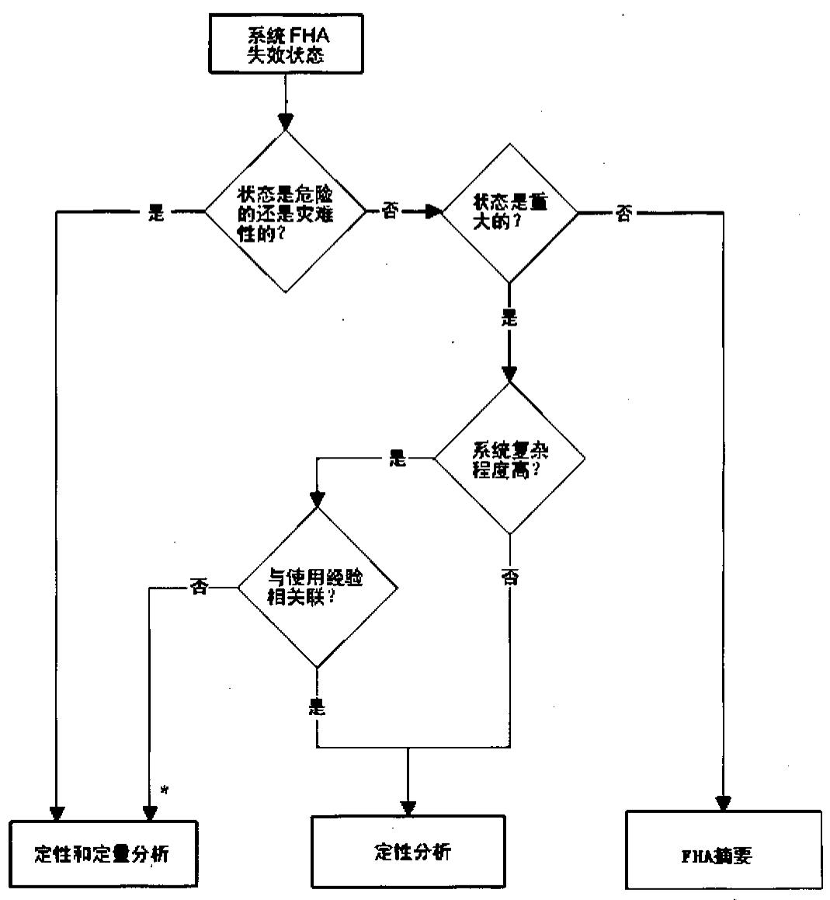  
* 可使用在严格程度和完全程度方面都比灾难性的失效或危险的失效状态分析所用方法要低的方法对重大的（Major）失效状态进行满意的分析（例如包含失效率的FMEA）。

# 4.1.1 (续):

# FTA/DD/MA可用于：

a. 以数量表示顶事件发生的概率；  
b. 评价所提议的系统构架的属性，以便在PSSA过程中确立硬件可靠性预计以及硬件和软件的研制保证等级；  
c. 评估设计修改的影响；  
d. 识别对设计修改的需求和/或识别需要专门关注的独特情况；  
e. 作为 SSA 的一部分，表明对定性和/或定量安全性目标的符合性；  
f. 提供直观的手段，以定性地说明软件对于顶层事件失效状态分类的重要性；  
g. 确定为满足安全性评估要求所必需的机组和维修工作以及时间间隔。

故障树分析使用布尔代数逻辑门，以表示失效影响与失效模式之间的关系。最普通的两种逻辑门是“与”门和“或”门。“与”门表示要求的所有输入同时存在，产生代表更高层事件的输出的情况。而“或”门则表示一个或多个输入，产生代表更高层事件输出的情况。

DD用路径代替FTA中的逻辑门来表示失效之间的关系；并联路径相当于“与”门，而串联路径相当于“或”门。

MA计算现有系统在各种不同状态下作为时间函数的概率。模型中的状态表示作为故障树以及故障部件和系统冗余度两者函数的系统状态。从一个状态转换到另一个状态发生在给定的转换率下，这反映部件的失效率和冗余度。系统由于各种不同的事件例如部件失效，探测到失效后重新构形，完成修理等而改变状态。每个状态的转换是随机过程，该过程用特定的微分方程式表示。模型的不同特性限制在分析中的任何点对从任何规定的状态转换到另一个状态的概率的计算。通过达到该状态所要求的转换组合能计算达到所规定最后状态的概率。

# 4.1.2 FTA/DD/MA中的软件：植入的软件能定性地包含在某些系统和组件的FTA/DD/MA中。特别是FTA/DD/MA对于复杂系统可以要求提供软件安全性问题的充分分析可见度，尤其是当对下列安全性特性提取可信性时：

a. 对软件错误提供失效-安全保护的系统和组件（可通过其它软件或者通过硬件，单独提供保护）；  
b. 由软件对硬件差错或硬件故障提供失效-安全保护的系统和组件；  
c. 由软件对硬件潜在故障提供保护的系统和组件。

# 4.1.2 (续):

当故障树中包含软件时，必须明确建立顶事件的危害和具体的软件异常状态之间的关系。重要的是，明确地识别受影响的功能以及如何影响所规定的预期功能。特定的保护性对策可根据与特定软件异常表现相关的各种不同的可能原因要素来确定。这些保护性对策可包括硬件或软件中的构架机理和/或作为安全性引导研制一部分的特定验证活动（见ARP4754）。

软件错误的发生是随机的，但不具有如硬件失效相同的敏感性。不同于硬件失效，这些概率不可能用定量值来表示。因此，在故障树中，对于软件错误不应用数值和明确的概率来表示。在故障树中的任何软件分析应借助于预防软件错误的研制保证来表达。应仅在定性的基础上对分析的符合性进行评价。

4.1.3 平均暴露时间概率：当进行定量的FTA/DD/MA时，用失效率和事件的暴露时间来估算概率。民用飞机合格审定的概率计算基于对相同型号的所有飞机计算而得的平均概率。相对这些分析的目的，通常假设失效率在整个时间内是一个常数，且用初期损伤之后和耗损以前这段时间的完全失效率来估算。如果耗损或初期损伤是需要考虑的事项，那么需要使用其它方法，例如寿命限制或加速老化。如果不行，则不得不采用其它分布函数（例如韦伯函数）或者可使用蒙特卡洛模拟。但这些都已超出了本文件的范围。进行这些分析时，假设一个典型的平均续航时间并考虑相应的暴露时间和处于风险中的时间，计算出失效状态每飞行小时发生的平均概率。在附录D和F中，对正确确定暴露时间和处于风险中的时间进行了更详尽的讨论。

研制新飞机时，通常按顾客对飞机的要求来确定平均飞行时间。这是一个假设值。当进行现有飞机的改型时，可使用基于服役数据的真实平均飞行时间。

# 4.2 失效模式和影响分析（FMEA）：

FMEA是一种系统性的自下而上的分析方法，该方法用来识别系统、组件或功能的失效模式并确定对接着的更高层次的影响。可在系统内任何层次（例如零部件，功能和黑盒子等）上执行这种分析。使用功能FMEA方法，也可对软件进行定性分析。通常，FMEA用来阐明单一失效所引起的失效影响。

FMEA的范围应与用户对其的要求相协调。分析可以是零部件FMEA或功能FMEA。如果功能FMEA导出的失效率使PSSA的概率预计得以满足，则可不需要零部件FMEA。FMEA通常包含如下信息：

# 4.2（续）：

a. 部件、信号和/或功能的识别；  
b. 失效模式和相关硬件的失效率（数值的或绝对的）；  
c. 失效影响（直接的和/或对接着的更高层次上的影响）；  
d. 探测能力和探测手段；

FMEA也可包含下列信息：

a. 补偿动作（即自动的或手动的）；  
b. 失效发生的飞行阶段；  
c. 失效影响的严重性。

FMEA 可以与概率技术（例如 FTA 或 DD）一起使用，以得出定量分析。此外，通过提供自下而上的失效影响补充清单，FMEA 可用作对 FTA/DD 的补充。

有关执行FMEA的详情，参见附件G。

# 4.3 失效模式和影响摘要（FMES）：

FMES是对产生相同失效影响的各单一失效模式进行的编组（即每一个特有的失效影响具有一个单独的失效模式组）。可由制造商、系统综合商或设备供应商的FMEA汇编而成FMES。此外，FMES应与用户协调，以充分论及更高层次FMEA和/或系统安全性评估FTA的输入需求。

有关执行FMES的详情，参见附件H。

# 4.4 共因分析（CCA）：

可以要求功能，系统或组件之间的独立性，以满足安全性要求。因此，有必要确保这种独立性的存在或确认与独立性相关的风险是可以接受的。共因分析（CCA）提供工具验证这种独立性或识别具体相关性的方法。

特别是，CCA识别可能导致灾难性的或危险的/极其重大的失效状态的各个失效模式或外部事件。对于引起灾难性失效状态的共因事件，应被排除，对于引起危险的/极其重大的失效状态的共因事件，应处于给定的概率预计范围内。

安全性分析必须对分析共因故障给予特殊的关注。[AC/AMJ25.1309]

# 4.4（续）：

将CCA细分为三种分析类型：

a. 区域安全性分析；  
b. 特定风险分析；  
c. 共模分析。

# 4.4.1 区域安全性分析（ZSA）：必须针对飞机的每个区域进行区域安全性分析。该分析的目的是确保设备的安装满足与下列事项有关的安全性要求：

a. 基本安装（应根据相应的设计和安装要求，对安装进行检查）；  
b. 系统之间的干扰（应考虑设备失效的影响与其对处于其物理影响范围之内的其它系统和结构的影响之间的关系）；  
c. 维修差错（应考虑安装维修差错及其对系统或飞机的影响）。

当识别出一种可能损害安全性的影响时，应在区域安全性分析中对其进行关注。这将或者导致重新设计或者在经相应的安全性评估后被表明是可以接受的。

有关执行ZSA的详情，参见附录I。

# 4.4.2 特定风险分析（PRA）：特别风险定义为对于相关系统和组件外部的那些可能违背失效独立性要求的事件或效应。本节表明由适航规章要求进行分析的某些风险的例子，而其它的一些例子则是众所周知对飞机或系统产生的外部威胁。

典型的风险包括，但不限如下方面：

a. 火灾；  
b. 高能装置；  
c.泄漏的流体；  
d. 冰雹、冰、雪；  
e.鸟撞；  
f.轮胎爆裂；  
g 机轮轮缘释放；  
h.闪电；  
i. 高强度辐射场；  
j.气流抽打转轴；

# 4.4.2 (续):

相对考虑中的设计，识别相应的风险，而每一风险都应成为专门研究的主题，以检查和用文件证明每一风险的同时影响或串联影响。

其目的是确保消除任何与安全性有关的影响或确保所示出的风险是可以接受的。

有关执行PRA的详情，参考附录J。

4.4.3 共模分析（CMA）：执行共模分析，以验证FTA/DD和MA中的“与”事件在实际执行中是独立的。应分析设计、制造、维修差错和系统部件失效的影响损害其独立性。对功能的独立性和其各自的监控器必须给予考虑。具有相同硬件和/或软件的组件对在多重组件中，引起不正常工作的同属故障是敏感的。

共模故障能够分成必须进行分析的若干类别。下面是某些共模故障的例子：

a. 硬件差错；  
b. 软件错误；  
c. 硬件失效；  
d. 生产/修理缺陷；  
e. 与环境有关的应力（例如，异常的飞行状态或异常的系统构型）；  
f. 安装差错；  
g. 要求错误；  
h. 环境因素（例如，温度，振动，湿度等）；  
j. 串联故障：  
k. 共同外部原因故障。

有关执行共模分析的详情，参见附录K。

# 5. 与安全性有关的维修工作和时间间隔：

计算与失效状态相关的事件概率时，必须考虑潜在失效可能持续存在而没有被探测出来的时间。

在许多情况下，失效被飞行机组正常的观察或在周期性的通电测试或例行的自检测期间探测出来。这些失效的潜在期是短暂的。然而，在某些情况下，潜在失效的暴露时间与设备的工厂试验或飞机特定的维修工作有关。在这些情况下，潜在期可能是相当长的一段时间。

# 5.（续）：

在PSSA和SSA期间，使用FTA，DD，MA或其它类似的分析方法所确认的维修工作和时间间隔，属于可能的候选合格审定维修要求（CCMR）。凡由飞机维修工作完成探测之处，应将为满足安全性目标而需要的时间间隔传送给相应的维修部门，以便实施所要求的维修程序和时间间隔。可将与安全性要求符合性相关的某些维修检查，称之为“合格审定维修要求”（CMR）。CMR是强制性的周期性工作，为保持飞机的安全性，在飞机设计的合格审定期间确定作为型号合格证的营运限制。按照AC25-19“合格审定维修要求”来确定这些检查。

重要的是注意，与维修评审委员会（MRB）活动有关的MSG-3分析中产生的维修工作和时间间隔相比，CMR从不同的基本分析过程中派生。MSG-3的分析活动产生为安全性、运行或经济方面原因而执行的维修工作，涉及预防性的维修工作且在失效发生前被执行（其意图是预防失效）以及失效探测工作。另一方面，CMR仅是失效探测工作，且单独存在，以限制暴露到其它方面的潜在失效中。

CMR 的目的是验证某个失效已发生或尚未发生，并不提供任何预防性的维修功能。

MSG-3过程通过使用“下一个失效”判据来核查失效路径（例如，假设首个故障已发生，下一个可能发生的最不利事情是什么？）。MSG-3过程一旦完成，则维修评审委员会文件（或MRB）内即确立所要求的最低限度维修。

在成为CMR以前，由合格审定维修协调委员会（CMCC）对一个可能的，称之为候选CMR（CCMR）的CMR进行评审，这将决定该候选CMR能否成为CMR。在AC25-19中对该过程的详情予以描述。

一旦确定，便要求CMR的维修工作，且必须被营运人在由安全性分析导出的规定时间间隔内完成，以继续飞机的适航证。

如果所确认的探测方法由试验来提供，那么必须提供该试验程序事实上探测有关潜在失效的保证。

任何系统设计的根本目标是使CMR的数量保持绝对最少，最好是一个也没有。

# 6. 限时签派（TLD）：

下面的内容包含对规定和控制基于全权数字发动机操纵（FADEC）的动力装置控制飞机签派能力要求当前使用方法的讨论。这里仅包含对该概念提供背景情况。

TLD的概念考虑到任何有效冗余度可得到的效益，允许航空公司在规定的时间间隔内安排维修工作；如果航空公司被要求在下次飞行前排除所有故障，则不会招致可能的延误和/或取消航班。TLD营运以保持平均安全性水平为条件。对于批准TLD营运的推荐过程，要求相对于特定签派构型下风险降低的附加判断标准。

下面讨论有关发动机应用此概念的例子。原则上它适用于已设计包含冗余度的任何系统。

FAR/JAR25.1309协调工作小组正在论及TLD问题。该讨论的结果将确定在飞机设计和营运中使用TLD方法的未来进程。

# 6.1 FADEC的应用

本概念已被应用到双通道发动机全权数字发动机操纵（FADEC）系统相对于单发推力控制丧失（LOTC）的失效状态。

TLD营运是以满足审定当局要求的综合系统运行和足够可靠性为条件的。所得出的每个可签派等级出现哪些故障的清单和允许签派的时间，必须得到审定当局的认同。

有关对电子操纵系统发动机飞机适用的TLD的ARP文件正由SAE E-36委员会制订。该文件将说明MA的使用和分析计算，以便确定对于带着已知不工作的发动机操纵系统组件，飞机可能被签派的时间段。

由SAES-18委员会（机载系统和设备安全性评估）制订。

# 附录A

# 功能危险性评估（FHA）

注：在上下文中，ARP4761 主体文件包含收录入附录 A 内容的信息，故本附录应与该主体文件一起使用。

# A.1 引言：

FHA的目标是考虑最适当级别下的功能以及当考虑功能丧失和功能失常两种情况时，识别失效状态和其相关分类。当失效影响和分类从一个飞行阶段到另一个飞行阶段发生变化时，FHA应识别每个飞行阶段的失效状态。FHA也建立对失效状态分类的功能失效影响所需的衍生安全性要求。这些要求可能包含诸如设计限制，失效状态通告以及推荐飞行机组或维修方面要做的工作等。此外，这些要求可能涉及单一或多重系统。所有安全性要求必须是可追溯的且必须在每个衍生的层面上被认可。完成本工作的一个有效方式是建立基于设计决策的衍生要求表。一旦确认高层次的要求，则它们可被用来产生较低层要求，作为系统或组件PSSA过程的一部分。此过程是连续的，且不断反复进行，直到设计过程完成为止。

FHA有两个级别，即飞机级FHA和系统级FHA。执行这两个级别的FHA，使用相同的原理。

在相应的最高级别上产生的 FHA，取决于全面的知识和经验，并可与许多专家进行磋商。表 A1 是高层次功能及其可能被考虑的相关失效状态的例子。

表A1  

<table><tr><td>功能</td><td>失效状态</td></tr><tr><td>飞行航迹控制</td><td>不能控制飞行航迹</td></tr><tr><td>接地和着陆滑跑控制</td><td>不能控制接地和着陆滑跑</td></tr><tr><td>推力控制</td><td>不能控制推力</td></tr><tr><td>座舱环境控制</td><td>不能控制座舱环境</td></tr><tr><td>提供空间定位</td><td>不能提供空间定位</td></tr><tr><td>防火</td><td>丧失防火功能</td></tr></table>

# A.1（续）：

通过使用 FHA 和故障树，可进一步细分这些失效状态。下面是某些例子。

a. 不能控制飞行航迹：

（1）丧失配平：

(a) 丧失人工配平；  
（b）丧失燃油配平；  
（c）等等。

（2）非主动配平；  
（3）丧失所有液压系统；  
（4）丧失飞行操纵；  
（5）飞行操纵故障；

（a）升降舵急剧偏转。

最后，应定义与安全性相关的失效状态以及各自的安全性目标和所建议的验证符合性方法。对于飞机级安全性要求，应在飞机级FHA中示出验证符合性的方法。对于系统级安全性要求，应使用PSSA来表明验证符合性的方法。

应使用飞机级FHA来支持识别可能的多重系统失效状态，这种失效状态可能具有比预期基于独立的系统分析更高的失效状态分类。

理想情况是建立用于未来设计方案的飞机级通用危险性清单，这样，已知的危险性才不会被忽略。如果这种清单已经存在，则在开展飞机级FHA中应将其用于交叉检查。

# A.2 执行FHA的要求：

FHA是在新的或改型飞机项目上执行的安全性评估过程的第一步。FHA为新的或改型设计建立安全性要求。

# A.3 FHA过程：

FHA过程是一种自上而下识别功能失效状态和评估其影响的方法。按照如下过程进行这一评估：

a.识别与分析等级相关的所有功能（内部功能和交互功能）；  
b. 识别并说明与这些功能相关的失效状态，考虑在正常和恶化环境下的单一和多重失效；  
c. 确认失效状态的影响；

# A.3（续）：

d. 关于飞机的失效影响分类（灾难性的，极其重大的/危险的，重大的，较小的和对安全性没有影响的）；  
e. 向被考虑的低层次失效状态分配要求；  
f. 鉴别证明失效状态影响分类所要求的支持材料；  
g. 鉴别用于验证对失效状态要求的符合性的方法；

图A1和A2说明飞机级和系统级FHA过程的流程。

# A.3.1 功能识别：

应识别与待分析等级有关的所有功能，包括内部功能和交互功能。通过获得必要的原始资料，然后建立功能清单来识别这些功能。

# A.3.1.1 获得必要的原始资料：执行 FHA 过程的第一步是获得必需的原始资料。

飞机级FHA的输入如下：

a. 飞机顶层功能清单（例如升力，推力等）；  
b. 飞机目标和用户需求（例如旅客数量，航程等）；  
c. 初步设计决策（例如发动机数量，常规尾翼等）；

系统级FHA的输入如下：

a. 考虑的主要功能清单；  
b. 表明外部接口的功能图；  
c. 在较高设计层次 FHA 中建立的功能清单；  
d. 在较高设计层次 FHA 中识别的失效状态清单；  
e. 在设计要求和目标文件中定义的要求；  
f. 上层的设计方案选择及其原理。

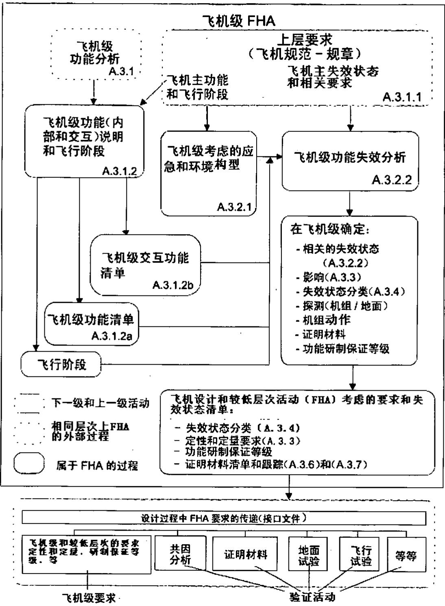  
图A1 飞机级功能危险性评估

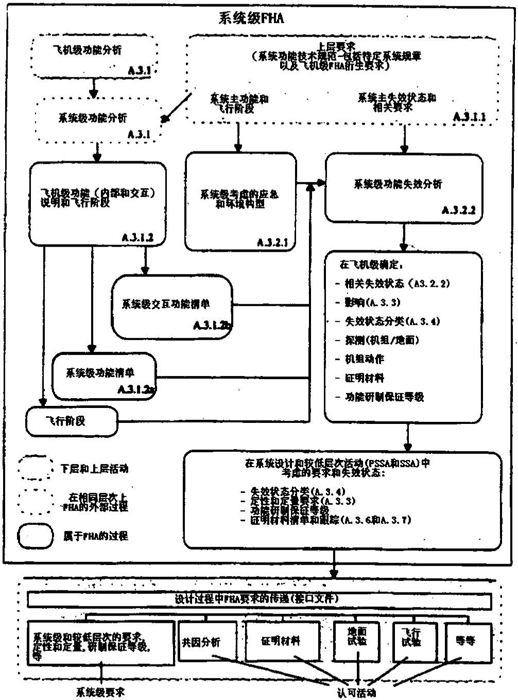  
图A2 系统级功能危险性评估

A.3.1.2 建立功能清单：从预期功能清单开始并考虑原始资料输入，建立FHA的功能清单。

在飞机级或系统级，将功能分配到硬件或软件时，必需列出由于构架设计决策引入的新功能清单。通过列出所有硬件或软件的功能清单，并检查在飞机级或系统级功能清单中包含这些功能，完成此项工作。在此过程中，识别两类功能：

a. 所考虑等级内部的功能（内部功能）：

（1）在飞机级，这些是飞机的主要功能和飞机内部系统之间的交互功能；  
（2）在系统级，这些是所考虑系统的功能以及该系统内部设备之间的交互功能。

b.所考虑等级外部的功能（交互功能）：

（1）在飞机级，这些是与其它飞机或地面系统的接口功能；  
（2）在系统级，对于任何给定系统，这些可能是其它系统所提供的功能或者是提供给其它系统的功能（包括飞机其它系统或地面系统）。

# A.3.2 失效状态的识别和说明：

失效状态的识别过程从建立环境和应急构型清单开始，接着，分析人员考虑内部功能清单、交互功能清单以及环境和应急/非正常构型清单的所有项目。然后，分析人员在考虑正常和恶化环境下单一和多重失效的同时建立起飞机/系统失效状态清单。为了产生这些失效状态和假设，分析人员需要了解可能的失效模式。当这些失效状态的严重性随不同飞行阶段而变化时，应将失效状态细分到各飞行阶段。

A.3.2.1 环境和应急构型清单：当确定失效影响时，除了列出 A.3.1.2 的功能清单外，还必须考虑列出环境条件的清单。在飞机级考虑环境条件的例子包括如下：

a. 天气；  
b. 高强度辐射场；  
c. 火山灰。

# A.3.2.1 (续):

当确定失效影响时，还需列出必须被考虑的应急/非正常状态所导致的飞机构型清单。飞机/系统级的应急/非正常状态的例子如下：

a.水上迫降；  
b. 发动机停车；  
c. 丧失通信；  
d. 座舱失压。

对于系统级FHA，本清单是从源于飞机级FHA或上层FHA以及在初始原理方案设计阶段所作的构架设计决策相应的清单派生的。

附加到上述系统级清单上的应急/非正常情况的例子如下：

a. 丧失液压系统；  
b. 丧失电气系统；  
c. 丧失设备冷却系统。

A.3.2.2 考虑单一和多重失效时，失效效状的确定：建立单一失效状态清单涉及对以前步骤中建立的原始清单的审核，此外，还应用在初始设计过程中建立的原理方案设计分析。多重失效清单的建立，因其要求弄清系统部件的综合以及被分析的系统与飞机其它系统的相互作用，所以更加困难。对飞机和系统构架的了解，有助于该过程。特别当某确定失效的影响取决于另一系统的可用性时，应考虑多重失效。

典型的单个失效状态如下：

a. 功能丧失；  
b. 无通告的功能丧失；  
c. 故障。

典型的多重失效状态如下：

a. 具有三套液压系统的飞机，丧失两套液压系统；  
b. 丧失通信和丧失导航。

# A.3.3 确定失效状态的影响：

分析人员必须确定失效状态对飞机、机组和乘员的影响。分析人员应向人们咨询使用经验，使之对失效状态影响分类有所帮助。在飞机级FHA中，可直接完成此工作。在系统级FHA情况下，飞机级影响可能与系统级影响相同，否则，为确定系统失效状态的影响，分析人员不得不考虑完成相同功能的其它系统的组合影响。

# A.3.4 确定失效状态影响的分类：

通过分析事故/事件数据，查看规章指导材料，使用先前的设计经验，向飞行机组咨询（若适用），来完成失效状态分类的确定。失效状态分类如下：灾难性的，极其重大的/危险的，重大的，较小的和对安全性无影响的（参见本文件主体部分的表1）。

必须保存在确定失效状态影响和分类时使用的支持材料（分析/研究，试验等）的文档，以确保可追溯性，供今后参考。

# A.3.5 考虑较低层次失效状态的概率要求的分配：

对于每个失效状态，分析人员必须分配概率要求和相应的定性设计要求。这些要求以书面形式要求纳入规范（飞机要求、系统要求和组件要求）之中。

# A.3.6 鉴别为证明失效状态影响分类而要求的支持材料：

对于并不十分了解的那些失效状态影响，必须规定额外的支持材料（例如模拟、研究、飞行试验），以确认所选择的分类。

# A.3.7 鉴别对失效状态要求符合性使用的验证方法：

对于每个失效状态，分析人员应确定飞机/系统将如何满足安全性目标。在本文件主体部分图3.5-1（此处原文有错，应为图4）中给出的流程图，就规定相关失效状态所必需的安全性目标验证方法，提供指导。

# A.3.8 先前的经验：

当产生失效状态清单及其分类时，有价值的是如何将此清单与先前相似项目的清单进行比较，作为避免忽略某些较少遭遇的失效状态的附加手段。此外，建立和保存一份通用的清单，作为在 FHA 评审过程中的检查清单也是有价值的。

# A.4 FHA 输出:

# A.4.1 文档：

FHA 过程的结果应被文件证明，以便对在产生 FHA 报告中所采取的步骤具有可追溯性。在 FHA 过程中，如下信息应被文件证明：

a. FHA 输入功能清单；  
b. 环境和应急构型清单；  
c. 在每一等级上对设计的衍生安全性要求；  
d. FHA报告包含如下内容：

（1）功能说明；  
（2）失效状态；  
（3）运行阶段；  
（4）失效状态对飞机、机组和乘员的影响；  
（5）失效状态分类；  
（6）引用的支持材料；  
（7）验证方法（为满足安全性目标而选择的设计解决办法）。

# A.4.2 FHA和PSSA之间的联接：

飞机级FHA的结果和相关的飞机故障树是系统级FHA的输入。系统级FHA的结果是PSSA过程的输入。

PSSA过程的深度将随所分析系统的相关设计，复杂性和失效状态分类发生变化。

PSSA 研究的深度被系统 FHA（即失效状态分类）和所提出的设计解决办法（复杂性、新颖性和综合性）所控制。当严重性和/或设计复杂性增加时，评估/分析的深度也随之增加。

# 附录B 初步系统安全性评估（PSSA）

注：在上下文中，ARP4761 主体文件包含收录入附录 B 内容的信息，故本附录应与该主体文件一起使用。

# B.1 引言：

初步系统安全性评估（PSSA）过程是对所提出的系统构架进行系统性核查，以确定失效如何能导致由功能危险性评估（FHA）所识别的功能危险性，以及如何能够满足FHA的要求。PSSA过程与设计定义相互作用并且相关。正如设计过程是迭代过程一样，PSSA过程也是迭代过程。PSSA过程在整个设计周期中是连续的。

对于被分析的每个系统，PSSA 阐明在 FHA 中所识别的所有重要的失效状态。分析方法既可是定性的，也可是定量的。

可能有一个以上级别的PSSA。最高级别的PSSA是从飞机级和/或系统级FHA展开的。较低层面的PSSA是从较高层面PSSA的输出展开的。

本附录自始至终都使用故障树作为参考。这种情况应被为了达到同样目的，但由于所期望的资料细节和类型的限定而可能选择相关图或马尔可夫分析的读者所理解。

# B.2 执行PSSA的要求：

进行PSSA的决策，取决于构架设计、复杂性、失效状态（或失效影响）的严重性以及被分析系统所执行的功能类型。对于PSSA的要求，应从飞机级或系统级FHA的输出，按照本文件主体部分的图4所规定的验证方法来确定。

# B.3 PSSA 过程:

PSSA是一种自上而下的方法，以确定失效如何能导致由FHA识别的功能危险性，以及如何可满足FHA要求。按照如下过程进行评估：

# B.3 (续):

a. 完成飞机级和系统级安全性要求清单；  
b. 确定所提出的构架、所制订的原理方案设计计划是否能被合理期望满足安全性要求和目标；  
c. 导出有关较低层次组件（硬件和软件）设计、飞机安装、其它系统和使用（飞行和维修工作）的安全性要求；

图B.1说明PSSA过程的流程。

# B.3.1 完成飞机级和系统级安全性要求清单：

飞机级FHA/CCA过程产生一组有关飞机设计的初始安全性要求。同样，系统级FHA/CCA过程产生一组有关系统设计的初始安全性要求。在PSSA过程中使这些初始安全性要求和设计/构架决策结合起来，产生一组完整的系统要求。

# B.3.1.1 获得必需的原始资料：PSSA输入是飞机和/或系统级FHA，初步共因分析（CCA），以及在PSSA中考虑的每个系统构架的说明。对于每个构架方案选择，这些输入可包含：

a. 在飞机和/或系统级 FHA 中所识别的失效状态和要求；  
b. 系统构架说明以及选择的合理性；  
c. 系统设备清单和功能；  
d. 与其它系统的接口和关联;  
e. 初步共因分析：

（1）区域安全性分析（ZSA）发现的问题；  
（2）特定风险分析（PRA）的外部威胁；  
（3）共模分析（CMA）发现的问题。

在飞机/系统级 FHA 期间所作的各种假设必须相对 PSSA 中所考虑的每个构架被证实是适用的。

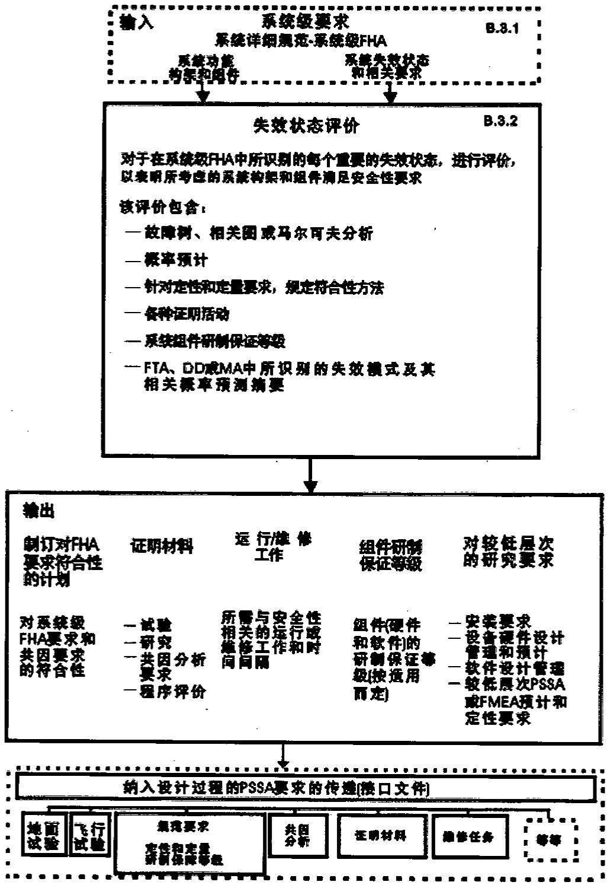  
图B1 系统级PSSA过程

B.3.1.2 完成系统安全性要求：在系统构架中，组件（硬件或软件）中功能的执行或者功能的综合可能产生新的功能，这种情况应在 FHA 中被考虑，以便导出新的失效状态。设计实施也可能衍生新的要求（例如隔离要求和运行要求）。这些新要求和新失效状态可能要求 PSSA 或 FHA 范围内的附加证明材料。

B.3.2 相对产生的安全性要求和目标评价设计/构架决策：

在完成系统FHA要求后，应如本文件主体部分图4所示，对所识别的每一极其重大的/危险的和灾难性的失效状态进行评估。评估应：

a. 使用故障树分析或类似方法，表明组件的失效组合如何导致所考虑的失效状态；  
b. 通过鉴别下列方面的情况，来识别与在故障树分析中提出的独立性要求相关的所有要求：

（1）在共因分析调查研究期间的所有隔离/隔开要求以及相关验证要求；  
（2）为验证独立性而进行的试验（地面试验或飞行试验）。  
（3）共因失效（区域安全性分析，特定风险分析，共模分析）。

c. 使用故障树分析或类似方法，表明与失效状态相关的定性和定量要求和目标能被所提出的系统构架和预测的失效概率满足；  
d. 确定在故障树分析中考虑潜在失效引起“不得逾期”维修工作的时间间隔（可能存在于研究中的飞机，或系统/组件设计寿命中且没有超过FTA数值允许量的潜在失效将不产生“不得逾期”的维修工作时间间隔）；  
e. 确定故障树分析中所考虑组件的研制保证等级。

（注：必要时，对于重大的（Major）和较小的（Minor）失效状态可以使用上述方法进行评价。）

在设计过程中，当组件级的详细研究结果还不是完全可得到时进行本评价。因此，PSSA失效状态评价应部分依赖工程判断以及相似设计的使用经验。该过程是迭代性质的，且随着设计的进展变得更加完善。

# B.3.3 衍生较低层组件的设计安全性要求：

应将系统级所导出的每个设计安全性要求，分配到组成该系统的组件。这些分配包含：

a. 更新的失效状态清单，包含安全性要求（定性的和定量的）如何能被所选择的构架满足的基本原理；  
b. 分配给组件（硬件和软件）的安全性要求（定性的和定量的）；  
c. 关于安装设计的要求（隔离，分开，保护等）；  
d. 硬件和软件的研制保证等级；  
e. 安全性维修工作以及相应的“不得逾期”的时间。

在PSSA故障树分析中所识别的失效模式和有关概率预测应被用作启动较低层详细研究的要求。

# B.4 PSSA输出：

# B.4.1 文档：

PSSA过程的结果必须用文件证明，以便形成PSSA报告所进行工作的每一步具有可追溯性。具有保存价值的某些信息包含如下：

a. 制订对 FHA 要求符合性方法的计划；  
b. 更新的 FHA;  
c. 支持失效状态分类的材料清单；  
d. 失效状态清单；  
e. 较低层面的安全性要求（包含研制保证等级）；  
f. 定性的FTA;  
g. 初步CCA;  
h. 运行要求（飞行和维修）。

# B.4.2 对较低层次PSSA的输出：

可在系统级以下的层次上实施PSSA。对较低层次PSSA的输入，是在较高层次FHA/PSSA期间所识别的重要失效影响、定性要求，预计的概率以及研制保证等级。收到这些输入后，较低层次PSSA过程与上述各节所描述的相当。

# B.4.3 PSSA 和系统安全性评估（SSA）之间的联接：

PSSA的输出是SSA过程的输入。

# 附录c

# 系统安全性评估（SSA）

注：在上下文中，ARP4761 主体文件包含收录入附录 C 内容的信息，故本附录应与该主体文件一起使用。

# C.1 引言：

系统安全性评估（SSA）是对系统、系统构架以及系统安装，进行系统性核查，以表明其符合安全性要求。对于不同层次上所实施的每一PSSA，应存在相应的SSA。最高层次的SSA是系统级SSA。对于所分析的每个系统，SSA摘要所有值得注意的失效状态以及其对飞机的影响。用于表明符合性的分析方法既可是定性的，也可是定量的。

本附录自始至终都使用故障树作为参考。这种情况应被为了达到相同目的，但由于所期望的资料细节和类型的限定而可能选择相关图或马尔可夫分析的读者所理解。

# C.2 执行 SSA 的要求：

执行一项分析的要求随被分析系统的设计、复杂性以及所履行功能的类别而变化。这应由相关的PSSA来确定。

# C.3 SSA 的过程：

SSA 过程是作为验证设计的安全性要求和目标已被满足的一种自上而下的方法。图 C1 说明系统级 SSA 过程的流程。本评估完成下列各项内容：

a. 验证系统级 FHA 中所确立的设计要求被满足；  
b. 认可所确定的飞机级影响分类是正确的；  
c. 验证由飞机设计要求和目标引出或衍生的安全性要求被满足；  
d. 验证在 CCA 过程中所确认的设计要求被满足；  
e. 系统级 SSA 和飞机级 FHA 的连接。

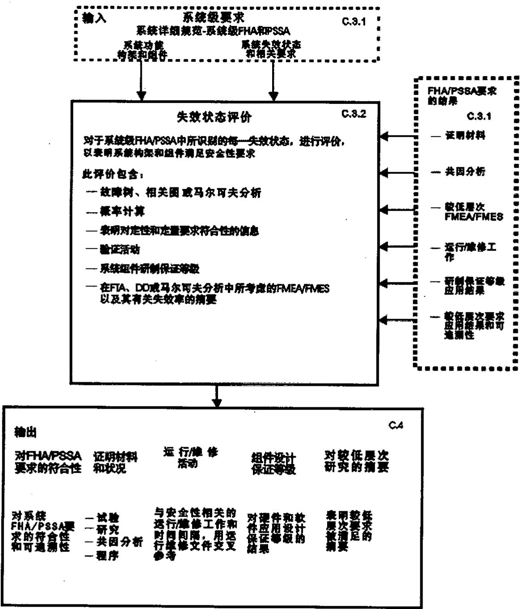  
图C.1 系统级SSA过程

# C.3.1 FHA 设计要求的验证：

# C.3.1.1 获得必要的原始资料：对 SSA 的输入如下：

a. 系统构架说明和相关设计原理；  
b. 系统接口以及其与相邻系统组件的相互作用；  
c. 在系统级 FHA/PSSA 中识别的要求和失效状态；  
d. 从系统级 FHA 得到的功能和相关原理的清单；  
e. 共因分析结果：

（1）ZSA的结果；  
（2）PRA的外部威胁；  
（3）CMA的结果。

f. FHA/PSSA中所要求的所有支持材料和较低层次研究的结果（从组件供应商得到的FMEA/FMES、飞行试验、研究等结果。）。

# C.3.2 失效状态评价：

在FHA中识别的每个失效状态应按照本文件主体部分的图4进行评价。应从如下方法中进行选择来开展评价工作，以便：

a. 使用故障树分析，表明组件失效组合如何引发所考虑的失效状态；  
b. 使用故障树分析，表明与失效状态相关的定性和定量要求和目标被满足；  
c. 检查维修文件，以证明被在故障树分析中所考虑的潜在失效引起维修工作的“不得逾期”时间间隔已被MRB包含（不是所有潜在失效都引起“不得逾期”的维修时间间隔。）；  
d. 验证由故障树分析导出的组件研制保证等级已被满足；  
e. 对状态进行试验，确保对要求的符合性；  
f. 证明飞机按预期给定的失效状态执行。

C.3.2.1 对失效状态分类的认可：应证明在 FHA/PSSA 中所确立的要求与规定这些要求的文件之间的可追溯性。这些文件包含如下：

a. 飞机设计要求和目标文件；  
b. 系统要求文件；  
c. 试验计划（地面试验，飞行试验等）；  
d. 维修手册；  
e. 共因分析文件；

完成本工作的方法之一是建立表明要求和其相应认可证明的矩阵。

C.3.2.2 验证在飞机要求文件中所鉴别的安全性要求被满足：飞机要求文件包含该机设计的所有要求。这包括 FAR/JAR 以及公司的所有要求。对这些要求的验证采用 4 个标准方法中的一个或多个（即试验、分析、证明和检查）来实现。  
C.3.2.3 验证在CCA中识别的设计要求被满足：CCA文件包含有关系统和部件隔离和隔开（从区域安全性分析得到）、外部威胁（从特定风险分析得到）以及共模失效（从共模分析得到）的要求。这些要求必须被4个标准方法中的一个或多个（即试验、分析、证明和检查）来验证。  
C.4 SSA 的输出:  
C.4.1 文件:

SSA过程的结果应被文件证明，以便在产生SSA报告中所进行的每一步工作都具有可追溯性。具有保存价值的某些信息包含如下：

a. 包含表明对安全性要求（定性的和定量的）符合性基本原理，更新的失效状态清单或FHA；  
b. 表明系统组件安装设计要求如何被具体体现的文件；  
c. 用于认可失效状态分类的材料；  
d. 安全性维修工作以及相关的“不可逾期”时间；  
e. 表明系统和组件（包括硬件和软件）如何按照所规定的研制保证等级实施研制的文件。

# C.4.2 系统级 SSA 与飞机级 FHA 的连接：

为了结束安全性评估过程，应相对于系统级和飞机级 FHA 两者的基本要求，对每个 SSA 进行评审。应相对于飞机级 FHA 的失效状态和分类，验证飞机级失效影响和其发生的概率。

# 附录D

# 故障树分析

注：在上下文中，ARP4761 主体文件包含收录入附录 D 内容的信息，故本附录应与该主体文件一起使用。

# D.1 引言:

故障树分析是一种演绎性的失效分析法，该方法集中在一个具体的不希望事件上，并提供一种确定引起该事件原因的方法。换句话说，故障树分析是一种自上而下的系统评价程序，在该程序中，针对某一特定的不希望事件，形成定性模型，然后进行评价。分析人员从一个不希望的顶层危险事件开始，在下一个可能产生该事件的较低层次上，系统性地确定系统功能块的所有可信单个故障以及失效组合。分析向下展开，相继通过更细化（即较低一层）的设计层次，直到揭示出初级事件（Primary Event）为止或直到满足该顶层危险事件要求为止。初级事件（Primary Event）被定义为由于这样或那样的原因而不能作进一步展开的事件（即，不必为表明待分析的系统符合相应的安全性要求而将该事件分解为更细化的层次）。初级事件（Primary Event）可能是待分析系统内部的或外部的，并且可能是由于硬件失效/差错或软件差错所引起。

当确认详细到足以满足顶层危险要求时，分析人员便终止FTA分析。

故障树图解表示法是分层的，并且按其展示的分支而命名。这种格式使该分析方法成为工程和合格审定当局两方面的一种可视性工具。作为确保系统/设备完成其预期安全性功能的安全性评估技术家族中的一员，故障树分析涉及到确保设计安全性状况被识别并受到控制。

# FTA的用途包括：

a. 方便于技术/合格审定当局进行评估和评审（完整的故障树仅展示可能单独或共同导致不希望顶事件发生的失效事件）；  
b. 评估设计更改对其安全性的影响；  
c. 定量表示顶事件发生的概率；  
d. 对下层事件分配概率预计；

# D.1（续）：

e. 通过提供一种定性和定量混合评估的格式，察看研制差错的影响；  
f. 评估单一故障或多重故障的影响；  
g. 评估暴露时间间隔、潜伏时间以及处于风险中的时间间隔对系统的全面影响；  
h. 可能的共因边界可见性;  
i. 评估共因故障的源头；  
j. 评估失效-安全设计特性（故障容限和差错容限）。

# D.2 范围：

本故障树分析附录包含对一名有经验的工程师初次执行故障树分析所必需的背景资料和程序指南。虽然，本附录包含有关FAT的基本信息，但是，读者可能还需参考“故障树手册”（美国原子能管理委员会，文件号NUREG-0492）以及详细讨论FTA结构和数学计算方法的其他出版物。

# D.3 FTA 在安全性评估中的作用:

在系统原理方案设计阶段（PSSA过程的一部分，参见主体文件3.3）或系统原理方案形成之后（SSA过程的一部分，参见主体文件3.4)，应进行故障树分析；外观相似的自上而下的FTA分析，可使其详细程度分别与所建议的或现时的设计详细程度相匹配。

设计冻结后的FTA修订取决于设计更改的程度。由于FTA初级事件（Primary Event）失效率基于失效模式和影响摘要（FMES），如果硬件设计更改导致故障率变化反映在FMES中，那么将要求FTA更新。在飞机飞行计划的后期阶段，应再次对故障树分析进行评审；对于包含由飞机试验计划所引起的任何设备设计更改的FTA，通常要求将其作为该设备合格审定支持文件的一部分。

图D1给出典型的FTA时线示例。注意，该图仅是一个示例而已；在研制民用飞机机载设备系统过程中所涉及到的所有参与人，在安全性评估过程开始时，应决定有关FTA产生的具体时间线。

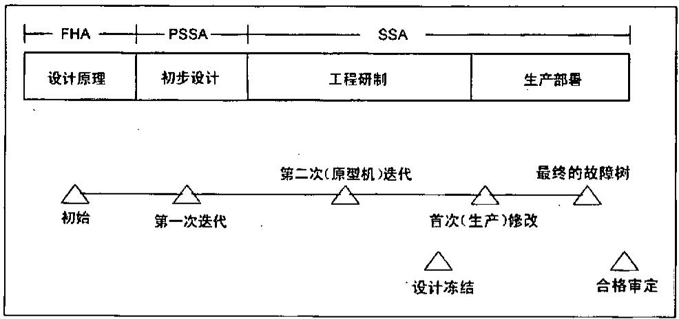  
图D1 典型的FTA时线示例

# D.3 (续):

在上述示例中：

a. 作为 FHA 过程的一部分，执行“初始”FTA，以确定系统失效组合和系统故障率预计的分配；  
b. “首次迭代”可能包括由于返工所引起的故障树更改或随要求确认过程而对分析人员某些初始假设进行澄清所引起的故障树更改。执行此FTA，作为系统构架选择过程的一部分。在此过程中发生向下一级事件分配风险和概率预计值；  
c. “第二次（原型机）迭代”包括由硬件和软件细化设计过程中所获得的认识而引起的故障树更改。在方案的这一阶段，1）将来自失效模式和影响摘要（FEMS）或其他源头的失效率信息插入故障树初级事件（Primary Event）；2）计算顶事件失效概率，以及3）将这一失效概率与相应的安全性要求进行比较，作为设备设计验证过程的一部分。本版次故障树成为成功完成“设计冻结”计划节点所需支持文件的一部分；  
d. “首次（生产）修改”包括基于原型机试验过程中所暴露的问题而导致硬件或软件设计更改所引发的故障树更改；

# D.3 (续):

e. 然后分析人员通过综合由于飞行试验（基于对硬件或软件所采取的纠正措施）所引起的任何故障树更改，建立最终的故障树。本版本故障树则成为完成合格审定计划里程碑所需系统安全性评估文件的一部分。

# D.4 故障树符号和定义：

所有的故障树由两类符号即逻辑符和事件符所组成。符号的常规作用是使故障树简化，所使用的不同类型的符号越少，故障树评审人员则越易于理解它。逻辑符号用来将故障树的各分支连接在一起。在故障树中逻辑符号不应直接连接在一起，它们的输入和输出应始终是事件。

所用两种主要逻辑符号乃是布尔（Boolean）逻辑“与（AND）”门和“或（OR）”门。仅当所有的下一层条件皆为“真”时才可能出现不希望顶事件时，分析人员选择“与”门。如果下一层条件中的任何一个或多个条件为“真”即可能出现不希望顶事件时，则使用“或”门。分析人员也可使用其它的布尔逻辑门，只要系统构架许可使用这些逻辑门类型。

最常用的事件符号包括长方形、三角形、椭圆形、圆形、房形以及菱形（参见图D2）。长方形包含逻辑符号输出或一事件的说明。三角形表示信息转移并由两种类型组成。顶端有垂线的三角形符号表示信息（事件以及其相应的发生概率）转入的故障树部位。侧边引出水平线的三角形符号表示该三角形连接的事件转出到故障树的另一个分支。椭圆符号表示一条件事件，其定义某一故障模式出现的必需条件（通常与优先与门和禁门一起使用）。例如，“监测器首先失效”是一个条件事件，因为可通过未被检测的系统传播不可靠数据之前这是必需的。

圆形、房形以及菱形都表示初级事件（Primary Event）类型。圆形符号表示基本事件（Basic Event）。基本事件（Basic Event）定义为被分析系统的内部事件，不需要进一步展开（即，具有引起故障发生的能力），并且仅对于硬件元素，可赋予其对定量评定所必需的失效率预计值或者来自FMES或其它源头的实际失效率。

房形事件是通常预期会发生的事件。这一事件具有下列两种可能的状态：

a. 事件已发生；  
b. 在探查期间该事件将不发生。

房形事件的功能类似于一个开关，用于包括部分故障树或将部分故障树排除在外，其可应用于某些情况，或不可应用于某些情况。

<table><tr><td>符号</td><td>名称</td><td>定义</td></tr><tr><td></td><td>说明框</td><td>说明某个逻辑符号或某个事件的输出。</td></tr><tr><td></td><td>与门</td><td>布尔逻辑门一所有的下一层条件都为“真”时,事件可能发生。</td></tr><tr><td></td><td>优先与门</td><td>布尔逻辑门一所有的下一层条件按规定顺序出现时,事件可能发生(通常由条件事件来表现顺序)。</td></tr><tr><td></td><td>或门</td><td>布尔逻辑门一如果任何一个或多个下一层条件为“真”时,事件可能发生。</td></tr><tr><td></td><td>禁门</td><td>输出故障只在可行条件事件存在时发生(单个)输入故障的情况下才发生。</td></tr><tr><td></td><td>转移门</td><td>表示信息转移。</td></tr><tr><td></td><td>基本事件(Basic Event)</td><td>待分析系统内部的事件,不需要进一步展开。</td></tr><tr><td></td><td>房形事件</td><td>待分析系统外部的事件,其将发生或将不发生(Pf=1或Pf=0)。</td></tr><tr><td></td><td>不展开事件</td><td>不进一步展开的事件,因为其对顶事件影响很小,或因为不易于获得对事件进一步展开所必需的细节。</td></tr><tr><td></td><td>条件事件</td><td>发生某个故障模式所必需的条件。</td></tr></table>

图D2一故障树符号

# D.4 (续):

菱形符号表示一个不展开事件。不展开事件定义为不作进一步展开的事件，因为其对顶事件的影响被忽略不计，或因为不易于获得对事件作进一步展开所必需的细节。常常将这类事件加到故障树上，为的是从定性模型观点出发，使故障树完整。与初级事件（Primary Event）相关的软件通常采用不展开事件形式。

许多FTA计算机软件包还具有附加的符号，对该特定的FTA软件包，它们通常是唯一的。分析人员可使用图D2中并未出现的其他符号，只要对这些符号作出合适的定义。

本附录中所使用的数学符号包括：

$\lambda$  每小时的失效率（通常是每飞行小时，也可能是每运行小时）；

T 检查时间间隔；

与具体初级事件（Primary Event）相关的暴露时间或处于风险中的时间；

$\mathsf{P}$  或  $\mathsf{P}_{\mathsf{f}}$  在时间t期间发生事件或失效的概率。

# D.5 故障树分析实施概述：

实施故障树分析要求6个基本步骤：

1. 定义FTA目标和分析深度：

具体地说一故障树是否用于确定失效事件预计（PSSA过程的一部分）？是否用于验证系统设计对已建立的安全性要求符合性（SSA过程的一部分）？是否对故障树作定性评价或定量评价或定性和定量评价。定义FTA目标有助于分析人员确定FTA的范围。

2. 定义所要求的分析层次：

分析人员实施分析应进入到系统多深（即哪个层次）？是否为实施多层次FTA而要将系统细分？就确定FTA的范围以及定义如何报告FTA结果而言，知道分析深度是重要的（即与步骤5密切相关）。D6节包含有关分析定义的更多信息。

# D.5 (续):

# 3. 定义不希望事件：

这种不希望事件既可直接与 FHA 连接，又可与另一故障树内的初级事件（Primary Event）连接，只要该系统被细分为多个层次（即多层次 FTA 内边界组合）。如果不希望事件是一个大事件的分支，则在将次级故障树组合回复到一起时，应引起注意的是：在将这些次级故障树组合到一新故障树上之前，必须对如此组合的所有次级故障树进行独立性评审。还应说明不希望事件的故障率预计（注：即使分析是定性的，故障率预计也是数字的）。D7 节包含有关定义不希望事件的更多信息。

4. 汇集当时可得到的最完整的系统数据，并且对其进行分析，以确定引发项事件可能的故障和失效事件以及事件组合：

D8节包含有关这一步骤的更多信息。

5. 构建与第3步不希望事件有关的故障树：

D9节包含有关故障树构建的信息。

6. 分析并综述FTA结果：

D10节到D13节包含有关分析故障树并综述其结果的更多信息。

# D.6 FTA 分析定义:

故障树可用于完成下面所列的主目标：

# 1. 在PSSA过程中：

a. 当以  $P_{f}$  定量目标为工作对象时，分配失效概率  $(P_{f})$  （也称之为  $P_{f}$  预计）。PSSA故障树上所预计的失效概率，与该故障树数学所要求的概率数值相比，可能更严格（即，一个更低的概率）；  
b. 当以定性的失效-安全目标为工作对象时，建立系统构架设计要求。

# D.6（续）：

2. 在 SSA 过程中：

a. 验证对PSSAFTA确立目标的符合性：

分析人员能以系统内任何一个约定层次上的目标为工作对象。约定层次定义为多层次FTA中的任何一个层次。分析人员将需要确定FTA的边界。该边界主观上将基于分析人员通过实施FTA分析想要或需要完成什么。表D1列出若干可能的约定层次以及它们的可能边界。注意，在FTA边界栏内所描述的信息，表示一种可能的分析边界（即，分析人员在执行自上而下的FTA时，应考虑最低层次的设计细节）。分析人员应选择基于分析范围的边界。可考虑下列项目：系统的输入和输出是什么？应包括怎样的支持系统细节？是否应包括人为差错？是否应包括软件错误？等等。

所选择的FTA边界，与如何报告故障树评价结果密切相关。

# D.7 不希望顶事件的确定：

分析人员应编制一份不希望事件的清单。每一不希望事件都应成为某一故障树中的顶事件。依据分析人员正在处理的系统约定层次，这些顶事件可能具有不同的起因。表D2给出基于本文件主体部分所描述的安全性评估流程图的某些源头。

# D.8 系统信息汇集：

分析人员应汇集可得到的最完整的和现时的系统数据。分析人员应对这些数据进行分析，以确定引发项事件的可能的失效事件或事件组合。分析人员应从下列2个主源头获得信息：

a. 系统作用流程方框图；  
b. 设计说明文件或设计要求文件。

应记住，为了使FTA成为确定系统安全性准则的有效工具，分析人员应在设计进展过程中进行分析，而不是在其后才进行分析。

# D.8.1 评审系统功能流方框图：

分析人员应评审系统功能流方框图。系统功能流方框图将提供有关飞行成功判据和系统相互关联的信息。在本文件上下文中，“系统”一词系指飞机或支持设备的任何集合；例如，推进系统、发动机分系统，或自动驾驶仪LRU。为了确定可能引发某特定故障树顶事件的单一失效或失效组合，分析人员必须具有与该待分析系统密切相关的知识。

表 D1 FTA 边界示例  

<table><tr><td colspan="3">FTA</td></tr><tr><td>约定层次</td><td>FTA边界</td><td>该约定层次的FTA特性</td></tr><tr><td rowspan="2">飞机</td><td rowspan="2">飞机方框图</td><td>FHA/PSSA:对组成飞机级功能的各种主要系统预计Pf。</td></tr><tr><td>FHA/PSSA:识别引起或促成飞机级失效状态的失效影响。</td></tr><tr><td rowspan="2">系统</td><td rowspan="2">系统方框图</td><td>FHA/PSSA:对系统内的组件预计Pf。</td></tr><tr><td>SSA:将组件失效率(直接取至组件可靠性预计分析)用于初级事件(Primary Event)定量评价。</td></tr><tr><td rowspan="2">组件</td><td rowspan="2">组件功能方框图</td><td>PSSA:对组件内的各功能块预计Pf(即分配硬件和软件功能)。</td></tr><tr><td>SSA:当定量评价过程中整个组件的失效率太大而不能验证对安全性要求的符合性时,则使用特定重要线路组的失效率(例如,芯处理器功能—CPU、振荡器、存储器等的失效率)。</td></tr><tr><td rowspan="2">组件功能块</td><td>组件原理简图</td><td>PSSA:在组件功能块范围内,对各功能电路以及它们各自的监测器预计Pf。将设计保证等级分配给软件功能元素。</td></tr><tr><td>软件功能元素</td><td>SSA:当定量评价过程中某个线路组的失效率导致对安全性要求的不符合性时,则使用特定重要部件的失效率(例如,ARINC429接收机的失效率)。分析人员能够利用硬件部件失效模式以及其发生的百分比。</td></tr></table>

表 D2 顶事件的源头  

<table><tr><td>FTA约定层次</td><td>顶事件的源头</td></tr><tr><td>飞机</td><td>飞机功能 FHA</td></tr><tr><td>系统</td><td>系统 FHA
和/或飞机功能 FHA
和/或飞机功能 FTA</td></tr><tr><td>组件</td><td>系统 FTA</td></tr><tr><td>组件功能块</td><td>组件 FTA</td></tr></table>

# D.8.2 评审设计说明/要求文件：

分析人员应汇集所有现有的系统资料并对其进行分析，以确定可能引发该特定故障树顶事件的可能的失效事件或事件组合。可能的源头包括系统构架说明文件，各系统、硬件和软件的设计规范和说明文件以及设计者和分析人员自身拥有的与系统密切相关的知识。

# D.9 故障树的构建:

为了构建故障树，应遵循如下4个步骤：

1. 以清晰、简明的陈述，叙述不希望的顶事件（以及其失效概率目标值或失效率目标值，按适用而定）；  
2. 展开故障树的上层和中间层，确定对于引发项事件而言为直接、必要和充分的最少中间失效和失效组合，并用相应的故障树逻辑符号将它们相互连接。延伸每一故障事件到下一更低的层次；  
3. 向下展开每一故障事件，相继通过更细化的各系统设计层次，直到确定根本原因或者直到确信不必要再进一步展开为止；  
4. 确立失效概率预计，或失效率预计，评价该系统对安全性目标符合的能力，并且如果确信有必要，对系统进行重新设计。

或

以定性和/或定量的方式评价故障树（SSA过程）。

# D.9.1 陈述故障树的不希望的顶事件：

本节阐明构建故障树的第一步。

1. 以清晰、简明的陈述，叙述不希望的顶事件（以及其失效概率目标值，如果适用）。

分析人员应将故障树顶事件填入说明框。这一陈述应鉴别不希望的事件是什么以及其何时发生。对于大多数故障树，已在 FHA 或另一个更高层故障树中鉴别出这一项事件，而只需要复制到长方形的事件符号中。在其它情况下，分析人员在将不希望事件的陈述填入说明框内之前，则需要使该陈述清晰易懂。

必须清晰并简明地叙述不希望事件，因为其为分析人员在构建各种层次故障树时将询问的一系列问题定调。表D3提供一些不良用词的示例以及相对SSAFTA的经修改项事件的陈述。在PSSA期间，“经修改的陈述”栏内所叙述的信息类型是不适用的。

表 D3 不希望事件陈述的示例  

<table><tr><td>不良用词陈述</td><td>陈述中的问题</td><td>经修改的陈述</td></tr><tr><td>丧失空速指示</td><td>太含糊，故障到底是“什么”？一是指丧失主空速，丧失辅助空速，还是丧失这两者。</td><td>驾驶舱内丧失所有空速显示。</td></tr><tr><td>显示易误解的进近数据而无失效通告</td><td>太含糊，故障发生在何处？一是在两台导航显示器上还是仅在一台导航显示器上。</td><td>两台导航显示器显示易误解的进近数据而无失效通告。</td></tr><tr><td>在单个驾驶员主飞行显示器上显示易误解姿态而无失效通告</td><td>说明了是“什么”，但未说明“何时”一如果认为发生在所有飞行阶段，这一事件是“重大”类失效状态。如果认为发生在抬前轮后的起飞过程中，这一事件是“危险/极其重大”类失效状态。在定量评估中“何时”定义为相对于\(P_f\)使用的时间间隔。</td><td>在抬前轮后的起飞过程中，在单个驾驶员主飞行显示器上显示易误解姿态而无失效通告</td></tr></table>

# D.9.2 展开故障树的上层和中间层:

本节阐明构建故障树的第二步。

2. 展开故障树的上层和中间层，确定对于引发项事件而言为直接、必要和充分的最少中间失效和失效组合，并用相应的常用故障树逻辑符号将它们相互连接。延伸每一故障事件到下一更低的层次。

分析人员应构建故障树的上层（见图D3）。每一故障树从该特定故障树的某个顶事件（其是先前定义过的事件，参见D9.1）开始。分析人员应通过考虑下列问题，将此故障树延伸到每一较低层次。

a. 是否存在将要导致所列事件成“真”的任何单一失效？  
b. 是否存在将要导致所列事件成“真”的任何多重失效组合？

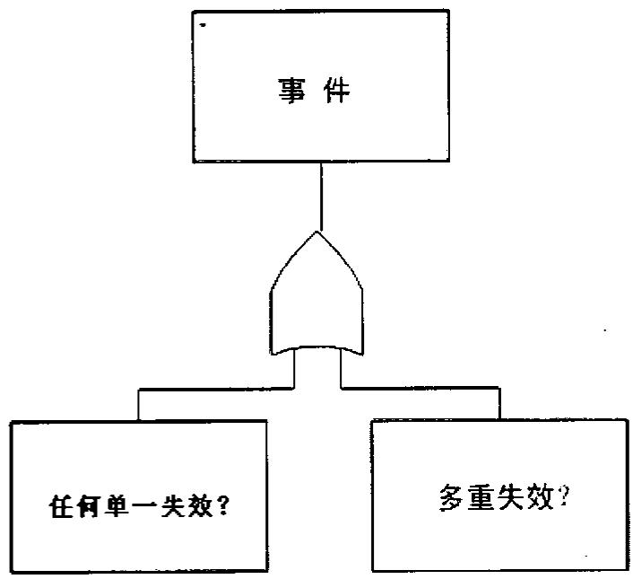  
图D3基于初始问题的故障树上层连接

# D.9.2（续）：

如果不存在任何单一失效而存在多重失效的组合，则该故障树的第一层可能画成如图D4所示。

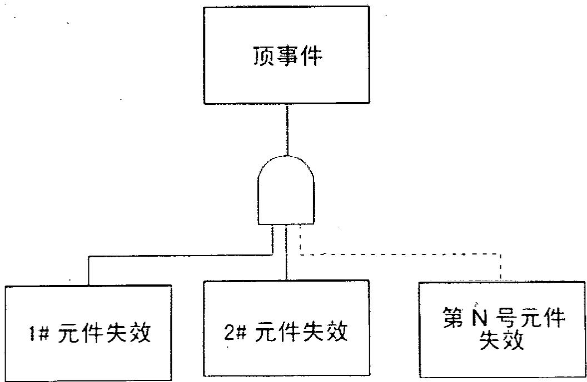  
图D4系统中无单一失效威胁的故障树上层

# D.9.2（续）：

多重失效组合可以取决于其失效的具体顺序。这些事件则定义为失效顺序相关事件（也称之为顺序事件）。失效顺序相关事件应作为输入，按其必须遵循的失效顺序，从左到右，画在“与”门上。在上面的图中，如要使该事件发生，则系统的第一和第二个元件必须在其第N个元件之前失效，此外“与”门可包括另一个不展开事件输入，该输入表示第N个元件将按该顺序失效的概率。描述失效顺序相关事件的另一个方法是随同一条件事件一起，使用优先与门。有关详情，参见D.11.1.4。

例如，假设上面的系统具有3个元件。应画出如图D5所示的故障树第一层。

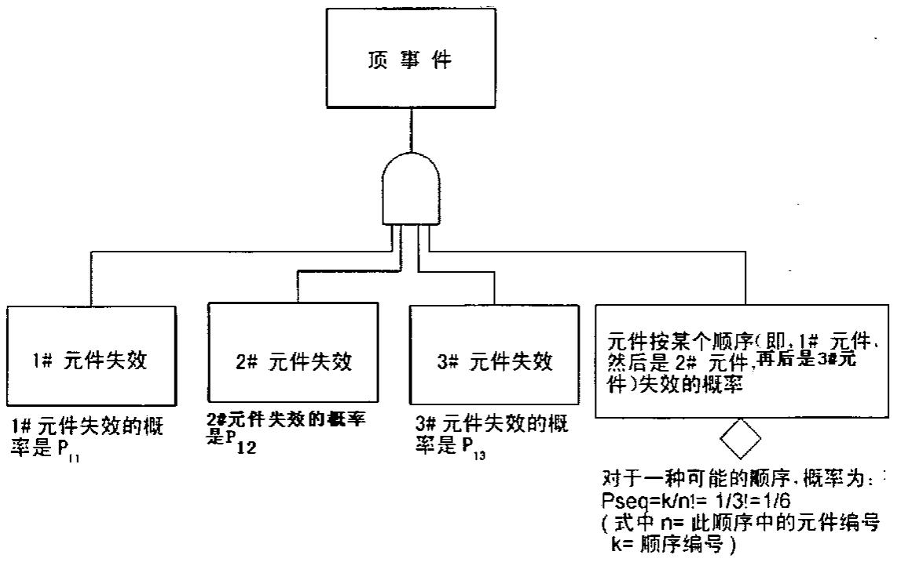  
图D5 考虑到失效顺序的故障树上层

# D.9.2（续）：

n！（阶乘）术语表示可能发生的事件顺序数。对于本示例，可能的事件顺序是 $\mathsf{P_f1P_f2P_f3}$  ，  $\mathsf{P_f1P_f3P_f2}$  ，  $\mathsf{P_f2P_f3P_f1}$  ，  $\mathsf{P_f2P_f1P_f3}$  ，  $\mathsf{P_f3P_f1P_f2}$  和  $\mathsf{P_f3P_f2P_f1}$  。

接着，分析人员应在考虑上述有关事件或失效影响问题的同时，自上而下地展开该故障树，实际上，在每一新层次上，也参照执行。在考虑基于多重失效的失效-安全事件时，分析人员应考虑由不正确的输出和不起作用的保护机构或重新构型机构所带来的影响（如图D6所示）。

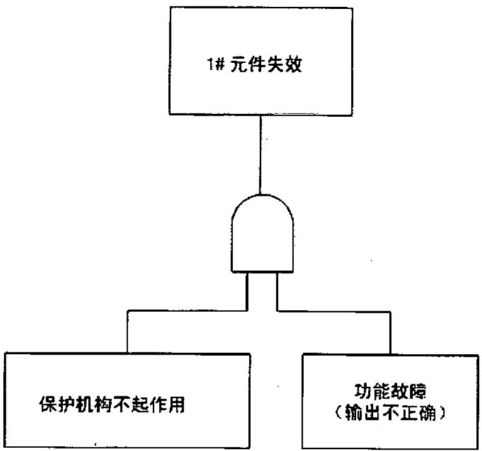  
图D6展开与失效-安全系统元件有关的故障树事件

在构建故障树的整个工作过程中，分析人员必须确保遵循预先规定的命名约定，以便使从事某个给定系统分析研究的每个人，按相同的方式构建故障树。当选择某个命名约定时，分析人员应牢记3件事：

a. 该命名约定必须避免事件之间出现矛盾，即两个不同的事件不得具有相同的名称，而相同的事件必须具有相同的名称。这对于正确简化布尔代数至关重要；  
b. 命名约定不得过于隐含，否则阅读该故障树的人们，为辨认此名称而不得不经常查看某种表格。

# D.9.2（续）：

c. 命名约定必须是可维持的，即建立具有充分扩展潜力的命名约定，以便不会因为其命名约定不允许今后增加若干新的事件，而不得不返工来重新命名所有的事件。

如果使用FTA软件包来构建故障树，则这一预先规定的命名约定必须与该软件包兼容。某些软件包为了标识属于逻辑门输出的中间事件而要求待命名的逻辑门。

# D.9.3 向下展开顶事件分支到初级事件（Primary Event）：

本节阐明构建故障树的第三步。

3. 向下展开每一故障事件，相继通过更细化的各系统设计层次，直到确定根本原因或者直到确信不必要再进一步展开为止。

分析人员应进一步展开故障树，并通过向下延伸故障树分支到初级事件（Primary Event）（即基本事件、外部事件以及不展开事件），完成故障树。这些初级事件（Primary Event）是第一级故障事件的根本原因。

根本原因应是已分解到为确定系统设计对安全性目标的符合性所必需详细程度的硬件失效/差错或软件错误。这里，随着FTA目标值对FTA范围的影响，而使FTA目标变得明显。如果FTA目标是定性评价，则不需要进一步汇集有关初级事件（Primary Event）的信息（除非分析人员确定需要作进一步的详细定性分析）。如果FTA目标是定量评价，分析人员应汇集有关初级事件（Primary Event）的更详细信息（硬件失效率以及处于风险时间或暴露时间）。

在本附录中，展开4个包含有或不含有潜伏期和要求顺序系数基本事件（Basic Event）的示例，以展示故障树表示法。在D11.1.5中对详细的数学计算作进一步解释。

D.9.3.1 2个组件失效引起功能丧失的示例：图D7所示出的第一个示例故障树，表明单一失效情况，此处，顶事件是由于同一飞行过程中丧失两个组件而引发。已知两个组件在飞行开始时都运行，并且都无失效潜伏期。该两个失效可按任一顺序发生。

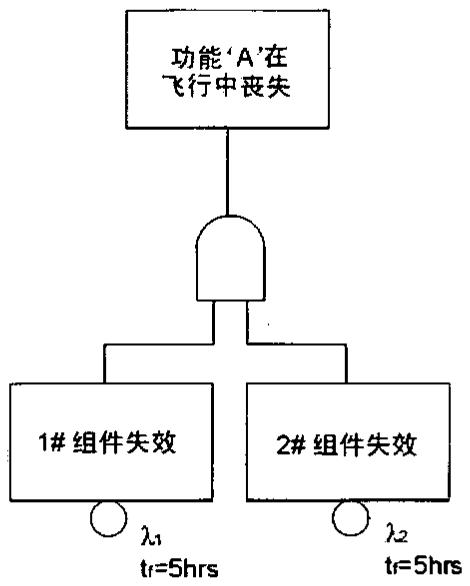  
图D7 两个组件失效引发某功能丧失的故障树结构示例

D.9.3.2 2个组件失效引起功能丧失而其中一个组件可能潜在失效的示例：在第2个示例中，1#组件可在其受检查时（时间  $= 0$ ）和在其下一次受检查时（时间  $= T$ ）之间的任一时间点上失效。已知2#组件在每次飞行开始时是运行的并且绝对不会潜在失效。失效顺序无关紧要。在图D8中给出一示例故障树。

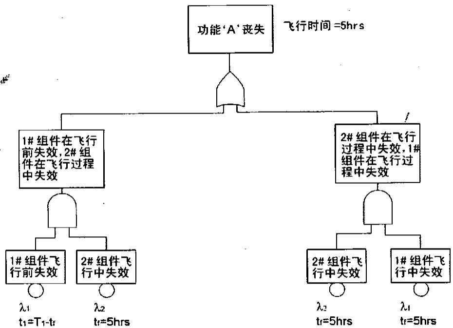  
图D8 两个组件失效引发功能丧失而其中一个组件可能潜在失效的故障树结构示例

D.9.3.3 2个组件失效引起功能丧失而其中每一组件可能潜在失效时的示例：在第3个示例中，任何一个组件都可能潜在失效，但如果两者都失效，借助于引发顶事件的后果，应能检测到此情况。因此，在飞行开始时，至少有一个组件必须在运行。在图D9中给出一示例故障树。关于此故障树图，必须注意3件事：

1. 不要求有关失效顺序（即如图D5中所示，  $\mathsf{ROF} = \mathsf{k} / \mathsf{n}$  ！并在D11.1.4中详细说明）的不展开事件，因为通过潜伏周期  $(t_{n} = T_{n} - t_{f})$  ，将失效顺序相关性建立在故障树构造中。这是在飞行前的潜伏期内失效的代表。  
2. 最右边的“与”门对于覆盖在飞行过程中两个组件不要求顺序失效是必需的。

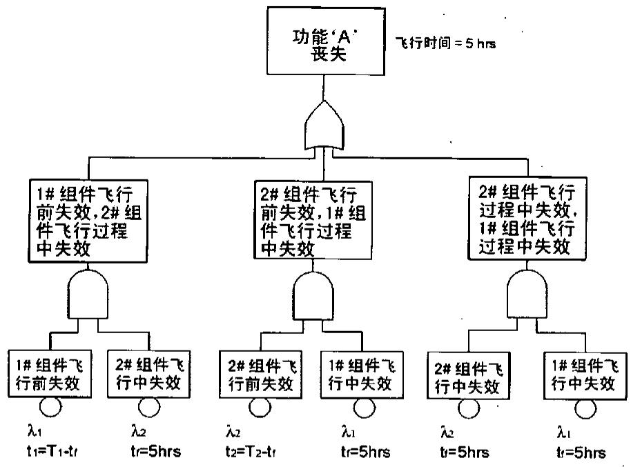  
图D9 2个组件失效引起功能丧失而每一组件可能潜在失效的故障树结构示例

# D.9.3.3 (续):

3. 对于  $t_f$  比检验时间间隔小得多的情况，最右边的“与”门常常被省略并且暴露时间设定值等于检查时间间隔。

D.9.3.4 两个组件失效引发顶事件，而其中一个组件可能潜伏失效并且失效是顺序相关的示例：在第 4 个示例中，1#组件（潜伏失效者）必须在 2#组件之前或顶事件未产生之前失效。已知 2#组件在飞行开始时是功能正常的。这是顶事件属于不正确输出而不是功能丧失的一种典型失效/监测情况。在图 D10 中，给出一个涉及到不正确数据传送的示例。

按D11.1.4，使用要求的顺序系数（ROF）。

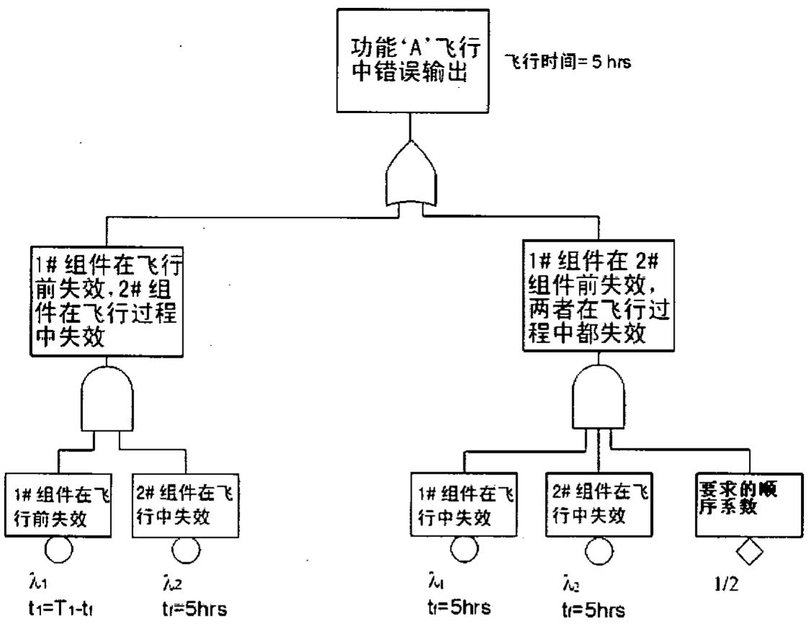  
图D10两个组件失效引发项事件，而其中一个组件可能潜在失效并且失效是顺序相关的故障树结构示例

# D.9.4 评价故障树对安全性目标的符合性：

本节阐明构建故障树的第四步。

# 4. 以定性或定量的方式评价故障树：

就故障树构造的本质而言，其为定性模型。依据FTA的目标，分析人员将按定性方式或定性和定量相结合的方式来评价故障树（当故障树包含硬件失效以及研制错误（硬件和软件）时，分析人员的定量评价实际上是两种方法的结合）。表D4综述这两种评价方法的结果。分析人员应看到在确定FTA目标时，此表是有用的。在D.10和D.11节中将分别对定性评价和定量评价作进一步的阐述。

表 D4 FTA 定性和定量评价技术和结果摘要  

<table><tr><td>定性</td><td>定量</td></tr><tr><td>最小割集</td><td>数值概率</td></tr><tr><td>引发系统失效的部件失效组合</td><td>系统和割集失效的概率</td></tr><tr><td>定性重要性</td><td>定量重要性</td></tr><tr><td>影响系统失效的定性顺序，直接原因与经由失效-安全而起作用的因数之比较</td><td>影响系统失效的定量顺序</td></tr><tr><td>共因可能性</td><td>敏感性评价</td></tr><tr><td>最小割集对单一失效原因的潜在敏感性</td><td>模型和数据更改、误差确定所带来的影响</td></tr></table>

# D.10 故障树定性评价：

故障树定性评价产生最小割集。可将这些割集用于确定定性重要性并用于评价共因的潜势。

下面各节仅给出对了解该主题内容所必需的最小数量信息。有关这些技术的更多详情以及完整的解释，参见“故障树手册”（NUREG-0249）或大量有关故障树评价主题的类似书籍。

# D.10.1 故障树最小割集的确定：

故障树最小割集乃是为使不希望的顶事件发生而必须全部发生的那些初级事件（Primary Event）的最小集合。

为避免定性和定量分析时发生严重的差错，分析人员必须知晓在两个或两个以上初级事件（Primary Event）之间没有独立性的可能性。凡是相同事件出现在故障树的一个以上位置或某些单一失效可能同时导致一个以上的失效事件时，则这种“没有独立性”可能出现。当已知关联性时，由出现在故障树中一个以上位置处的同一事件（或逻辑门）将其建模，并且运用布尔代数正确进行处理，以产生割集。对于在高层面故障树（凡初级事件（Primary Event）由单独的故障树衍生而作为顶事件之处）中，一个事件可能出现在一个以上那样的单独故障树之中的情况，应引起注意。如果这种情况出现，在高层面故障树中不能看到相关性，并且有关高层面故障树的概率计算将是不正确的。如要在这种情况下获得精确的计算，必须要用它们相应更细化的故障树结构来替代衍生而来的初级事件（Primary Event）。这使共同事件在整个高层面故障树中正确地建模，以便可获得精确的割集清单和概率计算值。

# D.10.1（续）：

当不同的初级事件（Primary Event）在给定的故障树上仅出现一次时，分析人员可以对该故障树使用“直接分析”。然而，对于大多数民用机载系统，情况不是如此。逻辑符号规定该计算如何基于下列概率计算的基本规则来进行（NUREG-0492 更详细地阐明这一主题）。

a. 得到结果 A 的概率用 P（A）表示，得到结果 B 的概率用 P（B）表示，对于其它结果，依次类推；  
b. 发生 A 和 B 的与门运算概率用 P（AB）表示；  
c. 发生 A 和 B 的或门运算概率由 P（A+B）表示；  
d. 如果 A 和 B 是两个概率为 P（A）和 P（B）的独立事件，则两个事件都发生的概率是乘积：

P（AB）=P(A）*P(B)——适用于两个输入的“与”门。

e. 如果 A、B 和 C 是三个概率为 P(A)、P(B) 和 P(C) 的独立事件，则所有三个事件都发生的概率是乘积：

P（ABC）=P(A）*P(B）*P(C)——适用于有三个输入的“与”门。

f. 对于 4 个或 4 个以上独立事件，可采用同样的逻辑；  
g. 如果两个独立事件可能同时发生，则或者 A 或 B 或者 A 和 B 发生的概率是：

$\mathsf{P}(\mathsf{A} + \mathsf{B}) = \mathsf{P}(\mathsf{A}) + \mathsf{P}(\mathsf{B}) - [\mathsf{P}(\mathsf{A})*\mathsf{P}(\mathsf{B})]$  适用于有两个输入的“或”门。

h. 如果三个独立事件可能同时出现，则A或B或C或者这三者的任何组合发生的概率是：

$\mathsf{P}(\mathsf{A} + \mathsf{B} + \mathsf{C}) = \mathsf{P}(\mathsf{A}) + \mathsf{P}(\mathsf{B}) + \mathsf{P}(\mathsf{C}) - [\mathsf{P}(\mathsf{A})*\mathsf{P}(\mathsf{B})] - [\mathsf{P}(\mathsf{A})*\mathsf{P}(\mathsf{C})]$  一[P（B）*P（C)]+[P(A）*P(B）*P(C)]一一适用于有三个输入的“或”门。

对于4个或4个以上的独立事件，可采用同样的逻辑。

# D.10.1（续）：

i. 如果两个事件相互排斥，致使当一个事件发生时，另一个则不发生，则有关两个输入的“或”门的方程简化为：

$$
\mathbf {P} \left(\mathbf {A} + \mathbf {B}\right) = \mathbf {P} \left(\mathbf {A}\right) + \mathbf {P} \left(\mathbf {B}\right) \quad \text {而 且} \mathbf {P} \left(\mathbf {A B}\right) = 0
$$

此方程对于两个低概率的非相斥事件，也是一个良好的近似计算（误差偏保守）。

作为直接分析的示例，考虑图D11中的故障树。

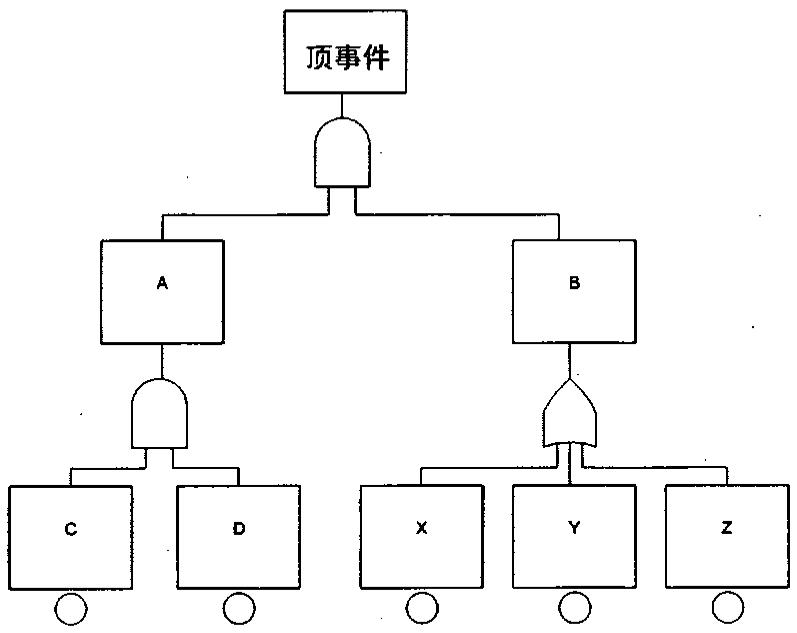  
图D11 演示直接分析技术的故障树

# D.10.1（续）：

由图D11：

P(A)  $= = P(C)*P(D)$  [C和D是独立事件];

P(B)  $= = P(X) + P(Y) + P(Z)[X,Y$  和  $\mathbf{Z}$  是互斥事件]；

$$
P (t o p) = = P (A). * P (B) = [ P (C) * P (D) ] * [ P (X) + P (Y) + P (Z) ].
$$

如果初级事件（Primary Event）在给定的故障树上出现一次以上，则分析人员必须对该故障树结构进行布尔分析。根据这些相同初级事件（Primary Event）在故障树上的位置，未通过布尔分析作首次故障树简化的“直接分析”，将导出不希望顶事件概率，或者大于或者小于该事件的真实概率。

作为通过布尔分析来简化故障树的一个示例，考虑图D12中的故障树结构。

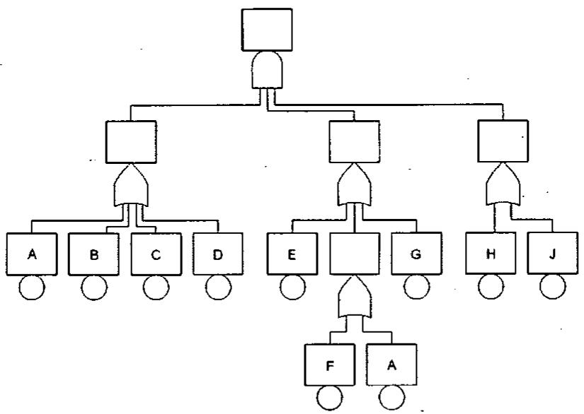  
图D12 演示布尔简化技术的故障树

# D.10.1（续）：

布尔简化遵循如下步骤：

a. 使用直接分析法，确定外显的顶事件（top）。使用术语“外显的”是因为事件A位于该故障树的两个分支上。

$$
\operatorname {t o p} = (\mathrm {A} + \mathrm {B} + \mathrm {C} + \mathrm {D}) * (\mathrm {E} + \mathrm {F} + \mathrm {A} + \mathrm {G}) * (\mathrm {H} + \mathrm {J});
$$

b. 为得出由*号隔开的各项，对上面的方程做乘法运算：

$$
\begin{array}{l} \text {t o p = A E H + A F H + A A H + A G H + B E H + B F H + A B H + B G H + C E H + C F H + A C H +} \\ \text {C G H + D E H + D F H + A D H + D G H + A E J + A F J + A A J + A G J + B E J + B F J + A G J +} \\ \text {B G J + C E J + C F J + A C J + C G J + D E J + D F J + A D J + D G J ;} \end{array}
$$

c. 对已展开的FTA方程，应用下列布尔逻辑规则：

（1）  $A + A = A$  ，（2）  $A*A = A$  ，（3）  $A + AK = A$  ，（4）  $AAK = AK$

通过使用上述逻辑，采取减少项中元素的数目并减少总的项数，确定故障树最小割集。对第二步的方程，应用布尔逻辑：

$$
\begin{array}{l} \text {t o p = A E H + A F H + A A H + A G H + B E H + B F H + A B H + B G H + C E H + C F H + A C H +} \\ \text {C G H + D E H + D F H + A D H + D G H + A E J + A F J + A A J + A G J + B E J + B F J + A G J +} \\ \text {B G J + C E J + C F J + A C J + C G J + D E J + D F J + A D J + D G J} \end{array}
$$

重写该方程，得出故障树最小割集。注意，删除了12项，并且有两项，项内元素数目，由3变成2。

$$
\begin{array}{l} \text {t o p = A H + B E H + B F H + B G H + C E H + C F H + C G H + D E H + D F H + D G H + A J + B E J + B F J +} \\ \text {B G J + C E J + C F J + C G J + D E J + D F J + D G J} \end{array}
$$

d. 采用最小割集方程范围内的首个结合项，画出简化的故障树（任选的步骤）。简化故障树如图 D13 所示。

$$
\operatorname {t o p} = (\mathrm {J} + \mathrm {H}) * [ \mathrm {A} + (\mathrm {E} + \mathrm {F} + \mathrm {G}) * (\mathrm {B} + \mathrm {C} + \mathrm {D}) ]
$$

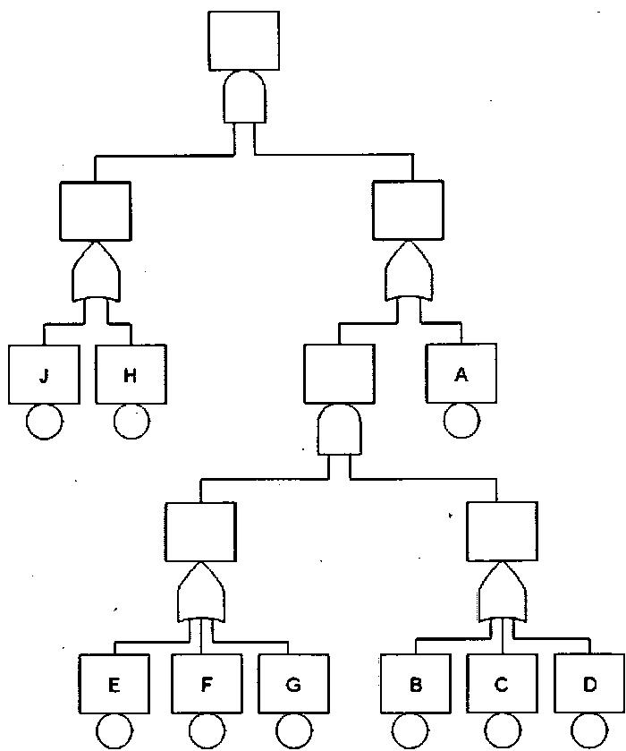  
图D13 简化的故障树

# D.10.1（续）：

从商业渠道购得的许多故障树分析软件包，当给出适当指令时，将自动生成割集。一旦画出了简化的故障树，分析人员必须验证表示独立事件真实结合的所有“与”门。在执行FTA数值计算之前，这一步非常重要。

# D.10.2 定性重要性的确定：

为了得到各割集如何影响不希望顶事件的某种概念，分析人员可使用被称之为定性重要性的方法来评价故障树。定性重要性是根据割集内初级事件（Primary Event）数目按增加的顺序对各割集的简单排序。这一方法，基于初级事件（Primary Event）在割集中出现多少次以及与其它初级事件（Primary Event）怎样结合，使分析人员看到各个初级事件（Primary Event）对于顶事件的发生而呈现的相对重要性。此FTA评价技术以硬件失效/研制差错、软件研制错误以及两者在同一故障树上的结合为工作对象。

假设分析人员想要通过定性重要性来评价某一故障树。首先，按上面所述，对割集进行排序。这一序列使分析人员知道顶事件是否存在任何相关的单点失效以及任何一个初级事件（Primary Event）多少时间促使顶事件出现一次。

此外，通过对与基本事件（Basic Event）相关的所有硬件，假设一个标准的失效率值（例如，1E-06）和一个标准的暴露时间（例如，100hr），分析人员可得到有关某一割集相对重要性的粗略估计值。例如，使用前句所提供的值，有两个基本事件（Basic Event）的割集具有失效概率（ $\mathrm{P_f}$ ）为1E-08，有三个基本事件（Basic Event）的割集具有失效概率（ $\mathrm{P_f}$ ）为1E-12。使用该粗略估计值技术，分析人员可很快作出结论，有5个或5个以上基本事件（Basic Event）的割集，对顶事件失效概率的相对影响非常小。

与这一评价方法有关的缺点列举如下：

a. 如果分析人员在高于部件层次的约定层次上具有与基本事件（Basic Event）有关的硬件，为了得到一个相当的失效概率数值用于  $\mathsf{P}_{\mathrm{f}}$  估算，应进行额外的可靠性分析；  
b. 从一个基本事件（Basic Event）到另一个基本事件（Basic Event），基本事件（Basic Event）的暴露时间可有很大的变化，因为存在许多因素，诸如，监测循环时间、监测暴露时间、维修间隔时间等。因此，用于衡量一个割集对另一个割集的加权相对重要性的估算失效概率不比粗略估计值更好。暴露时间变化可能意味着在估算的失效概率与定量获得的失效概率之间存在2或3个数量级的差别。

# D10.3 共因脆弱性：

使用称之为共因敏感度（归纳为一份共因可能性清单）的方法，也可对故障树作定性评价。共因敏感度基于这样的事实，即割集提供一份将会引起顶事件发生的初级事件（Primary Event）组合的有限清单。分析人员可通过检查每一割集，得到顶事件对共因失效如何敏感的概念。如要归类为共因失效，则单一失效必须引发该割集中一个以上的初级事件（Primary Event）。因此，与具有不相似初级事件（Primary Event）的割集相比，具有相似初级事件（Primary Event）的割集可能对共因失效更敏感。

# D.10.3（续）：

例如，假设1#割集具有3个初级事件（Primary Event），它们都具有相同CPU件号，位于一个3重相似余度构型系统内。假设2#割集也具有3个初级事件（Primary Event），它们具有不同CPU件号，位于一个3重非相似余度构型系统内。通过检查这两个割集，分析人员可方便地确定，与2#割集相比，1#割集对类似于通用微码错误的共因故障，具有更高的可能性：

应对每一共因失效可能性进行检查，以确定是否已经存在将会引起这些失效组合发生的单个原因，并引发所列出的事件。应分析这些共因故障的可能性，只有当它们不能被设计排除在系统之外时，才应将它们放置在故障树上。

共因分析应阐明共因故障以及一般错误。附录I，J和K包含有关执行共因分析的更详尽的信息。

# D.10.4 硬件和软件研制保证等级的确定：

作为PSSA的一部分，故障树的最小割集可用于协助确定硬件和/或软件的相应研制保证等级。

在确定硬件和/或软件的相应研制保证等级时，如果考虑系统构架，则应使用ARP4754中所阐述的原则来分配一个等级，该等级与顶事件失效状态类别相关的等级是不同的。

当硬件和/或软件的组件与安全分析中一个以上的顶事件相关时，研制保证等级应是最高的，该等级产生于对每一故障树的评审。在D12节中给出包括考虑硬件和软件差错的故障树示例。

# D11 故障树定量评价：

故障树定量评价技术产生3种类型的结果：（1）数值概率，（2）定量重要性，以及（3）敏感度评价。可从D.10节所阐述的最小割集获得所有这3种结果。对某些故障树可能存在更为有效的其他方法。下面各节仅给出对了解该主题所必需的最小数量的信息，并且局限于基于常数失效率和小假设的基本示例。有关这些技术的更详尽和完整的解释，参见故障树手册（NUREG-0492）或以故障树评价为主题的诸多类似书籍之一便可知晓。

可按照分析人员的判断，使用除本节所述的那些方法以外的故障树定量分析法，只要可表明它们在逻辑上和数学上是正确的。

# D.11.1 数值概率计算：

使用割集确定故障树顶事件失效概率（ $\mathsf{P_f}$ ）的定量评价技术，具有以下5个主要步骤：

1. 确定故障树最小割集；  
2. 确定基本事件（Basic Event）失效率；  
3. 确定基本事件（Basic Event）的暴露时间和处于风险的时间；  
4. 建立任何关联所要求的顺序系数；  
5. 执行FTA数学计算。

在尔后各小节中，对这5个步骤作进一步的说明。注意，分析人员不能对包含研制错误的最小割集进行定量分析。应使用D.10节中所述的定性评价方法对包含研制错误的故障树进行评价。包含硬件失效以及硬件和软件研制错误初级事件（Primary Event）的故障树，要求仅对与初级事件（Primary Event）相关的硬件失效进行定量分析。D.12节以较详细的方式叙述将研制错误纳入故障树。

D.11.1.1 确定故障树的最小割集：确定FTA定量评价的最小割集的过程，与用于定性评价的过程全然相同。参见D.10.1。

D11.1.2 确定基本事件（Basic Event）失效率：应确定故障树中与基本事件（Basic Event）相关的每一硬件的失效率。凡有可能，应根据已在外场使用的类似设备的失效率来确定失效率。工业界其它有关的失效率和/或模式分布的广泛来源包括 MIL-HDBK-217，MIL-HDBK-338，MIL-HDBK-978，Rome 实验室“可靠性工程师工具包”，RAC（可靠性分析中心）的 NPRD（非电子零件可靠性数据），GIDEP（政府工业数据交流大纲）以及 RAC 的 FMD（失效模式/机理分布）。尽管这些文件为某些部件类型的失效率预计提供某种基础，但仍然有许多装置类型未包括在这些文件中。这一点对于复杂的数字集成电路（IC）特别真实，这需要以逐个零件为基础，对它们加以考虑。确定数字装置失效模式，通常要求进行工程判断，并且对于复杂的数字集成电路（IC），想要确定所有的失效模式，这是不可能的。

在作为 SSA 一部分而执行 FTA 时，可从相应的 FMEA/FMES 获得基本事件（Basic Event）的失效率（如果适用）。从可追溯性角度出发，对于每一基本事件（Basic Event）中，可明确引注 FMES。

D.11.1.3 确定基本事件（Basic Event）的暴露时间和处于风险的时间：分析人员必须确定与故障树中每一基本事件（Basic Event）有关的暴露时间和处于风险的时间。下面列出某些不同类型的基本事件（Basic Event）。

a. 与整个飞行过程中被使用的某个组件，其功能丧失或故障有关的基本事件（Basic Event）；  
b. 与仅在特定飞行阶段才使用的组件，其功能丧失或故障有关的基本事件（Basic Event）；  
c. 与执行某个功能的组件，其潜在失效有关的基本事件（Basic Event）；  
d. 与某个保护性元件（例如，故障监控器）的丧失或功能失常有关的基本事件（Basic Event）。

随后的各小节阐述如何确定与上述每个类型事件相关的暴露时间。

D.11.1.3.1 在整个飞行过程中都使用的某个组件功能丧失或故障：在这一情况下，所被分析的组件在整个飞行过程中都使用。当该组件失效或故障时，其导致不希望的失效影响。这一情况下的处于风险的时间，等于估算的平均飞行持续时间。  
D.11.1.3.2仅在特定飞行阶段才使用的组件功能丧失或故障：存在两种与特定飞行阶段才使用的组件功能丧失或故障有关的主要子情况。在第一种子情况中，处于风险的时间等于从飞行开始到所考虑的阶段结束时所耗用的时间。例如，假设所考虑的事件是“起落架放下”，并且通过地面试验知道用于放下起落架的设备组件正常工作。对于起落架放下所需设备处于风险的时间是从该地面试验到飞行中“起落架放下”结束的时间段。

在第二种子情况中，已知在使用某组件之前该组件正好在工作，并且仅在特定的飞行阶段中才再次使用。对于这一子情况，处于风险的时间等于从功能检查到所考虑的飞行阶段结束所耗用的时间。例如，假设所考虑的事件是“自动着陆”，并且通过模式约定时的初始化测试运行，知道用于飞机自动着陆的设备组件是在正常工作的。这种情况下的处于风险的时间为从初始化测试到飞机接地时为止的时间段。

D.11.1.3.3 潜在失效：潜在失效使保护性机理丧失作用或降低安全性裕度，由于接着发生的情况或者失效，增加了危险性风险。潜在失效就其本身而言，不构成危险（即，就其本身而言，它们不存在会引起它们成为值得注意的影响，否则，按定义，它们就不属于潜在的）。通常，潜在失效仅影响正常运行时不依赖的功能，但是，其提供了失效-安全的涉及范围和/或对非正常情况的保护。

潜在失效可持续一段或者长于或者短于飞行时间的时间间隔。将此时间间隔称之为暴露时间，并定义为已知组件上次被正常运行的时间与其将已知被再次正常运行的时间之间的时间段。可在验收试验、维修检查、监控器周期工作时间，通电测试等过程中验证“正常运行”。对潜在失效管理的关键在于，快速地检测或修理相应的失效状态，以缩短暴露时间。

在功能受监测的情况下，该功能的暴露时间与监控器的暴露时间相连接。

D.11.1.3.4 失效检测有效范围和暴露时间：可通过专用硬件电路，软件代码或各种测试方法来完成失效探测。就本节的目的而言，这些失效探测方法指的是监控器。

当故障树包含监控器时，一般进行两个巧妙的假设。它们是：

a. 监控器对执行功能的组件提供  $100\%$  有效范围失效探测；  
b. 监控器验证的“擦净”效果，验证监控器是完全工作的（即，“擦净”效果提供监控器  $100\%$  的监测有效范围）。

令人遗憾的是，现实生活中的监控器，不可能提供  $100\%$  有效范围。分析人员应考虑微调FTA，以计及未涉及的范围。

图D.14模拟一个监控器仅探测  $90\%$  功能“  $\times$  ”电路失效系统，无论何时，监控器都被运用。在这一故障树中，达到对监测运行的  $100\%$  验证。不探测其余  $10\%$  功能“  $\times$  ”电路失效，直到对该组件执行返回使用试验为止。这一简化的故障树提供保守的结果，因为该故障树的左分支，未考虑在同一次飞行中监控器和功能失效之间的所要求的失效顺序。

仅当上述系统可能达到对监控器运行的  $95\%$  验证时，图D.15才模拟该系统。

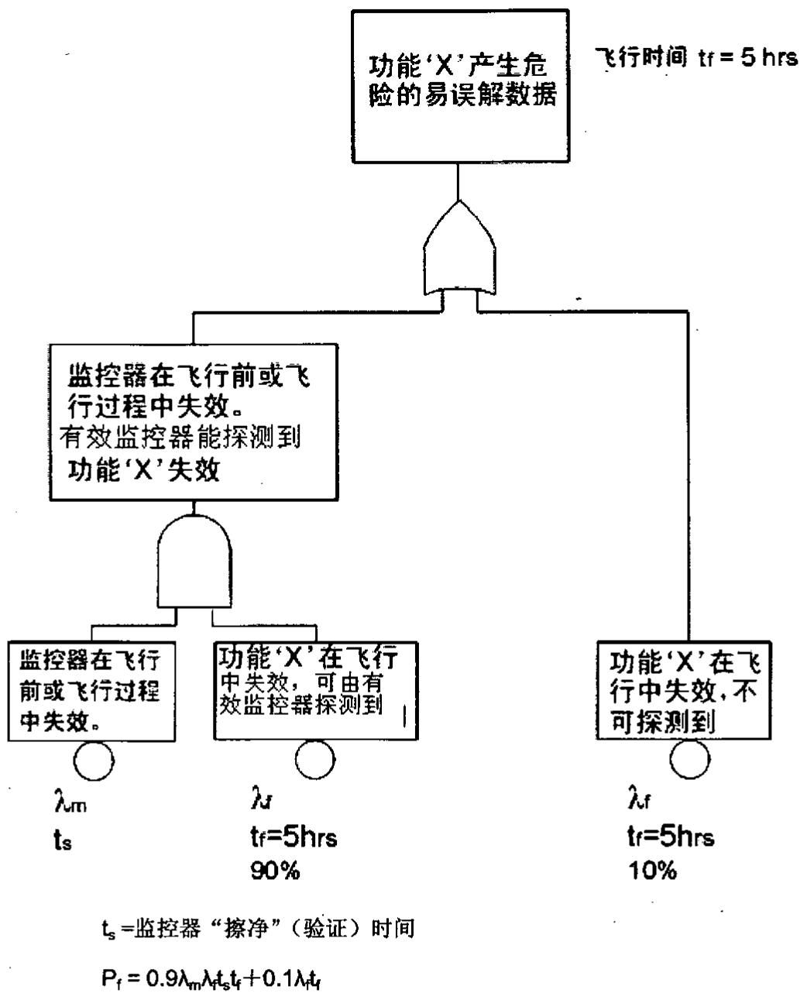  
图D.14 监控器探测到  $90\%$  功能X失效时的故障树结构示例

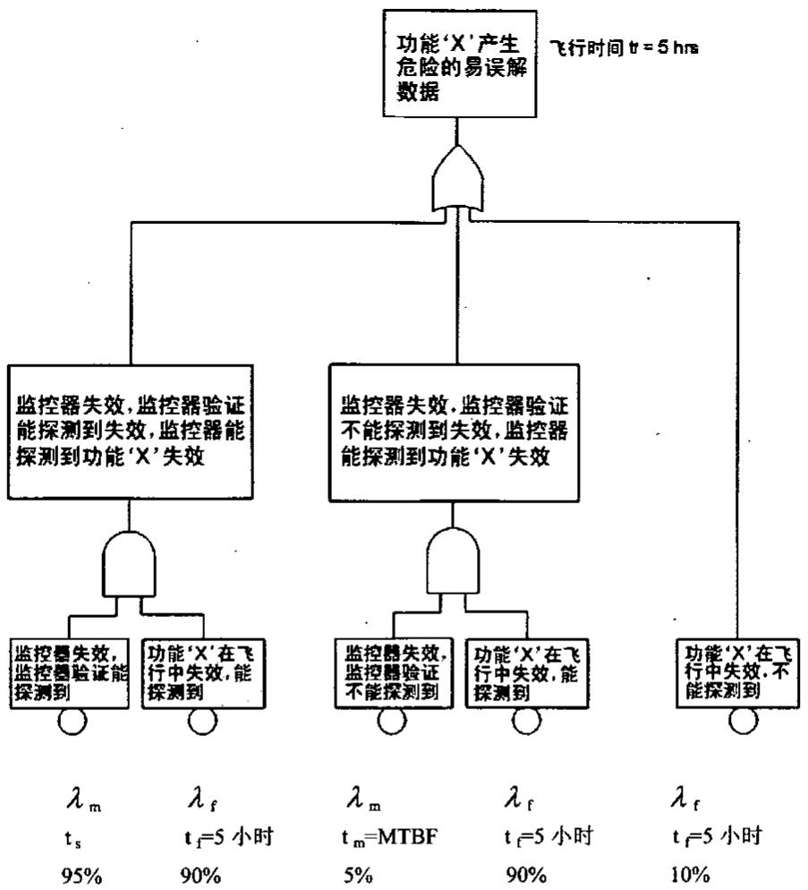  
图D15在监控器检测到  $90\%$  功能X'失效且监控器验证达  $95\%$  时的故障树结构示例

$\mathbf{t}_{s} =$  监控器“擦净”（验证）

$$
\mathrm {P} _ {\mathrm {f}} \mathrm {t} _ {\text {可}} = 0. 9 * 0. 9 5 \lambda_ {\mathrm {m}} \lambda_ {\mathrm {f}} \mathrm {t} _ {\mathrm {s}} \mathrm {t} _ {\mathrm {f}} + 0. 9 * 0. 0 5 \lambda_ {\mathrm {m}} \lambda_ {\mathrm {f}} \mathrm {t} _ {\mathrm {s}} \mathrm {t} _ {\mathrm {f}} + 0. 1 \lambda_ {\mathrm {f}} \mathrm {t} _ {\mathrm {f}}
$$

$$
\mathrm {P} _ {\mathrm {f} \text {小 时}} = \mathrm {P} _ {\mathrm {f} \text {飞 行}} / \mathrm {t} _ {\mathrm {f}}
$$

# D.11.1.3.4（续）：

为有效验证功能、试验或监控器的正确工作，可能需要多种失效探测方法。这些探测层次中的每一层次，可能具有不同的暴露时间，因此必须予以考虑。某些较为通用的探测方法包括：

a. 适时自测试;  
b. 通电自测试;  
c. 飞行前自测试;  
d. 定期维修测试;  
e. 初始生产测试：  
f. 返回使用测试。

D.11.1.4 确定任何相关所要求的顺序系数：故障树中的“与”门，未隐含特定故障发生的顺序。在某些情况下，这可能是不切实际的。举一个失效组合的例子，其中监控器被用来探测可能导致顶事件的功能电路失效。如果监控器首先失效，则该失效将保持潜伏，直到再次检查该监控器为止。如果功能X'电路首先失效，则不发生该项事件，因为监控器通告该失效。

在处理失效顺序相关事件时，可将一系数纳入故障树中，以使算得的概率略偏保守。这一系数称之为“要求的顺序系数”（ROF）或顺序系数。对于小  $\lambda t$  ，以任一顺序出现两个事件（假设两者都失效）的概率大约为总概率的1/2。因此，每一顺序的ROF为1/2。通常，如果在一个“与”门中有  $n$  个事件，则有  $n!$  使其失效的可能顺序。如果这些可能的顺序中仅  $k$  个将引发项事件，那么  $\mathsf{ROF} = k / n!$  。此近似值仅对具有相同暴露时间的事件或对具有  $(\lambda 1 + \lambda 2)\mathrm{T}_{(\max)}$  小于0.2的不同暴露时间的事件有效。对于所有其他情况，应计算ROF。使用ROF的例子如图D10所示。

当某个故障树包含多个ROF时，在执行概率计算时，对最小割集应用ROF，则是较为精确的。如图D16所示的例子。

仅当至‘与’门的所有的输入都具有相同的暴露时间时，才可应用ROF。

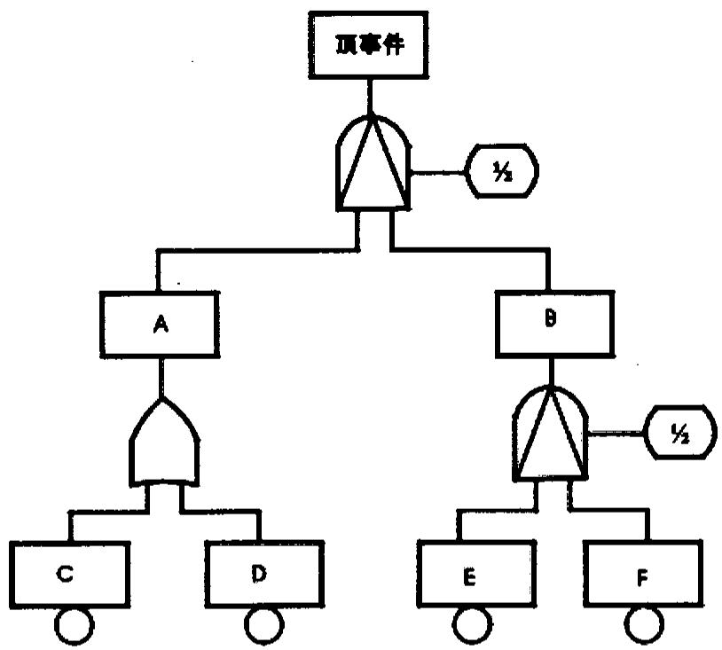  
D16 包含优先与门和ROF的故障树结构示例

# D.11.1.4 (续):

对于图D16，最小名义割集应是  $1 / 2(P_{\mathrm{f}}C*1 / 2*P_{\mathrm{f}}E*P_{\mathrm{f}}F) = 1 / 4P_{\mathrm{f}}C*P_{\mathrm{f}}E*P_{\mathrm{f}}F$ 。但这一结论是不正确的，见下面的说明。

a. 分析人员应从忽略了 ROF 的图 D16 产生相同的割集（即， $\mathsf{P}_{\mathsf{r}} \mathsf{C} * \mathsf{P}_{\mathsf{r}} \mathsf{E} * \mathsf{P}_{\mathsf{r}} \mathsf{F}$ ）。接着，必需通过考虑有多少可能的组合将满足所要求顺序，来计算  $k / n!$ 。存在 3！个（6 个）可能的顺序，即是 CEF，CFE，ECF，EFC，FCE 和 FEC。顺序 CEF 显然满所要求的顺序，以及 ECF 也可能满足。为确立这一顺序，需要有更多的关于实际系统的知识。因此， $k$  可能等于 1 或 2，而  $k / n!$  可能等于 1/6 或 1/3。因此，有关这一割集的最完整、最正确的数学解应是 1/6  $\mathsf{P}_{\mathsf{r}} \mathsf{C} * \mathsf{P}_{\mathsf{r}} \mathsf{E} * \mathsf{P}_{\mathsf{r}} \mathsf{F}$  或  $1 / 3 \mathsf{P}_{\mathsf{r}} \mathsf{C} * \mathsf{P}_{\mathsf{r}} \mathsf{E} * \mathsf{P}_{\mathsf{r}} \mathsf{F}$ 。这一示例表明，在割集分析中使用 ROF，可能是不正确的，且或者可能是有利的，或者可能是不利的。

D.11.1.5 执行FTA数值计算：完成上面的步骤后，使用布尔代数的方法计算有关顶层事件失效的概率  $\left[\mathsf{P}_{\mathsf{f}}(\mathsf{top})\right]$  。用于“与”门和“或”门组合概率的方法，在10.1节中予以说明。

在处理常值失效率（即，设备工作在可靠性浴盆曲线的平直段）时，由下列方程给出基本事件（Basic Event）成功概率（也称之为基本事件（Basic Event）可靠性）：

$$
R _ {s} = R = e ^ {- \lambda t} \quad (\text {方 程 D 1})
$$

式中：

$P_{s} =$  成功概率

R=可靠性

$\mathbf{e} =$  自然对数底

$\lambda =$  基本事件（BaseEvent）失效率

$t =$  基本事件（Base Event）暴露时间，或处于风险的时间

在可靠性术语中，我们知道部件生存和部件失效是互补的，并且是互斥的。因而对于任何给定的时间段：

$$
P _ {s} + P _ {f} = R + Q = 1 \quad (\text {方 程 D 2})
$$

$$
P _ {F} = Q = 1 - e ^ {- \lambda} \quad (\text {方 程 D 3})
$$

式中：

$\mathsf{P_f} =$  失效概率

$\mathbf{Q} =$  不可靠度

当  $\lambda t \leq 0.1$  时，可将方程D3简化为  $P_{f} = Q = \lambda t$ 。

应使用  $\mathsf{P_f}$  进行FTA数值计算，因为现今的电子基系统具有如此高的可靠性 $(R = 0.9999\dots)$  ，以至于Q对四舍五入误差的敏感性极小，因此，产生一个更精确的  $\mathsf{P_f}$  (top)。换言之，应运用失效概率术语，而不是运用成功概率术语，来处理FTA数值计算。

# D.11.1.5（续）：

对于两个潜在失效引发系统失效的情况，只要该两个失效机构所提供的  $\mathsf{n}\lambda \mathsf{t}_{\mathsf{f}}$  为小值，则是近似正确的，如果  $\mathsf{n}\lambda \mathsf{t}_{\mathsf{f}}$  为大值，则是不正确的。原因是如果处于双系统内的两个部件潜在失效，则该失效一定是明显的。因此，有一隐含的假设，即在任务开始时，两个部件均未失效。因为在计算时未包括这一情况，故当  $\mathsf{n}\lambda \mathsf{t}_{\mathsf{f}}$  （n是维修周期之间的任务数）为大值时，其结果可能比需要的值要大。通过使用布尔运算，或马尔可夫分析，可获得正确的数学结果。

在D.11.1.5.1到D.11.1.5.4中，进一步展开D.9.3中的4个特别的示例，以表明典型的故障树计算，这些典型故障树中包括具有或不具有潜在失效或所要求的顺序系数的基本事件（Basic Event）。这里所描述的方法，表明双失效下的最不利情况飞行的概率，以及每次飞行顶事件的平均概率。对于简单明了的问题，可采用不同的方法来计算每次飞行的平均概率。为处理两个以上失效或在上面所叙述假设中某些假设无效之处，需要建立特殊的公式。为了计算每飞行小时的概率，请参见D.13。可提供使用不利情况飞行概率的保守分析，以表明其符合性，而无需进行复杂的平均概率计算。需要提醒的是在使用故障树软件包时，可自动选择最不利情况或平均概率。

D.11.1.5.1 两个组件失效导致功能丧失，且无组件失效是潜在的的故障树计算：在同一次飞行中由丧失两个组件而引发顶事件，这是简单的失效情况。已知在飞行开始时两个组件都运行，并且无一潜在失效。因为无一失效是潜在失效，故平均概率与不利情况概率是相同的。两个失效可以任一顺序发生。如图 D17 所示的例子。

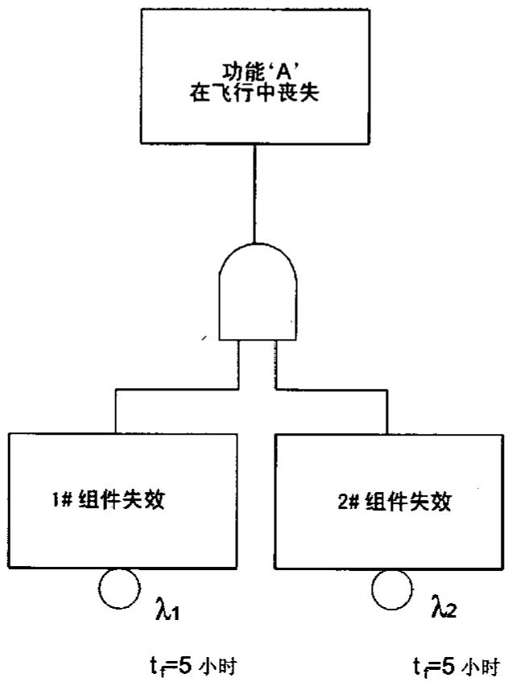  
图D17 两个组件失效导致功能丧失的故障树计算示例

$$
P _ {f} \quad (\text {不 利 情 况}) = P _ {t} (\text {平 均}) = \lambda_ {1} \lambda_ {2} t _ {r} ^ {2}
$$

D.11.1.5.2 两个组件导致功能丧失的故障树计算，其中一个组件可能潜在失效，而另一个不可能潜在失效，无顺序要求：在这一情况下，1#组件可能在对其检查时（时间  $= 0$ ）与下一次对其检查时（时间  $= T$ ）之间的任何时间点失效。已知2#组件在每次飞行开始时是运行的，并且从无潜在失效。失效顺序无关紧要。在这种情况中，每次飞行的顶事件平均概率与最不利情况飞行顶事件概率之间存在差别。考虑到存在  $n$  次  $t_i$  小时的飞行，即  $T = n t_i$ 。

对于小  $\lambda t$  ，使用近似计算  $P_{f} = \lambda t$  ，在表D5中给出下列说明：

a. 检查效验后首次飞行中发生两个组件失效的概率  $= \lambda_1\lambda_2t_1^2$  
b. 1#组件在检查效验后的最初两次飞行中的任一次失效，且2#组件在第2次飞行中失效的概率  $= 2\lambda_{1}\lambda_{2}t_{1}^{2}$  
c. 1#组件在前i次飞行中的任一次飞行时失效并且2#组件在第i次飞行时失效的概率  $= i\lambda_{1}\lambda_{2}t_{1}^{2}$

表 D15 对于一个潜在而另一个主动的两个失效情况的平均概率计算的列表表示  

<table><tr><td>情况序号</td><td>现行飞行</td><td>在现行飞行中一个非潜在失效和在潜伏期内首次飞行中一个潜在失效</td><td>在现行飞行中一个非潜在失效和在潜伏期内第2次飞行中一个潜在失效</td><td>在现行飞行中一个非潜在失效和在潜伏期内第i次飞行中一个潜在失效</td><td>在现行飞行中一个非潜在失效和在潜伏期内最后2次飞行中一个潜在失效</td><td>在现行飞行中一个非潜在失效</td><td>该情况下的总概率</td></tr><tr><td>1</td><td>潜伏期内首次飞行</td><td>λ1t1λ2t1</td><td></td><td></td><td></td><td></td><td>λ1λ2t12</td></tr><tr><td>2</td><td>潜伏期内第2次飞行</td><td>λ1t1λ2t1</td><td>λ1t1λ2t1</td><td></td><td></td><td></td><td>2λ1λ2t12</td></tr><tr><td>i</td><td>潜伏期内第i次飞行</td><td>λ1t1λ2t1</td><td>λ1t1λ2t1</td><td>λ1t1λ2t1</td><td></td><td></td><td>iλ1λ2t12</td></tr><tr><td>n-1</td><td>潜伏期内倒数第2次飞行</td><td>λ1t1λ2t1</td><td>λ1t1λ2t1</td><td>λ1t1λ2t1</td><td>λ1t1λ2t1</td><td></td><td>(n-1)λ1λ2t12</td></tr><tr><td>n</td><td>潜伏期内最后一次飞行</td><td>λ1t1λ2t1</td><td>λ1t1λ2t1</td><td>λ1t1λ2t1</td><td>λ1t1λ2t1</td><td>λ1t1λ2t1</td><td>nλ1λ2t12</td></tr></table>

# D.11.1.5.2 (续):

d. 1#组件在  $n$  次飞行中的任何一次失效，而 2#组件在最后一次飞行（ $n$  次）中失效的概率  $= n\lambda_1\lambda_2t_1^2$  （这是最不利情况下飞行概率）；  
e. 每次飞行的平均概率等于每次飞行的概率之和除以潜伏期内飞行次数  $n$ ,

$\mathsf{P}_{1}$  （平均）  $= 1 / \mathsf{n}*\sum \mathsf{i}\lambda_{1}\lambda_{2}\mathsf{t}_{\mathrm{r}}^{2}$  ，对于  $\mathbf{i} = 1$  到  $\mathsf{n}$  （方程D4）

$= (\lambda_{1}\lambda_{2}t_{1}^{2}) / n*\Sigma i$  ，对于  $\mathrm{i = 1}$  到  $\mathsf{n}$  
$= (\lambda_{1}\lambda_{2}t_{1}^{2}) / n*(n*(n + 1)) / 2$  
$= 1 / 2*\lambda_{1}\lambda_{2}t_{f}(n t_{f + }t_{f})$  
$= 1 / 2*\lambda_{1}\lambda_{2}t_{\mathrm{f}}(T + t_{\mathrm{f}})$

# D.11.1.5.2（续）：

作为计算潜伏期内任何单次飞行中发生功能失效平均概率的结果，出现系数1/2，并且不从使用T/2暴露时间得到。

如图D18所示的例子。

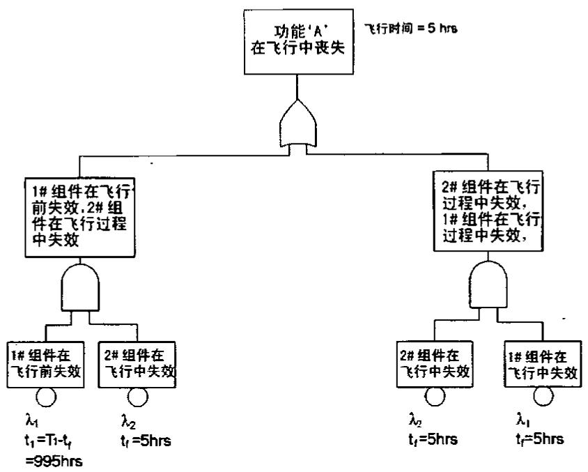  
图D18 两个组件失效导致某一功能丧失，且1#组件潜在失效的故障树计算示例

$$
\mathrm {P} _ {\mathrm {f} (\text {最 不 利 情 况})} = \lambda_ {1} \lambda_ {2} \mathrm {t} _ {\mathrm {f}} \mathrm {T} _ {1}
$$

$$
\mathrm {P} _ {\mathrm {f} (\text {平 均})} = 1 / 2 \lambda_ {1} \lambda_ {2} \mathrm {t} _ {\mathrm {f}} \left(\mathrm {T} _ {1} + \mathrm {t} _ {1}\right)
$$

D.11.1.5.3 两个组件失效导致某一功能丧失，而每个组件可能潜在失效且不考虑顺序的故障树计算：在这一情况下，任何一个组件都可能潜在失效，但是，如果两者都失效，则可根据其引发的顶事件而被探测到。因此，在每次飞行开始时，必须至少有一个组件在运行。示例如图 D19 所示。

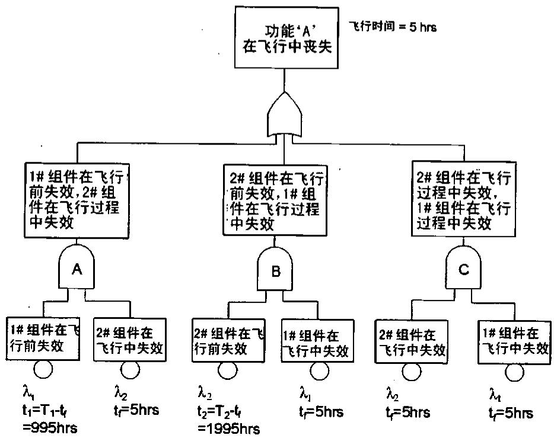  
图D19 两个组件失效导致某一功能丧失，而每个组件可能潜在失效的故障树计算示例

$$
\mathrm {P} _ {\mathrm {f} (\text {最 不 到 情 况})} = \lambda_ {1} \lambda_ {2} \mathrm {t} _ {\mathrm {f}} \left(\mathrm {T} _ {1} + \mathrm {T} _ {2} - \mathrm {t} _ {\mathrm {f}}\right)
$$

$$
\mathrm {P} _ {\mathrm {f} (\text {平 均})} = 1 / 2 \lambda_ {1} \lambda_ {2} \mathrm {t} _ {\mathrm {f}} \left(\mathrm {T} _ {1} + \mathrm {T} _ {2}\right)
$$

# D.11.1.5.3（续）：

关于图D19，应注意3件事。第一，不要求有失效顺序（即，如同D.11.1.4节所述的  $\mathsf{ROF} = \mathsf{k} / \mathsf{n}!$  ）的不展开事件。因为，失效顺序的相关性，通过潜伏期  $(t_{n} = T_{n}-$ $t_f$  ）而植入故障树结构中，这是飞行前失效的典型。第二，最右的“与"门对包含两个组件在飞行过程中都失效且无要求的顺序的情况是必需的。第三，对于 $t_f$  比检查时间间隔小得多的情况，通常省略最右边的“与"门，并且使暴露时间设定值等于检查时间间隔。

a. 关于图D19，对最不利情况飞行概率的计算如下：

$$
P _ {f} A = \lambda_ {1} \left(T _ {1} - t _ {f}\right) \lambda_ {2} t _ {f} \quad (\text {方 程 D 5})
$$

$$
P _ {f} B = \lambda_ {2} \left(T _ {2} - t _ {f}\right) \lambda_ {1} t _ {f} \quad (\text {方 程 D 6})
$$

$$
P _ {f} C = \lambda_ {1} t _ {f} \lambda_ {2} t _ {f} \quad (\text {方 程 D 7})
$$

$$
\begin{array}{l} P _ {f (\text {最 不 利 情 况})} = P _ {f} A + P _ {f} B + P _ {f} C \quad \left(\text {方 程 D 8}\right) \\ = \lambda_ {1} \lambda_ {2} t _ {f} (T _ {1} - t _ {f} + T _ {1} - t _ {f} + t _ {f}) \\ = \lambda_ {1} \lambda_ {2} t _ {f} \left(T _ {1} + T _ {1} - t _ {f}\right) \\ \end{array}
$$

b. 有关如 D.11.1.5.5 所描述的平均概率的计算，结果如下：

$$
P _ {f (\text {平 均})} = 1 / 2 \lambda_ {1} \lambda_ {2} t _ {f} \left(T _ {1} + T _ {2}\right) \quad \text {(方 程 D 9)}
$$

D.11.1.5.4 两个组件失效导致一顶事件，而一个组件可能潜在失效并需要要求的顺序：在这种情况下，1#组件（潜在失效组件）必须在2#组件之前失效，否则不会发生顶事件。已知2#组件在飞行开始是工作的。这是顶事件错误输出而不是功能丧失的一种失效/监控状态的典型。图D20给出一个涉及不正确数据传送的示例。

按D.11.1.4所述，使用要求的顺序系数（ROF）。

a. 关于图D20，对最不利情况飞行概率计算如下：

$$
P _ {f} A = \lambda_ {1} \left(T _ {1} - t _ {f}\right) \lambda_ {2} t _ {f} \quad (\text {方 程 D 1 0})
$$

$$
P _ {f} B = 1 / 2 \lambda_ {1} \lambda_ {2} t _ {f} ^ {2} \quad (\text {方 程 D 1 1})
$$

$$
\begin{array}{l} P _ {f (\text {最 不 利 情 况})} = P _ {f} A + P _ {f} B \quad \left(\text {方 程 D 1 2}\right) \\ = \lambda_ {1} \left(T _ {1} - t _ {f}\right) \lambda_ {2} t _ {f} + \left(\lambda_ {1} \lambda_ {2} t _ {f} ^ {2}\right) / 2 \\ = \lambda_ {1} \lambda_ {2} t _ {f} \left(T _ {1} - t _ {f} / 2\right) \\ \end{array}
$$

b. 有关如 D.11.1.5.5 所描述的平均概率计算，结果如下：

$$
P _ {f (\text {平 均})} = 1 / 2 \lambda_ {1} \lambda_ {2} T _ {1} \quad \left(\text {方 程 D 1 3}\right)
$$

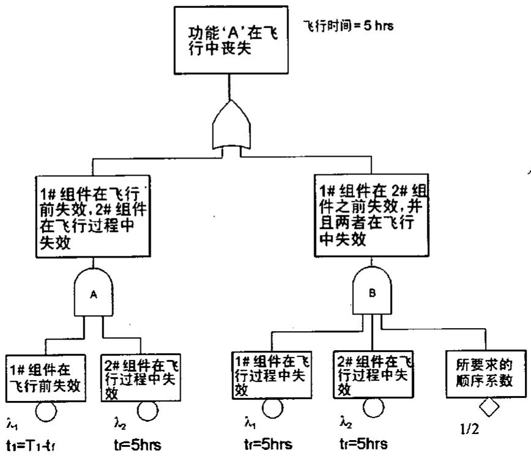  
图20 两个组件失效导致一顶事件，而一个组件可能潜在失效且失效顺序相关的故障树计算示例

$$
\begin{array}{l} \mathrm {P} _ {\mathrm {f}} (\text {最 不 利 情 况}) = \lambda_ {1} \lambda_ {2} \mathrm {t} _ {\mathrm {f}} (T _ {1} - (t _ {f} / 2)) \\ \mathrm {P} _ {\mathrm {f} (\text {平 均})} = 1 / 2 \lambda_ {1} \lambda_ {2} \mathrm {t} _ {1} \mathrm {T} _ {1} \\ \end{array}
$$

D.11.1.5.5 对于某平均飞行时间双重失效的平均发生概率的计算示例：下面的示例考虑具有两个不同失效率  $\lambda_{1}$  和  $\lambda_{2}$  以及两个潜伏期T1和T2的双重失效F1和F2的一般情况，假设：

$\mathsf{T}_1\leq \mathsf{T}_2,\mathsf{T}_2 = \mathsf{NT}_1,\mathsf{t}_{\mathrm{f}}$  为平均飞行时间 （方程D14）

我们有：

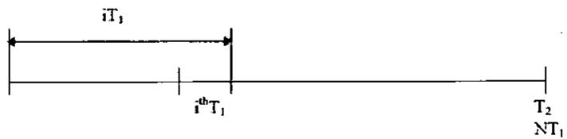  
图D21

D.11.1.5.5.1 相对于第  $i$  个  $\mathsf{T}_1$  发生的概率：此概率由两个情况，即情况A和情况B所组成。

a. 情况 A:  $F_{2}$  在  $F_{1}$  之前发生。

（1）这一情况由两个子情况组成：

(a)  $A_{1}$ :  $F_{2}$  发生在第i个  $T_{1}$  之前，且在  $T_{1}$  期间发生  $F_{1}$ ;  
（b）  $A_{2}$  ：  $\mathsf{F}_2$  在  $\mathsf{F}_1$  之前，且在第i个  $\mathsf{T}_{1}$  期间发生。

$\mathsf{P}_{\mathsf{A}} = \mathsf{P}_{\mathsf{A1}} + \mathsf{P}_{\mathsf{A2}} = \lambda_{2}$  （i-1）  $T_{1}\lambda_{1}T_{1} + (\lambda_{1}T_{1}\lambda_{2}T_{1} / 2)$  （方程D15）

（注：/2项用于确定在  $\mathsf{T}_1$  期间  $\mathsf{F}_2$  在  $\mathsf{F}_1$  之前的顺序）

$$
P _ {A} = \lambda_ {1} \lambda_ {2} T _ {1} ^ {2} (i - 1 + 1 / 2) = \lambda_ {1} \lambda_ {2} T _ {1} ^ {2} (i - 1 / 2)
$$

b. 情况 B: F1 发生在 F2 之前。

（1）在这一情况下，  $\mathsf{F}_1$  的潜伏期为  $\mathsf{T}_1$ ，如果  $\mathsf{F}_1$  在  $\mathsf{T}_1$  期间发生在  $\mathsf{F}_2$  之前，则发生双失效：

$\mathsf{P_B} = (\lambda_1\mathsf{T}_1\lambda_2\mathsf{T}_1) / 2$  （方程D16）

（注：/2项用于确定在  $\mathsf{T}_1$  期间  $\mathsf{F}_1$  在  $\mathsf{F}_2$  之前的顺序）

相对于第  $\mathbf{i}$  个  $\mathsf{T}_1$  发生的总概率为：

[ P = P_{A} + P_{B} = \lambda_{1}\lambda_{2}T_{1}^{2}[(i - 1 / 2) + 1 / 2] = \lambda_{1}\lambda_{2}T_{1}^{2}i ] （方程D17）

D.11.1.5.5.2 相对  $\mathsf{T}_2$  时段发生的概率：  $\mathsf{T}_2$  时段总的发生概率为：

$$
P _ {G} = \left(P _ {A} + P _ {B}\right), \text {对 于} i = 0 \text {到} i = N \tag {方程D18}
$$

$$
P _ {G} = \lambda_ {1} \lambda_ {2} T _ {1} ^ {2} [ (N (N + 1) / 2 - N / 2) + (N / 2) ]
$$

$$
P _ {G} = \lambda_ {1} \lambda_ {2} T _ {1} ^ {2} [ (N ^ {2} / 2 + N / 2 - N / 2) + N / 2 ]
$$

$$
P _ {G} = \lambda_ {1} \lambda_ {2} T _ {1} ^ {2} [ (N ^ {2} / 2 + N / 2 ]
$$

用  $\mathsf{T}_2$  替代  $\mathsf{NT}_1$

$$
P _ {G} = 1 / 2 \lambda_ {1} \lambda_ {2} T _ {2} (T _ {1} + T _ {2})
$$

D.11.1.5.5.3 每次飞行发生的概率： $P_G$  是  $T_2$  小时段的平均发生概率。为了得到每次飞行的平均发生概率，必须将  $P_G$  除以  $T_2$ ，得到每飞行小时的平均发生概率，再乘以一次飞行的平均时间  $t_f$ ，则导出通用方程：

$$
P _ {f t} = P _ {G} * t _ {f} T _ {2} \quad (\text {方 程 D 1 9})
$$

$$
P _ {f t} = 1 / 2 \lambda_ {1} \lambda_ {2} t _ {f} \left(T _ {1} + T _ {2}\right)
$$

式中  $P_{\text{飞}} =$  每飞行小时双重失效的概率。

D.11.1.5.5.4 通用的衍生情况：由上述 D.11.1.5.5.3 中的通用方程，可推导出若干种双重失效的衍生情况：

a. 具有两个不同潜伏期  $\mathbf{T}_{1}$  和  $\mathbf{T}_{2}$  的两个潜在失效  $\mathbf{F}_{1}$  和  $\mathbf{F}_{2}$ ;

$$
\text {无 顺 序 关 联 要 求 ：} P _ {\mathrm {f i}} = 1 / 2 \lambda_ {1} \lambda_ {2} t _ {\mathrm {f}} \left(T _ {2} + T _ {1}\right) \quad \text {(方 程 D 2 0)}
$$

$$
\text {顺 序 关 联 要 求 ，} \mathrm {F} _ {2} \text {在} \mathrm {F} _ {1} \text {之 前 发 生 ：} \mathrm {P} _ {\mathrm {f t}} = 1 / 2 \lambda_ {1} \lambda_ {2} \mathrm {t} _ {\mathrm {f}} \mathrm {T} _ {2}
$$

$$
\text {顺 序 关 联 要 求 ，} \mathrm {F} _ {1} \text {在} \mathrm {F} _ {2} \text {之 前 发 生 ：} P _ {\mathrm {f t}} = 1 / 2 \lambda_ {1} \lambda_ {2} t _ {\mathrm {f}} T _ {1}
$$

b. 具有两个相同潜伏期  $\mathrm{T}_{1} = \mathrm{T}_{2} = \mathrm{T}$  的两个潜在失效  $\mathbf{F}_{1}$  和  $\mathbf{F}_{2}$

$$
\text {无 顺 序 关 联 要 求 ：} P _ {\mathrm {f}} = 1 / 2 \lambda_ {1} \lambda_ {2} t _ {1} [ (T + T) / 2 ] = \lambda_ {1} \lambda_ {2} t _ {1} T \quad (\text {方 程 D 2 1})
$$

$$
\text {顺 序 关 联 要 求 ，} \mathrm {F} _ {2} \text {在} \mathrm {F} _ {1} \text {之 前 发 生 ：} P _ {\mathrm {f t}} = 1 / 2 \lambda_ {1} \lambda_ {2} \mathrm {t} _ {1} \mathrm {T}
$$

$$
\text {顺 序 关 联 要 求 ，} \mathrm {F} _ {1} \text {在} \mathrm {F} _ {2} \text {之 前 发 生 ：} P _ {\mathrm {f t}} = 1 / 2 \lambda_ {1} \lambda_ {2} t _ {\mathrm {f}} T
$$

# D.11.1.5.5.4（续）：

c. 潜伏期为  $T_{2} = T$  以及  $T_{1} = t_{f}$  的一个潜在失效  $F_{2}$  和一个主动失效  $F_{1}$ ;

无顺序关联要求：  $P_{\mathrm{ft}} = 1 / 2\lambda_1\lambda_2t_{\mathrm{f}}(T + t_{\mathrm{f}})$  （方程D22）

顺序关联要求，  $F_{2}$  在  $F_{1}$  之前发生：  $P_{\mathrm{fl}} = 1 / 2\lambda_1\lambda_2t_{\mathrm{f}}T$

（指令和监控系统的情况）

顺序关联要求，  $F_{1}$  在  $F_{2}$  之前发生：  $P_{\mathrm{f}} = 1 / 2\lambda_1\lambda_2t_{\mathrm{f}}t_{\mathrm{f}} = 1 / 2\lambda_1\lambda_2t_{\mathrm{f}}^2$

d. 两个主动失效 F1 和 F2,  $T1 = T2 = t_{\circ}$

无顺序关联要求：  $P_{\mathrm{ft}} = \lambda_1\lambda_2t_f / (t_f + t_f) / 2] = \lambda_1\lambda_2t_f^2$  （方程D23）

顺序关联要求，  $F_{2}$  在  $F_{1}$  之前发生：  $P_{\mathrm{f}} = 1 / 2\lambda_{1}\lambda_{2}t_{\mathrm{f}}t_{\mathrm{f}} = \lambda_{1}\lambda_{2}t_{\mathrm{f}}^{2}$

顺序关联要求，  $F_{1}$  在  $F_{2}$  之前发生：  $P_{\mathrm{ft}} = 1 / 2\lambda_1\lambda_2t_1t_2 = \lambda_1\lambda_2t_2^2$

# D.11.2 定量敏感度评价：

可将敏感度评价分为两类（有关这一主题的详尽讨论，参见NUREG-0492）：

a. 模型和数据变化法;  
b. 有效误差分析法。

分析人员可利用数据或故障树模型的变异来确定系统设计相对各个初级事件（Primary Event）的某个特定方面是如何敏感。通过插入某个特定初级事件（Primary Event）的不同失效率，分析人员可决定为一个可靠度更高的组件/部件投入额外的费用是否值得。通过插入不同的暴露时间，分析人员提供输入，来协助确定设备的维修时间间隔。

分析人员可使用有效误差分析来确定FTA结果对初级事件（Primary Event）变异性，即，部件失效率和维修时间间隔的变异性是如何敏感。蒙特卡罗方法就是这样一种适合于故障树分析的技术。因为误差分析法基于统计和概率技术，这些都超出了本附录的范围，故读者应参考有关这一主题的教科书。

定量重要性与定性重要性类似（参见D.10.2），在这两种评定方法中，简单地对割集排序，以确定在发生项事件方面的相对重要性。

定量重要性可具有各种不同的形式。这里提供若干方法。分析人员可从每种方法得到不同类型信息。

# D.11.2（续）：

方法1：依据每一割集实际失效概率按降序（即从最高到最低的  $\mathsf{P}_{\mathsf{f}}$  ）排列的简单割集排序。

这一方法与定性重要性密切相关。与使用定性重要性方法仅能粗略估计割集排序相反，分析人员可精确地确定割集排序。

方法2：第i个割集重要性一提供与顶事件失效概率相关的割集失效概率百分数。

$$
\% (i) = P _ {f} (0) / P _ {f} (\text {top}) \quad (\text {方程 D24})
$$

方法3：Fussell-Vesely（FV）重要性—提供与各初级事件（Primary Event）相关的风险（即，提供有关初级事件（Primary Event）对顶事件  $\mathbf{P}_{\mathrm{f}}$  作多少贡献的相对表示）。

$$
F V = \left[ P _ {f} (t o p) - P _ {f} (t o p / A = 0) \right] / P _ {f} (t o p) \quad (\text {方 程 D 2 5})
$$

式中  $P_{f}$  （top/A=0）定义为给定事件A未曾发生即  $P_{f}$  （A）=0时，顶事件发生的概率。

方法4：Birbaum重要性--提供与初级事件（PrimaryEvent）有关的风险增大。也就是，该方法提供当一个初级事件（PrimaryEvent）发生（即P（A）=1）时和初级事件（PrimaryEvent）不发生（即P（A）=0）时顶事件中的差异。

$$
\text {B i r b a u m} = P _ {f} (\text {t o p / A} = 1) - P _ {f} (\text {t o p / A} = 0) \quad \left(\text {方 程 D 2 6}\right)
$$

# D.12 使用故障树表明差错的影响：

故障树可提供一种方法来说明硬件和软件的潜在差错对正被分析的不希望事件的影响。通过在故障树中包含硬件和软件差错事件，来实现这一方法。这些事件被包含在纯定性分析方式中，且不参与仅能对硬件失效实施的顶事件的概率计算。

根据故障树中包含的潜在硬件和软件差错，分析人员可评估确保共模错误不会降低针对硬件随机故障保护所达到的安全性等级所必需的研制保证等级。

# D.12（续）：

下面的示例表明故障树中包含的硬件和软件潜在差错如何可在评估必须达到的安全性研制保证等级方面指导分析人员。

该示例示出两个相同的显示器。为简单起见，将显示器的数据源排除在分析之外，并且假设在每一显示器内都包含监控器。初始的故障树如图D22所示。在该初始的故障树中，假设所有硬件的失效是独立的。因为必须发生4个独立的硬件失效，故对于1E-9安全性水平的符合性显然是相当容易达到的。

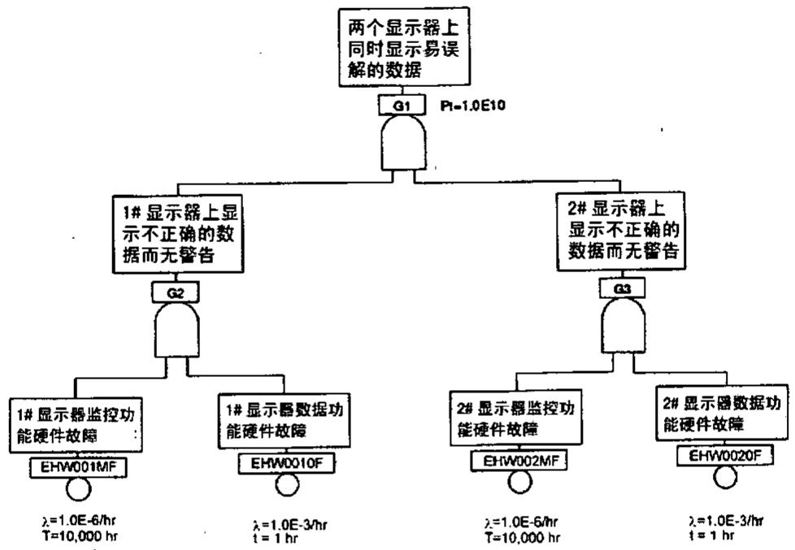  
图D22 工作基本原理带有设计差错的故障树示例

# D.12（续）：

分析人员可容易地确定该故障树的最小割集为（EHW0010F）（EHW001MF）（EHW0020F）（EHW002MF）。现在，分析人员必须确定共因故障是否能影响对割集执行计算。在下面几页上的故障树（图D23，1-4幅）增加潜在的共因故障，以提供对可能影响的可见性。所示的潜在共因故障是：“外部共因故障”（电源、环境等），“如果数据和监控器是独立的，差错的影响”以及“如果数据和监控器不是独立的，硬件和软件差错的影响”。为了完整性，包括外部共因故障，但在这里不做进一步阐述。

因为显示器是相同的，所作的最不利情况假设是软件或硬件差错将同时影响这两者。在每一显示器内，有两个被分析的功能，一个是数据生成功能，另一个是监控功能。如果该数据生成的设计和监控器设计是独立的，那么在事件“如果数据和监控器是独立的，差错的影响”下面所示的故障顺序，则指导对执行这些功能的软件和硬件进行研制保证等级的分配。在这种情况下，硬件和软件差错以及随机的硬件故障组合，起到了引发顶事件的作用。

如果未将数据生成和监控器功能设计成独立的，则在事件“如果数据和监控器不是独立的，差错的影响”下面所示的故障顺序，则指导所需的研制保证等级的分配。如果功能不是独立的，则硬件和软件差错是对顶事件的主要影响因素。

现在，分析人员可查阅ARP4754的5.4节，作为对可能的备用设计分配所需的研制保证等级的指导。如果数据和监控器功能不是独立的，则需要将该两种功能中所涉及的硬件和软件，按等级A进行研制。如果该两种功能是独立的，那么，有可能对其一种或两种降低研制等级。

在故障树中包含潜在的硬件和软件差错，对需要弄清的有关独立性问题，提供有价值的洞察能力，并且最终，当这些问题得到解答后，则是对必须采用的研制保证等级提供洞察力。

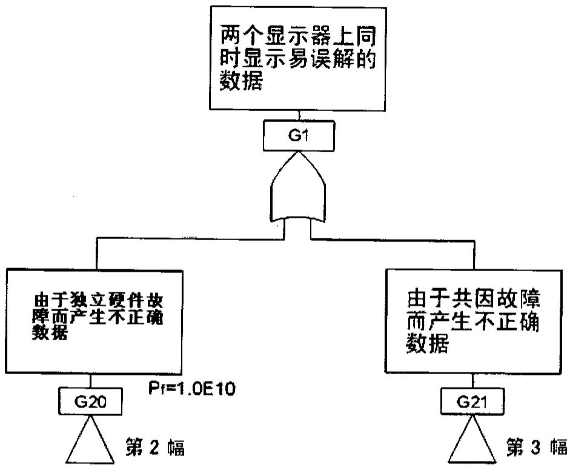  
图D23 共因故障（差错）的考虑（共4幅第1幅）

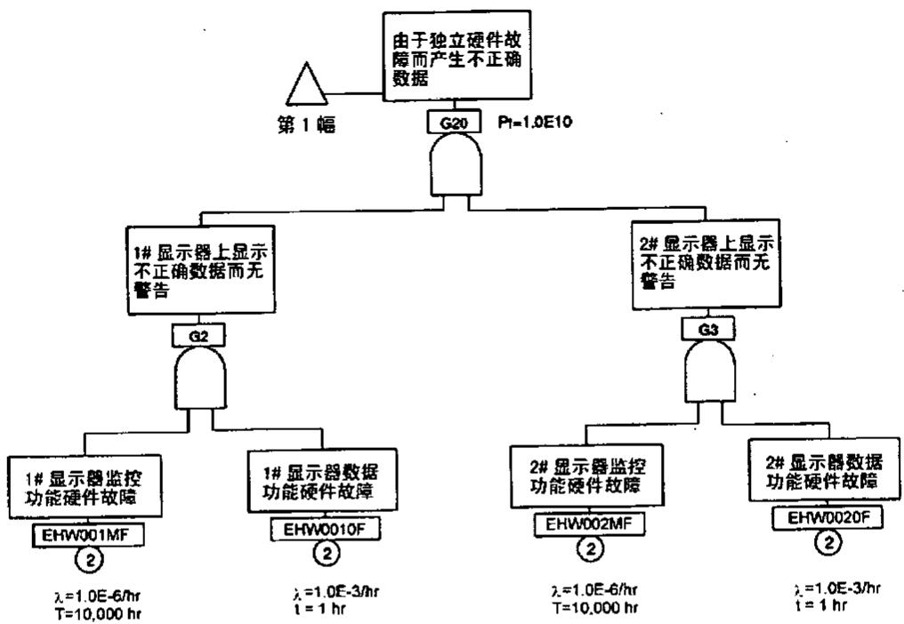  
图D23（续）（共4幅第2幅）

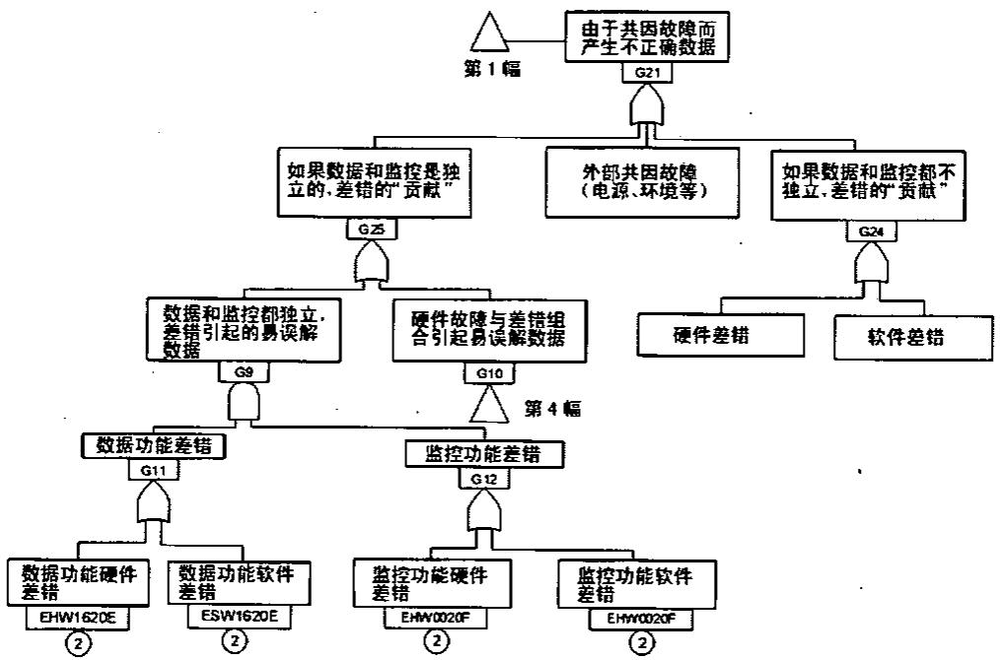  
图D23（续）（共4幅第3幅）

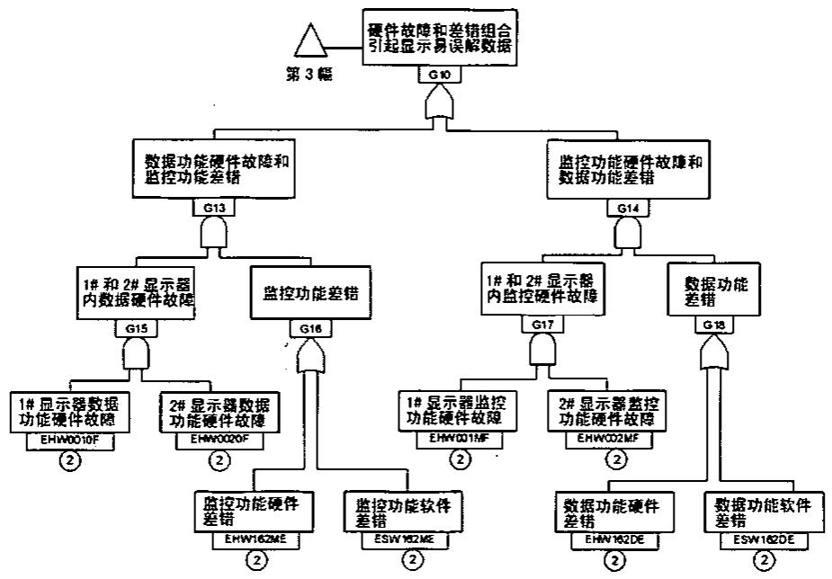  
图D23（续）（共4幅第4幅）

# D.1.3 FTA结果的分析和总结：

故障树构建之后，分析人员必需首先对故障树数据进行规范化，然后进行总结，并用文件证明现行故障树构架是否足以满足顶事件的要求。

# D.13.1 故障树数据分析一 使FTA数值计算规范化：

合格审定当局以术语“每飞行小时失效概率”来表述其安全性要求。如果被分析的系统具有这种类型的要求，则分析人员必须使不希望顶事件失效概率数值规范化。

当以每次飞行为基础来计算  $\mathbf{P_f}$  （top）时，分析人员应将顶事件概率除以飞行时间，或其它相应的时间，以使  $\mathbf{P_f}$  （top）规范化，从而报告每飞行小时的失效概率。

# D.13.2 在 SSA 过程中对故障树分析结果的总结：

总结FTA数据的一种方法是形成FTA数据摘要图表。该图表使用分栏书写的格式，将以易于查索所有相关FTA结果的方式，提供给工程管理人员或合格审定当局评审人员。下表为这类图表的一个示例。

表 D6 系统约定层次 FTA 数据摘要图表示例  

<table><tr><td>安全性
设计准则</td><td>安全性
设计准则</td><td>安全性
设计准则</td><td>分析结果</td><td>分析结果</td><td>分析结果</td></tr><tr><td>顶事件清单
(来自FHA)</td><td>顶事件清单
(来自FHA)</td><td>相应的最大允许概率</td><td>系统发生的概率</td><td>符合性
(符合或不符合)</td><td>纠正措施</td></tr><tr><td>功能号</td><td>说明</td><td></td><td></td><td></td><td></td></tr><tr><td>4A1</td><td>驾驶舱内丧失所有高度显示</td><td>1E-9</td><td>5E-9</td><td>不符合</td><td>重新设计大气数据系统或增加更详细的LRUFTA</td></tr><tr><td>4A2</td><td>两个驾驶员PFD上都丧失主飞行高度显示</td><td>1E-7</td><td>1E-7</td><td>符合</td><td>无</td></tr></table>

注意，填入“相应的最大允许概率”一栏的数字，基于给定顶事件的失效状态分类。

现在，我们可以看到FTA边界与FTA结果总结之间的联系。表D6表明功能4A1不满足系统约定层次上的顶事件安全性要求，而明显的纠正措施，就是通过向下扩大FTA边界到LRU约定层次来增大FTA范围。假设功能#4A1B55是功能#4A1系统约定层次FTA中的初级事件（Primary Event），那么，表D7给出某个LRU约定层次FTA摘要表的示例。

表 D7 LRU 约定层次 FTA 数据摘要图表示例  

<table><tr><td>安全性设计准则</td><td>安全性设计准则</td><td>安全性设计准则</td><td>分析结果</td><td>分析结果</td><td>分析结果</td></tr><tr><td>顶事件清单(来自系统FHA)</td><td>顶事件清单(来自系统FTA)</td><td>相应的最大允许概率</td><td>发生的系统概率</td><td>符合性(符合或不符合)</td><td>纠正措施LRU功能块FTA或硬件/软件更改</td></tr><tr><td>功能号</td><td>说明</td><td></td><td></td><td></td><td></td></tr><tr><td>4A1855</td><td></td><td>1.0E-9</td><td>1.0E-8</td><td>不符合</td><td>执行LRU功能块FTA</td></tr><tr><td>4A1856</td><td></td><td>1.0E-5</td><td>1.0E-7</td><td>符合</td><td>无</td></tr></table>

# 附录E 相关图

注：在 ARP4761 文件的上下文中，其主体部分包含收录入附录 E 内容的信息，故本附录应与该文件主体部分一起使用。

# E.1 引言：

可使用相关图（DD）作为故障树分析（FTA）中表达数据的一种替代方法。就概率分析而言，这种方法对失效组合提供一种替代的图示表达。附录D中对FTA所作的解释和说明的过程和方法，一般也适用于DD。FTA与DD之间的原理差别在于，DD没有附加的逻辑符号，因为，它们通过方框的串联和并联布局来表示逻辑，并且DD不表示出在FTA中作为逻辑符号输出说明而出现的中间事件。DD在分析上与FTA是相同的，且DD在安全性评估中的作用与FTA的作用也是相同的。本附录对处理在附录DFTA过程中未被包含的独特问题提供指导。

# E.2 范围：

本附录解释基本逻辑布置、基本分析程序以及若干不同类型事件的图示表达。当需要支持特定分析时，可对事件的图示表达采取不同的变化和增补。本附录应能使具备故障树分析经验的工程师会使用DD方法。

# E.3 基本逻辑布置：

每一DD图表示一个失效状态（不希望的顶事件）。DD由长方形框构成，这些长方形框代表导致顶事件的故障事件。它们以串联或并联的方式布局。串联链是“或（OR）”情况，而并联链则表示“与（AND）”情况。

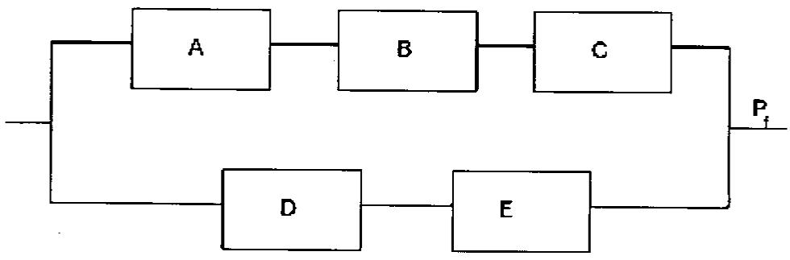  
图E1 串联/并联组合

# E.3（续）：

图E1所示的DD中总的失效状态概率  $\mathsf{P}_{\mathrm{f}}$ ，由下面的方程近似给出：

对于每次飞行，  $P_{f} = (P_{f}A + P_{f}B + P_{f}C)*(P_{f}D + P_{f}E)$  （方程E1）

图E1所示布置是为向读者介绍其基本原理而经简化的。相关图可能变得相当复杂，并且可涉及单一失效在整个图中多次使用，在此情况下，为了完成概率计算和产生最小的割集，将需要应用布尔代数。

所有定性和定量评价中使用的最小割集，与在故障树割集所做的工作是类同的（参见附录D中的下列各小节的内容）。

a. 定性重要性确定（D.10.2）  
b. 共因致命性（D.10.3）  
c. 定量评价：概率计算以及相关公式，与在故障树评价中所使用的相同（D.11）。

可采用与故障树相同的方式将差错并入到相关图中（参见附录D，D.12节）。

# E.4 事件的图示表达：

相关图通常由长方形框构成。为描述不同的失效状态，可使用框在形式上的变化，在方式上与故障树中所用的各种形状变化相似。下面各小节中举例予以说明。

# E.4.1 失效模式：

“实线”框表示被分析系统内部且不需要作进一步展开的失效模式。这与故障树中圆形表示相类似。在PSSA中，该方框应包含失效模式以及与相关风险时间和/或暴露时间相关的预计失效率的说明。在SSA中，可由实际失效率替代预计失效率，并包含取自FMES的数据源引注。图E2是一个来自SSA相关图的示例。

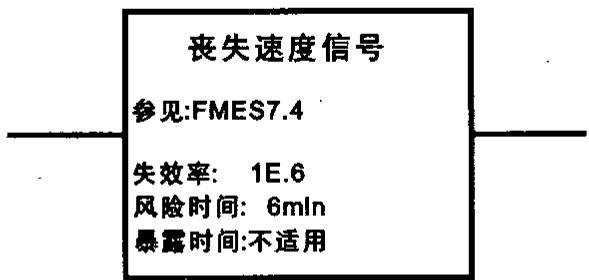  
图E2-系统内部全展开失效模式

# E.4.1（续）：

本示例表示“丧失速度信号”失效涉及到后面的FMES，其失效率为1E-6以及该失效的风险时间为5min。

# E.4.2 失效状态：

用“虚线”画出的长方形框表示被研究系统的另一种失效状态或另一个系统的失效状态。这与故障树分析中一分支树相类似。

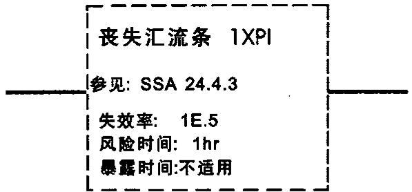  
图E3-系统外部未展开的失效模式或外部失效模式

上面图E3中的示例表明“丧失汇流条1XPI”失效在被引注的SSA中可找到。

具有交叉对角线的框表示不能直接通过其所述的  $\lambda$  和  $\mathbf{t}$  导出失效概率的失效模式。该方框可能是自身右侧进一步的子相关图，并且为了确定其失效概率必须直接被引注。此方框如图E4所示。

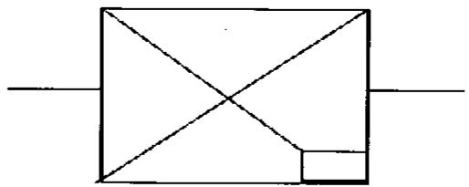  
图E4非直接概率

# E.4.2 (续):

在相关图的概率计算中，当使用这些失效状态方框时，应予以注意。它们仅示出可能包含与被研究的相关图具有共同要素的另一相关图的顶事件。它们也包含与在原始相关图中所考虑的暴露时间不同的暴露时间。

对于所关心的失效状态，应始终用完整的相关图结构来进行计算，并且在计算中不只是简单地使用该失效状态的概率。

# E.4.3 外部事件：

“圆点线”画出的方框，表示飞机外部的事件，例如，结冰条件。

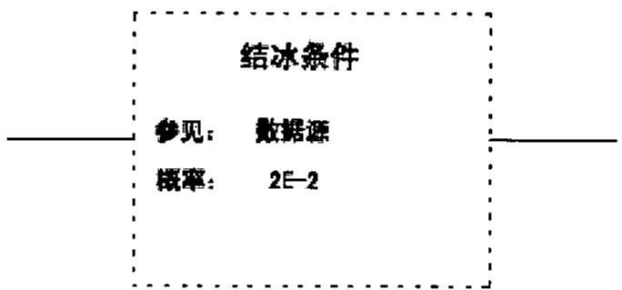  
图E5-飞机外部的失效或事件

上面图E5中的示例表示每次飞行结冰条件出现的概率为2E-2，以及对于该概率的引注。

# 附录F马尔可夫分析（MA）

注：在ARP4761文件的上下文中，其主体部分包含收录入附录F内容的信息，故本附录应与该主体文件部分一起使用。

# F.1 引言：

本附录提供对马尔可夫分析的直观理解，而没有基础数学的复杂性。马尔可夫模型（链）代表各种不同的系统状态，以及它们之间的关系。这些状态或者可能是工作的或者可能是不工作的。从一种状态到另一种状态的变换率是失效或修理率的函数。因为我们能知道开始时间段的系统状态，故我们能预置系统特定状态的概率值为1以及该系统所有其它状态的概率为0。在某时间t，在任何马尔可夫链状态中，有一个有限的概率存在。在所有可能的状态下，存在概率的总和必须等于1。通过解从马尔可夫链派生出的一组微分方程得出状态概率。每个状态是相互排斥的，因为在任何给定时间内，系统仅可能是在一个状态下。最后的失效状态通常是系统的所有冗余度被耗尽的状态或没有任何更多的工作状态。

# F.1.1 背景：

系统的复杂性和规模随着新技术的发展而不断急剧增加。飞机系统越来越依赖“故障容限系统”（fault tolerant system）。这些系统由于对其状态的持续监控以及系统的即时重新构型，故它们几乎从不完全失效。这是真实的，除非外部事件超控该工作。通过应用马尔可夫技术可以更恰当地达到对这种系统的安全性评估过程和评价，给出这种“故障容限”的概要。

对于民用机载系统和设备，终端用户可以利用有效冗余度的效益，来安排维修工作。这种安排是可能的，因为冗余度在较长的时间期内，提供设备的安全性水平。

FTA和DD已广泛用于安全性评估，因为它们从概念上是简单的且容易理解。因此，只要有可能，应使用FTA和DD，但也要认识到如下限制：

a. 困难的是考虑诸如几乎同时发生的故障，瞬态和间歇性故障以及带备件的备用系统各种不同类型的失效模式和相关性；  
b. 构建故障树以评估单一顶事件的原因和概率。如果系统有许多失效状态，那么对于它们中的每一个可以要求构建单独的故障树。

# F.1.1 (续):

在某些情况下，对于用一棵故障树完整地表示诸如可修理的系统以及失效/修理率为状态相关的系统可能是困难的。

马尔可夫分析（MA）不具有上述表达的限制。顺序相关事件自然被包含，因此它们能覆盖很宽的系统状态范围。

在马尔可夫分析中，我们能比较容易地包含与用户工作环境有关的情况，例如航空公司的维修政策，签派要求以及安全性考虑。马尔可夫分析也能控制一次飞行中的若干阶段，状态相关失效率，共模失效，执行能力和性能-可靠性相关性，物理相互连接相关性，时间相关转换，尤其是不完全有效范围。不完全有效范围可能由于潜在失效所引起，且小于  $100\%$  的探测能力。然而，执行马尔可夫分析的缺点是马尔可夫模型的规模可以随部件的数量按指数规律增长。对于一个有“n”个部件的系统，相应的马尔可夫链在最简单情况下可以有多达  $2^{n}$  个状态，虽然当考虑系统的运行时，它通常要少很多。如果任何部件与两个以上状态相关，那么状态的数量还要更大。已研究出有效处理此问题的方法。

表 F1 给出选择用于马尔可夫模型的术语定义。

表 F1- 用于马尔可夫分析的术语定义  

<table><tr><td>吸收状态
(Absorbing State)</td><td>系统进入状态并保持该状态。这意味着从该状态没有输出转换。
如果吸收状态在马尔可夫链中出现，则这些状态之一最后存在的概率将为1。</td></tr><tr><td>各态历经过程
(Ergodic Process)</td><td>除了均匀过程之外，任何状态中存在概率的最后值与初始状态无关。</td></tr><tr><td>扩展的随机Petri网
(ESPN)</td><td>作为详细分析系统从任何类型故障恢复的一种FEHM（故障和差错处理模型）。</td></tr><tr><td>故障和差错处理模型
(FEHM)</td><td>这些是说明有关发生故障系统运行状态的模型。该模型输出故障探测的概率，有效范围(C)，非探测和所谓单点失效的系统失效概率(S)，由于几乎同时发生故障引起系统失效的概率(N)，以及系统从故障恢复的概率(R)。有6个被流行使用的FEHM，他们是直方图，概率和分布，平均和标准偏差，CAREIII, ARIES, 以及ESPN。</td></tr></table>

表F1（续）：  

<table><tr><td>均匀马尔可夫过程
(Homogeneous Markov 
Process)</td><td>状态转换是无记忆的以及状态保持时间是按指数规律分布。部件不
“老化”且在不变的转换率下进行状态转换。</td></tr><tr><td>均匀过程
(Homogeneous
Process)</td><td>所有转换概率和转换率是常数。</td></tr><tr><td>非均匀过程
(Non-Homogeneous
Process)</td><td>衰减保持时间限制的指数。</td></tr><tr><td>执行能力
(Performability)</td><td>此度量是系统可靠性和性能的结合。性能可能是相对于整个系统，平均
工作完成时间，平均燃油消耗等。</td></tr><tr><td>半吸收状态
(Semi-Absorbing 
State)</td><td>系统进入作为连续转换结果的状态，且保持这种状态直到是离散概率
交换结果的检修前为止。</td></tr><tr><td>半马尔可夫过程
(Semi-Markov 
Process)</td><td>转换率可能是特定（局部）时钟的函数，而不是全局时钟的函数。
状态保持时间可能是非指数且可能取决于下一个状态。</td></tr><tr><td>状态空间
(State Space)</td><td>一个系统能获得的所有可能的状态群。</td></tr><tr><td>状态
(State)</td><td>State表示系统的状态。</td></tr><tr><td>刚性马尔可夫链
(Stiff Markov 
Chain)</td><td>包含快慢两种转换，其转换率相差几个数量级。</td></tr><tr><td>随机过程
(Stochastic Process)</td><td>事先不能预测的系统运行状态，但在特定时间内，能规定不同状态的
概率。</td></tr><tr><td>转换时间
(Transition Times)</td><td>在此时间里，发生从一个状态到另一个状态的转换。该转换能发生在
连续的或离散的时标上。</td></tr><tr><td>转换
(Transition)</td><td>从状态到状态具有确定有限概率或转换率的运动。从状态i到状态j
的转换仅取决于状态i和状态j，而不取决于时间的变化。这是为什
么把马尔可夫链称为无记忆系统的原因。</td></tr></table>

# F.2 理论：

任何系统的马尔可夫分析由两部分组成：首先观察系统的运行状态，写出与系统转换和状态相关的方程式，然后使用标准方法解这些方程式。任何系统的状态方程式能够通过检查马尔可夫链来建立。然而，由于数学的复杂性，这种手工方法即使对于简单系统也可能导致错误和遗漏。因此推荐某种形式的模型自动化生成。通常，一个状态概率的改变是由于离开和进入该状态的流动而引起的。沿着一个转换的流动是沿着该转换的转换率和在该转换起点状态概率的乘积。负号表示系统以该转换率离开该特定状态，而正号意味着系统以该转换率进入新的状态。

为了进行说明，考虑如下情况：

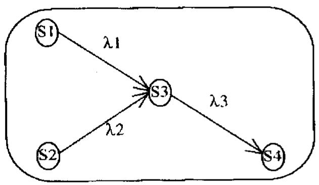  
图F1—输入/输出转换进/出马尔可夫链状态的例子

在该系统中，状态S3有一个时间相关概率值  $\mathbf{P}_3(t)$  。它有分别从状态S1和状态S2来的两条输入弧线，以及到状态S4的一条输出弧线。S1和S2的时间相关概率值分别为  $\mathbf{P}_1(t)$  和  $\mathbf{P}_2(t)$  。从状态S1和S2进入状态S3的转换率分别为  $\lambda_1$  和  $\lambda_2$  。出该状态的转换率为  $\lambda_3$  。S3的状态概率变化率根据状态概率  $\mathbf{P}_1(t),\mathbf{P}_2(t),\mathbf{P}_3(t)$  和转换率  $\lambda_{1},\lambda_{2},\lambda_{3}$  能用下列方程式给出：

$$
\frac {d p _ {3} (t)}{d t} = \lambda_ {1} p _ {1} (t) + \lambda_ {2} p _ {2} (t) - \lambda_ {3} p _ {3} (t) \quad (\text {方 程 F 1})
$$

同样，对于该马尔可夫链的所有其它状态可建立微分方程。这样一组微分方程可使用数学方法，例如拉普拉斯变换来求解。然而，当系统变得更加复杂时，人工解这样的微分方程组是非常麻烦的，且是消耗时间的过程。因此，分析者应使用F.4节给出的方法（例如HARP）来求解马尔可夫链。详细的例子在以下各子小节中示出。

# F.2.1 串联系统：

F.2.1.1 不可修理串联系统：作为例子，我们可考虑一个由两个部件串联的系统。部件A具有  $\lambda_{\mathrm{a}}$  失效/小时的失效率，部件B具有  $\lambda_{\mathrm{b}}$  失效/小时的失效率。另外，它们有共同的失效模式，由于该模式的作用，部件A和部件B同时失效，该失效率为  $\lambda_{\mathrm{c}}$  失效/小时（这种情况不应与部件A和部件B独立失效的逻辑“与”混淆）。该系统的马尔可夫模型在图F2中示出。通过考虑在每个失效层面上的所有可能失效组合（状态）来构建该模型。例如，在0失效层面上（OF），仅有一个状态：部件A和部件B是正常工作的；在1失效层面上（1F），有两个状态，一个为部件A失效，另一个为部件B失效；在2失效层面上（2F），有一个共模失效且两个部件都失效。

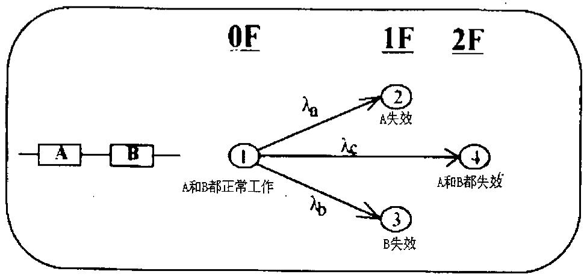  
图F2-简单不可修理串联系统的马尔可夫模型

图2中表示的系统的状态方程为：

$$
\frac {d p _ {1} (t)}{d t} = - \left(\lambda_ {a} + \lambda_ {b} + \lambda_ {c}\right) p _ {1} (t)
$$

$$
\frac {d p _ {2} (t)}{d t} = \lambda_ {a} p _ {1} (t)
$$

（方程F2）

$$
\frac {d p _ {3} (t)}{d t} = \lambda_ {b} p _ {1} (t)
$$

$$
\frac {d p _ {4} (t)}{d t} = \lambda_ {c} p _ {1} (t)
$$

式中  $\mathbf{P}_{\mathrm{i}}(\mathbf{t})$  为状态  $\dot{\mathbf{l}}$  在时间  $\mathfrak{t}$  存在的概率。对于恒定的失效率和初始条件的  $\mathbb{P}(0)$ $= [1000]^{\intercal}$  （T代表转置），可积分该状态方程，得到所有概率值的近似表达形示。它们被给出如下：

F.2.1.1 (续):

$$
p _ {1} (t) = \ell^ {- (\lambda_ {a} + \lambda_ {b} + \lambda_ {c}) t}
$$

$$
p _ {2} (t) = \frac {\lambda_ {a}}{\lambda_ {a} + \lambda_ {b} + \lambda_ {c}} \times \left(1 - \ell^ {- \left(\lambda_ {a} + \lambda_ {b} + \lambda_ {c}\right) t}\right) \tag {方程F3}
$$

$$
p _ {3} (t) = \frac {\lambda_ {b}}{\lambda_ {a} + \lambda_ {b} + \lambda_ {c}} \times \left(1 - \ell^ {- \left(\lambda_ {a} + \lambda_ {b} + \lambda_ {c}\right) t}\right)
$$

$$
p _ {4} (t) = \frac {\lambda_ {c}}{\lambda_ {a} + \lambda_ {b} + \lambda_ {c}} \times \left(1 - \ell^ {- (\lambda_ {a} + \lambda_ {b} + \lambda_ {c}) t}\right)
$$

相对于大时间量，  $\mathbf{P}_1$  (t）  $= 0$  ，  $\mathbf{P}_2$  （t）趋近  $\lambda_{\mathrm{a}} / (\lambda_{\mathrm{a}} + \lambda_{\mathrm{b}} + \lambda_{\mathrm{c}})$

$\mathrm{P_3(t)}$  趋近  $\lambda_{b} / (\lambda_{a} + \lambda_{b} + \lambda_{c})$  ，以及  $\mathbf{P}_4$  (t)趋近  $\lambda_{c} / (\lambda_{a} + \lambda_{b} + \lambda_{c})$  。系统失效率等于  $\mathbf{P}_2$  (t)，  $\mathbf{P}_3$  (t）和  $\mathbf{P}_4$  (t）的总和。

当使用如下所示的任何组合方法时，也能得到与上述相同的解：

在时间t，

P(A失效）=1-

P（B失效）=1-

P（A和B失效）  $= 1 - \ell^{-\lambda_{c}t}$  （共模失效）

现在，由组合方法可得：

P（A或B失效）  $= 1 - \mathrm{P}$  （A和B都不失效）

因此，

P（A或B）=1-（λ+a+λc）t

注意：这是与从马尔可夫链导出的  $\mathrm{P}_2(t) + \mathrm{P}_3(t) + \mathrm{P}_4(t)$  的结果是相同的。

同样，

P（A和B不失效）=

注意：此方程与上述使用马尔可夫方法得到的  $\mathrm{P}_{1}$ （t）是相同的。

F2.1.2 可修理的串联系统：作为例子，我们再次考虑由两个部件串联的系统。部件A具有 $\lambda_{a}$  失效/小时的失效率，部件B具有  $\lambda_{b}$  失效/小时的失效率。另外，它们有共同的失效模式，由于该模式的作用，部件A和部件B同时失效，该失效率为  $\lambda_{c}$  失效/小时（这种情况不应与部件A和部件B独立失效的逻辑“与”混淆）。除失效之外，假设部件A和B以不变的速率  $\mu$  修理。在大多数航空的情况中，修理工作在检查时间间隔的末期进行，因此是一个离散的修理过程。然而，在F2.2.1和F2.2.2的模型中，用连续时间的马尔可夫过程近似表示该离散修理过程。当  $\lambda < \mu$  时，这种近似是有效的。假如修理是一种随机过程，则此模型表示对在F5.1和F5.2中给出的离散修理模型实例的正确解法。当两个部件都失效时，假设修理率为  $\mu_{c}$  。通过选择不同的  $\mu_{c}$  值，我们可模拟各种不同的情况，如单个修理工，多个修理工等。图F3示出这种系统的马尔可夫模型。所有修理在该图中用虚线表示。

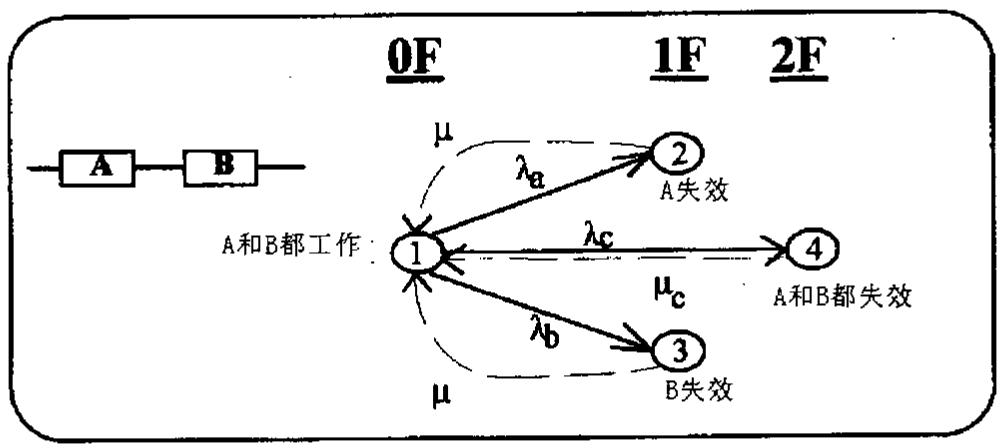  
图F3-简单可修理串联系统的马尔可夫模型

图F3中表示的系统状态方程为：

$$
\frac {d p _ {1} (t)}{d t} = - \left(\lambda_ {a} + \lambda_ {b} + \lambda_ {c}\right) p _ {1} (t) + \mu \left(p _ {2} (t) + p _ {3} (t)\right) + \mu_ {c} p _ {4} (t)
$$

$$
\frac {d p _ {2} (t)}{d t} = \lambda_ {a} p _ {1} (t) - \mu p _ {2} (t) \tag {方程F4}
$$

$$
\frac {d p _ {3} (t)}{d t} = \lambda_ {b} p _ {1} (t) - \mu p _ {3} (t)
$$

$$
\frac {d p _ {4} (t)}{d t} = \lambda_ {c} p _ {1} (t) - \mu_ {c} p _ {4} (t)
$$

# F.2.1.2 （续）：

式中  $\mathbf{P}_{\mathrm{i}}$  （t）是状态i在时间t存在的概率。对于恒定的失效和修理率以及初始条件 $\mathbf{P}(0) = [1000]^{\mathrm{T}}$  （T表示转置)。可积分该状态方程（相似于在F.2.1.1中表明的程序）得到所有概率值的近似表达形式。为了简明起见，它们不在此表示出来。

# F.2.2 并联系统：

F.2.2.1 不可修理的并联系统: 在图 F4 中给出并联系统的马尔可夫模型, 在图 F4 中定义系统失效是部件 A 和部件 B 都失效。由于马尔可夫方法的特性, 顺序相关性能容易地被包含在马尔可夫链中; 即状态 4 和 5。在马尔可夫链中的状态 4 和 5 把导致系统丧失的部件失效的两个可能顺序区分开来。

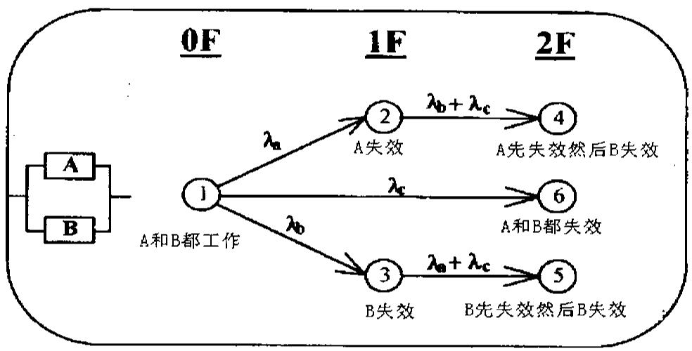  
图F4-简单并联系统的马尔可夫模型

假设部件A和B的失效率分别为  $\lambda_{\mathrm{a}}$  和  $\lambda_{\mathrm{b}}$  ，共模失效率为  $\lambda_{\mathrm{c}}$  ，  $\mathrm{P_i}$  （t）为状态i在时间t存在的概率，该系统的状态方程为：

F.2.2.1 (续)：

$$
\begin{array}{l} \frac {d p _ {1} (t)}{d t} = - \left(\lambda_ {a} + \lambda_ {b} + \lambda_ {c}\right) p _ {1} (t) \\ \frac {d p _ {2} (t)}{d t} = \lambda_ {a} p _ {1} (t) - \left(\lambda_ {b} + \lambda_ {c}\right) p _ {2} (t) \\ \frac {d p _ {3} (t)}{d t} = \lambda_ {b} p _ {1} (t) - \left(\lambda_ {a} + \lambda_ {c}\right) p _ {3} (t) \quad (\text {方 程 F 5}) \\ \frac {d p _ {4} (t)}{d t} = \left(\lambda_ {b} + \lambda_ {c}\right) p _ {2} (t) \\ \frac {d p _ {5} (t)}{d t} = \left(\lambda_ {a} + \lambda_ {c}\right) p _ {3} (t) \\ \frac {d p _ {6} (t)}{d t} = \lambda_ {c} p _ {1} (t) \\ \end{array}
$$

对于恒定的失效率和初始条件  $\mathrm{P}(0) = (100000)^{\mathrm{T}}$  ，状态概率为：

$$
\begin{array}{l} p _ {1} (t) = e ^ {- \left(\lambda_ {a} + \lambda_ {b} + \lambda_ {c}\right) t} \\ p _ {2} (t) = e ^ {- \left(\lambda_ {\mathrm {b}} + \lambda_ {\mathrm {c}}\right) t} \left(1 - e ^ {- \lambda_ {\mathrm {a}} t}\right) \\ p _ {3} (t) = e ^ {- \left(\lambda_ {a} + \lambda_ {c}\right) t} \left(1 - e ^ {- \lambda_ {b} t}\right) \tag {方程F6} \\ p _ {4} (t) = \frac {\lambda_ {a}}{\lambda_ {a} + \lambda_ {b} + \lambda_ {c}} - e ^ {- (\lambda_ {b} + \lambda_ {c}) t} + \frac {\lambda_ {b} + \lambda c}{\lambda_ {a} + \lambda_ {b} + \lambda_ {c}} e ^ {- (\lambda_ {a} + \lambda_ {b} + \lambda_ {c}) t} \\ p _ {5} (t) = \frac {\lambda_ {b}}{\lambda_ {a} + \lambda_ {b} + \lambda_ {c}} - e ^ {- (\lambda_ {a} + \lambda_ {c}) t} + \frac {\lambda_ {a} + \lambda_ {c}}{\lambda_ {a} + \lambda_ {b} + \lambda_ {c}} e ^ {- (\lambda_ {a} + \lambda_ {b} + \lambda_ {c}) t} \\ p _ {6} (t) = \frac {\lambda_ {c}}{\lambda_ {a} + \lambda_ {b} + \lambda_ {c}} \left(1 - e ^ {- \left(\lambda_ {a} + \lambda_ {b} + \lambda_ {c}\right) t}\right) \\ \end{array}
$$

$\mathrm{P}_2(t)$  和  $\mathrm{P}_3(t)$  给出系统在一种功能降低模式下存在的概率；即A已失效而B是工作的，反之亦然。系统失效的概率等于  $\mathrm{P}_4(t),\mathrm{P}_5(t)$  和  $\mathrm{P}_6(t)$  的总和。也在这种情况下，我们能表明从组合方法导出的概率方程与使用如前节给出的相同的讨论得到的方程是相似的。

F.2.2.2 可修理的并联系统：图 F5 给出可修理并联系统的马尔可夫模型。

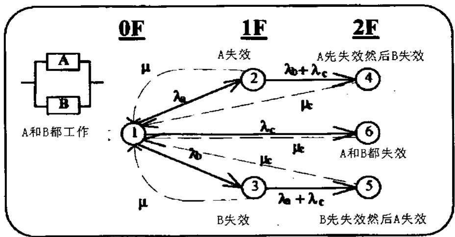  
图F5-简单可修理并联系统的马尔可夫模型

假设仅有一个部件失效的状态以及两个部件失效的状态的修理率分别为  $\mu$  和  $\mu_{c}$ ，它们在图 F5 中用虚线表示。假设部件 A 和 B 的失效率分别为  $\lambda_{a}$  和  $\lambda_{b}$ ，共模失效率为  $\lambda_{c}$ ， $\mathrm{P}_{i}(\mathbf{t})$  是状态 i 在时间 t 存在的概率。该系统的状态方程为：

$$
\frac {d p _ {1} (t)}{d t} = - \left(\lambda_ {a} + \lambda_ {b} + \lambda_ {c}\right) p _ {1} (t) + \mu \left(p _ {2} (t) + p _ {3} (t)\right) + \mu_ {c} \left(p _ {4} (t) + p _ {5} (t) + p _ {6} (t)\right)
$$

$$
\frac {d p _ {2} (t)}{d t} = \lambda_ {a} p _ {1} (t) - (\lambda_ {b} + \lambda_ {c} - \mu) p _ {2} (t)
$$

$$
\frac {d p _ {3} (t)}{d t} = \lambda_ {b} p _ {1} (t) - (\lambda_ {a} + \lambda_ {c} - \mu) p _ {3} (t)
$$

$$
\frac {d p _ {4} (t)}{d t} = \left(\lambda_ {b} + \lambda_ {c}\right) p _ {2} (t) - \mu_ {c} p _ {4} (t)
$$

$$
\frac {d p _ {5} (t)}{d t} = \left(\lambda_ {a} + \lambda_ {c}\right) p _ {3} (t) - \mu_ {c} p _ {5} (t)
$$

$$
\frac {d p _ {6} (t)}{d t} = \lambda_ {c} p _ {1} (t) - \mu_ {c} p _ {6} (t)
$$

如前节所进行的一样，积分上述过程，我们能导出精确的状态概率值。

# F.2.3 马尔可夫分析中故障和误差处理模型（FEHM）：

通常，系统中的故障以非常低的速率发生。探测和处理故障的时间将是非常短的，通常为秒或更小的数量级。这种在故障发生和探测时间上多个数量级的差别，使马尔可夫链变为非常刚性且可靠性模型的求解时间可以非常大。为了减少这种时间，求解的方法能被分成两个部分：第一部分处理系统失效的条件以及所涉及的修理对策，即所谓故障发生和修理模式（FORM)。借助于故障树或马尔可夫链说明系统运行的状态。第二部分定义故障发生后的系统运行状态。此模型，即故障和误差处理模型（FEHM）。计算如下定义的4个概率：

$\mathbf{R} =$  系统发觉发生瞬时故障以及从该瞬时故障恢复的概率；

$C =$  系统发觉发生永久性故障以及成功完成由于冗余组件丧失而产生持久重新构型的概率；

$\mathbf{S} =$  系统由于其不能探测、隔离和/或从发生的故障恢复而失效的概率；

$\mathbf{N} =$  系统由于在处理第一个故障时发生第二个故障（几乎同时）而失效的概率。

在图F6中，示出几种FEHM模型，这些模型能被用于在发生故障的系统中定义这些复杂的工作和相互作用。

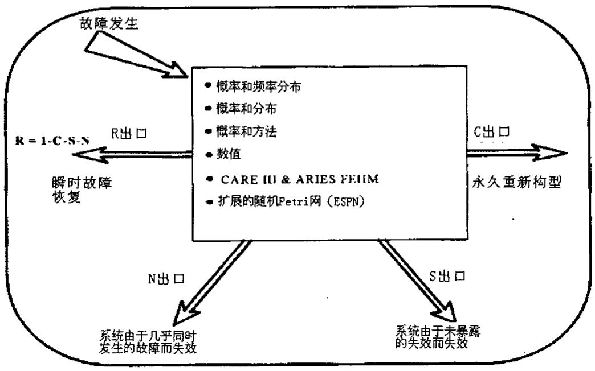  
图F6-通用故障误差处理模型（FEHM）清单

# F.2.3 (续):

如果系统中的故障被探测且系统成功地重新构型为功能降低的模式，那么选择“C”出口。如果系统能探测失效且能诊断故障并从该故障恢复，则选择“R”出口。在此情况下，系统运行状态好象以前没有发生过故障一样。如果系统不能识别故障且该故障导致系统失效，则选择“S”出口。如果当系统试图按照较早的故障重新构型时，系统发生第二个故障，则选择“N”出口。在这种情况下，系统始终被假定为进入失效状态。这些FEHM模型是处理在真实生活中误差恢复情况变异性的“罐装”模型。例如，ARIES FEHM模型处理系统按阶段从故障恢复，这可反映对系统中软件/瞬时故障的不同重试。同样CARE III FEHM模型定义按照探测和隔离率使误差恢复且在故障允许的存储中对于模拟误差恢复的程序是理想的。始终可能定义新的FEHM模型更精确反映误差恢复过程。通过直接输入恢复的马尔可夫链，这是可能的。更详细的FEHM模型在HARP手册中给出。必须理解FEHM模型只是求解方法的一种，但不是唯一有效的求解方法。分析者能使用任何方法，只要该方法的有效性被正确解释和理解。

F.2.3.1 模拟 FEHM 的使用：在如图 F7 说明的一个简单 3 处理机/2 总线组成的系统中，当所有 3 个处理机失效或两总线失效时，该系统失效。每台处理机和每根总线的失效率分别为  $\lambda_{1}$  和  $\lambda_{2}$ 。

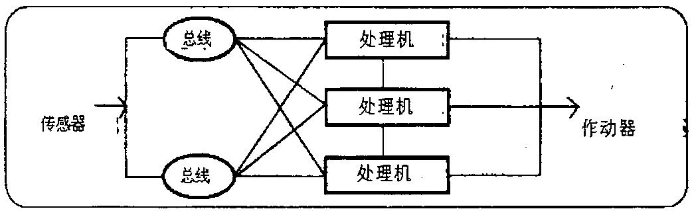  
图F-3处理机/2总线系统的信号流表示

我们通过上述例子的使用，能表明FEHM的模拟。在第1种情况下，我们能解不包含任何FEHM的系统。在此情况下，假设系统在  $100\%$  的时间里能探测出任何故障且紧接着能重新构型到功能降低的模式。在第二种情况下，假设不完全的有效范围。在此情况下，相对于失效，可作出几种决策，例如，故障探测，故障隔离，系统重新构型，系统修理以及由于几乎同时发生的故障引起的系统失效。使用FEHM能模拟所有这些情况。

F.2.3.2没有FEHM的系统模拟（有效范围  $= 1.0$ ）：图F8中表明这种系统的马尔可夫链。状态的维数用两个变量给出  $(\mathbf{X},\mathbf{Y})$  ，其中  $\mathbf{X}$  是系统中起作用的处理机数目，  $\mathbf{Y}$  是系统中工作的总线数目。在完全有效范围的情况下，我们能假设当一台处理机或一根总线失效时，该系统总是成功地转换到下一个冗余（功能降低的）水平（即分别根据处理机或总线失效，从状态（3，2）到状态（2，2）或从（3，2）到（3，1））（见图F8）。

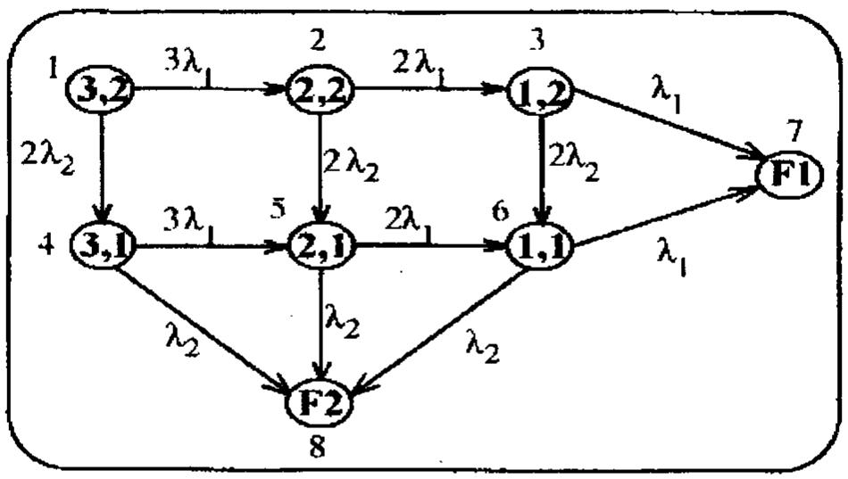  
图F8-没有有效范围的3处理机/2总线系统的马尔可夫链表示

假设Pi（t）代表系统在状态i和时间t的概率。对于本例的状态方程通过检查马尔可夫链被建立并给出如下：

# F.2.3.2 (续):

(3, 2)  $\frac{dp_1(t)}{dt} = (-3\lambda_1 - 2\lambda_2)p_1(t)$  
(2, 2)  $\frac{dp_2(t)}{dt} = 3\lambda_1p_1(t) - (2\lambda_1 + 2\lambda_2)p_2(t)$  
(1, 2)  $\frac{dp_3(t)}{dt} = 2\lambda_1p_2(t) - (\lambda_1 + 2\lambda_2)p_3(t)$  
(3, 1)  $\frac{dp_4(t)}{dt} = 2\lambda_2p_1(t) - (3\lambda_1 + \lambda_2)p_4(t)$  
(2, 1)  $\frac{dp_5(t)}{dt} = 2\lambda_2p_2(t) + 3\lambda_1p_4(t) - (2\lambda_1 + \lambda_2)p_5(t)$  
(1, 1)  $\frac{dp_6(t)}{dt} = 2\lambda_2p_3(t) + 2\lambda_1p_5(t) - (\lambda_1 + \lambda_2)p_6(t)$  （方程F8）  
(F1)  $\frac{dp_7(t)}{dt} = \lambda_1p_3(t) + \lambda_1p_6(t)$  
(F2)  $\frac{dp_8(t)}{dt} = \lambda_2p_4(t) + \lambda_2p_5(t) + \lambda_2p_6(t)$

F2.3.3 具有 FEHM 的系统模拟（有效范围  $< 1$ ）：如果该 3 处理机/2 总线系统包含不完全的有效范围（即存在潜在失效和小于  $100\%$  的故障探测能力）或可能面对瞬时的，间歇的或几乎同时发生的失效，那么我们可使用某种类型的故障和误差处理模型（FEHM）来模拟这些情况。当故障发生时，作为一个持久的故障，系统没有表明它能从该故障状态恢复。图 F6 表明 6 个通用的 FEHM，它们在混合电路自动可靠性预测器（HARP）中是适用的。图 F9 示出具有用来处理系统故障有效范围的马尔可夫链。当故障发生时，有某个小于 1 的概率 C，系统将重新构型到下一个更低冗余度（或功能降低）水平。该故障也不能被探测出，以致严重到它将引起整个系统失效。此失效概率被表示为由于单点故障引起失效（FSPF）的概率。在此马尔可夫链中考虑的另一个失效模式是当故障正被恢复时，第二个故障几乎在同一时间或在重新构型能产生前发生，由于几乎同时发生的故障（FNCF）引起失效。

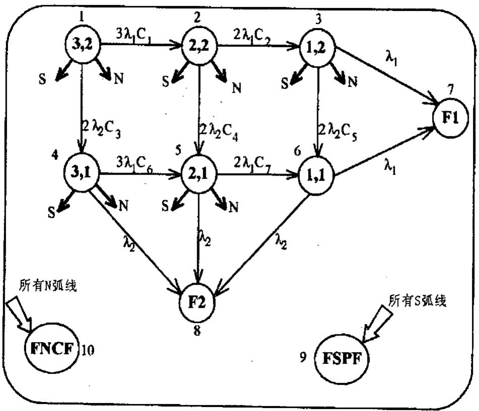  
图F9-带有不完全有效区的3处理机/2总线系统的马尔可夫链表示

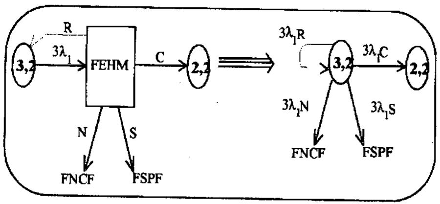  
图F10-在马尔可夫链表示中使用FEHM模型的影响

# F.2.3.3 (续):

这里，从状态（3,2)，该系统以  $3\lambda_{1}$  的失效率进入FEHM，从该FEHM，系统能产生4个出口（每个出口相应于故障条件下的系统运行状态）：

a. 它可能以通过不完全有效范围值给出的有限概率 C 通向状态 (2,2);  
b. 系统诊断该故障并以通过恢复系数给出的概率  $\mathbf{R}$  返回到状态 (3,2);  
c. 故障可能以概率 S 未被探测到并导致系统失效;  
d. 系统可按照首个故障重新构型前，以概率  $N$  在系统中发生第二个故障，系统中的这种双故障导致几乎同时发生的失效。

如图F10所示，马尔可夫链中的每个状态通过插入的C，R，S和N值被改进，然后，解该马尔可夫链。这些值由用户直接提供或由用户给出这些出口的分布由计算得到的。一旦用户提供FEHM，则HARP方法具有适当改进马尔可夫链的能力。

在SURE方法中，FEHM的概念以函数的形式被包含。无论何时部件失效，都可使用一个函数来定义重新构型到具有较少冗余度的系统功能降低状态的平均时间。同样，使用其它函数来定义几乎同时发生的故障。SURE程序的优点在于这样的事实：即这些函数可以是任何分布函数，而不仅局限于指数函数。

# F.3 马尔可夫模型状态空间的减少技术：

马尔可夫模型可能变得非常庞大和复杂。因此，需要开发减少其模型规模的技术。

# F.3.1 状态聚合：

状态聚合是减少马尔可夫链的一种方法。这种方法将具有相同失效率的两个状态聚合到单一状态。下面的例子表明状态聚合的概念。该系统由具有失效率分别为  $\lambda_{1}$ ,  $\lambda_{2}$  和  $\lambda_{3}$  的 3 个处理机组成。如果所有处理机失效, 则假设该系统失效。图 F11 表明该系统的马尔可夫链。

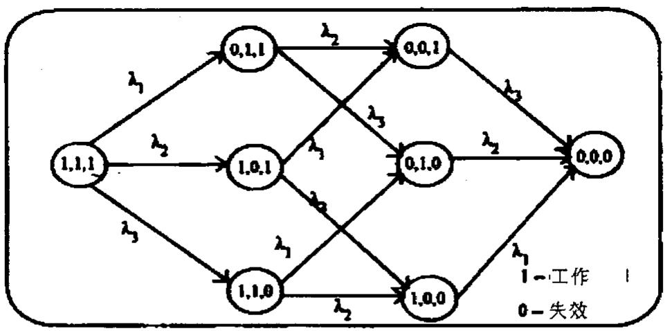  
图F11-3个处理机系统的马尔可夫链表示

# F3.1 (续):

为了说明状态聚合，假设所有处理机是相同的。因此所有部件的失效率用  $\lambda$  给出。在此情况下，等效的马尔可夫链能用图 F11 中相同栏内所有状态的结合而被减化。注意：因两栏之间的任何一对转换是相同的，故这种减化是可能的，且使该马尔可夫链简化为如图 F12 所示的形式。

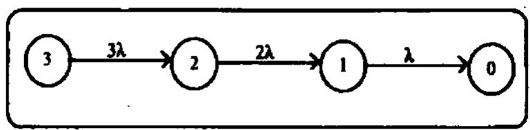  
图F12-使用状态聚合减少3处理机系统的状态空间

我们可观察到在图 F11 中的 1 栏的 3 个状态被聚合为图 F12 中的一个状态。这就将状态总数从图 F11 中的 8 个减少到图 F12 中的 4 个。

这些状态是硬件等效的，因为定义这些状态的故障可能是相同的。它们也是转换等效的，因为当进一步发生故障时，该正在进行系统的可靠性也是相同的。硬件等效的状态不一定是转换等效的，反之亦然。转换等效仅对模型简化是有效的。

# F.3.2 模型截断：

在状态概率非常小的方向上，终止马尔可夫链的生成过程，以此来截断模型，简化马尔可夫链。截断的另一种形式是在系统中发生确定数的失效后，终止马尔可夫链的生成。这假设发现失效数大于截断极限的系统概率是非常小的。使用在图F12中已表明的相同例子，假设该模型在2次失效后被截断，该马尔可夫链则被进一步简化为如下形式：

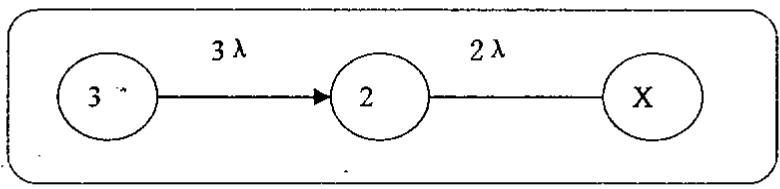  
图F13-使用模型截断方法减少3处理机系统的状态空间

从解这些模型的方法中，我们能确定/验证该整个模型的精确不可靠性处于从截断模型得到的上下边界之间。分析者必须通过评价该上下边界之间的范围来决定有关要求截断的层面。关于系统可靠性的上边界，从假设所有被截断的状态都是工作状态来得到。同样，关于系统可靠性的下边界，从假设所有被截断的状态都是失效状态来得到。这种计算通过诸如HARP，SURE以及其它在下面被讨论的许多方法来进行。

# F.3.3 分层模型：

减少马尔可夫链规模的一种方法是将一个大模型分成许多独立的子模型。如果每个子模型是独立的，则这是能被实现的。为了说明这种情况的例子，我们来研究早先已定义的3处理机（失效率为  $\lambda_{1}$  ）和2总线（失效率为  $\lambda_{2}$  ）组成的系统。如果所有3个处理机失效或两条总线失效，则假设该系统失效。我们能把处理机系统和总线系统分别作为子系统，然后，在组合它们的结果前，分别解该子系统。图F14表明处理机和总线系统的子马尔可夫链。这里必须提醒的是在这些情况下，必须非常仔细评定这些子模型的独立性；在具有部件相关性和包含修理的现行故障容许的系统中，将模型细分为独立的子模型也许不是始终可能的。

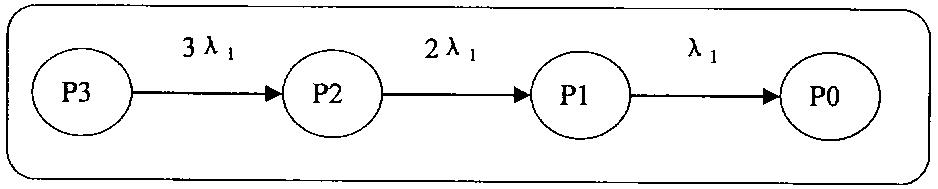

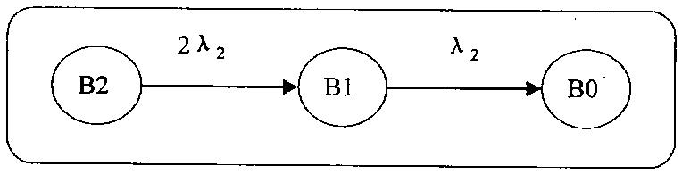  
图F14-处理机和总线系统独立的子马尔可夫链

# F.3.3 (续):

从简单的组合技术，给出系统失效的概率如下：

P（所有处理机或所有总线失效）

$\equiv$  所有处理机失效的概率（概率（P0））  
+ 所有总线失效的概率（概率（BO））  
（概率（P0）） $\star$  （概率（BO））

此方程式是根据处理机和总线子模型之间的独立性假设得出的。

# F.4 现有的方法：

马尔可夫模型的许多求解装置是现存的。下面3种基于马尔可夫方法的计算机（SURE，SHARPE和HARP）已被成功应用到许多大而复杂的问题上。还有其它处理可靠性和可用性问题的方法（SPNP，REST，SURF，ASSURE），但所有这些方法都可被分类为3个方法群。SURE在NASA Langley被开发，而HARP在NASA的同意下，在Duke和Clemson大学被开发。该两种方法都能从NASA得到。SHARPE在Duke大学被开发。

# F.4.1 SURE-半马尔可夫非可靠性范围评定装置和ASSIST程序语言：

SURE 程序使用两边界法则来计算有关系统可靠性的上下边界。SURE 方法的优点是边界从形式上是代数的，因此计算效率是高的。SURE 程序把转换分成快慢两个通道，其中快通道定义系统从故障恢复，而慢通道表示系统失效。一旦通道被定义，SURE 便建立一个从开始状态到最后不希望状态的通道先导清单，并相对通道内每个分支计算通过给出转换函数平均值和分布的通道的概率。该程序能解大而复杂的马尔可夫模型。因为 SURE 能处理恢复时间的一般分布，所以在单一转换中能获得总故障处理过程。输出包含如下信息：

# F.4.1 (续):

a. 有关全部系统失效概率的上下边界；  
b. 相对模型中每个不希望事件的概率边界；  
c. 模型中每个通道的清单以及其通过的概率。

被称为ASSIST的相关程序能产生与SURE相一致格式的马尔可夫模型。然而，我们必须学会ASSIST程序语言，以输入数据。由于边界算法的限制，故稳定状态解或机群的平均概率不能使用SURE来计算。

# F.4.2 SHARPE-符号分层自动可靠性/性能评定装置：

SHARPE使用户能构建混合的和分层的系统模型。建立混合模型将马尔可夫模型的柔性和组合式方法的有效性结合起来。内装式模型类型是：可靠性方块图，故障树，可靠性图表，马尔可夫链，非周期性的或不可简化的半马尔可夫链，单一和多链乘积形式行列网（这些类型是马尔可夫链的串联），广义随机Petri网（系统的有限状态机构说明），以及串联-并联工作图表。分层模拟使预先定义的子模型聚合，因而避免大状态空间和刚性两方面的问题。

SHARPE 的方便使用和有效性使其成为初步设计过程的一个非常有用的方法。

# F.4.3 HARP-混合自动可靠性预测装置：

在HARP中减少状态空间的主要方法是运行状态的分解。可靠性模型被分成快慢两类模型。故障发生修理模型（FORM）被单独分析。FORM包含有关硬件冗余度修理程序结构方面的信息，且能被规定或者作为故障树，或者作为马尔可夫链。有效范围模型（FEHM）允许对3种故障类型，即持久的，间歇的以及瞬态故障所必需的恢复程序进行模拟。用户可得到7种不同类型的FEHM。HARP接受所有输入参数的名义值和变化。此外，HARP支持与韦伯失效分布有关的时间相关失效率模拟。这种能力仅对不可修理的系统适用。输出文件包含有关用户规定状态概率的信息。如果输入是故障树，则HARP提供不可修理系统马尔可夫链的自动生成。

对于故障容限系统，在飞行开始时，部件可能工作或可能不工作。部件按航空公司的维修计划，以不同的预定时间进行维修。因此，可能一个或多个冗余部件在飞行开始前已失效（潜在的或其它方面的）。另一种情况处理一次飞行的不同飞行阶段，在不同飞行阶段中，部件可能有不同的失效率或不同的部件群是工作的。

# F.5 例子：

下面给出航空系统中具有重大意义的一些建立马尔可夫模型的例子。任何方法都能被用来产生和求解方程。为了简便起见，这里不表示出方程式。

下面所示的一些马尔可夫模型，是相对于潜在故障提出了建立模型的方法，可以处理这些结果，以导出的最不利情况的失效概率和平均失效概率。这些模型提供失效概率矢量，而每个矢量相应于每次飞行的系统失效概率。使用这些数值，最不利情况失效概率的估计取用上次飞行的失效概率来进行计算。为了计算整个维修检查时间间隔期间的失效概率平均值，我们可以从总计每次飞行结束时的所有失效概率值被飞行次数去除来得到。

# F.5.1 使用不连续修理过程建立潜在故障模型：

如果已知一个部件在飞行开始时是工作的，那么可靠性计算是基于相等于飞行时间长度的暴露时间。某些飞机系统包含每次飞行不进行检查的部件。这类部件的失效被称为潜在失效，因为它们没有被探测，除非另一个失效发生或执行预定的检查。有几种可能情况取决于主动和备用系统是否都是潜在的或被监控的事件以及故障顺序是否重要或不重要。在从图F15到F18中的虚修理弧线表示在固定的时间间隔期间的不连续修理。从系统失效状态F提出的修理没被表示出来，因为这些修理取决于维修政策（即修理可能是局部的或是完全的）。某些重要的情况以及相对于这些情况的马尔可夫模型在下面给出。

a. 情况 I: 由一个部件和一个监控器组成的系统。

每次飞行前检测部件，以证实它是工作的以及是否需要被修理。每次飞行前不检测监控器，但在一个维修时间间隔内被定期检查。因此，监控器的失效可能是潜在的。在可靠性分析中，我们必须把部件的监控失效和非监控失效区分开来，因为非监控失效的牵连可能更严重。在本讨论中，我们仅探讨非监控失效的概率计算。只有当监控器在部件前失效的情况，才发生非监控失效。这种情况的马尔可夫模型在图F15中给出。如果要求飞行结束时的检查和修理，则用如图F15中带虚线的参数  $\mathfrak{m}_{\mathrm{f}}$  来表示。如果要求定期检查和修理，则用如图F15中带虚线的参数 $\mathfrak{m}_{\mathrm{t}}$  来表示。后面在从图F16到F18中表明的所有马尔可夫模型都是如此。在图F15中，  $\lambda$  为部件的失效率以及  $\beta$  为监控器的失效率。

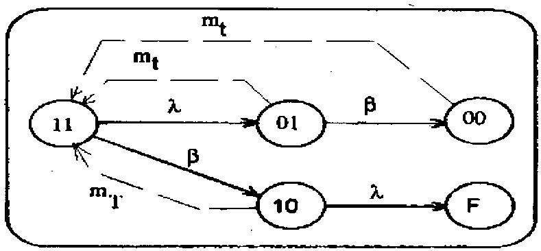  
图F15-相对于一个部件和一个潜在失效监控器组成系统的马尔可夫链

# F.5.1 (续):

b. 情况 II：由一个部件和一个备用件组成的系统。

每次飞行检测部件，如果发现有故障，则进行修理。备用件仅在维修时间间隔内进行检查。如果在部件失效时，备用部件已失效或如果备用件在与部件相同的飞行中失效，则系统发生失效。这不同于情况1，情况1是监控器在部件失效后失效，而在同一次飞行中，将不包含非监控失效。本情况的马尔可夫模型在图F16中示出，在该图中， $\lambda$  为部件的失效率， $\beta$  为备件的失效率。

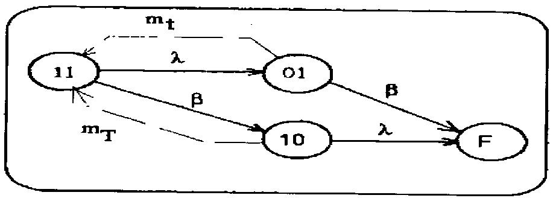  
图F16相对于一个部件和一个潜在失效备件组成系统的马尔可夫链

c. 情况 III: 由两个部件组成的系统。

当两个部件系统的一个部件失效时，备用件取代其工作，但没有任何这种情况发生的指示。每次飞行检测该系统，以确保其是工作的。该检测确保至少两个部件中的一个是工作的。在定期维修时间间隔内检测各个部件。对于这种情况的马尔可夫模型在图F17中表明。两个部件在定期检查时间间隔结束时被修理，如模型中用虚线表示的。在每次飞行结束时，状态概率被调节到0，以考虑在任何飞行开始时至少一个部件起作用，系统是工作的事实。

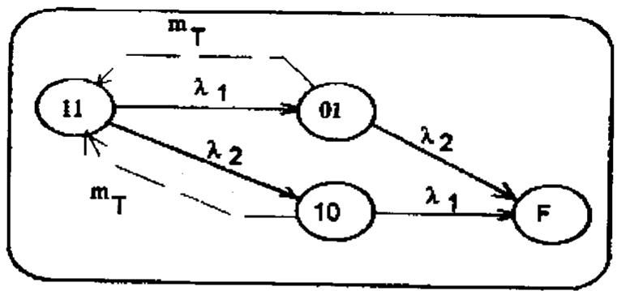  
图F17-相对于两部件组成的系统，两部件都潜在失效的马尔可夫链

# F.5.1 (续):

# d. 情况 IV: 由  $\mathbf{n}$  个部件组成的系统

当  $n$  个部件组成的系统中的一个部件失效时，则其中一个备用件代替其工作，但没有任何发生这种情况的指示。每次飞行检测该系统，以确保其是工作的。这种检测确保至少  $n$  个部件中的一个是工作的。在固定的维修时间间隔  $T$  内所有部件中的每一个都要被检查。对于3部件组成系统的马尔可夫链表示法在图F18中表明。在该模型中，所有修理时间间隔是该所有部件的定期检查时间间隔。在每次飞行结束时，失效状态概率被调节到0，以考虑在任何飞行开始时，至少有一个部件起作用，该系统是工作的事实。

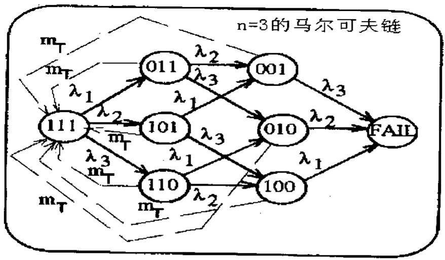  
图F18-相对于3部件组成的系统，所有部件潜在失效的马尔可夫链

# F.5.2 定期维修的例子：

作为一个例子，我们研究一个由左、右发动机组成的双发动机系统，假设每台发动机有两个控制器，如图F19所示。当所有4个控制器的功能度丧失时（马尔可夫链中的状态9）系统失效。当一个或多个控制器失效时，该系统的功能降低。当一台发动机的两个控制器丧失时，可以作为按常规的一种非签派状态。在该图中，表示在虚线左侧的所有状态是不可签派的状态。然而，失效定义（情况）能被改变以计及最低设备清单（MEL）。在该例子中，假设系统的每个状态具有不同的失效率。

如果在飞行结束后修理左发动机，那么我们能毫无疑问地知道该发动机的两个控制器在下次飞行开始时是完全工作的。换句话说，在下次飞行开始时的马尔可夫链中，对于左发一个控制器的失效概率应为0。这导致状态3，4，6，7，8，9的概率（图F20中的阴影部分）在下次飞行开始时预置为0。用户应知道状态概率的这种重新分布在HARP的改进版本中可以用计算机进行计算。用户必须规定左发动机被提增到全工作状态且程序完成其余的工作。

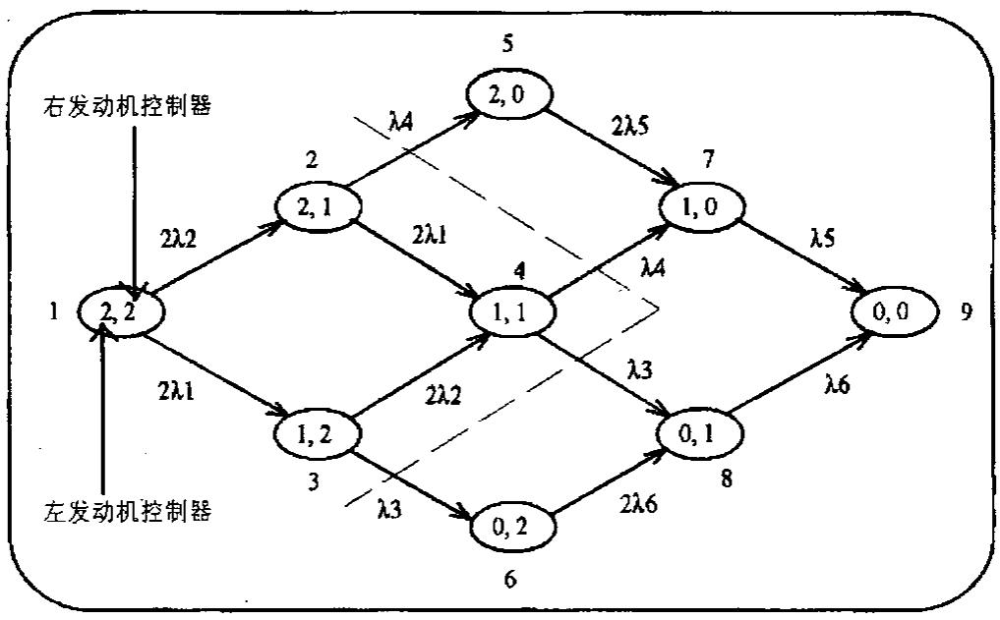  
图F19-双发动机例子的马尔可夫链

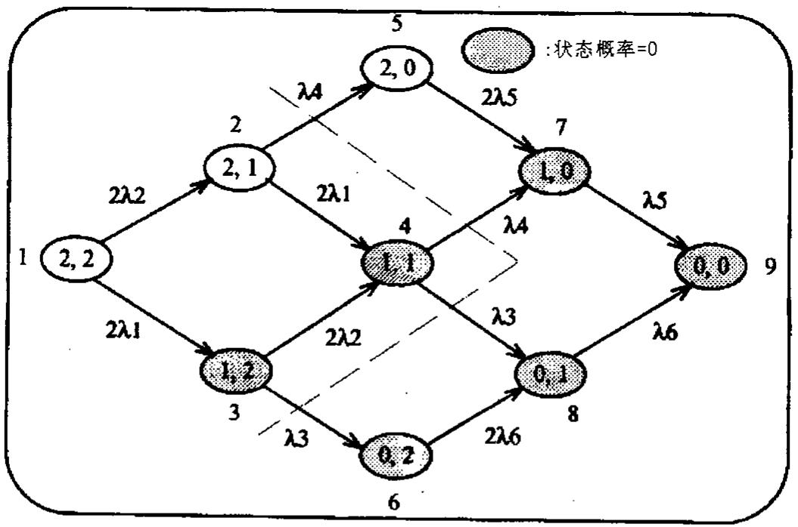  
图F20-当左发动机在下次飞行开始增至全工作状态时马尔可夫链的改变

# F.5.2（续）：

同样，当右发动机在飞行结束时被修理时，我们也能毫无疑问地知道，在下次飞行开始时，该发动机的两个控制器将是完全工作的。换句话说，在下次飞行开始时的马尔可夫链中，右发动机一个控制器的失效概率应为0。这导致2，4，5，7，8，9的状态概率（图F21中浅阴影所表示的）在下次飞行开始时被预置为0。

此例表明，当允许用户规定不同的维修情况时，建立马尔可夫模型的实用性。

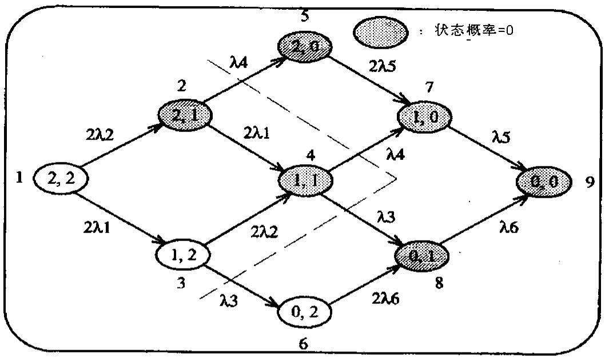  
图F21-当右发动机在下次飞行开始时增至完全工作状态时马尔可夫链的改变

# F.5.3 多阶段例子：

考虑与前节给出的双发相同例子，假设系统有两个阶段。在第1阶段，系统开始，在两台发动机的两个控制器都完全工作的状态启动。现在，假设在第2阶段，已知左发动机的两个控制器失效，我们必须估计系统特定的风险。这里，特定的风险是指在给出的已知不工作签派条件（即左发动机两个控制器失效）下飞行相继发生的风险。要弄清这个问题，我们必须知道该系统能安全运行多长时间，而在规定的时间期内，飞机在最近的机场着陆。

第1阶段的马尔可夫链与在图F19中示出的相同。在第2阶段，因为假设左发动机失效，系统中仅有3个状态：右发动机或者2个或者1个或者没有控制器是工作的。对于第2阶段生成的马尔可夫链在图F22中示出。假设系统的工作至少与右发动机一个控制器的工作一样长久。因为我们假设在第2阶段开始时，左发动机已失效，故状态1，2，3，4，5和7在第2阶段开始时被预置为0。在第2阶段结束时的结果，给出事实上开始降低构型阶段系统的特定风险。

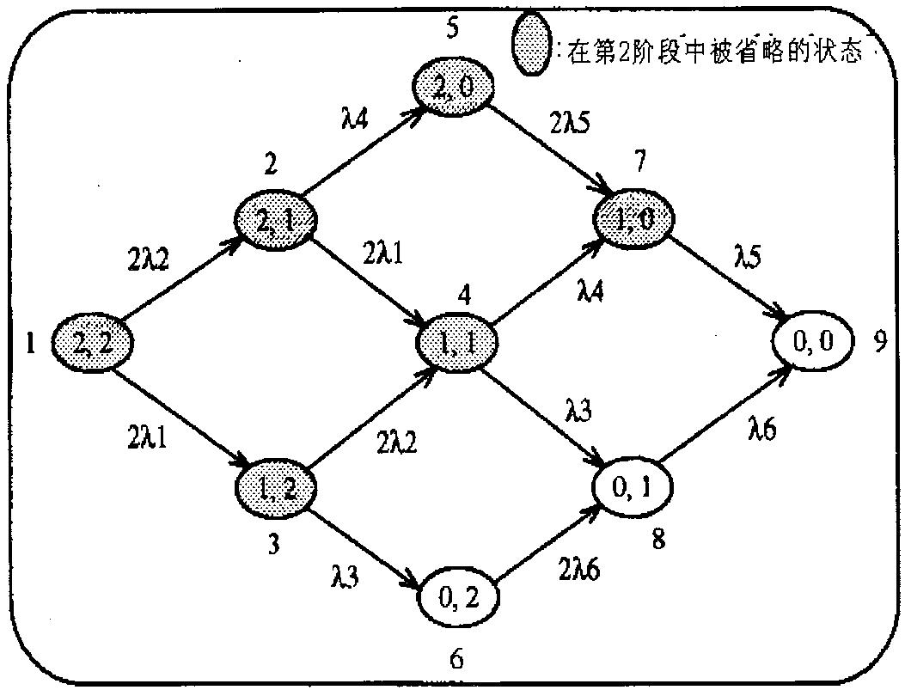  
图F22-相对阶段2构型马尔可夫链的改变在阶段2中，所有带阴影的状态从马尔可夫链省略

# F.5.3 (续):

软件方法 HARP 和 SURE 可以被改进以包含多阶段分析和定期维修情况。

# 附录G

# 失效模式和影响分析（FMEA）

注：在上下文中，ARP4761文件主体部分包含收录入附录G内容的信息，故本附录应与该文件主体部分一起使用。

# G.1 引言：

失效模式和影响分析（FMEA）是一种识别系统、组件、功能或单个零部件失效模式并确定其对接着的更高层次设计所产生影响的系统性方法。也可确定对每一失效模式的探测方法（如果有的话）。FMEA可以是定性分析，也可以是定量分析，并且可在所有类型的系统（例如，电气电子系统或机械系统）上实施。如果执行定量FMEA，则对每一失效模式确定失效率。可将FMEA的结果用于产生失效模式和影响摘要（FMES），并且通常用于支持系统安全性评估(SSA)过程的其他分析技术，诸如，故障树分析(FTA)、相关图（DD）、马尔可夫分析（MA)。通常，不将失效组合看作是FMEA的一部分。

# G.2 范围：

通过假设所选择层次具体执行过程失效的方式，在一给定层面（系统、组件等）上实施FMEA。相对于设备的每个运行模式，在给定层次以及通常紧接着的更高层次上，确定每一失效模式的影响。有时，当需要支持自上而下的FTA，DD或MA时，可将FMEA针对特定的运行情况。

FMEA应说明与安全性有关的所有影响，以及被要求所识别的任何其他影响。在不可能识别某一失效模式的具体特征情况下，应假设最不利情况影响。如果相对于故障树，该最不利情况是不可接受的，则应在较低的约定层次上核查这些失效模式。（即，如果在功能级上进行FMEA，则降低到单个零部件级，并排除对所研究事件无影响的部件。如果在单个零部件级上进行分析，则降低到考虑零件范围内具体失效的机理。另一种选择是重新设计，以改进冗余度或增加监控。）

不管在何层次上执行FMEA，FMEA的主要步骤都包括准备、分析和制成文档。

# G.3 FMEA 过程：

# G.3.1 FMEA 准备：

FMEA准备包括确定用户要求，获得现行的文件，并弄懂功能的运行。

重要的是在开始之前，了解用户对FMEA的期望和要求。如果不了解FMEA要求，则该FMEA不可能满足委托人的需求，并且可能不得不返工重来。

有关FMEA的要求，通常来源于PSSA的工作，诸如，FTA、DD或MA。分析人员需要了解分析的级别（功能级与单个零部件级）、与安全性有关的影响、有利害关系的其他失效影响和运行模式。FMEA通过提供失效率，以量化FTA、DD或MA的基本事件，用于支持安全性评估过程。FMEA通过将FMEA失效模式与故障树的基本事件进行比较，也用于支持FTA验证。

开始执行分析前的最后一个步骤是获得下列信息，这些信息对于完成分析可能是必需的，或者可以使分析工作简化。

a. 包括与安全性有关的以及所要求的失效影响和有利害关系的特定运行模式的 FMEA 要求；  
b. 技术规范；  
c.现行有效图纸或原理简图；  
d. 每一系统或组件的零件清单；  
e. 功能方块图；  
f. 包括工作原理的说明性材料；  
g. 适用的失效率清单 (G.3.2);  
h. 以前产生的或相似功能的 FMEA;  
i. 原理简图上尚未包括的任何设计更改和修正（注：设计可能频繁更改，而具有最新的资料将减少FMEA的补充材料。）；  
j. 取至先前FMEA的初步部件失效模式清单。

注：对于在设计阶段早先所执行的FMEA，将得不到上述所列的某些信息，且可能不得不进行假设或估计。必须保存这些假设的详细文档，以便追溯并简化以后的更新。

# G.3.2 执行分析：

分析人员需要评审和弄清在先前所说明的准备阶段所收集到的信息。分析人员还将发现，这有助于了解被分析设计在紧接着的较高层次范围内执行的功能。在分析人员获得足够的认识之后，对失效模式进行识别。在被分析设计的层次上假设每一种可能的硬件失效模式。对组成该给定层次的部件或功能的失效模式予以考虑。在G.3.2.1和G.3.2.2中，提供有助于确定功能或部件失效模式的信息。

对所识别的每一个失效模式，进行分析，以确定其对给定层次的影响，通常还确定对更高层次的影响。对每一不同类型的影响确立失效影响分类，并且可对每一失效影响分类分配一个代码。规定这些代码，通过将每一影响说明从FMEA工作单转移到报告的主体部分，简化了FMEA工作单。FMEA工作单提供一份失效模式、影响和失效率的清单。下面各节中将给出FMEA工作单样例。每一影响分类必须仅有一个更高层次的影响，否则，应更详细地定义该影响分类。例如，如果初始时影响分类定义为“引起信号xyz超出技术规范值”，而高出技术规范值的状态所引起的影响，与低于技术规范值的状态所引起的影响并不相同，则应将影响分类分为“高出技术规范值”和“低于技术规范值”。同样，如果发现失效模式引发2个较高层次的影响（例如，丧失信号A和丧失信号B），则应将这两者组合，以形成一个新的影响分类“信号A和B皆丧失”。

在FMEA工作单范围内，通常确定探测失效所用的方法并制成文件。探测方法的例子包括通过硬件和软件监控器的探测、飞行机组探测、通电探测以及维修检查。

对于定量的FMEA，相对于每一失效模式赋予一个失效率。凡可能时，应根据已经在外场使用的类似设备的失效数据来确定失效率。也可使用工业来源的失效率，包括，MIL-HDBK-217，MIL-HDBK-338，RAC“非电子零件的可靠性数据”（NPRD）和GIDEP（政府工业数据交换大纲），MIL-HDBK-978以及Rome实验室“可靠性工程师工具包”。可在一览表中详述每一失效影响分类的总失效率，或在失效模式和影响摘要（FMES）中进行综述（参见附录H）。

有两种基本类型的FMEA，即功能FMEA和单个零部件FMEA。通常，进行功能FMEA，以支持按需要采用单个零部件FMEA来执行的安全性分析工作，以进一步明确表达失效率。当来自功能FMEA较保守的失效率将使系统或组件不能满足FTA失效预计概率时，通常要进行单个零部件FMEA。单个零部件FMEA对于依赖冗余度的系统也是有用的，因为功能FMEA不能揭示影响一个以上冗余度元件的单个部件失效。单个零部件FMEA对于机械组件和装配件的安全性分析也是有用的。

G.3.2.1功能FMEA：可在任何约定层次上执行功能FMEA。根据系统的复杂程度以及分析的目标，确定相应细分的层次。如果需要分析的是电路的一部分或比某个具体功能装置要大的机械装置，应将其细分为功能块。对于飞机级或系统级，这可能意味着定义每一LRU或组件作为功能块。对于系统级或更低等级，这可能涉及将一个组件细分为许多功能块。如果每一功能块具有可能少的输出，则FMEA工作被简化。一旦确定功能块，应建立功能方框图，并且以每个功能名称标示其功能块。对于每一功能块，应相对系统运行，分析内部和接口功能。

下一步是对每一功能块假设失效模式。通过考虑有关功能块的目的并尝试确定该功能如何可能失效而不管所使用的具体零部件如何，确定失效模式。分析人员必须非常了解功能块的工作以至不会忽略任何重要的失效模式，包括可能影响一个以上冗余度功能块的单个部件失效。常常，给出功能块功能的明确说明，许多失效模式将变得明显了。

下面是功能失效模式的一个简单例子：

可将产生5V电压的电源电路称之为功能块。该功能失效模式的某些例子列举如下：

a. 丧失5V电压；  
b. 电压低于5V；  
c. 电压高于5V；  
d. 在5V时有噪声；  
e. 对地短路或其他电压。

可能还存在基于电路执行的其他失效模式。

通过考虑该功能如何适合整个设计，确定每一失效模式的影响。通常，对每一影响类型确立失效影响分类，并指派一个失效影响分类代码。将引起这一相同影响的所有失效模式分配给该影响分类。然后，相对每个失效可将影响分类输入到每一FMEA工作单，如表G1所示。在确定失效影响和探测方法时，必须考虑软件和故障监控器。作为此分析的一部分，分析人员还必须验证该监控装置确实可探测该失效模式。为了正确执行此分析，分析人员必须详细了解系统要求和软件设计（包括内部故障管理技术）（若适用）。

如果执行定量分析，则相对每一失效模式分派一个失效率。一种方法是相对每一功能块进行失效率预计，并基于过去的相似功能的经验或可确定发生概率的其他来源，分配失效率，贯穿到各个不同的失效模式。在G.3.2.2.1节中，提供有关零部件失效分配的指南。

表G1 功能FMEA 工作单  

<table><tr><td colspan="8">故障模式和影响分析(FMEA)</td></tr><tr><td colspan="3">系统:</td><td rowspan="2" colspan="4">FMEA说明:</td><td>日期:</td></tr><tr><td colspan="3">子系统:</td><td>共页第页</td></tr><tr><td colspan="3">组件ATA:</td><td colspan="4">FTA引注:</td><td>卷宗:</td></tr><tr><td colspan="3"></td><td colspan="4">制表人:</td><td>修订:</td></tr><tr><td>功能名称</td><td>功能代码</td><td>失效模式</td><td>模式失效率</td><td>飞行阶段</td><td>失效影响</td><td>探测方法</td><td>备注</td></tr><tr><td></td><td></td><td></td><td></td><td></td><td></td><td></td><td></td></tr></table>

注：此表可以被修改，以适合分析层次和大纲的需要

# G.3.2.1（续）：

将功能FMEA的结果，记录在类似于表G1的工作单上。可修改这一样例表格，以满足大纲的需求。不同的要求可能导致添加或删除某些信息。在开始分析之前，分析人员应确保FMEA的格式和内容满足委托人的具体要求。

随着分析的进展，应正式记录下列信息，以便未来保存FMEA，并有助于解决有关FMEA的问题。

a. 证明每一失效模式的正确性；  
b. 分派失效率的合理性；  
c. 将某个具体的失效分派到其失效影响分类的合理性；  
d. 所作任何假设的文档。

通常，该文档不包括在FMEA报告中，但留作参考。

G.3.2.2 单个零部件 FMEA: 单个零部件 FMEA 类似于功能 FMEA, 但不是在功能级或方框图级上的分析, 而是对包含在组件或功能中的每一独立部件的失效模式进行分析。单个零部件 FMEA 可用于确定可能的电气、电子或机械失效的失效影响。例如, 可将一电阻或一马达轴的失效影响看作是单个零部件 FMEA 的一部分。通常, 仅当功能 FMEA 较为保守的结果使组件不能满足 FTA 失效概率预计时, 才对电子设备进行单个零部件 FMEA。这部分原因是由于难于确定复杂部件的失效模式。

单个零部件FMEA的第一步是建立由FMEA所涉及到的所有部件清单。下一步是确定每种类型部件的失效模式。这乃是单个零部件FMEA中最困难的部分，尤其是对包含复杂集成电路的电子组件上执行FMEA。确定除最简单的部件（它们有工业数据可供使用）以外的任何部件的所有失效模式是极为困难的，有时是不可能的。当有疑问时，必须作出零部件失效模式的最不利情况假设。在G.3.2.2.1节中，包含有助于确定部件失效模式的信息。

一旦确定某个部件的单个零部件失效模式，则将它们输入到表G.2所示的FMEA工作单。可对这一工作单样例进行修改，以满足各自的需求。不同的要求可能导致在工作单内添加或删除某些信息。在开始分析之前，分析人员应确保FMEA的格式和内容满足委托人的具体要求。

表G2 单个零部件FMEA工作单  

<table><tr><td colspan="8">故障模式和影响分析(FMEA)</td></tr><tr><td colspan="3">系统:</td><td rowspan="2" colspan="4">FMEA说明:</td><td rowspan="2">日期:共页第页</td></tr><tr><td colspan="3">子系统:</td></tr><tr><td colspan="3">组件ATA:</td><td colspan="4">FTA引注:</td><td>卷宗:</td></tr><tr><td colspan="3">功能:</td><td colspan="4">制表人:</td><td>修订:</td></tr><tr><td>件号</td><td>零件型号</td><td>失效模式</td><td>模式失效率</td><td>飞行阶段</td><td>失效影响</td><td>探测方法</td><td>备注</td></tr><tr><td></td><td></td><td></td><td></td><td></td><td></td><td></td><td></td></tr></table>

注：此表可以被修改，以适合分析层次和大纲的需要

# G.3.2.2（续）：

下一步是确定失效对紧接着的较高层次装配件的影响，并对该失效分配失效影响的分类。相对每个失效影响分类可分配失效影响代码，以简化表格。然后，可将每一失效影响分类的详细说明包含在报告的正文中。将引发这一相同影响的所有失效模式分配给该影响分类。然后，对于每一失效，可将影响分类代码输入FMEA工作单，如表G2所示。在确定失效影响和探测方法时，应考虑软件和故障监控。作为本分析的一部分，分析人员还应验证，监控装置确实可探测到失效模式。为了正确执行本分析，分析人员必须具有有关系统要求以及软件设计（包括内部故障管理技术）的详细知识（按适用而定）。

如果进行定量分析，则将失效率分配给每一失效模式。在G.3.2.2.1节，给出有关零部件失效分配的指南。

随着分析的进展，应正式记录下列信息，以便未来保存FMEA，并有助于解决有关FMEA的问题。

a. 证明每一失效模式的正确性；  
b. 分派失效率的合理性；  
c. 将某个具体的失效分派到其失效影响分类的合理性；  
d. 所作任何假设的文档。

通常，该文档不包括在FMEA报告中，但留作参考。

G.3.2.2.1 确定单个零部件失效模式和失效分布：当进行单个零部件FMEA时，可能有必要进一步细分部件的失效率，以识别适用于具体失效模式的失效率百分比。可从工业用文件（诸如RAC的“失效模式/机理分布”（FMD）、MIL-HDBK-978以及Rome实验室“可靠性工程师工具包”获得这方面的指南，这些指南给出许多类型部件这方面的信息。

考虑的典型失效模式包括下列方面，但不仅限于这些：

a. 开路  
b. 短路  
c. 参数漂移  
d. 超出调节范围  
e. 绝缘破裂  
f. 断续工作  
g. 不工作  
h. 假工作  
i.磨损  
j. 机械失效  
k. 粘滞  
1. 松动  
m. 摩擦

通常，必须考虑部件功能，以及必须考虑将不能正确执行此功能的部件的所有潜在方式包含在该部件的失效模式清单内。也必须考虑部件的非预定功能。上面所引注的文件，为使分析人员能确定被分析部件的潜在失效模式提供了良好的基础。工程判断是失效模式确定过程的必要部分。

当失效率和失效模式源文件为某些类型的部件失效模式提供基础的同时，有许多装置类型未包括在这些文件中。对于需要按逐一零件加以考虑的复杂数字集成电路，这一点特别真实。数字装置失效模式的确定，通常要求工程判断，并且，对于某一复杂的数字集成电路，确定所有失效模式，几乎是不可能的。

判断复杂数字装置模式的方法是采用构建功能块（对此，可能存在更好定义的失效模式），使被分析的数字装置模型化。如果可能，识别功能块可能失效的插针级影响，作为装置失效模式。某些故障可能影响多个插针和各种插针组合。对可能导致FTA基本事件的潜在部件失效模式，必须予以特别注意。

# G.3.2.2.1（续）：

对于集成电路，不建议试图通过失效方法的物理性质来确定实际的失效机理和相关影响，因为这迫使分析人员对每一数字集成电路执行FMEA。这种“FMEA”可能比完成的较高层次的FMEA更为复杂，且相对于复杂集成电路甚至是不可能的。此外，由于芯片制造商加强保持秘密的设计，可能使整个努力变为白费。复杂集成电路的失效模式可能包括间隙故障以及可能影响多个插头引线的各种故障组合。

与集成电路相比，更易于得到其他部件类型的失效模式。但是，对于相同部件类型，查看不同的源将产生不同的失效模式分布，有时甚至是不同失效模式。这点表明，即使对于某个简单的部件，仍然难于确定哪一个潜在的失效模式是有效的以及哪一个是可能发生的。

G.3.2.3 验证：如果对于某个失效模式确定失效影响的分析方法是困难的，如果可能，则应进行实验室验证。对于所有重要失效影响，希望通过试验加以验证。对于电气或电子系统，由于导线相互或对地开路或短路，可能使故障引入。如果装置输出能是3种规定，则能易于引入逻辑组合。令人遗憾的是，对于分析最困难的失效模式有时难于通过试验来证实。例如，对于大多数集成电路，不可能引入所有的故障。计算机辅助设计软件也可用来模拟失效。这种软件使被引入电路模拟器的故障与已确定的失效影响等效。

试验过程中和实际使用中的失效分析也可用于证实FMEA的结果。这些失效数据也可用来为未来的FMEA建立一失效模式库。

# G.4 文档：

# G.4.1 FMEA报告：

FMEA报告应包括：

a. 文件编号，以使该报告可由 FMES、FTA 或类似的分析加以引注；  
b. 引言，包含有关FMEA用途和目标的简要说明；  
c. 对工作和方框图的简要概述；  
d. 说明分析方法的部分（该部分应包括有关如何进行分析的说明、所用层次定义、以及相关假设的清单。）；

# G.4.1（续）：

e. 完整的FMEA结果清单。（可使用类似与G.3.2.1和G.3.2.2所含样例的FMEA格式。）；  
f. 被分析硬件、软件和固件的识别件号和版本状态；  
g. 附录应包括下列各项：

（1）原理图或图纸；  
（2）对分析过程中所定义的或从其他来源所获得的较低层次部件的任何失效模式分配（包括对所考虑的所有模式的验证）；  
（3）分析中所使用的失效率和失效率来源的清单。

# G.4.2 FMEA检查单：

下列检查单将确保按正确的顺序采取正确的步骤来执行成本效应和精确的FMEA。

1. 获得有关要求的书面技术规范，如果可能，由用户或委托人规定：

(a) 有利害关系的失效影响；  
（b）考虑的输出；  
（c）允许使用的失效探测方法；  
(d) 最终报告的格式:  
(e) 预订的计划。

2. 按下面所述，准备分析：

(a) 获得并理解文件;  
（b）产生零部件清单；  
（c）将设备细分为子层次，并且使其成文；  
（d）如果需要进行单个零部件分析，则汇集有关零部件的失效模式。

3. 按下面所述，执行详细分析：

(a) 确定失效模式并分派失效影响代码;  
（b）避免定义不正确的失效模式，以防止从现行层次进入更高层次时出现混乱；  
（c）如果需要，相对每一失效影响分类确定探测方法；  
(d) 进行详细注解, 成文说明为什么分派某一失效分类。

4. 对于有疑问的任何问题，验证分析结论（如果可能，采用实验室数据或飞机数据）；

5. 编写最终报告。

# G.5 有关试验过程和监控的探测有效范围分析：

此类分析对确定各种试验过程在探测潜故障时如何有效是有用的。

用来完成这种分析的方法，涉及对相应失效模式的核查，以确定是否探测到它们的影响，并确定适用于被探测失效模式的失效率百分比。在有效范围分析中，应计及探测方法本身潜在失效的可能性，作为一种限制因素（即，与探测方法的可用性相比，有效范围可能更不可靠）。

在FMEA中包含探测有效范围，可能导致曾是一种影响分类，而现在由于探测有效范围可能成为另一影响分类的每一单个失效。包含探测有效范围的另一种方式是相对于FTA，保守地假设：由于探测方法的潜在失效，在有效范围中没有任何死区影响已分配相关失效影响分类的所有失效的探测。相对于这一保守的假设，不能满足顶事件概率要求的那些情况，修订FMEA可能是必需的。

# 附录H

# 失效模式和影响摘要（FMES）

注：在上下文中，ARP4761文件主体部分包含收录入附录H内容的信息，故本附录应与该文件主体部分一起使用。

# H.1 引言：

失效模式和影响摘要（FMES）是从失效模式和影响分析（FMEA）中对具有相同影响的较低层次失效模式的一种摘要。FMES被用作故障树分析（FTA）或其它分析方法的输入。来自FMEA的失效影响被用作FMES的失效模式。较高层次的影响列于FMES的影响栏内。来自FMEA的相同失效影响分类作为FMES的一种模式。

FMES中每一失效模式的失效率，是来自各个FMEA失效模式的失效率之和。FMES不一定需要单独分析；其可作为FMEA的一部分来完成。FMES有助于简化FTA（减少最低层次上的“或”门数量），并且将具有相同影响的组件失效和安装失效所产生的影响相组合，作为一单个事件。为了计算失效率，应牢记，FMEA考虑单个失效，而FTA考虑单个失效或失效组合这两者。

FMEA与FMES之间的关系，如图H1所示。

# H.2 范围：

本FMES附录包含对于分析人员执行FMES并提供汇编FMES的效益的可视性所必需的背景信息和程序指南。

# H.3 FMES过程：

# H.3.1 FMES准备：

FMES准备包括确定用户要求，获得相应的FMEA数据，并理解被分析系统或组件的工作。重要是知道并理解用户对FMES的要求。进而，所有的FMEA和其相关支持材料（图纸、零件清单等）必须是适用的。

电路XFMEA  

<table><tr><td>失效模式</td><td>失效率</td><td>失效影响</td></tr><tr><td>R5 开路</td><td>A</td><td>丧失+5V</td></tr><tr><td>R5 短路</td><td>B</td><td>5V接地</td></tr><tr><td></td><td></td><td></td></tr></table>

电路Y FMEA  

<table><tr><td>失效模式</td><td>失效率</td><td>失效影响</td></tr><tr><td>C5 短路</td><td>C</td><td>5V 接地</td></tr><tr><td>C5 开路
U58 P2 开路</td><td>D</td><td></td></tr><tr><td></td><td></td><td></td></tr></table>

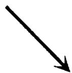  
图H1-FMEA和FMES相互关系示例

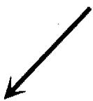

组件FMES  

<table><tr><td>失效模式</td><td>失效率</td><td>失效影响</td><td>可能的失效原因</td></tr><tr><td>5V接地</td><td>B+C</td><td>无指令信号</td><td>电路X—R5短路
电路Y—C5短路</td></tr><tr><td></td><td></td><td></td><td></td></tr><tr><td></td><td></td><td></td><td></td></tr></table>

# H.3.2 执行FMES:

分析人员应评审现有的FMEA，并且检查所有失效影响的一致性（即，是否始终用相同的词语描述相同的失效影响，以及有关失效影响的不同词语是否始终表示不同的失效？）。在进行系统级FMES时，应特别小心地进行这一检查（即，从安装失效模式和组件失效模式综合其影响）。将来自FMEA的失效影响输入FMES表格（类似于表H1所示）的“失效模式”栏。注意，可变更FMES表格，按需要添加或删除具体的数据输入，以支持FMES用户的特定要求以及在使用的具体FMEA格式。

识别具有相同失效影响的所有失效模式，并相加其各个失效率。将该计算的失效率输入FMES的“失效率”栏。可将对FMEA内各个失效模式的引注，标示在FMES的“失效原因”栏。也可将失效模式对紧接着的较高层次的影响、此失效的征兆以及相关的飞行阶段，输入到FMES表格的相关栏内。

表 H1 FMES 工作单  

<table><tr><td colspan="3">失效模式和影响摘要(FMES)</td></tr><tr><td>飞机:</td><td>FMES编号:</td><td>日期:</td></tr><tr><td>ATA:</td><td>供应商:</td><td>共页第页</td></tr><tr><td>系统:</td><td>供应商件号/</td><td>版次:</td></tr><tr><td>子系统或组件</td><td>供应商图纸号:</td><td>制表人:</td></tr></table>

<table><tr><td>参考</td><td>失效模式</td><td>失效率</td><td>阶段</td><td>对系统的影响</td><td>征兆1.飞行机组2.地面人员</td><td>1.失效原因2.备注</td><td>失效原因参考</td><td>检查参考</td><td>失效状态参考</td></tr><tr><td></td><td></td><td></td><td></td><td></td><td></td><td></td><td></td><td></td><td></td></tr></table>

注：本表可被修改，以适合分析层次和大纲的需要

# H.4 文档：

每一FMES报告应包括下列信息：

a. 被分析的系统或组件的简要说明，给出设计原理，包括监控装置和原理设计特性（这应有合适的图表、原理简图以及方框图的支持）；  
b. 列出主要或辅助系统或组件的功能清单；  
c. 参考、件号、以及版次标识清单，以识别所分析的硬件和软件的发放；  
d. 包含分析结果的简要说明；  
e. 失效率源清单；  
f. 用于产生FMES的FMEA参考。

将其结果成文于 FMES 表格中，给出 FMEA 结果的有序概述。有关 FMES 工作单的示例，参见表 H1。摘要应给出顶层失效影响和探测手段，此外，还应包括飞行阶段信息和探测方法。

# 附录I

# 区域安全性分析（ZSA）

注：在上下文中，ARP4761文件主体部分包含收录入附录I内容的信息，故本附录应与该文件主体部分一起使用。

# I.1 引言：

从历史上看，仅在系统原理简图的基础上进行系统安全性分析，这种方法并不充分认识可能大大削弱组件之间独立性的系统硬件物理安装的关系。因此，定义一项分析方法，使其考虑飞机上各个系统/组件的安装关系以及机上安装非常邻近的各系统/组件之间的相互干扰。这种分析方法称之为区域安全性分析（ZSA）。

应对飞机的每一区域进行区域安全性分析。将飞机分割为若干个区域，是为执行区域安全性分析，也为评价维修工作而完成的一项任务。图F1给出这些飞机区域划分的示例。

在新机研制或现有飞机任何重大改型的整个过程中，都应进行ZSA。起初，产生基本的设计和安装指南，对图纸或模型进行分析。随着项目的进展，分析基于样机，然后基于飞机。通常，应由机体制造商进行分析。ZSA的结论应为该机相关的SSA提供输入，并补充SSA中较低层面的分析。本附录给出有代表性的ZSA过程。附录L中的ZSA一节，给出有关指南和检查单的样例。

共模分析、区域安全性分析以及特定风险分析构成共因分析。

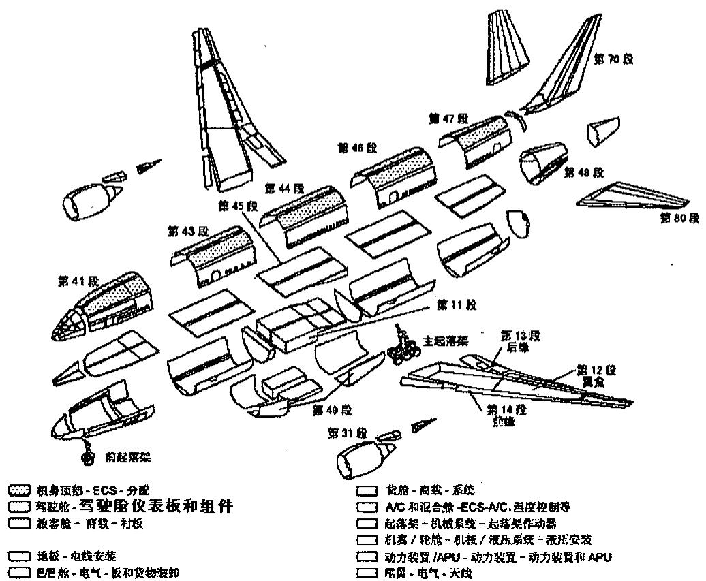  
图11 飞机区域示例

# 1.2 范围：

本附录包含对有经验的工程师在建立一套合适的设计安装指南并执行ZSA所必需的信息和程序指南。

# 1.3 ZSA 的过程：

区域安全性分析的目标是确保系统设计和安装满足下列方面安全性目标：

a. 设计和安装的基本标准；  
b. 失效对飞机的影响；  
c. 维修差错的影响；  
d. 验证设计满足FTA事件的独立性要求。

本分析可以使用为维修目的而定义的飞机区域。图12给出对于这样的分析应进行的一些工作。

区域安全性分析基本上是定性分析，由3个独立的主要工作组成。

# 1.3.1 设计和安装指南的编制：

第一个工作与区域本身无关，乃是为新飞机项目编制设计和安装指南。对于飞机衍生改型，应尽可能多地使用基本型飞机的指南。

设计和安装指南应考虑飞机级要求以及来自PSSA的考虑事项。还应考虑维修的差错。可将该指南分为通用指南、系统具体设计和安装指南或区域具体设计和安装指南。应由负责设计的相应部门产生所有这些类型的指南，并且由所涉及的所有机构予以批准。

# 1.3.2 区域内的安装检查：

第2个工作是相对这些指南的建议，对每个飞机区域进行制造符合性检查。应记录其检查的结果，以作为今后有关此程序的参考并作为今后这些程序的示例。

# 1.3.3 检查系统/组件的干扰：

第3个工作从编制一份飞机每个区域范围内系统/组件的清单开始。这份清单可基于安装图、样机或飞机，根据项目的进展阶段而定。对于这些系统/组件，应建立对安装在附近的其他系统/组件可能有影响的失效模式（系统/组件外部失效模式）的清单。这份清单可基于系统/组件的FMEA和FMES，并基于对系统/组件固有风险的了解。

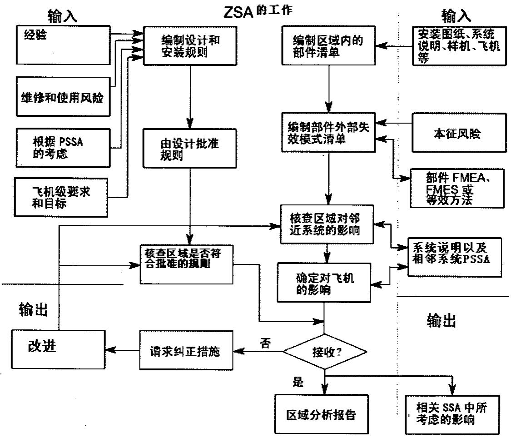  
图12 区域安全性分析过程

# 1.3.3（续）：

应通过FMEA类型的分析，考虑系统/组件的失效模式、外部失效影响以及对飞机的最终影响。应基于系统说明、PSSA或等效方法，判断这些失效模式对邻近系统的影响。所描述的对飞机的影响应与相关的SSA相一致。SSA应将系统组件外部失效影响看作为不同系统中的共因失效。FTA是完成该工作的一种方法。

# 1.3.3 (续):

应将相对设计和安装指南检查区域的结果以及系统/组件外部失效对飞机的最终影响写入ZSA报告中。在相关的SSA中应使用任何可接受的结果。对设计指南的任何偏离，应被作为候选的设计更改来考虑。偏离应导致设计更改或证明该偏离是合理的。

# 1.4文档：

对本分析应以日期为基础进行记录。除了通过检查单系统性地工作之外，应包括下列细节：

a. 由何人，在何时以及如何进行评估（即，样机、飞机等）；  
b. 正确识别作为潜在问题而强调的任何设备；  
c. 对指南的任何偏离，或由于尔后系统的相互作用或维修差错引起的任何重大失效；  
d. 解决被分析所强调问题的方法。

应对系统/组件外部失效及其影响进行分析并列出清单。应对失效模式源、失效对邻近系统影响的原理，以及对描述飞机影响的相关SSA引证给出参考。

任何问题或偏离都应引起负责设计机构的注意，并应作为设计更改来考虑。

应将每一区域分析的初步结果，递交给项目组织机构的相关部门。应根据逐天的记录编写ZSA报告，并且应综述上面的数据。因为它是一个逐步完善的文件并为飞机的SSA提供输入，故它应在整个设计循环中周期性地重新发布。

# 附录J

# 特定风险分析（PRA）

注：在上下文中，ARP4761文件主体部分包含收录入附录J内容的信息，故本附录应与该文件主体部分一起使用。

# J.1 引言：

特定风险乃是超出有关系统，但可能破坏事物独立性要求的事件或影响。这些特定风险还可能同时影响若干区域，而ZSA被限制在每一个具体的区域。其中有些风险可能受限于特定适航性要求（例如，发动机非包容性转子破坏，轮胎爆破等）。

典型的风险包括下列情况，但并不仅限于这些：

a. 着火；  
b. 高能装置（非包容）：

（1）发动机；  
(2) APU;  
（3）风扇；

c. 高压瓶；  
d. 高压空气管道断裂；  
e.高温空气管道泄露；

f. 流体泄漏：（通常作为区域安全性分析的一部分被检查，但有时可能要求特定附加评估）：

（1）燃油：  
（2）液压油；  
（3）蓄电池酸液；  
（4）水；

g. 冰雹、冰、雪；

h. 鸟撞；

i. 轮胎爆破，气流抽打胎面；  
j. 机轮轮缘释放；  
k. 雷击；

1. 高强度辐射场；  
m. 气流抽打轴；  
n. 隔框断裂。

识别有关被分析设计的相应风险后，应根据本附录，对每一风险进行单独的研究。有关分析的目标是确保任何与安全性有关的影响或被设计排除，或表明是可接受的。

# J.1（续）：

对于一架新飞机而言，在飞机整个研制过程中都应进行特定风险分析（PRA）。对于作出任何重大更改的飞机，也应进行这一分析。开始时，应对图纸、模型进行分析，但随着项目的进展，特定风险分析应基于样机，然后基于实际飞机。通常，由机体制造商实施这一分析。

共模分析、区域安全性分析以及特定风险分析构成共因分析。

# J.2 范围：

本附录包含使一个有经验的工程师为完成下列任务所必需的信息和程序：为被研究的特定风险建立一个合适的失效模式，确定受影响的区域以及评审特定风险的后果。

# J.3 PRA过程：

通常，按逐个风险来进行PRA。其主要是定性分析并按下列方面来实施：

a. 定义被分析的特定风险的细节（例如，轮胎/机轮爆裂）；  
b. 定义分析中使用的失效模型（例如，轮胎爆裂模型和机轮爆破模型）；  
c. 列出需满足要求的清单（例如，FAR/JAR 729（f））；  
d. 定义受影响的区域（例如，起落架舱）；  
e. 定义受影响的系统/组件（借助ZSA进行交叉检查）；  
f. 定义所采取的设计和安装预防措施（借助在ZSA中使用的设计和安装指南进行交叉检查）；  
g. 评审特定风险对受影响组件的后果（借助FMEA/PSSA进行交叉检查）；  
h. 评审该特定风险由于组件失效模式或其组合对飞机产生的影响（借助 SSA 进行交叉检查）；

# J.3（续）：

i. 确定该后果是否可接受：

（1）如果可接受，则制定合格审定的判据并用于SSA或其他具体的合格审定文件中；  
（2）如果不可接受，则开始进行设计更改。

# J.4 文档：

对于每一特定风险后果的评审以一定的格式写成文件，该格式应包括下列信息：

a. 所分析特定风险的说明；  
b. 受特定风险影响的组件；  
c. 组件所安装的区域；  
d. 被所研究特定风险所引起的失效模式；  
e. 对飞机的最终影响以及该影响的分类。

应使用相关的PSSA/SSA交叉检查对飞机的影响。进而，确保PRA和PSSA/SSA“对飞机的影响”和“分类”输入是一致的。PRA结果应被包括在相关的PSSA/SSA中。

此外，应包括下列细节：

a. 对初始假设的任何偏离；  
b. 被分析所强调问题的解决方式。

对于说明外部威胁对飞机影响的具体文件，应予以引证。

PRA过程中暴露的任何问题，应引起负责设计的机构的关注。

# 附录K

# 共模分析（CMA）

注：在上下文中，ARP4761文件主体部分包含收录入附录K内容的信息，故本附录应与该文件主体部分一起使用。

# K.1 引言：

在整个安全性评估过程中，执行共模分析（CMA）。CMA是一种用来确保设计“良好”的定性分析方法。使用设计经验以一种逻辑方式来检查部件的综合。在从组件设计到飞机级设计的所有层面上，实施这一做法。本分析应包括对组件内部件（部件/组件级CMA）以及它们如何装配成更大系统（系统/飞机级CMA）的评价。

本文件描述基于来自FHA和PSSA输入而执行的CMA，并为SSA提供证明。给定此先决条件，执行CMA，以验证故障树（FTA）、相关图（DD）以及马尔可夫分析中的“与”门事件是确实独立的。应对设计实施、制造和维修差错以及损害冗余度设计原则的系统部件失效，进行分析。一般而言，必要时，CMA有助于对采用独立性原理的验证。例如，应对功能独立性以及其各自的监控器给予考虑。此外，具有相同硬件和/或软件的组件，对于可能引发多个组件失灵的同属故障是敏感的。

# K.2 范围：

本附录提供有关实施CMA的指南。所描述的过程可在组件、系统、或飞机等级别上使用。

# K.3 共模分析过程:

下面4个步骤综述CMA过程，如图K1所示：

1. 建立特定检查单大纲（具体的共模类型、来源以及失效/差错检查单）（参见K.3.1)；  
2. 确定CMA要求（参见K.3.2）；  
3. 对设计进行分析，以确保满足上面步骤2所确定的要求（参见K.3.3）；  
4. 将CMA过程的步骤1到步骤3的结果写成文件（参见K.3.4）。

图K1描述执行系统/飞机级CMA的通用过程。可修改该过程，以对在部件/组件级进行CMA提供指南。

# K.3.1 检查清单：

CMA过程是基于分析设计以及可能破坏该设计内功能冗余度或独立性的元件实施。通过应用检查单来进行本分析，凡所要求的冗余度或独立性受到损害时，则要求证明对该损害的可接受性或消除这种损害。

下列共模是在此工作中应予以考虑的一些示例：

a. 软件开发错误：  
b. 硬件研制差错；  
c. 硬件失效；  
d. 生产/修理缺陷；  
e. 与应力相关的事件（例如，不正常的飞行状态、不正常的系统构型）；  
f. 安装差错；  
g. 要求的差错；  
h. 环境因素（例如，温度、振动、湿度等）；  
i. 串联故障；  
j. 共同外部源故障。

K.3.1.1 通用的共模类型、来源以及失效/差错检查单：有许多可能被CMA考虑的元素。表K1给出应予以考虑的通用共模类型、来源以及失效/差错的示例。应基于资料示例和以前的经验（普通知识或相似飞机上的经验），得出项目具体的CMA检查单。这些检查单的详细程度取决于被研究技术和系统的复杂程度和新颖程度。

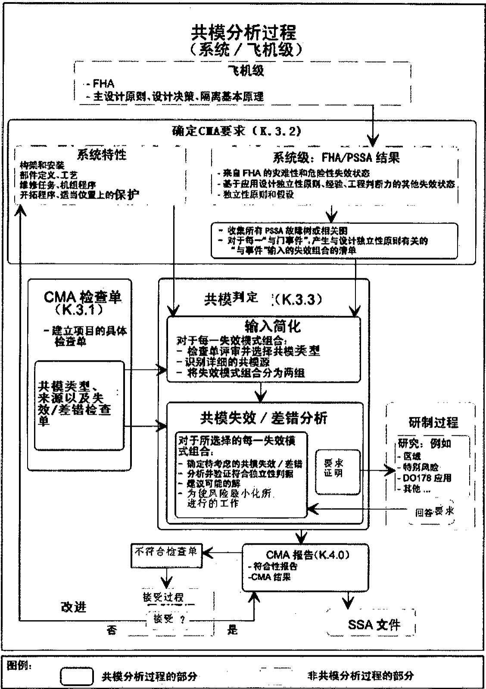  
图K1-CMA过程

表 K1 通用共模类型、来源和失效/差错检查单的示例  

<table><tr><td>共模类型</td><td>共模子类型</td><td>共模源示例</td><td>共模失效/差错示例</td></tr><tr><td rowspan="15">原理和设计</td><td rowspan="5">设计构架</td><td>公共排气集气管</td><td>公共排气失效</td></tr><tr><td>公共外部源(通风、电源,···)</td><td>公共源失效(通风、电源,···)</td></tr><tr><td>设备防护</td><td>设计人员不能预测某个事件,···</td></tr><tr><td>使用特性(正常运行,备份)</td><td>···</td></tr><tr><td>其他</td><td>···</td></tr><tr><td rowspan="5">工艺、材料、设备型号</td><td>新的/敏感的工艺</td><td>一般设计差错,···</td></tr><tr><td>部件型号(规格、材料,···)</td><td>硬件差错,···</td></tr><tr><td>公共软件</td><td>软件错误,···</td></tr><tr><td>部件使用</td><td>···</td></tr><tr><td>内部状态(温度或压力范围,···)</td><td>超范围使用,···</td></tr><tr><td rowspan="5">技术规范</td><td>初始状态</td><td>···</td></tr><tr><td>其他</td><td>···</td></tr><tr><td>技术规范的来源</td><td>来源错误(人为),设备设计中缺少具体保护,···</td></tr><tr><td>相同规范</td><td>非完备的技术规范,···</td></tr><tr><td>其他</td><td>···</td></tr><tr><td rowspan="6">制造</td><td rowspan="2">制造商</td><td>同一制造商</td><td>由于制造商的共同差错,由未经合适培训的人员引起的差错,···</td></tr><tr><td>其他</td><td>···</td></tr><tr><td rowspan="2">程序</td><td>相同程序</td><td>不正确的程序,···</td></tr><tr><td>其它</td><td>···</td></tr><tr><td rowspan="2">过程</td><td>相同过程</td><td>不正确的过程,不合适的制造控制、不合适的检验、不合适的试验,···</td></tr><tr><td>其他</td><td>···</td></tr><tr><td rowspan="8">安装/综合和试验</td><td rowspan="2">装配人员</td><td>共同的装配人员</td><td>由装配人员引起的安装差错,···</td></tr><tr><td>其它</td><td>···</td></tr><tr><td rowspan="2">程序</td><td>安装阶段</td><td>由于阶段引起的共同差错,···</td></tr><tr><td>其它</td><td>···</td></tr><tr><td rowspan="2">位置</td><td>同一区域</td><td>局部失效和事件,···</td></tr><tr><td>其他</td><td>···</td></tr><tr><td rowspan="2">路径</td><td>同一路径</td><td>局部事件,···</td></tr><tr><td>其他</td><td>···</td></tr><tr><td rowspan="4">使用</td><td rowspan="2">员工</td><td>共同的员工</td><td>由未经合适培训的人员、压力过大或不能工作的操作人员引起的差错,···</td></tr><tr><td>其他</td><td>···</td></tr><tr><td rowspan="2">程序</td><td>相同的程序</td><td>不合适的操作程序、误判(随后是错误的程序)、动作遗漏,不合适或不正确的行动委托···</td></tr><tr><td>其他</td><td>···</td></tr><tr><td rowspan="4">维修</td><td rowspan="2">员工</td><td>共同的员工</td><td>由未经合适培训的人员、不正确的人为活动引起的差错,···</td></tr><tr><td>其他</td><td>···</td></tr><tr><td rowspan="2">程序</td><td>相同的程序</td><td>不能遵循修理程序、非完备的修理程序、缺少修理程序,···</td></tr><tr><td>其他</td><td>···</td></tr><tr><td rowspan="4">试验</td><td rowspan="2">员工</td><td>共同的员工</td><td>由未经合适培训的人员、不正确的人为活动引起的差错,···</td></tr><tr><td>其它</td><td>···</td></tr><tr><td rowspan="2">程序</td><td>相同的程序</td><td>不合适的试验程序,···</td></tr><tr><td>其他</td><td>···</td></tr><tr><td rowspan="3">校准</td><td rowspan="3">员工</td><td>共同的员工</td><td>由未经合适培训的人员引起的差错,···</td></tr><tr><td>校准工具</td><td>不合适的工具调节,···</td></tr><tr><td>其他</td><td>···</td></tr></table>

表K1（续）  

<table><tr><td>共模类型</td><td>共模子类型</td><td>共模源示例</td><td>共模失效/差错示例</td></tr><tr><td></td><td>程序</td><td>相同的程序其他</td><td>不能遵循校准程序、非完备的校准程序、缺少校准程序,······</td></tr><tr><td rowspan="2">环境</td><td rowspan="2">机械和热</td><td>温度金属碎屑冲击振动压力湿度潮湿应力其他电气和辐射</td><td>着火、雷电、焊接等,冷却系统故障、电路短路,···由具有不合适容差的运动零件产生的机载设备粉尘,金属碎屑,···导管猛烈移动,水锤,投射,结构失效,···运动中的机器,地震,···爆炸,超出允许的系统变化(泵超速、流动、堵塞)···蒸汽管断裂,···冷凝,导管断裂、雨水,···不同类材料焊接引起的热应力,热应力,···焊接设备,转动的电气机械,雷电,···伽马射线、带电粒子辐射,···水汽,导电气体,···电源浪涌电压,短路,电源浪涌电流,···维修时用于除锈和清洁的酸液泄漏,···金属周围水汽燃油箱体,水、燃油氧化物的电化腐蚀以及复杂相互作用有毒气体,活体生物原因(热交换器内的贝类)···</td></tr><tr><td>电磁辐射导电介质超出允差其他腐蚀(酸)腐蚀(氧化)其他化学作用生物其他</td><td>水汽,导电气体,···电源浪涌电压,短路,电源浪涌电流,···维修时用于除锈和清洁的酸液泄漏,···金属周围水汽燃油箱体,水、燃油氧化物的电化腐蚀以及复杂相互作用有毒气体,活体生物原因(热交换器内的贝类)···</td></tr></table>

# K.3.2 确定CMA要求：

为了执行CMA，分析人员需要熟悉和理解关于所研究系统运行和安装的特性。这些特性包括如下方面：

a. 设计构架和安装计划;  
b. 设备和部件的特性;  
c. 维修和试验工作；  
d. 机组程序；  
e系统、设备和软件的技术规范。

此外，分析人员需要弄懂所利用的有关安全保护特性，以消除共模影响或使其减至最小。这些包括如下内容：

a. 相异性（非相似性、冗余度等）和阻挡层；  
b. 测试和预防性维修大纲;  
c. 设计控制和设计质量等级；  
d. 程序或技术规范的评审；  
e. 人员培训；  
f. 质量控制。

借助上述的系统背景，分析人员接着必须确定所研究产品的具体CMA分析要求。有两个用来产生如下面讨论中所确定的CMA要求的不同过程。通常，应遵循这两个过程来建立完整、适用的具体CMA要求。

K.3.2.1 来自FTA、DD和MA的CMA要求：通过对支持FHA和/或PSSA的分析进行核查，导出这些要求。下面说明此过程：

a. 对于在 FHA 和/或 PSSA 中成文的每一危险事件或灾难性事件，识别每一“与”门事件（故障树中的“与”门），并确定相关的设计独立性原则；  
b.核查来自前一步骤的“与”门事件，以确定必须确保哪种失效组合是独立的；  
c. 将从上面的分析中得到的所有派生CMA要求成文。

K.3.2.2 其他CMA要求：可能有一些CMA要求，是不可从FTA、DD和MA导出的。这些要求源自具体产品CMA检查单（参见K2.1）以及产品和工程经验。通过评审设计过程，设计细节，选定的部件，制造过程，安装过程以及使用中维修过程的检查单，导出这些要求。随着这种评审和评估过程，将已识别出的每个可能促成共模事件状态，被归纳为CMA要求，并在要求清单中成文。从故障树看可能不是明显CMA要求的例子，而是复杂部件、环境考虑、部件物理位置之中的同属失效。

# K.3.3 共模失效/差错的判定：

对于K.3.2中的每一CMA要求，遵循下列CMA过程的步骤：

a. 确定与每个源有关的可能共模失效/差错；  
b. 分析每个可能的共模失效/差错，以验证对独立性判据的符合性；  
c. 对于CMA范围不接受的情况，建议可能的解决办法并开始设计纠正；  
d. 跟踪纠正措施，确定最终设计的可接受性。

# K.4 文档：

共模失效分析的输出是CMA报告。预期该报告包括如下内容：

a. 分析中所使用的参考文件、图纸和支持材料；  
b. 所导出的指导CMA的要求的清单；  
c. 所分析的系统/部件的说明；  
d. 对CMA要求符合性的理由；  
e. 分析中所确定的问题/利害关系的鉴别；  
f. 所鉴别问题/利害关系的判定（纠正措施或接受合理性的证明）；  
g.CMA的结论/结果。

# K.4.1与FHA、PSSA和SSA的联系：

共模失效使用 FHA/PSSA 评估的结果，诸如，灾难性失效状态清单、设计中所考虑的独立性判据以及作为 CMA 性能的任何指令。共模分析结果的摘要被包括在 SSA 之内。应将其余的任何共模包括在相关的 FTA、DD 或 MA 报告之中。

# K.4.1 与区域安全性分析和特定风险分析的联系：

特定风险分析和区域安全性分析不属于CMA的特定部分。但是，忽略这些来源的可能共模影响，是不可能的。凡区域安全性分析或特定风险分析识别的可能共模利害关系之处，只要可能，CMA分析人员应确保有关特定风险分析或区域安全性分析覆盖已识别的问题。

# 附录L

# 连续安全性评估过程举例

注：在上下文中，ARP4761文件主体部分包含收录入附录L内容的信息，故本附录应与该文件主体部分以及本文件的其它附录一起使用。

# L.1 引言：

# L.1.1 范围：

本附录相对于一个假设的飞机设计，详细说明其连续安全性评估过程的例子。为了给出清晰的概念，我们将一个功能分解为单一系统的单一组件。所选择的功能具有充分的复杂性，考虑到使用所有的方法，然而又是简单到足以通过它们给出一个清晰的流程图。分析功能/系统/组件应用的所有方法和手段，在本ARP文件的其它部分已说明。使用的每种方法表明它如何可以被应用。例如，事实上我们可以选择FTA、DD或MA来帮助确定功能故障的可能原因，然而，这里使用的所有3种方法，其目的是使读者理解它们的相似性和区别。这里使用的各种方法是应用本文件规定原则的一种方式的例子。只要遵循本ARP文本中概述的原则，可以使用其它格式来完成文件编制。

本例包含对一个公司可能用来确保其本身产品安全性的所有文件的参考。其中有些文件出于合格审定目的的需要，被提交给管理机构（例如，机轮刹车系统FHA）。而另外一些文件为公司内部的，不要求作为合格审定文件（例如，S-18设计要求文件）。将所有这些文件提交给管理机构没有任何意义，且没有人认为应该这样。安全性和合格审定是不同意义的术语。我们试图在这里表明安全性评估的过程，包含超出合格审定要求范围的那些过程。

# L.1.2 附录 L 示例使用的缩写表:

ACCU Accumulator蓄压器

ALT Alternate 备用

APU Auxiliary Power Unit 辅助动力装置

AS Anti Skid 防滑

B Blue Hydraulic System 蓝液压系统

BSCU Brake System Control Unit 刹车系统控制装置

C Capacitor 电容器

CMD Command指令

COMP Computation 计算

CSMG Constant Speed Motor Generator 恒速马达发电机

ECS Environmental Control System 环境控制系统

ELEC Electric电气的

# L.1.2 (续):

<table><tr><td>EMI</td><td>Electromagnetic Interference 电磁干扰</td></tr><tr><td>HIRF</td><td>High Intensity Radiated Fields 高强度辐射场</td></tr><tr><td>HYD</td><td>Hydraulic 液压</td></tr><tr><td>IC</td><td>Integrated Circuit 集成电路</td></tr><tr><td>I/O</td><td>Input/Output 输入/输出</td></tr><tr><td>CAT IIIb</td><td>Category 3b All Weather Landing system 3b 类全天候着陆系统</td></tr><tr><td>CPU</td><td>Central Processing Unit 中央处理装置</td></tr><tr><td>F.R.</td><td>Failure Rate 失效率</td></tr><tr><td>G</td><td>Green Hydraulic System 绿液压系统</td></tr><tr><td>L or LH</td><td>Left or Left Hand 左或左边</td></tr><tr><td>LRU</td><td>Line Replaceable Unit 外场可更换单元</td></tr><tr><td>MLG</td><td>Main Landing Gear 主起落架</td></tr><tr><td>MON</td><td>Monitor 监控器</td></tr><tr><td>MT</td><td>Periodic Maintenance Task 周期性的维修工作</td></tr><tr><td>NLG</td><td>Nose Landing Gear 前起落架</td></tr><tr><td>NORM</td><td>Normal 正常</td></tr><tr><td>PCU</td><td>Power Control Unit 能源控制装置</td></tr><tr><td>POS</td><td>Position 状态</td></tr><tr><td>P/S</td><td>Power Supply 供电</td></tr><tr><td>PTU</td><td>Power Transfer Unit 能源转换装置</td></tr><tr><td>PWM</td><td>Pulse Width Modulator 脉幅调节器</td></tr><tr><td>PWR</td><td>Power 电源</td></tr><tr><td>R or RH</td><td>Right or Right Hand 右或右边</td></tr><tr><td>R</td><td>Resistor 电阻</td></tr><tr><td>REF</td><td>Reference 参考</td></tr><tr><td>RTO</td><td>Rejected Takeoff 中断起飞</td></tr><tr><td>STBY</td><td>Standby 备用</td></tr><tr><td>SYS</td><td>System 系统</td></tr><tr><td>VDC</td><td>Volts Direct Current 直流电压</td></tr><tr><td>VI</td><td>Speed from which the aircraft cannot be safely stopped on remaining runway 速度，飞机以该速度不可能被安全地停止在剩余的跑道上</td></tr><tr><td>WBS</td><td>Wheel Brake System 机轮刹车系统</td></tr></table>

# L.1.3 概述

对所选择的功能，使用在各附录中说明的方法进行分析。这些方法呈现的顺序代表其整个设计周期的名义研制过程。然而，尽管在本例过程的末尾展示共因分析（CCA）工作，但它却发生在整个过程中（见ARP4761文件主体部分图1，2，3）。

对本例子概述如下：

a. 飞机FHA  
（1） 初步飞机FTA  
b. 机轮刹车系统（WBS）FHA  
c. PSSA

# L.1.3 (续):

(1) WBSFTA, DD, MA  
(2) BSCUFTA, DD, MA

# d. SSA

(3) BSCU FMEA  
(4) BSCUFMES  
(5) BSCUCMA  
(6) BSCUFTA, DD, MA  
(7) WBS FMES  
(8) WBSFTA, DD, MA  
（9）WBS综合交叉检查

e. CCA（BSCUCMA在SSA部分被阐明，以改善本例的连续性）

a) ZSA（轮舱区域）  
b) PRA（轮胎爆破）  
c) WBS CMA

当每个新阶段开始时，请辨认该页顶部的“注”，该“注”是变化的，以说明特定的阶段。这样读者将始终能准确知道他们处于安全性评估过程的哪个阶段。例如：

注：飞机FHA

注：PSSA，BSCUFTA

示例的每个阶段将被写成如同可提交的文件一样。虽然许多不同的格式对于审定当局都是可以接受的，但我们的例子将使用如下的格式：

1.0 引言  
2.0 参考文件  
3.0 功能/系统说明  
4.0 分析

4.1（所要求的支持分析的书面材料）  
4.2 （所要求的支持分析的书面材料）

4.2.1 （所要求的支持分析的书面材料）  
4.2.2 （所要求的支持分析的书面材料）

# 5.0 结论

编者的注释以斜体字提供。必要之处，读者将被指引到相应的附录以便对所涉及的过程作进一步指导。

# L.1.4 本示例功能的说明：

所分析的飞机功能是：“使飞机在地面减速（停止在跑道上）”。本例集中在飞机刹车系统上，该刹车系统的细节通过下面接近真实情况的例子被展开。

# L.1.5 附录 L 的附图清单:

图4.1-1 （飞机FHA）飞机功能 175  
图4.6-1（飞机FHA）初步飞机故障树 182  
图3.0-1（PSSA-机轮刹车系统）初步机轮刹车系统原理图 192  
图4.2.1-1（PSSA-机轮刹车系统-FTA)非通告丧失所有机轮刹车的故障树(原版） 198  
图4.2.1-2（PSSA-机轮刹车系统-FTA)非通告丧失所有机轮刹车的故障树(A版） 199  
图4.2.1-3（PSSA-机轮刹车系统-FTA)非通告丧失所有机轮刹车的故障树(B版） 200  
图4.2.2-1（PSSA-机轮刹车系统-DD)非通告丧失所有机轮刹车的相关图（原版） 201  
图4.2.2-2（PSSA-机轮刹车系统-DD)非通告丧失所有机轮刹车的相关图(A版） 202  
图4.2.2-3（PSSA-机轮刹车系统-DD)非通告丧失所有机轮刹车的相关图（B版） 203  
图4.2.3-1（PSSA-机轮刹车系统-MA）非通告丧失所有机轮刹车的马尔可夫链（原版） 205  
图4.2.3-2（PSSA-机轮刹车系统-MA）非通告丧失所有机轮刹车的马尔可夫链(A版) 206  
图4.2.3-3（PSSA-机轮刹车系统-MA）非通告丧失所有机轮刹车的马尔可夫链(B版) 207  
图3.0-1 (PSSABSCU)推荐使用的BSCU构架 211  
图4.2.1-1（PSSABSCU-FTA)BSCU故障引起丧失刹车指令的故障树（第1页） 215  
图4.2.1-1（PSSABSCU-FTA)BSCU故障引起丧失刹车指令的故障树（第2页） 216  
图4.2.1-2（PSSABSCU-FTA）没有刹车输入的BSCU控制刹车并引起意外刹车的故障树（第1页） 217  
图4.2.1-2（PSSABSCU-FTA）没有刹车输入的BSCU控制刹车并引起意外刹车的故障树（第2页） 218  
图4.2.1-2（PSSABSCU-FTA）没有刹车输入的BSCU控制刹车并引起意外刹车的故障树（第3页） 219  
图4.2.2-1(PSSABSCU-DD)BSCU故障引起丧失刹车指令的相关图 221  
图4.2.2-2（PSSABSCU-DD）没有刹车输入的BSCU控制刹车并引起意外刹车的相关 图 222  
图4.2.3-1（PSSABSCU-MA)BSCU故障引起丧失刹车指令的马尔可夫分析 224  
图4.2.3-2（PSSABSCU-MA)可探测的BSCU失效导致意外刹车的马尔可夫分析 225  
图4.2.3-3（PSSABSCU-MA）由于BSCU系统1失效引起意外刹车的马尔可夫分析 225

# L.1.5（续）：

图4.2.3-4 （PSSABSCU-MA）由于BSCU系统2以及开关机构失效引起意外刹车的马尔可夫分析 226  
图3.0-1 （SSABSCU-FMEA）BSCU的物理实施过程 230  
图3.0-2 （SSABSCU-FMEA）供电原理方块图 231  
图3.0-3 （SSABSCU-FMEA）供电监控器原理简图 232  
图3.0-1 (SSABSCU-CMA） BSCU构架原理图 245  
图4.3-1 (SSA BSCU-CMA) BSCU物理实施过程 249  
图5.1-1 (SSA BSCU-FTA) BSCU故障引起丧失刹车指令（第1页） 257  
图5.1-1 (SSA BSCU-FTA) BSCU故障引起丧失刹车指令（第2页） 258  
图5.1-2 （SSABSCU-FTA）没有刹车输入的BSCU控制刹车并引起意外刹车（第1页） 259  
图5.1-2 （SSABSCU-FTA）没有刹车输入的BSCU控制刹车并引起意外刹车（第2页） 260  
图5.1-2 （SSABSCU-FTA）没有刹车输入的BSCU控制刹车并引起意外刹车（第3页） 261  
图5.2-1 (SSABSCU-DD）BSCU故障引起丧失刹车指令 262  
图5.2-2 （SSABSCU-DD）没有刹车输入的BSCU控制刹车并引起意外刹车 263  
图5.3-1 (SSA BSCU-MA）BSCU故障引起丧失刹车指令 265  
图5.3-2 （SSABSCU-MA）由于两个BSCU系统和其监控器失效引起意外刹车 266  
图5.3-3 （SSABSCU-MA）由于BSCU系统1失效引起意外刹车（为了清晰起见，未展示部件修理） 266  
图5.3-4 （SSABSCU-MA）由于BSCU系统2失效和开关装置失效引起意外刹车（为了清晰起见，未展示部件修理） 267  
图5.2-1 （SSA机轮刹车系统-FTA）丧失所有机轮刹车的故障树（第1页） 275  
图5.2-1 (SSA机轮刹车系统-FTA）丧失所有机轮刹车的故障树（第2页） 276  
图5.2-1 （SSA机轮刹车系统-FTA）丧失所有机轮刹车的故障树（第3页） 277  
图5.3-1 （SSA机轮刹车系统-DD）丧失所有机轮刹车 278  
图5.4-1 （SSA机轮刹车系统-MA）丧失所有机轮刹车 280  
图4.2.1.2.2-1（CCA-ZSA）液压导管在C46/47框的安装 290  
图4.2.1.2.2-2（CCA-ZSA）绿液压系统部件 291  
图4.2.1.3.4-1（CCA-ZSA）主起落架舱通风 294  
图3.0-1 (CCA-PRA)S18飞机前、主起落架 305  
图4.3-1 （CCA-PRA）主起落架舱 308  
图4.3-2 （CCA-PRA）轮胎爆破区域侧视图 309

# L.1.5 (续):

图4.3-3 （CCA-PRA）轮胎爆破区域前视图 310  
图4.3-4 （CCA-PRA）轮胎爆破区域顶视图 311  
图4.4.1-1 (CCA-PRA) S18飞机飞行操纵面 313

# 注：飞机级FHA

# S18飞机的飞机功能危险性评估（FHA）

# 1.0 引言：

本分析包含对S18飞机的功能危险性评估。S18飞机是为了本文件的需要产生的一架假想的飞机。用来完成该飞机功能的所有系统的运行情况都被考虑。

（编者注：下面的对照参考表提供示例的每个章节号和 FHA 适用的附录章节号之间的联系。）

<table><tr><td>飞机FHA章节号</td><td>附录A章节号</td></tr><tr><td>4.1</td><td>A.3.1</td></tr><tr><td>4.2</td><td>A.3.2</td></tr><tr><td>4.3</td><td>A.3.3</td></tr><tr><td>4.4</td><td>A.3.4,A.3.6</td></tr><tr><td>4.5</td><td>A.3.7</td></tr><tr><td>4.6</td><td>A.4</td></tr></table>

# 2.0 参考资料：

1）S18飞机设计要求文件；  
2) FAR/JAR 25.1309;  
3）ARP4754“Certification Considerations for Highly-integrated or Complex Aircraft Systems”（高度综合或复杂飞机系统合格审定需要考虑的问题。）  
4）ARP4761“GuidelinesandMethodsforConductingtheSafetyAssessmentProcessonCivilAirborneSystemandEquipment”（民用飞机载系统和设备安全性评估过程的指南和方法）

# 3.0 说明摘要：

S18为4台发动机旅客飞机，预定携带300到350位旅客，在0.86马赫数下航程达5000海里。平均飞行时间为5小时。

（编者注：在本节中包含定义该机的其它固有特性，但为简明起见，这里不作说明。通常这些特性由在最初的市场调研期间所作的市场和商业决策来确定。）

# 4.0 飞机功能危险性评估（FHA）的结果：

# 4.1 确定功能：

图4.1-1以简单分层联系的格式表示飞机功能。

（编者注：本例中“在地面控制飞机”功能被分解。按照该分解，“在地面减速飞机”功能在飞机FHA例子中继续被考虑。在表4.1-1所示的FHA格式样例的第1栏中确认被分析的功能。）

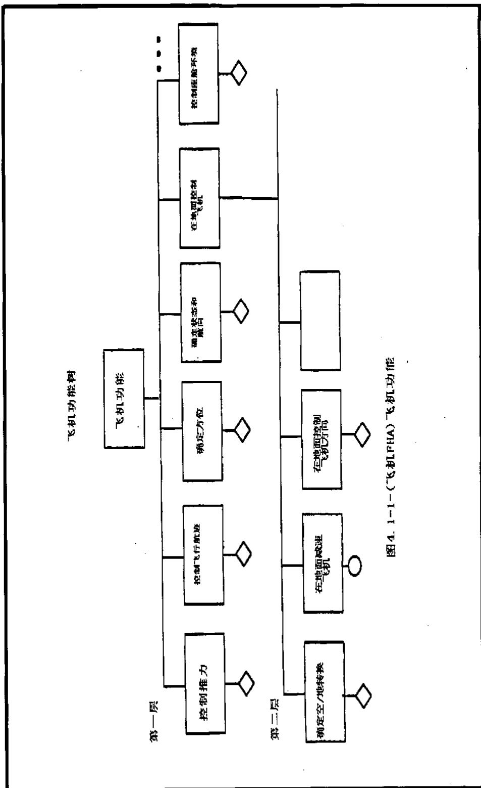  
注：飞机FHA

注：飞机级FHA

4.2 识别失效状态：

对于功能“在地面减速飞机”，识别如下一组失效状态以及对于评估所作的假设：

4.2.1 功能失效状态：

a. 丧失所有减速能力；  
b. 降低减速能力；  
c. 意外减速；  
d. 丧失所有自动停止特性；  
e. 非对称减速。

4.2.2 环境以及应急构型和条件：

a. 跑道条件（湿，冰等）；  
b. 跑道长度；  
c. 顺风/侧风；  
d. 发动机停车；  
e. 液压系统丧失；  
f. 电气系统丧失。

4.2.3 适用的飞行阶段：

a. 滑行；  
b. 起飞抬前轮；  
c. 着陆滑跑；  
d. 中断起飞（RTO）。

4.2.4 接口功能：

a. 空中/地面决策；  
b. 向机组发出警报（向机组发出警告，警报，信息）。

表4.1-1的（2），（3）栏表明FHA样式包含对给定功能明确说明其失效状态的部分。

4.3 失效状态对飞机，机组和乘员的影响：

对于每个失效状态，其对飞机和机组的影响表示在表4.1-1的（4）栏。

注：飞机FHA

4.4 失效状态对飞机和机组的影响分类/证明失效状态对飞机和机组的影响是合理的：

相对于每个失效状态，在表4.1-1的（5）、（6）栏规定该失效状态的分类。

4.5 安全性目标的验证计划：

相对于每个失效状态，在表4.1-1的第（7）栏规定安全性目标的验证计划。该栏列出对要求、故障树、分析和/或试验的参考资料。

注：飞机FHA  
表 4.1-1-飞机级 FHA (部分-仅表明 “在地面减速飞机”)  

<table><tr><td>1 功能</td><td>2 失效状态(危险性说明)</td><td>3 飞行阶段</td><td>4 失效状态对飞机/机组的影响</td><td>5 分类</td><td>6 参考的支持材料</td><td>7 验证</td></tr><tr><td>在地面减速飞机</td><td>丧失减速能力</td><td>着陆/RTO/滑行</td><td>见下面所述:</td><td></td><td></td><td></td></tr><tr><td></td><td>a.未通告丧失减速能力</td><td>着陆/RTO</td><td>机组不能减速飞机,导致飞机高速冲出跑道。</td><td>灾难性的(Catastrophic)</td><td></td><td>S18飞机故障树</td></tr><tr><td></td><td>b.通告丧失减速能力</td><td>着陆</td><td>机组选择更加适用的机场,通告紧急地面支援,并为乘员作好飞机着陆冲出跑道的准备。</td><td>危险的(Hazardous)</td><td>在丧失制动能力情况下的紧急着陆程序</td><td>S18飞机故障树</td></tr><tr><td></td><td>c.未通告丧失减速能力</td><td>滑行</td><td>机组不能将飞机停止在滑行道上或出入口,导致飞机低速与候机楼、飞机或车辆接触。</td><td>较大的(Major)</td><td></td><td></td></tr><tr><td></td><td>d.通告丧失减速能力</td><td>滑行</td><td>机组操纵飞机避开任何障碍物,并请求牵引或可移动扶梯。</td><td>没有安全性影响(No Safety Effect)</td><td></td><td></td></tr><tr><td></td><td>V1(起飞/中断起飞决策速度)后意外减速</td><td>起飞</td><td>由于在高推力设定的同时使用刹车,故机组不能起飞,导致高速冲出跑道。</td><td>灾难性的(Catastrophic)</td><td></td><td>S18飞机故障树</td></tr></table>

注：飞机FHA  
表 4.1-1-飞机级 FHA (部分-仅表明 “在地面减速飞机”)  

<table><tr><td>1 功能</td><td>2 失效状态(危险性说明)</td><td>3 飞行阶段</td><td>4 失效状态对飞机/机组的影响</td><td>5 分类</td><td>6 参考的支持材料</td><td>7 验证</td></tr><tr><td></td><td>部分丧失减速能力</td><td>着陆/RTO</td><td>见下面所述:</td><td></td><td></td><td></td></tr><tr><td></td><td>a.未通告部分丧失减速能力</td><td>着陆/RTO</td><td>机组不能在跑道端部前完全减速飞机,导致飞机可能冲出跑道。</td><td>危险的(Hazardous)</td><td></td><td>S18飞机故障树</td></tr><tr><td></td><td>b.通告部分丧失减速能力</td><td>着陆</td><td>机组选择更加适用的机场,通知紧急地面支援,并为乘员作好飞机着陆冲出跑道的准备。</td><td>较大的(Major)</td><td></td><td></td></tr><tr><td></td><td>c.未通告部分丧失减速能力</td><td>滑行</td><td>机组不能在障碍物前充分将飞机停止,导致飞机低速碰撞。</td><td>较小的(Minor)</td><td></td><td></td></tr><tr><td></td><td>d.通告部分丧失减速能力</td><td>滑行</td><td>机组操纵飞机避开任何障碍物,并请求牵引或可移动扶梯。</td><td>没有安全性影响</td><td></td><td></td></tr><tr><td></td><td>丧失自动制动能力</td><td>着陆/RTO</td><td>见下面说明:</td><td></td><td></td><td></td></tr></table>

注：飞机FHA  
表 4.1-1-飞机级 FHA (部分-仅表明 “在地面减速飞机”)  

<table><tr><td>1 功能</td><td>2 失效状态(危险性说明)</td><td>3 飞行阶段</td><td>4 失效状态对飞机/机组的影响</td><td>5 分类</td><td>6 参考的支持材料</td><td>7 验证</td></tr><tr><td></td><td>a.未通告丧失自动制动能力</td><td>着陆/RTO</td><td>机组预位自动制动特性进行着陆/RTO。在着陆/RTO时自动制动特性不能工作。机组判明此情况并手动启动制动功能。由于机组的反映时间导致可能冲出跑道。</td><td>较大的(Major)</td><td></td><td></td></tr><tr><td></td><td>b.通告丧失自动制动能力</td><td>着陆/RTO</td><td>在着陆或RTO时,机组手动启动制动功能。</td><td>没有安全性影响</td><td></td><td></td></tr><tr><td></td><td>非对称减速</td><td>着陆/RTO</td><td>见下面说明:</td><td></td><td></td><td></td></tr><tr><td></td><td>a.未通告非对称减速</td><td>着陆/RTO</td><td>机组对非对称减速没有准备,且反映太迟不能保持方向控制,导致与跑道的方向偏移。</td><td>较大的(Major)</td><td></td><td></td></tr><tr><td></td><td>b.通告非对称减速</td><td>着陆</td><td>机组准备非对称减速且反向使用适当的方向舵和前轮转弯操纵输入。</td><td>较小的(Minor)</td><td></td><td></td></tr><tr><td></td><td>c.非对称减速</td><td>滑行</td><td>飞机轻微偏离预定的路线。</td><td>没有安全性影响</td><td></td><td></td></tr></table>

# 注：初步飞机FTA

# 4.6 飞机级FHA输出：

（编者注：飞机级FHA和相关的故障树给出一组初步的失效状态和相关要求，以便在系统级考虑。这些失效状态和要求将在系统级FHA期间被认可和进行修正。）

基于FHA的安全性目标，在原理方案设计阶段中进行构架决策。这些构架决策是初步飞机故障树的基础。如图4.6-1所示。

相对于“未通告丧失减速能力”，由灾难性的失效状态分类得出每飞行小时1E-9的失效概率要求。此要求与每次飞行5E-9要求是相当的，因为该平均飞行时间为5小时。

相对于“在污染的跑道上未通告丧失所有减速板”以及“未通告丧失所有机轮刹车”，由这些危险性的失效状态分类得出每次飞行5E-7的失效概率要求（这种分类与每飞行小时1E-7相当）。上述分类基于对系统这些失效状态的认识和经验。这些要求导致在下面更高的“未通告丧失有效机轮刹车”层面上要求每次飞行1E-6概率（即每飞行小时  $2 \times \mathrm{E}-7$ ）。

如图4.6-1所示，上述分配的要求考虑到对“未通告丧失反推力”假设每次飞行5E-3的失效概率的预测。这是5E-9被1E-6去除的结果。

图4.6-1还表明与在V1速度后意外减速有关的故障树分支。3个飞机系统能展现引起V1速度后意外减速的失效状态。该每个失效状态被分类为灾难性的且必须满足每飞行小时1E-9或每次飞行5E-9的失效概率。

然而，因为它们仅在特定的飞行阶段运行中为灾难性的，故它们的“每小时”要求应乘一个系数。该系数为平均飞行时间5小时被处于风险的时间去除（从V1到抬前轮保守估计的时间为15秒）。

因此，每个系统每小时失效率要求为  $1\mathrm{E} - 9$  /每飞行小时  $\star 5$  飞行小时/每次飞行  $\star 1$  次飞行/0.25分钟  $\star 60$  秒/1小时  $= 1.2\mathrm{E} - 6$  /小时.

将概率要求转换为失效率要求后的数据为：

a.  $\mathbf{V}_{1}$  速度后意外反推

1.2E-6每小时

b.  $\mathbf{V}_{1}$  速度后意外打开扰流板

1.2E-6每小时

c.  $\mathbf{V}_1$  速度后意外机轮刹车

1.2E-6每小时

注：初步飞机FTA

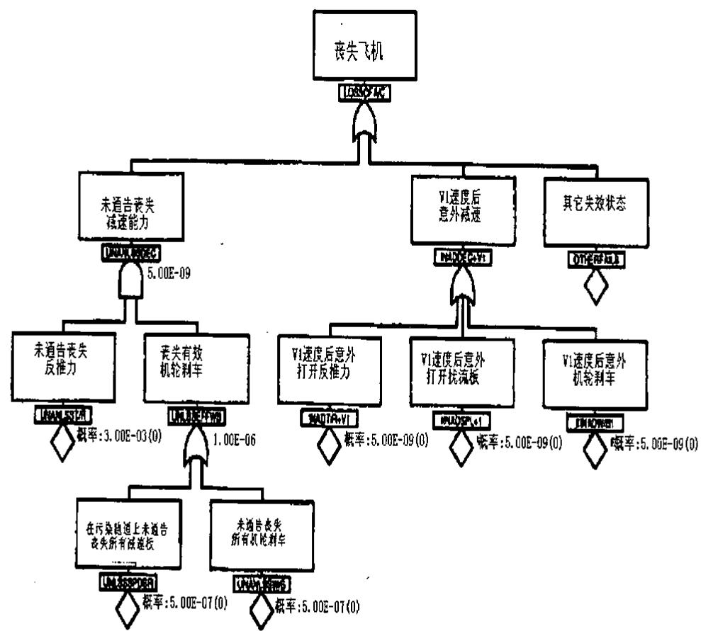  
图4.6-1-（飞机级FHA）初步飞机故障树

注：系统FHA

# 机轮刹车系统功能危险性评估（FHA）

# 1.0 引言

本分析包含S18飞机机轮刹车系统的功能危险性评估。该机轮刹车系统必须满足基于所作的构架设计决策和进行飞机级FHA的两个安全性设计目标。即是制动机轮在地面转动以及制动机轮在轮舱中转动。

（编者注：在本例中，分析机轮在地面转动的功能，因为它与使飞机在地面减速的功能是相当的。）

（编者注：下面的对照参考表提供示例的每个章节号与FHA适用的附录章节号之间的联系。）

<table><tr><td>系统FHA章节号</td><td>附录A章节号</td></tr><tr><td>4.1</td><td>A.3.1</td></tr><tr><td>4.2</td><td>A.3.2</td></tr><tr><td>4.3</td><td>A.3.3</td></tr><tr><td>4.4</td><td>A.3.4,A.3.6</td></tr><tr><td>4.5</td><td>A.3.7</td></tr><tr><td>4.6</td><td>A.4.0</td></tr></table>

# 2.0 参考文件：

1）S18飞机的飞机级功能危险性评估；  
2）S18初步飞机FTA；  
3）S18飞机设计要求和目标文件。

# 3.0 系统说明：

机轮刹车系统的主要目的是使飞机在地面减速而不拖胎。机轮刹车系统在飞机着陆时自动执行本功能或根据驾驶员的动作人工执行。除减速飞机外，机轮刹车系统还通过差动刹车用于地面方向控制，在起落架收上后制动主起落架机轮的转动以及停机时防止飞机的运动。

注：系统FHA

4.0机轮刹车系统功能危险评估的结果：

4.1 确定机轮刹车系统的功能：

机轮刹车系统执行下列功能：

a. 在地面减速机轮：

（1） 人工作动；  
（2） 自动作动；  
(3) 防滑；

b. 在起落架收上时减速机轮；  
c. 差动刹车进行方向控制；  
d. 停机时防止飞机运动。

（编者注：作为本例的目的，分析“在地面减速机轮”功能，在表4.1-1中表明的FHA样例格式的第（I）栏鉴别该功能。）

4.2 识别失效状态：

对于“在地面减速机轮”功能，确定下面一组失效状态和进行评估的假设：

4.2.1 功能失效状态：

a. 丧失全部机轮刹车；  
b. 对称丧失部分机轮刹车；  
c. 非对称丧失机轮刹车；  
d. 机轮刹车意外使用。

4.2.2 环境以及应急构型和条件：

a. 跑道条件（湿，冰等）；  
g. 跑道长度;  
h. 顺风/侧风；  
i. 发动机停车；  
j. 液压系统丧失；  
k. 电气系统丧失。

4,2,3 飞行阶段（地面阶段）：

a. 滑行；  
b. 起飞抬前轮；  
c. 着陆滑跑；  
d. 中断起飞（RTO）。

注：系统FHA

# 4.2.4 接口功能：

a. 向机组报警（给机组警告，报警和信号）  
b. 为进行方向控制的方向舵/前轮转弯提供操纵

表4.1-1的（2），（3）栏展示FHA样式的一部分，它包含对给出的功能明确说明其失效状态。

# 4.3 失效状态对飞机、机组和乘员的影响：

相对于每个失效状态，其对飞机、机组和乘员的影响被展示在表4.1-1的第（4）栏。

# 4.4 失效状态对飞机、机组和乘员影响的分类/证明该影响是正确的：

相对于每个失效状态，其失效状态分类被规定在表4.1-1的第（5）和（6）栏。

# 4.5 安全性目标的验证计划：

相对于每个失效状态，其安全性目标的验证计划被规定在表4.1-1的第（7）栏。

# 4.6 机轮刹车系统 FHA 摘要：

下面是从机轮刹车系统FHA中得出的一组值得注意的安全性要求，它们将被提供作为对机轮刹车系统PSSA的输入。

1）在着陆或RTO期间丧失所有机轮刹车的概率应小于5E-7每次飞行；  
2）在着陆或RTO期间非对称丧失机轮刹车且合并丧失方向舵或前轮转弯操纵的概率应小于5E-7每次飞行；  
3）在起飞滑跑期间的V1速度前，所有被锁定机轮意外刹车的概率应小于5E-7每次飞行；  
4）在起飞滑跑期间的V1速度后，所有机轮意外刹车的概率应小于5E-9每次飞行；  
5）起飞期间，未探测到没有锁定的一个机轮意外刹车的概率应小于5E-9每次飞行。

注：系统FHA

表 4.1-1-机轮刹车系统 FHA (部分- 仅表明 “在地面减速机轮”)  

<table><tr><td>1 功能</td><td>2 失效状态(危险性说明)</td><td>3 飞行阶段</td><td>4 失效状态对飞机/机组的影响</td><td>5 分类</td><td>6 参考的支持材料</td><td>7 验证</td></tr><tr><td>使用机轮刹车减速飞机</td><td>完全丧失机轮刹车</td><td>着陆或RTO</td><td>见下面说明:</td><td></td><td></td><td></td></tr><tr><td></td><td>a.未通告丧失机轮刹车</td><td>着陆或RTO</td><td>当机组操作刹车时,发现刹车失效.机组使用扰流板以及反推力装置的最大可能开度.这可能导致冲出跑道。</td><td>危险的(Hazardous)</td><td></td><td>S18飞机FHA</td></tr><tr><td></td><td>b.通告丧失机轮刹车</td><td>着陆</td><td>机组选择更合适的机场,通知紧急地面支援并为乘员作好飞机冲出跑道的准备.机组使用扰流板和反推力装置的最大可能开度。</td><td>危险的(Hazardous)</td><td>丧失正常和备用模式的机组程序。</td><td>S18飞机FHA</td></tr><tr><td></td><td>部分对称丧失机轮刹车</td><td>着陆或RTO</td><td>见下面说明:</td><td></td><td></td><td></td></tr></table>

注：系统FHA  
表4.1-1-机轮刹车系统FHA（续）（部分-仅表明“在地面减速机轮”）  

<table><tr><td>1 功能</td><td>2 失效状态(危险性说明)</td><td>3 飞行阶段</td><td>4 失效状态对飞机/机组的影响</td><td>5 分类</td><td>6 参考的支持材料</td><td>7 验证</td></tr><tr><td></td><td>a.未通告部分对称丧失机轮刹车</td><td>着陆或 RTO</td><td>机组当使用刹车时,发现该刹车失效。机组使用可利用的机轮刹车,扰流板以及反推力装置的最大可能开度以减速飞机.承受刹车的机轮温度增加且可能达到机轮/轮胎发生失效的温度点.其结果是否冲出跑道取决于刹车丧失的数量。</td><td>较大的到危险的(Major to Hazardous)</td><td>要求确定分类的附加分析研究。</td><td>待定</td></tr><tr><td></td><td>b.通告部分对称丧失机轮刹车</td><td>着陆</td><td>着陆前,机组知道有部分刹车丧失。机组使用机轮刹车,扰流板以及反推力装置的最大开度以减速飞机.承受刹车机轮上的温度增加且可能达到机轮/轮胎发生失效的温度点.其结果是否冲出跑道取决于刹车丧失的数量。</td><td>较大的(Major)</td><td></td><td></td></tr><tr><td></td><td>非对称丧失机轮刹车</td><td>着陆或 RTO</td><td>见下面说明:</td><td></td><td></td><td></td></tr></table>

注：系统FHA  
表 4.1-1-机轮刹车系统 FHA (续)  
（部分-仅表明“在地面减速机轮”）  

<table><tr><td>1 功能</td><td>2 失效状态(危险性说明)</td><td>3 飞行阶段</td><td>4 失效状态对飞机/机组的影响</td><td>5 分类</td><td>6 参考的支持材料</td><td>7 验证</td></tr><tr><td></td><td>a.非对称丧失机轮刹车-仅刹车系统失效</td><td>着陆或RTO</td><td>刹车性能降低。有偏离跑道的趋势。对于刹车性能和刹车温度,其影响与上述部分丧失刹车的情况是相同的。机组高速时使用方向舵,低速时使用前轮转弯操纵,使飞机保持在跑道上。直到研究的结果证明是正确以前,其影响待定。</td><td>待定</td><td>要求附加分析研究,以确定其分类。</td><td></td></tr><tr><td></td><td>b.非对称丧失机轮刹车以及丧失方向舵或前轮转弯操纵</td><td>着陆</td><td>刹车性能降低。有偏离跑道的趋势。对于刹车性能和刹车温度,其影响与上述部分丧失刹车的情况是相同的。机组不能保持跑道对中线并导致向跑道一边的偏移。</td><td>危险的(Hazardous)</td><td></td><td>S18飞机FTA</td></tr><tr><td></td><td>机轮刹车的意外作用</td><td></td><td>见下面说明:</td><td></td><td></td><td></td></tr><tr><td></td><td>a.没有锁定机轮的意外刹车作用</td><td>起飞阶段V1速度前</td><td>机组将飞机停止在跑道上。</td><td>较小的(Minor)</td><td></td><td></td></tr></table>

注：系统FHA  
表4.1-1-机轮刹车系统FHA（续）（部分-仅表明“在地面减速机轮”）  

<table><tr><td>1 功能</td><td>2 失效状态(危险性说明)</td><td>3 飞行阶段</td><td>4 失效状态对飞机/机组的影响</td><td>5 分类</td><td>6 参考的支持材料</td><td>7 验证</td></tr><tr><td></td><td>b.所有锁定机轮的意外机轮刹车作用</td><td>起飞阶段V1速度前</td><td>所有机轮可能爆破并丧失制动的有效性。</td><td>危险的(Hazardous)</td><td></td><td>S18 飞机FTA</td></tr><tr><td></td><td>c.所有锁定机轮或没有锁定机轮的意外机轮刹车作用</td><td>起飞阶段V1速度后</td><td>机组不能起飞或安全地RTO,导致飞机高速冲出跑道。</td><td>灾难性的(Catastrophic)</td><td></td><td>S18 飞机FTA</td></tr><tr><td></td><td>d.未探测到一个没有锁定机轮的意外机轮刹车</td><td>起飞</td><td>机组不能探测非常小的非对称失效。刹车温度可能达到非常高的温度值。机组收上起落架,可能导致机轮着火或轮胎失效。</td><td>灾难性的(Catastrophic)</td><td></td><td>S18 飞机FTA</td></tr><tr><td></td><td>e.一个没有锁定机轮的意外作用并合并探测的高刹车温度</td><td>起飞</td><td>机组不能探测非常小的非对称失效。刹车温度可能达到非常高的温度值。机组探测高刹车温度并保持起落架放下以冷却刹车。</td><td>较小的(Minor)</td><td>在探测高刹车温度的情况下,机组程序为使起落架放下。</td><td></td></tr></table>

注：PSSA-机轮刹车系统

# 机轮刹车系统PSSA

# 1.0 引言：

本PSSA是在机轮刹车系统的原理方案和初步设计阶段中执行的概要性评估和分析。本PSSA的目的是完成安全性要求的清单，确定所提出的设计能合理满足这些要求，并衍生出更下层组件和安装中考虑的安全性要求。

（编者注：下面的对照参考表提供示例的每个章节号与适用的附录章节号之间的联系。）

<table><tr><td>系统PSSA章节号</td><td>附录B章节号</td></tr><tr><td>4.1.4</td><td>B.3.1.1</td></tr><tr><td>4.1.2</td><td>B.3.1.2</td></tr><tr><td>4.2</td><td>B.3.2</td></tr><tr><td>4.2.1</td><td>附录D</td></tr><tr><td>4.2.2</td><td>附录E</td></tr><tr><td>4.2.3</td><td>附录F</td></tr><tr><td>4.3.2</td><td>B.3.3</td></tr></table>

# 2.0 参考文件：

1）S18飞机FHA；  
2）S18机轮刹车系统FHA；  
3）S18飞机初步CCA结果-PRA，CMA，ZSA（编者注：参考PRA，CMA和ZSA，因为它们提供确定独立性要求的方法。）；  
4）有关适航要求。

# 3.0 系统说明摘要：

机轮刹车系统被安装在两个主起落架上。两个主起落架上的机轮刹车用来在滑行和着陆阶段以及在中断起飞情况下，提供飞机的安全减速作用。机轮刹车系统表示在图3.0-1中。机轮刹车也用来防止飞机在停机时的意外运动以及提供飞机进行方向控制的差动刹车。机轮刹车系统的辅助功能是停止起落架收上时主机轮的转动。

在地面制动飞机，或者经由刹车脚蹬人工控制，或者不需要应用脚蹬自动控制（自动刹车）。自动刹车功能允许驾驶员在起飞或着陆前预置减速率。自动刹车仅对正常刹车系统是适用的。

# 注：PSSA-机轮刹车系统

# 3.0 (续)：

8个主起落架机轮带有多盘式碳刹车。基于丧失所有机轮刹车的概率小于5E-7每次飞行的要求，所采取的设计决策是相对于每个机轮有一个由两套独立的液压活塞作动的刹车组件。一套由绿液压源作用，且用于正常刹车模式。替代模式是备用的，当正常系统失效时，被自动选择，它使用蓝液压源被独立作用且也被用来驱动停机刹车的蓄压器所支持。该蓄压器提供应急刹车模式下的备用系统，当丧失蓝液压源时，正常模式是不适用的。各种不同失效状态下的转换是自动的，或用人工选择。当或者由于绿液压源本身丧失或者由于出现故障被其刹车系统控制装置（BSCU）分离而使绿系统压力降低到低于门槛值时，则自动选择装置将蓝液压源连接到备用刹车系统。防滑刹车装置在正常和备用模式下都是适用的，且在大于2米/秒的所有速度下工作。

在正常刹车模式下，所有8个机轮都根据各自的伺服阀进行单独刹车，它们也被用来施加防滑作用。在备用刹车模式下，双测量阀通过4个伺服阀提供低的液压刹车输入，该输入对4对机轮提供防滑功能。当正常系统在使用时，备用系统是不可能工作的。

在正常刹车模式下，刹车脚瞪的位置被电馈送到刹车计算机。这依次产生相应的控制信号给刹车。此外，该计算机监控表示飞机和系统某些关键状态的各种不同信号，以提供正确的刹车功能和改善系统故障容限以及对其它系统产生警告，指示和维修信息。因此，该计算机被命名为刹车系统控制装置（BSCU）。它自动提供如下功能：

a. 接收人工制动（刹车脚蹬）或自动控制（在3b类全天候着陆期间连接自动刹车，自动驾驶仪的命令）；  
b. 控制与飞机其它系统的接口；（编者注：与飞机其它系统的接口包括液压系统，刹车温度监控系统等。）  
c. 刹车调节，以避免主机轮滑动；  
d. 将信息（指示，信号灯，警告等）传输到飞行控制台以及有关 BSCU 状态的各种不同飞机计算机。

注：PSSA-机轮刹车系统

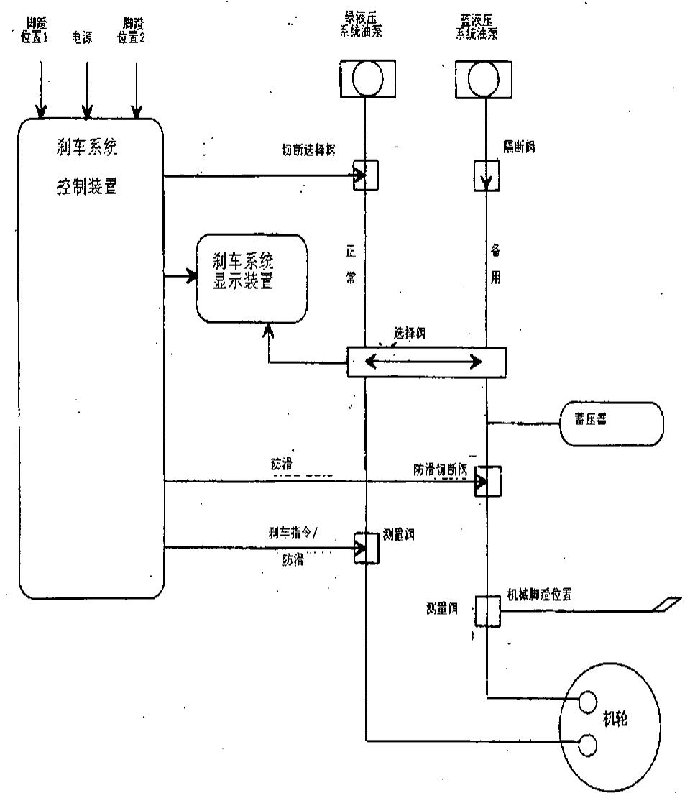  
图3.0-1（PSSA-机轮刹车系统）初步机轮刹车系统原理图

注：PSSA-机轮刹车系统

4.0机轮刹车系统PSSA的结果：

4.1 机轮刹车系统安全性要求：

4.1.1 PSSA输入：

从飞机和系统FHA以及基于5小时平均飞行时间的共因分析导出下面一组安全性（可用性，综合性和安装）要求。

1）在着陆或RTO期间，丧失所有机轮刹车（未通告或通告）的概率应小于5E-7每次飞行；  
2）在着陆期间，非对称丧失机轮刹车并耦合丧失方向舵或前轮操纵的概率应小于5E-7每次飞行；  
3）在起飞滑跑期间V1速度前，所有锁定机轮的意外刹车的概率应小于5E-7每次飞行；  
4）在起飞滑跑期间V1速度后，所有机轮的意外刹车的概率应小于5E-9每次飞行；  
5）在起飞期间，未探测到没有锁定的一个机轮意外刹车的概率应小于5E-9每次飞行；  
6）机轮刹车系统和反推力系统应被设计成排除任何共同的威胁（轮胎爆破，轮胎撕裂，气流抽打外胎面以及结构变形等）；  
7）机轮刹车系统和反推力系统应被设计成排除任何共模失效（液压系统，电气系统，维修，服务，运行，设计，制造等）。

表4.1.1-1中是用文件证明满足安全性要求的机轮刹车系统设计特征。

注：PSSA-机轮刹车系统

机轮刹车系统安全性要求/设计决策  
表 4.1.1-1-(PSSA-机轮刹车系统)  

<table><tr><td>安全性要求</td><td>设计决策</td><td>注释</td></tr><tr><td>1.在着陆或RTO期间,丧失所有机轮刹车(未通告或通告)的概率应小于5E-7每次飞行。</td><td>为达到此目标,要求一套以上液压系统(使用经验)。双通道BSCU和多模式刹车操作。</td><td>机轮刹车系统总的可用性能够合理地满足此要求。见下面的PSSAFTA。</td></tr><tr><td>2.着陆期间,非对称丧失机轮刹车并耦合丧失方向舵或前轮操纵的概率应小于5E-7每次飞行。</td><td>将方向舵以及前轮操纵系统与机轮刹车系统隔离。平衡每侧机轮刹车系统的液压源。</td><td>应表明机轮刹车系统与方向舵和前轮操纵系统是充分独立的。在区域安全性分析和特定风险分析中将表明这些系统之间的隔离。</td></tr><tr><td>3.在起飞滑跑期间V1速度前,所有锁定机轮意外刹车应小于5E-7每次飞行。</td><td>无</td><td>要求4更严格,从而产生该设计。</td></tr><tr><td>4.在起飞滑跑期间V1速度后,所有机轮意外刹车的概率应小于5E-9每次飞行。</td><td>单一失效不应产生此情况。</td><td>无</td></tr><tr><td>5.起飞期间,未探测到的一个没有锁定机轮意外刹车的概率应小于5E-9每次飞行。</td><td>单一失效不应产生此情况。</td><td>无</td></tr></table>

# 4.1.2 衍生的安全性要求：

表4.1.1-1说明的设计决策导致执行机轮刹车功能的主要和次要系统。作为这些设计决策的结果，衍生下面一组安全性要求（可用性，综合性和安装）：

1）主要和次要系统应被设计成排除任何共同的威胁（例如，轮胎爆破，轮胎撕裂，气流抽打胎面，结构变形等）；  
2）主要和次要系统应被设计成排除任何共模失效（液压系统，电气系统，维修，使用，运行，设计，制造等）。

注：PSSA-机轮刹车系统  
表 4.1.2-1-(PSSA-机轮刹车系统)机轮刹车系统衍生安全性要求  

<table><tr><td>安全性要求</td><td>设计决策</td><td>注释</td></tr><tr><td>1.主要和次要系统应被设计成排除任何共同的威胁(轮胎爆破,轮胎碎裂,气流抽打胎面,结构变形等)。</td><td>在主起支柱的前后安装刹车液压源。</td><td>符合性将用ZSA和PRA表明(编者注:本例仅相对于主起落架舱区域以及轮胎爆破特定风险)。</td></tr><tr><td>2.主要和次要系统应被设计成排除任何共模失效(液压系统,电气系统,维修,使用,运行,设计,制造等)。</td><td>选择两套不同的液压系统提供给刹车,应急刹车没有电源。</td><td>用CMA表明符合性。</td></tr></table>

注：PSSA-机轮刹车系统-FTA

# 4.2 失效状态评定：

从飞机和系统FHA确认的失效状态被列在下面。相对于每个失效状态进行初步评估和预测。

1）在着陆或RTO期间，丧失所有机轮刹车（未通告或通告）的概率应小于5E-7每次飞行；  
2）在着陆期间，非对称丧失机轮刹车并耦合丧失方向舵或前轮操纵的概率应小于5E-7每次飞行。  
3）在起飞滑跑期间V1速度前，所有锁定机轮意外刹车的概率应小于5E-7每次飞行。  
4）在起飞滑跑期间V1速度后，所有机轮意外刹车的概率应小于5E-9每次飞行。  
5）起飞期间，未探测到一个没有锁定机轮意外刹车的概率应小于5E-9每次飞行。

# 4.2.1 PSSA 的故障树分析：

（编者注：本节通常包含所有重大失效情况的故障树。但本例仅展示对“未通告丧失所有机轮刹车”的评定。）

图4.2.1-1表明的高层PSSA故障树反映该刹车系统顶层要求并描绘3个刹车分系统以及相对每一个非通告丧失刹车的预测。

# 注：PSSA-机轮刹车系统-FTA

# 4.2.1 (续):

图4.2.1-2中的故障树描述系统下一层的展开和评估。该故障树包含对丧失所有刹车是危险的这一事实的鉴别以及进行设计决策以适用于与“通告”无关的所有可能失效。通过增加与在图4.2.1-2中表示的“丧失所有机轮刹车”事件进行逻辑乘的“丧失通告能力”事件来反映这种情况。“丧失通告能力”的概率被设定为1.0。并进行设计决策：要求“正常”和“备用”刹车系统满足可用性和综合性要求，而与“紧急备用系统”没有相关性或影响。这用该系统的失效概率设定为1.0来表示。这导致对“正常”和“备用”刹车系统功能增加综合性预测。

图4.2.1-2也通过对“正常刹车系统不工作”事件所识别的促成因素的失效率进行预测来表明“正常刹车”系统设计向下的展开（丧失液压源，液压部件失效，以及丧失BSCU控制刹车的能力）。丧失BSCU控制刹车能力的事件，被进一步分解为两个主要组成部分：即BSCU失效和BSCU-电源失效；所包含的适用飞机电源失效预算以及BSCU失效预算的最后要求6E-6每小时被逆向计算，使其满足更高层丧失BSCU预算。该综合性预算作为系统的设计要求被传递给BSCU的供应商。

BSCU供应商的经验表明6.6E-6失效率预算对于复杂BSCU功能设计是不现实的，因此，供应商推导出一个冗余BSCU计算要求，以满足该失效率预算。图4.2.1-3中的故障树描述表明冗余BSCU与其逻辑乘构型的设计演变以及最终每通道每小时1.15E-3失效率预算。

PSSA-机轮刹车系统-FTA

编者注：决定提供两套施加机轮刹车的装置，以便对飞机完全停止起作用。这些装置是正常刹车系统和备用刹车系统。停机刹车对于飞机在地面正常运行是必要的，且决定当紧急刹车时让其起作用。本故障树对该3个系统中的每一个给出最初的概率预算分配。正常系统被给予最严格的概率分配。

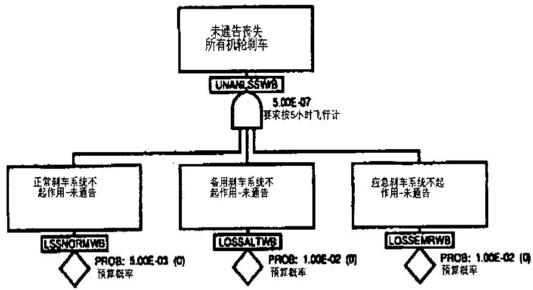  
图4.2.1-1-(PSSA-机轮刹车系统-FTA)未通告丧失所有机轮刹车故障树（初版）

注：PSSA-机轮刹车系统-FTA

编者注：因为未通告和通告丧失机轮刹车，都被认为是危险的失效状态，故所作出的决策包含对导致丧失机轮刹车系统的所有失效，不管它们是否被通告。

1.决定正常和备用系统将满足要求，一点不依靠紧急（停机）刹车；  
2.经与可能的BSCU供应商讨论表明，5.6E-06/小时的失效率用单件是达不到的，故决定用2个BSCU。本决定反映在下面的故障树中

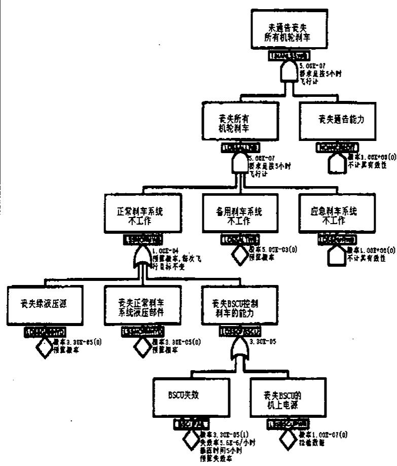  
图4.2.1-2-(PSSA-机轮刹车系统-FTA)  
未通告丧失所有机轮刹车故障树（A版）

注：PSSA 机轮刹车系统-FTA

编者注：此故障树已被改进，以适应2个BSCU的要求。

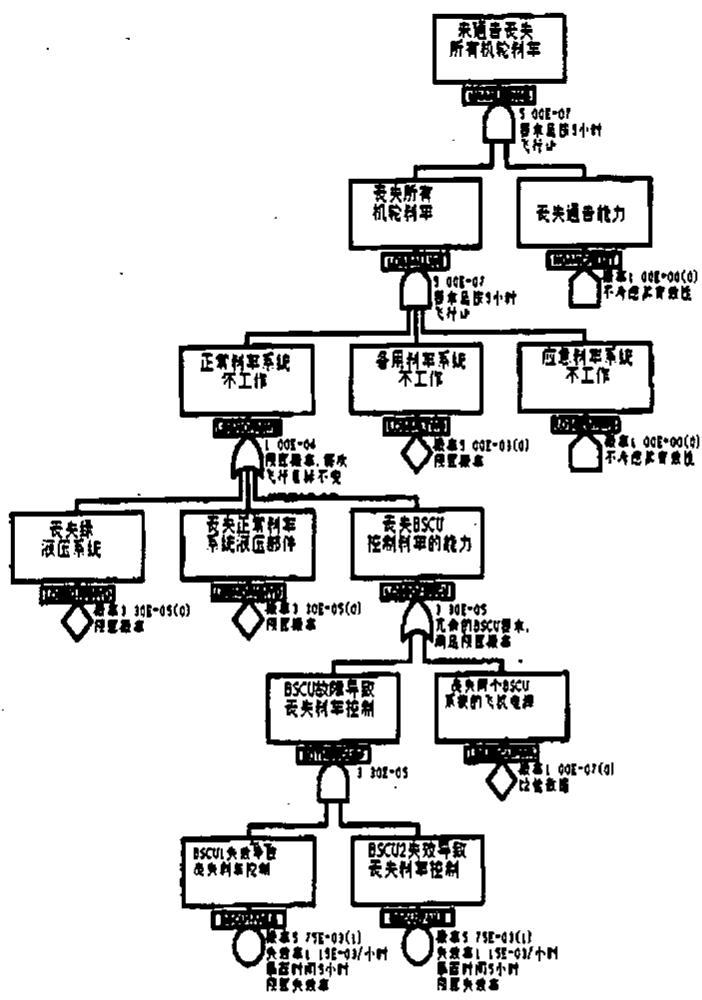  
图4.2：1-3-（PSSA-机轮刹车系统-FTA）  
未通告丧失所有机轮刹车故障树（B版）

# 注：机轮刹车系统 PSSA-DD

# 4.2.2 PSSA 的 DD 分析（定性/系统预算）：

（编者注：  $DD$  过程的细节，参考附录  $E_{\circ}$  ）

（编者注：通常在分析中将包含进行  $DD$  的文字说明。本示例与前述的FTA示例所包含的说明相似。）

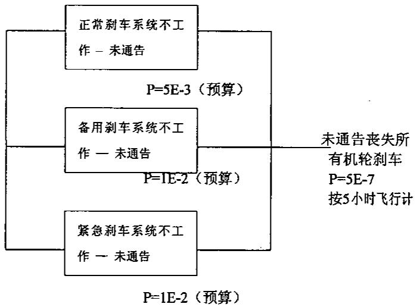  
图4.2.2-1-(PSSA-机轮刹车系统-DD)  
未通告丧失所有机轮刹车相关图（初版）

（编者注：决定提供两套施加机轮刹车的装置以便使飞机完全停止。它们是正常刹车系统和备用刹车系统。停机刹车对于飞机在地面正常运行是必需的，故决定让它作为紧急刹车来起作用。本相关图反映3个系统每一个最初的概率预算分配。给出正常系统最严格的分配。）

注：PSSA机轮刹车系统-DD

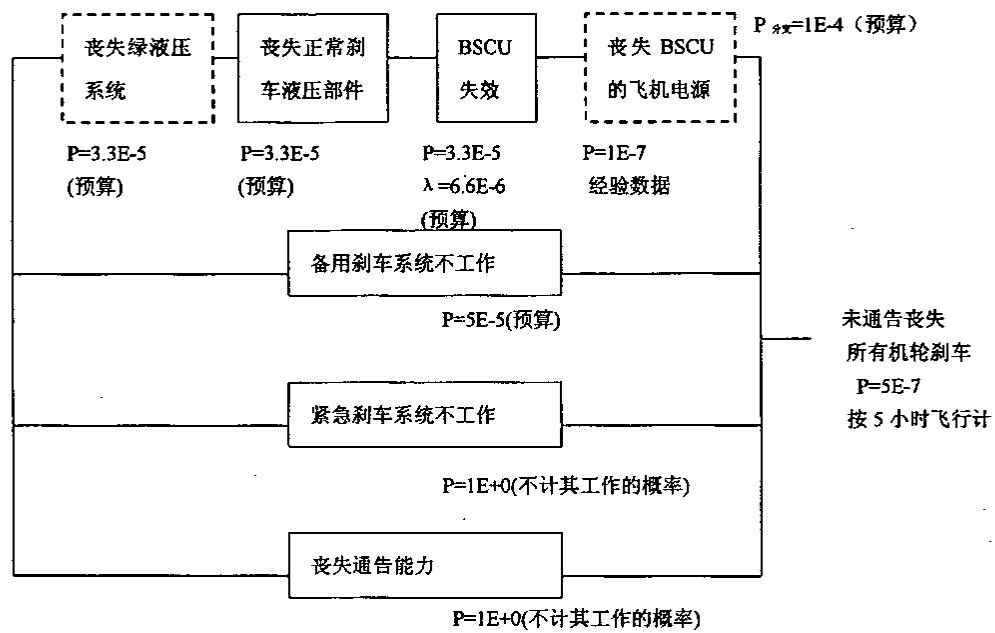  
图4.2.2-2-（PSSA-机轮刹车系统-DD）未通告丧失所有机轮刹车相关图（A版）

# 4.2.2 (续):

（编者注：在本机轮刹车系统  $DD$  中所研究的失效状态是未通告丧失机轮刹车，因为它促使产生灾难性的失效状态，即未通告丧失减速能力。因为未通告和通告丧失机轮刹车都被认为是危险的失效状态，所采取的决策包含对导致机轮刹车系统丧失的所有失效的考虑，不管它们是否被通告。该决策在  $DD$  上用包含概率为  $I$  的丧失通告能力事件来表示。

决定这样来设计系统，即正常和备用系统能满足要求，一点不依赖紧急（停机）刹车。

正常刹车系统采用失效率不大于  $IE - 4$  每次飞行的运行目标。

与可能的BSCU供应商讨论表明，每小时6.6E-6的失效率，用单个件是达不到的，故决定要求2个BSCU。此决定被反映在下页的DD中。）

注：PSSA机轮刹车系统-DD

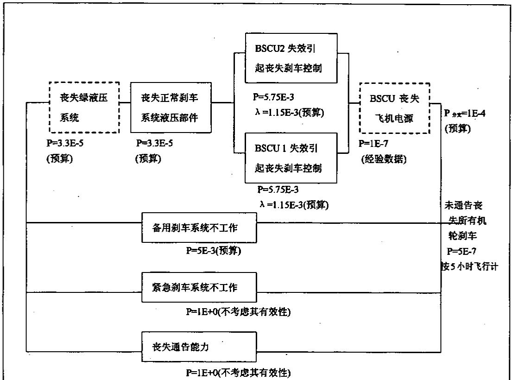  
图4.2.2-3-(PSSA-机轮刹车系统-DD)  
不通告丧失所有机轮刹车相关图（B版）

（编者注：本  $DD$  已被改进，以适应两个BSCU的要求。）

# 注：PSSA机轮刹车系统-MA

# 4.2.3 PSSA的马尔可夫分析：

（编者注：本节通常包含所有重大失效情况的马尔可夫分析。但本例仅展示“未通告丧失机轮刹车”的分析。）

在S18飞机的例子中，正常刹车系统失效率  $\lambda_{1}$  被扩展进行详细的马尔可夫分析。该分析涉及设计迭代过程。

（编者注：在本例中，假定备用系统  $(\lambda_{2})$  和紧急系统  $(\lambda_{3})$  是被展开的事件，因此，没有给出衍生这些事件失效率进一步分析。）

图4.2.3-1表明机轮刹车系统的马尔可夫链表示法。它提供刹车控制的3个不同系统的马尔可夫链：正常，备用和应急系统。马尔可夫链的每个状态用表明正常，备用和应急刹车系统的三维状态来定义。状态中的“1”表示正常工作的系统以及状态中的“0”代表失效的系统。例如，（011）表示系统的一种状态，在该状态中，正常刹车系统是失效的，而备用和应急刹车系统都是工作的。 $\lambda_{1}$ ， $\lambda_{2}$  和  $\lambda_{3}$  分别为正常，备用和应急刹车系统的失效率，用每小时的失效次数表示。假定当所有三个即正常，备用和应急系统都失效时，机轮刹车系统失效。这用状态（000）表示。马尔可夫链中的某些状态表明最大的状态概率，这是相对于正常，备用和应急刹车系统被分配的预算。

注：PSSA机轮刹车系统-MA

图4.2.3-1-(PSSA机轮刹车系统-MA)  
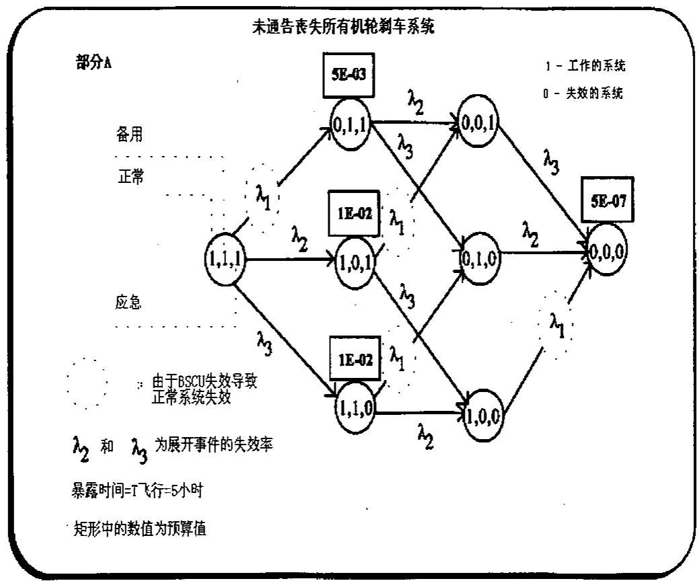  
未通告丧失所有机轮刹车的马尔可夫链（初版）

# 4.2.3 (续):

图4.2.3-2（A部分）除了不考虑应急刹车系统的工作概率之外，是与图4.2.3-1相同的。图4.2.3-2（B部分）表明控制正常刹车系统的BSCU计算机的详细马尔可夫链。图4.2.3-1中的虚线园用图4.2.3-2（B部分）的分析结果代替。图4.2.3-2（B部分）表明作为正常刹车系统三个组成部分的“或门”函数：BSCU，绿液压系统以及正常刹车系统液压部件。

在图4.2.3-2中，BSCU原打算用一件。经与可能的BSCU供应商讨论后，决定改用两件以满足安全性要求。BSCU的这种目标改进设计在图4.2.3-3中表明。为了满足安全性要求，在图4.2.3-3（C部分）中表示两个BSCU。在该马尔可夫链中，每个状态用2维（A，S）表示。其中A为激活的BSCU状态，这可能或者是BSCU1或者是BSCU2。S为备用的BSCU状态。假设每个部件是在工作状态或者是在失效状态。失效状态在该符号上部加一横线表示。假设当两个BSCU失效或两个BSCU的电源失效时，BSCU系统失效。

注：PSSA机轮刹车系统-MA

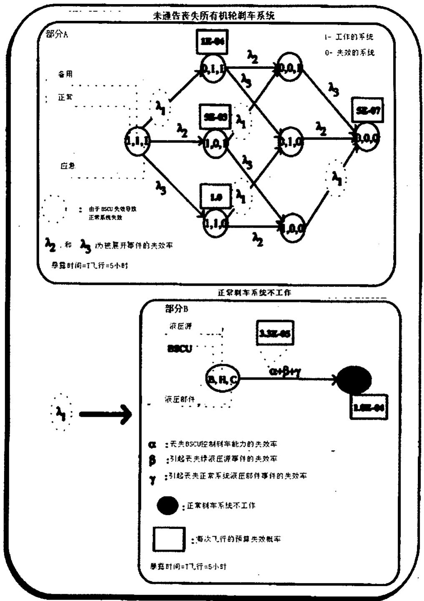  
图4.2.3-2-(PSSA机轮刹车系统-MA)

未通告丧失所有机轮刹车的马尔可夫链（A版）

注：PSSA 机轮刹车系统-MA

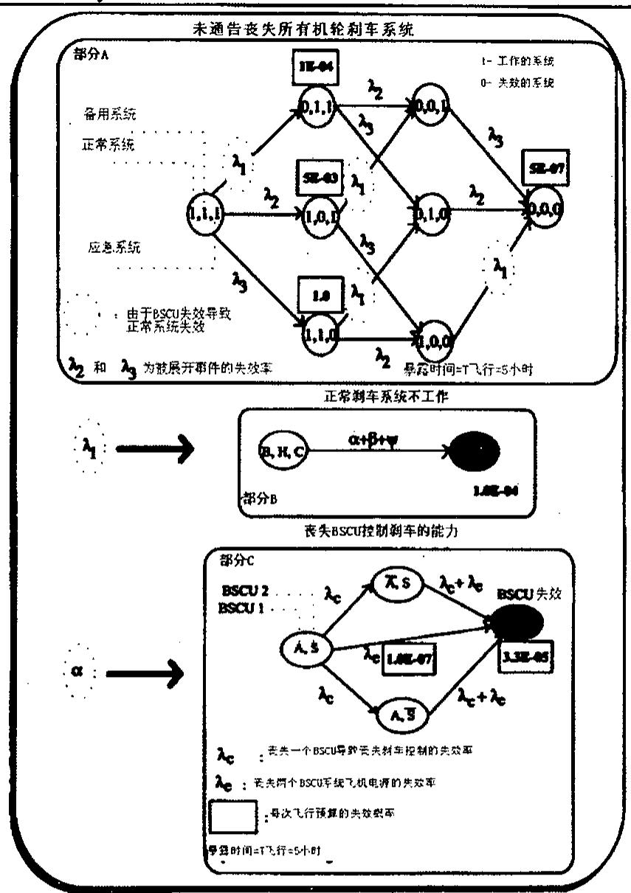  
图4.2.3-3-(PSSA机轮刹车系统-MA)  
未通告丧失所有机轮刹车的马尔可夫链（B版）

注：PSSA机轮刹车系统

# 4.3 确立要求：

从4.1节确定并列出的要求衍生出下列更低层面的要求。

# 4.3.1 安装要求：

主要和次要液压源系统应被隔离且应进行区域安全性分析（ZSA）和特定风险分析（PRA）来验证。

（编者注：由故障树产生附加安装要求，但为了简明起见，它们没有被示出）

# 4.3.2 组件级要求：

1) “BSCU故障引起丧失刹车控制”的概率应小于3.3E-5每次飞行；  
2) “单个 BSCU 故障”的概率应小于 5.75E-3 每次飞行；  
3) “正常刹车系统丧失液压部件”的概率应小于3.3E-5每次飞行；  
4） $\star$  “由于BSCU引起意外刹车”的概率应小于2.5E-9每次飞行；  
5) BSCU的单一失效不应导致“意外刹车”；  
6) 基于“由于BSCU引起意外刹车”为灾难性失效状态分类，故BSCU应被规定为研制保证等级A级；

（ $\star$  编者注：该要求从故障树确定，本例没有被示出。）

# 4.3.3 对其它系统的要求：

“丧失正常刹车系统绿液压源”的概率应小于3.3E-5每次飞行。

（编者注：从那些故障树产生对其它系统的附加要求，但为了简明起见，在此没有被示出。）

注：PSSA机轮刹车系统

# 4.3.4 安全性维护要求：

备用刹车模式的失效是潜在的，因为当正常刹车模式不包含任何失效时，它是工作的。因此必须产生维修工作，从功能上检查备用刹车模式。确定该检查的周期，以便使“备用刹车不工作小于5E-3每次飞行”要求得到满足。

（编者注：附加的维修要求可以从那些故障树产生，但为了简明起见，它们没有在此被示出。）

# 5.0 结论：

现在，已知该设计能满足在 FHA 和先前 CCA 中确定的安全性要求。有关安装，更低层面组件，其它系统以及执行维修工作的进一步要求已被确定且被传递到负责的设计管理机构。

注：PSSABSCU

# BSCU PSSA

# 1.0 引言：

本PSSA用文件证明在刹车系统控制装置的初步设计阶段所进行的评估和分析。本PSSA的目的是完成安全性要求的清单，确定所提出的设计能合理满足这些要求并衍生硬件和软件的要求。

（编者注：下列对照参考表提供示例的每个章节与PSSA适用附录章节之间的联系。）

<table><tr><td>组件PSSA章节号</td><td>附录B章节号</td></tr><tr><td>4.1.1</td><td>B.3.1.1</td></tr><tr><td>4.2</td><td>B.3.2</td></tr><tr><td>4.2.1</td><td>附录D</td></tr><tr><td>4.2.2</td><td>附录E</td></tr><tr><td>4.2.3</td><td>附录F</td></tr><tr><td>4.3</td><td>B.3.3</td></tr></table>

# 2.0 参考资料：

1）S18飞机机轮刹车系统PSSA；  
2）BSCU技术规范。

# 3.0 说明摘要：

按照BSCU可用性和综合性要求，提出BSCU由两套独立系统组成的建议，以满足可用性要求，以及每个系统包含一个控制通道和一个监控器通道以满足综合性要求。被推荐的BSCU构架原理图在图3.0-1中表示。

每个BSCU系统在其本身的电源中产生必需的电压，提供给电源监控器探测电压超出技术规范的状态。提供刹车脚蹬输入给控制和监控器通道，该二通道计算所必需的刹车控制量。比较由每个通道产生的控制量，如果它们不一致，则报告失效。将电源监控器和比较器的结果提供给系统有效监控器。被BSCU中任何一个系统报告的失效将使该系统不能产生其输出，且设定该系统有效监控器无效。每个BSCU系统有效监控器被提供给一个总的BSCU有效监控器。系统1和系统2都失效将使选择阀选择备用刹车系统。

在正常运行中，BSCU系统1向机轮提供刹车和防滑控制。当系统1经过系统有效监控器报告失效时，则系统2输出，如果有效，则被接通并提供控制。在相继发生系统2失效的情况下，所有BSCU输出都中断，且BSCU有效监控器被设定为无效。

注：PSSABSCU

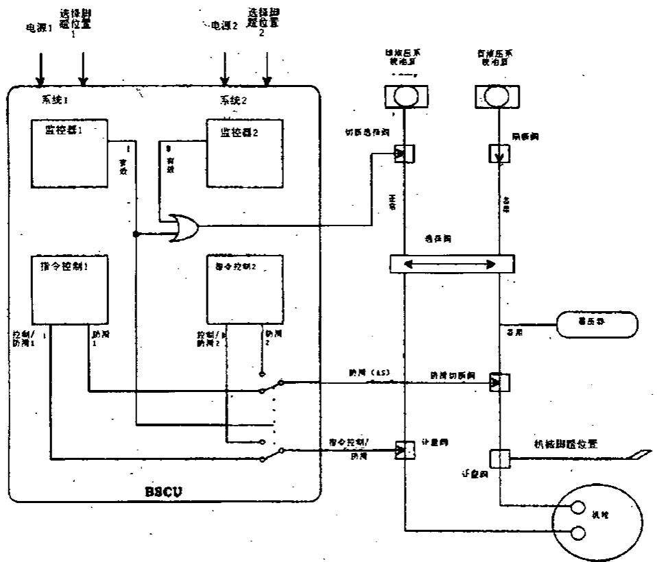  
图3.0-1（PSSABSCU）推荐的BSCU构架

注：PSSABSCU

4.0 BSCU PSSA :

4.1 BSCU 安全性要求：

4.1.1 PSSA 的输入：

从机轮刹车系统PSSA衍生出下面一组安全性要求：

1）“BSCU故障引起丧失刹车控制”的概率应小于3.3E-5每次飞行；  
2) “丧失单个BSCU”的概率应小于5.75E-3每次飞行；  
3）“由于BSCU引起意外刹车”的概率应小于2.5E-9每次飞行；  
4）BSCU的单一失效不应导致“意外刹车”；  
5）基于“由于BSCU引起意外刹车”为灾难性的失效状态分类，故BSCU的研制保证等级应规定为A级。

机体制造商提供如下飞机运行考虑：

a. 平均飞行时间-5小时；  
b. 平均通电检查时间间隔-100小时；  
c. 飞机寿命-100000小时；  
d. V1 和抬前轮之间的时间-15秒（0.004167小时）。

表明BSCU将如何符合安全性要求的计划在表4.1.1-1中说明。

注：PSSABSCU  
表 4.1.1-1-(PSSA BSCU) BSCU 安全性要求/设计决策  

<table><tr><td>安全性要求</td><td>设计决策</td><td>备注</td></tr><tr><td>1.“BSCU 故障引起丧失刹车控制”的概率应小于3.3E-5每次飞行;</td><td>双通道 BSCU 设计。</td><td>BSCU 系统总的可用性能合理满足此要求。见图4.2.1-1中的 FTA。</td></tr><tr><td>2.“丧失单个 BSCU”的概率应小于5.75E-3每次飞行;</td><td>设计具有足够的可靠性。</td><td>无。</td></tr><tr><td>3.“由于 BSCU 引起意外刹车”的概率应小于2.5E-9每次飞行;</td><td>每个 BSCU 系统由独立的控制和监控器通道组成。</td><td>BSCU 的综合性能达到此要求。见图4.2.1-2中PSSA BSCU FTA 的 FTA。</td></tr><tr><td>4.BSCU 的单一失效不应导致“意外刹车”;</td><td>单一失效不应导致此状态。</td><td>按需要进行 CMA 和 FMEA。</td></tr><tr><td>5.BSCU 的研制保证等级应规定为 A 级。</td><td>研制控制通道为研制保证等级 A 级,而监控器为 B 级。</td><td>按照 SAE ARP4754 第 5.4 节分配研制保证等级。</td></tr></table>

# 4.2 失效状态评价：

对于这些失效状态的故障树，“丧失BSCU”和由于“BSCU引起意外刹车”被展开且被评价，以确定所提出的BSCU设计的可实现性。基于有关设计的所有适用信息和过去的经验进行概率分配。

（编者注：在此再次介绍意外机轮刹车的失效情况，因为它提供说明BSCU共模分析以及失效模式和影响分析的较好的范例。）

# 注：PSSABSCU-FTA

# 4.2.1 BSCU系统PSSA-故障树分析：

图4.2.1-1中的故障树阐明丧失BSCU的失效状态。BSCU供应商确定，通过在单一的BSCU外场可更换单元中包含两个独立的BSCU系统，采用选择有效输送到刹车系统BSCU控制的监控器/开关布置，可以实现BSCU的冗余度。如在故障树中描述的那样，如果BSCU有效监控器故障到其不正确报告两个BSCU故障（BSCU有效监控器不正确报告双失效），如果在相同的飞行中BSCU系统1和2都遭受失效（BSCU系统1和2都不工作），或如果特定的开关失效连同出现该所选择的通道失效（开关失效促使丧失BSCU刹车控制），则发生丧失所有BSCU工作的事件。该故障树进一步说明BSCU开关组合失效的可能性以及同时发生导致丧失刹车的BSCU系统失效。该故障树还表明或者由于计算通道或者由于电源促成的单一BSCU系统失效的分解和失效率预算。

图4.2.1-2中的故障树阐明由BSCU引起的意外机轮刹车。BSCU仅当正常刹车系统在使用时可能引起意外刹车。该故障树不处理在飞机级分析中的有关情况。该故障树假设没有可能引起意外刹车指令的不可探测的BSCU失效。为了满足此要求，该假设必须经FMEA和/或CMA证明是正确的。该故障树的其它分支处理BSCU监控的失效和监控器失效的组合。可探测的BSCU失效是电源失效或CPU失效，电源失效是由电源监控器和控制通道输入/输出探测的超出技术规范的电源所引起，而CPU失效是由比较器探测的意外刹车指令所引起。监控器输入/输出和CPU失效不被包含在故障树中，因为监控器通道不提供刹车控制。监控器通道失效将引起比较器报告失效，如果比较器工作，则接通到其它BSCU系统的刹车指令。如果比较器不工作，则监控器通道失效仍然不引起意外刹车。

因为BSCU系统1通常是主动通道，所以故障树（第2页）说明系统1没有探测到的电源失效可能促使意外刹车，如同计算通道失效可能促使意外刹车一样。第3页的故障树包含有关BSCU系统2相同的BSCU失效信息，然而，系统2不能被应用到刹车，除非监控器/选择开关被激活；因此开关在位置2的事件是与系统2失效进行逻辑乘。两种情况可以导致开关接通，预先探测到系统1失效，或独立的监控器/开关失效。

注：PSSABSCU-FTA

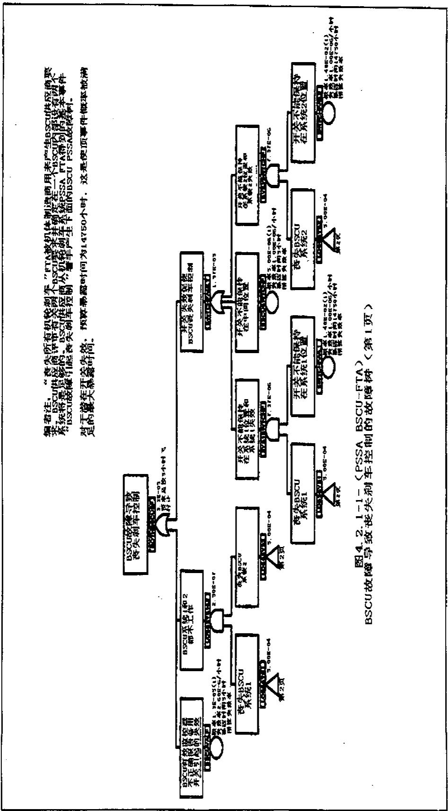

注：PSSABSCU-FTA

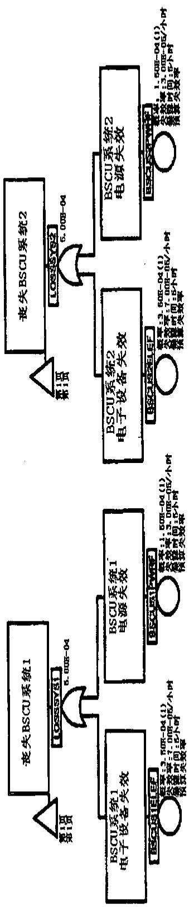  
编译注：这种详细程度在此种故硬例中通常不会出现，因为使用BSCU的总效率表求求被满足是可能的。本例中包含有关BSCU失效模式的细节，以便说明乌朵可夫分析的特点。  
图4.2.1-1-(PSSABSCU-FTA)BSCU故障导致丧失剥削控制的故障树（第2页）

注：PSSABSCU-FTA

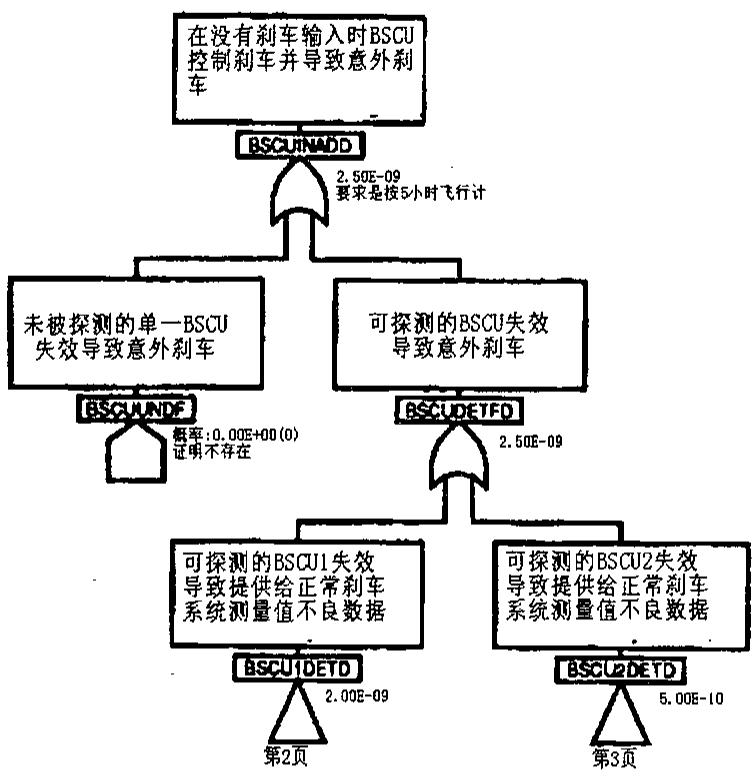  
图4.2.1-2-(PSSABSCU-FTA)

在没有刹车输入时BSCU控制刹车并导致意外刹车的故障树（第1页）

注：PSSABSCU-FTA

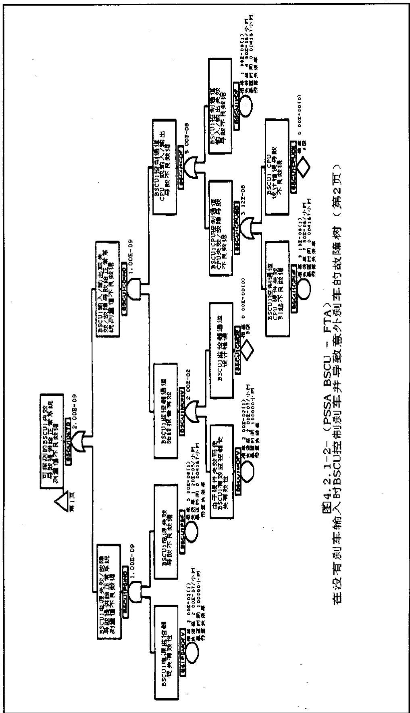

注：PSSABSCU-FTA

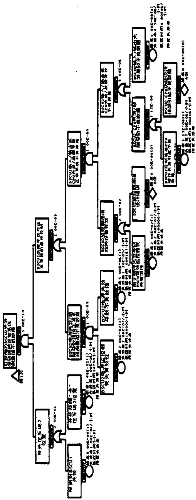  
图1.2.1-2-(PSSABSCU-FTA）在没有刹车输入时BSCU控制刹车并导致意外刹车的故障树（第3页）

注：PSSABSCU-DD

# 4.2.2 BSCU系统PSSA-相关图分析：

（编者注：通常在  $DD$  分析中会包含文字性说明，此说明与前面进行的FTA相似。）

图4.2.2-1中的相关图阐明丧失BSCU的失效状态。如果BSCU有效监控器故障到其不正确报告两个BSCU的失效或如果BSCU系统1和2都遭到失效，则便丧失了所有BSCU的工作。

图4.2.2-2中的相关图阐明由BSCU导致的意外机轮刹车。BSCU仅当正常刹车系统在使用中时可能产生意外刹车。该相关图不处理飞机级情况的分析。该相关图假设不存在可能导致意外刹车控制的不可探测BSCU失效。为了满足此要求，该假设必须经FMEA和/或CMA证明是正确的。该相关图处理BSCU监控失效和监控器失效的组合。

注：PSSABSCU-DD

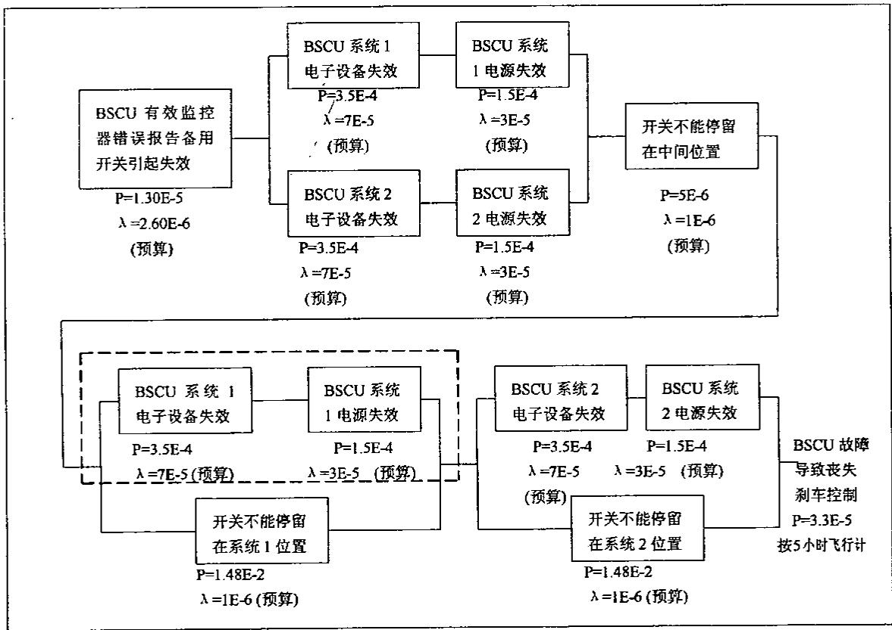  
图4.2.2-1-(PSSABSCU-DD）BSCU故障导致丧失刹车控制的相关图

# 4.2.2 (续):

（编者注：“丧失所有机轮刹车”DD被机体制造商用来产生BSCU供应商要求。BSCU供应商评审有关使用两个BSCU的要求并确定在一个BSCU内设有两个系统将是足够的。该BSCU供应商从机轮刹车系统PSSA DD得到的“BSCU故障导致丧失刹车控制”的基本事件着手产生如下的BSCUPSSA DD。

对于潜在开关失效，预算的暴露时间为14750小时。这是使该项事件概率要求被满足的最大暴露时间。

在这种  $DD$  中，通常不会出现如此详细的程度，因为使用BSCU总失效率表明该要求被满足是可能的。在本例中包含有关BSCU失效模式的细节，以便让马尔可夫分析的特点被说明）。

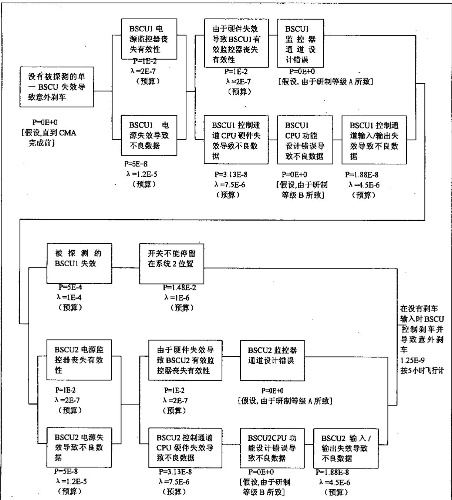  
注：PSSABSCU-DD  
BSCU在没有刹车输入时控制刹车并导致意外刹车  
图4.2.2-2-(PSSABSCU-DD)

# 注：PSSABSCU-MA

# 4.2.3 BSCU系统的PSSA-马尔可夫分析：

对于“BSCU故障导致丧失刹车控制”的马尔可夫分析，包含开关机构，在图4.2.3-1（A部分）表示。在该马尔可夫链中，每个状态用三维（A,S,SW）符号表示，其中“A”为主动BSCU计算机的状态，这或者可能是BSCU1或者可能是BSCU2，“S”为备用BSCU计算机的状态，“SW”为开关的状态。假设每个部件是在工作状态或是在失效状态。失效状态是在该符号顶端用一横线来表示。主动和备用BSCU计算机仅在一种模式下可能失效。而开关系统可能在两个不同的模式下失效，即或者卡住在主动BSCU计算机上或者卡住在开路上（没有连接到任何一个BSCU计算机上）。当两个BSCU计算机任何一个失效或者当主动系统在飞行中失效，开关系统从主动系统转接到备用系统时失效，则假设BSCU系统失效。图4.2.3-1（B部分）相对于BSCU系统失效表明扩展的马尔可夫模型。无论何时，只要BSCU电子设备失效或BSCU电源失效，则假设BSCU系统失效。该两个装置都失效用图4.2.3-1中（B部分）单向传输的马尔可夫链来表示。

图4.2.3-2表明“可探测的BSCU失效导致意外刹车”。当任何一个BSCU系统中监控器和主动系统都失效时，则发生意外刹车。由于BSCU系统1失效导致的意外刹车被表示在图4.2.3-3中。在该情况下，每个状态用一个4维（A,B,C,D）符号表示。每个状态的第1和第3维相应于BSCU系统CPU以及输入/输出和电源。每个状态的第2和第4维相应于CPU以及输入/输出监控器和电源监控器。当两个CPU和其监控器都失效或当电源和其监控器失效时，则发生意外刹车。由于BSCU系统1失效导致意外刹车的预算概率值为2E-9。

由于BSCU系统2和开关机构失效导致的意外刹车被表示在图4.2.3-4中。图4.2.3-4中的马尔可夫模型与BSCU系统1（图4.2.3-3）的马尔可夫模型，除了为计及开关机构在该模型上增加一个新的失效模式外是相同的。开关机构失效，在图中用  $2.5\mathrm{E}-1$  来表示其失效率。因此，由于BSCU系统2失效导致意外刹车的总预算概率为  $(2\mathrm{E}-9)\times (2.5\mathrm{E}-1)=5\mathrm{E}-10$  。

注：PSSABSCU-MA

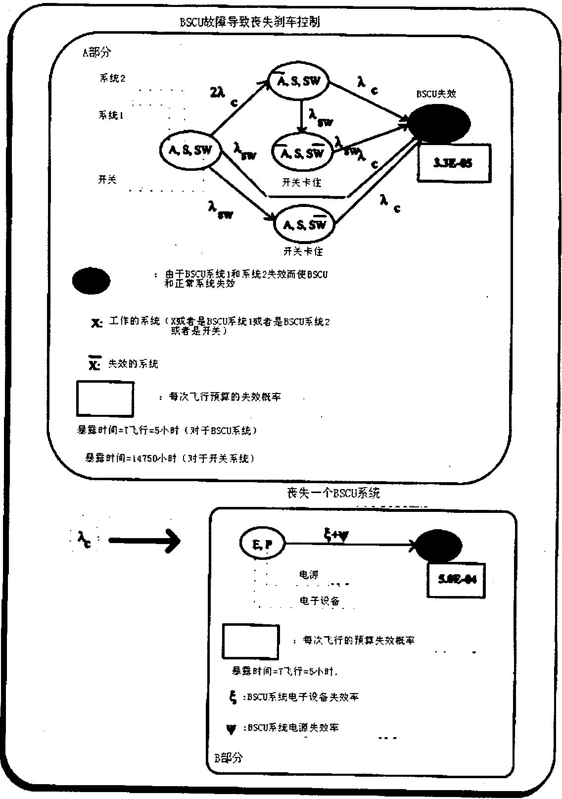  
图4.2.3-1-(PSSABSCU-MA）BSCU故障导致丧失刹车控制的MA

注：PSSABSCU-MA

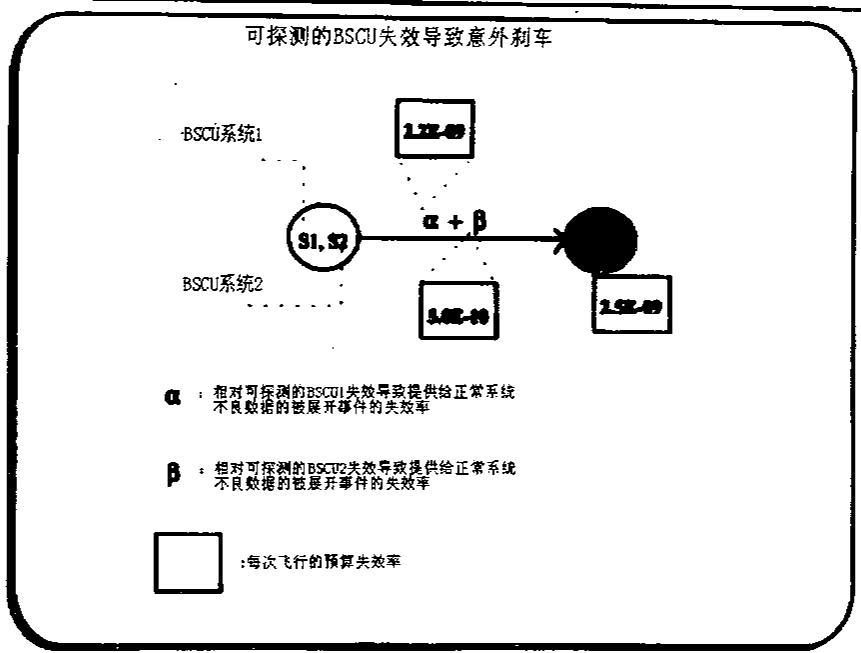  
图4.2.3-2-(PSSABSCU-MA)可探测的BSCU失效导致意外刹车的MA

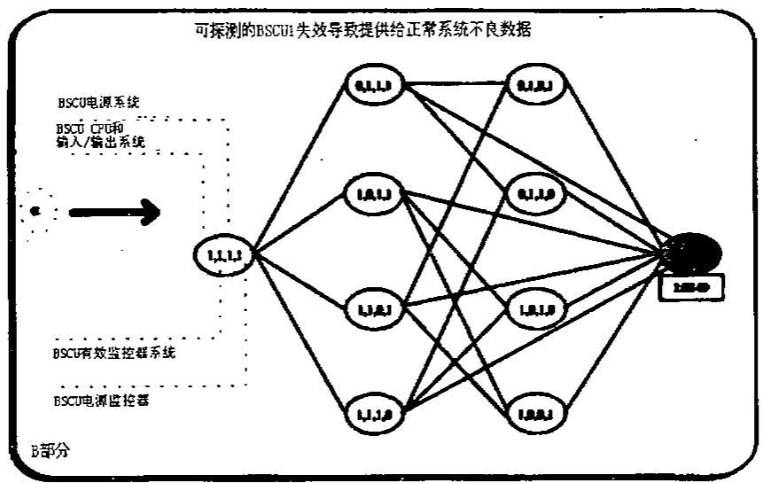  
图4.2.3.3-(PSSA BSCU-MA)由于BSCU系统1失效导致意外刹车的MA

注：PSSABSCU-MA  
图4.2.3-4-(PSSABSCU-MA)  
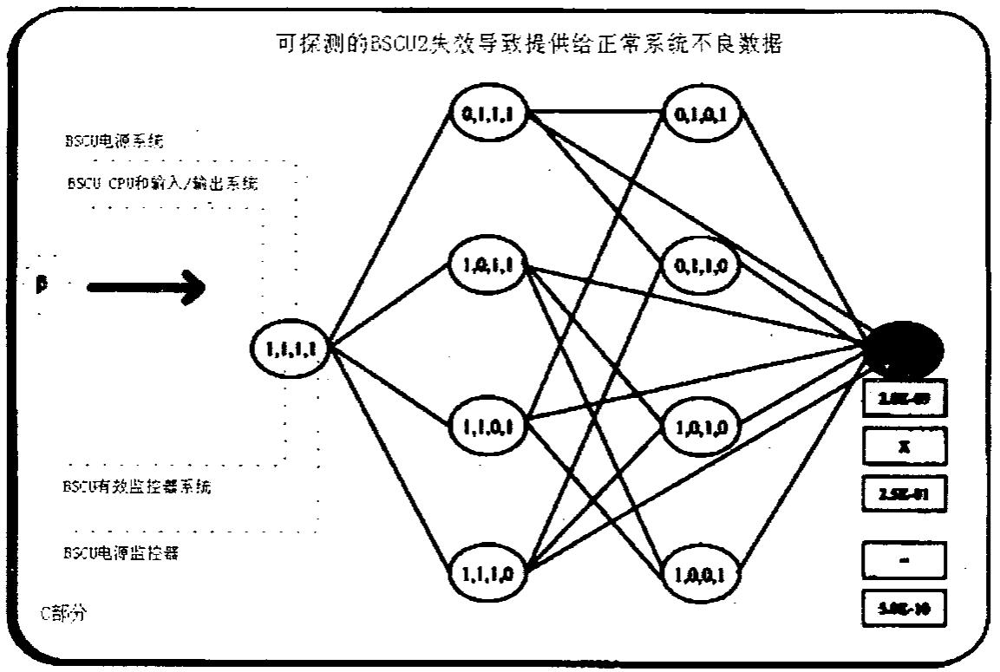  
由于BSCU系统2失效和开关机构失效导致意外刹车的MA

注：PSSABSCU

# 4.3 确立要求：

作为失效状态评价的结果，衍生出如下较低层面的要求。

# 4.3.1 安装要求：

每一个BSCU系统要求具有与其它系统分开的电源。

# 4.3.2 硬件和软件要求：

衍生出如下硬件和软件要求，它们必须被满足，以便符合总的安全性目标：

1）每个BSCU系统将具有小于1E-4每小时失效的目标失效率；  
2）在图4.2.1-1和4.2.1-2中表明的故障树主要事件的目标概率必须被满足；注：不满足这些目标概率的任何事件，在着手进行设计前必须得到系统工程部门的批准。  
3）不应存在可能导致意外刹车的任何不可探测的BSCU失效；  
4）BSCU系统的控制和监控器通道不应存在共模失效，使其可能同时提供相同错误的刹车控制；  
5） $\star$  BSCU系统的监控器通道应按研制保证等级A级进行设计；  
6） $\star$  BSCU系统的控制通道可以按研制保证等级B级进行设计。

*（编者注：上述等级分配能被转变为控制通道按研制保证等级  $A$  级进行设计以及监控器通道按研制保证等级  $B$  级进行设计。）

# 4.3.3 安全性维修要求：

系统1和系统2之间的选择开关在不超过14750小时的时间间隔内必须被检测。

# 5.0 结论：

现在看来，知道该设计能满足由机轮刹车系统提出的安全性要求。有关安装，硬件，软件以及执行维修工作的进一步要求已被确认并被传递到负责的设计部门。要求进行失效模式和影响分析和共模分析，以验证该设计满足这些要求。

注：SSABSCU-FMEA

（编者注：这里，假设PSSA被充分展开，以便能进行详细设计。本例概述如下的详细设计实施情况和进行SSA，以支持合格审定。如在本文件主体部分图3中说明的那样，SSA过程是从组件级自下而上着手进行分析的。）

# BSCU电源失效模式和影响分析（FMEA）

（编者注：本FMEA实例被简化限定为BSCU的电源。实际上，FMEA可以被要求在任何级别上进行，从一个完整的系统到执行一项功能线路LRU内部的一小部分。）

1.0 引言：

（编者注：作为本例的目的，假设FMEA被选择来支持SSA中的FTA。对于FMEA的过程和格式可以要求小的改变，以支持DD或MA的数学方法；然而，基本步骤和原理不变。）

本FMEA阐明BSCU电源，以支持作为参考资料2“在V1速度后意外刹车”初步FTA中识别的基本事件和安全性目标。

本FMEA报告通过对基本事件的提供失效率来提供最终FTA的定量表示。被本FMEA支持的FTA基本事件为“BSCU电源失效导致不良数据”，“BSCU电源监控器丧失有效性”以及电源成为“未被探测到的BSCU失效导致意外刹车”的原因之一。该分析相对于BSCU设计和生产图纸的发放和最终文件来进行。本FMEA将是BSCU和机轮刹车系统SSA支持文件的一部分。

所要求的FMEA分两部分执行。功能FMEA相对于电源来执行，而零部件FMEA相对于电源的电源监控器部分来执行。在功能FMEA的保守结果不满足安全性目标后，执行零部件FMEA。

（编者注：下列对照参考表提供示例的每个章节号与适用FMEA附录章节号之间的联系。）

<table><tr><td>组件FMEA章节号</td><td>附录G章节号</td></tr><tr><td>4.1</td><td>G.3.2.1</td></tr><tr><td>4.2</td><td>G.3.2.2</td></tr></table>

注：SSABSCU-FMEA

# 2.0 参考文件：

（编者注：包含在这些参考文件中的资料，在FMEA开始前提供所要求文本的具体部分。见G.2.1节。）

1）ARP4761“Guidelines and Methods for Conducting the Safety Assessment Process on Civil System and Equipment”（“民用飞机机载系统和设备安全性评估过程的指南和方法”）；  
2）请求FMEA支持，装有BSCU系统的S18飞机“在V1速度后意外刹车”故障树的内部备忘录；  
3）BSCU发放的设计和生产文件：  
4）MIL-HDBK-217F“Reliability Prediction of Electronic Equipment”（“电子设备的可靠性预测”）；  
5）规定用于BSCUFMEA部件失效模式的内部备忘录；  
6）“丧失或降低滤波”的实验室分析结果。

# 3.0 电源说明：

（编者注：FMEA的准备工作部分是了解该功能的作用。该作用的简要说明应包含在报告中，如在G2.1）中所概述的。）

当评审参考文件3中提供的BSCU电源实施文件时，发现BSCU1和2的电源设计和实施是相同的。实施是通过相同的电源设计，定位在BSCU线路板装配的物理隔离区域，如在图3.0-1BSCU构架原理图所描述的那样。在每个BSCU系统内，从物理上独立安排电源和电源监控器功能。

用图3.0-2中提供的方块图描述该电源设计。在图3.0-3中提供详细的  $+5$  伏监控器设计简图。

BSCU 电源为标准设计并在 BSCU 硬件说明文件中加以说明。

电源监控器为窗式比较器。+5伏和  $\pm 15$  伏都被监控作为超电压或电压不足的条件。输出被逻辑乘在一起，以便如果任何电压超过行程点，不论高或低，则监控器输出被拉低。

注：SSABSCU-FMEA

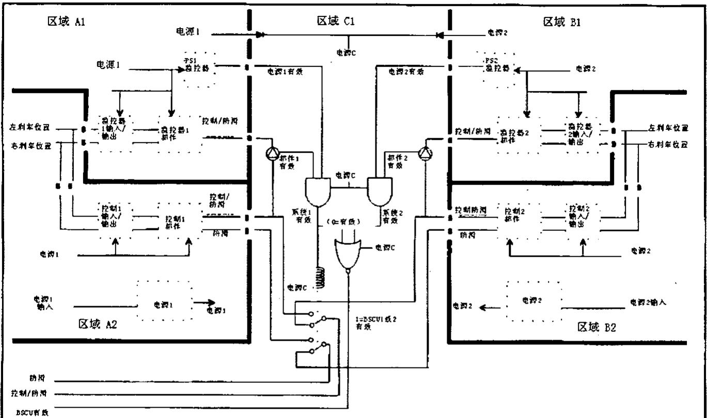  
图3.0-1-(SSA BSCU-FMEA)BSCU的物理实施

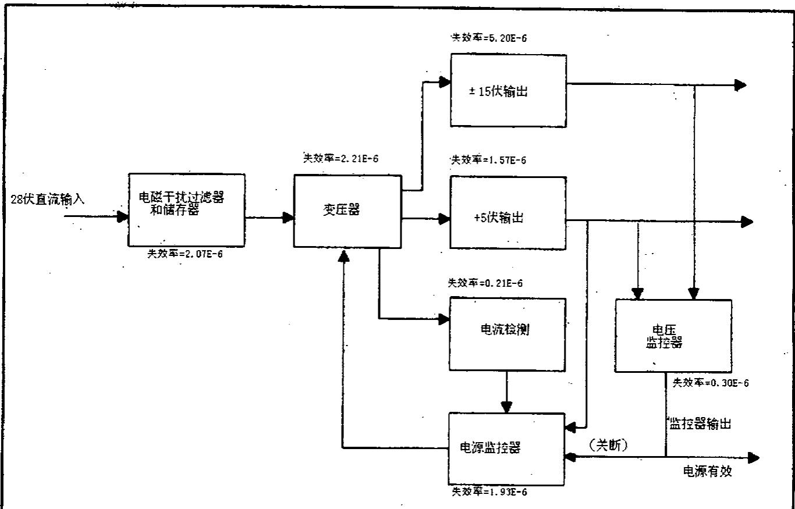  
注：SSABSCU-FMEA  
图3.0-2-(SSA BSCU-FMEA)电源原理方块图

注：SSA BSCU-FMEA

图3.0-3-(SSA BSCU-FMEA)电源监控器简图  
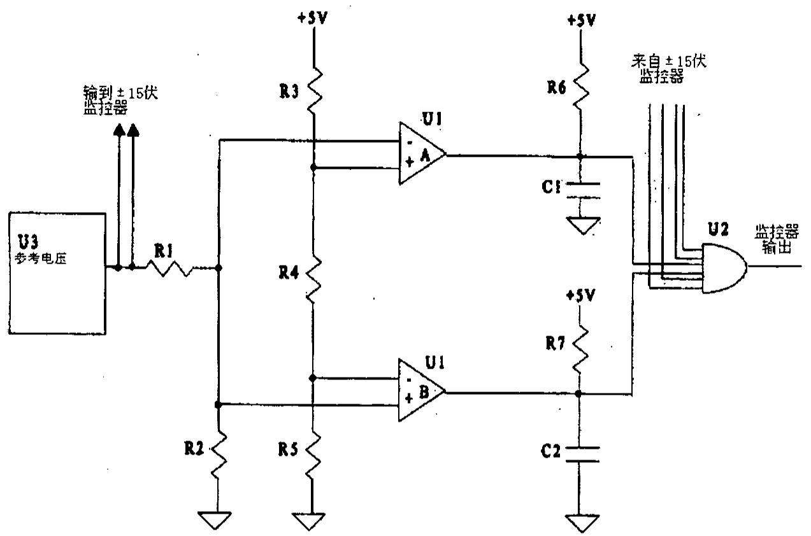  
注：土15伏监控器使用相同的参考电压和监控简图。

# 4.0 电源详细分析和结果：

本FMEA包含两节。4.1节是相对整个电源执行功能的FMEA。相对电源监控器功能的FMEA被删去，因为它被4.2节进行的零部件FMEA所代替。

# 4.1 功能FMEA：

最初的电源分析是用在零部件数目和失效率基础上计算电源总失效率来进行的。保守的分析不满足相对于不可探测的电源失效导致意外刹车的预算。因此执行功能FMEA，以便对各种不同失效模式的失效率提供更好的解决办法。可能导致不良数据并不可能用适当的电源监控器探测的唯一失效是“丧失/降低滤波”。这种失效模式可能导致输出电压增加脉动并可能达到其不被监控器探测到的强度和频率。表4.1-1用文件证明功能FMEA的结果。

注：SSABSCU-FMEA

# 4.1 (续):

（编者注：仅仅详细表明+5伏部分的分析。有关电源其余部分FMEA的结果被包含在摘要中。进行此工作时，略去表中不必要的部分，以给出有代表性的功能FMEA的例子。）

BSCU电源功能的失效模式和影响分析  
表 4.1-1 (SSA BSCUFMEA)  

<table><tr><td>功能名称</td><td>失效模式</td><td>失效率(E-6)</td><td>飞行阶段</td><td>失效影响</td><td>探测方法</td><td>注释</td></tr><tr><td>+5伏</td><td>超出+5伏技术规范</td><td>0.2143</td><td>所有</td><td>电源可能断开</td><td>电源监控器断开,切断来源并将“电源无效”传递到其它BSCU系统。</td><td>BSCU通道失效。</td></tr><tr><td></td><td>+5伏与地短路</td><td>0.2857</td><td>所有</td><td>电源断开</td><td>电源监控器将“电源无效”传递到其它BSCU系统。</td><td>BSCU通道失效。</td></tr><tr><td></td><td>丧失或降低滤波</td><td>0.3571</td><td>所有</td><td>增加脉动</td><td>如果脉动不被电源监控器探测到,则超出技术规范的电压会传递到其它BSCU系统。</td><td>可能导致虚假的电源监控器断开。</td></tr><tr><td></td><td>+5伏开路</td><td>0.5714</td><td>所有</td><td>电源断开</td><td>电源监控器将“电源无效”传递到其它BSCU系统。</td><td>BSCU通道失效。</td></tr><tr><td></td><td>没有影响</td><td>0.1429</td><td>所有</td><td>没有影响</td><td>没有/没有影响。</td><td>没有影响。</td></tr><tr><td>+5伏电源总的失效率</td><td></td><td>1.5714</td><td></td><td></td><td></td><td></td></tr></table>

注：SSABSCU-FMEA

# 4.2 电源监控器零部件FMEA：

最初的电源监控器分析通过计算基于零部件数目和失效率的电源监控器总失效率来进行的。得到电源监控器总失效率为3.06E-7失效/小时，因此，不符合“监控器丧失有效”2.0E-7的预算失效率。进行详细零部件FMEA，以便对“监控器丧失有效”的情况提供更好的解决方案。表4.2-2用文件证明该零部件FMEA。包含5种通用的失效影响编号以加强失效分类摘要。在表4.2-1中规定这些失效影响编号。

表 4.2-1 - (SSA BSCU-FMEA) 失效影响类型  

<table><tr><td>失效影响编号</td><td>失效影响类型</td></tr><tr><td>1.</td><td>监控器丧失有效</td></tr><tr><td>2.</td><td>有害的监控器断开</td></tr><tr><td>3.</td><td>监控器卡在被断开位置/电源断开</td></tr><tr><td>4.</td><td>监控器灵敏度漂移</td></tr><tr><td>5.</td><td>没有影响</td></tr></table>

注：SSABSCU-FMEA

BSCU电源监控器零部件失效模式和影响分析  
表 4.2-2-(SSA BSCU-FMEA)  

<table><tr><td>部件识别</td><td>零件类型</td><td>失效模式</td><td>失效率(E-6)</td><td>失效影响编号</td><td>失效影响</td><td>探测方法</td></tr><tr><td>C1</td><td>陶瓷电容器</td><td>短路</td><td>.0073</td><td>3</td><td>电压不足,监控器卡在被断开位置。</td><td>电源被监控器断开</td></tr><tr><td></td><td></td><td>开路</td><td>.0013</td><td>2</td><td>丧失滞后,虚假的监控器断开。</td><td>电源断开</td></tr><tr><td></td><td></td><td>低容量</td><td>.0019</td><td>2</td><td>减少断开的滞后。</td><td></td></tr><tr><td>C2</td><td>陶瓷电容器</td><td>短路</td><td>.0073</td><td>3</td><td>电压过大,监控器卡在被断开位置。</td><td>电源被监控器断开</td></tr><tr><td></td><td></td><td>开路</td><td>.0013</td><td>2</td><td>丧失滞后,虚假的监控器断开。</td><td>电源断开</td></tr><tr><td></td><td></td><td>低容量</td><td>.0019</td><td>2</td><td>减少断开的滞后。</td><td></td></tr><tr><td>U1A</td><td>比较器集成电路</td><td>输出开路</td><td>.0124</td><td>1</td><td>电压不足,监控器丧失有效。</td><td>台架试验</td></tr><tr><td></td><td></td><td>输出被接地</td><td>.0056</td><td>3</td><td>电压不足,监控器断开。</td><td>电源断开</td></tr><tr><td></td><td></td><td>.高漂移电压</td><td>.0062</td><td>4</td><td>丧失监控器的灵敏度。</td><td>台架试验</td></tr><tr><td>U1B</td><td>比较器集成电路</td><td>输出开路</td><td>.0124</td><td>1</td><td>电压过高,监控器丧失有效。</td><td>台架试验</td></tr><tr><td></td><td></td><td>输出被接地</td><td>.0056</td><td>3</td><td>电压过高,监控器断开。</td><td>电源断开</td></tr><tr><td></td><td></td><td>高漂移电压</td><td>.0062</td><td>4</td><td>丧失监控器的灵敏度。</td><td>台架试验</td></tr></table>

BSCU电源监控器零部件失效模式和影响分析（续）  
表 4.2-2-(SSA BSCU-FMEA)  

<table><tr><td>部件识别</td><td>零件类型</td><td>失效模式</td><td>失效率(E-6)</td><td>失效影响编号</td><td>失效影响</td><td>探测方法</td></tr><tr><td>R1</td><td>薄膜电阻</td><td>开路</td><td>.0009</td><td>3</td><td>电压过高监控器断开。</td><td>电源断开</td></tr><tr><td></td><td></td><td>增加电阻</td><td>.0005</td><td>4</td><td>断开窗口向下漂移。</td><td></td></tr><tr><td></td><td></td><td>减少电阻</td><td>.0004</td><td>4</td><td>断开窗口向上漂移。</td><td></td></tr><tr><td>R2</td><td>薄膜电阻</td><td>开路</td><td>.0009</td><td>3</td><td>电压不足监控器断开。</td><td>电源断开</td></tr><tr><td></td><td></td><td>增加电阻</td><td>.0005</td><td>4</td><td>断开窗口向上漂移。</td><td></td></tr><tr><td></td><td></td><td>减少电阻</td><td>.0004</td><td>4</td><td>断开窗口向下漂移。</td><td></td></tr><tr><td>R3</td><td>薄膜电阻</td><td>开路</td><td>.0009</td><td>3</td><td>电压不足,监控器断开。</td><td>电源断开</td></tr><tr><td></td><td></td><td>增加电阻</td><td>.0005</td><td>4</td><td>断开窗口向上漂移。</td><td></td></tr><tr><td></td><td></td><td>减少电阻</td><td>.0004</td><td>4</td><td>断开窗口向下漂移。</td><td></td></tr><tr><td>R4</td><td>薄膜电阻</td><td>开路</td><td>.0009</td><td>1</td><td>监控器丧失有效。</td><td>台架试验</td></tr><tr><td></td><td></td><td>增加电阻</td><td>.0005</td><td>2</td><td>断开窗口加密。</td><td>台架试验</td></tr><tr><td></td><td></td><td>减少电阻</td><td>.0004</td><td>1</td><td>断开窗口加宽,可能导致监控器丧失有效。</td><td>台架试验</td></tr><tr><td>R5</td><td>薄膜电阻</td><td>开路</td><td>.0009</td><td>3</td><td>电压过高监控器断开。</td><td>电源断开</td></tr><tr><td></td><td></td><td>增加电阻</td><td>.0005</td><td>4</td><td>断开窗口向下漂移。</td><td></td></tr><tr><td></td><td></td><td>减少电阻</td><td>.0004</td><td>4</td><td>断开窗口向上漂移。</td><td></td></tr></table>

注：SSABSCU-FMEA

注：SSA BSCU-FMEA

BSCU电源监控器零部件失效模式和影响分析（续）

表 4.2-2-(SSA BSCU-FMEA)  

<table><tr><td>部件识别</td><td>零件类型</td><td>失效模式</td><td>失效率(E-6)</td><td>失效影响编号</td><td>失效影响</td><td>探测方法</td></tr><tr><td>R6</td><td>薄膜电阻</td><td>开路</td><td>.0009</td><td>3</td><td>电压不足,监控器不能被断开。</td><td>电源断开</td></tr><tr><td></td><td></td><td>增加电阻</td><td>.0005</td><td>5</td><td>没有影响。</td><td></td></tr><tr><td></td><td></td><td>减少电阻</td><td>.0004</td><td>5</td><td>没有影响。</td><td></td></tr><tr><td>R7</td><td>薄膜电阻</td><td>开路</td><td>.0009</td><td>3</td><td>电压过高监控器不能被断开。</td><td>电源断开</td></tr><tr><td></td><td></td><td>增加电阻</td><td>.0005</td><td>5</td><td>没有影响。</td><td></td></tr><tr><td></td><td></td><td>减少电阻</td><td>.0004</td><td>5</td><td>没有影响。</td><td></td></tr><tr><td>U2</td><td>与门</td><td>高卡住</td><td>.0108</td><td>1</td><td>监控器丧失有效。</td><td>台架试验</td></tr><tr><td></td><td></td><td>低卡住</td><td>.0054</td><td>3</td><td>监控器卡在被断开位置。</td><td>电源断开</td></tr><tr><td>U3</td><td>参考电压</td><td>不起作用</td><td>.0110</td><td>3</td><td>监控器不能被断开。</td><td>电源断开</td></tr><tr><td></td><td></td><td>超出技术规范</td><td>.0058</td><td>4</td><td>窗口漂移。</td><td></td></tr><tr><td></td><td></td><td>短路</td><td>.0026</td><td>3</td><td>监控器断开。</td><td>电源断开</td></tr><tr><td></td><td></td><td>开路</td><td>.0245</td><td>3</td><td>电压过高监控器断开。</td><td>电源断开</td></tr><tr><td></td><td></td><td></td><td></td><td></td><td></td><td></td></tr><tr><td></td><td></td><td></td><td></td><td></td><td></td><td></td></tr><tr><td></td><td></td><td></td><td></td><td></td><td></td><td></td></tr></table>

注：在失效影响类型4中的失效可能导致监控器有效性被降低。

注：SSABSCU-FMEA

# 4.2（续）：

（编者注：相对于本例的目的，假设  $\pm 15$  伏监控器失效模式和失效率与  $+5$  伏监控器的是相同的。在实际的FMEA中，对于  $\pm 15$  伏监控器必须完成与  $+5$  伏监控器同样详细的分析，以确定实际的失效模式和失效率。）

# 4.3 FMEA 摘要：

“丧失/降低滤波”的BSCU级影响是未知的，且可能促使“不可探测的BSCU失效导致意外刹车”。极端保守的是假设在该类型中所有失效将是不可探测的，且能产生“不可探测的BSCU失效导致意外刹车”。因此对该系统影响执行单独实验室分析。该分析（参考资料6）表明在“丧失/降低滤波”影响类中，没有失效能导致意外刹车。

（编者注：在某些情况下，可以要求实验室分析，以确定失效模式的实际影响。见G.2.2.3）

所有其它失效影响类型，除了“没有影响”之外，都可以促使“BSCU电源失效导致不良数据”。这些失效将被适当功能的电源监控器探测到。表4.3-1综述电源和电源监控器FMEA的结果。

注：SSABSCU-FMEA

BSCU电源和电源监控器失效模式和影响分析摘要  
表 4.3-1-(SSA BSCUFMEA)  

<table><tr><td>失效模式</td><td>失效率(E-6)</td><td>对 BSCU 的影响</td><td>可能的失效原因</td><td>探测方法</td><td>注释</td></tr><tr><td>电源关断</td><td>8.21</td><td>BSCU 系统失效。</td><td>+5 伏超出技术规范+5 伏与地短路+5 伏开路+15 伏超出技术规范</td><td>对其它 BSCU 的“电源有效”设定无效。</td><td>BSCU 系统 2 提供刹车控制。</td></tr><tr><td>增加电源脉动</td><td>1.86</td><td>特定。</td><td>丧失/降低滤波:+5 伏+15 伏-15 伏</td><td>可能不被探测。</td><td>进行表明该模式不导致意外刹车的实验室分析。</td></tr><tr><td>正常工作的电源监控器不能关断电源</td><td>0.57</td><td>电源未关断,接着电源失效。</td><td>从电压监控器来的电源监控器输入丧失有效</td><td>仅进行电路板的试验。</td><td>电源有效信号关断BSCU 1 输出. 对BSCU 没有明显的影响。</td></tr><tr><td>电源监控器丧失有效</td><td>0.1429</td><td>可能的错误工作,接着电源失效。</td><td>U1A 开路U1B 开路R4 开路R4 降低电阻U2 高</td><td>台架试验。</td><td>潜在失效。</td></tr><tr><td>电源监控器断开</td><td>0.1578</td><td>BSCU 系统失效。</td><td>C1 短路C1 开路C2 短路C2 开路</td><td>对其它 BSCU 的“电源有效”设定无效。</td><td></td></tr><tr><td>没有影响 (NE)</td><td>2.5554</td><td>无。</td><td>+伏输出没有影响R6 增加电阻R6 降低电阻</td><td>无。</td><td>无。</td></tr></table>

注：SSABSCU-FMEA

5.0 结论：

相对于“BSCU失效导致不良数据”，进行电源的FMEA，对验证该设计的具体实施情况满足每小时1.2E-5失效的预算是必要的。“BSCU失效导致不良数据”的实际失效率为每小时1.06E-5失效。

相对于所关心的失效模式“电源监控器不能探测电源失效”，进行电源监控器的FMEA，对验证该设计的具体实施情况满足每小时2E-7电源监控器失效的预算是必要的。“电源监控器不能探测电源失效”的实际失效率为每小时1.429E-7失效。

BSCU电源满足相对于丧失电源，导致意外刹车的不可探测失效以及电源监控器不能探测电源失效的要求。

注：SSABSCU-FMES

# BSCU系统的FMES

1.0 引言：

本FMES提供所有BSCUFMEA结果的摘要。

（编者注：这里还包含已被执行的其它FMEA的结果，以提供更广泛的失效影响清单。）

（编者注：对于有关FMES过程的详细情况，参考附录  $H_{\circ}$  ）

2.0 参考资料：

在执行本分析中利用下列参考资料：

1）ARP4761“Guidelines and Methods for Conducting the Safety Assessment Process on Civil System and Equipment”（“民用飞机机载系统和设备安全性评估过程的指南和方法”）；  
2）文件证明BSCU系统FMEA结果的内部备忘录；  
3）BSCU发放的设计和生产文件；

3.0 BSCU 说明：

（编者注：通常，这里应包含系统说明，然而，因为它已被包含在附录  $L$  的其它地方，故不再重复。）

4.0 FMES的资料：

从分析参考资料2中的FMEA得到失效影响并被摘要出来，如表4.0-1所示。

注：SSABSCU-FMES

BSCU输出级失效影响的FMES

表4.0-1-(SSA BSCU-FMES)  

<table><tr><td>失效模式</td><td>失效率</td><td>可能的失效原因(失效的根源)</td><td>可探测性</td><td>注释</td></tr><tr><td>丧失系统1刹车控制</td><td>4.35E-5</td><td>-系统1电源切断-系统1电源监控器断开-系统1控制失效</td><td>-给机组报警系统的信号</td><td>系统2提供刹车控制</td></tr><tr><td>丧失系统2刹车控制</td><td>4.35E-5</td><td>-系统2电源切断-系统2电源监控器断开-系统2控制失效</td><td>-给机组报警系统的信号</td><td>系统1提供刹车控制</td></tr><tr><td>丧失系统1和2刹车控制</td><td>1.6E-9</td><td>-BSCU有效监控器保持无效-BSCU开关在中间位置失效</td><td>在系统显示屏上指示“丧失正常刹车”</td><td>不连续提供该指示</td></tr><tr><td>由系统1或系统2引起意外刹车控制</td><td>0.85E-9</td><td>控制1,控制2输入/输出的3,5,9失效(BSCU的FMEA)</td><td>影响明显</td><td></td></tr><tr><td>由系统1或系统2引起非对称刹车控制</td><td>1.6E-8</td><td>控制1部件,控制2部件的6,11,12失效(BSCU的FMEA)</td><td>影响明显</td><td></td></tr></table>

（编者注：不是上表“可能的失效原因”栏中提到的所有失效都能在本附录示例的FMEA中被找到，但它表明FMES的原理是将具有相同影响的所有失效摘要在一起，以得到相对于更高层面分析的一种失效模式。）

注：SSABSCU-CMA

# BSCU的共模分析（CMA）

BSCU设计具体实施的CMA（组件／部件级CMA）

（编者注：应使用附录  $K$  中说明的过程和方法提出与下面相似的LRUCMA报告。报告的格式可由分析者自定，但具体内容应反映如在附件  $K$  和本示例所期望说明的内容。本示例描述一个完整组件共模分析的格式。）

1.0 引言：

本报告用文件证明刹车系统控制装置（BSCU）的共模分析，并假设在BSCU内不存在可能引起危险的（hazardous）或灾难性的（catastrophic）事件的单一失效。BSCU为S18飞机提供有冗余度，高度综合的刹车和防滑控制。

（编者注：下列对照参考表提供示例的每个章节号与适用CMA附录章节号之间的联系。）

<table><tr><td>组件CMA章节号</td><td>附录K章节号</td></tr><tr><td>4.1</td><td>K.3.1</td></tr><tr><td>4.2</td><td>K.3.2</td></tr><tr><td>4.3</td><td>K.3.3, K.4</td></tr></table>

2.0 参考资料：

在执行本分析时应用下列参考资料：

1). ARP4761 “Guidelines and Methods for Conducting the Safety Assessment Process on Civil System and Equipment” (“民用飞机机载系统和设备安全性评估过程的指南和方法”);  
2）安装有BSCU系统的S18飞机“丧失所有机轮刹车”和“意外机轮刹车”故障树；  
3）S18飞机的飞机级功能危险性评估；  
4）S18飞机初步安全性评估；  
5）BSCU的设计和生产文件；  
6）“临界安全性系统中LRU安全性隔离设计指南”。

# 注：SSABSCU-CMA

# 3.0功能/系统说明：

BSCU为对正常和备用刹车系统提供正常刹车系统控制和防滑的LRU。正常刹车系统控制有可能引起意外刹车，并降低正常刹车系统与丧失机轮刹车相关的可用性；因此，要求进行这种功能的分析。防滑控制不能与刹车啮合，它们仅能消除在刹车系统中产生的刹车控制，因此，防滑设计不会促成意外刹车。假定防滑不对储备刹车系统产生影响，它不是丧失所有机轮刹车的原因。因此，不要求进行防滑功能分析。

所选择的BSCU构架是一种由二个独立系统（系统1和2）组成的双复式构型，每个系统具有两个独立的计算通道（控制和监控器），每个系统通过一个专用的LRU连接器（P1或P2）相互连接。BSCU作为主动/备用装置工作，其中系统1通常是主动的，系统2为备用系统，当系统1的监控装置探测到系统1失效时，系统2自动连接在线。当两个BSCU系统失效时，系统1和系统2的监控装置组合造成正常系统断开且自动转换到备用刹车系统。图3.0-1描述BSCU的构架以及其与刹车系统其它元件的接口。

注：SSABSCU-CMA

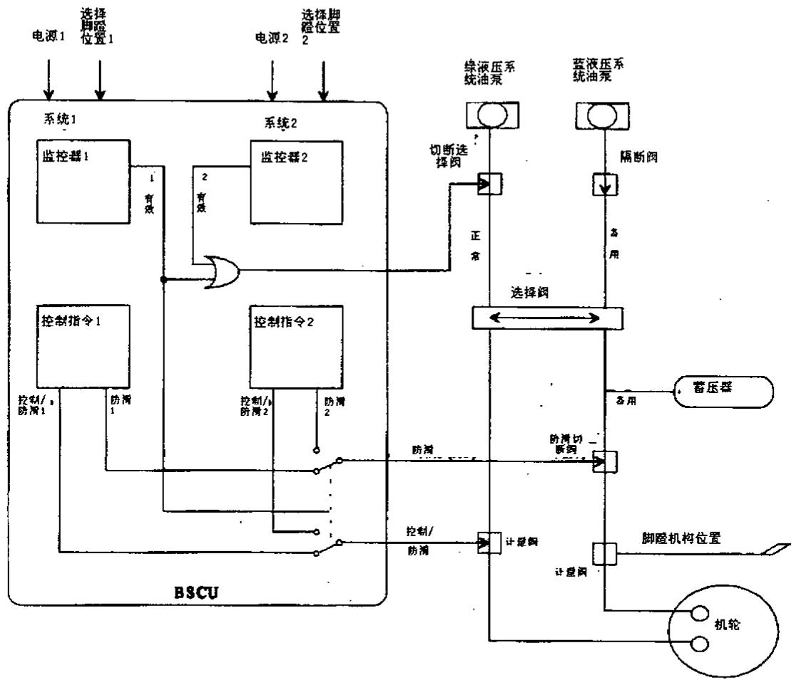  
图3.0-1-(SSABSCU-CMA)BSCU构架原理图

注：SSABSCU-CMA

4.0 BSCUCMA的细节：

4.1 共模的类型，源和失效/差错检查单：

（编者注：附录K第2.1节对确定共模类型，来源以及失效/差错检查单提供指南。）

评审列于参考资料1附录K中的共模差错/失效来源清单，以识别适用于BSCU的共模源。识别适用于BSCU共模分析的下列差错/失效源：

a. 设计方面的考虑：

（1）相对于冗余功能的共同外部原因；  
(2) 冗余系统内部的共同电气接口；  
（3）冗余系统内部（硬件或软件）一般研制错误；  
（4） 影响计算和监控功能的共同失效。

b. 制造方面的考虑：

（1） 不适当的部件代换；  
(2) 不正确的装配；  
(3) 部件的共同制造商；  
（4） 安装方面的考虑；  
(5) 不完善的安装（连接器不搭配）；  
(6) 不正确的安装（连接器互相交换）。

c. 环境方面的考虑：

（1） 与环境要求不相符合；  
(2) 与电气和辐射要求不相符合。

期望上述被识别的可能共模差错/失效源用下列可接受的方法之一来减轻：

a. 设计分析/试验；  
b. 生产检测；  
c. 批准/控制生产过程；  
d. 批准/控制修理过程；  
e. 合格审定/合格鉴定试验。

注：SSABSCU-CMA

# 4.2 分析要求：

（编者注：附录K第3.2节（FHA/PSSA输入）和第3.3节对确定分析的要求提供指南。）

通过评审参考资料2，3和4以及识别在BSCU内部执行的故障树“与”门以及提出的危险的或灾难性状态，以确定BSCUCMA的分析要求。找出各种不同的BSCU功能是促成危险的丧失机轮刹车以及灾难性的意外机轮刹车事件的原因。为了确保没有由于研制错误产生的共模故障，必须表明这些功能的独立性。从对故障树的评审中衍生出如下BSCU的独立性要求：

# 1. 丧失机轮刹车：

丧失所有机轮刹车必需丧失正常刹车系统，备用刹车系统和应急/储备刹车系统。BSCU刹车控制输出仅对正常系统产生影响。防滑控制输出由于其能够消除从其它来源发出的刹车控制，故能对丧失正常和备用刹车系统两者产生影响。没有任何BSCU元件能对应急/储备刹车系统产生影响，因此，不可能有任何共模的BSCU失效能抑制所有机轮刹车系统。然而，如在故障树中所描述的那样，丧失BSCU的余度系统能降低正常系统的可用性。

# 2. 意外机轮刹车：

任何单个的刹车系统都可能促使意外机轮刹车，因此，当正常系统主动时必须表明BSCU不包含可能意外使正常刹车系统起作用的共模失效。

分析意外机轮刹车故障树，以识别BSCU的相关失效并建立BSCU的独立性要求。必须表明下列BSCU的功能是独立的且没有共模失效，以便认可意外机轮刹车的故障树。

1）BSCU系统计算的失效必须与有关有效监控器和控制开关输出的失效独立。这确保单一失效不能导致不正确的控制和同时抑制监控器并消除该控制；  
2）每个BSCU系统的控制和监控器通道失效必须是独立的，以确保单一失效不能相似影响两个通道，并使该交叉通道比较监控器失效；

# 注：SSABSCU-CMA

# 4.2 (续)：

3）每个BSCU电源和相关电源监控器的失效必须是独立的，以确保没有任何单一失效能导致电源工作异常并使电源监控器失效。（因为电源相对于给定系统的控制和监控器通道是公共的，所以电源失效会相似影响两个通道，并使比较器失效。）；  
4）必须相对于控制或监控器通道，或有效性/比较监控器考虑公共元件中的一般性硬件或软件错误；  
5）必须考虑制造方面的事项，包括BSCU系统1和2内的公共部件以及制造质量控制；  
6）安装必须考虑诸如连接，检查等方面的共模差错；  
7）BSCU应被设计成考虑环境因素，如HIRF和闪电方面的要求。

# 4.3 共模分析：

按照对3.0节说明的预定工作的认识，在实际实施中对4.2节确定的有关独立性要求和在参考资料6中所确定的隔离指南进行评审。在下面的分析中，考虑了许多因素并被分别说明：

图4.3-1描述必须提供其功能独立的BSCU物理隔离区域。通过评审印刷电路板文件和其它生产装配文件来进行分析。设计意图是BSCU系统1完全被限定在区域A内，而BSCU系统2被限定在区域B内，以确保系统1和系统2的独立性。每个系统又进一步被分成附加的区域1和区域2。这种分区分别提供在区域1监控器部件和电源监控器功能与在区域2控制指令部件和电源功能之间的独立性。“有效性”和“转换”功能是在单独的区域C内，以便提供与系统1和2共同元件的独立性。这种隔离设计确保这些功能的每一个内部元件的独立性。评审实际实施的设计，确保该隔离的意图得到满足。

注：SSABSCU-CMA

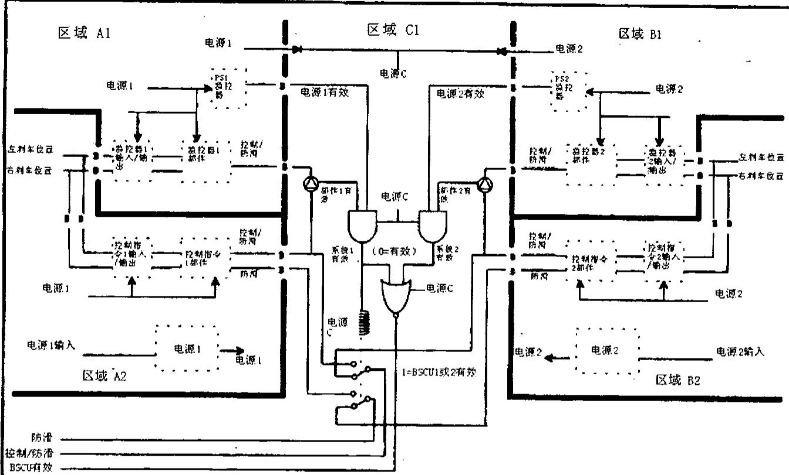  
图4.3-1-(SSA BSCU-CMA)BSCU的具体物理实施

注：SSABSCU-CMA

# 4.3 (续):

分析从BSCU的输入开始，路径每个隔离区，以鉴别对任何功能隔离的非预计破坏。下列的信号清单破坏隔离区。进一步分析这些信号，以确保它们是可以接受的，且是预期的相互连接，并提供相应的缓冲以防止故障扩散。

相对每个系统中的所有元件电源电压是公共的（然而，发现每个系统的电源电压是独立的）。相对系统有效性给出的独立电源监控器输入是可以接受的。

监控器和控制指令计算通道的控制指令/防滑输出以及控制指令计算通道的防滑输出，从它们各自的隔离区传递到有效性/监控器区。在有效性/监控器隔离区内实施系统功能之间的比较和控制指令转换。这些控制指令信号必须传递到转换相应输出的那个区。提供足够的缓冲以防止区域之间故障扩散。因此这些破坏是可以接受的。

BSCU系统2的有效性，防滑，以及控制/防滑输出从系统2传递到系统1的有效性/监控器通道。如同系统1控制指令的相似破坏一样,这是一种给出选择两个系统中的哪一个在系统1的有效性/监控器内执行功能输出的预先考虑的破坏。同样，对于故障扩散，在设计中提供足够的缓冲。

每个系统的动力和脚蹬输入，通过独立的系统定向连接器被排定路线，用不同的键固定，以排除两个系统输入的意外互换。从BSCU的所有输出通过系统1连接器来排定路线。输出功能和系统1输入功能被接地的连接器销钉分开，并消除输入或输出和刹车控制或有效性输出之间不可探测的意外短路。有效性和控制指令输出也在连接器内相互被隔离。

第4.2节的独立性要求1，2和3项，通过设计具体实施中提供的功能性隔离所满足。第4.2节的要求4，5，6和7项被满足如下：

注：SSABSCU-CMA

4.3（续）：

要求4，对多通道或系统公共部件中的一般失效，处理如下：

a. 对多通道和/或系统公共部件（包含软件元素）从确保或者一般失效将不可能在多通道/系统中产生相似的失效影响，或者将不影响两个输出以及各个输出监控器的观点来进行评审。软件元素对两个BSCU系统是共同的。开发计算和监控器通道软件，分别严格按研制保证等级A和B并应用符合DO-178的过程进行验证，因此，排除了有关设计缺陷。  
b. 在 BSCU 设计中使用的所有部件是共同的且是在以前相似系统中广泛使用的相对简单的工业部件。基于对这些部件的广泛工业经验，预期不会有任何不利的失效状态。此过程充分证明在该装置中不存在一般类型的研制错误。

要求5，对制造方面的考虑，处理如下：

可能使BSCU功能独立性无效的制造方面差错，采用控制制造过程，检查连续装配过程以及对生产的每个装置的终端产品交付前试验相结合的方式进行控制。

要求6，对安装方面的考虑，处理如下：

有关安装和维修方面的共模差错，通过建立由特定返回服务试验所支撑的维修程序来进行控制。此外，独特的用键固定连接器消除了BSCU连接器互换的可能性。

要求7，对环境方面的考虑，处理如下：

有关环境方面考虑的共同失效模式，通过按照DO-160环境标准进行的广泛合格鉴定和合格审定试验被消除。

注：SSABSCU-CMA

# 4.4 LRU级CMA摘要：

表 4.4-1 摘要 BSCU 共模分析的结果:

表 4.4-1-(SSA BSCU-CMA) BSCU 共模分析摘要  

<table><tr><td>失效状态</td><td>共模源</td><td>设计证明是正确的</td><td>参考4.2节的要求号</td></tr><tr><td>丧失所有机轮刹车。</td><td>BSCU 失效。</td><td>BSCU仅与正常刹车系统控制指令相关且相关备用或应急系统没有刹车控制指令输入。</td><td>不适用。</td></tr><tr><td>降低正常刹车系统的可用性。</td><td>BSCU系统1和2同时失效。</td><td>除了输出转换和相应减缓有效性外没有任何共同功能。</td><td>1</td></tr><tr><td>由于在BSCU控制指令和监控器通道中的共同失效导致意外刹车。</td><td>破坏控制指令和监控器的隔离区要求。</td><td>共同功能按照隔离指南提供的缓冲保护所限制。</td><td>2</td></tr><tr><td>由于在异常的系统电源输出情况下不适当的电源监控器独立性导致意外刹车。</td><td>违背电源和监控器隔离区要求或不适当的电源监控器设计。</td><td>共同功能按照隔离指南提供的缓冲保护所限制。监控器输出在没有电源或无效电源下倾向无效。</td><td>3和4</td></tr><tr><td>一般共同部件失效。</td><td>违背任何要求的独立性或一般的研制错误。</td><td>使用或者具有工业界接受的综合性或者经受专门设计验证过程的部件。</td><td>5</td></tr></table>

表 4.4-1-(SSA BSCU-CMA) BSCU 共模分析摘要 (续)  

<table><tr><td>失效状态</td><td>共模源</td><td>设计证明是正确的</td><td>参考4.2节的要求号</td></tr><tr><td>制造方面的考虑。</td><td>制造差错破坏独立性。</td><td>审定当局批准使用中的制造和质量保证过程。最后试验和检查排除制造差错。</td><td>6</td></tr><tr><td>LRU试验缺陷。</td><td>不能探测台架试验中的潜在失效。</td><td>分析LRU台架试验,以确保安全性临界潜在失效的涉及范围。</td><td>6</td></tr><tr><td>安装方面的考虑。</td><td>飞机上不正确的安装和/或维修。</td><td>签派前要求维修后“返回服务”试验验证系统的接口和工作情况。</td><td>7</td></tr><tr><td>环境条件方面的考虑。</td><td>环境诱发的共同失效。</td><td>通过广泛的环境合格鉴定试验来排除。</td><td>8</td></tr></table>

注：SSABSCU-CMA

# 5.0 结论：

没有发现任何可能导致丧失机轮刹车或意外机轮刹车的BSCU共模失效。

注：SSABSCU-FTA，DD，MA

# BSCU - FTA（DD或MA）报告

# 1.0 引言：

本报告用文件证明刹车系统控制装置（BSCU）故障树分析（相关图或马尔可夫分析）的结果。

（编者注：下面的对照参考表提供示例的每个章节号与适用附录章节号之间的联系。）

<table><tr><td>组件 SSA 章节号</td><td>附录</td></tr><tr><td>4.0</td><td>C.3.1.1</td></tr><tr><td>5.0</td><td>C.3.1.2, 3.3</td></tr><tr><td>5.1</td><td>附录 D</td></tr><tr><td>5.2</td><td>附录 E</td></tr><tr><td>5.3</td><td>附录 F</td></tr></table>

# 2.0 参考资料：

1）BSCUPSSA;  
2）BSCU技术规范；  
3）BSCUFMEA;  
4）BSCU FMES；  
5）BSCUCMA；  
6）BSCU可靠性预测报告。

# 3.0 说明摘要：

（编者注：本示例的说明与BSCUPSSA第3.0节所作的说明是相同的。）

# 4.0 BSCU分析结果的摘要：

在BSCU初步系统安全性评估期间产生重大不希望的事件的FTA（DD或MA）。本报告用实际的失效率和暴露时间使这些分析正式化。

<table><tr><td>失效影响</td><td>要求</td><td>分析结果</td></tr><tr><td>BSCU 故障导致丧失刹车控制</td><td>&lt;3.3E-5/飞行</td><td>1.5E-6/飞行</td></tr><tr><td>BSCU 故障导致 V1 速度后意外刹车</td><td>&lt;2.5E-9/飞行</td><td>6.16E-10/飞行</td></tr></table>

注：SSABSCU-FTA，DD，MA

# 5.0 详细 BSCU 分析结果：

BSCU故障导致丧失刹车控制指令分析：

图5.1-1，5.2-1，或5.3-1（分别为FTA，DD，MA）表明对于“BSCU故障导致丧失刹车控制”的最后分析。对于“BSCU系统1（2）失效”使用BSCU的总失效率。每次通电测试系统选择开关接通两个位置的能力和开关潜在失效的暴露时间为100小时。

BSCU故障导致V1速度后意外刹车的分析：

图5.1-2，5.2-2，或5.3-2（分别为FTA，DD，MA）表明对于“在没有刹车输入情况下BSCU控制刹车并导致意外刹车”的最后分析。BSCU CMA发现电源作为一个可能的单点失效，导致从主动BSCU系统来的意外刹车控制。对BSCU执行FMEA，确定不存在能导致该故障任何单一失效。

涉及监控器失效和刹车控制电路失效的故障顺序是顺序相关的。监控器必须首先失效。仅在停止飞机试验期间检测电源监控器和BSCU系统有效监控器。100000小时的暴露时间，将飞机寿命分配给这些失效是保守的。

故障树表明在BSCU系统有效监控器功能中涉及的软件按研制保证等级B进行开发，在控制指令通道中产生刹车控制涉及的软件按等级A进行开发。

注：SSA BSCU-FTA

# 5.1 BSCU故障树分析：

确定BSCU故障树如下：

a. 图5.1-1BSCU故障导致丧失刹车控制。  
B. 图5.1-2在没有刹车输入情况下BSCU控制刹车并导致意外刹车。

注：SSABSCU-FTA

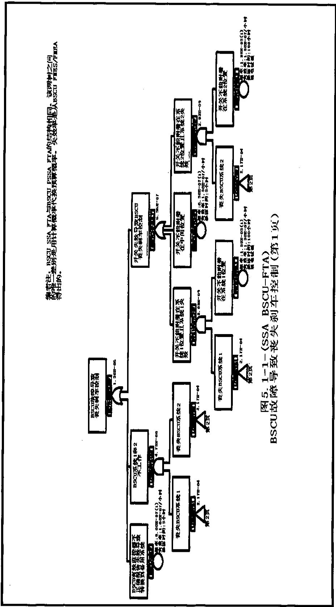

注：SSABSCU-FTA

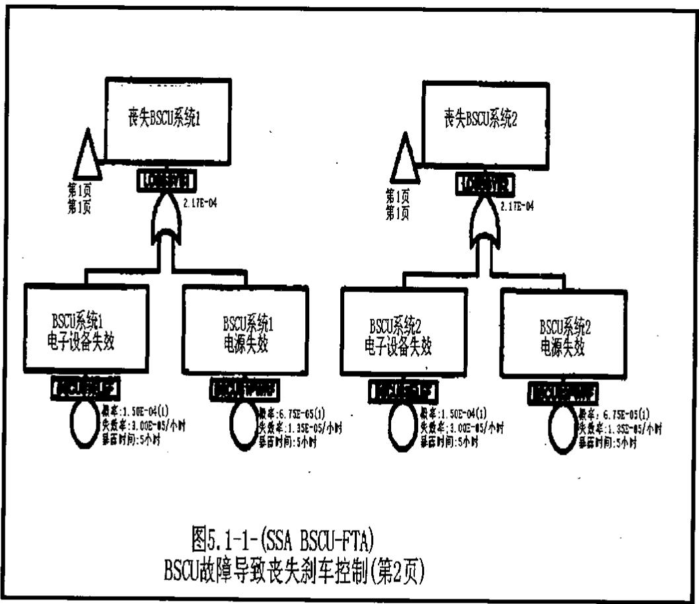

注：SSABSCU-FTA

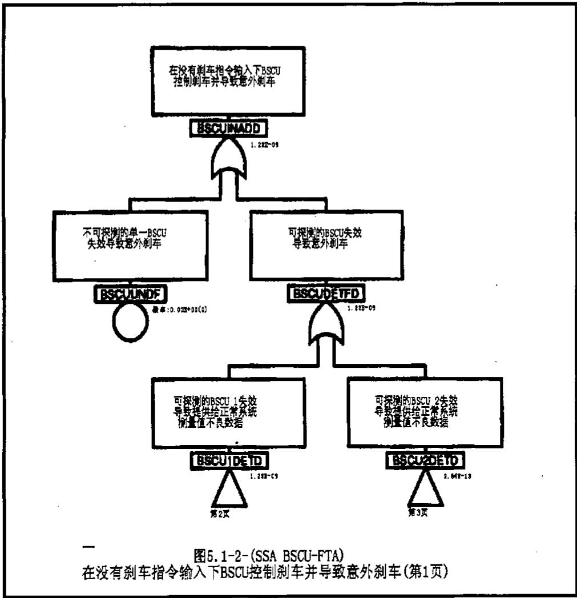

注：SSABSCU-FTA

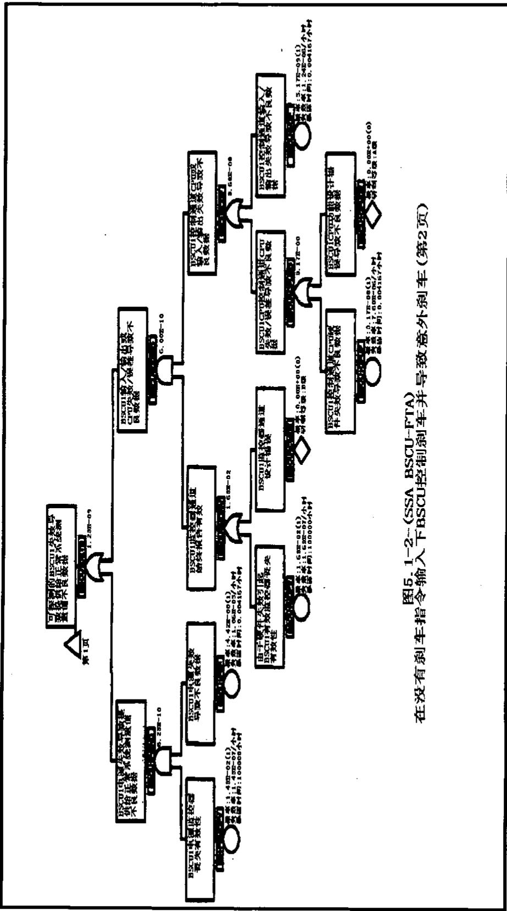

注：SSABSCU-FTA

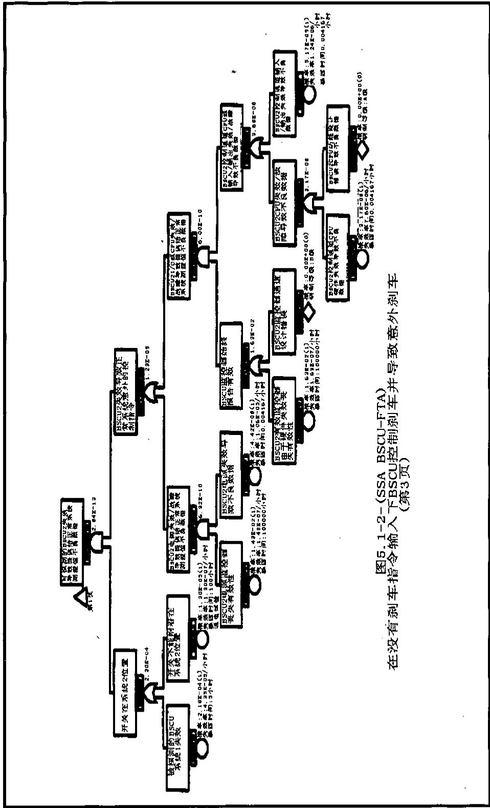

注：SSABSCU-DD

# 5.2 BSCU 相关图：

（编者注：通常在分析中应包含进行DD的文字性说明。该说明与前面FTA示例中包含的相似。）

相对于丧失刹车和意外刹车事件，在图5.2-1和5.2-2中包含的相关图分别表明BSCU对其设计目标和失效率预算的满意符合性。这些相关图与在BSCUPSSA中导出的那些相关图是相同的。然而在SSA的相关图中，失效率预算已被通过为生产提供资料的真实设计所进行的FMES或各种不同的FMEA导出的真实失效率所代替。

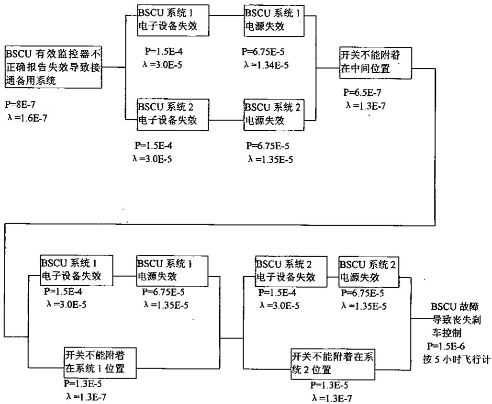  
图5.2-1-(SSABSCU-DD） BSCU故障导致丧失刹车控制

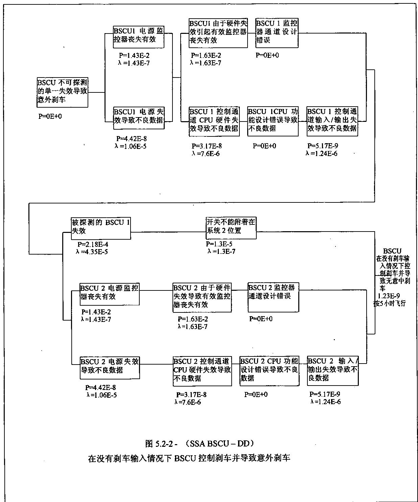  
注：SSABSCU-DD

注：SSABSCU-DD

# 5.3 BSCU 马尔可夫分析：

（编者注：通常在此分析中应包含进行  $MA$  的文字性说明。该说明与在前面FTA示例中所包含的是相似的。）

相对于丧失刹车和意外刹车事件，分别在图5.3-1和5.3-2中包含的分析表明BSCU对其设计目标和失效率预算的满意符合性。这些分析与在BSCUPSSA中导出的分析是相同的。然而在SSA分析中，失效率预算已被通过为生产提供资料的真实设计所进行的各种不同FMEA导出的真实失效率所代替。

对于“BSCU故障导致丧失刹车控制”的马尔可夫分析在图5.3-1中表明。在该模型中有3个不同部件。首先两个部件是BSCU系统1和系统2，第3个部件是转换系统。在BSCU系统1和系统2中设有监控器，因此在BSCU系统内没有任何部件的单一失效能够导致机轮刹车功能的丧失。在每次飞行开始前检查BSCU系统1和系统2。另一方面，转换系统的单一故障能导致丧失正常刹车功能，如果转换开关在下列情况下失效，则可发生这种情况：

a. 接通到一个失效的 BSCU 系统（顺序相关）；  
b. 卡住在开路，以致没有任何一个BSCU系统提供刹车控制。

转换系统在每次T小时的维修检查间隔中被检查，对于此分析，假设T为100小时。如果下列情况发生，则在一次飞行中BSCU系统将失效：

a. 在同一次飞行中，两个BSCU系统失效；  
b. 转换系统失效，接着被该转换系统连接的 BSCU 系统失效（顺序相关）；  
c. 转换系统被卡住在开路且不能提供任何刹车控制。

从图5.3-2到图5.3-4表明在两个BSCU系统中由于一个监控器失效和一个主动失效导致意外刹车的马尔可夫分析。该马尔可夫模型除了引入失效顺序之外，与该BSCU系统在PSSA中使用的模型是相似的。例如，在图5.3-3展示的模型中，仅当一个主动组件失效前，一个系统的监控器失效时，才假设一个BSCU系统失效。因此，仅当一次飞行中，CPU和输入/输出失效前，CPU和输入/输出监控器失效时，BSCU的CPU和输入/输出系统才失效。同样，在作为电源系统的一个电源失效前，该电源监控器必须失效。

注：SSABSCU-DD

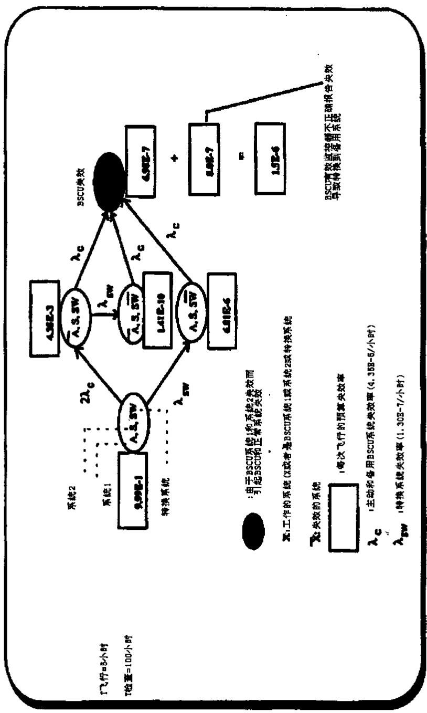  
图5.3-1-(SSABSCU-MA)BSCU故障导致丧失刹车控制

注：SSABSCU-DD

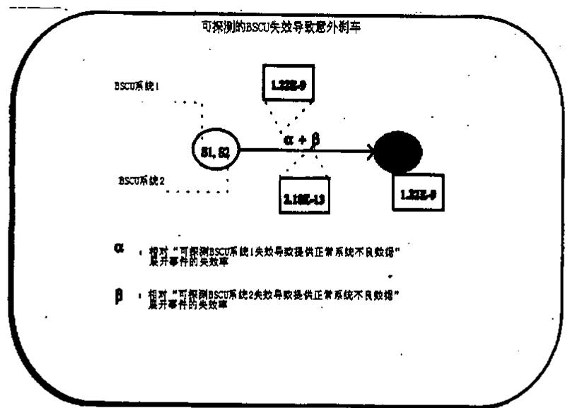  
图5.3-2-(SSABSCU-MA)

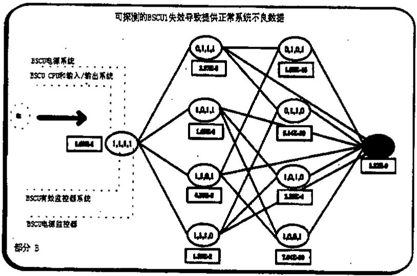  
图5.3-3-(SSA BSCU-MA)由于BSCU系统1失效导致意外刹车（为了清晰起见，图中没有示出部件的修理）  
由于BSCU系统以及其监控器失效导致意外刹车

注：SSABSCU-DD

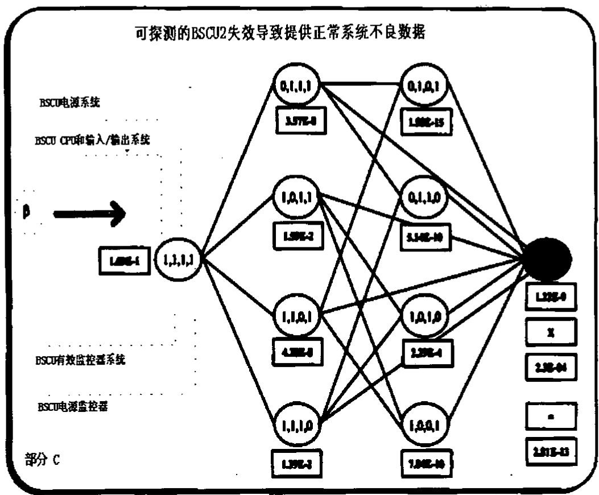  
图5.3-4-(SSA BSCU-MA)由于BSCU系统2失效和转换机构失效导致意外刹车（为了清晰起见，图中没有示出部件的修理情况）

注：机轮刹车系统 SSA

# 机轮刹车系统的系统安全性评估（SSA）

1.0 引言：

机轮刹车系统 SSA 是该系统设计过程的研制和验证阶段所进行的评估和分析摘要。这些评估和分析包含从机轮刹车系统 PSSA 的输入。SSA 的目的是提供机轮刹车系统如何满足在 PSSA 过程中为其确立的安全性要求的记录。

（编者注：下面的对照参考表提供本示例每个章节号与适用的附录章节号之间的联系。）

<table><tr><td>系统SSA章节号</td><td>附录</td></tr><tr><td>4.0</td><td>C.3.1.1</td></tr><tr><td>5.0</td><td>C.3.3</td></tr><tr><td>5.1</td><td>附录H</td></tr><tr><td>5.2</td><td>附录D</td></tr><tr><td>5.3</td><td>附录E</td></tr><tr><td>5.4</td><td>附录F</td></tr><tr><td>5.5</td><td>C.3.4,附录I,J,K</td></tr></table>

2.0 参考资料：

1）S18飞机FHA；  
2）机轮刹车系统PSSA（包含系统FHA）；  
3）S18飞机CMA；  
4）机轮刹车系统CMA；  
5）BSCUCMA；  
6）S18特定风险分析；  
7）S18区域安全性分析；  
8）BSCUFMEA/FMES;  
9）BSCUFTA;  
10) FAR/JAR 25.1309;  
11) ARP 4754 “Certification Considerations for Highly-integrated or Complex Aircraft Systems”（高度综合或复杂飞机系统合格审定需要考虑的问题）；  
12）ARP4761“Guidelines and Methods for Conducting the Safety Assessment Process on Civil Airborne System and Equipment”（民用飞机机载系统和设备安全性评估过程的指南和方法）。

3.0 说明摘要：

（编者注：对于本指南的目的，请见机轮刹车系统的PSSA示例。在真实的SSA情况下，修订的和最终说明也应在此出现。）

注：机轮刹车系统 SSA

4.0 机轮刹车系统的安全性要求：

S18飞机将满足下列安全性要求：

1）在着陆或RTO期间丧失所有机轮刹车的概率应小于5E-7/每次飞行；  
2）在着陆期间非对称丧失机轮刹车连同丧失方向舵或前轮操纵的概率应小于5E-7/每次飞行；  
3）在起飞滑跑期间V1速度前，所有被锁住机轮的意外刹车的概率应小于5E-7/每次飞行；  
4）在起飞滑跑期间V1速度后，所有机轮的意外刹车的概率应小于5E-9/每次飞行；  
5）在起飞期间未被探测的一个没有锁住机轮意外刹车的概率应小于5E-9/每次飞行；  
6）正常，备用和应急系统应被设计成预防来自任何方面的共同威胁（例如，轮胎爆破，轮胎撕碎，气流抽打胎面以及结构变形等）；  
7）正常，备用和应急系统应被设计成预防任何共模失效（例如，液压系统，电气系统，维修，使用，运行，设计以及制造等）；  
8）BSCU的单一失效不应导致意外刹车；  
9）BSCU应按研制保证等级A级进行设计。

5.0 安全性要求的验证：

确认在4.0节中相对机轮刹车系统所列出的安全性要求是正确的和完整的。在表5.0-1中表明的矩阵确定每个要求如何被验证。

注：机轮刹车系统 SSA  
表 5.0-1 (机轮刹车系统 SSA) 机轮刹车系统安全性要求验证矩阵  

<table><tr><td>安全性要求</td><td>验证结果</td><td>验证方法和注释</td></tr><tr><td>1.在着陆或RTO期间丧失所有机轮刹车的概率应小于5E-7/每次飞行。</td><td>合格(3.2E-8)。</td><td>分析见WBS SSA FTA 5.2-1。</td></tr><tr><td>2.在着陆期间非对称丧失机轮刹车连同丧失方向舵或前轮操纵的概率应小于5E-7/每次飞行。</td><td>合格(4E-7)。</td><td>分析见WBS SSA FTA 5.2-X(编者注:在本例中没有表明该分析)</td></tr><tr><td>3.在起飞滑跑期间V1速度前,所有被锁住机轮的意外刹车的概率应小于5E-7/每次飞行。</td><td>合格(3E-7)。</td><td>分析见WBS SSA FTA 5.2-Y(编者注:在本例中没有表明该分析)</td></tr><tr><td>4.在起飞滑跑期间V1速度后,所有机轮的意外刹车的概率应小于5E-9/每次飞行。</td><td>合格(4E-9)。</td><td>分析见WBS SSA FTA 5.2-Z(编者注:在本例中没有表明该分析)见WBS CMA。</td></tr><tr><td>5.在起飞期间未被探测的一个没有锁住机轮意外刹车的概率应小于5E-9/每次飞行。</td><td>合格(3E-9)。</td><td>分析见WBS SSA FTA 5.2-Z(编者注:在本例中没有表明该分析)见WBS CMA。</td></tr><tr><td>6.正常,备用和应急系统应被设计成预防来自任何方面的共同威胁(例如,轮胎爆破,轮胎撕碎,气流抽打胎面以及结构变形等)。</td><td>合格。</td><td>分析见轮胎爆破-PRA。</td></tr></table>

注：机轮刹车系统 SSA

机轮刹车系统安全性要求验证矩阵（续）  
表 5.0-1 - (机轮刹车系统 SSA)  

<table><tr><td>安全性要求</td><td>验证结果</td><td>验证方法和注释</td></tr><tr><td>7.正常,备用和应急系统应被设计成预防任何共模失效(例如,液压系统,电气系统,维修,使用,运行,设计以及制造等)。</td><td>合格。</td><td>分析见WBS CMA。</td></tr><tr><td>8.BSCU的单一失效不应导致意外刹车。</td><td>合格。</td><td>分析见BSCU CMA。</td></tr><tr><td>9.BSCU应按研制保证等级A级进行设计。</td><td>合格。</td><td>程序/检查见供应商指南。</td></tr></table>

注：机轮刹车系统 SSA-FMES

# 5.1 失效模式和影响摘要（FMES）：

本报告对机轮刹车系统内各种不同组件进行FMEA所识别的机轮刹车系统失效模式提供摘要。

从组合所有被识别具有相同机轮刹车系统顶层失效影响的失效模式的观点来评审机轮刹车系统FMEA。通过将导致该失效影响的各个失效率相加的方法来计算这些影响组合失效率。表5.1-1用文件证明该摘要的结果。

表 5.1-1-(机轮刹车系统 SSA-FMES) 刹车失效影响的 FMES  

<table><tr><td>失效模式</td><td>失效率</td><td>对刹车系统可能产生的影响</td><td>可能的失效原因(失效源)</td><td>可探测性</td><td>注释</td></tr><tr><td>丧失单一BSCU的控制指令通道。</td><td>8.70E-5。</td><td>没有影响。</td><td>丧失通道1或2的刹车控制指令(见 BSCU FMES)。</td><td>被装在内部的测试设备自动探测,失效储存在BSCU内。</td><td>冗余通道控制刹车。</td></tr><tr><td>丧失两个BSCU控制指令通道。</td><td>4.0E-7。</td><td>丧失正常刹车模式。</td><td>-BSCU失效(见BSCU FMES)-刹车脚蹬传感器失效(见脚蹬传感器FMEA)-丧失BSCU电源(见电气系统SSA)。</td><td>在系统显示屏上指示“丧失正常刹车”。</td><td>使用备用刹车系统,自动刹车不再适用。</td></tr><tr><td>意外刹车控制指令。</td><td>2.8E-8。</td><td>刹车被作用。</td><td>-BSCU失效(见BSCU FMES)-刹车脚蹬传感器失效(见脚蹬传感器FMEA)。</td><td>影响明显。</td><td>飞机可能以高速冲出可用的跑道。</td></tr></table>

注：机轮刹车系统 SSA-FMES

表 5.1-1-(机轮刹车系统 SSA-FMES) 刹车失效影响的 FMES (续)  

<table><tr><td>失效模式</td><td>失效率</td><td>对刹车系统可能产生的影响</td><td>可能的失效原因(失效源)</td><td>可探测性</td><td>注释</td></tr><tr><td>非对称刹车控制。</td><td>3.6E-8。</td><td>在两个起落架之间刹车非对称作用。</td><td>-BSCU 失效(见BSCU FMES)-刹车脚蹬传感器失效(见脚蹬传感器FMEA)。</td><td>影响明显。</td><td>飞机不可能行驶在跑道的中心线上。</td></tr><tr><td>丧失绿液压系统。</td><td></td><td>丧失正常刹车模式。</td><td></td><td></td><td>使用备用刹车,自动刹车不再适用。</td></tr><tr><td>丧失蓝液压系统。</td><td></td><td>丧失备用刹车模式。</td><td></td><td></td><td>使用正常刹车。</td></tr><tr><td>···</td><td></td><td></td><td></td><td></td><td></td></tr><tr><td>···</td><td></td><td></td><td></td><td></td><td></td></tr><tr><td>···</td><td></td><td></td><td></td><td></td><td></td></tr><tr><td>···</td><td></td><td></td><td></td><td></td><td></td></tr></table>

注：机轮刹车系统 SSA-FTA

# 5.2 刹车系统故障树分析：

相对于丧失刹车事件，用图5.2-1中包含的故障树表明机轮刹车系统对其设计目标和失效率预算的满意符合性。该故障树与在机轮刹车系统PSSA中导出的故障树是相同的，然而，在SSA故障树中，失效率预算已被通过作为生产证明文件的真实设计所进行的各种FMEA分析导出的真实失效率取代。

注：机轮刹车系统SSA-FTA

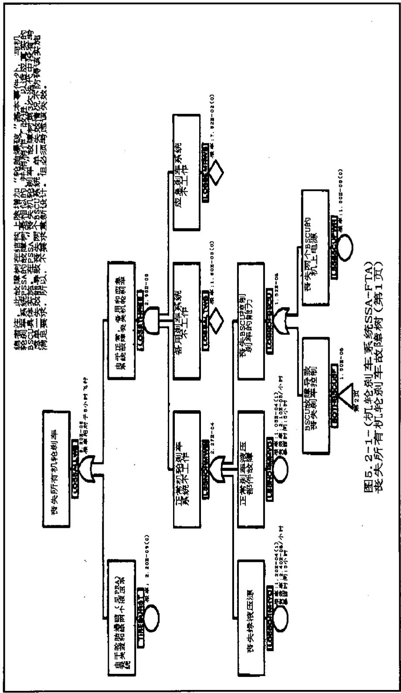

注：机轮刹车系统SSA-FTA

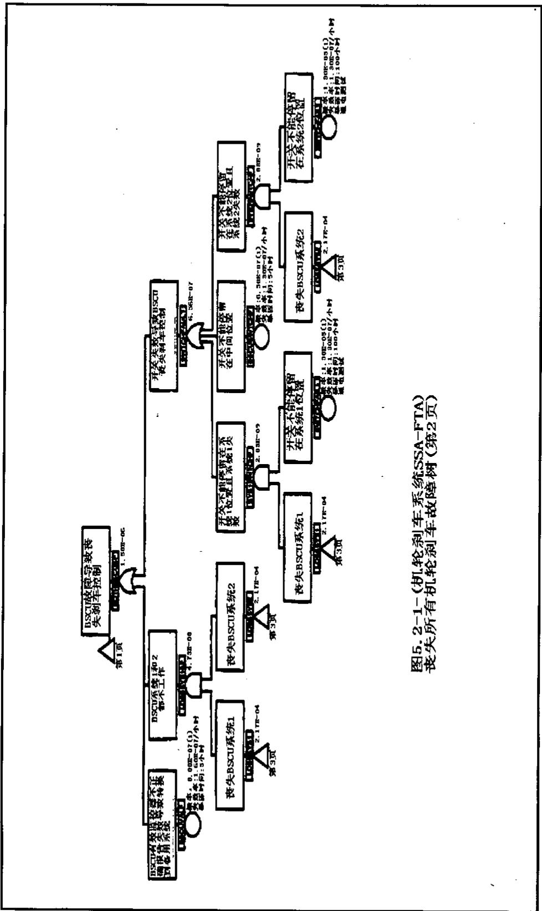

注：机轮刹车系统SSA-FTA

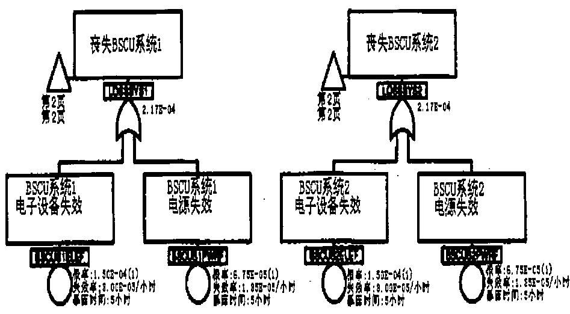  
图5.2-1-(机轮刹车系统SSA-FTA)丧失所有机轮刹车故障树（第3页）

注：机轮刹车系统 SSA-DD

# 5.3刹车系统相关图：

（编者注：本节由SSA示例的第5.2节“机轮刹车系统FTA”直接代换而成。）

相对于丧失刹车事件，通过图5.3-1中包含的相关图表明机轮刹车系统对其设计目标和失效率预算的满意符合性。该相关图与在机轮刹车系统PSSA中导出的相关图是相同的，然而在SSA中，失效率预算已被通过作为生产证明文件的真实设计所进行的各种FMEA导出的真实失效率取代。

本报告包含从刹车系统FMES和BSCUDD的输入。

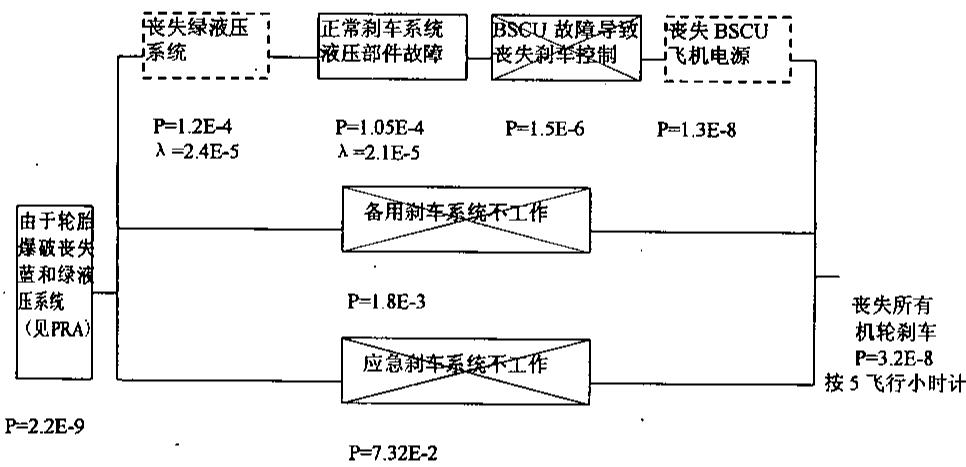  
图5.3-1-(机轮刹车系统SSA-DD）丧失所有机轮刹车

（编者注：上面的相关图在结构上与机轮刹车系统PSSA DD的相关图是相似的，除了增加基本事件“轮胎爆破”之外，且稍作改进以适应BSCU的实际实施。单一失效可能导致丧失BSCU的两个系统，这在“未通告丧失所有机轮刹车”PSSA DD第3次迭代中没有被考虑。该单一失效情况不妨碍该实施满足要求，故不必重新设计。考虑该失效是必要的。）

注：机轮刹车系统 SSA - MA

# 5.4刹车系统马尔可夫分析：

（编者注：本节由SSA示例的第5.2节“机轮刹车系统FTA”直接代换而成。）

对于“丧失所有机轮刹车”的马尔可夫分析包含下面两个步骤。首先，计算BSCU的平均无临界失效时间（MTBCF）。在图5.4-1中表明的马尔可夫链从总体上能被用来计算BSCU的MTBCF。然后，该MTBCF结果能被合并到系统的SSA模型中。在第一步中计算的MTBCF值被用来计算正常刹车系统的失效率。正常刹车系统的失效率等于BSCU双通道系统的1/MTBCF，加上绿液压系统的失效率，再加上正常刹车系统液压部件的失效率。

正常刹车系统的失效率（ $\lambda_{1}$ ）为4.52E-5/小时。求解图5.4-1中表明的马尔可夫链，以计算“丧失所有机轮刹车”的飞行平均概率。用于备用和应急系统的失效率分别为3.6E-4/小时和1.44E-2/小时。每次飞行的平均状态概率用图5.4-1中的马尔可夫链表明。丧失所有3个刹车功能的平均概率为2.98E-8每5小时飞行。当增加“由于轮胎爆破丧失蓝和绿液压系统”（概率为2.2E-9每5小时飞行）时，这便产生“丧失所有机轮刹车”3.2E-8每5小时飞行的平均失效概率。这正好在“丧失所有机轮刹车”每次飞行5E-7的安全性预算概率之内。

注：机轮刹车系统SSA-MA

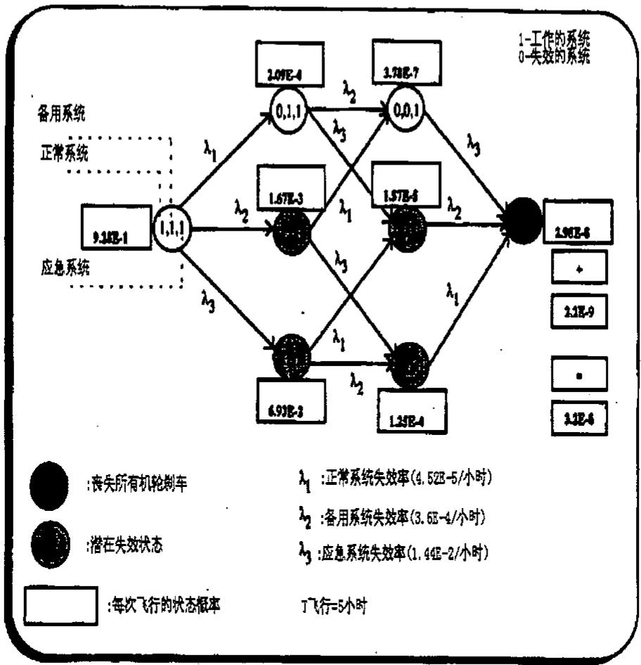  
图5.4-1-(机轮刹车系统SSA-MA)丧失所有机轮刹车

注：机轮刹车系统 SSA-CCA

5.5 刹车系统共因分析（CCA），结果摘要：

5.5.1 S18飞机有关机轮刹车系统区域安全性分析结果摘要：

S18 飞机区域安全性分析 No. YYY 表明该刹车系统安装符合安装指南, 并预期该安装没有不可接受的共因失效。

5.5.2 S18飞机，有关机轮刹车系统特定风险分析摘要：

相对于S18飞机和机轮刹车系统，已进行下列分析：

1）S18飞机特定风险分析No.XYZ；  
2）S18飞机的火，轮胎爆破，闪电特定风险分析No.ZZZ；

（编者注：S18飞机已执行其它分析，但为了简明起见，它们没有在此被表明。）

从特定风险引起的最坏失效影响是由于轮胎爆破导致的“丧失所有机轮刹车”。这种失效在FTA中已被考虑。

5.5.3 S18飞机机轮刹车系统的共模分析摘要：

S18飞机相对机轮刹车功能的共模分析为No.ZXY，相对电气系统的共模分析为No.ZZZ以及相对液压系统的共模分析为No.WWW（编者注：都没有在本例中示出）表明：

a. 确认没有共模差错产生的事件具有灾难性的影响；  
b. 可能导致危险影响的哪些共模差错通过专门的试验，制造工艺，质量保证方法进行限制或者由于其概率是可以接受的。

5.5.4 刹车系统主要组件的共模分析：

进行BSCU的共模分析表明，没有可能导致丧失机轮刹车或意外机轮刹车的共模失效存在。

注：机轮刹车系统 SSA - CCA

5.5.5 刹车系统安全性维修工作和时间间隔：

确定下列安全性维修工作和时间间隔：

1）备用刹车系统的工作检查时间间隔：MT2；  
2）电源监控器A和B的工作检查时间间隔：MT1。

注：机轮刹车系统 SSA 综合交互校核

# 5.6 系统综合交互核查：

表5.6-1提供一个符合性矩阵，用来确保机轮刹车系统设计在其SSA范围内的分析满足在第4.6节系统级FHA中确定的安全性目标。

该矩阵表明对 FHA 目标的可接受符合性。

表5.6-1-（机轮刹车系统SSA-综合交互核查）系统综合交互核查符合性矩阵  

<table><tr><td colspan="3">FHA要求</td><td colspan="3">从SSA产生的设计结果</td></tr><tr><td>序号</td><td>情况</td><td>目标</td><td>事件</td><td>概率</td><td>参考资料</td></tr><tr><td>1.</td><td>在着陆或RTO期间丧失所有刹车</td><td>5E-7</td><td>丧失所有机轮刹车</td><td>3.2E-8</td><td>见SSA FTA图5.2-I</td></tr><tr><td>2.</td><td>非对称丧失机轮刹车和丧失方向舵或前轮操纵</td><td>5E-7</td><td>(编者注:在本例中未被展开。)</td><td></td><td></td></tr><tr><td>3.</td><td>在起飞或着陆滑跑期间意外机轮刹车</td><td>5E-7</td><td>(编者注:在本例中未被展开。)</td><td></td><td></td></tr><tr><td>4.</td><td>在起飞期间V1速度前意外机轮刹车</td><td>5E-9</td><td>(编者注:在本例中未被展开。)</td><td></td><td></td></tr><tr><td>5.</td><td>在起飞期间未被探测意外机轮刹车</td><td>5E-9</td><td>(编者注:在本例中未被展开。)</td><td></td><td></td></tr></table>

注：SSA-CCA-ZSA

# S18飞机区域安全性分析（ZSA）

# 主起落架舱ZSA

（编者注：有关ZSA过程的详细情况，参考附录  $I_{\bullet}$  ）

1.0 引言：

本分析由S18飞机主起落架舱区域安全性分析组成。S18飞机必须达到没有由于安装导致单一失效产生灾难性的失效状态的事件（编者注：在本例中是“丧失减速能力”事件）以及对带有危险性失效影响的失效状态具有足够低的概率的要求。

（编者注：ZSA文件可能包含一个以上的区域，选择“主起落架舱”作为例子，是因为可能影响机轮刹车和/或反推力装置的许多系统被安装在这里。）

2.0 参考资料：

1）S18飞机FHA；  
2）机轮刹车系统FHA；  
3）液压系统FHA；  
4）反推力装置系统FHA；  
5）地面扰流板系统FHA；  
6）S18飞机通用设计指南；  
7）液压系统安装设计指南；  
8）电气系统安装设计指南；

3.0 说明：

本区域安全性分析（ZSA）例子涉及主起落架舱。该舱的详细说明在4.2.1节提供。其目的是表明被安装在本区域的系统不会对飞机和/或乘员产生危害。使用所有相关设计和安装指南，在首架生产的飞机上进行本分析。对这些指南的不符合性以及其状态被汇编在本分析的4.2.2节。部件外部的失效模式和其对相关系统本身以及对邻近系统影响的分析在4.3.2节中表明。

对外部事件的考虑，例如发动机非包容性爆裂以及轮胎爆破或机轮轮缘释放等将被另外的特定风险分析包含。

注：SSA-CCA-ZSA

# 4.0 分析工作：

# 4.1 设计和安装指南的准备：

在PSSA期间，确立了相关设计指南和检查单，并被应用在所有相关系统的设计和安装中。在SSA的ZSA期间使用这些指南和检查单，以表明系统安装符合这些要求。

（编者注：本例中提供的检查单仅为短期格式。通常对于具体项目它们仅被制订一次。对于诸如火区的特定区域，可包含进一步的指南。）

# 4.1.1 通用设计和安装指南的例子：

下列指南是支持适当系统安装的例子。所列清单应根据被本文件用户所应用的那些设计和安装指南进行扩充，修订和扩展。

a. 设备安装（包含导管，管道，软管，导线，钢索等）：

（1） 安装应确保没有施加不可接受的应力；  
(2) 与运动部件的连接应以将应力减到最小的方式来固定；  
（3）与运动部件的连接应以这样的方式来定位，即它们不妨碍相邻结构或设备以及不被相邻结构或设备所妨碍；  
（4）气压导管和软管应以使水的聚集减到最少的方式来安装，；  
(5) 主要系统和次要系统的隔离应表明在一个系统失效影响另一个系统以及一个单独的系统失效影响两个系统方面是满意的。

# b. 部件的拆卸和更换：

（1）更换相似但不相同的部件，对系统性能不应有不可接受的影响；  
(2) 可能被安装在不正确方位的任何部件不应产生难以解决的问题（例如，引起间隙的显著减少或对任何连接的导线，钢索，软管等产生不可接受的应力）；  
（3）应防止接头，导管等的交叉连接。

注：SSA-CCA-ZSA

# 4.1.1 (续):

# c. 维护和使用：

（1）所有地面使用的连接点应被这样标明和/或布置，以致使被使用的流体或被连接的设备是明确无误的；  
(2) 只要可能，设计应允许不拆卸其它设备，尤其是不拆卸其它系统的设备来进行组件的更换。如果不能这样，如果存在风险，则应对所有涉及的系统进行一次检查；  
（3）应对任何意外留在飞机上的工具，螺栓等可能产生的危害给予考虑。

# d. 排放：

（1）应对由于不正确的部件/设备安装而牵涉的排放问题给予考虑；  
（2）应对液体的聚集是危险的那些区域或部件设有排放装置。

注：被考虑的流体包含水，氯化水，燃油，液压油，清洁剂和除冰液，滑油，污水等。

# 4.1.2 系统专用设计和安装指南的例子：

对于每个系统或ATA章节的专用设计和安装指南应从使用中的经验数据，有关PSSA，飞机级要求和目标派生出来。它们的源头尽可能是可追溯的，且它们应被所有相关的合伙人所同意。作为例子，下列指南取自ATA29章：

# a. ATA29-液压系统：

（1）空气温度调节管的走向通常应排在液压系统的上方；  
(2) 当液压系统和空调系统的接近不可避免时，必需有保护性的隔离罩。用来输送座舱空气的管道应与可能进入并与其接触的液压和其它有毒的或反应性污染物不起作用；  
(3) 对于手动工作阀，应可能不使用专用工具或拆卸装置。

注：SSA-CCA-ZSA

# 4.2 相对设计和安装指南检查安装：

在部件，安装或结构中使用材料的适用性和耐久性被认为对于设计是十分重要的。

认为下列各项对设计是十分重要的：

a. 热变化的影响；  
b. 结构变形；  
c. 压力变化；  
d. 建立的容差；  
e. 重力加速度“g”的影响；  
f. 振动；  
g. 电解质的不相容性;  
h. 材料和表面加工；  
i. 流体污染的影响；  
j. 烟的散发，抗燃性以及火的蔓延。

对于区域安全性分析的结果，如果发现有关项目有明显的或可疑的错误，则应发出询问单。需要时，应同时考虑外部事件适用的所有其它指南。

# 4.2.1 区域说明：

主起落架舱从非增压区的C42框伸展到C46/47框。它包含主起舱门和主起收上时的空间。

在C46/47框和C50框之间的左侧，一部分液压系统和APU排气管道被安排在该非增压区。这将被考虑作为主起落架舱的一部分。

# 4.2.1.1 划分区段：

<table><tr><td>天花板:</td><td>1类(增压区的界限)</td></tr><tr><td>C42框:</td><td>液压舱的界限:在该小区域为了通风的需要开了几个孔;中央盒段;中央油箱。</td></tr><tr><td>下部:</td><td>龙骨梁,主起舱门以及腹部整流机身结构。</td></tr><tr><td>C46/47框:</td><td>1类(增压区的界限)。</td></tr><tr><td>横向划分:</td><td>腹部整流机身结构。</td></tr><tr><td>C46/47框和C50框之间的横向划分:</td><td>腹部整流机身结构以及增压机身。</td></tr></table>

注：SSA-CCA-ZSA

# 4.2.1.2 系统安装：

在主起落架舱安装下列系统/部件：

a. 蓝液压系统导管在左侧；  
b. 黄液压系统导管在右侧；  
c. 绿液压系统导管在下部；  
d. 绿液压系统油箱；  
e. 绿系统配备的集管接头；  
f. 能源转换装置（PTU）；  
g. 集管接头;  
h. 维修灯；  
i. 刹车系统部件；  
j. 主起落架；  
k. 主起落架自由落下系统;  
1. 接近传感器；  
m. 缝翼驱动能源控制装置（PCU）；  
n. 褶翼驱动能源控制装置（PCU）；  
o. 褶翼驱动传动轴；  
p. 缝翼和襟翼驱动传动轴减速器；  
q. 由液压能源驱动的恒速马达发电机（CSMG）；  
r. 辅助动力装置（APU）排气管道；  
s. APU燃油管线。

下列系统/部件被安装在C47和C50框之间的非增压区：

a. 绿液压系统地面使用仪表板；  
b. 蓝液压系统地面使用仪表板；  
c. 蓝液压系统油箱；  
d. APU排气管道；  
e. 后货舱加热调节空气阀；  
f. 后货舱加热调节空气压力阀；  
g. 电气电缆;  
h. 液压导管。

# 4.2.1.2.1 燃油系统：

屏蔽的APU燃油馈线被固定在左侧的盒段中。当APU不运转时，该燃油管内是没有压力的，且仅容纳有限数量的燃油。在辅助龙骨梁的右侧安装燃油排放管。其它部件如阀和APU泵被密闭。

注：SSA-CCA-ZSA

# 4.2.1.2.2 液压系统：

液压系统导管被隔开。蓝液压系统导管被定位于C46/47框左侧，黄液压系统导管被安放在C42框的两侧以及C46/47框左侧（见图4.2.1.2.2-1)。黄液压系统导管从C42框到C45框的路线位于压力密封装置的上方。

绿液压系统油箱被安装在C42框，而绿液压系统的其它部件和导管被安装在该舱中间天花板的下方（见图4.2.1.2.2-2）。

本区域的所有液压导管是用钛合金或不锈钢制造的，没有使用铝合金。在C46/47框和C50框之间的区域，液压系统压力导管被安装在APU排气管道以及货舱可选择的热空气管道的下方。

注：SSA-CCA-ZSA

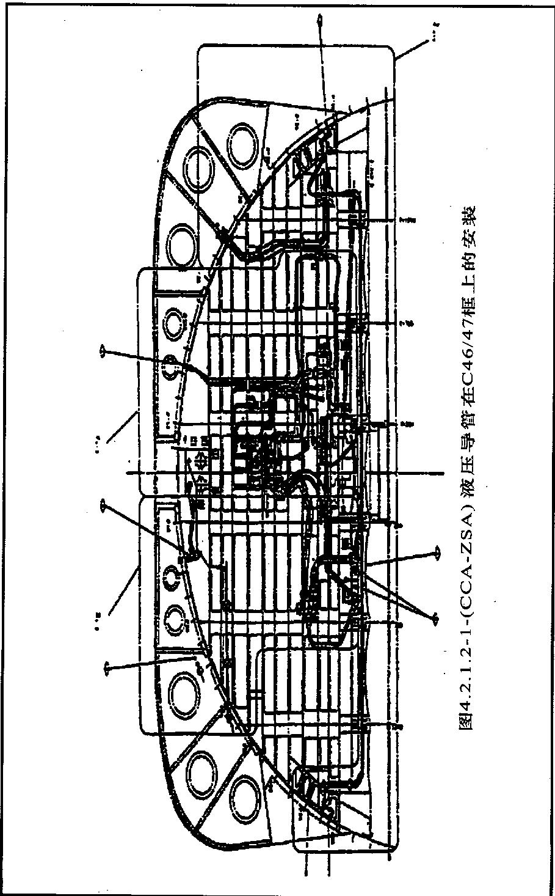

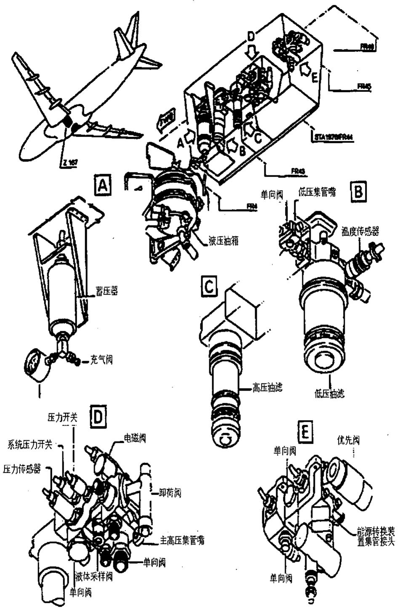  
注：SSA-CCA-ZSA  
图4.2.1.2.2-2-(CCA-ZSA)绿液压系统部件

注：SSA-CCA-ZSA

# 4.2.1.3 特定设计区域的考虑：

# 4.2.1.3.1 热表面：

轮胎被标定的最高温度为  $120^{\circ}\mathrm{C}$  。在刹车的外表面区域不超过此温度。

在系统正常最大工作状态下或在单一工作失效状态下，排气温度可能高达  $260^{\circ}\mathrm{C}$  。该排气管道是用钛合金制造的。它用两层玻璃棉隔绝，并用Kevlar材料的外皮密闭。

没有被隔热的可选择平衡空气的压力调节阀，文氏管和调节空气阀，其表面温度能高达  $205^{\circ}\mathrm{C}$ 。

# 4.2.1.3.2 电缆和设备：

电缆被标定的连续最高工作温度为  $200^{\circ}\mathrm{C}$  。电缆束被安装在电缆管道内。由于闪电防护的原因，机翼前缘的电缆束被安装在专用的电缆管道内。

分段的引线和接头被封接。在天花板上通过的电气导线没有任何断开（没有任何连接线）。

应急发电机被安放在龙骨梁上。

# 4.2.1.3.3 将火灾风险减到最小的设计预防措施：

襟翼和缝翼驱动能源控制装置（PCU），恒速马达发电机（CSMG）以及能源转换装置被排放后密封。绿系统油箱具有过量空间，以避免液压油的泄露。

APU的燃油馈线被屏蔽和被排放。

燃油阀和APU泵的设计应使燃油泄露到主起落架舱是不可能的。

任何泄露的可燃液体被排放到机外以及任何蒸汽将被通风气流清除。

刹车过热经由刹车温度和监控系统进行探测。

不使用铝合金液压导管。

注：SSA-CCA-ZSA

# 4.2.1.3.3 （续）：

C46框前的襟翼传动轴在其断裂的情况下被制动器进行安全性保护。

安装双回路空气泄露探测系统。

在管道破裂的情况下确保用主起落架舱的隔栅和在左侧的过压打开板卸压。

# 4.2.1.3.4通风：

图4.2.1.3.4-1表示主起落架舱的通风区域。在地面，主起落架舱是打开的且外部情况流通。在飞行中，新鲜空气从发动机控制系统（ECS）舱经连接管流进。一部分空气经冷却出口隔栅流向机外，其余的空气则流进液压舱。

注：SSA-CCA-ZSA

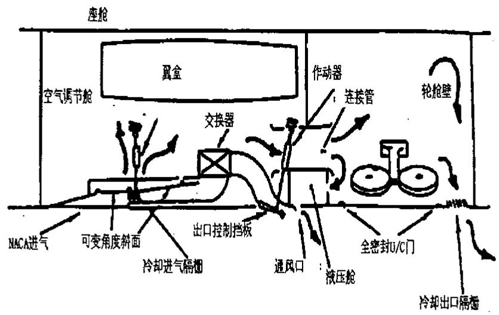  
飞行中

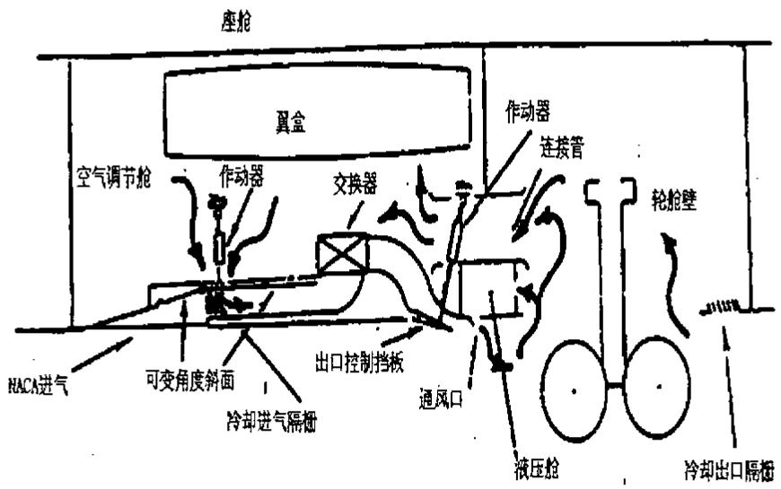  
在地面  
图4.2.1.3.4-1-(CCA-ZSA)主起落架舱通风

注：SSA-CCA-ZSA

# 4.2.1.3.5 排放：

APU燃油馈线的屏蔽是经位于C46和C47框之间的排放罩被排放。任何液体将经腹部整流槽形排放口以及起落架舱门的密封小间隙被排放到机外。因为本区域不是增压舱，故在飞行中和在地面排放是不变的。

# 4.2.2 按照设计和安装指南检查安装结果：

按照设计和安装指南检查安装结果被摘要在报表4.2.2-1。

注：SSA-CCA-ZSA

表4.2.2-1-(CCA-ZSA)区域安全性分析摘要报表  

<table><tr><td colspan="6">区域安全性分析摘要报表</td><td></td></tr><tr><td rowspan="2" colspan="2">飞机型号/标准:</td><td rowspan="2" colspan="2">区域:主起落架舱</td><td colspan="2">执行人:</td><td>报表:第01页共01页</td></tr><tr><td colspan="2">日期:</td><td>版次:01</td></tr><tr><td>询问单号:</td><td colspan="2">不符合的原因</td><td colspan="2">措施</td><td colspan="2">注释</td></tr><tr><td>27.01</td><td colspan="2">安装的飞行操纵螺栓向下降</td><td colspan="2"></td><td colspan="2">询问单 OPEN.</td></tr><tr><td>92.01</td><td colspan="2">连接带太长</td><td colspan="2"></td><td colspan="2">询问单 OPEN.</td></tr><tr><td>92.02</td><td colspan="2">导线管磨损</td><td colspan="2">修改安装图</td><td colspan="2">询问单 CLOSED.</td></tr><tr><td>92.04</td><td colspan="2">几条管道中遗漏排放孔</td><td colspan="2"></td><td colspan="2">询问单 OPEN.</td></tr><tr><td></td><td colspan="2"></td><td colspan="2"></td><td colspan="2"></td></tr><tr><td></td><td colspan="2"></td><td colspan="2"></td><td colspan="2"></td></tr><tr><td></td><td colspan="2"></td><td colspan="2"></td><td colspan="2"></td></tr><tr><td></td><td colspan="2"></td><td colspan="2"></td><td colspan="2"></td></tr><tr><td></td><td colspan="2"></td><td colspan="2"></td><td colspan="2"></td></tr><tr><td></td><td colspan="2"></td><td colspan="2"></td><td colspan="2"></td></tr><tr><td></td><td colspan="2"></td><td colspan="2"></td><td colspan="2"></td></tr><tr><td></td><td colspan="2"></td><td colspan="2"></td><td colspan="2"></td></tr><tr><td></td><td colspan="2"></td><td colspan="2"></td><td colspan="2"></td></tr><tr><td></td><td colspan="2"></td><td colspan="2"></td><td colspan="2"></td></tr><tr><td></td><td colspan="2"></td><td colspan="2"></td><td colspan="2"></td></tr><tr><td></td><td colspan="2"></td><td colspan="2"></td><td></td><td></td></tr></table>

# 注：SSA-CCA-ZSA

# 4.3 检查部件外部失效模式和其对安装在主起落架舱系统的影响：

# 4.3.1 系统相互作用的检查清单：

系统中的一种失效，由于它们仅改变该系统工作的方式，故对飞机安全性产生有限的影响。然而，某些失效，因为与另一个邻近系统的相互作用，可能对飞机安全性具有重大影响。在区域安全性分析和相关PSSA/SSA中，在相关区域安装部件清单基础上，使用FMEA类型的分析，来考虑这些相互作用的影响。对外部原因引起部件失效以及可能相互影响的例子列举如下：

a. 反复敲击断裂的扭矩轴，对液压管路，操纵钢索，导线，燃油导管等产生继发的损坏；  
b. 在非常邻近电气设备或可燃材料处，氧气导管接头的泄漏；  
c. 设备断开或失效，包括螺母和螺栓的分离等，导致接着发生操纵驱动卡死的可能性；  
d. 高能转动设备失效的碎片导致继发的飞机系统或结构的损坏；  
e. 从发动机排气或空调管路中的空气泄漏，可能在封闭的区域产生高压和/或产生高温；  
f. 蓄压器爆破可能导致继发的损坏；  
g. 轮胎胎面碎片可能损坏结构和系统；  
h. 从失效的或过热的电气设备产生的烟雾可能影响机组的操作；  
i. 在非常邻近电气设备的任何流体泄漏（热空气，氧气，燃油，水，液压油等）；  
j. 靠近热源的可燃液体泄漏；  
k. 能污染空气调节系统的流体泄漏（燃油，滑油，液压油等）；  
1. 水废水系统由于内部或外部泄漏影响其它系统。

上述某些风险也作为特定风险进行分析。

# 4.3.2 部件外部失效模式和其对安装在主起落架舱系统影响的检查结果：

表4.3.2-1列出部件外部失效模式和其对安装在主起落架舱系统的影响。

注：SSA-CCA-ZSA

表 4.3.2-1-(CCA-ZSA)部件外部失效和具体实施  

<table><tr><td colspan="5">区域安全性分析,部件外部失效和牵连</td></tr><tr><td colspan="2">飞机:</td><td>系统:飞行操纵区域:主起落架舱</td><td>版次:1日期:94年10月</td><td>制表人:页次:第1页共4页</td></tr><tr><td>序号</td><td>部件失效模式</td><td>对飞机的影响</td><td>征兆:1.对机组2.对地面维护人员</td><td>1.机组纠正措施2.机组纠正后飞机的状态</td></tr><tr><td>1.</td><td>缝翼能源控制装置泄漏。</td><td>液压油的泄漏被排放到机外。液压油蒸汽被通风排到机外。PCU为密封排放。对ATA27(缝翼系统)或ATA29(液压系统)的影响见ATA27或ATA29 SSA。</td><td>1.液压系统压力(可能)。2.损坏将被维修工作或区域检查发现。</td><td>见ATA27(缝翼系统)和ATA29(液压系统)SSA。</td></tr><tr><td>2.</td><td>襟翼能源控制装置泄漏。</td><td>液压油的泄漏被排放到机外。液压油蒸汽被通风排到机外。PCU为密封排放。对ATA27(缝翼系统)或ATA29(液压系统)的影响见ATA27或ATA29 SSA。</td><td>1.液压系统压力(可能)。2.损坏将被维修工作或区域检查发现。</td><td>见ATA27(缝翼系统)和ATA29(液压系 统)SSA。</td></tr><tr><td>3.</td><td>襟翼轴断裂(左侧)。</td><td>断裂的轴可能损坏后壁前的绿液压系统管路。丧失绿液压系统。</td><td>1.襟翼不能工作(丧失绿液压系统压力)。</td><td>见ATA27(缝翼系统)和ATA29(液压系统)SSA.</td></tr><tr><td>4.</td><td>襟翼轴断裂(右侧)。</td><td>断裂的轴可能损坏后壁前的黄液压系统管路。丧失黄液压系统。</td><td>1.襟翼不能工作(丧失黄液压系统压力)。</td><td>见ATA27(缝翼系统)和ATA29(液压系统)SSA.</td></tr></table>

注：SSA-CCA-ZSA

表 4.3.2-1-(CCA-ZSA) 部件外部失效和具体实施 (续)  

<table><tr><td colspan="5">区域安全性分析,部件外部失效和牵连</td></tr><tr><td colspan="2">飞机:</td><td>系统:燃油系统区域:主起落架舱</td><td>版次:1日期:94年10月</td><td>制表人:页次:第2页共4页</td></tr><tr><td>序号</td><td>部件失效模式</td><td>对飞机的影响</td><td>征兆:1.对机组2.对地面维护人员</td><td>1.机组纠正措施2.机组纠正后飞机的状态</td></tr><tr><td>1.</td><td>中央油箱后壁泄漏。</td><td>燃油泄漏被排放到机外。燃油蒸汽被通风抽走。</td><td>2.损坏将被维修工作或区域检查发现。</td><td>1.无。</td></tr><tr><td>2.</td><td>排放导管泄漏或破裂。</td><td>该管仅在中央油箱泄漏或进入中央翼盒的机翼油箱泄漏情况下携带燃油。泄漏将被排放到机外。</td><td>2.损坏将被维修工作或区域检查发现。</td><td>1.无。</td></tr><tr><td>3.</td><td>APU供油装置导管泄漏。</td><td>该导管仅当APU工作时有压力。该导管被屏蔽。燃油泄漏将被排放到机外。</td><td>2.损坏将被维修工作或区域检查发现。</td><td>1.无。</td></tr></table>

注：SSA-CCA-ZSA

表 4.3.2-1-(CCA-ZSA) 部件外部失效和具体实施 (续)  

<table><tr><td colspan="5">区域安全性分析,部件外部失效和牵连</td></tr><tr><td colspan="2">飞机:</td><td>系统:液压系统区域:主起落架舱</td><td>版次:1日期:94年9月</td><td>制表人:页次:第3页共4页</td></tr><tr><td>序号</td><td>部件失效模式</td><td>对飞机的影响</td><td>征兆:1.对机组2.对地面维护人员</td><td>1.机组纠正措施2.机组纠正后飞机的状态</td></tr><tr><td>1.</td><td>液压系统导管泄漏或破裂。</td><td>一个液压系统不能工作(蓝,绿,或黄)。液压油的泄漏被排放到机外。液压油蒸汽被通风排到机外。</td><td>1.丧失液压系统压力,液压油箱油位指示。</td><td>见ATA29(液压系统)SSA。</td></tr><tr><td>2.</td><td>液压部件泄漏。</td><td>一个液压系统不能工作(蓝,绿,或黄)。液压油的泄漏被排放到机外。液压油蒸汽被通风排到机外。应急发电机和能源转换装置为密封排放。</td><td>1.降低液压系统压力。</td><td>见ATA29(液压系统)SSA。</td></tr><tr><td>3.</td><td>液压蓄压器爆破(绿系统)。</td><td>绿液压系统不能工作。液压油的泄漏被排放到机外。液压油蒸汽被通风排到机外。其碎片被Kevlar材料的外包层包容。</td><td>1.丧失液压系统压力。</td><td>见ATA29(液压系统)SSA。</td></tr><tr><td>4.</td><td>液压蓄压器爆破(刹车系统)。</td><td>对刹车系统的影响见SSA。液压油的泄漏被排放到机外。液压油蒸汽被通风排到机外。其碎片被Kevlar材料的外包层包容。</td><td>1.丧失液压系统压力。</td><td>见刹车系统SSA.</td></tr></table>

注：SSA-CCA-ZSA

表 4.3.2-1-(CCA-ZSA) 部件外部失效和具体实施 (续)  

<table><tr><td colspan="5">区域安全性分析,部件外部失效和牵连</td></tr><tr><td colspan="2">飞机:</td><td>系统:-排气系统区域:主起落架舱</td><td>版次:1日期:94年9月</td><td>制表人:页次:第4页共4页</td></tr><tr><td>序号</td><td>部件失效模式</td><td>对飞机的影响</td><td>征兆:1.对机组2.对地面维护人员</td><td>1.机组纠正措施2.机组纠正后飞机的状态</td></tr><tr><td>1.</td><td>APU排气管道(在龙骨梁上)泄漏。</td><td>排出的热空气将通过龙骨梁通风孔流动。过热探测系统将关闭左侧排气系统。</td><td>1.过热探测警告。</td><td>1.关闭左侧部分。2.仅一个排气系统是可用的。机翼除冰系统不能工作。</td></tr><tr><td>2.</td><td>APU排气管道(在龙骨梁上)破裂。</td><td>排出的热空气将通过龙骨梁通风孔流动。过热探测系统将关闭左侧排气系统。压力被隔栅限制。</td><td>1.过热探测警告。</td><td>1.关闭左侧部分。2.仅一个排气系统是可用的。机翼除冰系统不能工作。</td></tr></table>

注：SSA-CCA-ZSA

# 5.0 结论：

本报告说明所分析区域的系统安装。其重点是可能存在的问题及其对飞机的影响。如果按照ZSA的指南和检查单进行检查，其结果对飞机的影响被认为是不可接受的，那么，这些问题应与有关设计负责人进行讨论，如果必要，应着手修改设计。这确保系统安装提供足够的安全性水平。

注：SSA-CCA-PRA

# S18飞机特定风险分析（PRA）

# 轮胎爆破失效评估

（编者注：有关PRA过程的详细情况，请参考附录  $J_{\circ}$  ）

1.0 引言：

本分析包含轮胎爆破风险的特定风险分析。

（编者注：为了简明起见，本例仅涉及主起落架放下时轮胎爆破的分析。完整的分析还应考虑前轮胎爆破以及起落架收上时轮胎爆破的情况。）

本分析应证明轮胎爆破不会导致灾难性的失效状态（编者注：在本例中是“丧失减速能力”）以及危险的失效状态概率是可接受的（编者注：本例中是“丧失所有机轮刹车”）。

2.0 参考资料：

1）S18飞机FHA；  
2）S18机轮刹车系统FHA/PSSA；  
3）S18飞行操纵系统FHA/PSSA；  
4）S18反推力装置系统FHA/PSSA；

此外，对轮胎失效适用的适航性要求有：

5）FAR/JAR 25.729（f)，该条款涉及保护起落架上和轮舱中的设备免受单一轮胎失效的影响；  
6）FAR/JAR 25.1309，该条款涉及总的设备，系统和安装；  
7）FAR25.963（e），该条款涉及预防轮胎等碎片击穿燃油箱出入口或检查口盖。

3.0 说明：

本报告的目的是说明S18飞机在放下主起落架时轮胎失效的影响，以便证明对适用适航性规章的符合性。S18飞机装有双机轮前起落架和4机轮小车式主起落架（见图3.0-1）。

注：SSA-CCA-PRA

# 3.0 (续)：

分析使用标准化的并经适航当局认可的轮胎失效模式，以评估相对该失效飞机进行设计和构造方面保护的充分性。若适用，参考相似飞机的试验资料或使用经验。

在分析中表明的所有事件的概率是相对每次飞行。

# 3.1 起落架说明：

S18飞机装有三点式起落架系统，该系统在飞行中用液压系统收上。

前起落架（NLG）为双轮式，朝前收入前机身轮舱。收上后，通过被连接在起落架结构上的3个由机械操作的舱门以及连接在机身上的两个由液压作动器控制的舱门恢复机身的外形。

主起落架（MLG）为4轮小车式设计并相对机翼定位枢轴收到机舱内。当主起落架收上后，通过机械连接在主起落架结构上的4个舱门（每个主起落架两个），恢复机翼下翼面的外形。通过两个液压控制的舱门（每个主起落架1个）恢复机身腹部的外形。

通常所有起落架支柱使用由绿液压系统提供的能源被收上和放下。如果液压能源没有了，则起落架不能被收上，如果已经收上了，则仅能使用电瓶提供能源的重力放下系统被放下。这种电子机械系统打开前起和主起舱门锁以及起落架上位锁，让起落架进入到其下位锁位置。

注：SSA-CCA-PRA

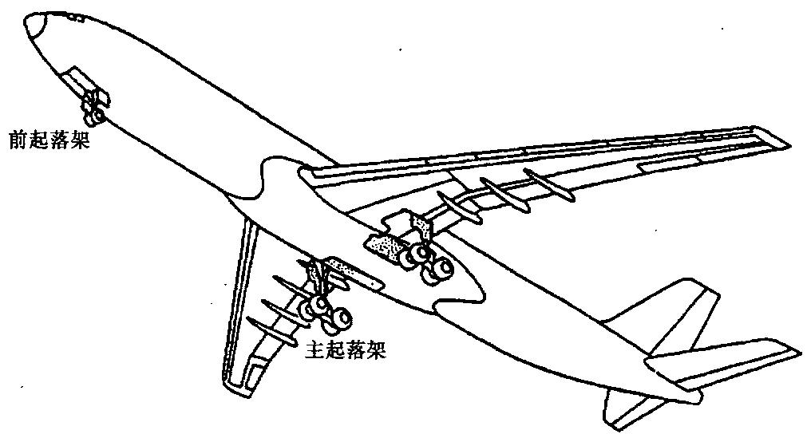  
图3.0-1-(CCA-PRA)S18飞机前和主起落架

注：SSA-CCA-PRA

4.0 分析：

4.1 轮胎失效模式：

4.1.1 总则：

为了得出一组评价轮胎失效影响的标准化状态，从许多研究报告和对以前飞机合格审定所采用的作法中衍生出失效模式。

在该模式内，所有失效概率按每个机轮每次飞行被标出。

该模式规定的状态被用作所有轮胎特定风险评估的基础。考虑有6种失效模式适用于S18飞机的起落架。

（编者注：本例仅使用一种模式处理有关起落架放下时轮胎失效。）

4.1.2 起落架放下时轮胎爆破：

当机轮与地面接触时发生轮胎爆破，这时会产生轮胎胎面碎片。这些碎片可能被投射在  $45^{\circ}$  和  $180^{\circ}$  之间的机轮平面上（从地面水平面向朝后方向测量）。假设在该整个  $135^{\circ}$  弧区内，碎片投射具有同样的风险。

此外，轮胎的碎片可能被投射到轮胎平面任意一侧的  $15^{\circ}$  范围内，以高斯分布进行扩散。因此，一个物体被碎片击中的概率取决于面对碎片物体的面积以及其相对于轮胎的位置。从每个定义机轮可能发生损坏的范围图可制作一个图表或“窗式图”，利用这些图表可计算一个物体被击中的概率。

考虑下面两种尺寸的胎面碎片：

a. 用  $W \times W$  表示的大块碎片以及用  $0.5W \times 0.5W$  的小块碎片, 式中  $W$  为胎面宽度;  
b. 在  $10\%$  的情况下，认为首次轮胎失效引起爆破，第二次轮胎由于超载使胎面散发。

注：SSA-CCA-PRA

# 4.2 符合性方法：

评估轮舱中和起落架支柱上的设备被单一大或小碎片击中的影响，以证明对FAR/JAR25.729（f）的符合性。

评估轮舱外面的结构或系统被单一碎片击中的影响或评估任何位置的物体被双击中的影响，以证明对 FAR/JAR25.1309 的符合性。

评估被任何一种碎片单击中燃油箱检查口盖的影响，以证明对FAR25.963（e）的符合性。

评估的方法是被试验数据所支持的分析。

# 4.3 定义被影响区域/范围：

用下面注出的位置来评估胎面发散的影响分析。为了说明此情况，见图4.3-1到4.3-4。任何单个碎片引起的损坏，由于该风险区域的几何形状关系，在多数情况下将仅能够发生在单一的靶位上，因此，对于此分析，仅考虑任何单一位置的损坏。

a. 主起落架支柱整流罩和铰接舱门；  
b. 主起落架支柱和覆盖层；  
c. 下翼面蒙皮；  
d. 入口面板541AB，BB，CB，DB/641AB，BB，CB，DB；  
e. 入口面板573DB/673DB;  
f. 下翼面固定面板；  
g. 屏蔽罩；  
h. 上翼面面板；  
i. 内后梁；  
j. 内侧襟翼；  
k. 第2号襟翼滑轨和整流罩；  
1. 第1号缝翼；  
m. 第1号扰流板；  
n. 下前机身；  
o. 腹部整流罩；  
p. 后机身。

注：SSA-CCA-PRA

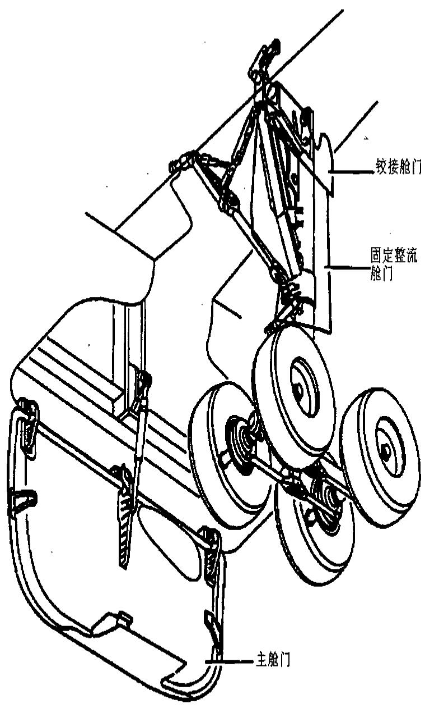  
图4.3-1-(CCA-PRA)主起落架舱

注：SSA-CCA-PRA

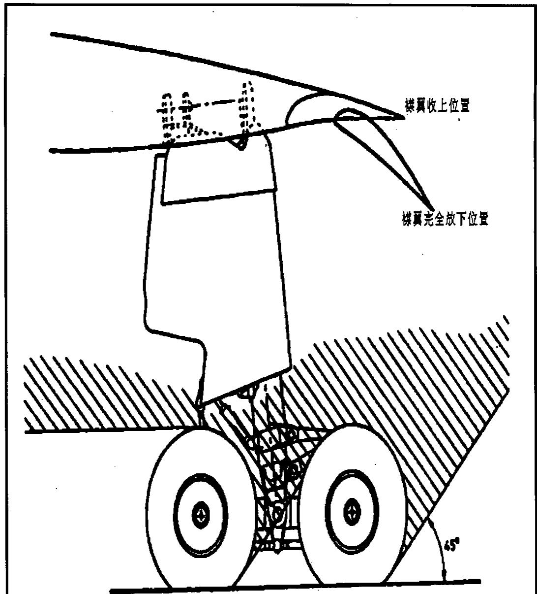  
图4.3-2-(CCA-PRA)轮胎爆破区域侧视图

注：SSA-CCA-PRA

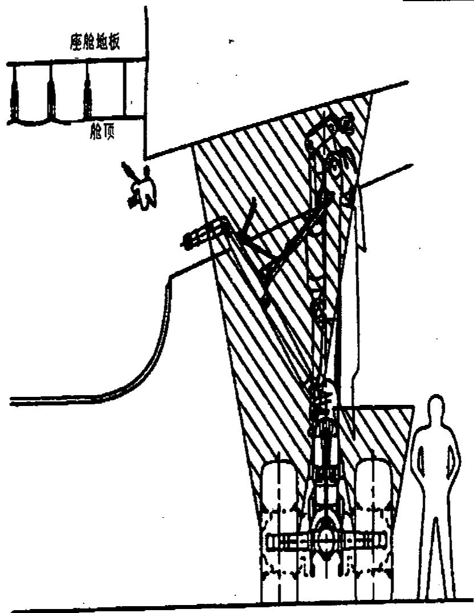  
图4.3-3-(CCA-PRA)轮胎爆破区域范围-前视图

注：SSA-CCA-PRA

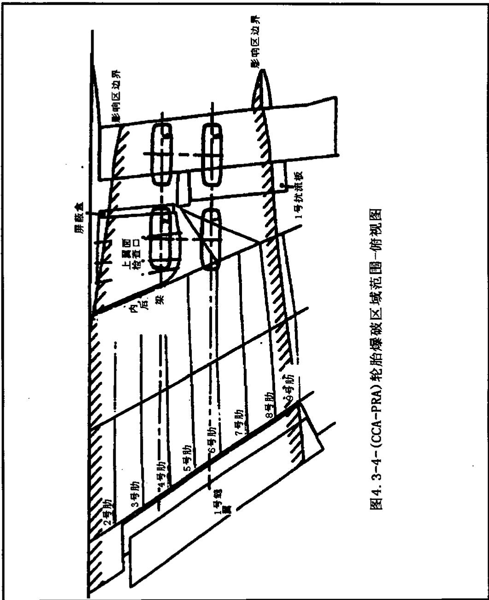

注：SSA-CCA-PRA

# 4.4 定义被影响的系统：

轮胎爆破仅影响液压系统和电气系统。

（编者注：通常以下各章节的详细信息在其它PSSA/SSA中是适用的，这里仅失效情况分类和对PSSA/SSA的参考是必需的。这里的信息是提供一个完整的例子，而不适用于其它分析。）

# 4.4.1 总则：

本分析考虑刚性的和柔性的液压导管如果被机轮或轮胎碎片击中，都会被切断。这种事件的可能结果是丧失相应的液压系统。作为参考，这样的液压系统故障对飞机主要系统的影响以及失效情况分类在下面给出。对于操纵面的标记见图4.4.1-1。

注：SSA-CCA-PRA

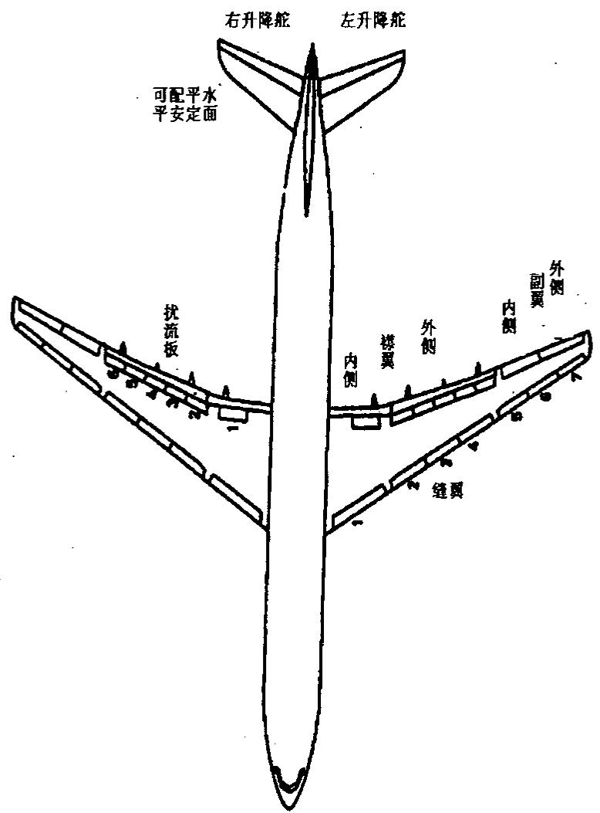  
图4.4.1-1-(CCA-PRA)S18飞机飞行操纵面

注：SSA-CCA-PRA

# 4.4.2 丧失液压系统：

a. 丧失绿液压系统：

(1) ATA27

(a) 襄翼的运行速度减小一半；  
(b) 缝翼的运行速度减小一半；  
(c) 丧失1号，5号扰流板的操纵（两侧机翼）。

(2) ATA32

(a) 丧失正常刹车系统，自动转换到备用（蓝）刹车系统；  
(b) 丧失前轮操纵；  
(c) 起落架不能收上（如果起落架在放下位置）；  
(d) 重力放下起落架（如果起落架在收上位置）。

(3) ATA78

(a) 丧失第2号反推力装置。

失效状态分类：较小的（MINOR）。

b. 丧失蓝液压系统：

(1) ATA27

(a) 缝翼的运行速度减小一半；  
(b) 丧失2号，3号扰流板的操纵（两侧机翼）。

(2) ATA32

(a) 丧失备用刹车系统，如果蓝刹车导管没有被切断，则用蓄压器应急刹车，但不保留防滑刹车。

(3) ATA78

(a) 丧失第3号反推力装置。

注：SSA-CCA-PRA

# 4.4.2 (续):

失效状态分类：较小的（MINOR）。

# c. 丧失黄液压系统：

# (1) ATA27

(a) 褚翼的运行速度减小一半；  
(b) 丧失4号，6号扰流板的操纵（两侧机翼）。

# (2) ATA78

(a) 丧失第1，4号反推力装置。

失效状态分类：较小的（MINOR）。

# d. 丧失绿、蓝液压系统：

# (1) ATA27

(a) 丧失缝翼操纵；  
(b) 褚翼的运行速度减小一半；  
(c) 丧失1，2，3，5号扰流板的操纵（两侧机翼）；  
(d) 丧失内侧副翼操纵。

# (2) ATA32

(a) 丧失正常和备用刹车。如果蓄压器下游蓝系统导管没有被切断，则使用蓄压器（蓝）应急刹车，但不保留防滑刹车；  
(b) 丧失前轮操纵；  
(c) 重力放下起落架（如果起落架在收上位置）。

# (3) ATA78

(a) 丧失第2，3号反推力装置。

注：SSA-CCA-PRA

4.4.2 (续):

失效状态分类：重大的（MAJOR）。（如果丧失所有刹车，则分类为：危险的(HAZARDOUS)

e. 丧失绿和黄液压系统：

(1) ATA27

(a) 丧失襟翼操纵；  
(b) 缝翼的运行速度减小一半；  
（c）丧失1，4，5和6号扰流板的操纵（两侧机翼）；  
(d) 丧失右升降舵操纵；  
(e) 丧失外副翼操纵；  
(f) 丧失偏航阻尼器操纵。

(2) ATA32

(a) 丧失正常刹车系统，自动转换到备用（蓝）刹车系统；  
(b) 丧失前轮操纵；  
(c) 起落架不能收上（如果起落架在放下位置）；  
(d) 重力放下起落架（如果起落架在收上位置）。

(3) ATA78

(a) 1, 2，和4号反推力装置不能工作。

失效状态分类-重大的（MAJOR）

f. 丧失兰和黄液压系统：

(1) ATA27

(a) 褚翼的运行速度减小一半；  
(b) 缝翼的运行速度减小一半；  
(c) 丧失2，3，4和6号扰流板的操纵（两侧机翼）；  
(d) 可配平水平安定面不能工作。

(2) ATA32

(a) 丧失备用刹车。如果蓝系统刹车管路没有被断开，则用蓄压器（蓝系统）应急刹车，但不保留防滑刹车。

注：SSA-CCA-PRA

4.4.2 (续):

(3) ATA78

(a) 丧失1，3和4号反推力装置。

失效状态分类-重大的（MAJOR）

g. 丧失绿，蓝和黄液压系统：

(1) ATA27

(a) 完全丧失飞行操纵系统的工作。

失效状态分类-灾难性的（CATASTROPHIC）。

4.4.3 丧失电气系统的影响：

4.4.3.1 总则：

本分析认为刚性的和柔性的电缆管道如果被机轮或轮胎碎片击中则被切断。这类事件的可能结果是丧失相关电气控制或监控信号。

为了飞机所有主要系统安全装置的工作，使用至少两套独立和隔离的电气系统和控制计算机。所有监控传感器是加倍的，尽管这些是必要的，但它们在被监控点可能被安装得很靠近。

4.4.3.2 单一电气系统故障：

控制和监控电路本身必须得到相应控制计算机的连续监控。

在机轮或轮胎失效事件中，导致多个电气系统故障，故飞机极其重要系统的工作在大多数情况下将依靠备用的应急系统。例如：

a. 备用刹车的液压-机械控制（没有防滑）；  
b. 重力放下前，主起落架。

注：SSA-CCA-PRA

表 4.6-1-(CCA-PRA) 轮胎失效特定风险分析摘要  

<table><tr><td colspan="2">轮胎失效研究胎面发散,轮胎爆破</td><td colspan="4">主起落架-放下</td></tr><tr><td>FAR/JAR25条款号</td><td>受影响的组件</td><td>影响</td><td>失效状态分类</td><td>风险</td><td>报告章节号</td></tr><tr><td>729(f)</td><td>主起落架支柱整流舱门支柱整流舱门面板</td><td>连接件断裂,整流舱门(36公斤)脱离机体,且击中内侧襟翼,并向通过水平安定面(撞击在襟翼上的能量小于鸟撞的能量)。</td><td>较小的(MINOR)</td><td></td><td>2.1</td></tr><tr><td>729(f)</td><td>主起落架铰接舱门铰接舱门面板</td><td>连接件断裂,整流舱门(15公斤)脱离机体(如上)。</td><td>较小的(MINOR)</td><td></td><td></td></tr><tr><td>729(f)</td><td>主起落架支柱和外表电气系统:2M转速表信息液压系统:到2个刹车蓝(或绿)系统</td><td>受影响的小车式机轮中丧失3个机轮上的刹车。</td><td>重大的(MAJOR)</td><td></td><td></td></tr><tr><td>1309</td><td>下翼面蒙皮电气系统:1M燃油泵2M电源</td><td>丧失对一台发动机的泵供油。发动机运转减慢,除非人工选择交输供油。</td><td>较小的(MINOR)</td><td>1.8E-6</td><td></td></tr></table>

注：SSA-CCA-PRA

表 4.6-1-(CCA-PRA)轮胎失效特定风险分析摘要(续)  

<table><tr><td colspan="2">轮胎失效研究胎面发散,轮胎爆破</td><td colspan="4">主起落架-放下</td></tr><tr><td>FAR/JAR25条款号</td><td>受影响的组件</td><td>影响</td><td>失效状态分类</td><td>风险</td><td>报告章节号</td></tr><tr><td>963(e)(仅 FAR)</td><td>检查口面板541/641 AB,BB,CB,DB燃油箱检查口面板</td><td>凹陷</td><td>无</td><td></td><td></td></tr><tr><td>1309</td><td>检查口面板 573/673DB电气系统:IM到机翼2M和主起落架1S正常2S刹车液压系统:到飞行操纵的蓝系统结构:评估面板,组件</td><td>备用刹车没有防滑丧失蓝液压系统面板释放(1.7公斤)</td><td>重大的(MAJOR)较小的(MINOR)较小的(MINOR)</td><td>2.0E-7</td><td>2.1</td></tr><tr><td>309</td><td>下翼面固定面板下翼面面板组件</td><td>面板释放(5.1公斤)</td><td>较小的(MINOR)</td><td>8.0E-8</td><td></td></tr></table>

注：SSA-CCA-PRA

表 4.6-1-(CCA-PRA)轮胎失效特定风险分析摘要(续)  

<table><tr><td colspan="2">轮胎失效研究胎面发散,轮胎爆破</td><td colspan="4">主起落架-放下</td></tr><tr><td>FAR/JAR25条款号</td><td>受影响的组件</td><td>影响</td><td>失效状态分类</td><td>风险</td><td>报告章节号</td></tr><tr><td rowspan="3">729(f),1309</td><td rowspan="3">屏蔽罩液压系统:通向机翼的绿系统机械系统:襟翼传动机构结构:屏蔽罩组合件</td><td>丧失液压系统</td><td>较小的(MINOR)</td><td></td><td></td></tr><tr><td>丧失襟翼操纵</td><td>较小的(MINOR)</td><td></td><td></td></tr><tr><td>释放小碎片</td><td>较小的(MINOR)</td><td></td><td></td></tr><tr><td>729(f),1309</td><td>上翼面面板电气系统:1M通向主起落架液压系统:通向主起落架的绿系统结构:上翼面面板装配件</td><td>备用刹车,没有防滑丧失绿液压系统击穿面板释放小碎片</td><td>较小的(MINOR)较小的(MINOR)较小的(MINOR)</td><td></td><td></td></tr></table>

注：SSA-CCA-PRA

表 4.6-1-(CCA-PRA) 轮胎失效特定风险分析摘要 (续)  

<table><tr><td colspan="2">轮胎失效研究胎面发散,轮胎爆破</td><td colspan="4">主起落架-放下</td></tr><tr><td>FAR/JAR25条款号</td><td>受影响的组件</td><td>影响</td><td>失效状态分类</td><td>风险</td><td>报告章节号</td></tr><tr><td>729(f)729(f)</td><td>内后梁电气系统:1M通向机翼2M和机翼1S备用2S刹车液压系统:通向机翼的蓝系统或通向主起落架下位锁的绿系统</td><td>丧失内副翼操纵丧失1,2,3,5号扰流板操纵丧失导航灯襟翼操纵速度减半丧失蓝液压系统或选择起落架收上后丧失绿液压系统</td><td>较小的(MINOR)较小的(MINOR)较小的(MINOR)较小的(MINOR)较小的(MINOR)较小的(MINOR)较小的(MINOR)</td><td>-</td><td>2.1 -</td></tr><tr><td>1309</td><td>内侧襟翼内侧襟翼面板</td><td>局部损坏到底部蒙皮,释放小碎片</td><td>较小的(MINOR)</td><td>1.2E-5</td><td></td></tr><tr><td>1309</td><td>2号襟翼滑轨整流罩襟翼滑轨整流罩</td><td>局部损坏并释放小碎片</td><td>较小的(MINOR)</td><td>5.0E-8</td><td></td></tr><tr><td>1309</td><td>1号缝翼1号缝翼面板</td><td>局部损坏并释放小碎片</td><td>较小的(MINOR)</td><td></td><td></td></tr></table>

注：SSA-CCA-PRA

表 4.6-1-(CCA-PRA) 轮胎失效特定风险分析摘要 (续)  

<table><tr><td colspan="2">轮胎失效研究胎面发散,轮胎爆破</td><td colspan="4">主起落架-放下</td></tr><tr><td>FAR/JAR25条款号</td><td>受影响的组件</td><td>影响</td><td>失效状态分类</td><td>风险</td><td>报告章节号</td></tr><tr><td>1309</td><td>1号扰流板1号扰流板面板1号扰流板作动器</td><td>释放碎片丧失绿液压系统</td><td>较小的(MINOR)较小的(MINOR)</td><td>2.96E-61.20E-7</td><td></td></tr><tr><td>1309</td><td>机身剖面13和14低于窗户线的上横向框架剖面13/21腹部整流罩剖面16低于窗户线的上横向框架</td><td>蒙皮凹陷且漆面刮伤被击穿,释放小碎片蒙皮凹陷且漆面刮伤</td><td>较小的(MINOR)较小的(MINOR)较小的(MINOR)</td><td>3.4E-87.0E-81.4E-8</td><td>2.1</td></tr></table>

注：SSA-CCA-PRA

# 4.4.3.2 （续）：

在某些情况下，电气控制系统相对于某些参数，在丧失所有监控通道信息容差范围内，可具有有限的控制功能，例如：

a. 在丧失两个通道“起落架舱门关闭”信息后，液压放下起落架。

# 4.5 采取的设计预防措施：

供给刹车的液压系统，所必需的传感器和操纵布线，一个线路被安装在主起落架支柱的前面，而另一个线路则在主起落架支柱的后面。

（编者注：按照设计和安装指南，可以应用其它设计预防措施，但为了简明起见，它们不在此被表明。）

# 4.6 对影响的评审：

所有8个主起落架轮胎的组合碎片打击区域为翼根区底部机翼蒙皮的广阔涉及范围。被包含在该区域内的是没遮盖的主起落架机翼舱。因此，相当多数量具有较小的(MINOR)失效状态分类的事件可能发生，典型的是丧失单一液压线路，电气通道或较小的结构损伤。其重要的例子在表4.6-1中被给出。

许多事件引起导致故障组合的两个线路的丧失：如丧失内侧副翼和1，2，3和5号扰流板操纵；或受影响的小车式起落架上丧失3个机轮的刹车；或具有“重大的”（MAJOR）失效状态分类的备用刹车。

已确认没有由单一碎片导致比“重大的”（MAJOR）更严重的失效状态分类的事件。因此，JAR 729(f) 被满足且对于单一碎片引起的失效状态分类为“重大的”（MAJOR）。

在  $10\%$  的情况中，被机轮和轮胎模型规定第二块碎片。在两个碎片单独打击蓝和绿刹车线路的事件中，丧失所有刹车，这被分配为“危险的”（HAZARDOUS）失效状态分类。因此，对于两个碎片打击事件的失效状态分类为“危险的”（HAZARDOUS）且相应的概率为2.2E-9每次飞行。

注：SSA-CCA-PRA

# 5.0 结论：

本分析所作的一般假设为：电气系统和液压系统被碎片击中而破裂。因此说明的所有影响表明最坏的情况。

a. 没有任何由轮胎失效引起的事件被确认为灾难性（CATASTROPHIC）的失效状态；  
b. 由轮胎失效引起的一个事件被确认为危险的（HAZARDOUS）失效状态。这个事件是蓝和绿刹车的液压能源管道被从机翼主起落架舱区域内的两个主起落架机轮的轮胎碎片击中而导致丧失全部刹车。该事件发生的概率被评估为极少的（EXTREMELY REMOTE）（2.2E-9每次飞行）；  
c. 没有任何其它事件被分析确认为具有比重大的（MAJOR）更严重的失效状态分类。系统或结构损伤的严重程度与其发生概率之间的反比关系已按照 FAR/JAR 25.1309 咨询材料被证明；  
d. 位于起落架上或轮舱中的主要设备已表明被保护免于具有比重大的（MAJOR）更严重失效状态分类的单一轮胎失效。因此满足 FAR/JAR 25.729(f)；  
e. 位于被认为是处于轮胎碎片或爆破风险区域的燃油箱口盖已被表明将被击穿和变形的风险减到了最小。

分析表明，在被不表明是极不可能的机轮或轮胎碎片事件引起的任何单一失效或组合失效后，飞机能继续安全飞行和着陆。因此满足FAR/JAR25.671（c）。

注：SSA-CCA-CMA（飞机）

# 飞机机轮刹车系统的共模分析（CMA）

（编者注：有关CMA过程的详细情况，请参考附录  $K_{\circ}$  ）

# 1.0 引言：

本分析包含对机轮刹车功能的飞机级共模分析（CMA）。本分析确保在飞机级发生的任何单一和共同事件或失效不能产生灾难性的影响。此例子仅涉及正常和备用系统之间的独立性，考虑应急刹车作为备用系统的一部分。

（编者注：飞机级的完整分析也考虑其它方面的独立性（例如，机轮刹车和反推力装置系统之间）但为了简明起见，它们在此被省略。）

# 2.0 参考资料：

下列参考资料被用于飞机/系统级的CMA执行中：

1）ARP4761“Guidelines and Methods for Conducting the Safety Assessment Process on Civil System and Equipment”（“民用飞机机载系统和设备安全性评估过程的指南和方法”）；  
2）S18飞机PSSA“丧失所有机轮刹车”故障树；  
3）S18飞机区域安全性分析No.YYY；  
4）S18飞机关于火，轮胎爆破，闪电的特定风险分析No.ZZZ；  
5）S18飞机电源分配和产生系统的共模分析No.ZZZ；  
6）S18飞机液压能源分配和产生系统的共模分析No.WWW；  
7）机轮刹车系统的系统安全性评估。

# 3.0 说明摘要：

（编者注：相对本指南的目的，请见PSSA刹车系统说明的例子。在真实的CMA情况下，这里将表面修订完善的说明摘要。）

注：SSA-CCA-CMA（飞机）

4.0 分析：

4.1 检查清单：

下列检查清单描述在共模分析中被考虑的共同来源和失效模式：

共模类型，源和失效检查清单

设计构架

外部源：电源

外部源：液压源

工作特性

位置

导管和导线的线路

工艺，设备

工艺，部件/设备类型

技术规范

技术规范和其来源

安装

程序和装配工

制造

制造商和制造过程

运行

机组动作和程序

故障检修

程序和全体工作人员

环境因素

闪电

由于水，泥浆等产生的污染

注：SSA-CCA-CMA（飞机）

# 4.2 独立性要求：

（编者注：所选择的例子是基于在PSSA中考虑与故障树“丧失所有机轮刹车”（见参考资料2）相关的“与”门。）

对该门的输入是下列失效：丧失正常刹车系统，备用刹车系统和应急（储备）刹车系统。

与该门相关的独立性要求是正常和备用系统之间的独立性。应急刹车系统必须被考虑作为备用系统的一部分。

（编者注：其它独立性要求可以从PSSA被衍生出来。但为了简明起见，它们没有被分析，也没有在此示出。）

# 4.3 共模分析：

为了表明对上面所列要求的符合性，评审刹车系统设计和具体实施中共模差错的致命性。在表4.3-1中分析可能导致丧失所有机轮刹车的部件失效。

（编者注：表4.3-1阐明表K.3.2.1.1的适用部分并摘要这些研究的结果。考虑了可能的共模源，共模差错以及设计证明/保护。）

注：SSA-CCA-CMA（飞机）

表 4.3-1-(CCA-CMA(飞机)机轮刹车功能共模分析  

<table><tr><td colspan="3">要求:正常和备用刹车应是独立的</td></tr><tr><td>共模源</td><td>共模差错</td><td>证明设计的合理性</td></tr><tr><td>设计构架外部源:电源</td><td>在电源的共同点导致完全丧失正常和备用刹车系统的控制和监控电源。</td><td>正常系统设备(例如BSCU,伺服阀)由主汇流条1和2供电。备用系统设备(例如测量阀,伺服阀)由应急汇流条供电。已进行电源分配和产生系统的共模分析,以证明两个汇流条之间的功能独立性。</td></tr><tr><td>外部源:液压源</td><td>在液压源的共同点导致完全丧失正常和备用刹车系统液压能源。</td><td>正常系统由绿液压线路供压,备用系统由蓝液压系统供压。已进行液压能源分配和产生系统的共模分析,以证明绿液压系统和蓝液压系统之间的功能独立性。轮胎爆破分析表明对导致此失效需要两个轮胎爆破且其概率是可接受的(参考资料4)。</td></tr><tr><td>工作特性</td><td>共同的工作特性破坏独立性。</td><td>正常刹车系统名义上是一个,它通常在飞行阶段中以待机的模式工作且在每次飞行结束时需要工作。备用刹车系统是一个后备系统。它始终是在待机模式需要用的状态。当正常系统脱开或失效时,由自动选择装置操作其工作。备用系统周期性地被测试。两个系统具有不同的工作特性(当一个系统失效时,需要用另一个系统)。</td></tr></table>

注：SSA-CCA-CMA（飞机）

表 4.3-1-(CCA-CMA(飞机)机轮刹车功能共模分析(续)  

<table><tr><td colspan="3">要求:正常和备用刹车应是独立的</td></tr><tr><td>共模源</td><td>共模差错</td><td>证明设计的合理性</td></tr><tr><td>位置</td><td>导致完全丧失机轮刹车的局部事件。</td><td>两个系统的主设备位于起落架区域。电线和液压系统通路进行物理隔离。</td></tr><tr><td>导管和导线的线路</td><td>影响电气通路或液压线路的局部事件。</td><td>使用独立的电气通路。每个通路有其专用的连接装置。物理隔离层确保沿着主起落架区两个液压线路之间的独立性。区域分析证明电气通道和液压线路之间的独立性。</td></tr><tr><td>工艺,设备工艺,部件/设备类型</td><td>研制错误。</td><td>部件使用传统工艺。在两个系统中,除伺服阀之外,安装不同类型的部件和组装件。在制造和安装阶段后,有关伺服阀以前的经验和合格鉴定试验确保正确其工作。</td></tr><tr><td>技术规范技术规范极其来源</td><td>有缺陷的技术规范或其来源有错误。</td><td>相对于安装设备的不同技术规范。对技术规范进行单独评审,防止来源错误。</td></tr><tr><td>安装程序和装配工</td><td>安装差错。</td><td>安装质量:双检查。安装阶段后,进行正常,备用和应急系统的目视检查和工作测试。</td></tr></table>

注：SSA-CCA-CMA（飞机）  
表 4.3-1-(CCA-CMA(飞机)机轮刹车功能共模分析(续)  

<table><tr><td colspan="3">要求:正常和备用刹车应是独立的</td></tr><tr><td>共模源</td><td>共模差错</td><td>证明设计的合理性</td></tr><tr><td>制造制造商和制造过程</td><td>影响安装在两个系统中相似设备的不合格制造。</td><td>伺服阀(正常/备用系统)和部件的相同制造商。制造商的质量过程被合格证明。</td></tr><tr><td>运行机组动作和程序</td><td>导致两个刹车系统断开的不合格操作程序或不正确的机组纠正动作。</td><td>通常在飞行结束前,机组使用自动刹车系统。机组提前选择足够的刹车等级。当正常系统断开后,使用备用系统。机组动作包括踩下刹车脚蹬。两个操作程序之间有独立性,因为它们以不同的条件和使用不同的方法来执行。</td></tr><tr><td>检查维修程序和全体工作人员</td><td>不合格的维修程序或维修差错。</td><td>维修差错被操作试验以及每次维修行动后所进行的目视检查发现。这些试验确保设备正确工作。当执行正常刹车系统的检查维修时,备用刹车系统被断开。当执行备用刹车系统的检查维修时,正常刹车系统被断开。在该两种情况下,执行该两个系统的最后测试,探测所有可能的维修差错。</td></tr></table>

注：SSA-CCA-CMA（飞机）

表 4.3-1-(CCA-CMA(飞机)机轮刹车功能共模分析(续)  

<table><tr><td colspan="3">要求:正常和备用刹车应是独立的</td></tr><tr><td>共模源</td><td>共模差错</td><td>证明设计的合理性</td></tr><tr><td>环境因素闪电,由于水,泥浆等引起的污染。</td><td>同时影响正常和备用刹车系统工作的环境因素。</td><td>保护正常和备用刹车系统免遭闪电的影响。设备经受跑道污染的合格鉴定。广泛的环境试验,仅一个刹车系统工作,而另一个系统备用,通常为不同的工作时间。</td></tr></table>

# 5.0 结论：

分析表明：

a. 确认没有由共模类型差错引起的任何事件具有灾难性的影响；  
b. 可能导致危险性影响的那些共模类型差错被专门的试验，制造过程，质量保证方法所限制或者由于它们的概率是可以接受的。

2007-05-15 初稿

2007-09-25 第一次修订

2007-12-11 第二次修订

<table><tr><td rowspan="2" colspan="2">SAE The Engineering Society
For Advancing Mobility
Land Sea Air and Space®
400 Commonwealth Drive, Warrendale, PA 15096-0001</td><td rowspan="2">AEROSPACE
RECOMMENDED
PRACTICE</td><td>SAE ARP4761</td></tr><tr><td>Issued 1996-12</td></tr><tr><td colspan="4">GUIDELINES AND METHODS FOR CONDUCTING THE SAFETY ASSESSMENT
PROCESS ON CIVIL AIRBORNE SYSTEMS AND EQUIPMENT</td></tr><tr><td colspan="4">TABLE OF CONTENTS</td></tr><tr><td>1.</td><td>SCOPE</td><td>............................</td><td>4</td></tr><tr><td>1.1</td><td>Purpose</td><td>............................</td><td>4</td></tr><tr><td>1.2</td><td>Intended Users</td><td>............................</td><td>4</td></tr><tr><td>1.3</td><td>How To Use This Document</td><td>............................</td><td>4</td></tr><tr><td>2.</td><td>REFERENCES</td><td>............................</td><td>6</td></tr><tr><td>2.1</td><td>Applicable Documents</td><td>............................</td><td>6</td></tr><tr><td>2.1.1</td><td>SAE Publications</td><td>............................</td><td>6</td></tr><tr><td>2.1.2</td><td>U.S. Government Publications</td><td>............................</td><td>6</td></tr><tr><td>2.1.3</td><td>FAR Publications</td><td>............................</td><td>6</td></tr><tr><td>2.1.4</td><td>RTCA Publications</td><td>............................</td><td>6</td></tr><tr><td>2.1.5</td><td>Other References</td><td>............................</td><td>6</td></tr><tr><td>2.2</td><td>Definitions</td><td>............................</td><td>7</td></tr><tr><td>2.3</td><td>Acronyms</td><td>............................</td><td>11</td></tr><tr><td>3.</td><td>SAFETY ASSESSMENT PROCESS</td><td>............................</td><td>12</td></tr><tr><td>3.1</td><td>Safety Assessment Overview</td><td>............................</td><td>12</td></tr><tr><td>3.2</td><td>Functional Hazard Assessment (FHA)</td><td>............................</td><td>16</td></tr><tr><td>3.3</td><td>Preliminary System Safety Assessment (PSSA)</td><td>............................</td><td>17</td></tr><tr><td>3.4</td><td>System Safety Assessment (SSA)</td><td>............................</td><td>21</td></tr><tr><td>3.5</td><td>Verification Means Used for Aircraft Certification</td><td>............................</td><td>22</td></tr><tr><td>4.</td><td>SAFETY ASSESSMENT ANALYSIS METHODS</td><td>............................</td><td>22</td></tr><tr><td>4.1</td><td>Fault Tree Analysis/Dependence Diagram/Markov Analysis (FTA/DD/MA)</td><td>............................</td><td>22</td></tr><tr><td>4.1.1</td><td>Applications of the FTA/DD/MA</td><td>............................</td><td>22</td></tr><tr><td>4.1.2</td><td>Software in FTA/DD/MA</td><td>............................</td><td>24</td></tr><tr><td>4.1.3</td><td>Average Exposure Time Probability</td><td>............................</td><td>25</td></tr></table>

SAE Technical Standards Board Rules provide that: "This report is published by SAE to advance the state of technical and engineering sciences. The use of this report is entirely voluntary, and its applicability and suitability for any particular use, including any patent infringement arising therefrom, is the sole responsibility of the user."

SAE reviews each technical report at least every five years at which time it may be reaffirmed, revised, or cancelled. SAE invites your written comments and suggestions.

# SAE ARP4761

# TABLE OF CONTENTS (Continued)

4.2 Failure Modes and Effects Analysis (FMEA) 25  
4.3 Failure Modes and Effects Summary (FMES) 26  
4.4 Common Cause Analysis (CCA) 26  
4.4.1 Zonal Safety Analysis (ZSA) 27  
4.4.2 Particular Risks Analysis (PRA) 27  
4.4.3 Common Mode Analysis (CMA) 28

5. SAFETY RELATED MAINTENANCE TASKS AND INTERVALS 28  
6. TIME LIMITED DISPATCH (TLD) 30  
6.1 FADEC Application 30

APPENDIX A FUNCTIONAL HAZARD ASSESSMENT (FHA) 31  
APPENDIX B PRELIMINARY SYSTEM SAFETY ASSESSMENT (PSSA) 40  
APPENDIX C SYSTEM SAFETY ASSESSMENT (SSA) 45  
APPENDIX D FAULT TREE ANALYSIS 50  
APPENDIX E DEPENDENCE DIAGRAMS 104  
APPENDIX F MARKOV ANALYSIS (MA) 108  
APPENDIX G FAILURE MODES AND EFFECTS ANALYSIS (FMEA) 135  
APPENDIX H FAILURE MODES AND EFFECTS SUMMARY (FMES) 147  
APPENDIXI ZONAL SAFETY ANALYSIS (ZSA) 151  
APPENDIX J PARTICULAR RISKS ANALYSIS (PRA) 156  
APPENDIX K COMMON MODE ANALYSIS (CMA) 159  
APPENDIX L CONTIGUOUS SAFETY ASSESSMENT PROCESS EXAMPLE. 168

# SAE ARP4761

# ACKNOWLEDGMENTS

The leadership of the S-18 Committee would like to thank the actively contributing committee members, and their sponsoring companies, for the time, effort, and expense expended during the years of development of this document. Without the experience, cooperation and dedication of these people, development of this document would not have been possible.

Thanks to the following committee members.

*John Dalton, Chairman

*Larry Lacy, Vice Chairman

Michael Burkett

Dale Davidson

*Jeff Hasson

Jean Pierre Heckmann

Jan Myers

*Claus Nagel

*Barbara Pederson

*Eric Peterson

*Michael Peterson

Brett Portwood

*Warren Prasuhn

Tilak Sharma

Gerry Southcombe

James Treacy

Andrew G. Ward

Steve Wilson

Boeing Commercial Airplane Group

Rockwell Collins Avionics

Allison Engine

Honeywell Commercial Div.

Boeing Commercial Airplane Co.

Aerospatiale

SAE

Daimler Benz Aerospace

Rockwell/Collins, General Aviation

Honeywell Air Transport

Honeywell Air Transport

Federal Aviation Administration

Rockwell/Collins, Air Transport

Boeing Commercial Airplane Co.

British Aerospace

Federal Aviation Administration

Rolls Royce

Allied Signal, General Aviation

# SAE ARP4761

# 1. SCOPE:

This document describes guidelines and methods of performing the safety assessment for certification of civil aircraft. It is primarily associated with showing compliance with FAR/JAR 25.1309. The methods outlined here identify a systematic means, but not the only means, to show compliance. A subset of this material may be applicable to non-25.1309 equipment. The concept of Aircraft Level Safety Assessment is introduced and the tools to accomplish this task are outlined. The overall aircraft operating environment is considered.

When aircraft derivatives or system changes are certified, the processes described herein are usually applicable only to the new designs or to existing designs that are affected by the changes. In the case of the implementation of existing designs in a new derivation, alternate means such as service experience may be used to show compliance.

# 1.1 Purpose:

This document presents guidelines for conducting an industry accepted safety assessment consisting of Functional Hazard Assessment (FHA), Preliminary System Safety Assessment (PSSA), and System Safety Assessment (SSA).

This document also presents information on the safety analysis methods needed to conduct the safety assessment. These methods include the Fault Tree Analysis (FTA), Dependence Diagram (DD), Markov Analysis (MA), Failure Modes and Effect Analysis (FMEA), Failure Modes and Effects Summary (FMES) and Common Cause Analysis (CCA). [CCA is composed of Zonal Safety Analysis (ZSA), Particular Risks Analysis (PRA), and Common Mode Analysis (CMA)].

# 1.2 Intended Users:

The intended users of this document include, but are not limited to, airframe manufacturers, system integrators, equipment suppliers and certification authorities who are involved with the safety assessment of civil aircraft and associated systems and equipment.

# 1.3 How To Use This Document:

The guidelines and methods provided in this document are intended to be used in conjunction with other applicable guidance materials, including ARP4754, RTCA/DO-178, RTCA SC-180 Document DO-(TBD), and with the advisory material associated with FAR/JAR 25.1309. (For engines and propeller applications, reference the applicable FAR/JAR advisory material.) The intent of this document is to identify typical activities, methods, and documentation that may be used in the performance of safety assessments for civil aircraft and their associated systems and equipment. The specific application of such activities needs to be established by the organization conducting the assessment and the appropriate recipient.

# SAE ARP4761

# 1.3 (Continued):

This document provides general guidance in evaluating the safety aspects of a design. The primary analytical methods and tools and the relationship of these are introduced. Users who need further information on a specific method or tool may obtain detailed information from appendices A through K. These appendices provide information on Functional Hazard Assessment (FHA), Preliminary System Safety Assessment (PSSA), System Safety Assessment (SSA), Fault Tree Analysis (FTA), Dependence Diagram (DD), Markov Analysis (MA), Failure Modes and Effects Analysis (FMEA), Failure Modes and Effects Summary (FMES), Zonal Safety Analysis (ZSA), Particular Risks Analysis (PRA) and Common Modes Analysis (CMA). Appendix L provides an example of the safety assessment process for a hypothetical system. This contiguous example illustrates the relationships between the processes and methods in creating the overall safety evaluation of an aircraft or system as it develops through the design cycle.

NOTE: The appendices are not stand alone documents, but are intended to be used in conjunction with the information contained in the basic document. The user is cautioned not to use the appendices independent of the basic document. Further, the examples in the Appendix L "Contiguous Example" should not be used without making reference to the corresponding appendix and to the main body of this document.

Examples presented in this document, including documentation examples, are intended only as guidance. The examples should not be interpreted as an addition to or an amplification of any requirement.

Throughout this document and the appendix, reference is made to using Fault Tree Analyses. It should be understood by the reader that Dependence Diagrams or Markov Analyses may be selected to accomplish the same purpose, depending on the circumstances and the types of data desired.

ARP1834 and ARP926A contain information about Fault/Failure Analysis but are superseded by this document for purposes of civil aircraft safety assessment. They are being amended to reflect this supersession.

# SAE ARP4761

# 2. REFERENCES:

# 2.1 Applied Documents:

The following publications form a part of this document to the extent specified herein. The latest issue of SAE publications shall apply. In the event of conflict between the text of this document and references cited herein, the text of this document takes precedence. Nothing in this document, however, supersedes applicable laws and regulations unless a specific exemption has been obtained.

# 2.1.1 SAE Publications: Available from SAE, 400 Commonwealth Drive, Warrendale, PA 15096-0001.

ARP4754 Certification Considerations for Highly-Integrated or Complex Aircraft Systems

# 2.1.2 U.S. Government Publications: Available from DODSSP, Subscription Services Desk, Building 4D, 700 Robbins Avenue, Philadelphia, PA 19111-5094.

MIL-HDBK-217 Reliability Prediction of Electronic Equipment, Reliability Analysis Center  
MIL-HDBK-338 Reliability Engineering Handbook  
MIL-HDBK-978 NASA Parts Application Handbook

# 2.1.3 FAR Publications: Available from FAA, 800 Independence Avenue, SW, Washington, DC 20591

FAR 25.1309 Airworthiness Standards: Transport Category Airplanes, Federal Aviation Regulations  
AC 25.19

# 2.1.4 RTCA Publications: Available from RTCA Inc., 1140 Connecticut Ave., NW, Suite 1020, Washington, DC 20036

RTCA/DO-178 Software Considerations in Airborne Systems and Equipment Certification, RTCA Inc.

RTCA/DO-TBD Design Assurance Guidance for Airborne Electronic Hardware (RTCA Special Committee -180)

# 2.1.5 Other References:

JAR 25.1309 Large Aeroplanes, Joint Aviation Requirement

AC 25.1309-1A System Design and Analysis, Advisory Circular, FAA

AMJ 25.1309 System Design and Analysis, Advisory Material Joint, JAA

NUREG-0492 Fault Tree Handbook, U.S. Nuclear Regulatory Commission

RAC NPRD Nonelectronic Parts Reliability Data

RAC FMD-91 Failure Mode/Mechanism Distribution

GIDEP Government Industry Data Exchange Program

Rome Laboratory Reliability Engineers Toolkit

<table><tr><td colspan="2">SAE ARP4761</td></tr><tr><td>2.2</td><td>Definitions:</td></tr><tr><td></td><td>NOTE: An effort has been made to maintain consistency between the definitions in ARP4754 and those in this document.</td></tr><tr><td></td><td>AIRWORTHINESS: The condition of an item (aircraft, aircraft system, or part) in which that item operates in a safe manner to accomplish its intended function.</td></tr><tr><td></td><td>ANALYSIS: An evaluation based on decomposition into simple elements.</td></tr><tr><td></td><td>APPROVAL: The act of formal sanction of an implementation by a certification authority.</td></tr><tr><td></td><td>APPROVED: Accepted by the certification authority as suitable for a particular purpose. (ICAO)</td></tr><tr><td></td><td>ASSESSMENT: An evaluation based upon engineering judgement.</td></tr><tr><td></td><td>ASSUMPTION: Statements, principles and/or premises offered without proof.</td></tr><tr><td></td><td>ASSURANCE: The planned and systematic actions necessary to provide adequate confidence that a product or process satisfies given requirements. (RTCA DO 178B)</td></tr><tr><td></td><td>&quot;AT RISK&quot; TIME: The period of time during which an item must fail in order to cause the failure effect in question. This is usually associated with the final fault in a fault sequence leading to a specific failure condition.</td></tr><tr><td></td><td>AUTHORITY: The organization or person responsible within the State (Country) concerned with the certification of compliance with applicable requirements.</td></tr><tr><td></td><td>AVAILABILITY: Probability that an item is in a functioning state at a given point in time.</td></tr><tr><td></td><td>CERTIFICATION: The legal recognition that a product, service, organization, or person complies with the applicable requirements. Such certification comprises the activity of technically checking the product, service, organization or person, and the formal recognition of compliance with the applicable requirements by issue of a certificate, license, approval, or other documents as required by national laws and procedures.</td></tr><tr><td></td><td>CERTIFICATION AUTHORITY: Organization or person responsible for granting approval on behalf of the nation of manufacture.</td></tr><tr><td></td><td>COMMON CAUSE: Event or failure which bypasses or invalidates redundancy or independence.</td></tr><tr><td></td><td>COMMON CAUSE ANALYSIS: Generic term encompassing Zonal Analysis, Particular Risks Analysis and Common Mode Analysis.</td></tr><tr><td></td><td>COMMON MODE FAILURE: An event which affects a number of elements otherwise considered to be independent.</td></tr></table>

# SAE ARP4761

# 2.2 (Continued):

COMPLEXITY: An attribute of systems or items which makes their operation difficult to comprehend. Increased system complexity is often caused by such items as sophisticated components and multiple interrelationships.

COMPLIANCE: Successful performance of all mandatory activities; agreement between the expected or specified result and the actual result.

COMPONENT: Any self-contained part, combination of parts, subassemblies or units, which perform a distinct function necessary to the operation of the system.

CONFORMITY: Agreement of physical realization of the item with the defining document.

CRITICALITY: Indication of the hazard level associated with a function, hardware, software, etc., considering abnormal behavior (of this function, hardware, software, etc.) alone, in combination or in combination with external events.

DEFECT: State of an item consisting of the non-performance of specified requirements by a characteristics of the item. A defect may, but need not, lead to a failure.

DEMONSTRATION: A method of proof of performance by observation.

DERIVED REQUIREMENTS: Additional requirements resulting from design or implementation decisions during the development process. Derived requirements are not directly traceable to higher level requirements; though derived requirements can influence higher level requirements.

DESIGN: The result of the design process.

DESIGN PROCESS: The process of creating a system or an item from a set of requirements.

DEVELOPMENT ASSURANCE: All those planned and systematic actions used to substantiate, to an adequate level of confidence, that development errors have been identified and corrected such that the system satisfies the applicable certification basis.

DEVELOPMENT ERROR: A mistake in requirements determination or design.

ERROR: (1) An occurrence arising as a result of an incorrect action or decision by personnel operating or maintaining a system. (JAA AMJ 25.1309) (2) A mistake in specification, design, or implementation.

EVENT: An occurrence which has its origin distinct from the aircraft, such as atmospheric conditions (e.g., wind gusts, temperature variations, icing, lighting strikes), runaway conditions, cabin and baggage fires. The term is not intended to cover sabotage. (JAA AMJ 25.1309) Note: This definition, as it is stated here, describes an "External Event". There are other uses of "event" that covers other aspects (e.g., FTA events).

# SAE ARP4761

# 2.2 (Continued):

EXCHANGED FUNCTION: Interdependencies between functions.

EXPOSURE TIME: The period of time between when an item was last known to be operating properly and when it will be known to be operating properly again.

FAILURE: A loss of function or a malfunction of a system or a part thereof. Note: This differs from the ARP 4754 definition and conforms to the AC/AMJ 25.1309 definition.

FAILURE CONDITION: A condition with an effect on the aircraft and its occupants, both direct and consequential, caused or contributed to by one or more failures, considering relevant adverse operation or environmental conditions. A Failure Condition is classified in accordance to the severity of its effects as defined in FAA AC 25.1309-1A or JAA AMJ 25.1309.

FAILURE EFFECT (FE): A description of the operation of a system or an item as the result of a failure; i.e., the consequence(s) a failure mode has on the operation, function or status of a system or an item.

FAILURE MODE (FM): The way in which the failure of an item occurs.

FAILURE RATE: The gradient of the failure distribution function divided by the reliability distribution function at time  $t$ .  $\lambda t = F'(t) / (1 - F(t))$

If the failure distribution function is exponential, the failure rate is constant and the failure rate can be approximately calculated by dividing the number of failures within a hardware item population, by the total unit operating hours. Note: Failure rate could also be expressed in terms of failures per flight hour or per cycle.

FAULT: An undesired anomaly in an item or system.

FUNCTIONAL HAZARD ASSESSMENT (FHA): A systematic, comprehensive examination of functions to identify and classify Failure Conditions of those functions according to their severity.

GUIDELINES: Recommended procedures for complying with regulations.

HARDWARE: An object that has physical being. Generally refers to LRUs, circuit cards, power supplies, etc.

HAZARD: A potentially unsafe condition resulting from failures, malfunctions, external events, errors, or a combination thereof.

IMPLEMENTATION: The act of creating a physical reality from a specification.

INDEPENDENCE: (1) A design concept which ensures that the failure of one item does not cause a failure of another item. (Derived from JAA AMJ 25.1309.) (2) Separation of responsibilities that assures the accomplishment of objective evaluation.

# SAE ARP4761

# 2.2 (Continued):

INSPECTION: An examination of an item against a specific standard.

INTEGRATION: (1) The act of causing elements of an item to function together. (2) The act of gathering a number of separate functions within a single implementation.

ITEM: One or more hardware and/or software elements treated as a unit.

LATENT FAILURE: A failure which is not detected and/or annihilated when it occurs.

MALFUNCTION: The occurrence of a condition whereby the operation is outside specified limits.

NOVELTY: Applicable to systems using new technology and to systems using a conventional technology not previously used in connection with the particular function in question.

PRELIMINARY SYSTEM SAFETY ASSESSMENT (PSSA): A systematic evaluation of a proposed system architecture and implementation based on the Functional Hazard Assessment and failure condition classification to determine safety requirements for all items.

PRODUCT: An item generated in response to a defined set of requirements.

REDUNDANCY: Multiple independent means incorporated to accomplish a given function.

RELIABILITY: The probability that an item will perform a required function under specified conditions, without failure, for a specified period of time.

REQUIREMENT: An identifiable element of a specification that can be validated and against which an implementation can be verified.

RISK: The frequency (probability) of occurrence and the associated level of hazard.

SEGREGATION: The maintenance of independence by means of a physical barrier between two hardware components.

SEPARATION: The maintenance of independence by means of physical distance between two hardware components.

SIMILARITY: Applicable to systems similar in characteristics and usage to systems used on previously certified aircraft. In principle, there are no parts of the subject system more at risk (due to environment or installation) and that operational stresses are no more severe than on the previously certified system.

SOFTWARE: Computer programs, procedures, rules, and any associated documentation pertaining to the operation of a computer system.

SPECIFICATION: A collection of requirements which, when taken together, constitute the criteria which define the functions and attributes of a system, or an item.

# SAE ARP4761

# 2.2 (Continued):

SYSTEM: A combination of inter-related items arranged to perform a specific function(s).

SYSTEM SAFETY ASSESSMENT (SSA): A systematic, comprehensive evaluation of the implemented system to show that the relevant requirements are met.

SYSTEM SAFETY ASSESSMENT PROCESS: The complete process applied during the design of the system to establish safety objectives and to demonstrate compliance with FAR/JAA 25.1309 and other safety related requirements.

VALIDATION: The determination that the requirements for a product are sufficiently correct and complete.

VERIFICATION: The evaluation of an implementation to determine that applicable requirements are met.

# 2.3 Acronyms:

AC Advisory Circular

A/C Aircraft

ACJ Advisory Circular Joint

AMJ Advisory Material Joint

ARP Aerospace Recommended Practice (SAE)

CCA Common Cause Analysis

CMA Common Mode Analysis

CMR Certification Maintenance Requirement (FAA AC 25-19)

DD Dependence Diagram

FAA Federal Aviation Administration

FAR Federal Aviation Regulation

FC Failure Condition

FC&C Failure Conditions and Classifications

FE Failure Effects

FHA Functional Hazard Assessment

FM Failure Modes

FMEA Failure Modes and Effects Analysis

FMES Failure Modes and Effects Summary

FTA Fault Tree Analysis

H/W Hardware

HIRF High Intensity Radiated Fields

JAA Joint Aviation Authorities

JAR Joint Aviation Requirements

LRU Line Replacement Unit

MA Markov Analysis

MRB Maintenance Review Board

MSG-3 Maintenance Steering Group 3

PRA Particular Risks Analysis

PSSA Preliminary System Safety Assessment

# SAE ARP4761

# 2.3 (Continued):

RTCA (Previously) Radio Technical Commission for Aeronautics

SAE Society of Automotive Engineers, Inc.

SSA System Safety Assessment

S/W Software

ZSA Zonal Safety Analysis

# 3. SAFETY ASSESSMENT PROCESS:

# 3.1 Safety Assessment Overview:

The safety assessment process includes requirements generation and verification which supports the aircraft development activities. This process provides a methodology to evaluate aircraft functions and the design of systems performing these functions to determine that the associated hazards have been properly addressed. The safety assessment process is qualitative and can be quantitative

The safety assessment process should be planned and managed to provide the necessary assurance that all relevant failure conditions have been identified and that all significant combinations of failures which could cause those failure conditions have been considered.

The safety assessment process for integrated systems should take into account any additional complexities and interdependencies which arise due to integration. In all cases involving integrated systems, the safety assessment process is of fundamental importance in establishing appropriate safety objectives for the system and determining that the implementation satisfies these objectives.

Figure 1 diagrams a top-level view of the safety assessment process (Functional Hazard Assessment, Preliminary System Safety Assessment, and System Safety Assessment) and how the safety assessment methods relate to that process. The development process is iterative in nature. The safety assessment process is an inherent part of this process. The safety assessment process begins with the concept design and derives the safety requirements for it. As the design evolves, changes are made and the modified design must be reassessed. This reassessment may create new derived design requirements. These new requirements may necessitate further design changes. The safety assessment process ends with the verification that the design meets the safety requirements. A typical development cycle timeline is shown across the top to show the chronological relationship of the safety process to the development process. Safety processes that are linked in the design process are grouped in boxes to highlight this relationship.

A Functional Hazard Assessment (FHA) is conducted at the beginning of the aircraft/system development cycle. It should identify and classify the failure condition(s) associated with the aircraft functions and combinations of aircraft functions. These failure condition classifications establish the safety objectives. These objectives are outlined in Table 1.

# SAE ARP4761

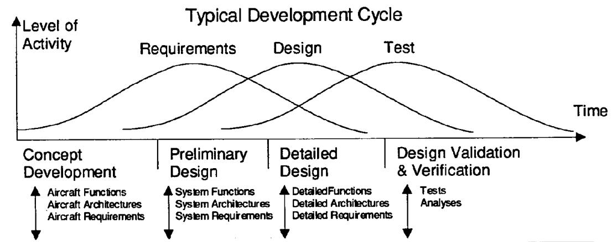

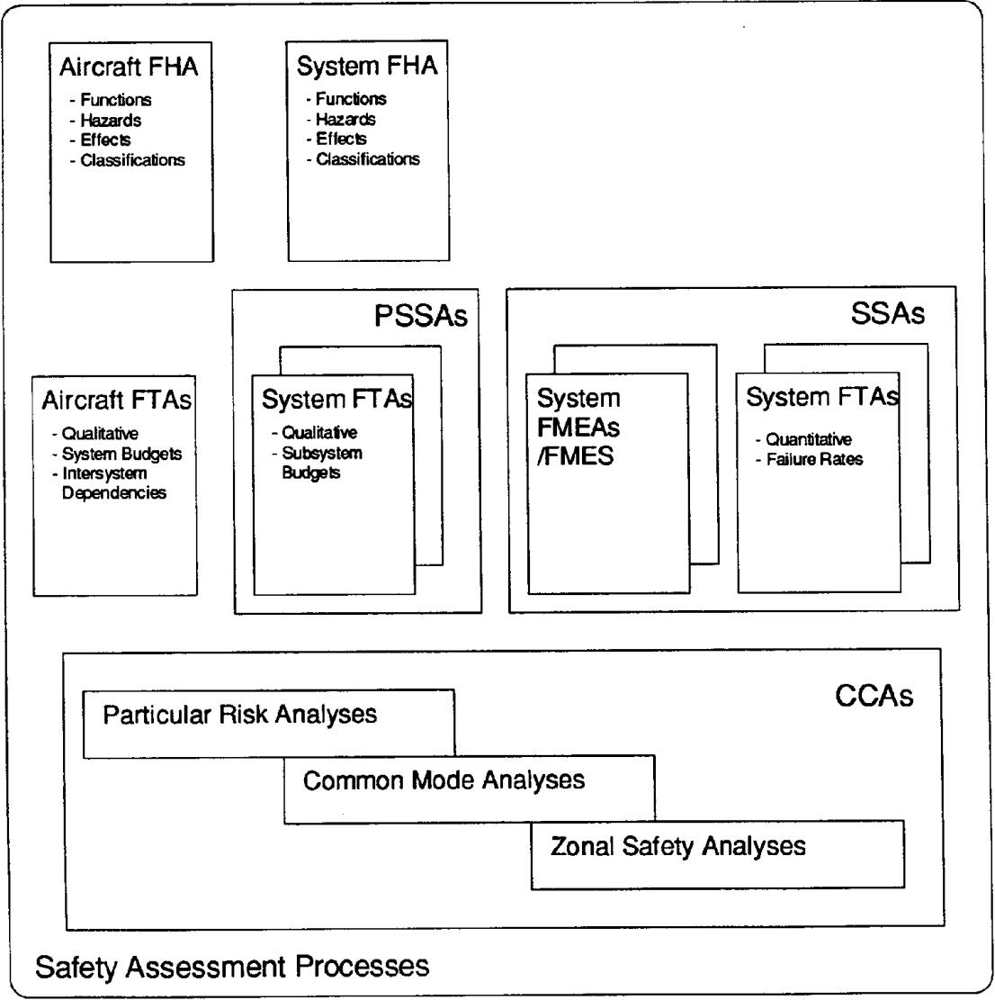  
FIGURE 1 - Overview of the Safety Assessment Process

TABLE 1 - Failure Condition Severity as Related to Probability Objectives and Assurance Levels  

<table><tr><td rowspan="2">Probability (Quantitative)</td><td colspan="6">Per flight hour</td></tr><tr><td>1.0</td><td>1.0E-3</td><td>1.0E-5</td><td>1.0E-7</td><td>1.0E-9</td><td></td></tr><tr><td rowspan="2">Probability (Descriptive)</td><td>FAA</td><td colspan="2">Probable</td><td colspan="2">Improbable</td><td>Extremely Improbable</td></tr><tr><td>JAA</td><td>Frequent</td><td>Reasonably Probable</td><td>Remote</td><td>Extremely Remote</td><td>Extremely Improbable</td></tr><tr><td rowspan="2">Failure Condition Severity Classification</td><td>FAA</td><td colspan="2">Minor</td><td>Major</td><td>Severe Major</td><td>Catastrophic</td></tr><tr><td>JAA</td><td colspan="2">Minor</td><td>Major</td><td>Hazardous</td><td>Catastrophic</td></tr><tr><td>Failure Condition Effect</td><td>FAA &amp; JAA</td><td colspan="2">- slight reduction in safety margins - slight increase in crew workload - some inconvenience to occupants</td><td>- significant reduction in safety margins or functional capabilities - significant increase in crew workload or in conditions impairing crew efficiency - some discomfort to occupants</td><td>- large reduction in safety margins or functional capabilities - higher workload or physical distress such that the crew could not be relied upon to perform tasks accurately or completely - adverse effects upon occupants</td><td>- all failure conditions which prevent continued safe flight and landing</td></tr><tr><td>Development Assurance Level</td><td>ARP 4754</td><td colspan="2">Level D</td><td>Level C</td><td>Level B</td><td>Level A</td></tr></table>

Note: A "No Safety Effect" Development Assurance Level E exists which may span any probability range.

# SAE ARP4761

# 3.1 (Continued):

The goal in conducting the FHA is to clearly identify each failure condition along with the rationale for its classification. After aircraft functions have been allocated to systems by the design process, each system which integrates multiple aircraft functions should be re-examined using the FHA process. The FHA is updated to consider the failure of single or combinations of aircraft functions allocated to a system. The output of the FHA is used as the starting point for conducting the Preliminary System Safety Assessment (PSSA).

The PSSA is a systematic examination of the proposed system architecture(s) to determine how failures can cause the functional hazards identified by the FHA. The objective of the PSSA is to establish the safety requirements of the system and to determine that the proposed architecture can reasonably be expected to meet the safety objectives identified by the FHA.

The PSSA is also an interactive process associated with the design definition. The PSSA is conducted at multiple stages of the system development including system, item, and hardware/software design definitions. At the lowest level, the PSSA determines the safety related design requirements of hardware and software. The PSSA usually takes the form of an FTA (DD or MA may also be used) and should also include common cause analysis.

The System Safety Assessment (SSA) is a systematic, comprehensive evaluation of the implemented system to show that safety objectives from the FHA and derived safety requirements from the PSSA are met. The SSA is usually based on the PSSA FTA (DD or MA may also be used) and uses the quantitative values obtained from the Failure Modes and Effects Summary (FMES). The SSA should verify that all significant effects identified in the FMES are considered for inclusion as primary events in the FTA. The FMES is a summary of failures identified by the FMEA(s) which are grouped together on the basis of their failure effects. The SSA must also include applicable common cause analysis results.

Each system architecture establishes the structure and boundaries that the specific system design has implemented. A Common Cause Analysis (CCA) should support the development of the specific system architecture and that of related systems by evaluating the overall architecture sensitivity to common cause events. These common cause events are evaluated by performing the following analyses: Particular risk analysis, zonal safety analysis, and common mode analysis. The results of aircraft level common cause analyses are fed into the PSSA and SSA for each system.

When conducting FTAs for either the PSSA or SSA, both the failure detection means allocated to maintenance tasks and related exposure times used in the analysis must be consistent with the maintenance tasks and intervals used by the maintenance program for the aircraft. In many cases, failure detection means are provided by flight deck effects or are inherent within the system (e.g., being provided by self-test, power up tests, etc.).

Dependence Diagrams are essentially equivalent to FTAs and the selection of one over the other is left to the personal preference of the analyst. Markov Analysis techniques are often useful when dealing with deferred maintenance scenarios. Appendixes D, E, and F list some of the advantages of using FTA, DD, and MA respectively.

# SAE ARP4761

# 3.1 (Continued):

The safety assessment process is more than just quantitative. It includes consideration of such qualitative issues as Development Assurance Levels, HIRF and lightning strike, etc. Much of this is included in the Common Cause Analysis (Appendixes I, J, and K).

The safety assessment process is complete when the SSA results are verified against the system level and aircraft level FHAs.

# 3.2 Functional Hazard Assessment (FHA):

A Functional Hazard Assessment is defined as a systematic, comprehensive examination of functions to identify and classify failure conditions of those functions according to their severity. An FHA is usually performed at two levels. These two analyses are known as an aircraft level FHA and a system level FHA.

The aircraft level FHA is a high level, qualitative assessment of the basic functions of the aircraft as defined at the beginning of aircraft development. An aircraft level FHA should identify and classify the failure conditions associated with the aircraft level functions. However, if separate systems use similar architectures or identical complex components and introduce additional aircraft level failure conditions involving multiple function, then the FHA should be modified to identify and classify these new failure conditions. The classification of these failure conditions establishes the safety requirements that an aircraft must meet. The goal in conducting this FHA is to clearly identify each failure condition along with the rationale for its severity classification.

The system level FHA is also a qualitative assessment which is iterative in nature and becomes more defined and fixed as the system evolves. It considers a failure or combination of system failures that affect an aircraft function. Assessment of any particular hardware or software item is not the goal of the system level FHA. However, if separate systems use similar architectures or identical complex components and introduce additional system level failure conditions involving integrated multiple functions, then the FHA should be modified to identify and classify these new failure conditions. The Development Assurance Level of an aircraft function depends on the severity of the effects of failures or development errors of that function on the aircraft, crew, or occupants. The Development Assurance Level of each item depends on both the system architecture and the resulting failure effects of the item on the functions performed by the system.

After aircraft functions have been allocated to systems by the design process, each system which integrates multiple aircraft functions should be re-examined using the system level FHA process.

# SAE ARP4761

# 3.2 (Continued):

The output of the aircraft level and/or system level FHAs is the starting point for the generation and allocation of safety requirements. An FTA (DD or MA) can be used to derive the lower level requirements from those identified in the FHAs (aircraft fault trees for the aircraft FHA and PSSA fault trees for system FHA). These derived requirements should be captured as requirements in aircraft and system specifications. Figure 2 shows the overall relationship between the FHA/FTA/FMEA. The figure shows an example of how the FHAs generate the top level events in the FTAs. The figure also highlights how the quantitative results from FMEA and FTA feed back into the system level and aircraft level FTAs to show compliance with numerical safety requirements from FHAs.

For details in performing the FHA, refer to Appendix A.

# 3.3 Preliminary System Safety Assessment (PSSA):

A PSSA is used to complete the failure conditions list and the corresponding safety requirements. It is also used to demonstrate how the system will meet the qualitative and quantitative requirements for the various hazards identified. The PSSA process identifies protective strategies, taking into account fail safe concepts and architectural attributes which may be needed to meet the safety objectives. It should identify and capture all derived system safety requirements (e.g., protective strategies such as partitioning, built-in-test, dissimilarity, monitoring, safety related tasks and intervals, etc.). The PSSA outputs should be used as inputs to the SSA and other documents, including, but not limited to, system requirements, hardware requirements and software requirements.

The PSSA is an iterative analysis imbedded within the overall development. It is an on-going process starting in the early phases of the design with the allocation of aircraft functions and their requirements to the system level. System level requirements are then allocated to items and finally item requirements will be allocated to hardware and software. Allocation of risk to items will determine hardware reliability requirements and development assurance requirements for both hardware and software (see ARP4754). These requirements and assurance levels are captured in item specifications.

The PSSA should identify failures contributing to the failure conditions from the system FHA. Possible contributing factors leading to failure conditions may be identified by using FTA, DD, MA, or other analysis methods. Hardware failures and possible hardware/software errors, as well as faults arising from common causes, should be included in the PSSA to show their contribution and to derive what system and item safety requirements are needed. Care should be taken to account for potential latent faults and their associated exposure times.

# SAE ARP4761

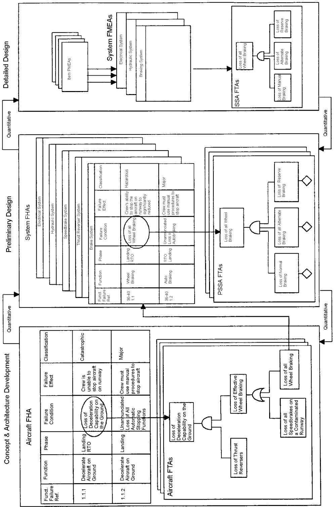  
FIGURE 2 - Example of the Relationship Between FHAs and FTA/FMEAs

# SAE ARP4761

# 3.3 (Continued):

The inclusion of hardware and software errors in a qualitative manner in this analysis shows their contribution to the various failure conditions and can provide valuable information on deriving the Development Assurance Levels (refer to ARP4754). The PSSA can also identify the specific safety related requirements for software such as containment boundary definitions, partitioning strategies, and specific verification strategies. The existence of such requirements should be captured as part of the system requirements.

The left side of the Safety Assessment Diagram, Figure 3, indicates the recommended sequence of steps in the PSSA process. Not all the steps will be needed for every assessment, but each must be considered for applicability. The following two paragraphs describe the left side of Figure 3. Note that wherever FTA is shown it can be replaced by an equivalent analysis method such as DD or MA.

The PSSA process has two main inputs, the system FHA and the aircraft FTA. The system FHA yields failure conditions and classifications necessary for the next steps. The aircraft FTA determines the functional failures of concern. The aircraft FTA is supplemented by the Common Cause Analysis (CCA) to generate the top failure effects for the system FTA. The CCA also establishes the systems requirements such as redundancy, separation and independence of functions needed to be implemented by the design of the system.

The CCA at the system level supplements the output of the system FTA to yield the top failure effects at the item level for use in the item FTA. The item CCA also supplements the item FTA to further establish the design requirements, Development Assurance Levels, and hardware reliability requirements. These established requirements are used as the design specification requirements for the hardware and software of individual items. The output of the PSSA is intended to identify hardware failure effects, development error effects of hardware and software, reliability budgets, and Development Assurance Levels. The PSSA should also establish protective strategies and architectural features necessary to meet safety objectives.

Safety requirements generated from the base events of the PSSA fault tree should be provided to the FMEA analyst. This information may take the form of failure effects and failure rate budgets to assure that specific failure effect are addressed in the FMEA. This information helps the FMEA analyst determine the emphasis and depth of analysis of the FMEA.

For details in performing the PSSA, refer to Appendix B.

# SAE ARP4761

<table><tr><td>Aircraft Requirement Identification</td><td>System Requirement Identification</td><td>Item Requirement Identification</td><td>Item Design Implementation</td><td>Item Verification</td><td>System Verification</td><td>Aircraft Verification</td></tr></table>

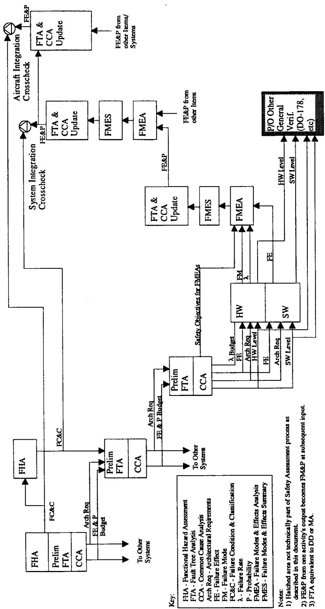  
FIGURE 3 - Safety Assessment Diagram

# SAE ARP4761

# 3.4 System Safety Assessment (SSA):

A System Safety Assessment is a systematic, comprehensive evaluation of the implemented system to show that relevant safety requirements are met. The analysis process will be similar to the activities of the PSSA but different in scope. The difference between a PSSA and an SSA is that a PSSA is a method to evaluate proposed architectures and derive system/item safety requirements; whereas the SSA is a verification that the implemented design meets both the qualitative and quantitative safety requirements as defined in the FHA and PSSA.

The SSA integrates the results of the various analyses to verify the safety of the overall system and to cover all the specific safety considerations identified in the PSSA. The SSA process documentation includes results of the relevant analyses and their substantiations as needed. This may include the following information.

a. List of previously agreed upon external event probabilities  
b. System description  
c. List of failure conditions (FHA, PSSA)  
d. Failure condition classification (FHA, PSSA)  
e. Qualitative analyses for failure conditions (FTA, DD, FMES)  
f. Quantitative analyses for failure conditions (FTA, DD, MA, FMES, etc.)  
g. Common Cause Analyses  
h. Safety related tasks and intervals (FTA, DD, MA, FMES, etc.)  
i. Development Assurance Levels for hardware and software (PSSA)  
j. Verification that safety requirements from the PSSA are incorporated into the design and/or testing process  
k. The results of the nonanalytic verification process (i.e., test, demonstration and inspection activities)

The right side of the Safety Assessment Process Diagram, Figure 3, indicates the recommended sequence of steps in the SSA process. Not all the steps will be needed for every assessment, but each must be considered for applicability. The following two paragraphs describe the right side of Figure 3. Note that wherever FTA is shown, it can be replaced by an equivalent safety assessment analysis method such as a DD or MA.

The SSA process flow is generally represented through succeeding levels of verification. Through these upward hierarchical verification levels, hardware reliability requirements, architectural requirements and hardware and software Development Assurance Levels are verified against the safety requirements delineated in the PSSA process. The lower level of design is again evaluated to determine compliance with derived requirements. DO-178 procedures should be used to verify that the software implementation meets the required Development Assurance Levels. The applicant should establish appropriate development assurance procedures for hardware with the agreement of the Certification Authorities. The hardware Development Assurance Level is verified via procedures that are to be defined by RTCA SC-180.

# SAE ARP4761

# 3.4 (Continued):

An item level FMEA is performed and is summarized into the item FMES to support the failure rates of the failure modes considered in the item FTA/CCAs. The system FMEA is summarized into the system FMES to support the failure rates of the failure modes considered in the system FTA. The system is reviewed via FTA/CCA to identify the failure modes and probabilities used in the aircraft FTA. The aircraft FTA/CCA is used to establish compliance with the aircraft level failure conditions and probabilities by comparison with the aircraft FHA. As items are integrated into systems and systems are integrated into the aircraft, the failure effects are compared with the failure conditions identified in the FHA. This comparison is called an "Integration cross-check" in Figure 3.

For details in performing the SSA, refer to Appendix C.

# 3.5 Verification Means Used for Aircraft Certification:

For each failure condition, it should be determined how the aircraft/system will satisfy the safety objective. The flowchart depicted in Figure 4 provides guidance in defining a verification plan for the failure conditions in a given system. The most difficult category to determine a course of assessment for is the Major category. The flow chart provides some guidance on how to approach verification of failures categorized as Major.

# 4. SAFETY ASSESSMENT ANALYSIS METHODS:

# 4.1 Fault Tree Analysis/Dependence Diagram/Markov Analysis (FTA/DD/MA):

Fault Tree Analysis (FTA), Dependence Diagram (DD), and Markov Analysis (MA) are top-down analysis techniques. These analyses proceed down through successively more detailed (i.e., lower) levels of the design.

After identifying the failure conditions in the FHA, the FTA/DD/MA can be applied as part of the PSSA to determine what single failures or combinations of failures can exist (if any) at the lower levels that might cause each failure condition. When an FMEA/FMES is performed, a comparison should be accomplished to ensure all significant effects identified are in the FTA/DD/MA as Basic Events. The FTA/DD/MA Basic Events get their failure rates from the FMEAs and/or FMESs.

For details in performing the FTA, refer to Appendix D. For details in performing the DD, refer to Appendix E. For details in performing the MA, refer to Appendix F.

# 4.1.1 Applications of the FTA/DD/MA: The completed FTA/DD/MA facilitates technical and management assessments and reviews because it identifies only the failure events which could individually or collectively lead to the occurrence of the undesired top event. In contrast, an FMEA lists only single failures, including some which may be of no concern.

The FTA/DD/MA facilitates subdivision of system level events into lower level events for ease of analysis.

# SAE ARP4761

FIGURE 4 - Safety Objective Verification Approach  
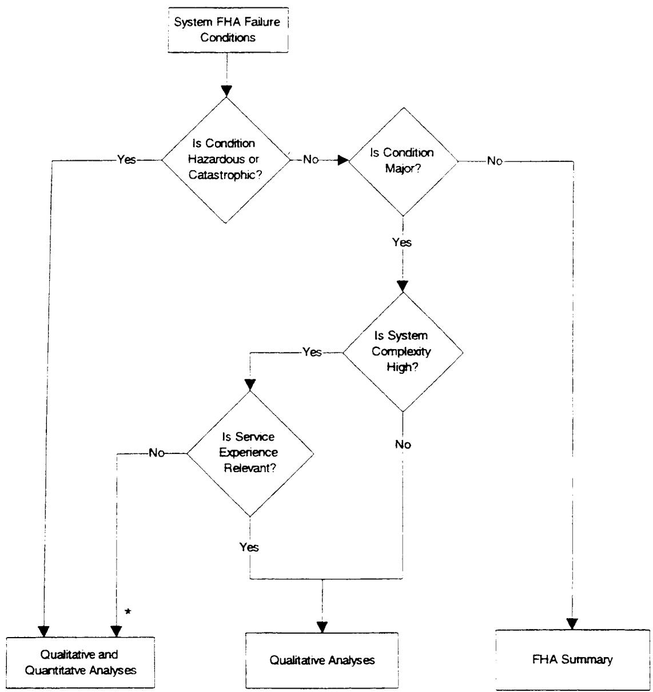  
* Major Failure Conditions may be satisfactorily analysed with methods that are less rigorous and complete than those for Catastrophic or Hazardous Failure Conditions (e.g. FMEA containing failure rates)

# SAE ARP4761

# 4.1.1 (Continued):

The FTA/DD/MA may be used to:

a. Quantify probability of occurrence for the top event.  
b. Evaluate proposed system architecture attributes to establish hardware reliability budgets and Development Assurance Levels for hardware and software during the PSSA process.  
c. Assess the impact of a design modification.  
d. Identify the need for a design modification and/or identify unique situations that require special attention.  
e. Show compliance with qualitative and/or quantitative safety objectives as part of the SSA.  
f. Provide a visual aid to qualitatively illustrate the significance of the software with respect to the failure condition classification of a top level event.  
g. Establish crew and maintenance tasks and intervals necessary to meet the requirements of the safety assessment.

A Fault Tree Analysis uses Boolean logic gates to show the relationship of failure effects to failure modes. The two most common logic gates are the AND-gate and the OR-gate. An AND-gate represents a condition in which the coexistence of all inputs is required to produce an output representing the higher level event. An OR-gate represents a condition in which one or more inputs produce an output representing the higher level event.

The DD replaces the FTA logic gates by paths to show the relationship of the failures; parallel paths are equivalent to the AND-gates and series paths are equivalent to the OR-gates.

An MA calculates the probability of the system being in various states as a function of time. A state in the model represents the system status as a function of both the fault-tree and faulty components and the system redundancy. A transition from one state to another occurs at a given transition rate, which reflects component failure rates and redundancy. A system changes state due to various events such as component failure, reconfiguration after detection of a failure, completion of repair, etc. Each state transition is a random process which is represented by a specific differential equation. The differential nature of the model limits the computation at any point in the analysis to the probability of transitioning from any defined state to another state. The probability of reaching a defined final state can be computed by combinations of the transitions required to reach that state.

# 4.1.2

Software in FTA/DD/MA: Embedded software may be qualitatively included in the FTA/DD/MA for certain systems and items. In particular, FTA/DD/MA may be necessary to provide adequate analytic visibility of software safety issues for complex systems, especially when credit is taken for the following safety attributes.

a. Systems and items which provide fail-safe protection against software errors (The protection may be provided either via other software or via hardware alone.)  
b. Systems and items in which software provides fail-safe protection against hardware errors or hardware faults  
c. Systems and items in which software provides protection against latent hardware faults.

# SAE ARP4761

# 4.1.2 (Continued):

When software is included in fault trees, the relationship between the top level hazards and specific software anomalous behaviors should be clearly established. It is important to explicitly identify the affected functions and to identify how the specified intended functions are affected. Specific protective strategies can be determined from the various potential cause factors associated with the specific software anomalous behaviors. These protective strategies can include architectural mechanisms in hardware or software and/or specific verification activities as part of a safety directed development (see ARP4754).

The occurrence of software errors are probabilistic but not in the same sense as hardware failures. Unlike hardware failures, these probabilities cannot be qualified. Therefore numerical and categorical probabilities should not be indicated for software errors in fault trees. Any software analysis in an FTA should be expressed in terms of development assurances to protect against software errors. The analysis should be evaluated for compliance on a purely qualitative basis.

4.1.3 Average Exposure Time Probability: When conducting quantitative FTA/DD/MA, the probabilities are estimated from the failure rates and exposure times of the events. Probability calculations for civil aircraft certifications are based on average probabilities calculated for all the aircraft of the same type. For the purpose of these analyses, the failure rates are usually assumed to be constant over time and are estimates of mature failure rates after infant mortality and prior to wear-out. If wearout or infant mortality is a consideration then other methods would need to be employed, for example life limitations or enhanced burn-in. Failing that, other distribution functions (e.g., Weibull) have to be applied or Monte Carlo simulation could be used. But this is beyond the scope of this document. These analyses should calculate average probability of occurrence per flight hour for the failure condition assuming a typical flight of average duration and considering the appropriate exposure and at risk times. A more detailed discussion of the proper determination of exposure and at risk times is contained in Appendices D and F.

When developing a new aircraft, the average flight time is usually determined from the customer requirements for the aircraft. This is an assumed value. When modifying an existing aircraft, the actual average flight time, based on in-service data, could be used.

# 4.2 Failure Modes and Effects Analysis (FMEA):

An FMEA is a systematic, bottom-up method of identifying the failure modes of a system, item, or function and determining the effects on the next higher level. It may be performed at any level within the system (e.g., piece-part, function, blackbox, etc.). Software can also be analyzed qualitatively using a functional FMEA approach. Typically, an FMEA is used to address failure effects resulting from single failures.

The scope of an FMEA should be coordinated with the user requesting it. The analysis may be a piece part FMEA or functional FMEA. If the failure rates derived from a functional FMEA allow the PSSA probability budgets to be met, a piece part FMEA may not be necessary. FMEAs typically include the following information.

# SAE ARP4761

# 4.2 (Continued):

a. Identification of component, signal, and/or function  
b. Failure modes and associated hardware failure rates (numerical or categorical)  
c. Failure effects (directly and/or at the next higher level)  
d. Detectability and means of detection

FMEAs may also include the following information.

a. Compensating actions (i.e., automatic or manual)  
b. Phase of flight in which the failure occurs  
c. Severity of failure effects

An FMEA may be used in conjunction with probabilistic techniques such as the FTA or DD to produce a quantitative analysis. Furthermore, an FMEA may be used to supplement the FTA/DD by providing a complementary list of failure effects from the bottom up.

For details in performing an FMEA, refer to Appendix G.

# 4.3 Failure Modes and Effects Summary (FMES):

An FMES is a grouping of single failure modes which produce the same failure effect (i.e., each unique failure effect has a separate grouping of single failure modes). An FMES can be compiled from the aircraft manufacturer's, system integrator's or equipment supplier's FMEAs. Furthermore, an FMES should be coordinated with the user to adequately address the need for inputs to higher level FMEAs and/or System Safety Assessment FTAs.

For details in completing the FMES, refer to Appendix H.

# 4.4 Common Cause Analysis (CCA):

Independence between functions, systems or items may be required to satisfy the safety requirements. Therefore, it is necessary to ensure that such independence exists, or that the risk associated with dependence is deemed acceptable. Common Cause Analysis (CCA) provides the tools to verify this independence, or to identify specific dependencies.

In particular the CCA identifies individual failure modes or external events which can lead to a catastrophic or hazardous/severe-major failure condition. Such common cause events must be precluded for catastrophic failure conditions and must be within the assigned probability budget for hazardous/severe-major failure conditions.

The safety analysis must given special attention to analyzing common-cause faults [AC/AMJ 25.1309]

# SAE ARP4761

# 4.4 (Continued):

CCA is subdivided into three types of analysis.

a. Zonal Safety Analysis  
b. Particular Risks Analysis  
c. Common Mode Analysis

4.4.1 Zonal Safety Analysis (ZSA): A Zonal Safety Analysis should be performed on each zone of the aircraft. The objective of the analysis is to ensure that the equipment installation meets the safety requirements with respect to:

a. Basic Installation. (The installation should be checked against the appropriate design and installation requirements.)  
b. Interference Between Systems. (The effects of failures of equipment should be considered with respect to their impact on other systems and structure falling within their physical sphere of influence.)  
c. Maintenance Errors. (Installation maintenance errors and their effects on the system or aircraft should be considered.)

When an effect which may affect safety identified, it will be highlighted in the Zonal Safety Analysis. This will either result in a redesign or will be shown to be acceptable in the appropriate safety assessment.

For details in performing the ZSA, refer to Appendix I.

4.4.2 Particular Risks Analysis (PRA): Particular risks are defined as those events or influences which are outside the system(s) and item(s) concerned, but which may violate failure independence claims. Some of the example risks shown here require analysis because of airworthiness regulations, while others arise from known external threats to the aircraft or systems.

Typical risks include, but are not limited to the following.

a. Fire  
b. High Energy Devices  
c. Leaking Fluids  
d. Hail, Ice, Snow  
e. Bird Strike  
f. Tread Separation from Tire  
g. Wheel Rim Release  
h. Lightning  
i. High Intensity Radiated Fields  
j. Flailing Shafts

# SAE ARP4761

# 4.4.2 (Continued):

Having identified the appropriate risks with respect to the design under consideration, each risk should be the subject of a specific study to examine and document the simultaneous or cascading effect(s) of each risk.

The objective is to ensure that any safety related effects are either eliminated or the risk is shown to be acceptable.

For details in performing the PRA, refer to Appendix J.

4.4.3 Common Mode Analysis (CMA): A Common Mode Analysis is performed to verify that ANDed events in the FTA/DD and MA are independent in the actual implementation. The effects of design, manufacturing, maintenance errors and failures of system components which defeat their independence should be analyzed. Considerations should be given to the independence of functions and their respective monitors. Item with identical hardware and/or software could be susceptible to generic faults which could cause malfunctions in multiple items.

Common mode faults can fall into several categories which should be analyzed. The following are some examples of common mode faults.

a. Hardware Error  
b. Software Error  
c. Hardware Failure  
d. Production/Repair Flaw  
e. Situation Related Stress (e.g., abnormal flight conditions or abnormal system configurations)  
f. Installation Error  
g. Requirements Error  
h. Environmental Factors (e.g., temperature, vibration, humidity, etc.)  
i. Cascading Faults  
j. Common External Source Faults

For details in performing the CMA, refer to Appendix K.

# 5. SAFETY RELATED MAINTENANCE TASKS AND INTERVALS:

The calculation of event probability associated with a failure condition must take into account the time during which a latent failure can persist without being detected.

In many cases, the failures are detected by normal flight crew observation or during periodic power-up or self test routines. The latent period for these failures is short. In some cases, however, the exposure time for latent failures is associated with equipment shop tests or specific aircraft maintenance tasks. In these cases the latent period can be considerable amount of time.

# SAE ARP4761

# 5. (Continued):

Maintenance tasks and time intervals which are identified during the PSSA and SSA by the use of the FTA, DD, MA or other similar analyses are potential Candidate Certification Maintenance Requirements (CCMRs). Where detection is accomplished by an aircraft maintenance task, the time interval required to meet the safety objective must be transferred to the appropriate maintenance department for implementation of required maintenance procedures and time intervals. Some maintenance checks associated with safety requirements compliance may be designated Certification Maintenance Requirements (CMRs). A CMR is a mandatory periodic task, required to maintain the safety of the aircraft, established during the design certification of the airplane as an operating limitation of the type certificate. These checks are established in accordance with AC 25-19 "Certification Maintenance Requirements".

It is important to note that CMRs are derived from a fundamentally different analysis process than the maintenance tasks and intervals that result from the Maintenance Steering Group (MSG-3) analysis associated with Maintenance Review Board (MRB) activities. MSG-3 analysis activity produces maintenance tasks that are performed for safety, operational or economic reasons, involving preventive maintenance tasks, which are performed before failure occurs (and are intended to prevent failures), as well as failure-finding tasks. CMRs on the other hand, are failure-finding tasks only, and exist solely to limit the exposure to otherwise hidden failures.

CMRs are designed to verify that a certain failure has or has not occurred, and do not provide any preventive maintenance function.

The MSG-3 process examines failure paths by using the "Next Failure" criteria. (e.g., what is the next worst thing that can happen, given the first failure has occurred?) Once the MSG-3 process is complete, the minimum maintenance required is established in the Maintenance Review Board document, or MRB.

Before becoming a CMR, a potential CMR, known as a Candidate CMR (CCMR), is reviewed by a Certification Maintenance Coordination Committee (CMCC), which will decide if the candidate will become a CMR. Details of this process are delineated in AC 25-19.

Once established, CMRs are required maintenance tasks and must be accomplished by the operator at the prescribed intervals, derived from the safety analysis, to maintain the airworthiness certificate of the aircraft.

Where the detection method is identified to be provided by test, assurance must be provided that the test procedures in fact detect the latent failures of concern.

The underlying goal of any system design should be an absolute minimum number of CMRs, with none as the ideal situation.

# SAE ARP4761

# 6. TIME LIMITED DISPATCH (TLD):

The following section contains a discussion of a method currently being used to define and control dispatchability requirements for Full Authority Digital Engine Control (FADEC) based aircraft propulsion control. It is included here only to provide background for the concept.

The concept of TLD allows advantage to be taken of any redundancy available to permit the airlines to schedule maintenance actions at specific intervals, rather than possibly incurring delays and/or cancellations if it were required that all faults be rectified prior to the next flight. TLD operation is conditional upon average safety levels being maintained. The recommended process for approval of TLD operations requires additional criteria for the abatement of risks in particular dispatch configurations.

An example of engine related applications which utilize this concept is discussed below. In principle it could be applied to any system which has been designed to include redundancy.

The FAR/JAR 25.1309 Harmonization Working Group is addressing the issue of TLD. The result of that discussion will determine the future course of the use of TLD tools in aircraft design and operations.

# 6.1 FADEC Application:

The concept has been applied to dual channel engine FADEC (Full Authority Digital Engine Control) systems with regard to the failure condition of LOTC (Loss of Thrust Control) of a single engine.

TLD operation is conditional upon the resultant system operation and reliability being adequate to satisfy the requirements of the certification authorities. A list showing which faults appear in each dispatchable class and the allowable dispatch times must be agreed upon with the certification authorities.

An Aerospace Recommended Practice (ARP) document on Time Limited Dispatch of aircraft which use engines with electronic control systems is being prepared by SAE Committee E-36. This document will describe the use of MA and analytic calculations to determine the periods of time during which an aircraft can be dispatched with known inoperative engine control system items

PREPARED BY SAE COMMITTEE S-18, SAFETY ASSESSMENT FOR AIRBORNE SYSTEMS AND EQUIPMENT

# SAE ARP4761

# APPENDIX A FUNCTIONAL HAZARD ASSESSMENT (FHA)

NOTE: The basic ARP4761 document contains information which places the information in this appendix in context. This appendix should be used in conjunction with the main body of the document.

# A.1 INTRODUCTION:

The objectives of the FHA is to consider functions at the most appropriate level and to identify failure conditions and the associated classifications while considering both loss of functions and malfunctions. The FHA should identify the failure conditions for each phrase of flight when the failure effects and classifications vary from one flight phase to another. The FHA also establishes derived safety requirements needed to limit the function failure effects which affect the failure condition classification. The requirements may include such things as design constraints, annunciation of failure conditions, recommended flight crew or maintenance action, etc. Furthermore, these requirements may involve single or multiple systems. All safety requirements should be traceable and validated at each level of derivation. A good way to accomplish this is to create a table of derived requirements based on design decisions. Once the high level requirements have been identified, they may be used to generate lower level requirements as part of the PSSA process for the systems or items. This process is continued, with reiteration, until the design process is complete.

There are two levels of FHA, the Aircraft level FHA and the System level FHA. FHAs carried out at these two levels use the same principles.

Generation of the FHA at the highest appropriate level is dependent upon overall knowledge and experience and may require consultation of numerous specialists. Table A1 is an example of the high level functions and their associated failure conditions that may be considered.

TABLE A1  

<table><tr><td>Function</td><td>Failure Condition</td></tr><tr><td>Control Flight Path</td><td>Inability to control Flight Path</td></tr><tr><td>Control Touchdown and Roll Out</td><td>Inability to control Touchdown and Roll Out</td></tr><tr><td>Control Thrust</td><td>Inability to control Thrust</td></tr><tr><td>Control Cabin Environment</td><td>Inability to control Cabin Environment</td></tr><tr><td>Provide Spatial Orientation</td><td>Inability to provide Spatial Orientation</td></tr><tr><td>Fire Protection</td><td>Loss of Fire Protection</td></tr></table>

# SAE ARP4761

# A.1 (Continued):

These failure conditions can be further broken down through the use of FHAs and Fault Trees. The following are some examples.

a. Inability to Control Flight Path

(1) Loss of trim  
(a) Loss of manual trim  
(b) Loss of fuel trim  
(c) etc.  
(2) Inadvertent trim  
(3) Loss of all hydraulics  
(4) Loss of flight control  
(5) Flight Control Malfunction

(a) Elevator Hardover

Eventually, the failure conditions associated with safety should be defined together with their respective safety objectives and the proposed means for demonstrating compliance. For aircraft level safety requirements, methods for demonstrating compliance should be shown in the aircraft level FHA. For system level requirements, methods for demonstrating compliance should be shown using the PSSA.

The aircraft level FHA should be used to support identification of possible multiple system failure conditions which could have a higher failure condition classification than would be expected based on independent system analysis.

It is desirable to establish an aircraft level general hazard list to be used on future projects so that known hazards are not overlooked. If such a list already exists, it should be used as a cross-check in the development of the aircraft level FHA.

# A.2 REQUIREMENT TO PERFORM AN FHA:

The FHA is the first step in a safety assessment process that is performed on new or modified aircraft programs. The FHA establishes the safety requirements for the new or modified design.

# A.3 FHA PROCESS:

The FHA process is a top down approach for identifying the functional failure conditions and assessing their effects. This assessment is made in accordance with the following processes.

a. Identification of all the functions associated with the level under study (internal functions and exchanged functions)  
b. Identification and description of failure conditions associated with these functions, considering single and multiple failures in normal and degraded environments  
c. Determination of the effects of the failure condition

# SAE ARP4761

# A.3 (Continued):

d. Classification of failure condition effects on the aircraft (Catastrophic, Severe-Major/Hazardous, Major, Minor and No Safety Effect)  
e. Assignment of requirements to the failure conditions to be considered at the lower level  
f. Identification of the supporting material required to justify the failure condition effect classification  
g. Identification of the method used to verify compliance with the failure condition requirements

Figures A1 and A2 describe the process flow for the Aircraft level and System level FHA.

# A.3.1 Function Identification:

All the functions associated with the level under study, both internal functions and exchanged functions, should be identified. These functions are identified by obtaining the necessary source data and then creating the function list.

# A.3.1.1 Obtain the Necessary Source Data: The first step in performing the FHA process is to obtain the necessary source data

The aircraft level FHA inputs are as follows.

a. The list of the top-level aircraft functions (e.g., lift, thrust, etc.)  
b. The aircraft objectives and customer requirements (e.g., number of passengers, range, etc.)  
c. Initial design decisions (e.g., number of engines, conventional tail, etc.)

The System level FHA inputs are as follows.

a. The list of the main functions to consider  
b. A functional diagram showing external interfaces  
c. The list of functions created in the higher design level FHAs  
d. The list of the failure conditions identified in the higher design level FHAs  
e. The requirements defined in design requirements and objectives documents  
f. The design options chosen at the upper level and their rationale

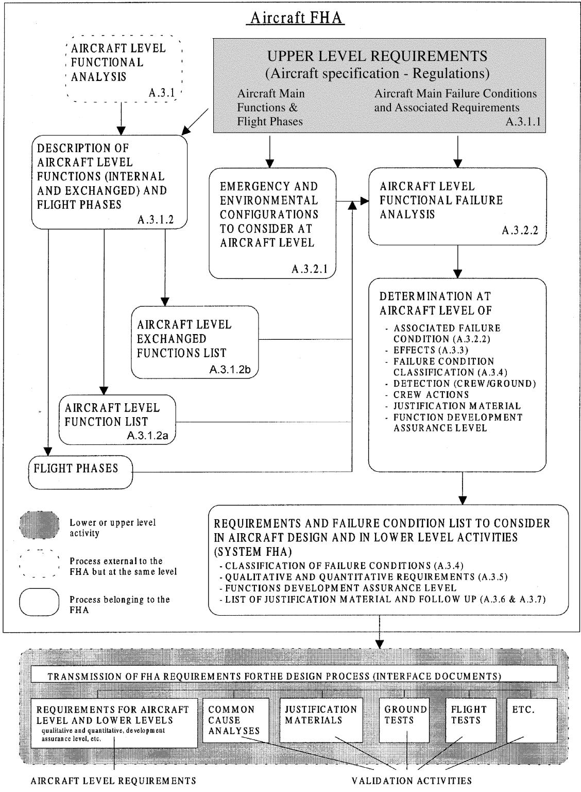  
FIGURE A1 - Aircraft Level Functional Hazard Assessment

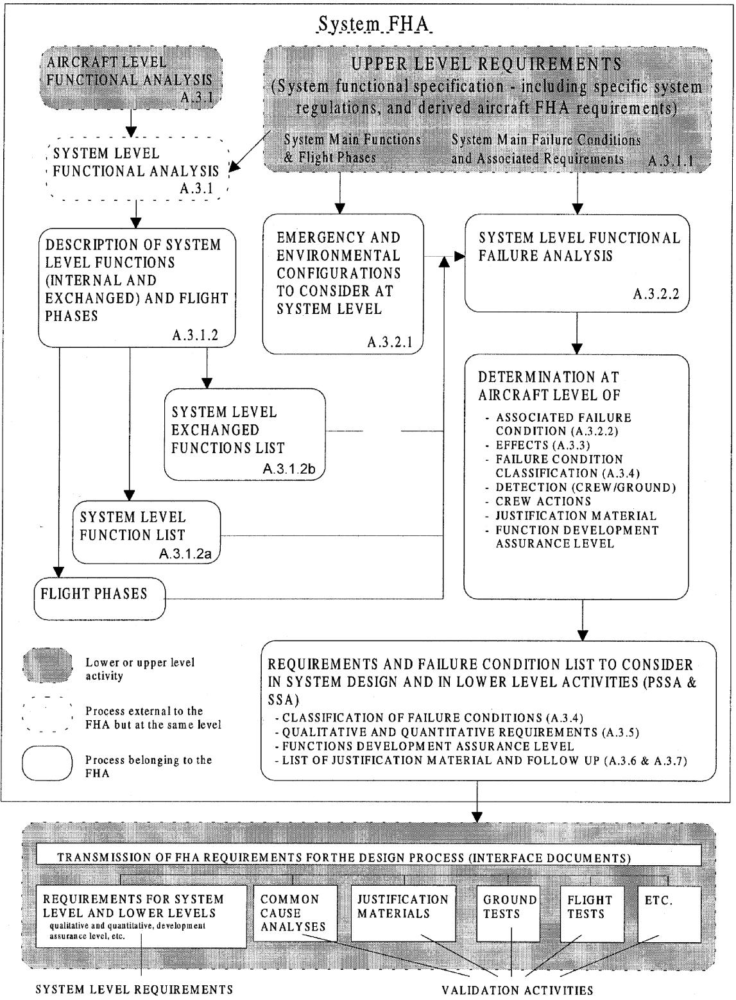  
FIGURE A2 - System Level Functional Hazard Assessment

# SAE ARP4761

A.3.1.2 Create a Function List: The FHA list of functions is made by starting with the expected function list and considering the source data inputs.

When, at the aircraft or system level, the functions are allocated to hardware or software, it is necessary to list the new functions introduced by this architectural design decision. This is done by listing all the hardware or software functions and by checking that all these functions are included in the aircraft or system level function list. During this process, two types of functions are identified.

a. Functions internal to the considered level (Internal Functions)

(1) At the aircraft level these are main functions of the aircraft and functions exchanged between the internal systems of the aircraft.  
(2) At the system level these are functions of the considered system and functions exchanged between the internal equipment of the system.

b. Functions external to the considered level (Exchanged Functions)

(1) At the aircraft level, these are functions that interface with other aircraft or with ground systems.  
(2) At the system level, for any given system, these are functions which are either provided by other systems or provided to other systems (including other aircraft systems or with ground systems).

A.3.2 Identification and Description of "Failure Conditions":

The failure conditions identification process begins with creating an environmental and emergency configuration list. Next, the analyst considers all the items of the internal function list, the exchanged function list, and the environmental and emergency/abnormal configuration list. The analyst then creates a list of failure conditions for the aircraft/system considering single and multiple failures in normal and degraded environments. To generate these failure conditions and assumptions, the analyst needs to understand the possible failure modes. The failure conditions should be subdivided into flight phases when the severity of the condition changes with different flight phases.

A.3.2.1 Environment and Emergency Configuration List: In addition to the list of functions of A.3.1.2, it is necessary to list the environmental conditions which need to be considered when determining the failure effects. Examples of environmental conditions to be considered at the aircraft level include the following.

a. Weather  
b. HIRF  
c. Volcanic Ash

# SAE ARP4761

# A.3.2.1 (Continued):

It is also necessary to list the aircraft configurations resulting from emergency/abnormal conditions which need to be considered when determining the failure effects. Examples of emergency/abnormal conditions at the aircraft/system level include the following:

a. Ditching  
b. Engine Out  
c. Loss of Communications  
d. Depressurization

For the system level FHA, this list is derived from the corresponding list coming from the aircraft level FHA or upper level FHA(s) and from architectural design decisions made during the initial concept design phase.

Examples of emergency/abnormal conditions to be added to the above list at the system level include the following:

a. Hydraulic System Loss  
b. Electrical System Loss  
c. Equipment Cooling Loss

A.3.2.2 Failure Condition Determination Considering Single and Multiple Failures: The creation of the single failure list involves examining the original list created in the previous steps and, in addition, applying an analysis of the concept design created in the initial design process. The creation of the multiple failure list is more difficult as it requires an understanding of the integration of the system components and the interaction of the system being analyzed with other systems on the aircraft. This process is aided by an understanding of the aircraft and system architecture. Multiple failures have to be considered, especially when the effect of a certain failure depends on the availability of another system.

Typical single failure conditions include the following:

a. Loss of Function  
b. Unannunciated Loss of Function  
c. Malfunction

Typical multiple failure conditions include the following:

a. Loss of two hydraulic systems where three systems exist on the aircraft  
b. Loss of communication and loss of navigation

# SAE ARP4761

A.3.3 Determine the Effects of the Failure Condition:

The analyst must determine the effect of failure conditions on the aircraft, crew and occupants. The analyst should consult people with operational experience to aid in classifying the failure condition effects. This can be accomplished directly at the aircraft level FHA. In the case of the system level FHA, the aircraft level effect may be the same as the system level effect, or the analyst may have to consider combined effects of other systems which accomplish the same aircraft function in order to determine the effect of the system failure condition.

A.3.4 Determine the Classification of the Failure Condition Effects:

The determination of the classification is accomplished by analyzing accident/incident data, reviewing regulatory guidance material, using previous design experience, and consulting with flight crews, if applicable. The classifications are: Catastrophic, Severe-Major/Hazardous, Major, Minor and No safety effect. (Reference Table 1 in the main body of this document)

Documentation of supporting materials (analyses/studies, tests, etc.) used in determining the effects and classification of failure conditions should be preserved to ensure traceability for future reference.

A.3.5 Assignment of Probability Requirements to Failure Conditions to be Considered at the Lower Level:

For each failure condition, the analyst must assign probability requirements and applicable qualitative design requirements. These requirements take the form of written requirements in specifications (aircraft requirements, system requirements, and item requirements).

A.3.6 Identification of the Supporting Material Required to Justify the Failure Condition Effect Classification:

For those failure condition effects that are not well understood, additional supporting material (e.g., simulation, studies, flight tests) should be defined to validate the chosen classification.

A.3.7 Identification of the Method Used to Verify Compliance with the Failure Condition Requirements:

For each failure condition the analyst should determine how the aircraft/system will satisfy the safety objective. The flowchart depicted in Figure 3.5-1 in the main body of this document provides guidance in defining the necessary safety objective verification approach for the relevant failure condition.

A.3.8 Previous Experience:

When the list of failure conditions and their classifications has been produced, it may be worth checking how the list compares with lists from previous similar projects as an extra aid to guard against overlooking some of the less encountered failure conditions. Furthermore, it may also be worth creating and maintaining a generic list, as a checklist, to be used during the review process of the FHA.

# SAE ARP4761

# A.4 FHA OUTPUTS:

# A.4.1 Documentation:

The results of the FHA process should be documented so that there is traceability of the steps taken in developing the FHA report. The following information should be documented during the FHA process.

a. FHA input function list  
b. Environmental and Emergency Configuration List  
c. Derived safety requirements for the design at each level  
d. FHA Report which contains the following

(1) Function Description  
(2) Failure Conditions  
(3) Phase of Operations  
(4) Effect of the Failure Condition on the Aircraft, Crew and Occupants  
(5) Classification of the Failure Condition  
(6) Reference to Supporting Material  
(7) Verification Method (for the design solution chosen to meet the safety objective)

# A.4.2 Link Between FHA and PSSA:

The results of the aircraft FHA and associated aircraft fault trees are the inputs to the system FHAs. The results of the system FHA are the inputs to the PSSA process.

The depth of the PSSA process will vary, depending on the design, complexity and failure condition classification related to the system analyzed.

The depth of the PSSA study is directed by the system FHA (i.e., failure condition classification) and the proposed design solution (complexity, novelty and integration). As the severity and/or design complexity increases, the depth of assessments/analyses increases.

# SAE ARP4761

# APPENDIX B PRELIMINARY SYSTEM SAFETY ASSESSMENT (PSSA)

NOTE: The basic ARP4761 document contains information which places the information in this appendix in context. This appendix should be used in conjunction with the main body of the document.

B.1 INTRODUCTION:

The Preliminary System Safety Assessment (PSSA) process is a systematic examination of a proposed system architecture(s) to determine how failures can lead to the functional hazards identified by the Functional Hazard Assessment (FHA), and how the FHA requirements can be met. The PSSA process is interactive and associated with the design definition. Just as the design process is iterative, the PSSA process is iterative. The PSSA process is continuous throughout the design cycle.

For each system analyzed, the PSSA addresses all significant Failure Conditions identified in the FHA(s). The methods of analysis may be either qualitative or quantitative.

There can be more than one level of PSSA. The highest level of PSSA is developed from the aircraft level and/or system level FHAs. Lower level PSSAs are developed from the output of higher level PSSAs.

Throughout this Appendix, reference is made to using Fault Tree Analyses. It should be understood by the reader that Dependence Diagrams or Markov Analyses may be selected to accomplish the same purpose, depending on the circumstances and the types of data desired.

B.2 REQUIREMENT TO PERFORM THE PSSA:

The decision to conduct a PSSA is dependent upon the design of the architecture, complexity, the severity of the failure condition (or failure effect), and type of function performed by the system being analyzed. The requirement for a PSSA should have been established from the output of the aircraft level or system level FHA according to the verification approach defined in Figure 4 of the main body of this document.

B.3 PSSA PROCESS:

The PSSA is a top down approach to determine how failures can lead to the functional hazards identified by the FHA, and how the FHA requirements can be met. This assessment is made in accordance with the following processes.

# SAE ARP4761

# B.3 (Continued):

a. Complete the list of aircraft and system level safety requirements.  
b. Determine whether this architecture, and the planned concept design, can reasonably be expected to meet the safety requirements and objectives.  
c. Derive the safety requirements for the design of lower level items (hardware and software), aircraft installation, other systems and operations (flight and maintenance tasks).

Figure B1 describes the process flow for the PSSA.

B.3.1 Complete the List of Aircraft and System Level Safety Requirements:

The aircraft FHA/CCA process creates an initial set of safety requirements for the design of the aircraft. Similarly, the system FHA/CCA process creates an initial set of safety requirements for the systems. By combining these initial sets of safety requirements with design/architecture decisions made in the PSSA process, a complete set of system requirements is generated.

B.3.1.1 Obtain the Necessary Source Data: The PSSA inputs are the aircraft and/or system level FHA, preliminary Common Cause Analysis (CCA), and the description of each system architecture under consideration in the PSSA. For each architecture option, these inputs may include:

a. Failure conditions and requirements identified in the aircraft and/or system level FHA.  
b. The system architecture description and the rationale for this choice.  
c. The list and functions of system equipment.  
d. The system interfaces and relations with other systems.  
e. Preliminary Common Cause Analyses.

(1) ZSA findings  
(2) PRA external threats  
(3) CMA findings

The assumptions made during the aircraft/system level FHAs should be confirmed to be applicable to each architecture under consideration in the PSSA.

# SAE ARP4761

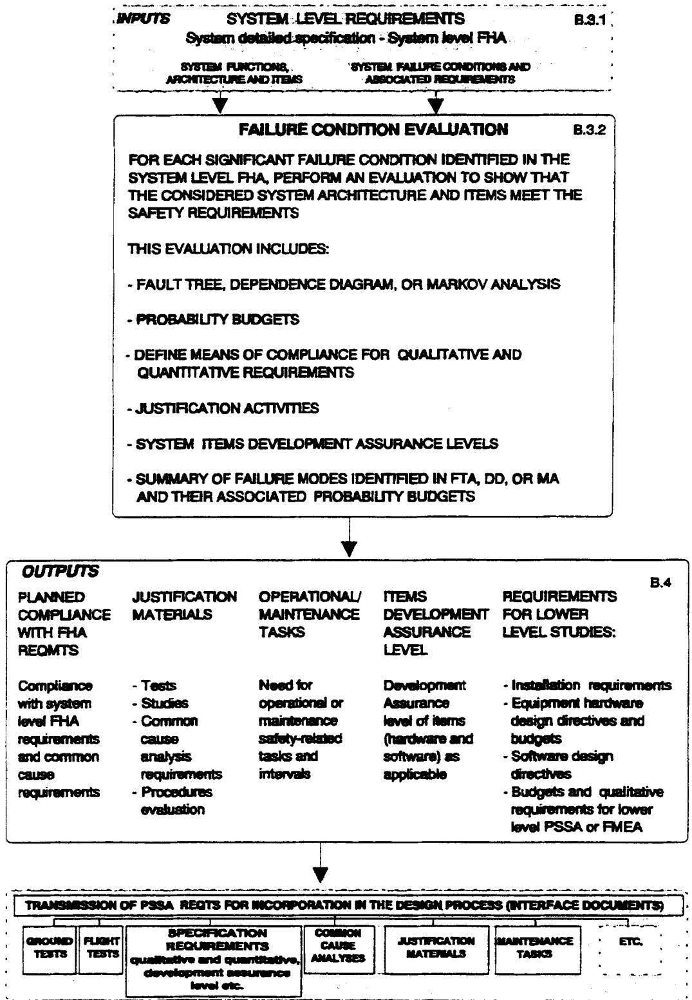  
FIGURE B1 - System Level PSSA Process

# SAE ARP4761

B.3.1.2 Completion of Safety Requirements for the System: The implementation of functions in a system architecture, in items (hardware or software), or integration of functions may result in new functions which have to be considered in the FHA to derive new failure conditions. The implementation may also derive new requirements (e.g., separation requirements and operational requirements). These new requirements and new failure conditions may require additional justification material within the PSSA or FHA.  
B.3.2 Evaluate Design/Architecture Decisions Against Generated Safety Requirements and Objectives:

After the completion of the system FHA requirements, each identified Severe-Major/Hazardous and Catastrophic failure condition must be evaluated as shown in Figure 4 of the main body of this document. The evaluation should:

a. Show, using Fault Tree Analysis or similar method, how item failures combine to lead to the considered failure condition.  
b. Identify all requirements associated with independence claims made in the Fault Tree Analyses by identifying:

(1) All separation/segregation requirements and associated verification requirements during Common Cause Analysis investigations.  
(2) Tests (ground or flight test) to verify independence.  
(3) Common cause failures (Zonal Analysis, Particular Risks Analysis, Common Mode Analysis).

c. Show, using Fault Tree Analysis or similar method, that qualitative and quantitative requirements and objectives associated with the failure condition can be met by the proposed system architecture and the budgeted failure probabilities.  
d. Determine the "Not to Exceed" interval for maintenance tasks driven by latent failures considered in the Fault Tree Analysis. (Latent failures which can exist for the design life of the aircraft, or the system/item in question without exceeding FTA numerical allowances, will not drive "Not to Exceed" maintenance intervals.)  
e. Determine the Development Assurance Level of items considered in the Fault Tree Analysis.

(NOTE: Major and Minor failures conditions may be evaluated using the above techniques as necessary.)

This evaluation is made at a time in the design process when the results of the detailed studies at the item level are not yet fully available. Consequently, the PSSA failure condition evaluation must rely in part on engineering judgement and on in-service experience with similar designs. This process is of an iterative nature and becomes more complete during the evolution of the design.

# SAE ARP4761

B.3.3 Derive the Safety Requirements for the Design of Lower Level Items:

Each design safety requirement derived at the system level must be allocated to the items making up the system. These allocations include:

a. An updated failure condition list which includes the rationale for how the safety requirements (qualitative and quantitative) can be met with the chosen architecture.  
b. The safety requirements (qualitative and quantitative) allocated to items (both hardware and software).  
c. Requirements for the design of the installation (segregation, separation, protection, etc.).  
d. The hardware and software Development Assurance Levels.  
e. The safety maintenance tasks and associated "Not to Exceed" times.

Failure modes and associated probability budgets identified in PSSA Fault Tree Analysis should be used as requirements to drive the lower level detailed studies.

B.4 PSSA OUTPUTS:

B.4.1 Documentation:

The results of the PSSA process should be documented so that there is traceability of the steps taken in developing the PSSA reports. Some of the information which may be valuable to preserve includes the following.

a. Planned compliance method with FHA requirements  
b. Updated FHAs  
c. Material supporting the classification list  
d. A failure condition list  
e. Lower level safety requirements (Including Development Assurance Levels)  
f. Qualitative FTAs  
g. Preliminary CCAs  
h. Operational requirements (flight and maintenance)

B.4.2 Outputs to Lower Level PSSA:

The PSSA may be performed at levels below the system level. The inputs to lower level PSSAs are the failure effects of concern, qualitative requirements, budgeting probabilities and Development Assurance Levels identified during a higher level FHA/PSSA. After the inputs are received, the PSSA lower level process is equivalent to that described in the above sections.

B.4.3 Link Between PSSA and System Safety Assessment (SSA):

The outputs of the PSSA are the inputs for the SSA process.

# SAE ARP4761

# APPENDIX C SYSTEM SAFETY ASSESSMENT (SSA)

NOTE: The basic ARP4761 document contains information which places the information in this appendix in context. This appendix should be used in conjunction with the main body of the document.

C.1 INTRODUCTION:

The System Safety Assessment (SSA) is a systematic examination of the system, its architecture and its installation to show compliance with the safety requirements. For each PSSA carried out at a different level, there should be a corresponding SSA. The highest level SSA is the system level SSA. For each system analyzed, the SSA summarizes all significant failure conditions and their effects on the aircraft. The methods of analysis used to show compliance may be either qualitative or quantitative.

Throughout this appendix, reference is made to using Fault Tree Analyses. It should be understood by the reader that Dependence Diagrams or Markov Analyses may be selected to accomplish the same purpose, depending on the circumstances and the types of data desired.

C.2 REQUIREMENT TO PERFORM THE SSA:

The requirement to perform an analysis may vary depending on the design, complexity, and type of function performed by the system being analyzed. This should have been established from the associated PSSA

C.3 SSA PROCESS:

The SSA process is a bottom up approach for verifying that the design safety requirements and objectives have been met. Figure C1 describes the process flow for the system level SSA. This assessment accomplishes the following:

a. Verification that the design requirements established in the System Level FHA are met  
b. Validation that the classification established for the aircraft level effects are justified  
c. Verification that the safety requirements called out in, or derived from aircraft design requirements and objectives are met  
d. Verification that the design requirements identified in the CCA process are met  
e. Linkage of the System level SSA to the aircraft level FHA.

# SAE ARP4761

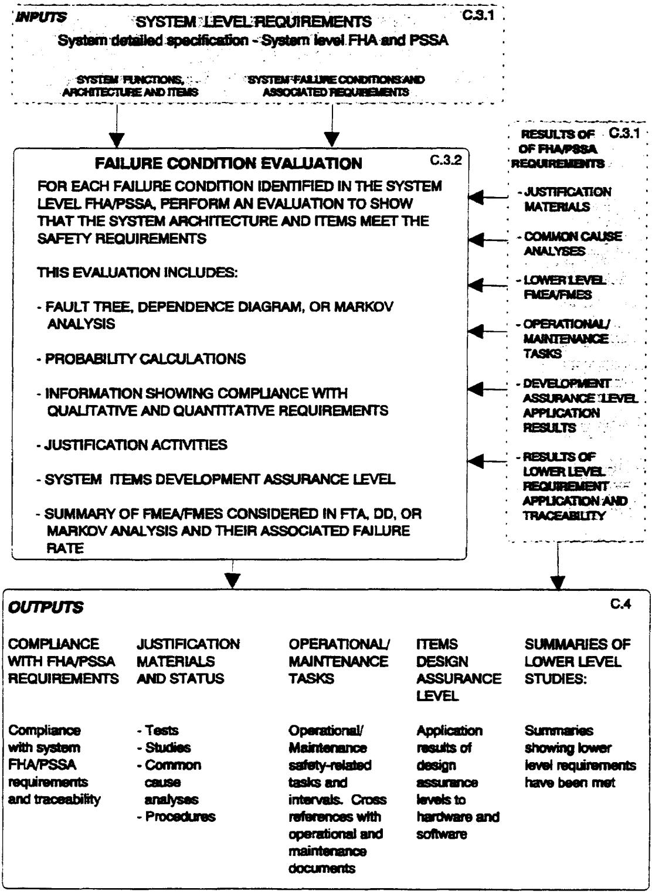  
FIGURE C1 - System Level SSA Process

# SAE ARP4761

C.3.1 FHA Design Requirements Verification:  
C.3.1.1Obtain the Necessary Source Data: Inputs to the SSA are as follows.

a. System architecture description and the associated design rationale  
b. Systems interfaces and their interactions with the items of the adjacent systems  
c. Requirements and failure conditions identified in the System Level FHA/PSSA  
d. List of functions and the associated rationale from the System Level FHA  
e. Common Cause Analyses results

(1) ZSA results  
(2) PRA external threats  
(3) CMA results

f. Results of all the supporting materials and lower level studies required in the FHA/PSSA.

(FMEA/FMES from the item suppliers, results of flight tests, studies, etc.)

C.3.2 Failure Condition Evaluation:

Each failure condition identified in the FHA has to be evaluated in accordance with Figure 4 of the main body of this document. Selecting from the following techniques, the evaluation should be performed to:

a. Show, using Fault Tree Analysis, how items' failures combine to lead to the considered Failure Condition.  
b. Show, using Fault Tree Analysis, that qualitative and quantitative requirements and objectives associated with the failure condition are met.  
c. Inspect the maintenance documentation to verify that the "Not to Exceed" interval for maintenance tasks driven by latent failures considered in the Fault Tree Analyses have been included for the MRB. (Not all latent failures drive "Not to Exceed" maintenance intervals.)  
d. Verify that the Development Assurance Level of items derived from the Fault Tree Analysis have been met.  
e. Test the condition to assure compliance with requirements.  
f. Demonstrate that the aircraft performs as expected with the given failure conditions.

# SAE ARP4761

C.3.2.1 Validation of Failure Condition Classification: Traceability should be demonstrated between requirements established in the FHA/PSSA and the documents in which these requirements are specified. These documents include the following items.

a. Aircraft design requirements and objectives documentation  
b. System requirements documentation  
c. Test plans (ground tests, flight tests, etc.)  
d. Maintenance manual  
e. Common Cause Analyses documents

On method of accomplishing this task would be to create a matrix showing the requirements and the substantiation of their corresponding validations.

C.3.2.2 Verification that the Safety Requirements Identified in the Aircraft Requirement Document(s) are Met: The aircraft requirement document(s) contain all the requirements for the design of the aircraft. This includes all FAR/JARs and all company requirements. The verification of these requirements is accomplished by one or more of the four standard means, (i.e., test, analysis, demonstration and inspection).  
C.3.2.3 Verification that the Design Requirements Identified in the CCA are Met: The CCA documentation contains requirements regarding system and component separation and segregation (from the Zonal Analysis), external threats (from the Particular Risk Analysis) and common mode failures (from the Common Mode Analysis). These requirements must be verified by one or more of the four standard means, (i.e., test, analysis, demonstration and inspection).

# C.4 SSA OUTPUTS:

# C.4.1 Documentation:

The results of the SSA process should be documented so that there is traceability of the steps taken in developing the SSA report. Some of the information which may be valuable to preserve includes:

a. The updated failure condition list or FHA which includes the rationale showing compliance with safety requirements (qualitative and quantitative).  
b. Documentation showing how requirements for the design of the system items' installation (segregation, protection, etc.) have been incorporated.  
c. The materials used to validate the failure condition classification.  
d. The safety maintenance tasks and associated "Not to Exceed Time".  
e. Documentation showing how the system and items (including hardware and software) have been developed in accordance with assigned development assurance levels.

# SAE ARP4761

# C.4.2 Linkage of the System Level SSA to the Aircraft Level FHA:

In order to close out the safety assessment process, each SSA must be reviewed against the basic requirement in both the system level and aircraft level FHA. The failure effect and its probability of occurrence at the aircraft level should be verified against the failure conditions and classifications of the aircraft level FHA.

# SAE ARP4761

# APPENDIX D FAULT TREE ANALYSIS

NOTE: The basic ARP4761 document contains information which places the information in this appendix in context. This appendix should be used in conjunction with the main body of the document.

# D.1 INTRODUCTION:

A Fault Tree Analysis (FTA) is a deductive failure analysis which focuses on one particular undesired event and provides a method for determining causes of this event. In other words, a Fault Tree Analysis is a "top-down" system evaluation procedure in which a qualitative model for a particular undesired event is formed and then evaluated. The analyst begins with an undesired top level hazard event and systematically determines all credible single faults and failure combinations of the system functional blocks at the next lower level which could cause this event. The analysis proceeds down through successively more detailed (i.e., lower) levels of the design until a Primary Event is uncovered or until the top level hazard event requirement has been satisfied. A Primary Event is defined as an event which for one reason or another has not been further developed (i.e., the event does not need to be broken down to a finer level of detail in order to show that the system under analysis complies with applicable safety requirements). A Primary Event may be internal or external to the system under analysis and can be attributed to hardware failures/errors or software errors.

The analyst is encouraged to discontinue the FTA analysis when sufficient detail to satisfy the top level hazard requirement has been identified.

The fault tree graphical representation is hierarchical and takes its name from the branching that it displays. It is this format which makes this analysis a visibility tool for both engineering and the certification authority. As one of a family of safety assessment techniques for assuring that the system/equipment will accomplish its intended safety functions, fault tree analysis is concerned with ensuring that design safety aspects are identified and controlled.

# FTA usage includes:

a. Facilitation of technical/certification authority assessments and reviews. (The completed fault tree displays only the failure events which could individually or collectively lead to the occurrence of the undesired top event.)  
b. Assessment of a design modification with regards to its impact on safety.  
c. Quantification of the top event probability of occurrence.  
d. Allocation of probability budgets to lower-level events.

# SAE ARP4761

# D.1 (Continued):

e. Visibility into the contribution of development errors by providing a format for mixed quantitative and qualitative assessment.  
f. Assessment of single and multiple-fault effects.  
g. Assessment of exposure intervals, latency, and "at-risk" intervals with regard to their overall impact on the system.  
h. Visibility of potential common-cause boundaries.  
i. Assessment of common-cause fault sources.  
j. Assessment of fail-safe design attributes (fault-tolerant and error-tolerant).

# D.2 SCOPE:

This fault tree analysis appendix contains the background information and procedural guidelines necessary for an experienced engineer to perform a fault tree analysis for the first time. Although this appendix contains the basic information on FTAs, the reader may also wish to refer to "Fault Tree Handbook" (U.S. Nuclear Regulatory Commission, document no. NUREG-0492) and other published material for a detailed discussion of FTA structure and mathematical evaluation techniques.

# D.3 ROLE OF FTA IN SAFETY ASSESSMENT:

Fault tree analysis should be performed during system conception (part of the PSSA process, see main body 3.3) or after a system concept has been formed (part of the SSA process, see main body 3.4); a "top-down" analysis like FTA allows for its level of detail to match the proposed or current level of design detail respectively.

FTA revisions after design freeze are dictated by the level of the design change. Since the FTA's Primary Event failure rates are based on the Failure Modes and Effects Summary (FMES), the FTA will require updating if the hardware design change causes a failure rate change to be reflected in the FMES. The fault tree analyses should be reviewed again during the latter stages of the aircraft flight program; FTAs which include any equipment design changes resulting from the aircraft test program are usually required as part of the equipment certification supporting documentation.

Figure D1 shows one example of a typical FTA timeline. Note that this figure is an example only; all parties involved in developing a civil airborne system should decide on a specific timeline for FTA generation at the beginning of the safety assessment process.

# SAE ARP4761

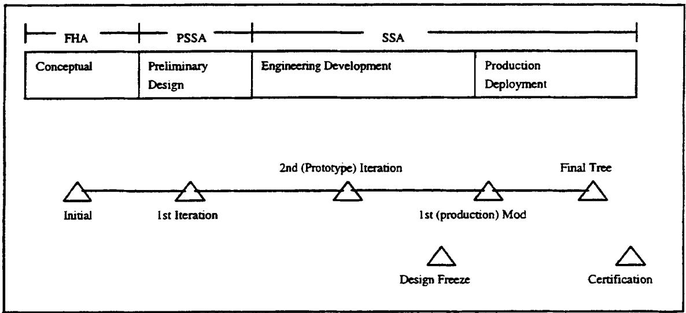  
FIGURE D1 - Example of a Typical FTA Timeline

# D.3 (Continued):

In the above example:

a. The "Initial" FTA is performed as part of the FTA process to determine combinations of system failures and allocation of probability budgets to systems.  
b. The "1st iteration" may include fault tree changes due to rework or clarification of some of the analyst's initial assumptions as a result of the requirement validation process. This FTA is performed as part of the system architecture selection process. It is here that the allocation of risk and probability budgets to lower level events occurs.  
c. The "2nd (Prototype) iteration" includes fault tree changes resulting from knowledge gained during hardware or software detailed design. It is at this stage of the program, where 1) the failure rate information from a failure modes and effects summary (FMES) or other source is inserted into the fault tree Primary Events, 2) the top level event failure probability is calculated, and 3) this failure probability is compared to the applicable safety requirement as part of the equipment design verification process. This version of the fault tree becomes part of the supporting documentation needed to successfully complete the "Design Freeze" program milestone.  
d. The "1st (Production) Modification" includes fault tree changes based on hardware or software design changes resulting from problems uncovered during prototype testing.

# SAE ARP4761

# D.3 (Continued):

e. The analyst then creates the "Final Tree" by incorporating any fault tree changes resulting from flight test based corrective actions to either hardware or software. This version of the fault tree then becomes part of the system safety assessment documentation needed to complete the "Certification" program milestone.

# D.4 FAULT TREE SYMBOLS AND DEFINITIONS:

All fault trees are composed of two kinds of symbols, logic and event. The general rule with regard to symbols is, keep it simple; the fewer the different symbol types used the easier it will be for a person reviewing the fault tree to understand it. Logic symbols are used to tie together the various branches of the fault tree. Logic symbols should not be directly connected together in the fault tree, their inputs and outputs should always be events.

The two main logic symbols used are the Boolean logic AND-gates and OR-gates. The analyst selects an AND-gate when the undesired top level event can only occur when all the next lower conditions are true. The OR-gate is used when the undesired event can occur if any one or more of the next lower conditions are true. The analyst may also use other Boolean logic gates if the system architecture warrants the use of these gate types.

Event symbols most commonly used include a rectangle, triangle, oval, circle, house, and diamond (see Figure D2). A rectangle contains the description of a logic symbol output or an event. A triangle indicates a transfer of information and is composed of two types. A triangle with a vertical line from its top represents a fault tree section (events and their corresponding probability of occurrence) which is "transferred in". A triangle with a horizontal line from its side indicates that the event the triangle is tied to is "transferred out" to another branch of the tree. The oval represents a Conditional Event which defines a necessary condition for a failure mode to occur (usually used in conjunction with PRIORITY AND and INHIBIT gates). For example, "monitor fails first" is a Conditional Event because it is necessary before corrupt data can be propagated through the system undetected.

The circle, house, and diamond all represent types of Primary Events. A circle signifies a Basic Event. A Basic Event is defined as an event which is internal to the system under analysis, requires no further development (i.e., has the capability of causing a fault to occur), and for hardware elements only, can be assigned a failure rate budget or an actual failure rate from an FMES or other source necessary for quantitative evaluation.

A house event is an event which is normally expected to occur. This event has the following two possible states.

a. The event has occurred.  
b. The event will not occur during the period under investigation.

A house functions like a switch and is used to include or exclude parts of the fault tree, which may or may not apply to certain situations.

# SAE ARP4761

FIGURE D2 - Fault Tree Symbols  

<table><tr><td>Symbol</td><td>Name</td><td>Definition</td></tr><tr><td></td><td>Description Box</td><td>Description of an output of a logic symbol or of an event</td></tr><tr><td></td><td>AND-Gate</td><td>Boolean Logic gate - event can occur when all the next lower conditions are true</td></tr><tr><td></td><td>Priority AND-Gate</td><td>Boolean Logic gate - event can occur when all the next lower conditions occur in a specific sequence (sequence is usually represented by a conditional event)</td></tr><tr><td></td><td>OR-Gate</td><td>Boolean Logic gate - event can occur if any one or more of the next lower conditions are true</td></tr><tr><td></td><td>Inhibit</td><td>Output fault occurs if the (single) input fault occurs in the presence of an enabling conditional event.</td></tr><tr><td></td><td>Transfer</td><td>Indicates transfer of information</td></tr><tr><td></td><td>Basic Event</td><td>Event which is internal to the system under analysis, requires no further development</td></tr><tr><td></td><td>House</td><td>Event which is external to the system under analysis, it will or will not happen (Pf=1 or Pf=0)</td></tr><tr><td></td><td>Undeveloped Event</td><td>Event which is not developed further because it has little impact on the top level event or because the details necessary for further event development are not readily available</td></tr><tr><td></td><td>Conditional Event</td><td>A condition which is necessary for a failure mode to occur</td></tr></table>

# SAE ARP4761

# D.4 (Continued):

A diamond signifies an Undeveloped Event. An Undeveloped Event is defined as an event which is not developed further because it has negligible impact on the top level event or because the details necessary for further event development are not readily available. Often these types of events are added to a fault tree in order to make the fault tree "complete" from a qualitative model point of view. Software related Primary Events usually take the form of an Undeveloped Event.

Many FTA computer software packages also have additional symbols which are usually unique to that particular FTA software package. The analyst may use other symbols which do not appear in Figure D2 if the symbols are properly defined.

Mathematical symbols that are used in the appendix include:

$\lambda$  failure rate per hour (usually per hour of flight, but can be per hour of operation)

T check interval

t the exposure time or “at risk time” associated with the particular primary event

P or  $\mathsf{P}_{\mathsf{t}}$  probability of the event or failure occurring during the time t

# D.5 OVERVIEW OF PERFORMANCE OF FAULT TREE ANALYSIS:

Performing a fault tree analysis requires six basic steps.

1. Define the goal and depth of analysis for the FTA.

Be specific -- Will the fault tree be used to determine failure event budgets (part of a PSSA process)? Will it be used to verify system design compliance with established safety requirements (part of the SSA process)? Will the fault tree be evaluated qualitatively, quantitatively, or both? Defining the FTA goal helps the analyst determine the scope of the FTA.

2. Define the analyst level required.

How deep (i.e., to what level) into the system will the analyst go to do the analysis? Will the system be subdivided in order to perform multi-level FTAs? Knowing the depth of the analysis is important for determining the scope of the FTA and for defining how the FTA results will be reported (i.e., tie in closely with Step 5). Section D.6 contains more information on the analysis definition.

# SAE ARP4761

# D.5 (Continued):

3. Define the undesired event.

This undesired event can either be tied directly to an FHA or it can be tied to a Primary Event in another fault tree if the system has been subdivided into multiple levels (i.e., alignment of boundaries in multi-level FTAs). If the undesired event is a subdivision of a larger event, then care should be taken when combining the sub trees back together. All sub trees so combined must be reviewed for independence before combining them in a new fault tree. The probability of failure budget for the undesired event is also stated. (Note: budgets are numerical even if the analysis is qualitative.) Section D.7 contains more information on defining undesired events.

4. Gather the most complete system data available at the time and analyze it to determine the possible fault and failure events and event combinations which lead to the top event.

Section D.8 contains more information on this step.

5. Construct the fault tree associated with the undesired event from Step 3.

Section D.9 contains information on fault tree construction.

6. Analyze and summarize the FTA results.

Sections D.10 through D.13 contain more information on analyzing fault trees and summarizing their results.

# D.6 FTA ANALYSIS DEFINITION:

The fault tree can be used to accomplish the main goals listed below.

1. In the PSSA process

a. Allocate the probability of failure  $(\mathsf{P_f})$  (also known as  $\mathsf{P_f}$  budgeting) when working with  $\mathsf{P_f}$  quantitative objectives. Budgeted failure probabilities in a PSSA fault tree can be tighter (i.e., a lower probability) than the probability number required by the tree mathematics.  
b. Establish system architecture design requirements when working with fail-safe qualitative objectives.

# SAE ARP4761

# D.6 (Continued):

# 2. In the SSA process

a. Verify compliance with established PSSA FTA objectives.

The analyst can work either goal at any indenture level within the system. An indenture level is defined as any one level within a multi-level FTA. The analyst will need to determine the boundary for the FTA. The boundary will be subjectively based on what the analyst wants or needs to accomplish by performing the FTA. Table D1 lists several possible indenture levels and their potential boundaries. Note that the information presented in the "FTA Boundary" column indicates one potential boundary of the analysis (i.e., the lowest level of design detail that the analyst will consider when performing the "top-down" FTA). The analyst should choose the boundaries based on the scope of analysis. The following item may be considered: what are the system inputs and outputs, what support system detail should be included, should human error be included, should software error be included, etc.

The selected FTA boundary ties in closely with how the fault tree evaluation results are reported.

# D.7 UNDESIRED TOP LEVEL EVENT DETERMINATION:

The analyst should compile a list undesired events. Each undesired event will become the top level event in a fault tree. Depending on the system indenture level the analyst is dealing with, these top level events can have different origins. Table D2 describes some of the sources based on the safety assessment process diagram presented in the main body of this document.

# D.8 SYSTEM INFORMATION COLLECTION:

The analyst should gather the most complete and current system data available. The analyst should analyze the data to determine the possible failure events and combinations which lead to the top event. The analyst will obtain the information from two main sources:

a. System functional flow block diagrams  
b. Design description documentation or design requirement documentation

Remember that in order for the FTA to be an effective tool for establishing system safety criteria, the analysis should be performed as the design is being developed and not as an afterthought.

# D.8.1 Review the System Functional Flow Block Diagram:

The analyst should review the system functional flow block diagram. The system functional flow block diagram will provide information on flight success criteria and system inter-dependencies. The word "system" in this context can refer to any grouping of aircraft or support equipment; e.g., propulsion system, engine subsystem, or autopilot LRU. The analyst must have intimate knowledge of the "system" to be analyzed in order to determine the single failures and combinations of failures which could cause the top level event for that particular tree to occur.

# SAE ARP4761

TABLE D1 - Examples of FTA Boundaries  

<table><tr><td>FTA
Indenture
Level</td><td>FTA Boundary</td><td>Characteristics of FTA at This Indenture Level</td></tr><tr><td rowspan="2">A/C</td><td rowspan="2">A/C block diagram</td><td>FHA/PSSA: Pf budgeting to the various major systems composing an A/C level function.</td></tr><tr><td>FHA/PSSA: Identification of failure effects causing or contributing to A/C level failure conditions.</td></tr><tr><td rowspan="2">System</td><td rowspan="2">System block diagram</td><td>FHA/PSSA: Pf budgeting to the Items within the system.</td></tr><tr><td>SSA: Use of Item failure rates (taken directly from Item reliability prediction analysis) for Primary Event quantitative evaluation.</td></tr><tr><td rowspan="2">Item</td><td rowspan="2">Item functional block diagram</td><td>PSSA: Pf budgeting to the various functional blocks within the item (i.e., allocation to hardware and software functions).</td></tr><tr><td>SSA: Use of failure rates for specific groups of circuitry of interest (e.g., failure rate of core processor function -- CPU, oscillators, memory, etc.) when the entire item failure rate is too large to demonstrate compliance with safety requirements during a quantitative evaluation.</td></tr><tr><td rowspan="2">Item Functional Block</td><td>Item schematics</td><td>PSSA: Pf budgeting to the various functional circuitry and their respective monitors, within the item functional blocks. Allocation of Design Assurance Levels to software functional elements.</td></tr><tr><td>Software functional elements</td><td>SSA: Use of failure rates for specific components of interest (e.g., failure rate of ARINC 429 receiver) when the failure rate for a group of circuitry causes non-compliance with safety requirements during a quantitative evaluation. The analyst is able to take advantage of hardware component failure modes and their percentage of occurrence.</td></tr></table>

TABLE D2 - Sources of Top Level Events  

<table><tr><td>FTA Indenture Level</td><td>Origin of Top Level Events</td></tr><tr><td>Aircraft</td><td>Aircraft Function FHA</td></tr><tr><td>System</td><td>System FHA
and/or Aircraft Function FHA
and/or Aircraft Function FTA</td></tr><tr><td>Item</td><td>System FTA</td></tr><tr><td>Item Functional Block</td><td>Item FTA</td></tr></table>

# SAE ARP4761

D.8.2 Review Design Description/Requirement Documentation:

The analyst should gather all existing system data and analyze it to determine the possible failure events and combinations which could lead to the top level event for that particular tree. Possible sources include the system architecture description documents, the various system, hardware, and software design specifications and description documents, and the designer/analyst's own intimate knowledge of the system.

D.9 FAULT TREE CONSTRUCTION:

The following four steps should be followed for constructing a fault tree.

1. State the undesired top level event (and its probability of failure objective or failure rate objective if applicable) in a clear, concise statement.  
2. Develop the upper and intermediate tiers of the fault tree, determine the intermediate failures and combinations which are minimum, immediate, necessary, and sufficient to cause the top level event to occur and interconnect them by the appropriate fault tree logic symbols. Extend each fault event to the next lower level.  
3. Develop each fault event down through successively more detailed levels of the system design until the root causes are established or until further development is deemed unnecessary.  
4. Establish probability of failure budgets or failure rate budgets, evaluate the ability of the system to comply with the safety objectives, and redesign the system if deemed necessary (PSSA process).

# OR

Evaluate the fault tree in either a qualitative and/or quantitative manner (SSA process).

D.9.1 State the Fault Tree's Undesired Top Level Event:

This section addresses the first fault tree construction step.

1. State the undesired top level event (and its probability of failure objective if applicable) in a clear, concise statement.

The analyst will enter the fault tree top level event into a description box. This statement should identify what the undesired event is and when it occurs. For a majority of the fault trees, this top level event is already identified in an FHA or in another higher-level fault tree and just needs to be copied into the rectangular event symbol. In other cases, the analyst will need to clarify the undesired event statement before placing it into the description box.

The undesired top level event must be clearly and concisely stated because it sets the tone for the series of questions the analyst will ask when constructing the various fault tree levels. Table D3 provides some examples of poorly worded and revised top level event statements for SSA FTAs. During PSSA, the type of information stated in the "Revised Statement" column may not be available.

# SAE ARP4761

TABLE D3 - Examples of Undesired Event Statements  

<table><tr><td>Poorly Worded Statement</td><td>Problem with Statement</td><td>Revised Statement</td></tr><tr><td>Loss of airspeed indication</td><td>Too vague as to “What” the fault is -- does it mean loss of primary airspeed, loss of secondary airspeed, or loss of both?</td><td>Loss of all airspeed display in the cockpit.</td></tr><tr><td>Display of misleading approach data without annunciation of failure</td><td>Too vague as to where the fault occurs -- is it on both navigation displays or only one?</td><td>Display of misleading approach data on both navigation displays without annunciation of failure.</td></tr><tr><td>Display of misleading attitude on a single pilots primary flight display, without annunciation of failure</td><td>States “what” but not “when” -- if considered during all flight phases, this event has a failure condition classification of major. If considered during take off after rotation, this event has a failure condition classification of Hazardous/Severe-Major.
“When” defines the time period used with respect to Pf during a quantitative evaluation.</td><td>Display of misleading attitude on a single pilots primary flight display, without annunciation of failure during takeoff after rotation.</td></tr></table>

# D.9.2 Develop the Upper and Intermediate Tiers of the Fault Tree:

This section addresses the second fault tree construction step.

2. Develop the upper and intermediate tiers of the fault tree, determine the intermediate failures and combinations which are minimum, immediate, necessary, and sufficient to cause the top level event to occur and interconnect them by the appropriate, conventional fault tree logic symbols. Extend each fault event to the next lower level.

The analyst should construct the upper tiers of the fault tree (see Figure D3). Each fault tree will start with a top level event for that particular fault tree which is a previously defined event (see D.9.1). The analyst will expand the tree to each lower level by considering the following questions.

a. Are there any single failures which will cause the listed event to be true?  
b. Are there any multiple failure combinations which will cause the listed event to be true?

# SAE ARP4761

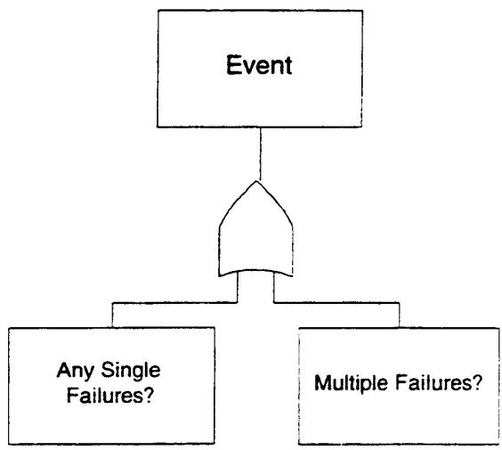  
FIGURE D3 - Upper Tier of Fault Tree Based on Initial Questions

# D.9.2 (Continued):

If there are not any single failures but there are multiple failure combinations, then the fault tree's first tier might be drawn like Figure D4.

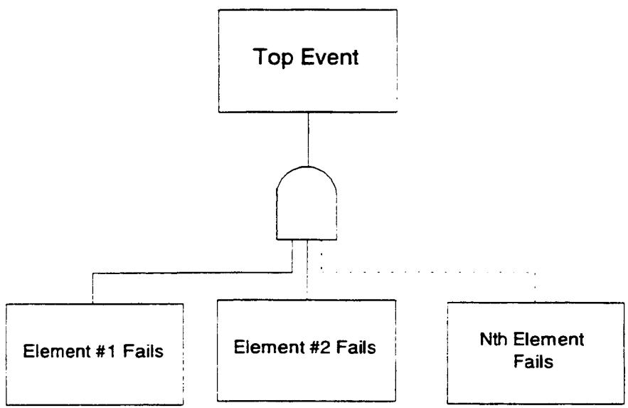  
FIGURE D4 - Upper Tier of Fault Tree without Single Thread in the System

# SAE ARP4761

# D.9.2 (Continued):

Multiple failure combinations may be dependent on a specific order in which they fail. These events are then defined as failure order dependent events (also known as sequential events). Failure order dependent events should be drawn as inputs into an AND-gate from left to right in the order in which they must fail. If, in the above figure, the first and second elements of the system must fail prior to the Nth element in order for the EVENT to occur, then the AND-gate may include another Undeveloped Event input which represents the probability that the "n" elements will fail in that order. Another way to represent failure order events dependent events is to use a PRIORITY AND-gate along with a Conditional Event. For details see also D.11.1.4.

For example, assume the above system has three elements. The fault tree's first tier would be drawn as in Figure D5.

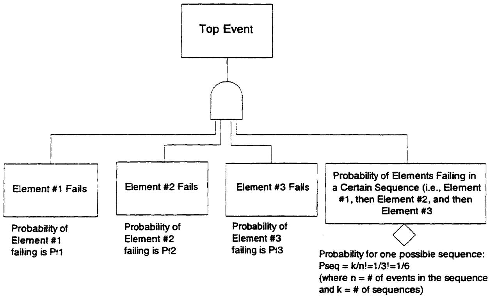  
FIGURE D5 - Upper Tier of Fault Tree Considering Failure Sequence

# SAE ARP4761

# D.9.2 (Continued):

The n! (factorial) term represents the number of event sequences which could occur. For this example, the possible event sequences are  $P_f1P_f2P_f3$ ,  $P_f1P_f3P_f2$ ,  $P_f2P_f3P_f1$ ,  $P_f2P_f1P_f3$ ,  $P_f3P_f1P_f2$ , and  $P_f3P_f2P_f1$ .

Next, the analyst will expand the tree by working "top-down" while considering the above questions for the event or failure effect, as it is also referred to, at each new level. When considering fail-safe events based on multiple failures, the analyst should consider contributions from incorrect outputs and inoperative protective or reconfiguration mechanisms as shown in Figure D6.

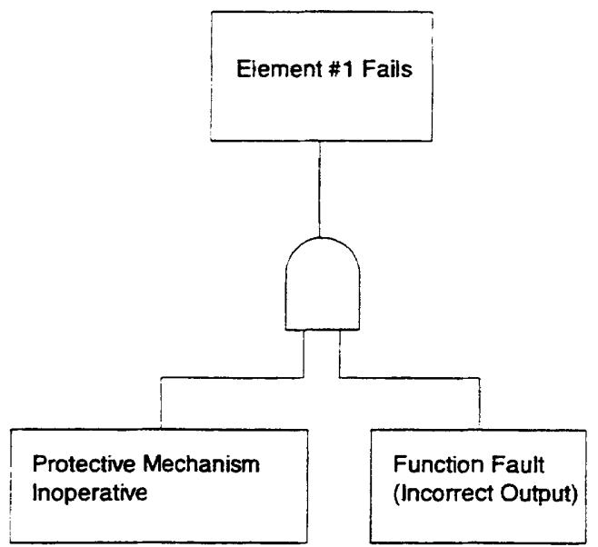  
FIGURE D6 - Expanding a Fault Tree Event with Respect to Fail-Safe System Elements

Throughout the fault tree construction effort, the analyst must make sure that a pre-defined naming convention is followed so everyone working on a given system creates the fault trees in the same manner. When selecting a naming convention, the analyst should keep in mind three things.

a. The naming convention must prevent conflicts between events; i.e., no two different events can have the same name and identical events must have the same name. This is crucial for proper Boolean Algebra reduction.  
b. The naming convention should not be too cryptic or someone looking at the tree will have to constantly refer to some sort of table in order to decipher the name.

# SAE ARP4761

# D.9.2 (Continued):

c. The naming convention must be maintainable; i.e., set up the naming convention with ample growth potential so that you do not have to go back and re-name all events because your convention does not allow you to add several new events at a later date.

If a software FTA package is used to construct the trees, this pre-defined naming convention must be compatible with the software package. Some software packages require gates to be named in order to identify the intermediate events which are outputs of logic gates.

D.9.3 Extend the Top Event Branches Down to the Primary Events:

This section addresses the third fault tree construction step.

3. Develop each fault event down through successively more detailed levels of the system design until root causes are established or until further development is deemed unnecessary.

The analyst should further develop and complete the fault tree by extending the fault tree branches down to the Primary Events (i.e., Basic Events, External Events, and Undeveloped Events). These Primary Events are the root causes of the first level fault events.

The root cause will be hardware failure/error or software error broken down to a level of detail necessary to demonstrate system design compliance with safety objectives. Here is where the goal of the FTA becomes apparent with its impact on the FTA scope. If the FTA goal is a qualitative evaluation, gathering further information on the Primary Event is not necessary (unless the analyst determines that a further detailed qualitative analysis is required). If the FTA goal is a quantitative evaluation, the analyst should gather more detailed information on the Primary Event (hardware failure rates and "at-risk" or exposure times).

In this appendix, four particular examples are developed to show typical fault tree representations which include basic events with or without latency and required order factors. The detailed mathematical calculations are further explained in D.11.1.5.

D.9.3.1 Example When Two Item Failures Cause a Loss of a Function: The first example fault tree shown in Figure D7 shows the simple failure case where the top event is caused by the loss of both items during the same flight. Both items are known to be operating at the start of the flight and neither fail latent. The two failures can occur in either order.

# SAE ARP4761

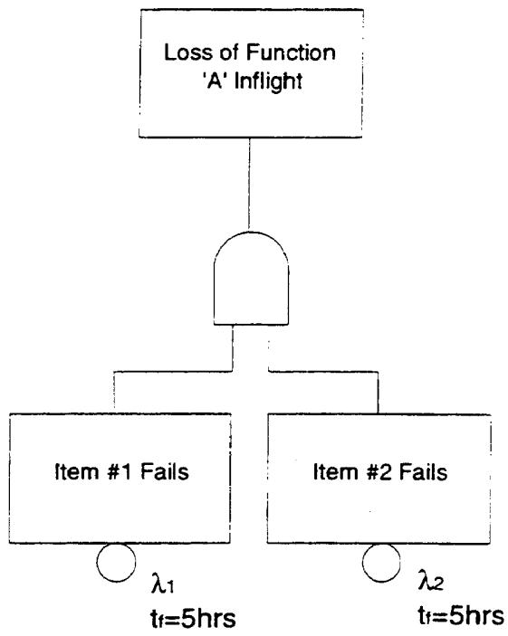  
FIGURE D7 - Example of a Fault Tree Structure When Two Item Failures Cause a Loss of a Function

D.9.3.2 Example When Two Item Failures Cause a Loss of a Function Where an Item Could Fail Latent: In the second example, Item 1 can fail at any point between when it is checked (time = zero) and when it is next checked (time = T). Item 2 is known to be operating at the start of each flight and never fails latent. The order of failure does not matter. An example fault tree is shown in Figure D8.

# SAE ARP4761

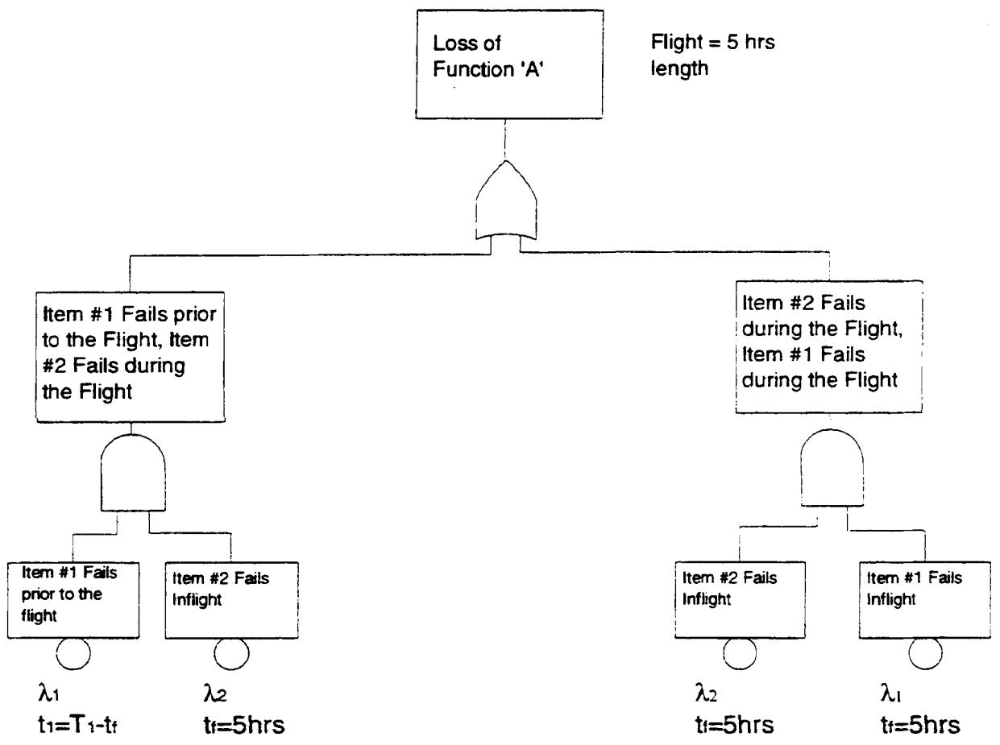  
FIGURE D8 - Example of a Fault Tree Structure When Two Item Failures Cause a Loss of a Function Where an Item Could Fail Latent

D.9.3.3 Example When Two Item Failures Cause a Loss of a Function Where each Item Could Fail Latent: In the third example, either item could fail latent, but if both fail, this would be detected by virtue of it causing the top event. Therefore, at least one of the items must be operating at the start of each flight. An example fault tree is shown in Figure D9. Three things should be noted about this figure.

1. An undeveloped event for failure order (i.e.,  $\text{ROF} = k/n!$  as shown in Figure D5 and further described in D.11.1.4) is not required because failure order dependence is built into the tree structure via the latency period  $(t_n = T_n - t_f)$ . This is representative of a failure during the latency period before the flight.  
2. The right-most AND-gate is necessary to cover the case that both items fail during the flight without a required sequence.

# SAE ARP4761

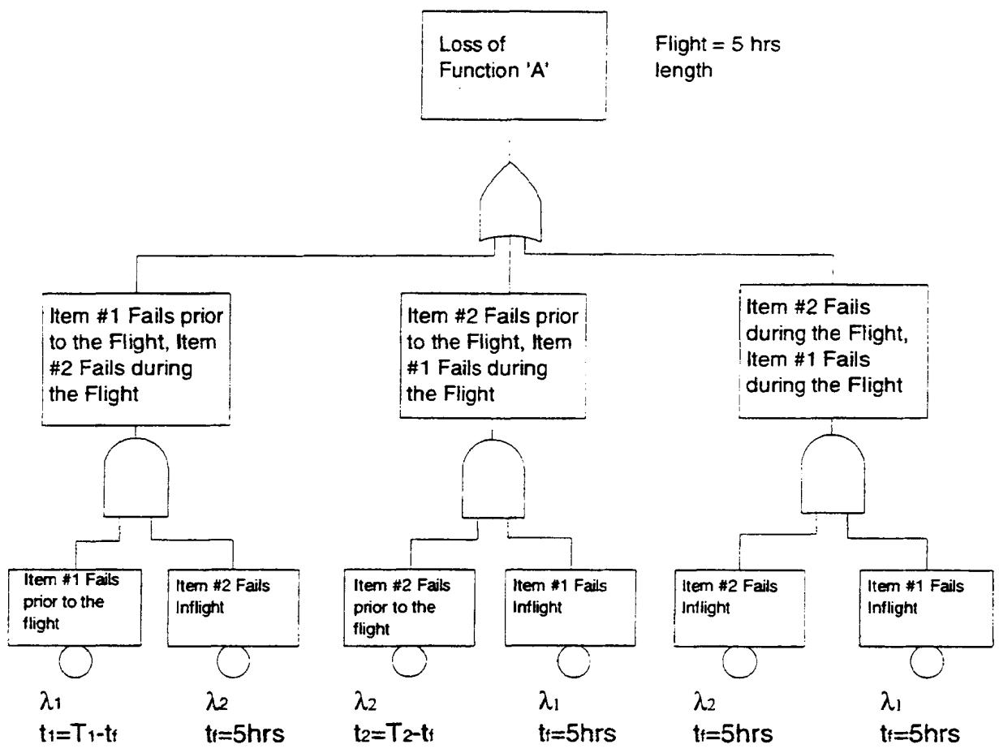  
FIGURE D9 - Example of a Fault Tree Structure When Two Item Failures Cause a Loss of a Function Where each Item Could Fail Latent

# D.9.3.3 (Continued):

3. The right-most AND-gate is often omitted and the exposure times set equal to the inspection intervals, for cases where  $t_f$  is much less than the inspection intervals.

D.9.3.4 Example When Two Item Failures Cause a Top Event and One Item Could Fail Latent and Failures are Order Dependent: In the fourth example, item one (the latent one) must fail prior to item two or the top event does not result. Item two is known to be operational at the start of the flight. This is typical of a failure/monitor situation where the top event is an erroneous output rather than a loss of function. An example involving the transmission of incorrect data is provided in Figure D10.

The required order factor (ROF) is used per D.11.1.4.

# SAE ARP4761

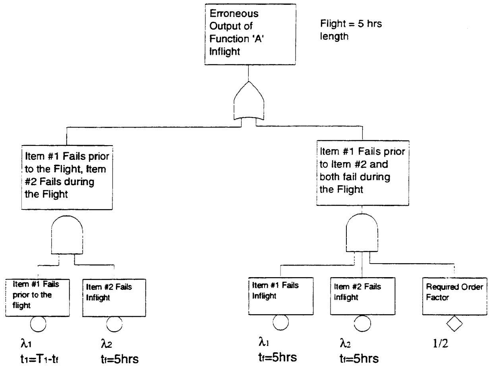  
FIGURE D10 - Example of a Fault Tree Structure When Two Item Failures Cause a Top Event and One Item can Fail Latent and Failures are Order Dependent

D.9.4 Evaluate the Fault Tree for Compliance with Safety Objectives:

This section addresses the fourth fault tree construction step.

4. Evaluate the fault tree in either a qualitative or quantitative manner.

Fault trees are qualitative models by nature of their construction. Depending on the goal of the FTA, the analyst will evaluate the fault tree in a qualitative or qualitative and quantitative fashion (when the fault tree contains hardware failures and development errors (hardware and software), the analyst's quantitative evaluation will actually be a combination of the two methods). Table D4 summarizes the results of the two evaluation methods. The analyst should find this table useful when determining the FTA goal. Qualitative evaluation and quantitative evaluation are further described in Section D.10 and D.11 respectively.

# SAE ARP4761

TABLE D4 - Summary of Qualitative Versus Quantitative FTA Evaluation Techniques and Results  

<table><tr><td>Qualitative</td><td>Quantitative</td></tr><tr><td>MINIMAL CUT SETS</td><td>NUMERIC PROBABILITIES</td></tr><tr><td>Combination of component failures causing system failure</td><td>Probabilities of system and cut set failures</td></tr><tr><td>QUALITATIVE IMPORTANCE</td><td>QUANTITATIVE IMPORTANCE</td></tr><tr><td>Qualitative ranking of contributions to system failures, direct cause vs. contributory via fail-safe</td><td>Quantitative ranking of contributions to system failure</td></tr><tr><td>COMMON CAUSE POTENTIALS</td><td>SENSITIVITY EVALUATIONS</td></tr><tr><td>Minimal cut sets potentially susceptible to a single failure cause</td><td>Effects of changes in models and data, errors determinations</td></tr></table>

# D.10 QUALITATIVE FAULT TREE EVALUATION:

The qualitative fault tree evaluation produces minimal cut sets. These can be used to determine the qualitative importance and to evaluate common-cause potentials.

The following sections provide only the minimal amount of information needed to understand the subject manner. For a more detailed and complete explanation of these techniques, refer to "Fault Tree Handbook" (NUREG-0492) or one of many similar books on the subject of fault tree evaluation.

# D.10.1 Fault Tree Minimal Cut Set Determination:

A fault tree minimal cut set is a smallest set of Primary Events which must all occur in order for the undesired top level event to occur.

The analyst must be aware of the potential lack of independence between two or more Primary Events in order to avoid serious errors in qualitative and quantitative analysis. This lack of independence can occur whenever the same event appears in more than one location in the fault tree or when certain single failures can result in more than one failure event simultaneously. When dependence is known, it is modeled by the same event (or gate) appearing at more than one place in the fault tree and is handled correctly by the application of Boolean algebra to generate the cut sets. Care should be taken when in a high level tree (where the primary events are derived as top level events from separate fault tree analyses), an event can appear in more than one of those separate fault trees. If this happens, the dependence will not be visible in the high level tree and the probability calculation for the high level tree will be incorrect. To obtain accurate calculations in this case, it is necessary to replace the derived primary events with their corresponding detailed fault tree structure. This allows the common events to be correctly modeled throughout the high level fault tree so that accurate cut set listings and probability calculations can be obtained.

# SAE ARP4761

# D.10.1 (Continued):

The analyst may use "direct analysis" on the fault tree when the various Primary Events only appear once in that given tree. However, for most civil airborne systems this is not the case. The logic symbol dictates how the calculation will be performed based on the following Probability Calculus basic rules. (NUREG-0492 addresses this subject in greater detail.)

a. The probability of obtaining an outcome  $A$  is denoted by  $P(A)$ , outcome  $B$  by  $P(B)$ , and so on for other outcomes.  
b. The probability that A AND B occur is denoted by  $\mathrm{P}(\mathrm{AB})$ .  
c. The probability that A OR B occurs is denoted by  $\mathrm{P(A + B)}$ .  
d. If A and B are two independent events with the probabilities P(A) and P(B), then the probability that both events will occur is the product:

$\mathsf{P}(\mathsf{AB}) = \mathsf{P}(\mathsf{A})^*\mathsf{P}(\mathsf{B})$  -- applies to two input AND-gates.

e. If A, B, and C are three independent events with the probabilities P(A), P(B), and P(C), then the probability that all three events will occur is the product:

$\mathsf{P}(\mathsf{ABC}) = \mathsf{P}(\mathsf{A})^{*}\mathsf{P}(\mathsf{B})^{*}\mathsf{P}(\mathsf{C})$  -- applies to three input AND-gates

f. The same logic can be carried to four or more independent events.  
g. If the two independent events can occur simultaneously, the probability that either A OR B or both A AND B will occur is:

$\mathsf{P}(\mathsf{A} + \mathsf{B}) = \mathsf{P}(\mathsf{A}) + \mathsf{P}(\mathsf{B}) - [\mathsf{P}(\mathsf{A})^{\star}\mathsf{P}(\mathsf{B})]$  -- applies to two input OR-gates.

h. If the three independent events can occur simultaneously, the probability that A OR B OR C, or any combination of these three will occur is:

$$
P (A + B + C) = P (A) + P (B) + P (C) - [ P (A) ^ {*} P (B) ] - [ P (A) ^ {*} P (C) ] -
$$

$\left[\mathrm{P}(\mathrm{B})^{*}\mathrm{P}(\mathrm{C})\right] + \left[\mathrm{P}(\mathrm{A})^{*}\mathrm{P}(\mathrm{B})^{*}\mathrm{P}(\mathrm{C})\right]$  -- applies to three input OR-gates.

The same logic can be carried to four or more independent events.

# SAE ARP4761

# D.10.1 (Continued):

i. If the two events are mutually exclusive so that when one occurs the other cannot occur, the equation for a two input OR-gate simplifies to:

$$
\mathrm {P} (\mathrm {A} + \mathrm {B}) = \mathrm {P} (\mathrm {A}) + \mathrm {P} (\mathrm {B})
$$

$$
\text {F u r t h e r m o r e ,} \mathrm {P} (\mathrm {A B}) = 0
$$

This equation is also good approximation for two non-mutually exclusive events with low probabilities (errs on the conservative side).

For a "direct analysis" example, consider the tree in Figure D11.

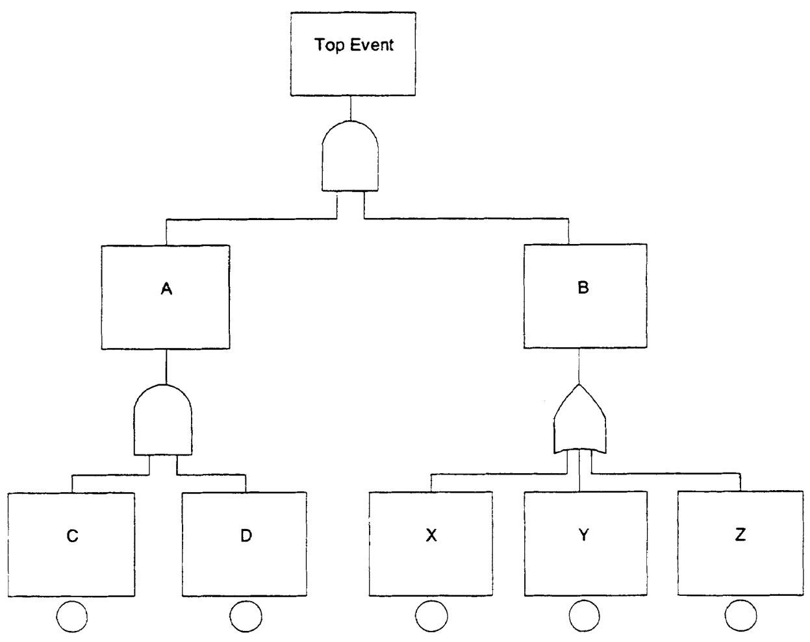  
FIGURE D11 - Tree to Demonstrate Direct Analysis Techniques

# SAE ARP4761

# D.10.1 (Continued):

From Figure D11:

$\mathsf{P}(\mathsf{A}) = \mathsf{P}(\mathsf{C})^{*}\mathsf{P}(\mathsf{D})$  [C and D are independent events]

$\mathsf{P}(\mathsf{B}) = \mathsf{P}(\mathsf{X}) + \mathsf{P}(\mathsf{Y}) + \mathsf{P}(\mathsf{Z})$  [X,Y, and Z are mutually exclusive events]

$\mathsf{P(top)} + \mathsf{P(A)}^{*}\mathsf{P(B)} = [\mathsf{P(C)}^{*}\mathsf{P(D)}]^{*}[\mathsf{P(X)} + \mathsf{P(Y)} + \mathsf{P(Z)}]$

The analyst must perform Boolean Analysis on the tree structure if Primary Events occur more than once in that given tree. Based on the location of these identical Primary Events within the tree, "direct analysis" without first reducing the tree via Boolean Analysis will lead to an undesired top level event probability which is either greater than or less than the event's true probability.

As an example of fault tree reduction via Boolean Analysis, consider the tree structure in Figure D12.

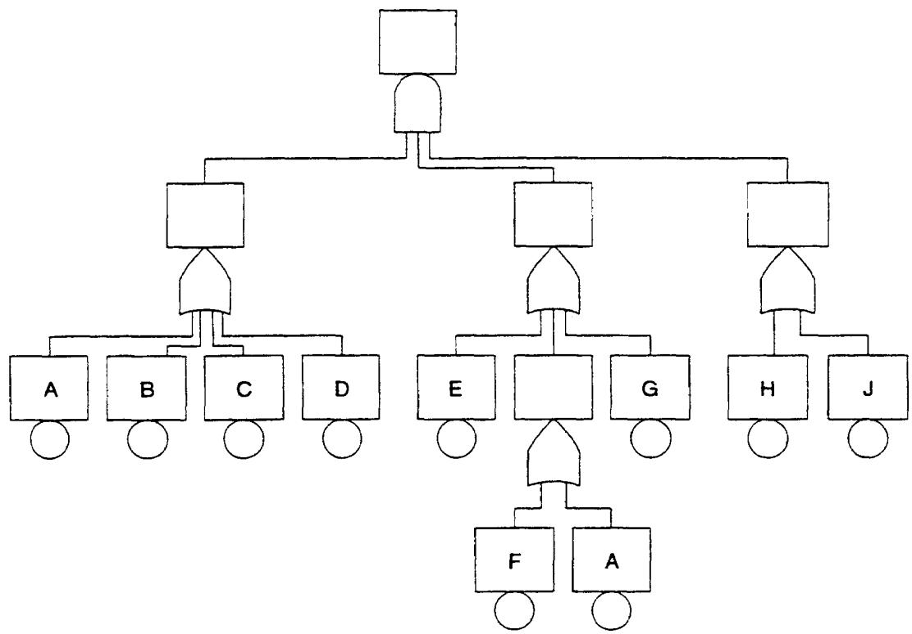  
FIGURE D12 - Tree to Demonstrate Boolean Reduction Techniques

# SAE ARP4761

# D.10.1 (Continued):

The Boolean reduction follows the following steps.

a. Use "direct analysis" to determine the apparent "top". The term apparent is used because event A is located in two branches of the fault tree.

$$
\operatorname {t o p} = (\mathrm {A} + \mathrm {B} + \mathrm {C} + \mathrm {D}) ^ {*} (\mathrm {E} + \mathrm {F} + \mathrm {A} + \mathrm {G}) ^ {*} (\mathrm {H} + \mathrm {J})
$$

b. Multiple out the above equation in order to get terms separated by “+” signs.

$$
\begin{array}{l} \text {t o p} = \text {A E H} + \text {A F H} + \text {A A H} + \text {A G H} + \text {B E H} + \text {B F H} + \text {A B H} + \text {B G H} + \text {C E H} + \text {C F H} + \text {A C H} + \text {C G H} \\ + \text {D E H} + \text {D F H} + \text {A D H} + \text {D G H} + \text {A E J} + \text {A F J} + \text {A A J} + \text {A G J} + \text {B E J} + \text {B F J} + \text {A B J} + \text {B G J} + \text {C E J} + \\ \text {C F J} + \text {A C J} + \text {C G J} + \text {D E J} + \text {D F J} + \text {A D J} + \text {D G J} \end{array}
$$

c. Apply the following Boolean Logic rules to the expanded FTA equation:

(1)  $A + A = A$ , (2)  $A^* A = A$ , (3)  $A + AK = A$ , (4)  $AAK + AK$

By applying the above logic, the fault tree minimal cut set is determined by reducing the number of elements in a term and reducing the number of total terms. Applying Boolean Logic to the equation from Step 2:

$$
\begin{array}{l} \text {t o p} = A E H + A F H + A A H + A G H + B E H + B F H + A B H + B G H + C E H + C F H + A G H + C G H \\ + D E H + D F H + A D H + D G H + A E J + A F J + A A J + A G J + B E J + B F J + A B J + B G J + C E J + \\ C F J + A G J + C G J + D E J + D F J + A D J + D G J \end{array}
$$

Rewriting this equation results in the fault tree minimal cut set. Notice that twelve terms were eliminated and two terms went from 3 to 2 elements within the term.

$$
\begin{array}{l} \text {t o p} = A H + B E H + B F H + B G H + C E H + C F H + C G H + D E H + D F H + D G H + A J + B E J + \\ B F J + B G J + C E J + C F J + C G J + D E J + D F J + D G J \end{array}
$$

d. Draw the reduced fault tree by first combining terms within the minimal cut set equation (optional step). The reduced fault tree is shown in Figure D13.

$$
\operatorname {t o p} = (\mathrm {J} + \mathrm {H}) ^ {*} [ \mathrm {A} + (\mathrm {E} + \mathrm {F} + \mathrm {G}) ^ {*} (\mathrm {B} + \mathrm {C} + \mathrm {D}) ]
$$

# SAE ARP4761

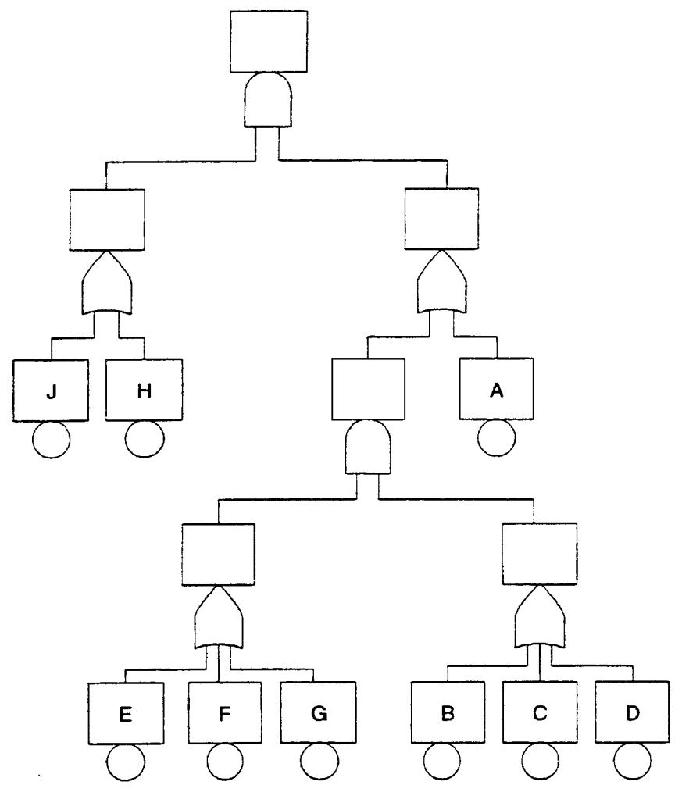  
FIGURE D13 - Reduced Fault Tree

# D.10.1 (Continued):

Many commercially available fault tree analysis software packages will generate the cut sets automatically when given the proper commands. Once the reduced tree is drawn, the analyst must verify that all AND-gates indicate a true combination of independent events. This step is very important before performing the FTA numerical calculations.

# SAE ARP4761

# D.10.2 Qualitative Importance Determination:

In order to get some idea of how the various cut sets impact the undesired top level event, the analyst can evaluate the fault tree using a method known as Qualitative Importance. Qualitative Importance is simply ranking the cut sets in ascending order based on the number of Primary Events in the cut set. This method allows the analyst to see the various Primary Events relative importance with respect to top level event occurrence based on how many times the Primary Event appears in the cut sets and in what combination with other Primary Events. This FTA evaluation technique works well with hardware failure/development error, software development error, and a combination of the two in the same tree.

Assume that the analyst wants to evaluate a fault tree via qualitative importance. First, the cut set is ranked as described above. This ranking gives the analyst knowledge of whether the top level event has any associated single point failures and how often any one Primary Event helps cause the top event to occur.

Furthermore, by assuming a standard failure rate value (e.g., 1E-06) and a standard exposure time (e.g., 100 hours) for all hardware component related Basic Events, the analyst can get a gross estimate of a cut set's relative importance. For example, using the values provided in the previous sentence, a cut set with two Basic Events has a probability of failure  $(\mathsf{P_f})$  of 1E-08, a cut set of three Basic Events has a  $\mathsf{P_f}$  of 1E-12. Using this gross estimating technique, the analyst can quickly conclude that cut sets with five or more Basic Events have very little relative impact on the top level event probability of failure.

The drawbacks associated with this evaluation method are as follows.

a. If the analyst has hardware related Basic Event at indenture levels higher than the component level, an additional reliability analysis should be performed in order to get a respectable failure rate number for the  $\mathsf{P_f}$  estimate.  
b. Basic Event exposure times can vary greatly from one Basic Event to another because of such factors as monitor cycle times, monitor exposure times, maintenance intervals, etc. Consequently, the estimated failure probabilities used to weigh relative importance of one cut set to another are no better than gross estimates. Exposure time variations can mean two or three orders of magnitude difference between the estimated failure probabilities and quantitatively obtained failure probabilities.

# D.10.3 Common Cause Vulnerability:

Fault trees can also be qualitatively evaluated using a method known as Common Cause Susceptibility resulting in a list of Common Cause Potentials. Common Cause Susceptibility is based on the fact that cut sets provide a finite listing of Primary Event combinations which will cause the top level event to occur. The analyst can get an idea of how susceptible the top level event is to common cause failures by examining each cut set. A single failure must cause more than one Primary Event in the cut set to occur in order to be classified as a common cause failure. Therefore, a cut set having similar Primary Events is more likely to be susceptible to common cause failures than a cut set having dissimilar Primary Events.

# SAE ARP4761

# D.10.3 (Continued):

For example, suppose cut set #1 has three Primary Events, all of which are the same CPU part number in a triple similar redundancy configuration system. Suppose cut set #2 also has three Primary Events, all of which are different CPU part numbers in triple dissimilar redundancy configuration system. By examining these two cut sets, the analyst can readily determine that cut set #1 has a higher potential for a common cause fault like a generic microcode error, than cut set #2.

Each potential for a common cause failure should be examined to determine if a single cause really exists which will cause these failure combinations to occur and cause the listed event. These common-cause faults are analyzed for their likelihood and should be placed in the fault tree only if they cannot be designed out of the system.

Common cause analysis should address common cause faults and generic errors. Appendices I, J, and K contain detailed information on performing common cause analyses.

# D.10.4 Hardware and Software Development Assurance Level Determination:

The minimal cut sets of the fault tree can be used to assist in the determination of the appropriate Development Assurance Levels for hardware and/or software as part of the PSSA.

The principles described in ARP4754 should be used if system architecture is to be considered when determining the Development Assurance Level of hardware and/or software, to assign a level which is different from that associated with the failure condition category of the top event.

When hardware and/or software items are associated with more than one top event in a safety analysis, the Development Assurance Level should be the highest which results from the review of each fault tree. An example of a fault tree which includes the consideration of hardware and software errors is provided in Section D.12.

# D.11 QUANTITATIVE FAULT TREE EVALUATION:

Quantitative fault tree evaluation techniques produce three types of results: (1) numerical probabilities, (2) quantitative importance, and (3) sensitivity evaluations. All three results can be obtained from minimal cut sets as described in Section D.10. Other methods exist which may be more efficient for some fault trees. The following sections provide only the minimal amount of information needed to understand the subject matter and have been restricted to elementary examples which are based on the assumption of constant failure rates and small  $\lambda t$ . For a more detailed and complete explanation of these techniques, refer to "Fault Tree Handbook" (NUREG-0492) or one of many similar books on the subject of fault tree evaluation.

The methods of fault tree quantification other than those described in this section, which can be shown to be logically and mathematically correct, may be used at the discretion of the analyst.

# SAE ARP4761

# D.11.1 Numerical Probability Calculations:

The quantitative evaluation technique for determining a fault tree level event probability of failure  $(P_f)$  using cut sets has five major steps.

1. Determine the fault tree minimal cut sets.  
2. Determine the failure rates of the Basic Events.  
3. Determine the exposure times and "at risk" times of the Basic Events.  
4. Establish any relevant Required Order Factors.  
5. Perform the FTA numerical calculations.

These five steps are described further in the subsequent subsections. Note that the analyst cannot perform quantitative analysis on minimal cut sets containing development errors. Fault trees containing development errors should be evaluated using a qualitative evaluation method described in Section D.10. Fault trees containing both hardware failures and hardware and software development error primary events require the analyst to only perform quantitative analysis on the hardware failure related primary events. Section D.12 describes incorporation of the development errors into the fault trees in greater detail.

D.11.1.1 Determine the Fault Tree Minimal Cut Sets: The process of determining minimal cut sets for quantitative FTA evaluation is exactly the same as the process used for qualitative evaluation. Refer to D.10.1.  
D.11.1.2 Determine the Failure Rates of the Basic Events: A failure rate for each hardware related Basic Event in the fault tree should be determined. Failure rates should be determined whenever possible from failure rate date of similar equipment already in field use. Other industry wide sources of failure rates and/or mode distributions include MIL-HDBK-217, MIL-HDBK-338, MIL-HDBK-978, Rome Laboratory's "Reliability Engineer's Toolkit", Reliability Analysis Center (RAC) "Nonelectronic Parts Reliability Data" (NPRD) GIDEP (Government Industry Data Exchange Program) and RAC "Failure Mode/Mechanism Distribution" (FMD). While these documents provide a basis for failure rate prediction of some component types, there will be many device types that are not included in these documents. This is especially true for complex digital integrated circuits (ICs) which need to be considered in a part by part basis. Determining the failure modes of digital devices generally require engineering judgment and it is unlikely that all of the failure modes can be determined for a complex digital IC.

When performing an FTA as part of an SSA, the failure rates for the Basic Events may be obtained from the applicable FMEA/FMES if available. Reference to FMES may be explicitly made in each Basic Event for traceability purposes.

# SAE ARP4761

D.11.1.3 Determine the Exposure Times and At Risk Times of the Basic Events: The analyst must determine the Exposure Time or At Risk Time associated with each Basic Event in the fault tree. Some of the different types of basic events are listed below.

a. Basic Event associated with loss or malfunction of a function of an item which is used throughout the entire flight.  
b. Basic Events associated with loss or malfunction of a function of an item only during particular phases of the flight.  
c. Basic Events associated with latent failure of an item that performs a function  
d. Basic Events associated with loss or malfunction of a protective element (e.g., fault monitors)

The paragraphs that follow describe how to determine the exposure times associated with each of these types of events.

D.11.1.3.1 Loss or Malfunction of a Function of an Item Used Throughout the Entire Flight: In this case, the item being analyzed is used throughout the entire flight. When the item fails or malfunctions, it results in the undesired failure effect. The At Risk Time for this case is equal to the estimated average flight duration.  
D.11.1.3.2 Loss or Malfunction of a Function of an Item Used Only During a Particular Phase of a Flight: There are two main subcases associated with the loss or malfunction of an item which is used only during particular phases of flight. In the first subcase, the At Risk Time is equal to the time elapsed from the beginning of the flight to the end of the phase in question. For example, assume the event in question is "Gear Down" and the equipment item used to lower the gear is known to be operating properly via on-ground test. The At Risk Time for the equipment required to lower the landing gear is the time period from the ground test to the end of the "Gear Down" phase of the flight.

In the second subcase, the item is known to be working just prior to using it and is again only used during a particular phase of the flight. For this subcase, the At Risk Time, is equal to the time elapsed from the function checkout to the end of the phase in question. For example, assume the event in question is "Autoland" and the equipment item used to automatically land the plane is known to be operating properly via an initiated test run at mode engagement. The At Risk Time for this scenario is the time period from the initiated test to when the aircraft touches the ground.

# SAE ARP4761

D.11.1.3.3 Latent Failures: Latent failures disable protective mechanisms or reduce safety margins thereby increasing the risk of hazards due to subsequent conditions or failures. Latent failures, by themselves, do not constitute a hazard (i.e., by themselves they have no effect which would make them noticeable, otherwise they would not be latent, by definition). Usually latent failures affect only functions which are not relied upon in normal operation, but which provide fail-safe coverage and/or protection against abnormal conditions.

Latent failures can persist for a time interval which is either greater than or shorter than the flight time. This time interval is known as exposure time and is defined as the time between when an item was last known to be operating properly and when it will be known to be operating properly again. Proper operation may be verified during acceptance tests, maintenance checks, monitor cycle times, power-up tests, etc. The key to latent failure management is to detect and repair the applicable failed state quickly in order to reduce the exposure time.

In the case where a function is being monitored, the exposure time of the function is linked to the monitor exposure time.

D.11.1.3.4 Failure Detection Coverage and Exposure Times: Failure detection may be accomplished through dedicated hardware circuitry, software code, or various test methods. For the purposes of this section, these failure detection methods are referred to as monitors.

There are two subtle assumptions typically made when monitors are included in fault trees. They are:

a. The monitor provides  $100\%$  failure detection coverage of the item performing the function, and  
b. The monitor verification ("scrub") operation verifies that the monitor is fully operational (i.e., the "scrub" operation provides  $100\%$  coverage of the monitor).

Unfortunately, real life monitors may not provide  $100\%$  coverage. The analyst should consider fine tuning the FTA to account for imperfect coverage.

Figure D14 models a system where a monitor detects only  $90\%$  of Function "X" circuitry failures whenever the monitor is exercised. In this fault tree,  $100\%$  verification of monitor operation is achieved. The remaining  $10\%$  of Function "X" circuitry failures are not detected until a return to service test is performed on the item. This simplified tree provides a conservative result because the left branch of the tree does not consider required failure order between monitor and function failures in the same flight.

Figure D15 models the above system when it is only possible to achieve  $95\%$  verification of monitor operation.

# SAE ARP4761

FIGURE D14 - An Example of a Fault Tree Structure When the Monitor Detects  $90\%$  of Function 'X' Failures  
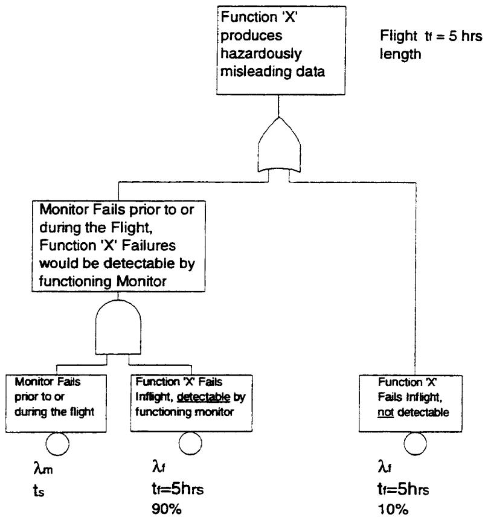  
ts= Monitor 'scrub' (verification) time  
$\mathrm{Pr} = 0.9\lambda \mathrm{m}\lambda \mathrm{r}\mathrm{st}\mathrm{t} + 0.1\lambda \mathrm{r}\mathrm{t}$

# SAE ARP4761

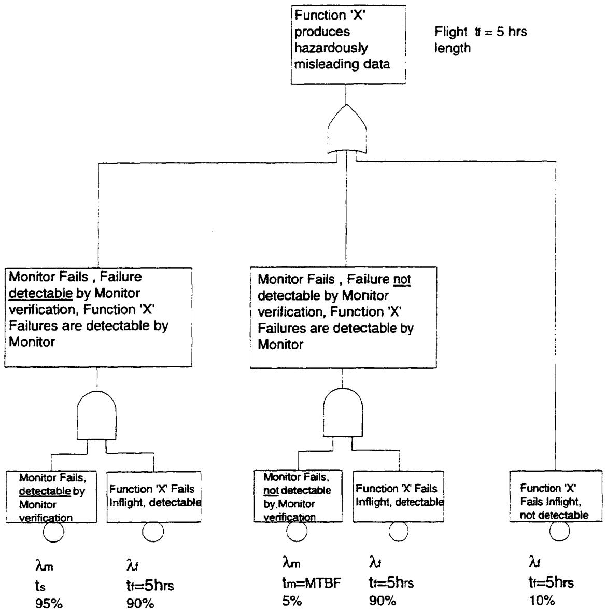  
FIGURE D15 - An Example of a Fault Tree Structure When the Monitor Detects  $90\%$  of Function 'X' Failures and the Monitor Verification is  $95\%$

$$
\begin{array}{l} t s = \text {M o n i t o r} ^ {\prime} \text {s c r u b} ^ {\prime} (\text {v e r i f i c a t i o n}) \\ P _ {f} \text {f l i g h t} = 0. 9 \cdot 0. 9 5 \lambda m \lambda f t s t + 0. 9 \cdot 0. 0 5 \lambda m \lambda f t m t + 0. 1 \lambda f t \\ P _ {f h o u r} = P _ {f f l i g h t} / t \\ \end{array}
$$

# SAE ARP4761

# D.11.1.3.4 (Continued):

Many methods of failure detection may be required to effectively verify proper operation of a function, test, or monitor. Each of these detection layers may have different exposure times and must be accounted for accordingly. Some of the more common detection methods include the following.

a. Real time self test  
b. Power up self test  
c. Preflight self test  
d. Scheduled maintenance testing  
e. Initial production test  
f. Return to service test

D.11.1.4 Establish any Relevant Required Order Factors: An AND-gate in a fault tree implies no specific order of the faults present. In some cases, this may be unrealistic. An example is a failure combination where a monitor is used to detect failures of functional circuitry that can cause the top level event. If the monitor fails first, the failure may remain latent until the monitor is next checked. If the function X circuitry fails first, the top level event does not occur because the monitor annunciates the failure.

When dealing with failure order dependent events, a factor may be incorporated into the fault tree to make the calculated probabilities less conservative. This factor is known as the Required Order Factor (ROF) or the Sequencing Factor. For small  $\lambda t$  the probability of the two events occurring in either order (given that they both fail) is approximately 1/2 of the total probability and therefore the ROF for each order is 1/2. In general, if there are  $n$  events in an AND-gate there are  $n!$  possible orders in which they could fail. If only  $k$  of those possible orders lead to the top event, then  $\mathrm{ROF} = k / n!$ . This approximation is only valid for events with the same exposure time or events with different exposure times where  $(\lambda_1 + \lambda_2)\mathrm{T}_{(\mathrm{Max})}$  is less than 0.2. For all other cases, ROF should be calculated. An example using ROF is shown in Figure D10.

When a fault tree contains multiple ROFs, it is more accurate to apply the ROF to the minimal cut sets when performing probability calculations. An example is shown in Figure D16.

The ROF can only be applied when all inputs to the AND-gate have the same exposure time.

# SAE ARP4761

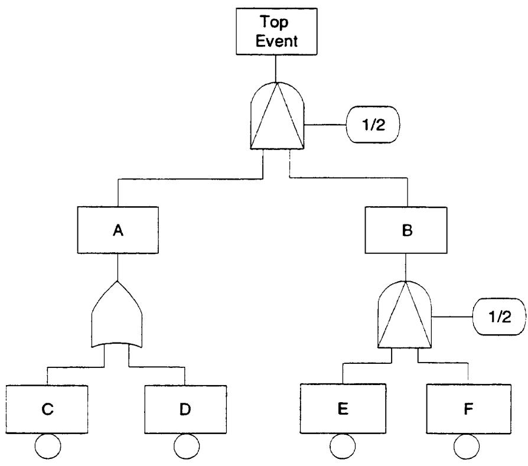  
FIGURE D16 - An Example of a Fault Tree Structure Which Includes PRIORITY AND-Gates and ROF

# D.11.1.4 (Continued):

From Figure D16, a minimal cut set would be  $1/2(P_{f}C^{*}1/2^{*}P_{f}E^{*}P_{f}F) = 1/4^{*}P_{f}C^{*}P_{f}E^{*}P_{f}F$ . This answer is incorrect as described in the next paragraph.

a. The analyst should generate the same cut set from Figure D16 ignoring the ROFs (i.e.,  $P_{f}C^{*}P_{f}E^{*}P_{f}F$ ). Next it is necessary to calculate  $k/n!$  by considering how many of the possible combinations would satisfy the required orders. There are 3! (i.e., six) possible orders which are CEF, CFE, ECF, EFC, FCE and FEC. The order CEF clearly satisfies the required order and ECF may also satisfy it. More knowledge of the actual system is required to establish this. Therefore,  $k$  could equal 1 or 2 and  $k/n!$  may equal 1/6 or 1/3. The complete and most correct mathematical solution for the probability of this cutset is therefore either  $1/6 P_{f}C^{*}P_{f}E^{*}P_{f}F$  or  $1/3 P_{f}C^{*}P_{f}E^{*}P_{f}F$ . This illustrates that using the ROFs in the cutset analysis can be incorrect and can be either optimistic or pessimistic.

# SAE ARP4761

D.11.1.5 Perform the FTA Numerical Calculations: After the above steps are completed, the probability of failure for the top level event  $\left[\mathsf{P}_{\mathrm{f}}(\mathsf{top})\right]$  is calculated by performing the Boolean Algebra mathematics. The methods used for combining probabilities in AND-gates and OR-gates are described in 10.1.

When dealing with constant failure rates (i.e., the equipment is operating in the flat portions of the Reliability Bathtub Curve), the Basic Event Probability of Success (also referred to as Basic Event Reliability) is given by the following equation:

$$
P _ {s} = R = e ^ {- \lambda t} \tag {Eq. D1}
$$

where:

$P_{s} =$  Probability of Success

R = Reliability

e = natural logarithm base

$\lambda =$  Base Event failure rate

t = Base Event Exposure or "At Risk" Time

In reliability terms, we know component survival and component failure are complementary and mutually exclusive. Consequently, for any given time period:

$$
P _ {s} + P _ {f} = R + Q = 1 \tag {Eq. D2}
$$

or

$$
P _ {f} = Q = 1 - e ^ {- \lambda t} \tag {Eq. D3}
$$

where:

$\mathrm{P_f} =$  Probability of Failure

Q = Unreliability

When  $\lambda t\leq 0.1$  , Equation D3 can be simplified to  $P_{f} = Q = \lambda t$

The FTA numerical calculations should be performed using  $\mathsf{P_f}$  because the electronic based systems of today have such high reliability (R = 0.9999....) that Q is less sensitive to round-off errors and thus produces a more accurate  $\mathsf{P_f}$  (top). In other words, FTA numerical calculations should deal with the Probability of Failure terms instead of Probability of Success terms.

# SAE ARP4761

# D.11.1.5 (Continued):

The case in which two latent failures cause system failure is approximately correct providing  $n\lambda t_f$  is small for both failure mechanisms, but is inaccurate if  $n\lambda t_f$  is large. The reason is that if both components in a dual component system fail latent, then the failure must be manifest. Therefore, there is an implicit assumption that both components have not failed at the beginning of the mission. Since this case is not included in the calculations, the result may be higher than necessary when  $n\lambda t_f$  is large (n is the number of missions between maintenance periods). A correct mathematical result can be obtained by the use of Boolean manipulation or Markov Analysis.

In D.11.1.5.1 through D.11.1.5.4, the four particular examples in D.9.3 are developed further to show typical fault tree calculations which include basic events with or without latency and required order factors. The methodology presented here shows the probability for the worst case flight as well as the average probability per flight of the top event, for double failures. Different methods could be applied to calculate the average probability per flight in cases where the problem is straightforward. Distinct formulas would need to be developed to deal with more than two failures or where some of the above described assumptions are not valid. To calculate the probability per flight hour, refer to Section D.13. A conservative analysis using the worst case flight probabilities may be submitted to show compliance without the complication of computing the average probability. Caution is required with the use of fault tree software packages which may automatically select either worst case or average probabilities.

D.11.1.5.1 Fault Tree Calculation When Two Item Failures Cause a Loss of a Function and Neither Item Failure is Latent: This is the simple failure case where the top event is caused by the loss of both items during the same flight. Both items are known to be operating at the start of the flight and neither fail latent. Since neither failure is latent, the average and worst case probabilities are identical. The two failures can occur in either order. An example is shown in Figure D17.

# SAE ARP4761

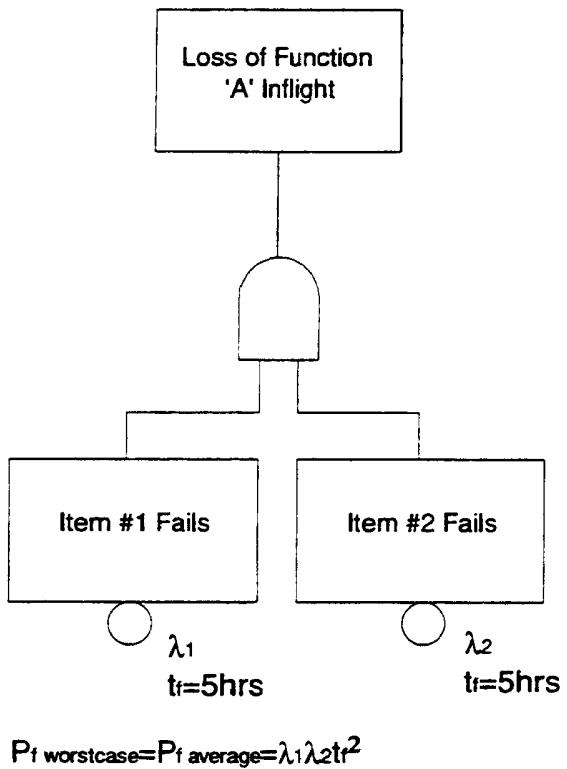  
FIGURE D17 - An Example of a Fault Tree Calculation When Two Item Failures Cause a Loss of a Function

D.11.1.5.2 Fault Tree Calculation When Two Items Cause a Loss of a Function and One of the Items Can Fail Latent but the Other Cannot Fail Latent, No Sequencing: In this case, Item 1 can fail at any point between when it is checked (time = zero) and when it is next checked (time = T). Item 2 is known to be operating at the start of each flight and never fails latent. The order of failure does not matter. In this case there is a difference between the average probability of the top event per flight and the probability of the top event for the worst case flight. Consider that there are n flights of  $t_f$  hours, i.e.,  $T = n t_f$ .

Using the approximation of  $P_f = \lambda t$  for small  $\lambda t$ , gives the following which is shown pictorially in Table D5.

a. Probability of both failures occurring in the first flight after the inspection check  $= \lambda_{1}\lambda_{2}t_{f}^{2}$ .  
b. Probability of item one failing in either of the first two flights after the inspection check and item two failing in the second flight  $= 2\lambda_{1}\lambda_{2}t_{f}^{2}$ .  
c. Probability of item one failing in any of the first i flights and item two failing in the ith flight  $= \mathrm{i}\lambda_{1}\lambda_{2}\mathrm{t}_{\mathrm{f}}^{2}.$

# SAE ARP4761

TABLE D5 - Pictorial Representation of Average Probability Calculation for a Two Failure Case - One Latent and One Active  

<table><tr><td rowspan="2">Case #</td><td rowspan="2">Current Flight</td><td>A Non-Latent Failure on Current Flight</td><td>A Non-Latent Failure on Current Flight</td><td>A Non-Latent Failure on Current Flight</td><td>A Non-Latent Failure on Current Flight</td><td>A Non-Latent Failure on Current Flight</td><td rowspan="2">Total Prob- ability for This Case</td></tr><tr><td>And a Latent Failure On 1stFlt of Latency Period</td><td>And a Latent Failure On 2ndFlt of Latency Period</td><td>And a Latent Failure On ithFlt of Latency Period</td><td>And a Latent Failure On Next to Last Flt of Latency Period</td><td>And a Latent Failure On Last Flt of Latency Period</td></tr><tr><td>1</td><td>1stFlight of Latency Period</td><td>λ1tλ2t</td><td></td><td></td><td></td><td></td><td>λ1λ2t2</td></tr><tr><td>2</td><td>2ndFlight of Latency Period</td><td>λ1tλ2t</td><td>λ1tλ2t</td><td></td><td></td><td></td><td>2λ1λ2t2</td></tr><tr><td>i.</td><td>iThFlight of Latency Period</td><td>λ1tλ2t</td><td>λ1tλ2t</td><td>λ1tλ2t</td><td></td><td></td><td>iλ1λ2t2</td></tr><tr><td>n-1</td><td>Next to Last Flight of Latency Period</td><td>λ1tλ2t</td><td>λ1tλ2t</td><td>λ1tλ2t</td><td>λ1tλ2t</td><td></td><td>(n-1)λ1λ2t2</td></tr><tr><td>n</td><td>Last Flight of Latency Period</td><td>λ1tλ2t</td><td>λ1tλ2t</td><td>λ1tλ2t</td><td>λ1tλ2t</td><td>λ1tλ2t</td><td>nλ1λ2t2</td></tr></table>

# D.11.1.5.2 (Continued):

d. Probability of item one failing in any of n flights and item two failing in the final (nth) flight  $= \mathsf{n}\lambda_1\lambda_2\mathsf{t}_{\mathrm{f}}^2$  . (This is the probability for the worst case flight.)  
e. The average probability per flight equals the sum of the probabilities for each flight, divided by  $n$ , the number of flights in the latency period.

$$
\begin{array}{l} P _ {f \text {A v e r a g e}} = 1 / n ^ {*} \sum i \lambda_ {1} \lambda_ {2} t _ {f} ^ {2} \text {f o r} i = 1 \text {t o} n \tag {Eq.D4} \\ = \left(\lambda_ {1} \lambda_ {2} t _ {\mathrm {f}} ^ {2}\right) / n * \Sigma i f o r i = 1 t o n \\ = \left(\lambda_ {1} \lambda_ {2} t _ {f} ^ {2}\right) / n ^ {*} (n ^ {*} (n + 1)) / 2 \\ = \frac {1}{2} ^ {*} \lambda_ {1} \lambda_ {2} t _ {f} (n t _ {f} + t _ {f}) \\ = \frac {1}{2} ^ {*} \lambda_ {1} \lambda_ {2} t _ {\mathrm {f}} (T + t _ {\mathrm {f}}) \\ \end{array}
$$

# SAE ARP4761

# D.11.1.5.2 (Continued):

The factor of  $\frac{1}{2}$  appears as a result of calculating the average probability that the function will fail on any single flight within the latency period and not from using a mean exposure time of T/2.

An example is shown in Figure D18.

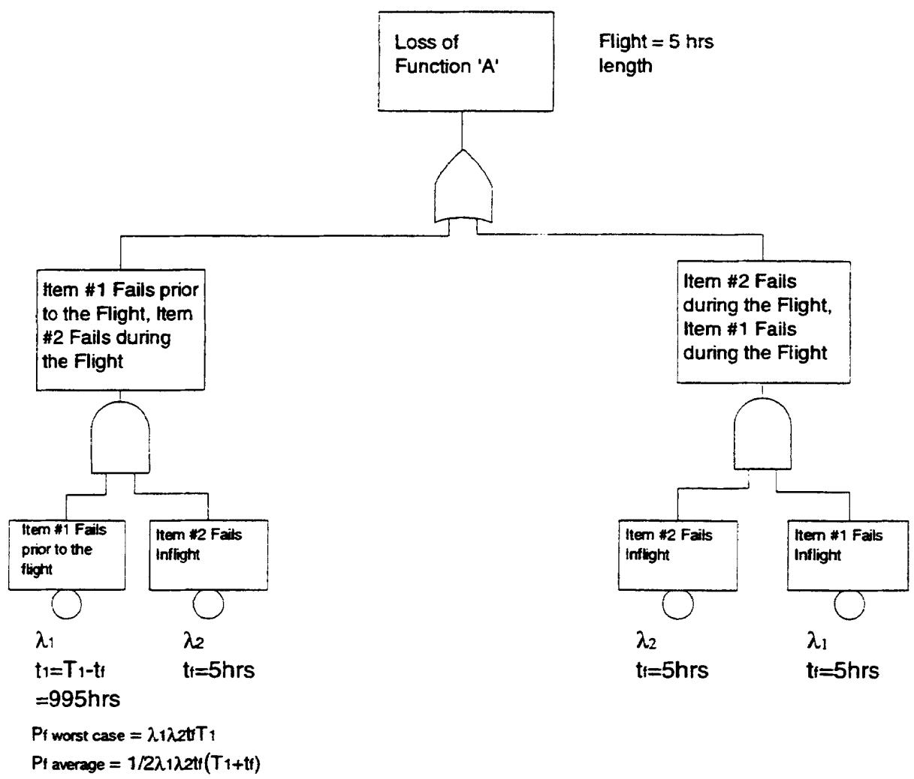  
FIGURE D18 - An Example of a Fault Tree Calculation When Two Item Failures Cause a Loss of a Function Where Item #1 Could Fail Latent

# SAE ARP4761

D.11.1.5.3 Fault Tree Calculation When Two Items Cause a Loss of a Function and Each Item Could Fail Latent - No Sequencing: In this case, either item could fail latent, but if both fail, this would be detected by virtue of it causing the top event. Therefore at least one of the items must be operating at the start of each flight. An example is shown in Figure D19.

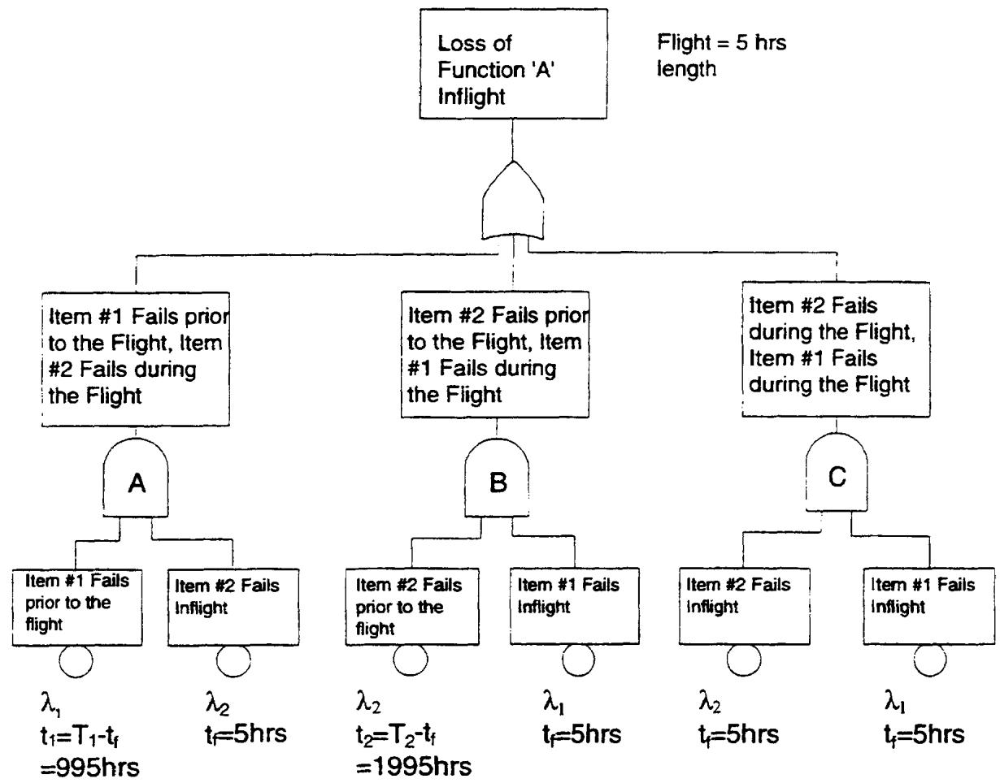  
FIGURE D19 - An Example of a Fault Tree Calculation When Two Item Failures Cause a Loss of a Function Where each Item Could Fail Latent

Pf worst case  $= \lambda_{1}\lambda_{2}\mathrm{tf}(T1 + T2 - \mathrm{tf})$

Pf average  $= 1 / 2\lambda_{1}\lambda_{2}\mathrm{tf}(\mathrm{T}1 + \mathrm{T}2)$

# SAE ARP4761

# D.11.1.5.3 (Continued):

Three things should be noted about Figure D19. First, an undeveloped event for failure order (i.e.,  $\text{ROF} = k / n!$  as described in D.11.1.4) is not required because failure order dependence is built into the tree structure via the latency period  $(t_n = T_n - t_f)$ , which is representative for a failure before the flight. Second, the rightmost AND-gate is necessary to cover the case that both items fail during the flight without a required sequence. Third, the rightmost AND-gate is often omitted and the exposure times set equal to the inspection intervals, for the case where  $t_f$  is much less than the inspection intervals.

a. The probability of the worst case flight is calculated as below, with reference to Figure D19:

$$
P _ {f} A = \lambda_ {1} \left(T _ {1} - t _ {f}\right) \lambda_ {2} t _ {f} \tag {Eq.D5}
$$

$$
P _ {f} B = \lambda_ {2} \left(T _ {2} - t _ {f}\right) \lambda_ {1} t _ {f} \tag {Eq. D6}
$$

$$
P _ {f} C = \lambda_ {1} t _ {f} \lambda_ {2} t _ {f} \tag {Eq. D7}
$$

$$
\begin{array}{l} P _ {f w o r s t c a s e} = P _ {f} A + P _ {f} B + P _ {f} C \tag {Eq. D8} \\ = \lambda_ {1} \lambda_ {2} t _ {f} \left(T _ {1} - t _ {f} + T _ {2} - t _ {f} + t _ {f}\right) \\ = \lambda_ {1} \lambda_ {2} t _ {f} (T _ {1} + T _ {2} - t _ {f}) \\ \end{array}
$$

b. For the average probability calculation as described in D.11.1.5.5, the result is:

$$
P _ {f a v e r a g e} = 1 / 2 \lambda_ {1} \lambda_ {2} t _ {f} \left(T _ {1} + T _ {2}\right) \tag {Eq.D9}
$$

D.11.1.5.4 Fault Tree Calculation When the Failure of Both Items Cause a Top Event and One can Fail Latent and a Required Order is Needed: In this case, item one (the latent one) must fail prior to item two or the top event does not result. Item two is known to be operational at the start of the flight. This is typical of a failure/monitor situation where the top event is an erroneous output rather than a loss of function. An example involving the transmission of incorrect data is provided in Figure D20.

The required order factor (ROF) is used per D.11.1.4.

a. The probability of the worst case flight is calculated as below with reference to Figure D20:

$$
P _ {f} A = \lambda_ {1} \left(T _ {1} - t _ {f}\right) \lambda_ {2} t _ {f} \tag {Eq.D10}
$$

$$
P _ {f} B = 1 / 2 \lambda_ {1} \lambda_ {2} t _ {f} ^ {2} \tag {Eq. D11}
$$

$$
\begin{array}{l} P _ {f w o r s t c a s e} = P _ {f} A + P _ {f} B \tag {Eq. D12} \\ = \lambda_ {1} \left(T _ {1} - t _ {f}\right) \lambda_ {2} t _ {f} + \left(\lambda_ {1} \lambda_ {2} t _ {f} ^ {2}\right) / 2 \\ = \lambda_ {1} \lambda_ {2} t _ {f} \left(T _ {1} - t _ {f} / 2\right) \\ \end{array}
$$

b. For the average probability calculation, as described in D.11.1.5.5, the result is:

$$
P _ {\text {f a v e r a g e}} = \frac {1}{2} \lambda_ {1} \lambda_ {2} t _ {f} T _ {1} \tag {Eq. D13}
$$

# SAE ARP4761

FIGURE D20 - An Example of a Fault Tree Calculation When Two Item Failures Cause a Top Event and One Item Can Fail Latent and Failures are Order Dependent  
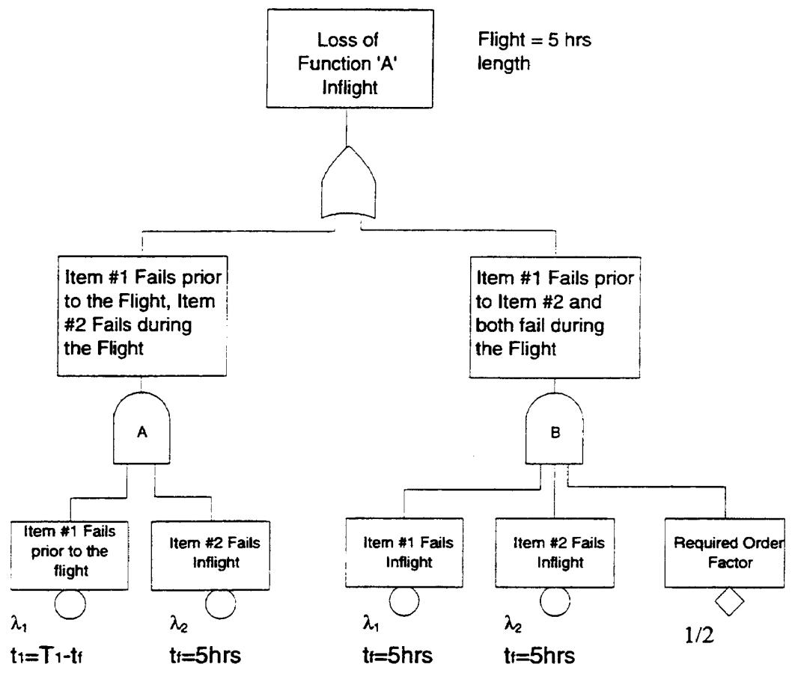  
Pf worst case  $= \lambda_{1}\lambda_{2}\mathrm{tf}(T1 - (\mathrm{tf} / 2))$  Pf average  $= 1 / 2\lambda_{1}\lambda_{2}\mathrm{tf}T1$

# SAE ARP4761

D.11.1.5.5 Examples of Calculation of the Average Occurrence Probability of a Double Failure for an Average Flight Time: The following example considers the general case of a double failure  $F_{1}$  and  $F_{2}$  with two different failure rates,  $\lambda_{1}$  and  $\lambda_{2}$ , and two latencies,  $T_{1}$  and  $T_{2}$ , with the assumptions:

$$
T _ {1} \leq T _ {2}, T _ {2} = N T _ {1} \text {a n d} t _ {f} \text {i s t h e a v e r a g e f l i g h t t i m e} \tag {Eq.D14}
$$

We have:

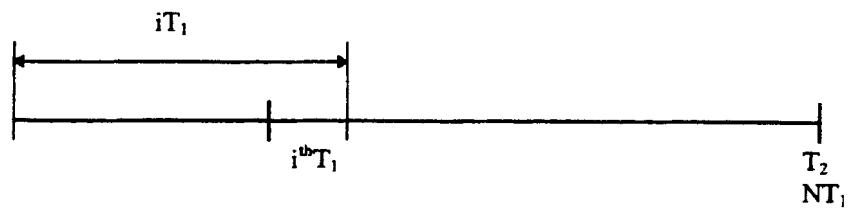  
FIGURE 21

D.11.1.5.5.1 Probability of Occurrence for the  $i^{\text{th}} T_1$ : This probability is composed of two cases, Case A and Case B.

a. Case A:  $F_{2}$  occurs before  $F_{1}$

(1) This case is composed of two subcases:

(a) A1:  $F_{2}$  occurs before the  $i^{th} T_{1}$  and  $F_{1}$  occurs during  $T_{1}$  
(b) A2:  $F_{2}$  occurs before  $F_{1}$  during the  $i^{th} T_{1}$

$$
P _ {A} = P _ {A 1} + P _ {A 2} = \lambda_ {2} (i - 1) T _ {1} \lambda_ {1} T _ {1} + (\lambda_ {1} T _ {1} \lambda_ {2} T _ {1} / 2) \tag {Eq.D15}
$$

(note: /2 term for sequencing  $\mathsf{F}_2$  before  $\mathsf{F}_1$  during  $\mathsf{T}_{1}$ .)

$$
P _ {A} = \lambda_ {1} \lambda_ {2} T _ {1} ^ {2} (i - 1 + 1 / 2) = \lambda_ {1} \lambda_ {2} T _ {1} ^ {2} (i - 1 / 2)
$$

b. Case B:  $\mathsf{F}_1$  occurs before  $\mathsf{F}_2$

(1) In this case the latency of  $F_{1}$  is  $T_{1}$ , and the double failure occurs if  $F_{1}$  occurs before  $F_{2}$  during  $T_{1}$ .

$$
P _ {B} = \left(\lambda_ {1} T _ {1} \lambda_ {2} T _ {1}\right) / 2 \tag {Eq.D16}
$$

(note: /2 term for sequencing  $(\mathsf{F}_1$  before  $\mathsf{F}_2)$  during  $\mathsf{T}_{1}$ .)

The total probability of occurrence for the  $i^{\text{th}} T_1$  is:

$$
P = P _ {A} + P _ {B} = \lambda_ {1} \lambda_ {2} T _ {1} ^ {2} [ (i - 1 / 2) + 1 / 2 ] = \lambda_ {1} \lambda_ {2} T _ {1} ^ {2} i \tag {Eq.D17}
$$

# SAE ARP4761

D.11.1.5.5.2 Probability of Occurrence for the  $\mathrm{T}_{2}$  Periods: The global occurrence probability for the  $\mathrm{T}_{2}$  period is:

$$
P _ {G} = \Sigma \left(P _ {A} + P _ {B}\right); \text {f o r} i = 0 \text {t o} i = N \tag {Eq. D18}
$$

$$
\mathsf {P} _ {\mathrm {G}} = \lambda_ {1} \lambda_ {2} \mathsf {T} _ {1} ^ {2} [ (\mathsf {N} (\mathsf {N} + 1) / 2 - \mathsf {N} / 2) + (\mathsf {N} / 2) ]
$$

$$
P _ {G} = \lambda_ {1} \lambda_ {2} T _ {1} ^ {2} \left[ \left(N ^ {2} / 2 + N / 2 - N / 2\right) + N / 2 \right]
$$

$$
P _ {G} = \lambda_ {1} \lambda_ {2} T _ {1} ^ {2} [ N ^ {2} / 2 + N / 2)
$$

Replaces  $\mathsf{NT}_1$  by  $\mathsf{T}_2$

$$
P _ {G} = 1 / 2 \lambda_ {1} \lambda_ {2} T _ {2} \left(T _ {1} + T _ {2}\right)
$$

D.11.1.5.5.3 Probability of Occurrence Per Flight:  $\mathsf{P}_{\mathsf{G}}$  is the average occurrence probability for a period of  $\mathsf{T}_2$  hours. To have the average occurrence probability per flight, it is necessary to divide  $\mathsf{P}_{\mathsf{G}}$  by  $\mathsf{T}_2$  to have the average occurrence probability per hour of flight and to multiply by  $\mathsf{t}_{\mathsf{f}}$ , which is the average time of a flight.

This results in the general formula:

$$
P _ {f t} = P _ {G} * t _ {f} / T _ {2} \tag {Eq. D19}
$$

$$
P _ {f t} = 1 / 2 \lambda_ {1} \lambda_ {2} t _ {f} (T _ {1} + T _ {2})
$$

Where  $P_{\mathrm{ft}} =$  probability per flight of the double failure

D.11.1.5.5.4 Derivation of Current Cases: From the  $P_{\mathrm{ft}}$  general formula from D.11.1.5.5.3 above, one can derive several current cases of double failures:

a. Two latent failures,  $\mathsf{F}_1$  and  $\mathsf{F}_2$ , with two different latency periods,  $\mathsf{T}_1$  and  $\mathsf{T}_2$ .

$$
\text {N o s e q u e n c e :} P _ {\mathrm {f t}} = \frac {1}{2} \lambda_ {1} \lambda_ {2} t _ {\mathrm {f}} \left(T _ {2} + T _ {1}\right) \tag {Eq.D20}
$$

$$
\text {S e q u e n c e} F _ {2} \text {b e f o r e} F _ {1}; P _ {\mathrm {f t}} = 1 / 2 \lambda_ {1} \lambda_ {2} t _ {\mathrm {f}} T _ {2}
$$

$$
\text {S e q u e n c e} F _ {1} \text {b e f o r e} F _ {2}: P _ {\mathrm {f t}} = 1 / 2 \lambda_ {1} \lambda_ {2} t _ {\mathrm {f}} T _ {1}
$$

b. Two latent failures,  $\mathsf{F}_1$  and  $\mathsf{F}_2$ , with the same latency periods,  $T_1 = T_2 = T$ .

$$
\text {N o s e q u e n c e :} P _ {\mathrm {f t}} = \lambda_ {1} \lambda_ {2} t _ {\mathrm {f}} [ (T + T) / 2 ] = \lambda_ {1} \lambda_ {2} t _ {\mathrm {f}} T \tag {Eq.D21}
$$

$$
\text {S e q u e n c e} F _ {2} \text {b e f o r e} F _ {1}: P _ {\mathrm {f t}} = 1 / 2 \lambda_ {1} \lambda_ {2} t _ {\mathrm {f}} T
$$

$$
\text {S e q u e n c e} F _ {1} \text {b e f o r e} F _ {2}: P _ {\mathrm {f t}} = 1 / 2 \lambda_ {1} \lambda_ {2} t _ {\mathrm {f}} T
$$

# SAE ARP4761

# D.11.1.5.5.4 (Continued):

c. One latent failure,  $\mathsf{F}_2$  and one active failure,  $\mathsf{F}_1$ , with latency periods,  $T_2 = T$  and  $T_1 = t_f$

$$
\text {N o s e q u e n c e :} P _ {\mathrm {f t}} = 1 / 2 \lambda_ {1} \lambda_ {2} t _ {\mathrm {f}} (T + t _ {\mathrm {f}}) \tag {Eq.D22}
$$

Sequence  $F_{2}$  before  $F_{1}: P_{\mathrm{ft}} = 1/2 \lambda_{1} \lambda_{2} t_{\mathrm{f}} T$  (case of command and monitoring system)

$$
\text {S e q u e n c e} F _ {1} \text {b e f o r e} F _ {2}: P _ {\mathrm {f t}} = 1 / 2 \lambda_ {1} \lambda_ {2} t _ {\mathrm {f}} t _ {\mathrm {f}} = 1 / 2 \lambda_ {1} \lambda_ {2} t _ {\mathrm {f}} ^ {2}
$$

d. Two active failures,  $F_{1}$  and  $F_{2}$ ,  $T_{1} = T_{2} = t_{f}$

$$
\text {N o s e q u e n c e :} P _ {\mathrm {f t}} = \lambda_ {1} \lambda_ {2} t _ {\mathrm {f}} \left[ \left(t _ {\mathrm {f}} + t _ {\mathrm {f}}\right) / 2 \right] = \lambda_ {1} \lambda_ {2} t _ {\mathrm {f}} ^ {2} \tag {Eq.D23}
$$

$$
\mathrm {S e q u e n c e} \mathrm {F} _ {2} \text {b e f o r e} \mathrm {F} _ {1}: \mathrm {P} _ {\mathrm {f t}} = 1 / 2 \lambda_ {1} \lambda_ {2} \mathrm {t} _ {\mathrm {f}} \mathrm {t} _ {\mathrm {f}} = 1 / 2 \lambda_ {1} \lambda_ {2} \mathrm {t} _ {\mathrm {f}} ^ {2}
$$

$$
\text {S e q u e n c e} F _ {1} \text {b e f o r e} F _ {2}: P _ {\mathrm {f t}} = 1 / 2 \lambda_ {1} \lambda_ {2} t _ {\mathrm {f}} t _ {\mathrm {f}} = 1 / 2 \lambda_ {1} \lambda_ {2} t _ {\mathrm {f}} ^ {2}
$$

# D.11.2 Quantitative Sensitivity Evaluation:

Sensitivity evaluations can be broken into two categories (refer to NUREG-0492 for a detailed discussion of this subject).

a. Variations of models or data  
b. Formal error analysis

The analyst can use data or fault tree model variations to determine how sensitive a system design is to a particular aspect of individual Primary Events. By inserting different failure rates in a particular Primary Event, the analyst can decide whether a higher reliability item/component is worth the additional cost. By inserting different exposure times, the analyst provides input to help establish equipment maintenance intervals.

The analyst can use formal error analysis to determine how sensitive the FTA result is to Primary Event variability, i.e., variability in component failure rates and maintenance intervals. The Monte Carlo method is one such technique which is adaptable to fault tree analysis. Since error analyses are based on statistical and probabilistic techniques which are beyond the scope of this appendix, the reader should refer to textbooks on this subject matter.

Quantitative Importance is similar to Qualitative Importance (see D.10.2) in that both evaluation methods simply rank the cut sets for determining their relative importance with respect to top level event occurrence.

Quantitative Importance can take various forms. Several methods are provided here. The analyst receives a different type of information from each method.

# SAE ARP4761

# D.11.2 (Continued):

Method #1: A simple ranking of cut sets in descending order based on each cut sets actual probability of failure (i.e., highest to lowest  $P_f$ ).

This method is closely related to qualitative importance. The analyst can accurately determine cut set ranking as opposed to only being able to get a gross estimate of cut set ranking using the qualitative importance method.

Method #2:ith Cut Set Importance -- provides a percentage of cut set failure probability with respect to the top level event failure probability.

$$
\% (i) = \frac {P _ {f} (i)}{P _ {f} (t o p)} \tag{Eq.D24}
$$

Method #3: Fussell-Vesley (FV) Importance -- provides the risk associated with an individual Primary Event (i.e., provides a relative indication on how much a Primary Event is contributing to the top level event  $P_f$ ).

$$
F V = \frac {P _ {\mathrm {f}} (\text {t o p}) - P _ {\mathrm {f}} (\text {t o p} / \mathrm {A} = 0)}{P _ {\mathrm {f}} (\text {t o p})} \tag {Eq.D25}
$$

where  $P_f$  (top/A=0) is defined as the probability that the top event occurs given event A never occurs; i.e.,  $P_f(A) = 0$ .

Method #4: Birnbaum Importance -- provides the increase in risk associated with a Primary Event. That is, this method provides the difference in top level event  $P_f$  when a Primary Event occurs (i.e.,  $P(A) = 1$ ) and when a Primary Event does not occur (i.e.,  $P(A) = 0$ ).

$$
\text {B i r n b a u m} = P _ {\mathrm {f}} (\text {t o p / A} = 1) - P _ {\mathrm {f}} (\text {t o p / A} = 0) \tag {Eq.D26}
$$

# D.12 USING FAULT TREES TO SHOW CONTRIBUTION OF ERRORS:

Fault trees can provide a means to illustrate the contribution of potential hardware and software errors to the undesired events being analyzed. This is accomplished by including hardware and software error events in the fault tree. These events are included in a purely qualitative manner and do not enter into the calculation of the probability for the top level event which can only be performed for hardware failures.

By including potential hardware and software errors in the fault tree, the analyst can assess the development assurance necessary to ensure that common mode errors cannot degrade the safety level achieved by protecting against random hardware faults.

# SAE ARP4761

# D.12 (Continued):

The following example shows how including potential hardware and software errors in a fault tree can guide the analyst in assessing the development assurance that must be achieved.

The example is shown for two identical displays. For simplicity, the source of data to the displays is excluded from the analysis and it is assumed that the monitoring is contained within each display. The initial fault tree is shown in Figure D22. In this initial fault tree, it is assumed that all hardware failures are independent. Compliance with a 1E-9 safety level appears to be quite easily achieved because four independent hardware failures must occur.

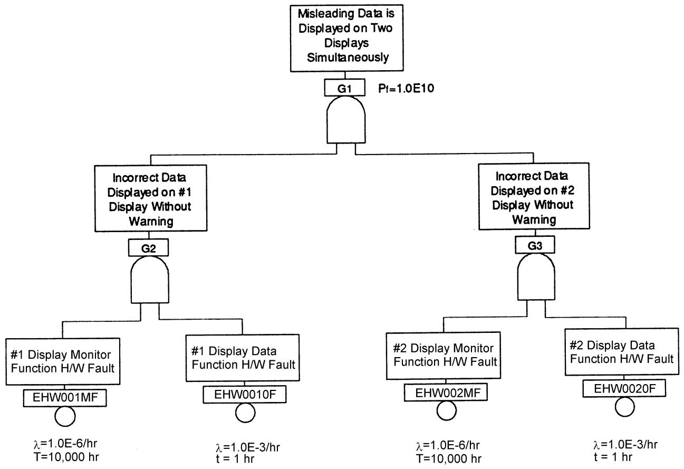  
FIGURE D22 - Example Fault Tree, Working Basis for Incorporation of Design Errors

# SAE ARP4761

# D.12 (Continued):

The analyst can easily determine that the minimal cutset for the tree is (EHW0010F)(EHW001MF)(EHW0020F)(EHW002MF). Now the analyst must determine if common cause faults can affect the calculations performed on the cutset. The fault trees (Figure D23 pages 1-4) on the following pages add the potential common cause faults to provide visibility to their possible effects. The potential common cause faults shown are: "EXTERNAL COMMON CAUSE FAULTS (POWER, ENVIRONMENT, ETC.)", "CONTRIBUTION OF ERRORS IF DATA AND MONITOR ARE INDEPENDENT", and "CONTRIBUTION OF H/W AND S/W ERRORS IF DATA AND MONITOR ARE NOT INDEPENDENT". The external common cause faults are included for completeness but will not be addressed further here.

Because the displays are identical, the worst case assumption is made that a software or hardware error will affect both of them simultaneously. Within each display, there are two functions under analysis, the data generation function and monitor function. If the data generation design and the monitor design are independent, the fault sequences shown under the event, "CONTRIBUTION OF ERRORS IF DATA AND MONITOR ARE INDEPENDENT" guide the assignment of the development assurance of the software and hardware that perform these functions. In this case, combinations of hardware and software errors and random hardware faults play a role in causing the top level event.

If the data generation and monitor functions are not designed to be independent, then the fault sequence shown under the event, "CONTRIBUTION OF ERRORS IF DATA AND MONITOR ARE NOT INDEPENDENT" guides the assignment of the necessary development assurance. If the functions are not independent, hardware and software errors are the major contributor to the top level event.

The analyst can now look at 5.4 of ARP4754 for guidance on the Development Assurance Levels that need to be assigned for the alternate potential designs. If the data and monitor functions are not independent, the hardware and software involved in both of these functions will need to be developed to Level A. If the functions are independent, it may be possible to reduce the level of one or both of the functions.

Including the potential of hardware and software errors into the fault tree provides valuable insight into the questions that need to be asked regarding independence and ultimate, when those questions are answered, insight into the development assurance that must be applied.

# SAE ARP4761

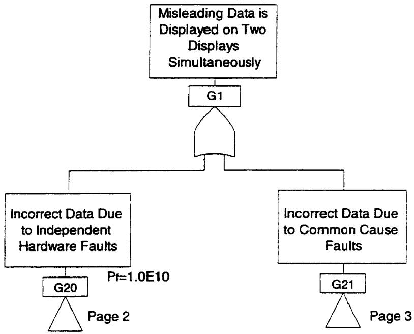  
FIGURE D23 - Consideration of Common Cause Faults (Error) - (Pages 1 of 4)

# SAE ARP4761

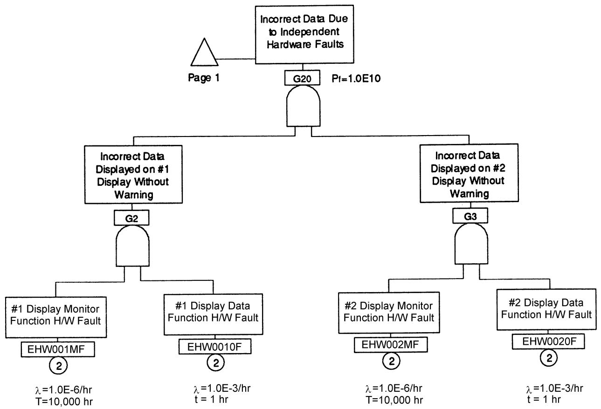  
FIGURE D23 (Continued) - (Page 2 of 4)

# SAE ARP4761

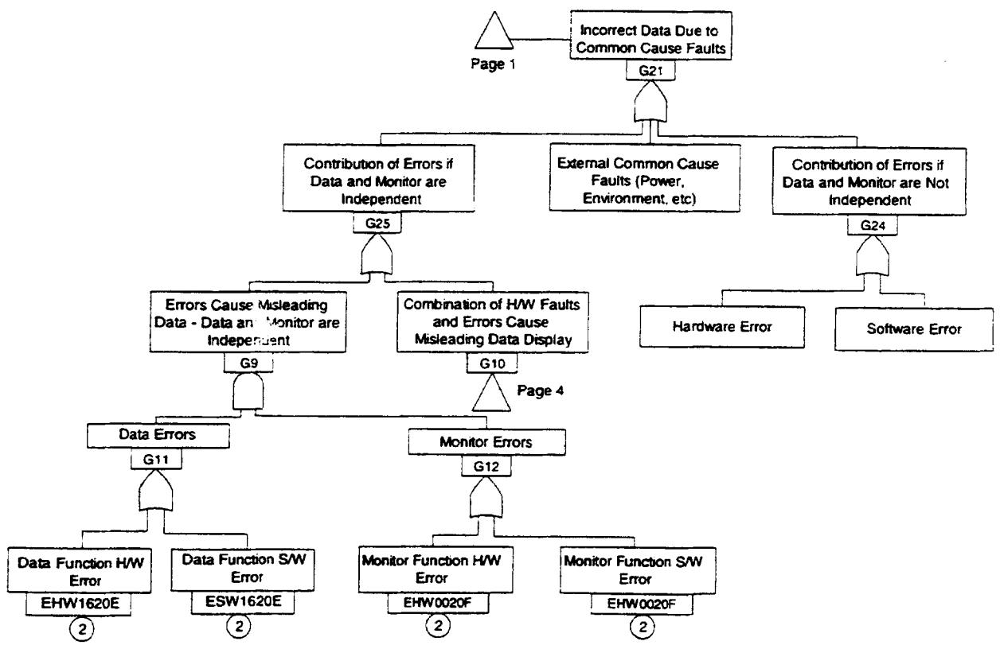  
FIGURE D23 (Continued) - (Pages 3 of 4)

# SAE ARP4761

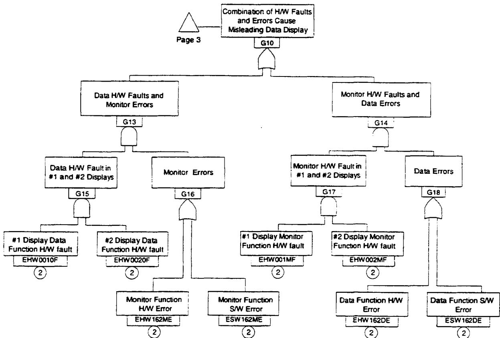  
FIGURE D23 (Continued) - (Page 4 of 4)

# D.13 ANALYZE AND SUMMARIZE THE FTA RESULTS:

After the tree is constructed, the analyst will need to normalize and then summarize the fault tree data, and document whether the current architecture is adequate to meet the top level event requirement.

# D.13.1 Fault Tree Data Analysis -- Normalizing the FTA Numerical Calculation:

The certificate authority states its safety requirements in terms of "Probability of Failure per Flight Hour". If the system under analysis has these types of requirements, the analyst must "normalize" the undesired top event Probability of Failure number.

When  $P_{f}(top)$  is calculated on a per flight basis, the analyst normalizes  $P_{f}(top)$  by dividing the top event probability by the flight time, or other appropriate time and thus reports the Probability of Failure per flight hour.

# SAE ARP4761

# D.13.2 Summarizing Fault Tree Analysis Results During SSA Process:

One method for summarizing the FTA data is to construct an FTA Data Summary Chart. This chart uses a columnar format which provides an engineering management or a certification authority reviewer with easy access to all the pertinent FTA results. The following table contains an example of this type of chart.

TABLE D6 - Example of a System Indenture Level FTA Data Summary Chart  

<table><tr><td>Safety Design Criteria</td><td>Safety Design Criteria</td><td>Safety Design Criteria</td><td>Analysis Results</td><td>Analysis Results</td><td>Analysis Results</td></tr><tr><td>List of Top Level Events (from FHA)</td><td>List of Top Level Events (from FHA)</td><td>Corresponding Maximum Allowable Probability</td><td>System&#x27;s Probability of Occurrence</td><td>Compliance (Yes or No)</td><td>Corrective Action</td></tr><tr><td colspan="6">Funct # Description</td></tr><tr><td>4A1</td><td>Loss of all Altitude Display in the cockpit</td><td>1E-9</td><td>5E-9</td><td>No</td><td>Redesign Air Data System or add more detail to the LRU FTA</td></tr><tr><td>4A2</td><td>Loss of primary altitude on both pilot PFDs</td><td>1E-7</td><td>1E-7</td><td>Yes</td><td>None</td></tr><tr><td></td><td></td><td></td><td></td><td></td><td></td></tr><tr><td></td><td></td><td></td><td></td><td></td><td></td></tr><tr><td></td><td></td><td></td><td></td><td></td><td></td></tr></table>

Note that the numbers entered into the "Corresponding Maximum Allowable Probability" column are based on the Failure Condition Classification for the given top level event.

Now we can see the tie between FTA boundaries and summarizing FTA results. Table D6 indicates that Function #4A1 does not meet its top level event safety requirement at the system indenture level and the apparent corrective action is to increase the FTA scope by enlarging the FTA boundaries down to the LRU indenture level. Assuming that Function #4A1B55 is the Primary Event in the Function #4A1 system indenture level FTA, Table D7 provides an example of a summary table for an LRU indenture level FTA.

# SAE ARP4761

TABLE D7 - Example of an LRU Indenture Level FTA Data Summary Chart  

<table><tr><td>Safety Design Criteria</td><td>Safety Design Critiera</td><td>Safety Design Criteria</td><td>Analysis Results</td><td>Analysis Results</td><td>Analysis Results</td></tr><tr><td>List of Top Level Events (from System FTA)</td><td>List of Top Level Events (from System FTA)</td><td>Corresponding Maximum Allowable Probability</td><td>System&#x27;s Probability of Occurrence</td><td>Compliance (Yes or No)</td><td>Corrective Action LRU Functional Block FTA or HW/SW Change</td></tr><tr><td>Funct #</td><td>Description</td><td></td><td></td><td></td><td></td></tr><tr><td>4A1B55</td><td></td><td>1.0E-9</td><td>1.0E-8</td><td>No</td><td>Perform LRU Functional Block FTA</td></tr><tr><td>4A1B56</td><td></td><td>1.0E-5</td><td>1.0E-7</td><td>Yes</td><td>None</td></tr><tr><td></td><td></td><td></td><td></td><td></td><td></td></tr><tr><td></td><td></td><td></td><td></td><td></td><td></td></tr><tr><td></td><td></td><td></td><td></td><td></td><td></td></tr></table>

# SAE ARP4761

# APPENDIX E DEPENDENCE DIAGRAMS

NOTE: The basic ARP4761 document contains information which places the information in this appendix in context. This appendix should be used in conjunction with the main body of the document.

# E.1 INTRODUCTION:

Dependence Diagrams (DD) may be used as an alternate method of representing the data in Fault Tree Analyses (FTAs). This provides an alternate pictorial representation of combinations of failures for the purpose of probability analysis. The processes and methods explained and described in Appendix D for FTAs also generally apply to DDs. The principle differences between FTAs and DDs are that DDs have no additional logic symbols, because they show the logic by serial or parallel arrangement of boxes, and that DDs do not show intermediate events which would appear in FTAs as descriptions of the output of a logic symbol. The DD is analytically identical to the FTA and the role of the DD in the safety assessment process is the same as the role of FTAs. The guidance in this appendix deals with DD unique issues not covered by the FTA process in Appendix D.

# E.2 SCOPE:

This Appendix explains the basic logic arrangements, the basic analysis procedure and the pictorial representation of several, different types of events. Variations and additions on the event representations may be applied as necessary to support a specific analysis. This Appendix should enable an engineer experienced in fault tree analysis to apply the Dependence Diagram method.

# E.3 BASIC LOGIC ARRANGEMENT:

Each Dependence Diagram represents a Failure Condition (unwanted top event). It is constructed utilizing rectangular boxes, which represent fault events leading to the top event. These boxes are arranged in series or parallel formation. Series chains are OR situations, while parallel chains represent AND situations.

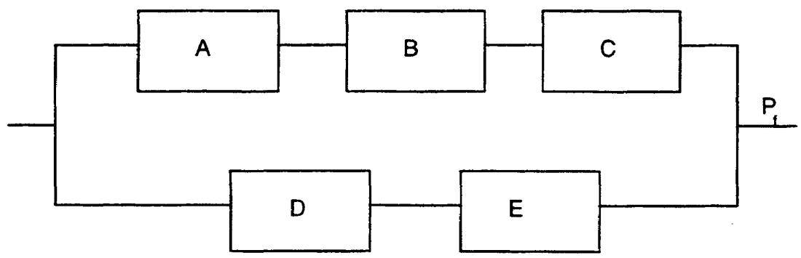  
FIGURE E1 - Series/Parallel Combinations

# SAE ARP4761

# E.3 (Continued):

The probability of the overall Failure Condition  $P_f$  in the DD shown in Figure E1 is approximately given by:

$$
P _ {f} = \left(P _ {f} A + P _ {f} B + P _ {f} C\right) ^ {*} \left(P _ {f} D + P _ {f} E\right) \text {p e r f l i g h t} \tag {Eq.E1}
$$

The arrangement shown is simplistic in order to introduce the reader to the basic philosophy. The dependence diagrams can become quite complex and may involve the multiple use of single failures throughout the diagram, in which case the application of Boolean algebra will be required in order to complete the probabilistic calculations and generate the minimal cut sets.

All the qualitative and quantitative evaluations using minimal cut sets are identical to those made with the Fault Tree cut sets (see the following paragraphs of Appendix D).

a. Qualitative importance determination (D.10.2)  
b. Common cause vulnerability (D.10.3)  
c. Quantitative evaluation: Probabilistic calculations and associated formulas are the same as those used for Fault Tree evaluations (Section D.11).

Errors can be incorporated into Dependence Diagrams in the same way as in Fault Trees (see Appendix D, Section D.12).

# E.4 PICTORIAL REPRESENTATIONS OF EVENTS:

Dependence Diagrams are usually constructed utilizing rectangular boxes. Variations in the form of the boxes can be used to depict different conditions, similar in manner to the variety of shapes used in Fault Trees. Examples are described in the following paragraphs.

# E.4.1 Failure Modes:

The "solid line" box depicts a failure mode which is internal to the system being analyzed and which needs no further development. This is comparable to a circle representation in Fault Trees. In the PSSA, the box should contain a description of the failure mode and the budgeted failure rate with associated risk time and/or exposure time. In the SSA, the budgeted failure rate may be replaced by the actual failure rate and may include the source reference from the FMES. Figure E2 is an example from an SSA Dependence Diagram.

# SAE ARP4761

# Loss of speed signal

Ref.: FMES 7.4

Failure Rate: 1E-6

Risk Time: 5 min

Exposure Time: N/A

FIGURE E2 - Fully Developed Failure Mode Internal to the System

# E.4.1 (Continued):

This example indicates that the failure "Loss of Speed Signal" is referenced back to the FMES, with a failure rate of 1E-6 and the risk time for that failure of 5 min.

# E.4.2 Failure Condition:

A box drawn with "dashed" lines depicts another failure condition of the system under investigation or failure condition of another system. This is comparable to a sub-tree in fault tree analysis.

# Loss of Busbar 1XPI

Ref.: SSA 24.4.3

Failure Rate: 1E-5

Risk Time: 1h

Exposure Time: N/A

FIGURE E3 - Undeveloped Failure Mode Internal to the System or External Failure Mode

The example in Figure E3 above indicates that "Loss of Busbar 1XPI" can be found in the referenced SSA.

A box which has a diagonal cross depicts a failure mode for which the probability of failure cannot be directly derived from its stated  $\lambda$  and t. This box may be a further subset dependence diagram in its own right, and has to be referred to directly in order to determine its probability of failure. This box is shown in Figure E4.

# SAE ARP4761

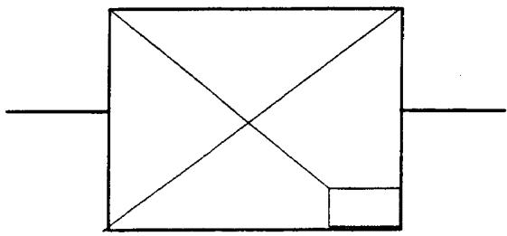  
FIGURE E4 - Indirect Probability

# E.4.2 (Continued):

Care should be taken when using these failure condition boxes in the probability calculation of the Dependence Diagram. They only show the top level of another Dependence Diagram which could contain common elements with the Dependence Diagram under investigation. They may also contain exposure times different from the ones considered in the original Dependence Diagram.

Calculations should always be performed with the complete dependence diagram structure for the failure condition of concern; and not by simply using the probability of that failure condition in the calculation.

# E.4.3 External Events:

A "dotted" line box depicts an event which is external to the aircraft, for example icing conditions.

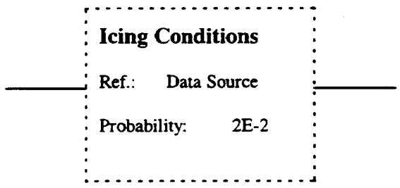  
FIGURE E5 - Failure or Event External to the Aircraft

The example in Figure E5 above indicates that icing Conditions exist with a probability of 2E-2 per flight and the reference for the probability.

# SAE ARP4761

# APPENDIX F MARKOV ANALYSIS (MA)

NOTE: The basic ARP4761 document contains information which places the information in this appendix in context. This appendix should be used in conjunction with the main body of the document.

# F.1 INTRODUCTION:

This appendix presents an intuitive understanding of Markov analysis without the complexity of the underlying mathematics. A Markov model (chain) represents various system states, and relationships among them. The states can either be operational or non-operational. The transition rate from one state to another is a function of the failure or repair rate. Since one can know the status of the system at the start of the time period, one can initialize the probability value of that particular state of the system to be 1 and probability of all other states of the system to be zero. At some time,  $t$ , there is a finite probability of being in any state of the Markov chain. The sum of the probabilities of being in all possible states must be equal to 1. The state probabilities are derived by solving a set of differential equations which are derived from the Markov chain. Each state is mutually exclusive because at any given time, the system can be in only one of the states. Final failure state is generally the state in which all redundancy of the system has been exhausted or there are no more operational states.

# F.1.1 Background:

The complexity and size of the systems are rapidly increasing with new advances in technology. Aircraft systems are relying more and more on fault tolerant systems. Such systems hardly ever fail completely because of continuous monitoring of their condition and instantaneous reconfiguration of the systems. This is true unless external events override the operation. Given this scenario of fault tolerances, the safety assessment process and evaluation of such system may be more appropriately achieved by the application of the Markov technique.

For civil airborne systems and equipment, end users may take advantage of the available redundancy to schedule maintenance activities. This scheduling is possible because the redundancy provides equipment safety levels for longer periods of time.

FTA and DD have been widely used for safety assessment because they are conceptually simple and easy to understand. For these reasons, FTAs and DDs should be used whenever possible, recognizing the following limitations.

a. It is difficult to allow for various types of failure modes and dependencies such as near-coincident-faults, transient and intermittent faults and standby systems with spares.  
b. A fault tree is constructed to assess cause and probability of a single top event. If a system has many failure conditions, separate fault trees may need to be constructed for each one of them.

# SAE ARP4761

# F.1.1 (Conditions):

In some situations it may be difficult for a fault tree to represent the system completely; such as repairable systems and systems where failure/repair rates are state dependent.

Markov Analyses (MAs) do not possess the above indicated limitations. The sequence-dependent events are included naturally, therefore they can cover a wide range of system behaviors.

In MAs, one can more easily include the scenarios pertaining to the user operational environments; e.g., airline maintenance policies, dispatch requirements and safety considerations. MAs are also capable of handling several phases of a flight, state dependent failure rates, common mode failures, performability and performance-reliability dependence, physical interconnection dependence, time dependent transitions and above all, the imperfect coverage. Imperfect coverage can result from latent failures and less than  $100\%$  detectability. However, the disadvantage of performing Markov analysis is that, the size of a Markov model may grow exponentially with the number of components. For a system with 'n' components the corresponding Markov chain may have up to  $2^{n}$  states in the simplest case, although it usually is a lot less when system operation is considered. If more than two states are associated with any component, the number of states may even be larger. Techniques have been developed to effectively deal with this problem.

Definitions of selected terms used in Markov Models are given in Table F1.

TABLE F1 - Definitions of Terms Used in Markov Analysis  

<table><tr><td>Absorbing State:</td><td>A system enters the state and remains there. This means there are no outgoing transitions from this state. If absorbing states are present in a Markov chain, eventually the probability of being in one of these states will be unity.</td></tr><tr><td>Ergodic Process:</td><td>In addition to being homogeneous, the final value of the probability of being in any state is independent of the initial condition.</td></tr><tr><td>ESPN (Extended Stochastic Petri Nets):</td><td>A FEHM model for detailed analysis of system recovery from a fault of any type.</td></tr><tr><td>FEHM (Fault and Error Handling Models):</td><td>These are the models which describe the system behavior on occurrence of a fault. The models output the probability of fault detection, Coverage (C), probability of non-detection and hence system failure called Single point failure (S), probability of system failure due to a near coincident fault, probability (N), and probability of restoring the system from a fault, (R). There are six FEHM&#x27;s which are popularly used and they are Histogram, Probabilities &amp; Distributions, Means &amp; Standard Deviations, CARE III, ARIES and Extended Stochastic Petri Nets (ESPN).</td></tr></table>

# SAE ARP4761

TABLE F1 (Continued)  

<table><tr><td>Homogeneous Markov processes:</td><td>State transitions are memory-less and state holding time is exponentially distributed. Components do not ‘age’ and state transitions occur at a constant transition rate.</td></tr><tr><td>Homogeneous Process:</td><td>All transition probabilities and transition rates are constant.</td></tr><tr><td>Non-Homogeneous process:</td><td>Relaxes the exponential holding time restriction.</td></tr><tr><td>Performability:</td><td>This measure is the combination of reliability and performance of a system. Performance could be in terms of throughput of the system, average job completion time, average fuel consumption, etc.</td></tr><tr><td>Semi-Absorbing State:</td><td>A system enters the state as an outcome of continuous transition and remains there until repair which is the outcome of a discrete probability interchange.</td></tr><tr><td>Semi-Markov process:</td><td>The transition rates can be functions of state specific (local) clocks and not global clocks. The state holding times can be non-exponential and can depend on the next state.</td></tr><tr><td>State Space:</td><td>Set of all possible states that a system can attain.</td></tr><tr><td>State:</td><td>A state represents a status of the system.</td></tr><tr><td>Stiff Markov Chain:</td><td>Contains both, slow and fast transitions whose transition rates differ by orders of magnitude.</td></tr><tr><td>Stochastic Processes:</td><td>Cannot predict system behavior beforehand but the probabilities of different states at a particular time can be specified.</td></tr><tr><td>Transition Times:</td><td>The time at which a transition takes place from one state to another state. This transition can take place on a continuous or discrete time scale.</td></tr><tr><td>Transitions:</td><td>Movement from state to state with certain finite probability or a transition rate. Transition from state i to state j depends only on state i and state j and not on the history. This is the reason why Markov chains are called memory-less systems.</td></tr></table>

# SAE ARP4761

# F.2 THEORY:

Markov analysis of any system consists of two parts: Observing the system behavior by writing down the equations associated with the transitions and states in the system, and solving these equations using standard techniques. The state equations for any system can be constructed by inspection of the Markov chain. However, due to mathematical complexity this manual method can lead to errors and omissions even for simple systems. Therefore, some form of automated model generation is recommended. In general, the change in the probability of a state is due to the flows leaving and entering that state. The flows along a transition are the product of the transition rate along that transition and the probability of the state at the origin of that transition. A negative sign represents the rate at which the system is leaving that particular state, while a positive sign implies the rate at which the system is entering that new state.

To illustrate, consider the following scenario:

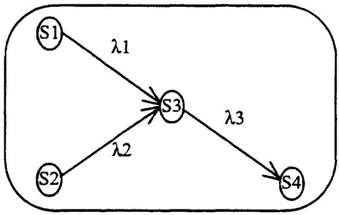  
FIGURE F1 - An Example of Input/Output Transitions In/Out of a State in a Markov Chain

In this system, state  $S_{3}$  has a time dependent probability value of  $P_{3}(t)$ . It has two input arcs from states  $S_{1}$  and  $S_{2}$  and one output arc to state  $S_{4}$ . Time dependent probability values of  $S_{1}$  and  $S_{2}$  are  $P_{1}(t)$  and  $P_{2}(t)$  respectively. Transition rates into the state  $S_{3}$  from  $S_{1}$  and  $S_{2}$  are  $\lambda_{1}$  and  $\lambda_{2}$  respectively. Transition rate out of the state is  $\lambda_{3}$ . The rate of change of state probability of  $S_{3}$  can be written in terms of state probabilities  $P_{1}(t), P_{2}(t), P_{3}(t)$  and transition rates  $\lambda_{1}, \lambda_{2},$  and  $\lambda_{3}$  and that equation is given below:

$$
\frac {\mathrm {d} P _ {3} (t)}{\mathrm {d} t} = \lambda_ {1} P _ {1} (t) + \lambda_ {2} P _ {2} (t) - \lambda_ {3} P _ {3} (t) \tag {Eq. F1}
$$

Similarly, differential equations can be written for all other states of this Markov chain. These set of differential equations can be solved using mathematical techniques such as Laplace Transforms. However, as the system becomes more complicated, it is a very laborious and time consuming process to manually solve the set of differential equations. Hence, the analyst should use one of the tools given in Section F.4 (e.g., HARP) to solve the Markov chain. Detailed examples are shown in the following subsections.

# SAE ARP4761

# F.2.1 Series Systems:

F.2.1.1 A Series System: Non-repairable: As an example, one can consider a system of two components in series. Component A has a failure rate of  $\lambda_{\mathrm{a}}$  failures/hour and component B has a failure rate of  $\lambda_{\mathrm{b}}$  failures/hour. Also there is a common failure mode by which both components A and B fail simultaneously and this rate is given by  $\lambda_{\mathrm{c}}$  failures/hour. (This should not be confused with the logical AND of the independent failures of component A and B.) A Markov model for this system is shown in Figure F2. The model is constructed by considering all possible failure combinations (states) at each failure level. For instance, at the zero failure level (0F) there is only one state: A and B are good, and at the one failure level (1F) there are two states, one where A has failed and the other where B has failed. At (2F) level, there is a common mode failure and both components are failed.

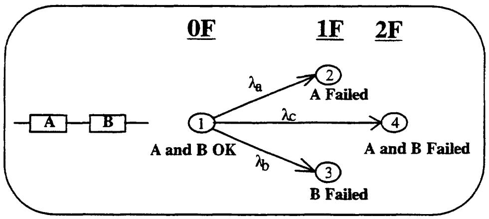  
FIGURE F2 - Markov Model of a Simple Non-repairable Series System

The state equations for the system represented in Figure F2 are:

$$
\frac {\mathrm {d} P _ {1} (t)}{\mathrm {d} t} = - \left(\lambda_ {a} + \lambda_ {b} + \lambda_ {c}\right) P _ {1} (t)
$$

$$
\frac {\mathrm {d} P _ {2} (t)}{\mathrm {d} t} = \lambda_ {a} P _ {1} (t)
$$

$$
\frac {\mathrm {d} P _ {3} (t)}{\mathrm {d} t} = \lambda_ {b} P _ {1} (t)
$$

$$
\frac {\mathrm {d} P _ {4} (t)}{\mathrm {d} t} = \lambda_ {\mathrm {c}} P _ {1} (t)
$$

(Eq.F2)

where  $\mathsf{P_i(t)}$  is the probability of being in state i at time t. For constant failure rate and an initial condition of  $\mathsf{P}(0) = [1000]^{\top}$  (T stands for transpose), the state equations can be integrated to obtain closed form expressions for all the probability values. They are given by:

# SAE ARP4761

# F.2.1.1 (Continued):

$$
\begin{array}{l} P _ {1} (t) = e ^ {- \left(\lambda_ {a} + \lambda_ {b} + \lambda_ {c}\right) t} \\ P _ {2} (t) = \frac {\lambda_ {a}}{\lambda_ {a} + \lambda_ {b} + \lambda_ {c}} \times \left(1 - e ^ {- (\lambda_ {a} + \lambda_ {b} + \lambda_ {c}) t}\right) \\ P _ {3} (t) = \frac {\lambda_ {b}}{\lambda_ {a} + \lambda_ {b} + \lambda_ {c}} \times \left(1 - e ^ {- (\lambda_ {a} + \lambda_ {b} + \lambda_ {c}) t}\right) \tag {Eq. F3} \\ P _ {4} (t) = \frac {\lambda_ {c}}{\lambda_ {a} + \lambda_ {b} + \lambda_ {c}} \times \left(1 - e ^ {- (\lambda_ {a} + \lambda_ {b} + \lambda_ {c}) t}\right) \\ \end{array}
$$

For large times,  $\mathsf{P}_1(t)$  goes to zero,  $\mathsf{P}_2(t)$  approaches  $\lambda_{\mathrm{a}} / (\lambda_{\mathrm{a}} + \lambda_{\mathrm{b}} + \lambda_{\mathrm{c}})$ ,  $\mathsf{P}_3(t)$  approaches  $\lambda_{\mathrm{b}} / (\lambda_{\mathrm{a}} + \lambda_{\mathrm{b}} + \lambda_{\mathrm{c}})$  and  $\mathsf{P}_4(t)$  approaches  $\lambda_{\mathrm{c}} / (\lambda_{\mathrm{a}} + \lambda_{\mathrm{b}} + \lambda_{\mathrm{c}})$ . The probability of system failure is equal to the sum of  $\mathsf{P}_2(t)$ ,  $\mathsf{P}_3(t)$  and  $\mathsf{P}_4(t)$ .

This is the same solution which one would obtain when using any combinatorial method as shown below:

At time t,

$$
P (A \text {f a i l i n g}) = 1 - e ^ {- \lambda_ {a} t}
$$

$$
P (B \text {f a i l i n g}) = 1 - e ^ {- \lambda_ {b} t}
$$

P (A and B failing) = 1 - e $^{-\lambda_{\mathrm{c}}t}$  (common mode failure)

Now, from combinatorial techniques:

P (A or B failing) = 1 - P (A and B both not failing)

Therefore,

$$
P (A \text {o r} B) = 1 - e ^ {- (\lambda_ {a} + \lambda_ {b} + \lambda_ {c}) t}
$$

Notice that this is same as  $\mathsf{P}_2(\mathsf{t}) + \mathsf{P}_3(\mathsf{t}) + \mathsf{P}_4(\mathsf{t})$  as derived from the Markov chain.

Similarly,

P (A and B not failing) = e  $^ { - ( \lambda _ { a } + \lambda _ { b } + \lambda _ { c } ) t }$

Notice that this equation is same as  $\mathsf{P}_1(\mathfrak{t})$  obtained using the Markov techniques above.

# SAE ARP4761

F.2.1.2 A Series System - Repairable: As an example, once again consider the same system of two components in series. Component A has a failure rate of  $\lambda_{\mathrm{a}}$  failures/hour and component B has a failure rate of  $\lambda_{\mathrm{b}}$  failures/hour. Also there is a common failure mode by which both components A and B fail simultaneously and this rate is given by  $\lambda_{\mathrm{c}}$  failures/hour. (This should not be confused with the logical AND of the independent failures of component A and B.) In addition to failures, both components A and B are assumed to be repaired at a constant rate of  $\mu$ . In most of the aviation cases, repair is done at the end of the check interval and hence is a discrete repair process. However, the modeling in F.2.2.1 and F.2.2.2 approximate the discrete repairs by a continuous time Markov process. This approximation is valid when  $\lambda << \mu$ . In case the repair is a stochastic process, this model represents a correct solution. Examples of discrete repair modeling are given in F.5.1 and F.5.2. When both components are failed, repair rate is assumed to be  $\mu_{\mathrm{c}}$ . By choosing different values for  $\mu_{\mathrm{c}}$ , one can simulate different scenarios like single repairmen, multiple repairmen, etc. A Markov model for this system is shown in Figure F3. All the repairs are shown as dotted lines in the figure.

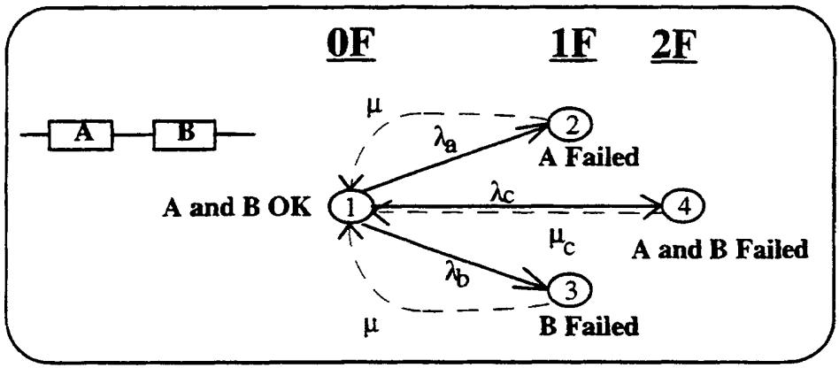  
FIGURE F3 - Markov Model of a Simple Repairable Series System

The state equations for the system represented in Figure F3 are:

$$
\begin{array}{l} \frac {\mathrm {d} P _ {1} (t)}{\mathrm {d} t} = - \left(\lambda_ {a} + \lambda_ {b} + \lambda_ {c}\right) P _ {1} (t) + \mu \left(P _ {2} (t) + P _ {3} (t)\right) + \mu_ {c} P _ {4} (t) \\ \frac {\mathrm {d} P _ {2} (t)}{\mathrm {d} t} = \lambda_ {a} P _ {1} (t) - \mu P _ {2} (t) \tag {Eq.F4} \\ \frac {\mathrm {d} P _ {3} (t)}{\mathrm {d} t} = \lambda_ {\mathrm {b}} P _ {1} (t) - \mu P _ {3} (t) \\ \frac {\mathrm {d} P _ {4} (t)}{\mathrm {d} t} = \lambda_ {\mathrm {c}} P _ {1} (t) - \mu_ {\mathrm {c}} P _ {4} (t) \\ \end{array}
$$

# SAE ARP4761

# F.2.1.2 (Continued):

where  $\mathsf{P_i(t)}$  is the probability of being in state i at time t. For constant failure and repair rate and an initial condition of  $\mathsf{P}(0) = [1000]^{\top}$  (T stands for transpose), the state equations can be integrated (similar to the procedure shown in F.2.1.1) to obtain closed form expressions for all the probability values. For simplicity, they are not shown here.

# F.2.2 Parallel Systems:

F.2.2.1 A Parallel System - Non-repairable: The Markov model of the parallel system is given in Figure F4 in which system failure is defined to be the failure of components A and B. Because of the nature of the Markov method, order dependencies can be easily included in the Markov chain; i.e., states 4 and 5. States 4 and 5 in the Markov chain distinguish between the two possible orders of component failure leading to a system loss.

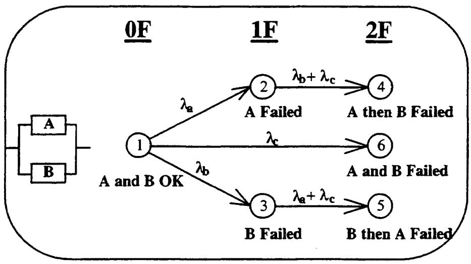  
FIGURE F4 - Markov Model of a Simple Parallel System

Assuming the failure rates of components A and B to be  $\lambda_{a}$  and  $\lambda_{b}$  respectively, common mode failure rate to be  $\lambda_{c}$ , and  $P_{i}(t)$  being the probability of system being in state 'i' at time 't', the state equations for this system are:

# SAE ARP4761

# F.2.2.1 (Continued):

$$
\begin{array}{l} \frac {\mathrm {d} P _ {1} (t)}{\mathrm {d} t} = - \left(\lambda_ {a} + \lambda_ {b} + \lambda_ {c}\right) P _ {1} (t) \\ \frac {d P _ {2} (t)}{d t} = \lambda_ {a} P _ {1} (t) - (\lambda_ {b} + \lambda_ {c}) P _ {2} (t) \\ \frac {d P _ {3} (t)}{d t} = \lambda_ {b} P _ {1} (t) - \left(\lambda_ {a} + \lambda_ {c}\right) P _ {3} (t) \tag {Eq.F5} \\ \frac {\mathrm {d} P _ {4} (t)}{\mathrm {d} t} = \left(\lambda_ {\mathrm {b}} + \lambda_ {\mathrm {c}}\right) P _ {2} (t) \\ \frac {\mathrm {d} P _ {5} (t)}{\mathrm {d} t} = \left(\lambda_ {a} + \lambda_ {c}\right) P _ {3} (t) \\ \frac {\mathrm {d} P _ {6} (t)}{\mathrm {d} t} = \lambda_ {c} P _ {1} (t) \\ \end{array}
$$

For constant failure rate and an initial condition of  $\mathsf{P}(0) = [100000]^\top$  the state probabilities are:

$$
\begin{array}{l} P _ {1} (t) = e ^ {- \left(\lambda_ {a} + \lambda_ {b} + \lambda_ {c}\right) t} \\ P _ {2} (t) = e ^ {- (\lambda_ {b} + \lambda_ {c}) t} \left(1 - e ^ {- \lambda_ {a} t}\right) \\ P _ {3} (t) = e ^ {- (\lambda_ {a} + \lambda_ {c}) t} \left(1 - e ^ {- \lambda_ {b} t}\right) \\ P _ {4} (t) = \frac {\lambda_ {a}}{\lambda_ {a} + \lambda_ {b} + \lambda_ {c}} - e ^ {- (\lambda_ {b} + \lambda_ {c}) t} + \frac {\lambda_ {b} + \lambda_ {c}}{\lambda_ {a} + \lambda_ {b} + \lambda_ {c}} e ^ {- (\lambda_ {a} + \lambda_ {b} + \lambda_ {c}) t} \tag {Eq. F6} \\ P _ {5} (t) = \frac {\lambda_ {b}}{\lambda_ {a} + \lambda_ {b} + \lambda_ {c}} - e ^ {- (\lambda_ {a} + \lambda_ {c}) t} + \frac {\lambda_ {a} + \lambda_ {c}}{\lambda_ {a} + \lambda_ {b} + \lambda_ {c}} e ^ {- (\lambda_ {a} + \lambda_ {b} + \lambda_ {c}) t} \\ P _ {6} (t) = \frac {\lambda_ {c}}{\lambda_ {a} + \lambda_ {b} + \lambda_ {c}} \left(1 - e ^ {- (\lambda_ {a} + \lambda_ {b} + \lambda_ {c}) t}\right) \\ \end{array}
$$

$\mathsf{P}_2(t)$  and  $\mathsf{P}_3(t)$  give the probability of the system being in a degraded mode; i.e., A has failed and B is operational and vice-versa. The probability of system failure is equal to the sum of  $\mathsf{P}_4(t), \mathsf{P}_5(t)$ , and  $\mathsf{P}_6(t)$ . In this case also, one can show that the probability equations derived from combinatorial techniques are similar to the ones obtained above using the same argument as given in the previous section.

# SAE ARP4761

# F.2.2.2 A Parallel System - Repairable: The Markov model for a repairable parallel system is given in Figure F5.

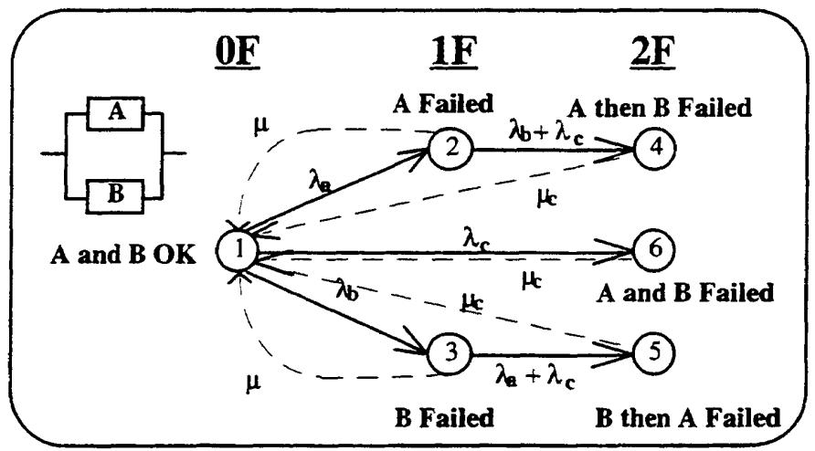  
FIGURE F5 - Markov Model of a Simple Repairable Parallel System

The repair rates are assumed to be  $\mu$  and  $\mu_{\mathrm{c}}$  from states where there is only one component failure and two component failures respectively. They are shown as dotted lines in Figure F5. Assuming the failure rates of components A and B to be  $\lambda_{\mathrm{a}}$  and  $\lambda_{\mathrm{b}}$  respectively, common mode failure rate to be  $\lambda_{\mathrm{c}}$ , and  $\mathsf{P}_{\mathrm{i}}(\mathsf{t})$  being the probability of system being in state 'i' at time 't', the state equations for this system are:

$$
\frac {d P _ {1} (t)}{d t} = - \left(\lambda_ {a} + \lambda_ {b} + \lambda_ {c}\right) P _ {1} (t) + \mu \left(P _ {2} (t) + P _ {3} (t)\right) + \mu_ {c} \left(P _ {4} (t) + P _ {5} (t) + P _ {6} (t)\right)
$$

$$
\frac {\mathrm {d} P _ {2} (t)}{\mathrm {d} t} = \lambda_ {a} P _ {1} (t) - (\lambda_ {b} + \lambda_ {c} - \mu) P _ {2} (t)
$$

$$
\frac {d P _ {3} (t)}{d t} = \lambda_ {b} P _ {1} (t) - (\lambda_ {a} + \lambda_ {c} - \mu) P _ {3} (t) \tag {Eq.F7}
$$

$$
\frac {d P _ {4} (t)}{d t} = \left(\lambda_ {b} + \lambda_ {c}\right) P _ {2} (t) - \mu_ {c} P _ {4} (t)
$$

$$
\frac {\mathrm {d} P _ {5} (t)}{\mathrm {d} t} = \left(\lambda_ {a} + \lambda_ {c}\right) P _ {3} (t) - \mu_ {c} P _ {5} (t)
$$

$$
\frac {\mathrm {d} P _ {6} (t)}{\mathrm {d} t} = \lambda_ {\mathrm {c}} P _ {1} (t) - \mu_ {\mathrm {c}} P _ {6} (t)
$$

One can derive the exact state probabilities by integrating the above equations as was done in the previous section.

# SAE ARP4761

# F.2.3 Fault and Error Handling Models (FEHM) in Markov Analysis:

Usually, faults in a system occur at a very low rate. The time to detect and handle a fault will be very short, usually in the order of seconds or less. This many orders of magnitude difference in fault occurrence and detection times, make the Markov chain very stiff and the solution time of the reliability model may be very large. To reduce this time, the solution method can be broken down into two parts: The first part deals with the conditions for system to fail and the repair strategy involved, and is called the Fault Occurrence and Repair Model (FORM). The system behavior is described by means of fault trees or Markov chains. The second part defines the system behavior after a fault occurs. This model, Fault and Error Handling Model (FEHM), computes four probabilities which are defined below:

R = probability that the system perceives the occurred fault as a transient and recovers from this transient fault.  
C = probability that the system perceives the occurred fault as a permanent fault and successfully completes permanent reconfiguration with resulting loss in module redundancy.  
S = probability that the system fails due to its inability to detect, isolate, and/or recover from the occurred fault.  
N = probability that the system fails due to the occurrence of a second (near-coincident) fault while handling the first fault.

In Figure F6, several FEHM modes are shown which can be used to define these complex actions and interactions in the system upon occurrence of a fault.

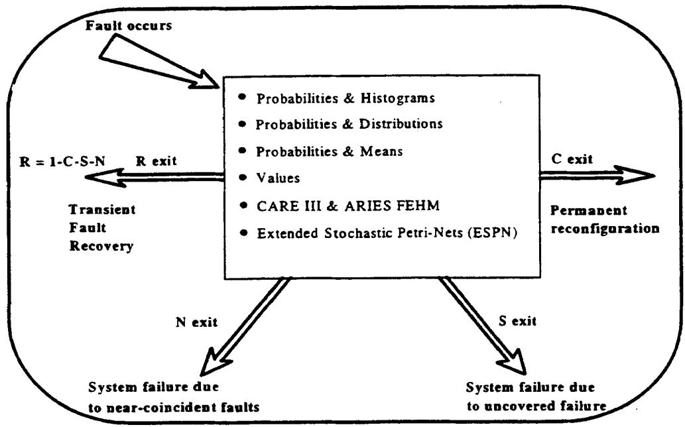  
FIGURE F6 - A List of Generic Fault Error Handling Models (FEHM)

# SAE ARP4761

# F.2.3 (Continued):

Here the 'C' exit is taken if the fault in the system is detected and the system successfully reconfigures into a degraded mode. The 'R' exit is taken if the system is able to detect the failure and is able to diagnose the fault and recover from it. In this case, the system behaves as if no fault has occurred previously. The 'S' exit is taken if the system fails to recognize the fault and this fault leads to system failure. The 'N' exit is taken if a second fault occurs in the system while it is trying to reconfigure from the earlier fault. In this situation, the system is always assumed to go to a failure state. These FEHM models are "canned" models which deal with a variety of error recovery scenarios in real life. For example, the ARIES FEHM model deals with system recovery from a fault in phases which might reflect different retries upon a soft/transient fault in the system. Similarly, the CARE III FEHM model defines error recovery in terms of detection and isolation rates and is ideal for modeling error recovery procedures in fault tolerant memory. It is always possible to define a new FEHM model which might reflect the error recovery process more accurately. This is possible by a direct input of the recovery Markov chain. Further details of the FEHM models are given in the HARP manual. It should be understood that FEHM modeling is only one of the solution techniques and is not the only solution technique available. The Analyst can use any technique as long as the validity of the methodology is explained and understood properly.

F.2.3.1 Use of FEHM in Modeling: In a simple 3-Processor/2-Bus system as illustrated in Figure F7, the system fails when all three processors have failed or when both buses have failed. The failure rates of each processor and each bus are assumed to be  $\lambda_{1}$  and  $\lambda_{2}$  respectively.

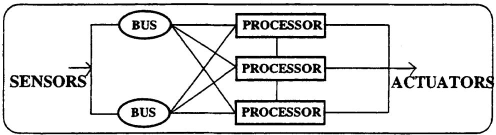  
FIGURE F7 - Signal Flow Representation of a 3-Processor/2-Bus System

One can show FEHM modeling through the use of the above example. In the first case, one can solve the system without including any FEHM. In this case, it is assumed that the system can detect any fault  $100\%$  of the time and can reconfigure to a degradable mode within no time. In the second case, imperfect coverage is assumed. In this case, upon a failure, there could be several decisions to be made such as: fault detected, fault isolated, system reconfigured, system repaired and system failure due to near coincident fault. All these scenarios can be modeled using FEHM.

# SAE ARP4761

F.2.3.2 System Modeling Without FEHM (Coverage = 1.0): The Markov chain for this system is shown in Figure F8. The state tuple is given by two variable set:  $(X,Y)$  where  $X$  is the number of functional processors in the system and  $Y$  is the number of functional buses in the system. In the case of perfect coverage, one can assume that when a processor or a bus has failed, the system always successfully transitions to the next redundant (degraded) level (i.e., from state (3,2) to state (2,2) or from (3,2) to (3,1) upon a processor or a bus failure respectively (see Figure F8)).

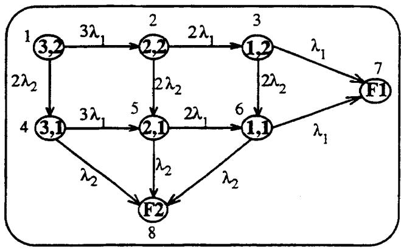  
FIGURE F8 - Markov Chain Representation of a 3-Processor/2-Bus System without Coverage

Assuming  $\mathsf{P_i(t)}$  represents the probability that the system is in state 'i' at time 't', the state equations for this example are constructed by inspecting the Markov chain and are given below:

# SAE ARP4761

# F.2.3.2 (Continued):

(3,2)  $\frac{\mathrm{d}P_{1}(t)}{\mathrm{d}t} = (-3\lambda_{1} - 2\lambda_{2})P_{1}(t)$  
(2,2)  $\frac{\mathrm{d}P_{2}(t)}{\mathrm{d}t} = 3\lambda_{1}P_{1}(t) - (2\lambda_{1} + 2\lambda_{2})P_{2}(t)$  
(1,2)  $\frac{\mathrm{d}P_{3}(t)}{\mathrm{d}t} = 2\lambda_{1}P_{2}(t) - (\lambda_{1} + 2\lambda_{2})P_{3}(t)$  
(3,1)  $\frac{\mathrm{d}P_4(t)}{\mathrm{d}t} = 2\lambda_2P_1(t) - (3\lambda_1 + \lambda_2)P_4(t)$  (Eq. F8)  
(2,1)  $\frac{\mathrm{d}P_{5}(t)}{\mathrm{d}t} = 2\lambda_{2}P_{2}(t) + 3\lambda_{1}P_{4}(t) - (2\lambda_{1} + \lambda_{2})P_{5}(t)$  
(1,1)  $\frac{\mathrm{d}P_{6}(t)}{\mathrm{d}t} = 2\lambda_{2}P_{3}(t) + 2\lambda_{1}P_{5}(t) - (\lambda_{1} + \lambda_{2})P_{6}(t)$  
(F1)  $\frac{\mathrm{d}P_7(t)}{\mathrm{d}t} = \lambda_1P_3(t) + \lambda_1P_6(t)$  
(F2)  $\frac{\mathrm{d}P_{8}(t)}{\mathrm{d}t} = \lambda_{2}P_{4}(t) + \lambda_{2}P_{5}(t) + \lambda_{2}P_{6}(t)$

F.2.3.3 System Modeling with FEHM (Coverage  $< 1$ ): If the 3-Processor/2-Bus system contains imperfect coverage (i.e., presence of latent failures and less than  $100\%$  fault detectability) or could face transient, intermittent or near coincident failures, one can model these scenarios by using some type of Fault and Error Handling Models (FEHM). When a fault occurs, the system can recover from the fault without declaring it as a permanent fault. Figure F6 shows six generic FEHM which are available in Hybrid Automated Reliability Predictor (HARP). Figure F9 shows a Markov chain with coverage being employed to handle the system faults. When a fault occurs, there is some probability, C, which is less than 1, that the system will reconfigure to the next lower redundant (or degraded) level. The fault can also be undetected and so severe that it will cause the entire system to fail. The probability of such a failure is denoted as Failure due to Single Point Fault (FSPF). Another failure mode which is considered in this Markov chain is that, while a fault is being recovered, a second fault occurs almost at the same time or before reconfiguration can take place to cause Failure due to a Near-Coincident Fault (FNCF).

# SAE ARP4761

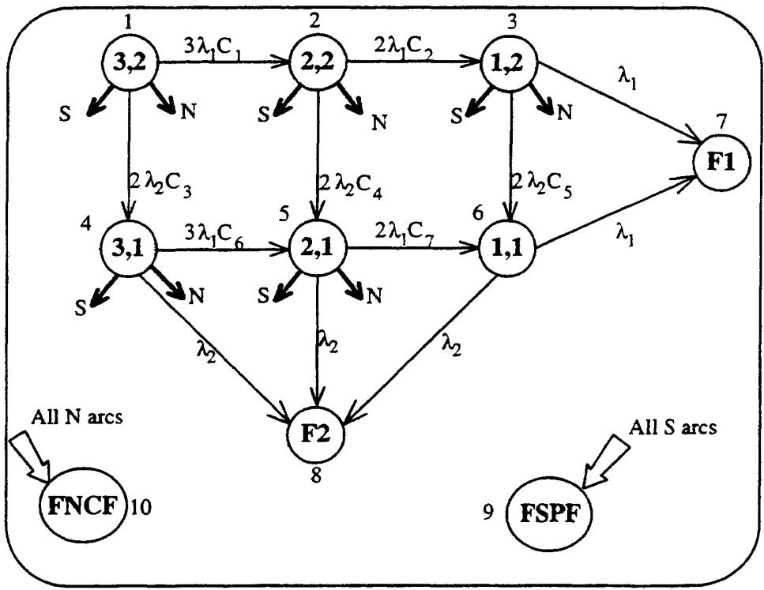  
FIGURE F9 - Markov Chain Representation of a 3-Processor/2-Bus System with Imperfect Coverage

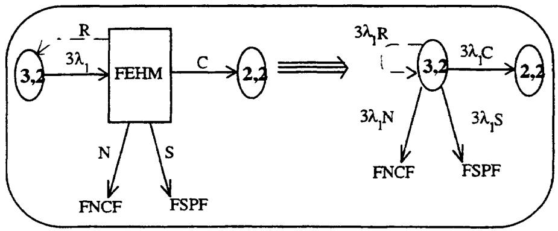  
FIGURE F10 - Effect of Using FEHM Models in Markov Chain Representation

# SAE ARP4761

# F.2.3.3 (Continued):

Here, from a state (3,2) the system enters FEHM with a failure rate of  $3\lambda_{1}$ . From this FEHM, the system can take four exits (each corresponding to the system behavior under fault condition).

a. It can go to a state (2,2) with a finite probability given by the imperfect coverage value, C.  
b. The system diagnoses the fault and returns back to the (3,2) state with probability given by the restoration factor,  $R$ .  
c. The fault might go undetected and lead to a system failure with a probability, S.  
d. Before the system can reconfigure from the first fault, there might be a second fault in the system with probability,  $N$  and this double fault in the system leads to a near coincident failure.

As shown in Figure F10, each state in the Markov chain is modified by inserting C, R, S, and N values and then solving the Markov chain. These values are directly provided by the user or are calculated from the distributions for these exits given by the user. The HARP tool has the capability to modify the Markov chain accordingly, once the user provides the FEHM.

In the SURE tool, the FEHM concept is included in the form of functions. Whenever a component fails, a function is used to define the mean time to reconfigure the system to a degraded state with less redundancy. Similarly, other functions are used to define the near coincident faults. The advantage of the SURE program lies in the fact that these functions can be any distribution functions and not limited to exponential functions alone.

# F3 STATE SPACE REDUCTION TECHNIQUES FOR MARKOV MODELS:

Markov models can become very large and complex. For this reason it may be necessary to explore techniques for reducing the size of the models.

# F.3.1 State Aggregation:

State aggregation is one method of reducing the size of the Markov chain. This technique aggregates two states with identical failure rates into a single state. The example below shows the concept of state aggregation. This system contains three processors with failure rates of  $\lambda_{1}$ ,  $\lambda_{2}$ , and  $\lambda_{3}$ . The System is assumed to be failed if all the processors fail. Figure F11 shows the Markov chain of the system.

# SAE ARP4761

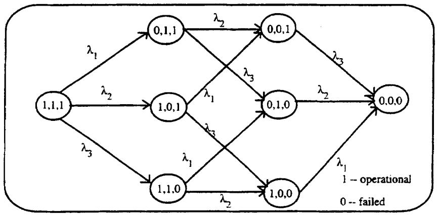  
FIGURE F11 - Markov Chain Representation of Three Processor System

# F.3.1 (Continued):

To illustrate state aggregation, assume that all processors are identical. Hence the failure rates of all components are given by  $\lambda$ . The Markov chain equivalent in this case can be reduced by combining all the states which are within the same column in Figure F11. The reduction was possible by noticing that any pair of transitions between two columns are identical and this reduces the Markov chain to the one shown in Figure F12.

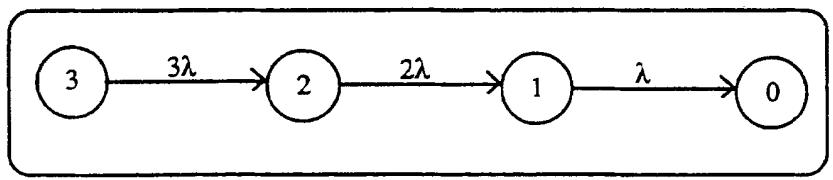  
FIGURE F12 - Reduced State Space of Three Processor System Using State Aggregation

One can observe that three states in one column of Figure F11 have been aggregated into one state in Figure F12. This reduces the total number of states from 8 in Figure F11 to 4 in Figure F12.

These states are hardware equivalent since the faults which define the states are equally likely. They are also transition equivalent since the ongoing system reliability when further faults occur is also identical. States which are hardware equivalent are not necessarily transition equivalent and vice-versa. It is transitional equivalence only which is valid for model reduction.

# SAE ARP4761

# F.3.2 Model Truncation:

Model truncation reduces the Markov chain by terminating the process of generation of the Markov chain in the direction in which the state probabilities will be very small. Another form of truncation is to terminate the generation of the Markov chain after a certain number of failures have occurred in the system. This assumes that the probability of finding the system with a number of failures greater than the truncation limit is very small. Using the same example shown in Figure F12, assume that the model is to be truncated after 2 failures. Then the Markov chain is further reduced and is shown below:

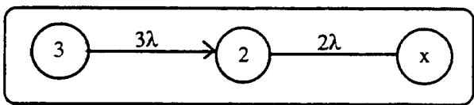  
FIGURE F13 - Reduced State Space of Three Processor System Using Model Truncation

By solving these models one can determine/verify that the exact unreliability from the full model lies between the upper and lower bounds obtained from the truncated model. The analyst has to decide about the required level of truncation by evaluating the spread between the upper and the lower bounds. Upper bounds on system reliability are obtained by assuming that all truncated states are operational states. Similarly, lower bounds on system reliability are obtained by assuming that all truncated states are failed states. This computation is done by many tools such as HARP, SURE and others which are discussed later.

# F.3.3 Hierarchical Modeling:

One method of reducing the size of a Markov chain is to break a large model into many independent sub-models. This can be achieved if each sub-model is independent. To illustrate an example of this scenario, consider the earlier defined system consisting of three processors (failure rate:  $\lambda_1$ ) and two buses (failure rate:  $\lambda_2$ ). The system is assumed to fail if all three processors fail or both buses fail. One can develop sub-models for the processor system and bus system and then solve them separately before combining their results. Figure F14 shows the sub chains for both the processor and bus system. A word of caution here is that the independence of sub-models should be evaluated very carefully in such cases; in the current fault tolerant systems where there are component dependencies and repairs involved, breaking the model into independent sub-models may not always be possible.

# SAE ARP4761

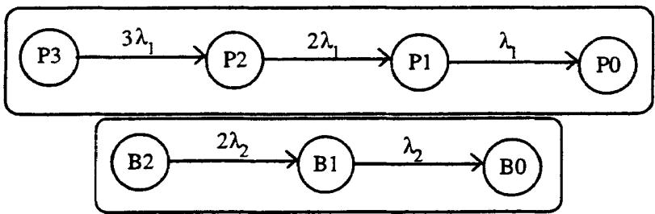  
FIGURE F14 - Separate Sub-chains for Processor and Bus System

# F.3.3 (Continued):

The probability of system failure, from simple combinatorial techniques is given by:

P (all Processors or all Buses failure)

$=$  probability of all processors failure (prob. (P0))  
+ probability of all buses failure (prob. (B0))  
prob. (P0)*prob. (B0)

This equation follows from the assumption of independence between the processor and bus sub-models.

# F.4 TOOLS AVAILABLE:

Numerous Markov model solvers are available. The following three computer based Markov tools (SURE, SHARPE, and HARP) have been successfully applied to many large and complex problems. There are other tools (SPNP, REST, SURF, ASSURE) which deal with the reliability and availability issues but all of those tools can be categorized into these three tool sets. SURE was developed at NASA Langley whereas HARP was developed at Duke and Clemson Universities under NASA grant. Both of these tools are available from NASA Langley. SHARPE was developed at Duke University.

# F.4.1 SURE - Semi-Markov Unreliability Range Evaluator and ASSIST:

The SURE program uses two bounding theorems to compute the upper and lower bounds on system reliability. The advantage of the SURE technique is that the bounds are algebraic in form and, consequently, are computationally efficient. The SURE program divides the transitions into fast and slow paths where fast paths define system recovery from a fault and slow paths refer to the system failures. Once the paths are defined SURE builds a path list leading from the starting state to the final undesired state and computes the probability of traversing this path given the mean and distribution of the transition function for each branch in the path. This program enables the solution of large and complex Markov models. Since SURE can handle a general distribution of recovery time, the overall fault-handling process can be captured in a single transition. The output contains the following information.

# SAE ARP4761

# F.4.1 (Continued):

a. The upper and lower bounds on the probability of the total system failure  
b. The probability bounds for each undesired event in the model  
c. The list of every path in the model and its probability of traversal

An associated program called "ASSIST" can generate Markov models in a format compatible with SURE. However, one has to learn the ASSIST language to input data. Due to the limitations of bounding algorithms, steady state solution or fleet average probabilities cannot be computed using SURE.

# F.4.2 SHARPE - Symbolic Hierarchical Automated Reliability/Performance Evaluator:

SHARPE enables the user to construct hybrid and hierarchical system models. Hybrid modeling combines the flexibility of Markov models and the efficiency of combinatorial methods. The built-in model types are: reliability block diagram, fault tree, reliability graphs, Markov chains, acyclic or irreducible semi-Markov chains, single and multiple-chain product-form queuing networks, (which are cascade of Markov chains), generalized stochastic Petri Mets (finite state machine description of the system), and series-parallel task graphs. Hierarchical modeling aggregates the predefined sub-models, thereby avoiding both the large state space and stiffness problems.

The Ease of use and efficiency of SHARPE make it a very useful tool for the preliminary design process.

# F.4.3 HARP - The Hybrid Automated Reliability Predictor:

The main approach for reducing the state space in HARP is behavioral decomposition. The reliability model is divided into two types of models: slow and fast. The Fault Occurrence Repair Models (FORM) are analyzed separately. The FORM contains information about the structure of hardware redundancy repair procedures, and can be specified either as a fault tree or Markov chain. The coverage model (FEHM) allows modeling of the recovery procedure necessary for the three types of faults; permanent, intermittent and transient faults. Seven different types of FEHM are available to the user. HARP accepts a nominal value and a variance of all input parameters. Additionally, HARP supports the modeling of time dependent failure rates associated with the Weibull failure distribution. This capability applies only to the non-repairable systems. The output file contains information about the probability of user-specified states. HARP provides automatic generation of Markov chains for non-repairable systems if the input is a fault tree.

With fault tolerant systems, components may or may not be operational at the start of a flight. Components are maintained at different scheduled times, per the airline's maintenance plans. Therefore, it is possible that one or more redundant components may have failed (latently or otherwise) before the start of a flight. Another scenario deals with different phases of a flight where the components can have different failure rates or a different set of components is operational.

# SAE ARP4761

# F.5 EXAMPLES:

Some of the Markov modeling examples which have great significance in aviation systems are given below. Any tool can be used to generate and solve the equations. For the sake of brevity, the equations are not shown here.

The Markov models shown below present a methodology for modeling latent faults. The results can be processed to derive the worst case failure probabilities and the average failure probabilities. The models provide a vector of failure probabilities where each vector corresponds to the system failure probability per flight. Using these values, the worst case estimate of failure probability is computed by taking the failure probability of the last flight. To compute the average value of failure probability over the duration of the maintenance check interval, one can sum up all the failure probability values at the end of each flight and divide by the number of flights.

# F.5.1 Latent Fault Modeling Using Discrete Repair Process:

If a component is known to be working at the start of a flight, then the reliability calculation is based on an exposure time equal to the flight length. Some aircraft systems include components which are not inspected every flight. Failures of this type of component are called latent because they are not detected unless another failure occurs or a scheduled inspection is performed. There are several possible scenarios depending on whether both the active and standby systems are latent or monitored events and if fault sequencing is important or not. The dashed repair arcs in Figures F15 through F18 represent discrete repairs at fixed intervals. Repairs from system failure states,  $F$ , are not shown because these depend on maintenance policy (i.e. the repairs could be partial or full.). Some of the important scenarios along the Markov representation for these scenarios are given below.

# a. Scenario I: A system comprising a component and a monitor

The component is checked before each flight to confirm that it is working, and repaired if necessary. The monitor is not checked before each flight but is regularly checked at a maintenance interval. Thus failure of the monitor can be latent. In reliability analysis, we need to distinguish between a monitored failure and unmonitored failure of the component because the implications of unmonitored failure are likely to be more severe. In this discussion we examine only the computation of probability of an unmonitored failure. An unmonitored failure occurs only if the monitor fails before the component. The Markov representation of this scenario is shown in Figure F15. End of flight inspections and repairs if required are represented as dotted lines with  $m_t$  as the parameter in Figure F15. Scheduled inspection and repairs if required are shown as dotted lines with  $m_T$  as the parameter in Figure F15. This is true in all the subsequent Markov models shown through Figures F16 to F18. In Figure F15,  $\lambda$  is the failure rate of the component and  $\beta$  of the monitor.

# SAE ARP4761

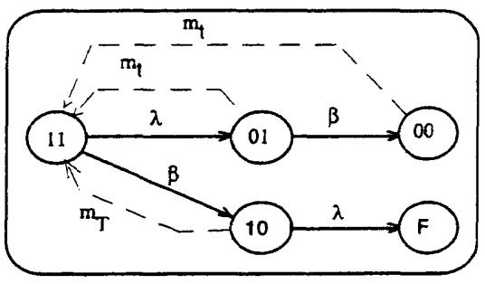  
FIGURE F15 - Markov Chain for a Component and a Latent Failing Monitor System

# F.5.1 (Continued):

b. Scenario II: A system comprising a component and a backup

The component is checked each flight and repaired if found defective. The backup is checked only at a maintenance interval. System failure occurs if the backup component has failed at the time that the component fails or if the backup fails on the same flight as the component. This differs from scenario I in that failure of the monitor after failure of the component but on the same flight would not comprise an unmonitored failure. Markov representation of this scenario is shown in Figure F16. In Figure F16,  $\lambda$  is the failure rate of the component and  $\beta$  of the backup.

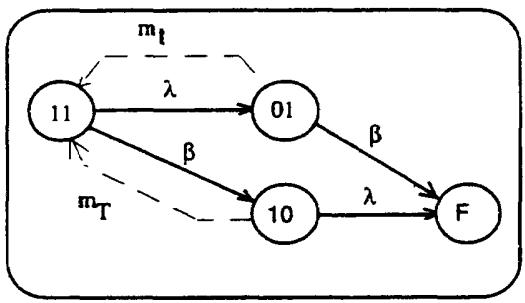  
FIGURE F16 - Markov Chain for a Component and a Latent Failing Backup System

c. Scenario III: A system comprising two components

When one component of a two component system fails, the backup takes over, but there is no indication that this has happened. The system is checked each flight to ensure that the system is operational. This check ensures that at least one of the two components is working. The individual components are checked at a fixed maintenance interval. Markov model representation for this scenario is shown in Figure F17. Both components are repaired at the end of scheduled inspection interval as shown by dotted lines in the model. 'F' state probability at the end of every flight is adjusted to zero to take into account the fact that the system is operational at the start of any flight with at least one component functional.

# SAE ARP4761

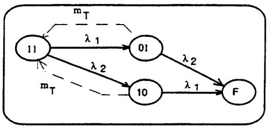  
FIGURE F17 - Markov Chain for a Two Component System, Both Failing Latently

# F.5.1 (Continued):

d. Scenario IV: A system comprising n component

When one component of an n-component system fails, then a backup takes over, but there is no indication that this has happened. The system is checked each flight to ensure that the system is operational. This check ensures that at least one of the n components is working. The individual components are all checked at a fixed maintenance interval  $T$ . The Markov chain representation for a three component system is shown in Figure F18. All the repair intervals in the model are the scheduled inspection interval of all the components. At the end of each flight, the fail state probability is adjusted to zero to take into account the fact that the system is operational at the start of any flight with at least one component functional.

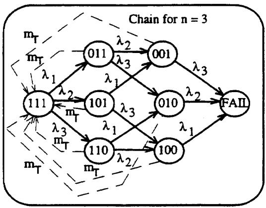  
FIGURE F18 - Markov Chain for a Three Component System, All Failing Latently

# SAE ARP4761

# F.5.2 A Scheduled Maintenance Example:

As an example, consider a two engine system, left and right engines, where each engine has two controllers as illustrated in Figure F19. The system fails when the functionality in all four controllers is lost (state 9 in the Markov chain). The system is functionally degraded when one or more of the controllers are dead. It may be in a non-dispatch state as per regulations when both controllers for one engine are lost. In the figure, all states shown to the left of dotted line are dispatchable states. However, the failure definitions (scenarios) can be modified to account for the Minimum Equipment List (MEL). It is assumed in this example that the system has a different failure rate from each state.

If the left engine is repaired at the end of a flight, then one can know for sure that both controllers in that engine will be fully operational at the start of the next flight. In other words, in the Markov chain at the start of the next flight, the probability of a controller for the left engine failure should be zero. This results in the probabilities of states 3, 4, 6, 7, 8, 9 (shaded in the Figure F20) being initialized to zero at the start of the next flight. The user should be aware that this redistribution of state probabilities may be computerized in a modified version of HARP. The user has to specify that the left engine is being brought up to a fully operational state and the program does the rest.

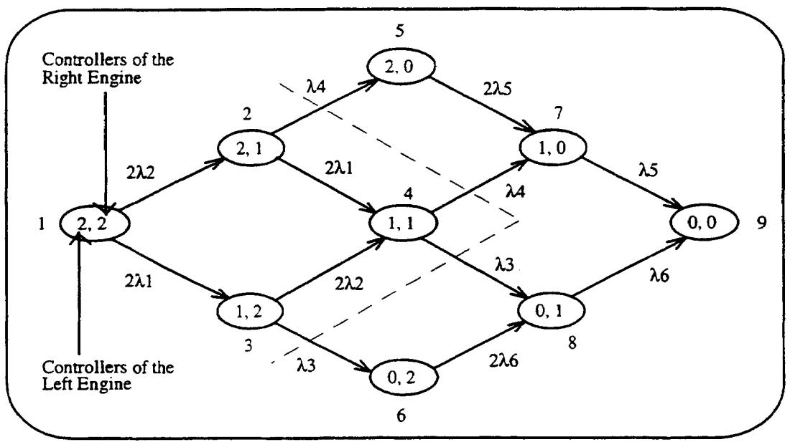  
FIGURE F19 - Markov Chain for the Two Engine Example

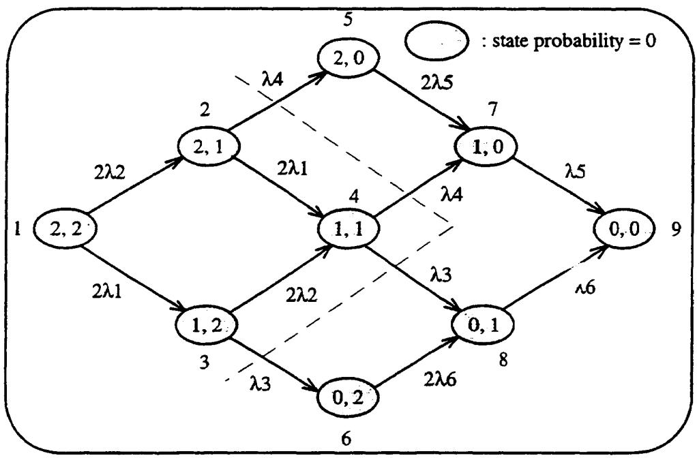  
FIGURE F20 - Markov Chain Modification When Left Engine is Brought to Fully Operational State at the Start of the Next Flight

# F.5.2 (Continued):

Similarly, when the right engine is repaired at the end of a flight, then one can know for sure that both controllers in that engine will be fully operational at the start of the next flight. In other words, in the Markov chain at the start of the next flight, the probability of a controller for the right engine failure should be zero. This results in the probabilities of states 2, 4, 5, 7, 8, 9, (shaded lightly in the Figure F21) being initialized to zero at the start of the next flight.

This example shows the usefulness of Markov modeling as it allows the user to specify different maintenance scenarios.

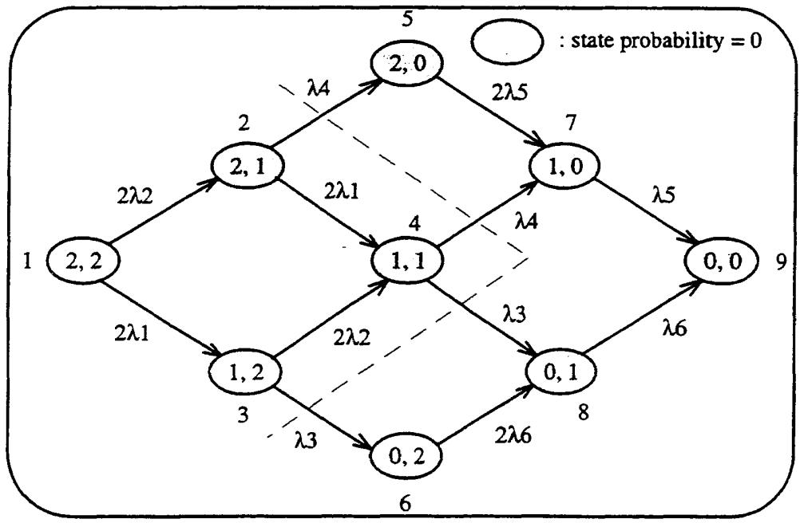  
FIGURE F21 - Markov Chain Modification When Right Engine is Brought to Fully Operational State at the Start of the Next Flight

# F.5.3 A Multi-Phase Example:

Consider the same example of two engines as given in the previous section. The system is assumed to be of two phases. In the first phase, the system starts in a state where two controllers on both engines are working perfectly. Now assume that in the second phase, knowing that two controllers on the left engine have failed, one needs to estimate the specific risk of the system. Here specific risk is the subsequent risk on a flight given a known dispatch inoperative condition (i.e., both controllers on left engine have failed). Knowing this, one needs to know how long the system can operate safely, while the aircraft lands at the nearest airport within specified duration.

The phase 1 Markov chain is the same as that shown in Figure F19. In phase 2, since the left engine is assumed to have failed, there are only three states in the system: in the right engine either two, one or zero controllers are working. The resultant Markov chain for phase 2 is shown in Figure F22. The system is assumed to be operational as long as at least one controller on the right engine is working. Since, one is already assuming that left engine has failed at the start of phase 2, states 1, 2, 3, 4, 5 and 7 are initialized to zero at the start of phase 2. The results at the end of phase 2 give the specific risk of the system given the fact that one started a phase in a degraded configuration (left engine being failed).

# SAE ARP4761

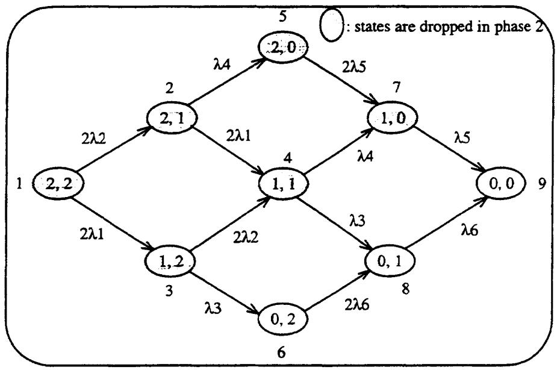  
FIGURE F22 - Markov Chain Modification for Phase 2 Configuration In Phase 2, Shaded States are Dropped from the Markov Chain

# F.5.3 (Continued):

The software tools HARP and SURE can be modified to include multi-phase analyses and scheduled maintenance scenarios.

# SAE ARP4761

# APPENDIX GF AILURE MODES AND EFFECTS ANALYSIS (FMEA)

NOTE: The basic ARP4761 document contains information which places the information in this appendix in context. This appendix should be used in conjunction with the main body of the document.

# G.1 INTRODUCTION:

A Failure Modes and Effects Analysis (FMEA) is a systematic method of identifying the failure modes of a system, item, function, or piece-part and determining the effects on the next higher level of the design. The detection method (if any) for each failure mode may also be determined. An FMEA may be a quantitative or qualitative analysis and may be performed on all types of systems (e.g., electrical, electronic or mechanical systems). If a quantitative FMEA is being performed, a failure rate is determined for each failure mode. The results of an FMEA may be used to generate the Failure Modes and Effects Summary (FMES) and are usually used to support the other analysis techniques of the System Safety Assessment (SSA) process such as Fault Tree Analysis (FTA), Dependence Diagram (DD), or Markov Analysis (MA). Combinations of failures are not usually considered as part of the FMEA.

# G.2 SCOPE:

An FMEA is performed at a given level (system, item, etc.), by postulating the ways the chosen level's specific implementation may fail. The effect of each failure mode is determined at the given level and usually the next higher level for each operating mode of the equipment. Sometimes an FMEA may be focused toward a specific operating scenario as required to support a top down FTA, DD, or MA.

The FMEA must account for all safety related effects and any other effects identified by the requirements. In cases where it is not possible to identify the specific nature of a failure mode, the worst case effect must be assumed. If the worst case is unacceptable for the fault tree, the failure modes must be examined at the next lower indenture level. (i.e., If the FMEA is being conducted at the functional level, drop to the piece-part level and exclude components with no effect on the event under consideration. If the analysis is being conducted at a piece-part level, drop to consider specific failure mechanisms within the part. Another option is to redesign to improve redundancy or add monitoring.)

Regardless of the level the FMEA is to be performed to, the major steps of an FMEA include preparation, analysis, and documentation.

# SAE ARP4761

# G.3 FMEA PROCESS:

# G.3.1FMEA Preparation:

The preparation of an FMEA includes determining the customer requirements, obtaining current documentation, and understanding the operation of the function.

It is important to know the customer's expectations and requirements for the FMEA before beginning. If the FMEA requirements are not known, the FMEA may not meet the needs of the requester and may have to be redone.

Requirements for an FMEA usually originate from a PSSA activity such as an FTA, DD, MA. The analyst needs to know the analysis level (functional versus piece-part), safety related effects, other failure effects and operational modes of interest. An FMEA is used to support the safety assessment process by providing failure rates to quantify the basic event of the FTA, DD, or MA. An FMEA may also be used to support verification of the FTA through a comparison of the FMEA failure modes with the basic events of the fault tree.

The final step before beginning to perform the analysis is to obtain the following information which may be necessary to complete the analysis, or may simplify the analysis activity.

a. FMEA requirements including safety related and requested failure effects and specific operating modes of interest  
b. Specifications  
c. Current drawings or schematics  
d. Parts lists for each system or item  
e. Functional block diagrams  
f. Explanatory materials including the theory of operation  
g. An applicable list of failure rates (G.3.2)  
h. The FMEA on the previous generation or similar function  
i. Any design changes and revisions that have not yet been included on the schematic (NOTE: Designs may change frequently and having the most up to date material will reduce FMEA updates.)  
j. Preliminary list of component failure modes from previous FMEAs, if applicable

NOTE: For FMEAs performed early in the design stage, some of the above information will not be available and assumptions or estimates may have to be made. Detailed documentation of these assumptions must be maintained for traceability and to simplify future updates.

# SAE ARP4761

# G.3.2Performing the Analysis:

The analyst needs to review and understand the information gathered during the preparation stage previously described. The analyst will also find it useful to understand the functions that the design being analyzed performs within the next higher level. After the analyst has gained sufficient knowledge, failure modes are identified. Every feasible hardware failure mode is postulated at the level of the design being analyzed. Consideration is given to failure modes of the components or functions that make up the given level. Information to aid in determining the failure modes of the functions or components is provided in G.3.2.1 and G.3.2.2.

Every identified failure mode is analyzed to determine its effect on the given level and usually on higher levels as well. Failure effect categories are created for each different type of effect and a code may be assigned to each effect category. Defining these codes simplified the FMEA worksheet by moving the description of each effect from the worksheet to the body of the report. The FMEA worksheet provides a list of failure modes, effects and rates. Examples of FMEA worksheets are provided in the following sections. Each effect category must have only one higher level effect, otherwise the effect categories must be defined in more detail. For example, if the effect category is originally defined as “causes signal xyz to be out of specification” but an out of specification high condition causes a different effect from an out of specification low condition, then the effect category should be split to “... out of specification high” and “... out of specification low”. Similarly if the failure mode is found to cause two higher level effects (e.g., “Loss of signal A” and “Loss of signal B”) then these two should be combined to form a new effect category “Loss of both signal A and B”.

The means by which the failure is detected is usually determined and documented within the FMEA worksheets. Examples of detection methods include detection by hardware or software monitors, flight crew detection, power up tests, and maintenance checks.

For a quantitative FMEA, a failure rate is assigned to each failure mode. Whenever possible, failure rates should be determined from failure data of similar equipment already in field use. Industry sources of failure rates including MIL-HDBK-217, MIL-HDBK-338, RAC "Nonelectronic Parts Reliability Data". (NPRD) and GIDEP (Government Industry Data Exchange Program), MIL-HDBK-978, and Rome Laboratory's "Reliability Engineer's Toolkit" can also be used. The total failure rate for each failure effect category may be detailed in a summary sheet or is summarized in the Failure Modes and Effects Summary (FMES) (see Appendix H).

There are two basic types of FMEAs, functional and piece-part. Functional FMEAs are typically performed to support the safety analysis effort with piece-part FMEAs performed as necessary to provide further refinement of the failure rate. Piece-part FMEAs are typically done when the more conservative failure rates from a functional FMEA will not allow the system or item to meet the FTA probability of failure budget. A piece-part FMEA may also be useful for systems that rely on redundancy, since a functional FMEA may not reveal single component failures affecting more than one redundant element. Piece-part FMEAs are also useful for safety analysis of mechanical items and assemblies.

# SAE ARP4761

G.3.2.1 Functional FMEA: A functional FMEA may be performed at any indenture level. The appropriate level of subdivision is determined by the complexity of the system and the objectives of the analysis. If the required analysis is on a section of circuitry or mechanical devices larger than a particular function, it should be broken down into functional blocks. From an aircraft or system level, this may mean defining each LRU or item as a functional block. From the system or lower levels it may involve breaking down an item into many blocks. The FMEA task is simplified if each block has as few outputs as possible. Once the functional blocks have been determined, a functional block diagram should be created and each block labeled with its functional name. For each functional block, internal and interface functions should be analyzed relative to system operation.

The next step is postulating the failure modes for each functional block. Determine the failure modes by thinking about the intent of the functional block and trying to determine how that function might fail regardless of the specific parts used. The analyst must know the operation of the functional block well enough to be positive that no significant failure modes have been overlooked, including single component failures that could affect more than one redundant functional block. Often, given a clear description of the block's function, many of the failure modes will become apparent.

Following is a simple example of functional failure modes:

The power supply circuitry that generates the 5V can be called a functional block. Some examples of functional failure modes would be as follows.

a. Loss of 5V  
b. Voltage less than 5V  
c. Voltage greater than  $5 \mathrm{~V}$  
d. Noise on 5V  
e. Short to ground or other voltage

There may be other failure modes based on circuit implementation.

The effect of each failure mode is determined by considering how the function fits into the overall design. Failure effect categories are generally created for each effect type and a failure effect category code is assigned. All failure modes that cause this identical effect are assigned to the effect category. The effect category code can then be entered into the FMEA worksheet for each failure, as shown in Table G1. Software and fault monitoring must be considered when determining failure effects and means of detection. As part of this analysis, the analyst must also verify that the monitoring can indeed detect the failure mode. In order to properly perform this analysis, the analyst must have detailed knowledge of the system requirements and software design including internal fault management techniques as applicable.

If a quantitative analysis is being performed, a failure rate is assigned to each failure mode. One technique is to perform a failure rate prediction for each block and apportion the failure rate across the various failure modes based on past experience of similar functions or other sources allowing determination of probability of occurrence. Guidance for failure distribution of component parts is provided in G.3.2.2.1.

# SAE ARP4761

TABLE G1 - Functional FMEA Worksheet  

<table><tr><td>SYSTEM:</td><td rowspan="2">FMEA Description:</td><td>Date:</td></tr><tr><td>Subsystem:</td><td>Sheet of</td></tr><tr><td>Item ATA:</td><td>FTA References:</td><td>File:</td></tr><tr><td></td><td>Author:</td><td>Rev:</td></tr></table>

<table><tr><td>FUNCTION NAMES</td><td>FUNCTION CODE</td><td>FAILURE MODE</td><td>MODE FAILURE RATE</td><td>FLIGHT PHASE</td><td>FAILURE EFFECT</td><td>DETECTION METHOD</td><td>COMMENTS</td></tr><tr><td></td><td></td><td></td><td></td><td></td><td></td><td></td><td></td></tr></table>

Note: May be revised to fit analysis level and program needs.

# SAE ARP4761

# G.3.2.1 (Continued):

The results of the functional FMEA are recorded in a worksheet similar to Table G1. This example table can be modified to meet program needs. Different requirements may result in addition or deletion of some of the information. The analyst should ensure that the FMEA form and content meets the specific needs of the requester before beginning the analysis.

As the analysis progresses, the following should be informally recorded for future maintenance of the FMEAs and to assist in resolving questions regarding the FMEA.

a. Justification of each failure mode  
b. Rationale for the assigned failure rate  
c. Rationale assigning a particular failure to a failure effect category  
d. Documentation of any assumptions made

This documentation is usually not included in the FMEA report but is retained for reference.

G.3.2.2 Piece-Part FMEA: A piece-part FMEA is similar to a functional FMEA except that instead of analyzing at the functional or block diagram level, the failure modes of each individual component contained in the item or function are analyzed. A piece-part FMEA can be used to determine the failure effects of potential electrical, electronic, or mechanical failures. For example, the effect of failures of a resistor or a motor shaft can be considered as part of a piece-part FMEA. Piece-part FMEAs on electronic equipment are usually performed only as necessary when the more conservative results of a functional FMEA will not allow the item to meet the FTA probability of failure budget. This is due in part to the difficulty in determining the failure modes for complex components.

The first step in a piece-part FMEA is to create a list of all components to be covered by the FMEA. The next step is to determine the failure modes of each component type. This is the most difficult part of the piece-part FMEA, particularly FMEAs performed on electronic items containing complex integrated circuits. Determining all the failure modes of any but the simplest components (where industry data is available) is extremely difficult and sometimes impossible. When in doubt the worst case assumptions of part failure modes must be made. Information to assist in determining component failure modes is contained in G.3.2.2.1.

Once a component's piece-part failure modes have been determined, they are entered into the FMEA worksheet as shown in Table G2. This example worksheet can be modified to meet individual needs. Different requirements may result in addition or deletion of some of the information in the worksheet. The analyst should ensure that the FMEA form and content meets the specific needs of the requester before beginning the analysis.

# SAE ARP4761

TABLE G2 - Piece-Part FMEA Worksheet  

<table><tr><td colspan="3">SYSTEM:</td><td rowspan="2" colspan="4">FMEA Description:</td><td>Date:</td></tr><tr><td colspan="3">Subsystem:</td><td>Sheet of</td></tr><tr><td colspan="3">Item ATA:</td><td colspan="4">FTA References:</td><td>File:</td></tr><tr><td colspan="3">Function:</td><td colspan="4">Author:</td><td>Rev:</td></tr><tr><td colspan="8"></td></tr><tr><td>PART NUMBER</td><td>PART TYPE</td><td>FAILURE MODE</td><td>MODE FAILURE RATE</td><td>FLIGHT PHASE</td><td>FAILURE EFFECT</td><td>DETECTION METHOD</td><td>COMMENTS</td></tr><tr><td></td><td></td><td></td><td></td><td></td><td></td><td></td><td></td></tr></table>

Note: May be revised to fit analysis level and program needs.

# SAE ARP4761

# G.3.2.2 (Continued):

The next step is to determine the effect of the failure on the next higher level assembly and assign a failure effect category to the failure. Failure effect codes may be assigned to each category to simplify the table. The detailed description of each failure effect category can then be included in the text of the report. All failure modes that cause this identical effect are assigned to the effect category. The effect category code can then be entered into the FMEA worksheet for each failure, as shown in Table G2. Software and fault monitoring must be considered when determining failure effects and means of detection. As part of this analysis, the analyst must also verify that the monitoring can indeed detect the failure mode. In order to properly perform this analysis, the analyst must have detailed knowledge of the system requirements and software design including internal fault management techniques as applicable.

If a quantitative analysis is being performed, a failure rate is assigned to each failure mode. Guidance for failure distribution of component parts is provided in G.3.2.2.1.

As the analysis progresses, the following should be informally recorded for future maintenance of the FMEAs and to assist in resolving questions regarding the FMEA.

a. Justification of each failure mode  
b. Rationale for the assigned failure rate  
c. Rationale assigning a particular failure to a failure effect category  
d. Documentation of any assumptions made

This documentation is usually not included in the FMEA report but is retained for reference.

# SAE ARP4761

G.3.2.2.1 Determining Piece-Part Failure Modes and Failure Distributions: When conducting piece-part FMEAs, it may be necessary to further break down the failure rates for components to identify percentages of failure rates applicable to specific failure modes. Guidance for this may be obtained from industry documents such as RAC "Failure Mode/Mechanism Distributions" (FMD), MIL-HDBK-978, and Rome Laboratory's "Reliability Engineer's Toolkit" which provide this information for many component types.

Typical failure modes to consider include, but are not limited to, the following:

a. Open  
b. Short  
c. Parameter shifts  
d. Out of adjustment  
e. Dielectric breakdown  
f. Intermittent operation  
g. Inoperative  
h. Spurious operation  
i. Wear  
j. Mechanical failure  
k. Sticking  
I. Loose  
m. Fracture

In general, the function of the component must be considered and all potential ways that the component can fail to perform that function correctly must be considered for inclusion in the list of component failure modes. Unintended function of the component must also be considered. The documents referenced above provide a good basis to allow the analyst to determine potential failure modes of the components being analyzed. Engineering judgment is a necessary part of the failure mode determination process.

While the failure rate and mode source documents provide a basis for failure modes of some component types, there will be many device types that are not included in these documents. This is especially true for complex digital ICs which need to be considered on a part by part basis. Determining the failure modes of digital devices generally requires engineering judgment and it is unlikely that all of the failure modes can be determined for a complex digital IC.

A method for estimating the failure modes of complex digital devices is to model the digital devices under consideration with constituent functional blocks for which a better definition of failure modes may exist. Identify the pin level effects of possible failures of the functional blocks as the device failure modes if possible. Some faults may affect multiple pins and various combinations of pins. Particular attention must be paid to potential component failure modes that may lead to the FTA basic events.

# SAE ARP4761

# G.3.2.2.1 (Continued):

Trying to determine the actual failure mechanisms and the associated effects through a physics of failure approach is not recommended for ICs as it forces the analyst to perform an "FMEA" on each digital IC. This "FMEA" may be more complex than the higher level FMEA being completed and may not even be possible for complex ICs. In addition, an undisclosed design enhancement by the chip manufacturer could render the entire effort obsolete. Complex IC failure modes can include intermittent faults and various fault combinations possibly affecting multiple pins.

Failure modes of other component types are more readily available than for ICs. However, a look at several sources will yield different failure mode distributions for the same component type and sometimes even different failure modes. This points out that even for simple components it is difficult to determine which potential failure modes are valid and which ones cannot happen.

G.3.2.3 Substantiation: If the analytical method of determining failure effects for a failure mode is difficult, laboratory verification should be performed if possible. It is desirable for all significant failure effects to be verified by test. For electrical or electronic systems, faults can be inserted by opening leads or shorting leads together or to ground. If device outputs can be tri-stated, logic combinations can be easily inserted. Unfortunately, the most difficult failure modes to analyze are sometimes difficult to confirm through testing. For example, it is impossible to insert all faults for most ICs. Computer aided design software may also be used to simulate failures. This software allows the equivalent of the fault to be inserted into the circuit simulation and the failure effect determined.

Analysis of failures during testing and in actual use can also be used to substantiate the results of the FMEA. This failure data can also be used to create a library of failure modes for future FMEAs.

# G.4 DOCUMENTATION:

# G.4.1FMEA Report:

The report for an FMEA should include:

a. A document number allowing the report to be referenced by the FMES, FTA or similar analysis.  
b. An introduction containing a brief statement about the purpose and the objective of the FMEA.  
c. A brief overview of operation and a block diagram.  
d. A section describing the analysis approach. (This section should include a description of how the analysis was performed, definitions of the levels used, and a listing of pertinent assumptions.)

# SAE ARP4761

# G.4.1 (Continued):

e. A complete listing of the results of the FMEA. (FMEA forms similar to the examples included in G.3.2.1 and G.3.2.2 can be used.)  
f. Identifying part numbers and revision status of hardware, software and firmware analyzed.  
g. Appendices should also include the following items.

(1) Drawings or schematic diagrams  
(2) Any failure mode distributions for lower level components defined during analysis or obtained from other sources (Include justification for all modes considered.)  
(3) A list of failure rates and failure rate source used in the analysis

# G.4.2 FMEA Checklist:

The following checklist will ensure that the correct steps are taken in the proper order to perform a cost effective and accurate FMEA.

1. Obtain written specification of requirements, if possible, from customer or requester defining:

(a) failure effects of interest,  
(b) outputs to be considered,  
(c) allowable failure detection methods,  
(d) final report format,  
(e) schedule.

2. Prepare for the analysis by:

(a) obtaining and understanding documentation,  
(b) generating parts lists,  
(c) partitioning equipment into sub levels and documenting the partitioning,  
(d) collecting failure modes of components if a piece-part analysis is required.

3. Perform detailed analysis by:

(a) determining failure modes and assigning failure effect codes,  
(b) avoiding poorly defined failure modes so that confusion will not occur when going from the current level to higher levels,  
(c) determining detection means, if required, for each failure effect category,  
(d) making detailed notes documenting why a failure category was assigned.

4. Verify analysis conclusions (with lab or aircraft data if possible) for any issues in question.  
5. Write the final report.

# SAE ARP4761

# G5. DETECTION COVERAGE ANALYSIS FOR TEST PROCESSES AND MONITORING:

This type of analysis is useful to determine how effective various test processes are at the detection of latent faults.

The method used to accomplish this involves an examination of the applicable failure modes to determine whether or not their effects are detected, and to determine the percentage of failure rate applicable to the failure modes which are detected. The possibility that the detection means may itself fail latent should be accounted for in the coverage analysis as a limiting factor (i.e., coverage cannot be more reliable than the detection means availability).

Inclusion of the detection coverage in the FMEA can lead to each individual failure that would have been one effect category now being a separate effect category due to the detection coverage possibilities. Another way to include detection coverage is for the FTA to conservatively assume that no holes in coverage due to latent failure in the detection method affect detection of all failures assigned to the failure effect category of concern. The FMEA can be revised is necessary for those cases where this conservative assumption does not allow the top event probability requirements to be met.

# SAE ARP4761

# APPENDIX H
FAILURE MODES AND EFFECTS SUMMARY (FMES)

NOTE: The basic ARP 4761 document contains information which places the information in this appendix in context. This appendix should be used in conjunction with the main body of the document.

# H.1 INTRODUCTION:

A Failure Modes and Effects Summary (FMES) is a summary of lower level failure modes with the same effects from the Failure Modes and Effects Analyses (FMEAs). The FMES is used as an input to the Fault Tree Analysis (FTA) or other analyses. The failure effects from the FMEA are failure modes for the FMES. The higher level effect is listed in the effect column of the FMES. Identical failure effects from the FMEA are categorized as one mode in the FMES.

The failure rate for each failure mode in the FMES is the sum of the failure rates coming from the failure modes of the individual FMEA(s). An FMES need not necessarily be a separate analysis; it can be done as a part of an FMEA. The FMES is an aid to simplify the FTAs (reduce the number of OR-gates at the lowest level) and to combine the effects of item failures and failures of the installation that have the same effect as one single event. For calculation of failure rates, it should be remembered that an FMEA considers single failures, whereas an FTA considers both single failures and combinations of failures.

The relationship between the FMEAs and FMES is shown in Figure H1.

# H.2 SCOPE:

This FMES appendix contains the background information and procedural guidelines necessary for an analyst to perform an FMES and to provide visibility of the benefits of compiling an FMES.

# H.3 FMES PROCESS:

# H.3.1 FMES Preparation:

The preparation for the FMES includes determining the customer requirements, obtaining applicable FMEA data and understanding the operation of the system or item being analyzed. It is important to know and understand the customer requirements for the FMES. Furthermore, all FMEA(s) and the relevant supporting material (drawings, parts lists, etc.) have to be available.

# SAE ARP4761

Circuit X FMEA  

<table><tr><td>Failure Mode</td><td>Failure Rate</td><td>Failure Effect</td></tr><tr><td>R5 Open</td><td>A</td><td>Loss of +5V</td></tr><tr><td>R5 Short</td><td>B</td><td>5V tied to GND</td></tr><tr><td></td><td></td><td></td></tr></table>

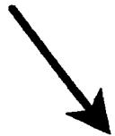

Circuit Y FMEA  

<table><tr><td>Failure Mode</td><td>Failure Rate</td><td>Failure Effect</td></tr><tr><td>C5 Short</td><td>C</td><td>5V tied to GND</td></tr><tr><td>C5 Open U58 P2 Open</td><td>D</td><td></td></tr><tr><td></td><td></td><td></td></tr></table>

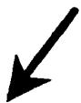

Item FMES  

<table><tr><td>Failure Mode</td><td>Failure Rate</td><td>Failure Effect</td><td>Potential Failure Cause</td></tr><tr><td>5V tied to GND</td><td>B+C</td><td>No Command Signals</td><td>Circuit X - R5 Short
Circuit Y - C5 Short</td></tr><tr><td></td><td></td><td></td><td></td></tr><tr><td></td><td></td><td></td><td></td></tr></table>

# FIGURE H1 - Example of FMEAs and FMES Relationship

# H.3.2 Performing an FMES:

The analyst should review the existing FMEA(s), and check all failure effects for consistency, (i.e., is the same failure effect always described with the same wording and does different wording for the failure effect always mean a different failure?). This check should be done with special care when an FMES on the system level is performed (i.e., summarizing effects from installation failure modes and item failure modes). The failure effect from the FMEAs is entered in the "FAILURE MODE" column of the FMES form similar to the example shown in Table H1. Note that the FMES form may be altered to add or delete specific data entries as necessary to support the specific FMES customer requirement and the specific FMEA format being used.

Identify all failure modes having the same failure effect and sum their individual failure rates. The calculated failure rate is entered in the "FAILURE RATE" column of the FMES. The references to the individual failure mode in the FMEA may be identified in the FMES "CAUSAL FAILURE" columns. The effect of the failure mode on the next higher level, the systems of that failure and the relevant phase of flight may also be entered in the relevant columns of the FMES form.

# SAE ARP4761

TABLE H1 - FMES Worksheet  

<table><tr><td colspan="4">Aircraft:</td><td colspan="4">FMES-No.:</td><td colspan="3">Date:</td></tr><tr><td colspan="4">ATA:</td><td colspan="4">Supplier:</td><td colspan="3">Sheet of</td></tr><tr><td colspan="4">System:</td><td colspan="4">Supplier&#x27;s Part Number/</td><td colspan="3">Rev:</td></tr><tr><td colspan="4">Subsystem or Unit:</td><td colspan="4">Supplier&#x27;s Drawing Ref:</td><td colspan="3">Prepared by:</td></tr><tr><td>REF</td><td>FAILURE MODE</td><td>FAILURE RATE</td><td>PHASE</td><td>EFFECTS ON SYSTEM</td><td>SYMPTOMS 1. Flight Crew 2. Ground Crew</td><td>1. CAUSAL FAILURE 2. REMARKS</td><td>CAUSAL FAILURE REF</td><td>CHECK REF</td><td>FAILURE CONDITION REF</td><td></td></tr></table>

Note: May be revised to fit analysis level and program needs.

# SAE ARP4761

# H.4 DOCUMENTATION:

Each FMES report should include the following information.

a. A brief description of the system or item being analyzed, giving design philosophy, including monitoring devices and principle design features (This should be supported by suitable diagrams, schematics, and block diagrams.)  
b. A listing of primary and secondary system or item functions  
c. A list of references, part numbers, and revision identification to identify the hardware and software releases analyzed  
d. A section containing a concise description of the results of the analysis  
e. A list of failure rate sources  
f. References to FMEAs used to generate the FMES

The results are documented in FMES tables providing an uncluttered overview of the results of the FMEA. See Table H1 for an example FMES Worksheet format. The summary should present top level failure effects and means of detection. Also included are flight phase information and detection method.

# SAE ARP4761

# APPENDIX I ZONAL SAFETY ANALYSIS (ZSA)

NOTE: The basic ARP4761 document contains information which places the information in this appendix in context. This appendix should be used in conjunction with the main body of the document.

# I.1 INTRODUCTION:

Historically, the system safety analysis was conducted purely on the basis of system schematics. This approach did not sufficiently recognize the implications of the physical installation of the system hardware which could significantly impair the independence between items. Therefore, an analysis was defined which allows consideration of installation aspects of individual systems/items and the mutual influence between several systems/items installed in close proximity on the aircraft. This analysis is called the Zonal Safety Analysis (ZSA).

A ZSA should be carried out for each zone of the aircraft. The partitioning of an aircraft into zones is a task which is accomplished in order to perform the ZSA, and also to evaluate maintenance operations. Figure I1 shows an example of such aircraft zoning.

The ZSA should be carried out during the whole development process of a new aircraft or of any major modification to an existing aircraft. Initially, basic design and installation guidelines are generated, and drawings or models are analyzed. As the project progresses the analysis is based on mock-ups and then the aircraft. The analysis will generally be performed by the airframe manufacturer. The conclusions of the ZSAs should provide inputs to the relevant SSAs for the aircraft and complement the lower level analyses in the SSA. This appendix presents a representative ZSA process. The ZSA section of appendix L gives examples of associated guidelines, and checklists.

The Common Mode Analysis, the Zonal Safety Analysis and the Particular Risk Analysis constitute the Common Cause Analysis.

# SAE ARP4761

FIGURE I1 - Example of Aircraft Zones  
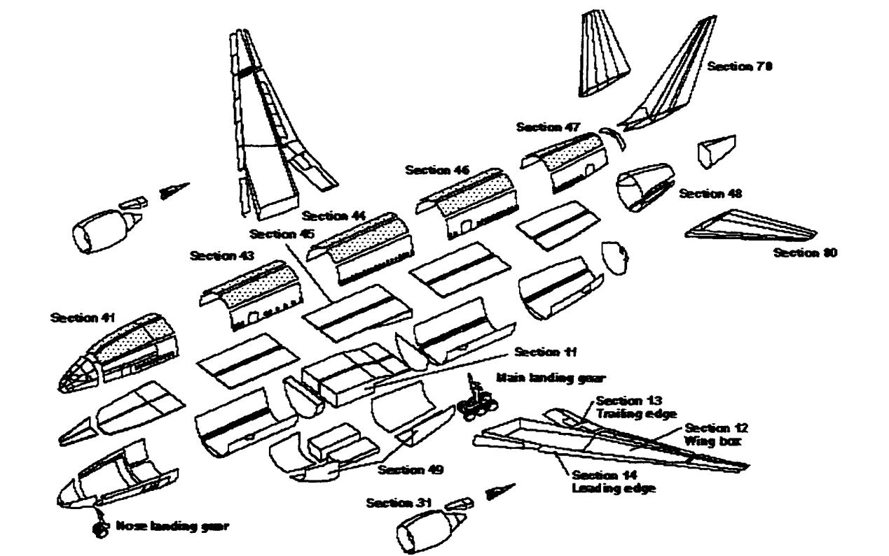  
Crown-ECS-Distribution  
- Flight Deck-Flight Deck-panels & Modules  
Passenger Compartment-Payloads-Linings  
Floors-Elec-Wiring Installation  
E/E Bay-Elec-Panels & Cargo Handling  
Cargo Compartment-Payloads-Systems  
AJC & Mix Bay-ECS-AJC, Temp Control, etc.  
□ Landing Gear-MechHyd Systems-Landing Gear Actuation  
Wings/WheelWell-MechHyd Systems-Hydraulic Installation  
Propulsion/APU-Propulsion-Propulsion and APU  
Empennage-Elec-Antenna

# 1.2 SCOPE:

This appendix contains the information and procedural guidelines necessary for an experienced engineer to establish an adequate set of design and installation guidelines and to perform a ZSA.

# SAE ARP4761

# 1.3 ZSA PROCESS:

The objective of the Zonal Safety Analysis is to ensure that the system design and installation meets safety objectives with respect to:

a. The basic standards of design and installation.  
b. The effect of failures on the aircraft.  
c. The implication of maintenance errors.  
d. The verification that the design meets the FTA event independence claims.

The analysis can use the aircraft zones defined for maintenance purposes. Figure 12 shows which tasks should be done for such an analysis.

The Zonal Safety Analysis is primarily a qualitative analysis which comprises three separate main tasks.

# I.3.1 Preparation of Design and Installation Guidelines:

The first task, which is independent of the zone itself, is the preparation of design and installation guidelines for each new aircraft project. For derivative aircraft modifications, the guidelines of the baseline aircraft should be used as much as possible.

The design and installation guidelines should consider aircraft level requirements and considerations from the PSSAs. Maintenance errors should also be considered. The guidelines can be grouped into general guidelines, system specific design and installation guidelines or zone specific design and installation guidelines. All these types of guidelines should be generated by the appropriate group responsible for the design, and approved by all organizations involved.

# 1.3.2 Inspection of the Installation in the Zone:

The second task is to inspect each zone of the aircraft against these guidelines for conformity to the guideline recommendations. The results should be recorded for future reference on the program and for an example for future programs.

# 1.3.3 Inspect for Systems/Items Interference:

The third task starts with the preparation of a list of systems/items within each zone of the aircraft. This list can be based on installation drawings, mock-ups, or the aircraft depending on the phase of the project. For these systems/items, a list of failure modes which could have an effect on other systems/items installed in the vicinity (systems/items external failure modes) should be established. This list can be based on the FMEAs and FMESs of the systems/items, and on the knowledge of systems/items intrinsic hazards.

# SAE ARP4761

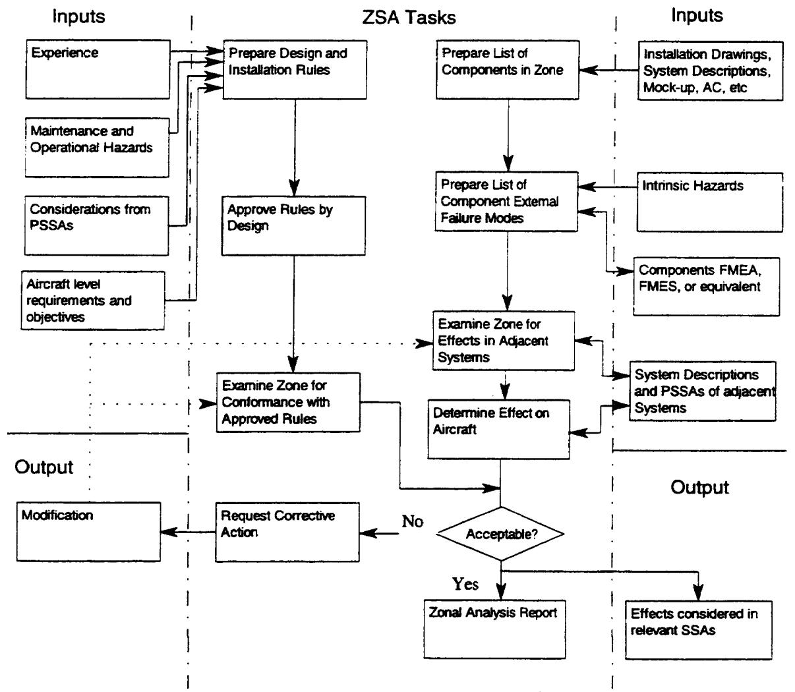  
FIGURE I2 - Zonal Safety Analysis Process

# 1.3.3 (Continued):

The failure modes of the systems/items, the external failure effect, and the resulting effect on the aircraft should be considered by an FMEA-type analysis. The effect of these failure modes on the adjacent systems should be judged based on the system description, PSSA or equivalent. The described effect on the aircraft should be compatible with the relevant SSA. The SSA should consider the system/item external failure effects as a common cause failure in different systems. The FTA is one method for accomplishing this task.

# SAE ARP4761

# 1.3.3 (Continued):

The results of the inspection of the zone against the design and installation guidelines and the resulting effects on aircraft of systems/items external failures should be documented in the ZSA report. Any acceptable results should be used in the relevant SSAs. Any deviation from the design guidelines should be seen as a candidate for design change. Deviations should result in a design change or justification of the deviation.

# 1.4 DOCUMENTATION:

Records of the analysis should be made on a day to day basis. In addition to working systematically through the checklist, the following details should be included.

a. How, when and by whom the assessment was made (i.e., mock-ups, aircraft, etc.)  
b. The correct identification of any equipment that is highlighted as a potential problem  
c. Any deviations from the guidelines, or any significant failures resulting from later interaction of systems or maintenance errors  
d. The manner in which problems highlighted by the analysis have been resolved (giving reference to associated documents)

The system/item external failures and their implications should be analyzed and listed.  
References should be given for the source of the failure mode, the rationale for the failure effect on the adjacent system and the reference to the relevant SSA which describes the effect on the aircraft.

Any problem or deviation should be brought to the attention of the responsible design organization and should be considered for design change.

The preliminary results of each section of analysis should be submitted to the relevant departments of the project organization. The ZSA report should be prepared from the "day to day" records and should summarize the above data. As it is a living document and provides an input to the SSA of the aircraft, it should be reissued periodically throughout the design cycle.

# SAE ARP4761

# APPENDIX J PARTICULAR RISKS ANALYSIS (PRA)

NOTE: The basic ARP4761 document contains information which places the information in this appendix in context. This appendix should be used in conjunction with the main body of the document.

# J.1 INTRODUCTION:

Particular risks are events or influences which are outside the system(s) concerned but which may violate event independence claims. These particular risks may also influence several zones at the same time, whereas the Zonal Safety Analysis (ZSA) is restricted to each specific zone. Some of the risks may be subject to specific airworthiness requirements (e.g., engine non-contained rotor failures, tire burst, etc.).

Typical risks would include, but are not limited to the following.

a. Fire  
b. High energy devices (non-containment):

(a) Engine  
(b) APU  
(c) Fans

c. High pressure bottles  
d. High Pressure Air Duct Rupture  
e. High Temperature Air Duct Leakage

f. Leaking fluids: (Usually examined as part of the Zonal Safety Analysis, but may sometimes require specific additional assessment)

(1) Fuel  
(2) Hydraulic  
(3) Battery acid  
(4) Water

g. Hail, ice, snow  
h. Bird strike  
i. Tire burst, flailing tread  
j. Wheel rim release  
k. Lightning strike  
I. High Intensity Radiated Fields  
m. Flailing shafts  
n. Bulkhead rupture

Having identified the appropriate risks with respect to the design under consideration, each risk should be subject to a separate study based on this appendix. The objective of the relevant analysis is to ensure that any safety related effects are either designed out or shown to be acceptable.

# SAE ARP4761

# J.1 (Continued):

The Particular Risk Analysis (PRA) should be carried out throughout the aircraft development process for a new aircraft. It should also be carried out for any major modification to the aircraft. Initially, drawings or models should be analyzed, but as the project progresses, the analysis should be based on mock-ups and then the actual aircraft. The analyses will usually be performed by the airframe manufacturer.

The Common Mode Analysis, the Zonal Safety Analysis and the Particular Risk Analysis constitute the Common Cause Analysis.

# J.2 SCOPE:

This appendix contains the information and procedural guidelines necessary to enable an experience engineer to develop an adequate failure model for the particular risk under investigation, define the affected zones and review the consequences of the particular risk.

# J.3 PRA PROCESS:

The PRA is usually performed on a risk by risk basis. It is primarily a qualitative analysis which is performed by doing the following:

a. Define the details of the particular risk to be analyzed. (e.g., tire/wheel burst)  
b. Define the failure model to be used for the analysis. (e.g., tire burst model and wheel burst model)  
c. List the requirements to be fulfilled. (e.g., FAR/JAR 729(f))  
d. Define the affected zones/areas. (e.g., landing gear bays)  
e. Define the affected systems/items. (cross-check with ZSA)  
f. Define the design and installation precautions taken. (cross-check with design and installation guidelines used in the ZSA)  
g. Review the consequences of the particular risk on the affected items. (cross-check with FMEA/PSSAs)  
h. Review the effect of the particular risk on the aircraft due to failure modes of items or their combinations. (cross-check with SSAs)

# SAE ARP4761

# J.3 (Continued):

i. Determine if the consequences are acceptable.

(1) If yes, prepare justification for certification and use in the SSA or other specific certification documentation.  
(2) If no, initiate a design change.

# J.4 DOCUMENTATION:

The review of the consequences for each particular risk is documented in a format which should include the following information:

a. The description of the analyzed particular risk.  
b. The items which are affected by the particular risk.  
c. The zones where the items are installed.  
d. The failure modes caused by the particular risk under investigation.  
e. The resulting effect on the aircraft and the classification of that effect.

The effect on the aircraft should be cross-checked with the relevant PSSA/SSA. Furthermore, ensure that the PRA and PSSA/SSA "Effect on Aircraft" and "Classification" entries are in agreement. The PRA results should be included in the relevant PSSAs/SSAs.

Additionally the following details should be included:

a. Any deviations from the initial assumptions.  
b. The manner in which problems highlighted by the analysis have been resolved.

References should be made to the specific documentation which describes the effect of the external threat on the aircraft.

Any problem uncovered during the PRA process should be brought to the attention of the responsible design organization.

# SAE ARP4761

# APPENDIX K COMMON MODE ANALYSIS (CMA)

NOTE: The basic ARP4761 document contains information which places the information in this appendix in context. This appendix should be used in conjunction with the main body of the document.

# K.1 INTRODUCTION:

The Common Mode Analysis (CMA) is performed throughout the safety assessment process. The CMA is a qualitative analytical tool used to ensure the "goodness" of a design. Design experience is used to inspect the integration of components in a logical way. This practice is carried out at all levels from item design to aircraft level design. The analysis includes an evaluation of the components within an item (Component/Item level CMA) and of how they fit into the larger system (System/Aircraft level CMA).

This document describes CMAs as being performed based on inputs from the FHA and PSSA, and to provide substantiation for the SSA. Given this precondition, CMAs are performed to verify that ANDed events in the Fault Tree Analysis (FTA), Dependence Diagrams (DD) and Markov Analysis (MA) are truly independent. The effects of design implementation, manufacturing and maintenance errors, and failures of system components which defeat redundant design principles should be analyzed. Generally speaking, the CMA contributes to the verification that independence principles have been applied when necessary. For example, considerations should be given to the independence of functions and their respective monitors. Also, items with identical hardware and/or software could be susceptible to generic faults which could cause malfunctions in multiple items.

The Common Mode Analysis, the Zonal Safety Analysis and the Particular Risk Analysis constitute the Common Cause Analysis.

# K.2 SCOPE:

This appendix provides guidance on conducting a CMA. The process described may be used at item, system or aircraft levels.

# SAE ARP4761

# K.3 COMMON MODE ANALYSIS PROCESS:

The following four steps summarize the CMA process as shown in Figure K1.

1. Establish program specific checklists (specific Common Mode Types, Sources, and Failure/Errors checklist) (see K.3.1).  
2. Identify the CMA requirement (see K.3.2).  
3. Analyze the design to ensure it meets the requirements identified in step 2 above (see K.3.3).  
4. Document the results of the first three steps of the CMA process (see K.4).

Figure K1 describes the general process to perform a CMA at a System/Aircraft level. The process may be adapted to provide guidance for CMA at a Component/Item level.

# K.3.1 List/Checklist:

The CMA process is based on analyzing design and implementation for elements that may defeat the redundancy or independence of functions within the design. This analysis is performed by the application of checklists. Wherever required redundancy or independence is compromised, justification for the acceptability or elimination of the compromise is required.

The following common modes are examples of those which should be considered in this activity.

a. Software development errors  
b. Hardware development errors  
c. Hardware failures  
d. Production/repair flaw  
e. Stress related events (e.g., abnormal flight conditions, abnormal system configurations)  
f. Installation errors  
g. Requirement errors  
h. Environmental factors (e.g., temperature, vibration, humidity, etc.)  
i. Cascading faults  
j. Common external source faults

K.3.1.1 General Common Mode Types, Sources and Failures/Errors Checklist: There are many elements which may be considered by the CMA. Table K1 provides examples of general common mode types, example sources, and example failures/errors which should be considered. Project specific CMA checklists should be derived based on the example data and previous experience (common knowledge or experience in similar aircraft). The level of detail of these checklists depends upon the degree of complexity or novelty of the technology or system under study.

# SAE ARP4761

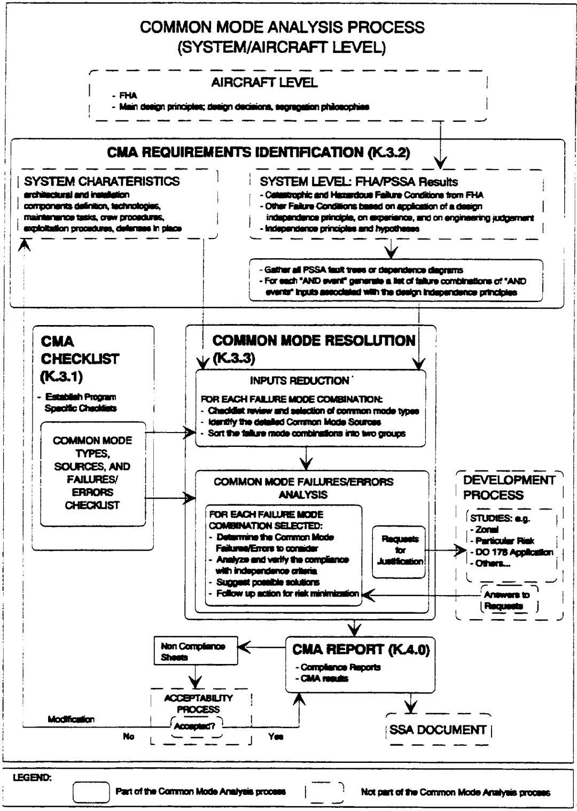  
FIGURE K1 - CMA Process

# SAE ARP4761

TABLE K1 - Example of a General Common Mode Types, Sources and Failures/Errors Checklist  

<table><tr><td>Common Mode Types</td><td>Common Modes Sub-types</td><td>Examples of Common Mode Sources</td><td>Examples of Common Mode Failures/Errors</td></tr><tr><td rowspan="15">CONCEPT AND DESIGN</td><td rowspan="5">DESIGN ARCHITECTURE</td><td>Common discharge header</td><td>Common discharge failure</td></tr><tr><td>Common external sources (ventilation, electrical power, ...)</td><td>Failure of common sources (ventilation, electrical power, ...)</td></tr><tr><td>Equipment Protections</td><td>Designer failure to predict an event, ...</td></tr><tr><td>Operating Characteristics (normally running, standby, ...)</td><td>...</td></tr><tr><td>Others</td><td>...</td></tr><tr><td rowspan="7">TECHNOLOGY, MATERIALS, EQUIPMENT TYPE</td><td>New/ Sensible technology</td><td>General design error, ...</td></tr><tr><td>Component type (size, material, ...)</td><td>Hardware error, ...</td></tr><tr><td>Common Software</td><td>Software error, ...</td></tr><tr><td>Component Use</td><td>...</td></tr><tr><td>Internal Conditions (temperature or pressure ranges, ...)</td><td>Usage out of operating ranges, ...</td></tr><tr><td>Initial Conditions</td><td>...</td></tr><tr><td>Others</td><td>...</td></tr><tr><td rowspan="3">SPECIFICATIONS</td><td>Specification Origin</td><td>Origin error (human), lack of specific protection in equipment design, ...</td></tr><tr><td>Same Specification</td><td>Defective specification, ...</td></tr><tr><td>Others</td><td>...</td></tr><tr><td rowspan="6">MANUFACTURING</td><td rowspan="2">MANUFACTURER</td><td>Common Manufacturer</td><td>Common error due to manufacturer, error due to inadequately trained personnel, ...</td></tr><tr><td>Others</td><td>...</td></tr><tr><td rowspan="2">PROCEDURES</td><td>Same Procedure</td><td>Incorrect procedure, ...</td></tr><tr><td>Others</td><td>...</td></tr><tr><td rowspan="2">PROCESS</td><td>Same Process</td><td>Incorrect process, Inadequate manufacturing control, inadequate inspection, inadequate testing, ...</td></tr><tr><td>Other</td><td>...</td></tr></table>

# SAE ARP4761

TABLE K1 (Continued)  

<table><tr><td>Common Mode Types</td><td>Common Modes Sub-Types</td><td>Examples of Common Mode Sources</td><td>Examples of Common Mode Failures/Errors</td></tr><tr><td rowspan="8">INSTALLATION/ INTEGRATION AND TEST</td><td rowspan="2">FITTER</td><td>Common Fitter</td><td>Installation error due to fitter, ...</td></tr><tr><td>Others</td><td>...</td></tr><tr><td rowspan="2">PROCEDURES</td><td>Installation phase</td><td>Common error due to phase, ...</td></tr><tr><td>Others</td><td>...</td></tr><tr><td rowspan="2">LOCATION</td><td>Same zone</td><td>Local failure or event, ...</td></tr><tr><td>Others</td><td>...</td></tr><tr><td rowspan="2">ROUTING</td><td>Same Routing</td><td>Local event, ...</td></tr><tr><td>Others</td><td>...</td></tr><tr><td rowspan="4">OPERATION</td><td>STAFF</td><td>Common Staff</td><td>Error due to inadequately trained personnel, over stressed or disabled operator, ...</td></tr><tr><td rowspan="3">PROCEDURES</td><td>Others</td><td>...</td></tr><tr><td>Same Procedure</td><td>Faulty operating procedures, misdiagnosis (following wrong procedure), omission of action, incorrect or inadequate commission of action, ...</td></tr><tr><td>Others</td><td>...</td></tr><tr><td rowspan="4">MAINTENANCE</td><td>STAFF</td><td>Common Staff</td><td>Error due to inadequately trained personnel, incorrect human action, ...</td></tr><tr><td rowspan="3">PROCEDURES</td><td>Others</td><td>...</td></tr><tr><td>Same Procedure</td><td>Failure to follow repair procedures, defective repair procedure, lack of repair procedures, ...</td></tr><tr><td>Others</td><td>...</td></tr><tr><td rowspan="4">TEST</td><td>STAFF</td><td>Common Staff</td><td>Error due to inadequately trained personnel, incorrect human action, ...</td></tr><tr><td rowspan="3">PROCEDURES</td><td>Others</td><td>...</td></tr><tr><td>Same Procedure</td><td>Faulty test procedure, ...</td></tr><tr><td>Others</td><td>...</td></tr><tr><td rowspan="3">CALIBRATION</td><td rowspan="3">STAFF</td><td>Common Staff</td><td>Error due to inadequately trained personnel, ...</td></tr><tr><td>Calibration Tools</td><td>Inadequate tools adjustment, ...</td></tr><tr><td>Others</td><td>...</td></tr></table>

# SAE ARP4761

TABLE K1 (Continued)  

<table><tr><td>Common Mode Types</td><td>Common Modes Sub-Types</td><td>Examples of Common Mode Sources</td><td>Examples of Common Mode Failures/ERrors</td></tr><tr><td></td><td>PROCEDURES</td><td>Same Procedure</td><td>Failure to follow calibration procedures, defective calibration procedure, lack of calibration procedures, ...</td></tr><tr><td></td><td></td><td>Others</td><td>...</td></tr><tr><td>ENVIRONMENTAL</td><td>MECHANICAL AND THERMAL</td><td>Temperature</td><td>Fire, lightning, welding, etc., cooling system faults, electrical short circuits, ...</td></tr><tr><td></td><td></td><td>Grit</td><td>Airborne dust, metal fragments generated by moving parts with inadequate tolerances, ...</td></tr><tr><td></td><td></td><td>Impact</td><td>Pipe whip, water hammer, missiles, structural failure, ...</td></tr><tr><td></td><td></td><td>Vibration</td><td>Machinery in motion, earthquake, ...</td></tr><tr><td></td><td></td><td>Pressure</td><td>Explosion, out of tolerance system changes (pump overspeed, flow, blockage), ...</td></tr><tr><td></td><td></td><td>Humidity</td><td>Steam pipe breaks, ...</td></tr><tr><td></td><td></td><td>Moisture</td><td>Condensation, pipe rupture, rainwater, ...</td></tr><tr><td></td><td></td><td>Stress</td><td>Thermal stress at welds of dissimilar metals, thermal stresses, ...</td></tr><tr><td></td><td></td><td>Others</td><td>...</td></tr><tr><td></td><td>ELECTRICAL AND RADIATION</td><td>Electromagnetic</td><td>Welding equipment, rotating electrical machinery, lightning, ...</td></tr><tr><td></td><td></td><td>Radiation</td><td>Gamma radiation, charged particle radiation, ...</td></tr><tr><td></td><td></td><td>Conducting Medium</td><td>Moisture, conductive gases, ...</td></tr><tr><td></td><td></td><td>Out-of-tolerance</td><td>Power surge voltage, short circuit, power surge current, ...</td></tr><tr><td></td><td></td><td>Others</td><td>...</td></tr><tr><td></td><td>CHEMICAL</td><td>Corrosion (acid)</td><td>Leak of acid used in maintenance for removing rust and cleaning, ...</td></tr><tr><td></td><td></td><td>Corrosion (oxidation)</td><td>Moisture around metals</td></tr><tr><td></td><td>MISCELLANEOUS</td><td>Other Chemical Reactions</td><td>Galvanic corrosion, complex interactions of fuel cladding, water, oxide fuel, ...</td></tr><tr><td></td><td></td><td>Biological</td><td>Poisonous gases, animate causes (mussels in heat exchanger), ...</td></tr><tr><td></td><td></td><td>Others</td><td>...</td></tr></table>

# SAE ARP4761

# K.3.2 CMA Requirements Identification:

In order to perform a CMA, the analyst needs to know and understand the subject system characteristics with regard to system operation and installation. These characteristics include such things as the following:

a. Design architecture and installation plan  
b. Equipment and components characteristics  
c. Maintenance and test tasks  
d. Crew procedures  
e. Systems, equipment and software specifications

Additionally, the analyst needs to know system characteristics with regard to safeguards utilized to eliminate or minimize common mode effects. These include the following:

a. Diversity (dissimilarity, redundancy, etc.) and barriers  
b. Testing and preventive maintenance programs  
c. Design control and design quality level  
d. Review of procedures or specifications  
e. Training of personnel  
f. Quality control

With the above system background, the analyst must next determine the specific CMA analysis requirements for the product under investigation. There are two distinct processes used to develop CMA requirements as identified in the following discussion. Usually both processes must be followed to establish complete application specific CMA requirements.

K.3.2.1 CMA Requirements from FTA, DD and MA: These requirements are derived by examining the analyses that support the FHA and PSSA. The process is described below.

a. For each Hazardous or Catastrophic event documented in the FHA and/or PSSA, identify each AND event (AND-gate in fault tree) and determine the associated design independence principle.  
b. Examine the AND events from the previous step to determine which failure combinations must be assured to be independent.  
c. Document all derived CMA requirements resulting from the above analysis.

# SAE ARP4761

K.3.2.2 Other CMA Requirements: There are likely to be CMA requirements not derivable from the FTA, DD, or MA, these requirements stem from the specific product CMA checklists (see K.2.1), and product or engineering experience. These requirements are derived by reviewing the checklists against the design process, design detail, selected components, manufacturing processes, installation processes, and maintenance processes in use. As this review and evaluation progresses, each identified condition which could contribute to a common mode event is reduced to a CMA requirement and documented in the requirement listing. Examples of CMA requirements which may not be apparent from the fault trees are generic failures in complex components, environmental considerations, physical component locations, etc.

K.3.3 Common Mode Failure/Error Resolution:

For each CMA requirement in K.3.2, the following CMA process steps are followed:

a. Determine the potential common mode failures/errors associated with each source.  
b. Analyze each potential common mode failure/errorto verify compliance with independence criteria.  
c. In case of non acceptance at CMA level, suggest possible solutions and initiate design correction.  
d. Follow up on corrective actions, determine acceptability of resultant design.

K.4 DOCUMENTATION:

The output of a Common Mode Analysis is the CMA Report. This report is expected to include the following:

a. Reference documents, drawings, and support material used in the analysis.  
b. List of derived requirements guiding the CMA  
c. Description of system/component analyzed  
d. Rationale for compliance with CMA requirements  
e. Identification of problems/concerns identified during analysis if applicable.  
f. Resolution of identified problems/concerns (corrective action or justification for acceptance)  
g. Conclusion/result of CMA

# SAE ARP4761

# K.4.1 Link With FHA, PSSA and SSA:

The Common Mode Analysis uses results of FHA/PSSA assessments such as list of Catastrophic Failure Conditions, Independence Criteria considered in the design, and any directives for CMA performance. A summary of the results of the common mode analysis is included in the SSA. Any remaining common modes should be included in the relevant FTA, DD or MA reports.

# K.4.2 Link With Zonal Safety and Particular Risk Analyses:

Particular Risk Analysis and Zonal Safety Analysis are not specifically part of the CMA. However, it is impossible to ignore potential common mode effects from these sources. Where Zonal Safety or Particular Risk Analysis identify potential common mode concerns, the CMA analyst should, where possible, ensure that the concerned Particular Risk or Zonal Safety Analysis covers the identified problem.

# SAE ARP4761

# APPENDIX L CONTINUOUS SAFETY ASSESSMENT PROCESS EXAMPLE

NOTE: The basic ARP4761 document contains information which places the information in this appendix in context. This appendix should be used in conjunction with the main body and the other appendices of the document.

# L.1 INTRODUCTION:

# L.1.1 Scope:

This appendix describes, in detail, a contiguous example of the safety assessment process for a fictitious aircraft design. In order to present a clear picture, a function was broken down into a single item of a single system. A function was chosen which had sufficient complexity to allow use of all the methodologies, yet was simple enough to present a clear picture of the flow through them. This function/system/item was analyzed using all the methods and tools described in the rest of this ARP document. Each method was employed to show how it may be applied. In practice, for example, one might choose FTA, DD or MA to aid in determining potential causes of functional faults. However, all three methods are employed here to give the reader an understanding of their similarities and differences. The methodologies applied here are an example of one way to utilize the principles defined in the document. Other formats may be used to accomplish the documentation, so long as the principles outlined in the text of this ARP are followed.

This example contains references to all documentation that a company may use to assure itself of the safety of its products. Some of these documents are submitted to the regulatory agencies for the purpose of certification (e.g., the Wheel Brake System FHA). Other documents are internal to the company and not required for certification (e.g., the S-18 Design Requirements Document). No implication is made that these documents should all be submitted to a regulatory agency and none should be implied. Safety and Certification are not synonymous terms. We are trying to show here the process for safety assessment, including those processes that go beyond certification requirements.

# L.1.2 Acronym List for Appendix L Example:

ACCU

ALT

APU

AS

B

BSCU

C

CMD

COMP

CSMG

ECS

ELEC

Accumulator

Alternate

Auxiliary Power Unit

Anti Skid

Blue Hydraulic System

Brake System Control Unit

Capacitor

Command

Computation

Constant Speed Motor Generator

Environmental Control System

Electric

# SAE ARP4761

# L.1.2 (Continued):

<table><tr><td>EMI</td><td>Electromagnetic Interference</td></tr><tr><td>HIRF</td><td>High Intensity Radiated Fields</td></tr><tr><td>HYD</td><td>Hydraulic</td></tr><tr><td>IC</td><td>Integrated Circuit</td></tr><tr><td>I/O</td><td>Input/Output</td></tr><tr><td>CAT IIb</td><td>Category 3b All Weather Landing System</td></tr><tr><td>CPU</td><td>Central Processing Unit</td></tr><tr><td>F.R.</td><td>Failure Rate</td></tr><tr><td>G</td><td>Green Hydraulic System</td></tr><tr><td>L or LH</td><td>Left or Left Hand</td></tr><tr><td>LRU</td><td>Line Replaceable Unit</td></tr><tr><td>MLG</td><td>Main Landing Gear</td></tr><tr><td>MON</td><td>Monitor</td></tr><tr><td>MT</td><td>Periodic Maintenance Task</td></tr><tr><td>NLG</td><td>Nose Landing Gear</td></tr><tr><td>NORM</td><td>Normal</td></tr><tr><td>PCU</td><td>Power Control Unit</td></tr><tr><td>POS</td><td>Position</td></tr><tr><td>P/S</td><td>Power Supply</td></tr><tr><td>PTU</td><td>Power Transfer Unit</td></tr><tr><td>PWM</td><td>Pulse Width Modulator</td></tr><tr><td>PWR</td><td>Power</td></tr><tr><td>R or RH</td><td>Right or Right Hand</td></tr><tr><td>R</td><td>Resistor</td></tr><tr><td>REF</td><td>Reference</td></tr><tr><td>RTO</td><td>Rejected Takeoff</td></tr><tr><td>STBY</td><td>Standby</td></tr><tr><td>SYS</td><td>System</td></tr><tr><td>VDC</td><td>Volts Direct Current</td></tr><tr><td>V1</td><td>Speed from which the aircraft cannot be safely stopped on remaining runway</td></tr><tr><td>WBS</td><td>Wheel Brake System</td></tr></table>

# L.1.3 Outline:

The function chosen is analyzed using the methods described in the appendices. The order of the methods presented represents a nominal course of their development through the design cycle. However, the CCA activity is shown at the end of this example, whereas in the process flow, it occurs throughout the process. (See Figures 1, 2 and 3 of the ARP4761 Main document).

The outline of the example is as follows.

a. Aircraft FHA

(1) Preliminary Aircraft FTA

b. Wheel Brake System (WBS) FHA  
c. PSSA

# SAE ARP4761

# L.1.3 (Continued):

(1) WBS FTA, DD, MA  
(2) BSCU FTA, DD, MA

d. SSA

(1) BSCU FMEA  
(2) BSCU FMES  
(3) BSCU CMA  
(4) BSCU FTA, DD, MA  
(5) WBS FMES  
(6) WBS FTA, DD, MA  
(7) WBS Integration Cross-Check

e. CCA (the BSCU CMA is addressed under SSA section to improve continuity of the example)

(1) ZSA (Wheel Well Zone)  
(2) PRA (Tire Burst)  
(3) WBS CMA

As each new section begins, please read at the top of the page the "NOTE" which will change to describe that particular section. In this way, the reader will always be able to tell exactly where he/she is in the safety assessment process. For example:

NOTE: Aircraft FHA

NOTE: PSSA, BSCU FTA

Each section of the Example will be written to look like a submittable document. Although many different formats may be acceptable to the certification authorities, our examples will use the following format:

1.0 Introduction  
2.0 References  
3.0 Function/System Description  
4.0 Analysis  
4.1 (As required to support analysis write-up)  
4.2 (As required to support analysis write-up)  
4.2.1 (As required to support analysis write-up)  
4.2.2 (As required to support analysis write-up)  
5.0 Conclusion

Editorial comments are provided in italics. Where necessary, the reader will be directed to the appropriate appendix for further guidance on the process involved.

# L.1.4 Description of the Example Function:

The aircraft function analyzed is: "Decelerate aircraft on the ground (stopping on the runway)". This example concentrates on the aircraft braking system, the details of which are evolved through the following example approximately as they would in a real life situation.

# SAE ARP4761

# L.1.5 List of Figures for Appendix L:

FIGURE 4.1-1 (Aircraft FHA) Aircraft Functions 175  
FIGURE 4.6-1 (Aircraft FHA) Preliminary Aircraft Fault Tree 182  
FIGURE 3.0-1 (PSSA) - Wheel Brake System) Preliminary Wheel Brake System Diagram 192  
FIGURE 4.2.1-1 (PSSA - Wheel Brake System - FTA) Unannunciated Loss of All Wheel Braking Fault Tree (Original) 198  
FIGURE 4.2.1-2 (PSSA - Wheel Brake System - FTA) Unannunciated Loss of All Wheel Braking Fault Tree (Revision A) 199  
FIGURE 4.2.1-3 (PSSA - Wheel Brake System - FTA) Unannunciated Loss of All Wheel Braking Fault Tree (Revision B) 200  
FIGURE 4.2.2-1 (PSSA - Wheel Brake System - DD) Unannunciated Loss of All Wheel Braking Dependence Diagram (Original). 201  
FIGURE 4.2.2-2 (PSSA - Wheel Brake System - DD) Unannunciated Loss of All Wheel Braking Dependence Diagram (Revision A). 202  
FIGURE 4.2.2-3 (PSSA - Wheel Brake System - DD) Unannunciated Loss of All Wheel Braking Dependence Diagram (Revision B). 203  
FIGURE 4.2.3-1 (PSSA - Wheel Brake System - MA) Unannunciated Loss of All Wheel Braking (Original) 205  
FIGURE 4.2.3-2 (PSSA - Wheel Brake System - MA) Unannunciated Loss of All Wheel Braking (Revision A). 206  
FIGURE 4.2.3-3 (PSSA - Wheel Brake System - MA) Unannunciated Loss of All Wheel Braking (Revision B). 207  
FIGURE 3.0-1 (PSSA BSCU) Proposed BSCU Architecture 211  
FIGURE 4.2.1-1 (PSSA BSCU - FTA) BSCU Fault Causes Loss of Braking Commands Fault Tree (Page 1). 215  
FIGURE 4.2.1-1 (PSSA BSCU - FTA) BSCU Fault Causes Loss of Braking Commands Fault Tree (Page 2) 216  
FIGURE 4.2.1-2 (PSSA BSCU - FTA) BSCU Commands Braking in Absence of Brake Input and Causes Inadvertent Braking Fault Tree (Page 1). 217  
FIGURE 4.2.1-2 (PSSA BSCU - FTA) BSCU Commands Braking in Absence of Brake Input and Causes Inadvertent Braking Fault Tree (Page 2). 218  
FIGURE 4.2.1-2 (PSSA BSCU - FTA) BSCU Commands Braking in Absence of Brake Input and Causes Inadvertent Braking Fault Tree (Page 3) 219  
FIGURE 4.2.2-1 (PSSA BSCU - DD) BSCU Fault Causes Loss of Braking Commands Dependence Diagram 221  
FIGURE 4.2.2-2 (PSSA BSCU - DD) BSCU Commands Braking in Absence of Brake Input and Causes Inadvertent Braking DD 222  
FIGURE 4.2.3-1 (PSSA BSCU - MA) BSCU Fault Causes Loss of Braking Commands MA. 224  
FIGURE 4.2.3-2 (PSSA BSCU - MA) Detectable BSCU Failure Results in Inadvertent Braking MA 225  
FIGURE 4.2.3-3 (PSSA BSCU - MA) Inadvert Braking Due to BSCU System 1 Failure MA 225

# SAE ARP4761

# L.1.5 (Continued):

FIGURE 4.2.3-4 (PSSA BSCU - MA) Inadvertent Braking Due to BSCU System 2 Failure and Switching Mechanism Failure MA. 226  
FIGURE 3.0-1 (SSA BSCU - FMEA) BSCU Physical Implementation 230  
FIGURE 3.0-2 (SSA BSCU - FMEA) Power Supply Block Diagram 231  
FIGURE 3.0-3 (SSA BSCU - FMEA) Schematic of Power Supply Monitor............232  
FIGURE 3.0-1 (SSA BSCU - CMA) BSCU Architecture Diagram 245  
FIGURE 4.3-1 (SSA BSCU - CMA) BSCU Physical Implementation 249  
FIGURE 5.1-1 (SSA BSCU - FTA) BSCU Fault Causes Loss of Braking Commands (Page 1). 257  
FIGURE 5.1-1 (SSA BSCU - FTA) BSCU Fault Causes Loss of Braking Commands (Page 2). 258  
FIGURE 5.1-2 (SSA BSCU - FTA) BSCU Commands Braking in Absence of Brake Input and Causes Inadvertent Braking (Page 1) 259  
FIGURE 5.1-2 (SSA BSCU - FTA) BSCU Commands Braking in Absence of Brake Input and Causes Inadvertent Braking (Page 2) 260  
FIGURE 5.1-2 (SSA BSCU - FTA) BSCU Commands Braking in Absence of Brake Input and Causes Inadvertent Braking (Page 3) 261  
FIGURE 5.2-1 (SSA BSCU - DD) BSCU Fault Causes Loss of Braking Commands 262  
FIGURE 5.2-2 (SSA BSCU - DD) BSCU Commands Braking in Absence of Brake Input and Causes Inadvertent Braking 263  
FIGURE 5.3-1 (SSA BSCU - MA) BSCU Fault Causes Loss of Braking Commands 265  
FIGURE 5.3-2 (SSA BSCU - MA) Inadvertent Braking Due to Failure of Both BSCU Systems and Their Monitors. 266  
FIGURE 5.3-3 (SSA BSCU - MA) Inadvert Braking Due to BSCU System 1 Failure (Component repairs are not shown for clarity). 266  
FIGURE 5.3-4 (SSA BSCU - MA) Inadvertent Braking Due to BSCU System 2 Failure and Switching Mechanism Failure (Component repairs are not shown for clarity). 267  
FIGURE 5.2-1 (SSA Wheel Brake System - FTA) Loss of All Wheel Braking Fault Tree (Page 1) 275  
FIGURE 5.2-1 (SSA Wheel Brake System - FTA) Loss of All Wheel Braking Fault Tree (Page 2) 276  
FIGURE 5.2-1 (SSA Wheel Brake System - FTA) Loss of All Wheel Braking Fault Tree (Page 3) 277  
FIGURE 5.3-1 (SSA Wheel Brake System - DD) Loss of All Wheel Braking .278  
FIGURE 5.4-1 (SSA Wheel Brake System - MA) Loss of All Wheel Braking............280  
FIGURE 4.2.1.2.2-1 (CCA - ZSA) Hydraulic Pipe Installation in Frame C46/47 290  
FIGURE 4.2.1.2.2-2 (CCA - ZSA) Green Hydraulic System Components 291  
FIGURE 4.2.1.3.4-1 (CCA - ZSA) Main Landing Gear (MLG) Bay Ventilation 294  
FIGURE 3.0-1 (CCA - PRA) S18 Aircraft Nose and Main Landing Gears.. 305  
FIGURE 4.3-1 (CCA - PRA) Main Landing Gear Bay 308  
FIGURE 4.3-2 (CCA - PRA) Tire Burst Area Side View 309

# SAE ARP4761

# L.1.5 (Continued):

FIGURE 4.3-3 (CCA - PRA) Tire Burst Zone Area - Front View 310

FIGURE 4.3-4 (CCA - PRA) Tire Burst Zone Area - Top View. 311

FIGURE 4.4.1-1 (CCA - PRA) S18 Aircraft Flight Control Surfaces 313

# SAE ARP4761

NOTE: Aircraft FHA

# Aircraft Functional Hazard Assessment (FHA) for the S18 Aircraft

# 1.0 INTRODUCTION

This analysis comprises the functional hazard assessment of the functions of the "S18" aircraft. This is a fictitious aircraft which was created for this document. The operation of all systems employed to accomplish the functions of the aircraft were considered.

(Operator's Note: The following Cross Reference Table provides linkage from each example paragraph to the applicable FHA appendix paragraph.)

<table><tr><td>Aircraft FHA Paragraph #</td><td>Appendix A Paragraph #</td></tr><tr><td>4.1</td><td>A.3.1</td></tr><tr><td>4.2</td><td>A.3.2</td></tr><tr><td>4.3</td><td>A.3.3</td></tr><tr><td>4.4</td><td>A.3.4, A.3.6</td></tr><tr><td>4.5</td><td>A.3.7</td></tr><tr><td>4.6</td><td>A.4</td></tr></table>

# 2.0 REFERENCES

1) S18 Aircraft Design Requirements Document  
2) FAR/JAR 25.1309  
3) ARP4754 "Certification Considerations for Highly-Integrated or Complex Aircraft Systems"  
4) ARP4761 "Guidelines and Methods for Conducting the Safety Assessment Process on Civil Airborne Systems and Equipment"

# 3.0 DESCRIPTION SUMMARY

The S18 aircraft is a four engine passenger aircraft designed to carry 300 to 350 passengers up to 5000 nautical miles at .86 mach. The average flight length is 5 hours.

(Operator's Note: The other initial features defining this aircraft would be included in this paragraph, but are not described for the sake of brevity. These features are generally developed from the marketing and business decisions made during the initial marketing effort.)

# 4.0 RESULTS OF THE AIRCRAFT FUNCTIONAL HAZARD ASSESSMENT (FHA)

# 4.1 Identified Functions

Figure 4.1-1 depicts the Aircraft functions in a simple tiered hierarchy format.

(Operator's Note: The "Control Aircraft on the Ground" function is broken down in this example. From this decomposition, the "Decelerate Aircraft on the Ground" function is pursued in the Aircraft FHA example. The function being analyzed is identified in column (1) of an example FHA form shown in Table 4.1-1.)

# FIGURE L1

# SAE ARP4761

NOTE: Aircraft FHA

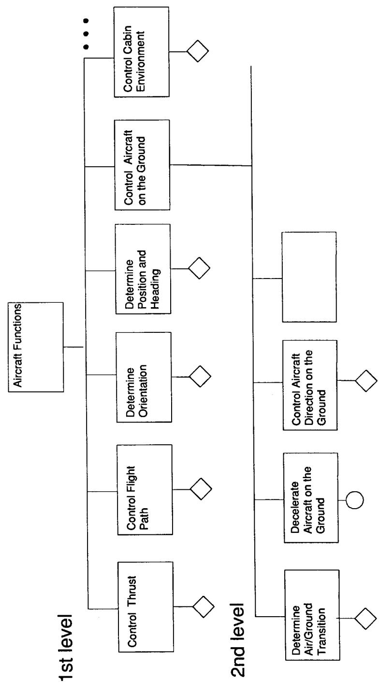  
FIGURE 4.1-1 - (Aircraft FHA) Aircraft Functions  
Aircraft Function Tree  
FIGURE L1 (Continued)

# SAE ARP4761

# NOTE: Aircraft FHA

# 4.2 Identified Failure Conditions

For the function "Decelerate Aircraft on the Ground" the following set of failure conditions and assumptions for the assessment were determined.

# 4.2.1 Functional Failure Conditions

a. Loss of all deceleration capability  
b. Reduced deceleration capability  
c. Inadvertent deceleration  
d. Loss of all auto stopping features  
e. Asymmetrical Deceleration

# 4.2.2 Environmental and Emergency Configurations and Conditions

a. Runway Conditions (Wet, icy, etc.)  
b. Runway Length  
c. Tail/Cross Wind  
d. Engine Out  
e. Hydraulic System Loss  
f. Electrical System Loss

# 4.2.3 Applicable Phases

a. Taxi  
b. Takeoff to Rotation  
c. Landing Roll  
d. Rejected Takeoff (RTO)

# 4.2.4 Interfacing Functions

a. Air/Ground Determinations  
b. Crew Alerting (Crew warnings, alerts, messages)

Columns (2) and (3) of Table 4.1-1 show that part of the FHA form which contains the formulated failure conditions for this given function.

# 4.3 Effects of Failure Condition on the Aircraft, Crew and Occupants

For each failure condition, the effects of the failure condition on the aircraft and crew are shown in column (4) of Table 4.1-1.

# FIGURE L1 (Continued)

# SAE ARP4761

# NOTE: Aircraft FHA

4.4 Classify/Justify the Effects the Failure Condition has on the Aircraft and Crew

For each failure condition, the classification of the failure condition is defined in Columns (5) and (6) of Table 4.1-1.

4.5 Plan for the Verification of Safety Objectives

For each failure condition, the plan for the verification of safety objectives is defined in Column (7) of Table 4.1-1. This column lists the references to requirements, fault trees, analyses, and or tests.

FIGURE L1 (Continued)

# SAE ARP4761

NOTE: Aircraft FHA

TABLE 4.1-1 - Aircraft FHA (Partial - addresses only "Decelerate Aircraft on the Ground")  
FIGURE L1 (Continued)  

<table><tr><td>1 Function</td><td>2 Failure Condition (Hazard Description)</td><td>3 Phase</td><td>4 Effect of Failure Condition on Aircraft/Crew</td><td>5 Classification</td><td>6 Reference to Supporting Material</td><td>7 Verification</td></tr><tr><td>Decelerate Aircraft on the Ground</td><td>Loss of Deceleration Capability</td><td>Landing /RTO/ Taxi</td><td>See Below</td><td></td><td></td><td></td></tr><tr><td></td><td>a. Unannuciated loss of deceleration capability</td><td>Landing /RTO</td><td>Crew is unable to decelerate the aircraft, resulting in a high speed overrun.</td><td>Catastrophic</td><td></td><td>S18 Aircraft Fault Tree</td></tr><tr><td></td><td>b. Annunciated loss of deceleration capability</td><td>Landing</td><td>Crew selects a more suitable airport, notifies emergency ground support, and prepares occupants for landing overrun.</td><td>Hazardous</td><td>Emergency landing procedures in case of loss of stopping capability</td><td>S18 Aircraft Fault Tree</td></tr><tr><td></td><td>c. Unannunciated loss of deceleration capability</td><td>Taxi</td><td>Crew is unable to stop the aircraft on the taxi way or gate resulting in low speed contact with terminal, aircraft, or vehicles.</td><td>Major</td><td></td><td></td></tr><tr><td></td><td>d. Annunciated loss of deceleration capability</td><td>Taxi</td><td>Crew steers the aircraft clear of any obstacles and calls for a tug or portable stairs.</td><td>No Safety Effect</td><td></td><td></td></tr><tr><td></td><td>Inadvertent Deceleration after V1 (Takeoff/RTO decision speed)</td><td>Takeoff</td><td>Crew is unable to takeoff due to application of brakes at the same time as high thrust settings, resulting in a high speed overrun.</td><td>Catastrophlc</td><td></td><td>S18 Aircraft Fault Tree</td></tr></table>

# SAE ARP4761

NOTE: Aircraft FHA

TABLE 4.1-1 - Aircraft FHA (Cont.) (Partial - addresses only "Decelerate Aircraft on the Ground")  
FIGURE L1 (Continued)  

<table><tr><td>1 Function</td><td>2 Failure Condition (Hazard Description)</td><td>3 Phase</td><td>4 Effect of Failure Condition on Aircraft/Crew</td><td>5 Classification</td><td>6 Reference to Supporting Material</td><td>7 Verification</td></tr><tr><td></td><td>Partial loss of Deceleration Capability</td><td>Landing /RTO</td><td>See Below</td><td></td><td></td><td></td></tr><tr><td></td><td>a. Unannunciated partial loss of deceleration capability</td><td>Landing /RTO</td><td>Crew is unable to completely decelerate the aircraft before the end of the runway resulting in a potential overrun.</td><td>Hazardous</td><td></td><td>S18 Aircraft Fault Tree</td></tr><tr><td></td><td>b. Annunciated partial loss of deceleration capability</td><td>Landing</td><td>Crew selects a more suitable airport, notifies emergency ground support, and prepares occupants for landing overrun.</td><td>Major</td><td></td><td></td></tr><tr><td></td><td>c. Unannunciated partial loss of deceleration capability</td><td>Taxi</td><td>Crew may not be able to adequately stop the aircraft before obstacle, resulting in low speed collision.</td><td>Minor</td><td></td><td></td></tr><tr><td></td><td>d. Annunciated partial loss of deceleration capability</td><td>Taxi</td><td>Crew steers the aircraft clear of any obstacles and calls for a tug or portable stairs.</td><td>No Safety Effect</td><td></td><td></td></tr><tr><td></td><td>Loss of automatic stopping capability</td><td>Landing /RTO</td><td>See below</td><td></td><td></td><td></td></tr></table>

# SAE ARP4761

NOTE: Aircraft FHA

TABLE 4.1-1 - Aircraft FHA (Cont.) (Partial - addresses only "Decelerate Aircraft on the Ground")  
FIGURE L1 (Continued)  

<table><tr><td>1 Function</td><td>2 Failure Condition (Hazard Description)</td><td>3 Phase</td><td>4 Effect of Failure Condition on Aircraft/Crew</td><td>5 Classification</td><td>6 Reference to Supporting Material</td><td>7 Verification</td></tr><tr><td></td><td>a. Unannunciated loss of automatic stopping capability</td><td>Landing /RTO</td><td>Crew arms automatic stopping features for landing/RTO. Upon landing/RTO the automatic stopping features fail to operate. Crew recognizes situation and manually activates stopping capability. Crew reaction time results in potential overrun.</td><td>Major</td><td></td><td></td></tr><tr><td></td><td>b. Annunciated loss of automatic stopping capability</td><td>Landing /RTO</td><td>Crew manually activates stopping capability upon landing or RTO.</td><td>No Safety Effect</td><td></td><td></td></tr><tr><td></td><td>Asymmetric Deceleration</td><td>Landing /RTO</td><td>See Below</td><td></td><td></td><td></td></tr><tr><td></td><td>a. Unannunciated asymmetric deceleration</td><td>Landing /RTO</td><td>Crew is not prepared for asymmetric deceleration and reacts too late to maintain directional control, resulting in an offside excursion from the runway.</td><td>Major</td><td></td><td></td></tr><tr><td></td><td>b. Annunciated asymmetric deceleration</td><td>Landing</td><td>Crew is prepared for asymmetric deceleration and counters with appropriate rudder &amp; nose wheel steering inputs.</td><td>Minor</td><td></td><td></td></tr><tr><td></td><td>c. Asymmetric deceleration</td><td>Taxi</td><td>Aircraft diverts slightly from intended course</td><td>No Safety Effect</td><td></td><td></td></tr></table>

# SAE ARP4761

# NOTE: Preliminary Aircraft FTA

# 4.6 Aircraft FHA Outputs

(Operator Note: The aircraft level FHA and associated fault tree give a preliminary set of failure conditions and associated requirements to consider at the system level. These failure conditions and requirements will be validated and updated during the system level FHA.)

Based on the FHA safety objectives, architectural decisions were made during the conceptual design phase. These architectural decisions are the basis for the preliminary aircraft fault tree shown in Figure 4.6-1.

The requirement of 1E-9 per flight hour for "Unannunciated loss of deceleration capability" results from the failure condition classification of catastrophic. This requirement is equivalent to a requirement of 5E-9 per flight, since the average flight length is 5 hours.

The requirements of 5E-7 per flight for "Unannunciated loss of all speed brakes on contaminated runway" and for "Unannunciated loss of all wheel brakes" result from the classification of these failure conditions as Hazardous (this classification is equivalent to 1E-7 per flight hour). These classifications are based on knowledge and experience with these system failures conditions. These requirements result in a requirement probability of 1E-6 per flight (i.e., 2x5E-7 per flight hr.) at the next higher level of "Unannunciated loss of effective wheel braking".

As shown in Figure 4.6-1, the allocation of the above requirements allows the budget for "Unannunciated loss of thrust reversers" to be set at 5E-3 per flight. This is 5E-9 divided by 1E-6.

Figure 4.6-1 also shows a fault tree leg associated with inadvertent deceleration after V1. Three aircraft systems can exhibit failure conditions that cause an inadvertent deceleration after V1. Each of the failure conditions is classified as Catastrophic and must meet 1E-9 per flight hour or 5E-9 per flight.

However, since they are only catastrophic during a specific phase of flight operation, their "per hour" requirements need to be factored. The factor is the average flight length of 5 hours divided by the at risk time (15 seconds would be a conservative estimate of the time from V1 to rotation).

Hence, the hourly failure rate requirement for each is 1E-9/ft hr * 5 ft hrs/ft * 1 ft/0.25 min * 60 min/1 hr = 1.2E-6/hr

The probability requirements after converting them to failure rate requirements would read as follows:

a. Inadvertent Thrust Reverse after  $V_{1}$  
b. Inadvertent spoiler deployment after  $V_{1}$  
c. Inadvertent wheel braking after  $V_{1}$

1.2E-6 per hour  
1.2E-6 per hour  
1.2E-6 per hour

# FIGURE L1 (Continued)

# SAE ARP4761

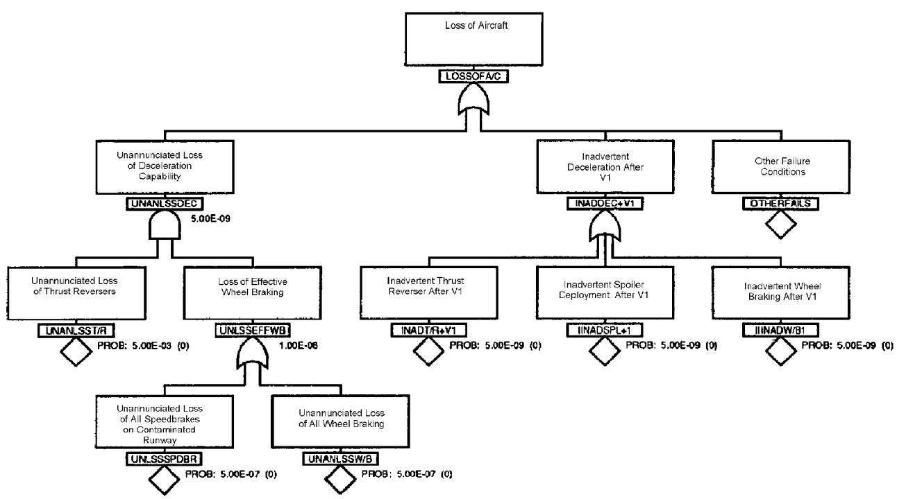  
NOTE: Preliminary Aircraft FTA  
FIGURE 4.6-1 (Aircraft FHA) Preliminary Aircraft Fault Tree

FIGURE L1 (Continued)

# SAE ARP4761

NOTE: System FHA

# Wheel Brake System Functional Hazard Assessment (FHA)

# 1.0 INTRODUCTION

This analysis comprises the functional hazard assessment for the Wheel Brake System of the S18 aircraft. The Wheel Brake System must meet two safety design objectives based on the architectural design decisions made in conjunction with the development of the aircraft level FHA. These are stopping the wheel rotation on the ground and stopping wheel rotation in the wheel well.

(Operator's Note: The function of stopping wheel rotation on the ground is analyzed in this example because it corresponds with the aircraft function to decelerate the aircraft on the ground.)

(Operator's Note: The following Cross Reference Table provides linkage from each example paragraph to the applicable FHA appendix paragraph.)

<table><tr><td>System FHA Paragraph #</td><td>Appendix A Paragraph #</td></tr><tr><td>4.1</td><td>A.3.1</td></tr><tr><td>4.2</td><td>A.3.2</td></tr><tr><td>4.3</td><td>A.3.3</td></tr><tr><td>4.4</td><td>A.3.4, A3.6</td></tr><tr><td>4.5</td><td>A.3.7</td></tr><tr><td>4.6</td><td>A4.0</td></tr></table>

# 2.0 REFERENCES

1) Aircraft Functional Hazard Assessment for the S18 Aircraft  
2) Preliminary S18 Aircraft FTA  
3) S18 Aircraft Design Requirements and Objectives Document

# 3.0 SYSTEM DESCRIPTION

The primary purpose of the wheel braking system is to decelerate the aircraft on the ground without skidding the tires. The wheel braking system performs this function automatically upon landing or manually upon pilot activation. In addition to decelerating the aircraft, the wheel braking system is used for directional control on the ground through differential braking, stopping the main landing gear wheel rotation upon gear retraction, and preventing aircraft motion when parked.

# FIGURE L2

# SAE ARP4761

# NOTE: System FHA

# 4.0 RESULTS OF THE WHEEL BRAKE SYSTEM FUNCTIONAL HAZARD ASSESSMENT

# 4.1 Identified Wheel Brake System Functions

The wheel brake system performs the following functions.

a. Decelerate the wheels on the ground

(1) Manual activation  
(2) Automatic activation  
(3) Antiskid

b. Decelerate the wheels on gear retraction  
c. Differential braking for directional control  
d. Prevent aircraft from moving when parked

(Operator's Note: For the purpose of this example, the "Decelerate the wheels on the ground" function is analyzed. The function is identified in column (1) of an example FHA form shown in Table 4.1-1.)

# 4.2 Identified Failure Conditions

For the function "Decelerate the wheels on the ground", the following set of failure conditions and assumptions for the assessment were determined.

# 4.2.1 Functional Failure Conditions

a. Total Loss of Wheel Braking  
b. Partial Symmetrical Loss of Wheel Braking  
c. Asymmetrical Loss of Wheel Braking  
d. Inadvertent Application of Wheel Braking

# 4.2.2 Environmental and Emergency Configurations and Conditions

a. Runway Conditions (Wet, icy, etc.)  
b. Runway Length  
c. Tail/Cross Wind  
d. Engine Out  
e. Hydraulic System Loss  
f. Electrical System Loss

# 4.2.3 Phases - (ground phases)

a. Taxi  
b. Takeoff to Rotation  
c. Landing Roll  
d. Rejected Takeoff (RTO)

# FIGURE L2 (Continued)

# SAE ARP4761

# NOTE: System FHA

# 4.2.4 Interfacing Functions

a. Crew Alerting (Crew warnings, alerts, messages)  
b. Rudder/Nose Wheel Steering for directional control

Columns (2) and (3) of Table 4.1-1 show that part of the FHA form which contains the formulated failure conditions for this given function.

# 4.3 Effects of Failure Condition on the Aircraft, Crew and Occupants

For each failure condition, the effect of the failure condition on the aircraft, crew and occupants is shown in column (4) of Table 4.1-1.

# 4.4 Classify/Justify the Effects of the Failure Condition on the Aircraft, Crew and Occupants

For each failure condition, the classification of the failure condition is defined in columns (5) and (6) of Table 4.1-1.

# 4.5 Plan for the Verification of Safety Objectives

For each failure condition, the plan for the verification of safety objectives is defined in Column (7) of Table 4.1-1. This column lists the references to requirements, fault trees, analyses, and or tests.

# 4.6 WBS FHA Summary

The following set of significant safety requirements extracted from this WBS FHA will be provided as inputs to the WBS PSSA.

1) Loss of all wheel braking during landing or RTO shall be less than 5E-7 per flight.  
2) Asymmetrical loss of wheel braking coupled with loss of rudder or nose wheel steering during landing or RTO shall be less than 5E-7 per flight.  
3) Inadvertent wheel braking with all wheels locked during takeoff roll before V1 shall be less than 5E-7 per flight.  
4) Inadvertent wheel braking of all wheels during takeoff roll after V1 shall be less than 5E-9 per flight.  
5) Undetected inadvertent wheel braking on one wheel w/o locking during takeoff shall be less than 5E-9 per flight.

# FIGURE L2 (Continued)

# SAE ARP4761

NOTE: System FHA

(Partial - addresses only "Decelerate the Wheels on the Ground")  
TABLE 4.1-1 - Wheel Brake System FHA  
FIGURE L2 (Continued)  

<table><tr><td>1 Function</td><td>2 Failure Condition (Hazard Description)</td><td>3 Phase</td><td>4 Effect of Failure Condition on Aircraft/Crew</td><td>5 Classification</td><td>6 Reference to Supporting Material</td><td>7 Verification</td></tr><tr><td>Decelerate Aircraft using Wheel Braking</td><td>Total loss of wheel braking</td><td>Landing or RTO</td><td>See Below</td><td></td><td></td><td></td></tr><tr><td></td><td>a. Unannunciated loss of wheel braking</td><td>Landing or RTO</td><td>The crew detects the failure when the brakes are operated. The crew uses spoilers and thrust reversers maximum extent possible. This may result in a runway overrun.</td><td>Hazardous</td><td></td><td>S18 Aircraft FTA</td></tr><tr><td></td><td>b. Annunciated loss of wheel braking</td><td>Landing</td><td>Crew selects a more suitable airport, notifies emergency ground support, and prepares occupants for landing overrun. Crew uses spoilers and thrust reversers to the maximum extent possible.</td><td>Hazardous</td><td>Crew procedures for loss of normal and reserve modes</td><td>S18 Aircraft FTA</td></tr><tr><td></td><td>Partial Symmetrical loss of wheel braking</td><td>Landing or RTO</td><td>See below</td><td></td><td></td><td></td></tr></table>

# SAE ARP4761

NOTE: System FHA

TABLE 4.1-1 - Wheel Brake System FHA (Cont.) (Partial - addresses only "Decelerate the Wheels on the Ground")  
FIGURE L2 (Continued)  

<table><tr><td>1 Function</td><td>2 Failure Condition (Hazard Description)</td><td>3 Phase</td><td>4 Effect of Failure Condition on Aircraft/Crew</td><td>5 Classification</td><td>6 Reference to Supporting Material</td><td>7 Verification</td></tr><tr><td></td><td>a. Unannunciated partial symmetrical loss of wheel braking</td><td>Landing or RTO</td><td>The crew detects the failure when the brakes are used. Crew uses available wheel braking, spoilers and thrust reversers available to maximum extent to decelerate the aircraft. Temperature on wheels of the loaded brakes increases and could reach point where wheel/tire failure occurs. Depending on number of brakes lost result could be an overrun.</td><td>Major to Hazardous</td><td>Additional study required to determine classification</td><td>TBD</td></tr><tr><td></td><td>b. Annunciated partial symmetrical loss of wheel braking</td><td>Landing</td><td>The crew is aware that there is a partial loss of braking before landing. Crew uses wheel braking, spoilers and thrust reversers to maximum extent to decelerate the aircraft. Temperature on wheels of the loaded brakes increases and could reach point where wheel/tire failure occurs. Depending on number of brakes lost result could be an overrun.</td><td>Major</td><td></td><td></td></tr><tr><td></td><td>Asymmetrical loss of wheel braking</td><td>Landing or RTO</td><td>See below</td><td></td><td></td><td></td></tr></table>

# SAE ARP4761

NOTE: System FHA

TABLE 4.1-1 - Wheel Brake System FHA (Cont.) (Partial - addresses only "Decelerate the Wheels on the Ground")  
FIGURE L2 (Continued)  

<table><tr><td>1 Function</td><td>2 Failure Condition (Hazard Description)</td><td>3 Phase</td><td>4 Effect of Failure Condition on Aircraft/Crew</td><td>5 Classification</td><td>6 Reference to Supporting Material</td><td>7 Verification</td></tr><tr><td></td><td>a. Asymmetric loss of wheel braking - brake system failure only</td><td>Landing or RTO</td><td>Decrease in braking performance. Tendency to veer off the runway. For braking performances and brake temperature the effects are the same as partial brake loss above. The crew keeps the aircraft on the runway by using rudder at high speed and nose wheel steering at low speed. Consequences are TBD pending the results of the justification studies.</td><td>TBD</td><td>Additional studies required to determine classification</td><td></td></tr><tr><td></td><td>b. Asymmetrical loss of wheel braking and loss of rudder or nose wheel steering</td><td>Landing</td><td>Decrease in braking performance. Tendency to veer off the runway. For braking performances and brake temperature the effects are the same as partial brake loss above. The crew cannot maintain runway centerline and results in an offside excursion.</td><td>Hazardous</td><td></td><td>S18 Aircraft FTA</td></tr><tr><td></td><td>Inadvertent wheel brake application</td><td></td><td>See below</td><td></td><td></td><td></td></tr><tr><td></td><td>a. Inadvertent wheel brake application without wheel locking</td><td>Takeoff Before V1</td><td>The crew stops the aircraft on the runway</td><td>Minor</td><td></td><td></td></tr></table>

# SAE ARP4761

NOTE: System FHA

TABLE 4.1-1 - Wheel Brake System FHA (Cont.) (Partial - addresses only "Decelerate the Wheels on the Ground")  
FIGURE L2 (Continued)  

<table><tr><td>1 Function</td><td>2 Failure Condition (Hazard Description)</td><td>3 Phase</td><td>4 Effect of Failure Condition on Aircraft/Crew</td><td>5 Classification</td><td>6 Reference to Supporting Material</td><td>7 Verification</td></tr><tr><td></td><td>b. Inadvertent wheel brake application with all wheels locked</td><td>Takeoff Before V1</td><td>Potential burst of all tires and loss of braking efficiency</td><td>Hazardous</td><td></td><td>S18 Aircraft FTA</td></tr><tr><td></td><td>c. Inadvertent wheel brake application with all wheels locked or not locked</td><td>Takeoff After V1</td><td>Crew cannot takeoff or safely RTO resulting in a high speed overrun.</td><td>Catastrophic</td><td></td><td>S18 Aircraft FTA</td></tr><tr><td></td><td>d. Undetected inadvertent wheel braking on one wheel without locking of the wheel</td><td>Takeoff</td><td>Crew cannot detect the failure by the asymmetry which is very small. Brake temperature can reach very high temperature. Crew retract gear resulting in possible wheel fire or tire failure</td><td>Catastrophlc</td><td></td><td>S18 Aircraft FTA</td></tr><tr><td></td><td>e. Inadvertent application on one wheel without locking of the wheel coupled with detected high brake temperature</td><td>Takeoff</td><td>Crew cannot detect the failure by the asymmetry which is very small. Brake temperature can reach very high temperature. Crew detects high brake temperature and leave gear extended to cool brake</td><td>Minor</td><td>Crew procedure for leaving the gear down in case of detected hot brake temperatures</td><td></td></tr><tr><td>etc.</td><td>etc.</td><td></td><td></td><td></td><td></td><td></td></tr></table>

# SAE ARP4761

NOTE: PSSA - Wheel Brake System

# Wheel Brake System PSSA

# 1.0 INTRODUCTION

This PSSA is a compendium of the assessments and analyses performed in the concept and preliminary design phases of the wheel braking system. The purpose of this PSSA is to complete the list of safety requirements, determine the proposed design can reasonably satisfy the requirements, and derive the safety requirements to be considered in the design of lower level items and installations.

(Operator's Note: The following Cross Reference Table provides linkage from each example paragraph to the applicable appendix paragraph.)

<table><tr><td>System PSSA Paragraph #</td><td>Appendix B Paragraph #</td></tr><tr><td>4.1.1</td><td>B.3.1.1</td></tr><tr><td>4.1.2</td><td>B.3.1.2</td></tr><tr><td>4.2</td><td>B.3.2</td></tr><tr><td>4.2.1</td><td>Appendix D</td></tr><tr><td>4.2.2</td><td>Appendix E</td></tr><tr><td>4.2.3</td><td>Appendix F</td></tr><tr><td>4.3.2</td><td>B.3.3</td></tr></table>

# 2.0 REFERENCES

1) S18 Aircraft FHA  
2) S18 Wheel Braking System FHA  
3) S18 Aircraft Preliminary CCA Results - PRA, CMA, ZSA (Editor's Note: The PRA, CMA and ZSA are referenced because they provide the methods for determining independence requirements.)  
4) Relevant Airworthiness requirements

# 3.0 SYSTEM DESCRIPTION SUMMARY

The Wheel Brake System is installed on the two main landing gears. Braking on the main gear wheels is used to provide safe retardation of the aircraft during taxiing and landing phases, and in the event of a rejected take-off. The wheel brake system is shown in Figure 3.0-1. The wheel brakes also prevent unintended aircraft motion when parked, and may be used to provide differential braking for aircraft directional control. A secondary function of the wheel brake system is to stop main gear wheel rotation upon gear retraction.

Braking on the ground is commanded either manually, via brake pedals, or automatically (autobrake) without the need for pedal application. The Autobrake function allows the pilot to prepare the deceleration rate prior to takeoff or landing. Autobrake is only available with the NORMAL braking system.

FIGURE L3

# SAE ARP4761

NOTE: PSSA - Wheel Brake System

# 3.0 (Continued):

The eight main gear wheels have multi-disc carbon brakes. Based on the requirement that loss of all wheel braking is less probable than 5E-7 per flight, a design decision was made that each wheel has a brake assembly operated by two independent sets of hydraulic pistons. One set is operated from the GREEN hydraulic supply and is used in the NORMAL braking mode. The Alternate Mode is on standby and is selected automatically when the NORMAL system fails. It is operated independently using the BLUE hydraulic power supply and is backed by an accumulator which is also used to drive the parking brake. The accumulator supplies the ALTERNATE system in the EMERGENCY braking mode, when the BLUE supply is lost and the NORMAL mode is not available. Switch-over is automatic under various failure conditions, or can be manually selected. Reduction of GREEN pressure below a threshold value, either from loss of GREEN supply itself or from its removal by the BSCU due to the presence of faults, causes an automatic selector to connect the BLUE supply to the ALTERNATE brake system. An anti-skid facility is available in both the NORMAL and ALTERNATE modes, and operates at all speeds greater than 2 meters per second.

In the NORMAL braking mode, all eight wheels are individually braked from their own servo valves, which are also used to apply anti-skid. In the ALTERNATE mode, a dual metering valve provides a low pressure hydraulic braking input via four servo valves which provide the antiskid function to four pairs of wheels. Operation of the ALTERNATE system is precluded when the NORMAL system is in use.

In the NORMAL mode, the brake pedal position is electrically fed to a braking computer. This in turn produces corresponding control signals to the brakes. In addition, this computer monitors various signals which denote certain critical aircraft and system states, to provide correct brake functions and improve system fault tolerance, and generates warnings, indications and maintenance information to other systems. This computer is accordingly named the Braking System Control Unit (BSCU). It automatically provides the following functions.

a. Takeover of manual braking (brake pedals), or automatic controls (engagement of Autobrake, autopilot commands during CAT IIIb landing)  
b. Control of interfaces with other aircraft systems (Editor's Note: Interfaces with other systems may include the hydraulic system, the brake temperature monitoring system, etc.)  
c. Generation of braking commands, according to commands received and the status of the system  
d. Braking regulation in order to avoid skidding of the main wheels  
e. Transmission of information (indications, lights, warnings, etc.) to the flight deck and to the various aircraft computers concerning the BSCU status

# FIGURE L3 (Continued)

# SAE ARP4761

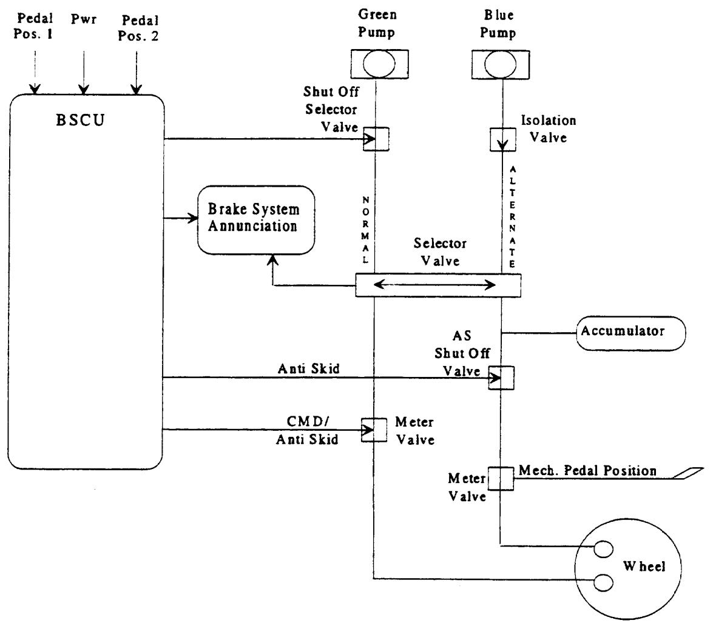  
NOTE: PSSA - Wheel Brake System  
FIGURE 3.0-1 - (PSSA - Wheel Brake System)  
Preliminary Wheel Brake System Diagram  
FIGURE L3 (Continued)

# SAE ARP4761

NOTE: PSSA - Wheel Brake System

# 4.0 RESULTS OF WHEEL BRAKING SYSTEM PSSA

# 4.1 Wheel Braking System Safety Requirements

# 4.1.1 PSSA Inputs

The following set of safety (availability, integrity, installation) requirements were derived from the aircraft and system FHAs and Common Cause Analyses based on an average flight duration of 5 hours.

1) Loss of all wheel braking (unannunciated or annunciated) during landing or RTO shall be less than 5E-7 per flight.  
2) Asymmetrical loss of wheel braking coupled with loss of rudder or nose wheel steering during landing shall be less than 5E-7 per flight.  
3) Inadvertent wheel braking with all wheels locked during takeoff roll before V1 shall be less than 5E-7 per flight.  
4) Inadvertent wheel braking of all wheels during takeoff roll after V1 shall be less than 5E-9 per flight.  
5) Undetected inadvertent wheel braking on one wheel w/o locking during takeoff shall be less than 5E-9 per flight.  
6) The wheel braking system and thrust reverser system shall be designed to preclude any common threats (tire burst, tire shred, flailing tread, structural deflection, etc).  
7) The wheel braking system and the thrust reverser system shall be designed to preclude any common mode failures (hydraulic system, electrical system, maintenance, servicing, operations, design, manufacturing, etc.).

The Wheel Brake System design features satisfying the safety requirements are documented in Table 4.1.1-1.

# FIGURE L3 (Continued)

# SAE ARP4761

NOTE: PSSA - Wheel Brake System

TABLE 4.1.1-1 - (PSSA - Wheel Brake System) Wheel Brake System Safety Requirements/Design Decisions  

<table><tr><td>Safety Requirement</td><td>Design Decisions</td><td>Remarks</td></tr><tr><td>1. Loss of all wheel braking (unannunciated or annunciated) during landing or RTO shall be less than 5E-7 per flight.</td><td>More than one hydraulic system required to achieve the objective (service experience). Dual channel BSCU and multimode brake operations.</td><td>The overall wheel brake system availability can reasonably satisfy this requirement. See PSSA FTA below.</td></tr><tr><td>2. Asymmetrical loss of wheel braking coupled with loss of rudder or nose wheel steering during landing shall be less than 5E-7 per flight.</td><td>Separate the rudder and nose wheel steering system from the wheel braking system. Balance hydraulic supply to each side of the wheel braking system.</td><td>The wheel braking system will be shown to be sufficiently independent from the rudder and nose wheel steering systems. System separation between these systems will be shown in the zonal safety analysis and particular risk analysis.</td></tr><tr><td>3. Inadvertent wheel braking with all wheels locked during takeoff roll before V1 shall be less than 5E-7 per flight.</td><td>None</td><td>Requirement 4 is more stringent and hence drives the design.</td></tr><tr><td>4. Inadvertent wheel braking of all wheels during takeoff roll after V1 shall be less than 5E-9 per flight.</td><td>No single failure shall result in this condition.</td><td>None</td></tr><tr><td>5. Undetected inadvertent wheel braking on one wheel w/o locking during takeoff shall be less than 5E-9 per flight.</td><td>No single failure shall result in this condition.</td><td>None</td></tr></table>

# 4.1.2 Derived Safety Requirements

The design decisions described in Table 4.1.1-1 lead to a primary and secondary system to perform the wheel braking function. As a result of these design decisions, the following set of safety (availability, integrity, installation) requirements were derived.

1) The primary and secondary system shall be designed to preclude any common threats (e.g., tire burst, tire shred, flailing tread, structural deflection).  
2) The primary and secondary system shall be designed to preclude any common mode failures (hydraulic system, electrical system, maintenance, servicing, operations, design, manufacturing, etc.).

FIGURE L3 (Continued)

# SAE ARP4761

NOTE: PSSA - Wheel Brake System

TABLE 4.1.2-1 - (PSSA - Wheel Brake System) Wheel Brake System Derived Safety Requirements  
FIGURE L3 (Continued)  

<table><tr><td>Safety Requirement</td><td>Design Decisions</td><td>Remarks</td></tr><tr><td>1. The primary and secondary system shall be designed to preclude any common threats (tire burst, tire shred, flailing tread, structural deflection).</td><td>Install hydraulic supply to the brakes in front and behind the main gear leg.</td><td>Compliance will be shown by ZSA and PRA. (Editor&#x27;s Note: In this example only for the main gear bay zone and the tire burst particular risk.)</td></tr><tr><td>2. The primary and secondary system shall be designed to preclude any common mode failures (hydraulic system, electrical system, maintenance, servicing, operations, design, manufacturing, etc.).</td><td>Choose two different hydraulic systems to supply the brakes, emergency braking without electrical power.</td><td>Compliance will be shown by CMA.</td></tr></table>

# SAE ARP4761

NOTE: PSSA - Wheel Brake System - FTA

# 4.2 Failure Condition Evaluation

The failure conditions identified from the aircraft and system FHAs are listed below. A preliminary assessment and budgets will be developed for each of these failure conditions.

1) Loss of all wheel braking (unannunciated or annunciated) during landing or RTO shall be less than 5E-7 per flight.  
2) Asymmetrical loss of wheel braking coupled with loss of rudder or nose wheel steering during shall be less than 5E-7 per flight.  
3) Inadvertent wheel braking with all wheels locked during takeoff roll after V1 shall be less than 5E-7 per flight.  
4) Inadvertent wheel braking of all wheels during takeoff roll after V1 shall be less than 5E-9 per flight.  
5) Undetected inadvertent wheel braking on one wheel w/o locking during takeoff shall be less than 5E-9 per flight.

# 4.2.1 Fault Tree Analysis for PSSA

(Operator's Note: This section would normally contain the fault trees for all significant failure conditions. This example shows the evaluation of "Unannunciated loss of all wheel braking" only.)

The high level PSSA Fault Tree shown in Figure 4.2.1-1 reflects the top level requirement of the braking system and depicts the three braking sub systems and budgets for the unannunciated loss of each.

FIGURE L3 (Continued)

# SAE ARP4761

NOTE: PSSA - Wheel Brake System - FTA

# 4.2.1 (Continued):

The Fault Tree in Figure 4.2.1-2 depicts the next level of system development and assessment. This tree includes recognition of the fact that loss of all braking is considered hazardous and a design decision was made to cover all possible loss regardless of annunciation. This is reflected by the addition of the "Loss of Annunciation Capability" event which is ANDed with the "Loss of All Wheel Braking" event shown in Figure 4.2.1-1. The probability of "Loss of Annunciation Capability" is set to 1.0. Design decisions were also made requiring the "Normal" and "Alternate" Brake systems to meet the availability and integrity requirements without dependence or contribution from the "Emergency Standby System", this is denoted by the probability of failure of that system being set to 1.0. This results in an increased integrity budget for the "Normal" and "Alternate" brake system functions.

Figure 4.2.1-2 also shows the downward development of the "Normal Brake" system design by budgeting failure rates to the identified contributors to "Normal Brake System Does Not Operate" (Loss of Hydraulic Supply, Loss of Hydraulic Components, and Loss of BSCU Ability to Command Braking). The Loss of BSCU Ability to Control Braking event is further broken down into the two major elements of BSCU Failure and Loss of Power to BSCU with applicable budgets for aircraft power failures included and the resultant requirement for BSCU failure budget of 6E-6 per hour was reverse calculated to allow satisfaction of the higher level Loss of BSCU budget. This integrity budget was passed to the BSCU supplier as a design requirement for the system.

The BSCU supplier's experience indicated that the 6.6E-6 failure rate budget was not realistic for a design of the complexity of the BSCU function, and thus the supplier derived a requirement for redundant BSCU computations in order to meet the failure rate budget. The Fault Tree in Figure 4.2.1-3 depicts the evolution of the design showing the redundant BSCUs with their ANDed configuration and the resultant per channel failure rate per hour budget of 1.15E-3.

FIGURE L3 (Continued)

# SAE ARP4761

NOTE: PSSA Wheel Brake System - FTA

Editor's Note: A decision to provide two means of applying wheel brakes to affect a complete stop is made. These means are the Normal and Alternate brake systems. A parking brake is necessary for normal operation of the aircraft on the ground and a decision to allow it to act as an emergency brake is made. This fault tree reflects Initial allocations of probability budgets to each of the three systems. The normal system is given the most stringent allocation.

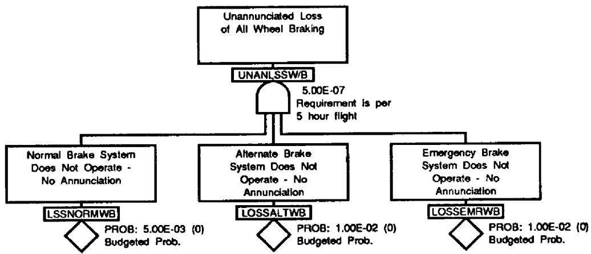  
FIGURE 4.2.1-1 - (PSSA - Wheel Brake System - FTA)  
Unannunciated Loss of All Wheel Braking Fault Tree (Original)  
FIGURE L3 (Continued)

# SAE ARP4761

# NOTE: PSSA Wheel Brake System - FTA

Editor's Note: Since unannunciated and annunciated loss of wheel braking are each considered hazardous failure conditions, a decision is made to include all failures of the wheel braking system that result in loss regardless of whether or not they are annunciated.

- A decision is made that the Normal and Alternate systems will meet the requirement without relying on the emergency (parking) brake at all.

. Discussions with potential BSCU vendors reveal that a 8.6E-6/hour failure rate is not feasible with a single item . A decision is made to require 2

BSCUs. This decision is reflected in the fault tree on the following page.

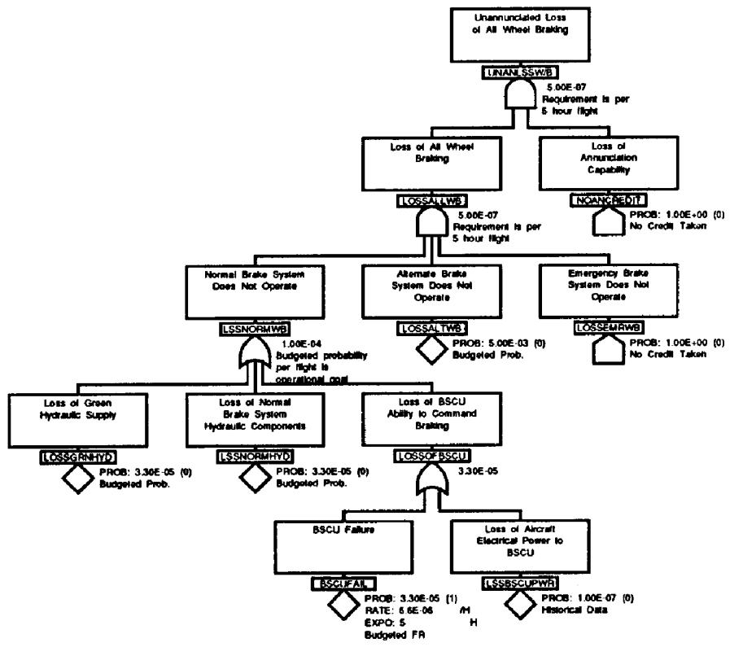  
FIGURE 4.2.1-2 - (PSSA - Wheel Brake System - FTA)  
FIGURE L3 (Continued)

Unannunciated Loss of All Wheel Braking Fault Tree (Revision A)

# SAE ARP4761

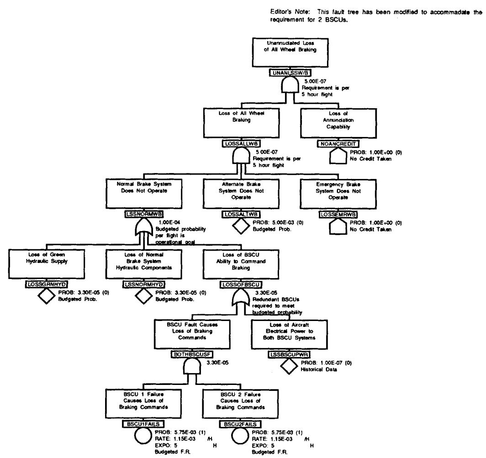  
NOTE: PSSA Wheel Brake System - FTA  
FIGURE 4.2.1-3 - (PSSA - Wheel Brake System - FTA) Unannunciated Loss of All Wheel Braking Fault Tree (Revision B)  
FIGURE L3 (Continued)

# SAE ARP4761

NOTE: PSSA Wheel Brake System - DD

# 4.2.2 DD for a PSSA (Qualitative/Budgeted System)

(Operator's Note: For details of the DD process, refer to Appendix E.)

(Operator's Note: Normally textual description of development of the DD would be included in the analysis. This text would be similar to that included in the preceding FTA example)

  
FIGURE 4.2.2-1 - (PSSA - Wheel Brake System - DD) Unannunciated Loss of All Wheel Braking Dependence Diagram (Original)  
FIGURE L3 (Continued)

(Operator's Note: A decision to provide two means of applying wheel brakes to affect a complete stop is made. These means are the Normal and Alternate brake systems. A parking brake is necessary for normal operation of the aircraft on the ground and a decision to allow it to act as an emergency brake is made. This dependence diagram reflects initial allocations of probability budgets to each of the three systems. The normal system is given the most stringent allocation.)

# SAE ARP4761

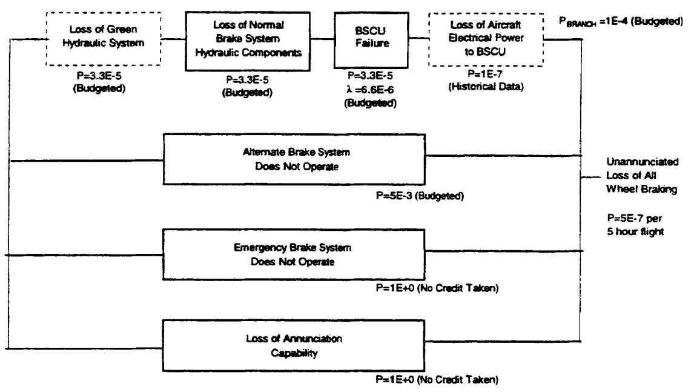  
NOTE: PSSA Wheel Brake System - DD  
FIGURE 4.2.2-2 - (PSSA - Wheel Brake System - DD) Unannunciated Loss of All Wheel Braking Dependence Diagram (Revision A)  
FIGURE L3 (Continued)

# 4.2.2 (Continued):

(Operator's Note: The failure condition being investigated in this Wheel Brake System DD is unannunciated loss of wheel braking because it contributes to the catastrophic failure condition, unannunciated loss of deceleration capability. Since unannunciated and annunciated loss of wheel braking are each considered hazardous failure conditions, a decision is made to include all failures of the wheel braking system that result in loss regardless of whether or not they are annunciated. This decision is represented on the DD by including an event for loss of annunciation capability with a probability of 1.

A decision is made to design the system so that the Normal and Alternate systems are able to meet the requirement without relying on the emergency (parking) brake at all.

An operational objective of a normal braking system with a failure rate no greater than 1E-4 per flight is imposed.

Discussions with potential BSCU vendors reveal that a 6.6E-6 per hour failure rate is not feasible with a single item. A decision is made to require two BSCUs. This decision is reflected in the DD on the following page.)

# SAE ARP4761

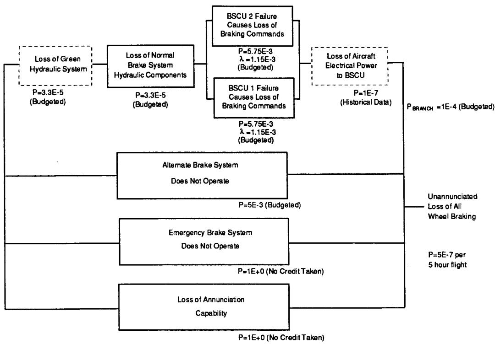  
NOTE: PSSA Wheel Brake System - DD  
FIGURE 4.2.2-3 - (PSSA - Wheel Brake System - DD) Unannunciated Loss of All Wheel Braking Dependence Diagram (Revision B)

FIGURE L3 (Continued)

# SAE ARP4761

NOTE: PSSA Wheel Brake System - MA

# 4.2.3 Markov Analysis for PSSA

(Operator's Note: This section would normally contain the Markov analyses for all significant failure conditions. This example shows the evaluation of "Unannunciated Loss of Wheel Braking" only.)

In the example S18 Aircraft, the  $\lambda_{1}$ , which is the NORMAL braking system failure rate, is expanded to do a detailed Markov analysis. This analysis might involve design iterations.

Editor's Note: In this example ALTERNATE  $(\lambda_{2})$  and EMERGENCY  $(\lambda_{3})$  systems are assumed to be developed events and hence no further analysis to derive the failure rates for these events is given.)

The Markov chain representation of the wheel braking system is shown in Figure 4.2.3-1. It shows the Markov chain for three different systems which provide braking commands: NORMAL, ALTERNATE and EMERGENCY. Each state in the Markov chain is defined by a three tuple showing the status of the NORMAL, ALTERNATE and EMERGENCY braking systems. A "1" in the state represents a normally working system and a "0" in the state represents a failed system. For example, state (0 1 1) represents a system condition in which the NORMAL braking system is failed while both the ALTERNATE and EMERGENCY braking systems are operational.  $\lambda_{1},\lambda_{2}$ , and  $\lambda_{3}$  are the failure rates of the NORMAL, ALTERNATE and EMERGENCY braking systems in number of failures per hour. The Wheel Braking System is assumed to be failed when all three NORMAL, ALTERNATE and EMERGENCY systems are failed. This is represented by state (0 0 0). Some states in the Markov chain show the maximum state probabilities which are the allocated budgets for the NORMAL, ALTERNATE and EMERGENCY braking systems.

FIGURE L3 (Continued)

# SAE ARP4761

NOTE: PSSA Wheel Brake System - MA

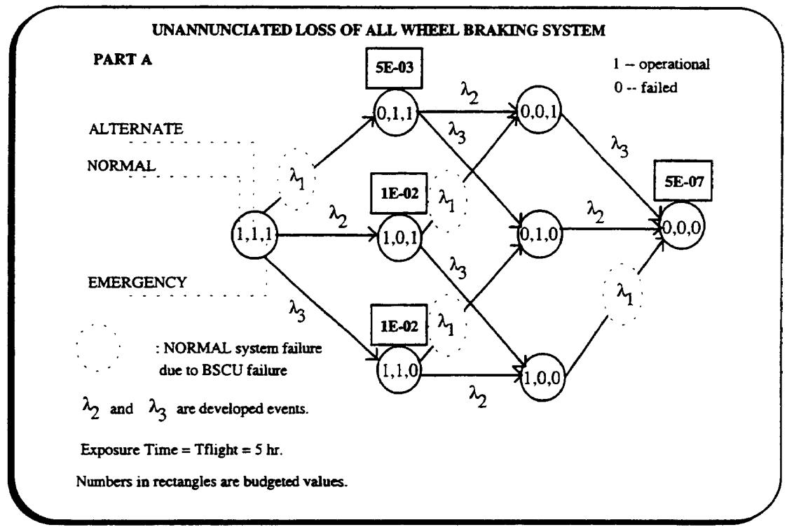  
FIGURE 4.2.3-1 - (PSSA Wheel Brake System - MA) Unannunciated Loss of All Wheel Braking (Original)  
FIGURE L3 (Continued)

# 4.2.3 (Continued):

Figure 4.2.3-2 (Part A) is the same as Figure 4.2.3-1 except that no credit has been taken for the EMERGENCY brake system. Figure 4.2.3-2 (Part B) shows the detailed Markov chain for the BSCU computer which controls the NORMAL braking system. All the dotted circles in of Figure 4.2.3-1 are replaced with the analysis results of Part B of Figure 4.2.3-2. Figure 4.2.3-2 (Part B) shows the NORMAL braking system as an OR function of three components: the BSCU, the GREEN hydraulic system and the Normal brake system hydraulic components.

In Figure 4.2.3-2, the BSCU is designed as a single item. After discussions with potential BSCU manufacturers, it was concluded that two BSCUs are required to meet the safety requirements. This modified target design of the BSCU is shown in Figure 4.2.3-3. To meet the safety requirements, two BSCUs are shown in Figure 4.2.3-3 (Part C). In this Markov chain, each state is represented by a two-tuple (A, S) where "A" is the status of the active BSCU, which could be either BSCU 1 or BSCU 2 and "S" is the status of the standby BSCU. Each component is assumed to be in an operational or failed state. Failed states are represented by a bar on top of the symbol. The BSCU system is assumed to be failed when both BSCUs fail or the electrical power to both BSCUs is lost.

# SAE ARP4761

NOTE: PSSA Wheel Brake System - MA

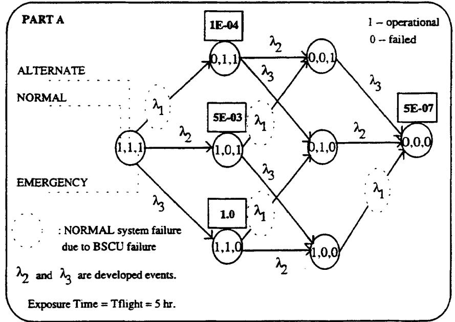  
UNANNUNCIATED LOSS OF ALL WHEEL BRAKING SYSTEM

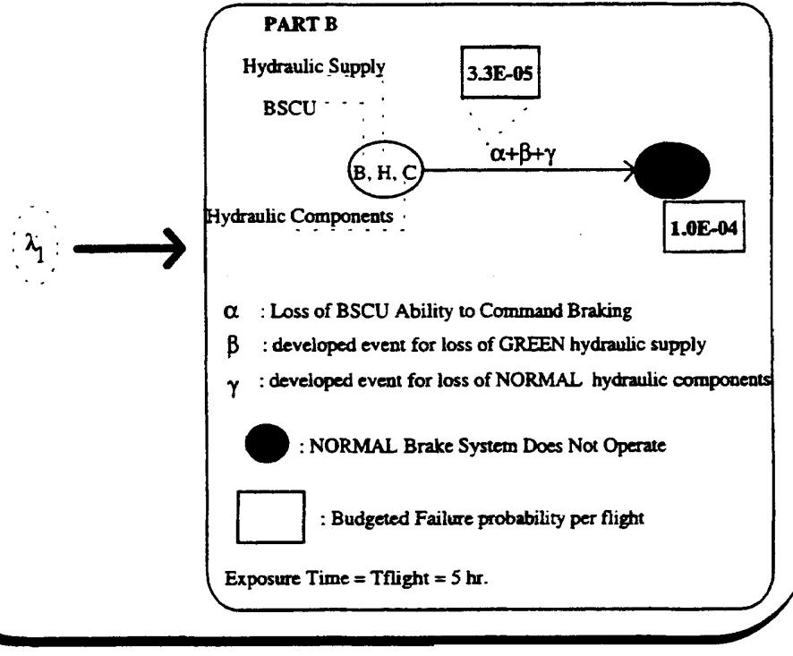  
NORMAL BRAKE SYSTEM DOES NOT OPERATE  
FIGURE 4.2.3-2 - (PSSA Wheel Brake System - MA) Unannunciated Loss of All Wheel Braking (Revision A)  
FIGURE L3 (Continued)

# SAE ARP4761

NOTE: Wheel Brake System - MA

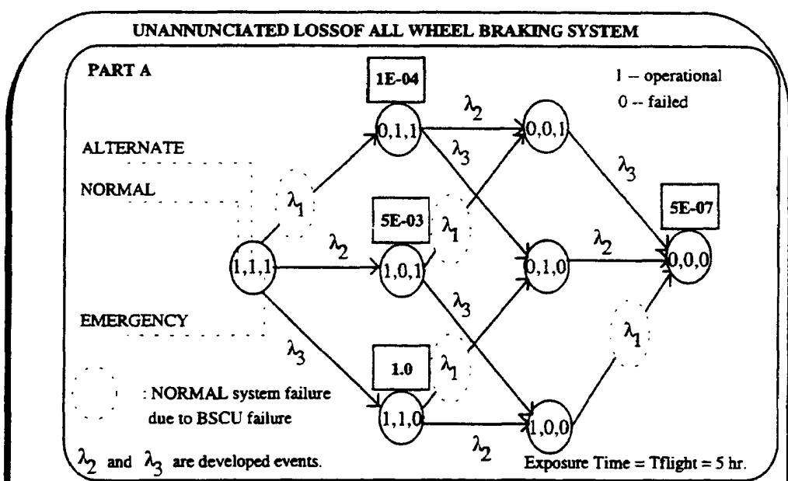

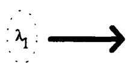

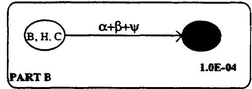  
NORMAL BRAKE SYSTEM DOES NOT OPERATE

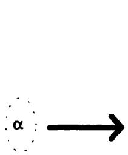

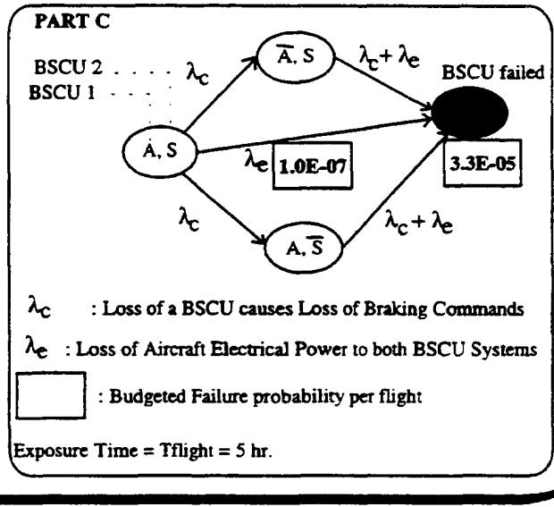  
LOSS OF BSCU ABILITIES TO COMMAND BRAKING  
FIGURE 4.2.3-3 - (PSSA Wheel Brake System - MA) Unannunciated Loss of All Wheel Braking (Revision B)  
FIGURE L3 (Continued)

# SAE ARP4761

# NOTE: PSSA Wheel Brake System

# 4.3 Requirements Established

From the requirements determined and listed in section 4.1 the following lower level requirements have been derived

# 4.3.1 Installation Requirements

Primary and secondary hydraulic supply system shall be segregated and verification shall be done in ZSA and PRA.

(Operator's Note: Additional installation requirements are developed from the fault trees but they are not shown here for brevity.)

# 4.3.2 Item Level Requirements

1) The probability of "BSCU Fault Causes Loss of Braking Commands" shall be less than 3.3E-5 per flight.  
2) The probability of "Loss of a single BSCU" shall be less than 5.75E-3 per flight.  
3) The probability of "Loss of Normal Brake System Hydraulic Components" shall be less than 3.3E-5 per flight.  
4) * The probability of "Inadvertent braking due to BSCU" shall be less than 2.5E-9 per flight.  
5) No single failure of the BSCU shall lead to "Inadvertent braking".  
6) The BSCU shall be designed to Development Assurance Level A based on the catastrophic classification of "Inadvertent braking due to BSCU".

(*Editor's Note: This requirement was determined from a fault tree which was not shown in this example.)

# 4.3.3 Requirements on Other Systems

The probability of "Loss of Green Hydraulic supply to the Normal brake system" shall be less than 3.3E-5 per flight.

(Operator's Note: Additional system requirements on other systems are developed from those fault trees but they are not shown here for brevity.)

# FIGURE L3 (Continued)

# SAE ARP4761

NOTE: PSSA Wheel Brake System

# 4.3.4 Safety Maintenance Requirements

A failure of the ALTERNATE braking mode is latent because the NORMAL braking mode operates when it contains no failures. Therefore it is necessary to generate a maintenance task to functionally check the ALTERNATE braking mode. Determine the periodicity of that check so that the requirement "Alternate braking does not operate is less than 5E-3 per flight" is met.

(Operator's Note: Additional maintenance requirements may be developed from those fault trees but they are not shown here for brevity.)

# 5.0 CONCLUSION

The design as known now can satisfy the safety requirements determined in the FHA and the previous CCAs. Further requirements on installation, lower level items, other systems and maintenance tasks to be performed have been identified and are passed on to the responsible design authority.

FIGURE L3 (Continued)

# SAE ARP4761

NOTE: PSSA BSCU

# BSCU PSSA

# 1.0 INTRODUCTION

This PSSA documents the assessments and analyses performed in the preliminary design phases of the Brake System Control Unit. The purpose of this PSSA is to complete the list of safety requirements, determine the proposed design can reasonably satisfy the requirements and derive hardware and software requirements.

(Operator's Note: The following Cross Reference Table provides linkage from each example to the applicable PSSA appendix paragraph.)

<table><tr><td>Item PSSA Paragraph #</td><td>Appendix B Paragraph #</td></tr><tr><td>4.1.1</td><td>B.3.1.1</td></tr><tr><td>4.2</td><td>B.3.2</td></tr><tr><td>4.2.1</td><td>Appendix D</td></tr><tr><td>4.2.2</td><td>Appendix E</td></tr><tr><td>4.2.3</td><td>Appendix F</td></tr><tr><td>4.3</td><td>B.3.3</td></tr></table>

# 2.0 REFERENCES

1) S18 Wheel Brake System PSSA  
2) BSCU Specification

# 3.0 DESCRIPTION SUMMARY

The requirements imposed on the BSCU for availability and integrity led to the proposal that the BSCU consist of two independent systems to meet the availability requirements and the proposal that each system contain a command and monitor channel to meet the integrity requirements. A block diagram of the proposed BSCU architecture is shown in Figure 3.0-1.

Each BSCU system generates necessary voltages in its own power supply. A power supply monitor is provided to detect out of specification voltage conditions. Brake pedal inputs are provided to the command and monitor channels which compute the necessary braking commands. The commands generated by each channel are compared and if they do not agree, a failure is reported. The results of the power supply monitor and the comparator are provided to a System Validity Monitor. A failure reported by either system in a BSCU will cause that system to disable its outputs and set the System Validity Monitor to invalid. Each BSCU System Validity Monitor is provided to an overall BSCU Validity Monitor. Failure of both System 1 and System 2 will cause the selector valve to select the Alternate Brake System.

In normal operation, BSCU system 1 provides the brake and anti-skid commands to the wheel brakes. When System 1 reports a failure via its System Validity Monitor, the output of System 2, if valid, is switched in to provide the commands. In the event that System 2 subsequently fails, all BSCU outputs are disabled and the BSCU Validity Monitor is set to invalid.

# FIGURE L4

# SAE ARP4761

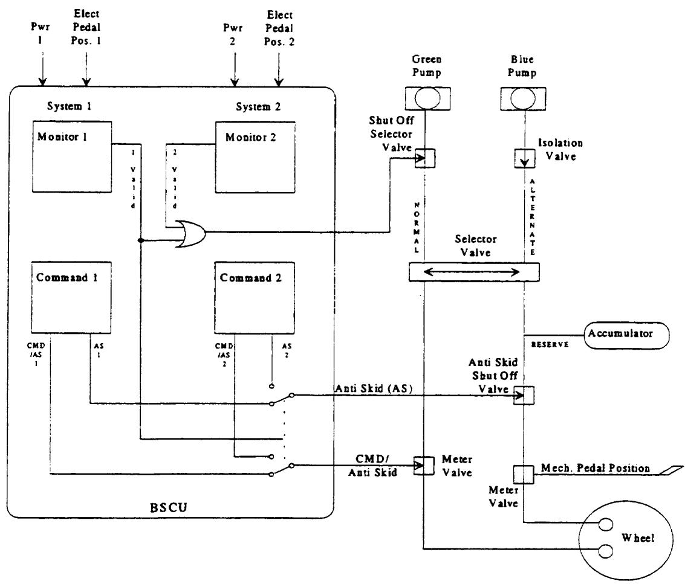  
NOTE: PSSA BSCU  
FIGURE 3.0-1 - (PSSA BSCU) Proposed BSCU Architecture

FIGURE L4 (Continued)

# SAE ARP4761

# NOTE: PSSA BSCU

# 4.0 BSCU PSSA

# 4.1 BSCU Safety Requirements

# 4.1.1 PSSA Inputs

The following set of safety requirements were derived from the Wheel Brake System PSSA.

1) The probability of "BSCU Fault Causes Loss of Braking Commands" shall be less than 3.3E-5 per flight.  
2) The probability of "Loss of a single BSCU" shall be less than 5.75E-3 per flight.  
3) The probability of "Inadvertent braking due to BSCU" shall be less than 2.5E-9 per flight.  
4) No single failure of the BSCU shall lead to "Inadvertent braking".  
5) The BSCU shall be designed to Development Assurance Level A based on the catastrophic classification of "Inadvertent Braking Due to BSCU".

The following aircraft operational considerations were provided by the airframe manufacturer.

a. Average flight length - 5 hours  
b. Average power-up interval - 100 hours  
c. Aircraft life - 100,000 hours  
d. Time between V1 and rotation - 15 seconds (.004167 hour)

The plan for showing how the BSCU will comply with the safety requirements is shown in Table 4.1.1-1.

# FIGURE L4 (Continued)

# SAE ARP4761

# NOTE: PSSA BSCU

TABLE 4.1.1-1 - (PSSA BSCU) BSCU Safety Requirements/Design Decisions  

<table><tr><td>Safety Requirement</td><td>Design Decisions</td><td>Remarks</td></tr><tr><td>1. The probability of &quot;BSCU Fault Causes Loss of Braking Commands&quot; shall be less than 3.3E-5 per flight.</td><td>Dual channel BSCU design</td><td>The overall BSCU system availability can reasonably satisfy this requirement. See FTA in Figure 4.2.1-1.</td></tr><tr><td>2. The probability of &quot;Loss of a single BSCU&quot; shall be less than 5.75E-3 per flight.</td><td>Design for adequate reliability</td><td>None</td></tr><tr><td>3. The probability of &quot;Inadvertent braking due to BSCU&quot; shall be less than 2.5E-9 per flight.</td><td>Each BSCU system contains independent command and monitor channels.</td><td>BSCU integrity can achieve this requirement. See FTA in PSSA BSCU FTA Figure 4.2.1-2.</td></tr><tr><td>4. No single failure of the BSCU shall lead to &quot;Inadvertent braking&quot;.</td><td>No single failure shall result in this condition.</td><td>Perform CMA and FMEA as necessary.</td></tr><tr><td>5. The BSCU shall be designed to Development Assurance Level A.</td><td>Develop command channel to Development Assurance Level A and the monitor channel to Level B.</td><td>Development Assurance Levels assigned according to guidance in Section 5.4 of SAE ARP 4754.</td></tr></table>

# 4.2 Failure Condition Evaluation

Fault trees for the failure conditions, loss of BSCU and inadvertent braking due to BSCU were developed and evaluated to determine the feasibility of the proposed BSCU design. Probability allocations were made based on all available information about the design and past experience.

(Operator's Note: The failure condition of inadvertent wheel braking is re-introduced here because it provides a better example for demonstrating the BSCU common mode analysis and failure modes and effects analysis.)

FIGURE L4 (Continued)

# SAE ARP4761

# NOTE: PSSA BSCU - FTA

# 4.2.1 PSSA of BSCU System - Fault Tree Analysis

The fault tree in Figure 4.2.1-1 addresses the loss of BSCU failure condition. The BSCU supplier has determined that BSCU redundancy may be accomplished through inclusion of two independent BSCU systems within a single BSCU LRU, with a monitor/switching arrangement selecting a valid BSCU command for delivery to the Brake System. As depicted in the Fault Tree, loss of all BSCU operation occurs if the BSCU Validity Monitor fails such that it incorrectly reports both BSCUs failed (BSCU Validity Monitor Incorrectly Reports Dual Failures), if BSCU systems 1 and 2 both experience failures within the same flight (BSCU Systems 1 AND 2 do not Operate), or if a specific switch failure in conjunction with the selected channel failure occurs (Switch Failure Contributes to Loss of BSCU Braking Commands). The fault tree further depicts the combinations of BSCU switch failure possibilities and the accompanying BSCU System failures leading to Loss of Braking. The tree also shows the breakdown and failure rate budgeting for a single system BSCU failure contribution from either the computation channel or the power supply.

The fault tree in Figure 4.2.1-2 addresses inadvertent wheel braking caused by the BSCU. The BSCU can cause inadvertent braking only when the Normal Braking System is in use. This fault tree does not deal with this aircraft level aspect of the analysis. The fault tree assumes that there are no undetectable BSCU failures that can cause an inadvertent brake command. In order to meet the requirements, this assumption should be proven correct via FMEA and/or CMA. The other branch of the fault tree deals with combinations of monitored BSCU failures and monitor failures. Detectable BSCU failures are power supply failures that cause out of spec voltages detected by the power supply monitor and command channel I/O or CPU failures that cause an inadvertent brake command which are detected by the comparator. Monitor I/O and CPU failures are not included in the fault tree because the monitor channel does not provide brake commands. Monitor channel failures will cause the comparator to report a failure and switch brake commands to the other BSCU System if the comparator is working. If the comparator is not working, a monitor channel failure still does not cause inadvertent braking.

Since the BSCU System 1 is the normally active channel, the fault tree (page 2) demonstrates that System 1 undetected power supply failures may contribute to inadvertent braking, as may computation channel failures. The fault tree in page 3 contains the same BSCU failure information relative to BSCU System 2, however System 2 cannot be applied to the brakes unless the monitor/select switch is activated; thus the event of the switch being in position 2 is ANDed with the System 2 failures. Two conditions may result in switch activation, a previous detected failure of System 1, or an independent monitor/switch failure.

FIGURE L4 (Continued)

# SAE ARP4761

# NOTE: PSSA BSCU - FTA

FIGURE L4 (Continued)  
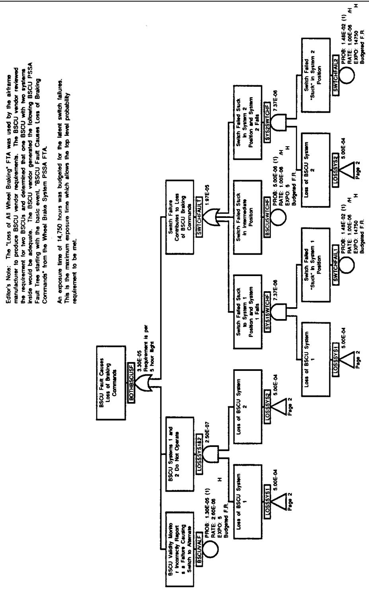  
FIGURE 4.2.1-1 - (PSSA BSCU - FTA)  
BSCU Fault Causes Loss of Braking Commands Fault Tree (Page 1)

# SAE ARP4761

NOTE: PSSA BSCU - FTA

Editor's Note: This level of detail would not normally appear in this fault tree because it is possible to show that the requirements are met using the total failure rate of the BSCU. Detail about BSCU failure modes is included in this example to allow a feature of Markov Analysis to be illustrated.

FIGURE L4 (Continued)  
BSCU Fault Causes Loss of Braking Commands Fault Tree (Page 2)  
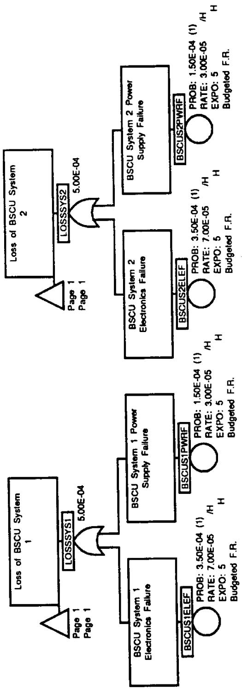  
FIGURE 4.2.1-1 (PSSABSCU -FTA)

# SAE ARP4761

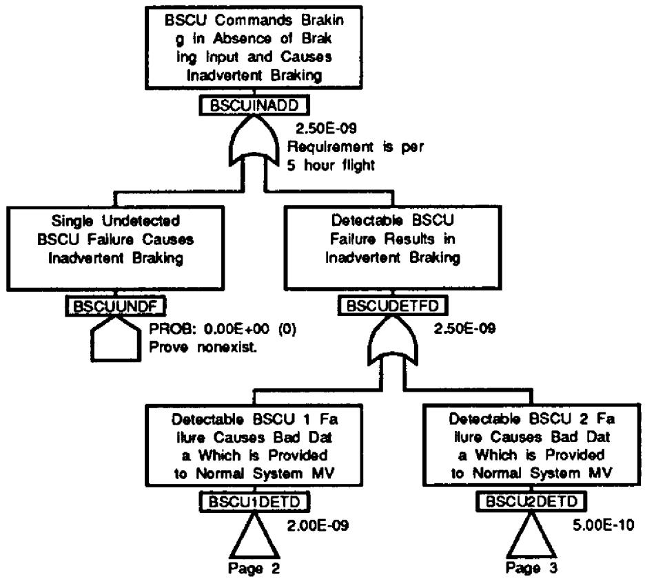  
NOTE: PSSA BSCU - FTA  
FIGURE 4.2.1-2 - (PSSA BSCU - FTA) BSCU Commands Braking in Absence of Brake Input and Causes Inadvertent Braking Fault Tree (Page 1)

FIGURE L4 (Continued)

# SAE ARP4761

NOTE: PSSA BSCU - FTA

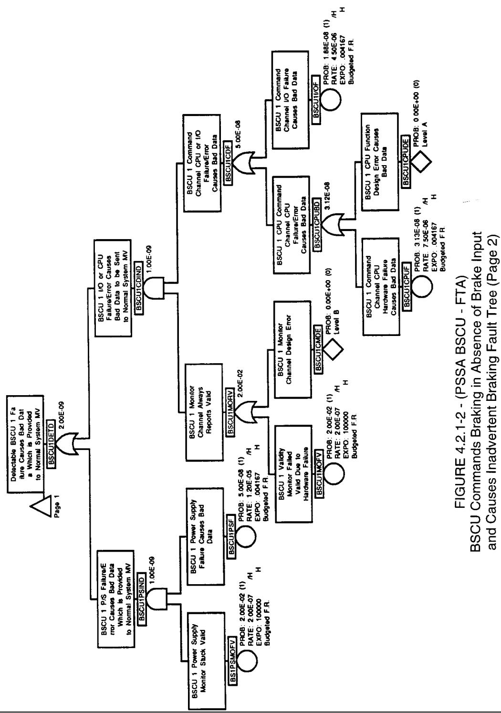  
FIGURE L4 (Continued)

# SAE ARP4761

NOTE: PSSA BSCU - FTA

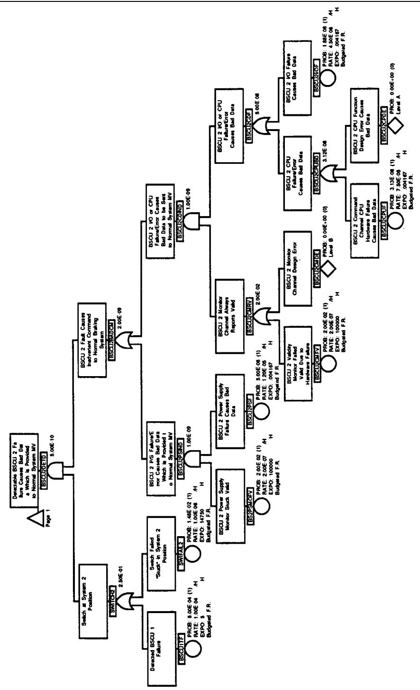  
FIGURE L4 (Continued)

FIGURE 4.2.1-2 - (PSSA BSCU - FTA)

BSCU Commands Braking in Absence of Brake Input

and Causes Inadvertent Braking Fault Tree (Page 3)

# SAE ARP4761

NOTE: PSSA BSCU - DD

4.2.2 PSSA of BSCU System - Dependence Diagram Analysis

(Operator's Note: Normally textual description of development of the DD would be included in the analysis. This text would be similar to that included in the preceding FTA example.)

The dependence diagram in Figure 4.2.2-1 addresses the loss of BSCU failure condition. Loss of all BSCU operation occurs if the BSCU Validity Monitor fails such that it incorrectly reports both BSCUs failed or if BSCU systems 1 and 2 experience failures.

The dependence diagram in Figure 4.2.2-2 addresses inadvertent wheel braking caused by the BSCU. The BSCU can cause inadvertent braking only when the Normal Braking System is in use. This dependence diagram does not deal with this aircraft level aspect of the analysis. The dependence diagram assumes that there are no undetectable BSCU failures that can cause an inadvertent brake command. In order to meet the requirements, this assumption should be proven correct via FMEA and/or CMA. The dependence diagram deals with combinations of monitored BSCU failures and monitor failures.

FIGURE L4 (Continued)

# SAE ARP4761

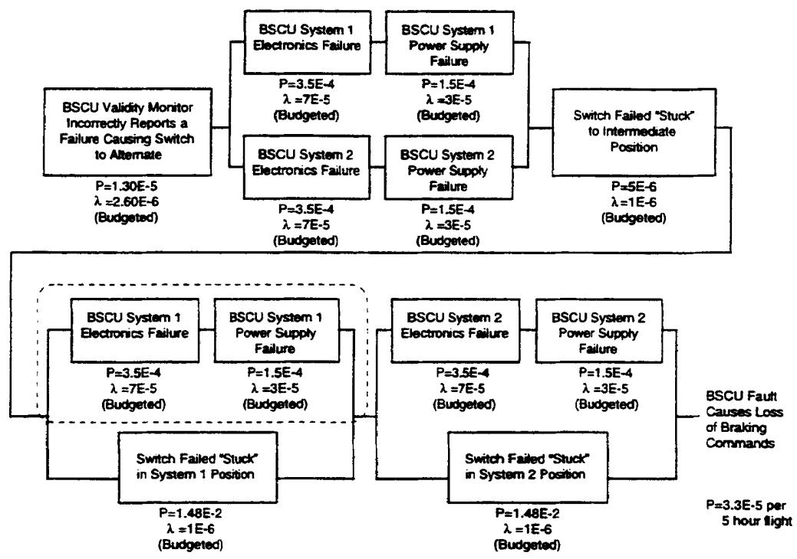  
NOTE: PSSA BSCU - DD  
FIGURE 4.2.2-1 - (PSSA BSCU - DD) BSCU Fault Causes Loss of Braking Commands Dependence Diagram  
FIGURE L4 (Continued)

# 4.2.2 (Continued):

(Operator's Note: The "Loss of All Wheel Braking" DD was used by the airframe manufacturer to produce BSCU vendor requirements. The BSCU vendor reviewed the requirement for two BSCUs and determined that one BSCU with two systems inside would be adequate. The BSCU vendor generated the following BSCU PSSA DD starting with the basic event. "BSCU Fault Causes Loss of Braking Commands" from the Wheel Brake System PSSA DD.

An Exposure time of 14,750 hours was budgeted for latent switch failures. This is the maximum exposure time which allows the top level probability requirement to be met.

This level of detail would not normally appear in this DD cause it is possible to show that the requirements are met using the total failure rate of the BSCU. Detail about BSCU failure modes is included in this example to allow a feature of Markov analysis to be illustrated.)

# SAE ARP4761

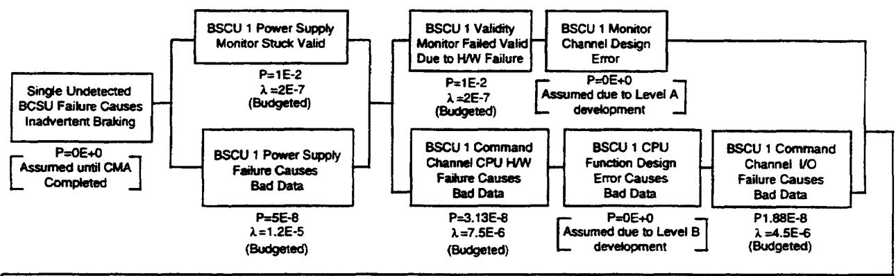  
NOTE: PSSA BSCU - DD

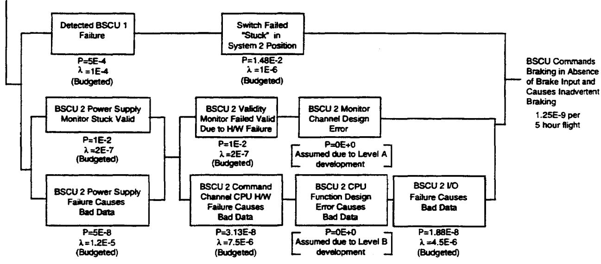  
FIGURE 4.2.2-2 - (PSSA BSCU - DD) BSCU Commands Braking in Absence of Brake Input and Causes Inadvertent Braking DD  
FIGURE L4 (Continued)

# SAE ARP4761

NOTE: PSSA BSCU - MA

# 4.2.3 PSSA of BSCU System - Markov Analysis

The Markov Analysis for "BSCU Fault Causes Loss of Braking Commands", including the switching mechanism, is shown in Figure 4.2.3-1 (Part A). In the Markov chain, each state is represented by a three-tuple (A, S, SW) where "A" is the status of the active BSCU computer, which could be either BSCU 1 or BSCU 2, "S" is the status of the standby BSCU computer and "SW" is the status of the switch. Each component is assumed to be in an operational or failed state. Failed states are represented by a bar on top of the symbol. Both the active and standby BSCU computers can fail in only one mode. The switching system can fail in two different modes, either stuck to the active BSCU computer or stuck open (not connected to either of the BSCU computers). The BSCU system is assumed to be failed when either both BSCU computers fail or the switching system fails to switch from the active to the standby system when the active system fails in a flight. Figure 4.2.3-1 (Part B) shows the expanded Markov model for a BSCU system failure. The BSCU system is assumed to be failed whenever the BSCU electronics fail or the BSCU power supply fails. Failure of both of these units is represented by a single transition in the Markov chain of Figure 4.2.3-1 (Part B).

Figure 4.2.3-2 shows "Detectable BSCU Failure Results in Inadvertent Braking". Inadvertent braking occurs when both the monitor and active system fail in either BSCU system. Inadvertent braking due to BSCU system 1 failure is shown in Figure 4.2.3-3. In this case, each state is represented by a four tuple (A, B, C, D). The first and third tuple in each state correspond to the BSCU system CPU & I/O and power supply. The second and fourth tuple in each state correspond to the CPU & I/O monitor and power supply monitor. Inadvertent braking occurs when both the CPU and its monitor fail or when the power supply and its monitor fail. The budgeted probability value of inadvertent braking due to BSCU system 1 failure is 2E-9.

Inadvertent braking due to BSCU system 2 and switching mechanism failure is shown in Figure 4.2.3-4. The Markov model in Figure 4.2.3-4 is same as the Markov model for BSCU system 1 (Figure 4.2.3-3) except that a new failure mode is added to the model to account for the switching mechanism. This is the failure of switching mechanism shown in the figure with a failure probability of 2.5E-1. Hence the total budgeted probability for Inadvertent braking due to BSCU system 2 failure is  $(2\mathrm{E} - 9)\times (2.5\mathrm{E} - 1) = 5\mathrm{E} - 10$

FIGURE L4 (Continued)

# SAE ARP4761

NOTE: PSSA BSCU - MA

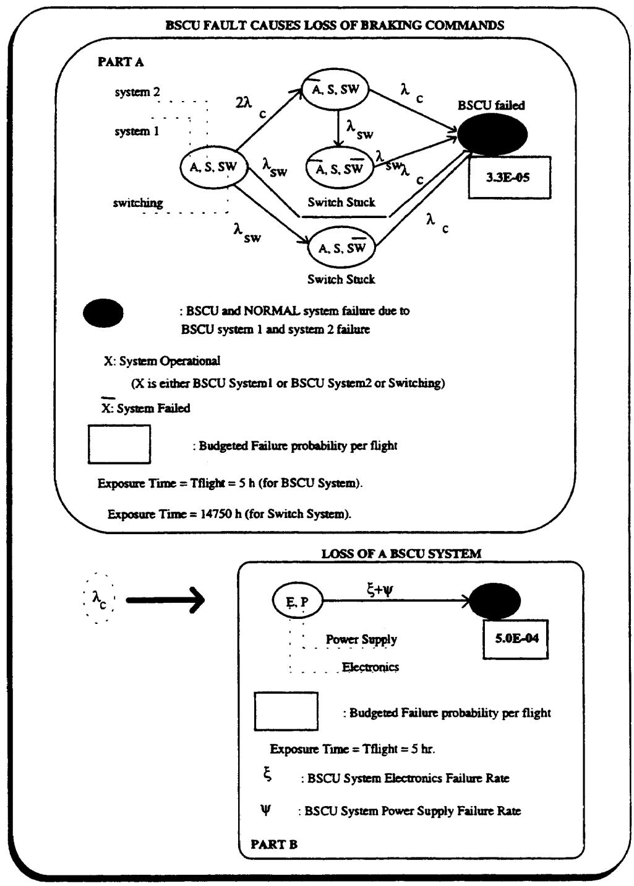  
FIGURE 4.2.3-1 - (PSSA BSCU - MA) BSCU Fault Causes Loss of Braking Commands MA  
FIGURE L4 (Continued)

# SAE ARP4761

NOTE: PSSA BSCU - MA

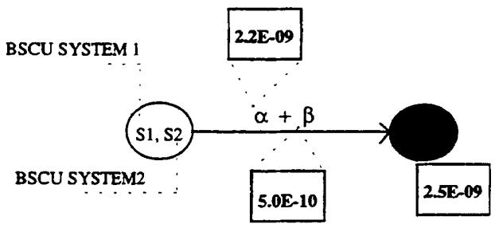  
DETECTABLE BSCU FAILURE RESULTS IN INADVERTENT BRAKING

α : developed event for "Detectable BSCU 1 Failure Causes Bad Data which is Provided to Normal System

β : developed event for "Detectable BSCU 2 Failure Causes Bad Data which is Provided to Normal System

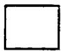

: Budgeted Failure probability per flight

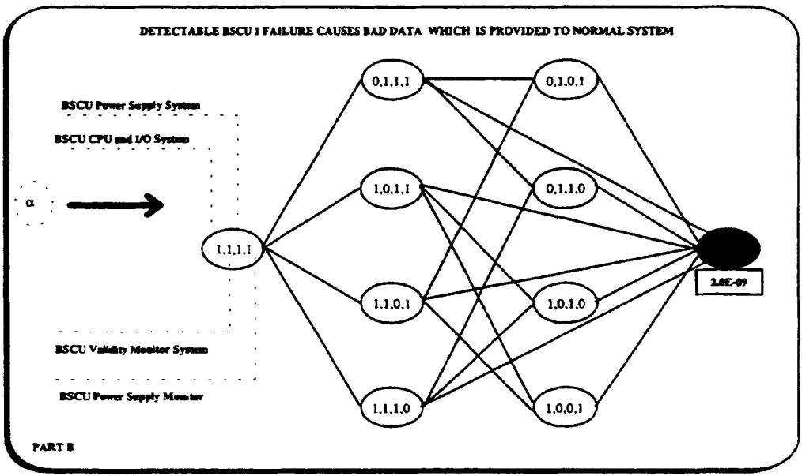  
FIGURE 4.2.3-2 - (PSSA BSCU - MA) Detectable BSCU Failure Results in Inadvertent Braking MA  
FIGURE 4.2.3-3 - (PSSA BSCU - MA) Inadvert Braking Due to BSCU System 1 Failure MA  
FIGURE L4 (Continued)

# SAE ARP4761

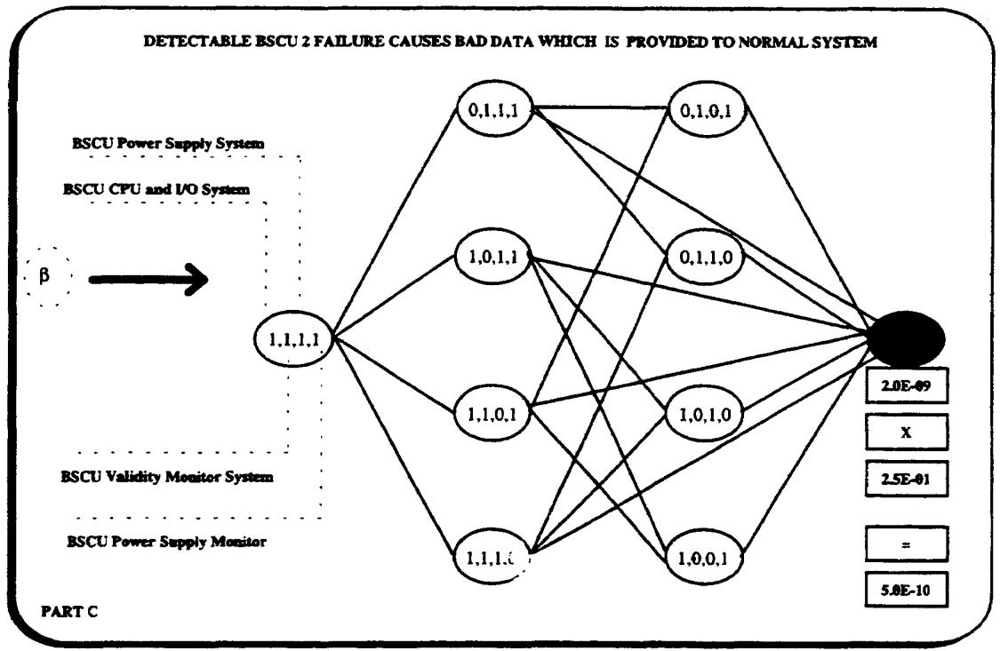  
NOTE: PSSA BSCU - MA  
FIGURE 4.2.3-4 - (PSSA BSCU - MA) Inadvertent Braking Due to BSCU System 2 Failure and Switching Mechanism Failure MA

FIGURE L4 (Continued)

# SAE ARP4761

# NOTE: PSSA BSCU

# 4.3 Requirements Established

As a result of the failure condition evaluation, the following lower level requirements have been derived.

# 4.3.1 Installation Requirements

Each BSCU System requires a source of power independent from the source supplied to the other system.

# 4.3.2 Hardware and Software Requirements

The following BSCU hardware and software requirements have been derived and must be satisfied in order to meet the overall safety objectives.

1) Each BSCU system will have a target failure rate of less than 1E-4 failures per hour.  
2) The targeted probabilities for the fault tree primary failure events shown in Figures 4.2.1-1 and 4.2.1-2 have to be met. Note: Any events that do not meet these target probabilities must be approved by the system engineering group before proceeding with the design.  
3) There must be no undetectable BSCU failures that can cause inadvertent braking.  
4) There must be no common mode failures of the command and monitor channels of a BSCU system that could cause them to provide the same incorrect braking command simultaneously.  
5) * The monitor channel of a BSCU system shall be designed to Development Assurance Level A.  
6) * The command channel of a BSCU system may be designed to Development Assurance Level B.

* (Editor's Note: These allocations could have been switched, designing the command channel to Development Assurance Level A and the monitor channel to Level B.)

# 4.3.3 Safety Maintenance Requirements

The switch that selects between system 1 and system 2 must be checked on an interval not to exceed 14,750 hours.

# 5.0 CONCLUSION

The design as known now appears to be able to satisfy the safety requirements imposed by the Wheel Brake System PSSA. Further requirements on installation, hardware and software and maintenance tasks to be performed have been identified and are passed on to the responsible design authority. Failure Modes and Effects Analyses and Common Mode Analyses are required to verify that this design meets the requirements.

# FIGURE L4 (Continued)

# SAE ARP4761

# NOTE: SSA BSCU - FMEA

(Operator's Note: At this point in the example, it is assumed that the PSSA is sufficiently developed to enable detail design implementation. The example resumes following detail design implementation and develops the SSA to support certification. As described in Figure 3 of the main body of this document, the SSA process begins as a bottom up analysis at the item level.)

# BSCU Power Supply Failure Modes and Effects Analysis (FMEA)

(Operator's Note: This FMEA example is simplified by limiting the FMEA to the BSCU power supply. In reality an FMEA may be requested at any level from an entire system to a small portion of circuitry performing one function inside an LRU.)

# 1.0 INTRODUCTION

(Operator's Note: For the purpose of this example it is assumed that the FMEA was chosen to support the SSA FTA. The process and format of the FMEA may require minor alterations to support DD or MA methodologies; however the basic steps and principles carry forward.)

This FMEA addresses the BSCU power supply in support of the basic events and safety objectives identified in the "INADVERTENT WHEEL BRAKING AFTER V1" preliminary FTA as requested in Reference 2.

This FMEA report provides quantification of the final FTA by providing failure rates for the basic events. The FTA basic events supported by this FMEA are "BSCU Power Supply Failure Causes Bad Data", "BSCU Power Supply Monitor Failed Valid" and the power supply contribution to "Undetected BSCU Failure Causes Inadvertent Braking". This analysis was performed against released and final documentation of the BSCU design and production drawings. This FMEA will be part of the supporting documentation for both the BSCU and wheel brake system SSAs.

The required FMEA was performed in two parts. A functional FMEA was performed on the Power Supply and a piece part FMEA was performed on the Power Supply Monitor portion of the power supply. The piece part FMEA was performed after the conservative results of the functional FMEA did not meet the safety objectives.

(Operator's Note: The following Cross Reference Table provides linkage from each example paragraph to the applicable FMEA appendix paragraph.

FIGURE L5  

<table><tr><td>Item FMEA Paragraph #</td><td>Appendix G Paragraph #</td></tr><tr><td>4.1</td><td>G.3.2.1</td></tr><tr><td>4.2</td><td>G.3.2.2</td></tr></table>

# SAE ARP4761

# NOTE: SSA BSCU - FMEA

# 2.0 REFERENCES

(Operator's Note: The information contained in these references provides a substantial portion of the documentation required before beginning an FMEA. See Section G.2.1)

1) ARP4761 "Guidelines and Methods for Conducting the Safety Assessment Process on Civil Airborne Systems and Equipment"  
2) Internal memo requesting FMEA support for "Inadvertent Braking after V1" fault tree for the S18 Aircraft incorporating the BSCU System  
3) BSCU released design and production documentation  
4) MIL-HDBK-217F "Reliability Prediction of Electronic Equipment"  
5) Internal memo stating component failure modes to be used for BSCU FMEA.  
6) Results of lab analysis of "Loss of or Reduced Filtering"

# 3.0 POWER SUPPLY DESCRIPTION

(Operator's Note: Part of the Preparation for an FMEA is understanding the operation of the function. A brief overview of the operation should be included in the report as outlined in G2.1)

The implementation of the BSCU power supply, as documented in Reference 3 was reviewed. The design and implementation of the BSCU 1 and 2 power supplies were found to be identical. Implementation is through identical power supply designs, located on physically separated areas of the BSCU circuit card assembly as depicted in architectural diagram of the BSCU in Figure 3.0-1. Within each BSCU System, the power supply and power supply monitor functions are physically independently located.

The power supply design is depicted in the block diagram provided in Figure 3.0-2. A detailed schematic of the  $+5$  volt monitor design is provided in Figure 3.0-3.

The BSCU power supply is of standard design and is described in the BSCU Hardware Description document.

The power supply monitors are window comparators. Both  $+5$  and  $\pm 15$  volts are monitored for over and under voltage conditions. The outputs are ANDed together so that if any voltage exceeds the trip point, high or low, the monitor output is pulled low.

# FIGURE L5 (Continued)

# SAE ARP4761

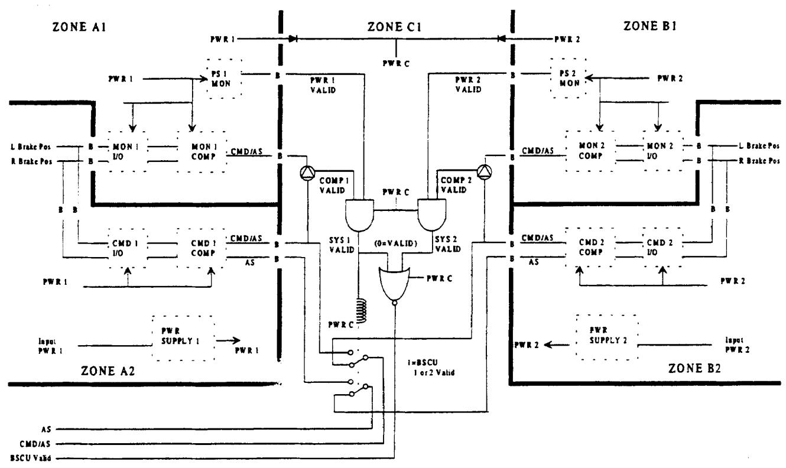  
NOTE: SSA BSCU - FMEA  
FIGURE 3.0-1 - (SSA BSCU - FMEA) BSCU Physical Implementation  
FIGURE L5 (Continued)

# SAE ARP4761

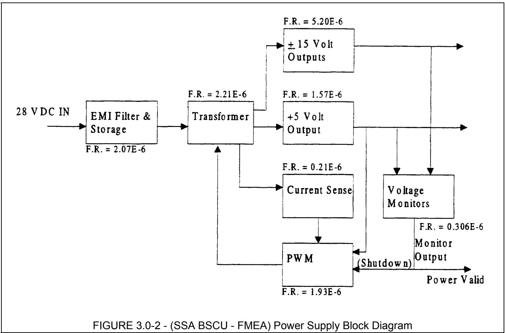  
NOTE: SSA BSCU - FMEA  
FIGURE L5 (Continued)

# SAE ARP4761

NOTE: SSA BSCU - FMEA  
FIGURE 3.0-3 - (SSA BSCU - FMEA) Schematic of Power Supply Monitor  
FIGURE L5 (Continued)  
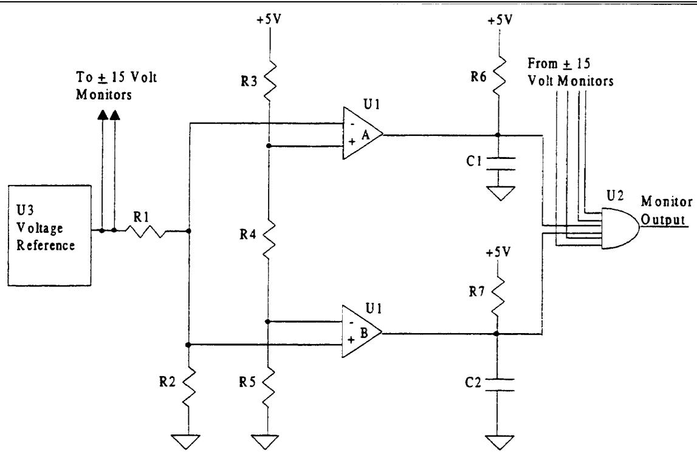  
NOTE: ±15 volt monitor uses same reference voltage and monitoring scheme.

# 4.0 POWER SUPPLY DETAIL ANALYSIS AND RESULTS

This FMEA contains two sections. Section 4.1 is the functional FMEA performed on the entire power supply. The functional FMEA on the power supply monitor has been deleted from the functional FMEA section since it is superseded by the piece part FMEA found in section 4.2.

# 4.1 Functional FMEA

Initial analysis of the power supply was conducted by computing the total power supply failure rate based on parts counts and failure rates. Conservative analysis did not meet the budget for Undetectable power supply failure causes inadvertent braking. Therefore a functional FMEA was performed to provide better resolution into the failure rates of the various failure modes. The only failure that may cause bad data and may not be detected by a properly functioning power supply monitor is "Loss of/reduced filtering". This failure mode may cause increased ripple on the output voltages that may be at such a level and frequency that it is not detected by the monitor. Table 4.1-1 documents the Functional FMEA results.

# SAE ARP4761

# NOTE: SSA BSCU - FMEA

# 4.1 (Continued):

(Operator's Note: Only the analysis of the  $+5$  volt block is shown in detail. The results of an FMEA on the remainder of the Power Supply are included in the summary. This is done to remove pages of tables unnecessary to give a representative example of a functional FMEA.)

Functional Failure Modes and Effects Analysis for BSCU Power Supply  
TABLE 4.1-1 - (SSA BSCU FMEA)  
FIGURE L5 (Continued)  

<table><tr><td>Function Name</td><td>Failure Mode</td><td>Failure Rate (E-6)</td><td>Flight Phase</td><td>Failure Effect</td><td>Detection Method</td><td>Comments</td></tr><tr><td>+5 Volt</td><td>+5V out of spec.</td><td>0.2143</td><td>All</td><td>Possible P/S shutdown</td><td>Power Supply Monitor trips, shuts down supply and passes “invalid power supply (P/S)” to other BSCU system</td><td>BSCU channel fails</td></tr><tr><td></td><td>+5V short to ground</td><td>0.2857</td><td>All</td><td>P/S shutdown</td><td>Power supply monitor passes invalid P/S to other BSCU system</td><td>BSCU channel fails</td></tr><tr><td></td><td>Loss of / reduced filtering</td><td>0.3571</td><td>All</td><td>Increase Ripple</td><td>May pass out of spec voltage to rest of BSCU if ripple is such that it is not detected by the P/S monitor</td><td>May cause spurious P/S monitor trip</td></tr><tr><td></td><td>+5V open</td><td>0.5714</td><td>All</td><td>P/S shutdown</td><td>Power supply monitor passes invalid P/S to other BSCU system</td><td>BSCU channel fails</td></tr><tr><td></td><td>No Effect</td><td>0.1429</td><td>All</td><td>No Effect</td><td>None/No Effect</td><td>No Effect</td></tr><tr><td>Total Failure Rate of +5V Supply</td><td></td><td>1.5714</td><td></td><td></td><td></td><td></td></tr></table>

# SAE ARP4761

# NOTE: SSA BSCU - FMEA

# 4.2 Power Supply Monitor Piece Part FMEA

Initial analysis of the power supply monitor was conducted by computing the total power supply monitor failure rate based on parts counts and failure rates. It was found that the total failure rate of the power supply monitor was 3.06E-7 failures per hour thus not complying with the budgeted failure rate of 2.0E-7 for monitor fails valid. A detailed piece part FMEA was conducted to provide better resolution into the probability of a "Monitor Fails Valid" condition. Table 4.2-2 documents this piece part FMEA. Five general Failure Code categories were included to enhance summary failure classification. These Failure Effect Codes are defined in Table 4.2-1.

TABLE 4.2-1 - (SSA BSCU - FMEA) Failure Effect Categories  
FIGURE L5 (Continued)  

<table><tr><td>Failure Effect Code</td><td>Failure Effect Category</td></tr><tr><td>1.</td><td>Monitor Stuck Valid</td></tr><tr><td>2.</td><td>Nuisance Monitor Trip</td></tr><tr><td>3.</td><td>Monitor Stuck Tripped/Supply Shutdown</td></tr><tr><td>4.</td><td>Monitor Sensitivity Shifts</td></tr><tr><td>5.</td><td>No Effect</td></tr></table>

# SAE ARP4761

NOTE: SSA BSCU - FMEA

TABLE 4.2-2 - (SSA BSCU - FMEA) Piece Part Failure Modes and Effects Analysis for BSCU Power Supply Monitor  
FIGURE L5 (Continued)  

<table><tr><td>Component ID</td><td>Part type</td><td>Failure Mode</td><td>Failure Mode Rate (E-6)</td><td>Failure Effect Code</td><td>Failure Effect</td><td>Detection Method</td></tr><tr><td>C1</td><td>Ceramic Capacitor</td><td>short</td><td>.0073</td><td>3</td><td>Under voltage monitor stuck tripped</td><td>P/S shut down by monitor</td></tr><tr><td></td><td></td><td>open</td><td>.0013</td><td>2</td><td>Loss of delay, spurious monitor trips</td><td>P/S shutdown</td></tr><tr><td></td><td></td><td>low cap.</td><td>.0019</td><td>2</td><td>Decrease delay to trip</td><td></td></tr><tr><td>C2</td><td>Ceramic Capacitor</td><td>short</td><td>.0073</td><td>3</td><td>Over voltage monitor stuck tripped</td><td>P/S shut down by monitor</td></tr><tr><td></td><td></td><td>open</td><td>.0013</td><td>2</td><td>Loss of delay, spurious monitor trips</td><td>P/S shutdown</td></tr><tr><td></td><td></td><td>low cap</td><td>.0019</td><td>2</td><td>Decrease delay to trip</td><td></td></tr><tr><td>U1A</td><td>Comparator IC</td><td>output open</td><td>.0124</td><td>1</td><td>Under volt monitor stuck valid</td><td>bench test</td></tr><tr><td></td><td></td><td>output grounded</td><td>.0056</td><td>3</td><td>Under volt monitor trips</td><td>P/S shutdown</td></tr><tr><td></td><td></td><td>high offset voltage</td><td>.0062</td><td>4</td><td>loss of monitor sensitivity</td><td>bench test</td></tr><tr><td>U1B</td><td>Comparator IC</td><td>output open</td><td>.0124</td><td>1</td><td>Over volt monitor stuck valid</td><td>bench test</td></tr><tr><td></td><td></td><td>output grounded</td><td>.0056</td><td>3</td><td>Over volt monitor trips</td><td>P/S shutdown</td></tr><tr><td></td><td></td><td>high offset voltage</td><td>.0062</td><td>4</td><td>loss of monitor sensitivity</td><td>bench test</td></tr></table>

# SAE ARP4761

NOTE: SSA BSCU - FMEA

TABLE 4.2-2 - (SSA BSCU - FMEA) Piece Part Failure Modes and Effects Analysis for BSCU Power Supply Monitor (Continued)  
FIGURE L5 (Continued)  

<table><tr><td>Component ID</td><td>Part type</td><td>Failure Mode</td><td>Failure Mode Rate (E-6)</td><td>Failure Effect Code</td><td>Failure Effect</td><td>Detection Method</td></tr><tr><td>R1</td><td>Film Resistor</td><td>open</td><td>.0009</td><td>3</td><td>over volt monitor trips</td><td>P/S shutdown</td></tr><tr><td></td><td></td><td>increase resistance</td><td>.0005</td><td>4</td><td>trip window shifts down</td><td></td></tr><tr><td></td><td></td><td>decrease resistance</td><td>.0004</td><td>4</td><td>trip window shifts up</td><td></td></tr><tr><td>R2</td><td>Film Resistor</td><td>open</td><td>.0009</td><td>3</td><td>under volt monitor trips</td><td>P/S shutdown</td></tr><tr><td></td><td></td><td>increase resistance</td><td>.0005</td><td>4</td><td>trip window shifts up</td><td></td></tr><tr><td></td><td></td><td>decrease resistance</td><td>.0004</td><td>4</td><td>trip window shifts down</td><td></td></tr><tr><td>R3</td><td>Film Resistor</td><td>open</td><td>.0009</td><td>3</td><td>under volt monitor trips</td><td>P/S shutdown</td></tr><tr><td></td><td></td><td>increase resistance</td><td>.0005</td><td>4</td><td>trip window shifts up</td><td></td></tr><tr><td></td><td></td><td>decrease resistance</td><td>.0004</td><td>4</td><td>trip window shifts down</td><td></td></tr><tr><td>R4</td><td>Film Resistor</td><td>open</td><td>.0009</td><td>1</td><td>monitor stuck valid</td><td>bench test</td></tr><tr><td></td><td></td><td>increase resistance</td><td>.0005</td><td>2</td><td>trip window tightens</td><td>bench test</td></tr><tr><td></td><td></td><td>decrease resistance</td><td>.0004</td><td>1</td><td>trip window widens, may cause monitor stuck valid</td><td>bench test</td></tr><tr><td>R5</td><td>Film Resistor</td><td>open</td><td>.0009</td><td>3</td><td>over volt monitor trips</td><td>P/S shutdown</td></tr><tr><td></td><td></td><td>increase resistance</td><td>.0005</td><td>4</td><td>trip window shifts down</td><td></td></tr><tr><td></td><td></td><td>decrease resistance</td><td>.0004</td><td>4</td><td>trip window shifts up</td><td></td></tr></table>

# SAE ARP4761

NOTE: SSA BSCU - FMEA

TABLE 4.2-2 - (SSA BSCU - FMEA) Piece Part Failure Modes and Effects Analysis for BSCU Power Supply Monitor (Continued)  

<table><tr><td>Component ID</td><td>Part type</td><td>Failure Mode</td><td>Failure Mode Rate (E-6)</td><td>Failure Effect Code</td><td>Failure Effect</td><td>Detection Method</td></tr><tr><td>R6</td><td>Film Resistor</td><td>open</td><td>.0009</td><td>3</td><td>under volt monitor stuck tripped</td><td>P/S shutdown</td></tr><tr><td></td><td></td><td>increase resistance</td><td>.0005</td><td>5</td><td>no effect</td><td></td></tr><tr><td></td><td></td><td>decrease resistance</td><td>.0004</td><td>5</td><td>no effect</td><td></td></tr><tr><td>R7</td><td>Film Resistor</td><td>open</td><td>.0009</td><td>3</td><td>over volt monitor stuck tripped</td><td>P/S shutdown</td></tr><tr><td></td><td></td><td>increase resistance</td><td>.0005</td><td>5</td><td>no effect</td><td></td></tr><tr><td></td><td></td><td>decrease resistance</td><td>.0004</td><td>5</td><td>no effect</td><td></td></tr><tr><td>U2</td><td>AND gate</td><td>stuck high</td><td>.0108</td><td>1</td><td>monitor stuck valid</td><td>bench test</td></tr><tr><td></td><td></td><td>stuck Low</td><td>.0054</td><td>3</td><td>monitor stuck tripped</td><td>P/S shutdown</td></tr><tr><td>U3</td><td>Voltage Reference</td><td>inop</td><td>.0110</td><td>3</td><td>overvolt monitor trip</td><td>P/S shutdown</td></tr><tr><td></td><td></td><td>out of spec</td><td>.0058</td><td>4</td><td>window shift</td><td></td></tr><tr><td></td><td></td><td>short</td><td>.0026</td><td>3</td><td>monitor trip</td><td>P/S shutdown</td></tr><tr><td></td><td></td><td>open</td><td>.0245</td><td>3</td><td>overvolt monitor trip</td><td>P/S shutdown</td></tr></table>

NOTE: Failures in failure effect category 4 may cause monitor effectiveness to be reduced.

FIGURE L5 (Continued)

# SAE ARP4761

# NOTE: SSA BSCU - FMEA

# 4.2 (Continued):

(Operator's Note: For the purposes of this example, failure modes and failure rates for the  $\pm 15$  volt monitors are assumed to be identical to the  $+5$  volt monitor. In an actual FMEA the same detailed analysis would have to be completed on the  $\pm 15$  volt monitors to determine the actual failure modes and rates.)

# 4.3 FMEA Summary

The BSCU level effect of "Loss of/reduced filtering" was unknown and might have contributed to "Undetectable BSCU failure causes inadvertent braking". It is extremely conservative to assume that all failures in this category will be undetectable and capable of causing "Undetectable BSCU failure causes inadvertent braking". Therefore a separate laboratory analysis of the effect on the system was performed. This analysis (reference 6) shows that none of the failures in the "Loss of/reduced filtering" effect category can cause inadvertent braking.

(Operator's Note: Laboratory analysis may be required in some instances to determine the actual effect of a failure mode. See Section G.2.2.3)

All other failure effect categories except "No effect" may contribute to "BSCU power supply failure caused bad data". These failures will be detected by a properly functioning power supply monitor. Table 4.3-1 summarizes the results of the power supply and power supply monitor FMEAs.

FIGURE L5 (Continued)

# SAE ARP4761

NOTE: SSA BSCU - FMEA

BSCU Power Supply and Power Supply Monitor Failure Modes and Effects Summary  
TABLE 4.3-1 - (SSA BSCU FMEA)  
FIGURE L5 (Continued)  

<table><tr><td>Failure Modes</td><td>Failure Rate (E-6)</td><td>BSCU Effect</td><td>Potential Failure Cause</td><td>Detection Method</td><td>Comments</td></tr><tr><td>Power Supply (P/S) Shutdown</td><td>8.21</td><td>BSCU system fails</td><td>+5 out of spec +5 short to gnd +5 volt open +15 out of spec ...</td><td>“Power valid” to other BSCU set invalid</td><td>BSCU System 2 provides braking command</td></tr><tr><td>Increased Ripple from P/S</td><td>1.86</td><td>Unknown</td><td>Loss/reduced filtering: +5 volts +15 volts -15 volts ...</td><td>Possibly undetected</td><td>Laboratory analysis was performed that indicates this mode does not cause inadvertent braking.</td></tr><tr><td>Property Operating P/S Monitor cannot shut down P/S</td><td>0.57</td><td>P/S does not shut down following P/S failure</td><td>PWM input from voltage monitor stuck valid</td><td>Card level test only</td><td>Power valid signal shuts down BSCU 1 outputs. No obvious BSCU effect.</td></tr><tr><td>P/S Monitor Fails Valid</td><td>0.1429</td><td>Possible erroneous operation following P/S failure</td><td>U1A open U1B open R4 Open R4 decreased R U2 high ...</td><td>Bench test</td><td>Latent failure</td></tr><tr><td>P/S Monitor Tripped</td><td>0.1578</td><td>BSCU system fails</td><td>C1 short C1 open C2 short C2 open ...</td><td>“Power valid” to other BSCU set invalid</td><td></td></tr><tr><td>No Effect (NE)</td><td>2.5554</td><td>None</td><td>+5 volt output NE R6 increase R R6 decrease R ...</td><td>None</td><td>None</td></tr></table>

# SAE ARP4761

NOTE: SSA BSCU - FMEA

# 5.0 CONCLUSION

The FMEA of the power supply was necessary to verify the design implementation meets the budget of 1.2E-5 failures per hour for "BSCU Power Supply Failure Causes Bad Data". The actual failure rate for "BSCU Power Supply Failure Causes Bad Data" is 1.06E-5 failures per hour.

The FMEA of the power supply monitor was necessary to verify the design implementation meets the budget of 2E-7 failures per hour for failure of the power supply monitors where the failure mode of concern is "Power Supply Monitor Fails to Detect Power Supply Failure". The actual failure rate for "Power Supply Monitor Fails to Detect Power Supply Failure" is 1.429E-7 failures per hour.

The BSCU power supply meets the requirement for loss of power supply, undetectable failure that causes inadvertent braking, and power supply monitor fails to detect a power supply failure.

FIGURE L5 (Continued)

# SAE ARP4761

NOTE: SSA BSCU - FMES

# FMES for the BSCU System

# 1.0 INTRODUCTION

This FMES provides a summary of the results of all BSCU FMEAs.

(Operator's Note: Results of other FMEAs that may have been performed are also included to provide a more extensive list of failure effects.)

(Operator's Note: For details on FMES process refer to Appendix H.)

# 2.0 REFERENCES

The following references were utilized in performing this analysis.

1) ARP4761 "Guidelines and Methods for Conducting the Safety Assessment Process on Civil Airborne Systems and Equipment"  
2) Internal memo documenting FMEAs results relative to the BSCU System  
3) BSCU released design and production documentation

# 3.0 BSCU DESCRIPTION

(Operator's Note: Normally a system description would be included here. However, since it's included elsewhere in Appendix L, it is not repeated here.)

# 4.0 FMES DATA

The failure effects from the FMEAs from Reference 2 were examined and summarized as shown in Table 4.0-1.

FIGURE L6

# SAE ARP4761

NOTE: SSA BSCU - FMES

TABLE 4.0-1 - (SSA BSCU - FMEA) FMES of BSCU Output Level Failure Effects  

<table><tr><td>Failure Mode</td><td>Failure Rate</td><td>Potential Failure Cause (source of failure)</td><td>Detectability</td><td>Comments</td></tr><tr><td>Loss of braking command from system 1</td><td>4.35 E-5</td><td>-System 1 P/S shutdown - System 1 P/S monitor trips - System 1 command failed</td><td>- signal to crew alerting system</td><td>System 2 provides braking command</td></tr><tr><td>Loss of braking command from system 2</td><td>4.35 E-5</td><td>- System 2 P/S shutdown - System 2 P/S monitor trips - System 2 command failed</td><td>- signal to crew alerting system</td><td>System 1 provides braking command</td></tr><tr><td>Loss of Braking command from both system 1 and 2</td><td>1.6 E-9</td><td>-BSCU validity monitor stuck invalid - BSCU switch failed in intermediate position</td><td>Indication on system display “Loss of normal braking”</td><td>Discrete provided</td></tr><tr><td>Inadvertent brake command from system 1 or 2</td><td>0.85 E-9</td><td>-failures 3,5,9 of CMD1 I/O, CMD2 I/O (FMEA BSCU)</td><td>Obvious by effect</td><td></td></tr><tr><td>Asymmetrical brake command from system 1 or 2</td><td>1.6 E-8</td><td>-failures 6,11,12 of CMD1COMP, CMD2COMP (FMEA BSCU</td><td>Obvious by effect</td><td></td></tr></table>

(Operator's Note: Not all failures mentioned in the "Potential Failure Cause" column can be found in the FMEA in this example appendix, but it shows the principle of the FMES to summarize all failures with the same effect to get one failure mode for the next higher level of analysis.)

FIGURE L6 (Continued)

# SAE ARP4761

NOTE: SSA BSCU - CMA

# Common Mode Analysis (CMA) for the BSCU

CMA of the BSCU Design Implementation (Item/Component Level CMA)

(Operator's Note: The processes and methods described in Appendix K should be utilized to develop an LRU CMA report similar to the following. The format of the report is left to the analyst, however the specific content should reflect the expected content as described in Appendix K and this example. This example depicts one format of a completed Item Common Mode Analysis.)

# 1.0 INTRODUCTION

This report documents the Brake System Control Unit (BSCU) Common Mode Analysis assuring that no single failures exist within the BSCU which can initiate a hazardous or catastrophic event. The BSCU provides redundant high integrity braking and anti-skid control for the S18 aircraft.

(Operator's Note: The following Cross Reference Table provides linkage from each example paragraph to the applicable CMA appendix paragraph.)

<table><tr><td>Item CMA Paragraph #</td><td>Appendix K Paragraph #</td></tr><tr><td>4.1</td><td>K.3.1</td></tr><tr><td>4.2</td><td>K.3.2</td></tr><tr><td>4.3</td><td>K.3.3, K.4</td></tr></table>

# 2.0 REFERENCES

The following references were utilized in performing this analysis:

1) ARP4761 "Guidelines and Methods for Conducting the Safety Assessment Process for Civil Airborne Systems and Equipment"  
2) "Loss of All Wheel Braking" and "Inadvertent Wheel Braking" fault trees for the S18 Aircraft incorporating the BSCU System  
3) Aircraft Functional Hazard Assessment for the S18 Aircraft  
4) Preliminary Safety Assessment for the S18 Aircraft  
5) BSCU design and production documentation  
6) "Safety Segregation Design Guidelines for LRUs in Safety Critical Systems"

FIGURE L7

# SAE ARP4761

NOTE: SSA BSCU - CMA

# 3.0 FUNCTION/System DESCRIPTION

The BSCU is the LRU which provides the Normal brake system commands and the Anti Skid commands to the Normal and Alternate brake systems. The Normal system brake commands have the potential to initiate Inadvertent Braking, and reduce the availability of the Normal brake system relative to Loss of Wheel Braking; thus analysis of this function is required. The Anti Skid commands cannot engage the brakes, they can only remove a brake command generated elsewhere, therefore the Anti Skid design does not contribute to inadvertent braking. Given that Anti-skid does not contribute to the Reserve Braking system, it does not contribute to Total Loss of Wheel Braking. Analysis of Anti Skid functions is therefore not required.

The selected architecture for the BSCU is a Dual-Dual configuration consisting of two independent systems (System 1 and 2) each having two independent computation channels (command and monitor). Each System interfaces through a dedicated LRU connector (P1 or P2). The BSCU operates as an Active/Standby device where System 1 is normally active and System 2 is a standby system which is automatically switched on line upon System 1 failures detected by the System 1 in line monitoring. In line monitoring of both System 1 and System 2 combine to provide a Normal System shutdown and automatic reversion to Alternate Braking System when both BSCU systems are inoperative. Figure 3.0-1 depicts the BSCU architecture and its interfaces with other brake system elements.

FIGURE L7 (Continued)

# SAE ARP4761

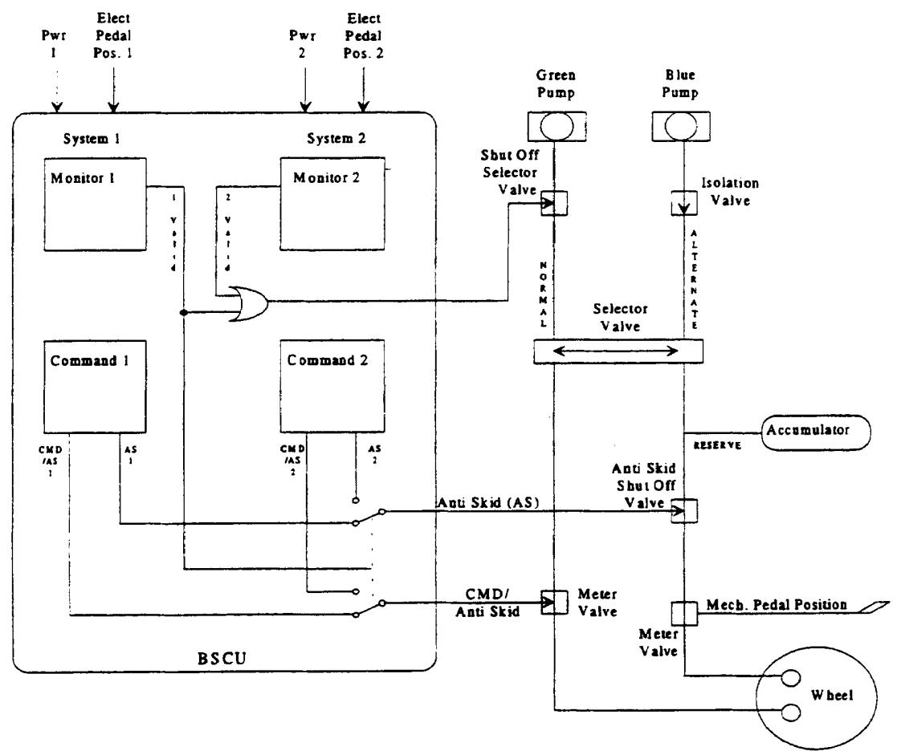  
NOTE: SSA BSCU - CMA  
FIGURE 3.0-1 - (SSA BSCU - CMA) BSCU Architecture Diagram  
FIGURE L7 (Continued)

# SAE ARP4761

# NOTE: SSA BSCU - CMA

# 4.0 BSCU CMA DETAIL

# 4.1 Common Mode Types, Sources and Failures/Errors Checklist

(Operator's Note: Appendix K section 2.1 provides guidance for establishing the Common Mode Types, Sources, and Failures/errors checklists.)

The common mode error/failure source listings in Appendix K of Reference 1 were reviewed to identify common mode sources applicable to the BSCU. The following error/failure sources were identified as relevant to the BSCU common mode analysis.

a. Design considerations

(1) Common external sources to redundant functions  
(2) Common electrical interfaces (connectors) within the redundant systems  
(3) Generic Development Errors within redundant systems (hardware or software)  
(4) Common failures effecting computation and monitoring functions

b. Manufacturing considerations

(1) Inappropriate component substitution  
(2) Improper assembly  
(3) Common manufacturer of components  
(4) Installation considerations  
(5) Incomplete installation (connectors not mated)  
(6) Incorrect installation (connectors interchanged)

c. Environmental considerations

(1) Non-compliance with environmental requirements  
(2) Non-compliance with electrical and radiation requirements

The above identified potential common mode error/failure sources are expected to be mitigated by one of the following Means of Acceptance.

a. Design analysis/test  
b. Production testing  
c. Approved/controlled manufacturing processes  
d. Approved/controlled repair processes  
e. Certification/qualification testing

# FIGURE L7 (Continued)

# SAE ARP4761

# NOTE: SSA BSCU - CMA

# 4.2 Analysis Requirements

(Operator's Note: Appendix K sections 3.2 (FHA/PSSA inputs) and section 3.3 provide guidance for establishing the analysis requirements.)

The BSCU CMA analysis requirements were identified by reviewing references 2, 3, and 4 and identifying Fault Tree AND-gates implemented within the BSCU and contributing to hazardous or catastrophic condition. Various BSCU functions were found to contribute to hazardous Loss of Wheel Braking, and catastrophic Inadvertent Wheel Braking events. Independence of these functions must be shown in order to assure absence of common mode faults due to Development Error. The following BSCU independence requirements were derived from the fault tree review.

# 1. Loss of Wheel Braking

Loss of all wheel braking requires loss of Normal brake system, AND loss of Alternate brake system AND loss of Emergency/Reserve brake systems. The BSCU brake command output contributes only to the Normal system. The Anti Skid command output can contribute to loss of both the Normal and Alternate brake systems due to its ability to remove a brake command from other sources. No element of the BSCU contributes to the Emergency/Reserve braking system, therefore there can be no common mode BSCU failures which can inhibit all wheel braking. However; loss of the redundant BSCU systems can reduce availability of Normal braking as depicted in the fault tree.

# 2. Inadvertent Wheel Braking

Any of the individual braking systems can contribute to inadvertent wheel braking, therefore it must be shown that the BSCU contains no common mode failures which may inadvertently activate the Normal braking system while the Normal system is active.

The Inadvertent Wheel Braking fault tree was analyzed to identify BSCU related failures and establish BSCU independence requirements. The following BSCU functions must be shown to be independent and free of common mode failures in order to validate the Inadvertent Wheel Braking fault tree.

1) Failures of BSCU system computation must be independent from failures of the associated validity monitors and command switching outputs. This assures that single failures cannot cause an improper command and simultaneously inhibit monitor and removal of the command.  
2) Failures of each BSCU system's command and monitor channels must be independent to assure that single failures cannot impact both channels similarly, defeating the cross channel comparison monitor.

# FIGURE L7 (Continued)

# SAE ARP4761

# NOTE: SSA BSCU - CMA

# 4.2 (Continued):

3) Failures of each BSCU power supply and the associated power supply monitors must be independent to assure that no single failure can cause anomalous power supply operation and defeat the power supply monitor. (Since the power supply is common to the command and monitor channels of a given system, a power supply failure could similarly affect both channels, defeating the comparator.)  
4) Generic hardware or software errors in elements common to the command or monitor channels, or the validity/comparison monitors must be considered.  
5) Manufacturing considerations including common components within BSCU systems 1 and 2 and Manufacturing quality control must be considered.  
6) The installation must consider common mode errors such as connections, inspections, etc.  
7) The BSCU shall be designed considering environmental conditions for HIRF and lightning.

# 4.3 Common Mode Analysis

With the knowledge of intended operation as described in section 3.0, the actual implementation was reviewed relative to the independence requirements identified in section 4.2 and the segregation guidelines identified in reference 6. A number of factors were considered and are addressed individually in the following analysis.

Figure 4.3-1 depicts physical BSCU segregation zones separating the functions for which independence must be provided. Analysis was conducted by reviewing printed circuit wiring board documentation and other production assembly documentation. The design intent is that BSCU System 1 be entirely constrained within zone A while BSCU System 2 is constrained within zone B, assuring independence of systems 1 and 2. Each system is further divided into additional zones 1 and 2. This division provides independence of the MONITOR COMP and the POWER SUPPLY MONITOR functions in zone 1 from the COMMAND COMP and the POWER SUPPLY functions in zone 2, respectively. The "VALIDITY" and "SWITCHING" functions are within a unique zone, zone C, to provide independence from common element of both systems 1 and 2. This segregation design assures independence of the elements within each of these functions. The actual implemented design was reviewed to assure that the intent of the segregation was satisfied.

# FIGURE L7 (Continued)

# SAE ARP4761

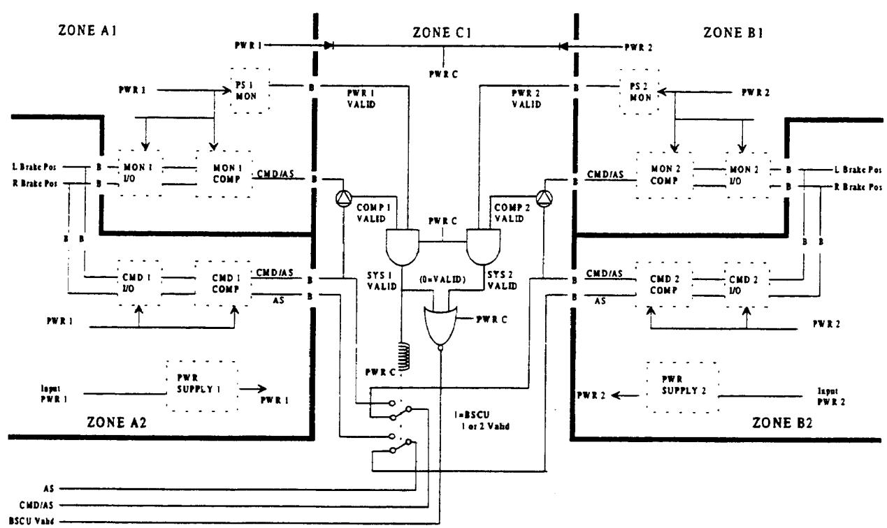  
NOTE: SSA BSCU - CMA  
FIGURE 4.3-1 - (SSA BSCU CMA) BSCU Physical Implementation  
FIGURE L7 (Continued)

# SAE ARP4761

# NOTE: SSA BSCU - CMA

# 4.3 (Continued):

Analysis began at the inputs to the BSCU and flowed through each segregation zone to identify any unintended violations of the function segregation. The following list signals violated the segregation zones. These signals were further analyzed to assure they were acceptable and anticipated interconnections, and that appropriate buffering to prevent fault propagation was provided.

Power supply voltages were common to all elements in each System (however each system's power supply voltages were found to be independent). This is acceptable given the independent power monitor input to system validity.

The Monitor and Command computation channel Command/Anti Skid outputs and the Command computation channel Anti Skid output passed from their respective segregation zones into the validity/monitor zone. The comparison and command switching between systems functions is implemented within the validity/monitor segregation zone. The command signals must pass into that zone to be switched to the output as appropriate. Adequate buffering is provided to prevent fault propagation between zones. Thus these violations are acceptable.

System 2 BSCU Validity, Anti Skid, and Command/Anti Skid outputs passed from System 2 into System 1's validity/monitor channel. As with the similar violations of the System 1 commands, this is an anticipated violation given that the selection of which of the two systems is directed to the output is functionally implemented within System 1's validity/monitor zone. Again adequate buffering for fault propagation was present in the design.

Power and pedal inputs for each System were routed through independent system oriented connectors, keyed differently to preclude inadvertent interchanges of inputs to the two systems. All outputs from the BSCU are routed through the System 1 connector. Output functions and System 1 input functions are separated by grounded connectors pins, eliminating undetectable inadvertent shorts between input or power and brake command or validity outputs. The validity and command outputs are also isolated from each other within the connector.

Independence requirements 1, 2 and 3 of section 4.2 are satisfied by the segregation of functionality provided within the design implementation. The requirements in 4, 5, 6 and 7 of section 4.2 are satisfied as follows.

# FIGURE L7 (Continued)

# SAE ARP4761

# NOTE: SSA BSCU - CMA

# 4.3 (Continued):

Requirement 4, Generic Failures in Components to Multiple Channels or Systems, is dealt with as follows.

a. Components (including software elements) common to multiple channels and/or systems were reviewed from the standpoint of assuring that a generic failure is either not possible, will not produce similar failure effects in multiple channels/systems, or will not affect both outputs and monitors of the respective outputs. The software elements are common to both BSCU Systems. The computation and monitor channel software has been developed and rigorously verified to Development Assurance Level A and B respectively, using DO-178 compliant processes, thus precluding design flaws of concern.  
b. All components used in the BSCU design are common and relatively simple industry components used widely in similar systems in the past. Based on the extensive industry experience with these components, no adverse failure conditions are anticipated. This process sufficiently demonstrates the absence of generic type development errors in this device.

Requirement 5, Manufacturing Considerations, is dealt with as follows.

Manufacturing errors which could invalidate independence of the BSCU functions are controlled by a combination of controlled manufacturing processes, inspection of sequential assembly processes, and end product predelivery testing of each unit produced.

Requirement 6, Installation Considerations, is dealt with as follows.

Installation and maintenance related common mode errors are controlled by established maintenance procedures backed up by specific return to service testing. Additionally, unique connector keying eliminates reversing BSCU connectors.

Requirement 7, Environmental Considerations, is dealt with as follows.

Environmental considerations relative to common failure modes are eliminated through extensive qualification and certification testing conducted in accordance with DO-160 Environmental Standards.

# FIGURE L7 (Continued)

# SAE ARP4761

NOTE: SSA BSCU - CMA

# 4.4 LRU Level CMA Summary

Table 4.4-1 summarizes the results of the BSCU Common Mode Analysis.

TABLE 4.4-1 - (SSA BSCU - CMA) BSCU Common Mode Analysis Summary  
FIGURE L7 (Continued)  

<table><tr><td>Failure Condition</td><td>Common Mode Source</td><td>Design Justification</td><td>Ref. 4.2 Reg. #</td></tr><tr><td>Loss of all Wheel Braking</td><td>BSCU failure</td><td>BSCU is associated only with Normal Brake system commands and has no brake command inputs to Alternate or Emergency systems.</td><td>Not Applicable</td></tr><tr><td>Reduction of availability of Normal braking system</td><td>Simultaneous BSCU System 1 &amp; 2 failure</td><td>No common functions except output switching and validity which are appropriately buffered.</td><td>1</td></tr><tr><td>Inadvertent Braking due to common failures in BSCU command and monitor channels</td><td>Violation of Command and Monitor Segregation Zones</td><td>Common functions limited with buffering protection provided in accordance with segregation guidelines.</td><td>2</td></tr><tr><td>Inadvertent Braking due to inappropriate Power Supply Monitor Independence in the presence of anomalous system power supply outputs</td><td>Violation of Power Supply &amp; Monitor Segregation Zones or inappropriate power monitor design</td><td>Common functionis limited with buffering protection provided in accordance with segregation guidelines. Monitor outputs biased to invalid in absence of power or invalid power supplies.</td><td>3&amp;4</td></tr><tr><td>Generic Common Component Failures</td><td>Violation of any required independence or generic development errors</td><td>Components used have either industry accepted integrity or have been exposed to special design verification processes.</td><td>5</td></tr></table>

# SAE ARP4761

NOTE: SSA BSCU - CMA

TABLE 4.4-1 - (SSA BSCU - CMA) BSCU Common Mode Analysis Summary (Continued)  

<table><tr><td>Failure Condition</td><td>Common Mode Source</td><td>Design Justification</td><td>Ref. 4.2 Reg. #</td></tr><tr><td>Manufacturing Considerations</td><td>Manufacturing errors violating independence</td><td>Certification Authority approved manufacturing &amp; quality assurance processes in use. Final test and inspections preclude manufacturing errors.</td><td>6</td></tr><tr><td>LRU Test Deficiencies</td><td>Failure to detect latent failures at bench test</td><td>LRU bench test has been analyzed to assure coverage of safety critical latent failures.</td><td>6</td></tr><tr><td>Installation Considerations</td><td>Improper installation and/or maintenance on aircraft</td><td>Post maintenance “return to service” testing required prior to dispatch verifies system interfaces and operation.</td><td>7</td></tr><tr><td>Environmental Conditions</td><td>Environmental Induced Common Failures</td><td>Precluded by Extensive Environmental Qualification testing.</td><td>8</td></tr></table>

# 5.0 CONCLUSION

No BSCU common mode failures which could result in loss of wheel braking or inadvertent wheel braking were identified.

FIGURE L7 (Continued)

# SAE ARP4761

NOTE: SSA BSCU - FTA, DD, MA

# BSCU - FTA (DD or MA) Report

# 1.0 INTRODUCTION

This report documents the Brake System Control Unit (BSCU) Fault Tree Analysis (Dependence Diagram or Markov Analysis) results.

(Operator's Note: The following Cross Reference Table provides linkage from each example paragraph to the applicable appendix paragraph.)

<table><tr><td>Item SSA Paragraph #</td><td>Appendix</td></tr><tr><td>4.0</td><td>C.3.1.1</td></tr><tr><td>5.0</td><td>C.3.1.2, 3.3</td></tr><tr><td>5.1</td><td>Appendix D</td></tr><tr><td>5.2</td><td>Appendix E</td></tr><tr><td>5.3</td><td>Appendix F</td></tr></table>

# 2.0 REFERENCES

1) BSCU PSSA  
2) BSCU Specification  
3) BSCU FMEA  
4) BSCU FMES  
5) BSCU CMA  
6) BSCU Reliability Prediction Report

# 3.0 DESCRIPTION SUMMARY

(Operator's Note: The description for this example is the same as found in the BSCU PSSA section 3.0.)

# 4.0 SUMMARY OF BSCU ANALYSIS RESULT

FTA's (DDs or MAs) for significant BSCU undesired events were generated during the preliminary system safety assessment of the BSCU. This report formalizes those analyses with actual failure rates and exposure times.

FIGURE L8  

<table><tr><td>Failure Effect</td><td>Requirement</td><td>Analysis Result</td></tr><tr><td>BSCU fault causes loss of braking commands</td><td>&lt; 3.3 E-5/flight</td><td>1.5 E-6/flight</td></tr><tr><td>BSCU fault causes inadvertent braking after V1</td><td>&lt; 2.5 E-9/flight</td><td>6.16 E -10/flight</td></tr></table>

# SAE ARP4761

NOTE: SSA BSCU - FTA, DD, MA

# 5.0 DETAIL OF BSCU ANALYSIS RESULTS

BSCU Fault Causes Loss of Braking Commands Analysis

Figures 5.1-1, 5.2-1, or 5.3-1 (FTA, DD, MA, respectively) show the final analysis for "BSCU Fault Causes Loss of Braking Commands". The total failure rate of the BSCU was used for "BSCU System 1(2) Failure". The system selection switch is tested every power up for ability to switch to both positions and the exposure time to the latent switch failures is 100 hours.

BSCU Fault Causes Inadvertent Braking After V1 Analysis

Figures 5.1-2, 5.2-2, or 5.3-2 (FTA, DD, MA, respectively) show the final analysis for "BSCU Commands Braking in Absence of Brake Input and Causes Inadvertent Braking". The BSCU CMA identified the power supply as a potential single point failure causing inadvertent braking commands from the active BSCU System. A FMEA was performed on the BSCU and determined that there are no single failures that can cause this fault.

Fault sequences involving failure of a monitor and failure of brake command circuitry are sequence dependent. The monitor must fail first. The power supple monitor and BSCU system validity monitors are only checked during off aircraft testing. An exposure time of 100,000 hours, the life of the aircraft is assigned to these failures to be conservative.

The fault tree shows that the software involved in the BSCU system validity monitor function was developed to Development Assurance Level B. The software involved in generating braking commands in the command channel was developed to Level A.

FIGURE L8 (Continued)

# SAE ARP4761

# NOTE: SSA BSCU - FTA

# 5.1 BSCU Fault Tree Analyses

The BSCU fault trees are identified as follows.

a. Figure 5.1-1 BSCU Fault Causes Loss of Braking Commands  
b. Figure 5.1-2 BSCU Commands Braking in Absence of Brake Input and Causes Inadvertent Braking

# FIGURE L8 (Continued)

# SAE ARP4761

# NOTE: SSA BSCU - FTA

FIGURE L8 (Continued)  
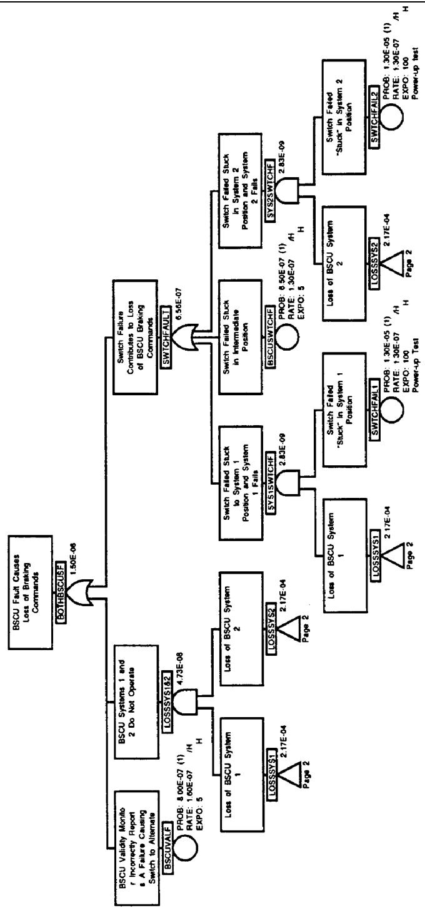  
Editors Note: The BSCU SSA FTA has an identical structure to the BSCU PSSA FTA. The only difference between the two trees is the budgeted probabilities have been replaced with calculated probabilities. The failure rates were extracted from the BSCU FMES/FMEA.  
BSCU Fault Causes Loss of Braking Commands (Page 1)  
FIGURE 5.1-1 - (SSA BSCU - FTA)

# SAE ARP4761

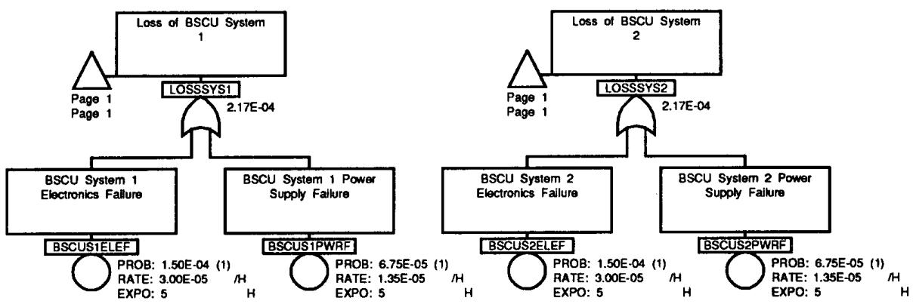  
NOTE: SSA BSCU - FTA  
FIGURE 5.1-1 - (SSA BSCU - FTA) BSCU Fault Causes Loss of Braking Commands (Page 2)  
FIGURE L8 (Continued)

# SAE ARP4761

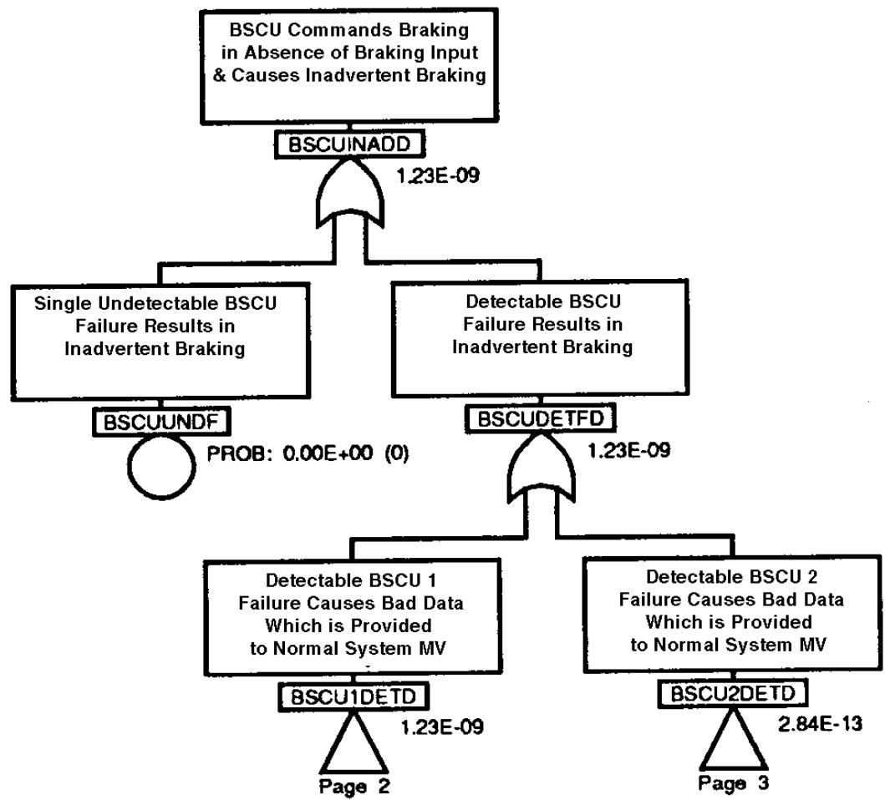  
NOTE: SSA BSCU - FTA  
FIGURE 5.1-2 - (SSA BSCU - FTA) BSCU Commands Braking in Absence of Brake Input and Causes Inadvertent Braking (Page 1)  
FIGURE L8 (Continued)

# SAE ARP4761

NOTE: SSA BSCU - FTA

FIGURE L8 (Continued)  
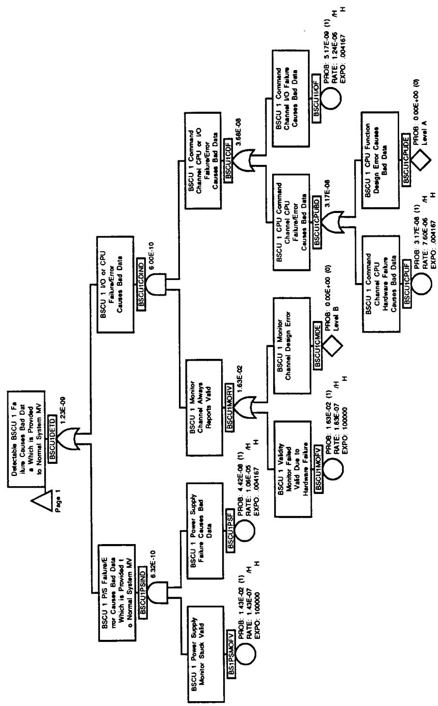  
FIGURE 5.1-2 - (SSA BSCU - FTA)  
BSCU Commands Braking in Absence of Brake Input  
and Causes Inadvertent Braking (Page 2)

# SAE ARP4761

NOTE: SSA BSCU - FTA

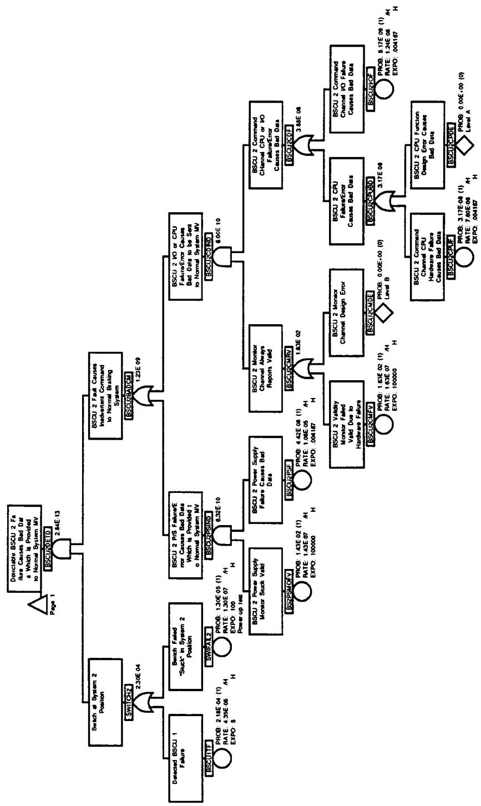  
FIGURE L8 (Continued)

FIGURE 5.1-2 - (SSA BSCU - FTA)

BSCU Commands Braking in Absence of Brake Input

and Causes Inadvert Braking (Page 3)

# SAE ARP4761

NOTE: SSA BSCU - DD

# 5.2 BSCU Dependence Diagrams

(Operator's Note: Normally textual description of development of the DD would be included in the analysis. This text would be similar to that included in the preceding FTA example.)

The satisfactory compliance of the BSCU with its design objectives and failure rate budgets for the events of Loss of Braking and Inadvertent Braking is shown in the dependence diagrams included in Figures 5.2-1 and 5.2-2 respectively. These dependence diagrams are the same diagrams derived in the PSSA for the BSCU. However in the SSA diagrams, the failure rate budgets have been replaced with the actual failure rates derived through the FMES or various FMEAs conducted on the actual design as documented for production.

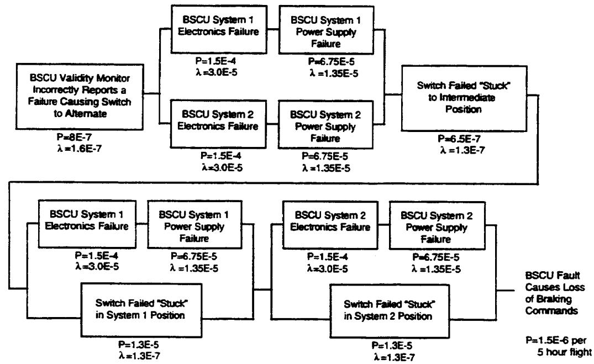  
FIGURE 5.2-1 - (SSA BSCU - DD) BSCU Fault Causes Loss of Braking Commands

FIGURE L8 (Continued)

# SAE ARP4761

# NOTE: SSA BSCU - DD

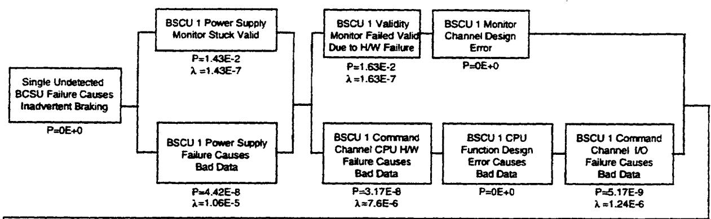

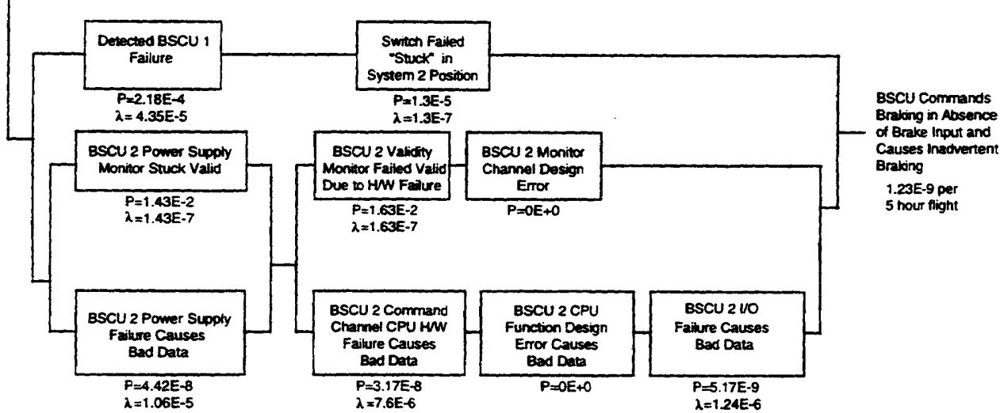  
FIGURE 5.2-2 - (SSA BSCU - DD) BSCU Commands Braking in Absence of Brake Input and Causes Inadvertent Braking

FIGURE L8 (Continued)

# SAE ARP4761

NOTE: SSA BSCU - MA

# 5.3 BSCU MARKOV ANALYSES

(Operator's Note: Normally textual description of development of the MA would be included in the analysis. This text would be similar to that included in the preceding FTA example.)

The satisfactory compliance of the BSCU with its design objectives and failure rate budgets for the events of Loss of Braking and Inadvertent Braking is shown by the analyses included in Figures 5.3-1 and 5.3-2 respectively. These analyses are the same ones derived in the PSSA for the BSCU. However in the SSA analyses, the failure rate budgets have been replaced with the actual failure rates derived through various FMEA analyses conducted on the actual design as documented for production.

The Markov Analyses for "BSCU Fault Causes Loss of Braking Command" is shown in Figure 5.3-1. There are three distinct components in the model. The first two components are BSCU System 1 and System 2 and the third component is Switching System. BSCU System 1 and System 2 have monitors in them and hence no single failure of any component within a BSCU System can cause loss of the wheel braking function. BSCU System 1 and System 2 are checked at the start of every flight. On the other hand, a single fault of the Switching System can cause loss of the NORMAL braking function. This can happen if the Switch fails:

a. stuck to a failed BSCU System (sequence dependent),  
b. stuck open so that none of the BSCU systems are providing braking commands.

The Switching System is checked every maintenance check of  $T$  hours which is assumed to be 100 hrs. for this analysis. The BSCU System will fail in a flight if:

a. both BSCU Systems fail in the same flight,  
b. the switching system failure is followed by the failure of a BSCU system to which the switching system is connected (sequence dependent),  
c. the switching system is stuck open and cannot provide any braking commands.

Figures 5.3-2 through 4 show the MA for inadvertent braking due to a monitor and an active failure in both BSCU systems. This Markov model is similar to the one used in the PSSA of the BSCU system, except that a sequence of failures is introduced. In the model shown in Figure 5.3-3, for example, a BSCU system is assumed to be failed only when the monitor of a system fails before the failure of an active item. Hence the BSCU CPU & I/O system fails only when the CPU & I/O monitor fails before the CPU & I/O fails in a flight. Similarly, the power monitor has to fail before a power supply for the power system to fail.

# FIGURE L8 (Continued)