# MINIMUM OPERATIONAL PERFORMANCE STANDARD FOR AIRCRAFT EMERGENCY LOCATOR TRANSMITTERS 406 MHz

飞机紧急定位器发射机（406MHz）最低工作性能标准

This document is the exclusive intellectual and commercial property of EUROCAE.

本文件是 EUROCAE 独有的知识产权和商业财产。

It is presently commercialised by EUROCAE.

目前已由 EUROCAE 商用。

This electronic copy is delivered to your company/organisation for internal use exclusively.

此电子副本仅供贵公司/机构内部使用。

In no case it may be re-sold, or hired, lent or exchanged outside your company.

任何情况下，不得在公司外部重新销售、使用、借用或交换本文件。

# ED-62B

# December 2018

2018年12月

Supersedes ED-62A

取代ED-62A

9-23 rue Paul Lafargue

93200 Saint-Denis, France

法国圣但尼保罗·拉法尔格街9-23号

邮政编码：93200

Web Site: www.eurocae.net

网址：www.eurocae.net

Tel: 33140927930

电话：33140927930

Email: eurocae@eurocae.net

电子邮箱：eurocae@eurocae.net

# MINIMUM OPERATIONAL PERFORMANCE STANDARD FOR AIRCRAFT EMERGENCY LOCATOR TRANSMITTERS 406 MHz

飞机紧急定位器发射机（406MHz）最低工作性能标准

This document is the exclusive intellectual and commercial property of EUROCAE.

本文件是 EUROCAE 独有的知识产权和商业财产。

It is presently commercialised by EUROCAE.

目前已由 EUROCAE 商用。

This electronic copy is delivered to your company/organisation for internal use exclusively.

此电子副本仅供贵公司/机构内部使用。

In no case it may be re-sold, or hired, lent or exchanged outside your company.

任何情况下，不得在公司外部重新销售、使用、借用或交换本文件。

ED-62B

December 2018

2018年12月

Supersedes ED-62A

取代ED-62A

# i

# 前言

a. This document, prepared by EUROCAE Working Group 98 "Aircraft Emergency Locator Transmitters" and RTCA SC-229 "406 MHz Emergency LocatorTransmitters (ELTs)", was accepted by the Council of EUROCAE on7 December 2018.  
a.本文件由EUROCAE第98工作组“飞机紧急定位器发射机”小组和RTCA SC-229“紧急定位器发射机(ELT)（406Mhz）”小组于2018年12月7日共同编制，并于2018年12月7日由EUROCAE通过。  
b. EUROCAE is an international non-profit making organisation. Membership isopen to users and manufacturers, in Europe, of equipment for aeronautics, tradeassociations and, under certain conditions, non-European Members. Its workprogramme is directed to the study of technical problems facing users andmanufacturers of equipment for aeronautics and all related topics. It aims tocontribute at national and international levels to the solution of such problems.  
b. EUROCAE 是一个国际非盈利组织。在欧洲，航空设备用户和制造商、贸易协会成员以及在特定情况下的非欧洲成员均可成为会员。其工作方案旨在研究航空设备用户和制造商所面临的技术问题和所有相关主题。其目标是在国家和国际层面为解决这些问题作出贡献。  
c. The findings of EUROCAE are resolved after discussion among members of EUROCAE, European airlines and interested administrations, and in collaboration with the Radio Technical Commission for Aeronautics (RTCA), Washington, DC.  
c. EUROCAE 调查结果是经 EUROCAE 成员、欧洲航空公司和有关行政当局讨论后，并在与华盛顿特区的航空无线电技术委员会（RTCA）协商之后得出的。  
d. This document supersedes the ED-62A "Minimum Operational Performance Specification for Aircraft Emergency Locator Transmitters 406 MHz and 121.5MHz (Optional 243 MHz)" dated February 2009.  
d.本文件取代了2009年2月的ED-62A“飞机紧急定位器发射机（406MHz和121.5MHz（可选243MHz））最低工作性能规范”。

As compared with the previous document, the main changes are:

与前一份文件相比，主要变化包括：

a. Introduce next generation ELT specifications,  
a.引入下一代ELT规范；  
b. Specifications for GNSS position information that is used in ELTs,  
b. ELT中所用GNSS位置信息规范；  
c. Power source specifications,  
c. 电源规格；  
d. Crash safety specifications,  
d.坠机安全规范；  
e. Second generation homing specifications

e.第二代寻的规范；  
f. Improved Antenna and Cabling Specifications,  
f.改进的天线和电缆规格；  
g. In-flight distress tracking ELT(DT) specifications.  
g. 飞行中遇难跟踪 ELT（DT）规范。  
e. This document is technically identical to RTCA DO-204B.  
e. 本文件在技术上与 RTCA DO-204B 完全相同。  
f. This MOPS contains technical specifications coordinated with the requirements of the Cospas-Sarsat Secretariat as published in the document "Specifications for Cospas-Sarsat 406 MHz Distress Beacons" C/S (COSPAS-SARSAT) T.001 for first generation ELTs or C/S T.018 for second generation ELTs.  
f.本MOPS包含与文件“Cospas-Sarsat 406MHz 遇难信标规范”用于第一代ELT的C/S（COSPAS-SARSAT）T.001或用于第二代ELT的C/S T.018中所规定的Cospas-Sarsat秘书处要求统一协调的技术规格。  
Users of this MOPS should refer to C/S T.001 for first generation ELTs or C/ST.018 for second generation ELTs and C/S G.005 for details on beacon codingwhich are not included in this document. Test procedures are coordinated withC/S T.007 for first generation ELTs or C/S T.021 for second generation ELTs,and TABLE of Frequencies are included in C/S T.012.  
本MOPS的用户应参考用于第一代ELT的C/S T.001或用于第二代ELT的C/S T.018，以及C/S G.005，以便了解有关本文件不包括的信标编码的详细信息。测试程序与用于第一代ELT的C/S T.007或用于第二代ELT的C/S T.021协调，频率表包含在C/S T.012中。  
g. Where documentation is referenced in the text, the edition current at the time of writing has been used. Future updates of reference documents may be used as subject to the agreement of the approving authority.  
g.文本中引用文件处，已使用了写作时当前的版本。对于参考文件的后续更新，可在批准当局同意的情况下使用。  
h. EUROCAE performance specifications and other documents are recommendations only. EUROCAE is not an official body of the European Governments. Its recommendations are valid as statements of official policy only when adopted by a particular government or conference of governments.  
h. EUROCAE 性能规范和其他文件仅为建议。EUROCAE 并非欧洲各国政府的官方机构。其建议只有在某一特定政府或政府会议通过时方可作为官方政策的说明。  
i. Copies of this document may be obtained from:  
i.本文件可于下列地点获取：

EUROCAE

9-23 rue Paul Lafargue

93200 Saint-Denis

France

法国圣但尼保罗·拉法尔格街9-23号

邮政编码：93200

Telephone: +33 1 49 46 19 65

电话：+33149461965

Email: eurocae@eurocae.net

电子邮箱：eurocae@eurocae.net

Website: www.eurocae.net

网址：www.eurocae.net

# iv CONTENTS

目录

FOREWORD  
前言  
CHAPTER 1  
第1章 1  
INTRODUCTION. 1  
引言 1  
1.1 PURPOSE AND SCOPE 1  
1.1 目的和范围  
1.2 COSPAS-SARSAT SYSTEM OVERVIEW 2  
1.2COSPAS-SARSAT系统概述 2  
1.3 TYPES, CLASSES, CAPABILITIES AND APPLICABILITY OF ELT 5  
1.3 ELT类型、类别、功能和适用性 5

1.3.1 Types of ELT. 5  
1.3.1 ELT类型 5  
1.3.2 Classes 7  
1.3.2类别 7  
1.3.3 Capabilities 7  
1.3.3功能 7

1.4 DEFINITIONS OF TERMS 9  
1.4术语定义 9  
1.5 RELATED DOCUMENTS REFERENCED IN THE DOCUMENT 18  
1.5文中引用的相关文件 18

1.5.1COSPAS-SARSAT Documents. 18  
1.5.1COSPAS-SARSAT文件 18  
1.5.2 Technically Equivalent RTCA and EUROCAE Documents 18  
1.5.2 技术上等效的 RTCA 和 EUROCAE 文件 ..... 18

1.5.3 EUROCAE Documents 19  
1.5.3 EUROCAE 文件 19  
1.5.4 RTCA Documents 19  
1.5.4 RTCA文件 19  
1.5.5 SAE Documents 19  
1.5.5 SAE文件 19  
1.5.6 MIL Documents 20  
1.5.6 MIL 文件 20  
1.5.7 ISO Documents 20  
1.5.7 ISO 文件 20  
1.5.8 EN Documents 20  
1.5.8 EN文件 20  
1.5.9 IEC Documents 20  
1.5.9 IEC文件 20  
1.5.10 ITU Documents 20  
1.5.10 ITU 文件 ..... 20  
1.5.11 EASA Documents 20  
1.5.11EASA文件 20  
1.5.12 United States Government Documentation. 21  
1.5.12 美国政府文件 21

# 1.6 AIRCRAFT EQUIPMENT INFORMATION VULNERABILITIES 21

1.6飞机设备信息漏洞 21

# CHAPTER 2 23

第2章 23

# GENERAL DESIGN SPECIFICATIONS 23

通用设计规范 23

2.1 AIRWORTHINESS 23  
2.1 适航性 23  
2.2 RADIO REGULATIONS 23  
2.2无线电法规 23

2.3 ELT FUNCTIONALITY 23  
2.3 ELT功能 23  
2.4 FIRE PROTECTION 23  
2.4 消防 23  
2.5 OPERATION OF CONTROLS 24  
2.5控制操作 24  
2.6 POWER SOURCE 24  
2.6 电源 24  
2.7 EFFECTS OF TESTS 24  
2.7 测试影响 ..... 24  
2.8 SOFTWARE CONTROL AND ELECTRONIC HARDWARE 24  
2.8软件控制和电子硬件 24  
2.9 ADDITIONAL SPECIFICATIONS 24  
2.9补充规范 24

2.9.1 Automatic Fixed (AF) ELT 24  
2.9.1 自动固定（AF）式ELT 24  
2.9.2 Automatic Portable (AP) ELT 25  
2.9.2 自动便携（AP）式ELT 25  
2.9.3 Survival (S) ELT 26  
2.9.3幸存（S）式ELT 26  
2.9.4 Automatic Deployable (AD) ELT 27  
2.9.4 自动展开（AD）式ELT 27  
2.9.5 Distress Tracking (DT) ELT 30  
2.9.5 遇难跟踪（DT）式ELT 30

2.10 POSITION DATA (OPTIONAL EXCEPT FOR ELT(DT)) 33

2.10 位置数据（除ELT（DT)外可选） 33

CHAPTER 3 34

第3章 34

MINIMUM PERFORMANCE SPECIFICATIONS UNDER STANDARD CONDITIONS 34

标准条件下的最低性能规范 34

# vii

3.1 CONTROLS AND MONITORING SYSTEM 34  
3.1 控制监测系统 34

3.1.1 Controls and monitoring system on ELT unit 34  
3.1.1 ELT装置上的控制监测系统 34  
3.1.2 Remote Control and Monitoring System (Except ELT(S)) 35  
3.1.2 远程控制监测系统（ELT（S）除外） 35

3.2 SELF-TEST 37  
3.2 自检 37

3.2.1 Homing signal transmitter self-test 37  
3.2.1 归航信号发射机自检 37

3.3 POWER SOURCE 38  
3.3 电源 38

3.3.1 User Replaceable 38  
3.3.1 用户可更换 38  
3.3.2 Aircraft Electrical Power 38  
3.3.2航空器电源 38  
3.3.3 Battery Life 38  
3.3.3 电池寿命 38  
3.3.4 Non-rechargeable Lithium Batteries 39  
3.3.4不可再充电锂电池 39  
3.3.5 Rechargeable Batteries 39  
3.3.5可充电电池 39  
3.3.6 All Lithium Batteries 39  
3.3.6所有锂电池 39  
3.3.7 Supplemental Power 40  
3.3.7 补充电源 40  
3.3.8 Selt-test Battery Life 40  
3.3.8 自检电池寿命 40

3.4 EXTERNAL ANTENNA CABLE 40  
3.4 外部天线电缆 40

# viii

3.5 MINIMUM OPERATING LIFE TIME 40  
3.5最小工作寿命 40  
3.6 POSITION DATA (OPTIONAL EXCEPT FOR ELT(DT)) 41  
3.6 位置数据（除 ELT（DT）外可选） 41  
3.7 MINIMUM PERFORMANCE SPECIFICATION COSPAS-SARSAT 406 MHZ ELT 41  
3.7 最低性能规范 COSPAS-SARSAT 406MHZ ELT. 41

3.7.1 ITU emission type 41  
3.7.1 ITU 发射类型 41

3.8 MINIMUM PERFORMANCE SPECIFICATION - 121.5 MHZ (243 MHZ OPTIONAL) HOMING TRANSMITTER 41  
3.8最低性能规范——121.5MHZ（243MHZ可选）归航发射机 41

3.8.1 Operating Frequencies 42  
3.8.1 工作频率 42  
3.8.2 Modulation Characteristics 42  
3.8.2 调制特性 42  
3.8.3 Emission Characteristics 44  
3.8.3 发射特性 44  
3.8.4 Antenna Radiation Characteristics 47  
3.8.4天线辐射特性 47  
3.8.5 Effective Isotropic Radiated Power 47  
3.8.5有效各向同性辐射功率 47  
3.8.6 Endurance 47  
3.8.6 耐久性 47  
3.8.7 Radio Frequency Intermodulation (except for ELT(S)) 47  
3.8.7射频互调（ELT（S）除外） 47  
3.8.8 Transmitter Turn-on 50  
3.8.8发射机开启 50

3.9 OPTIONAL 406 MHZ HOMING TRANSMITTER 50  
3.9 可选  $406\mathrm{MHz}$  归航发射机 50  
3.10 MARKING 50

# ix

3.10 标记 50  
3.11 CASE DESIGN, ATTACHMENT AND COLOUR 51  
3.11 外壳设计、附件和颜色 51  
3.12 INSTALLATION MANUAL 52  
3.12 安装手册 52

CHAPTER 4. 53

第4章 53

MINIMUM PERFORMANCE SPECIFICATIONS UNDER ENVIRONMENTAL TEST CONDITIONS 53

环境试验条件下的最低性能规范 53

4.1 INTRODUCTION 53  
4.1简介 53

4.1.1 ELT(AD) in ADFR 54  
4.1.1 ADFR 中的 ELT (AD) 54

4.2 REQUIREMENTS 54  
4.2要求 54

4.2.1 Temperature and Altitude Ranges 59  
4.2.1 温度和高度范围 ..... 59  
4.2.2 Waterproofness 59  
4.2.2 防水性 59  
4.2.3 Fire Resistance 60  
4.2.3 耐火性 60  
4.2.4 Grouping of Tests 60  
4.2.4 试验分组 60

4.3 TEST PROCEDURES AND METHODS (EXCEPT ELT(DT) WITHOUT CRASH SURVIVABILITY) .... 62  
4.3 测试程序和方法（无坠机幸存能力的ELT（DT）除外） 62

4.3.1 Aliveness test 62  
4.3.1 活力测试 62  
4.3.2 Order of Tests (see TABLE 4-2) 64  
4.3.2 试验顺序（参见表4-2） 64

4.4 GROUP A TESTS 69

4.4 A组试验 69

4.4.1 Temperature (Activation) and Altitude 69  
4.4.1温度（激活）和高度 69  
4.4.2 Decompression (Optional for ELT(AD)) 73  
4.4.2 减压（对ELT（AD）而言，可选） 73  
4.4.3 Overpressure (Optional for ELT(AD)) 74  
4.4.3 超压（对ELT（AD）而言，可选） 74  
4.4.4 Magnetic Effect 74  
4.4.4 磁效应 74  
4.4.5 Power Input (Except for ELT(S)) 75  
4.4.5 功率输入（ELT（S）除外） 75  
4.4.6 Voltage Spike (Except for ELT(S)) 76  
4.4.6 电压尖峰（ELT（S）除外） 76  
4.4.7 Audio Frequency Conducted Susceptibility (Except for ELT(S)) 77  
4.4.7 音频传导敏感性（ELT（S）除外） 77  
4.4.8 Induced Signal Susceptibility 77  
4.4.8感应信号敏感性 77  
4.4.9 Radio Frequency Susceptibility 78  
4.4.9射频敏感性 78  
4.4.10 Lightning Induced Transient Susceptibility 78  
4.4.10 雷电感应瞬变敏感性 ..... 78  
4.4.11 Lightning Direct Effects (ELT(AD) and external antennas) 80  
4.4.11 雷电直接效应（ELT（AD）和外部天线） 80  
4.4.12 Emission of Radio Frequency Energy 81  
4.4.12射频能量发射 81  
4.4.13 Explosive Atmosphere (Optional) 81  
4.4.13 爆炸性空气（可选） 81  
4.4.14 Icing (Optional except for external antenna and ELT(AD)) 81  
4.4.14 结冰（可选，外部天线和 ELT（AD）除外） 81  
4.4.15 Flammability 82

4.4.15 可燃性 82  
4.4.16 Triboelectric effects (external antenna) 82  
4.4.16 摩擦电效应（外部天线） 82  
4.4.17 Water sensor test (ELT(AD)) 82  
4.4.17水传感器测试（ELT（AD)） 82

# 4.5 GROUP B TESTS 83

# 4.5B组试验 83

4.5.1 Electrostatic Discharge (ESD) 83  
4.5.1 静电放电（ESD） 83  
4.5.2 Humidity 83  
4.5.2湿度 83  
4.5.3 Waterproofness 84  
4.5.3 防水性 84  
4.5.4 Fluids Susceptibility (Optional except for external antenna and for ELT(AD)) 85  
4.5.4 流体敏感性（可选，外部天线和ELT（AD）除外） 85  
4.5.5 Fungus Resistance (Optional except for ELT(AD)) 85  
4.5.5 防霉性（可选，ELT（AD）除外） 85  
4.5.6 Sand and Dust (Optional except for ELT(AD)) 86  
4.5.6 沙尘（可选，ELT（AD）除外） 86  
4.5.7 Salt Fog 86  
4.5.7 盐雾 86  
4.5.8 Vibration 87  
4.5.8 振动 ..... 87  
4.5.9 Shock 91  
4.5.9冲击 91  
4.5.10 Impact (penetration test) 101  
4.5.10冲击（穿透试验） 101  
4.5.11 Impact (projection test) (ELT(AD)) 102  
4.5.11冲击（投射试验）（ELT（AD)） 102  
4.5.12 Crush (ELT(AF), (AP), (S), (DT) with crash survivability, (AD)) 103

# XII

4.5.12 碎裂（ELT（AF）、（AP）、（S）、具有坠机幸存能力的（DT）、（AD）） 103  
4.5.13 Flame 103  
4.5.13 火焰 103  
4.5.14 Fire, ELT (Optional, except for ELT(AD) in ADFR). 104  
4.5.14 火灾，ELT（可选，ADFR中的ELT（AD）除外） 104  
4.5.15 Post-crash Immersion (Optional for ELT(AF) and ELT(DT)) 105  
4.5.15坠机后沉没（对ELT（AF）和ELT（DT）而言，可选） 105  
4.5.16 Buoyancy (ELT(AD), (AP), (S) Category A) 106  
4.5.16浮力（ELT（AD）、（AP）、（S）A类） 106

# 4.6 TEST PROCEDURES AND METHODS ELT(DT) WITHOUT CRASH SURVIVABILITY 107

# 4.6无坠机幸存能力的ELT（DT）试验程序和方法 107

# CHAPTER 5. 116

# 第5章 116

# TEST PROCEDURES 116

# 测试程序 116

# 5.1 GENERAL SPECIFICATIONS 116

# 5.1通用规范 116

5.1.1 Emissions 116  
5.1.1 发射 ..... 116  
5.1.2 Power Input Voltage 116  
5.1.2 电源输入电压 ..... 116  
5.1.3 Adjustment of Equipment 116  
5.1.3 设备调整 ..... 116  
5.1.4 Test Instrument Precautions 117  
5.1.4 试验仪表注意事项 ..... 117  
5.1.5 Ambient Conditions 117  
5.1.5环境条件 117  
5.1.6 Connected Loads 117  
5.1.6 连接负载 ..... 117  
5.1.7 Recording of Test Results 117

# xiii

5.1.7 测试结果的记录 ..... 117  
5.1.8 Test Procedures 117  
5.1.8 测试程序 ..... 117

# 5.2 VERIFICATION REQUIREMENTS 118

5.2 验证要求 ..... 118  
5.3 GENERAL TEST/INSPECTION PROCEDURES 119

# 5.3 一般测试/检查程序 ..... 119

5.3.1 Controls and monitoring system on ELT unit 120  
5.3.1 ELT装置上的控制监测系统 120  
5.3.2 Remote Control and Monitoring System 121  
5.3.2远程控制监测系统 121  
5.3.3 Self-Test 122  
5.3.3 自检 122  
5.3.4 Power Source 122  
5.3.4 电源 ..... 122  
5.3.5 External Antenna Cable 122  
5.3.5 外部天线电缆 ..... 122

# 5.4 DETAILED TEST PROCEDURES - 406 MHZ ELT 122

# 5.4 详细测试程序——406 MHZ ELT. 122

5.4.1 Operating Life Time at minimum temperature 123  
5.4.1 最低温度下的工作寿命 123

# 5.5 DETAILED TEST PROCEDURES - HOMING TRANSMITTERS 123

# 5.5 详细测试程序——归航发射机 ..... 123

5.5.1 Equipment Required 123  
5.5.1所需设备 123  
5.5.2 Operating Frequencies (§ 3.8.1) 123  
5.5.2 工作频率（第3.8.1条） 123  
5.5.3 Modulation Characteristics (§ 3.8.2) 124  
5.5.3 调制特性（第3.8.2条） 124  
5.5.4 Modulation Duty Cycle (§ 3.8.2) 124

# xiv

5.5.4 调制占空比（第3.8.2条） 124  
5.5.5 Transmitter Duty Cycle (§ 3.8.3) 124  
5.5.5发射机占空比（第3.8.3条） 124  
5.5.6 Effective Isotropic Radiated Power (§ 3.8.5) 124  
5.5.6有效各向同性辐射功率（第3.8.5条） 124  
5.5.7 Radio frequency intermodulation (§ 3.8.7) 127  
5.5.7射频互调（第3.8.7条） 127

5.6 FREQUENCY STABILITY WITH TEMPERATURE GRADIENT 130  
5.6具有温度梯度的频率稳定性 130  
5.7 TEST PROCEDURES - INTERFACES 131  
5.7 测试程序——接口 ..... 131

5.7.1 External Navigation Interface 131  
5.7.1 外部导航接口 ..... 131

5.8 POSITION DATA (OPTIONAL EXCEPT FOR ELT(DT)) 131  
5.8位置数据（除ELT（DT）外可选） 131  
5.9 MARKING 131  
5.9 标记 131  
5.10.CASEDESIGN,ATTACHMENTANDCOLOUR 132  
5.10 外壳设计、附件和颜色 132  
5.11 INSTALLATION MANUAL 132  
5.11安装手册 132

CHAPTER 6. 144

第6章 144

INSTALLED EQUIPMENT PERFORMANCE 144

已安装设备性能 144

6.1 INTRODUCTION 144  
6.1 简介 ..... 144  
6.2 INSTRUCTIONS TO ELT MANUFACTURERS 145  
6.2 给ELT制造商的说明 145  
6.2.1 Scope of Instructions 145

# XV

6.2.1 说明范围 ..... 145  
6.2.2 Use of the Installation Manual (IM) 145  
6.2.2 安装手册（IM）的使用 145  
6.2.3 ELT Registering and Transmitting 145  
6.2.3ELT注册和传输 145  
6.2.4 ELT OPERATION 146  
6.2.4 ELT操作 146  
6.2.5 ELT CONTROLS CONSIDERATIONS 147  
6.2.5 ELT控制装置考虑因素 147  
6.2.6 ELT SYSTEM COMPONENTS LOCATION 149  
6.2.6 ELT系统部件位置 149  
6.2.7 ELT MOUNTING 150  
6.2.7 ELT 安装 ..... 150  
6.2.8 ELT Crash Sensor 151  
6.2.8 ELT坠机传感器 151  
6.2.9 ELT BATTERIES 152  
6.2.9 ELT 电池 152  
6.2.10 ELT ENVIRONMENTAL CONDITIONS 153  
6.2.10 ELT环境条件 153  
6.2.11 ELT ANTENNA MOUNTING LOCATION 154  
6.2.11 ELT天线安装位置 154  
6.2.12 ELT ANTENNA CABLES 156  
6.2.12 ELT天线电缆 156  
6.2.13 NAVIGATION SYSTEMS 158  
6.2.13 导航系统 ..... 158  
6.2.14 ELT(DT) 158  
6.2.14 ELT (DT) 158  
6.2.15 TESTING OF INSTALLED SYSTEMS 159  
6.2.15 已安装系统的测试 ..... 159

6.3 ADDITIONAL INTEGRATION CONSIDERATIONS 162

# XVI

6.3附加集成考虑因素 162

6.3.1 ELT(DT) 162  
6.3.1 ELT (DT) 162  
6.3.2 ELT(AD) 163  
6.3.2 ELT (AD) 163  
6.3.3 AIRCRAFT WITH PARACHUTE SYSTEMS 163  
6.3.3 带有降落伞系统的航空器 163

CHAPTER 7 164

第7章 164

INSTALLED OPERATIONAL CHARACTERISTICS AND MAINTENANCE 164

安装运行特性和维护 164

7.1 INTRODUCTION 164  
7.1 简介 164  
7.2 PROCEDURES, TESTS AND INSPECTIONS 164  
7.2程序、测试和检查 164

7.2.1 Pre-Flight Procedures 164  
7.2.1 飞行前程序 ..... 164  
7.2.2 Post-Flight Procedures 164  
7.2.2 飞行后程序 ..... 164  
7.2.3 Functional Tests 164  
7.2.3 功能测试 ..... 164  
7.2.4 Periodic Inspection 165  
7.2.4 定期检查 ..... 165

APPENDIX A 167

附录A 167

A.1 RELATED DOCUMENTS 167  
A.1相关文件 167  
A.2 ARINC DOCUMENTS 167  
A.2 ARINC 文件 167  
A.3 CANADIAN DOCUMENTS 167

# XVII

A.3加拿大文件 167

A.3.1 Laws 167  
A.3.1 法律 167  
A.3.2 General Guidance 168  
A.3.2通用指南 168  
A.3.3 Radio Standards Specifications (RSS) 168  
A.3.3无线电标准规范（RSS） 168  
A.3.4 Technical Standards Orders (TSO) 168  
A.3.4 技术标准指令（TSO） 168

A.4COSPAS-SARSAT DOCUMENTS 169  
A.4COSPAS-SARSAT文件 169  
A.5 EUROPEAN DOCUMENTS 170  
A.5欧洲文件 170

A.5.1 European Laws and Publications 170  
A.5.1欧洲法律和出版物 170  
A.5.2 European Technical Standards Order (ETSO) 170  
A.5.2欧洲技术标准指令（ETSO） 170  
A.5.3 Certification Memorandum 170  
A.5.3认证备忘录 170  
A.5.4 Certification Specifications. 170  
A.5.4认证规范 170

A.6 EUROPEAN ORGANIZATION FOR CIVIL AVIATION EQUIPMENT (EUROCAE) 171  
A.6欧洲民用航空设备组织（EUROCAE） 171  
A.7 ICAO DOCUMENTS 171  
A.7ICAO文件 171  
A.8 ITU DOCUMENTS 172  
A.8 ITU 文件 ..... 172  
A.9 RTCA, INC. DOCUMENTS 172  
A.9航空无线电技术委员会有限公司文件 172  
A.10 SAE INTERNATIONAL DOCUMENTS 173

# XVIII

A.10 SAE 国际文件 173  
A.11 US DOCUMENTS 174  
A.11 美国文件 174

A.11.1 US Code 174  
A.11.1 美国法典 174  
A.11.2 Code of Federal Regulations (CFR). 174  
A.11.2 美国联邦法规（CFR） 174  
A.11.3 Technical Standards Orders 175  
A.11.3 技术标准指令 ..... 175  
A.11.4 Advisory Circulars 175  
A.11.4 咨询通告 175  
A.11.5 Manuals 176  
A.11.5 手册 176  
A.11.6 National Oceanic and Atmospheric Administration (NOAA) 176  
A.11.6 美国国家海洋和大气管理局（NOAA） 176  
A.11.7 National Aeronautics and Space Administration (NASA) 177  
A.11.7 美国国家航空航天局（NASA） 177  
A.11.8 National Transportation Safety Board (NTSB). 177  
A.11.8 美国国家运输安全委员会（NTSB） 177  
A.11.9 Other Documents 177  
A.11.9 其他文件 ..... 177

WG-98/SC-229 MEMBERSHIP 178

WG-98/SC-229 成员 178

IMPROVEMENT SUGGESTION FORM. 184

改进建议表 184

# 1 CHAPTER 1

# 第1章

# INTRODUCTION

引言

# 1.1 PURPOSE AND SCOPE

# 1.1 目的和范围

This document contains minimum operational performance specifications for Emergency Locator Transmitters, (ELTs), to ensure that they will:

本文件载有紧急定位器发射机（ELT）的最低工作性能规格，用以确保其：

meet the activation specifications,

符合激活规范；

meet environmental test conditions,

符合环境测试条件；

meet Cospas-Sarsat system requirements for satellite processing of a distresssignal (primary alert),

满足Cospas-Sarsat系统对遇难信号（主要警报）卫星处理的要求；

. be compatible with homing devices used for Search And Rescue (SAR),

与用于搜索和救援（SAR）的导航设备兼容；

not adversely affect aircraft operations,

不会对飞机运行产生不利影响；

not be adversely affected by the aircraft operations.

不会受到飞机运行的不利影响。

CHAPTER 1 of this document provides information needed to understand the rationale for the equipment characteristics and requirements stated in the remaining chapters. It describes typical equipment operation and goals, as envisioned by the members of EUROCAE Working Group 98 and RTCA Special Committee 229. Chapter 1 also establishes the basis for the standards stated in chapter 2. Definitions, a list of related documents and assumptions essential to proper understanding of this document are also provided in this chapter.

本文件第1章提供了理解设备特性基本原理和其他各章所述要求所需的信息。其中描述了EUROCAE第98工作组和RTCA第229专项委员会成员所设想的典型设备操作和目标。第1章也为第2章所述标准奠定了基础。本章还规定了对该文件进行适当理解所必需的定义、相关文件列表和假设。

CHAPTER 2 contains the general Minimum Operational Performance Standards,(MOPS), General Design Specifications for the ELT system.

第2章包含了一般的最低工作性能标准（MOPS）以及ELT系统的一般设计规范。

CHAPTER 3 describes ELT minimum performance specifications under standardconditions.

第3章描述了ELT在标准条件下的最低性能标准。

CHAPTER 4 provides minimum performance specifications under environmental testconditions.

第4章说明了环境试验条件下的最低性能标准。

CHAPTER 5 describes recommended bench level test procedures necessary to demonstrate the ELT system will meet the requirements stated in chapters 2 - 4.

第5章描述了用于验证ELT系统是否满足第2-4章所述要求所需的建议台式水平仪测试过程。

CHAPTER 6 provides installed equipment performance as well as technical guidance equipment manufacturers can follow to write comprehensive installation manuals that contain best practices for automatic fixed, automatic portable, deployable, survival, anddistress tracking ELTs.

第6章提供了已安装设备性能以及设备制造商可以遵循并用以编写全面安装手册的技术指导，其中包含自动固定式、自动便携式、可展开式、幸存式和遇难跟踪式ELT的最佳实践。

CHAPTER 7 provides instructions to the ELT manufacturer on items that should bespecified in documentation supplied to the customer to ensure ELT system continuesto meet the performance standards throughout the life of the ELT system

第7章为ELT制造商提供了关于其应在提供给客户的文件中指定的项目的指示，以确保ELT系统在整个ELT系统的生命周期中继续满足性能标准。

APPENDIX A provides a comprehensive list of documents related to ELT systems to beincluded in the manufacturer's installation manuals.

附录A提供了制造商安装手册中与ELT系统有关的所有文件清单。

# 1.2 COSPAS-SARSAT SYSTEM OVERVIEW

# 1.2 COSPAS-SARSAT系统概述

The International Cospas-Sarsat Program is a treaty-based, nonprofit, intergovernmental humanitarian cooperative of more than 40 nations and agencies dedicated to detecting and locating  $406\mathrm{MHz}$  radio beacons activated from aircraft, vessels and by persons (e.g., backcountry hikers) in distress, and forwarding this alert information to SAR authorities that can take action for rescues. The system utilizes anetwork of satellites that provide coverage anywhere on Earth. Distress alerts aredetected, located and forwarded to over 200 countries and territories at no cost to thereceiving government agencies. Cospas-Sarsat was conceived and initiated by the founding Party States of Canada, France, the United States, and the former Soviet Union in 1979. (The Russian Federation succeeded the Soviet Union as a Party to theorganization.)

国际Cospas-Sarsat项目是一个基于条约的、非营利的、由40多个国家和机构组成的政府间人道主义合作组织项目，致力于探测和定位由遇难的飞机、船只和人员（例如来边远地区徒步旅行者）激活、并将报警信息转发至SAR当局以便采取行动进行救援的  $406\mathrm{MHz}$  无线电信标。该系统利用在地球上任何地方提供覆盖的卫星网络。将在200多个国家和地区内检测、定位和转发遇难报警，并且无需向接收方政府机构支付任何费用。Cospas-Sarsat是由成员国加拿大、法国、美国和前苏联于1979年构想并发起。（俄罗斯联邦接替苏联成为该组织的成员国。）

406 MHz distress beacons capable of being detected by the Cospas-Sarsat System,ELTs for aviation use, Emergency Position Indicating Radio Beacons (EPIRBs) formaritime use and Personal Locator Beacons (PLBs) for individuals are available from multiple manufacturers and vendor chains.

可由Cospas-Sarsat系统探测到的  $406\mathrm{MHz}$  遇难信标、用于航空用途的ELT、用于海事用途的紧急位置指示无线电信标（EPIRB）和个人定位信标（PLB）可从多个制造商和供应商链获得。

The system consists of a ground segment and a space segment that include:

该系统由一个地面段和一个空间段组成，其中包括：

distress radio-beacons to be activated in a life-threatening emergency;

将在危及生命的紧急情况下被激活的遇难无线电信标；

. SAR signal repeaters (SARR) and SAR signal processors (SARP) aboardsatellites;

卫星上的SAR信号中继器（SARR）和SAR信号处理机（SARP）；

. several satellite downlink receiving and signal processing ground stations calledlocal user terminals (LUTs); and

多个被称为本地用户终端（LUT）的卫星下行接收和信号处理地面站；以及

mission control centres (MCCs) that exchange, route and distribute the distressalert data (particularly beacon location data) provided by the LUTs.

交换、路由和分发LUT所提供遇难报警数据（特别是信标定位数据）的任务控制中心（MCC）。

The Cospas-Sarsat system space segment consists of SARR and SARP instrumentsaboard:

Cospas-Sarsat系统空间段由SARR和SARP仪器组成，并载于：

. satellites in polar low-altitude Earth orbit called LEOSARs;

极地低空地球轨道上的卫星称为LEOSAR；

. satellites in geostationary Earth orbit called GEOSARs; and

地球静止轨道上的卫星称为 GEOSAR；以及

, satellites in medium-altitude Earth orbit called MEOSARs.

中高度地球轨道上的卫星称为 MEOSAR。

The distress-alert instruments are attached as secondary payloads to satellites that are being launched primarily for meteorological or navigation purposes.

这些遇难报警仪器作为次级有效载荷附加到主要用于气象或导航目的的卫星上。

Cospas-Sarsat provides a robust data distribution system for distress alerts and consists of:

Cospas-Sarsat为遇难警报提供了稳健的数据分发系统，包括：

a network of more than 30 MCCs, operated by governments, and distributedworld-wide; and

一个由30多个MCC组成的网络，其由各国政府运作，并且分布在全球范围内；以及

communication links to global SAR authorities.

连接至全球SAR当局的通信链路。

The Cospas-Sarsat system has the capability to both relay distress location data that is provided by the navigation or GNSS receiver data embedded in the beacon message, and to mathematically analyze the relayed beacon signal to calculate the distresslocation "independently" from location data in the distress message. Cospas-Sarsat isthe only satellite distress-alerting system that is capable of this dual redundant meansof locating an activated distress beacon. The independent calculation of the location ismade from measurements of the Doppler-effect-induced frequency differences and/ordistance-dependent time-of-arrival seen in the distress signal at the LUT receiver whenrelayed by LEOSAR and MEOSAR satellites.

Cospas-Sarsat系统具有导航或GNSS接收数据嵌入信标信息所提供的中继遇难定位数据的功能，并能对中继信标信号进行数学分析，“单独地”从遇难信息中的位置数据中计算出遇难位置。Cospas-Sarsat是唯一卫星遇难报警系统，其能够实现这种双重冗余方式的已激活遇难信标定位。位置的独立计算是通过测量多普勒效应引起的频率差异和/或由LEOSAR和MEOSAR卫星中继时在LUT接收机上看到的遇难信号与距离相关的到达时间进行。

Over time there will be more than 70 MEOSAR satellites, and the MEOSAR system will become the dominant space-segment capability of Cospas-Sarsat. MEOSAR consists of receivers aboard the following navigation-satellite constellations: the European Union's Galileo, the Russian Federation's Glonass, and the United States' GlobalPositioning System (GPS). Operational distribution of MEOSAR alert data began in December 2016 in an early operational capability (EOC). The MEOSAR system will be able to provide near-instantaneous detection, identification, and location-determination of 406-MHz beacons.

随着时间的推移，将有70多颗MEOSAR卫星，MEOSAR系统将成为Cospas-Sarsat的主要空间段力量。MEOSAR由以下导航卫星星座的接收器组成：欧盟的伽利略号(Galileo)、俄罗斯联邦的格洛纳斯(Glonass)和美国的全球定位系统(GPS)。MEOSAR报警数据的业务分发始于2016年12月，由早期工作性能(EOC)开始。MEOSAR系统将能够提供对406MHz信标的近瞬时检测、识别和定位功能。

For the 406-MHz distress signal received by the Cospas-Sarsat satellites there are tworadio signal schemes: the original (referred to as "first generation") narrowband (3 kHz)modulated signal compliant with document C/S T.001, with diversity of channels usedwithin the satellite bandwidth (compliant with document C/S T.012); and a recent("second generation") wideband ("spread spectrum") modulated signal compliant withdocument C/S T.018 that uses a single channel which utilizes most of the  ${100}\mathrm{{KHz}}$  satellite bandwidth. Along with the difference in signal structure, "second generation"beacons also have additional features and can convey more information.

Cospas-Sarsat卫星接收的  $406\mathrm{MHz}$  遇险信号有两种无线电信号方案：符合文件C/S T.001的原始（称为“第一代”）窄带（ $3\mathrm{kHz}$ ）调制信号，其中卫星带宽内使用不同的信道（符合文件C/S T.012）；以及符合文件T.018的最新（“第二代”）宽带（“扩频”）调制信号，其使用利用  $100\mathrm{kHz}$  卫星带宽的大部分单通道。由于信号结构不同，“第二代”信标也会有更多特性，可以传递更多信息。

Some beacon models also can receive "return link messages" sent to them over thenavigation channels of the Galileo satellite system to, for example, provide an indicationto the beacon user that the distress signal has successfully been received. Manybeacon models also include transmitters operating on other frequencies defined by national administrations for localized homing and on-scene locating purposes.

部分信标模型还可以通过伽利略卫星系统的导航通道接收向其发送的“返回链接消息”，例如，向信标用户提供表明遇难信号已成功接收的指示。许多信标模型还包括国家管理部门为局部寻的和现场定位而定义的其他频率上工作的发射机。

Further information on Cospas-Sarsat, the system and beacons can be found at http://www.Cospas-Sarsat.int.

有关Cospas-Sarsat、系统和信标的更多信息，请登录浏览http://www.Cospas-Sarsat.int。

# 1.3 TYPES, CLASSES, CAPABILITIES AND APPLICABILITY OF ELT

# 1.3 ELT类型、类别、功能和适用性

This MOPS was created to permit ELT manufacturers, users, installers, operational andairworthiness authorities to determine the specifications of ELTs. These specifications are defined by introducing ELT types, classes and capabilities, that the ELTmanufacturer must document in the installation manual. If approval authorities requirea Declaration of Design and Performance (DDP) the types, classes and capabilitiesmust also be documented in the DDP.

制定本MOPS旨在允许ELT制造商、用户、安装人员、操作和适航部门确定ELT的规格。通过介绍ELT类型、类别、功能的方式定义此类规格，且ELT制造商必须在安装手册中说明此类规格。如果批准当局要求设计和性能声明（DDP），则还必须在DDP中记录类型、类别和功能。

# 1.3.1 Types of ELT

# 1.3.1 ELT类型

Five basic types of ELT are described in this document. They are: Automatic Fixed(ELT(AF)), Automatic Portable (ELT(AP)), Automatic Deployable (ELT(AD)), DistressTracking ELT (ELT(DT)) and Survival (ELT(S)). The type of ELT implies the compliance with a certain set of specifications from this document. The header of the subsection orthe text of the specification may identify the ELT type(s) it applies to. If no type isidentified, the specification applies to all ELTs.

本文中描述了五种基本类型的ELT。其包括：自动固定式（ELT（AF)）、自动便携式（ELT（AP)）、自动展开式（ELT（AD)）、遇难跟踪式（ELT（DT)）和幸存式（ELT（S)）。ELT的类型表示符合本文件中的特定规范。分段的标题或规范的文本可以标识其所适用的ELT类型。如果未明确类型，则该规范适用于所有ELT。

An Automatic ELT as referenced in the ICAO SARPS is either an ELT(AF), ELT(AP), orELT(AD). For these ELTs, the term automatic is used to identify ELTs which have the capability to determine that a crash or a ditching has occurred and either activate or deploy as required.

ICAO SARPS中引用的自动ELT或是ELT（AF）、ELT（AP），或是ELT（AD）。对于此类ELT，术语“自动”用于确定ELT，其中此类ELT可确定是否已经发生崩溃或中断，并且根据需要激活或展开。

The five basic types of ELTs are described below:

下文所述为五种基本类型的ELT：

Automatic Fixed (ELT(AF))

自动固定式（ELT（AF））

This type of ELT is intended to be permanently attached to the aircraft before and after a crash, to automatically activate upon a crash, and is designed to aid SAR teams inlocating a crash site and/or survivor(s).

此类ELT在飞机坠机前后永久性地附在飞机上，以便在坠机时自动激活。其旨在协助SAR团队定位坠机地点和/或幸存者。

Automatic Portable (ELT(AP))

自动便携式（ELT（AP））

This type of ELT is intended to be rigidly attached to the aircraft before a crash, to automatically activate upon a crash, but is readily removable from the aircraft after a crash. If the ELT does not employ an integral antenna, the aircraft-mounted (external) antenna may be disconnected and an auxiliary antenna (stored on the ELT case) connected in its place. After removal from the aircraft, the ELT can be tethered to asurvivor or a life raft. This type of ELT is intended to aid SAR teams in locating a crashsite and/or survivor(s).

此类ELT在飞机坠机前固定在飞机上，以便在飞机坠机时自动激活，但是在飞机坠机后，可以随时从飞机上取出来。如果该ELT不采用整体天线，则可断开装在飞机（外部）的天线，并在其位置处连接辅助天线（存储在ELT盒上）。从飞机上拆除后，ELT可以绑在幸存者或救生筏上。此类ELT用于帮助SAR团队定位坠机地点和/或幸存者。

Automatic Deployable (ELT(AD))

自动展开式（ELT（AD））

This type of ELT is intended to be rigidly attached to the aircraft before a crash orditching and automatically deployed when a crash occurs or after activation by a watersensor. This type of ELT also operates while floating in water and is intended to aid SAR teams in locating a crash site and/or survivor(s). The ELT(AD) may be either astand-alone beacon or may be an inseparable part of an Automatic Deployable FlightRecorder (ADFR).

此类ELT在飞机坠机或迫降前牢固地固定在飞机上，并且在发生坠机事件或由水传感器激活后在飞机上自动展开。此类ELT也可在水中漂浮时工作，目的是帮助SAR团队定位坠机地点和/或幸存者。ELT（AD）可以是一个独立信标，也可以是自动展开式飞行记录器（ADFR）不可分割的部分。

Distress Tracking (ELT(DT))

遇难跟踪式（ELT（DT））

This type of ELT is designed to be activated prior to a crash upon detection of a distresscondition by logic such as that defined by EUROCAE MASPS ED-237. This type of ELTs intended to provide information prior to the crash to aid in locating a crash site and/orsurvivor(s).

此类ELT设计为在检测到遇难状态之前按逻辑（例如由EUROCAEMASPSED-237定义的）被激活。此类ELT用于提供坠机前的信息，从而帮助定位坠机地点和/或幸存者。

Survival (ELT(S))

幸存式（ELT（S））

This type of ELT is intended to be removed from the aircraft after a crash and activated manually by survivors or automatically with the deployment of other survival equipment. There are two categories of ELT(S), Category A which is buoyant and designed to operate when floating in water and Category B which is not designed to operate when floating in water. This type of ELT is intended to aid SAR teams in locating survivor(s).

此类ELT在飞机坠机后从航空器上移除，并由幸存者手动或通过展开其他求生设备的方式自动激活。ELT（S）分为A和B两大类，A类是浮力型的，设计用于在水中漂浮时工作；B类则设计用于无法在水中漂浮时工作。此类ELT用于帮助SAR团队定位幸存者。

# 1.3.2 Classes

# 1.3.2类别

Three operational temperature classes of ELTs (Classes 0, 1 and 2) are described in § 4.2.1 and are consistent with the Cospas-Sarsat specifications.

第4.2.1条中描述了ELT的三个工作温度类别（类别0、1和2），并且与Cospas-Sarsat规范保持一致。

# 1.3.3 Capabilities

# 1.3.3功能

In addition to the Types, Categories, and Classes, the ELT performance is also characterized by the following capabilities:

除了类型、分类和类别之外，ELT性能还可以通过下文所述功能进行表征：

First generation, when meeting the requirements of C/S T.001 Specification for Cospas-Sarsat 406MHz Distress Beacons.  
第一代，当满足C/S T.001规范对Cospas-Sarsat406MHz遇难信标的要求时；  
Second generation, when meeting the requirements of C/S T.018 Specification for Second Generation Cospas-Sarsat 406MHz Distress Beacons.  
第二代，当满足C/S T.018规范对第二代Cospas-Sarsat  $406\mathrm{MHz}$  遇难信标的要求时。  
RLS, when capable of receiving and processing a Return Link Message to provide the RLS Type-1 acknowledgment informing the user of the Cospas-Sarsat acknowledgment of the alert. RLS beacon requirements are contained inC/S T.001 or C/S T.018 as applicable.  
RLS，当能够接收和处理返回链接消息以便提供RLS1类确认从而通知用户Cospas-Sarsat确认警报时。RLS信标要求包含在C/S T.001或C/S T.018（如适用）之中。  
Internal/integral GNSS Receiver, when containing a GNSS receiver, transmittingGNSS coordinates in the distress signal and meeting the applicable requirements of C/S T.001 or C/S T.018 and §3.6 of this document. The receiver can be single or multi-constellation (e.g. GPS, Galileo, Glonass, Beidou).  
. 内部/整体 GNSS 接收机, 当包含 GNSS 接收机, 在遇难信号中传输 GNSS 坐标, 并满足 C/S T.001 或 C/S T.018 以及本文件第 3.6 条中适用要求时。接收机可以是单星座的, 也可以是多星座的 (例如 GPS、伽利略、格洛纳斯、北斗)。  
External Position Input, when capable of receiving position coordinates from an external position source and of transmitting them in the distress signal and meeting the applicable requirements of C/S T.001 or C/S T.018.  
.外部位置输入，当能够接收外部位置源的位置坐标，并在遇难信号中传输，而且满足C/S T.001或C/S T.018的适用要求。  
Transmission of a  $121.5\mathrm{MHz}$  homing signal, when meeting the specifications of  $\S 3.8$  of this document.

当符合本文件第3.8条中所述规范时，121.5MHz归航信号的传输。  
Transmission of a 243 MHz homing signal, when meeting the specifications of § 3.8 of this document.  
当符合本文件第3.8条中所述规范时，243MHz归航信号的传输。  
Transmission of a 406 MHz homing signal, when meeting the specifications of § 3.9 of this document.  
当符合本文件第3.9条中所述规范时，406MHz归航信号的传输。  
. Crash survivability, when meeting the specifications of group A and B tests asdefined in CHAPTER 4.  
当满足第4章定义的A组和B组测试规范时，坠机幸存能力。

These additional features and corresponding identification codes are summarized in the following TABLE 1-1:

下列表 1- 1 总结了此类附加特征和相应识别码:

表 1-1: 功能 ID 码  
TABLE 1-1: CAPABILITY ID CODE  

<table><tr><td>Capability
功能</td><td>ID code
ID码</td></tr><tr><td>First generation
第一代</td><td>T.001</td></tr><tr><td>Second generation
第二代</td><td>T.018</td></tr><tr><td>RLS Type-1 acknowledgment
RLS 1类确认</td><td>R1</td></tr><tr><td>Internal/integral GNSS Receiver
内部/整体GNSS接收机</td><td>G</td></tr><tr><td>External Position Device Input
外部位置设备输入</td><td>E</td></tr><tr><td>121.5 MHz homing
121.5MHz归航</td><td>H1</td></tr><tr><td>243 MHz homing
243 MHz归航</td><td>H2</td></tr><tr><td>406 MHz homing
406 MHz归航</td><td>H4</td></tr><tr><td>Crash survivability
坠机幸存能力</td><td>C</td></tr></table>

# 1.4 DEFINITIONS OF TERMS

# 1.4术语定义

To ensure consistency of interpretation of performance requirements and test procedures contained in this MOPS, the following table of definitions is provided:

为确保本表所载的性能要求和测试程序的解释保持一致，给出下列定义列表：

TABLE 1-2: TERMS FOR USE IN PERFORMANCE REQUIREMENTS AND TEST PROCEDURES  
表 1-2: 性能要求和测试程序中所用术语  

<table><tr><td></td><td>Requirements
要求</td><td>Good Industry Practice
良好行业实践</td><td>Alternate Method
替代方法</td></tr><tr><td>Word
词语</td><td>Shall
应</td><td>Should
宜</td><td>May
可</td></tr><tr><td>Meaning
含义</td><td>Refers to a mandatory performance requirement or test procedure
指强制性的性能要求或测试</td><td>Refers to a performance or test procedure recommendation that, although not mandatory, is considered good industry practice
指虽然不是强制性的但被认为是良好行业实践的性能或测试程序建议</td><td>With regard to performance requirements and test procedures, refers to an alternate approach for manufacturer consideration
涉及性能要求和测试程序，指制造商考虑的另一种方法</td></tr><tr><td>Impact to design
对设计的影响</td><td>Could result in inability to meet intended function or interoperability with other equipment
可能导致无法满足预期功能或与其他设备的互操作性</td><td>Although not necessary to meet performance requirements, could result in a deficiency to the end user or installation problems if not followed
虽然没有必要满足性能要求，但是如果没有遵循可能</td><td>None. However, the alternate method should be followed in its entirety if the manufacturer chooses to use that method
无。但是，如果制造商选择使用替代方法，则应完整地遵循该方法。</td></tr><tr><td></td><td></td><td>会对最终用户造成缺陷或安装问题</td><td></td></tr></table>

The following definitions are provided for the terms that are used in this document.

对于本文件中使用的术语，提供了以下定义。

<table><tr><td>()</td><td>The use of () for a standard indicates the latest available version of the document. For example, ED-14/DO-160 () means the latest published version is expected to be used by the manufacturer.</td></tr><tr><td></td><td>对于标准使用的()表示该文件的最新可用版本。例如，ED-14/DO-160()表示希望制造商使用最新发布的版本。</td></tr><tr><td>ALIVENESS TEST</td><td>An aliveness test is intended to give a status of the ELT main parameters as defined in § 4.3.1.</td></tr><tr><td>活力测试</td><td>活力测试旨在给出第4.3.1条中定义的ELT主要参数的状态。</td></tr><tr><td>ANTENNA GAIN</td><td>Directional gain of an antenna with respect to an isotropic radiator multiplied by antenna efficiency.</td></tr><tr><td>天线增益</td><td>对各向同性辐射体乘以天线效率的天线定向增益。</td></tr><tr><td>AUTOMATIC</td><td>A system monitoring the aircraft state, for example as defined in ED-237, and triggering the command to the ELT(DT) to send or cancel a distress signal.</td></tr><tr><td>TRIGGERING SYSTEM</td><td>自动触发系统 监测航空器状态的系统，如ED-237中所定义，并且触发ELT（DT）发送或取消遇难信号命令。</td></tr><tr><td>BATTERY</td><td>A connected assembly of one or more cells, which include provision for increased voltage, current, capacity, or additional protection, monitoring, or control functions as opposed to the capabilities of individual cells.</td></tr><tr><td>电池</td><td>一个或多个电池单元的连接组件，包括相对于增加单个单元功能而言，增加电压、电流、容量或附加保护、监视或控制功能。</td></tr><tr><td>ELT BATTERY</td><td>Internal or integral battery</td></tr><tr><td>ELT 电池</td><td>内部或整体电池</td></tr><tr><td>INTERNAL BATTERY</td><td>A battery completely enclosed within the ELT Unit.</td></tr><tr><td>内部电池</td><td>完全密封在ELT装置内部的电池。</td></tr><tr><td>INTEGRAL BATTERY</td><td>A battery external to the ELT unit, but still part of the ELT System.</td></tr><tr><td>整体电池</td><td>ELT装置外部电池，但其仍是ELT系统的组成部分。</td></tr><tr><td rowspan="2">COSPAS</td><td>COsmicheskaya Sistyema Poiska Avariynych Sudov (Space System for the Search of Distressed Vessels).</td></tr><tr><td>COsmicheskaya Sistyema Poiska Avariynych Sudov (搜救遇险船舶空间系统)。</td></tr><tr><td>CRASH SENSOR</td><td>A deceleration-sensitive device which detects a crash and initiates the transmission of emergency signals. It is sometimes referenced as g-switch.</td></tr><tr><td>坠机传感器</td><td>一种对减速敏感的装置，其能探测到坠机并启动紧急信号的传输。其有时被引用为g-switch。</td></tr><tr><td>DETACHABLE</td><td>An antenna that is external to the ELT unit and that is attached directly to the ELT unit by such means as an RF connector without any intermediate cable and which can be removed and replaced by the user.</td></tr><tr><td>ANTENNA</td><td rowspan="2">一种天线，外部连接至ELT装置，并且直接连接至ELT装置，其连接方式为无任何中间电缆的RF连接器，用户可以将其移除并和更换。(synonymous with Detachable Antenna in C/S T.018)</td></tr><tr><td>可拆式天线</td></tr><tr><td></td><td>(与C/S T.018中的可拆式天线同义)</td></tr><tr><td>DUTY CYCLE</td><td>Duty Cycle = Transmit_ON_Time / (Transmit_ON_Time + Transmit_OFF_Time)</td></tr><tr><td>占空比</td><td>占空比=传输_开始_时间/(传输_开始_时间+传输_结束_时间)</td></tr><tr><td>EIRP</td><td>Effective Isotropic Radiated Power is the output power of the ELT in a given direction; made up of the output power at the transmitter terminal, minus feeder and mismatch losses, plus the antenna gain in that direction relative to an isotropic radiator, or:</td></tr><tr><td></td><td>有效各向同性辐射功率是ELT在给定方向的输出功率；由发射端的输出功率组成，减去馈线和失配损耗，加上相对于各向同性辐射强度的天线增益，或：</td></tr><tr><td></td><td>EIRP = PT - L + GA</td></tr><tr><td></td><td>where</td></tr><tr><td></td><td>式中</td></tr><tr><td></td><td>PT (dBW) = output power,</td></tr><tr><td></td><td>PT (dBW) =输出功率;</td></tr><tr><td></td><td>L (dB) = feeder and mismatch losses,</td></tr><tr><td></td><td>L (dB) =馈线和失配损耗;</td></tr><tr><td></td><td>GA (dB) = antenna gain</td></tr><tr><td></td><td>GA (dB) =天线增益</td></tr><tr><td colspan="2">ELT</td><td>Emergency Locator Transmitter. When used without further qualifier, this refers to the ELT SYSTEM as defined below.紧急定位器发射机。当在没有进一步限定符的情况下使用时,其指的是下文所定义的ELT系统。</td></tr><tr><td>ELT COMPONENTS</td><td>SYSTEM</td><td>ELT Unit and all components external to the ELT unit required for it to perform its intended function, e.g., remote indicator and control unit, mounting bracket, cabling, antenna(s), crash sensor, deployment mechanism, position data interface and storage. Some of the components can be optional. See FIGURE 1-1.</td></tr><tr><td>ELT 系统组件</td><td></td><td>ELT装置和所有用于执行其预期功能的ELT装置外部组件,例如远程指示和控制装置、安装支架、电缆连接、天线、坠机传感器、展开机制、位置数据接口和存储器等。部分组件可选。参见图1-1。</td></tr><tr><td>ELT SYSTEM</td><td colspan="2">SYSTEM Components interconnected and supplied with power to perform the ELT intended function. See FIGURE 1-1.</td></tr><tr><td>ELT 系统</td><td></td><td>相互连接并提供电源用以执行ELT预期功能的ELT系统组件。参见图1-1。</td></tr><tr><td>ELT UNIT</td><td colspan="2">That portion of the ELT system which contains at least the internal or integral battery, power switching and transmitter. See FIGURE 1-1.</td></tr><tr><td>ELT 装置</td><td></td><td>ELT系统组成部分,其中至少包含内部或整体电池,功率开关和发射机。参见图1-1。</td></tr><tr><td>EXTERNAL ANTENNA</td><td colspan="2">An antenna intended for location and use external to the aircraft. Usually mounted on the exterior surface of the aircraft.</td></tr><tr><td>外部天线</td><td></td><td>在航空器外部进行定位和使用的天线。通常安装在航空器的外部表面。(synonymous with Remote Antenna in C/S T.018 document)(与C/S T.018文件中的远程天线同义)</td></tr><tr><td>EXTERNAL ANTENNA</td><td>GNSS</td><td>A GNSS antenna for either the Internal or Integral GNSS Receiver that is external to the aircraft but forms a part of the ELT System. The External GNSS Antenna may be either a standalone unit or may be a part of the main ELT External Antenna.</td></tr><tr><td>外接GNSS 天线</td><td></td><td>一种GNSS天线,用于航空器外部但是构成ELT系统组成部分的内部或整体GNSS接收机。外部GNSS天线可以是独立装置,也可以是主要ELT外接天线的组成部分。</td></tr><tr><td>EXTERNAL SOURCE</td><td>POSITION</td><td>A device or system, external to the ELT System, which provides the position of the aircraft to the ELT system, which meets the C/S requirements, T.001 or T.018, as applicable, for an external Position device input.</td></tr><tr><td>外部位置源</td><td></td><td>一种设备或系统,位于ELT系统外部,用于向ELT系统提供航天器位置信息,</td></tr></table>

其满足C/ST.001或T.018（如适用）中所述要求，用于外部位置的设备输入。

<table><tr><td colspan="2">EXTERNAL POSITION The ELT system input intended to be connected to an external position source.</td></tr><tr><td colspan="2">SOURCE INPUT 预期连接至外部位置源的 ELT 系统输入。</td></tr><tr><td colspan="2">外部位置源输入</td></tr><tr><td colspan="2">EXTERNAL POWER A source of power that is external to the ELT System, which is intended to power part of or all the ELT System, either prior to the ELT being activated and/or once it has been activated.</td></tr><tr><td>外部电源</td><td>ELT 系统外部电源,用于驱动部分或所有的 ELT 系统,可在 ELT 被激活之前驱动,亦可在其被激活之前驱动。</td></tr><tr><td rowspan="2">FIM</td><td>Field Intensity Meter: a calibrated radio receiver or other device used for measuring field intensity.</td></tr><tr><td>磁场强度计:一种经校准的无线电接收机或其他用于测量场强的装置。</td></tr><tr><td colspan="2">HYDROSTATIC SENSOR A type of water sensor using pressure to detect immersion.</td></tr><tr><td>液压传感器</td><td>一种通过压力来探测浸入的水传感器。</td></tr><tr><td>INSTALLATION MANUAL</td><td>Installation Manual, containing the installation instructions and limitations (see AC 21-46A § 3.8).</td></tr><tr><td>安装手册</td><td>安装手册,包含安装说明和限制(参见 AC21-46A 第 3.8 条)。</td></tr><tr><td>INTEGRAL ANTENNA</td><td>An antenna that is outside of the ELT unit and is permanently attached to the ELT unit and that cannot be removed by the user.</td></tr><tr><td rowspan="2">整体天线</td><td>一种天线,位于 ELT 装置外部,永久地附着在 ELT 装置上,并且用户不得将其移除。(synonymous with External Antenna in C/S documents)</td></tr><tr><td>(与 C/S 文件中的外部天线同义)</td></tr><tr><td>INTEGRAL ANTENNA</td><td>GNSS A GNSS antenna for either the Internal or Integral GNSS Receiver that is a part of the ELT System and which is internal to the aircraft.</td></tr><tr><td>整体 GNSS 天线</td><td>一种 GNSS 天线,用于内部或整体 GNSS 接收器,其属于 ELT 系统的组成部分,并且位于航天器内部。</td></tr><tr><td>INTEGRAL RECEIVER</td><td>GNSS A Global Navigation Satellite System (GNSS) Receiver (either Galileo, Glonass, GPS, Beidou or a combination of these) where the Receiver is external to the ELT Unit but is still a part of the overall ELT System. Integral GNSS Receivers may be connected to either an Integral or External GNSS Antenna.</td></tr><tr><td>整体 GNSS 接收机</td><td>一种全球导航卫星系统(GNSS)接收机(或为伽利略、格洛纳斯、GPS、北斗</td></tr></table>

或其中任意组合)，其中接收机位于ELT装置外部，并且仍然是整个ELT系统的组成部分。整体GNSS接收机可连接至整体或外部GNSS天线。

<table><tr><td>INTEGRAL SOURCE</td><td>POWER</td><td>A source of power that is external to the ELT Unit, but still forms a part of the ELT System, which is intended to power the ELT System once activated.</td></tr><tr><td>整体电源</td><td></td><td>ELT装置外部电源,但仍然是ELT系统的组成部分,该系统用于在激活之后立即为ELT系统提供电力。</td></tr><tr><td rowspan="3">INTERNAL ANTENNA 内部天线</td><td></td><td>An antenna that is contained within the ELT unit where the user has no access to the antenna.</td></tr><tr><td></td><td>一种天线,包含在用户无法接触该天线的ELT装置内部。(synonymous with Internal Antenna in C/S documents)</td></tr><tr><td></td><td>(与C/S文件中的内部天线同义)</td></tr><tr><td rowspan="2">INTERNAL ANTENNA 内部GNSS天线</td><td>GNSS</td><td>A GNSS antenna for the Internal GNSS Receiver that is internal to the ELT Unit.</td></tr><tr><td></td><td>用于位于ELT装置内部的内部GNSS接收机的GNSS天线。</td></tr><tr><td rowspan="2">INTERNAL RECEIVER 内部GNSS接收机</td><td>GNSS</td><td>A Global Navigation Satellite System (GNSS) Receiver (either Galileo, Glonass, GPS, Beidou or a combination of these) where the Receiver is contained within the ELT Unit. Internal GNSS Receivers may be connected to either an Internal, Integral or External GNSS Antenna.</td></tr><tr><td></td><td>一种全球导航卫星系统(GNSS)接收机(或为伽利略、格洛纳斯、GPS、北斗或其中任意组合),其中接收机位于ELT装置内部。内部GNSS接收机可以连接至内部、整体或外部GNSS天线。</td></tr><tr><td rowspan="2">INTERNAL SOURCE 内部电源</td><td>POWER</td><td>A source of power that is contained within the ELT Unit, which is intended to power part of the ELT System once activated.</td></tr><tr><td></td><td>一种包含在ELT装置内部的电源,用于在激活之后立即为部分ELT系统提供电力。</td></tr><tr><td rowspan="2">RLS</td><td></td><td>Return Link Service.</td></tr><tr><td></td><td>返回链路业务。</td></tr><tr><td rowspan="2">SARSAT</td><td></td><td>Search and Rescue Satellite-Aided Tracking system.</td></tr><tr><td></td><td>搜救卫星辅助跟踪系统。</td></tr><tr><td rowspan="2">SHOCK TESTER 冲击试验机</td><td></td><td>A device for generating an appropriate impulse with adjustable magnitude, duration and shape (eg: ramp, drop tower, shock table).</td></tr><tr><td></td><td>一种产生可调整大小、持续时间和形状的适当脉冲的装置(例如斜坡、跌落塔、</td></tr></table>

冲击台等)。

SPOC

SAR Point of Contact

SAR接触点

WATER SENSOR

A sensor detecting immersion, including at low depth.

水传感器

一种用于探测浸入的传感器，包括在低高度下。

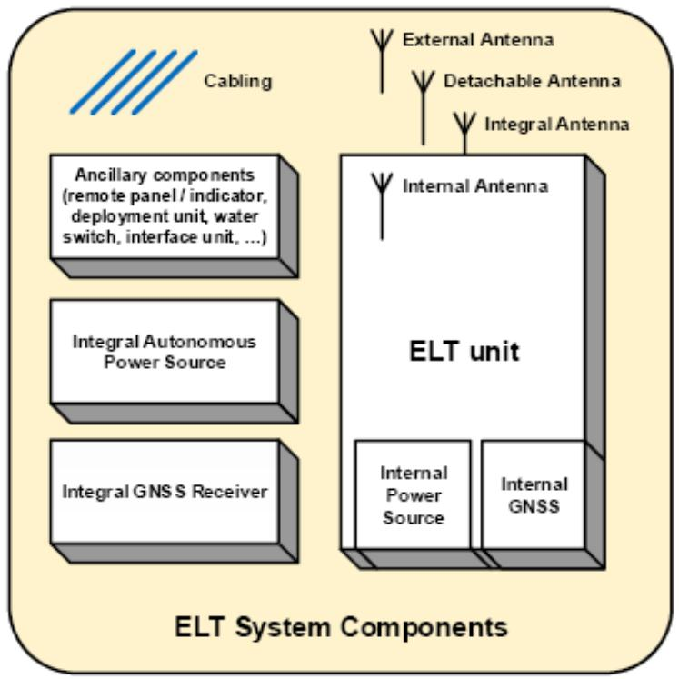

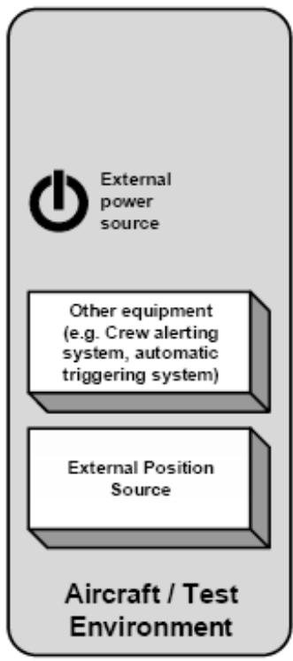

<table><tr><td>Cabling</td><td>布线</td></tr><tr><td>External Antenna</td><td>外部天线</td></tr><tr><td>Detachable Antenna</td><td>可拆式天线</td></tr><tr><td>Integral Antenna</td><td>整体天线</td></tr><tr><td>Ancillary components (remote panel/indicator, deployment unit, water switch, interface unit, ...)</td><td>辅助组件（远程面板/显示器、展开装置、水开关、接口装置等）</td></tr><tr><td>Integral Autonomous Power Source</td><td>整体独立电源</td></tr><tr><td>Integral GNSS Receiver</td><td>整体 GNSS 接收机</td></tr><tr><td>Internal Antenna</td><td>内部天线</td></tr><tr><td>ELT unit</td><td>ELT装置</td></tr><tr><td>Internal Power Source</td><td>内部电源</td></tr><tr><td>Internal GNSS</td><td>内部 GNSS</td></tr><tr><td>ELT System Components</td><td>ELT系统组件</td></tr><tr><td>External power source</td><td>外部电源</td></tr><tr><td>Other equipment (e.g. Crew alerting system, automatic triggering system)</td><td>其他设备（例如机组报警系统、自动触发系统）</td></tr><tr><td>External Position Source</td><td>外部位置源</td></tr><tr><td>Aircraft / Test Environment</td><td>航空器/试验环境</td></tr></table>

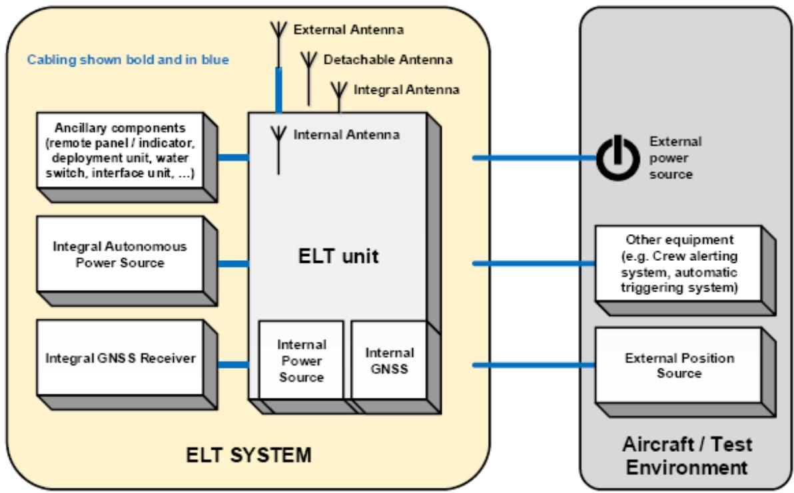  
FIGURE 1-1: DEFINITION OF THE ELT UNIT AND ELT SYSTEM COMPONENTS  
图1-1：ELT装置和ELT系统组件定义

<table><tr><td>Cabling shown bold and in blue</td><td>粗体蓝线所示布线</td></tr><tr><td>External Antenna</td><td>外部天线</td></tr></table>

FIGURE 1-2:DEFINITION OF ELT SYSTEM  

<table><tr><td>Detachable Antenna</td><td>可拆式天线</td></tr><tr><td>Integral Antenna</td><td>整体天线</td></tr><tr><td>ELT unit</td><td>ELT装置</td></tr><tr><td>Internal Power Source</td><td>内部电源</td></tr><tr><td>Internal GNSS</td><td>内部GNSS</td></tr><tr><td>Ancillary components (remote panel / indicator, deployment unit, water switch, interface unit, ...)</td><td>辅助组件(远程面板/显示器、展开装置、水开关、接口装置等)</td></tr><tr><td>Integral Autonomous Power Source</td><td>整体独立电源</td></tr><tr><td>Integral GNSS Receiver</td><td>整体GNSS接收机</td></tr><tr><td>ELT SYSTEM</td><td>ELT系统</td></tr><tr><td>External power source</td><td>外部电源</td></tr><tr><td>Other equipment (e.g. Crew alerting system, automatic triggering system)</td><td>其他设备(例如机组报警系统、自动触发系统)</td></tr><tr><td>External Position Source</td><td>外部位置源</td></tr><tr><td>Aircraft / Test Environment</td><td>航空器/试验环境</td></tr></table>

图1-2：ELT系统定义

NOTE: These figures include all the components that can make up different types of ELT systems, not all ELTs include all the components shown and some may be optional.

注：

这些数字包括可以组成不同类型ELT系统的所有组件，而不是所有ELT均包含所示的所有组件，其中部分组件可选。

# 1.5 RELATED DOCUMENTS REFERENCED IN THE DOCUMENT

# 1.5文中引用的相关文件

# 1.5.1 COSPAS-SARSAT Documents.

# 1.5.1 COSPAS-SARSAT文件

# 1.5.1.1 Guidelines

# 1.5.1.1 指导方针

COSPAS-SARSAT Guidelines C/S G.005, COSPAS-SARSAT Guidelines on 406 MHz Beacon Coding, Registration and Type Approval

COSPAS-SARSAT 指南 C/S G.005，关于 406 MHz 信标编码、注册和型号批准的 Cospas-Sarsat 指南

# 1.5.1.2 Technical

# 1.5.1.2技术

COSPAS-SARSAT Spec C/S T.001() Specification for COSPAS-SARSAT 406MHzDistress Beacons

COSPAS-SARSAT规范C/S T.001（）COSPAS-SARSAT406MHz遇难信标规范

COSPAS-SARSAT Spec C/S T.007() COPAS-SARSAT 406 MHz Distress BeaconType Approval Standard

COSPAS-SARSAT 规范 C/S T.007 ( ) COSPAS-SARSAT 406 MHz 遇难信标型号批准标准

COSPAS-SARSAT Spec C/S T.012() COPAS-SARSAT 406 MHz FrequencyManagement Plan

COSPAS-SARSAT规范C/S T.012（）COSPAS-SARSAT406MHz频率管理计划

COSPAS-SARSAT Spec C/S T.018() Specification For Second-Generation COSPAS-SARSAT406 MHz Distress Beacons

COSPAS-SARSAT规范C/S T.018（）第二代COSPAS-SARSAT406MHz遇难信标规范

COSPAS-SARSAT Spec C/S T.021(), COSPAS-SARSAT Second-Generation DistressBeacons 406-MHz Distress Beacon Type Approval Standard

COSPAS-SARSAT 规范 C/S T.021（），COSPAS-SARSAT 第二代遇难信标 406-MHz 遇难信标型号批准标准

# 1.5.1.3 Secretariat

# 1.5.1.3 秘书处

COSPAS-SARSAT Spec C/S S.007() Handbook of Beacon Regulations

COSPAS-SARSAT规范C/S S.007（）信标管理手册

# 1.5.2 Technically Equivalent RTCA and EUROCAE Documents

# 1.5.2 技术上等效的RTCA和EUROCAE文件

DO-178(/ED-12(), Software considerations in airborne systems and equipmentcertification

DO-178（）/ED-12（），机载系统和设备合格审定中对软件的要求

DO-160(/ED-14), Environmental conditions and test procedures for airborne equipment

DO-160（）/ED-14（），机载设备的环境条件和测试程序

DO-254(/ED-80(), Design Assurance Guidance for Airborne Electronic Hardware

DO-254（）/ED-80（），机载电子硬件的设计保证指南

# 1.5.3 EUROCAE Documents

# 1.5.3 EUROCAE 文件

ED-112A, Minimum Operational Performance Specification for Crash Protected Airborne Recorder Systems  
ED-112A，坠机保护机载记录器系统最低工作性能规范  
ED-155, Minimum Operational Performance Specification for Lightweight FlightRecording Systems  
ED-155，轻型飞行记录系统最低工作性能规范  
ED-237, Minimum Aviation System Performance Specification for Criteria to Detect In-Flight Aircraft Distress Events to Trigger Transmission of Flight Information  
ED-237，探测飞行中航空器遇难事件以触发飞行信息传输的标准的最低航空系统性能规范

# 1.5.4 RTCA Documents

# 1.5.4 RTCA文件

DO-227A, Minimum Operational Performance Standards for Non-Rechargeable LithiumBatteries

DO-227A，非充电式锂电池最低工作性能标准

DO-293A, Minimum Operational Performance Standards for Nickel-Cadmium, NickelMetal-Hydride, and Lead Acid Batteries

DO-293A，镍镉、镍金属氢化物和铅酸蓄电池最低工作性能标准

DO-311A, Minimum Operational Performance Standards for Rechargeable LithiumBatteries and Battery Systems

DO-311A，可充电锂电池和电池系统最低工作性能标准

# 1.5.5 SAE Documents

# 1.5.5 SAE文件

SAE ARP4761 “Guidelines and Methods for Conducting the Safety AssessmentProcess on Civil Airborne Systems and Equipment”

SAEARP4761“对民用机载系统和设备进行安全性评估过程的指导和方法”

SAE AS1072, Sleeve, Hose Assembly, Fire Protection

SAE AS1072，套管、软管总成、消防

SAE AS1055, Fire Testing of Flexible Hose, Tube Assemblies, Coils, Fittings, and Similar System Components

SAE AS1055，软管、软管组件、线圈、配件和类似系统组件的防火测试

# 1.5.6 MIL Documents

# 1.5.6 MIL 文件

MIL-DTL-17H, detail specification: cables, radio frequency, flexible and semi rigid.

MIL-DTL-17H，详细规格：电缆、射频、柔性和半刚性。

MIL-PRF-39012, vibration performance specification for the cable connectors.

MIL-PRF-39012，电缆连接器振动性能规范。

# 1.5.7 ISO Documents

# 1.5.7 ISO 文件

ISO 2685 Aircraft - Environmental test procedure for airborne equipment - Resistance to fire in designated fire zones (Category "Fire resistant)

ISO 2685 航空器——机载设备的环境试验程序——指定防火区的防火（类别“防火”）

# 1.5.8 EN Documents

# 1.5.8 EN文件

EN 6049-009, Aerospace series - Electrical cables, installation - Protection sleeve inmeta-aramid fibres - Part 009: Self-wrapping fire protection sleeve, flexible, postinstallation operating temperature from -  $55~^\circ \mathrm{C}$  to  $260~^\circ \mathrm{C}$  Product standard

EN 6049-009，航空航天系列——电缆装置——间位芳香族聚酰胺纤维保护套管——第009部分：自包装防火套管、柔性、后安装、工作温度从-55°C至260°C——产品标准

# 1.5.9 IEC Documents

# 1.5.9 IEC文件

IEC 61672-1:2013, Electro-acoustic - Sound level meters - Part 1: Specifications

IEC 61672-1:2013，电声学——声级计——第1部分：规范

# 1.5.10 ITU Documents

# 1.5.10 ITU文件

ITU Radio Regulations Appendix 1 - A3E Amplitude-modulated, double-sideband, analogue telephony

ITU无线电法规附录1-A3E调幅，双边带，模拟电话

# 1.5.11 EASA Documents

# 1.5.11 EASA文件

Certification Specifications CS-25, 25.853, Compartment interiors

认证规范CS-25，25.853，内舱

# 1.5.12 United States Government Documentation.

# 1.5.12 美国政府文件

1.5.12.1 Code of Federal Regulations (CFR)

1.5.12.1 美国联邦法规（CFR）

14 CFR 25.853, Passenger and crew compartment interiors.

14CFR25.853，客舱和乘务舱内部。

1.5.12.2 Advisory Circulars from the Federal Aviation Administration (FAA)

1.5.12.2 美国联邦航空管理局（FAA）的咨询通知

AC 21-46A, Technical Standard Order Program

AC 21-46A，技术标准指令计划

AC 25-11B, Electronic Flight Displays

AC 25-11B，电子飞行显示器

AC 23.1311C, Installation of Electronic Display in Part 23 Airplanes

AC 23.1311C，第 23 部分飞机中电子显示器的安装

AC 43.13-2B, Acceptable Methods, Techniques, and Practices - Aircraft Inspection and Repair

AC 43.13-2B，可接受的方法、技术和实践——飞机检查和修理

# 1.6 AIRCRAFT EQUIPMENT INFORMATION VULNERABILITIES

# 1.6飞机设备信息漏洞

Aircraft equipment information vulnerabilities (such as cybersecurity risks) have been present for digital systems since the development of the personal computer (PC) in the late 70's and even longer for RF systems, and the advent of internet connectivity has substantially increased those risks. Internet and Wi-Fi connectivity have become popular as a means for aircraft or equipment manufacturers to update installed avionicssoftware, to update databases, or provide an alternate means of communicating withthe flight crew or cabin (e.g., in-flight entertainment, weather, etc.).

自从70年代末个人电脑（PC）开发以来，飞机设备信息漏洞（例如网络安全风险）已经存在于数字系统之中，而RF系统的使用时间更长，互联网连接的出现也大大增加了此类风险。互联网和Wi-Fi连接已成为飞机或设备制造商更新已安装的航空电子软件、更新数据库或提供与机组人员或客舱（例如飞行中的娱乐、天气等）交流的替代手段。

In most countries, the State provides oversight of safety-of-flight systems (sometimes referred to as “authorized services”) which provide information to aircraft, such as ILS,VOR, GNSS, and DME, to name a few. However, the State typically does not provide oversight on “non-trusted” connectivity such as the internet, Wi-Fi, or manufacturer-supplied equipment interfaces which permit input of externally-supplied data into aircraft systems. A manufacturer may expose aircraft information vulnerability through equipment design, or become vulnerable as a result of being connected to a common interface. Therefore, it is important that manufacturers consider aircraft

informationsecurity risk mitigation strategies in their equipment design, particularly when theequipment is responsible for an interface between the aircraft and aircraft-externalsystems.

大多数国家，国家对飞行安全系统（有时被称为“授权服务”）提供监督，这些系统为飞机提供信息，其中包括 ILS、VOR、GNSS 和 DME 等。然而，国家通常不提供“非可信”连接的监督，例如允许输入外部提供数据至飞机系统的互联网、Wi-Fi 或制造商提供的设备接口。制造商可能通过设备设计暴露飞机信息漏洞，或者使其由于连接到公共接口而变得易受攻击。因此，制造商非常有必要在其设备设计中考虑飞机信息安全风险缓解策略，尤其是当设备负责飞机和飞机外部系统之间的接口时。

# CHAPTER 2

# 第2章

# GENERAL DESIGN SPECIFICATIONS

# 通用设计规范

# 2.1 AIRWORTHINESS

# 2.1适航性

An ELT system shall not, under normal or fault conditions, impair the airworthiness of the aircraft in which it is installed or carried, or the safety of persons on board.

在正常或故障情况下，系统不得影响安装或携带其的飞机的适航性，或损害机上人员的安全。

# 2.2 RADIO REGULATIONS

# 2.2无线电法规

Compliance with this MOPS demonstrates compliance with the relevant ITU RadioRegulations.

遵守本MOPS表示符合相关ITU无线电法规。

# 2.3 ELT FUNCTIONALITY

# 2.3 ELT功能

The ELT system shall perform its intended function(s), as declared by the ELT manufacturer in the installation manual, including the type(s), class(es), and capability(es) defined in this standard as well as any additional function(s), without creating a hazard to other users of the airspace.

ELT系统应执行安装手册中所述预期功能，包括本标准中定义的类型、类别和功能以及任何附加功能，而不对领空的其他使用者造成危险。

# 2.4 FIRE PROTECTION

# 2.4 消防

Except for small parts (such as knobs, fasteners, seals, grommets and small electricalparts) which would not contribute significantly to the propagation of a fire, and externalantenna, all materials used for the ELT system components shall beself-extinguishing, and comply with appropriate regulatory documents (e.g. CFR /CS 25.853).

除了不会对火势蔓延产生显著影响的小型部件（例如旋钮、紧固件、密封件、索环和小型电气部件）和外部天线等，所有用于ELT系统部件的材料均应是自熄性的，并符合适用监管文件（例如CFR/CS25.853）中所述要求。

NOTE: Appropriate tests are described in  $\S 4.4.15$

注：适当测试见第4.4.15条。

In addition, the ELT system, with the exception of remote control and monitoring system, shall survive the flame test.

此外，ELT系统，除遥控和监控系统外，还应通过火焰测试。

NOTE: Appropriate testing are described in  $\S 4.5.13$  and  $\S 4.5.14$  as applicable.

注：适当测试见第4.5.13条和第4.5.14条（如适用）。

# 2.5 OPERATION OF CONTROLS

# 2.5 控制操作

The design of the ELT system shall be such that the controls intended for operational use cannot be operated in any position, combination or sequence, which would result in a condition detrimental to the operation or reliability of the ELT system.

ELT的设计应确保用于运行的控制装置不能在任何位置、组合或顺序下运行，否则将会导致不利于ELT运行或可靠性的情况。

# 2.6 POWER SOURCE

# 2.6 电源

The ELT unit shall have its own integral or internal power source.

ELT装置应配备其自己的整体或内部电源。

The ELT system shall not be solely dependent upon any external power source for activation and transmission.

ELT系统不得完全依赖于任何外部电源进行激活和传输。

# 2.7 EFFECTS OF TESTS

# 2.7测试影响

The design of the ELT system components shall be such that the application of specified test procedures shall not be detrimental to equipment performance following the application of these tests, except as specifically allowed.

ELT组件的设计应确保在开展此类测试之后，应用规定测试程序不会对设备性能造成损害，除非特别允许。

# 2.8 SOFTWARE CONTROL AND ELECTRONIC HARDWARE

# 2.8软件控制和电子硬件

Software design shall follow the guidelines specified in document ED-12()/DO-178().

软件设计应遵循文件ED-12（）/DO-178（）中所规定的指导方针。

Electronic hardware design shall follow the guidelines of ED-80/DO-254().

电子硬件设计应遵循文件ED-80（）/DO-254（）中所规定的指导方针。

# 2.9 ADDITIONAL SPECIFICATIONS

# 2.9补充规范

# 2.9.1 Automatic Fixed (AF) ELT

# 2.9.1 自动固定（AF）式ELT

The ELT(AF) shall have the means to detect occurrence of a crash, automaticallyactivate the transmitter and radiate a signal through an antenna.

ELT（AF）应具有检测崩溃发生、自动激活发报机并通过天线辐射信号的方法。

The ELT system shall incorporate an external, integral or internal antenna. Means shall be provided to prevent antennas from interfering with normal operation of the aircraft or with its occupants. If the antenna is not attached directly to the ELT unit, it shall be connected to the ELT unit by means of a suitable RF cable resistant to disconnection during normal operations (see § 3.4) and most accident events.

ELT系统应包含外部、整体或内部天线。应采取措施防止天线干扰飞机或其乘员的正常操作。如果天线没有直接连接到ELT装置，则应通过适当的RF电缆将其连接至ELT装置，以便防止在正常操作期间（参见第3.4条）和大多数事故事件中断开连接。

# 2.9.1.1 Labelling

# 2.9.1.1 标签贴附

Simple operating instructions in English, clearly readable and durable, shall be permanently affixed to the ELT unit.

应在ELT装置上贴附清晰易读、经久耐用的简洁英文操作说明书。

# 2.9.2 Automatic Portable (AP) ELT

# 2.9.2 自动便携（AP）式ELT

The ELT(AP) shall meet the specifications of  $\S 2.9.1$ . In addition, it shall include adetachable antenna and a tether. If the antenna is internal or integral to the ELT unit, and the ELT unit is readily accessible and removable as an entity, a detachable antennas not required. The unit shall be designed so that it may be removed from the aircraft, deployed, controls activated and antenna erected, all without use of tools. The ELT(AP) shall be buoyant and it shall be designed to operate and meet all transmissionrequirements when floating in fresh or salt water, and shall be self-righting to establish the antenna in its nominal position in calm conditions. If the crash sensor is not automatically disabled when the ELT is removed from the aircraft mounting, an audibleindication must be installed that activates when the ELT is transmitting.

ELT（AP）应符合第2.9.1条中所述规定。此外，其还应包括可拆式天线和拴绳。如果对于ELT装置天线是内部或整体式，并且ELT装置作为一个实体可以方便地接触和移动，则不需要可拆式天线。该装置的设计应使其能在不使用工具的情况下从飞机上拆卸下来、展开、启动控制装置并且进行天线安装。ELT（AP）应具有浮力，其设计应能在淡水或盐水中漂浮时运行并满足所有传输要求，并应能自行扶正，以便在平静条件下将天线固定在其标称位置。如果在从飞机安装上拆下来时，坠机传感器不会自动禁用，则必须安装声音指示器，以便在传输时启动。

An ELT(AP) can only be labelled as an ELT(S) if it fully meets the specifications of Survival ELT beacons (§ 2.9.3).

只有在完全符合幸存式ELT信标规范的情况下，ELT（AP）才可以被标记为ELT（S）（参见第2.9.3条）。

# 2.9.2.1 Labelling

# 2.9.2.1 标签贴附

Simple operating instructions in English, clearly readable and durable, shall be permanently affixed to the ELT unit.

应在ELT装置上贴附清晰易读、经久耐用的简洁英文操作说明书。

# 2.9.3 Survival (S) ELT

# 2.9.3幸存（S）式ELT

An ELT(S) shall meet the specifications found in this section.

ELT（S）应符合本节中所述规范。

The ELT(S) shall survive the crash forces specified in CHAPTER 4, be capable of radiating a signal, have a visual indication that transmission is on and an aural indication is optional.

ELT（S）应能经受住第4章中所规定的冲击力，能够发出信号，可可见指示器表明传输已开启，并且可配备声音指示器。

# 2.9.3.1 Antenna

# 2.9.3.1天线

If the antenna is not designed to be stowed in its normal operating position, it shall be deployable to the designed length and operating position in a simple and reliable manner. If the antenna or its sections can be taken apart and detached from the ELTunit, they shall be stowed together and secured against loss.

如果天线未被设计成存放在其正常工作位置，则应以简单可靠的方式将其展开至设计长度至工作位置。如果天线或其部分可以从ELT装置上拆下，则应将其装在一起并防止其丢失。

# 2.9.3.2 Labelling

# 2.9.3.2 标签贴附

Simple operating instructions in English, clearly readable and durable, shall be permanently affixed to the ELT unit.

应在ELT装置上贴附清晰易读、经久耐用的简洁英文操作说明书。

# 2.9.3.3 ELT Deployment and Activation

# 2.9.3.3 ELT展开和激活

The ELT system shall be designed so that it may be brought into operation using onehand. The activation mechanism of the transmitter shall incorporate measures to minimise inadvertent activation.

ELT系统应设计为可单手操作。发射机的激活机制中应包含减少无意激活的措施。

# 2.9.3.4 Tether

# 2.9.3.4 系绳

A tether shall be provided to secure the ELT unit to a person or life raft. The tether shall be non-rotting, inherently buoyant (e.g., polypropylene, not nylon) of a high-visibilitycolor, and a length of at least  $4\mathrm{m}$  (13.1 ft). The tether, when attached to a person or liferaft, shall be shown to withstand a pull force of  $113.4\mathrm{kg}$  (250 lbs) for 1 minute.

应设置系绳将 ELT 装置固定在人员或救生筏上。系绳应为不腐烂材质，具有高能见度颜色的天然浮力（例如聚丙烯而非尼龙），长度至少  $4\mathrm{m}$ （13.1ft）。系在人或救生筏上的系绳应能承受  $113.4\mathrm{kg}$ （250lbs）的拉力持续 1 分钟。

# 2.9.3.5 Buoyancy

# 2.9.3.5浮力

The ELT shall be designed in order to satisfy the specifications for ELT(S) Category Aor Category B as applicable.

ELT的设计应符合适用的A类或B类（如适用）ELT（S）的规范。

# 2.9.4 Automatic Deployable (AD) ELT

# 2.9.4 自动展开（AD）式ELT

The ELT(AD) may be either a stand-alone beacon or may be a part of an Automatic Deployable Flight Recorder.

ELT（AD）可以是一个独立信标，也可以是自动展开式飞行记录器的组成部分。

The following terminology is used when defining the requirements for an ELT (AD):

定义ELT（AD）的要求时，使用以下术语：

ELT(AD) in ADFR - used for requirements applying only to ELT(AD) embedded in an ADFR,

. ADFR 中的 ELT（AD）——用于仅适用于嵌入在 ADFR 中的 ELT（AD）的要求；

ELT (AD) not in ADFR - used for requirements applying only to ELT(AD) which are not embedded in an ADFR,

.不在 ADFR 中 ELT（AD）——用于仅适用于未嵌入在 ADFR 中的 ELT（AD）的要求；

ELT(AD) (without further information) - used for requirements applying both toELT(AD) in ADFR and not in ADFR.

ELT（AD）（无补充信息）——用于既适用于嵌入 ADFR 中的 ELT（AD）未嵌入在 ADFR 中的 ELT（AD）的要求。

NOTE: ADFR specifications can be found in EUROCAE ED-112() or ED-155(), as applicable, which refer to them as Automatic Deployable Recorders or Deployable Recorders.

ADFR 规范参见 EUROCAE ED-112（）或 ED-155（）（如适用），其被称为自动展开式记录器或可展开式记录器。

The ELT(AD) shall also meet the specifications of an ELT(AF) (see § 2.9.1) while installed in the aircraft.

ELT（AD）还应满足安装在飞机上的ELT（AF）的规范（参见第2.9.1条）。

# 2.9.4.1 Deployment

# 2.9.4.1展开

If not defined by the EUROCAE ED-112() or ED-155() as applicable, for ADFR or in the case of ELT(AD) not in ADFR, the overall quantitative probability (per flight hour) of the failure event “non-commanded deployment” for the ELT system shall be  $< 10^{-7}$  FH (Flight Hour). This probability requirement addresses such components, which contribute directly to the deployment event.

如果 EUROCAE ED-112()或 ED-155()（如适用）中未规则，则对于 ADFR 或位于 ADFR 中的 ELT（AD），ELT 系统故障事件“非指挥展开”的总数量概率（每飞行小时）应小于  $10^{-7}\mathrm{FH}$  （飞行小时）。这种概率要求确定了直接影响展开事件的组件。

NOTE 1: The procedures to determine this safety process shall be adapted from SAE ARP4761 "Guidelines and Methods for Conducting the Safety Assessment Process on Civil Airborne Systems and Equipment".

确定此安全过程的程序应适改编自SAEARP4761“对民用机载系统和设备进行安全性评估过程的指导和方法”。

NOTE 2: A “non-commanded deployment” is defined as separation of the deployableELT from the aircraft when the deployment criteria have not been met.  
注2:

当展开标准未达到时，“非指挥展开”被定义为可展开ELT与飞机的分离。

The ELT(AD) shall not deploy as a result of exposure to the aircraft operational environment (e.g. salt water sprayed by the rotor in offshore operations, exposure torain, de-icing operation, ...).

ELT（AD）不得因暴露于飞机作业环境（例如在海上作业时，转子喷射的盐水、暴露于雨水中、除冰作业等）而展开。

2.9.4.1.1 Manual deployment

2.9.4.1.1 手动展开

ELT(AD) not in an ADFR shall have the capability for manual deployment.

位于ADFR中的ELT（AD）不具备手动展开功能。

ELT(AD) in an ADFR: refer to EUROCAE ED-112() or ED-155() as applicable.

位于ADFR中的ELT（AD)：参见EUROCAEED-112（）或ED-155（）（如适用）。

2.9.4.1.2 Deployment induced by crash detection

2.9.4.1.2坠机检测引发的展开

ELT(AD) not in an ADFR shall deploy automatically when a crash is detected. Crashdetection shall be achieved either by sensing fuselage deformation or by using a sensormeeting the crash sensor test in  $\S 4.5.9.2$ .

当检测到坠机时，未位于 ADFR 中的 ELT（AD）应自动展开。坠机检测应通过感知机身变形的方式实现，或者通过使用符合第 4.5.9.2 条中所述坠机传感器测试的传感器实现。

ELT(AD) in an ADFR: refer to EUROCAE ED-112() or ED-155() as applicable.

位于ADFR中的ELT（AD)：参见EUROCAEED-112（）或ED-155（）（如适用）。

2.9.4.1.3 Deployment induced by immersion

2.9.4.1.3 因浸入引发的展开

ELT(AD) not in ADFR system shall deploy the beacon when detecting an immersion by water pressure or the presence of water. A pressure equivalent to a water depth of between 1.5 and  $5\mathrm{m}$  (between 5 and 16.4 ft - between

2.1 and 7.1 PSI relative pressureor between 16.9 and 21.9 PSI absolute pressure), is recommended for the switchingthreshold of a hydrostatic pressure switch.

未位于 ADFR 中的 ELT（AD）应在检测到浸水压力或水的存在时展开信标。对于液压开关的开关阈值，建议使用相当于水深  $1.5 - 5\mathrm{m}$  （5-16.4ft 或 2.1-7.1PSI 相对压力或 16.9-21.9PSI 绝对压力)的压力。

ELT(AD) in ADFR: refer to EUROCAE ED-112() or ED-155() as applicable.

位于ADFR中的ELT（AD)：参见EUROCAEED-112（）或ED-155（）（如适用）。

ELT(AD) system shall be designed such that immersion shall not prevent the deployment, activation and, once floating, transmission performance of the beacon.

ELT（AD）系统的设计应确保浸入不会阻止信标的展开、激活及漂浮之后的传输性能。

Automatic deployment shall still operate 1 hour after the loss of aircraft power for ELT(AD) not in ADFR or 15 minutes after the loss of aircraft power for ELT(AD) in ADFR. All component electronics, power sources, mechanisms and interconnecting cables needed to ensure the ELT(AD) activates and deploys shall be identified in the installation manual, as well as any caution notes to ensure successful deployment and activation.

对于未位于 ADFR 中的 ELT（AD），自动展开仍应在飞机断电后 1 小时运行；而对于位于 ADFR 中的 ELT（AD），自动展开则应在飞机断电后 15 分钟后运行。应在安装手册以及确保成功展开和激活的任何注意事项中确定确保 ELT（AD）激活和展开所需的所有电子元件、电源、机构和互连电缆。

# 2.9.4.2 Activation

# 2.9.4.2 激活

The ELT(AD) deployment shall result in its activation.

ELT（AD）展开将导致其激活。

The ELT(AD) shall be capable of being activated or deactivated by the crew without deployment. Activation shall result in the transmission of the alert signal to space without deployment. Manual activation shall not inhibit a later automatic or, in the case of ELT(AD)not in ADFR, manual deployment.

ELT（AD）应能够在未展开的情况下由机组人员激活或停用。激活将导致报警信号在未展开的情况下传输至空域。手动激活不得禁止稍后的自动展开，并且对于并非位于 ADFR 中的 ELD（ED），不得禁止手动展开。

ELT(AD) shall also include an input permitting the beacon activation without deployment when aircraft emergency floatation devices are deployed.

ELT（AD）还应包括在飞机应急漂浮装置展开时允许信标激活而无需展开的输入。

ELT(AD) in ADFR shall activate without deployment when detecting occurrence of acrash (such as specified in § 2.9.1) even if the conditions for the deployment are not met.

位于 ADFR 中的 ELT（AD），即使未满足展开条件，在检测到发生坠机时（例如第 2.9.1 条中所规定的），也应在未展开的情况下激活。

# 2.9.4.3 Buoyancy

# 2.9.4.3浮力

ELT(AD) not in ADFR shall be buoyant and, when floating in fresh water or salt water, shall be self-righting and sufficiently stable to maintain the antenna substantially in itsnormal operating position.

未位于 ADFR 中的 ELT（AD）应具备浮力，并且在淡水或盐水中浮起时，应自动扶正，同时应相当稳定，足以使天线维持在其正常工作位置。

For ELT(AD) in ADFR, this requirement is replaced by the requirements for Seaworthiness in ED-112() or ED-155(), as appropriate for the type of ADFR.

对于位于 ADFR 中的 ELT（AD），此要求被 ED-112（）或 ED-155（）中适航要求中适用于 ADFR 类型的要求取代。

# 2.9.4.4 Antenna

# 2.9.4.4天线

An internal or integral antenna is required and may not be rigidly fixed to the aircraft before a crash. If an external antenna is needed to transmit without deployment, it shall be rigidly fixed to the aircraft.

需要内部或整体天线，并且坠机前可能不会将其固定在飞机上。如果需要外部天线在未展开的情况下进行传输，则必须将天线固定在飞机上。

# 2.9.5 Distress Tracking (DT) ELT

# 2.9.5 遇难跟踪（DT）式ELT

# 2.9.5.1 ELT(DT) functional specifications

# 2.9.5.1 ELT（DT）功能规范

The ELT(DT) shall be capable of being armed/disarmed upon reception of a signal from an aircraft system (e.g. automatic triggering system). Once armed, the ELT transmitters shall automatically activate and radiate a signal through an antenna upon command from the automatic triggering system or if the communication connections to the automatic triggering system is lost. ELT(DT) shall stop transmitting an alert signal and shall start transmitting a cancellation signal only when the cancellation command is from the same means that activated it, as specified per C/S T.018 and T.001 as applicable.Once disarmed, it will not begin transmitting based on any command from the automatic triggering system nor will it begin transmitting if the communication connections fromthe automatic triggering system is lost.

ELT（AD）应能够在接收到来自飞机系统（例如自动触发系统）的信号之后进行装备/解除装备。一旦装备，ELT将自动激活，并且根据来自自动触发系统的命令通过天线辐射信号，或在与自动触发系统之间的通信连接丢失时通过天线辐射信号。ELT（DT）应停止传输报警信号，并且仅当取消命令来自使其激活的相同装置时方才开始传输取消信号，如适用的C/S T.018和T.001所规定的。一旦解除装备，其将不会根据自动触发系统的任何命令开始传输，并且也不会在来自自动触发系统的通信连接丢失的情况下开始传输。

Whatever its arming state, the ELT(DT) shall activate, except in OFF mode, when manually triggered by the crew.

无论其装备状态如何，除非在关闭模式下，否则当机组人员手动触发时，ELT（DT）应被激活。

An ELT(DT) with crash survivability shall continue 406 MHz satellite transmissions uponcrash condition detection. The required endurance time for  $406\mathrm{MHz}$  satellitetransmission shall be 24 hours for the combined flight and post-crash time.

具有坠机幸存能力的ELT（DT）应在坠机状态检测时继续进行406MHz卫星传输。406MHz卫星传输所需的续航时间应为24小时，包含飞行时间和坠机后时间。

The ELT(DT) shall have a maintenance input overriding the routine arming logic and preventing its automatic activation upon command from the automatic triggering systemor if the communication connections to the automatic triggering system is lost. The intentis to avoid inadvertent activation of the ELT(DT) during maintenance or flight tests, and also make the controls for the maintenance input inaccessible during routine flightoperations.

ELT（DT）应具备的维修输入，该输入应覆盖常规装备逻辑，并防止其在根据自动触发系统发出命令或在与自动触发系统之间的通信连接丢失时自动激活。其目的是避免在维修或飞行测试期间无意激活ELT(DT)，并且使日常飞行操作中维修输入控制装置不可访问。

An ELT(DT) shall transmit an encoded location as defined in C/S T.018 or C/S T.001 as applicable.

ELT（DT）应传输C/S T.018或C/S T.001（如适用）中定义的编码位置。

The ELT system shall incorporate an external, integral or internal antenna. Means shall be provided to prevent antennas from interfering with normal operation of the aircraft or with its occupants. If the antenna is not attached directly to the ELT unit, it shall be connected to the ELT unit by means of a suitable RF cable resistant to disconnection during normal operations (see § 3.4), distress conditions, and, if the ELT(DT) has the crash survivability capability, accident events.

ELT系统应包含外部、整体或内部天线。应采取措施防止天线干扰飞机或其乘员的正常操作。如果天线没有直接连接到ELT装置，则应通过适当的RF电缆将其连接至ELT装置，以便防止在正常操作期间（参见第3.4条）和遇难情况下断开连接；并且，如果ELT（DT）具有坠机幸存能力，则放置其在事故事件中断开连接。

If fitted with a homing capability, the homing signal shall be transmitted following the ELT activation and detection of a post-crash condition. Acceptable means for detection of a post-crash condition are for example: static GNSS position for more than one minute (provided that the GNSS position is actually being updated at least once every 5 seconds over this period of time), water-detection or crash-sensor activation. If the ELT(DT) is automatically activated, homing signals shall not be transmitted while the aircraft is still in flight.

如果具备归航能力，则归航信号应在飞机坠机后的激活和探测后传输。用于检测坠机后状况可接受的方法包括：例如超过一分钟的静态 GNSS 位置（前提条件是这段时间内 GNSS 位置实际上至少每 5 秒钟更新一次）、水探测或坠机传感器激活等。如果 ELT（DT）被自动激活，则当飞机仍在飞行时，将不会传输归航信号。

# 2.9.5.1.1 Labelling

# 2.9.5.1.1 标签贴附

Simple operating instructions in English, clearly readable and durable, shall be permanently affixed to the ELT unit.

应在ELT装置上贴附清晰易读、经久耐用的简洁英文操作说明书。

# 2.9.5.2 Functional Interface(s)

# 2.9.5.2 功能接口

An ELT(DT) shall incorporate one or more interfaces to aircraft systems and/or the flightdeck controls.

ELT（DT）应包含一个或多个与飞机系统和/或飞行甲板控制装置的接口。

2.9.5.2.1 Required Interface Functions

2.9.5.2.1 所需接口功能

An ELT(DT) shall have an interface(s) for the following functions (either as separate electrical discrete or coded on a digital bus).

ELT（DT）应具有下列功能的接口（作为数字总线上的单独电气离散或编码）。

a) Receive a triggering command from the automatic triggering system.  
a）接收来自自动触发系统的触发命令；  
b) Provide information that an automatic trigger was received.  
b）提供所接收到的自动触发动作信息；  
c) Receive a cancellation command from the automatic triggering system. Loss of the automatic triggering command indication shall not be interpreted as a cancellation command.  
c）接收来自自动触发系统的取消命令；自动触发命令指示的丢失不得解释为取消命令；  
d) Provide information that an automatic trigger cancellation command was received.  
d）提供所接收到的自动触发取消命令；  
e) Continuously monitor the triggering command communications connection between the automatic triggering system and ELT unit. If that connection is lost while the ELT is armed the ELT shall be activated until the communicationconnection is restored and the ELT receives an indication that a triggeringcommand is not active, in which case a cancellation message is sent by theELT, and the ELT returns to the armed mode.  
e）连续监测自动触发系统与ELT装置之间的触发指令通信连接；如果该连接丢失时ELT已装备，则ELT将被激活，直至通信连接恢复为止，并且ELT接收到未激活触发命令的指示，在这种情况下，ELT将发送取消消息，并且ELT回到装备模式。  
f) Receive arm/disarm commands so that normal landing or post-flight shutdown of the automatic triggering system will not cause the ELT to activate and that pre-flight activation of the ELT cannot occur. The arm and disarm commands should be explicit and unique such that the absence of one command shall not be interpreted as the other and loss of the interface shall not change the armedstate of the ELT(DT). Disarming an ELT shall not stop an active transmission.  
f）接收装备/解除装备模命令，确保自动触发系统的正常着陆或飞行后关闭不会导致 ELT 激活，并且 ELT 不会出现飞行后激活的情况；装备/解除装备命令应明确且独特，确保一个命令的缺失不得被解释为另一个命令，而且接口的丢失不得改变 ELT（DT）的装备状态。解除装备 ELT 不得阻止主动传输。

NOTE: The arm/disarm mode is only applicable to automatic triggering. The manual activation is always available.

装备/解除装备模式仅适用于自动触发。手动激活始终可用。

g) Provide arm/disarm status of the ELT.  
g）提供ELT装备/解除装备状态；  
h) Remote control and monitoring functions as described in  $\S 3.1.2$  
h）具备第3.1.2条所述遥控和监测功能；  
i) Provide an indication that a manual trigger or crash sensor activated trigger (fora crash survivable ELT(DT)) was cancelled.  
i）提供表明手动触发器或坠机传感器激活触发器（用于坠机幸存式ELT（DT)）已取消的指示；  
j) Permit ELT deactivation for maintenance or flight test purpose (maintenanceinput).  
j）允许ELT取消激活以便进行维修或飞行测试（维修输入）。

# 2.9.5.2.2 Optional Interface Functions

# 2.9.5.2.2 可选接口功能

In addition to the required functions above, an ELT(DT) may include interfaces for one or more of the following optional functions.

除了上述所需功能之外，ELT（DT）可能还包括下列一个或多个可选功能的接口：

a) Receive aircraft position information from aircraft systems.  
a）接收来自飞机系统的飞机位置信息；  
b) Receive parametric data from the aircraft.  
b）接收来自飞机的参数数据；  
c) Receive information about criteria that triggered automatic activation.  
c）接收有关已触发自动激活标准的信息；  
d) Indication of availability and/or connection to external power.  
d）外部电源可用性和/或连接性的指示；  
e) Communications with aircraft maintenance systems to initiate self-tests and provide results.  
e）与飞机维修系统沟通进行自我测试并提供结果的通信。

# 2.10 POSITION DATA (OPTIONAL EXCEPT FOR ELT(DT))

# 2.10 位置数据（除 ELT（DT)外可选）

The ELT may provide an encoded position from either an internal, integral or external position source. Cospas-Sarsat requires that an ELT(DT) has an integral or internal source of position data.

ELT可提供来自内部、整体或外部位置源的编码位置。Cospas-Sarsat要求ELT（DT）具有整体或内部位置数据来源。

# CHAPTER 3

# 第3章

# MINIMUM PERFORMANCE SPECIFICATIONS UNDER STANDARD CONDITIONS

# 标准条件下的最低性能规范

# 3.1 CONTROLS AND MONITORING SYSTEM

# 3.1 控制监测系统

# 3.1.1 Controls and monitoring system on ELT unit

# 3.1.1 ELT装置上的控制监测系统

A means of automatically monitoring the ELT activation is required due to the unacceptably high number of false activations that have occurred with existing ELTs.

由于现有ELT已经发生不可接受的大批次错误激活，因此需要采用特定方式自动监测ELT激活。

The ELT shall have the followings methods of indicating that the ELT system has beenactivated:

ELT应具有以下指示ELT系统已被激活的方法：

a) a visual indicator on the ELT unit,  
a）ELT装置上的目测指示器；  
b) an aural indicator internal or integral to the ELT unit with a Sound Pressure Level between 60 dB and 70dB defined with respect to a Sound Pressure Level of  $20\mu \mathrm{Pa}$  (optional for ELT(S)).  
b）ELT装置内部或整体的音响指示器，其声压级介于60dB和70dB之间，相对于  $20\mu \mathrm{Pa}$  的声压级进行界定（对于ELT而言可选）。

The ELT(AP) and the ELT(S) can include a function to disable the aural indicator onceactivated.

ELT（AP）和ELT（S）可以包括一旦激活便禁用音响指示器的功能。

ELT(AD) units are not required to be fitted with any control if the ELT(AD) is automatically turned off when uninstalled. If fitted with controls, these ones should be protected against unintended operation resulting from the beacon impact on ground.

如果ELT（AD）在卸载时自动关闭，则无需为ELT（AD）装置安装任何控制装置。如果此类装置装有控制装置，应保护其免受信标撞击地面导致的意外操作。

Except for ELT(AD), the controls on the ELT unit shall enable selection of at least the following functions:

除ELT（AD）外，ELT装置上的控制装置应至少能够选用以下功能：

OFF: ELT unit disabled and not in the "ARMED" mode.

关闭：ELT装置禁用，不处于“装备”模式。

MANUAL ON: Activate the ELT manually

1. 手动开启：手动激活ELT

ARMED: ELT unit enabled such that activation will occur in response to anactivation input (for example, crash sensor, water switch, triggering logic or aremote manual activation) (may not apply to ELT(S) and ELT(DT)).

装备：ELT装置启用，使得激活将响应于激活输入（例如，坠机传感器、水开关、触发逻辑或远程手动激活）而发生（可能不适用于ELT（S）和ELT（DT)）。

RESET: ELT unit deactivated and return to "ARMED" (may not apply to ELT(S)). The control must have a provision to prevent inadvertent reset.

重置：ELT装置停用并返回“装备”（可能不适用于ELT(S)）。控制装置必须带有防止无意重置的装置。

SELF-TEST: initiate ELT unit Self-Test function (refer to § 3.2) and when the ELTsystem includes an internal or integral GNSS receiver, GNSS Self-Test function. The controls for this function shall be designed such that they automatically return to their previous state after activation (e.g.: spring-loaded switch or push button).

自检：启动ELT装置自检功能(参见第3.2条)，当ELT系统包括内部或整体GNSS接收机时，启动GNSS自检功能。该功能的控制装置应设计成在激活后自动返回其先前状态（例如：弹簧定位开关或按钮）。

CANCELLATION: ELT unit transmits a cancellation sequence and then returnsto the "ARMED" mode (or "OFF" if there is no "ARMED" mode). The control must have a provision to prevent inadvertent cancellation. (C/S T.018 ELT(AP) andELT(S) ELTs only) (Note that C/S T.001 ELT(DT)s and T.018 ELT(AF)s andELT(DT)s are not required to have a separate cancellation function but are required to transmit a cancellation sequence when RESET)

取消：ELT装置发送一个取消序列，然后返回“装备”模式（如果没有“装备”模式，则返回“关闭”）。控制装置必须带有防止无意取消的装置。（仅C/S T.018 ELT（AP)和ELT(S)ELT）（注意，C/S T.001 ELT（DT）和T.018 ELT（AF）和ELT（DT）无需具备单独的取消功能，但需要在重置时发送取消序列）

NOTE: More than one function may be combined in the same control except cancellation, however each function must have its own unique means of operation. 注：

除了取消之外，同一控制装置中可以组合多项功能，但是每项功能必须有独特的操作方式。

# 3.1.2 Remote Control and Monitoring System (Except ELT(S))

# 3.1.2 远程控制监测系统（ELT（S）除外）

A means of automatically monitoring the ELT activation (§ 3.1.1) is required due to the unacceptably high number of false activations that have occurred with existing ELTs.

由于现有ELT已经发生不可接受的大批次错误激活，因此需要采用特定方式自动监测ELT激活（第3.1.1条）。

The remote control or monitoring system shall have a visual method of informing the cockpit or ground crew that the ELT has been activated. The visual method shall be consistent with the other visual methods provided in the cockpit.

远程控制或监控系统应能够可视地通知驾驶舱或地勤人员ELT已被激活。目视方法应与驾驶舱内提供的其他目视方法一致。

When indicators and remote control need to be continuously powered, they may use either a dedicated power source or an alternate power source (e.g., the aircraft power source). Remote manual activation shall not require alternate power to activate the ELT unit.

当指示器和远程控制装置需要连续供电时，其可以使用专用电源或备用电源（例如，航空器电源）。远程手动激活无需备用电源来激活ELT装置。

The monitoring system can be independent of the Remote Control.

监控系统可以独立于远程控制装置。

The remote monitoring system of an ELT shall indicate at least the following:

ELT的远程监控系统应至少显示以下信息：

Inform the crew in the cockpit if the ELT is activated.

如果ELT被激活，通知驾驶舱内的机组人员。

Inform the crew in the cockpit that an automatically triggered activation wascancelled (ELT(DT) only).

如果自动触发的激活被取消（仅ELT（DT)），通知驾驶舱内的机组人员。

Inform the crew in the cockpit when the ELT(AD) is deployed.

如果ELT（AD）被展开，通知驾驶舱内的机组人员。

Inform the crew of the Self-Test status.

向机组人员通知自检情况。

The remote controls of an ELT shall enable selection of at least the following functions:

ELT 的远程控制装置应至少能够选用以下功能：

MANUAL ON: Activate the ELT manually

1.手动开启：手动激活ELT

ARMED: ELT unit enabled such that activation will occur in response to anactivation input (for example, crash sensor, water switch, triggering logic or aremote manual activation) (may not apply to ELT(DT)).

装备：ELT装置启用，使得激活将响应于激活输入（例如，坠机传感器、水开关、触发逻辑或远程手动激活）而发生（可能不适用于ELT（DT)）。

RESET: ELT unit deactivated and return to “ARMED”. The control must have a provision to prevent inadvertent reset. In the case of ELT(DT), this function shall only reset the manual activations and automatic activations due to the crashsensor, when installed, but not the activations resulting from automatic distressstracking logic, including those related to the loss of an external triggering logicsas defined in § 2.9.5.2.1 e). Performing a reset shall automatically initiate acancellation sequence on C/S T.001 ELT(DT)s and C/S T.018 ELTs.

重置：ELT装置停用并返回“装备”。控制装置必须带有防止无意重置的装置。对于ELT（DT），该功能应仅重置因安装坠机传感器而导致的手动激活和自动激活，而不重置因自动遇难跟踪逻辑而导致的激活，包括与第2.9.5.2.1条e中定义的外部触发逻辑丢失相关的激活。执行重置时，应自动启动C/S T.001 ELT（DT）和C/S T.018 ELT上的取消序列。

SELF-TEST: initiate ELT unit Self-Test function (refer to § 3.2) and when the ELTsystem includes an internal or integral GNSS receiver, GNSS Self-Test function. The controls for this function shall be designed such that they automatically return to their previous state after activation (e.g.: spring-loaded switch or push button).  
自检：启动ELT装置自检功能(参见第3.2条)，当ELT系统包括内部或整体GNSS接收机时，启动GNSS自检功能。该功能的控制装置应设计成在激活后自动返回其先前状态（例如：弹簧定位开关或按钮）。

. DEPLOY (ELT(AD) only, except when fitted in an ADFR): manually deploy andactivate the ELT unit.

1. 展开（仅ELT（AD），除非安装在ADFR中）：手动展开并激活ELT装置。

The remote control shall not have the capability to switch off the ELT ("OFF" position).

远程控制装置不应具备关闭ELT（“关闭”位置）的能力。

# 3.1.2.1 Fault tolerance

# 3.1.2.1 容错

No combination of short or open circuits between the remote control, indicators, associated wiring and the airframe shall deactivate the ELT unit that has been activated.

远程控制装置、指示器、相关接线和机身之间的短路或开路组合不得使已激活的ELT装置停用。

# 3.2 SELF-TEST

# 3.2自检

The ELT shall include a Self-Test function that complies with "Beacon Self-Test Mode" as described in C/S T.001 for a first generation ELT and C/S T.018 for a secondgeneration ELT.

ELT应包括符合C/S T.001中所述的针对第一代ELT和C/S T.018中所述的针对第二代ELT的“信标自检模式”的自检功能。

If the ELT system includes an internal or integral GNSS receiver, the ELT shall also include a GNSS self-test function that complies with "GNSS Self-Test Mode" asdescribed in C/S T.001 for a first generation ELT and C/S T.018 for a second generationELT.

如果ELT系统包括内部或整体GNSS接收机，则ELT还应包括符合C/S T.001中所述的针对第一代ELT和C/S T.018中所述的针对第二代ELT的“GNSS自检模式”。

At the conclusion of the Self-Test, the ELT shall automatically return to its previous state.

自检结束时，ELT应自动返回其先前状态。

Self-Test functions of the ELT shall be inhibited once the ELT has been activated.

ELT被激活后，ELT的自检功能应被禁止。

# 3.2.1 Homing signal transmitter self-test

# 3.2.1归航信号发射机自检

The requirements of this paragraph shall apply to any frequency used by the homingsignal.

本段的要求应适用于归航信号使用的任何频率。

A Self-Test function shall be provided.

应提供自检功能。

The Self-Test circuitry shall be so designed that the duration of any transmission madeduring Self-Test operation shall not exceed 3 sweeps or 1.5 seconds, whichever is the shorter (reference § 3.8.2 for more information on sweeps).

自检电路的设计应确保在自检作业期间进行的任何传输的持续时间不超过3次扫描或1.5s，以较短者为准（关于扫描的更多信息，请参考第3.8.2条）。

# 3.3 POWER SOURCE

# 3.3 电源

# 3.3.1 User Replaceable

# 3.3.1 用户可更换

If designed to be user-replaceable, the power source shall not require any special tools, fixtures or soldering for installation in the field. Any interface connections shall be accomplished in a manner to ensure maximum reliability and preclude reversed polarity or incorrect installation. Provision shall be made to ensure the waterproofness of the ELT unit upon replacement of the power source.

如果电源设计为用户可更换，则在现场安装时无需借助任何专用工具、固定装置或焊接。连接任何接口时应确保最大可靠性并防止反极性或错误安装。应规定在更换电源时确保ELT装置的防水性。

# 3.3.2 Aircraft Electrical Power

# 3.3.2 航空器电源

The ELT(DT) may use aircraft electrical power source when available. The ELT system minimum duration of continuous operation shall however be demonstrated with the ELT(DT)'s own internal/integral power source. The ELT(DT) performance for triggered transmission shall not be affected when the aircraft electrical power source is lost.

如果有航空器电源，ELT（DT）可以使用航空器电源。然而，应使用ELT（DT）自带的内部/内置电源演示ELT系统的最小持续运行时间。航空器电源丢失时，触发传输的ELT（DT）性能应不受影响。

# 3.3.3 Battery Life

# 3.3.3 电池寿命

The ELT manufacturer shall establish a useful life and an expiration date for batteries. The useful life is defined as the period of time after the battery manufacture date that the battery will continue to meet the battery requirements as defined in C/S T.001 orT.018 as applicable.

ELT制造商应确定电池的使用寿命和失效日期。使用寿命定义为电池制造日期后电池将继续满足C/S T.001或T.018（如适用）中所界定电池要求的时间段。

The ELT battery useful life shall be specified by the ELT manufacturer to meet thererequirement of  $\S 3.5$  and shall be compliant with the C/S T.007 and C/S T.021 asapplicable for the pre-test battery discharge calculations except that the useful life(battery replacement date) shall be no more than one half of the shelf life of the battery.The discharge calculation shall cover the expected life cycle of the ELT unit and includemargin on the whole period.

The expiry date shall be clearly and conspicuously marked on an external label and calculated from cell date of manufacture to end of batteryreplacement period.

ELT电池的使用寿命应由ELT制造商规定，以满足第3.5条的要求，并应符合适用于试验前电池放电计算的C/S T.007和C/S T.021的要求，但使用寿命（电池更换日期）不得超过电池保质期的一半。放电计算应涵盖ELT装置的预期寿命周期，并包括整个周期的裕度。到期日应清晰醒目地标记在外部标签上，并从电池制造日期到电池更换期结束计算。

NOTE: The ELT manufacturer should justify the specified shelf life with supporting data supplied by the battery manufacturer.

ELT制造商应以电池制造商提供的支持数据证明规定的保质期。

# 3.3.4 Non-rechargeable Lithium Batteries

# 3.3.4不可再充电锂电池

Non-rechargeable Lithium batteries shall meet the applicable requirements of RTCADO-227A.

不可再充电锂电池应满足RTCA DO-227A的适用要求。

# 3.3.5 Rechargeable Batteries

# 3.3.5 可充电电池

The use of rechargeable batteries is not addressed in this standard and, if used, introduce additional implementation issues such as performance and operational requirements related to battery charging and safety that would be necessary to ensure the ELT meets its performance requirements. Manufacturers wishing to propose their use should refer to the appropriate approval authority. Relevant standards may include the following:

本标准中未涉及可充电电池的使用，如果使用可充电电池，则会引入其他实施问题，例如与电池充电和安全相关的性能和操作要求，这对于确保ELT满足其性能要求十分必要。希望建议使用此类电池的制造商应咨询相关批准机构。相关标准可能包括以下内容：

a) For nickel-cadmium or lead acid batteries refer to RTCA DO-293().  
a）关于镍镉或铅酸电池，请参考RTCA DO-293（）。  
b) For rechargeable lithium batteries refer to RTCA DO-311().  
b）关于可充电锂电池，请参考RTCA DO-311（）。

# 3.3.6 All Lithium Batteries

# 3.3.6所有锂电池

For all Lithium batteries, the composition, quantities and potential toxicity of gases produced by a full thermal runaway failure of the battery should be understood and considered in the battery selection and ELT design.

对于所有锂电池，在电池选用和ELT设计中，应了解并考虑因电池完全热失控故障产生的气体的成分、数量和潜在毒性。

# 3.3.7 Supplemental Power

# 3.3.7补充电源

The manufacturer may provide for the use of the aircraft power or any other supplemental power supply for remote control and/or monitor functions provided that other specifications of this document are not compromised. The transition from external power to internal/integral power shall not affect the performance of the ELT, in particular, transmission or detection of crash conditions.

制造商可以指定航空器电源或任何其他补充电源用于远程控制和/或监控功能，前提是不影响本文件的其他规范。从外部电源到内部/整体电源的转换不应影响ELT的性能，特别是碰撞条件的传输或检测。

# 3.3.8 Selt-test Battery Life

# 3.3.8 自检电池寿命

The ELT battery source shall provide sufficient capacity for a self-test to be conducted at least every 6 months and tested in accordance with C/S T.007 or C/S T.021 Operating Lifetime at Minimum Temperature as applicable.

ELT电池电源应提供足够的容量，以便至少每6个月进行一次自检，并在适用情况下根据C/S T.007或C/S T.021（最低温度下的工作寿命）进行测试。

# 3.4 EXTERNAL ANTENNA CABLE

# 3.4 外部天线电缆

Materials and methods used in the manufacture of antenna cable systems shall meet or exceed the specifications of MIL-DTL-17 or equivalent.

用于制造天线电缆系统的材料和方法应符合或超过MIL-DTL-17或同等标准的规范。

NOTE: MIL-DTL-17 invokes MIL-PRF-39012, which includes the vibration performance specification for the cable connectors

注:

MIL-DTL-17 调用 MIL-PRF-39012，其中包括电缆连接器的振动性能规范

# 3.5 MINIMUM OPERATING LIFE TIME

# 3.5最小工作寿命

The ELT system shall be capable of continuous operation over the temperature range for the class of the unit as defined in § 4.2.1 for a period of time defined in Cospas-Sarsat document C/S T.001 for first generation ELTs or C/S T.018 for secondgeneration ELTs, in addition the homing transmitters, if applicable, shall function within specification for the periods of time defined in § 3.8.6 and/or § 3.9 as applicable. Applythe test in § 5.4.1.

在 Cospas-Sarsat 文件 C/S T.001 针对第一代 ELT 或 C/S T.018 针对第二代 ELT 规定的一段时间内，ELT 系统应能在第 4.2.1 条中规定的装置等级的温度范围内连续运行。此外，如果适用，归航发射机应在第 3.8.6 条和/或第 3.9 条（如适用）中规定的时间内在规范范围内运行。应用第 5.4.1 条中的测试。

# 3.6 POSITION DATA (OPTIONAL EXCEPT FOR ELT(DT))

# 3.6 位置数据（除 ELT（DT）外可选）

If an ELT provides position data then it shall meet all the encoded position data requirements specified in the Cospas-Sarsat document C/S T.001 for first generationELTs or C/S T.018 for second generation ELTs.

如果ELT提供位置数据，则其应满足Cospas-Sarsat文件C/S T.001针对第一代ELT或C/S T.018针对第二代ELT规定的所有编码位置数据要求。

If the cabling used to connect the position source to the ELT(DT) is provided as part of the ELT System components it shall meet the fire resistance specifications detailed in § 4.2.3.

如果用于将位置源连接至ELT（DT）的电缆作为ELT系统部件的一部分提供，则应满足第4.2.3条中详述的防火规范。

# 3.7 MINIMUM PERFORMANCE SPECIFICATION COSPAS-SARSAT 406 MHZ ELT

# 3.7最低性能规范COSPAS-SARSAT406MHZELT

To ensure ELT compatibility with Cospas-Sarsat receiving and processing equipment,ELTs shall meet all the requirements specified in the Cospas-Sarsat document C/ST.001 for first generation ELTs or C/S T.018 for second generation ELTs and shall be tested according to C/S T.007 or C/S T.021 as applicable.

为确保ELT与Cospas-Sarsat接收和处理设备相兼容，ELT应满足Cospas-Sarsat文件C/S T.001针对第一代ELT或C/S T.018针对第二代ELT规定的所有要求，并应根据C/S T.007或C/S T.021（如适用）进行测试。

# 3.7.1 ITU emission type

# 3.7.1 ITU 发射类型

The emission designator shall be ITU-16K0G1D for C/S T.001 ELT and ITU-80KGXWfor C/S T.018 ELT.

对于C/S T.001 ELT和C/S T.018 ELT，放射指定符应分别为ITU-16K0G1D和ITU-80KGXW。

# 3.8 MINIMUM PERFORMANCE SPECIFICATION - 121.5 MHZ (243 MHZ OPTIONAL)HOMING TRANSMITTER

# 3.8最低性能规范——121.5MHZ（243MHZ可选）归航发射机

A 121.5 MHz homing transmitter is mandatory for all ELT types, except for ELT(DT)s.

对于所有类型ELT（ELT（DT）除外），121.5MHz归航发射机为必备装置。

If fitted, an ELT(DT) shall inhibit the 121.5 and  $243\mathrm{MHz}$  homing transmitters in flight(see  $\S$  2.9.5.1) when automatically activated.

如果安装，当自动激活时，ELT（DT）应禁止121.5和  $243\mathrm{MHz}$  归航发射机飞行（参见第2.9.5.1条）。

When a homing capability is declared, the following corresponding paragraphs apply including for ELT(DT)s.

声明归航能力时，以下相应段落适用，包括关于ELT（DT）的段落。

If the ELT includes an optional 243 MHz homing transmitter then the requirements in this section that apply to the 121.5 MHz homing transmitter shall also apply to the 243 MHz homing transmitter unless stated otherwise.

如果ELT包括可选的  $243\mathrm{MHz}$  归航发射机，则本节中适用于  $121.5\mathrm{MHz}$  归航发射机的要求也应适用于 $243\mathrm{MHz}$  的归航发射机，除非另有说明。

# 3.8.1 Operating Frequencies

# 3.8.1 工作频率

The transmitter shall operate on  $121.5\mathrm{MHz}$  and optionally on  $243.0\mathrm{MHz}$ . The carrierfrequencies shall remain within  $\pm 0.005\%$  under all environmental operating conditions.

发射机应在  $121.5\mathrm{MHz}$  和可选的  $243.0\mathrm{MHz}$  下工作。在所有环境运行条件下，载波频率应保持在  $\pm 0.005\%$  以内。

# 3.8.2 Modulation Characteristics

# 3.8.2 调制特性

The RF carriers shall be amplitude modulated. The modulation factor shall be at least 0.85 but shall not exceed 1.0 (see FIGURE 3-1). The figure specified for modulation factor assumes a sinusoidal modulating signal. If the waveform of the modulating signal is other than sinusoidal, the modulation factor due to the fundamental component of the modulating signal shall be at least 0.85.

射频载波应进行调幅。调制系数应至少为 0.85，但不得超过 1.0（参见图 3-1）。针对调制系数指定的数字假设一个正弦调制信号。如果调制信号的波形并非正弦型，则由于调制信号基本分量引起的调制系数应至少为 0.85。

Voice modulation is permissible provided that it is consistent with the ELTs primary function. Voice modulation (ITU-A3E) shall not consume energy from the ELT battery at a rate greater than that of normal ELT swept tone modulation (ITU-A9 or A3A). The ELT manufacturer shall provide marking on the external surface of the ELT cautioning users that voice transmissions should be minimized.

允许符合ELT主要功能的语音调制。语音调制（ITU-A3E）不应以大于正常ELT扫频音调制（ITU-A9或A3A）的速率消耗ELT电池的能量。ELT制造商应在ELT的外表面上作出标记，警告用户应尽量减少语音传输。

The modulation factor shall be defined with respect to the maximum and minimum amplitudes of the modulation envelope by the following formula:

调制系数应根据调制包络的最大和最小幅度通过以下公式确定：

$$
\begin{array}{r l} \text {M o d u l a t i o n F a c t o r} & = A - B \\ \text {调 制 系 数} & = A + B \end{array}
$$

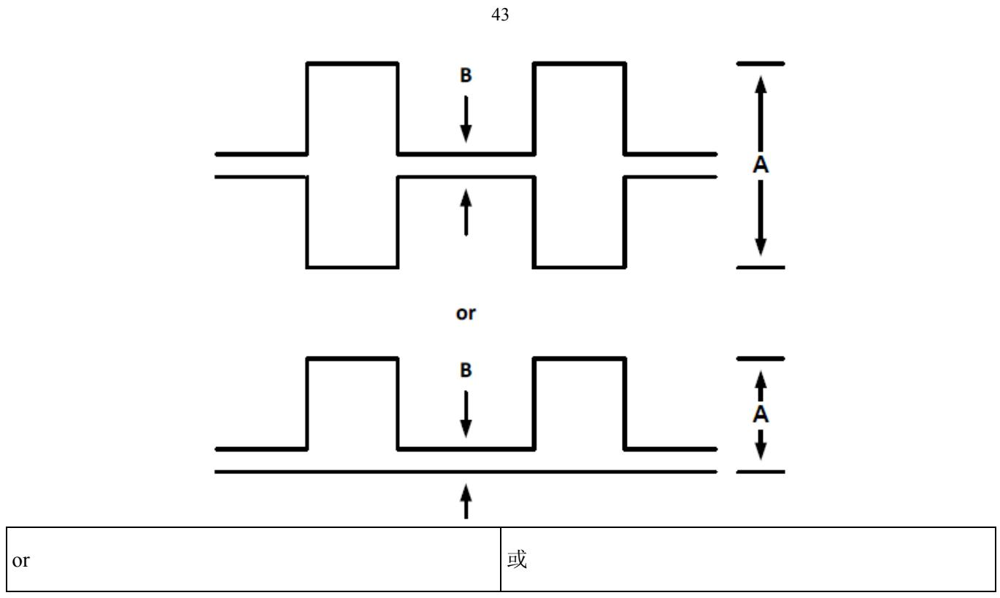  
FIGURE 3-1: DEFINITION OF MODULATION FACTOR  
图3-1：调制系数定义

The frequency of the modulating signal shall sweep "downwards" over a range of at least  $700\mathrm{Hz}$  within the limits of  $1600\mathrm{Hz}$  to  $300\mathrm{Hz}$  with a sweep repetition rate between  $2\mathrm{Hz}$  and  $4\mathrm{Hz}$ .

调制信号的频率应在  $1600\mathrm{Hz}$  至  $300\mathrm{Hz}$  范围内的至少  $700\mathrm{Hz}$  范围内“向下”扫描, 扫描重复频率在  $2\mathrm{Hz}$  至  $4\mathrm{Hz}$  之间。

The modulation signals applied to the carriers shall have a minimum duty cycle of  $33\%$  and a maximum duty cycle of  $55\%$  (see FIGURE 3-2).

对于施加到载波的调制信号，最小占空比和最大占空比应分别为  $33\%$  和  $55\%$  （参见图3-2）。

$$
\text {Duty Cycle} = (\mathrm {A} / \mathrm {B}) \times 100 \%
$$

占空比  $=$  (A/B) x 100%

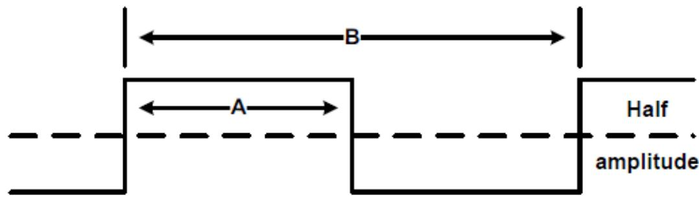

<table><tr><td>Half</td><td>半</td></tr><tr><td>amplitude</td><td>振幅</td></tr></table>

# FIGURE 3-2: DEFINITION OF MODULATION DUTY CYCLE

# 图3-2：调制占空比的定义

# 3.8.3 Emission Characteristics

# 3.8.3 发射特性

3.8.3.1 Type of emission

3.8.3.1 发射类型

The type of emission shall be A3A, as defined in the ITU Radio Regulations, and shall have one of the following characteristics:

按照ITU无线电法规的定义，发射类型应为A3A，并应具有以下任一特征：

a) continuous carrier  
a）连续载波  
b) carrier keyed in such a manner that full power is applied to the antenna for one period, followed by reduced or zero power for a further period.  
b）通过在一个周期内向天线施加全功率，随后在另一周期内降低或零功率的方式键控的载波。

The ON/OFF cycle shall be optimized to allow the precise location of the beacon in all weather conditions and to ensure compatibility with all VHF homing equipment currently in service.

应优化开启/关闭周期，以便在所有天气条件下精确定位信标，并确保与当前使用的所有甚高频归航设备兼容。

If the carrier is keyed to provide an ON/OFF cycle then the minimum duty cycle shall be  $33\%$  and shall meet the following criteria.

如果载波被键控以提供开启/关闭周期，则最小占空比应为  $33\%$  ，并应满足以下标准。

For a  $33\%$  Duty Cycle the transmitter shall be on for a period of not less than 0.75 seconds and then off for not more than 1.5 seconds repeating.

如果占空比为  $33\%$  ，发射机应开启不少于0.75s，然后关闭不少于1.5s。

For duty cycles between  $33\%$  and  $100\%$  the on time shall be increased beyond 0.75 seconds and the off time reduced accordingly. The carrier signal may be further interrupted to permit the transmission of  $406\mathrm{MHz}$  satellite transmissions and/or  $406\mathrm{MHz}$  homing transmissions as defined by Cospas-Sarsat or Morse code transmissions as defined in  $\S 3.8.3.5$ .

如果占空比介于  $33\%$  至  $100\%$  之间，开启时间应增加到超过0.75s，关闭时间应相应减少。载波信号可以被进一步中断，以便开展406MHz卫星传输和/或406MHz归航传输（如Cospas-Sarsat所定义）或莫尔斯码传输（如第3.8.3.5条所定义）。

The homing signal shall not be interrupted or suppressed in the presence of signals from other 406 MHz beacons nor 121.5 MHz beacons.

当存在其他  $406\mathrm{MHz}$  信标或  $121.5\mathrm{Mhz}$  信标的信号时，不应中断或抑制归航信号。

# 3.8.3.2 Sideband Components

# 3.8.3.2 边带分量

The ELT shall have clearly defined sideband components which are symmetric about the output signal spectrum and distinct from the carrier component at both the  $121.5\mathrm{MHz}$  and  $243.0\mathrm{MHz}$  frequencies.

ELT应具有明确界定的边带分量，此类边带分量关于输出信号频谱对称，并且在121.5MHz和  $243.0\mathrm{MHz}$  上均不同于载波分量。

The ELT spectrum at  $121.5\mathrm{MHz}$  shall have at least  $30\%$  of its energy distribution within a bandwidth of plus and minus  $30\mathrm{Hz}$  about a fixed reference frequency corresponding to the carrier component, carrier frequency (fc), over the audio/sweep modulation cycle.

在音频/扫描调制周期内，121.5MHz处ELT频谱在与载波分量对应的固定参考频率（载波频率（fc））周围正负30Hz的带宽内应具有其能量分布的至少  $30\%$  。

At  $243\mathrm{MHz}$ $30\%$  of the energy distribution shall fall within a bandwidth of  $\mathrm{fc} + / - 60~\mathrm{Hz}$

在  $243\mathrm{MHz}$  处， $30\%$  的能量分布应落在  $\mathrm{fc} + / - 60\mathrm{Hz}$  的带宽内。

# 3.8.3.3 Continuous Wave

# 3.8.3.3 连续波

To aid SAR system detection and homing capabilities, the transmission may also provide a period of unmodulated Continuous Wave (CW) power for a duration of 2.0 (+/-0.25) seconds, repeated every 8.0 (+/-0.8) seconds.

为了协助SAR系统检测和归航能力，传输还可以提供持续2.0（+/-0.25）s的未调制连续波（CW）功率周期，每8.0（+/-0.8）s重复一次。

# 3.8.3.4 Voice Modulation

# 3.8.3.4 语音调制

Voice modulation, (ITU-A3E), is permitted provided that its use shall not prejudice the primary function of the beacon and power shall not be consumed at a greater rate than in the beacon mode.

允许语音调制（ITU-A3E），条件是其使用不应损害信标的主要功能，并且功率的消耗速率不应大于信标模式。

Such an ELT unit shall also comply with the following specifications:

此类ELT装置还应符合以下规范：

a) the unit shall be clearly marked to caution operators to use the speech facility only when the rescue craft is seen or heard.  
a）应清楚地标记该装置，以警告操作人员仅可在看到或听到救援船时方能使用语音设备。

b) where a speech facility is provided on  $121.5 / 243\mathrm{MHz}$  the Transmitter/Receiver key shall revert to beacon operation when not actually being keyed for a period of more than 20 seconds.  
b）如果在  $121.5 / 243\mathrm{MHz}$  上设置语音设备，当实际未被键控超过20s时，发射机/接收机键应恢复到信标操作。  
c) where a second auxiliary speech channel is provided, it must operate on  $123.1\mathrm{MHz}$ , (scene of the search frequency) and shall provide the same reversion to Beacon mode on  $121.5 / 243\mathrm{MHz}$  as in b. above.  
c）如果提供了第二个辅助语音信道，其必须在  $123.1\mathrm{MHz}$  （搜索频率的场景）上工作，并在  $121.5 / 243\mathrm{MHz}$  上提供与上述b.相同的信标模式反转。  
d) the operating instructions must warn the user that when the speech facility is used, the homing capability is severely restricted or non-existent.  
d）操作说明必须警告用户，当使用语音设备时，归航能力受到严重限制或不存在。

# 3.8.3.5 Identification Signal

# 3.8.3.5 识别信号

An identification signal is permitted using the International Morse Code. If this option is incorporated,

允许使用国际莫尔斯电码发出识别信号。如果结合该方案，

a) the identification signal shall consist of 5 or 6 letters, (the aircraft registration), at a repetition rate of once per minute;  
a）识别信号应由5或6个字母组成（航空器注册编号），重复频率为每分钟一次；  
b) the carrier shall be modulated ITU-A3A by  $1020(+/-50)\mathrm{Hz}$ ;  
b）载波应由  $1020(+ / - 50)\mathrm{Hz}$  的ITU-A3A调制；  
c) the keying rate shall be as follows.  
c）键控速率应如下所示。

$$
\begin{array}{l} 1 \mathrm {d o t} = 1 1 5 (+ / - 1 0) \mathrm {m s} \\ 1 \text {点} = 1 1 5 (+ / - 1 0) \mathrm {m s} \\ 1 \mathrm {d a s h} = 3 \mathrm {d o t s} \\ \end{array}
$$

1长划  $= 3$  点

$$
\text {s p a c e} = 1 \text {d o t}
$$

莫尔斯数字之间的间隔  $= 1$  点

$$
\text {s p a c e} = 1 \text {d a s h}.
$$

编码字母之间的间隔  $= 1$  长划。

# 3.8.4 Antenna Radiation Characteristics

# 3.8.4天线辐射特性

The fixed antenna and detachable antenna, if provided, shall radiate on 121.5 and the optional frequency of 243.0 MHz. Radiation shall be vertically polarized and omni-directional in the horizontal plane. The foregoing applies only when the antenna is in its normal orientation.

固定天线和可拆式天线（如有）的辐射频率应为121.5，可选频率为  $243.0\mathrm{MHz}$  。辐射应在水平面上垂直极化和全方位。上述仅适用于天线处于正常方向的情况。

# 3.8.5 Effective Isotropic Radiated Power

# 3.8.5有效各向同性辐射功率

The Effective Isotropic Radiated Power (EIRP) shall not be less than  $17\mathrm{dBm}$  ( $50\mathrm{mW}$ ) and not greater than 26 dBm ( $400\mathrm{mW}$ ) on each frequency. The ELT system should meet these requirements for the environment(s) for which the ELT would be expected and designed to operate (e.g. fixed on the fuselage, in water, on dry or wet ground etc.).

各频率上的有效各向同性辐射功率（EIRP）应不小于  $17\mathrm{dBm}$  （ $50\mathrm{mW}$ ）且不大于  $26\mathrm{dBm}$  （ $400\mathrm{mW}$ ）。ELT系统应满足预期和设计ELT运行环境的此类要求（例如：固定在机身上，在水中或在干燥或潮湿地面上）。

# 3.8.6 Endurance

# 3.8.6 耐久性

At the end of the declared useful life of its internal or integral battery, the ELT system shall be capable of continuous homing transmitter operation for at least 48 hours at any temperature within the range  $-55^{\circ}\mathrm{C}$  to  $+70^{\circ}\mathrm{C}$  (Class 0),  $-40^{\circ}\mathrm{C}$  to  $+55^{\circ}\mathrm{C}$  (Class 1) or  $-20^{\circ}\mathrm{C}$  to  $+55^{\circ}\mathrm{C}$  (Class 2) in the transmitting mode that requires the highest power consumption.

ELT系统在其内部或整体电池的声明使用寿命结束时，应能够在要求最高功耗的发射模式下，在-55°C至+70°C（0级）、-40°C至+55°C（1级）或-20°C至+55°C（2级）范围内的任何温度下，使归航发射机连续运行至少48h。

For ELT(AD) in ADFR, ED-155 § 3-1.6.2 and ED-112A § 3-1.8.2 require additional  $121.5\mathrm{MHz}$  transmission time (102 additional hours at  $5\mathrm{mW}$  minimum).

对于 ADFR 中的 ELT（AD），ED-155 第 3-1.6.2 条和 ED-112A 第 3-1.8.2 条要求提供额外  $121.5\mathrm{MHz}$  传输时间（最小  $5\mathrm{mW}$  时额外  $102\mathrm{h}$ ）。

# 3.8.7 Radio Frequency Intermodulation (except for ELT(S))

# 3.8.7 射频互调（ELT（S）除外）

When the ELT unit is in the ARMED mode, the application of any two frequencies in the  $54\mathrm{MHz}$  -  $806\mathrm{MHz}$  band (which shall include  $94\mathrm{MHz}$ ) to the ELT shall not result in re-radiation of a third frequency in the  $108\mathrm{MHz}$  -  $137\mathrm{MHz}$  band which exceeds the levels specified in §3.8.7.1 and §3.8.7.2 below, under the associated specified conditions.

当ELT装置处于装备模式时，在相关规定条件下，将54MHz-806MHz频带（应包括94MHz）中的任何两个频率应用于ELT时，不得导致108MHz-137MHz频带中的第三个频率的再辐射超过下文第3.8.7.1条和第3.8.7.2条中规定的水平。

# 3.8.7.1 Direct Coupling

# 3.8.7.1 直接耦合

With the ELT connected in the configuration shown in FIGURE 3-3, and the levels from each generator into the ELT RF output terminal equal to the levels indicated in TABLE 5-1, the third frequency shall not exceed -83 dBm.

当ELT以图3-3所示的配置连接时，从各发电机进入ELT射频输出端的电平等于表5-1所示的电平，第三频率不得超过-83dBm。

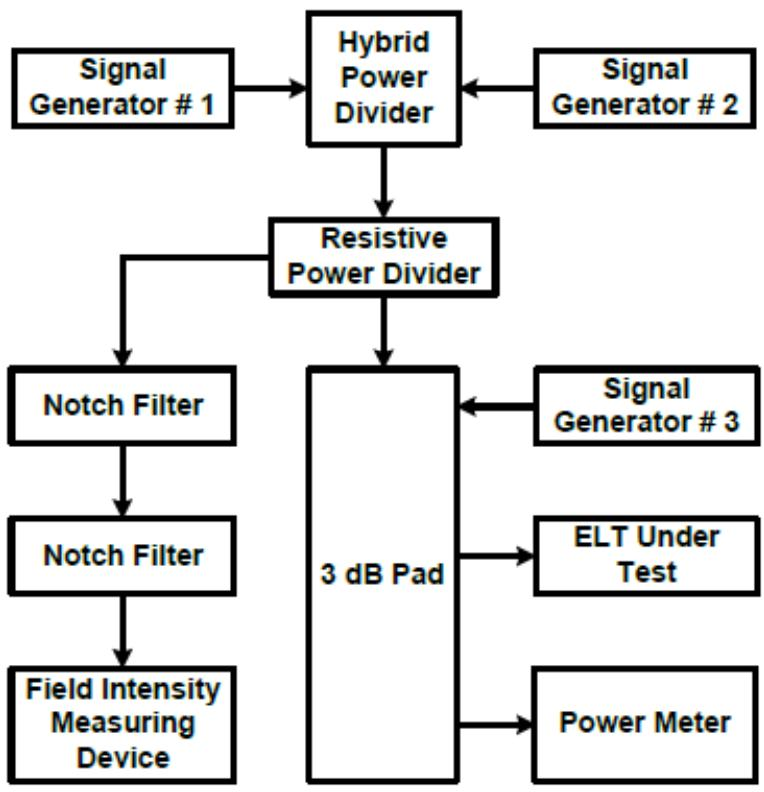

<table><tr><td>Signal Generator # 1</td><td>信号发生器#1</td></tr><tr><td>Hybrid Power Divider</td><td>混合功率分配器</td></tr><tr><td>Signal Generator # 2</td><td>信号发生器#2</td></tr><tr><td>Resistive Power Divider</td><td>电阻功率分配器</td></tr><tr><td>Notch Filter</td><td>陷波滤波器</td></tr><tr><td>Field Intensity Measuring Device</td><td>场强测量装置</td></tr><tr><td>3 dB Pad</td><td>3dB 衬垫</td></tr><tr><td>Signal Generator # 3</td><td>信号发生器#3</td></tr><tr><td>ELT Under Test</td><td>受试 ELT</td></tr><tr><td>Power Meter</td><td>功率计</td></tr></table>

# 3.8.7.2 Radiation Coupling

# 3.8.7.2 辐射耦合

With the ELT mounted in a typical aircraft configuration and the test set-up (see FIGURE 3-4), the application of vertically polarised electro-magnetic fields, which have an electric field intensity equal to the levels, specified in TABLE 5-2, to the external surface of the aircraft test configuration shall not result in a third field with an intensity greater than  $7\mu \mathrm{V} / \mathrm{m}$  in the  $108\mathrm{MHz} - 137\mathrm{MHz}$  band, at a suitable receiving antenna placed  $2\mathrm{m}$  from the ELT antenna.

如果将ELT安装在通用航空器构型和试验装置（参见图3-4）中，将电场强度等于表5-2中规定水平的垂直极化电磁场施加到航空器试验构型的外表面，不应导致在距离ELT天线  $2\mathrm{m}$  的适当接收天线处， $108\mathrm{MHz} - 137\mathrm{MHz}$  频带内出现强度大于  $7\mu \mathrm{V / m}$  的第三场。

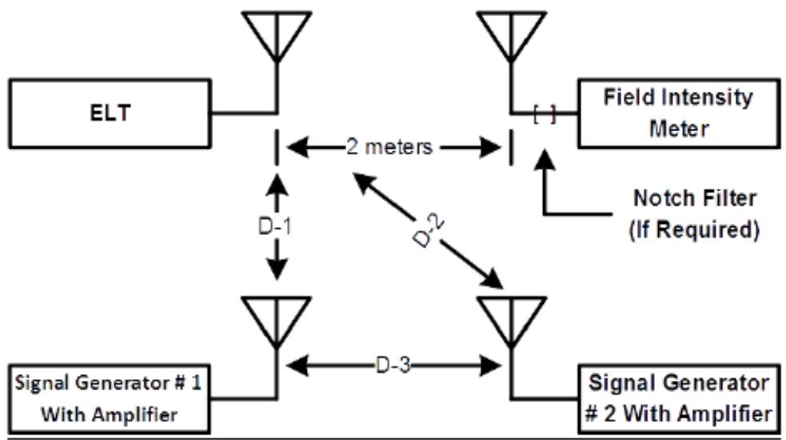  
FIGURE 3-3: ELT RF SUSCEPTIBILITY TEST SET-UP, DIRECT COUPLING METHOD  
图3-3：ELT射频敏感性测试装置，直接耦合法

<table><tr><td>2 meters</td><td>2m</td></tr><tr><td>Field Intensity Meter</td><td>场强计</td></tr><tr><td>Notch Filter (If Required)</td><td>陷波滤波器（如需要）</td></tr></table>

FIGURE 3-4: ELT RF INTERMODULATION TEST SET-UP  

<table><tr><td>Signal Generator #1 With Amplifier</td><td>带放大器的信号发生器#1</td></tr><tr><td>Signal Generator #2 With Amplifier</td><td>带放大器的信号发生器#2</td></tr></table>

图3-4：ELT射频互调测试装置

NOTE: Distances  $D - 1$ ,  $D - 2$  and  $D - 3$  are discretionary.

注：距离D1、D2和D3是任意的。

# 3.8.8 Transmitter Turn-on

# 3.8.8 发射机开启

At the maximum and minimum operating temperatures, the EIRP level at each carrier frequency shall not be less than  $17\mathrm{dBm}$  (50 mW), within 5 minutes following manual or automatic activation.

在最高和最低工作温度下，在手动或自动激活后  $5 \mathrm{~min}$  内，各载波频率下的 EIRP 水平不得小于  $17 \mathrm{~dBm}$ （ $50 \mathrm{~mW}$ ）。

# 3.9 OPTIONAL 406 MHZ HOMING TRANSMITTER

# 3.9 可选  $406\mathrm{MHz}$  归航发射机

Cospas-Sarsat compliant ELTs may optionally include a  $406\mathrm{MHz}$  homing transmitter, if present it shall comply with the requirements in C/S T.001 or T.018 as applicable. At the end of the declared useful life of its internal or integral battery, the ELT system shall be capable of continuous operation of the  $406\mathrm{MHz}$  homing transmitter for at least 48 hours at any temperature within the range  $-55^{\circ}\mathrm{C}$  to  $+70^{\circ}\mathrm{C}$  (Class 0),  $-40^{\circ}\mathrm{C}$  to  $+55^{\circ}\mathrm{C}$  (Class 1) or  $-20^{\circ}\mathrm{C}$  to  $+55^{\circ}\mathrm{C}$  (Class 2) in the transmitting mode that requires the highest power consumption.

符合Cospas-Sarsat标准的ELT可包括  $406\mathrm{MHz}$  归航发射机，如有，应符合C/S T.001或T.018中的要求（如适用）。ELT系统在其内部或整体电池的声明使用寿命结束时，应能够在要求最高功耗的发射模式下，在  $-55^{\circ}\mathrm{C}$  至  $+70^{\circ}\mathrm{C}$  （0级）、  $-40^{\circ}\mathrm{C}$  至  $+55^{\circ}\mathrm{C}$  （1级）或  $-20^{\circ}\mathrm{C}$  至  $+55^{\circ}\mathrm{C}$  （2级）范围内的任何温度下，使  $406\mathrm{MHz}$  归航发射机连续运行至少  $48\mathrm{h}$  。

# 3.10 MARKING

# 3.10 标记

The ELT unit shall be marked with its type, capability ID code as defined in § 1.3, and for ELT(S) with its category. The mark shall identify the applicable capabilities in a concatenated string in the order as the codes are presented in the TABLE 1-1. For example, a first generation ELT(AF) with GNSS, 121.5 homing will have on the mark ELT(AF) T.001/G/H1/C.

ELT 装置应标有其类型、第 1.3 条中定义的能力 ID 代码，ELT（S）应标有其类别。该标记应按照表 1-1 中给出的代码顺序识别连续字符串中的适用能力。例如，对于装有 GNSS 的第一代 ELT（AF），121.5 归航将标有 ELT（AF）T.001/G/H1/C。

If the ELT system contains a crash sensor, the component of the ELT system containing the crash sensor shall be clearly marked by the ELT manufacturer to indicate the correct installation orientation(s), if appropriate, for crash sensing.

如果ELT系统设有坠机传感器，则ELT制造商应清楚标记设有坠机传感器的ELT系统部件，以指示正确的安装方向（如适用），用于碰撞感测。

NOTE: Additional marking specifications are defined in § 3.3.3 for batteries, § 2.9.1.1 for ELT(AF), § 2.9.2.1 for ELT(AP), § 2.9.3.2 for ELT(S), § 2.9.5.1.1 for ELT(DT), § 3.8.2 and § 3.8.3.4 for voice modulation.

关于附加标记规范，参见第3.3.3条（电池）、第2.9.1.1条（ELT（AF)）、第2.9.2.1条（ELT（AP)）、第2.9.3.2条（ELT(S)）、第2.9.5.1.1条（ELT(DT)）以及第3.8.2条和第3.8.3.4条（语音调制）。

Instructions for disabling the ELT unit for storage or disposal shall be clearly and simply presented on the outside of the ELT case. For all ELT(AF), (AP), (DT) and (S) type units, clear instructions for use shall also be marked on the unit.

应在ELT箱外侧清楚简单地给出禁用ELT装置进行储存或处置的说明。对于所有ELT（AF）、（AP）、（DT）和（S）型装置，还应在装置上清楚标注使用说明。

# 3.11 CASE DESIGN, ATTACHMENT AND COLOUR

# 3.11 外壳设计、附件和颜色

The exterior of the ELT system components shall have no sharp edges or projections which could damage inflatable survival equipment or injure persons.

ELT系统部件的外部不得存在可能损坏充气救生设备或伤害人员的锐边或突出部分。

ELT controls shall be protected to minimise the risk of inadvertent activation of the ELT and the possibility that flying debris during a crash, or passengers and crew evacuation following a crash, will deactivate the ELT.

应保护ELT控制装置，以尽可能降低ELT无意激活的风险以及碰撞期间飞行碎片或碰撞后乘客和机组人员疏散会使ELT停用的可能性。

All ELT units shall be predominantly of a high visibility yellow or orange colour, except for those portions of ELT(AD) units that are on the exterior surface of the aircraft.

所有ELT装置应主要为高能见度黄色或橙色，但ELT（AD）装置位于航空器外表面上的部分除外。

Except for ELT(S), the equipment shall have a means of attachment so that the ELT will withstand the tests contained in § 4.5.8 and § 4.5.9.3 in all directions without breaking loose from the mounts, damaging the equipment, or otherwise causing the ELT not to activate. The means to attach the ELT to the aircraft can include a separate bracket or mount. The bracket or mount is part of the ELT system and shall be attached to the ELT unit for all testing which is applicable. The mechanism for attaching the ELT to the bracket or mount shall not be of a hook and loop fasteners type.

除ELT（S）外，设备应装有连接装置，以便ELT能够在所有方向上承受第4.5.8条和第4.5.9.3条中包含的试验，而不会从支架上松脱、损坏设备或导致ELT无法激活。将ELT附接到航空器的装置可包括单独

的支架或安装架。支架或安装架是 ELT 系统的一部分，应附在 ELT 装置上，以便进行所有适用的试验。将 ELT 连接到支架或安装架上的机构不得为钩环紧固件类型。

# 3.12 INSTALLATION MANUAL

# 3.12 安装手册

The ELT manufacturer shall provide an installation manual which includes at a minimum, the ELT's type, class and capabilities designations, a description of the ELT's operational capabilities, installation instructions and any additional information regarding the installation and operation of the ELT which is necessary to ensure compliance with this MOPS.

ELT制造商应提供安装手册，其中至少应包括ELT的类型、等级和能力名称、ELT的运行能力说明、安装说明以及确保符合本MOPS所必需的ELT安装和操作的任何附加信息。

The Installation Manual shall list the applicable version of the COSPAS-SARSAT beacon standards.

安装手册应列出COSPAS-SARSAT信标标准的适用版本。

# CHAPTER 4

# 第4章

# MINIMUM PERFORMANCE SPECIFICATIONS UNDER ENVIRONMENTAL TEST CONDITIONS

# 环境试验条件下的最低性能规范

# 4.1 INTRODUCTION

# 4.1简介

The environmental tests and performance specifications described in this chapter provide a laboratory means of determining the overall performance characteristics of the ELT system under conditions representative of those which may be encountered in actual operation.

本章所述的环境试验和性能规范提供了一种实验室方法，即根据实际工作中可能遇到的典型情况，确定ELT系统的总体性能特征。

Unless otherwise specified, the test procedures applicable to the determination of ELT system performance under environmental test conditions are contained in document EUROCAE ED-14G/RTCA DO-160G, "Environmental Conditions and Test Procedures for Airborne Equipment". Where this applies, reference is made to the relevant section of ED-14G/DO-160G.

除非另有规定，否则确定环境试验条件下ELT系统性能的适用测试程序载于文件EUROCAE ED-14G/RTCA DO-160G“机载设备的环境条件和测试程序”。如适用，请参阅ED-14G/DO-160G的相关章节。

Some of the environmental tests contained in this chapter do not have to be performed unless the manufacturer wishes to qualify the ELT system for that particular environmental condition. These tests are identified by the word "Optional". If the manufacturer wishes to qualify the ELT system to these additional environmental conditions, then these "Optional" tests shall be performed.

本章中的一些环境试验无需执行，除非制造商希望 ELT 系统符合特定的环境条件。这些试验被标识为“可选”。如果制造商希望 ELT 系统符合这些额外的环境条件，则应执行这些“可选”试验。

Some of the test procedures required by this chapter are additional to, or different from, those specified in ED-14G/DO-160G. In these cases, the test procedures are described and marked "(SPECIAL)".

本章所要求的一些测试程序是ED-14G/DO-160G中所指定测试程序的附加部分，或者是不同的。在这些情况下，将测试程序描述并标记为“（专用）”。

a). Individual approval authorities may require that some of the tests in this chapter be performed at a Cospas-Sarsat approved test facility in order to obtain a Cospas-Sarsat "type approval".  
a)个别审批机构可能要求在 Cospas-Sarsat 认可的测试机构开展本章中的一些测试,以获得 Cospas-Sarsat“型号批准”。  
b). In addition, the Cospas-Sarsat approved test facility may conduct a qualitative performance test of the ELT by transmitting to selected Cospas-Sarsat satellites; this may require the submission of a second test unit.  
b）此外，Cospas-Sarsat认可的测试机构可以通过传送到选定的Cospas-Sarsat卫星，对ELT进行定性性能测试；这可能需要提交第二套测试装置。

c). Although the tests in this chapter are compatible with those specified in C/S T.007 for first generation ELTs or C/S T.021 for second generation ELTs, some of the following test procedures and conditions are more rigorous than the Cospas- Sarsat equivalents and ELTs must be tested to the standards specified in this Minimum Operational Performance Specification.  
c）虽然本章中的测试与 C/S T.007 中的第一代 ELT 或 C/S T.021 中的第二代 ELT 指定测试兼容，但是下面的一些测试程序和条件比 Cospas-Sarsat 测试程序和条件更加严格，ELT 必须通过测试，达到最低工作性能规范规定的标准。

# 4.1.1 ELT(AD) in ADFR

# 4.1.1 ADFR 中的 ELT（AD）

ELT(AD) embedded in ADFR are also required to meet the requirements of ED-112A section 3, in particular the sequence of test § 3-1.8.1.a.III or ED-155 section 3, in particular the sequence of tests described in § 2-1.14.3.

在 ADFR 中嵌入的 ELT（AD）也需要满足 ED-112A 第 3 节的要求，尤其是第 3-1.8.1.a.III 条或 ED-155 第 3 节中的测试顺序以及第 2-1.14.3 条所述的测试顺序。

# 4.2 REQUIREMENTS

# 4.2要求

Specific environmental requirements pertaining to the ELT system and its components are defined within this section. A list of the required environmental tests and whether they are mandatory or optional and details of the standards to be applied can be found in TABLE 4-1. Tests are grouped into two parts Group A and Group B. Group A tests may be performed in any order or combination and more than one test unit may be used. Group B tests must be performed on a single unit in the order shown. Environmental test procedures for ELT(DT)s without crash survivability are defined in § 4.6.

本节明确了与ELT系统及其部件有关的具体环境要求。表4-1列出了必要的环境试验清单，说明了它们是必选项还是可选项，并详述了适用的标准。试验分为A组和B组。A组试验可以按照任何顺序或组合进行，而且可以使用多个试验装置。B组试验必须按照所示顺序在单个装置上执行。对于无坠机幸存能力的ELT（DT），其环境试验程序详见第4.6条。

表 4-1: 必要的环境试验  
TABLE 4-1: REQUIRED ENVIRONMENTAL TEST  

<table><tr><td>Environmental Test
环境试验</td><td>ED-14G/
DO-160G Ref.
Section
ED-14G/DO-160G
参考章节</td><td>Alternative source for test procedure
测试程序的替代来源</td><td>Required Environmental Test
必要的环境试验</td></tr><tr><td>Temperature
温度</td><td>N/A
不适用</td><td>§ 4.4.1.1 and § 4.4.1.2This document
本文第4.4.1.1条和第4.4.1.2条</td><td>Yes
是</td></tr><tr><td>Altitude
高度</td><td>N/A
不适用</td><td>§ 4.4.1.3 This document
本文第4.4.1.3条</td><td>Yes
是</td></tr><tr><td>Decompression
减压</td><td>N/A
不适用</td><td>§ 4.4.2 This document
本文第4.4.2条</td><td>Yes except for ELT(AD)
是,ELT(AD)除外</td></tr><tr><td>Overpressure
超压</td><td>4.6.3</td><td>N/A
不适用</td><td>Yes except for ELT(AD)
是,ELT(AD)除外</td></tr><tr><td>Temperature Variation
温度变化</td><td>5.0 - Category B
5.0——B类</td><td>§ 4.4.1.4 This document
本文第4.4.1.4条</td><td>Yes
是</td></tr><tr><td>Humidity
湿度</td><td>6.0</td><td>N/A
不适用</td><td>Yes
是</td></tr><tr><td>Shock
冲击</td><td>N/A
不适用</td><td>§ 4.5.9 This document
本文第4.5.9条</td><td>Yes
是</td></tr><tr><td>Crash Safety
坠机安全性</td><td>N/A
不适用</td><td>§ 4.5.9.4 This document
本文第4.5.9.4条</td><td>Yes
是</td></tr><tr><td>Vibration
振动</td><td>8.0 - Standard and robust
8.0——标准与强</td><td>§ 4.5.8 This document
本文第4.5.8条</td><td>Yes
是</td></tr><tr><td></td><td>烈</td><td></td><td></td></tr><tr><td>Explosive Atmosphere
爆炸性空气</td><td>9.0</td><td>N/A
不适用</td><td>Optional
可选</td></tr><tr><td>Waterproofness
防水性</td><td>10.0</td><td>§ 4.5.3 This document
本文第 4.5.3 条</td><td>Yes
是</td></tr><tr><td>Fluids Susceptibility
流体敏感性</td><td>11.0</td><td>N/A
不适用</td><td>Yes for ELT(AD) and external
antennas
对ELT（AD）和外部天线而
言，是</td></tr><tr><td>Sand and Dust
沙尘</td><td>12.0 Category S
12.0 S类</td><td>N/A
不适用</td><td>Optional except ELT(AD)
可选，ELT（AD）除外</td></tr><tr><td>Fungus Resistance
防霉性</td><td>13.0</td><td>N/A
不适用</td><td>Optional except ELT(AD)
可选，ELT（AD）除外</td></tr><tr><td>Salt Fog
盐雾</td><td>14.0</td><td>N/A
不适用</td><td>Yes
是</td></tr><tr><td>Magnetic Effect
磁效应</td><td>15.0</td><td>N/A
不适用</td><td>Yes
是</td></tr><tr><td>Power Input
功率输入</td><td>16.0</td><td>N/A
不适用</td><td>Yes except for ELT(S)
是，ELT（S）除外</td></tr><tr><td>Voltage Spike
电压尖峰</td><td>17.0</td><td>N/A
不适用</td><td>Yes except for ELT(S)
是，ELT（S）除外</td></tr><tr><td>Audio Frequency Conducted
Susceptibility
音频传导敏感性</td><td>18.0</td><td>N/A
不适用</td><td>Yes except for ELT(S)
是，ELT（S）除外</td></tr><tr><td>Induced Signal Susceptibility
感应信号敏感性</td><td>19.0</td><td>N/A
不适用</td><td>Yes
是</td></tr><tr><td>Radio Frequency Susceptibility
射频敏感性</td><td>20.0 - Category TR
20.0——TR类</td><td>N/A
不适用</td><td>Yes
是</td></tr><tr><td>Emission of Radio Frequency Energy
射频能量发射</td><td>21.0 - Category H
21.0——H类</td><td>N/A
不适用</td><td>Yes
是</td></tr><tr><td>Lightning Induced Transient Susceptibility
雷电感应瞬变敏感性</td><td>22.0</td><td>N/A
不适用</td><td>Yes except for ELT(S)
是,ELT(S)除外</td></tr><tr><td>Lightning Direct Effects
雷电直接效应</td><td>23.0</td><td>Special Considerations for Antenna
天线的特别注意事项</td><td>Yes for ELT(AD) and external antennas
对ELT(AD)和外部天线而言,是</td></tr><tr><td>Icing
结冰</td><td>24.0</td><td>Special Considerations for Antenna
天线的特别注意事项</td><td>Yes for ELT(AD) and external antennas
对ELT(AD)和外部天线而言,是</td></tr><tr><td>Electrostatic Discharge (ESD)
静电放电(ESD)</td><td>25.0 - Category A
25.0——A类</td><td>N/A
不适用</td><td>Yes
是</td></tr><tr><td>Flammability
可燃性</td><td>26.0 - Category C
26.0——C类</td><td>N/A
不适用</td><td>Yes
是</td></tr><tr><td>Environmental Test
环境试验</td><td>ED-14G/
DO-160G Ref.
Section
ED-14G/DO-160G
参考章节</td><td>Alternative source for test procedure
测试程序的替代来源</td><td>Required Environmental Test
必要的环境试验</td></tr><tr><td>Triboelectric effects (external Antenna)
摩擦电效应(外部天线)</td><td>N/A
不适用</td><td>§ 4.4.16 This document
本文第4.4.16条</td><td>Yes
是</td></tr><tr><td>Impact
冲击</td><td>N/A
不适用</td><td>§ 4.5.10 &amp; § 4.5.11 This document
本文第4.5.10条和第4.5.11条</td><td>Yes
是</td></tr><tr><td>Crush
碎裂</td><td>N/A
不适用</td><td>§ 4.5.12 This document
本文第4.5.12条</td><td>Yes
是</td></tr><tr><td>Flame
火焰</td><td>N/A
不适用</td><td>§ 4.5.13 This document
本文第4.5.13条</td><td>Yes
是</td></tr><tr><td>Fire
火灾</td><td>N/A
不适用</td><td>§ 4.5.14 This document
本文第4.5.14条</td><td>Optional except for ELT(AD)
in ADFR
可选, ADFR中的ELT(AD)除外</td></tr><tr><td>Post-crash Immersion
坠机后沉没</td><td>14.3.4</td><td>§ 4.5.15 This document
本文第4.5.15条</td><td>Optional for ELT(AF) and ELT(DT)
可选, ELT(AF)和ELT(DT)</td></tr><tr><td>Buoyancy
浮力</td><td>N/A
不适用</td><td>§ 4.5.16 This document
本文第4.5.16条</td><td>ELT(AD),(AP),(S) Category A
ELT (AD)、(AP)、(S) A类</td></tr><tr><td>Water Sensor
水传感器</td><td>N/A
不适用</td><td>§ 4.5.16 This document
本文第4.5.16条</td><td>ELT(AD)
ELT (AD)</td></tr></table>

# 4.2.1 Temperature and Altitude Ranges

# 4.2.1 温度和高度范围

Three temperature classes of ELT (Classes 0, 1 and 2) described in this document are consistent with the Cospas-Sarsat specifications as described in C/S T.001 for first generation ELTs and C/S T.018 for second generation ELTs.

本文所述的三种ELT温度类别（0类、1类和2类）符合C/S T.001第一代ELT和C/S T.018第二代ELT的Cospas-Sarsat规范。

The ELT shall meet the performance requirements of one of the following classes:

ELT应满足下面其中一个类别的性能要求：

<table><tr><td></td><td>Class 0</td><td>Class 1</td><td>Class 2</td></tr><tr><td></td><td>0类</td><td>1类</td><td>2类</td></tr><tr><td>Low Operating Temperature</td><td>-55°C</td><td>-40°C</td><td>-20°C</td></tr><tr><td>低工作温度</td><td></td><td></td><td></td></tr><tr><td>High Operating Temperature</td><td>+70°C</td><td>+55°C</td><td>+55°C</td></tr><tr><td>高工作温度</td><td></td><td></td><td></td></tr></table>

The ELT shall meet the following temperature and altitude requirements:

ELT应满足下列温度和高度要求：

Non-operating survival Temperature range -55°C to +85°C

非工作生存温度范围 -55°C 至+85°C

High Operating Altitude 10700m (35000ft)

高层工作高度

High Operating Altitude for ELT(DT) 15200m (50000ft)

ELT（DT）高层工作高度

High Non-operating Altitude 15200m (50000ft)

高层非工作高度

# 4.2.2 Waterproofness

# 4.2.2 防水性

The ELT unit, exclusive of water-activated batteries, shall be waterproof.

ELT装置应是防水的，但不包括水激活电池。

NOTE: The waterproof-test is detailed in § 4.5.3 Post-crash immersion in Salt Water

注：防水性能测试详见第4.5.3条坠机后沉入盐水

The ELT unit performance shall not be affected after it has been totally immersed in salt water (Except for ELT(AF) and ELT(DT)).

ELT装置完全沉入盐水后，其性能不得受到影响（ELT（AF）和ELT（DT）除外）。

NOTE: The Immersion Test-Salt Water is accomplished in Post-Crash Immersion, § 4.5.15.

注：根据第4.5.15条坠机后沉没，执行沉入盐水试验。

# 4.2.3 Fire Resistance

# 4.2.3 耐火性

The ELT system components shall be capable of withstanding exposure to fire or flame to a degree at least as represented by the Flame Test of Chapter 4, § 4.5.13. The remote control and indicators are excluded from this requirement.

ELT系统部件应具有耐火性或阻燃性，至少可以达到第4章第4.5.13条火焰试验描述的程度。远程控制器和指示器无需满足该项要求。

Utilization of a fire sleeve as a means of providing thermal protection for the antenna cable during testing is recommended. Fire sleeves used to protect the external antenna cable shall meet or exceed the requirements of ISO 2685 (Category "Fire resistant), SAE AS1072/AS1055 (construction/performance) or EN 6049-009.

建议在试验期间使用一个防火套管，以便为天线电缆提供热保护。保护外部天线电缆的防火套管应满足或高于ISO2685（“耐火”类）、SAEAS1072/AS1055（结构/性能）或EN6049-009的要求。

Two levels of test are prescribed for all ELT types:

所有类型的ELT均设有两级试验：

a). Flame Test  
a）火焰试验  
b). Fire Test (Optional, except for ELT(AD) in ADFR).  
b）防火试验（可选，ADFR中的ELT（AD）除外）。

# 4.2.4 Grouping of Tests

# 4.2.4 试验分组

Two groups of tests are specified: A and B. These groups are intended to represent the environmental situations likely to be experienced by an ELT system, and the order in which they will occur.

指定两组试验：A组和B组。这两组试验旨在呈现ELT系统可能经历的环境状况和发生的顺序。

ELT(DT) systems without crash survivability capability do not have to withstand the crash conditions. They do need to operate without adverse effect on the aircraft operation, withstand the normal flight conditions, and

operate in the degraded environmental conditions experienced between the detection of the distress condition and the crash. As a result, the tests for ELT(DT) systems without crash survivability capability are detailed in TABLE 4-5.

对于无坠机幸存能力的ELT（DT）系统，其无需经受坠机条件。它们确实需要在不对航空器运行产生不利影响的情况下工作，需要经受正常的飞行条件，而且需要在探测到遇险情况后和坠机前这段时间内经历的退化环境条件下工作。因此，无坠机幸存能力的ELT（DT）系统试验详见表4-5。

The tests for the ELT(DT) system with crash survivability capability are detailed in TABLE 4-1, except for the crash sensor test when not implemented.

表4-1详细说明了具有坠机幸存能力的ELT（DT）系统试验，但未执行时的坠机传感器试验除外。

NOTE: When ELT(DT) is referred to in the tests description (§ 4.4 and § 4.5), this refers to ELT(DT) with crash survivability capability.  
注:

当在试验描述中提及ELT（DT）时（第4.4条和第4.5条），它是指具有坠机幸存能力的ELT（DT）。

The groups of tests are as follows.

试验分组如下。

4.2.4.1 Group A

4.2.4.1A组

Low Temperature (Activation), High Temperature (Activation), Altitude, Temperature Variation, Decompression, Overpressure, Magnetic Effect, Power Input, Voltage Spike, Audio Frequency Conducted Susceptibility, Induced Signal Susceptibility, Radio Frequency Susceptibility, Lightning Induced Transient Susceptibility, Lightning Induced Transient Susceptibility - Injection Test, Lightning Direct Effects, Emission of Radio Frequency Energy, Explosive Atmosphere, Icing, Flammability, Triboelectric effects, Water sensor.

低温（激活）、高温（激活）、高度、温度变化、减压、超压、磁效应、功率输入、电压尖峰、音频传导敏感性、感应信号敏感性、射频敏感性、雷电感应瞬变敏感性、雷电感应瞬变敏感性——喷射试验、雷电直接效应、射频能量发射、爆炸性空气、结冰、可燃性、摩擦电效应、水传感器。

4.2.4.2 Group B

4.2.4.2 B组

Electrostatic Discharge, Humidity, Waterproofness, Fluids Susceptibility, Fungus Resistance, Sand and Dust, Salt Fog, Vibration, Shock, Impact, Crush, Flame, Fire, Post-Crash Immersion, Buoyancy.

静电放电、湿度、防水性、流体敏感性、防霉性、沙尘、盐雾、振动、冲击、撞击、碎裂、火焰、火灾、坠机后沉没、浮力。

# 4.3 TEST PROCEDURES AND METHODS (EXCEPT ELT(DT) WITHOUT CRASH SURVIVABILITY)

# 4.3 测试程序和方法（无坠机幸存能力的ELT（DT）除外）

Unless otherwise specified the temperatures quoted in this document have a tolerance of  $+/-3^{\circ}$  C. When the term "allowed to stabilise" is used, it means that the ELT system shall have been exposed to the appropriate temperature for at least 2 hours.

除非另有说明，否则本文所述温差为  $+/-3^{\circ}\mathrm{C}$  。当使用“可以稳定”时，表明ELT系统应该已经在适当的温度条件下至少保持了2个小时。

To ensure satisfaction of the specifications of  $\S 4.2.4$ , an ELT unit or ELT system designed to this Minimum Operational Performance Specification shall be subjected to the required sequence of environmental tests and conditions specified in this chapter.

为了确保符合第4.2.4条的规范要求，根据最低工作性能规范设计的ELT装置或ELT系统应遵循本章规定的环境试验顺序和条件。

The following test procedures will specify whether they are to be applied to the ELT unit, the complete ELT system, or individual ELT system components.

以下测试程序将说明它们是否适用于ELT装置、完整的ELT系统或单独的ELT系统部件。

Where tests require either the performance of the ELT system to be verified or the aliveness test to be carried out then the antenna should be disconnected from the ELT unit and the measurement equipment connected to the ELT unit output instead.

如果在测试期间需要验证 ELT 系统的性能或进行活力测试，则应将天线与 ELT 装置断开，并将测量设备连接到 ELT 装置的输出端。

Antenna performance, where required to be verified, is always achieved by performing a VSWR test before the test and again during or after the test.

在需要验证的情况下，在测试前以及测试期间或测试后开展的 VSWR 测试，应始终能够达到天线性能。

# 4.3.1 Aliveness test

# 4.3.1 活力测试

For each environmental test, whether the procedure to be used is the standard procedure from EUROCAE ED-14G/RTCA DO-160G or a custom procedure as described below, the "applicable equipment performance standards" are listed. An aliveness test measuring the nominal carrier frequency and the RF output power of the unit under test shall be performed as designated in the test specification. When performing the aliveness test, the carrier frequency measurement may be made on a single burst of the total 406 MHz transmission. The aliveness test is comprised of the following verifications:

对于每个环境试验而言，无论使用的是EUROCAE ED-14G/RTCA DO-160G标准程序，还是下文所述的自定义程序，均应列出“适用的设备性能标准”。按照测试规范的规定进行活力测试，测量受试装置的标称载波频率和射频输出功率。在进行活力测试时，可在总计  $406\mathrm{MHz}$  的单一突发传输时测量载波频率。活力测试包括以下验证项目：

a). the nominal 406 MHz carrier frequency  $\S 3.7$  
a）第3.7条  $406\mathrm{MHz}$  标称载波频率  
b). the 406 MHz RF output power  $\S 3.7$  
b）第3.7条  $406\mathrm{MHz}$  射频输出功率  
c). the nominal homing signal carrier frequency § 3.1.1 and § 3.2 as applicable  
c）第3.1.1条和第3.2条标称归航信号载波频率，如果适用  
d). the homing signal RF output power  $\S 3.8.5$  and  $\S 3.2$  as applicable  
d）第3.8.5条和第3.2条归航信号射频输出功率，如果适用  
e). Self-Test  $\S 3.2$  
e）第3.2条自检  
f). Remote Control and Monitoring System § 3.1.2  
f）第3.1.2条远程控制监测系统  
g). VSWR § 4.3.1.1  
g）第4.3.1.1条VSWR  
h). Encoded message data and structure § 3.7 including, when applicable, acquired position from a GNSS signal that is representative of the received signal strength at sea level.  
h）第3.7条编码消息数据和结构，在适用时，包括从GNSS信号中获取的位置，该信号代表接收到的海平面信号强度。  
i). Correct deployment for ELT(AD) when the deployment sensor is stimulated.  
i）当模拟展开传感器时，正确展开ELT（AD）。

An inability to meet the above specifications or failure of any tests required by the test procedures should be considered a critical failure. The test should be terminated, the failure analysed, corrected and the ELT system retested.

若不能满足上述规范，或测试程序所要求的任何测试失败，则应被视为是严重失败。试验应该终止，然后分析和纠正失败情况，重新进行ELT系统试验。

NOTE: The homing signal RF output power (as required by § 4.3.1 d above) shall be measured into a 50 Ohm load prior to commencing any testing. The measured power level shall then be used as a reference for comparison whenever an aliveness test of homing signal RF output power is required. Subsequent measurements of the homing signal RF output power shall be within +/- 1 dB of the initial reference level.

在任何试验开始之前，应测量归航信号射频输出功率（如上文第4.3.1d条规定），确保达到50Ohm的负载。然后，当需要对归航信号射频输出功率进行活力测试时，将测得的功率级作为比较基准。后续测得的归航信号射频输出功率应在初始基准水平的+/-1dB范围内。

# 4.3. 1.1 Voltage Standing Wave Ratio Test

# 4.3.1.1 电压驻波比试验

The Voltage Standing Wave Ratio (VSWR) test below applies to all of the following ELT System Components:

下面的电压驻波比（VSWR）试验适用于以下所有ELT系统部件：

Auxiliary Antennas  
辅助天线  
. Detachable Antennas  
可拆式天线  
External Antennas  
外部天线  
Coaxial Cables for External Antennas.  
外部天线的同轴电缆。

Whenever an Aliveness Test as defined in § 4.3.1 is required, the VSWR part of that test shall be carried out in accordance with this procedure. The VSWR of the Antennas and Cable shall be measured separately at a frequency of  $406.030\mathrm{MHz} + / - 50\mathrm{kHz}$  using any suitable item of VSWR test equipment capable of determining VSWR Ratios of between 1:1 and 3:1 to an accuracy of better than  $+ / - 0.05$  Rho.

当需要进行第 4.3.1 条规定的活力测试时，应根据该程序进行 VSWR 部分的测试。以  $406.030\mathrm{MHz} + / - 50\mathrm{kHz}$  的频率，分别测量天线和电缆的 VSWR，使用任何合适的 VSWR 测试设备，确保能够测定 1:1 和 3:1 之间的 VSWR 比值，精度优于  $+ / - 0.05\mathrm{Rho}$  。

The coaxial cable shall be terminated with a  $50\Omega$  or  $75\Omega$  dummy load as appropriate and the VSWR of the cable and any related connectors shall be measured, the VSWR of the cable shall be less than 1.3:1.

同轴电缆应视情况连接到  $50\Omega$  或  $75\Omega$  的虚拟负载终端，测量电缆和任何相关连接器的VSWR，电缆的VSWR应小于1.3:1。

The Antenna shall be mounted in the configuration set up required for the respective test and the VSWR shall be measured both before the test is started and again either during the test or at the end of the test as required. The variation in the VSWR of the antenna between the first and second measurements shall not exceed a difference of 0.4 VSWR (e.g. if the VSWR measured at the start of the test is 1.40:1 then to pass it must measure between 1.00:1 and 1.80:1 at the end of the test).

按照各自测试所需的配置安装天线。根据需要，在测试开始前以及测试期间或测试结束时测量VSWR。天线在第一次和第二次测量之间的VSWR变化不得超过0.4VSWR之差（如：若测试开始时测量的VSWR为1.40:1，那么在测试结束时测量的结果须在1.00:1和1.80:1之间）。

# 4.3.2 Order of Tests (see TABLE 4-2)

# 4.3.2 试验顺序（参见表4-2）

To ensure the satisfaction of the specifications of  $\S 4.2.4$ , the order and nature of the environmental test groups is of prime importance and must be observed.

为了确保符合第4.2.4条中的规范，环境试验分组的顺序和性质至关重要，必须遵守。

Within the tests in group A, the individual tests may be performed in any order or combination (see ED-14G/DO-160G, Section 3). More than one unit may be used.

在 A 组试验中，个别试验可以按照任何顺序或组合执行（参见 ED-14G/DO-160G 第 3 节）。可以使用多个装置。

Within the tests in group B, the individual tests must be performed in the specified order on a single unit.

在B组试验中，个别试验必须按照指定的顺序在单个装置上执行。

If the ELT to be tested has either an Internal or Integral Antenna, a specially modified ELT Unit shall be provided with an RF output port for Aliveness Testing.

如果待测试的 ELT 有内部天线或整体天线，那么经过特别改装的 ELT 装置应配备射频输出端口，用于活力测试。

表 4-2: 环境试验顺序  
TABLE 4-2: ENVIRONMENTAL TEST SEQUENCE  

<table><tr><td rowspan="2">Test Procedure Paragraph 测试程序条款</td><td rowspan="2">DESCRIPTION
描述</td><td colspan="6">Test Applicability
测试适用性</td></tr><tr><td>AF</td><td>AP</td><td>S</td><td>AD not in ADFR ADFR外的AD</td><td>AD in ADFR ADFR内的AD</td><td>DT with C含C的DT</td></tr><tr><td colspan="8">GROUP A TESTS
A组试验
The following tests may be performed in any order or combination convenient to the manufacturer. More than one unit may be used.
下列试验可以按照制造商方便的任何顺序或组合执行。可以使用多个装置。</td></tr><tr><td>§4.4.1.1</td><td>Low Temperature Activation
低温激活</td><td>X</td><td>X</td><td>X</td><td>X</td><td>X</td><td>X</td></tr><tr><td>§4.4.1.2</td><td>High Temperature Activation
高温激活</td><td>X</td><td>X</td><td>X</td><td>X</td><td>X</td><td>X</td></tr><tr><td>§4.4.1.3</td><td>Altitude</td><td>X</td><td>X</td><td>X</td><td>X</td><td>X</td><td>X</td></tr><tr><td></td><td>高度</td><td></td><td></td><td></td><td></td><td></td><td></td></tr><tr><td>§4.4.1.3</td><td>Temperature Variation
温度变化</td><td>X</td><td>X</td><td>O</td><td>X</td><td>X</td><td>X</td></tr><tr><td>§4.4.2</td><td>Decompression
减压</td><td>X</td><td>X</td><td>X</td><td>O</td><td>O</td><td>X</td></tr><tr><td>§4.4.3</td><td>Overpressure
超压</td><td>X</td><td>X</td><td>X</td><td>O</td><td>O</td><td>X</td></tr><tr><td>§4.4.4</td><td>Magnetic Effect
磁效应</td><td>X</td><td>X</td><td>X</td><td>X</td><td>X</td><td>X</td></tr><tr><td>§4.4.5</td><td>Power Input
功率输入</td><td>X</td><td>X</td><td>N/A
不适用</td><td>X</td><td>X</td><td>X</td></tr><tr><td>§4.4.6</td><td>Voltage Spike (refer to §4.4.6 for applicability)
电压尖峰(适用性详见第4.4.6条)</td><td>X</td><td>X</td><td>N/A
不适用</td><td>X</td><td>X</td><td>X</td></tr><tr><td>§4.4.7</td><td>Audio Frequency Conducted Susceptibility (refer to §4.4.7 for applicability)
音频传导敏感性(适用性详见第4.4.7条)</td><td>X</td><td>X</td><td>N/A
不适用</td><td>X</td><td>X</td><td>X</td></tr><tr><td>§4.4.8</td><td>Induced Signal Susceptibility
感应信号敏感性</td><td>X</td><td>X</td><td>X</td><td>X</td><td>X</td><td>X</td></tr><tr><td>§4.4.9</td><td>Radio Frequency Susceptibility
射频敏感性</td><td>X</td><td>X</td><td>X</td><td>X</td><td>X</td><td>X</td></tr><tr><td>§4.4.10.1</td><td>Lightning Induced Transient Susceptibility
雷电感应瞬变敏感性</td><td>O</td><td>O</td><td>N/A
不适用</td><td>X</td><td>X</td><td>O</td></tr><tr><td>§4.4.10.2</td><td>Lightning Induced Transient Susceptibility - Injection Test</td><td>X</td><td>X</td><td>N/A
不适</td><td>X</td><td>X</td><td>X</td></tr><tr><td></td><td>雷电感应瞬变敏感性——喷射试验</td><td></td><td></td><td>用</td><td></td><td></td><td></td></tr><tr><td>§4.4.11</td><td>Lightning Direct Effects雷电直接效应</td><td>O</td><td>O</td><td>N/A不适用</td><td>X</td><td>X</td><td>O</td></tr><tr><td>§4.4.12</td><td>Emission of RF Energy射频能量发射</td><td>X</td><td>X</td><td>X</td><td>X</td><td>X</td><td>X</td></tr><tr><td>§4.4.13</td><td>Explosive Atmosphere爆炸性空气</td><td>O</td><td>O</td><td>N/A不适用</td><td>O</td><td>O</td><td>O</td></tr><tr><td>§4.4.14</td><td>Icing结冰</td><td>O</td><td>O</td><td>O</td><td>X</td><td>X</td><td>O</td></tr><tr><td>§4.4.15</td><td>Flammability可燃性</td><td>X</td><td>X</td><td>X</td><td>X</td><td>X</td><td>X</td></tr><tr><td>§4.4.16</td><td>Triboelectric effects (only applies to External Antennas)摩擦电效应(只适用于外部天线)</td><td>X</td><td>X</td><td>N/A不适用</td><td>N/A不适用</td><td>N/A不适用</td><td>X</td></tr><tr><td>§4.4.17</td><td>Water Sensor水传感器</td><td>N/A不适用</td><td>O</td><td>O</td><td>X</td><td>X</td><td>N/A不适用</td></tr><tr><td colspan="8">GROUP B TESTSB组试验Tests must be performed on a single unit in the sequence shown below:试验必须按照下列顺序在单个装置上进行:</td></tr><tr><td>§4.5.1</td><td>ESD</td><td>X</td><td>X</td><td>X</td><td>X</td><td>X</td><td>X</td></tr><tr><td>§4.5.2</td><td>Humidity湿度</td><td>X</td><td>X</td><td>X</td><td>X</td><td>X</td><td>X</td></tr><tr><td>§4.5.3</td><td>Waterproofness</td><td>X</td><td>X</td><td>X</td><td>X</td><td>X</td><td>X</td></tr><tr><td></td><td>防水性</td><td></td><td></td><td></td><td></td><td></td><td></td></tr><tr><td>§4.5.4</td><td>Fluids Susceptibility流体敏感性</td><td>O</td><td>O</td><td>O</td><td>X</td><td>X</td><td>O</td></tr><tr><td>§4.5.5</td><td>Fungus Resistance防霉性</td><td>O</td><td>O</td><td>O</td><td>X</td><td>X</td><td>O</td></tr><tr><td>§4.5.6</td><td>Sand and Dust沙尘</td><td>O</td><td>O</td><td>O</td><td>X</td><td>X</td><td>O</td></tr><tr><td>§4.5.7</td><td>Salt Fog盐雾</td><td>X</td><td>X</td><td>X</td><td>X</td><td>X</td><td>X</td></tr><tr><td>§4.5.8</td><td>Vibration振动</td><td>X</td><td>X</td><td>X</td><td>X</td><td>X</td><td>X</td></tr><tr><td>§4.5.9</td><td>Shock冲击</td><td>X</td><td>X</td><td>X</td><td>X</td><td>X</td><td>X</td></tr><tr><td>§4.5.10</td><td>Impact (penetration test)冲击(穿透试验)</td><td>X</td><td>X</td><td>X</td><td>X</td><td>X</td><td>X</td></tr><tr><td>§4.5.11</td><td>Impact (projection test)冲击(投射试验)</td><td>O</td><td>O</td><td>O</td><td>X</td><td>X</td><td>O</td></tr><tr><td>§4.5.12</td><td>Crush碎裂</td><td>X</td><td>X</td><td>X</td><td>X</td><td>X</td><td>X</td></tr><tr><td>§4.5.13</td><td>Flame火焰</td><td>X</td><td>X</td><td>X</td><td>X</td><td>X</td><td>X</td></tr><tr><td>§4.5.14</td><td>Fire火灾</td><td>O</td><td>O</td><td>O</td><td>O</td><td>X</td><td>O</td></tr><tr><td>§4.5.15</td><td>Post-crash Immersion坠机后沉没</td><td>O</td><td>X</td><td>X</td><td>X</td><td>X</td><td>O</td></tr><tr><td>§4.5.16</td><td>Buoyancy
浮力</td><td>N/A
不适用</td><td>X</td><td>X</td><td>X</td><td>X</td><td>N/A
不适用</td></tr></table>

NOTE Refer to ED-112A chapter 3 for additional ELT(AD) specifications when used as an Automatic Deployable Flight Recorder (ADFR) locator beacon, DT with C stands for ELT(DT) with crash survivability capability.

当用作一个自动展开式飞行记录仪（ADFR）定位器信标时，关于ELT（AD）附加规范，请参阅ED-112A第3章，含C的DT表示具有坠机幸存能力的ELT（DT）。

Key: X = Mandatory O = Optional N/A = Not Applicable

解释： X=必选 O=可选 N/A=不适用

# 4.4 GROUP A TESTS

# 4.4 A组试验

# 4.4.1 Temperature (Activation) and Altitude

# 4.4.1 温度（激活）和高度

The following test procedures for temperature and altitude shall be used for ELT system instead of those specified in ED-14G/DO-160G, Section 4.0. However, for external antennas or other system components that may be subjected to more severe environments than the ELT unit more severe categories and procedures defined in ED-14G/DO-160G, Section 4.0 may apply.

以下温度和高度测试程序应用于 ELT 系统，而不是 ED-14G/DO-160G 第 4.0 节规定的程序。然而，对于所处环境可能比 ELT 装置更加恶劣的外部天线或其他系统部件，ED-14G/DO-160G 第 4.0 节规定的更严格类别和程序可能适用。

4.4.1.1 Low Temperature (Activation)

(SPECIAL)

4.4.1.1 低温（激活）

（专用）

a). The ELT unit shall be switched to ARMED, (or OFF in the case of an ELT(S) without water sensor). The unit shall then be placed in the temperature test chamber and allowed to stabilise at  $-55^{\circ}\mathrm{C}$  for three hours.  
a）ELT装置应切换到装备模式（若是一个没有水传感器的ELT（S），则切换到关闭模式）。将装置放在温度试验箱中，并且可以在-55°C下稳定三个小时。  
b). The test chamber temperature shall then be maintained at  $-55^{\circ}\mathrm{C}$  (Class 0 ELT system), or increased to  $-40^{\circ}\mathrm{C}$  (Class 1 ELT system) or  $-20^{\circ}\mathrm{C}$  (Class 2 ELT system), and the unit temperature allowed to stabilise.  
b) 试验箱温度应维持在  $-55^{\circ}\mathrm{C}$  (0 类 ELT 系统), 或增加到  $-40^{\circ}\mathrm{C}$  (1 类 ELT 系统) 或  $-20^{\circ}\mathrm{C}$  (2 类 ELT 系统), 装置温度可以稳定。  
c). The ELT system shall then be removed from the test chamber and, within a period of two minutes, activated by any one of the following methods:

c）然后，从试验箱中移除ELT系统，并在两分钟内按照下列任何一种方法激活：  
1) If the unit is water-activated, immerse in water at  $0^{\circ}\mathrm{C}$  until it activates.  
1）如果装置是由水激活的，则浸入  $0^{\circ}\mathrm{C}$  的水中，直至激活。  
2) If the unit is manually activated, activate the unit using the ON switch.  
2）如果装置是手动激活的，则使用开启开关激活该装置。  
3) If a crash acceleration activation sensor is used, subject the unit to a single shock above the sensor threshold. This can be administered practically with a rapid forward throwing motion which is ended abruptly.  
3）如果使用了一个坠机加速激活传感器，则该装置受到高于传感器阈值的单一冲击。这实际上可以通过一个突然结束的快速向前投掷动作来执行。  
4) If a frangible switch or other device is used for crash sensing, an appropriate test shall be devised to ensure that the activation mechanism operates correctly at the low temperature limit.  
4）如果使用一个易拆卸开关或其他装置进行坠机传感，则应设计适当的测试，以确保激活机制在低温限值内正常工作。  
5) ELT(DT): activation from a simulated automatic triggering system.  
5）ELT（DT）：从模拟的自动触发系统中激活。  
6) For ELT(AD), verify the correct deployment by stimulating the deployment sensor. Unintended deployment shall also be considered a failed test.  
6）对于ELT（AD），通过模拟展开传感器，验证是否正确展开。意外展开也应被视为试验失败。  
d). After activation, the ELT system shall be tested for compliance with the aliveness test.  
d）激活后，应测试ELT系统是否符合活力测试的规范要求。

4.4.1.2 High Temperature (Activation)

(SPECIAL)

4.4.1.2高温（激活）

（专用）

a). The ELT unit shall be switched to ARMED, (or OFF in the case of an ELT(S) without water sensor). The unit shall then be placed in the temperature test chamber and allowed to stabilise at  $+85^{\circ}\mathrm{C}$  for three hours.  
a）ELT装置应切换到装备模式（若是一个没有水传感器的ELT（S），则切换到关闭模式）。将装置放在温度试验箱中，并且可以在  $+85^{\circ}\mathrm{C}$  下稳定三个小时。  
b). The test chamber temperature shall then be reduced to  $+70^{\circ}\mathrm{C}$  (Class 0 ELTs) or to  $+55^{\circ}\mathrm{C}$  (Class 1 and 2 ELTs), and the ELT system allowed to stabilise.  
b）然后，将试验箱的温度降至  $+70^{\circ}\mathrm{C}$  （0类ELT）或  $+55^{\circ}\mathrm{C}$  （1类和2类ELT)，ELT系统可以稳定。  
c). The ELT system shall then be removed from the test chamber and activated, within a period of two minutes, by any one of the following methods.  
c）从试验箱中移除ELT系统，并在两分钟内按照下列任何一种方法激活：

1) If the unit is a water-activated ELT, then immerse in water at  $+40^{\circ}\mathrm{C}$  until it activates.  
1）如果装置是一个由水激活的ELT，则浸入  $+40^{\circ}\mathrm{C}$  的水中，直至激活。  
2) If the unit is a manually activated ELT, then activate the unit using the ON switch.  
2）如果装置是一个手动激活的ELT，则使用开启开关激活该装置。  
3) If a crash acceleration sensor is used, subject the unit to a single shock above the sensor threshold. This can be administered practically with a rapid forward throwing motion which is ended abruptly.  
3）如果使用了一个坠机加速传感器，则该装置受到高于传感器阈值的单一冲击。这实际上可以通过一个突然结束的快速向前投掷动作来执行。  
4) If a frangible switch or other device is used for crash sensing, an appropriate test shall be devised to ensure that the activation mechanism operates correctly at the high temperature limit.  
4）如果使用一个易拆卸开关或其他装置进行坠机传感，则应设计适当的测试，以确保激活机制在高温限值内正常工作。  
5) ELT(DT): activation from a simulated automatic triggering system.  
5）ELT（DT）：从模拟的自动触发系统中激活。  
6) For ELT(AD), verify the correct deployment for ELT(AD) by stimulating the deployment sensor. Unintended deployment shall also be considered a failed test.  
6）对于ELT（AD），通过模拟展开传感器，验证ELT（AD）是否正确展开。意外展开也应被视为试验失败。  
d). After activation, the ELT system shall be tested for compliance with the aliveness test.  
d）激活后，应测试ELT系统是否符合活力测试的规范要求。

4.4.1.3 Altitude

(SPECIAL)

4.4.1.3 高度

（专用）

ELTs shall be in the following mode at the start of this test:

在测试开始时，ELT应处于以下模式：

ELT(AD), ELT(AF), ELT(AP), ELT(S) with water sensor in ARMED mode,

ELT（AD）、ELT（AF）、ELT（AP）、含水传感器的ELT（S）处于装备模式，

ELT(S) without water sensor in OFF mode,

不含水传感器的ELT（S）处于关闭模式，

ELT(DT) shall be activated before the test.

在测试前，应激活ELT（DT）。

a). With the ELT system stabilised at  $-55^{\circ}\mathrm{C}$ , decrease the pressure from ambient to that corresponding to an altitude of  $15240\mathrm{m}$  (50 000 ft, 11.6 KPa absolute). Maintain this pressure for a period of  $2\mathrm{h}$ .  
a）当ELT系统稳定在-55°C时，将压力从环境压力降低到15240m高度的相应压力（50000ft，11.6Kpa绝对压力）。将该压力保持2h。

b). Increase the pressure to ambient pressure over a period not exceeding 2.5 minutes while, at the same time, allowing the temperature of the ELT system to rise toward ambient temperature, except for Class 0 ELTs when the temperature shall be maintained at  $-55^{\circ}\mathrm{C}$ .  
b）在不超过2.5分钟的时间内，将压力增加至环境压力，同时可以将ELT系统的温度上升到环境温度，但是0类ELT除外，其温度保持在-55℃。  
c). Immediately upon reaching ambient pressure, and when the temperature of the ELT system has stabilized at its minimum operating temperature for a period of at least 2 hours, ensure the ELT unit can be activated by any one of the following methods:  
c）在达到环境压力后，当ELT系统已经在其最低工作温度下至少稳定了2个小时时，确保可以按照下列任何一种方法激活ELT装置：  
1) If the unit is a water-activated ELT, then immerse in water at  $+40^{\circ}\mathrm{C}$  until it activates.  
1）如果装置是一个由水激活的ELT，则浸入  $+40^{\circ}\mathrm{C}$  的水中，直至激活。  
2) If the unit is a manually activated ELT, then activate the unit using the ON switch.  
2）如果装置是一个手动激活的ELT，则使用开启开关激活该装置。  
3) If a crash acceleration sensor is used, subject the unit to a single shock above the sensor threshold. This can be administered practically with a rapid forward throwing motion which is ended abruptly.  
3）如果使用了一个坠机加速传感器，则该装置受到高于传感器阈值的单一冲击。这实际上可以通过一个突然结束的快速向前投掷动作来执行。  
4) If a frangible switch or other device is used for crash sensing, an appropriate test shall be devised to ensure that the activation mechanism operates correctly at the high temperature limit.  
4）如果使用一个易拆卸开关或其他装置进行坠机传感，则应设计适当的测试，以确保激活机制在高温限值内正常工作。  
5) For ELT(AD), verify the correct deployment for ELT(AD) by stimulating the deployment sensor. Unintended deployment shall also be considered a failed test.  
5）对于ELT（AD），通过模拟展开传感器，验证ELT（AD）是否正确展开。意外展开也应被视为试验失败。  
d). Leave the unit activated and allow the ELT system to stabilise at ambient temperature. Test for compliance with the aliveness test.  
d）使装置处于激活状态，并允许ELT系统在环境温度下保持稳定。测试是否符合活力测试的规范要求。

# 4.4.1.4 Temperature Variation

# 4.4.1.4 温度变化

ELT(DT) system shall be activated when required to be operating during the following procedures. Other ELTs shall be in ARMED mode throughout the following procedures.

当需要在下列程序中工作时，应激活ELT（DT）系统。其他ELT在下列程序中应处于装备模式。

The ELT system shall be subjected at least to the test conditions specified in EUROCAE ED-14G RTCA DO-160G Section 5.0 category B.

ELT系统应至少达到EUROCAEED-14GRTCADO-160G第5.0节B类规定的试验条件。

After being subjected to this test,

在经过该项测试后，

a). establish compliance with the specifications of the aliveness test,  
a）确定符合活力测试的规范要求，  
b). an ELT unit in the ARMED condition is neither activated nor reset to OFF,  
b）装备模式下的ELT装置既未激活也未重置到关闭模式，  
c). an activated ELT unit is not de-activated,  
c）已经激活的ELT装置未被禁用，  
d). for an ELT(DT) the transmission performance shall not be affected by the test conditions,  
d）对于ELT（DT），其传输性能不得受到测试条件的影响，  
e). and ELT(AD)s are not unintentionally deployed and correct deployment is verified upon test completion by stimulating the deployment sensor.  
e）ELT（AD）没有意外展开，试验结束后，通过模拟展开传感器，验证是否正确展开。

# 4.4.2 Decompression (Optional for ELT(AD))

(SPECIAL)

# 4.4.2 减压（对ELT（AD）而言，可选）

（专用）

ELT(DT) shall be activated before the test.

在测试前，应激活ELT（DT）。

With the ELT system (except external antenna) stabilised at ambient temperature, reduce the pressure to  $69\mathrm{KPa}$  (10 psi), and maintain for 10 minutes.

使ELT系统（外部天线除外）在环境温度下保持稳定，将压力降低到  $69\mathrm{kPa}$  （10psi），并保持10分钟。

Activate the ELT unit, except for ELT(DT), and test for compliance with the aliveness test.

激活ELT装置，ELT（DT）除外，并测试是否符合活力测试的规范要求。

Reset the ELT unit, except for ELT(DT), and decrease the chamber pressure to 6,9 KPa (1 psi) within a period of 25 seconds and hold for 10 minutes. Increase the chamber pressure to ambient within a period of 2.5 minutes, activate the ELT unit, except for ELT(DT), and test for compliance with the aliveness test.

重置ELT装置，ELT（DT）除外，在25秒内将试验箱压力降至  $6.9\mathrm{KPa}$  （1psi），并保持10分钟。在2.5分钟内，将试验箱压力增加至环境压力，激活ELT装置，但是ELT（DT）除外，并测试是否符合活力测试的规范要求。

Except for ELT(DT), repeat the above test with the ELT 'OFF' and ensure that the ELT is not activated by the test.

除了ELT（DT）之外，用ELT'关重复上述测试，并确保测试未激活ELT。

At the completion of each stage of the test, ensure that all mechanical devices operate satisfactorily.

在每个测试阶段完成时，确保所有机械装置运转良好。

# 4.4.3 Overpressure (Optional for ELT(AD))

# 4.4.3 超压（对ELT（AD）而言，可选）

Perform the test contained in ED-14G/DO-160G, § 4.6.3.

开展ED-14G/DO-160G第4.6.3条中的测试。

The ELT system shall be switched to "ARMED" or "OFF" in the case of an ELT(S) without water sensor.

若是一个没有水传感器的ELT（S），则将ELT系统切换到“装备”或“关闭”模式。

After being subjected to this test,

在经过该项测试后，

a) the ELT unit must not have activated,  
a）不得激活ELT装置；  
b). establish compliance with the specifications of the aliveness test.  
b）确定符合活力测试的规范要求。

At the completion of this test, ensure that all mechanical devices operate satisfactorily.

该项测试完成时，确保所有机械装置运转良好。

# 4.4.4 Magnetic Effect

# 4.4.4 磁效应

Perform the test contained in ED-14G/DO-160G, Section 15.0.

开展ED-14G/DO-160G第15.0节中的测试。

The ELT(DT) shall be activated before the test. Determine the magnetic effect of the ELT system and establish that it meets the specifications of the category to which it is declared.

在测试前，应激活ELT（DT)。测定ELT系统的磁效应，并确定它符合所宣布类别的规范要求。

# 4.4.5 Power Input (Except for ELT(S))

# 4.4.5 功率输入（ELT（S）除外）

Perform the test contained in ED-14G/DO-160G, Section 16.0.

开展ED-14G/DO-160G第16.0节中的测试。

ELT(DT) shall be activated before the test and the ELT system shall meet at least ED-14G/DO-160G Section 15.0 category B.

在测试前，应激活ELT（DT)，ELT系统应至少符合ED-14G/DO-160G第15.0节B类的规定。

For ELT(AD), unintended deployment shall be considered a failed test.

对于ELT（AD），意外展开应被视为试验失败。

The following paragraphs describe testing of the ELT system to ensure compatibility with the aircraft electrical system. These tests apply only to those portions (if any) of the ELT system connected to the aircraft electrical system, (e.g.: Remote Monitor). The tests do not apply to solely battery-powered portions of the ELT system. The application of the Power Input test shall not activate nor deactivate the ELT unit.

以下条款描述了ELT系统的测试，以确保与航空器电气系统兼容。这些测试只适用于连接到航空器电气系统（例如远程监控器）的ELT系统部分（如有）。这些测试不适用于只有电池供电的ELT系统部分。电源输入测试时，不得激活或禁用ELT装置。

When subjected to this test, for the category corresponding to the type of aircraft electrical supply system used, the ELT system shall meet the specifications of the following paragraphs for Normal Operating Conditions (ED-14G/DO-160G § 16.5.1 or § 16.6.1) and shall not result in an activation during the tests. After completion of the test, the § 4.3.1 Aliveness Test shall be performed, except for ELT(DT) for which the transmission performances shall not be affected by the test conditions as demonstrated by the aliveness test § 4.3.1 a), b) and h).

在进行该项测试时，对于与所用航空器供电系统类型相对应的类别，ELT 系统应符合下列正常工作条件（ED-14G/DO-160G 第 16.5.1 条或第 16.6.1 条）的规范要求，在测试过程中不得将其激活。该项测试完成后，应进行第 4.3.1 条活力测试，但是 ELT（DT）除外，它的传输性能不得受到活力测试第 4.3.1 条 a)、b) 和 h) 所示试验条件的影响。

When subjected to the Abnormal Operating Conditions of the power supply (ED-14G/DO-160G, § 16.5.2 and § 16.6.2), the applicable performance standards are cited in § 4.3.1 Aliveness Test except for ELT(DT), for which the transmission performances shall not be affected by the test conditions.

当遇到电源的异常工作条件时（ED-14G/DO-160G第16.5.2条和第16.6.2条），在第4.3.1条活力测试中引用适用的性能标准，但是ELT（DT）除外，它的传输性能不得受到测试条件的影响。

Degradation in ELT system performance is permissible (e.g.: remote Indicator may not function) provided that:

允许ELT系统性能退化（例如：远程指示器可能无法工作），前提是：

a). an ELT unit in the ARMED condition is neither activated nor reset to OFF, and  
a）装备模式下的ELT装置既未激活也未重置到关闭模式，  
b). an activated ELT unit is not de-activated, ELT(AD) are not unintentionally deployed,

b）已经激活的ELT装置未被禁用，没有意外展开ELT（AD），  
c). the ELT system resumes normal operation when the power supply operating conditions are returned to normal except for ELT(DT), for which the transmission performances shall not be affected by the test conditions,  
c）当电源的工作条件恢复正常时，ELT系统恢复正常运行，但是ELT（DT）除外，它的传输性能不得受到试验条件的影响，  
d). and correct deployment for ELT(AD) is verified upon test completion by stimulating the deployment sensor.  
d）试验结束后，通过模拟展开传感器，验证ELT（AD）是否正确展开。

NOTE 1: ELT system operating on DC power - The gradual reduction to zero of the primary power voltage(s) shall produce no detrimental effects (see § 2.7).  
注1:

使用直流电源的ELT系统——主电源电压逐渐降至零不会产生任何不利影响(参见第2.7条)。

NOTE 2: In respect of ED-14G/DO-160G § 16.5.2.3 and § 16.5.2.4 (Momentary Power Interruptions) the test may be carried out following the power interruptions.

对于ED-14G/DO-160G第16.5.2.3条和第16.5.2.4条（暂时电源中断），可以在电源中断后进行测试。

# 4.4.6 Voltage Spike (Except for ELT(S))

# 4.4.6 电压尖峰（ELT（S）除外）

Perform the test contained in ED-14G/DO-160G, Section 17.0.

开展ED-14G/DO-160G第17.0节中的测试。

This paragraph describes testing of the ELT system to ensure that it can withstand the effects of voltage spikes on the aircraft's electrical system. These tests are applicable only if any portion of the ELT system (e.g., the remote monitor) is designed to interface to the aircraft's electrical system.

本条款描述了ELT系统的测试，以确保它能够承受电压尖峰对航空器电气系统的影响。这些测试仅适用于连接到航空器电气系统的任何ELT系统部分（例如远程监控器）。

ELT(DT) shall be activated before the test.

在测试前，应激活ELT（DT）。

For ELT(AD), verify the absence of unintended deployment. Verify the correct deployment upon test completion by stimulating the deployment sensor.

对于ELT（AD），验证没有意外展开。试验结束后，通过模拟展开传感器，验证是否正确展开。

The ELT system components shall be subjected to the test conditions specified in ED-14G/DO-160G and shall meet the specifications of the following paragraph: § 4.3.1 Aliveness Test except for ELT(DT) for which the transmission performance shall not be affected by the test conditions.

ELT系统部件应符合ED-14G/DO-160G中规定的试验条件，并符合第4.3.1条活力测试的规范要求，但是ELT（DT）除外，它的传输性能不得受到测试条件的影响。

# 4.4.7 Audio Frequency Conducted Susceptibility (Except for ELT(S))

# 4.4.7 音频传导敏感性（ELT（S）除外）

Perform the test contained in ED-14G/DO-160G, Section 18.0.

开展ED-14G/DO-160G第18.0节中的测试。

This paragraph describes testing to ensure that the ELT system is not adversely affected by audio frequency signals conducted by the aircraft electrical system. These tests apply only if any ELT system component, (eg: Remote Monitor), is designed to be interfaced to the aircraft electrical system.

本条款对测试进行了描述，以确保航空器电气系统发出的音频信号不会对ELT系统产生不利影响。这些测试只适用于连接到航空器电气系统的任何ELT系统部件（例如：远程监控器）。

After the ELT system components have been subjected to this test, establish compliance with the specifications of the following paragraph: § 4.3.1 Aliveness Test.

在ELT系统部件通过该项测试后，确定符合第4.3.1条活力测试的规范要求。

ELT(DT) shall be activated before the test and the transmission performance shall not be affected by the test conditions.

在测试前，应激活ELT（DT），其传输性能不得受到测试条件的影响

For ELT(AD), verify the absence of unintended deployment. Verify the correct deployment upon test completion by stimulating the deployment sensor.

对于ELT（AD），验证没有意外展开。试验结束后，通过模拟展开传感器，验证是否正确展开。

# 4.4.8 Induced Signal Susceptibility

# 4.4.8 感应信号敏感性

Perform the test contained in ED-14G/DO-160G, Section 19.0.

开展ED-14G/DO-160G第19.0节中的测试。

The ELT unit should be switched to "ARMED", "OFF" in the case of an ELT(S) without water sensor, or "ON" in the case of an ELT(DT). Testing for adverse effects due to magnetic fields induced into the ELT system shall be conducted in accordance with EUROCAE ED-14G/RTCA DO-160G, § 19.3.1. For ELT systems with interconnecting cables, the ELT system components must also be tested for adverse effects due to magnetic fields, electrical fields or spikes induced into the wires, in accordance with EUROCAE ED-14G/RTCA DO-160G, § 19.3.2, § 19.3.3 and § 19.3.4.

ELT装置应切换到“装备”模式，若是一个没有水传感器的ELT(S)，则切换到“关闭”模式；若是ELT(DT)，则切换到“开启”模式。根据EUROCAE ED-14G/RTCA DO-160G第19.3.1条，针对ELT系统中感应磁场的不利影响开展测试。对于具有互连电缆的ELT系统，还必须根据EUROCAE ED-14G/RTCA DO-160G第19.3.2条、第19.3.3条和第19.3.4条对ELT系统部件进行测试，了解电线感应磁场、电场或尖峰信号的不利影响。

For ELT(DT), the transmission performance shall not be affected by the test conditions. For other ELT types, after the ELT system components has been subjected to this test:

对于ELT（DT），其传输性能不得受到测试条件的影响。对于其他类型的ELT，ELT系统部件通过该项测试后：

a). the ELT unit shall not have activated as a result of this test,  
a）该项测试不得激活ELT装置，  
b). establish compliance with the specifications of the aliveness test.  
b）确定符合活力测试的规范要求。  
c). For ELT(AD), verify the absence of unintended deployment.  
c）对于ELT（AD），验证没有意外展开。

# 4.4.9 Radio Frequency Susceptibility

# 4.4.9 射频敏感性

The ELT unit should be switched to "ARMED", "OFF" in the case of an ELT(S) without water sensor, or "ON" in the case of an ELT(DT). ELT systems shall then be tested to EUROCAE ED-14G/RTCA DO-160G Section 20.0 Susceptibility Test Level Category T (conducted) and R (radiated).

ELT装置应切换到“装备”模式，若是一个没有水传感器的ELT(S)，则切换到“关闭”模式；若是ELT(DT)，则切换到“开启”模式。对ELT系统进行测试，确保符合EUROCAE ED-14G/RTCA DO-160G第20.0节敏感性测试水平T类（传导）和R类（辐射）的要求。

After subjecting the ELT system to this test,

ELT系统在通过该项测试后，

a) establish compliance with the specifications of the aliveness test,  
a）确定符合活力测试的规范要求，  
b). an ELT unit in the ARMED condition is neither activated nor reset to OFF,  
b）装备模式下的ELT装置既未激活也未重置到关闭模式，  
c). an activated ELT unit is not de-activated,  
c）已经激活的ELT装置未被禁用，  
d). for an ELT(DT) the transmission performance shall not be affected by the test conditions,  
d）对于ELT（DT），其传输性能不得受到测试条件的影响，  
e). and ELT(AD)s are not unintentionally deployed and correct deployment is verified upon test completion by stimulating the deployment sensor.  
e）ELT（AD）没有意外展开，试验结束后，通过模拟展开传感器，验证是否正确展开。

# 4.4.10 Lightning Induced Transient Susceptibility

# 4.4.10 雷电感应瞬变敏感性

4.4.10.1 Lightning Induced Transient Susceptibility (optional except for ELT(AD))

4.4.10.1 雷电感应瞬变敏感性（可选，ELT（AD）除外）

Perform the test contained in ED-14G/DO-160G, Section 22.0.

开展ED-14G/DO-160G第22.0节中的测试。

This test does not apply to ELT units having no conductive interface (e.g. no external or integral antenna input, no connection to aircraft power or equipment...).

本测试不适用于无传导接口的ELT装置(例如，无外置或整体天线输入、未连接到航空器电源或设备……)。

After subjecting the ELT system to this test,

ELT系统在通过该项测试后，

a). the ELT unit shall not have activated,  
a）不得激活ELT装置，  
b). establish compliance with the specifications of the aliveness test.  
b）确定符合活力测试的规范要求。  
c). ensure that all mechanical devices operate satisfactorily.  
c）确保所有机械装置运转良好。  
d). For ELT(AD), verify the absence of unintended deployment.  
d）对于ELT（AD），验证没有意外展开。  
e). Verify the correct deployment upon test completion by stimulating the deployment sensor.  
e）试验结束后，通过模拟展开传感器，验证是否正确展开。

4.4.10.2 Lightning Induced Transient Susceptibility – Injection test (except ELT(S))

4.4.10.2 雷电感应瞬变敏感性——喷射试验（ELT（S）除外）

The ELT unit shall be submitted on its antenna connector to the injection of a Waveform 3 Level 3 (VOC =300 V/ Isc = 60 A / 1 MHz), as defined in ED-14G/DO-160G section 22.5.1, Table 22-2, Figures 22-3.

ELT装置在其天线连接器上应能承受波形3等级3喷射（ $\mathrm{V_{OC}} = 300\mathrm{V} / \mathrm{I_{SC}} = 60\mathrm{A} / 1\mathrm{MHz}$ ），如ED-14G/DO-160G第22.5.1节表22-2和图22-3所示。

After subjecting the ELT system to this test,

ELT系统在通过该项测试后，

a). the ELT unit shall not have activated,  
a）不得激活ELT装置，  
b). establish compliance with the specifications of the aliveness test.  
b）确定符合活力测试的规范要求。  
c). ensure that all mechanical devices operate satisfactorily.

c）确保所有机械装置运转良好。  
d). For ELT(AD), verify the absence of unintended deployment. Verify the correct deployment upon test completion by stimulating the deployment sensor.  
d）对于ELT（AD)，验证没有意外展开。试验结束后，通过模拟展开传感器，验证是否正确展开。

# 4.4.11 Lightning Direct Effects (ELT(AD) and external antennas)

# 4.4.11 雷电直接效应（ELT（AD）和外部天线）

Perform the test contained in ED-14G/DO-160G, Section 23.0.

开展ED-14G/DO-160G第23.0节中的测试。

After subjecting the ELT system to this test,

ELT系统在通过该项测试后，

a). the ELT unit shall not have activated,  
a）不得激活ELT装置，  
b). establish compliance with the specifications of the aliveness test.  
b）确定符合活力测试的规范要求。  
c). ensure that all mechanical devices operate satisfactorily.  
c）确保所有机械装置运转良好。  
d). For ELT(AD), verify the absence of unintended deployment. Verify the correct deployment upon test completion by stimulating the deployment sensor.  
d）对于ELT（AD)，验证没有意外展开。试验结束后，通过模拟展开传感器，验证是否正确展开。

The external antenna and external GNSS antenna when applicable should be subjected to the test conditions as specified in EUROCAE ED-14G/RTCA DO-160G Section 23.0 and the following tests should be met before and after the environmental condition is applied:

在适用时，外部天线和外置GNSS天线应达到EUROCAE ED-14G/RTCA DO-160G第23.0节规定的试验条件，在应用环境条件前后应满足下列试验条件：

1) VSWR § 4.3.1.1

1）第4.3.1.1条VSWR  
2) Lightning-induced signals on the RF coaxial cable shall not exceed the levels associated with EUROCAE ED-14G/RTCA DO-160G Section 22.0, Category A3J3L3 when measured at the  $50\Omega$  cable termination.  
2）当在  $50\Omega$  电缆终端测量时，射频同轴电缆上的雷电感应信号不得超过EUROCAE ED-14G/RTCA DO-160G第22.0节A3J3L3类的相关水平。

# 4.4.12 Emission of Radio Frequency Energy

# 4.4.12 射频能量发射

Perform the test contained in ED-14G/DO-160G, Section 21.0.

开展ED-14G/DO-160G第21.0节中的测试。

ELT system shall be qualified against at least EUROCAE ED-14G/DO-160G, Section 21.0, category H for radiated RF interferences.

对于辐射射频干扰，ELT系统应至少符合EUROCAEED-14G/DO-160G第21.0节H类规定。

# 4.4.13 Explosive Atmosphere (Optional)

# 4.4.13 爆炸性空气（可选）

Perform the test contained in ED-14G/DO-160G, Section 9.0.

开展ED-14G/DO-160G第9.0节中的测试。

During this test, the ELT system shall not cause detonation of the explosive mixtures within the test chambers under normal or fault conditions.

在该项测试中，ELT系统不得在正常或故障条件下引爆试验箱内的爆炸性混合物。

# 4.4.14 Icing (Optional except for external antenna and ELT(AD))

# 4.4.14结冰（可选，外部天线和ELT（AD）除外）

Perform the test contained in ED-14G/DO-160G, Section 24.0 to the applicable category for the location of the ELT components on the aircraft.

开展ED-14G/DO-160G第24.0节中的测试，使航空器上的ELT部件位置达到适用的类别。

After subjecting the ELT system to this test,

ELT系统在通过该项测试后，

a) the ELT unit shall not have activated,  
a）不得激活ELT装置，  
b). establish compliance with the specifications of the aliveness test,  
b）确定符合活力测试的规范要求，  
c). ensure that all mechanical devices operate satisfactorily.  
c）确保所有机械装置运转良好。  
d). For ELT(AD), verify the absence of unintended deployment. Verify the correct deployment upon test completion by stimulating the deployment sensor.  
d）对于ELT（AD)，验证没有意外展开。试验结束后，通过模拟展开传感器，验证是否正确展开。

# 4.4.15 Flammability

# 4.4.15 可燃性

The ELT system components, excluding the external antennas, shall meet at least ED-14G/DO-160G Section 26.0 category C: flammability.

ELT系统部件，不包括外部天线，应至少满足ED-14G/DO-160G第26.0节C类可燃性要求。

# 4.4.16 Triboelectric effects (external antenna)

# 4.4.16 摩擦电效应（外部天线）

In order to withstand the phenomenon of Triboelectric Charging on external antenna, an air injection test shall be performed.

为了抑制外部天线上的摩擦电现象，应进行空气喷射试验。

The compressed air flow shall be  $20\mathrm{Nm}^3 /\mathrm{h}$  at 5 bar.

5bar时的压缩气流为  $20\mathrm{Nm}^3 /\mathrm{h}$

At the antenna interface connector the voltage between pin and ground shall not exceed  $300\mathrm{V}$

在天线接口连接器上，引脚与地面之间的电压不得超过  $300\mathrm{V}$ 。

# 4.4.17 Water sensor test (ELT(AD))

# 4.4.17水传感器测试（ELT（AD））

This test may be performed on an additional individual ELT system not part of the test sequence.

在另外一个单独的ELT系统上进行该项测试，该系统不是测试序列的一部分。

The ELT shall be activated and the system deprived of external power before the test for the duration defined in  $\S$  2.9.4.1.3.

激活ELT，并在测试前断开系统的外部电源，其持续时间详见第2.9.4.1.3条。

For ELT(AD) fitted with a water detection sensor, submerge the ELT(AD) system in fresh water at a speed not less than  $1\mathrm{m}$  per minute. Verify that the ELT(AD) deploys when the water sensor is submerged.

对于装有水检测传感器的 ELT（AD），将 ELT（AD）系统沉入淡水中，速度不小于  $1 \mathrm{~m} / \mathrm{min}$  。验证水传感器沉入时 ELT（AD）是展开的。

For ELT(AD) fitted with a pressure sensor, submerge the ELT(AD) system in fresh water at a speed not less than 1 m per minute. Verify that the ELT(AD) deploys when the water sensor is between 1.5 and  $5\mathrm{m}$ .

对于装有压力传感器的ELT（AD），将ELT（AD）系统沉入淡水中，速度不小于  $1\mathrm{m / min}$  。验证水传感器达到  $1.5 - 5\mathrm{m}$  时ELT（AD）是展开的。

Perform an aliveness test.

开展活力测试。

# 4.5 GROUP B TESTS

# 4.5 B组试验

# 4.5.1 Electrostatic Discharge (ESD)

# 4.5.1 静电放电（ESD）

Perform the test contained in ED-14G/DO-160G, Section 25.0.

开展ED-14G/DO-160G第25.0节中的测试。

For ELT(DT), the ELT system shall meet ED-14G/DO-160G Section 25.0 category A.

对于ELT（DT），ELT系统应满足ED-14G/DO-160G第25.0节A类要求。

After subjecting the ELT system to this test,

ELT系统在通过该项测试后，

1) the ELT unit shall not have activated,  
1）不得激活ELT装置，  
2) establish compliance with the specifications of the aliveness test.  
2）确定符合活力测试的规范要求。  
3) ensure that all mechanical devices operate satisfactorily.  
3）确保所有机械装置运转良好。  
4) For ELT(AD), verify the absence of unintended deployment. Verify the correct deployment upon test completion by stimulating the deployment sensor.  
4）对于ELT（AD)，验证没有意外展开。试验结束后，通过模拟展开传感器，验证是否正确展开。

# 4.5.2 Humidity

# 4.5.2湿度

Perform the test contained in ED-14G/DO-160G, Section 6.0.

开展ED-14G/DO-160G第6.0节中的测试。

For ELT(DT), the ELT system shall meet at least ED-14G/DO-160G Section 6.0 Category B.

对于ELT（DT），ELT系统应至少满足ED-14G/DO-160G第6.0节B类的要求。

After subjecting the ELT system to this test and the application of primary power for 15 minutes, immediately,

ELT系统经过该项测试而且主电源应用15分钟后，立即

a) establish compliance with the specifications of the aliveness test,  
a）确定符合活力测试的规范要求；  
b). ensure that all mechanical devices operate satisfactorily.

b）确保所有机械装置运转良好；  
c). For ELT(AD), verify the absence of unintended deployment. Verify the correct deployment upon test completion by stimulating the deployment sensor.  
c）对于ELT（AD)，验证没有意外展开。试验结束后，通过模拟展开传感器，验证是否正确展开。

# 4.5.3 Waterproofness

# 4.5.3 防水性

The following paragraphs describe the portions of EUROCAE ED-14G/RTCA DO-160G, Section 10.0, that are applicable to testing of the ELT system.

下文描述了适用于ELT系统测试的EUROCAEED-14G/RTCADO-160G第10.0节部分。

4.5.3.1 Spray Proof Test (ELT (AF) (AP) (S) (DT))

4.5.3.1 防溅测试（ELT（AF）（AP）（S）（DT））

The ELT system shall be subjected to the test conditions specified in EUROCAE ED-14G/RTCA DO-160G, § 10.3.3. The water sensor may be protected during this test. In performing this test, the spray shall be directed in turn to all surfaces of the ELT system. Upon completion of this test, the ELT shall be activated.

ELT系统应达到EUROCAE ED-14G/RTCA DO-160G第10.3.3条中规定的试验条件。在测试过程中，可以保护水传感器。在进行测试时，应将喷雾依次喷到ELT系统的所有表面。该项测试完成后，应激活ELT。

1) Establish compliance with the specifications of the aliveness test.

1）确定符合活力测试的规范要求。

2) Ensure that all mechanical devices operate satisfactorily.

2）确保所有机械装置运转良好。

4.5.3.2 Continuous Stream Proof Test (ELT(AD))

4.5.3.2 防连续水流试验（ELT（AD）

The ELT system shall be subjected to the test conditions specified in EUROCAE ED-14G/RTCA DO-160G, § 10.3.4. In performing this test, the spray shall be directed in turn to all surfaces of the ELT system. Verify the absence of unintended deployment. Upon completion of this test, the ELT shall be activated.

ELT系统应达到EUROCAE ED-14G/RTCA DO-160G第10.3.4条中规定的试验条件。在进行测试时，应将喷雾依次喷到ELT系统的所有表面。验证没有意外展开。该项测试完成后，应激活ELT。

a). Establish compliance with the specifications of the aliveness test.  
a）确定符合活力测试的规范要求。  
b). Ensure that all mechanical devices operate satisfactorily.  
b）确保所有机械装置运转良好。

4.5.3.3 Condensing Water Proof Test (ELT(AD) water sensor only)

4.5.3.3 防凝结水试验（仅ELT（AD）水传感器）

The ELT water sensor shall be subjected to the test conditions specified in EUROCAE ED-14G/RTCA DO-160G, § 10.3.1 using salted water. In performing this test, the water sensor shall be installed as required per the ELT system installation manual. Verify the absence of unintended deployment.

使用盐水时，ELT水传感器应达到EUROCAE ED-14G/RTCA DO-160G第10.3.1条规定的试验条件。在开展该项测试时，应根据ELT系统安装手册的要求安装水传感器。验证没有意外展开。

# 4.5.4 Fluids Susceptibility (Optional except for external antenna and for ELT(AD))

# 4.5.4 流体敏感性（可选，外部天线和ELT（AD）除外）

Perform the test contained in ED-14G/DO-160G, Section 11.0.

开展ED-14G/DO-160G第11.0节中的测试。

Subsequent to the 24-hour test, establish that no significant failures have occurred.

在24小时测试之后，确定没有出现严重失败。

Subsequent to a 2-hour operational period at ambient temperature, after the 160-hour exposure period, establish compliance with the specifications of the aliveness test.

在环境温度下运行2个小时且经过160个小时的曝光之后，确定符合活力测试的规范要求。

At the completion of the tests, ensure that all mechanical devices operate satisfactorily.

该项测试完成后，确保所有机械装置运转良好。

External antenna shall be submitted to ED-14G/DO-160G section 11.0 category F at least for solvents, cleaning and de-icing fluids when applicable.

在适用时，外部天线的溶剂、清洁和除冰液应至少达到ED-14G/DO-160G第11.0节F类。

# 4.5.5 Fungus Resistance (Optional except for ELT(AD))

# 4.5.5 防霉性（可选，ELT（AD）除外）

Perform the test contained in ED-14G/DO-160G, Section 13.0.

开展ED-14G/DO-160G第13.0节中的测试。

After subjection to this test,

在经过该项测试后，

a) establish compliance with the specifications of the aliveness test,  
a）确定符合活力测试的规范要求；  
b). examine for evidence of deterioration,  
b）检查是否有恶化的迹象，  
c). ensure that all mechanical devices operate satisfactorily.  
c）确保所有机械装置运转良好。

d). For ELT(AD), verify the absence of unintended deployment. Verify the correct deployment upon test completion by stimulating the deployment sensor.  
d）对于ELT（AD)，验证没有意外展开。试验结束后，通过模拟展开传感器，验证是否正确展开。

# 4.5.6 Sand and Dust (Optional except for ELT(AD))

# 4.5.6 沙尘（可选，ELT（AD）除外）

Perform the test contained in ED-14G/160G, Section 12.0 Category S.

开展ED-14G/160G第12.0节S类中的测试。

After subjection to this test,

在经过该项测试后，

a). establish compliance with the specifications of the aliveness test,  
a）确定符合活力测试的规范要求；  
b). examine for evidence of deterioration,  
b）检查是否有恶化的迹象，  
c). ensure that all mechanical devices operate satisfactorily.  
c）确保所有机械装置运转良好。  
d). For ELT(AD), verify the absence of unintended deployment. Verify the correct deployment upon test completion by stimulating the deployment sensor.  
d）对于ELT（AD)，验证没有意外展开。试验结束后，通过模拟展开传感器，验证是否正确展开。

# 4.5.7 Salt Fog

# 4.5.7盐雾

Perform the test contained in ED-14G/DO-160G, Section 14.0.

开展ED-14G/DO-160G第14.0节中的测试。

After subjecting the ELT system to this test,

ELT系统在通过该项测试后，

a) establish compliance with the specifications of the aliveness test,  
a）确定符合活力测试的规范要求；  
b). ensure that all mechanical devices operate satisfactorily,  
b）确保所有机械装置运转良好，  
c).inspect for corrosion.  
c）检查是否存在腐蚀现象。

d). For ELT(AD), verify the absence of unintended deployment. Verify the correct deployment upon test completion by stimulating the deployment sensor.  
d）对于ELT（AD)，验证没有意外展开。试验结束后，通过模拟展开传感器，验证是否正确展开。

# 4.5.8 Vibration

# 4.5.8 振动

Both the "standard" and "robust" vibration tests shall be performed in accordance with ED-14G/DO-160G.

根据ED-14G/DO-160G进行“标准”和“强烈”振动测试。

Crash sensor performance is confirmed following the robust vibration test in order to confirm that automatic activation performance has not been degraded by exposure to the vibration environment.

通过强烈振动测试，确认坠机传感器的性能，以确认在振动环境下自动激活性能没有降低。

ELT directions are defined as:

ELT方向的定义如下：

$$
+ 1 = \text {f o r w a r d (d i r e c t i o n o f f l i g h t)}
$$

$+1 =$  前（飞行方向）

$$
- 1 = \text {a f t w a r d}
$$

$$
\begin{array}{l} - 1 = \text {后} \\ + 2 = \text {l e f t} \\ . + 2 = \text {左} \\ - 2 = \text {r i g h t} \\ - 2 = \text {右} \\ . + 3 = \mathrm {u p} \\ + 3 = \text {上} \\ - 3 = \text {d o w n}. \\ - 3 = \text {下 。} \\ \end{array}
$$

# 4.5.8.1 Standard Vibration Test

# 4.5.8.1 标准振动试验

The ELT system components (components may be tested separately) shall be subjected to the "standard" test conditions specified in EUROCAE ED-14G/ RTCA DO-160G, Section 8.2.1.1 as follows, except for ELT(DT) for which the test conditions are defined by High-Level, Short Duration Vibration Test, Category H:

ELT系统部件（部件可单独测试）应达到EUROCAEED-14G/RTCA DO-160G第8.2.1.1节规定的“标准”试验条件，但是ELT（DT）除外，该试验条件是高级短期振动测试H类：

a). The ELT unit in the "ARMED" mode ("OFF" mode for ELT(S) without water sensor, or "ON" for ELT(DT)) and the other system components shall be secured to a vibration table by the normal installation means specified by the vibration equipment manufacturer, so that vibratory motion is exerted parallel to one of the three major orthogonal axes of the ELT system components.

a）“装备”模式下的ELT装置（对于没有水传感器的ELT（S)，为“关闭”模式；对于ELT（DT)，为“开启”模式)以及其他系统部件应固定到振动台上，采用振动设备制造商指定的常规安装方式，使振动平行于ELT系统部件的三个主要正交轴之一。  
b). The standard vibration test procedures above shall be repeated with the vibratory motion applied along the second and third major orthogonal axis of the ELT system components (two tests).  
b）重复上述标准振动测试程序，沿着ELT系统部件的二、三主正交轴进行振动（两次试验）。  
c). The ELT unit shall not activate during exposure to the vibration tests in any tested axis.  
c）在任何受试轴的振动测试中，不得激活ELT装置。  
d). ELT(DT) transmissions shall not be affected by the test conditions as demonstrated by the aliveness test § 4.3.1 a), b) and h).  
d）活力测试第4.3.1条a)、b）和h）所示的试验条件不得影响ELT（DT）传输。  
e). For ELT(AD), unintended deployment shall be considered a failed test.  
e）对于ELT（AD），意外展开应被视为试验失败。

# 4.5.8.2 Robust Vibration Test

# 4.5.8.2 强烈振动测试

The ELT system components (components may be tested separately) shall be subjected to the "robust" test conditions specified in EUROCAE ED-14G/RTCA DO-160G, Section 8.2.1.2 as follows:

ELT系统部件（部件可单独测试）应达到EUROCAEED-14G/RTCA DO-160G第8.2.1.2节规定的“强烈”试验条件，如下所述：

a). The ELT unit in the "OFF" mode (except for ELT(DT) which should be in "ON" mode) and the other system components shall be secured to a vibration table by the normal installation means specified by the vibration equipment manufacturer, so that vibratory motion is exerted parallel to one of the three major orthogonal axes of the ELT system components.  
a)“关闭”模式下的ELT装置（ELT（DT）除外，其为“开启”模式）以及其他系统部件应固定到振动台上，采用振动设备制造商指定的常规安装方式，使振动平行于ELT系统部件的三个主要正交轴之一。  
1. For all fixed-wing applications, including reciprocating and turboprop engines, the ELT system components shall be tested to the category "R", zone "C & C1" levels, as shown in TABLE 8-1 of EUROCAE ED-14G/RTCA DO-160G.  
1. 对于所有固定翼应用情况，包括往复式和涡轮螺旋桨发动机，应对ELT系统部件进行测试，达到“R”类“C&C1”区水平，如EUROCAE ED-14G/RTCA DO-160G表8-1所示。  
2. For all helicopter applications, the ELT system components shall be tested the category "U2", zone "F & F1" levels, as shown in TABLE 8-1 of EUROCAE ED-14G/RTCA DO-160G.  
2.对于所有直升机应用情况，应对ELT系统部件进行测试，达到“U2”类“F&F1”区水平，如EUROCAE ED-14G/RTCA DO-160G表8-1所示。

b). The robust vibration test procedures above shall be repeated with the vibratory motion applied along the second and third major orthogonal axis of the ELT system components (two tests).  
b）重复上述强烈振动测试程序，沿着ELT系统部件的二、三主正交轴进行振动（两次试验）。  
c). The ELT unit shall not activate during exposure to the vibration tests in any tested axis.  
c）在任何受试轴的振动测试中，不得激活ELT装置。  
d). ELT(DT) transmissions shall not be affected by the test conditions as demonstrated by the aliveness test §4.3.1 a), b) and h).  
d）活力测试第4.3.1条a)、b）和h）所示的试验条件不得影响ELT（DT）传输。  
e). For ELT(AD), unintended deployment shall be considered a failed test.  
e）对于ELT（AD），意外展开应被视为试验失败。  
f). Upon completion of this test, except the ELT(DT), the ELT unit shall be activated.  
f）该项测试完成后，应激活ELT装置，但是ELT（DT）除外。  
g). All mechanical devices shall be demonstrated to operate satisfactorily.  
g）证明所有机械装置运转正常。  
h). The ELT system components, except for ELT(DT), shall meet the specifications of the aliveness test.  
h）ELT系统部件，除了ELT（DT）之外，应符合活力测试的规范要求。  
i). For ELT(AD), verify the correct deployment by stimulating the deployment sensor.  
i）对于ELT（AD），通过模拟展开传感器，验证是否正确展开。  
4.5.8.3 Post-vibration Confirmation of Automatic Activation Performance (AF, AP)  
4.5.8.3 振动后确认自动激活性能（AF、AP）  
a). The following procedure uses any pulse form (half-sine, trapezoidal, square, triangular, etc.) and is conducted to confirm that the crash sensor performance has not been degraded by exposure to the vibration testing described in  $\S 4.5.8.1$  and  $\S 4.5.8.2$ . The ELT unit (and crash sensor if not included) in the "ARMED" mode shall be secured to a vibration table, by the normal installation means specified by the vibration equipment manufacturer, so that vibratory motion is exerted parallel to the ELT direction of flight (+1 direction).  
a）下面的程序采用了任何脉冲形式（半正弦、梯形、正方形、三角形等），旨在确认第4.5.8.1条和第4.5.8.2条所述的振动测试没有降低坠机传感器的性能。“装备”模式下的ELT装置（和坠机传感器，如不包括）应固定到振动台上，采用振动设备制造商指定的常规安装方式，使振动平行于ELT飞行方向（+1方向）。  
b). Pulse 1 shown in TABLE 4-3 shall be input to the ELT unit and the activation status of the crash sensor recorded (1 test).  
b）将表4-3所示的脉冲1输入到ELT装置，并记录坠机传感器的激活状态（1次测试）。  
c). The ELT unit shall be RESET and the test repeated for pulses 2, 3, and 6-11 of TABLE 4-3 (8 tests).  
c）重置ELT装置，并重复测试表4-3中的脉冲2、3和6-11（8次测试）。

d). The procedure shall be repeated with pulses 1-5 along ELT unit directions+2 and +3 (10 tests).  
d）重复该步骤，使脉冲1-5沿着ELT装置的方向  $+2$  和  $+3$  （10次测试）。

Crash sensor activation status (YES or NO) shall be shown to agree with TABLE 4-3 for each test (19 total) in order to establish a successful test.

每次测试（总计19次）时，坠机传感器的激活状态（是或否）都应与表4-3一致，确保测试成功。

表 4-3: 振动后坠机传感器性能定义  
TABLE 4-3: POST-VIBRATION CRASH SENSOR PERFORMANCE DEFINITIONS  

<table><tr><td>Pulse
脉冲</td><td>Time Duration Δt (ms)
持续时间 Δt (ms)</td><td>Peak Deceleration a (g)
最大减速 a (g)</td><td>ELT Direction
ELT方向</td><td>Crash Sensor
Automatic
Activation?
坠机传感器自动激
活?</td></tr><tr><td>1</td><td>5 ± 1</td><td>21.0 ± 1.0</td><td>+1, +2, +3</td><td>NO
否</td></tr><tr><td>2</td><td>14 ± 1</td><td>8.0 ± 0.2</td><td>+1, +2, +3</td><td>NO
否</td></tr><tr><td>3</td><td>14 ± 1</td><td>11.7 ± 0.2</td><td>+1, +2, +3</td><td>YES
是</td></tr><tr><td>4</td><td>26 ± 1</td><td>8.0 ± 0.2</td><td>+2, +3</td><td>NO
否</td></tr><tr><td>5</td><td>26 ± 1</td><td>11.7 ± 0.2</td><td>+2, +3</td><td>YES
是</td></tr><tr><td>6</td><td>30 ± 2</td><td>3.6 ± 0.3</td><td>+1</td><td>NO
否</td></tr><tr><td>7</td><td>30 ± 2</td><td>5.7 ± 0.2</td><td>+1</td><td>YES
是</td></tr><tr><td>8</td><td>50 ± 2</td><td>2.2 ± 0.2</td><td>+1</td><td>NO
否</td></tr><tr><td>9</td><td>50 ± 2</td><td>3.4 ± 0.2</td><td>+1</td><td>YES
是</td></tr><tr><td>10</td><td>62 ± 2</td><td>1.8 ± 0.2</td><td>+1</td><td>NO
否</td></tr><tr><td>11</td><td>62 ± 2</td><td>2.8 ± 0.2</td><td>+1</td><td>YES
是</td></tr></table>

At the completion of this test, ensure that all mechanical devices operate satisfactorily.

该项测试完成时，确保所有机械装置运转良好。

# 4.5.9 Shock

(SPECIAL)

# 4.5.9冲击

（专用）

4.5.9.1 Shock testing of the ELT system shall be performed in two parts:  
4.5.9.1 ELT系统的冲击试验应分为以下两个部分：

a) The first part, "Shock" test applies to all ELTs except for ELT(DT) without crash survivability and when a crash acceleration sensor is fitted it shall ensure that it does not activate the ELT as a result of shocks experienced during normal handling and operation of the aircraft, including hard landings.  
a）第一部分：“冲击”试验，适用于所有 ELT，但是无坠机幸存能力的 ELT（DT）除外。当安装了坠机加速度传感器时，应确保在航空器的正常操作和运行中（包括硬着陆）所遭受的冲击不会激活 ELT。  
b) The second part, "Shock robustness" and "Crash Safety", involves  
b）第二部分：“冲击稳健性”和“坠机安全性”，涉及  
1) testing to ensure that the ELT system will survive the crash environment and will function properly (including automatic activation, if provided) during and after a crash, and,  
1）开展试验，以确保ELT系统能够在坠机环境中幸存，并在坠机过程中和坠机后正常工作（包括自动激活，如有），以及  
2) testing to ensure that during a crash sequence, the ELT system components will remain safely in their mounting and, if appropriate, be activated by any associated crash sensor(s).  
2）开展试验，以确保在坠机序列中，ELT系统部件在安装时将保持安全，并在适当的情况下由任何相关的坠机传感器激活。

4.5.9.2 Shock - Crash Acceleration Sensors  
4.5.9.2冲击——坠机加速度传感器  
4.5.9.2.1 General

# 4.5.9.2.1 概述

4.5.9.2.1.1 When testing the crash sensor system, include all circuitry related to the sensor, including the transmitter power switching device. Testing should include all components of the ELT system, as mounted in their production configuration. If the sensor is internal to the ELT, then the entire ELT unit shall be tested.  
4.5.9.2.1.1坠机传感器系统测试包括与传感器相关的所有电路和发射机功率开关装置。测试应包括ELT系统的所有部件，如在其生产配置中安装的部件。如果传感器位于ELT内部，那么应测试整个ELT装置。  
4.5.9.2.1.2 The test procedure described in  $\S 4.5.9.2.3$  applies to the forward direction of the airframe only. Test procedures for other directions are described in  $\S 4.5.9.2.7$ .  
4.5.9.2.1.2 第 4.5.9.2.3 条所述的测试程序只适用于机身的前进方向。其它方向的测试程序详见第 4.5.9.2.7 条。

NOTE: The crash sensor response curves for fixed wing aircraft (FIGURE 5-3) and helicopters (FIGURE 5-5) are with respect to the forward direction of the airframe. 注：

固定翼航空器（图5-3）和直升机（图5-5）的坠机传感器响应曲线与机身的前进方向有关。

A technique to determine the crash acceleration sensor threshold acceleration level (Gth) and the minimum velocity change ( $\Delta \mathrm{Vmin}$ ) required to cause the sensor to activate is described below.

下文描述了一种确定坠机加速度传感器阈值加速度水平（Gth）和传感器激活所需最小速度变化（ $\Delta \mathrm{Vmin}$ ）的方法。

a) Threshold Acceleration Level  
a）阈值加速度水平

Establish the threshold acceleration level (Gth) for the crash activation sensor, (\$ 4.5.9.2.3.3).

确定坠机激活传感器的阈值加速度水平（Gth），（第4.5.9.2.3.3条）。

b) Minimum Velocity Change  
b）最小速度变化

Establish the minimum velocity change  $(\Delta V\min)$  at which the crash acceleration sensor activates (§ 4.5.9.2.4).

确定坠机加速度传感器激活的最小速度变化（ $\Delta \mathrm{Vmin}$ ）（第4.5.9.2.4条）。

4.5.9.2.1.4 During § 4.5.9.2.1.3.a. above, the crash acceleration sensor is subjected to various constant g pulses. The duration of the g pulse should be selected to ensure that the velocity change which the crash acceleration sensor experience is well above the minimum required for activation.  
4.5.9.2.1.4 在上文第 4.5.9.2.1.3.a. 条中，坠机加速度传感器会遭受各种常数 g 脉冲。应选择 g 脉冲的持续时间，以确保坠机加速度传感器所经历的速度变化远远高于激活所需的最小速度。  
4.5.9.2.1.5 During § 4.5.9.2.1.3.b. above, tests are conducted at g levels above the threshold level determined during § 4.5.9.2.1.3.a., above, but at varying velocity changes until the minimum velocity change, ( $\Delta V\min$ ), is found.

4.5.9.2.1.5 在上文第 4.5.9.2.1.3.b. 条中，测试的 g 级高于第 4.5.9.2.1.3.a. 条中确定的阈值水平，但速度变化不同，直到发现最低速度变化（ $\Delta \mathrm{Vmin}$ ）。

4.5.9.2.1.5 Automatic crash activation test procedures are simplified if a square shock wave pulse is used. For other than square pulse shapes, the peak magnitude shall be greater than that for a square wave to obtain the same velocity change  $(\Delta V)$  during the same time period. It is recognised that crash pulses generated during impact are of varied shapes and not necessarily square. However, the square pulse shape is considered adequate for evaluating sensor activation.

4.5.9.2.1.5 如果使用了方形冲击波脉冲，则可以简化自动坠机激活测试程序。除了方形脉冲之外，峰值应大于方波的峰值，以便在相同的时间周期内获得相同的速度变化（ $\Delta \mathrm{V}$ ）。人们认识到冲击时产生的坠机脉冲形状多种多样，不一定是方形。然而，据认为方形脉冲适合用于评估传感器的激活性能。

4.5.9.2.2 Measurement Method

4.5.9.2.2 测量方法

4.5.9.2.2.1 The threshold acceleration level may be determined by use of a suitable item of test equipment e.g.: shock tester, electrodynamic shaker or centrifuge.

4.5.9.2.2.1 通过使用一个合适的试验设备项目，如冲击试验机、电动振动器或离心机，可以确定阈值加速度水平。

4.5.9.2.2.2 The crash acceleration sensor is mounted on a shock tester. A shock pulse is applied and the response of the table and sensor are measured and recorded as acceleration, (in g), versus time. Sensor activation is monitored and recorded. Data on average acceleration ( ) pulse duration (TP) and velocity change (ΔV) are derived.

4.5.9.2.2.2坠机加速度传感器安装在冲击试验机上。使用一个冲击脉冲，测量台架和传感器的反应，并将其记录为加速度（g）与时间。监测并记录传感器的激活情况。导出平均加速度（）、脉冲持续时间（TP）和速度变化（ $\Delta \mathrm{V}$ ）的数据。

4.5.9.2.2.3 Data Specifications

4.5.9.2.2.3 数据规范

The following data are required.

需要下列数据。

a) Shock acceleration in g versus time.  
a）冲击加速度（g）与时间。  
b) Start of shock event.  
b）冲击事件开始。  
c) Crash sensor activation in the form of ON or OFF signal.  
c）开/关信号形式的坠机传感器激活。

The basic data will be used to derive velocity change, mean acceleration levels and pulse duration.

使用基本数据，导出速度变化、平均加速度水平和脉冲持续时间。

4.5.9.2.2.4 Equipment and Instrumentation  
4.5.9.2.2.4 设备和仪表

In addition to a shock tester or centrifuge, the following equipment is required:

除了冲击试验机或离心机之外，还需要下列设备：

a) Accelerometer, for shock or centrifuge measurements, having an accuracy of  $+/- 1\%$  and a minimum frequency response range of 0 to  $750 \mathrm{~Hz}$ .  
a）加速度计，用于冲击或离心机测量，其精度为  $+ / - 1\%$  ，最小频率响应范围为  $0 - 750\mathrm{Hz}$  。  
b) Dual trace storage oscilloscope with scope-mounted camera or equivalent recording system.  
b）双迹存储示波器，含安装在示波器上的摄像机或等效记录系统。  
c) Signal conditioning equipment appropriate to equipment used.  
c）信号调节设备，适用于所用的设备。  
d) Event switch to establish start time for shock.  
d）事件开关，确定冲击开始时间。

4.5.9.2.3 Procedure - Airframe forward direction  
4.5.9.2.3 程序——机身前进方向  
4.5.9.2.3.1 The following procedure uses a square wave shock pulse with the threshold level procedure.  
4.5.9.2.3.1下文的程序使用了一个含阈值水平程序的方波冲击脉冲。  
4.5.9.2.3.2 Use of a centrifuge can simplify the procedure by determining the threshold g level in essentially one test, followed by a repetitive test, as necessary, to verify results.  
4.5.9.2.3.2 使用离心机可以简化程序，即在一个测试中确定 g 级阈值，然后在必要时进行重复测试，以验证结果。  
4.5.9.2.3.3 Threshold Level Determination  
4.5.9.2.3.3 阈值水平测定  
a) Mount the crash acceleration sensor rigidly on the shock tester with the active axis pointed in the direction of the applied shock force.  
a）将坠机加速度传感器牢牢地安装在冲击试验机上，主动轴指向所施加的冲击力方向。  
b) The monitoring accelerometer shall be rigidly mounted on the shock tester, and in close proximity to the crash acceleration sensor, to ensure valid measurement of the crash sensor shock.  
b）将监测加速度计牢牢地安装在冲击试验机上，靠近坠机加速度传感器，以确保对坠机传感器冲击的有效测量。

c) Subject the sensor to a constant acceleration test of sufficient duration to exceed the velocity change which is required to activate the sensor. During the shock, monitor and record the activation status of the sensor.  
c）将传感器用于一个恒定加速度测试中，持续足够的时间，以超过激活传感器所需的速度变化。在冲击过程中，监测并记录传感器的工作状态。  
d) Conduct a sufficient number of tests at various constant acceleration levels, as described in the preceding paragraph, until sensor activation threshold is noted.  
d）在前段所述的各种恒定加速度水平下进行足够数量的测试，直到发现传感器激活阈值。

# 4.5.9.2.4 Velocity Change Determination

# 4.5.9.2.4 速度变化测定

a) Mount the crash acceleration sensor rigidly on the shock table with the active axis pointed in the direction of the applied shock force. If the crash acceleration sensor is internal to the ELT, then the applied shock force shall be directed along the airframe forward direction in accordance with the manufacturer's installation instructions.  
a）将坠机加速度传感器牢牢地安装在冲击台上，主动轴指向所施加的冲击力方向。如果坠机加速度传感器位于ELT内部，则根据制造商说明书的要求，所施加的冲击力应沿着机身的前进方向。  
b) The monitoring accelerometer shall be rigidly mounted to the shock tester and in close proximity to the sensor to ensure valid measurements of the crash sensor shock.  
b）将监测加速度计牢牢地安装在冲击试验机上，靠近传感器，以确保对坠机传感器冲击的有效测量。  
c) Subject the sensor to a shock pulse having an average acceleration greater than the threshold acceleration determined from (§4.5.9.2.3.3), above. Monitor and record the activation status of the sensor. Calculate the velocity change experienced by the sensor during the shock test using a procedure similar to that outlined in FIGURE 4-1 for a square wave, (trapezoid).  
c) 将传感器置于一个冲击脉冲上, 其平均加速度大于上文 (第 4.5.9.2.3.3 条) 确定的阈值加速度。监测并记录传感器的激活状态。按照图 4-1 所示的类似方波 (梯形) 程序, 计算传感器在冲击试验中的速度变化。  
d) Conduct a sufficient number of tests in accordance with the preceding paragraph at various velocity change levels. Record the activation status of the sensor. Reduce the data in accordance with the procedures outlined in FIGURE 4-1. As a minimum, an activation and a non-activation pulse shall be applied at each of the following g levels,  $(+/-1\mathrm{g})$  
d) 按照前款规定，在不同的速度变化水平下进行足够数量的试验。记录传感器的激活状态。按照图 4-1 所示的程序减少数据。激活脉冲和未激活脉冲至少应分别应用于下列 g 级  $(+/-1\mathrm{g})$  :

Fixed-wing aircraft:  $3\mathrm{g},6\mathrm{g},9\mathrm{g},12\mathrm{g};$

固定翼航空器：3g、6g、9g、12g；

Helicopters: 7 g, 9 g, 12 g.

直升机：7g、9g、12g。

These shall be plotted as shown in FIGURE 5-2.

如图5-2所示，绘制这些工况。

e) Plot the data determined from the two preceding paragraphs in the format of FIGURE 5-3. A study of the data will bracket the velocity change at the specified g levels, (§ 4.5.9.2.4 d., above), and dictate any additional test which may be necessary to refine the data to show compliance with FIGURE 5-3.  
e)按照图5-3中的格式，绘制前述两款确定的数据。数据研究将把速度变化归入指定的g级（上文第4.5.9.2.4d条），并指出需要完善数据的任何额外测试，以符合图5-3的要求。

# 4.5.9.2.5 Cross-axis Inputs (Optional)

# 4.5.9.2.5 横轴输入（可选）

This test is optional provided that crash safety (§ 4.5.9.4) testing is performed with  $100\mathrm{g}$  loading applied at  $\pm 45^{\circ}$  with respect to each orthogonal axis of the ELT unit, while in the operational mode, and crash sensor performance is confirmed during each test.

本测试为可选项，前提是以  $\pm 45^{\circ}$  向ELT装置的各个正交轴施加  $100\mathrm{g}$  负载，开展坠机安全性（第4.5.9.4条）测试，同时在工作模式下，在每次测试过程中都确认坠机传感器的性能。

The sensor shall be shown to operate in the longitudinal axis, as specified above, when a  $30\mathrm{g}$  cross-axis pulse, of at least equal duration to the longitudinal pulse, is applied. The cross-axis pulse shall be applied in the direction most likely to cause interference with sensing. The following are suggested methods for performing this test.

当施加  $30 \mathrm{~g}$  横轴脉冲时，而且持续时间至少等同于纵向脉冲，应显示传感器正在纵轴上工作，如上规定。以最可能引起传感干扰的方向，施加横轴脉冲。下面是开展该项测试的建议方法。

a) A single pulse can be applied at an angle to the crash acceleration sensor such that it is resolved into the appropriate longitudinal and cross-axis values.  
a）可在坠机加速度传感器的一个角度上施加单一脉冲，使其分解为适当的纵轴和横轴值。  
b) A test device can be mounted on a centrifuge.  
b）可以在离心机上安装一个试验装置。  
c) A multi-axis shock table can be used.  
c）可以使用多轴振动台。  
d) This test can be performed at any one of the following points on the curve of FIGURE 5-3 (Test points 3, 6, 9 or 12 Gs. +/- 1G).  
d）可以在图5-3（测点3、6、9或12Gs.  $\pm$  /-1G）曲线上的下列任意点开展该项测试。

# 4.5.9.2.6 Data Interpretation

# 4.5.9.2.6数据解释

a) The procedure of  $\S 4.5.9.2.3.3$  determines the threshold acceleration level for activation of the sensor. The procedure of  $\S 4.5.9.2.4$  determines the minimum velocity change at which the sensor will activate.  
a）第4.5.9.2.3.3条中的程序确定了传感器激活的阈值加速度水平。第4.5.9.2.4条中的程序确定了传感器激活时的最小速度变化。  
b) The minimum velocity change data determined above can be put into the form of average pulse acceleration level, ( ), and pulse duration (TP). The procedure for this determination is provided in FIGURE 4-1.

b）可将上文确定的最小速度变化数据转化为平均脉冲加速度水平（）和脉冲持续时间（TP）的形式。图4-1显示了这一确定程序。

4.5.9.2.7 Procedure - Airframe directions other than forward

4.5.9.2.7 程序——除了前进以外的机身方向

4.5.9.2.7.1 The following procedure uses any pulse form (half-sine, trapezoidal, square, triangular, etc.) that contains the time duration and acceleration levels shown in TABLE 5-3.

4.5.9.2.7.1 以下程序采用了包含表 5-3 持续时间和加速水平的任何脉冲形式（半正弦、梯形、方形、三角形等）。

a) The ELT unit in the "ARMED" mode shall be secured to a vibration table, by the normal installation means specified by the vibration equipment manufacturer, so that vibratory motion is exerted parallel orthogonal to the ELT direction of the main crash sensor.

a）“装备”模式下的ELT装置应固定到一个振动台上，采用振动设备制造商指定的常规安装方式，使振动与主坠机传感器的ELT方向平行正交。

b) Pulse 1 shown in TABLE 5-3 shall be input to the ELT and the activation status of the crash sensor recorded.

b）将表5-3所示的脉冲1输入到ELT，并记录坠机传感器的激活状态。

c) The ELT shall be RESET and the test repeated for pulses 2-5 of TABLE 5-3.

c）重置ELT，并重复测试表5-3中的脉冲2-5。

d) The procedure of steps a-c above shall be repeated along the remaining ELT axis orthogonal to the direction of the main crash sensor.

d）沿着与主坠机传感器方向正交的剩余ELT轴，重复步骤a-c。

Crash sensor activation status (YES or NO) shall be shown to agree with TABLE 5-3 for each test (10 total) in order to establish a successful test.

每次测试（总计10次）时，坠机传感器的激活状态（是或否）都应与表5-3一致，确保测试成功。

4.5.9.3 Shock robustness

(SPECIAL)

4.5.9.3冲击稳健性

（专用）

a) The ELT system components shall be secured to a shock tester by the mounting means or packaging techniques intended for use in equipment installations.  
a）采用设备安装中的安装方法或包装技术，将ELT系统部件固定到一个冲击试验机上。  
b) The mounting of the ELT system components shall include those non-structural connections which are a normal part of the installation.  
b）ELT系统部件的安装应包括非结构连接，这些非结构连接是安装的正常部分。  
c) One of the three major orthogonal axes of the equipment shall be aligned with the direction of the shock.  
c）设备的三个主要正交轴之一应与冲击方向对齐。

d) The ELT unit shall be switched to ARMED, (OFF in the case of an ELT(S) without water sensor, or "ON" for an ELT(DT) with crash survivability).  
d）将ELT装置切换到装备模式（若是一个没有水传感器的ELT（S)，则切换到关闭模式；若是一个有坠机幸存能力的ELT（DT)，则切换到“开启”模式)。  
e) A shock pulse of minimum amplitude  $500\mathrm{g}$ , and of duration 4  $(\pm 1)$  ms, shall be applied to the ELT system components if the ELT unit is an ELT(S), the shock pulse shall be of  $50\mathrm{g}$  minimum amplitude and of 11  $(\pm 2)$  ms duration.  
e) 向 ELT 系统部件施加最小振幅为  $500 \mathrm{~g}$  的冲击脉冲，持续时间为  $4(\pm 1) \mathrm{ms}$ ；如果 ELT 装置为 ELT（S），则冲击脉冲的振幅为  $50 \mathrm{~g}$ ，持续时间为  $11(\pm 2) \mathrm{ms}$ 。  
f) An ELT unit fitted with a crash acceleration sensor, (g-switch) may or may not activate (and deploy for an ELT(AD)) as a result of this test. (This level of shock is within the DON'T CARE portion of the g-switch specification). The activation mechanism shall be reset in preparation for the next shock, and the equipment shall be reoriented.  
f) 该项测试可能激活、也可能不激活（对于 ELT (AD)，则是展开）一个装有坠机加速度传感器（G 开关）的 ELT 装置。（这种冲击程度属于 G 开关规范的“忽略”部分）。在准备下一次冲击时，应重置激活机制，设备应重新定位。  
g) Steps e. and f. shall be repeated until a total of six shocks have been applied to the ELT system one of each polarity in each of the three principal axes, i.e. UP, DOWN, FORWARD, BACKWARD, SIDeways (two directions).  
g）重复步骤e和f，直到总共向ELT系统施加了六次冲击，三个主轴中各有一个极性，即上、下、前、后、侧面（两个方向）。

4.5.9.4 Crash Safety

(SPECIAL)

4.5.9.4坠机安全性

（专用）

a) The ELT system components (ELT(AF), (AP), (AD), (S)) shall be secured, in the ARMED mode (OFF mode is acceptable for ELT(S) when no ARMED mode is provided), or "ON" for an ELT(DT) to the test equipment, utilizing its normal operational configuration.  
a）在装备模式下（对于无装备模式的ELT（S），为关闭模式；对于ELT（DT)，为“开启”模式)，使用正常的操作构型，将ELT系统部件（ELT（AF）、（AP）、（AD）、（S)）固定到测试设备。

NOTE: See the "Normal Operational Configuration Description" at the end of this section for further details.  
注：

有关更多细节，请参见本节末尾处的“正常操作构型描述”。

b) The deployment mechanism (AD) shall be de-activated. Illumination of the ELT unit visual indicator may be used to confirm activation.  
b）禁用展开机制（AD)。可使用ELT装置的目视指示器照明，确认激活。  
c) Automatic activation (AF, AP, AD) and structural integrity shall be demonstrated for each of the following tests.

c）为下列各项测试，证明自动激活（AF、AP、AD）和结构完整性。

Automatic activation: illumination of the ELT unit visual indicator

1. 自动激活：ELT装置目视指示器的照明

Structural integrity: no items come adrift from their pre-test state.

结构完整性：任何项目都不会偏离测试前的状态。

d) The peak acceleration amplitude shall be determined after the data is low-pass filtered at  $250\mathrm{Hz}$ .  
d）数据经过  $250\mathrm{Hz}$  的低通滤波后，应确定峰值加速度幅度。  
e) The instrumentation to demonstrate compliance shall have a 3 dB response over the range of at least 5 to 250 Hz.  
e）证明符合性的仪器至少在  $5 - 250\mathrm{Hz}$  的范围内应具有3dB的响应能力。  
f) The ELT system components shall be mounted in its normal aircraft configuration and exposed to the test environments described in TABLE 4-4 in any order:  
f）ELT系统部件应安装在正常的航空器构型中，并用于表4-4所述的测试环境中：

表 4-4: 坠机安全性测试环境定义  
TABLE 4-4: CRASH SAFETY TEST ENVIRONMENT DEFINITIONS  

<table><tr><td>Test ID
测试ID</td><td>ELT Unit Orientation ELT 装置方向</td><td>Min Peak (g)
最小峰值 (g)</td><td>Duration (ms)
持续时间 (ms)</td><td>Pulse Shape
脉冲波形</td><td>Min Energy (g*ms)
最小能量(g*ms)</td></tr><tr><td>a</td><td>+1</td><td>100</td><td>23 ± 2</td><td>Half-Sine
半正弦</td><td>1,440</td></tr><tr><td>b</td><td>-1</td><td>100</td><td>23 ± 2</td><td>Half-Sine
半正弦</td><td>1,440</td></tr><tr><td>c</td><td>+2</td><td>100</td><td>23 ± 2</td><td>Half-Sine
半正弦</td><td>1,440</td></tr><tr><td>d</td><td>-2</td><td>100</td><td>23 ± 2</td><td>Half-Sine
半正弦</td><td>1,440</td></tr><tr><td>e</td><td>+3</td><td>100</td><td>23 ± 2</td><td>Half-Sine
半正弦</td><td>1,440</td></tr><tr><td>f</td><td>-3</td><td>100</td><td>23 ± 2</td><td>Half-Sine
半正弦</td><td>1,440</td></tr><tr><td>g</td><td>+1 + 45°</td><td>100</td><td>23 ± 2</td><td>Half-Sine
半正弦</td><td>1,440</td></tr><tr><td>h</td><td>+1 - 45°</td><td>100</td><td>23 ± 2</td><td>Half-Sine
半正弦</td><td>1,440</td></tr><tr><td>i</td><td>+2 + 45°</td><td>100</td><td>23 ± 2</td><td>Half-Sine
半正弦</td><td>1,440</td></tr><tr><td>j</td><td>+2 - 45°</td><td>100</td><td>23 ± 2</td><td>Half-Sine
半正弦</td><td>1,440</td></tr><tr><td>k</td><td>+3 + 45°</td><td>100</td><td>23 ± 2</td><td>Half-Sine
半正弦</td><td>1,440</td></tr><tr><td>l</td><td>+3 - 45°</td><td>100</td><td>23 ± 2</td><td>Half-Sine
半正弦</td><td>1,440</td></tr><tr><td>m</td><td>+1</td><td>15</td><td>50 ± 4</td><td>Any
任意</td><td>345</td></tr><tr><td>n</td><td>+2</td><td>15</td><td>50 ± 4</td><td>Any
任意</td><td>345</td></tr><tr><td>o</td><td>+3</td><td>15</td><td>50 ± 4</td><td>Any
任意</td><td>345</td></tr></table>

g) The ELT unit shall be RESET (except for ELT(DT) and ELT(S)) after confirmation of each successful automatic activation.  
g）在确认所有自动激活成功后，应重置ELT装置（ELT（DT）和ELT（S）除外）。  
h) Upon completion of the test series, the ELT system shall meet the specifications of the aliveness test described in  $\S 4.3.1$  Aliveness Test.  
h）系列测试完成后，ELT系统应符合第4.3.1条活力测试中所述的活力测试规范要求。

Normal Operational Configuration Description for Crash Safety Testing:

坠机安全性测试的正常操作构型说明：

a) Refer to the equipment manufacturers instructions for installing the ELT equipment in its normal operational configuration.  
a）有关正常操作构型中的ELT设备安装，详见设备制造商说明书。  
b) The normal operational configuration includes the ELT unit secured to the test equipment with the hardware provided by the manufacturer (mounting tray, fasteners, etc.) as it would be installed on an aircraft.  
b）正常操作构型包括使用制造商提供的硬件（安装盘、紧固件等）固定到测试设备上的ELT装置，如同安装在航空器上。  
c) The normal operational configuration includes the ELT unit connected to the remote switch and antenna (AF, AP, DT) with type certified cabling.  
c）正常操作构型包括连接到远程开关和天线（AF、AP、DT）的ELT装置，具有经过型号认证的电缆布线。  
d)  $1.83\mathrm{m}$  (72 in) of antenna cable shall be included in the crash safety test setup (AF, AP, DT).  
d）坠机安全性测试的设置中应包括  $1.83\mathrm{m}$  （72in）的天线电缆。  
e) Excess antenna cable may be bundled in a loop but shall not be attached to the test fixture in order to ensure crash loads are imparted on the cable connectors (AF, AP, DT).  
e）为了确保将坠机负载施加于电缆连接器（AF、AP、DT），可将多余的天线电缆捆绑成一个圈，但不得附着于测试装置。  
f) The cable connector on the base of the antenna shall be oriented orthogonal to the primary loading direction during at least 1 of the crash safety tests at the  $100\mathrm{G}$  level (AF, AP, DT).  
f）在100G级的坠机安全性测试中（AF、AP、DT)，至少有1次使天线底座上的电缆连接器与主负载方向正交。

# 4.5.10 Impact (penetration test)

(SPECIAL)

# 4.5.10冲击（穿透试验）

（专用）

4.5.10.1 The ELT unit shall be switched "ON" for these tests.  
4.5.10.1 在这些测试中，应将ELT装置切换为“开启”模式。  
4.5.10.2 A penetrator, as shown in FIGURE 4-2 plus an attached mass shall be used.  
4.5.10.2 应使用一个穿透器，如图 4-2 所示，另外再用一个附加质量。

a) The penetrator shall have a maximum dimension across the surface of the protrusion of  $0.64\mathrm{cm}$  by  $2.5\mathrm{cm}$ . This protruding surface shall impact the ELT unit.  
a）穿透器在突出物表面的最大尺寸应为  $0.64\mathrm{cm}\times 2.5\mathrm{cm}$  ，这个凸出的表面将影响ELT装置。  
b) The total mass of the penetrator shall be at least  $25\mathrm{kg}$ .  
b）穿透器的总质量应至少为  $25\mathrm{kg}$

c) The penetrator shall be of Rockwell C40 hardness, so that the shock of impact is absorbed by deformation of the ELT, not the penetrator.  
c）穿透器的洛氏硬度应为C40，因此冲击是通过变形吸收的，而不是穿透器。

NOTE: If the mounting bracket is designed to provide additional protection the test may be carried out with the ELT unit in its mounting bracket.

注：

如果安装支架的设计目的是为了提供额外的保护，那么可以用安装支架中的ELT装置进行测试。

4.5.10.3 The ELT unit shall be firmly supported on an unyielding surface,  
4.5.10.3 ELT装置应牢固地支撑在不易弯曲的表面上。  
4.5.10.4 The penetrator shall be dropped onto one surface of the ELT unit from a minimum height of  $15\mathrm{cm}$  above the surface of the ELT unit; at least half of the penetrator shall impact within a  $2.5\mathrm{cm}$  radius of the most vulnerable area of the surface of the ELT unit. (Impact velocity for an object dropped from  $15\mathrm{cm}$  is approximately  $1.7\mathrm{m / s}$ ).  
4.5.10.4 穿透器应从 ELT 装置表面以上至少  $15\mathrm{cm}$  的高度，落到 ELT 装置的表面上；至少有一半的穿透器冲击到 ELT 装置最脆弱表面的  $2.5\mathrm{cm}$  半径范围内。（物体从  $15\mathrm{cm}$  处下降的冲击速度约为  $1.7\mathrm{m/s}$ ）。

This procedure shall be repeated on each main surface of the ELT as described in FIGURE 4-3.

在ELT的每个主要表面上，重复这一程序，如图4-3所示。

4.5.10.5 Upon completion of this test the ELT unit shall be operating.

4.5.10.5 该项测试完成后，应运行 ELT 装置。

a) The ELT unit shall meet the specifications of the aliveness test.  
a）ELT装置应符合活力测试的规范要求。  
b) Ensure that all mechanical devices operate satisfactorily.  
b）确保所有机械装置运转良好。

4.5.10.6 Antenna shall be shown to withstand a static load equal to 100 times the antenna, s weight applied at the antenna mounting base along the longitudinal axis of the aircraft. This strength can be demonstrated by either test or conservative analysis.  
4.5.10.6 天线所能承受的静负载是沿航空器纵轴方向施加于天线安装基座的天线重量的 100 倍。可以通过测试或保守分析，证明这一强度。

# 4.5.11 Impact (projection test) (ELT(AD))

(SPECIAL)

# 4.5.11冲击（投射试验）（ELT（AD)）

（专用）

The ELT(AD) shall be subjected to an impact shock developed on contact with a hard (unyielding) surface. The resulting impact velocity shall not be less than  $25\mathrm{m / s}$ . The ELT unit package shall be oriented in the most vulnerable impact attitude.

ELT（AD）应能经受与坚硬（不易弯曲）表面接触时所产生的冲击振动。由此产生的冲击速度不得小于 $25\mathrm{m / s}$  。ELT装置包装的方向应形成最脆弱的冲击姿态。

Upon completion of this test, the ELT unit shall be operating. The ELT system shall meet the aliveness test.

该项测试完成后，应运行ELT装置。ELT系统应满足活力测试要求。

This test shall be replaced by the test as described in ED-112A § 3-3.2.1 or ED-155 § 3-4.2.2 for an ELT(AD) installed in an ADFR.

该项测试应由ED-112A第3-3.2.1条所述的测试代替，对于ADFR中安装的ELT（AD），则由ED-155第3-4.2.2条代替。

4.5.12 Crush (ELT(AF), (AP), (S), (DT) with crash survivability, (AD)) (SPECIAL)

4.5.12 碎裂（ELT（AF）、（AP）、（S）、具有坠机幸存能力的（DT）、（AD）） （专用）

For an ELT(AD) integrated in ADFR compliant to ED-112A, the beacon should be submitted to the test specified in ED-112A § 3-3.2.3. The ELT unit and its antenna shall perform a successful transmission after being submitted to this test.

对于集成在 ADFR 中且符合 ED-112A 的 ELT（AD），信标应经过 ED-112A 第 3-3.2.3 条规定的测试。ELT 装置及其天线通过该项测试后，应成功进行传输。

The ELT unit shall be placed on an unyielding surface and activated. ELT(S) units need not be activated before this test. A rigid mass shall apply a crushing pressure of  $690\mathrm{kPa}$  (100 psi), not to exceed a total load of  $455\mathrm{Kg}$  (1,001 lbs), successively over each surface specified in FIGURE 4-3, for a period of five minutes. The size of the mass shall be sufficient to cover each surface area.

应将 ELT 装置放在一个不易弯曲的表面上，然后激活。测试前，不需要激活 ELT（S）装置。刚体应施加  $690\mathrm{kPa}$  （100psi）的破碎压力，总负载不超过  $455\mathrm{Kg}$  （1001lbs），依次经过图 4-3 中指定的每个表面，持续五分钟。刚体尺寸应足以覆盖每个表面区域。

Upon completion of this test, all mechanical devices of the ELT shall operate satisfactorily. The ELT shall meet the aliveness test.

该项测试完成后，ELT的所有机械装置都运转正常。ELT应满足活力测试的要求。

4.5.13 Flame

(SPECIAL)

4.5.13 火焰

（专用）

The ELT system, including antenna(s) and antenna cabling shall be subjected to the following test (remote control and monitoring system § 3.1.2 not included):

ELT系统，包括天线和天线布线，应经过下列测试（不包括第3.1.2条远程控制监测系统）：

NOTE: Depending on the type of battery provided with the ELT, the possibility of explosion makes this test potentially hazardous. Appropriate precautions should be taken.

根据配有ELT的电池类型，爆炸的可能性使该项测试具有潜在的危险性。应采取适当的预防

措施。

At the start of the flame test the ELT system shall have been allowed to stabilize in an ambient room temperature.

火焰试验开始时，ELT系统已经在环境室温条件下保持稳定。

The fire source shall be a tray, 1 meter (3.28 ft) square and  $100\mathrm{mm}$  (4 in) deep, containing water to a depth of 5 cm, (2 in), on which is floated 10 litres (2.64 U.S. gallons) of Avgas (100 LL).

火源应为一个托盘，1m（3.28ft）见方，100mm（4in）深，其中水深5cm（2in），在该托盘上漂浮着10升（2.64美国加仑）的航空汽油（100LL）。

The Avgas shall be ignited and allowed to burn for  $15(\pm 2)$  s, before carrying out the following flame test.

在进行下列火焰试验前，应点火并允许燃烧  $15(\pm 2)\mathrm{s}$  。

a) The ELT system components shall be placed in a position directly over the centre of the fire tray at a height of 1 meter,  $\pm 25\mathrm{mm}$  (39 in  $\pm 1$  in), above the tray.  
a）ELT系统部件应位于托盘中心上方  $1\mathrm{m}\pm 25\mathrm{mm}$  （39in  $\pm 1$  in）的位置。  
b) The ELT system components under test shall remain in the flame for a minimum period of 15 seconds.  
b）接受测试的ELT系统部件应在火焰中至少保持15秒。  
c) The test shall be conducted in as near as practicable still air conditions.  
c）尽量应在静止的空气条件下进行测试。

After removal from the flame, the ELT system components under test shall be allowed to cool naturally to ambient temperature before being tested.

从火焰中取出ELT系统部件后，先自然冷却至环境温度，然后再进行测试。

At the completion of the test, it shall be demonstrated that all mechanical devices operate satisfactorily (ELT(AP) and (S) only) and the ELT system meets the specifications of the aliveness test.

该项测试完成时，应证明所有机械装置运转正常（仅ELT（AP）和（S)），而且ELT系统符合活力测试的规范要求。

4.5.14 Fire, ELT (Optional, except for ELT(AD) in ADFR)

(SPECIAL)

4.5.14 火灾，ELT（可选，ADFR中的ELT（AD）除外）

（专用）

(including antenna(s) and antenna cabling)

（包括天线和天线布线）

NOTE: Depending on the type of battery provided with the ELT, the possibility of explosion makes this test potentially hazardous. Appropriate precautions should be taken.

注：

根据配有ELT的电池类型，爆炸的可能性使该项测试具有潜在的危险性。应采取适当的预防措施。

The ELT system components shall be subjected to a fire of at least  $1100^{\circ}\mathrm{C}$ , producing a minimum thermal flux of 15.8 Watts/cm² (50 000 BTU/ft² hr).

ELT 系统部件应至少经受  $1100^{\circ} \mathrm{C}$  的大火，产生的最小热流为  $15.8 \mathrm{~W} / \mathrm{cm}^{2}$  （50000BTU/ft²hr）。

The minimum diameter of the area of the fire shall be twice the maximum diagonal dimension of the ELT system components,

着火区域的最小直径应为ELT系统部件最大对角线尺寸的两倍。

The flames shall envelope the outside area of the ELT system components for a continuous and uninterrupted period of at least two minutes.

火焰包围了ELT系统部件的外围区域，至少持续两分钟，无间断。

After removal from the flame, the ELT system components shall be allowed to cool naturally to ambient temperature before being tested. The ELT system shall meet the aliveness test.

从火焰中取出ELT系统部件后，先自然冷却至环境温度，然后再进行测试。ELT系统应满足活力测试要求。

At the completion of the test, ensure that all mechanical devices operate satisfactorily.

该项测试完成时，确保所有机械装置运转良好。

4.5.15 Post-crash Immersion (Optional for ELT(AF) and ELT(DT))

(SPECIAL)

4.5.15坠机后沉没（对ELT（AF）和ELT（DT）而言，可选）

（专用）

The ELT unit shall be activated then immersed in a salt solution, conforming to the specifications of ED-14G/DO-160G, § 14.3.4, for a period of 1 hour. The temperature of the solution shall be between  $+30^{\circ}\mathrm{C}$  and  $+40^{\circ}\mathrm{C}$ .

激活ELT装置，然后浸入盐溶液中，确保符合ED-14G/DO-160G第14.3.4条的规范要求，持续1个小时。溶液的温度应在  $+30^{\circ}\mathrm{C}$  和  $+40^{\circ}\mathrm{C}$  之间。

The ELT unit shall be immersed to a depth such that all parts of the ELT unit are more than one meter below the surface of the solution.

ELT装置的浸入深度应确保ELT装置的所有部分均位于溶液表面以下一米多的位置。

At the end of the one-hour period, the ELT shall be removed from the solution.

一小时后，从溶液中取出ELT。

After subjecting the ELT system to this test,

ELT系统在通过该项测试后，

a) the ELT unit shall have remained activated,

a）ELT装置应保持激活，

b) the ELT unit shall comply with the specifications of the aliveness test,

b）ELT装置应符合活力测试的规范要求，

c) and ensure that all mechanical devices shall operate satisfactorily.  
c）确保所有机械装置运转良好。

# 4.5.16 Buoyancy (ELT(AD), (AP), (S) Category A)

(SPECIAL)

# 4.5.16浮力（ELT（AD）、（AP）、（S）A类）

（专用）

The equipment shall satisfy the specifications of the following paragraphs:

设备应符合以下条款的规定：

With the ELT antenna deployed in its normal operating position, the ELT unit shall, when rotated to a horizontal position about any axis, be submerged in fresh water just below the surface, and when released the ELT antenna shall pass through an upright position within 2 s.

当ELT天线在其正常工作位置展开时，ELT装置在围绕任何轴的水平位置旋转时，应浸入淡水表面以下；  
当松开时，ELT天线应在2s内通过一个垂直的位置。

In the case of an ELT(AD) not in ADFR, the ELT unit shall be submerged at the design deployment induced by immersion depth or equivalent pressure for at least 5 minutes. In calm fresh water, the ELT unit shall float upright with the antenna within 20 degrees of vertical.

对于 ADFR 之外的 ELT（AD），按照受浸入深度或同等压力影响的设计展开条件，浸入 ELT 装置，至少保持 5 分钟。在平静的淡水中，ELT 装置应在 20 度的垂直角范围内与天线垂直浮动。

NOTE: Fresh water is defined as normal domestic tap water.

注：淡水是指普通的家用自来水。

The reserve buoyancy of the ELT unit and its antenna shall be at least  $5\%$  in fresh water when determined by one of the following methods:

当由下列其中一种方法测定时，ELT装置及其天线在淡水中的储备浮力应至少为  $5\%$

a) the complete unit shall be submerged and the buoyant force shall be measured with a scale. The buoyant force shall be divided by the weight of the unit. The result shall be at least 1.05;  
a）浸入整个装置，用标尺测量浮力。浮力应除以装置的重量。结果应至少为1.05；  
b) the location of the water-line shall be determined on the floating ELT unit. The calculated or measured volume of the unit above the water-level shall be divided by the calculated or measured volume below the water-level. The result shall be at least 0.05.  
b）在浮动的ELT装置上，确定吃水线的位置。水位以上装置的计算或实测体积应除以水位以下的计算或实测体积。结果应至少为0.05。

Perform an aliveness test.

开展活力测试。

# 4.6 TEST PROCEDURES AND METHODS ELT(DT) WITHOUT CRASH SURVIVABILITY

# 4.6无坠机幸存能力的ELT（DT）试验程序和方法

ELT(DT)s without crash survivability are not required to, but may, survive a crash, as such the environmental requirements for these ELTs are different than others and are defined within this section. ELT(DT)s without crash survivability shall meet the environmental requirements defined within TABLE 4-5.

无坠机幸存能力的ELT（DT）无需从坠机中幸存，但也可以从坠机中幸存，因此对这些ELT的环境要求不同于其他，这在本节中进行了规定。无坠机幸存能力的ELT（DT）应满足表4-5中规定的环境要求。

TABLE 4-5: MINIMUM ENVIRONMENTAL QUALIFICATION LEVEL TEST SEQUENCE FOR ELT(DT) WITHOUT CRASH SURVIVABILITY CAPABILITY  
表 4-5: 无坠机幸存能力的 ELT (DT) 的最低环境质量水平测试序列  

<table><tr><td colspan="3">The following tests may be performed in any order or combination convenient to the manufacturer. More than one unit may be used. Unless stated otherwise below, the battery in the unit under test may be replaced if the duration of the test is greater than the duration of the battery capacity.下列试验可以按照制造商方便的任何顺序或组合执行。可以使用多个装置。除非下文另有说明,否则如果测试的持续时间长于电池容量的持续时间,则可更换受试装置内的电池。</td></tr><tr><td colspan="3">TESTS ACCORDING EUROCAE ED-14G / RTCA DO-160G基于 EUROCAE ED-14G/RTCA DO-160G的测试</td></tr><tr><td>CONDITIONS条件</td><td>SECTION章节</td><td>MINIMUM TEST CATEGORIES AND TEST CONDITIONS最小测试类别和测试条件</td></tr><tr><td>Temperature and Altitude温度和高度Low Temperature低温High Temperature高温Altitude高度</td><td>4.04.5.14.5.2&amp; 4.5.34.6.1</td><td>A1. The ELT(DT) shall be activated before the test and the transmission performance shall not be affected by the test conditions. If the projected duration of the test is greater than the duration of the battery capacity, the ELT(DT) activation can be delayed until the temperature is stabilized to the operating temperature.A1.在测试前,应激活ELT(DT),其传输性能不得受到测试条件的影响。如果测试的预计持续时间长于电池容量的持续时间,则可延迟激活ELT(DT),直到温度稳定到工作温度为止。</td></tr><tr><td>Decompression减压Overpressure</td><td>4.6.24.6.3</td><td>A1. The decompression test shall be performed at pressure altitude of 50 000 ft. The ELT system shall meet the aliveness test after the testing.A1.在50000ft高度的压力下进行减压测试。在测试后,ELT系</td></tr><tr><td>超压</td><td></td><td>统应满足活力测试的要求。</td></tr><tr><td>Temperature Variation温度变化</td><td>5.0</td><td>B. the ELT(DT) shall be activated before the test and the transmission performance shall not be affected by the test conditions.B.在测试前,应激活ELT(DT),其传输性能不得受到测试条件的影响。</td></tr><tr><td>Humidity湿度</td><td>6.0</td><td>B. The ELT system shall meet the aliveness test after the testing.B.在测试后,ELT系统应满足活力测试的要求。</td></tr><tr><td>Operational Shock and Crash Safety运行冲击与坠机安全</td><td>7.0</td><td>Select adequate category for the system. The ELT system shall meet the aliveness test after the testing.为系统选择适当的类别。在测试后,ELT系统应满足活力测试的要求。</td></tr><tr><td>Vibration振动</td><td>8.0</td><td>R and H. The ELT(DT) shall be activated before the test and the transmission performance shall not be affected by the test conditions.R和H.在测试前,应激活ELT(DT),其传输性能不得受到测试条件的影响。</td></tr><tr><td>Explosive Atmosphere爆炸性空气</td><td>9.0</td><td>Optional可选</td></tr><tr><td>Waterproofness防水性</td><td>10.0</td><td>W. The ELT system shall meet the aliveness test after the testing.W.在测试后,ELT系统应满足活力测试的要求。</td></tr><tr><td>Fluids Susceptibility流体敏感性</td><td>11.0</td><td>Optional可选</td></tr><tr><td colspan="3">The following tests may be performed in any order or combination convenient to the manufacturer. More than one unit may be used. Unless stated otherwise below, the battery in the unit under test may be replaced if the duration of the test is greater than the duration of the battery capacity.下列试验可以按照制造商方便的任何顺序或组合执行。可以使用多个装置。除非下文另有说明,否则如果测试的持续时间长于电池容量的持续时间,则可更换受试装置内的电池。</td></tr><tr><td colspan="3">TESTS ACCORDING EUROCAE ED-14G / RTCA DO-160G基于 EUROCAE ED-14G/RTCA DO-160G的测试</td></tr><tr><td>CONDITIONS条件</td><td>SECTION章节</td><td>MINIMUM TEST CATEGORIES AND TEST CONDITIONS最小测试类别和测试条件</td></tr><tr><td>Sand and Dust沙尘</td><td>12.0</td><td>Optional可选</td></tr><tr><td>Fungus防霉性</td><td>13.0</td><td>Optional可选</td></tr><tr><td>Salt Fog Test盐雾试验</td><td>14.0</td><td>Optional可选</td></tr><tr><td>Magnetic Effect磁效应</td><td>15.0</td><td>B.</td></tr><tr><td>Power Input功率输入</td><td>16.0</td><td>Applicable when supplied with aircraft power.在提供航空器动力时适用。Select adequate category for the system. The ELT(DT) shall be activated before the test and the transmission performance shall not be affected by the test conditions (both normal and abnormal operating conditions).为系统选择适当的类别。在测试前,应激活ELT(DT),其传输性能不得受到测试条件的影响(正常和异常工作条件)。</td></tr><tr><td>Voltage Spike电压尖峰</td><td>17.0</td><td>Applicable when supplied with aircraft power.在提供航空器动力时适用。Select adequate category for the system. The ELT(DT) shall be activated before the test and the transmission performance shall not</td></tr><tr><td></td><td></td><td>be affected by the test conditions.
为系统选择适当的类别。在测试前,应激活 ELT (DT),其传输性能不得受到测试条件的影响。</td></tr><tr><td>Audio Frequency Susceptibility音频敏感性</td><td>18.0</td><td>Applicable when supplied with aircraft power.
在提供航空器动力时适用。
Select adequate category for the system. The ELT system shall be transmitting and shall meet the aliveness test during the testing.
为系统选择适当的类别。在测试过程中,ELT 系统应处于传输状态并满足活力测试的要求。</td></tr><tr><td>Induced Signal Susceptibility感应信号敏感性</td><td>19.0</td><td>Select adequate category for the system. The ELT system shall be transmitting and shall meet the aliveness test during the testing.
为系统选择适当的类别。在测试过程中,ELT 系统应处于传输状态并满足活力测试的要求。</td></tr><tr><td>Radio Frequency Susceptibility射频敏感性</td><td>20.0</td><td>T and R. The ELT system shall be transmitting and shall meet the aliveness test during the testing.
T 和 R.在测试过程中,ELT 系统应处于传输状态并满足活力测试的要求。</td></tr><tr><td>Radio Frequency Emission射频发射</td><td>21.0</td><td>H.</td></tr><tr><td>Lightning Induced Transient Susceptibility雷电感应瞬变敏感性</td><td>22.0</td><td>Select adequate category for the system. The ELT system shall meet the aliveness test after the testing.
为系统选择适当的类别。在测试后,ELT 系统应满足活力测试的要求。</td></tr><tr><td>Lightning Direct Effects雷电直接效应</td><td>23.0</td><td>Mandatory for all external antennas only.
必选,仅适用于所有外部天线。
The antenna shall meet the requirements of the VSWR test after the testing.
测试后,天线应满足 VSWR 测试的要求。</td></tr><tr><td>Icing结冰</td><td>24.0</td><td>Mandatory for all external antennas only.
必选,仅适用于所有外部天线。
The antenna shall meet the requirements of the VSWR test after the</td></tr><tr><td></td><td></td><td>testing.
测试后，天线应满足 VSWR 测试的要求。</td></tr><tr><td>Electrostatic Discharge
静电放电</td><td>25.0</td><td>A.</td></tr><tr><td>Flammability
可燃性</td><td>26.0</td><td>C.</td></tr><tr><td colspan="3">TEST ACCORDING EUROCAE ED-62B / RTCA DO-204B
基于 EUROCAE ED-62B/RTCA DO-204B的测试</td></tr><tr><td>Flame
火焰</td><td>§4.5.13</td><td></td></tr><tr><td colspan="2">Time</td><td>时间</td></tr><tr><td colspan="3">GIVEN
给定
.G vs Time
.G与时间
.Sensor Activation status (on/off)
.传感器激活状态（开/关）</td></tr></table>

# VELOCITY CHANGE

# 速度变化

$$
\Delta V = (3 2. 1 7 4) \quad \left\{G _ {t h} * T p + \left((G - G _ {t h}) * \left(\frac {T _ {p} + t _ {3} - t _ {2}}{2}\right)\right) \right\} f t. / s e c.
$$

NOTE: Simpson's rule for integration may be used for irregular  $G$ -time pulses.

注：辛普森积分法则可用于不规则的  $G$  -时间脉冲。

# PULSE DURATION

# 脉冲持续时间

$$
\mathrm {T} _ {\mathrm {p}} = \left(t _ {4} - t _ {1}\right) \text {s e c o n d s}
$$

$$
\mathrm {T _ {p} = (t _ {4} - t _ {1}) \text {秒}}
$$

# AVERAGE ACCELERATION

# 平均加速度

$$
\bar {G} = \left(\frac {\Delta V}{T _ {p}} * \frac {1}{3 2 . 1 7 4}\right)
$$

FIGURE 4-1: CRASH SENSOR DATA REDUCTION TECHNIQUE

图4-1：坠机传感器数据简化方法

FIGURE 4-2: TEST PENETRATOR  
图4-2：测试穿透器  
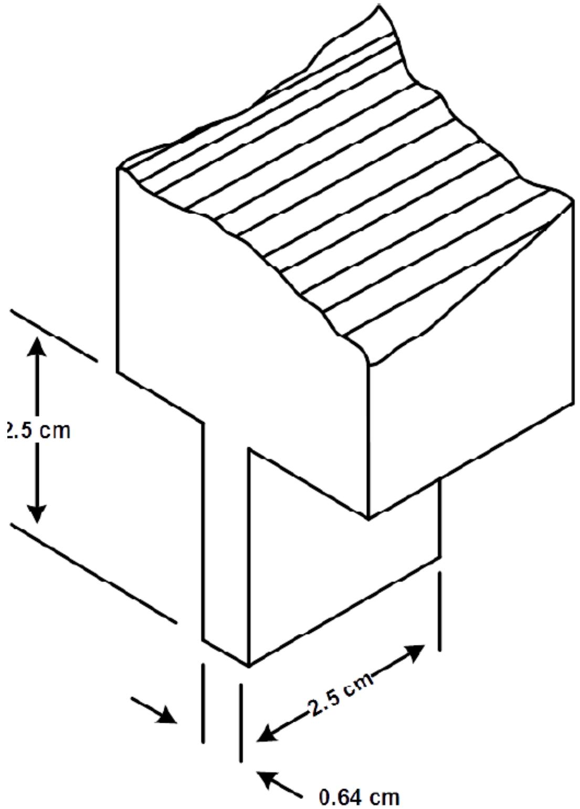  
NOTE: Dimension tolerance:  $+0~\mathrm{cm} / - 0.05~\mathrm{cm}$  
注：尺寸公差：  $+0cm / - 0.05cm$

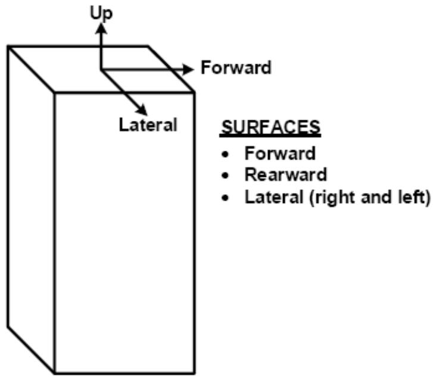

<table><tr><td>Up</td><td>向上</td></tr><tr><td>Forward</td><td>向前</td></tr><tr><td>Lateral</td><td>侧面</td></tr><tr><td>SURFACES</td><td>表面</td></tr><tr><td>Rearward</td><td>向后</td></tr><tr><td>Lateral(right and left)</td><td>侧面（左右）</td></tr></table>

# VERTICALLY MOUNTED ELT

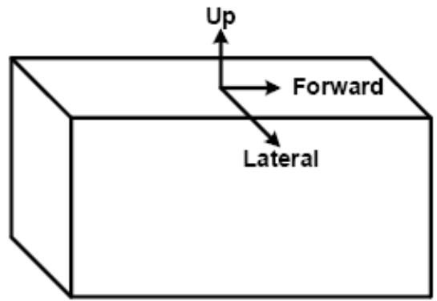  
垂直安装的ELT

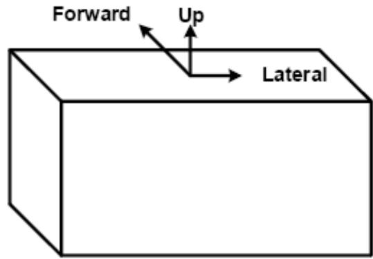

<table><tr><td>Up</td><td>向上</td></tr></table>

<table><tr><td>Forward</td><td>向前</td></tr></table>

<table><tr><td>Forward</td><td>向前</td><td>Up</td><td>向上</td></tr><tr><td>Lateral</td><td>侧面</td><td>Lateral</td><td>侧面</td></tr></table>

# SURFACES

# 表面

Top (up)

顶部（上面）

Bottom (mounting surface)

.底部（安装面）

Lateral (right and left)

侧面（左右）

# SURFACES

# 表面

Top (up)

顶部（上面）

Bottom (mounting surface)

.底部（安装面）

Forward

.向前

Rearward

向后

# HORIZONTALLY MOUNTED ELT

水平安装的ELT

# FIGURE 4-3: SURFACES SPECIFIED FOR PENETRATION AND CRUSH TESTS ON ELTs

图4-3：指定用于穿透和碎裂试验的ELT表面

# CHAPTER 5

# 第5章

# TEST PROCEDURES

# 测试程序

# 5.1 GENERAL SPECIFICATIONS

# 5.1通用规范

To ensure ELT compatibility with Cospas-Sarsat receiving and processing equipment, ELTs shall meet all the test procedures specified in the Cospas-Sarsat document C/S T.007 for first generation ELTs or C/S T.021 for second generation ELTs.

为确保ELT与Cospas-Sarsat接收和处理设备相兼容，ELT应满足Cospas-Sarsat文件C/S T.007中针对第一代ELT或文件C/S T.021中针对第二代ELT规定的所有测试程序。

# 5.1.1 Emissions

# 5.1.1 发射

Measures shall be taken to ensure that no operational distress transmissions on  $406\mathrm{MHz}$ ,  $121.5\mathrm{MHz}$  or  $243\mathrm{MHz}$  occur during any testing. This can include using offset frequencies and test transmissions in consultation with the appropriate National authorities.

应采取适当措施确保在任何测试期间，在  $406\mathrm{MHz}$  、121.5MHz或  $243\mathrm{MHz}$  上不发生操作遇难传输。此类措施可以包括与相关国家当局协商使用偏移频率和测试传输。

# 5.1.2 Power Input Voltage

# 5.1.2 电源输入电压

Unless otherwise specified, all tests shall be conducted with the ELT system using its internal or integral battery. The voltage of external power supplies (e.g. for Control and Monitor system(s)) shall be adjusted to the declared design voltage  $+/-5\%$  and shall be measured at the ELT system components input terminals.

除非另有规定，所有测试应使用ELT系统的内部或整体电池进行。外部电源（例如，用于控制监测系统的外部电源）的电压应调整至声明设计电压  $+ / - 5\%$  ，并应在ELT系统部件输入端进行测量。

# 5.1.3 Adjustment of Equipment

# 5.1.3 设备调整

The circuits of the equipment under test shall be properly aligned and adjusted in accordance with the manufacturer's recommended practice prior to application of the specified tests. No adjustments shall be performed on the ELT system after initiation of the tests.

在开展规定的测试之前，应按照制造商推荐的惯例，对受试设备的电路进行适当校准和调整。开始测试后，不得对ELT系统作出任何调整。

# 5.1.4 Test Instrument Precautions

# 5.1.4 试验仪表注意事项

Precautions shall be taken while carrying out the tests to prevent the introduction of errors resulting from the improper connection of test instruments to the equipment under test.

在开展测试时，应采取预防措施，以防止因测试仪表与受试设备连接不当而导致错误。

# 5.1.5 Ambient Conditions

# 5.1.5 环境条件

Unless otherwise specified, all tests shall be conducted under conditions of ambient room temperature, pressure and humidity, and allowed to stabilize for  $2\mathrm{h}$ , as defined in ED-14G/DO-160G, section 3.5.

除非另有规定，所有测试应在环境室温、压力和湿度条件下进行，并允许稳定  $2\mathrm{h}$ ，如ED-14G/DO-160G第3.5节所述。

# 5.1.6 Connected Loads

# 5.1.6 连接负载

Unless otherwise specified, all tests shall be performed with the equipment connected to loads having the impedance values for which it is designed.

除非另有规定，所有测试应在设备连接到具有设计阻抗值的负载时进行。

# 5.1.7 Recording of Test Results

# 5.1.7 测试结果的记录

When test results are being recorded for inclusion in the type test report, it is not sufficient to note merely that the requirement was met. Except where tests are obviously GO/NO-GO in character (e.g. determination of whether or not mechanical devices function correctly) the actual numerical values obtained for each of the parameters tested shall be recorded.

当测试结果被记录在型式测试报告中时，仅注意到满足要求是不够的。除非测试性质明显为 GO/NO-GO（例如：确定机械装置是否正常运行），否则应记录每项测试参数获得的实际数值。

# 5.1.8 Test Procedures

# 5.1.8 测试程序

The following test procedures are considered to be a satisfactory means of determining required performance under standard and stressed environmental conditions.

下列测试程序被认为是在标准和应力环境条件下确定所需性能的恰当方法。

Although test procedures are specified, it is recognized that other methods may be preferred. Such other procedures may be used if the manufacturer can show that they provide at least equivalent information. The procedures described in this chapter should be used as criteria in evaluating the acceptability of alternative procedures.

虽然规定了测试程序，但应认识到可能首选其他方法。如果制造商能够证明其他此类程序可以提供至少相等的信息，则可使用其他此类程序。在评估替代程序的可接受性时，应使用本章所述的程序作为标准。

# 5.2 VERIFICATION REQUIREMENTS

# 5.2 验证要求

The verification procedures defined herein provide the means of satisfactorily determining the required performance of the ELT system. TABLE 5-1 provides a list of the verifications, which may be carried out in any order on more than one unit unless specifically stated otherwise.

本文定义的验证程序提供了确定 ELT 系统所需性能的恰当方法。表 5-1 提供了验证列表，除非另有特别说明，否则可按任何顺序对不止一件装置进行验证。

表 5-1: 性能验证  
TABLE 5-1: PERFORMANCE VERIFICATION  

<table><tr><td>Procedure
程序</td><td>Section
章节</td><td>Comments
意见</td></tr><tr><td>Cospas-Sarsat Type Approval
Cospas-Sarsat型号批准</td><td>§5.4</td><td></td></tr><tr><td>Operating Lifetime at min temp
工作寿命(最小温度)</td><td>§5.4.1</td><td>May be combined with the C/S test
可与C/S测试结合使用</td></tr><tr><td>Self-Test
自检</td><td>§5.3.1</td><td>Part of C/S Type Approval 5.4
部分C/S型号批准5.4</td></tr><tr><td>Position Data
位置数据</td><td>§5.8</td><td>Part of C/S Type Approval 5.4
部分C/S型号批准5.4</td></tr><tr><td>Environmental Tests
环境测试</td><td>§4.3 or §4.6
第4.3条或§第4.6条</td><td></td></tr><tr><td>Homing Transmitters
归航发射机</td><td>§5.5</td><td></td></tr><tr><td>Interfaces
接口</td><td>§5.7</td><td></td></tr><tr><td>Controls and monitoring system</td><td>§5.3.1</td><td></td></tr><tr><td>控制监测系统</td><td></td><td></td></tr><tr><td>Remote Control and Monitoring
远程控制和监控</td><td>§5.3.2</td><td></td></tr><tr><td>Power Source
电源</td><td>§5.3.4</td><td></td></tr><tr><td>External Antenna Cable
外部天线电缆</td><td>§5.3.5</td><td></td></tr><tr><td>Frequency Stability with Temp Gradient
具有温度梯度的频率稳定性</td><td>§5.6</td><td>Repeat part of C/S Approval Tests
重复部分C/S批准测试</td></tr><tr><td>Marking
标记</td><td>§5.9</td><td></td></tr><tr><td>Case Design, attachment and Colour
外壳设计、附件和颜色</td><td>§5.10</td><td></td></tr><tr><td>Installation Manual
安装手册</td><td>§5.11</td><td></td></tr></table>

# 5.3 GENERAL TEST/INSPECTION PROCEDURES

# 5.3 一般测试/检查程序

All of the methods of verifying compliance to this MOPS are contained within Chapters 4 and 5 of this MOPS and are set out in TABLE 5-1 in § 5.2. In all cases there are four possible methods of verifying compliance as follows:

验证是否符合本MOPS的所有方法均包含在本MOPS第4章和第5章中，见第5.2条中的表5-1。可以采用四种方法来验证所有情况下的合规性，如下所示：

# INSPECTION

检查

This is the non-destructive examination of the ELT system and its components using one or more of the five senses (visual, auditory, olfactory, tactile, taste). For example, inspecting the ELT unit case colour.

采用五种感觉（视觉、听觉、嗅觉、触觉、味觉）中的其中一种或多种对ELT系统及其部件进行无损检测。例如，检查ELT装置外壳颜色。

# DEMONSTRATION

# 演示

This is the manipulation of the product or system as it is intended to be used to verify that the results of such actions are as planned or expected. For example, turning the ELT unit 'on' and checking for the correct operation of the ELT indicators.

对产品或系统的操作，旨在用于验证此类措施的成效是否与计划或预期情况一致。例如，将ELT装置“打开”并检查ELT指示器是否正确运行。

# TEST

# 测试

This is the verification of a product or system using a controlled and predefined series of inputs, data, or stimuli to ensure that the product or system will produce a very specific and predefined output as specified by the requirements. For example, measuring the output power level of the  $121.5\mathrm{MHz}$  homing signal.

使用一系列受控和预定义的输入、数据或促进因素来验证产品或系统，以确保产品或系统将产生由需求指定的非常特定和预定义的输出。例如，测量  $121.5\mathrm{MHz}$  归航信号的输出功率电平。

# ANALYSIS

# 分析

This is the verification of a product or system using models, calculations and testing equipment. For example, calculating the battery pre-discharge losses prior to performing the minimum operating life-time test.

使用模型、计算和测试设备验证产品或系统。例如，在执行最短工作寿命测试之前计算电池预放电损耗。

In each compliance sub-section the respective method of demonstrating compliance, based upon one of the above four approaches, will be stated. Unless specifically stated for that sub-section, it is not permissible to use an alternative method of compliance (e.g. if a 'Test' is specified, then it is not permissible to replace this by 'Analysis'). However, if the manufacturer can show that an alternative method of compliance of the same type (e.g. an alternative 'Test' method to the 'Test' method specified may be used) will provide at least equivalent information, then this may be used provided that it complies with the requirements of  $\S 5.1$  and the relevant approval authority.

在每个合规性小节中，将说明基于上述四种方法之一的证明合规性的相应方法。除非对该小节有特别说明，否则不允许使用其他合规方法（例如：如果指定采用“测试”，则不允许将其替换为“分析”）。但是，如果制造商能够证明相同类型的另一种合规方法（例如：可使用指定“测试”方法的替代“测试”方法）会至少提供等效信息，则可使用该方法，前提是该方法符合第5.1条和相关批准机关的要求。

# 5.3.1 Controls and monitoring system on ELT unit

# 5.3.1 ELT装置上的控制监测系统

Except for the ELT aural indicator, verify by demonstration that the controls and monitoring system on ELT unit meets the functions specified in  $\S 3.1.1$ .

除ELT音响指示器外，通过演示验证ELT装置上的控制监测系统是否满足第3.1.1条中规定的功能。

# 5.3.1.1 ELT aural indicator

# 5.3.1.1 ELT 音响指示器

Verify by the following test that the ELT aural indicator unit meets the functions specified in  $\S 3.1.1$ .

通过以下测试验证ELT音响指示器装置是否满足第3.1.1.b条中规定的功能。

Place the ELT on a support approximately  $1\mathrm{m}$  above the floor in the middle of a quiet room with an area of at least  $10\mathrm{m}^2$ . The area within  $1\mathrm{m}$  of the ELT unit should be free of any objects that may reflect sound waves (e.g. cupboards, posts or pillars etc). Place a Sound Pressure Level (SPL) Meter pointing directly at the ELT unit at a distance of  $1\mathrm{m} + / - 3\mathrm{cm}$  from the surface of the ELT unit that radiates sound, as declared by the manufacturer. The SPL Meter shall be a Class 1 device in compliance with IEC 61672-1:2013. Set the SPL Meter to measure sound levels as follows: RMS 'A' Frequency Weighting, 'I' Time Weighting and Peak (Max) measurement.

将ELT放置在面积至少为  $10\mathrm{m}^2$  的安静房间中间地面上方约  $1\mathrm{m}$  处的支架上。ELT装置  $1\mathrm{m}$  范围内的区域应无任何可反射声波的物体（例如：橱柜、杆子或柱子等）。按照制造商的声明，将一个声压级（SPL）电平表直接指向ELT装置，距离辐射声音的ELT装置表面  $1\mathrm{m}+/-3\mathrm{cm}$  。SPL电平表应为符合IEC61672-1:2013的1级装置。将SPL电平表设置为如下测量声级：RMS“A”频率加权、“T”时间加权和峰值（最大值）测量。

With the ELT turned off and background noise kept to a minimum, turn the SPL Meter on and measure the background noise level for a period of at least 10 seconds, note the background noise level in dB. Reset the SPL Meter and then turn on the ELT and record the audio signal level emitted by the ELT unit aural indicator combined with any background sound in dB.

在 ELT 关闭且背景噪声保持最小的情况下，打开 SPL 电平表并测量背景噪声水平至少 10s，并注意背景噪声水平（单位：dB）。重置 SPL 电平表，然后打开 ELT，并记录由 ELT 装置音响指示器发出的音频信号电平以及任何背景噪声（单位：dB）。

Compute the following: ELT unit SPL=Combined ELT unit audio signal level and background noise level in dB - background noise level in dB

计算以下内容：ELT装置SPL=组合ELT装置音频信号电平和背景噪声电平（单位：dB）-背景噪声电平（单位：dB）

The resulting ELT Sound Pressure Level shall be between 60 dB and 70 dB.

由此产生的ELT声压级应在60dB至70dB之间。

# 5.3.2 Remote Control and Monitoring System

# 5.3.2 远程控制监测系统

Except for the Remote Control Cabling Fault Tolerance Test, verify by demonstration that the ELT remote control and monitoring system meets the functions specified in  $\S 3.1.2$ .

除远程控制电缆容错测试外，通过演示验证ELT远程控制监测系统满足第3.1.2条中规定的功能。

# 5.3.2.1 Remote Control Cabling Fault Tolerance Test

# 5.3.2.1 远程控制电缆容错测试

Verify by test that no combination of short or open circuits between the remote control, indicators, associated wiring and the airframe deactivates the ELT unit that has been activated.

通过测试验证远程控制装置、指示器、相关接线和机身之间的短路或开路组合不会使已激活的ELT装置停用。

# 5.3.3 Self-Test

# 5.3.3 自检

Verify using the procedures defined in Cospas-Sarsat document C/S T.007 for first generation ELTs or C/S T.021 for second generation ELTs.

对于第一代ELT，使用Cospas-Sarsat文件C/S T.007中定义的程序进行验证，对于第二代ELT，使用C/S T.021中定义的程序进行验证。

If the ELT system includes an internal or integral GNSS receiver then the performance of the GNSS Self-test shall also be verified using the procedures defined in Cospas-Sarsat document C/S T.007 for first generation ELTs or C/S T.021 for second generation ELTs.

如果ELT系统包括内部或整体GNSS接收机，则GNSS自检的性能还应使用Cospas-Sarsat文件C/S T.007中定义的用于第一代ELT的程序或C/S T.021中定义的用于第二代ELT的程序进行验证。

# 5.3.4 Power Source

# 5.3.4 电源

If the ELT system uses either Aircraft Electrical Power or Supplemental Power as defined in § 3.3 then the performance of the ELT system shall be verified using the External Power Source test procedures defined in Cospas-Sarsat document C/S T.007 for first generation ELTs or C/S T.021 for second generation ELTs.

如果ELT系统使用第3.3条中定义的航空器电源或补充电源，则应使用Cospas-Sarsat文件C/S T.007中定义的用于第一代ELT或C/S T.021中定义的用于第二代ELT的外部电源测试程序验证ELT系统的性能。

# 5.3.5 External Antenna Cable

# 5.3.5 外部天线电缆

Verify by demonstration that materials and methods used in the manufacture of antenna cable systems meet or exceed the specifications of MIL-DTL-17 or equivalent.

通过演示验证用于制造天线电缆系统的材料和方法是否符合或超过 MIL-DTL-17 或同等标准的规范。

# 5.4 DETAILED TEST PROCEDURES - 406 MHZ ELT

# 5.4详细测试程序 406MHZELT

To demonstrate compliance with Cospas-Sarsat design requirements, ELTs shall meet all the verification requirements specified in the document C/S T.007 for first generation ELTs or C/S T.021 for second generation ELTs.

为了证明符合Cospas-Sarsat设计要求，ELT应满足文件C/S T.007中规定的用于第一代ELT或C/S T.021中规定的用于第二代ELT的所有验证要求。

Alternative measuring techniques may be approved if sufficient justification is provided.

如果提供了充分理由，则可批准替代测量技术。

# 5.4.1 Operating Life Time at minimum temperature

# 5.4.1最低温度下的工作寿命

The Cospas-Sarsat operating life time at minimum temperature test, as defined in Cospas-Sarsat document C/S T.007 for first generation ELTs or C/S T.021 for second generation ELTs, shall be extended for the duration of the operating time of the homing transmitter as defined in § 3.5. During this extended period, the performance of the homing transmitter shall continue to meet the requirements of § 3.1 and § 3.2 as applicable.

按照Cospas-Sarsat文件C/S T.007中用于第一代ELT或C/S T.021中用于第二代ELT的规定，应将Cospas-Sarsat在最低温度测试时的工作寿命延长至第3.5条中规定的归航发射机的工作时间。在该延长期内，归航发射机的性能应继续满足第3.1条和第3.2条（如适用）的要求。

# 5.5 DETAILED TEST PROCEDURES - HOMING TRANSMITTERS

# 5.5 详细测试程序——归航发射机

# 5.5.1 Equipment Required

# 5.5.1所需设备

Power Meter Pulse Generator

功率计 脉冲发生器

Signal Generator Envelope Detector

信号发生器 包络探测器

VHF Receiver Diplexer

甚高频接收机 双工器

Frequency Counter Detector

计频器 探测器

Amplifier Oscilloscope (Storage)

放大器 示波器（存储）

Field Intensity Meter (FIM)

场强计（FIM）

# 5.5.2 Operating Frequencies (§ 3.8.1)

# 5.5.2 工作频率（第3.8.1条）

Connect the ELT unit as shown in FIGURE 5-1. Operate the ELT unit, using its integral or external battery and terminated with the nominal load impedance. Measure the carrier frequencies of the  $121.5\mathrm{MHz}$  and the optional frequency  $243.0\mathrm{MHz}$  emissions to an accuracy of at least five parts per million.

连接ELT装置，如图5-1所示。使用集成电路或外部电池操作ELT装置，并以额定负载阻抗终止。测量 $121.5\mathrm{MHz}$  和可选频率  $243.0\mathrm{MHz}$  发射的载波频率，精确度至少为百万分之五。

# 5.5.3 Modulation Characteristics (§ 3.8.2)

# 5.5.3 调制特性（第3.8.2条）

Operate the ELT unit as in § 5.5.2.

按照第5.5.2条的规定操作ELT装置。

Observe the modulation envelope on the storage oscilloscope and determine the upper and lower audio frequency sweep limits, sweep direction, sweep rate and modulation factor.

观察存储示波器上的调制包络，并确定音频扫描上限和下限、扫描方向、扫描速率和调制系数。

# 5.5.4 Modulation Duty Cycle (§ 3.8.2)

# 5.5.4 调制占空比（第3.8.2条）

Operate the ELT unit as in  $\S 5.5.2$

按照第5.5.2条的规定操作ELT装置。

Observe the detected modulation envelope indicated on the storage oscilloscope and determine the modulation duty cycle.

观察存储示波器上显示的检测到的调制包络，并确定调制占空比。

# 5.5.5 Transmitter Duty Cycle (§ 3.8.3)

# 5.5.5 发射机占空比（第3.8.3条）

Operate the ELT unit as in  $\S 5.5.2$

按照第5.5.2条的规定操作ELT装置。

Observe the modulated signal and determine that the carrier on and off timing periods comply with § 3.8.3.1.

观察调制信号并确定载波开启和关闭定时周期是否符合第3.8.3.1条的要求。

Determine that the Sideband Components comply with the requirements of §3.8.3.2. If the ELT includes other types of emissions (CW, Voice or an Identification Signal) determine that these comply with the requirements of § 3.8.3.3, § 3.8.3.4 and § 3.8.3.5 as applicable.

确定边带部件是否符合第3.8.3.2条的要求。如果ELT包括其他类型的发射（CW、语音或识别信号），则确定此类发射符合第3.8.3.3条、第3.8.3.4条和第3.8.3.5条的要求（如适用）。

# 5.5.6 Effective Isotropic Radiated Power (§ 3.8.5)

# 5.5.6有效各向同性辐射功率（第3.8.5条）

5.5.6.1 Radiated Power Test Requirements

5.5.6.1 辐射功率测试要求

The peak equivalent isotropic radiated power (PEIRP) is the peak envelope power (PEP), which is the root mean square (RMS) power supplied to the antenna by the transmitter measured at the highest crest of the modulation envelope multiplied by the gain of the antenna.

峰值等效各向同性辐射功率（PEIRP）是峰值包络功率（PEP），其是在调制包络最高波峰处测量的发射机提供给天线的均方根（RMS）功率乘以天线增益所得出的值。

This test is only required to be performed at ambient temperature and shall use a ELT whose battery has been ON for a minimum of 44 hours. If the test exceeds four hours, the battery may be replaced with another which has been preconditioned with at least 44 hours of ON time.

该测试仅需在环境温度下进行，且应使用电池已开启至少44小时的ELT。如果测试超过四小时，可以用另一个至少提前44小时开启的电池进行更换。

The measurement procedure requires a determination of the maximum value of PEIRP made by direct measurement of radiated power. A search shall be made in elevation between the angles of  $5^{\circ}$  and  $20^{\circ}$  to determine the elevation at which the ELT exhibits maximum antenna gain. The ELT shall then be rotated in azimuth through  $360^{\circ}$  until the maximum signal is received. The pattern should be essentially omni-directional in the horizontal plane. The pattern deviation shall not be greater than 6 dB from the reference signal at any selected point. The average of four evenly spaced field strength readings shall be equal to, or greater than, the standard. Except when otherwise specified the average value of EIRP shall be between 50 and  $400\mathrm{mW}$ .

测量程序需要通过直接测量辐射功率来确定PEIRP的最大值。应在  $5^{\circ}$  和  $20^{\circ}$  之间的仰角进行搜索，以确定ELT显示最大天线增益的仰角。然后，ELT应在方位上旋转  $360^{\circ}$ ，直至接收到最大信号。该模式在水平面上应该基本上是全向的。在任何选定点上，与参考信号的模式偏差不应大于6dB。四个均匀间隔的场强读数的平均值应等于或大于标准值。除非另有规定，EIRP的平均值应在50至400mW之间。

# 5.5.6.2 Radiated Power Test Conditions

# 5.5.6.2 辐射功率测试条件

The test site shall be on level ground which has uniform electrical characteristics. The site shall be clear of metal objects, overhead wires, etc., and as free as practicable from undesired signals such as ignition noise or other RF carriers. The distance from the ELT, or the search antenna to reflecting objects shall be at least  $30\mathrm{m}$

测试场地应在电气特性均匀的水平地面上。场地应无金属物体、架空线等，并尽可能无干扰信号，如点火噪声或其他射频载波。从ELT或搜索天线到反射物体的距离至少应为  $30\mathrm{m}$  。

ELT (AF), (AP) in fixed configuration and (DT) units shall be placed in the center of a ground plane with a radius of  $125\mathrm{cm}\pm 5\mathrm{cm}$  mounted at  $0.75\mathrm{m}$  above ground level.

固定配置的ELT（AF）和（AP）装置以及（DT）装置应放置在安装在离地  $0.75\mathrm{m}$  处半径为  $125\mathrm{cm} \pm 5\mathrm{cm}$  的地平面的中心处。

ELT (AD), (AP) in portable configuration and (S) units shall be tested in the following configurations:

便携式配置的ELT（AD）和（AP）装置以及（S）装置应在以下配置中进行测试：

a). placed in the center of a ground plane with a radius of  $125\mathrm{cm}\pm 5\mathrm{cm}$  mounted at  $0.75\mathrm{m}$  above ground level,  
a）放置在安装在离地  $0.75\mathrm{m}$  处半径为  $125\mathrm{cm} \pm 5\mathrm{cm}$  的地平面的中心处；

b). placed in the center of a plane made of RF absorbing material with a radius of  $125\mathrm{cm}\pm 5\mathrm{cm}$  mounted at or just above the upper surface of the RF absorbing material. An equivalent test set-up aimed at demonstrating performance on non-reflective surfaces can be used if approved by a National Authority, and  
b) 放置在由 RF 吸收材料制成的平面的中心, 其中, 该平面的半径为  $125 \mathrm{~cm} \pm 5 \mathrm{~cm}$ , 安装在由 RF 吸收材料制成的上表面处或其正上方。如果得到国家当局的批准, 则可采用旨在证明非反射表面性能的等效测试装置  
c). (Only units designed to operate in water) placed such that the flotation line of the ELT is level with and in the center of a ground plane with a radius of  $125\mathrm{cm}\pm 5\mathrm{cm}$  mounted at  $0.75\mathrm{m}$  above ground level. An equivalent test set-up aimed at demonstrating performance when used in water can be used if approved by a National Authority.  
c）放置（仅适用于在水中运行的装置）时，ELT的浮线应与安装在离地  $0.75\mathrm{m}$  处半径为  $125\mathrm{cm} \pm 5\mathrm{cm}$  的地平面齐平，并位于地平面的中心。如果得到国家当局的批准，则可使用用于演示在水中使用时性能的等效测试装置。

Measurement of the radiated signals for all test configurations shall be made at a point  $10\mathrm{m}$  from the ELT. At this point, a wooden pole or insulated tripod with a movable boom shall be arranged so that a search antenna can be raised and lowered through an elevation of  $1\mathrm{m}$  to  $4\mathrm{m}$ .

所有测试配置的辐射信号应在离ELT  $10\mathrm{m}$  处进行测量。此时，应设置带有可移动吊杆的木杆或绝缘三脚架，以便搜索天线可通过  $1\mathrm{m}$  至  $4\mathrm{m}$  的高度升降。

# 5.5.6.3 Method of Measurement

# 5.5.6.3 测量方法

The elevation of the search antenna, between  $1\mathrm{m}$  and  $4\mathrm{m}$ , which produces a maximum gain is determined with the ELT at an arbitrary azimuth. The PEIRP shall be measured and the elevation shall be noted and shall remain fixed for the remainder of the test. The ELT is then rotated through  $360^{\circ}$  until the maximum EIRP is found. Return the antenna to the position of the highest EIRP measurement. The antenna shall then be rotated in horizontal plane and four evenly spaced field strength reading shall be taken. The average of these four readings shall be equal to or greater than  $17\mathrm{dBm}$  ( $50\mathrm{mW}$ ). When the configuration simulating non-conducting ground is used (see 5.5.6.2 b)) the average of these four readings shall be equal or greater than  $7\mathrm{dBm}$  ( $5\mathrm{mW}$ ). When the configuration simulating floating in water is used (see 5.5.6.2 c)) the average of these four readings shall be equal or greater than  $14\mathrm{dBm}$  ( $25\mathrm{mW}$ ).

产生最大增益的搜索天线的高度（ $1\mathrm{m}$  至  $4\mathrm{m}$ ）由位于任意方位的ELT确定。应对PEIRP进行测量，记录标高并在剩余的测试中保持固定。然后将ELT旋转  $360^{\circ}$ ，直到得到最大EIRP。将天线返回到最高EIRP测量值的位置。然后，应在水平面内旋转天线，并读取四个均匀间隔的场强读数。这四个读数的平均值应等于或大于  $17\mathrm{dBm}$ （ $50\mathrm{mW}$ ）。当使用模拟非导电接地的配置时（见5.5.6.2b），这四个读数的平均值应等于或大于  $7\mathrm{dBm}$ （ $5\mathrm{mW}$ ）。当使用模拟水中漂浮的配置时（见5.5.6.2c），这四个读数的平均值应等于或大于  $14\mathrm{dBm}$ （ $25\mathrm{mW}$ ）。

The average ELT EIRP shall be computed using the following equation:

应使用以下方程计算平均ELTEIRP：

$$
\mathrm {P E I R P} = L O G ^ {- 1} \frac {P _ {R E C} - G _ {R E C} + L _ {C} + L _ {P}}{1 0}
$$

$$
\mathrm {P E I R P} = \log G ^ {- 1} \frac {P _ {R E C} - G _ {R E C} + L _ {C} + L _ {P}}{1 0}
$$

Where:

式中，

$\mathrm{P_{REC}} =$  Measured Power level from spectrum analyzer (dBm)

$\mathrm{P_{REC}}$  =频谱分析仪测得的功率级（dBm）

$\mathrm{G}_{\mathrm{REC}} =$  Antenna gain of search antenna (dB)

$\mathrm{G_{REC}}$  =搜索天线的天线增益（dB）

$\mathrm{L_C} =$  Receive system attenuator and cable loss (dB)

$\mathrm{L_C} =$  接收系统衰减器和电缆损耗（dB）

$\mathrm{L_P} =$  Free space propagation loss (dB)

$\mathrm{L_P} =$  自由空间传播损耗（dB）

# 5.5.7 Radio frequency intermodulation (§ 3.8.7)

# 5.5.7射频互调（第3.8.7条）

(Does not apply to  $\mathrm{ELT(S)}$ )

（不适用于ELT（S））

5.5.7.1 Reradiated RF intermodulated signals may be measured using §5.5.7.3 or §5.5.7.4 below, as appropriate. If the ELT system incorporates a non-linear device (e.g. a diode) in the antenna configuration external to the ELT transmitter unit, then the Radiation method shall be used. The ELT unit shall be in the ARMED mode for these tests.

5.5.7.1 再辐射 RF 互调信号可酌情根据下文第 5.5.7.3 条或第 5.5.7.4 条的要求进行测量。如果 ELT 系统在 ELT 发射机装置外部的天线配置中包含非线性装置（例如，二极管），则应使用辐射法。对于此类测试，ELT 装置应处于待命模式。

# 5.5.7.2 Equipment required

# 5.5.7.2所需设备

RF Signal Generator (3)

射频信号发生器（3）

Hybrid Power Divider

混合功率分配器

Resistive Power Divider

电阻功率分配器

Attenuator

衰减器

Field Intensity Meter

场强计

Power Meter

功率计

Spectrum Analyser

RF Amplifier (2)

频谱分析仪

射频放大器（2）

Variable Notch Filter (2)

可变陷波滤波器（2）

5.5.7.3 Direct coupling method

5.5.7.3 直接耦合法

a). The ELT unit shall be connected as shown in FIGURE 3-3. To demonstrate the compliance, the test frequencies specified in TABLE 5-2 shall be used. The power level into the ELT unit at each frequency should be as indicated in TABLE 5-2, which considers the ELT antenna gain loss at the measured interference frequency.  
a) ELT 装置应如图 3-3 所示进行连接。为了证明合规性, 应使用表 5-2 中规定的测试频率。在每种频率下进入 ELT 装置的功率电平应如表 5-2 所示, 该表考虑了在所测干扰频率下的 ELT 天线增益损耗。  
b). All ELT system components should have at least a 15-minute warm-up period.  
b）所有ELT系统部件应至少有15分钟的预热时间。  
c). The series-connected notch filters should be capable of attenuating the interfering frequency signal by a minimum of 30 dB and the RFI by not more than 15 dB.  
c）串联连接的陷波滤波器应当能够将干扰频率信号衰减至少30dB并且将RFI衰减不超过15dB。  
d). All signal generators shall be set to the CW mode.  
d）所有信号发生器应设置为CW模式。  
e). Test procedure  
e）测试程序

1) Adjust the signals from two signal generators to the frequencies indicated in Frequency Set A of TABLE 5-2.  
1）将两个信号发生器的信号调整到表5-2的频率设置A中所示的频率。  
2) Adjust the notch filters to attenuate the interference signals by at least  $30~\mathrm{dB}$ .  
2）调整陷波滤波器，使干扰信号衰减至少30dB。  
3) Reduce the signal from the two signal generators to a minimum. Connect a third signal generator to the output of the 3 dB attenuator. Set Signal Generator 3 to the RFI frequency expected in the  $108\mathrm{MHz} - 137\mathrm{MHz}$  band and adjust the generator output level to  $-83\mathrm{dBm}$ . Verify that the signal can be seen on the spectrum analyser and note its amplitude. Repeat this procedure for all RFI frequencies that could be expected. If the signal cannot be seen on the spectrum analyser, the notch filters may have to be readjusted.  
3）将两个信号发生器的信号降至最低。将第三个信号发生器连接到3dB衰减器的输出端。将信号发生器3设置为  $108\mathrm{MHz} - 137\mathrm{MHz}$  频带内预期的RFI频率，并将发生器输出电平调整到-83dBm。验证信号可以在频谱分析仪上看到，并记录其振幅。对所有预期的RFI频率重复此程序。如果频谱分析仪上看不到信号，可能需要重新调整陷波滤波器。

4) Disconnect Signal Generator 3. Increase the output from Signal Generators 1 and 2 to the test level. Verify that the two interference frequencies are still attenuated by  $30~\mathrm{dB}$  or more.  
4)断开信号发生器3。将信号发生器1和2的输出增加至测试电平。验证两个干扰频率仍然衰减至少  $30\mathrm{dB}$  。  
5) Reduce the signal from Signal Generator 2 to a minimum. Connect the power meter to the 3 dB attenuator. Adjust the output of Signal Generator 1 until the power meter measures the level specified in TABLE 5-2.  
5）将信号发生器2的信号降至最低。将功率计连接到3dB衰减器。调整信号发生器1的输出，直到功率计测量到表5-2中规定的电平。  
6) Repeat step 5 with the signal from Signal Generator 1 reduced to a minimum and the signal from Signal Generator 2 at the test level.  
6）重复步骤5，将信号发生器1的信号降至最小值，并将信号发生器2的信号降至测试电平。  
7) Increase the signal from Signal Generator 1 to the test level. Disconnect the power meter. Connect the ELT to the 3 dB attenuator. Record the maximum deflections on the spectrum analyser in the  $108\mathrm{MHz} - 137\mathrm{MHz}$  band. To meet the requirement these deflections shall be less than those noted in step 3.  
7）将信号发生器1的信号增加至测试电平。断开功率计。将ELT连接到3dB衰减器。在频谱分析仪上记录  $108\mathrm{MHz} - 137\mathrm{MHz}$  波段的最大偏转。为满足要求，此类偏转应小于步骤3中所述的偏转。  
8) Repeat steps 1-7 using the other frequency sets, (B and C), defined in TABLE 5-2.  
8）使用表5-2中定义的其他频率设置（B和C）重复步骤1-7。

# 5.5.7.4 Radiation method

# 5.5.7.4 辐射法

a). The test set-up should be as shown in FIGURE 3-4. The test frequencies of TABLE 5-3 shall be used.  
a) 测试装置应如图 3-4 所示。应使用表 5-3 的测试频率。  
b). All ELT system components should have at least a 15-minute warm-up period.  
b）所有ELT系统部件应至少有15分钟的预热时间。  
c). All signal generators should be set to the CW mode.  
c）所有信号发生器宜设置为CW模式。  
d). The ELT antenna(s) should be mounted in an aircraft configuration or mockup using metallic or non-metallic housings, as appropriate.  
d）ELT天线应酌情采用金属或非金属外壳安装在航空器构型或实体模型中。  
e). The ELT antenna and mock-up should be at a distance of D1 (minimum 12 metres (39 feet).) from its intended test position and from the transmitting antenna(s).  
e）ELT天线和实体模型与预期测试位置和发射天线之间的距离应为D1（至少  $12\mathrm{m}$  （39ft.))。  
f). Test procedure  
f）测试程序

1) Adjust the signals from the two signal generators to the frequencies specified for Frequency Set A in TABLE 5-3.  
1）将两个信号发生器的信号调整到表5-3中频率设置A规定的频率。  
2) Place the Field Intensity Meter (FIM) antenna in the ELT's intended position.  
2）将场强计（FIM）天线放置在ELT的预期位置。  
3) Adjust the FIM to the frequency of Signal Generator 1 and adjust the output of Signal Generator 1 until the FIM measures the intensity indicated in TABLE 5-3. Record the output setting of Signal Generator 1.  
3) 将FIM调整到信号发生器1的频率，并调整信号发生器1的输出，直到FIM测量到表5-3所示的强度。记录信号发生器1的输出设置。  
4) Repeat step 3 for Signal Generator 2.  
4）对信号发生器2重复步骤3。  
5) Place the ELT antenna and FIM antenna in their respective positions (FIGURE 3-4). For an internal antenna, use the external surface of the aircraft mock-up nearest the ELT antenna position.  
5）将ELT天线和FIM天线放置在各自位置（图3-4）。对于内部天线，使用离ELT天线位置最近的航空器实体模型的外表面。  
6) Adjust both signal generators to the outputs recorded in steps 3 and 4. Adjust the FIM to measure frequencies in the  $108\mathrm{MHz}$ - $137\mathrm{MHz}$  band. The field intensity measured by the FIM shall not be greater than  $7\mu \mathrm{V / m}$ .  
6)将两个信号发生器调整到步骤3和4中记录的输出。调整FIM以测量  $108\mathrm{MHz} - 137\mathrm{MHz}$  频带内的频率。FIM测量的场强不得大于  $7\mu \mathrm{V / m}$  。  
7) Rotate the ELT antenna and mock-up and perform step 6 for each of the three remaining quadrants, (approximately  $90^{\circ}$  increments).  
7）旋转ELT天线和实体模型，并对其余三个象限中的每一个执行步骤6（大约  $90^{\circ}$  增量）。  
8) Repeat steps 1-7 using the other frequency sets (B and C), defined in TABLE 5-3.  
8）使用表5-3中定义的其他频率设置（B和C）重复步骤1-7。

# 5.6 FREQUENCY STABILITY WITH TEMPERATURE GRADIENT

# 5.6 具有温度梯度的频率稳定性

This test shall be performed on a unit that successfully completed all the Group B environmental tests as defined in TABLE 4-2. Verify using the procedures defined in Cospas-Sarsat document C/S T.007 for first generation ELTs or C/S T.021 for second generation ELTs, except that the test shall only be performed from the minimum operating temperature to the maximum operating temperature. This test does not need to be performed at a Cospas-Sarsat approved test facility.

本测试应在成功完成表 4-2 中规定的所有 B 组环境测试的装置上进行。使用 Cospas-Sarsat 文件 C/S T.007 中为第一代 ELT 或 C/S T.021 中为第二代 ELT 定义的程序进行验证，但测试只能从最低工作温度到最高工作温度进行。该项测试无需在 Cospas-Sarsat 认可测试设施上进行。

# 5.7 TEST PROCEDURES - INTERFACES

# 5.7 测试程序——接口

Verify by demonstration or test that ELT(DT) is capable of receiving or transmitting appropriate signals from interfaces to aircraft systems.

通过演示或测试验证ELT（DT）能够接收或传输从接口到航空器系统的适当信号。

The required and optional interface functions of  $\S 2.9.5.2.1$  and  $\S 2.9.5.2.2$ , respectively, need to be verified. Specific ELT manufacturer architectures may differ, however, as a minimum, the following should be verified:

需要分别验证第2.9.5.2.1条和第2.9.5.2.2条的所需接口功能和可选接口功能。具体的ELT制造商架构可能不同，但至少应验证以下项目：

Appropriate actions are accomplished in response to input signals

完成响应输入信号的适当动作

Appropriate output signals are generated and transmitted.

1. 生成并传输适当的输出信号。

# 5.7.1 External Navigation Interface

# 5.7.1 外部导航接口

Verify using the procedures defined in Cospas-Sarsat document C/S T.007 for first generation ELTs or C/S T.021 for second generation ELTs.

对于第一代ELT，使用Cospas-Sarsat文件C/S T.007中定义的程序进行验证，对于第二代ELT，使用C/S T.021中定义的程序进行验证。

# 5.8 POSITION DATA (OPTIONAL EXCEPT FOR ELT(DT))

# 5.8 位置数据（除 ELT（DT）外可选）

Verify using the procedures defined in Cospas-Sarsat document C/S T.007 for first generation ELTs or C/S T.021 for second generation ELT.

对于第一代ELT，使用Cospas-Sarsat文件C/S T.007中定义的程序进行验证，对于第二代ELT，使用C/S T.021中定义的程序进行验证。

# 5.9 MARKING

# 5.9标记

Verify by inspection that the ELT unit is marked with its type, capability ID codes and category as applicable.

通过检查验证ELT装置是否标有适用的类型、能力识别码和类别。

If the ELT system contains a crash sensor, verify by inspection that the component of the ELT system containing the crash sensor is marked to indicate the correct installation orientation(s), for crash sensing.

如果 ELT 系统包含坠机传感器，则通过检查验证包含坠机传感器的 ELT 系统的部件是否被标记，以指示碰撞检测的正确安装方向。

# 5.10. CASE DESIGN, ATTACHMENT AND COLOUR

# 5.10 外壳设计、附件和颜色

Verify by inspection that the ELT system components have no sharp edges or projections.

通过检查验证ELT系统部件是否呈现锐边或凸出部分。

Verify by inspection that the ELT unit is high visibility yellow or orange in color.

通过检查验证ELT装置是否为高能见度黄色或橙色。

If the ELT is required to have a tether then verify by inspection that it is made of non-rotting material that is inherently buoyant and of a high-visibility color. The length of the tether shall be measured to ensure that it is at least  $4\mathrm{m}$  in length. The tether shall be subjected to a pull force of  $113\mathrm{kg} + / - 5\mathrm{kg}$  for a period of at least 1 minute without breaking.

如果要求 ELT 带有系绳，则通过检查验证其是否由具有固有浮力和高可见性颜色的非腐烂材料制成。应测量系绳的长度，以确保其长度至少为  $4 \mathrm{~m}$  。系绳应至少承受  $1 \mathrm{~min}$  的  $113 \mathrm{~kg} + / - 5 \mathrm{~kg}$  拉力，且不断裂。

# 5.11 INSTALLATION MANUAL

# 5.11 安装手册

Verify by inspection that the ELT manufacturer provides a manual that contains a description of the ELT's operational capabilities, installation instructions, and additional information regarding the installation and operation of the ELT which is necessary to ensure compliance with this MOPS.

通过检查验证ELT制造商是否提供一份手册，其中包含ELT的操作能力说明、安装说明以及关于ELT安装和操作的附加信息，此类信息对于确保符合本MOPS十分必要。

TABLE 5-2: RADIO FREQUENCY INTERMODULATION FREQUENCY TABLE (DIRECT COUPLING METHOD)  
表 5-2: 射频互调频率表 (直接耦合法)  

<table><tr><td>Set
设置</td><td>Interference Frequencies
干扰频率</td><td>RFI at
RFI处于</td></tr><tr><td rowspan="2">A</td><td>*107.5 MHz @ +10 dBm - ΔG</td><td>108-137</td></tr><tr><td>**98 MHz ±10 MHz @ +11 dBm - ΔG</td><td>MHz</td></tr><tr><td rowspan="2">B</td><td>*215 MHz @ +10 dBm - ΔG</td><td>108-137</td></tr><tr><td>**98 MHz ±10 MHz @ +11 dBm - ΔG</td><td>MHz</td></tr><tr><td rowspan="2">C</td><td>*500 MHz @ +14 dBm - ΔG</td><td>108-137</td></tr><tr><td>189.5 MHz @ +10 dBm - ΔG</td><td>MHz</td></tr><tr><td colspan="3">*ΔG = Gain of ELT antenna at 121.5 MHz - Gain at interference frequency. The antenna gain is measured with</td></tr></table>

TABLE 5-3: RADIO FREQUENCY INTERMODULATION FREQUENCY TABLE (RADIATION)  

<table><tr><td>the ELT antenna mounted on a flat ground plane that has a minimum dimension of 1 meter (3 feet), either circular or square.</td></tr><tr><td>*ΔG=ELT天线在121.5MHz处的增益-干扰频率处的增益。采用安装在最小尺寸为1m(3ft.)的圆形或正方形平坦地平面上的ELT天线测量天线增益。</td></tr><tr><td>**To include testing at 94 MHz.</td></tr><tr><td>**包括在94MHz条件下的测试。</td></tr></table>

表 5-3: 射频互调频率表 (辐射)  
TABLE 5-4: CRASH SENSOR PERFORMANCE DEFINITIONS DIRECTIONS OTHER THAN THE AIRFRAME FORWARD DIRECTION  

<table><tr><td>Set
设置</td><td>Interference Frequencies
干扰频率</td><td>RFI at
RFI处于</td></tr><tr><td>A</td><td>107.5 MHz @ 1.9 volts/meter
107.5MHz (1.9V/m时)
* 98 MHz ±10 MHz @ 1.9 volts/meter
*98MHz±10MHz (1.9V/m时)</td><td>108-137
MHz</td></tr><tr><td>B</td><td>215 MHz @ 3.3 volts/meter
215MHz (3.3V/m时)
* 98 MHz ±10 MHz @ 1.9 volts/meter
*98MHz±10MHz (1.9V/m时)</td><td>108-137
MHz</td></tr><tr><td>C</td><td>500 MHz @ 13 volts/meter
500MHz (13V/m时)
189.5 MHz @ 3.3 volts/meter
189.5 MHz (3.3V/m时)</td><td>108-137
MHz</td></tr><tr><td colspan="3">* To include testing at 94 MHz.
*包括在 94MHz 条件下的测试。</td></tr></table>

表 5-4: 坠机传感器性能定义机身前进方向以外的方向  

<table><tr><td>Pulse</td><td>Time Duration δt (ms)</td><td>Peak Acceleration a (g)</td><td>Crash Sensor Automatic Activation?</td></tr><tr><td>脉冲</td><td>持续时间δt(ms)</td><td>峰值加速度a(g)</td><td>坠机传感器自动激活?</td></tr><tr><td>1</td><td>5±1</td><td>21.0±1.0</td><td>NO
否</td></tr><tr><td>2</td><td>14±1</td><td>8.0±0.2</td><td>NO
否</td></tr><tr><td>3</td><td>14±1</td><td>11.7±0.2</td><td>YES
是</td></tr><tr><td>4</td><td>26±1</td><td>8.0±0.2</td><td>NO
否</td></tr><tr><td>5</td><td>26±1</td><td>11.7±0.2</td><td>YES
是</td></tr></table>

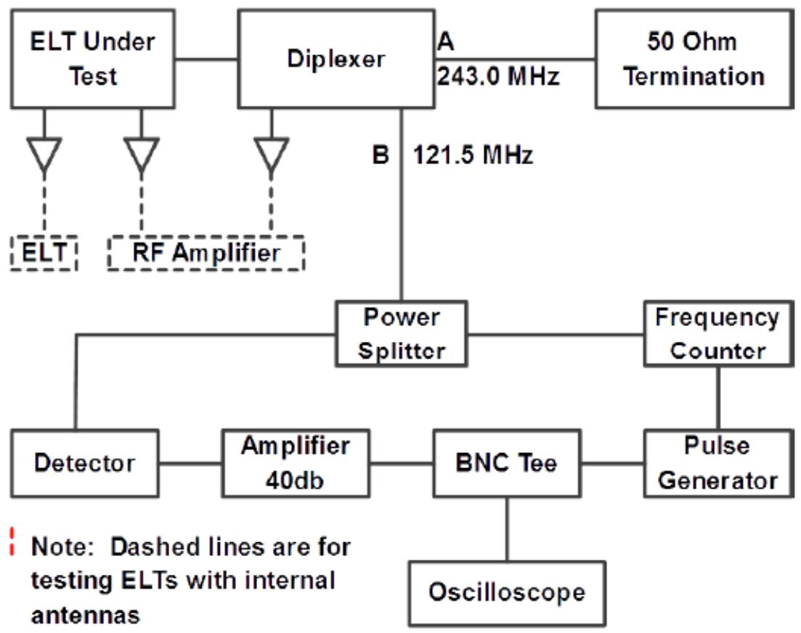

<table><tr><td>ELT Under Test</td><td>受试 ELT</td></tr></table>

FIGURE 5-1: ELT CARRIER FREQUENCY AND MODULATION PERFORMANCE TYPICAL TEST SET-UP  

<table><tr><td>Diplexer</td><td>双工器</td></tr><tr><td>50 Ohm Termination</td><td>50Ohm 终端</td></tr><tr><td>ELT</td><td>ELT</td></tr><tr><td>RF Amplifier</td><td>射频放大器</td></tr><tr><td>Power Splitter</td><td>功率分配器</td></tr><tr><td>Frequency Counter</td><td>计频器</td></tr><tr><td>Detector</td><td>探测器</td></tr><tr><td>Amplifier 40db</td><td>放大器 40db</td></tr><tr><td>BNC Tee</td><td>BNC 三通</td></tr><tr><td>Pulse Generator</td><td>脉冲发生器</td></tr><tr><td>oscilloscope</td><td>示波器</td></tr><tr><td>Note: Dashed lines are for testing ELTs with internal antennas</td><td>注: 虚线用于测试带内部天线的 ELT</td></tr></table>

图5-1：ELT载波频率和调制性能通用测试装置

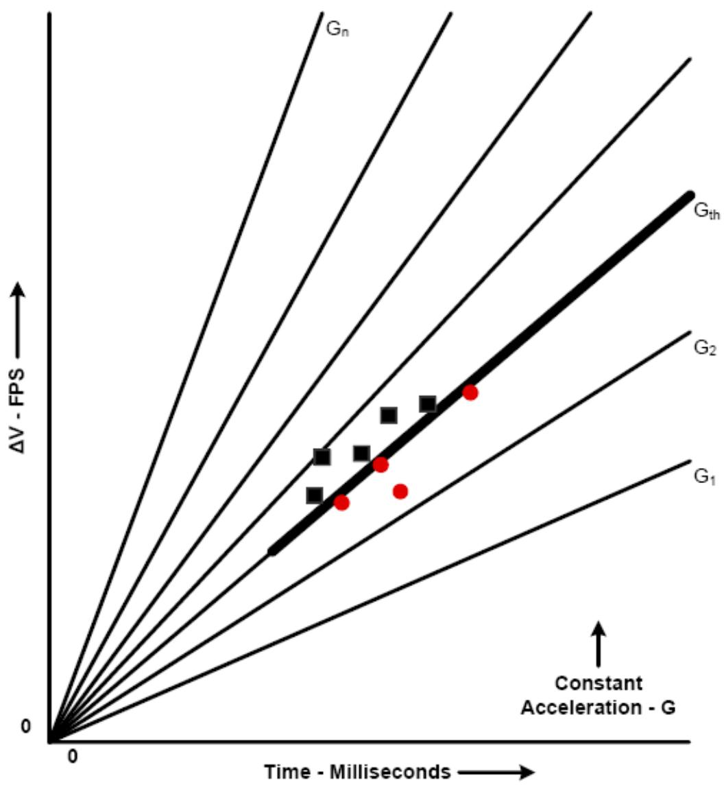  
图5-2：坠机传感器阈值加速度水平传感器状态的确定

FIGURE 5-2: DETERMINATION OF CRASH SENSOR THRESHOLD ACCELERATION LEVEL SENSOR STATUS  

<table><tr><td>Constant Acceleration - G</td><td>恒定加速度——G</td></tr><tr><td>Time - Millisecond</td><td>时间——ms</td></tr></table>

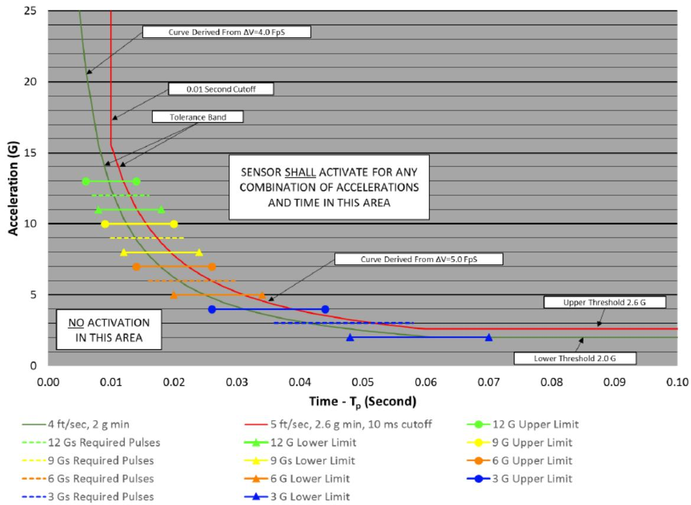  
4.5 ft/s CRASH ACTIVATION SENSOR RESPONSE CURVE

<table><tr><td>4.5 ft/s CRASH ACTIVATION SENSOR RESPONSE CURVE</td><td>4.5 ft/s 坠机激活传感器响应曲线</td></tr><tr><td>Curve Derived From ΔV=4.0 FpS</td><td>由ΔV=4.0FPs 导出的曲线</td></tr><tr><td>0.01 Second Cutoff</td><td>0.01秒截止</td></tr><tr><td>Tolerance Band</td><td>公差带</td></tr><tr><td>Acceleration (G)</td><td>加速度（G）</td></tr><tr><td>SENSOR SHALL ACTIVATE FOR ANY COMBINATION OF ACCELERATIONS AND TIME IN THIS AREA</td><td>对于该区域内的加速度和时间的任何组合，传感器应激活</td></tr><tr><td>NO ACTIVATION IN THIS AREA</td><td>该区域未激活</td></tr><tr><td>Curve Derived From ΔV=5.0 FpS</td><td>由ΔV=5.0FPs导出的曲线</td></tr><tr><td>Upper Threshold 2.6G</td><td>上限阈值2.6G</td></tr><tr><td>Lower Threshold 2.0G</td><td>下限阈值2.0G</td></tr><tr><td>4 ft/sec, 2 g min</td><td>4ft/s, 2g/min</td></tr><tr><td>12Gs Required Pulses</td><td>12G所需脉冲</td></tr><tr><td>9Gs Required Pulses</td><td>9G所需脉冲</td></tr><tr><td>6Gs Required Pulses</td><td>6G所需脉冲</td></tr><tr><td>3Gs Required Pulses</td><td>3G所需脉冲</td></tr><tr><td>5 ft/sec, 2.6 g min, 10 ms cutoff</td><td>5ft/s, 2.6g/min, 10ms截止</td></tr><tr><td>12G Lower Limit</td><td>12G下限</td></tr><tr><td>9Gs Lower Limit</td><td>9G下限</td></tr><tr><td>6G Lower Limit</td><td>6G下限</td></tr><tr><td>3G Lower Limit</td><td>3G下限</td></tr><tr><td>12G Upper limit</td><td>12G上限</td></tr><tr><td>9 G Upper limit</td><td>9G上限</td></tr><tr><td>6 G Upper limit</td><td>6G上限</td></tr><tr><td>3 G Upper limit</td><td>3G上限</td></tr></table>

$\Delta \mathrm{V} =$  Velocity change in ft/s

$\mathrm{G_{th}} =$  Threshold acceleration

$\Delta \mathrm{V}=$  速度变化（ft/s）

$\mathrm{G_{th}} =$  阈加速度

$\mathrm{G} =$  The ratio of any acceleration "a," to the acceleration of earth's gravity  $(\mathrm{G} = \mathrm{a} / \mathrm{g})$

G=任何加速度“a”与地球重力（G=a/g）加速度之比

Tp = The duration of acceleration pulse above the threshold acceleration level (Gth), seconds

$\mathrm{T_p =}$  在阈值加速度水平（Gth）之上的加速度脉冲的持续时间（s）

FIGURE 5-3: AIRFRAME FORWARD DIRECTION CRASH ACTIVATION SENSOR RESPONSE CURVE FOR FIXED WING AIRCRAFT

图5-3：固定翼航空器机身前进方向坠机激活传感器响应曲线

$\odot$  EUROCAE, 2018

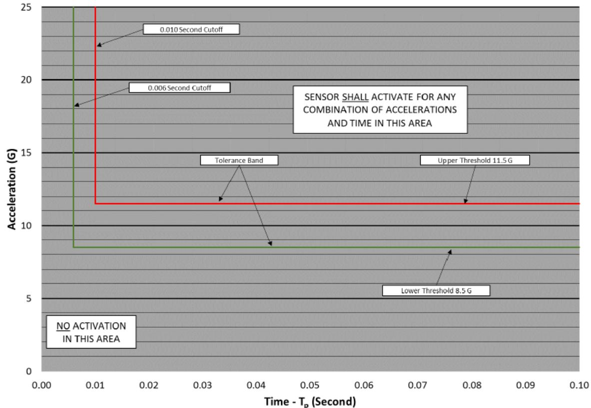  
10 g CRASH ACTIVATION SENSOR RESPONSE CURVE

<table><tr><td>10 g CRASH ACTIVATION SENSOR RESPONSE CURVE</td><td>10g坠机激活传感器响应曲线</td></tr><tr><td>Acceleration (G)</td><td>加速度（G）</td></tr><tr><td>0.010 Second Cutoff</td><td>0.010秒截止</td></tr></table>

FIGURE 5-4: AIRFRAME VERTICAL, LATERAL, AND AFTWARD CRASH ACTIVATION SENSOR RESPONSE CURVE  

<table><tr><td>0.006 Second Cutoff</td><td>0.006秒截止</td></tr><tr><td>Tolerance Band</td><td>公差带</td></tr><tr><td>NO ACTIVATION IN THIS AREA</td><td>该区域未激活</td></tr><tr><td>SENSOR SHALL ACTIVATE FOR ANY COMBINATION OF ACCELERATIONS AND TIME IN THIS AREA</td><td>对于该区域内的加速度和时间的任何组合，传感器应激活</td></tr><tr><td>Upper Threshold 11.5G</td><td>上限阈值 11.5G</td></tr><tr><td>Lower Threshold 8.5G</td><td>下限阈值 8.5G</td></tr><tr><td>Time - Tp(Second)</td><td>时间——Tp(s)</td></tr></table>

图5-4：机身垂直、横向和向后坠机激活传感器响应曲线

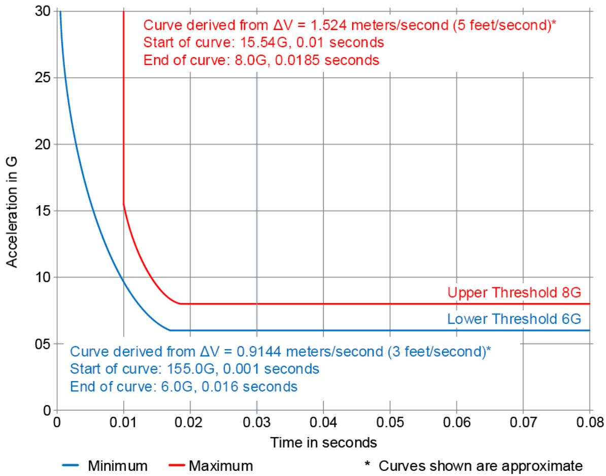

Curve derived from  $\Delta V = 1.524$  meters/second (5 feet/second)*

Start of curve: 15.54G, 0.01 seconds

End of curve: 8.0G, 0.0185 seconds

从  $\Delta \mathrm{V} = 1.524 \mathrm{~m} / \mathrm{s}$  （5ft./s）*导出的曲线

曲线起点：15.54G，0.01s

曲线终点：8.0G，0.0185s

FIGURE 5-5: AIRFRAME FORWARD DIRECTION CRASH ACTIVATION SENSOR RESPONSE CURVE FOR HELICOPTERS  

<table><tr><td>Acceleration in G</td><td>加速度（G）</td></tr><tr><td>Upper Threshold 8G</td><td>上限阈值 8G</td></tr><tr><td>Lower Threshold 6G</td><td>下限阈值 6G</td></tr><tr><td>Curve derived from ΔV = 0.9144 meters/second (3 feet/second)*Start of curve: 155.0G, 0.001 secondsEnd of curve: 6.0G, 0.016 seconds</td><td>从 ΔV=0.9144m/s（3ft./s）*导出的曲线曲线起点：155.0G，0.001s曲线终点：6.0G，0.016s</td></tr><tr><td>Minimum</td><td>最小值</td></tr><tr><td>Maximum</td><td>最大值</td></tr><tr><td>Time in seconds</td><td>时间（s）</td></tr><tr><td>* Curves shown are approximate</td><td>*所示曲线为近似曲线</td></tr></table>

图5-5：直升机机身前进方向坠机激活传感器响应曲线

# CHAPTER 6

# 第6章

# INSTALLED EQUIPMENT PERFORMANCE

# 已安装设备性能

# 6.1 INTRODUCTION

# 6.1简介

The ELT system is not routinely used during normal operations, proper installation is essential to ensuring that it may perform its intended function when required.

ELT系统在正常运行期间不例行使用，正确安装对于确保其在需要时可执行其预期功能至关重要。

ELTs which meet the requirements of this MOPS may not perform properly following asurvivable crash because ELT performance is highly dependent on proper installation and post-installation testing. Safety investigators have identified faulty installation as alleading cause of ELTs failing to perform its intended function when required.

符合本MOPS要求的ELT在发生可幸存坠机后可能无法正常运行，因为ELT性能高度依赖于正确安装和安装后测试。安全调查人员已将安装故障确定为ELT无法在需要时执行其预定功能的主要原因。

This chapter was written based on NASA research $^2$ , recommendations from AccidentInvestigation Organizations, and established best practices to assist ELT manufacturers in developing robust installation manuals.

根据NASA研究²、事故调查组织的建议以及协助ELT制造商编制可靠安装手册的最佳实践，编写了本章内容。

The intent is that the use of robust installation manuals by the installer will better enable the ELT to perform properly following a crash. However, it is the responsibility of the Installer to ensure the ELT system is installed correctly and meets the requirements of the approving authority. This chapter focuses on installation manual specifications and best practices for the automatic fixed, automatic portable, deployable, survival, and distress tracking ELTs.

其目的是，安装人员使用可靠安装手册将更好地使ELT能够在碰撞后正常运行。但是，安装人员有责任确保ELT系统得到正确安装并满足审批机关的要求。本章重点介绍自动固定、自动便携、可展开、生存和遇险跟踪ELT的安装手册规范和最佳实践。

The ELT must be installed in accordance with the aircraft manufacturer's installation instructions or ELT manufacturer's installation instructions, and applicable national regulations.

必须根据航空器制造商的安装说明或ELT制造商的安装说明以及适用的国家法规安装ELT。

An ELT system's compliance to the performance specifications contained in this MOPSare verified through bench and environmental test. However, the ELT systemperformance may be affected by the physical installation (e.g., new antenna placementmay impact radiation patterns). ELT system component installed performancelimitations are generally provided in separate installation guidance related to thefunction(s) provided, such as a manual for an antenna.

通过台架测试和环境试验验证ELT系统是否符合本MOPS中包含的性能规范。然而，ELT系统性能可能受到物理安装的影响（例如，新型天线布置可能影响辐射图）。ELT系统部件安装性能限制通常在与所提供功能相关的单独安装指南（例如天线手册）中提供。

# 6.2 INSTRUCTIONS TO ELT MANUFACTURERS

# 6.2 给 ELT 制造商的说明

Items provided in this chapter must be provided in the installation manual to ensure theELT system is installed correctly and will work properly when needed.

本章提供的项目必须在安装手册中提供，以确保ELT系统安装正确并在需要时正常运行。

# 6.2.1 Scope of Instructions

# 6.2.1 说明范围

This chapter provides a list of items the manufacturers must include in their installation manual. Due to the wide range of aircraft these systems will be installed on, this chapter is not intended to provide comprehensive installation instructions.

本章提供了制造商安装手册中必须包括的项目清单。由于此类系统将安装在多种航空器上，本章无意提供全面的安装说明。

# 6.2.2 Use of the Installation Manual (IM)

# 6.2.2 安装手册（IM）的使用

The installation manual must include the statement "Install the ELT in accordance with this manual or practices approved or accepted by your regulatory authority". This will increase the likelihood that the ELT system will perform properly and reduce the likelihood of inadvertent activation.

安装手册必须包括“根据本手册或贵方监管机构批准或接受的惯例安装ELT”的声明。这将增加ELT系统正常运行的可能性，并降低无意激活的可能性。

# 6.2.3 ELT Registering and Transmitting

# 6.2.3ELT注册和传输

# 6.2.3.1 Required Registration

# 6.2.3.1 所需注册

Per Cospas-Sarsat guidance, the installation manual must state that the ELT must be registered with a national registry or Cospas-Sarsat before the first flight of the aircraft.

根据Cospas-Sarsat指南，安装手册必须说明，在航空器首次飞行之前，ELT必须在国家登记处或Cospas-Sarsat处注册。

The installation manual must include the statement: Information on how to register an ELT can be found in the Cospas-Sarsat Handbook of Beacon Regulations (Document C/S S.007) or at the Cospas-Sarsat website.

安装手册必须包括以下说明：关于如何注册ELT的信息可在Cospas-Sarsat信标管理手册（文件C/S S.007）或Cospas-Sarsat网站上找到。

6.2.3.2 Contacting Authorities for Over-air Testing

6.2.3.2 联系当局进行空中测试

Per Cospas-Sarsat guidance, the installation manual must state the ELT installer mustcontact the National Regulatory Agency where the test will be conducted before radiating over the air unless it is part of a self-test. A list of National Regulatory Agenciescan be found on the Cospas-Sarsat website.

根据Cospas-Sarsat指南，安装手册必须说明ELT安装人员必须联系国家监管机构，除非测试为自检的一部分，否则将在空中辐射之前开展测试。国家监管机构名单可在Cospas-Sarsat网站上找到。

NOTE: Authorization to activate a beacon for testing will only be granted by National Regulatory Agencies in exceptional circumstances.

注：

国家监管机构仅会在特殊情况下授权激活信标进行测试。

6.2.3.3 Contacting Authorities Following Inadvertent Activation

6.2.3.3 无意激活后联系当局

The installation manual must state that installers and owners must contact the local SARPoint of Contact (SPOC) to report an inadvertent ELT activation to precludeunnecessary search and rescue activity. These instructions must indicate that the SPOC contact list can be found on Cospas-Sarsat website.

安装手册必须说明，安装人员和拥有者必须联系当地的SAR联系点（SPOC），报告ELT无意激活事件，以排除不必要的搜救活动。此类说明必须表明可以在Cospas-Sarsat网站上找到SPOC联系人列表。

# 6.2.4 ELT OPERATION

# 6.2.4 ELT操作

6.2.4.1 Handling and Disabling

6.2.4.1 操纵和禁用

The installation manual must provide instructions on how to enable and disable the ELT during maintenance, installation, and handling outside of the aircraft.

安装手册必须说明如何在航空器外部维护、安装和操纵期间启用和禁用ELT。

6.2.4.2 Disabling Following Activation

6.2.4.2 激活后禁用

The installation manual must provide instructions on how to disable or reset the ELTfollowing activation.

安装手册必须说明如何在激活后禁用或重置ELT。

# 6.2.4.3 Special Capabilities

# 6.2.4.3 特殊能力

The installation manual must list any warnings, special capabilities or instruction theELT system may have.

安装手册必须列出ELT系统可能具有的任何警告、特殊功能或说明。

# 6.2.4.4 Reference Documents

# 6.2.4.4 参考文件

The installation manual must provide the list of the documents referenced in AppendixA of this MOPS.

安装手册必须提供本MOPS附录A中引用的文件列表。

# 6.2.4.5 Dynamic Response (response of the ELT system during aircraft operations)

# 6.2.4.5动态响应（航空器运行期间ELT系统的响应）

The installation manual must state: "Operation of the installed equipment not beadversely affected by aircraft maneuvering or changes in attitude encountered during flight operations".

安装手册必须说明：“已安装设备的运行不受航空器机动或飞行运行期间遇到的姿态变化的不利影响。”

# 6.2.4.6 Failure Protection

# 6.2.4.6 故障保护

The installation manual must state that any probable failure of the ELT not degrade thenormal operation of equipment or systems connected to it. Likewise, the failure of interfaced equipment or systems not deactivate or inhibit activation of the ELT.

安装手册必须说明ELT的任何可能故障不会降低与其连接的设备或系统的正常运行。同样，接口设备或系统的故障不会使ELT禁用或抑制ELT的激活。

# 6.2.5 ELT CONTROLS CONSIDERATIONS

# 6.2.5 ELT控制装置考虑因素

# 6.2.5.1 Accessibility

# 6.2.5.1 可及性

The installation manual must include the statement "Install the ELT Remote Control and Monitoring System to be readily accessible from the cockpit crew position in accordance with this manual or practices approved or accepted by your regulatory authority".

安装手册必须包括“根据本手册或贵方监管机构批准或接受的惯例，将ELT远程控制监测系统安装成从驾驶舱机组人员位置易于进入”的声明。

# 6.2.5.2 Cockpit Inadvertent Activation

# 6.2.5.2 驾驶舱无意激活

The installation manual must include the statement "Install the ELT Controls in a manner that reduces the risk of the ELT unit being inadvertently activated (or deployed for an ELT(AD)), in particular by crew entering or exiting their seats. Alternatively, the installer may choose a switch with a guard to prevent inadvertent activation".

安装手册必须包括“安装ELT控制装置时确保降低ELT装置无意激活（或为ELT（AD）展开）的风险，尤其是机组人员进入或离开座位时。或者，安装人员可以选用带有防护装置的开关，以防无意激活”的说明。

# 6.2.5.3 Inadvertent Deactivation

# 6.2.5.3 无意禁用

The installation manual must state that the control(s) need to be protected against being inadvertently turned off when the armed mode has been selected.

安装手册必须说明，选用待命模式时必须保护控制装置，以免被无意禁用。

# 6.2.5.4 View of Visual Indicator

# 6.2.5.4 目测指示器视图

The installation manual must state, that the visual indicator be installed such that thecockpit crew has an unobstructed view of it from the normal seated position.

安装手册必须说明，应将目测指示器安装在驾驶舱机组人员能够从正常乘坐位置无阻碍地看到的位置。

# 6.2.5.5 Indicator Visibility

# 6.2.5.5 指示器可见性

The installation manual must provide a reminder for the installer to ensure the indicatorluminance meets all regulatory requirements for pilot compartment view. The installationmanual may reference AC 23.1311-1C, Installation of Electronic Displays in Part 23Airplanes, or AC 25.11B, Electronic Flight Deck Displays.

安装手册必须为安装人员提供提醒，以确保指示器亮度符合驾驶舱视图的所有法规要求。安装手册可参考AC 23.1311-1C《第23部分航空器中电子显示器的安装》或AC 25.11B《电子飞行甲板显示器》。

# 6.2.5.6 Remote monitoring system

# 6.2.5.6 远程监控系统

The installation manual must state that if the remote monitoring system is dependent on an alternate power source to inform the crew about ELT activation, the availability of this power source must be considered to ensure that ELT activation can be properly monitored. Proper monitoring may be achieved by using a power bus providing themaximum reliability without jeopardizing service to essential or emergency loads, and/orby developing procedures to ensure the proper monitoring of ELT activation before thesource is powered down.

安装手册必须说明，如果远程监控系统依赖于备用电源来向机组人员通知 ELT 激活，则必须考虑该电源的可用性，以确保能够适当监测 ELT 激活情况。通过使用提供最大可靠性而不危害对必要性或应急负载的服务的电源总线，和/或通过开发程序以确保在电源断电之前对 ELT 激活进行适当监测，可以实现适当监测。

# 6.2.6 ELT SYSTEM COMPONENTS LOCATION

# 6.2.6 ELT系统部件位置

6.2.6.1 Location of ELT(AD) Unit with Respect to Inadvertent Deployment  
6.2.6.1 无意展开情况下 ELT（AD）装置的位置

For ELT(AD) unit, the installation manual must state the need to choose a location which will minimize the risk of injury to persons (in particular when on ground) or damage tothe aircraft in the event of inadvertent deployment.

对于ELT（AD）装置，安装手册必须说明需要选择一处位置，以便在无意展开的情况下，将人员受伤（特别是在地面上）或航空器损坏的风险降至最低。

6.2.6.2 Location of ELT(AD) Unit with Respect to Emergencies  
6.2.6.2紧急情况下ELT（AD）装置的位置

If the ELT is the automatic deployable type, the installation manual must state that it isexpected to be installed in a manner that minimizes damage to aircraft structures andsurfaces during deployment.

如果ELT为自动展开型，则安装手册必须说明，预计其安装方式应能将展开过程中对航空器结构和表面的损坏降至最低。

6.2.6.3 Location of ELT(S)

6.2.6.3 ELT（S）位置

If the ELT is an ELT(S), the installation manual must state that the location of the ELT(S)is conspicuously marked and readily accessible unless attached to a life raft or lifesavingcomponent.

如果 ELT 为一台 ELT（S），则安装手册必须说明 ELT（S）的位置有明显标记，且易于接近，除非附在救生筏或救生部件上。

6.2.6.4 Location of ELT(AF), (AP) or (DT)

6.2.6.4 ELT（AF）、（AP）或（DT）的位置

If the ELT is an ELT(AF), (AP) or (DT) type, the installation manual must state that theELT unit and antenna location be located as close to each other as practicable to reduce the risk of the antenna cable breaking.

如果ELT为ELT（AF）、（AP）或（DT），则安装手册必须说明ELT装置和天线位置应尽可能靠近，以降低天线电缆断裂的风险。

6.2.6.5 Location of ELT System Components

6.2.6.5 ELT系统部件的位置

The installation manual must state that the location of the ELT system components beinstalled in locations that minimize:

安装手册必须说明ELT系统部件的安装位置应尽量减小：

The potential for inadvertent activation or inadvertent deactivation

1. 无意激活或无意停用的可能性

. Damage by impact and/or fire

碰撞和/或火灾造成的损坏

. Contact with passengers, baggage or cargo.

与乘客、行李或货物接触。

6.2.6.6 Locating the ELT as Far Aft as Practicable  
6.2.6.6 尽可能将 ELT 置于远离舰尾的位置

The installation manual must state that when selecting a location to install the unit:

安装手册必须说明，在选择装置的安装位置时：

Automatic fixed and deployable type ELT units be installed in a location known to typically sustain less damage in an accident, which is usually as far aft in the aircraft as practicable.

自动固定和可展开型ELT装置安装在已知通常在事故中承受较小损害的位置，该位置通常尽可能远离舰尾。  
The installer should also carefully consider all factors of the installation, such as the need to locate the antenna as close as practicable to the ELT unit.

安装人员还应仔细考虑安装的所有因素，例如需要将天线放置在尽可能靠近ELT装置的位置。

# 6.2.7 ELT MOUNTING

# 6.2.7 ELT安装

6.2.7.1 ELT Unit Mounting  
6.2.7.1 ELT装置安装

ELT(AP), ELT(AF) and ELT(DT)

ELT（AP）、ELT（AF）和ELT（DT）

The installation manual must state that the ELT unit is to be mounted to an appropriate structure and that an appropriate structure is one of the following:

安装手册必须说明ELT装置将安装到适当的结构上，且适当结构是以下结构之一：

a primary aircraft load-carrying structure such as trusses, bulkheads, longerons, spars or floor beams. Aircraft skin is not considered a primary load carrying structure or,  
一种主要的航空器承重结构，如桁架、舱壁、纵梁、翼梁或地板梁。航空器蒙皮不被视为主要的承载结构；  
a mount having a static local deflection no greater than  $2.5\mathrm{mm}$  when a force of 450 Newtons (100 lbf) is applied to the mount in the most flexible direction whendeflection measurements are made with reference to another part of the airframenot less than  $0.3\mathrm{m}$  or more than  $1.0\mathrm{m}$  from the mounting location or,

当相对于离安装位置不小于  $0.3\mathrm{m}$  或大于  $1.0\mathrm{m}$  的机身另一部分进行偏转测量，且450N（100 lbf）的力在最灵活方向施加到支架上时，静态局部偏转不大于  $2.5\mathrm{mm}$  的支架；

installed in accordance with AC 43.13-2B Chapter 2.

按照AC43.13-2B第2章安装的结构。

6.2.7.2 ELT Mounting in Crew Accessible Areas  
6.2.7.2 ELT安装在机组人员可接近区域

The installation manual must state that an ELT should not be installed in a compartment where the ELT unit may be bumped or disturbed (such as a luggage compartment) and that if installation in such a compartment is unavoidable, the installer must ensure theELT is enclosed in a protective cover (unless the ELT is in the cockpit) to mitigate therisk of damage or inadvertent activation.

安装手册必须说明，ELT不应安装在ELT装置可能被碰撞或干扰的舱室（例如行李舱）中，如果无法避免安装在此类舱室，则安装人员必须确保ELT被封闭在保护罩内（除非ELT位于驾驶舱内），以降低损坏或无意激活的风险。

# 6.2.8 ELT Crash Sensor

# 6.2.8 ELT坠机传感器

6.2.8.1 Crash Sensor Orientation Fixed Wing Aircraft  
6.2.8.1坠机传感器定向固定翼航空器

The installation manual must provide prescriptive instructions on properly orienting theELT or crash sensor to detect a crash.

安装手册必须提供有关正确定向ELT或坠机传感器以检测碰撞的指令性说明。

For fixed wing aircraft, the sensor orientation is typically aligned with the longitudinal axis of the aircraft.

对于固定翼航空器，传感器定向通常与航空器的纵向轴线对准。

6.2.8.2 Crash Sensor Orientation Rotorcraft

6.2.8.2 垫机传感器定向旋翼机

The installation manual for ELTs which can be installed in rotorcraft must include prescriptive instructions on how to install an ELT with an integral crash sensor and/or aremote switch so the crash sensor is properly oriented to detect a crash.

可安装在旋翼机上的ELT的安装手册必须包括关于如何安装带有集成坠机传感器和/或远程开关的ELT的指令性说明，以使坠机传感器正确定向以检测碰撞。

6.2.8.3 ELT(AD) Water Activated Sensor

6.2.8.3 ELT（AD）水激活传感器

The installation manual for ELT(AD) systems which incorporate a water activated sensor must state that:

包含水激活传感器的ELT（AD）系统的安装手册必须说明：

The sensor be installed in a location shown to be immersed within a short timeafter the crash, but not subject to water exposure, mechanical wear-out or anyother aggression which may be encountered in the expected aircraft operations

传感器安装在显示为在碰撞后短时间内浸没的位置，但不经受水接触、机械磨损或在预期航空器操作中可能遇到的任何其他侵害。

The location assessment should include the most probable aircraft attitude whencrashed (e.g. its capability to keep an upright position after a ditching or crashover water for an airplane or positions such as upside down or laying on one side for rotorcraft)

位置评估应包括碰撞时最可能的航空器姿态（例如：航空器在水上迫降或碰撞后保持直立状态的能力，或在旋翼机上保持倒置或侧卧姿势的能力）

The installation supporting the automatic deployment when water activated berobust to immersion (Assuming a crash over water or a ditching, water may immerse not only the beacon and the water sensor, but also the wires and the source of power used for the deployment)

当水激活时，支持自动展开的设施具有抗浸入性（假设在水上碰撞或迫降，水不仅可以浸没信标和水传感器，而且可以浸没用于展开的电线和电源）

ELT location with respect to water sensors be taken into account when determining the worst-case design depth for activation.

在确定激活的最坏情况设计深度时，应考虑ELT相对于水传感器的位置。

For ELT(AD) in ADFR where the water sensor can only operate for a limited time afterelectrical power loss, the installation manual must:

对于 ADFR 中的 ELT（AD），如果水传感器在断电后只能工作有限的时间，则安装手册必须：

state the duration for which the water sensor is specified to operate withoutpower; and

说明水传感器指定在无电源情况下运行的持续时间；

, instruct the installer that the ELT(AD) in ADFR must be powered by an externalpower source during a glide phase, of the maximum possible duration for the aircraft in which it is installed, if the duration of that glide phase plus 15 minutesexceeds the stated operational duration for the water sensor.

指示安装人员，如果滑行阶段加15分钟的持续时间超过水传感器规定的工作持续时间，则在滑行阶段安装航空器的最大可能持续时间内，ADFR中的ELT（AD）必须由外部电源供电。

# 6.2.9 ELT BATTERIES

# 6.2.9 ELT电池

ELT's are self-powered devices that require internal or integral batteries to perform their intended function. The installation manual must inform the installer of battery type and any recommended or applicable regulatory installation requirements.

ELT是需要内部或整体电池来执行其预期功能的自供电设备。安装手册必须将电池类型和任何推荐或适用的监管安装要求告知安装人员。

When using an integral battery, the installation manual must state that the battery is mounted in the same manner as the ELT unit which is described in § 6.2.7.1 and that the distance between the battery and the ELT unit be minimized as much as practicable.

当使用整体电池时，安装手册必须说明电池的安装方式与第6.2.7.1条中所述的ELT装置相同，且电池与ELT装置之间的距离应尽可能缩短。

6.2.9.1 ELT Battery Potential Hazards

6.2.9.1 ELT 电池潜在危险

If the ELT battery venting is not contained, the installation manual must include the location of the vent.

安装手册若未包含ELT电池通风装置，则必须包括通风装置的位置。

The installation manual must include any warnings, cautions, or limitations associated with potential battery hazards which could result from mishandling or exceeding temperature limits.

安装手册必须包括与（可能由于操作不当或超过温度限制造成的）电池潜在危险相关的任何警告、注意事项或限制。

6.2.9.2 ELT Battery Expiration Date Marking

6.2.9.2 ELT 电池失效日期标记

The installation manual must include instructions for legibly marking the expiration date for replacing (or recharging) the ELT battery on the outside of the transmitter andentering it into the aircraft maintenance record. The installation manual must state that this marking should be readily visible or traceable without removing the ELT from itsmount.

安装手册必须包括关于清楚标记发射机外部ELT电池更换（或充电）有效期并将其输入航空器维护记录的说明。安装手册必须说明，在不将ELT从其安装架上拆下的情况下，该标记应清晰可见或可追踪。

6.2.9.3 ELT Battery Storage

6.2.9.3 ELT电池存储

The installation manual must state that installing the ELT unit in a location subject to elevated temperatures for prolonged periods of time, (even below the maximum storage temperature), will reduce the operational life of the battery.

安装手册必须说明，将ELT装置安装在温度长期升高的位置（甚至低于最高储存温度），会缩短电池的使用寿命。

# 6.2.10 ELT ENVIRONMENTAL CONDITIONS

# 6.2.10 ELT环境条件

6.2.10.1 Environmental Qualification

6.2.10.1 环境鉴定

The installation manual must state that the ELT system component be installed in a location that meets the environmental qualification of the ELT system component.

安装手册必须说明ELT系统部件安装在符合ELT系统部件环境鉴定的位置。

The installation manual must state that when selecting the ELT, the user must consider the local environmental conditions in the areas to which the beacon will be exposed incase of crash.

安装手册必须说明，在选择ELT时，用户必须考虑碰撞情况下信标暴露区域的当地环境条件。

# 6.2.11 ELT ANTENNA MOUNTING LOCATION

# 6.2.11 ELT天线安装位置

The installation manual must state that the location of the ELT's antenna is considered acceptable if the ELT system meets all applicable specifications of this document.

安装手册必须说明，如果ELT系统满足本文件的所有适用规范，则ELT天线的位置被视为可接受。

The installation manual must list the antennas approved for use with the ELT byCOSPAS-SARSAT and/or national regulatory authorities and the maximum cableattenuation allowed between the ELT and each antenna. It must also state that the useof alternative antennas requires additional regulatory approval.

安装手册必须列出COSPAS-SARSAT和/或国家监管机构批准用于ELT的天线，以及ELT和各条天线之间允许的最大电缆衰减。安装手册还必须说明，使用替代天线需经其他监管批准。

# 6.2.11.1 Externally Mounted Antennas

# 6.2.11.1 外部安装天线

# 6.2.11.1.1 Antenna Mounting Location (except for ELT(AD) and (S))

# 6.2.11.1.1天线安装位置（ELT（AD）和（S）除外）

The installation manual must state that the antenna mounting structure be able to withstand a static load equal to 100 times the antenna weight applied at the antenna mounting base in all directions which can be demonstrated by either test or conservative analysis. It must also state that as a general guideline, for high-wing aircraft, the top of the fuselage and aft of the wing is typically the best location for an ELT antenna and for low-wing aircraft, placing the antenna near the vertical stabilizer is typically the best location.

安装手册必须说明，天线安装结构能够承受等于在所有方向上施加在天线安装基座上的天线重量的100倍的静态载荷，这可以通过测试或保守分析来证明。还必须说明，作为一般准则，对于上单翼机，机身顶部和机翼尾部通常是ELT天线的最佳位置；对于下单翼机，将天线放置在垂直尾翼附近通常是最佳位置。

# 6.2.11.1.2 Antenna Proximity to the ELT

# 6.2.11.1.2天线接近ELT

If the ELT is an ELT(AF), ELT(AP) or ELT(DT) type, the installation manual must state that the ELT and antenna be located as close to each other as practical to reduce therisk of the antenna cable breaking.

如果ELT为ELT（AF）、ELT（AP）或ELT（DT），则安装手册必须说明ELT和天线的位置应尽可能靠近，以降低天线电缆断裂的风险。

When separate antennas are used for an ELT's internal or integral GNSS receiver and the transmission of the 406 MHz signals, the installation manual must state that theseantenna be located as close as practicable to the ELT unit.

当单独天线用于ELT内部或整体GNSS接收机以及  $406\mathrm{MHz}$  信号的传输时，安装手册必须说明此类天线的位置尽可能靠近ELT装置。

# 6.2.11.1.3 Antenna Placement with Regard to Other Antennas

# 6.2.11.1.3天线相对于其他天线的放置

The installation manual must state that, as a rule of thumb, 0.9 meters (36 inches) should be the minimum distance between antennas and if the antenna must be mounted closer than 0.9 meters, analysis or testing, such as that described in section § 6.2.15, will need to be accomplished to ensure the systems do not interfere with each other.

安装手册必须说明，根据经验法则，天线之间的最小距离应为  $0.9\mathrm{m}$ （36in.），如果天线的安装距离必须小于  $0.9\mathrm{m}$ ，则需要进行分析或测试（如第6.2.15条所述），以确保系统不会相互干扰。

# 6.2.11.1.4 Antenna Orientation

# 6.2.11.1.4天线定向

The installation manual must provide guidance on properly orienting the antenna. Typically, ELT antennas are oriented as close to vertical as practical, (and should be optimized based on the design of the antenna), based on the aircraft's normal flightattitude. The installation manual must also include a recommendation for the ELTantenna location to maximize the unobstructed view of the sky.

安装手册必须提供正确定向天线的指南。通常，根据航空器的正常飞行姿态，ELT天线被定向为尽可能接近垂直方向（并且应该根据天线的设计进行优化）。安装手册还必须包括建议的ELT天线位置，以尽量扩大天空的无障碍视野。

# 6.2.11.1.5 Antenna Ground Plane

# 6.2.11.1.5天线地平面

The instruction manual must instruct the installer to ensure the antenna has an acceptable ground plane.

使用手册必须指示安装人员确保天线具有可接受的地平面。

# 6.2.11.1.6 Antenna Coverings

# 6.2.11.1.6天线罩

The installation manual must state that any additional antenna covering not degradeEquivalent Isotropically Radiated Power (EIRP), more than 0.2 db within the frequencyband from 406.0 to  $406.1\mathrm{MHz}$ .

安装手册必须说明，任何附加天线罩不得在406.0至  $406.1\mathrm{MHz}$  的频带内将等效各向同性幅射功率（EIRP）降低0.2db以上。

# 6.2.11.2 Internally Mounted Antennas

# 6.2.11.2 内部安装天线

6.2.11.2.1 Location of an External Antenna Mounted Internally

# 6.2.11.2.1 内部安装的外部天线的位置

An external antenna is intended for location and use external to the aircraft. The installation manual must state an external antenna, which is mounted internal to the aircraft, be located such that the aircraft structure not reduce the Equivalent Isotropically Radiated Power (EIRP) transmitted by the antenna by more than 0.2dB within the frequency band from 406.0 to 406.1 MHz, and the antenna be mounted as close to the ELT unit as practicable.

外部天线旨在用于航空器外部的定位和使用。安装手册必须说明安装在航空器内部的外部天线的位置应确保航空器结构不会在406.0至  $406.1\mathrm{MHz}$  的频带内使天线发射的等效各向同性辐射功率（EIRP）降低0.2dB以上，且天线应尽可能靠近ELT装置安装。

6.2.11.3 ELTs with Integral and Internal Antennas  
6.2.11.3 带整体和内部天线的ELT  
6.2.11.3.1 Location of Integral Antenna and of ELT with Internal Antenna  
6.2.11.3.1 整体天线和带内部天线的 ELT 的位置

For ELT(AF), ELT(AP) and ELT(DT) if the ELT has only an Integral or Internal Antenna, the installation manual must state that the ELT be located such that the aircraft structuredoes not reduce the Equivalent Isotropically Radiated Power (EIRP) transmitted by theIntegral Antenna by more than  $0.2\mathrm{dB}$  within the frequency band from 406.0 to406.1 MHz.

对于ELT（AF）、ELT（AP）和ELT（DT）（如果ELT仅装有一条整体天线或内部天线），安装手册必须说明，ELT的位置应确保航空器结构在从406.0到  $406.1\mathrm{MHz}$  的频带内不会将整体天线发射的等效各向同性辐射功率（EIRP）降低0.2dB以上。

# 6.2.12 ELT ANTENNA CABLES

# 6.2.12 ELT天线电缆

6.2.12.1 Antenna Cable Specifications  
6.2.12.1天线电缆规格

The installation manual must provide details of the cable specifications and the maximum and minimum cable attenuation allowed between the ELT and the installed antenna. The installation manual must state that if antenna cabling is not included as part of the ELT system, or if it is not used, the antenna cable selected by the installer meet the specifications of this document.

安装手册必须详细说明电缆规格以及ELT和已安装天线之间允许的最大和最小电缆衰减。安装手册必须说明，如果天线电缆不作为ELT系统的一部分或者如果不使用，则安装人员选用的天线电缆符合本文件的规范。

6.2.12.2 Cable Strain Relief

6.2.12.2 电缆应变消除

The installation manual must state that when the coaxial cable is installed, using acceptable methods, techniques, and practices, and the connectors mated, each endhave appropriate cable strain relief, which is at least  $15~\mathrm{cm}$ , (6 in), of excess cable nearthe ELT and the antenna.

安装手册必须说明，当使用可接受的方法、技术和实践安装同轴电缆并且连接器配合时，各端在ELT和天线附近多余电缆至少  $15\mathrm{cm}$  （6in）处均应具有适当电缆应变消除。

6.2.12.3 Antenna Cable Routing Over Break Points  
6.2.12.3天线电缆在断点上的布线

The installation manual must state that the antenna cable avoid crossing, to themaximum extent practicable, over areas known to break apart in a crash (i.e. where thetail boom is mounted to the fuselage of a helicopter or the point where the aft cabin isattached to the rest of the fuselage). The installation manual must state that, to themaximum extent practicable, the antenna be located at the same longitudinal section ofthe aircraft as the ELT and that coaxial cable connecting the antenna to the ELT notcross aircraft production breaks, which occur along the primary sections in which theirairframe is manufactured and joined. The most sensitive production break relevant to typical ELT(AF) installations is the joint formed at the aft cabin-to-tail sections.

安装手册必须说明，天线电缆应尽可能避免穿过已知在碰撞中断裂的区域（即：尾桁架安装在直升机机身上的位置或后舱与机身其余部分连接的位置）。安装手册必须说明，在可行的最大程度上，天线应位于与ELT相同的航空器纵向截面上，且将天线连接至ELT的同轴电缆不得与航空器工艺分离面（发生在制造和连接机身的基本断面上）交叉。与常用ELT（AF）装置相关的最敏感的工艺分离面是在后舱到尾部部分形成的接头。

# 6.2.12.4 Cable Minimum Support Interval

# 6.2.12.4 电缆最小支撑间隔

The installation manual must state that the antenna cabling be mounted to the aircraft using acceptable methods, techniques, and practices and supported with clamps notcloser than 0.3 meters (12 inches) from the ends and a maximum of 0.8 meters(24 inches) apart.

安装手册必须说明，天线电缆应采用可接受的方法、技术和实践安装到航空器上，并由距离端部不超过  $0.3\mathrm{m}$  （12in）、最大间距不超过  $0.8\mathrm{m}$  （24in）的夹具支撑。

# 6.2.12.5 Cable Bend Radii

# 6.2.12.5 电缆弯曲半径

The installation manual must specify antenna cable bend limitations, if antenna cable isprovided with the ELT system.

如果天线电缆配有ELT系统，安装手册必须规定天线电缆弯曲限制。

The installation manual must state that if antenna cables are not included as part of the ELT system provided, or if they are not used, the antenna cables selected by the installer are bent at a radius of no less than 6 times the outside diameter of the cable.

安装手册必须说明，如果所提供的ELT系统不包括天线电缆，或者如果不使用天线电缆，则安装人员选用的天线电缆的弯曲半径不得小于电缆外径的6倍。

# 6.2.12.6 ELT Antenna Cable Fire Protection

# 6.2.12.6 ELT天线电缆防火

The installation manual must recommend adding a fire sleeve to the antenna cablewhich meets one of the following specifications:

安装手册必须建议在天线电缆上增设符合以下任一规格的防火套管：

ISO 2685 (Category 5 "Fire resistant"), or

ISO2685（第5类“耐火”）；

SAE AS1072/AS1055 (construction / performance), or  
SAEAS1072/AS1055（结构/性能）；或  
EN 6049-009.  
. EN 6049-009。

# 6.2.12.7 Window Casings

# 6.2.12.7 窗套

The installation manual must state that antenna cables that pass near window casingsor over bulkheads should be protected from being cut by the metal edges during a crash.

安装手册必须说明，在碰撞过程中，应防止靠近窗套或越过舱壁的天线电缆被金属边缘切断。

# 6.2.13 NAVIGATION SYSTEMS

# 6.2.13 导航系统

# 6.2.13.1 GNSS Cabling

# 6.2.13.1 GNSS电缆

If a GNSS antenna is connected to an ELT system with an embedded GNSS, the installation manual must state that the cabling meets the cabling specifications outlined in the ELT antenna and cabling section of this document.

如果 GNSS 天线连接到装有嵌入式 GNSS 的 ELT 系统，则安装手册必须说明电缆敷设符合本文件 ELT 天线和电缆敷设部分中概述的电缆敷设规范。

# 6.2.13.2 External position source

# 6.2.13.2 外部位置源

If the ELT is capable of receiving position data from an external navigation system, such as one already certified on the aircraft, the installation manual must provide navigation system-ELT interfacing information to include expected and or required input labels / sentences.

如果ELT能够从外部导航系统（例如已经在航空器上认证的导航系统）接收位置数据，则安装手册必须提供导航系统-ELT接口信息以涵括预期和/或所需的输入标签/语句。

# 6.2.14 ELT(DT)

# 6.2.14 ELT (DT)

The installation manual must detail the interface of the arming/disarming mechanism asspecified in  $\S 2.9.5.1$ .

安装手册必须详细说明第2.9.5.1条中规定的待命/解除装备机制的接口。

The installation manual must detail measures that should be taken (such as setting theELT in OFF mode) to avoid nuisance activation during maintenance operations of theaircraft and to restore the function afterwards.

安装手册必须详细说明应采取的措施（如将ELT设置为关闭模式），以免在航空器维护作业期间出现有害激活，并在之后恢复功能。

The installation manual must specify that the controls for the maintenance input areinaccessible during routine flight operations.

安装手册必须规定，在常规飞行作业期间无法使用维护输入控制装置。

# 6.2.15 TESTING OF INSTALLED SYSTEMS

# 6.2.15 已安装系统的测试

The installation manual must provide post installation inspection and testing procedures for installers who do not have inspection or testing procedures which ensure the ELTsystem is properly installed to perform its intended function. Conditions of test and procedures outlined in  $\S 6.2.15.2$  and  $\S 6.2.15.3$  is one way to accomplish this.

安装手册必须为未制定确保ELT系统正确安装以执行其预期功能的检验或测试程序的安装人员提供安装后检验和测试程序。第6.2.15.2条和第6.2.15.3条中概述的测试条件和程序是实现这一目的的一种方法。

6.2.15.1 Installed Equipment Performance Considerations  
6.2.15.1 已安装设备性能考虑  
6.2.15.1.1 Dynamic Response (response of the ELT system during aircraft operations)  
6.2.15.1.1动态响应（航空器运行期间ELT系统的响应）

The installation manual must include steps, such as those outlined in § 6.2.15.2 and § 6.2.15.3, that verify that the operation of the installed ELT system not be adversely affected by aircraft ground operations or by changes in attitude encountered in normalflight operations.

安装手册必须包括如第6.2.15.2条和第6.2.15.3条中所述的步骤，以验证已安装ELT系统的运行不会受到航空器地面作业或正常飞行作业中遇到的姿态变化的不利影响。

6.2.15.1.2 Interference Effects

6.2.15.1.2 干扰效应

The installation manual must include steps, such as those outlined in § 6.2.15.2 and § 6.2.15.3, that verify that the installed ELT system not be a source of harmful conducted or radiated interference to other aircraft systems and that it not be adversely affected by conducted or radiated interference from other aircraft systems.

安装手册必须包括如第6.2.15.2条和第6.2.15.3条中所述的步骤，以验证已安装ELT系统不会对其他航空器系统造成有害的传导或辐射干扰，且不会受到其他航空器系统传导或辐射干扰的不利影响。

NOTE: Electromagnetic compatibility problems noted after installation may result from such factors as design characteristics of previously-installed systems or the physical installation itself. It is not intended that the ELT manufacturer design for all installation environments. The installing facility is responsible for resolving any incompatibility between this ELT system and previously-installed equipment in the aircraft. The various factors contributing to incompatibility must be considered.

安装后注意到的电磁兼容性问题可能由诸如先前安装系统的设计特性或物理安装本身之类的因素引起。并非有意让ELT制造商为所有安装环境进行设计。安装机构负责解决该ELT系统与航空器中先前安装设备不兼容的任何问题。必须考虑导致不兼容的各种因素。

6.2.15.2 Conditions of Test

# 6.2.15.2 测试条件

Conditions stated in the following paragraphs are applicable to the ELT system testsspecified in  $\S 6.2.15.3$

以下段落中规定的条件适用于第6.2.15.3条中规定的ELT系统测试。

# 6.2.15.2.1 Power Input

# 6.2.15.2.1 电源输入

The installation manual must state that unless otherwise specified, system tests be conducted with relevant aircraft equipment, that could affect, or be affected by, the ELTsignal, powered by the aircraft's electrical system.

安装手册必须说明，除非另有规定，否则应使用相关的航空器设备进行系统测试，此类设备可能会影响航空器电气系统供电的ELT信号或受到该信号的影响。

# 6.2.15.2.2 Relevant Equipment or Systems

# 6.2.15.2.2 相关设备或系统

The installation manual must state that unless otherwise specified, all aircraft electrically operated relevant aircraft equipment be operational before conducting interferencetestst.

安装手册必须说明，除非另有规定，所有航空器电动相关航空器设备在进行干扰测试前均可运行。

# 6.2.15.2.3 Environment

# 6.2.15.2.3 环境

The installation manual must state that the ELT system not be subjected to environmental conditions that exceed those specified by the ELT system manufacturer.

安装手册必须说明ELT系统不受超过ELT系统制造商规定的环境条件的影响。

# 6.2.15.3 Test Procedures for Installed Equipment Performance

# 6.2.15.3 已安装设备性能测试程序

The test procedures set forth below are considered satisfactory for determining required installed equipment performance. Although specific test procedures are cited, it is recognized that other methods may be preferred by the installing activity. These alternate procedures may be used if the installing activity can show that they provide at least equivalent information. In such cases, the procedures cited herein should be used as criteria in evaluating the acceptability of the alternate procedures.

对于确定所需的安装设备性能，下述测试程序被视为适当程序。虽然引用了具体的测试程序，但应认识到，安装活动可能首选其他方法。如果安装活动可以显示出替代程序至少提供了等效信息，则可以使用此类替代程序。在此类情况下，应将本文引用的程序用作评估替代程序可接受性的标准。

# 6.2.15.3.1 Conformity Inspection (AF), (AP), (AD), (DT), and (S)

# 6.2.15.3.1 符合性检验（AF）、（AP）、（AD）、（DT）和（S）

Installers who do not have alternative inspection or testing procedures must visuallyinspect the installed equipment to determine the use of acceptable workmanship and engineering practices. Verify that all mechanical

and electrical connections have beenconnected properly and the equipment has been located and installed in accordance with the manufacturer's recommendations.

未制定替代检验或测试程序的安装人员必须目视检查已安装的设备，以确定是否采用可接受的工艺和工程实践。确认所有机械和电气连接已正确连接，设备已按照制造商的建议进行定位和安装。

# 6.2.15.3.2 Ground Test Procedures

# 6.2.15.3.2 地面测试程序

The installation manual must state that a self-test be initiated after installation to ensure the ELT system is operational.

安装手册必须说明，在安装之后必须启动自检，以确保ELT系统可运行。

The installation manual must provide instructions on how to self-test the ELT system(including the GNSS self-test if equipped).

安装手册必须提供如何自检ELT系统（包括自检GNSS，如果配备）的说明。

The installation manual must state the number of times the ELT unit can be self-tested before it drops below the stated minimum power level required to perform its intended function.

安装手册必须说明ELT装置在低于执行其预定功能所需的规定最小功率电平之前可进行自检的次数。

The installation manual must state that initiating a self-test will use a portion of the ELTbattery, unless aircraft power is used.

安装手册必须说明，除非使用航空器电源，否则启动自检将使用部分ELT电池。

The installation manual must state that ELT testing, (other than self-tests), should avoid outside radiation and that any bench or ground tests not conducted in an RF-shieldedenclosure should use a  $50\Omega$  dummy load.

安装手册必须说明ELT测试（自检除外）应避免外部辐射，任何未在屏蔽RF的外壳中进行的台架或地面测试应使用  $50\Omega$  的虚拟负载。

6.2.15.3.3 Equipment Accessibility (AF), (AP), (AD), (DT), and (S)

6.2.15.3.3 设备可达性（AF）、（AP）、（AD）、（DT）和（S）

Determine that all equipment controls are readily accessible and that displayed data are easily interpreted.

确定所有设备控制装置易于使用，显示的数据易于解释。

6.2.15.3.4 Remote Indicator(s) and Control

6.2.15.3.4 远程指示器和控制

If equipped, the installation manual should state the installer test the ELT controls toverify they are operational and correctly connected by verifying the following:

如果配备，安装手册应说明安装人员测试ELT控制装置，以通过验证以下各项来验证此类装置的运行和正确连接：

The ELT remote control functions in each mode, (armed, on, reset and self-test).

.各模式下的ELT远程控制功能（待命、开启、重置和自检）。

NOTE 1: Cospas-Sarsat does not allow broadcasting over the air by turning an ELT ON unless coded with a special test protocol in coordination with local point of contact.  
注1:

Cospas-Sarsat 不允许通过打开 ELT 进行空中广播，除非使用与本地接触点协调的特殊测试协议进行编码。

NOTE 2: A  $50\Omega$  dummy load can be used in place of the antenna testing performed in an RF-shielded enclosure. Otherwise, a minimum  $40~dB$  dummy load must be used in place of the antenna to ensure the ELT does not broadcast.

可以使用  $50 \Omega$  的虚拟负载来代替在屏蔽  $RF$  的外壳中执行的天线测试。否则，必须使用最小  $40 \mathrm{~dB}$  的虚拟负载来代替天线，以确保 ELT 不广播。

If installed, the ELT aural indicator is audible with the aircraft engine(s) off, and that the visual indicator can be seen from the cockpit crew normal sitting position.

如果安装，在航空器发动机关闭的情况下，ELT音响指示器是可以听到的，并且目测指示器可以从驾驶舱机组人员正常乘坐位置看到。

# 6.3 ADDITIONAL INTEGRATION CONSIDERATIONS

# 6.3 附加集成考虑因素

This section provides additional considerations for system designers, integrators and certifiers that are working on ELT(DT), or ELT(AD) systems, or aircraft that are equipped with a parachute survival system.

对于从事ELT（DT）或ELT（AD）系统或装有降落伞救生系统的航空器相关工作的系统设计人员、集成人员和认证人员，本节提供了附加考虑因素。

# 6.3.1 ELT(DT)

# 6.3.1 ELT (DT)

6.3.1.1 Automatic disarming  
6.3.1.1 手动解除装备  
An ELT(DT) system should only be automatically disarmed if it receives an appropriate signal as described in § 2.9.5. Therefore, the integration with the system sending the signal(s) should be carefully evaluated to avoid designing an installation where the loss of a signal or interface during distress conditions may be incorrectly interpreted as a command to disarm the ELT.  
当ELT（DT）系统接收到第2.9.5条中所述的适当信号时，方可自动解除该系统。因此，应仔细评估与发送信号的系统的集成，以免将装置设计为在遇难情况下信号或接口丢失可能被错误地解释为解除ELT的命令。  
6.3.1.2 External autonomous power source  
6.3.1.2 外部自主电源

An external autonomous power source should receive its electrical power from the busthat provides the maximum reliability for operation of the ELT system without jeopardizing service to essential or emergency loads.

外部自主电源应当从总线处接收其电源，为ELT系统运行提供最大可靠性，而不会危及必要性或应急负载的服务。

# 6.3.2 ELT(AD)

# 6.3.2 ELT (AD)

For ELT(AD) installed on aircraft which have other discernible emergency activationssuch as water activated switches designed into the ELT(AD) system or flotation devices(flotation bags), life rafts, and emergency exits; then it is recommended that activationof the emergency device also be used as an alternate trigger to activate the ELT(AD).

对于安装在具有其他可识别紧急激活的航空器上的ELT（AD），如设计在ELT（AD）系统或漂浮装置（漂浮袋）、救生筏和紧急出口中的水激活开关；建议将应急装置的激活也用作激活ELT（AD）的替代触发器。

# 6.3.3 AIRCRAFT WITH PARACHUTE SYSTEMS

# 6.3.3 带有降落伞系统的航空器

# 6.3.3.1 Aircraft Parachutes

# 6.3.3.1 航空器降落伞

Some aircraft are equipped with an airframe parachute system, which when deployed will result in impact forces too weak for the crash sensor to activate the ELT. Such installations should be designed such that the ELT is automatically activated by the parachute deployment.

特定航空器配备了机体降落伞系统，当展开时，冲击力太弱，坠机传感器无法激活ELT。此类装置的设计应确保通过降落伞展开将ELT自动激活。

# CHAPTER 7

# 第7章

# INSTALLED OPERATIONAL CHARACTERISTICS AND MAINTENANCE

# 安装运行特性和维护

# 7.1 INTRODUCTION

# 7.1简介

The following paragraphs give guidance to the ELT manufacturer on items to be specified in customer supplied documentation to ensure ELT system continued performance.

以下段落就客户所提供文件中规定的项目向ELT制造商提供指导，以确保ELT系统的持续性能。

# 7.2 PROCEDURES, TESTS AND INSPECTIONS

# 7.2 程序、测试和检查

To ensure that ELT operations can be conducted safely and reliably in the expected operational environment, there are specific minimum acceptable performanceparameters that must be met. The following paragraphs identify those ELT system tests that constitute, if met, an overall confidence check of ELT system operation.

为确保ELT能够在预期操作环境中安全可靠地运行，必须满足特定的最低可接受性能参数。以下段落确定了构成ELT系统运行的总体置信度检查（如果满足）的ELT系统测试。

# 7.2.1 Pre-Flight Procedures

# 7.2.1 飞行前程序

Determine that the ELT ((AF), (AP), (DT) or (AD)) remote control is in the armedposition. For ELT(S) set switch on ELT to off or armed if so equipped.

确定ELT（（AF）、（AP）、（DT）或（AD)）远程控制装置处于待命位置。对于ELT（S)，如果装备，则将ELT上的开关设置为关闭或待命。

# 7.2.2 Post-Flight Procedures

# 7.2.2 飞行后程序

For ELT with crash survivability, determine by using the activation indicator(s) or by monitoring  $121.5\mathrm{MHz}$  with a VHF receiver that the ELT is not transmitting.

对于具有坠机幸存的ELT，通过使用激活指示器或通过使用甚高频接收机监测121.5MHz来确定ELT未发射。

# 7.2.3 Functional Tests

# 7.2.3功能测试

Perform the self-test function according to manufacturer's recommendation.

按照制造商的建议执行自检功能。

# 7.2.4 Periodic Inspection

# 7.2.4 定期检查

The periodic inspection must occur at every planned battery replacement, unless required more frequently by airworthiness authorities or the manufacturer.

定期检查必须在每次计划的电池更换时进行，除非适航当局或制造商要求更频繁地更换。

The following items should be included, as appropriate, on any inspection unless otherwise required by airworthiness authorities:

除非适航当局另有要求，以下项目应酌情包括在任何检查中：

a) Inspect antenna(s) and antenna cables and terminals. Remove all interconnections to the ELT antenna. Visually inspect and confirm proper seating of all connector pins.  
a）检查天线、天线电缆和端子。拆除所有与ELT天线的互连。目视检查并确认所有连接器销正确就位。  
b) Remove the ELT Unit from the mount and inspect the mounting hardware. Allrequired mounting hardware should be installed and secured. In the case ofELT(AD), inspect the releasing mechanism and confirm the absence of corrosion and unexpected deposits.  
b) 从支座上拆卸 ELT 装置并检查安装硬件。应安装并固定所有必需的安装硬件。在 ELT（AD）的情况下，检查释放机制并确认无腐蚀和意外沉积物。  
c) Remove and inspect ELT battery compartment. No corrosion should be detectable. Verify the ELT battery expiration date.  
c）拆卸并检查ELT电池舱。不应检测到腐蚀。验证ELT电池的失效日期。  
d) In case a water activated switch is installed, gain access to the switch, inspectwiring and verify the absence of water ingress.  
d）如果安装了水激活开关，则进入开关，检查接线，并验证是否有水进入。  
e) A functional check of the crash sensor is recommended. The 406 MHz signalneeds to be attenuated by a minimum of 40 dB to prevent probable satellitesdetection, avoid false alarm and subsequent response by a Rescue CoordinationCenter (RCC). This may be accomplished by connecting the antenna output to anon-radiating load. It is recommended that the test be performed only by qualifiedavionics technicians. Activate the ELT. This may normally be accomplished by using a forward throwing motion coupled by a rapid reversing action or by ameans determined by the manufacturer. Verify that the ELT has activated, resetthe ELT.  
e）建议对坠机传感器进行功能检查。406MHz信号需要被衰减至少40dB，以防止可能的卫星检测、避免误报警以及救援协调中心（RCC）的后续响应。这可以通过将天线输出连接到非辐射负载来实现。建议仅由合格的航空电子技术人员进行试验。激活ELT。这通常可通过使用由快速反向动作或由制造商确定的方法结合的向前投掷运动来实现。确认ELT已激活，重置ELT。  
f) Measure transmission frequencies and power output. Activate the ELT by using the self-test function, and determine if the antenna is radiating a  $121.5\mathrm{MHz}$  signal with the appropriate transmission power (i.e., within the limits specified by the ELT manufacturer). One method could be as follows. The signal can be heard through a low-quality AM broadcast receiver tuned between 800 and  $1200\mathrm{kHz}$  and held about six inches away from the antenna. A field strength meter may also be used to measure a radiated field of at least one volt per meter at

approximately  $0.6\mathrm{m}$  (2 ft) or equivalent. Because the ELT radiates on the emergency frequency, authorities only allows these tests to be conducted within the first five minutes after any hour and limits the transmitter audio modulation of the  $121.5\mathrm{MHz}$  signal to three sweeps of the  $121.5\mathrm{MHz}$  signal. Activate the ELT using the self-test function and determine if the antenna is radiating a  $406\mathrm{MHz}$  signal with the appropriate transmission power (i.e., within the limits specified by the ELT manufacturer). Use an appropriate test system (i.e. Beacon Tester) to monitor the  $406\mathrm{MHz}$  output and check the frequency, power level and encoded message are correct. Reinstall the ELT on the aircraft.

f）测量传输频率和功率输出。通过使用自检功能激活ELT，并确定天线是否以适当发射功率（即，在ELT制造商规定的限值内）发射  $121.5\mathrm{MHz}$  的信号。一种方法可以如下。信号可以通过距离天线约6in并调谐在800至  $1200\mathrm{kHz}$  之间的低质量调幅广播接收机听到。场强计也可用于测量大约  $0.6\mathrm{m}$  （2ft)或同等条件下每米至少1伏的辐射场。由于ELT以紧急频率辐射，当局仅允许在任何时间后的前五分钟内开展此类测试，并将  $121.5\mathrm{MHz}$  信号的发射机音频调制限制为  $121.5\mathrm{MHz}$  信号的三次扫描。通过使用自检功能激活ELT，并确定天线是否以适当发射功率（即，在ELT制造商规定的限值内）发射  $406\mathrm{MHz}$  的信号。使用适当测试系统（即信标测试仪）监测  $406\mathrm{MHz}$  的输出，并检查频率、功率电平和编码信息是否正确。将ELT重新安装到航空器上。

NOTE: It is particularly important to verify that the content of the encoded message matches the new aircraft ID if the ELT is moved from one aircraft to another.

如果ELT从一架航空器移动到另一架航空器，验证编码信息的内容是否与新的航空器识别号匹配尤为重要。

g) After reinstatement of the ELT unit on-board the aircraft, the ELT should be tested in accordance with the Test Procedures for Installed Equipment Performance.  
g）在航空器上重新安装ELT装置后，ELT应按照安装设备性能测试程序进行测试。

# APPENDIX A

附录A

# A.1 RELATED DOCUMENTS

# A.1 相关文件

This section provides a list of documents related to ELT systems. While extensive, this list of related documents is not all inclusive. Furthermore, since these documents are revised on a regular basis, the reader should refer to the latest version unless a specific version is referenced.

本节列出了与ELT系统相关的多份文件。虽然内容广泛，但列出的相关文件并不包含所有内容。此外，由于此类文件定期修订，读者应参考最新版本，除非参考了特定版本。

# A.2 ARINC DOCUMENTS

# A.2 ARINC 文件

ARINC documents, can be obtained from ARINC industry activities, 16701 Melford Blvd, suite 120, bowie, md 20715, or by calling +1 (240) 334-2578, or from the ARINC standards store at the following address: http://www.aviation-ia.com/cf/store/

ARINC 文件可从 Melford 大道 16701 号 120 室 bowie（邮编：20715）处的 ARINC 工业活动中心，或通过拨打+1（240）334-2578，或从以下地址的 ARINC 标准商店获得：http://www.aviation-ia.com/cf/store/

digital information transfer system (DITS) part 1 functional description, electrical interfaces, label assignments and word formats ARINC specification 429 part1-18

数字信息传输系统（DITS)第1部分功能描述、电气接口、标记分配和文字格式ARINC规范429第1-18部分

mark 33 digital information transfer system (DITS) part 2 discrete word datastandards ARINC specification 429 part 2-16

.标记33数字信息传输系统（DITS）第2部分离散字数据标准ARINC规范429第2-16部分

. mark 33 digital information transfer system (DITS) part 3 file data transfertechniques ARINC 429 part 3-19

3. 标记 33 数字信息传输系统（DITS）第 3 部分文件数据传输技术 ARINC 429 第 3-19 部分

digital information transfer system (DITS) part 4 archive of ARINC 429supplements ARINC 429 part 4.

ARINC429数字信息传输系统（DITS）第4部分档案补充了ARINC429第4部分。

# A.3 CANADIAN DOCUMENTS

# A.3 加拿大文件

# A.3.1 Laws

# A.3.1 法律

Laws can be obtained from the Canadian Justice Laws Website at: http://lawslois-justice.gc.ca/eng/regulations/SOR-96-433/

可从加拿大司法法律网站获取法律，网址为：http://lawslois-justice.gc.ca/eng/regulations/SOR-96-433/  
Canadian Aviation Regulation (CAR) CAR 605.38: ELT Requirements  
.加拿大航空条例（CAR）CAR605.38：ELT要求  
Canadian Aviation Regulation (CAR) 605.39: Use of ELTs  
.加拿大航空条例（CAR）605.39：使用ELT  
Canadian Aviation Regulation (CAR) 605.40: ELT Activation  
加拿大航空条例（CAR）605.40：ELT 激活  
Airworthiness Manual (AWM) AWM 551.104: Emergency Locator Transmitter  
适航性手册（AWM）AWM551.104：紧急定位器发射机  
Airworthiness Manual (AWM) AWM 525/527/529.1415  
适航性手册（AWM）AWM525/527/529.1415  
Standard 571, Appendix G: Maintenance of Emergency Locator Transmitters  
标准571，附录G：紧急定位器发射机的维护

# A.3.2 General Guidance

# A.3.2 通用指南

General guidance on the use of ELTs in Canada can be obtained at:https://www.tc.gc.ca/eng/civilaviation/certification/elt-65.htm

关于在加拿大使用ELT的通用指南，可从以下网址获得：https://www.tc.gc.ca/eng/civilaviation/certification/elt-65.htm

# A.3.3 Radio Standards Specifications (RSS)

# A.3.3无线电标准规范（RSS）

RSS standards can be obtained from the Radio Equipment Standards page of the Spectrum Management and Telecommunications website at:https://www.ic.gc.ca/eic/site/smt-gst.nsf/eng/sf08736.html

RSS标准可从频谱管理和电信网站的无线电设备标准页面获取，网址为：https://www.ic.gc.ca/eic/site/smt-gst.nsf/eng/sf08736.html

RSS-287 EPIRB, ELT, PLB, and Maritime Survivor Locator Devices (MSLD)

RSS-287 EPIRB、ELT、PLB和海上幸存者定位装置（MSLD）

# A.3.4 Technical Standards Orders (TSO)

# A.3.4 技术标准指令（TSO）

ELT design approvals are granted to applicants based on the standards contained within AWM 537

根据AWM537中包含的标准向申请人授予ELT设计批准

# A.4 COSPAS-SARSAT DOCUMENTS

# A.4 COSPAS-SARSAT文件

Cospas-Sarsat documents can be obtained from the Cospas-Sarsat website:https://www.cospas-sarsat.int/en/documents-pro/system-data  
可从Cospas-Sarsat网站获得Cospas-Sarsat文件：https://www.cospas-sarsat.int/en/documents-pro/system-dataGuidelines:

指南：

Cospas-Sarsat Guidelines C/S G.005(), Cospas-Sarsat Guidelines on 406 MHzBeacon Coding, Registration and Type Approval  
Cospas-Sarsat 指南 C/S G.005（），关于 406 MHz 信标编码、注册和型号批准的 Cospas-Sarsat 指南 Technical

技术

Cospas-Sarsat Spec C/S T.001() Specification for COSPAS-SARSAT 406MHzDistress Beacons  
Cospas-Sarsat规范C/S T.001（）COSPAS-SARSAT  $406\mathrm{MHz}$  遇难信标规范  
Cospas-Sarsat Spec C/S T.007() COSPAS-SARSAT 406 MHz Distress BeaconType Approval Standard  
Cospas-Sarsat规范C/S T.007（）COSPAS-SARSAT406MHz遇难信标模型批准标准  
Cospas-Sarsat Spec C/S T.012() COSPAS-SARSAT 406 MHz FrequencyManagement Plan  
Cospas-Sarsat规范C/S T.012（）《Cospas-Sarsat406MHz频率管理计划》  
Cospas-Sarsat Spec C/S T.018() Specification For Second-GenerationCOSPAS-SARSAT 06 MHz Distress Beacons  
Cospas-Sarsat规范C/S T.018（）第二代COSPAS-SARSAT  $06\mathrm{MHz}$  遇难信标规范  
Cospas-Sarsat Spec C/S T.021(), COSPAS-SARSAT Second-GenerationDistress Beacons 406-MHz Distress Beacon Type Approval Standard  
COSPAS-Sarsat规范C/S T.021（），COSPAS-SARSAT第二代遇难信标406-MHz遇难信标模型批准标准Secretariat

秘书处

Cospas-Sarsat Spec C/S S.007() Handbook of Beacon Regulations  
Cospas-Sarsat规范C/S S.007（）信标管理手册

# A.5 EUROPEAN DOCUMENTS

# A.5欧洲文件

# A.5.1 European Laws and Publications

# A.5.1 欧洲法律和出版物

European Laws and Regulations can be obtained from their website at:https://www.easa.europa.eu/document-library

欧洲法律法规可从其网站上获取：https://www.easa.europa.eu/document-library

Commission Regulation (EU) No 748/2012 - Initial Airworthiness

第748/2012号委员会法规（EU）——初始适航

Commission Regulation (EU) No 965/2012 - Air operations

第965/2012号委员会法规（EU）——空中作业

# A.5.2 European Technical Standards Order (ETSO)

# A.5.2 欧洲技术标准指令（ETSO）

EASA CS-ETSO subpart A

EASA CS-ETSO子部分A

EASA ETSO-C126() 406 and  $121.5\mathrm{MHz}$  Emergency Locator Transmitter

EASAETSO-C126（）406和  $121.5\mathrm{MHz}$  紧急定位器发射机

EASA ETSO-C142() Non-Rechargeable Lithium Cells And Batteries

EASAETSO-C142（）不可充电锂电池和电池组

# A.5.3 Certification Memorandum

# A.5.3 认证备忘录

EASA CM-AS-008 - Installation of ELTs

EASA CM-AS-008—ELT安装

# A.5.4 Certification Specifications

# A.5.4 认证规范

CS-27, §27.1470 Emergency locator transmitter (ELT)

CS-27，第27.1470条紧急定位器发射机（ELT）

CS-29, §29.1470 Emergency locator transmitter (ELT)

CS-29，第29.1470条紧急定位器发射机（ELT）

# A.6 EUROPEAN ORGANIZATION FOR CIVIL AVIATION EQUIPMENT (EUROCAE)

# A.6欧洲民用航空设备组织（EUROCAE）

EUROCAE Documents can be obtained from their website: https://www.eurocae.net/

EUROCAE 文件可从其网站上获得：https://www.eurocae.net/

ED-12C, Software considerations in airborne systems and equipment certification  
ED-12C，机载系统和设备合格审定中对软件的要求  
ED-14G, including Change 1, Environmental conditions and test procedures for airborne equipment  
ED-14G，包括变更1，机载设备的环境条件和测试程序  
ED-234, User guide for the implementation ED-14G  
ED-234，实施ED-14G的用户指南  
ED-80, Design Assurance Guidance for Airborne Electronic Hardware  
ED-80，机载电子硬件的设计保证指南  
ED-62B, Minimum Operational Performance Specifications for AircraftEmergency Locator Transmitters 406 MHz and  $121.5\mathrm{MHz}$  (optional  $243\mathrm{MHz}$ )  
ED-62B，航空器紧急定位器发射机406MHz和121.5MHz（可选243MHz）的最低工作性能规范  
ED-112A, Minimum Operational Performance Specification For Crash Protected Airborne Recorder Systems  
ED-112A，坠机保护机载记录器系统最低工作性能规范  
ED-155, Minimum Operational Performance Specification For Lightweight FlightRecording Systems  
ED-155，轻型飞行记录系统最低工作性能规范  
ED-237, Minimum Aviation System Performance Specification For Criteria To Detect In-Flight Aircraft Distress Events To Trigger Transmission Of Flight Information  
ED-237，探测飞行中航空器遇难事件以触发飞行信息传输的标准的最低航空系统性能规范

# A.7 ICAO DOCUMENTS

# A.7 ICAO 文件

ICAO documents can be obtained from their website at: https://www.icao.int/publications/Pages/default.aspx

ICAO 文件可从其网站获取，网址为：https://www.icao.int/publications/Pages/default.aspx

Annex 6 Part I International Commercial Air Transport - Aeroplanes

附件6第一部分国际商业航空运输——飞机

Annex 6 Part II International General Aviation - Aeroplanes

附件6第二部分国际通用航空——飞机

Annex 6 Part III International General Aviation - Helicopters

附件6第三部分国际通用航空——直升机

Annex 10 Volume II Communication Procedures including those with PANsstatus

附件10第二卷通信程序，包括具有PANS状态的程序

Annex 10 Volume III Communication Systems Part 2

附件10第三卷通信系统第2部分

Annex 10 Volume V Aeronautical Radio Frequency Spectrum Utilization

附件10第五卷航空无线电频谱利用

Annex 12 - Search and Rescue

附件12——搜救

Document 4444 Rules of the Air and Air Traffic Services

文件4444空中和空中交通服务规则

# A.8 ITU DOCUMENTS

# A.8 ITU 文件

ITU documents can be obtained from their website at: https://www.itu.int/rec/R-RECM/en

ITU 文件可从其网站获取，网址为：https://www.itu.int/rec/R-RECM/en

. Recommendation ITU-R M.633-4, Transmission characteristics of a satelliteemergency position-indicating radio beacon (satellite EPIRB) system operatingthrough a satellite system in the 406 MHz band  
建议ITU-R M.633-4，通过卫星系统在  $406\mathrm{MHz}$  波段运行的卫星紧急位置指示无线电信标（卫星EPIRB）系统的传输特性  
. Recommendation ITU-R M.690-3, Technical characteristics of emergencyposition-indicating radio beacons operating on the carrier frequencies of 121.5MHz and 243 MHz

建议ITU-R M.690-3，在121.5MHz和  $243\mathrm{MHz}$  载波频率上运行的紧急位置指示无线电信标的技术特征

# A.9 RTCA, INC. DOCUMENTS

# A.9航空无线电技术委员会有限公司文件

You can order copies of RTCA documents from RTCA, Inc., 1150 18th Street NW., Suite 910, Washington, DC 20036; telephone: +1 (202) 833-9339; website: http://www.rtca.org.

可从位于华盛顿特区西北街18号910室1150（邮编：20036）的航空无线电技术委员会有限公司订购RTCA文件的副本；电话：+1(202)833-9339；网址：http://www.rtca.org.

DO-160G, including Change 1, Environmental Conditions and Test Procedures for Airborne Equipment  
DO-160G，包括变更1，机载设备的环境条件和测试程序  
DO-355, User guide for the implementation DO-160G  
DO-355，实施DO-160G的用户指南

DO-178C, Software Considerations in Airborne Systems and Equipment Certification  
DO-178C，机载系统和设备合格审定中对软件的要求  
DO-182 Emergency Locator Transmitter (ELT) Equipment Installation and Performance  
DO-182紧急定位器发射机（ELT）设备安装和性能  
DO-183 Minimum Operational Performance Standards for Emergency LocatorTransmitters  
DO-183 紧急定位器发射机的最低工作性能标准  
DO-188 Emergency Locator Transmitter (ELT) Batteries Guidance and Recommendations  
DO-188 紧急定位器发射机（ELT）电池指南和建议  
DO-204A Minimum Operational Performance Standards (MOPS) for 406 MHz Emergency Locator Transmitters (ELT), 6 December, 2007.  
DO-204A 406MHz 紧急定位器发射机（ELT）的最低工作性能标准（MOPS），2007年12月6日。  
DO-227A, Minimum Operational Performance Standards for Lithium Batteries  
DO-227A，锂电池最低工作性能标准  
. DO-254, Design Assurance Guidance for Airborne Electronic Hardware  
DO-254，机载电子硬件的设计保证指南  
DO-293A, Minimum Operational Performance Standards for Nickel-Cadmium,Nickel Metal-Hydride, and Lead Acid Batteries  
DO-293A，镍镉、镍金属氢化物和铅酸蓄电池最低工作性能标准  
. DO-311, Minimum Operational Performance Standards for Rechargeable LithiumBattery Systems  
DO-311，可充电锂电池系统的最低工作性能标准

# A.10 SAE INTERNATIONAL DOCUMENTS

# A.10 SAE 国际文件

Order SAE documents from SAE International, 400 Commonwealth Drive, Warrendale, PA 15096-0001; telephone: +1 (724) 776-4841; fax: +1 (724) 776-0790. Also, order copies online at www.sae.org.  
可从美国汽车工程师学会订购SAE文件，地址：宾夕法尼亚州沃伦代尔联邦大街400号，邮编：15096-0001；  
电话：+1(724)776-4841；传真：+1(724)776-0790。另外，可在www.sae.org网上订购副本。  
SAE ARP4761, Guidelines and Methods for Conducting the Safety AssessmentProcess on Civil Airborne Systems and Equipment  
SAEARP4761“对民用机载系统和设备进行安全性评估过程的指导和方法”  
SAE AS1072, Sleeve, Hose Assembly, Fire Protection.  
SAEAS1072，套管、软管总成、消防

SAE AS1055D, Fire Testing of Flexible Hose, Tube Assemblies, Coils, Fittings, and Similar System Components  
SAE AS1055D，软管、软管组件、线圈、配件和类似系统组件的防火测试

# A.11 US DOCUMENTS

# A.11 美国文件

# A.11.1 US Code

# A.11.1 美国法典

US Code can be obtained from the US Government Printing Office Website at:https://www.gpo.gov/fdsys/

美国法典可从美国政府印刷局网站获得：https://www.gpo.gov/fdsys/

49 USC 44712 Emergency Locator Transmitters  
49USC44712紧急定位器发射机

# A.11.2 Code of Federal Regulations (CFR)

# A.11.2 美国联邦法规（CFR）

CFRs can be downloaded from the eCFR website at: https://www.ecfr.gov/cgi-bin/ECFR?page  $\equiv$  browse  
CFR可从eCFR网站下载，网址为：https://www.ecfr.gov/cgi-bin/ECFR?page  $\equiv$  browse  
14 CFR 25.1353 Electrical equipment and installations.  
14CFR25.1353电气设备和装置。  
14 CFR 25.1415 Ditching Equipment  
14CFR25.1415迫降设备  
14 CFR 25.583, Passenger and crew compartment interiors.  
14CFR25.583，乘客舱和机组人员舱内部。  
14 CFR 29.1415 Ditching Equipment  
14CFR29.1415迫降设备  
.14 CFR 91.205 Powered civil aircraft with standard category U.S. airworthinesscertificates: Instrument and equipment requirements  
14CFR91.205具有美国标准适航证的动力民用航空器：仪器和设备要求  
14 CFR 91.207 Emergency locator transmitters  
14CFR91.207紧急定位器发射机  
14 CFR 91.509 Survival equipment for overwater operations  
14CFR91.509水上作业救生设备  
14 CFR 121.339 Emergency equipment for extended over-water operations

14CFR121.339扩展水上作业的应急设备  
14 CFR 121.353 Emergency equipment for operations over uninhabited terrainareas: Flag, supplemental, and certain domestic operations  
14CFR121.353无人地带作业应急设备：旗帜、补充和特定国内作业  
14 CFR 135.167 Emergency equipment: Extended overwater operations.  
14CFR135.167应急设备：扩展水上作业。  
14 CFR 135.168 Emergency equipment: Overwater rotorcraft operations  
14CFR135.168应急设备：水上旋翼机作业  
47 CFR 87.193 Scope of service  
47CFR87.193服务范围  
47 CFR 87.195 Frequencies  
47CFR87.195频率  
47 CFR 87.197 ELT test procedures  
47CFR87.197ELT测试程序  
47 CFR 87.199 Special requirements for 406.0-406.1 MHz ELTs  
47CFR87.199406.0-406.1MHzELT的特殊要求

# A.11.3 Technical Standards Orders

# A.11.3 技术标准指令

You can find a current list of TSOs on the FAA Regulatory and Guidance Library websiteat: http://rgl.faa.gov/可在美国联邦航空局(FAA)管理指导图书馆找到当前的技术标准指令(TSO)列表，网址为：http://rgl.faa.gov/

TSO C91(), Emergency Locator Transmitter (ELT) Equipment

TSOC91（），紧急定位器发射机（ELT）设备

TSO C126(), 406 MHz Emergency Locator Beacon

TSOC126（），406MHz紧急定位信标

# A.11.4 Advisory Circulars

# A.11.4 咨询通告

You can find a current list of Advisory Circulars on the FAA Regulatory and GuidanceLibrary website at: http://rgl.faa.gov/

可在美国联邦航空局（FAA）管理指导图书馆找到当前的咨询通告列表，网址为：http://rgl.faa.gov/

AC 21-46, Technical Standard Order Program

AC21-46，技术标准指令计划

AC 25.11B, Electronic Flight Displays  
AC25.11B，电子飞行显示器  
AC 32.1311C, Installation of Electronic Display in Part 23 Airplanes  
AC32.1311C，第32部分飞机中电子显示器的安装  
AC 43.13-1B Acceptable Methods, Techniques, and Practices - AircraftInspection and Repair.  
AC43.13-1B可接受的方法、技术和实践——航空器检查和修理。  
AC 91-44( ) Operational and Maintenance Practices for Emergency Locator Transmitters and Receivers.  
AC91-44（）紧急定位器发射机和接收机的操作和维护实践。

# A.11.5 Manuals

# A.11.5手册

You can download the current version of the Aeronautical Information Manual from theFAA website: https://www.faa.gov/air_traffic/publications/

可从 FAA 网站下载最新版本的航空信息手册：https://www.faa.gov/airTraffic/publications/

Aeronautical Information Manual Change 3 dated 2017 April 27

航空信息手册变更3，日期：2017年4月27日

# A.11.6 National Oceanic and Atmospheric Administration (NOAA)

# A.11.6 美国国家海洋和大气管理局（NOAA）

NOAA documents can be obtained from the NOAA Website at: http://www.sarsat.noaa.gov/documentation.html

NOAA 文件可从 NOAA 网站获取，网址为：http://www.sarsat.noaa.gov/documentation.html

406 Beacon Coding Guidelines for the USA National Use Fields

美国国家使用领域的406信标编码指南

Request for 406 MHz Emergency Beacon Test Form

406Mhz紧急信标测试申请表

Official 406 MHz ELT Registration Form

官方406MHzELT登记表

NOAA Emergency Beacon Testing 2017 04 10

NOAA紧急信标测试2017年4月10日

NOAA Policy - Search and Rescue Satellite Aided Tracking (SARSAT) Policy onNon-Distress Transmissions Ver1.1 2016

NOAA政策——搜救卫星辅助跟踪（SARSAT）非遇难传输政策（版本：2016年1月1日）

# A.11.7 National Aeronautics and Space Administration (NASA)

# A.11.7 美国国家航空航天局（NASA）

This document can be obtained from the NASA website at: https://ntrs.nasa.gov/search.jsp?R=20170002586

该文件可从 NASA 网站获得：https://ntrs.nasa.gov/search.jsp?R=20170002586

Emergency Locator Transmitter Survivability and Reliability StudyNASA/TM-2017-219584

紧急定位器发射机生存性和可靠性研究NASA/TM-2017-219584

# A.11.8 National Transportation Safety Board (NTSB)

# A.11.8 美国国家运输安全委员会（NTSB）

NTSB Armed for Safety Emergency Locator Transmitters

NTSB装备安全紧急定位器发射机

# A.11.9 Other Documents

# A.11.9 其他文件

The user of this document may want to determine if there are other documents from the ELT device or system from the manufacturer.

本文件用户可能希望确定是否存在制造商关于ELT装置或系统的其他文件。

The user of this document may want to determine if there are other documents from the aircraft Type Certificate (TC), or Supplemental Type Certificate (STC) holder.

本文件用户可能希望确定是否存在航空器型号证书（TC）或补充型号证书（STC）持有者的其他文件。

The user of this document may want to determine if there are other documents from the country where the aircraft is registered.

本文件用户可能希望确定是否存在航空器注册国家的其他文件。

# WG-98/SC-229 MEMBERSHIP

# WG-98/SC-229 成员

<table><tr><td>Co-Chairs</td><td>Organization</td></tr><tr><td>共同主席</td><td>组织</td></tr><tr><td>Thomas Pack</td><td>ACR Electronics</td></tr><tr><td>Philippe Plantin de Hugues</td><td>Bureau d&#x27;Enquêtes et d&#x27;Analyses (BEA)</td></tr><tr><td>Government Authorized Representative</td><td>Organization</td></tr><tr><td>政府授权代表</td><td>组织</td></tr><tr><td>Charisse Green</td><td>Federal Aviation Administration
美国联邦航空管理局</td></tr><tr><td>Secretary</td><td>Organization</td></tr><tr><td>秘书</td><td>组织</td></tr><tr><td>Stuart Taylor</td><td>HR Smith Group of Companies</td></tr><tr><td>RTCA Program Director</td><td></td></tr><tr><td>RTCA项目总监</td><td></td></tr><tr><td>Rebecca Morrison</td><td></td></tr><tr><td>EUROCAE Technical Programme Manager</td><td></td></tr><tr><td>EUROCAE技术方案经理</td><td></td></tr><tr><td>Anna von Groote</td><td></td></tr><tr><td>Member</td><td>Organization</td></tr><tr><td>成员</td><td>组织</td></tr><tr><td>Guillaume Aigoin</td><td>European Aviation Safety Agency (EASA)
欧洲航空安全局（EASA）</td></tr><tr><td>Mike Akatiff</td><td>ACK Technologies Inc.</td></tr><tr><td>Richard Anderson</td><td>The Boeing Company
波音公司</td></tr><tr><td>Xavier Audouze</td><td>European Aviation Safety Agency (EASA)</td></tr></table>

欧洲航空安全局（EASA）

John Barry

Federal Aviation Administration (FAA)

美国联邦航空管理局（FAA）

Mark Biell

Hensoldt Sensors GmbH

Daniel Bitterli

Dassault Aviation

达索飞机制造公司

Craig Bloch-Hansen

Transport Canada

加拿大交通部

Alain BOUHET

OROLIA

Erin Boyle

U.S. Coast Guard

美国海岸警卫队

Chip Bulger

Federal Aviation Administration (FAA)

美国联邦航空管理局（FAA）

Linda Chism

Alaska Airlines

阿拉斯加航空公司

James Churchill

Flight Data Systems

飞行数据系统

Adrian Cioranu

EUROCAE

Claude Cresp

ELTA

Jeff Densmore

Radiant Power Corp

辐射发电公司

Herve Dutruc

Airbus

空客公司

Alexander Engel

EUROCAE

<table><tr><td rowspan="2">John Fisher</td><td>Federal Aviation Administration (FAA)</td></tr><tr><td>美国联邦航空管理局（FAA）</td></tr><tr><td rowspan="2">John Foley</td><td>Garmin Ltd.</td></tr><tr><td>台湾国际航电股份有限公司</td></tr><tr><td>Tony Foster</td><td>NASA</td></tr><tr><td rowspan="2">Andreas Frohn</td><td>Airbus</td></tr><tr><td>空客公司</td></tr><tr><td rowspan="2">David Fuhrmann</td><td>Air Force Rescue Coordination Center</td></tr><tr><td>美国空军救援协调中心</td></tr><tr><td rowspan="2">Charisse Green</td><td>Federal Aviation Administration (FAA)</td></tr><tr><td>美国联邦航空管理局（FAA）</td></tr><tr><td rowspan="2">Jean-Francois Grout</td><td>International Air Transport Association</td></tr><tr><td>国际航空运输协会</td></tr><tr><td rowspan="2">Eric Harpell</td><td>International Cospas-Sarsat Programme</td></tr><tr><td>国际海事搜救卫星组织</td></tr><tr><td>Eric Hiner</td><td>Astronics DME LLC</td></tr><tr><td>Christopher Hoffman</td><td>ACR Electronics</td></tr><tr><td rowspan="2">Christophe Horiot</td><td>Airbus</td></tr><tr><td>空客公司</td></tr><tr><td rowspan="2">Fadl Khalil</td><td>The Boeing Company</td></tr><tr><td>波音公司</td></tr><tr><td rowspan="2">Lloyd Klee</td><td>Aviation Safety Supplies Ltd</td></tr><tr><td>航空安全用品有限公司</td></tr><tr><td>Allan Knox</td><td>NOAA</td></tr><tr><td>Majed Koubeissi</td><td>Cobham Aerospace Communications</td></tr></table>

科巴姆航空通信公司

Philippe Larhantec

Thales Group

法国泰利斯集团

Claude Lelaie

Airbus

空客公司

Dan Lemon

National Oceanic and Atmospheric Administration (NOAA)

美国国家海洋和大气管理局（NOAA）

Joe Lostracco

Leonardo DRS

Pauline Martin

Thales Group

法国泰利斯集团

Begona Martin Velayos

European Aviation Safety Agency (EASA)

欧洲航空安全局（EASA）

Lisa Mazzuca

NASA

Chris McCurry

Radiant Power Corp

辐射发电公司

Brad Miller

Honeywell International, Inc.

霍尼韦尔国际公司

James Miller

NASA

Rebecca Morrison

RTCA, Inc.

航空无线电技术委员会有限公司

Timothy Murphy

The Boeing Company

波音公司

Thomas Pack

ACR Electronics

Philippe Plantin De Hugues

Bureau d'Enquêtes et d'Analyses (BEA)

<table><tr><td>Elias Politis</td><td>National Research Council of Canada
加拿大国家研究院</td></tr><tr><td>Sanjay Ranade</td><td>Honeywell International, Inc.
霍尼韦尔国际公司</td></tr><tr><td>Jesse Reich</td><td>National Oceanic and Atmospheric Administration
(NOAA)
美国国家海洋和大气管理局（NOAA）</td></tr><tr><td>Fabrice Rialet</td><td>Thales Group
法国泰利斯集团</td></tr><tr><td>Olivier Rouquet</td><td>DGAC (La Direction générale de l&#x27;Aviation civile)</td></tr><tr><td>Inderbir Sandhu</td><td>Honeywell International, Inc.
霍尼韦尔国际公司</td></tr><tr><td>Ahmet Senol</td><td>Airbus
空客公司</td></tr><tr><td>Greg Smith</td><td>National Transportation Safety Board
美国国家运输安全委员会</td></tr><tr><td>Dan Stankovic</td><td>ACR Electronics</td></tr><tr><td>Chad Stimson</td><td>NASA</td></tr><tr><td>Dany St-Pierre</td><td>International Cospas-Sarsat Programme
国际海事搜救卫星组织</td></tr><tr><td>Bill Street</td><td>WS Technologies Inc.</td></tr><tr><td>Stuart Taylor</td><td>HR Smith Group of Companies</td></tr><tr><td>George Theodorakos</td><td>NASA</td></tr><tr><td>Calmettes Thibaud</td><td>Thales Group
法国泰利斯集团</td></tr></table>

Edwin Thiedeman

U.S. Coast Guard

美国海岸警卫队

Blake Van Den Heuvel

Leonardo DRS

Anna von Groote

EUROCAE

Bill Waggener

L-3 Communications

L-3通信

Mohammed Waheed

Aviage Systems

昂际航电

Mingwei Wang

COMAC America

中国商用飞机有限责任公司（美国）

Mike Weed

L-3 Communications

L-3通信

Jennifer Weiss

Flight Data Systems

飞行数据系统

Kyle Yakubisin

Honeywell International, Inc.

霍尼韦尔国际公司

# IMPROVEMENT SUGGESTION FORM

# 改进建议表

Name: Company:

姓名： 公司：

Address:

地址：

City: State, Province:

城市：__________州、省：__________

Postal Code, Country: Date:

邮政编码，国家： 日期：

Phone: Fax:

电话： 传真：

Email:

电子邮箱：

Document:ED-/DO- Sec: Page: Line:

文件：ED-/DO- 章节：页码：行：

[] Documentation error (Format, punctuation, spelling)  
[ ]文档错误（格式、标点符号、拼写）  
[ ] Content error  
[]内容错误  
[ ] Enhancement or refinement  
[]改进或完善

Rationale (Describe the error or justification for enhancement):

理由（描述错误或改进理由）：

Proposed change (Attach marked-up text or proposed rewrite):

拟议变更（附上标记文本或建议重写）：

Please provide any general comments for improvement of this document:

请就本文件的改进提出一般性意见：

# Return completed form to:

将填好的表格返至：

# EUROCAE

Attention: Secretariat General

收件人：总秘书处

9-23 rue Paul Lafargue

93200 Saint-Denis

France

法国圣但尼保罗·拉法尔格街9-23号

邮政编码：93200

Email: eurocae@eurocae.net

电子邮箱：eurocae@eurocae.net