# RTCA DO-160G

# 机载设备的环境条件和试验方法

# （RTCA公司）

RTCA DO-160G 替代 DO-160F

2010年12月8日

由SC-135编制

本标准复印件可从 RTCA 公司获得

电话：202-833-9339

传真：202-833-9434

Internet: www.rtca.org

资料价格和订购信息，请致电RTCA公司。

# 前言

本文件由特别委员会135（SC-135）编制，并于2010年12月8日，通过RTCA项目管理委员会（PMC）批准。该标准替代2007年12月6日发布的RTCA DO-160F。

RTCA公司是一个非盈利性公司，旨在提高航空及航空电子系统工艺和技术，使公众获益。该组织的功能等同于联邦咨询委员会，以针对当代航空问题的建议为基础，进行一致性研究。RTCA的目标包括以下几个方面，但是不限定于这几个方面：

- 结合航空系统用户和供应商的技术要求，帮助政府和行业满足其双方的要求及责任。  
- 对航空系统面对的技术问题（安全性、系统性能及有效性的持续增强），进行分析并提出建议的解决方案。  
- 对合适的技术应用进行一致性研究，以满足用户和供应商要求，包括支持航空工业的电子系统及设备最低工作性能标准的研究。  
- 根据在国际民用航空组织和国际电信联盟及其他合适的国际机构中的地位，帮助进行合适的技术材料的研究。

该机构的建议通常会作为政府和个体单位决策的基础，同时也是 FAA（联邦航空局）技术标准指令的基础。

因为RTCA不是美国政府的官方机构，因此，除非美国政府正式宣布或者具有法定权限的机构在很多问题上涉及到该建议，否则其建议不能作为官方政府的政策看待。

这些标准以由 RTCA SC-135 与欧洲民用航空设备组织 (EUROCAE)协调。EUROCAE 同意 RTCA 在本标准中所述环境条件和试验方法，本文件标识为 RTCA DO-160G/EUROCAE ED-14G。

# 总目录

# 前言

# 目录

1.0 部分 目的和应用  
2.0 部分 术语定义—通用  
3.0 部分 试验条件  
4.0 部分 温度和高度  
5.0 部分 温度变化  
6.0 部分 湿度  
7.0 部分 工作冲击和坠毁安全性  
8.0 部分 振动  
9.0 部分 防爆性  
10.0 部分 防水性  
11.0 部分 流体敏感性  
12.0 部分 沙尘  
13.0 部分 抗霉菌  
14.0 部分 盐雾  
15.0 部分 磁效应  
16.0 部分 功率输入  
17.0 部分 电压尖峰  
18.0 部分 音频传导敏感性—功率输入  
19.0 部分 感应信号敏感性

20.0 部分 无线电频率敏感性（辐射和传导）  
21.0 部分 无线电频率能量发射  
22.0 部分 闪电感应瞬变敏感性  
23.0 部分 闪电直接效应  
24.0 部分 结冰  
25.0 部分 静电放电  
26.0 部分 火烧、易燃性

附录A 环境试验标识

附录B 成员

附录C 更改协调

注：详细目录见各章节。

# 第一部 目的和适用性

# 第二部 术语定义

# 第三部 试验条件

重要通告：这三个部分中所含信息适用于本文件其它部分中所述所有试验方法。此外，附录A适用于对所要执行的环境试验进行标识。

# 1. 目的和适用性

本文件为机载设备规定了一系列最低标准环境试验条件（类别）和适用的试验方法。这些试验的目的是提供实验室方法，在设备在机载工作时可能遇到的典型环境条件下，确定机载设备的性能特点。

本文件所包含的标准环境试验条件和试验方法可以和适用的设备性能标准一起使用，做为环境试验条件下的最低规范，确保工作过程中设备性能有足够的可信度。

注:

本文件中包含的每一个试验方法中，下列文字都会数次出现：

确定符合适用的设备性能标准。

“适用设备性能标准”指的是:

a. EUROCAE 最低工作性能规范（正式要求）（MOPS/MOPR）

b. RTCA 最低性能标准（MPS）和/或 RTCA 最低工作性能标准（MOPS）

c. 制造商设备规范，如果适用

本文件中包含的一些环境条件和试验方法不必适用于所有的机载设备。适用的和/或附加的环境条件和试验方法的选择是特定机载设备性能标准编者的责任。

# 注

1. 本文件不包括对特殊机载设备进行评价时需要增加的一些环境条件（分类）。这些条件包括，但是并不限制于：冰雹、加速度和声音振动。  
2. 机载设备的特殊环境条件试验方法对应于特定类型的机载设备。由特定设备性能标准编制者对其负责。  
3. 本文件中的主要值采用国际度量单位制。但是，在某些示例中，如果当主要的值是从US单位导出的话，则这些值仍采用原值。  
4. 根据 3.2 条规定，允许使用多条测试条款。

本文中使用的“机载设备”一词，直接适用于大多数的机载设备。对于那些希望把本文件中规定的测试条件和方法应用于预定安装在某种特定或通用机型的特定的设备的人来说，确定这些测试条件和方法是否适用是他们的职责。

RTCA 公司为机载设备提供的最低性能标准包含了设备必须满足的要求，以保证在实际航空安装中工作可靠性。这些设备要求必须在周围环境和应力环境条件下验证。MOPS 通常包含环境条件要求的建议的试验台方法；对于应力环境试验要求，参考 RTCA 文件 DO-160 “机载设备的环境条件和试验方法”。DO-160 中规定的试验类别预计

包含机载设备可能会遇到的从良好到恶劣的全范围的环境条件。

本文中列出的环境条件和试验方法仅预定用于确定这些环境条件下机载设备的性能，而不打算用做确定经受这些试验的机载设备的使用寿命。

对本文件的任何强制性应用都只由政府（管理）部门的职责。

# 1.1 历史回顾和对用户的通用指南

DO-160（或其先前版本 DO-138）自 1958 年以来一直用作环境鉴定测试标准。在特定设备的设计中被引用，用作最低工作性能规范（MOPS）；而且在 FAA 建议通告中引用，作为 TSO 认可的环境鉴定手段。根据航空企业内不断产生的新需要，随着新的试验技术的不断出现，以及对设备的实际环境条件的了解的不断增加，该文件也在不断的升级和修改。

环境应力可以是由自然力或者人为产生，可以通过设备安装时的细节减轻。人们对从实践中总结出来的应力类别已经表明人们对环境的应力的了解已经趋于成熟，如应力的严重程度，安装设计中能够实现的减轻程度、以及设备设计必须达到的坚固程度以便在结果应力下正常工作。为了充分利用本文件中的成熟技术，安装设备的设计者以及主要安装的设计者都应尽早考虑本文件后面规定的类别。每一种环境实验程序中规定的类别都已证明是实际安装要求和安装的设备的性能之间可行的边界条件。主机和设备设计者之间的对话是确保选择正确类别的关键。

# 1.2 DO-160“用户指南”

本文件各部分均包含有“用户指南”。该指南安排在每部分的最后。“用户指南”提供DO160主体中的相关试验方法和要求的背景信息。这些信息包括对所使用要求、注解、可能的故障维修技术以及从以前的实验室取得的经验等得合理说明。这些信息旨在帮助用户理解这些要求隐含的目的，帮助用户在通用试验方法的基础上，研发详细的试验方法。“用户指南”不包含任何要求。只有各部分中的试验方法才能施加到EUT上。

“用户指南”格式与文件主体各部分中的通用格式相同。在“用户指南”中重复主体章节号。

# 2. 通用术语定义

本节包含了贯穿本文件的通用术语的定义。与某一特定章节相关的术语的定义见其具体章节。

# 2.1 设备稳定稳定性

# a. 不工作

被认为具有最长热带的受试件的功能部件的温度处在规定试验温度的3摄氏度以内时，可以认为设备达到温度稳定。如果无法测量最大内部质量处的温度，认为温度达到稳定的最短时间应为3小时。

# b. 工作

被认为具有最长热带的受试件的功能部件的温度每小时不超过2度时，该设备被视为温度稳定。如果不能测量最大内部物质处的温度，

认为温度达到稳定的最短时间应为 2 小时。

# 2.2 最大工作循环

对于周期性工作的设备，其最大工作循环就是指设备按其设计在额定容量下工作的最长时间与不工作或者当工作功率是在规定的最低功率下时的时间之间的关系。最大工作循环应根据设备的技术条件确定。

# 2.3 不工作

除非个别设备的技术条件中有规定，否则不工作是指设备不通电。

# 2.4 温度控制或部分控制的区域

温度控制或部分控制的区域是指飞机上空气温度由环境控制系统保持的空间（参看表4-1中的相应类别）。

# 2.5 总偏差

总偏差指的是从正的最大到负的最大之间的总偏移。

# 2.6 设备

术语“设备”包括设备正确实施预定功能必需的试验件和所有的零部件或单元（由制造商确定）。该设备应能代表使用中所用的产品的水平。

# 2.7 高度

高度代表试验过程中设备要暴露其中的相对于海平面的环境压

力。

# 2.8 试验类别和说明

对于本文件中提到的每一种环境条件，设备供应商应从特定章节中规定的类别中选择，所选的类别应最能代表设备在使用期中要经受的最严峻的环境。使用下面所述类别X时，本规定例外。根据附录A中的指南，把确定了的类别选择列入环境鉴定表中。

与本文件中的环境试验方法相关的环境试验表中预留有类别X，用于当设备供应商希望说明未在特定程序中规定的环境条件下对设备性能标准符合性进行验证时使用。

如果环境鉴定表中所列任何类别不足以进行特定航空器鉴定，则要求增加试验。

如果在试验过程中或结束时发现有“确定是否符合适用的设备性能标准”这一说明，则视之为要求进行性能符合性验证，从而使设备能够在规定类别的试验过程中或试验后根据其能力执行其预定功能。

# 2.9 试验结果的适用性：

使用这些步骤得出的试验结论仅对合格试验中使用的试验构型（试验设置、外部构型及内部构型）有效。无论是外部或者内部（如PCB布局、单元内元器件变化、安装线路等），此构型的任何变化，都必须通过评定以确保试验结果仍然有效。如果评定结果不能表明试验结果依然有效，则须再次进行试验。

# 3. 试验条件

# 3.1 设备连接和定位

除非另有规定，否则根据设备制造商建议的正常安装方式（例如机械性和电气性）连接和定向设备，包括执行试验所需的冷却装置，以便确定其是否符合适有关的设备的性能标准。如果未有规定，互连电缆长度至少就为1.50米长，而且绑扎后形成的电缆束应有1.20米长。试验中，应正确模拟到与该设备相关联的其它设备的输入或输出端。

注释：如果适用，19.3，20.3节将要求互连电缆大于这些最小值。

# 3.2 试验顺序，多项试验条款

设备制造商有责任为逐项试验或综合试验确定要求，并在设备规范和试验计划中反映这些要求。如果没有包含这些要求，则可以使用多种试验条款，以任何顺序进行试验，而且可以使用单独的试验条款来证明符合性。

# 注

根据单个试验条款，如果要求累积试验或多试验，应遵守下列规定：盐雾试验应在霉菌试验之后进行；

沙尘试验不应在抗霉菌试验、盐雾试验、或湿度试验之前进行；

爆炸性气体试验不应在任何DO-160试验之前进行；

可燃性试验不应在任何DO-160试验之前进行；

# 3.3 综合试验

把本文件中所列的试验方法综合起来形成一种综合性试验的方法是可以接受的，只要可以证明这种综合性方法包含或者超过了原始方法中规定的所有相关的环境条件。如果使用这种方法，应提供有关的信息和环境试验表（参看附录A）。

# 3.4 试验箱空气温度的测量

应测量试验箱内的空气温度。测量点选在能够代表直接包围设备的空气条件的部位处。不宜在试验箱壁上测量温度，因为箱壁上会产生温度迟滞和热传递。

试验箱内应采用空气循环方法，以保证箱内空气温度基本均匀。如果采用了空气循环方法，空气流通不能直接指向受试设备，而且应在与保持箱体温度均匀分布这一目的相一致的最低流速下试验。对不要求辅助冷却的设备，其周围的空气流速应保持与自然通风产生的空气流速度大致相同。

按照设备安装说明中规定，对于要求辅助冷却以保证正确操作的设备，采用下列措施：

a. 除非设备制造商另有规定，否则，如果采用空气作冷却介质，供给的冷却空气的特性应与箱内空气的特性相同。  
b. 如果冷却介质不是空气，冷却介质及其供给温度应按设备制造商规定。

注：对于安装位置已知、且与其它设备的相对位置确定的设备，试验中应模拟辐射热源和/或正常对流受阻的情况。

# 3.5 环境条件

除非另有规定，否则所有试验都应在下列环境条件下进行：

a. 温度:  $+15 \sim +35^{\circ} \mathrm{C}$  
b. 相对湿度: 不大于  $85\%$  
c. 大气压力:  $84 \sim 107 \mathrm{kPa}$  (等效于  $+5000 \sim -5000 \mathrm{ft})$  (  $+1525 \sim -460 \mathrm{~m}$ )

如果在不同于上述值的环境条件下进行试验，应记录实际条件。

# 3.6 环境试验条件容差

除非另有规定，否则不同于上述规定的环境条件下进行试验时，容差如下：

a. 温度:  $\left\langle \equiv -\right\rangle 3^{\circ} \mathrm{C}$  
b. 高度: 规定压力的  $\left\langle \equiv -\right.$  5%

# 3.7试验设备

试验中使用的所有激励和测量设备都应标明牌号、型号、序列号和校准截止日期和/或校准有效期限。如果适用，所有试验设备的校准标准都应能追溯其国家或国际标准。

# 3.8多单元设备

如果受试设备是由几个单独的单元构成，并且这些单元能保持有关设备规范中规定的功能，则可以对这些单元进行单独进行试验。

# 3.9 受试设备（EUT）配置敏感性试验

按照此标准进行任何电气和电子设备（例如，敏感试验）试验时，应以

外场正常工作时会遇到的最为敏感的模式对EUT进行配置。

当设备嵌入基本的和/或应用软件时，必须对软件功能、操作（或模拟）进行测试，以证明对环境的最大敏感性。应对功能配置的说明和证明（包括软件在内），提供报告或在测试报告页中提出。

除非其它最低应用性能标准中另有规定，否则，如果硬件和接口应用广泛、能够在有效要求基础上产生良好的测试范围、并且配置可控，则用于特殊目的的测试固件/软件是可以接受的。

# 第四部分

# 温度和高度

# 4. 温度和高度

# 4.1 试验目的

这些试验用于确定在表 4-1 中规定的温度和高度条件下以及表 4-2 中规定的压力条件下，设备的性能特性。

# 4.2 概述

本文件中规定了几种温度和高度试验方法，每种方法都是根据设备设计安装在飞机上时的使用类别进行选择（参看第4.3节和表4-1）。注释：温度/高度类别的选择取决于设备在飞机上的位置、飞机的最大飞行高度以及设备是否安装在温度/压力控制区内。设备制造商在评估这些由设备的应用和使用确定的要求时必须考虑上面条件。

# 4.3 设备类别

下列类别了包含了大范围的已知存在于大多数飞机类型和安装

位置上的环境条件。应承认，这些设备类别不可能包含所有温度和高度限制的可能的组合。飞行中冷却丢失类别见 4.5.5 节。

# A1类

预定安装在飞机上温度可控并受压的区域，在机上通常承受压力不低于15000英尺（4600米）的平均海平面等效高度压力下工作的设备定为A1类。这一类别的也适用于安装在飞行高度不高于15000英尺（4600米）平均海平面高度的飞机上温度受控、但不受压区内的设备。

# A2类

预定安装在飞机上温度部分受控、且通常在不低于15000英尺（4600米）的平均海平面等效高度的受压区内的设备定为A2类。这一类别的也适用于安装在飞行高度不高于15000英尺（4600米）平均海平面高度的、飞机上温度部分控制但不受区内的设备。

# A3类

预定安装在飞机上温度受控或部分受控、且通常在不低于15000英尺（4600米）的平均海平面等效高度的压力下工作、温度又比A1和A2类更为严酷的受压区内的设备定为A3类。

# A4类

预定安装在飞机上温度受控、且通常在不低于15000英尺（4600米）的平均海平面等效高度的压力下工作、根据制造商的声明温度要求与A1类不同的受压区内的设备定为A4类。这一类别的也适用于温度受控、且通常在不低于15000英尺（4600米）的平均海平面等

效高度下工作的、根据制造商的声明温度要求与 A1 类不同的不受压区内的设备。

# B1类

预定安装在要在25000英尺（7620米）在平均海平面高度上飞行的飞机内不受压、但是温度可控区内的设备定为B1类。

# B2类

预定安装在要在高达25000英尺（7620米）在平均海平面高度上飞行的飞机内不受压、且温度不受控区内的设备定为B2类。

# B3类

预定安装在要在高达25000英尺（7620米）平均水平面高度处飞行的飞机动力装置舱内的设备定为B3类。

# B4类

预定安装在要在高达25000英尺（7620米）平均水平面高度处飞行的飞机上不受压舱内、且温度要求与B1、B2和B3类不同的设备定为B4类。

# C1类

预定安装在要在高达35000英尺（10700米）在平均海平面高度上飞行的飞机内不受压、但温度可控区内的设备定为C1类。

# C2类

预期安装在要在高达35000英尺（10700米）平均海平面高度上飞行的飞机内不受压、且温度不可控区内的设备定为C2类。

# C3类

预定安装在要在高达35000英尺（10700米）平均水平面高度处飞行的飞机动力装置舱内的设备定为C3类。

# C4类

预定安装在要在高达35000英尺（10700米）平均水平面高度处飞行的飞机上不增压舱内、其温度要求与C2不同的设备定为C4类。

# D1类

预定安装在要在高达50000英尺（15200米）在平均海平面高度上飞行的飞机内不受压、但温度可控区内的设备定为D1类。

# D2类

预定安装在要在高达50000英尺（15200米）平均海平面高度上飞行的飞机内不受压、且温度不可控区内的设备定为D2类。

# D3类

预期安装在要在高达50000英尺（15200米）平均水平面高度处飞行的飞机动力装置舱内的设备定为D3类。

# E1类

预定安装在要在高达70000英尺（21300米）平均海平面高度上飞行的飞机内不受压和温度不可控区内的设备定为E1类。

# E2类

预定安装在要在高达70000英尺（21300米）平均水平面高度处飞行的飞机动力装置舱内的设备定为E2类。

# F1类

预定安装在要在高达55000英尺（16800米）在平均海平面高度

上飞行的飞机内不受压、但温度可控区内的设备定为 F1 类。

# F2类

预定安装在要在高达55000英尺（16800米）平均海平面高度上飞行的飞机内不受压、且温度不可控区内的设备定为F2类。

# F3类

预定安装在要在高达55000英尺（16800米）平均水平面高度处飞行的飞机动力装置舱内的设备定为F3类。

# 4.4 术语定义

# 低工作温度

低工作温度指的是设备一般要暴露在其中的并且要求工作的最低温度。

# 高工作温度

表4-1中提供的高工作温度值是在特殊安装区内，如仪表板后面的密闭空间内、设备支架内、动力装置区等，设备在正常飞行条件下要暴露在其中的最高温度等级。

# 高温短时工作温度

当设备在地面浸透之后打开时，这些都是启动条件。因为致冷或加热空气循环或其它温控方法都可以在设备工作期间同时发生，因此，希望这些温度条件不会频繁发生，而且持续时间短。

# 地面幸存温度

这是在飞机存储或暴露于气候极值期间，设备通常会暴露于其中的最高和最低地面温度。设备不一定会在这些温度规范的极限范围内

工作，但是希望设备能够幸存并且没有损坏。

# 飞行中冷却能力损失

这一条件代表为设备提供特殊冷却的内部或外部系统失效的情况。在没有冷却的情况下，某些设备必须能够在某一段时间内幸存。这类设备的试验要求应在设备性能规范中作出规定。

# 4.5 温度试验

# 4.5.1 地面耐受低温试验和短时间工作低温试验

在环境压力和设备不工作条件下，使设备稳定在接近表4-1中规定的地面耐受低温下。保持这一温度至少3个小时。然后在设备不工作条件下，使其经受表4-1中规定的短时低温工作，最小速率为  $2^{\circ}\mathrm{C}/$  分钟。一旦温度达到短时工作低温，使设备浸透  $30 + 5 / - 0$  分钟或者直到内部稳定为止。然后把设备置于工作状态，把试验箱中空气温度保持在4-1中规定的短时低温工作。使设备工作30分钟。工作期间按照附注1验证设备工作。参看图4-1。

# 注释:

1）该试验模拟飞机在地面上时设备可能遇到的温度条件。在试验过程中确定要求的性能等级时，特定设备或系统的操作要求应在试验方法和报告中、或者在特定设备性能标准中阐述。  
2）如果短时低温工作和工作低温相同，则不需要进行短时低温工作试验。即使短时低温工作等同于工作低温，地面低温幸存试验也不能删除。在4.5.1中规定的无电源低温浸透之后，在工作低温时施加电源。

# 4.5.2 工作低温试验

使设备处于工作状态，在环境压力下把试验箱内空气温度调整到表4-1中规定的合适的工作低温。设备温度稳定后，把试验箱内温度保持在工作低温下，使设备工作至少2小时。在工作期间，确定是否符合适用的设备性能标准。参看图4-2。

# 4.5.3 地面高温耐受试验和高温短时工作试验

在环境大气压力下，使设备不工作，把其稳定在表4-1中规定的合适的地面耐受高温。保持该温度至少3个小时。然后仍使设备处于不工作状态，将温度降低到表4-1中规定的短时工作高温，其速率最小为  $2^{\circ}\mathrm{C}$  /分钟。一旦温度达到短时工作高温，使设备浸透  $30 + 5 / - 0$  分钟或者直到内部稳定为止。然后，使设备在工作状态，试验箱温度保持在表4-1规定的合适的短时工作高温。使设备至少工作30分钟。在此期间，根据注1检查设备工作状况。测试曲线见图4-3。

注：

1）该试验模拟飞机在地面上时设备可能遇到的温度条件。在试验过程中确定要求的性能等级时，必须在试验程序和报告中或者特定设备性能要求中说明特定设备或系统的操作要求。  
2）如果高温工作和短时高温工作温度相同，则不需要进行短时高温工作试验。即使短时高温工作等同于高温工作温度相同，地面高温幸存试验也不能取消。在4.5.3规定的雾电源高温浸透之后，在高温工作时施加电源。

# 4.5.4 高温工作试验

环境大气压力下，使设备处于工作状态，把试验箱内空气温度调整到表4-1中规定的适当的工作高温。设备达到温度稳定后，使设备工作至少2小时，并且把试验箱内温度保持在工作高温下。工作期间，确定是否符合适用的设备性能标准。试验剖面参看图4-4。

# 4.5.5 飞行中冷却损失试验

飞行中冷却损失试验时间类别根据冷却取消时间决定。

V类——最小30分钟

W类——最小90分钟

P类——最小180分钟

Y类———最小300分钟

Z类——按照设备规范中规定

使设备在试验室环境大气压力下工作，并根据3.4节中规定的条件提供冷却空气，把温度箱空气温度调整到表4-1中为冷却能力损失试验规定的值，使设备温度达到稳定。关掉设备冷却气源，按照设备工作相应类别规定的时间，同时把试验箱内的空气温度保持在表4-1中规定的值。这期间确定是否符合有关设备性能标准。试验剖面见图4-5。

注：

该试验适用设备为：在高温试验中要求冷却以保持正常工作的设备（第4.5.4章）；以及由于飞行中冷却功能损失引发的故障会妨碍飞机继续安全飞行和着陆的、由外部或电源提供冷却的设

备。

# 4.6 高度、减压和过压试验

参看表4-1中高度和表4-2中压力值。

# 4.6.1 高度试验

该试验在环境温度下进行。使设备在最大工作循环下工作。把试验箱内的空气压力降至表4-1中规定的相应的最大工作高度。使设备温度达到稳定。保持该压力至少2小时。在这两小时的时间内或在最大负荷循环时（以长者为准），确定是否符合适用的设备性能标准。试验剖面见图4-6。

注:

如果设备制造商要求设备进行在高度下进行火花产生条件试验时，可以按9.6a和9.6b条进行。如果这样，应在最大试验高度条件下执行9.7节中的方法，3.3节（综合试验）也适用。

# 4.6.2 减压试验

该试验在环境温度下进行。使设备工作，把绝对压力调整到8000英尺（2400米）平均海平面高度的等效压力，使设备温度稳定。把绝对压力降到设备将要安装的飞机的最高飞行高度（参看表4-1）等效压力。减压在15分钟内完成。保持降低后的压力至少10分钟或按设备技术条件中规定的时间完成。在最高飞行高度期间，确定是否符合适用的设备性能标准。试验剖面见图4-7。

注：减压试验预定用于下列设备：

1）安装在飞机上增压区内且在压力紧急下降期间或下降之后要求工作的设备。  
2）使用高压电气/电子线路的设备，例如，显视器等。

打算安装在部分受压区内的设备应根据上述4.6.1条试验。

# 4.6.3 过压试验

在环境温度下执行该试验。除非设备技术条件中另有规定，使设备不工作，使设备承受与  $-15000$  英尺（ $170\mathrm{Kpa}$ ）高度等效的绝对压力。保持该条件至少 10 分钟。使设备返回到环境大气气压，并且确定是否符合有关设备性能标准。试验剖面见图 4-8。

注:

1）该试验用于安装在飞机上增压区内的设备，确定设备是否能够承受由飞机例行增压系统试验而引起的舱内过压。  
2）安装在飞机上增压区、其内部与增压区外部具有通风口的设备，在过压试验期间，应使其内部暴露在设备技术条件中规定的压力下。

Table 4-1 Temperature and Altitude Criteria  

<table><tr><td rowspan="3">Environmental Tests</td><td colspan="20">Category Paragraph 4.3</td></tr><tr><td colspan="4">A</td><td colspan="4">B</td><td colspan="4">C</td><td colspan="3">D</td><td colspan="2">E</td><td colspan="3">F</td></tr><tr><td>1</td><td>2</td><td>3</td><td>4</td><td>1</td><td>2</td><td>3</td><td>4</td><td>1</td><td>2</td><td>3</td><td>4</td><td>1</td><td>2</td><td>3</td><td>1</td><td>2</td><td>1</td><td>2</td><td>3</td></tr><tr><td>Operating Low Temp.</td><td rowspan="2">-15</td><td rowspan="2">-15</td><td rowspan="2">-15</td><td rowspan="2">-15</td><td rowspan="2">-20</td><td rowspan="2">-45</td><td rowspan="2">-45</td><td rowspan="2">Note(4)</td><td rowspan="2">-20</td><td rowspan="2">-55</td><td rowspan="2">-55</td><td rowspan="2">Note(4)</td><td rowspan="2">-20</td><td rowspan="2">-55</td><td rowspan="2">-55</td><td rowspan="2">-55</td><td rowspan="2">-55</td><td rowspan="2">-20</td><td rowspan="2">-55</td><td rowspan="2">-55</td></tr><tr><td>Degrees CParagraph 4.5.2</td></tr><tr><td>Operating High Temp.</td><td rowspan="2">+55</td><td rowspan="2">+70</td><td rowspan="2">+70</td><td rowspan="2">Note(3)</td><td rowspan="2">+55</td><td rowspan="2">+70</td><td rowspan="2">Note(3)</td><td rowspan="2">Note(4)</td><td rowspan="2">+55</td><td rowspan="2">+70</td><td rowspan="2">Note(3)</td><td rowspan="2">Note(4)</td><td rowspan="2">+55</td><td rowspan="2">+70</td><td rowspan="2">Note(3)</td><td rowspan="2">Note(3)</td><td rowspan="2">Note(3)</td><td rowspan="2">+55</td><td rowspan="2">+70</td><td rowspan="2">Note(3)</td></tr><tr><td>Degrees CParagraph 4.5.4</td></tr><tr><td>Short-Time Operating Low Temp.</td><td rowspan="2">-40</td><td rowspan="2">-40</td><td rowspan="2">-40</td><td rowspan="2">Note(3)</td><td rowspan="2">-40</td><td rowspan="2">-45</td><td rowspan="2">Note(3)</td><td rowspan="2">Note(4)</td><td rowspan="2">-40</td><td rowspan="2">-55</td><td rowspan="2">Note(3)</td><td rowspan="2">Note(4)</td><td rowspan="2">-40</td><td rowspan="2">-55</td><td rowspan="2">-55</td><td rowspan="2">-55</td><td rowspan="2">-55</td><td rowspan="2">-40</td><td rowspan="2">-55</td><td rowspan="2">-55</td></tr><tr><td>Degrees CParagraph 4.5.1</td></tr><tr><td>Short-Time Operating High Temp.</td><td rowspan="2">+70</td><td rowspan="2">+70</td><td rowspan="2">+85</td><td rowspan="2">Note(3)</td><td rowspan="2">+70</td><td rowspan="2">+70</td><td rowspan="2">Note(3)</td><td rowspan="2">Note(4)</td><td rowspan="2">+70</td><td rowspan="2">+70</td><td rowspan="2">Note(3)</td><td rowspan="2">Note(4)</td><td rowspan="2">+70</td><td rowspan="2">+70</td><td rowspan="2">Note(3)</td><td rowspan="2">Note(3)</td><td rowspan="2">+70</td><td rowspan="2">+70</td><td rowspan="2">+70</td><td rowspan="2">Note(3)</td></tr><tr><td>Degrees CParagraph 4.53</td></tr><tr><td>Loss of Cooling Test</td><td rowspan="2">+30</td><td rowspan="2">+40</td><td rowspan="2">+45</td><td rowspan="2">Note(3)</td><td rowspan="2">+30</td><td rowspan="2">+40</td><td rowspan="2">Note(3)</td><td rowspan="2">Note(3)</td><td rowspan="2">+30</td><td rowspan="2">+40</td><td rowspan="2">Note(3)</td><td rowspan="2">Note(3)</td><td rowspan="2">+30</td><td rowspan="2">+40</td><td rowspan="2">Note(3)</td><td rowspan="2">Note(3)</td><td rowspan="2">+30</td><td rowspan="2">+40</td><td rowspan="2">Note(3)</td><td rowspan="2"></td></tr><tr><td>Degrees CParagraph 4.5.5</td></tr><tr><td>Ground Survival Low Temperature</td><td rowspan="2">-55</td><td rowspan="2">-55</td><td rowspan="2">-55</td><td rowspan="2">Note(3)</td><td rowspan="2">-55</td><td rowspan="2">-55</td><td rowspan="2">Note(3)</td><td rowspan="2">-55</td><td rowspan="2">-55</td><td rowspan="2">-55</td><td rowspan="2">Note(3)</td><td rowspan="2">-55</td><td rowspan="2">-55</td><td rowspan="2">-55</td><td rowspan="2">-55</td><td rowspan="2">-55</td><td rowspan="2">-55</td><td rowspan="2">-55</td><td rowspan="2">-55</td><td rowspan="2">-55</td></tr><tr><td>Degrees CParagraph 4.5.1</td></tr><tr><td>Ground Survival High Temperature</td><td rowspan="2">+85</td><td rowspan="2">+85</td><td rowspan="2">+85</td><td rowspan="2">Note(3)</td><td rowspan="2">+85</td><td rowspan="2">+85</td><td rowspan="2">Note(3)</td><td rowspan="2">+85</td><td rowspan="2">+85</td><td rowspan="2">+85</td><td rowspan="2">Note(3)</td><td rowspan="2">+85</td><td rowspan="2">+85</td><td rowspan="2">+85</td><td rowspan="2">Note(3)</td><td rowspan="2">+85</td><td rowspan="2">+85</td><td rowspan="2">+85</td><td rowspan="2">+85</td><td rowspan="2">Note(3)</td></tr><tr><td>Degrees CParagraph 4.5.3</td></tr><tr><td>Altitude</td><td rowspan="2">154.6</td><td rowspan="2">154.6</td><td rowspan="2">154.6</td><td rowspan="2">154.6</td><td rowspan="2">257.6</td><td rowspan="2">257.6</td><td rowspan="2">257.6</td><td rowspan="2">257.6</td><td rowspan="2">3510.7</td><td rowspan="2">3510.7</td><td rowspan="2">3510.7</td><td rowspan="2">3510.7</td><td rowspan="2">5015.2</td><td rowspan="2">5015.2</td><td rowspan="2">5015.2</td><td rowspan="2">7021.3</td><td rowspan="2">7021.3</td><td rowspan="2">5516.8</td><td rowspan="2">5516.8</td><td rowspan="2">5516.8</td></tr><tr><td>Thousands of FeetThousands of MetersParagraph 4.6.1</td></tr><tr><td>Decompression Test</td><td rowspan="2">Note(1)(4)</td><td rowspan="2">Note(1)(4)</td><td rowspan="2">Note(1)(4)</td><td rowspan="2">Note(1)(4)</td><td rowspan="2">N/A</td><td rowspan="2">N/A</td><td rowspan="2">N/A</td><td rowspan="2">N/A</td><td rowspan="2">N/A</td><td rowspan="2">N/A</td><td rowspan="2">N/A</td><td rowspan="2">N/A</td><td rowspan="2">N/A</td><td rowspan="2">N/A</td><td rowspan="2">N/A</td><td rowspan="2">N/A</td><td rowspan="2">N/A</td><td rowspan="2">N/A</td><td rowspan="2">N/A</td><td rowspan="2">N/A</td></tr><tr><td>Paragraph 4.6.2</td></tr><tr><td>Overpressure Test</td><td rowspan="2">Note(2)</td><td rowspan="2">Note(2)</td><td rowspan="2">Note(2)</td><td rowspan="2">Note(2)</td><td rowspan="2">N/A</td><td rowspan="2">N/A</td><td rowspan="2">N/A</td><td rowspan="2">N/A</td><td rowspan="2">N/A</td><td rowspan="2">N/A</td><td rowspan="2">N/A</td><td rowspan="2">N/A</td><td rowspan="2">N/A</td><td rowspan="2">N/A</td><td rowspan="2">N/A</td><td rowspan="2">N/A</td><td rowspan="2">N/A</td><td rowspan="2">N/A</td><td rowspan="2">N/A</td><td rowspan="2">N/A</td></tr><tr><td>Paragraph 4.6.3</td></tr></table>

Note: 1) The lowest pressure applicable for the decompression test is the maximum operating altitude for the aircraft in which the equipment will be installed.  
2) The absolute pressure is  $170\mathrm{kPa}$  (-15,000 ft or -4,600 m).  
3) To be declared by the equipment manufacturer relative to temperature extremes.  
4) To be declared by the equipment manufacturer and defined in the manufacturer's installation instructions when specific critical criteria exist.

© 2010 RTCA, Inc.

# 表 4-1 温度和高度准则

注：

1)适用于减压试验的最低压力是将要安装设备的飞机的高度最大工作高度。  
(2) 绝对压力是  $170 \mathrm{kPa}$  (一 15000 英尺或 4600 米)。  
3）设备制造商应对相对温度极值进行声明。  
4）当存在有规定的关键准则时，要由设备制造商声明和在制造商安装说明中规定的值。

表 4-2 各种压力高度级的压力值  

<table><tr><td rowspan="2">压力高度</td><td colspan="4">绝对压力</td></tr><tr><td>kPa</td><td>(mbars)</td><td>(英寸汞柱)</td><td>毫米汞柱</td></tr><tr><td>-15000英尺(-4572m)</td><td>169.73</td><td>1697.3</td><td>50.12</td><td>1273.0</td></tr><tr><td>-1500英尺(-457m)</td><td>106.94</td><td>1069.4</td><td>31.58</td><td>802.1</td></tr><tr><td>0英尺( 0m)</td><td>101.32</td><td>1013.2</td><td>29.92</td><td>760.0</td></tr><tr><td>+8000英尺(+2438 m)</td><td>75.26</td><td>752.6</td><td>22.22</td><td>564.4</td></tr><tr><td>+15000英尺(+4572m)</td><td>57.18</td><td>571.8</td><td>16.89</td><td>429.0</td></tr><tr><td>+25000英尺(+7620m)</td><td>37.60</td><td>376.0</td><td>11.10</td><td>282.0</td></tr><tr><td>+35000英尺(+10668m)</td><td>23.84</td><td>238.4</td><td>7.04</td><td>178.8</td></tr><tr><td>+50000英尺(+15240m)</td><td>11.60</td><td>116.0</td><td>3.42</td><td>87.0</td></tr><tr><td>+550000英尺(+16764m)</td><td>9.12</td><td>91.2</td><td>2.69</td><td>68.3</td></tr><tr><td>+70000英尺(+213366m)</td><td>4.44</td><td>44.4</td><td>1.31</td><td>33.3</td></tr></table>

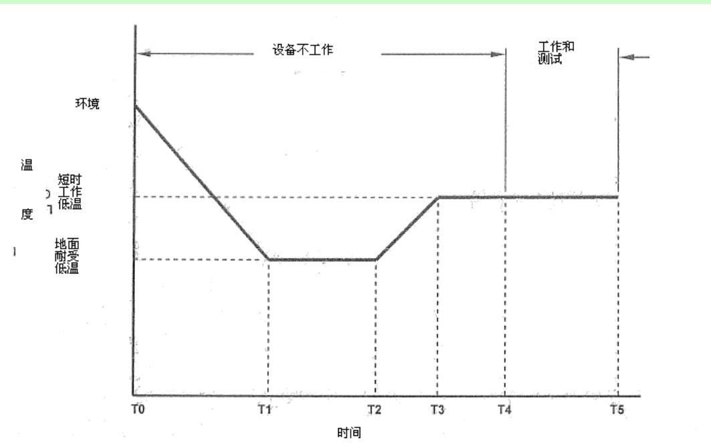  
图4-1 地面耐受低温和短时低温工作试验

注：

1）从 T0 到 T1，未规定温度变化速率。  
2）T1到T2是设备温度达到稳定时间，加上最少三个小时；  
3) T2 到 T3 最低速率为  $2^{\circ} \mathrm{C}$  /分钟。  
4）T3 到 T4 为  $30 + 5 / -0$  分钟，或者内部温度稳定时间。  
5）T4到T5最少为0.5小时  
6) 如果短时间低温和地面幸存低温相等, 那么 T2 到 T4 的时间为零。  
7) 如果短时间低温工作与工作低温相等, 参看试验方法附注 2。

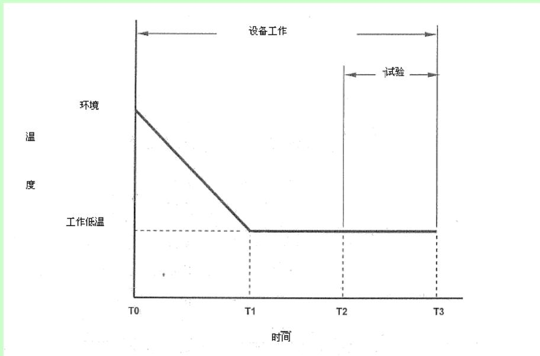  
图4-2 工作低温试验

注释:

1）未指定从T0到T1的温度变化率  
2）T1到T2是设备温度达到稳定时间  
(3) T2 到 T3 最少是 2.0 小时

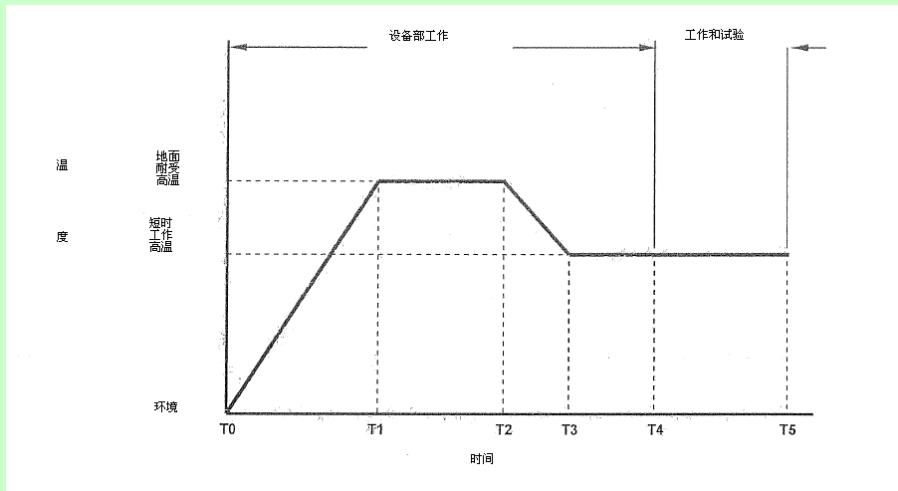  
图4-3 地面耐受高温和短时高温工作试验

注释:

(1) 未规定从  $\mathrm{T} 0$  到  $\mathrm{T} 1$  和从  $\mathrm{T} 2$  到  $\mathrm{T} 3$  的温度变化率。

2）T1到T2是设备温度达到稳定时间，加上最少3小时  
3) T2 到 T3 最少为  $2^{\circ} \mathrm{C}$  / 分钟  
4) T3 到 T4 为  $+5 / -0$  分钟或内部温度稳定时间  
5）T4到T5最少为半小时。  
6) 如果短时间低温和地面幸存温度相等, 那么 T2 到 T4 的时间为零。  
7）如果短时工作高温与工作低温相等，参看试验方法附注2。

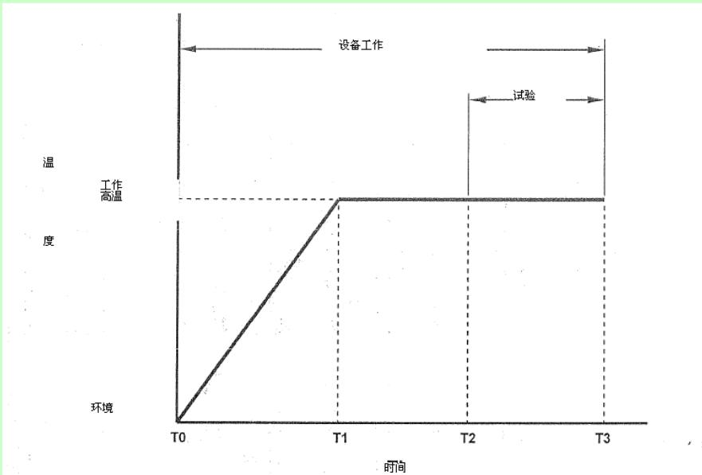  
图4-4 工作高温试验

# 注释：

(1) 未指定从 T0 到 T1 的温度变化率  
2）T1到T2是设备温度达到稳定时间  
3) T2 到 T3 最少是 2.0 小时

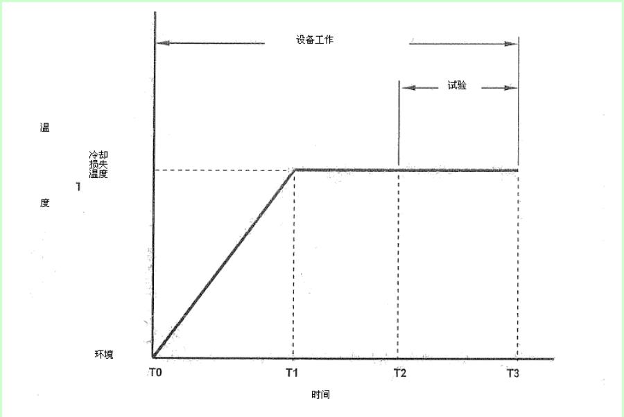  
图4-5 飞行中冷却丢失

注释:

1）未指定从T0到T1的温度变化率  
2）T1到T2是设备温度达到稳定时间  
3）参看 4.5.4 节中 T2 到 T3 的时间长短

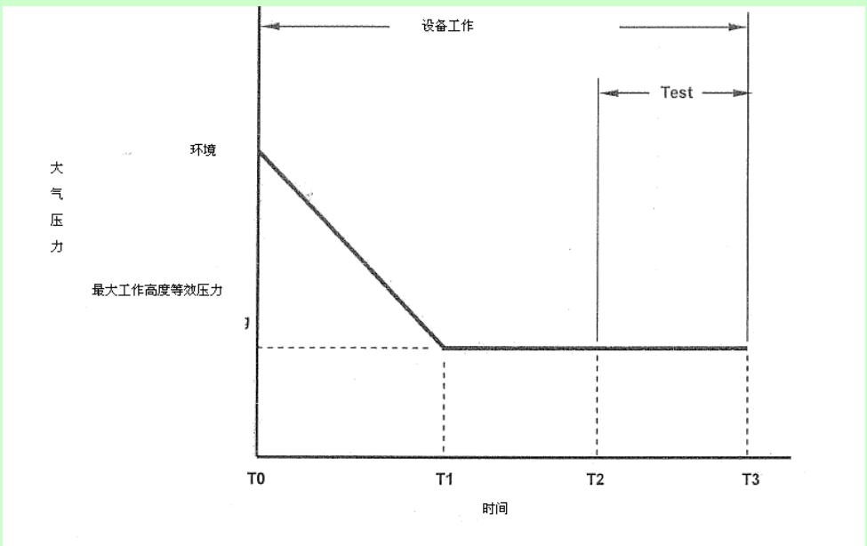  
图 4-6 高度试验

注释:

(1) 未指定从 T0 到 T1 的压力变化率  
2）T1到T2是设备温度达到稳定时间  
3) T2 到 T3 最少是 2.0 小时

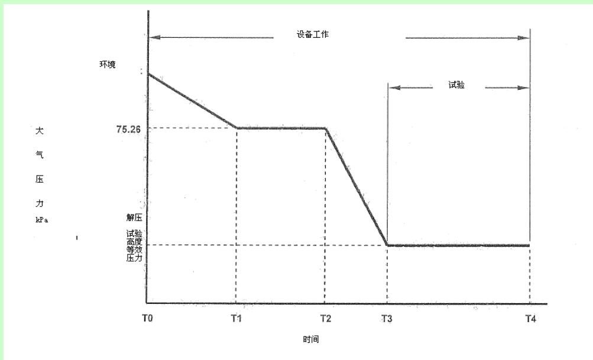  
图4-7 减压试验

注释:

1）未指定从 T0 到 T1 的压力变化率  
2）T1到T2是设备温度达到稳定时间  
3）T2到T3最大是15秒  
4) T3 到 T4 最少是 10 分钟

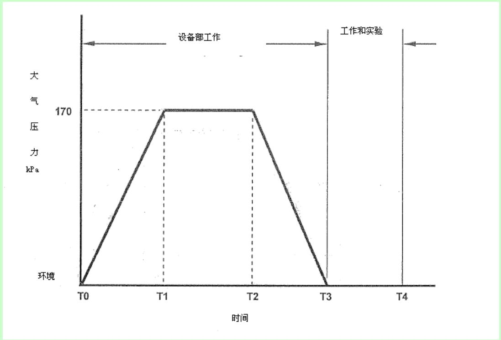  
图4-8 过压试验

注释:

1）未指定从 T0 到 T1 和 T2 到 T3 的压力变化率  
2）T1到T2最少是10分钟  
3）T3 到 T4 是操作和测试设备所需的最少时间

# 第5部分 温度变化

# 5. 温度变化

# 5.1 试验目的

本试验用于确定高低工作温度极限之间温度变化时, 设备的性能特性。飞行工作适用的类别见表 4-1. 例如, 类别 A、B 和 C 要求设备根据 4.5.1, 4.5.2, 4.5.3 和 4.5.4 章中包含的程序进行试验。类别

S1和S2，要求设备按照5.3.2和5.3.3节中规定经受温度冲击试验。

注：该试验不用于设备在湿的或结冰条件下的工作校验。执行该试验时，试验箱应能够对最小凝露或不会发生凝露的湿度情况进行控制或警告。

# 5.2 温度变化速率

适用于5.3节中规定温度变化过程的速率如下：

类别 A——对于飞机内部或外部的设备，每分钟最少 10 摄氏度；

类别B——对于飞机内部非温控或部分温度控制区域的设备，每分钟最少5摄氏度；

类别C——对于飞机内部温控区域的设备，每分钟最少2摄氏度；

类别 S1——对于飞机内部或外部的设备：

已知变化率每分钟最少10摄氏度。该变化率应在鉴定表格中注明。

类别 S2——对于飞机内部或外部的设备：

未知变化率每分钟大于10摄氏度。

注:

1）适于B类的设备被视为满足C类

2）变化率每分钟最小大于10摄氏度，被视为温度冲击。S1类和S2类预定用于评估设备上更快或更迅猛的温度变化。在温度冲击过程中，设备外表面、区域或接口可能是主要关注点，因为内部区域可能有相对较长的时间恒量以达到温度稳定。

3）S1和S2类，对于热冲击，应使用S2类。除非已知温度变化率，

则使用 S1。

# 5.3 试验方法

# 5.3.1 A、B、C类试验方法

温度变化试验（S1类和S2类除外）可以综合包含地面耐受低温试验和短时工作低温试验，4.5.1节；工作低温试验，4.5.2节；地面耐受高温试验，4.5.3节；及工作高温试验，4.5.4节。下列程序适用于：

a. 如果试验是综合试验，根据 4.5.1 节进行。4.5.1 节描述了地面耐受低温试验和短时低温工作试验；4.5.2 节工作低温试验，无环境温度变化的工作低温试验。在完成 4.5.1 和 4.5.2 节试验之后，执行 c 小节。如果不是综合试验，在环境温度下设备开始工作，以 5.2 节中规定的合适的速度，把试验箱内温度降低到低温工作温度。  
b. 把处于工作模式的设备稳定在低温工作温度；  
c. 按 5.2 条中规定的相应速率，把试验箱温度升高到高温工作温度。在温度变化期间，确定是否符合适用的设备性能标准。  
d. 把设备稳定在高温工作温度。如果是组合试验，根据 4.5.3 进行地面耐受高温试验和短时工作高温试验；然后根据 4.5.4 条，在无环境温度转变条件下，进行工作高温试验。使设备保持在非工作状态至少 2 分钟。  
e. 打开设备电源, 按 5.2 条中规定的相应速率, 把试验箱温度降低到低温工作温度。在温度变化期间, 确定是否符合有关的设备性能标准。  
f. 使设备温度和试验箱温度稳定在低温工作温度, 然后使设备工作至

少一小时，断电至少30分钟，然后把试验箱保持在低温工作温度下，重新启动设备。

g. 按 5.2 条中规定的相关速率, 把试验箱温度转变到环境温度。  
h. 把设备稳定在环境温度下，确定是否符合第二到最后一项性能标准，进行适当的循环。

应至少进行两个周期（从上述 a 到 h）的试验。如果在单个温度变化周期内能够完全确定是否符合适用的设备性能标准，那么在第二个周期内只做试验。如果温度变化周期内的时间不能完全确定是否符合适用的性能标准，应执行多次循环，直到完全确定为止。如果温度升高，使受试设备产生凝露的风险降低，则应控制试验箱内的空气的湿度等级以消除凝露。试验图形见图 5-1。

注释：如果是综合试验，则对于上述第二个循环，不建议重复步骤a和d中规定的地面耐受低温、短时工作低温、地面耐受高温和短时工作高温试验等。

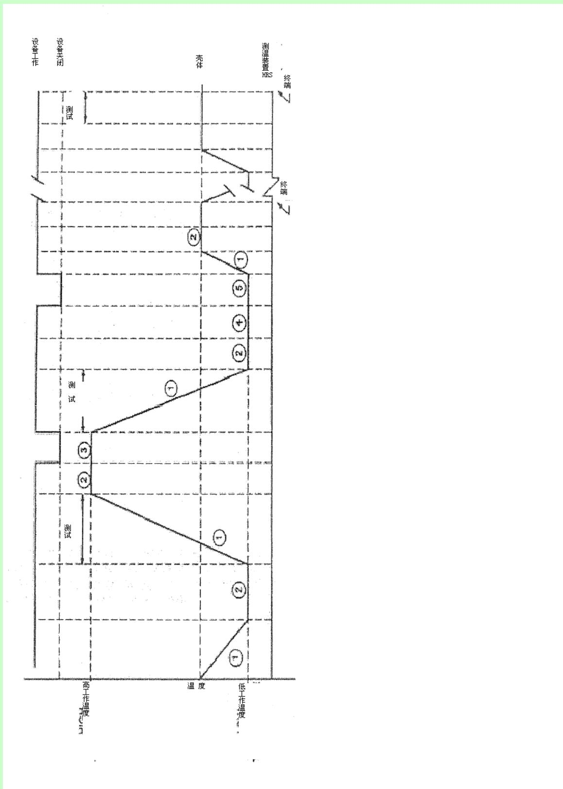  
图5-1 温度变化试验

注释：

(1) 参考 5.2 节中温度速率

2）设备温度达到稳定时间  
3）最少2分钟  
4）最少60分钟  
5）最少30分钟

# 5.3.2 S1类试验过程

S1类温度变化试验不应与其它试验组合进行。

应采用下列试验过程:

a. 在环境温度下设备处于工作状态时开始, 以 5.2 节中规定的合适的速度, 按工作低温, 降低试验箱温度。  
b. 如果可以，把设备稳定到工作低温级；  
c. 以 5.2 节中规定的合适的速度, 按工作高温, 升高试验箱温度。在温度变化期间, 确定是否符合适用的设备性能标准。  
d. 把设备稳定在工作高温。使设备保持非工作状态，至少2分钟。  
e. 打开设备电源, 以 5.2 节中规定的合适的速度, 按工作低温, 降低试验箱温度。在温度变化期间, 确定是否符合适用的设备性能标准。  
f. 如果可行，在试验箱温度为工作低温下时，使设备温度稳定，然后使设备继续工作，至少一小时。关闭设备，30分钟；当试验箱保持为工作低温时，重新启动设备。  
g. 以 5.2 节中规定的合适的速度, 按环境温度, 改变试验箱温度。  
h. 把设备稳定在环境温度下，确定是否符合适用的设备性能标准。应至少进行两个周期（上述 a 到 h）的试验。如果在一个单个

的温度变化周期内能够完全确定是否符合适用的设备性能标准，那么在第二个周期内只做试验。如果温度变化周期时间无法完全确定符合适用的性能标准，则应执行多次循环，直到完全确定为止。如果温度升高使设备产生水滴，应控制试验箱内的空气的湿度等级以消除水滴。

# 5.3.3 S2类试验过程

S2 类温度变化试验不应与其它试验组合进行。

要求的试验器具应包括一台有两个室的试验箱或两个单独的试验箱，并且可以在试验箱中建立并保持试验条件。试验箱1设置成在低温工作，试验箱2设置成在高温工作。在试验箱内放入设备会改变其环境条件。在这种情况下，当试验件移走之后，温度应在5分钟内稳定。

应采用下列试验过程：

a. 把设备放入试验箱1中，打开设备。  
b. 如果可以，把设备稳定到工作低温级；  
c. 将设备尽快从试验箱 1 中移到试验箱 2 中,时间不能超过 5 分钟。如果使用独立的试验箱, 允许在设备移走后, 立即打开设备。如果移动时间超过了 5 分钟, 应在鉴定表中指明。  
d. 把设备稳定在工作高温。在温度稳定期间，确定是否符合适用的设备性能标准。  
e. 关闭设备，把设备保持在非工作状态，至少2分钟。  
f. 打开设备, 把设备迅速从试验箱 2 中移到试验箱 1 中 (从高温到

低温), 时间不能超过 5 分钟。如果使用独立的试验箱, 允许在设备移走后, 立即打开设备。如果移动时间超过了 5 分钟, 应在鉴定表中指明。

g. 把设备温度稳定在工作低温, 然后使设备工作至少一小时。在温度稳定期间, 确定是否符合适用的设备性能标准。  
h. 关闭设备 30 分钟, 保持试验箱 1 温度在工作低温, 重新启动设备。  
i. 在环境温度下移走设备，待设备温度稳定后，确定是否符合适用的设备性能标准。

应至少进行两个周期（从a到i）的试验。如果在一个温度变化周期内能够完全确定是否符合适用的设备性能标准，那么在第二个周期内只做试验。如果温度变化周期时间无法完全确定符合适用的性能标准，应执行多次循环，直到完全确定为止。如果温度升高使受试设备产生凝露的风险降低，应控制试验箱内的空气的湿热等级以消除凝露。

# 第六部分

湿热

# 6. 湿热

# 6.1 试验目的

本试验确定设备能够承受自然的或诱发的潮湿大气。可以预料的

主要有害影响是：

a. 腐蚀  
b. 由于吸潮而引起设备性能发生的改变；

一机械性能（金属）  
一电性能（导体和绝缘体）  
一化学性能（吸湿的元件）  
一热性能（隔热体）

# 6.2 设备分类

A类一标准湿热环境

标准湿热环境通常能够为预定安装在民用飞机、非-民用运输机和其它类别的飞机上的、在飞机环境控制舱内的、一般不会遇到严酷湿热环境的设备提供足够的试验环境，

B类一严酷湿热环境

对安装在非环境控制区内的设备，可能要求在经受了超过规定的标准湿度环境的、更严酷的大气潮湿环境后，仍能工作。

C类一外部湿热环境

按标准湿度环境规定，与外界大气直接接触时间超过规定的设备，应能工作。

# 6.3 试验过程

除非下列步骤中另有说明,否则,均应把设备置于相对湿度(RH)为(95±4)%的大气中。湿气应由水蒸汽或水蒸发来提供,其 pH 值

在 25 摄氏度下测量时应为  $6.5 \sim 7.5$ , 或水阻抗不超过 250, 000 欧姆米。暴露区域空气流速应介于  $0.5 \sim 1.7$  米/秒。试验箱应与大气相通, 防止压力升高。此外, 还应防止水珠滴落到设备上。

# 6.3.1 A类一标准湿热环境

试验剖面图如图6-1所示。试验步骤如下：

步骤 1. 把试验件安装到试验箱内，确保受试产品的配置能够代表实际使用中的配置；

步骤2. 把试验件稳定到  $38 \pm 2^{\circ} \mathrm{C}$ , 相对湿度为  $85 \pm 4 \% R H$ ;

步骤3. 在两小时  $\pm 10$  分钟之内, 把试验箱温度升高到  $50 \pm 2^{\circ} \mathrm{C}$ ,相对湿度 (RH) 增加到  $95 \pm 4 \%$ ;

步骤4. 把试验箱温度保持在温度  $50 \pm 2^{\circ} \mathrm{C}$  、相对湿度  $95 \pm 4 \%$ , 至少6小时;

步骤5. 在接下来的16个小时  $\pm 15$  分钟内，把温度逐渐降至  $38 \pm 2^{\circ} \mathrm{C}$  或更低。在该过程中，尽可把相对湿度把持到最高，不允许降至  $85 \%$  以下。

步骤6. 步骤3、4、5构成一个循环。重复这些步骤直到完成两次循环（达到48小时的暴露时间）。

步骤7. 暴露结束时，把设备从试验箱中取出，排去冷凝水分（不能擦干）。在两个循环结束之后一小时之内，施加正常电源，接通设备。接通主电源后，最多允许等15分钟，使设备加热。对于不需要电功率的设备，其加热时间最长不超过15分钟，施加的热量不应超过相应类别要求的短时工作高温试验时的热量。加热阶段一结束，立

即进行必要的试验和测量，确定是否符合有关的设备性能标准。

# 6.3.2 B类一严酷湿热环境

试验剖面图见图6-2。试验过程如下：

1、把试验件安装到试验箱内，确保受试产品的配置能够代表实际使用中的；  
2、把试验件温度稳定到  $38 \pm 2^{\circ} \mathrm{C}$ , 相对湿度为  $85 \pm 4 \%$ ;  
3、在两小时  $\pm 10$  分钟之内, 把试验箱温度升高到  $65 \pm 2^{\circ} \mathrm{C}$ , 相对湿度增加到  $95 \pm 4 \%$ ;  
4、把试验箱温度保持在温度  $65 \pm 2^{\circ} \mathrm{C}$  、相对湿度  $95 \pm 4 \%$  至少 6 小时；  
5、在接下来的 16 个小时  $\pm 15$  分钟内, 把温度逐渐降至  $38 \pm 2^{\circ} \mathrm{C}$  或更低。在该过程中, 保持尽可能高的相对湿度, 不允许降至  $85 \%$  以下。  
6、步骤3、4、5构成一个循环。重复这些步骤直到完成10个循环（暴露240小时）。  
7、暴露结束时，把设备从试验箱中取出，排去冷凝水分（不能擦干）。在10个循环完成后一小时之内，施加正常电源，接通设备。接通主电源后，最多允许等15分钟以使设备预热。对于不需要电气功率的设备，其预热时间最长不超过15分钟，施加的热量不应超过相应类别要求的短时工作高温试验时的热量。预热一结束，立即进行必要的试验和测量，确定是否符合有关的设备性能标准。

# 6.3.3 C类一外部湿热环境

试验剖面图见图 6-3。试验过程如下:

1、把试验件安装到试验箱内，确保受试产品的配置能够代表实际使用中的；  
2、把试验件稳定到  $38 \pm 2^{\circ} \mathrm{C}$ , 相对湿度为  $85 \pm 4 \%$ ;  
3、在 2 小时  $\pm 10$  分钟之内, 把试验箱温度升高到  $55 \pm 2^{\circ} \mathrm{C}$ , 相对湿度增加到  $95 \pm 4 \%$ ;  
4、把试验箱温度保持在温度  $55 \pm 2^{\circ} \mathrm{C}$  、相对湿度热  $95 \pm 4 \%$  至少6 小时；  
5、在接下来的16个小时  $\pm 15$  分钟内，把温度逐渐降至  $38 \pm 2^{\circ} \mathrm{C}$  或更低。在该过程中，尽可把相对湿度把持到最高，不允许降至  $85 \%$  以下。  
6、步骤3、4、5构成一个循环。重复这些步骤直到完成6次循环（达到144小时的暴露时间）。  
7、暴露结束时，把设备从试验箱中取出，排去冷凝水分（不能擦干）。在完成10个循环后一小时之内，施加正常电源，接通设备。接通主电源后，最多允许等15分钟以使设备预热。对于不需要电功率的设备，其预热时间最长不超过15分钟，施加的热量不应超过相应类别要求的短时工作高温试验时的热量。预热一结束，立即进行必要的试验和测量，确定是否符合有关的设备性能标准。

# 6.3.4 抽查

为了对受试产品的性能进行抽查，如果适用，要求在每6个或10个试验循环结束时使设备工作，工作时间不超过15分钟。如果要把设备从试验箱中取出进行抽查，设备取出时间不应超过20分钟，在这20分钟之内，设备工作时间不要超过15分钟。

# 6.3.5 其它规定的检查

如果有关性能标准要求进行其它检查以确定符合性，那么这些检查也应在此试验过程中完成。

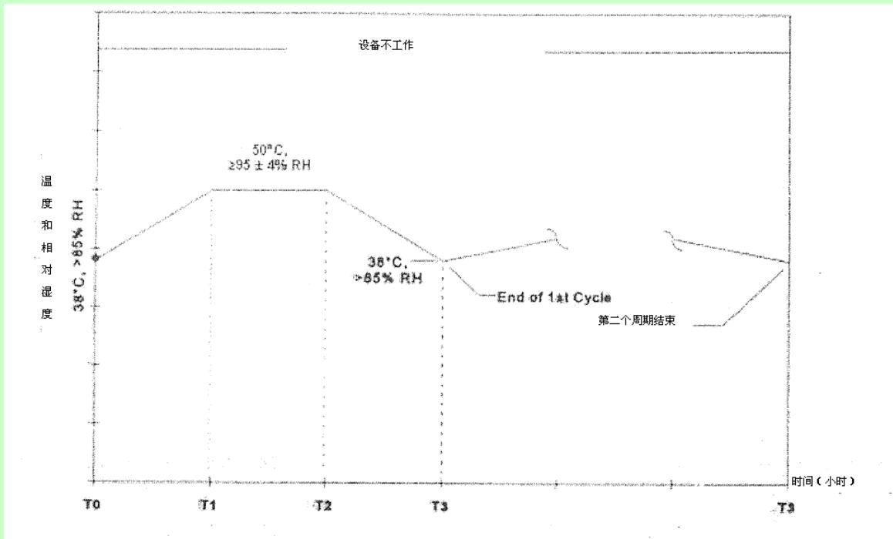  
图 6-1 A 类一标准湿热环境试验

附注:

(1)  $\mathrm{T} 0 \sim \mathrm{T} 1: 2$  小时  $\pm 10$  分钟  
2） $\mathrm{T}1 \sim \mathrm{T}2$ ：最少6小时；  
3） $\mathrm{T}2 \sim \mathrm{T}3: 16$  小时  $\pm 15$  分钟；在这期间，相对湿度不应低于  $85\%$

(4) 在第 2 个循环结束之后中, 参看 6.3.1 节步骤 7 , 继续进行试验。  
5) T0 表示下一个循环的开始, 而不是测试起始点。

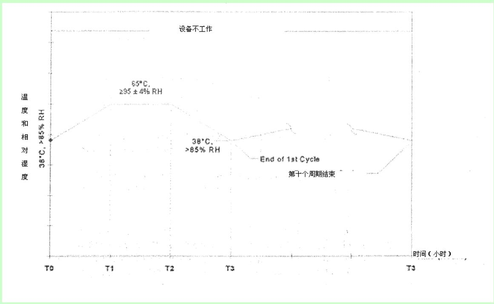  
图6-2 B类一严酷湿热环境试验

附注:

1)  $\mathrm{T} 0 \sim \mathrm{T} 1: 2$  小时  $\pm 10$  分钟  
2） $\mathrm{T1} \sim \mathrm{T2}$ ：最少6小时；  
3)  $\mathrm{T}2 \sim \mathrm{T}3$  是 16 小时  $\pm 15$  分钟. 在这期间, 相对湿度不应低于  $85\%$ ;  
4) 在第 10 次循环结束之后中, 参看 6.3.2 节步骤 7 继续进行试验。  
5)  $T_{0}$  表示下一个循环的开始, 而不是测试起始点。

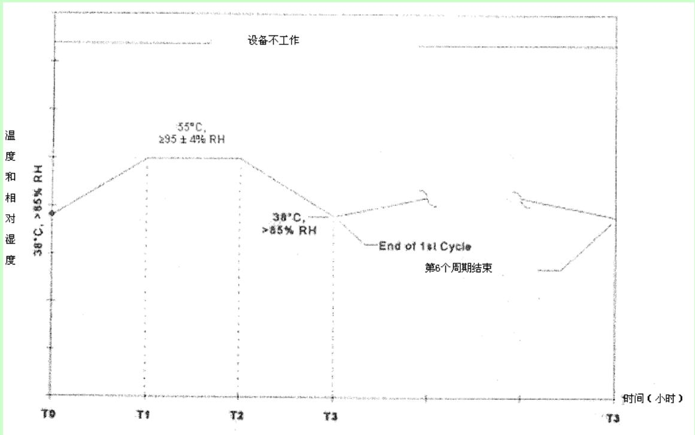  
图6-3 C类一外部湿热环境试验

附注:

1)、 $\mathrm{T} 0 \sim \mathrm{T} 1: 2$  小时  $\pm 10$  分钟  
2)、 $\mathrm{T}1 \sim \mathrm{T}2$ ：最少6小时；  
3)、 $\mathrm{T}2 \sim \mathrm{T}3$  是 16 小时  $\pm 15$  分钟. 在这期间, 相对湿度不应低于  $85\%$ ;  
4)、在第 6 个循环结束之后中, 参看 6.3.3 节步骤 7 继续进行试验。  
(5) T0 表示下一个循环的开始，而不是测试起始点。

# 第七部分

# 工作冲击和坠毁安全性

# 7. 工作冲击和坠撞安全性

# 7.1 试验目的

工作冲击试验是为验证设备在飞机正常飞行过程中经受到冲击

之后仍能继续在性能标准范围内工作。飞机在滑行、着陆过程中或当飞机在飞行时突然遇到阵风时可能会出现这些冲击。本试验适用于安装在固定翼飞机和直升机上的所有设备。提供了两种飞行冲击曲线：一个是标准的11毫秒加脉冲，另一个是低频20毫秒脉冲。对于共振频率低于  $100\mathrm{Hz}$  的设备，20毫秒加脉冲不足以对其进行长时间冲击试验。对于此类设备，应考虑100ms时间段的脉冲。

坠撞安全性试验用于验证某种设备在紧急着陆时不会与其安装支架分离或者其分离方式不会产生危险。本试验适用于安装在飞机座舱内或其它区域内的设备，当紧急着陆时，设备如果在这些位置脱离，就会对乘客、燃油系统或应急逃生设备产生危险。这些测试不能满足 FAR 对所有设备的要求，例如，座椅和座椅限制。

注：对于固定翼飞机：完整的安装验证，除了坠撞安全性负载外，还包括对飞机加速度负载（如飞行移动、阵风和着陆）的验证，这些验证可以通过在“所经受”的试验中加入“未知或随机”方位来完成。

在冲击试验设备上使用模拟载荷，需要保证记录的冲击脉冲是在图7-2规定的容差之内。

# 7.1.1 设备类别

A 类: 用于测试标准飞行冲击的设备  
B 类: 用于测试标准工作和坠撞安全性的设备  
D 类: 用于测试低频工作冲击的设备  
E 类: 用于测试工作低频冲击和坠撞安全性的设备

# 7.2 飞行冲击

在冲击施加之后，一般要求性能符合要求。如果在施加冲击脉冲过程中要求监测设备，那么在相关设备规范中必须对监测要求进行说明。

# 7.2.1 试验过程

用刚性试验夹具把设备固定到冲击台上，其安装方法预定用于实际安装使用。设备的安装应包括那些属于正常安装部分的非结构性连接。用于测量和控制输入冲击脉冲的加速度计应尽可能安装在接近设备的连接点处。测量加速度的试验系统的精度应在  $\pm 10\%$  标准读数范围之内。

除非EUT规范中另有规定，设备应能工作，且其温度稳定。向试验设备的每个方向施加三次脉冲，冲击波形为终端锯齿波形，加速度峰值为  $6\mathrm{g}$  。标定的脉冲持续时间对于标准冲击试验应为11毫秒，对于低频试验应为20毫秒。用来表明仪器符合性和冲击脉冲容差极限的特性，分别见图7-1和图7-2。可以用等效的脉冲响应频谱代替终端锯齿波形。

施加冲击后，确定符合相关的设备性能标准。

如果使用常规的跌落冲击机器，设备应按下列方位经受冲击试验：

a. 正常直立  
b. 倒悬  
c. 在设备的第一主正交轴依次与平台平面形成  $+90$  度和  $-90$  度

角（两个方位）的位置。

d. 在设备的第二主正交轴依次与平台平面形成  $+90$  度和  $-90$  度角（两个方位）的位置）。

# 7.2.2 替代的试验程序

允许对按其正常工作状态安装（即按其在飞机上习惯的安装进行空间取向）的设备施加7.2.1节中规定的冲击，但要在三个正交轴的两个方向上都施加三次冲击。

# 7.3坠撞安全性

如果坠撞安全性试验适用，则应进行冲击和持续载荷试验程序。

在7.3.1、7.3.2或7.3.3节冲击试验期间，等效重量（模拟载荷）可以代替通常安装在设备壳体内或壳体上的机电部件。这种等效重量应接近替代部件的重量，其安装应为：使设备的的重心基本不变。等效重量不应使设备壳体或其安装紧固件的强度比替代部件大。

# 7.3.1 试验过程1（冲击）

用刚性试验夹具和实际使用中的安装方法把设备或模拟载荷固定到冲击台上。

在第 7.2.1 章中列出的设备六个方向中的每个方向上施加一个  $20 \mathrm{~g}$  的冲击力，冲击波形与图 7-1 和 7-2 中规定的波形一致。6 次冲击施加之后，允许设备发生弯曲或变形。但是安装连接不应出现破坏，设备或模拟载荷应保持在原位上。

# 7.3.2 替代的试验程序（冲击）

允许对按其正常工作状态安装的设备施加图 7.3.1 中规定的冲击，但要在 3 条正交轴两个方向上都进行这些冲击。

# 7.3.3 试验过程2（持续载荷）

下面的载荷试验应使用离心机或滑车进行。某些情况下，如果能够确定设备内的其它部件发生断裂或者松动后，该部件仍包含在设备壳体内，则通过给受试设备的重心施加静态力来模拟惯性效应也是可以接受的。

用刚性夹具把设备或模拟负载固定到试验设施上，安装方式与实际使用中的安装方式一致。在每个加载方向上施加至少3秒钟的合适的试验载荷。表7-1“加载方向”适用于飞机的大多数正交轴。试验等级见表7-1（ $\star$ ）。如果已知设备相对于飞机轴线的方向，那么就可以确定设备要求的载荷和加载方向。飞机方向及离心试验相关定义见图7-3。如果受试设备的方向未知，或者相对飞机轴线位置不固定，那么要求在设备三条直交轴的每个方向上随机进行试验，如表7-1所规定。施加6次载荷之后，设备允许发生弯曲和变形。安装附着件应无故障，设备或模拟载荷应保持在原位上。

此坠毁安全负载要求表示的是惯性负载要求，同一方向上的负载单位为  $\mathbf{g}$  。如果使用静态试验证明符合性，则负载应施加在同一方向，以  $\mathbf{g}$  为单位。如果使用离心机，则负载应与加速度方向相反。为了模拟惯性负载进行离心机试验，则必须对设备定位，这样设备就会位于正确的方向而不是加速度方向。例如， $9\mathrm{g}$  的正向试验，设备前面

末端应反面对着离心机的中心。这样就可以模拟惯性负载，设备可经受正向  $9\mathrm{g}$  条件。

表 7-1 坚撞安全性持续载荷试验等级  

<table><tr><td>飞机类型</td><td>试验类型(5)</td><td colspan="5">持续载荷试验加速度(g最小)负载方向(飞机方向)</td></tr><tr><td></td><td></td><td>上</td><td>下</td><td>前</td><td>后</td><td>侧面(4)</td></tr><tr><td rowspan="2">1.直升机(注1)</td><td>F</td><td>4.0</td><td>20.0</td><td>16.0</td><td>NA</td><td>8.0</td></tr><tr><td>R</td><td>20.0</td><td>20.0</td><td>20.0</td><td>20.0</td><td>20.0</td></tr><tr><td rowspan="2">2.固定翼运输机(注2)</td><td>F</td><td>3.0</td><td>6.0</td><td>9.0</td><td>1.5</td><td>4.0</td></tr><tr><td>R</td><td>9.0</td><td>9.0</td><td>9.0</td><td>9.0</td><td>9.0</td></tr><tr><td rowspan="2">3.固定翼非运输机(注3)</td><td>F</td><td>3.0</td><td>NA</td><td>18.0</td><td>NA</td><td>4.5</td></tr><tr><td>R</td><td>18.0</td><td>18</td><td>18.0</td><td>18.0</td><td>18.0</td></tr><tr><td rowspan="2">4.所有固定翼飞机</td><td>F</td><td>3.0</td><td>6.0</td><td>18.0</td><td>1.5</td><td>4.5</td></tr><tr><td>R</td><td>18.0</td><td>18</td><td>18.0</td><td>18.0</td><td>18.0</td></tr><tr><td rowspan="2">5.直升机和所有固定翼飞机</td><td>F</td><td>4.0</td><td>20.0</td><td>18.0</td><td>1.5</td><td>8.0</td></tr><tr><td>R</td><td>20.0</td><td>20.0</td><td>20.0</td><td>20.0</td><td>20.0</td></tr></table>

附注:

(1) 参看 FAR 27.561。  
(2) 参看 FAR 25.561。  
(3) 参看 FAR 23.561。  
(4) 侧面包括左右方向两个面。  
(5) “F”为已知，固定方向。“R”是未知或随机方向。

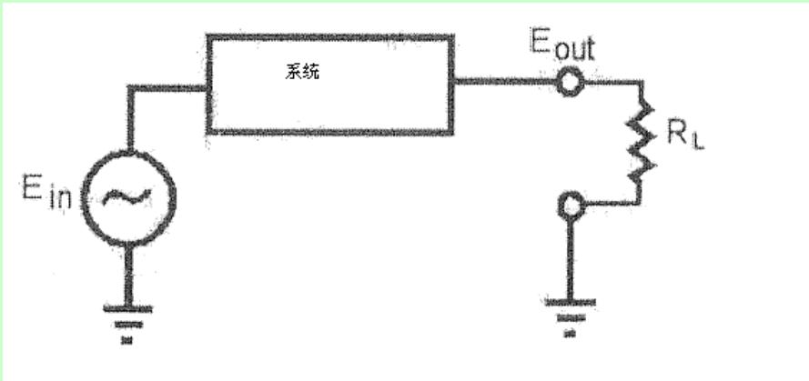  
警告：这些试验等级可能不满足 FAR 中的安装要求。

$\mathrm{R_L} =$  典型输出终端;

$\operatorname{Ein} =$  电压输入；

Eout= 电压输出

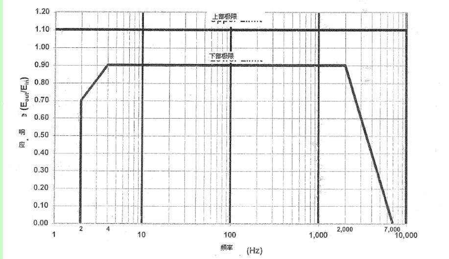  
图7-1冲击测量系统频率响应

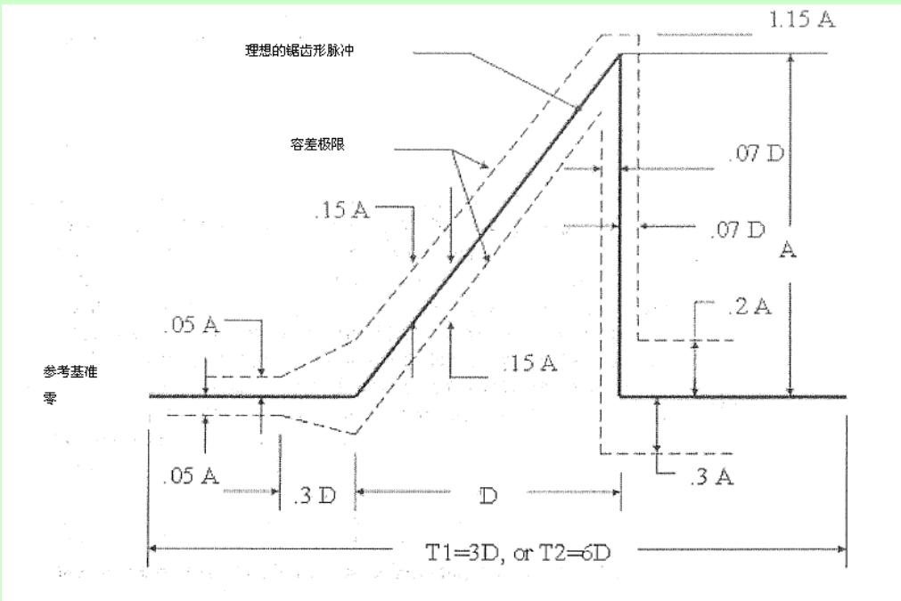  
图7-2 终端锯齿形冲击脉冲结构及其容差极限  
图7-2 终端锯齿冲击脉冲构型&其容差极限

D= 额定脉冲持续时间

A= 额定脉冲峰值加速度

T1 = 对常规冲击试验仪产生的冲击进行监测的最小时间

T2=对振动发生器产生的冲击进行监测的最小时间

<table><tr><td>测试（脉冲）</td><td>峰值（A）（g）</td><td>额定持续时间（D）（ms）</td></tr><tr><td>标准工作</td><td>6</td><td>11</td></tr><tr><td>低频工作</td><td>6</td><td>20</td></tr><tr><td>坠撞安全</td><td>20</td><td>11</td></tr><tr><td>低频坠撞安全</td><td>20</td><td>20</td></tr></table>

注：示波图应包含持续时间 T1/T2，其脉冲应位于接近中央的位置。终端锯齿形脉冲加速度幅值是 A，持续时间为 D。测量的加速度脉冲应包括在虚线边界内，测量的速度变化（可以通过加速度脉冲积分获得）应在  $\mathrm{V}_{1} \pm 0.1 \mathrm{~V}_{1}$  内，这里  $\mathrm{V}_{1}$  是与完美脉冲（0.5DA）速度变化相关的速度变化。用于确定速度变化的积分运算应从脉冲之前 0.4D 延伸到脉冲之后 0.1 秒。

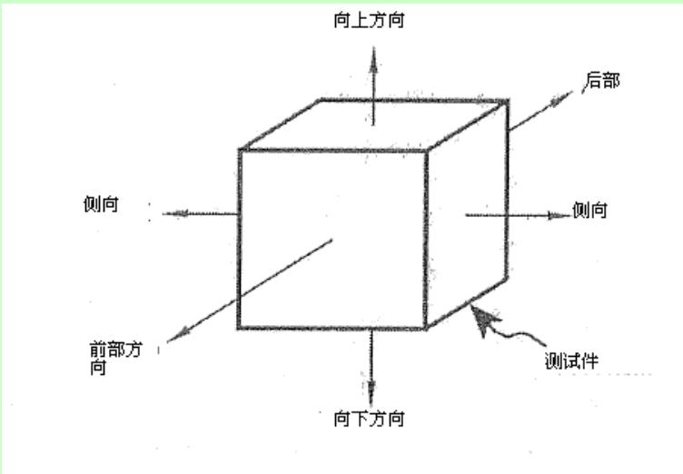

注：如果使用离心机，应对样机上的旋转加速度和加速度速率加以考虑。

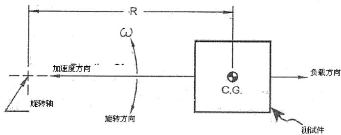  
旋转面俯视  
图7-3 追撞安全性负载试验定义

对齐试验件，使飞机方向与负载方向一致，按规定的飞机方向施试验加速度。

$$
\text {加 速 度} \left(\mathrm {G} ^ {\prime} \mathrm {s}\right) = \underline {{\mathrm {R} (\omega)}} ^ {2} = 0. 0 0 1 1 1 8 * \mathrm {R} * (\mathrm {R P M}) ^ {2}
$$

9.81

$$
\mathrm {R} = \text {半 径 ， 米}
$$

$$
\omega = \text {角 旋 转 ， 弧 度} / \text {秒}
$$

$$
\mathrm {R P M} = \text {每 分 钟 转 数}
$$

$$
\mathrm {离 心 机 定 义}
$$

# 第8部分

# 振动

# 8. 振动

# 8.1 试验的目的

本试验用于证明设备在经受适用类别的振动量值后，符合有关设备性能标准（包括耐久性要求）。

# 8.2 适应性

下面所述振动试验适用于固定翼螺旋桨飞机，固定翼涡轮喷气发动机飞机、固定翼涡轮风扇发动机、螺旋桨风扇发动机飞机和直升机。

执行特定的振动试验，以证明符合本节规定的性能标准，这些试验具有三个标识符：(1)飞机类型；(2)种类；(3)飞机区域位置。在随后章节中，对试验要求和步骤做了说明。

# 8.2.1 振动试验类别定义

从下面规定的类别中选择合适的类别时，应以能保证设备性能的类别为基础。对安装在固定翼飞机上的设备，可以执行标准的和强化的振动试验。是否需要执行高级别的短期耐久试验，应依据设备的性能要求而定。对安装在直升机上的设备，则只需进行强化振动试验。

# 8.2.1.1 标准振动试验（S类）

用于固定翼飞机的标准振动试验可以证明在飞机正常飞行时遇

到的振动条件下，设备能够满足性能要求。

# 8.2.1.2 强（耐久）振动试验（R、U、U2类）

强（耐用）振动试验可以证明设备在经受振动时能正常工作，而且在经受耐久振动量值后仍能正常工作。它是对设备功能性能和结构完整性的综合证明。该试验应在要长期暴露在振动环境下的所有设备上进行，证明能够承受长期振动效应。是否需要用该试验替代标准振动试验，应由相关的设备规范中确定。U和U2类试验用于安装在旋翼频率未知的直升机上的设备。

耐用试验可以或者不可以代表服役寿命试验。服役寿命试验是根据设备经受震动环境试验的等级来确定的。如果已知震动环境，并且相关设备规范中要求进行服役寿命试验，使用可接受的疲劳比例关系调节试验等级和/或试验次数，进行耐久试验以代表服役寿命试验。

# 8.2.1.3 高强度、短时振动试验（H和Z类）

短时高强度耐久性瞬态振动量值会在固定翼飞机发动机扇形叶片损坏期间所发生的异常振动条件下遇到。该试验适用于其性能损坏会严重影响飞机性能的设备。H类试验是一种包含所有应用的一般性试验。Z类试验包括受限制的低扇频应用。这些试验不能取代标准的或强化振动试验。参看下面的“注意事项”：

注意事项：对于与某些特殊发动机失衡条件相关振动级的完全分

析，没有根据这些极限进行评估。因此，对某些没有附加试验或分析的应用，仅进行本试验是不够的。

# 8.2.2 试验曲线或试验等级选择

# 8.2.2.1 试验说明

下面表 8-0 中的数据对每个试验种类进行了简短的说明。至于更详细的说明，参看试验过程。

表 8-0: 试验说明  

<table><tr><td>类别</td><td>飞机型号</td><td>标准振动</td><td>短时高-级耐久性震动</td><td>强化振动</td></tr><tr><td>S</td><td>固定翼</td><td>1小时/轴向正弦或在性能等级上随机</td><td>NA</td><td>NA</td></tr><tr><td>H或Z</td><td>固定翼</td><td>NA</td><td>高g/低f正弦扫描/轴</td><td>NA</td></tr><tr><td>R</td><td>固定翼</td><td>NA</td><td>NA</td><td>3小时/轴向正弦振动少于30分/暂停(最多4个暂停)或性能等级(最少10分钟)随机和3小时耐久等级的随机(在3个轴上都重复)</td></tr><tr><td>R或U</td><td>直升机</td><td>NA</td><td>NA</td><td>随机正弦;2小时耐久性加停顿(最大4次停顿,总试验时间最大3小时),然后在试验期开始和结束时进行性能试验(最少10分钟)(在3个轴上重复)。对U类试验重复3次。</td></tr><tr><td>U2</td><td>直升机</td><td>NA</td><td>NA</td><td>随机;在试验期开始和结束时进行性能试验(最少10分钟);3小时耐久级(在3个轴上重复)。</td></tr></table>

# 8.2.2.2 试验曲线

表 8-1 说明了用于每种飞机的适合的种类和飞机区域的适合的试

验曲线。表 8-1 中各类别的试验强度在用于固定翼飞机的图 8-1 到图 8-5 和用于直升机的图 8-2a 和图 8-2b 中说明。

注意：“装置的仪表板，控制台和机架”区域包括连接走廊内部和船舱地板的内部的器件并独立于机身区域。机身区域适用于所有没有安装在多插槽设备机架的、但是和机架、桁条、外壳和其它机身结构或托架连接的设备。

重量容限一对于重量大于  $22.7\mathrm{kg}$ （50 Ibs）的设备零件，对于高于  $60\mathrm{hz}$  频率的标准和耐久试验强度，允许按下面的步骤来缩减：随机和正弦曲线标准和耐久试验级可以按超过  $22.7\mathrm{kg}$ （50 Ibs）每  $0.454\mathrm{kg}$ （1.0 Ibs）减少  $0.10\mathrm{dB}$ ，最大减少  $6\mathrm{dB}$ 。（注意：6.0dB 减少量可以将 APSD 强度减小到 1/4，正弦强度减少到起初的 1/2。）。

# 8.3 振动试验要求

下面的通用要求适用于所有振动试验：

a. 安装受试设备，使得输入的振动运动与3个主要的正交轴中的一个平行。所使用的任何测试固定装置，应尽可能的牢固和对称。设备应按设备说明中规定的方法，与固定装置或振动台相连。安装在外部振动台/冲击隔离物上的设备在试验时应当和隔离物一起试验。

b) 如果适用，加速计应当和振动设备连接以测量和记录振动轴上设备的振动响应，确定共振频率和放大系数。如果适用，位置选择可以包括主要结构，印刷电路板，大型元器件和模块。  
c) 控制加速计应与试验夹具连接，并且尽可能与每个试验轴上设备安装位置接近。使用多个加速计控制试验级时，正弦试验的加速

计控制信号的平均值或随机试验的加速度功率谱密度（APSDs）的平均值，应用作试验级控制。对所有的振动输入类型、频谱或APSD曲线，应能证明控制等级满足试验级别要求。

d) 随机振动信号应具有高斯分布，控制信号瞬时振动加速度峰值应不大于  $\mathbf{g}$  均方根加速度量值的3倍。  
e)测量正弦加速度的仪表系统的精度，对于加速度，应为  $\pm 10\%$ ；对于频率，应为  $\pm 2\%$ 。  
f）如果随机振动试验要求超过振动试验系统的功率性能，则应在下面频段分别进行试验：10到600hz和600到2000hz。规定的试验时间应运用于每个频段。

# 8.4 振动试验级要求

# 8.4.1 控制级容差要求

# 8.4.1.1 正弦控制输入

如 8.3c 规定，对于任何正弦输入曲线，加速度试验级控制 应在规定频率范围规定级别的  $\pm 10\%$  范围内。

# 8.4.1.2 随机控制输入

按照8.3c节中规定，试验控制信号的加速度功率谱密度（APSD）在500到  $2000\mathrm{hz}$  范围内低于  $500\mathrm{hz}$  时不应偏离规定要求的  $+3\mathrm{dB}$  或低于  $-1.5\mathrm{dB}$  。控制信号的总的  $\mathbf{g}$  均方根值级不应超过规定的APSD曲线的总的均方根值的  $+20\%$  和  $-5\%$  。

# 8.4.2 加速度功率谱密度测量

分析和控制系统使用大于或等于50的带宽--时间（BT）乘积。特殊的分析器特性或与其等同的特性，应如下面所规定的。对于APSD测量推荐使用离散FFT分析方法。

# 8.4.2.1 模拟式分析仪要求

a.带宽为 B，且小于或等于  $50\mathrm{Hz}$  的在线连接滤波器、稳定/分析系统；  
b. 扫频分析系统应具有如下特性:

(1) 恒定的带宽分析仪

(a) 滤波器带宽

$$
\begin{array}{l} \mathrm {B} = 1 0 \mathrm {H z}, \text {最 大 从} 1 0 \sim 2 0 0 \mathrm {H z}; \\ \mathrm {B} = 5 0 \mathrm {H z}, \text {最 大 从} 2 0 0 \sim 2 0 0 0 \mathrm {H z} 。 \\ \end{array}
$$

(b) 分析仪平均时间  $= \mathrm{T} = 2 \tau = 1$  秒 ;

其中  $\mathrm{T} =$  真实平均时间,  $\tau =$  分析仪时间常数。

(c) 分析线性扫描率  $= \mathrm{R} = \mathrm{B} / 4 \tau$  或  $\mathrm{B}^{2} / 8 \mathrm{~Hz} / \mathrm{s}$ , 最大; 取其中较小者;

(2) 等百分比带宽分析仪

(a) 滤波器带宽  $= \mathrm{Pf}_{\mathrm{c}} = 1 / 3$  最大倍频程。（其中， $\mathrm{P} =$  百分比  $\leqslant 0.23$  ，且  $\mathrm{f}_{\mathrm{c}} =$  分析仪中心频率）

(b) 分析仪平均时间  $= \mathrm{T} = 50 / \mathrm{Pf}_{\mathrm{c}}$  最小。  
(c) 分析对数扫描率  $= \mathrm{R}$  。

$$
R = \frac {P f _ {c}}{4 \tau} \text {o r} \frac {\left(P f _ {c}\right) ^ {2}}{8} \mathrm {H z / s} _ {\text {最 大}, \dot {\text {取 较 小 值}}}
$$

# 8.4.2.2 数字式分析仪要求

使用离散频率分析技术的数字功率谱密度分析系统应该有一个最小400线的频率分辨率（即： $\Delta f$ 等于或小于  $5\mathrm{Hz}$ ）。带宽--时间乘积等于获得一个APSD所使用的记录数（即：测量APSD时，总平均数应该等于50或更大）。

# 8.5 标准振动试验程序一固定翼飞机

用于表8-1规定类别和区域的标准振动试验曲线在图8-2至图8-3中给出。对大多数飞机类型/区域应用，规定使用正弦或随机振动试验。对于飞机类型6区域7，用户可以在正弦和随机振动试验之间选择。正弦和随机振动试验步骤规定如下。（注：只执行适用的正弦或随机振动试验）。

在标准振动试验期间或结束时，确定是否符合适用的设备性能标准。

# 8.5.1 正弦振动试验程序

使用图8-2或图8-3中合适的试验曲线，在设备的三个正交轴中的每一个轴上执行下列试验：

使设备处于工作状态，在适当的频率范围内改变振动频率，以不超过1.0倍频程/分的对数扫描率从规定的频率最低到最高（上扫）到

最低（下扫），循环扫描。在初始上扫期间，在选定的响应位置记录加速度计的曲线和标注临界频率。临界频率定义为：(1)机械振动响应，峰值加速度大于2倍的输入加速度幅值，或(2)不管是否超过性能标准，性能或工作状态显著改变。

持续振动扫描循环和工作至少1小时并测量其性能并确定是否符合有关设备性能标准。在试验期间临界频率的任何变化应记录在环境鉴定表（见附录A）上。试验完成时，应检查设备，内部或外部的部件不应有结构损伤。

当施加的输入振动的总位移超过0.5毫米时，试验件读出或显示性能出现困难，都不应作为试验失败原因。

# 8.5.2 随机振动试验程序

在设备的三个正交轴中每一个轴上，执行下列试验过程：

a. 使设备不工作，从  $10\mathrm{Hz}$  到  $2000\mathrm{Hz}$ ，以不超过每分钟 1.0 倍频程的扫描率执行一次  $0.5\mathrm{g} - \mathrm{PK}$  的正弦扫描。在设备上选择的位置上，记录响应加速度计的曲线，以确定共振频率和放大系数。共振频率被定义为大于输入加速度振幅两倍的响应峰值。

b. 设备处于工作状态，根据图 8-1 施加合适的性能级试验 APSD 每轴最少一小时，确定是否满足设备性能标准。在振动期间，还要对设备振动响应测量进行 APSD 分析。

c. 重复 8.5.2a 节的正弦扫描。共振频率的任何变化都应该在环境鉴定表中记录（见附录 A）。

在试验完成时，应检查设备，并注明设备的内外部元器件有没有

任何结构性损坏。

# 8.6高强度-短时振动试验程序

设备处于工作状态，以图8-5所示的级别、在适当的设备区位置，施加正弦振动。对一般H类应用，以不超过  $0.167\mathrm{Hz / s}$  的扫描速率对设备三个正交轴的每一个轴上，从  $10\mathrm{Hz}$  到  $250\mathrm{Hz}$  执行一次正弦线性频率扫描。对有限制的Z类应用，最大频率是可以减小。对于这种应用，最大频率应该等于或大于两倍的最大风扇旋翼速度。对于Z类，试验的最大频率应在环境鉴定报告中记录（见附录A）。确定是否符合设备性能标准。试验期间和试验之后就根据设备规范确定操作性能要求。

# 8.7 强化振动试验一固定翼飞机

用于表8-1中规定类别和区域位置的强化振动试验曲线在图8-1至图8-4中给出。对大多数飞机类型和区域应用都规定了正弦或随机振动曲线。对于飞机类型6区域7，用户可以在正弦和随机振动试验之间选择。正弦和随机振动试验的方面在下面规定。（注：只执行适用的正弦或随机振动试验）。

# 8.7.1 正弦振动试验程序

对设备三个正交轴中的每一个轴，使用图8-2的正弦振动试验量值执行下列试验。

在振动试验期间或结束时，确定是否符合适用的设备性能标准。a. 使设备工作，除非设备说明中另有规定，在适当的频率范围上振动

频率以不超过1.0倍频程/分的对数扫描率从规定的频率最低到最高（上扫）到最低（下扫）来循环扫描。在初始的上扫期间，在选定的响应位置记录加速度计的曲线和标注临界频率。进行这些扫描的时间可以包括在8.7.1.c中总的扫描时间中。临界频率的定义为：(1)机械振动共振，峰值加速度大于2倍的输入加速度幅值，或(2)不管是否超过性能标准，性能或工作状态显著改变。

b. 从 8.7.1a 中标识的临界频率中选择 4 个最严酷的频率。在每个选择的频率上保持 30 分钟。在每个共振保持期间，如需要应调整使用的频率来在保持共振时维持最大的加速度响应。如果确定的临界频率少于 4 个，保持每个频率 30 分钟。如果没有标识临界频率，则不必保持频率。

c. 振动停留（有规律的停留）试验后，通过频率扫描循环完成振动试验。频率周期所用时间为：3小时减去在8.7.1.b中测试共振所用时间。

试验期间出现的临界频率的任何变化应当记录在环境鉴定表上（见附录A）。如没有发生变化也应在报告中进行说明。当输入的振动总位移超过0.5毫米时，试验件读数或显示性能困难，不应作为试验失败原因。

d. 试验完成时，应检查设备，内部或外部的部件不应有结构损伤。

# 8.7.2 随机振动试验程序

对设备三个正交轴中每个轴，执行下列试验程序：

a. 使设备不工作, 从  $10 \mathrm{~Hz}$  到  $2000 \mathrm{~Hz}$ , 以不超过每分钟 1.0 倍频

程的扫描率执行一次  $0.5\mathrm{g}$ -PK 的正弦扫描。在设备上选择的位置上，记录响应加速度计的曲线，以确定共振频率和放大系数。共振频率被定义为大于输入加速度振幅两倍的响应峰值。

b. 设备处于工作状态，根据图 8-1 施加合适的性能级试验 APSD（最少 10 分钟），确定是否满足设备性能标准。在振动期间，还要对设备振动响应测量进行 APSD 分析。  
c. 根据图 8-4, 施加合适的耐久性试验 APSD 3 小时。除非设备规范中另有规定，振动期间试验件应处于工作状态。在试验即将开始和即将结束时，对设备的振动响应测量进行 APSD 分析，同时确定是否符合设备性能标准。如果试验件在耐久性振动试验期间没有工作，应按照 8.7.2b，在耐久性振动试验完成之后，用合适的设备性能标准，进行符合性试验。  
d. 重复 8.7.2a 节的正弦扫描。共振频率的任何变化都应该在环境鉴定表中记录（见附录 A）。  
e. 在试验完成时，应检查设备，并注明设备的内外部元器件有没有任何结构性损坏

# 8.8直升机振动试验

此处所讲试验为默认试验，用于直升机上安装、无法获得振动数据测量的设备。对于数据已被测量的直升机，用可接受的标准程序作为直升机试验标准，施加“裁剪”试验。这些试验程序包括了已知和未知的直升机频率情况。对未知的直升机频率情况，有两种试验方法可供选择。

# 8.8.1 正弦一随机试验程序一已知直升机频率

执行正弦一随机振动试验的试验频率、试验量值和试验过程规定如下。试验合格的设备，被认为可以安装在任何直升机上，如表8-2a所规定的，其频率将包括在8.8.1.3中规定的正弦频率范围fi*0.09到fi*1.1范围内。

# 8.8.1.1 试验频率

4个主要的旋转源的旋转频率被定义为：

FM=主转子 1/旋转频率，Hz

FT=尾部转子 1/旋转频率，Hz

FE=发动机 1/旋转频率，Hz

FG=主变速箱 1/旋转频率，Hz

使用主转子和尾部转子的叶片数目，对转子叶片的叶片通道频率进行确定：

NM=主转子的叶片数目

NM*FM=第一叶片通道主转子频率，Hz

NT=尾部转子叶片数目

NT*FT=第一叶片通道尾部转子频率，Hz

每个直升机区域使用的试验频率，可以通过表8-2a中的公式确定。

# 8.8.1.2 正弦和随机试验等级

使用 8.8.1.1 节确定的合适的正弦试验频率，根据表 8-2b 中给出的公式，计算每个频率的正弦试验等级 An。随机试验等级见图

8-2b。正弦和随机曲线组作为总的试验曲线，见图8-6。

# 8.8.1.3 试验程序

所施加的输入可控振动强度应是正弦频率和上述内容确定的宽频带随机试验强度的总和。

正弦频率应在  $\mathrm{fn} * (0.9)$  到  $\mathrm{fn} * (1.1)$  范围内（fn 是试验频谱的正弦频率），以不超过 1 倍频程/分对数扫描率变化。

应使用下面说明的试验程序来在设备的每个正交轴上进行性能和耐受振动试验。

a. 使设备不工作，以不超过 1.0 倍频程/分的扫描率从  $10\mathrm{Hz}$  到  $2000\mathrm{Hz}$  进行  $0.5\mathrm{g} - \mathrm{PK}$  正弦扫描。在选定的响应位置记录加速度计的曲线，以确定共振频率和放大系数。共振频率定义：大于输入加速度幅值 2 倍的峰值响应频率。  
b. 使设备工作，按照表  $8-2a$  和  $8-2b$  中规定，使用表8-1中适当的的试验强度曲线进行试验，时间为所需要的时间段（最少10分钟），确定振动期间，其性能并确定是否符合有关设备性能标准的要求。  
c. 使设备工作, 除非在适用的 “设备说明书” 中另有说明, 使用表 8-1 中适合的试验强度曲线进行至少 2 小时的试验。如果 8.8.1.3a 中确定的一个或几个设备的共振频率在正弦试验频率带宽的  $\pm 10\%$  之内, 选择最严酷的频率 (最多 4 个)。停留试验应包括多个频率。在每个共振停留期间, 所施加的每个频率均应进行调节; 如果需要, 在需要停留的共振上保持

最大加速度响应。耐久级试验所要求的最大试验时间为3小时。如果发现两个共振，则最小2小时的标准试验时间应从超过三小时起，缩小为可保证耐受试验的时间。

d. 完成 8.8.1.3.c 后, 重复 8.8.1.3.b 小节中的试验。任何性能的变化应记录在环境合格鉴定表上（见附录 A）。  
e. 重复 8.8.1.3.a 节的正弦扫描。振动共振频率的任何变化都应记录在环境鉴定表中（见附录 A）。试验期间出现的临界频率的任何变化应当记录在环境合格鉴定表上。如果没有变化，也应在报告中进行说明。使用的输入振动总偏差超过  $0.5 \mathrm{~mm}$  时，试验件的任何读数和显示性能困难，都不应作为试验失败原因。  
f. 试验完成时，应检查设备，并证明内部或外部的部件不应有结构损伤。

# 8.8.2 U类正弦一随机试验程序一未知直升机频率

未知直升机频率试验过程使用了8.8.1节中的已知直升机频率正弦一随机试验过程，试验频率规定如下。下列试验序列只适用于表8-2a中的1a区和2区设备。包括机身、仪表板、控制台和设备支架。

对于正弦试验频率，根据8.8.1.3、使用下列值执行三次试验（该试验可使用1、2或3单元进行）：

试验1：  $f_{1} = 11\mathrm{Hz}$ ，  $f_{2} = 19.9$ ，  $f_{3} = 35.5$ ，  $f_{4} = 63.9$

试验 2:  $f_{1} = 13.4 \mathrm{~Hz}, f_{2} = 24, f_{3} = 43.4, f_{4} = 77.8$

试验3：  $f_{1} = 16.3\mathrm{Hz}$ ，  $f_{2} = 29.2$ ，  $f_{3} = 52.2$ ，  $f_{4} = 54.9$

设备共振正弦暂留可在任何一个试验单元进行。

# 8.8.3 U2类随机试验程序一未知直升机频率

可以用下列随机试验过程来代替表 8-2a 的 1a 区和 2 区设备的正弦一随机试验过程。它还可用于 1b 区设备（直升机尾梁）。

对于设备三个正交轴中的每个轴，用图8-7中的试验曲线和试验量值执行下列试验：

a. 设备处于工作状态，施加性能级试验 APSD 最少 10 分钟，以确定在振动期间设备是否符合性能标准。  
在此期间，还要在所选择设备位置上进行振动加速度响应 ASPD 分析。  
b. 除非适用地设备规范中另有规定，否则，使设备处于工作状态，施加耐久性试验 ASPD 3 小时。  
c. 3 小时试验之后，重复  $8.8.3 \mathrm{a}$  的试验。性能或共振的任何变化都应在环境鉴定表中记录下来（见附录 A）。  
d. 试验结束时，检查设备；检查结果应证明设备内部或外部元器件都没有任何结构故障。

表 8-1: 通过飞机类型和设备位置进行的分类和振动试验  

<table><tr><td rowspan="3">飞机型号</td><td rowspan="3">试验种类</td><td colspan="7">飞机区</td></tr><tr><td>1</td><td>2</td><td>3</td><td>4</td><td>5</td><td>6</td><td>7</td></tr><tr><td>机身</td><td>仪表板控制台和设备及支架</td><td>发动机短舱吊架</td><td>发动机和齿轮箱</td><td>机翼与轮舱</td><td>起落架</td><td>尾翼和垂尾</td></tr><tr><td rowspan="3">1.直升机(活塞式或涡轮式发动机)</td><td rowspan="2">R 或U(1)</td><td colspan="7">振动试验曲线(2)</td></tr><tr><td>G</td><td>G</td><td>H</td><td>I</td><td></td><td></td><td>J</td></tr><tr><td>U2(1)</td><td>F&amp;F1</td><td>F&amp;F1</td><td></td><td></td><td></td><td></td><td></td></tr><tr><td rowspan="3">2.固定翼涡轮或涡扇发动机(亚音速&amp;超音速)</td><td>S</td><td>C(3)</td><td>B,B2 或 B3(4)</td><td>D</td><td>W</td><td>E</td><td>W</td><td>E</td></tr><tr><td>H或Z</td><td>R</td><td>R</td><td>P</td><td>P</td><td>P</td><td>P</td><td>P</td></tr><tr><td>R</td><td>C 或 C1(3)</td><td>B &amp; B1, B2&amp;B12, 或 B3 &amp; B4(4)</td><td>D&amp;D1</td><td>W</td><td>E&amp;E1</td><td>W</td><td>E&amp;E1</td></tr><tr><td>3.固定翼涡轮或涡扇发动机多发动机5700KG(12500磅)</td><td>S</td><td>L(3)</td><td>M</td><td>T</td><td>U</td><td>T</td><td></td><td></td></tr><tr><td>4.少于5700KG(12500磅)多发动机</td><td>S</td><td>M(3)</td><td>M</td><td>L</td><td>L</td><td>L</td><td></td><td></td></tr><tr><td>5.少于5700KG(12500磅)单发动机</td><td>S</td><td>M</td><td>M</td><td>M</td><td>L</td><td>M</td><td></td><td></td></tr><tr><td rowspan="3">6.固定翼无函道涡扇发动机</td><td>S</td><td>Y(3)</td><td>B,B2 或 B3(4)</td><td>D</td><td>W</td><td>E</td><td>W</td><td>E或Z</td></tr><tr><td>H或Z</td><td>R</td><td>R</td><td>P</td><td>P</td><td>P</td><td>P</td><td>P</td></tr><tr><td>R</td><td>Y(3)</td><td>B &amp; B1, B2&amp;B12, 或 B3 &amp; B4(4)</td><td>D&amp;D1</td><td>W</td><td>E&amp;E1</td><td>W</td><td>E&amp;E1或Z</td></tr></table>

注1．U只适用于1a区和2区（1a是机身1b是尾梁)。  $\mathrm{U}_{2}$  是U的替换并且适用于只适用于1a区和2区。

注2. 曲线B和E是随机振动曲线; 曲线G和J是正弦加随机振动;其他所有的都是正弦振动。

注3. 不包括安装在机架上的设备。该机架直接受喷流的影响。

注4. 曲线B2和B12与EUROCAE ED-14/RTCA DO-160C中的B和B’分别相同。他们是许多固定翼飞机所期待的典型级别，但对其他飞机却是不充分的。曲线B和B1包含较高的电平并且反映了所有期待的环境情况。曲线B3和B4是大型飞机的代表。

表 8-2a: 直升机正弦一随机振动试验频率  

<table><tr><td colspan="7">直升机区域振动试验频率</td></tr><tr><td>区域/试验曲线</td><td>1a/G</td><td>1b/G</td><td>2/G</td><td>3/H</td><td>4/I</td><td>7/J</td></tr><tr><td>(1)试验频率fn</td><td>机身</td><td>尾梁</td><td>仪器面板控制台和设备支架</td><td>发动机短舱吊架</td><td>发动机和齿轮箱</td><td>尾翼和垂尾</td></tr><tr><td>f1</td><td>NMxFM</td><td>NMxFM</td><td>NMxFM</td><td>NMxFM</td><td>NMxFM</td><td>NMxFM</td></tr><tr><td>f2</td><td>2x NMxFM</td><td>2x NMxFM</td><td>2x NMxFM</td><td>2x NMxFM</td><td>2x NMxFM</td><td>2x NMxFM</td></tr><tr><td>f3</td><td></td><td>NTxFT</td><td></td><td>FE</td><td>FE</td><td>NTxFT</td></tr><tr><td>f4</td><td></td><td>2xNTxFT</td><td></td><td>FG</td><td>FG</td><td>2xNTxFT</td></tr></table>

注：（1）FM、FT、FE、NM和NT在8.8.1节进行了规定。

表 8-2b 直升机正弦一随机振动试验:  

<table><tr><td colspan="5">直升机震动试验曲线测试级(性能)</td></tr><tr><td rowspan="2">测试频率范围Hz</td><td colspan="4">正弦测试级,An(g-PK)(2)</td></tr><tr><td>G</td><td>H</td><td>I</td><td>J</td></tr><tr><td>3&lt;fn&lt;10</td><td>0.04 x fn</td><td>0.05 x fn</td><td>0.08 x fn</td><td>0.17 x fn</td></tr><tr><td>10&lt;fn&lt;20</td><td>0.04 x fn</td><td>0.05 x fn</td><td>0.08 x fn</td><td>4.2</td></tr><tr><td>20&lt;fn&lt;40</td><td>0.04 x fn</td><td>0.05 x fn</td><td>0.08 x fn</td><td>4.2</td></tr><tr><td>40&lt;fn&lt;200</td><td>1.6</td><td>2.5</td><td>0.08 x fn</td><td>4.2</td></tr><tr><td>200&lt;fn&lt;2000</td><td></td><td></td><td>16.7</td><td></td></tr><tr><td>PSD</td><td colspan="4">随即曲线测试(g²/Hz (Grms))</td></tr><tr><td>Wo</td><td>0.01(2.75)</td><td>0.01(2.75)</td><td>0.01(2.75)</td><td>0.01(2.75)</td></tr><tr><td></td><td></td><td></td><td></td><td></td></tr><tr><td colspan="5">直升机震动试验曲线测试级(耐久)</td></tr><tr><td rowspan="2">测试(1)频率范围, Hz</td><td colspan="4">正弦测试级,An(g-PK)(2)</td></tr><tr><td>G</td><td>H</td><td>I</td><td>J</td></tr><tr><td>3&lt;fn&lt;10</td><td>0.05 x fn</td><td>0.05 x fn</td><td>0.08 x fn</td><td>0.17 x fn</td></tr><tr><td>10&lt;fn&lt;20</td><td>(0.2 x fn)-1.5</td><td>(0.28 x fn)-2.1</td><td>(0.3 x fn)-2</td><td>(0.3 x fn)-1</td></tr><tr><td>20&lt;fn&lt;40</td><td>2.5</td><td>3.5</td><td>4.00</td><td>5.00</td></tr><tr><td>40&lt;fn&lt;200</td><td>2.5</td><td>3.5</td><td>(0.1 x fn)</td><td>5.00</td></tr><tr><td>200&lt;fn&lt;2000</td><td></td><td></td><td>20.00</td><td></td></tr><tr><td>PSD</td><td colspan="4">随机曲线测试</td></tr><tr><td>Wo</td><td>0.02(3.89)</td><td>0.02(3.89)</td><td>0.02(3.89)</td><td>0.02(3.89)</td></tr></table>

注1：每个区域的四个正弦频率  $f_1, f_2, f_3, f_4$  在表8-2a做了说明。随机测试曲线正弦见图8-6；  
注2：对于机体外的设备及暴露在气流外的设备，正弦级将以1.5

的系数增加。

<table><tr><td>曲线</td><td>G RMS</td></tr><tr><td>B2</td><td>0.74</td></tr><tr><td>B</td><td>1.48</td></tr><tr><td>B3</td><td>1.55</td></tr><tr><td>C</td><td>4.12</td></tr><tr><td>D</td><td>8.92</td></tr><tr><td>E</td><td>7.94</td></tr></table>

<table><tr><td>B2</td></tr><tr><td>B</td></tr><tr><td>D</td></tr><tr><td>B3</td></tr><tr><td>□</td></tr><tr><td>C</td></tr><tr><td>∅</td></tr><tr><td>D</td></tr><tr><td>∅</td></tr><tr><td>E</td></tr><tr><td>△</td></tr></table>

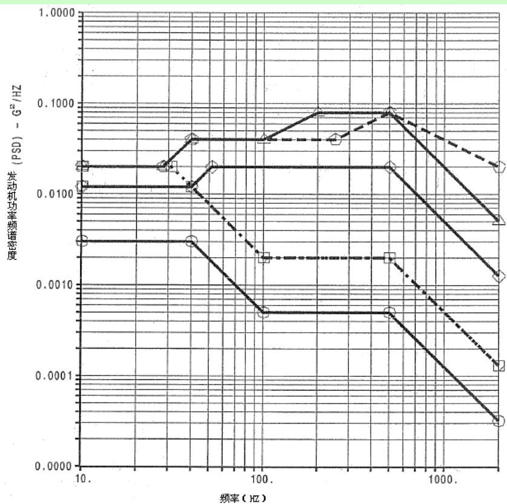

测试曲线频率断点上的测试级  

<table><tr><td></td><td>10</td><td>28</td><td>31</td><td>40</td><td>51.7</td><td>100</td><td>200</td><td>250</td><td>500</td><td>2000</td></tr><tr><td>B2</td><td>0.003</td><td></td><td></td><td>0.003</td><td></td><td>0.0005</td><td></td><td></td><td>0.0005</td><td>0.000032</td></tr><tr><td>B</td><td>0.012</td><td></td><td></td><td>0.012</td><td></td><td>0.002</td><td></td><td></td><td>0.002</td><td>0.00013</td></tr><tr><td>B3</td><td>0.020</td><td></td><td>0.020</td><td></td><td></td><td>0.002</td><td></td><td></td><td>0.002</td><td>0.00013</td></tr><tr><td>C</td><td>0.012</td><td></td><td></td><td>0.012</td><td>0.020</td><td></td><td></td><td></td><td>0.020</td><td>0.00126</td></tr><tr><td>D</td><td>0.020</td><td>0.020</td><td></td><td>0.040</td><td></td><td></td><td></td><td>0.040</td><td>0.080</td><td>0.020</td></tr><tr><td>E</td><td>0.020</td><td>0.020</td><td></td><td>0.040</td><td></td><td>0.040</td><td>0.080</td><td></td><td>0.080</td><td>0.00505</td></tr></table>

图 8-1: 对安装在固定翼飞机（带喷气涡轮发动机或涡扇发动机）上的设备的标准随机振动试验曲线

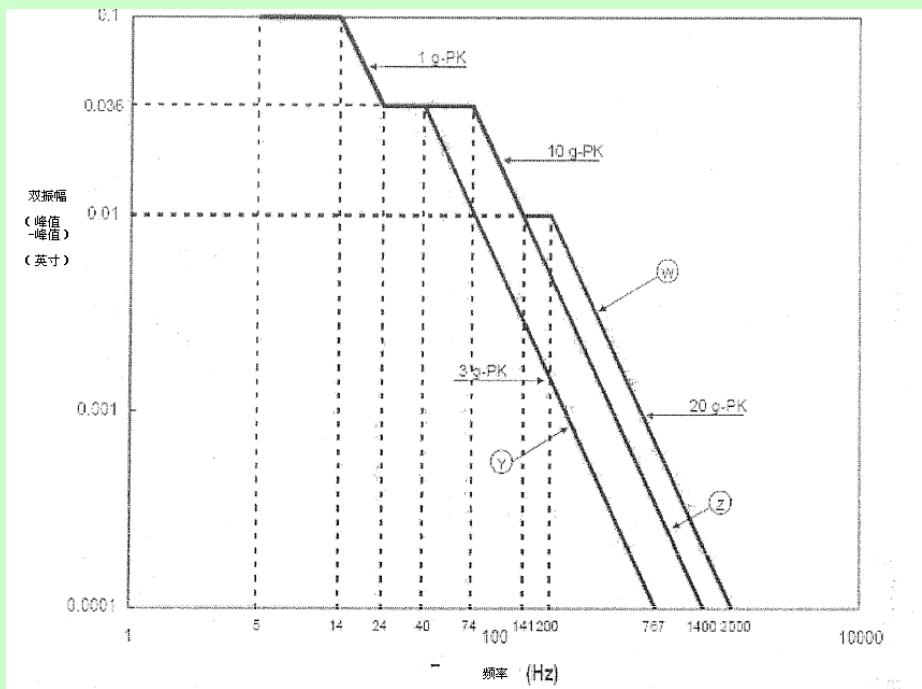  
图8-2：对安装在固定翼飞机适当区域（带喷气涡轮发动机或涡扇发动机和无函道风扇发动机）上的设备的标准稳定正弦振动试验曲线注：注：因为本图尺寸是从英制导出的，因此，保留英制单位。

图8-3：对于安装在固定翼飞机（带活塞式发动机或涡桨发动机）上的设备的标准正弦振动试验曲线  
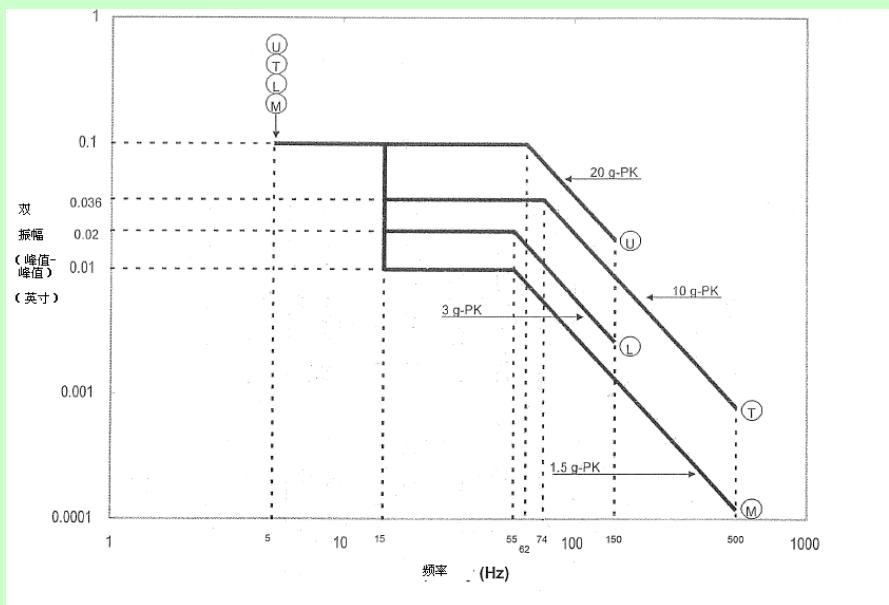  
注：注：因为本图尺寸是从英制导出的，因此，保留英制单位。

<table><tr><td>曲线</td><td>Gms</td></tr><tr><td>B12</td><td>1.48</td></tr><tr><td>B1</td><td>2.10</td></tr><tr><td>B4</td><td>2.20</td></tr><tr><td>C1</td><td>5.85</td></tr><tr><td>D1</td><td>12.61</td></tr><tr><td>E1</td><td>11.33</td></tr></table>

<table><tr><td>B12</td></tr><tr><td>B1</td></tr><tr><td>B4</td></tr><tr><td>C1</td></tr><tr><td>D1</td></tr><tr><td>E1</td></tr></table>

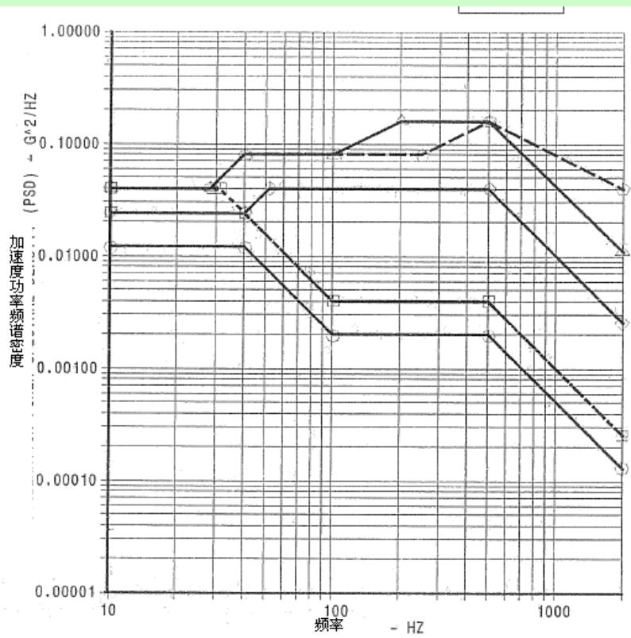  
图8-4：对安装在固定翼飞机（带喷气涡轮发动机或涡扇发动机）上的设备的稳定随机振动试验曲线

<table><tr><td colspan="11">测试曲线频率断点上的测试级</td></tr><tr><td></td><td>10</td><td>28</td><td>31</td><td>40</td><td>51.7</td><td>100</td><td>200</td><td>250</td><td>500</td><td>2000</td></tr><tr><td>B12</td><td>0.012</td><td></td><td></td><td>0.012</td><td></td><td>0.002</td><td></td><td></td><td>0.002</td><td>0.00013</td></tr><tr><td>B1</td><td>0.024</td><td></td><td></td><td>0.024</td><td></td><td>0.004</td><td></td><td></td><td>0.004</td><td>0.00026</td></tr><tr><td>B4</td><td>0.040</td><td></td><td>0.040</td><td></td><td></td><td>0.004</td><td></td><td></td><td>0.004</td><td>0.00026</td></tr><tr><td>C1</td><td>0.024</td><td></td><td></td><td>0.024</td><td>0.040</td><td></td><td></td><td></td><td>0.040</td><td>0.0026</td></tr><tr><td>D1</td><td>0.040</td><td>0.040</td><td></td><td>0.080</td><td></td><td></td><td></td><td>0.080</td><td>0.160</td><td>0.040</td></tr><tr><td>E1</td><td>0.040</td><td>0.040</td><td></td><td>0.080</td><td></td><td>0.080</td><td>0.160</td><td></td><td>0.160</td><td>0.011</td></tr></table>

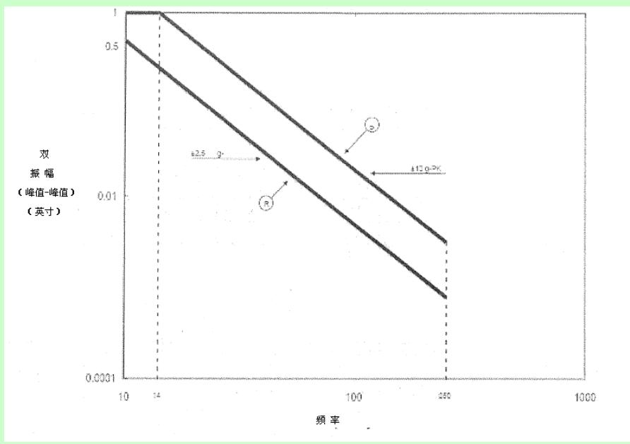  
图8-5：对安装在固定翼飞机（带喷气涡轮发动机或涡扇发动机）上的设备的高电平短期正弦振动试验曲线

注：因为本图尺寸是从英制导出的，因此，保留英制单位。

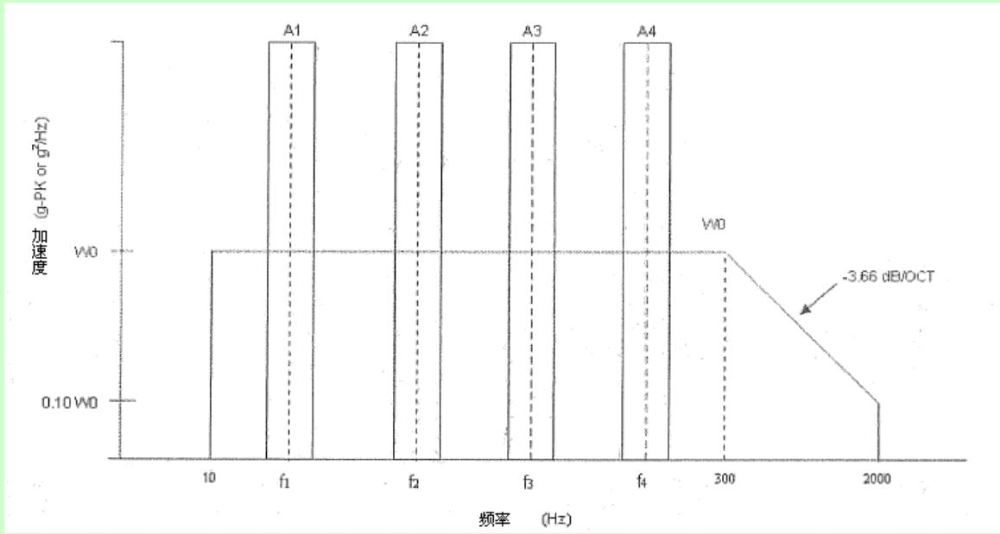  
图8-6：直升机正弦一随机振动试验曲线

注：W0 是一个随机 PSD 曲线， $\mathrm{g}^2/\mathrm{Hz}$ ；A1-A4 是正弦曲线， $\mathrm{g}-\mathrm{PK}$ 。振动频率由表 8-2a 中的方程获得。用这些频率和表 8-2b 中的方程来确定振动级别

<table><tr><td>测试</td><td>测试曲线</td><td>W0</td><td>Grms</td></tr><tr><td>性能</td><td>F</td><td>0.05</td><td>3.37</td></tr><tr><td>耐久性</td><td>F1</td><td>0.10</td><td>4.76</td></tr></table>

<table><tr><td colspan="2">断点</td></tr><tr><td>频率</td><td>W/W0</td></tr><tr><td>5</td><td>0.126</td></tr><tr><td>40</td><td>1</td></tr><tr><td>200</td><td>1</td></tr><tr><td>300</td><td>0.199</td></tr></table>

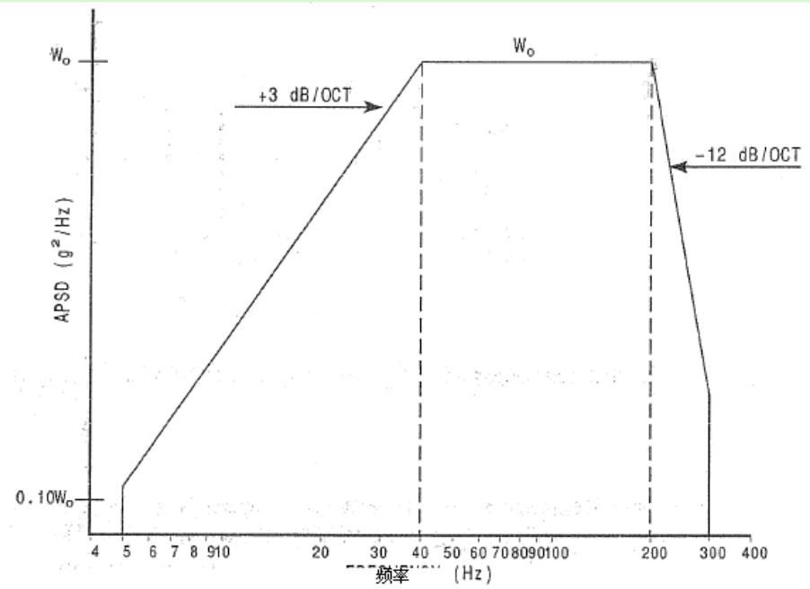  
图8-7：用于直升机机身、仪器面板和尾梁（未知频率）的随机振动曲线

# 第九部分 爆炸性气体

# 9. 爆炸性气体

# 9.1 试验目的

本试验规定了可能接触到本文件规定的可燃性流体和气体的飞机设备的试验要求和试验程序。它还涉及到飞机在飞行中经受或可能经受易可燃流体或气体的区域内发生的正常或失效条件。

本节所指的可燃性试验流体、气体和煤气可模拟传统飞机上正常使用的以及在燃烧时要求加氧的可燃流体和气体（例如，不包括单元燃料）。

该标准不适用由于机载货物如行李等的泄漏而产生潜在危险的环境。

注：爆炸性气体试验应该在试件经受了其他环境试验（见3.2节：“试验规程”）之后进行。

# 9.2防爆

如果确定在已声明能够引起可燃性气体爆炸得可能性很小的环境下时，该设备应是防爆的。

# 9.3 设备类别

# 9.3.1 A类设备

A 类设备应设计为:

a. 正常操作中, 任何表面的温度都不应增加到一个可以引起起火的水平, 也不能使任何工作部分起火, 从而满足 9.6.2 节中关于非点火试验的规定。  
b 点燃设备内部的爆炸性混合气体而非设备周围的爆炸性气体，因而满足 9.6.1 节中规定的抑制试验要求。

满足 9.3.1b 节要求的密封设备都应标识为 A 类设备。

# 9.3.2 E类设备

E类设备不密封、也不包含在壳体内，因而不能防火和防爆的。  
E类设备应设计成在正常工作状况下，外表面的温度不会升高到能够引起燃烧的温度点，或者任何工作的零部件都不会引起燃烧。

# 9.3.3 H类设备

H类设备包含有热点表面（内部或外部）和在正常工作条件下不会产生火花的（见4.6.1节）设备。

这些设备应被设计成在使得其在正常工作时内部的表面温度都不得升高到引燃周围易燃气体的程度，从而满足9.6.3节中关于元器件或表面温度试验的规定。

# 9.4总的试验要求

# 9.4.1 综述

下面所规定的试验要求是保证设备，在根据试验规范进行试验时，能够符合9.3节规定的标准。

# 9.4.2 试验样件

所选择的试验样件，应能代表生产的设备。

# 9.4.3 燃料

除非另有规定，所使用的燃油可以是丙烷、正乙烷及其综合物。

# 9.4.4 燃油混合物

a. 对于丙烷,  $3.85\%$  到  $4.25\%$  体积的丙烷与  $96.15\%$  到  $95.75\%$

$\%$  体积的空气所组成的按化学计量组成所需的 1.05 的混合物。试验器具见图 9-1。

b. 对于己烷, 应根据下列方程计算按化学计量组成所需的 1.80 的正常乙烷:

(1)  $95 \%$  正乙烷（公制单位）的体积（毫升）=

$(4.27 \times 10^{-4})$  [试验箱纯体积(升)][试验箱压力(帕)]/[试验箱温度(K)][n-乙烷的相对密度]

(2)  $95 \%$  正己烷（英制单位）的体积（毫升）=

(150.4L)[试验箱有效容积  $(\mathrm{ft}^3)$  ][试验箱压力(帕)]/[试验箱温度(R)][n-乙烷的比重]

注:  $\mathrm{K} =$  热力学温度, 等于  ${ }^{\circ} \mathrm{C} + 273.15$

$\mathrm{R} =$  热力学温度, 等于  ${ }^{\circ} \mathrm{F} + 459.67$

正乙烷的比重由图 9-2 确定。

用来汽化在防爆试验中使用的燃料的设备应能把少量的空气和燃料蒸汽一起加热到一定的温度，在此温度下当它们被吸入试验箱内时不能凝结。

如果要求燃料在爆炸试验箱内汽化时，则引入燃料的温度应为试验现场环境温度。

# 9.5 设备设计和安装信息

设备规范应详细说明用于特种设备外壳的所有设计限制。此设计限制应当包括下列条件：

a. 对于可能和可燃性液体或气体接触的设备，以及在正常操作

中会产生电弧、电火花或热表面的设备在设计安装中应考虑到它自身可能的安装方法，且设计成防爆的。

b. 对于可能和可燃性液体或气体接触的设备, 以及在故障条件下会产生电弧、电火花或热表面的设备在设计安装中应考虑最大限度地减小发生故障的危险, 因为这样的故障会点燃可燃性气体。  
c. 为强迫通风设备设计供气系统时, 要考虑供气会被可燃性气体污染的可能性。如果设备及其导管（包括接头）处于易污染的区域, 那么这些设备应能够满足相应的环境条件。  
d. 9.3.1 节中关于 A 类设备的规范，应当考虑凸缘及其孔径尺寸要求或其它等效的方法，如阻焰罩等的设计要求，以保证火焰传播时足够的安全。这些资料包含在国家文件中。

# 9.6 试验程序

# 9.6.1 抑制试验

# 9.6.1.1 试验准备

a. 试验外壳或罩子的准备：该程序的目的是给试验外壳或罩子内注入易挥发混合气体，然后点燃。在外壳或罩子上钻孔或开孔，用于把出入管连接到燃料蒸气空气混合循环系统，以用于连接火花隙装置。为了引入爆炸性气体而对试验壳体所做的任何改进都不能使试验壳体体积改变不超过  $\pm 5\%$  。  
b. 软管安装: 插入风机软管时, 要特别小心防止由于回火或软管的压力泄漏而点燃周围混合气体。

c. 火花隙装置：试验壳体或外壳内提供有火花隙装置，用于点燃爆炸性混合气体。可以在外壳或罩子上钻孔或开孔以安装火花隙装置，或者将火花隙装置在外壳或罩子内。  
d. 壳体的安装。根据制造商为正常使用建议的安装方式，对安装有试验件或体积和结构与试验件相同的模型的外壳或罩子安装、电气连接并且定位。这里还包括成规定的试验所需的任何冷却措施。  
e. 试验设备。要求的设备包括试验箱或试验舱以及能够建立、维护和监控规定试验条件的仪器组成。试验箱体应带有燃油空气混合气体点火装置（如火花隙装置）以及确定混合气样本爆炸性的方法（如火花隙或发热头点火源）。确定气体爆炸性的另一种方法是用校准好的爆炸气体表。该表可鉴定燃油一空气混合气的爆炸性及浓度。

# 9.6.1.2 试验

下列试验顺序应该进行三次：

第一步：试验箱应当密封并且内部压力应保持在现场级压力。环境试验箱的温度应至少为  $25^{\circ} \mathrm{C}$  。试验箱内的易爆气体可通过 9.4.3 节和 9.4.4 节所规定的方法获得。使燃油空气混合气体在试验件上循环（通过鼓风机或泵），以保证有爆炸性混合气体进入试验件内。

第二步：启动内部壳体点火源，在壳体内引起爆炸。可以通过将热电偶插入外壳内并且连接到试验箱外部的温度记录器来取消外壳内的爆炸的发生。如果混合气没有被立即点燃，则该试验被认为无效，应使用新的爆炸气体填充。

第三步：至少应进行5次壳体内爆炸。如果受试壳体较小（不超过试验箱体积的1/50）而且如果壳体内对点火的反应只是只是爆炸本身而没有在混合气进入壳内时继续燃烧混合气体，则需进行一次以上、但不超过5次的壳体内爆炸而无需给整个试验箱体重新充气。为了给壳体内充入新的爆炸性混合气体替换已燃烧过的气体，两次壳内爆炸试验之间应给予充分的时间。如果产生的壳内爆炸没有引起主试验箱爆炸，那么可以用火花点火塞或发热点火塞点燃混合气样品来校验主主试验箱内的燃料空气混合气体的爆炸性。如果发现主试验箱内的空气蒸汽混合气体不能爆炸，则该试验被认为无效；整个过程必须重新进行。

# 9.6.1.3 失效判据

如果壳体内爆炸引起主试验箱爆炸，则该试验件没有通过试验，无需进行进一步试验。

# 9.6.2 非点燃试验

# 9.6.2.1 试验准备

a. 根据制造厂家的推荐的方式模拟正常使用安装方式对试验件进行机械和电器连接。包括完成该试验的必要冷却措施（下面会描述说明），以便进行正常的电气操作；并通过压力密封装置从箱外进行机械控制。试验件的外壳应当去掉或松开以方便易爆混合气体进入。大型试验件可以一次测试一个或几个单元，方法是通过引线孔将电气

连接延长到箱外的附助设备的平衡装置上。

b. 使试验件工作, 以确定其功能是否正常。  
c. 只要能采取适当的措施来复现扭矩、电压、电流、感应电抗等的正常负载，就可以模拟驱动部件的机械负载和开关、继电器上的电气负载。在所有情况下，最好就象在安装环境中正常工作那样运行试验件。

# 9.6.2.2 试验

试验应该在环境压力下进行：

第一步：试验箱应当密封并且其内部环境温度应提升到表4-1规定的工作高温。设备设计在此温度下工作。在引入易爆混合气体之前，允许试验箱及其箱壁的温度高出试验箱环境温度  $11^{\circ}\mathrm{C}$  之内，以防止爆性气体凝露。

第二步：应当将一定量的燃油注入试验箱内（9.4.4）。然后让试验空气循环至少3分钟，以便使燃油完全料雾化，从而形成均质的混合气体。

第三步：此时，试验件的电接触器都应动作。在这一期间试验件的工作连续进行。试验件的电气连接和断开频率应和实际情况相同。

第四步：如果试验件运行时没有发生爆炸，则使用火花栓或热线点火塞点燃空气蒸汽混合气样品来鉴定潜在爆炸性。如果空气蒸汽的混合气不爆炸，则该试验被认为无效，需要重复整个过程。

# 9.6.2.3 失效判据

如果试件发生爆炸，则试件没有通过该试验；不需要进行下一步试验。

# 9.6.3 元器件或表面温度试验

# 9.6.3.1 试验准备

根据9.6.2.1节的说明将试验件放入试验箱内，怀疑会发生热点火的受试部件和受试表面应安装有仪表和工作范围为  $65^{\circ}\mathrm{C}$  至  $260^{\circ}\mathrm{C}$  的热电偶。

# 9.6.3.2 试验

试验应按如下操作进行：

第一步：试验箱应当密封并且其内部环境温度应提升到表4-1规定的工作高温。设备设计在此温度下工作。

第二步：给设备通电并按正常模式工作，直到设备达到热稳定。记录可疑部件或表面温度达到的最高温度。如果温度达到  $204^{\circ}\mathrm{C}$ ，则应终止该试验。I

# 9.6.3.3 失效判据

如上面“第二步”中所述，如果试验件温度超过  $204^{\circ} \mathrm{C}$ ，则该试验件未通过试验，无需进行下一步试验。

表 9-1: 设备种类和试验要求

<table><tr><td>设备种类</td><td>要求和试验</td></tr><tr><td>A(密封)</td><td>抑制试验,9.6.1节或 密封壳体。表面温度试验,9.6.3节</td></tr><tr><td>E</td><td>非点火试验,9.6.2</td></tr><tr><td>H</td><td>表面温度试验,9.6.3; (无火花产生设备或密封)</td></tr></table>

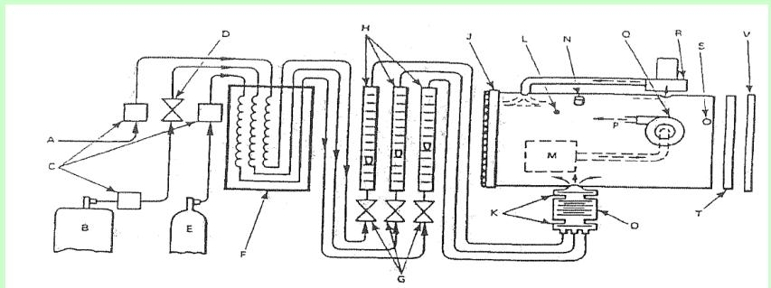

# 图注说明:

A: 空气

K：模片检查阀

B: 丙烷气体容器

L：柱型爆炸箱

C: 减压阀

M: 受试单元

D: 由爆炸箱上微型开关

N：通风口

控制的气体切断阀

0: 混合试验箱

E: 氧气瓶

P：废气排出口

F: 能使气体达到标准温度

Q:受试件取放器

的热交换器

R：搅拌鼓风机

G:针阀

S:当 H 流量计橡胶带由于爆炸移位时，微型开关释放

J: 两端由模片包裹（如纸、聚乙烯）

T: 膜

系有橡皮带

V: 橡皮带

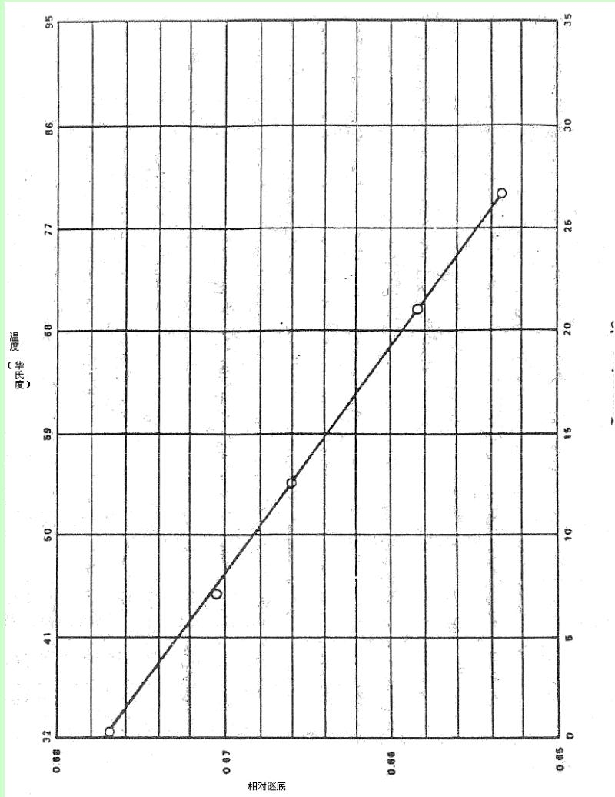  
图 9-1: 爆炸气体试验中所用仪器  
图  $9-2: \mathrm{N}-$  乙烷相对密度

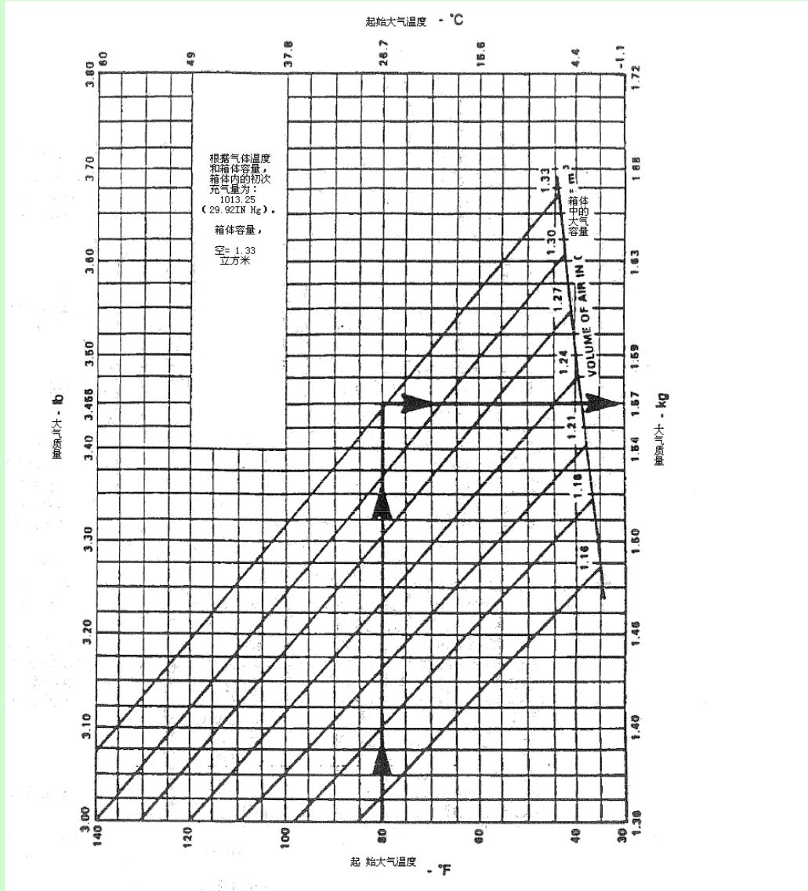  
图9-3：充气量与温度

# 附录九 用户指南

# 爆炸性其它

第九部分规定了环境、试验程序及要求。为了正确解释第九部分所述程序和要求，在附录九中提供了“用户指南”。

“用户指南”包括环境、测试程序和要求的理由、指南和背景信息以及从飞机和实验室获得的经验。此信息会帮助用户理解这些要求背后的内容，帮助用户按其自身需要剪裁要求，帮助用户在第九部分

通用试验程序的基础上，研究详细的实验程序。

“用户指南”与文件主体格式保持一致，以便于相互参考。与第九部分每一章节对应的章节号同时包括“用户指南”。如果“用户指南”中没有提供附加信息，则只提供章节标头，下面为空白页。

# 9. A. 0 爆炸性气体

# 9.A.1 试验目的

本部分旨在提供能够用于设备爆炸性气体试验的试验程序和试验级。安装者应负责确保试验结果满足建议的安装要求。用户指南不包含任何要求，仅提供能够提高试验成功进行的背景信息和考虑。

# 9.A.2 防爆性

# 9. A. 3 设备类别

9. A. 3.1 A 类设备

9. A. 3.2 E类设备

9. A. 3. 3 H 类设备

# 9. A. 4 通用试验要求

9. A. 4. 1 总则

9. A. 4.2 试验样件

9.A.4.4 燃油混合体

# 9.A.5 设备设备和安装信息

飞机区域定义和设备要求。

设备在飞机上的安装区应根据其在正常工作期间，防止蒸汽爆炸的性能而定；根据故障模式中非正常工作期间，在飞机区域上发生爆

炸的可能性而定。

飞机区域1：

飞机区域1：存在有未覆盖的易燃流体或蒸汽的飞机区域，或，连续或断续存在这样情况的区域（例如，燃油箱内或有燃油或液压系统）。安装在这种环境下的设备，在正常或双操作故障条件下，都不可能点燃周围大气。

飞机区域II：

飞机区域II：指可能会因为单个故障导致溢出或泄漏，导致易燃性混合体的飞机区域。安装在此环境下的设备，不会在其正常或可能的故障模式中，点燃周围大气。只需要考虑单个设备故障。

飞机区域III:

飞机区域III：指不会因为单个故障导致溢出或泄漏，导致易燃性混合体的飞机区域。安装在此环境下的设备，在其正常工作模式下，不会点燃周围大气。

飞机区域IV:

飞机区域IV：为指定的火烧区或飞机上会因为双故障导致的溢出或泄漏产生的易燃性混合体的区域。对安装在此区域内的设备，无特别要求。

9.A.6 试验程序  
9.A.6.1 抑制试验  
9.A.6.1.1 试验准备  
9.A.6.1.2 试验性能

9.A.6.1.3 故障准则  
9.A.6.2 非点火试验  
9.A.6.2.1 试验准备  
9.A.6.2.2 试验性能  
9.A.6.2.3 故障准则  
9.A.6.3 表面温度试验组成  
9.A.6.3.2 试验性能  
9. A. 6.3.3 故障准则

如果进行故障模式测试，应打开设备并在其可能的故障模式下操作，直到设备达到热稳定。从设备打开开始直到设备稳定，应连续记录在可疑部件或表面上获得的温度。如果此期间，在任何时间段内获得超过  $204^{\circ}\mathrm{C}$  的温度，则应终止试验。

表 9-A-1 设备类别和实验要求

图9-A-1 爆炸性气体测试用仪器示例

图9-A-2 N-乙烷相对密度

图9-A-3 充气质量与温度

# 第10部分 防水试验

# 10. 防水性

# 10.1 试验目的

该试验用于确定设备是否经能够经受喷洒或滴落在设备上的水的影响。

这些试验不是为了验证密封设备的性能。因此，可以认为密封设备已满足防水性要求而不必要进一步的试验。如果密封是永久性且气密性时，可以认为该设备是密封的。

# 10.2 设备种类

# Y类设备

安装在飞机正常飞行过程要经受到冷凝水的位置上的设备称为Y类设备。对于打算安装在该位置设备，应进行防凝露试验，且该类设备称为Y类设备。

# W类设备

安装在飞机正常飞行过程要经受滴落水的位置上的设备称为W类设备。对于打算安装在该位置设备，应进行防滴水试验，且该类设备称为W类设备。

# R类设备

安装在可能经受雨淋或从任何角度受到喷洒水影响的位置上的设备被称为R类设备。对于打算安装在该位置的设备，应进行防喷水试验过程。通过R类试验要求的设备可以认为满足W类要求，无需进一步试验。

# S类设备

安装可能受到流体强冲击（如在飞机去冰、冲洗过程中遇到的）位置上的设备叫做S类设备。对于打算安装在该位置的设备，应进行防连续流体试验。在该试验中用水流模拟实际的流体力量。通过S类试验要求的设备可以认为满足W类设备要求，无需进一步试验。

# 10.3 试验程序

# 10.3.1 防凝水试验

该试验将用到两个温度试验箱。试验箱1设定在  $-10^{\circ}\mathrm{C}$ ，而试验箱2设定在  $40^{\circ}\mathrm{C}$  和  $85\%$  RH。根据制造厂家的说明书把带有连接器和连接附件的受试设备都安装试验箱1中。使设备不工作，稳定最少3小时。在同一时间，让试验箱2稳定在  $40^{\circ}\mathrm{C}$  和  $85\%$  湿热。稳定3小时之后，在5分钟内把设备移入试验箱2。根据制造厂家的说明书安装试验设备及连接器，最大延迟时间不超过5分钟。给设备加电，让其运行10分钟。运行10分钟之后，确定是否符合设备性能标准。

# 10.3.2 防滴水试验

在开始防滴水试验之前，使受试设备不工作，将设备稳定在至少高出滴水试验水温  $10^{\circ}\mathrm{C}$  。根据制造厂家的说明书将带有连接器和连接附件的设备等放入试验箱。设备不运行，让落水以均匀的速率从距设备表面1米高处落下，最少15分钟。试验设备的给水量应大于140 $\mathrm{I} / \mathrm{m}^{2} / \mathrm{hr}$ ，用喷头喷淋，每个喷咀的额定直径为  $0.33\mathrm{mm}$ ，喷咀相互之间距离为25毫米，见图10-1。注意：为满足  $140~\mathrm{I} / \mathrm{m}^2 /\mathrm{hr}$  或更大水量。应对“滴水”表中给出水量进行预先调整和后期调整，注意表中列出的滴水级别。滴水孔模式应足够大，以满足或超过受试设备在其正常位置安装时的水平横截面。试验结果中，应确定是否符合设备性能标准。

# 10.3.3 防喷水试验

根据制造厂家的说明书，将带有连接器和连接附件的设备放入试验箱。使设备运行，把喷头洒水，见图10-2。水应垂直喷洒在设备最易受损的表面，具体说明见有关设备性能标准。

每个受试区都应经受喷洒至少15分钟。可以用多个喷头同时从几个表面进行喷洒。喷头与受试面的距离不超过2.5米，并且喷水量应大于450升/小时。试验结束时确定是否符合设备性能标准。

# 10.3.4 防连续水流试验

该试验用以补充11.0节的流体敏感性试验。在进行本试验之前，应对敏感性材料如垫圈，进行11.0节所述的适当试验。本试验在水温  $50^{\circ}\mathrm{C}$  时进行。

根据制造商的安装说明，模拟飞机上的安装方法安装设备。连接器和其它连接附件都应按正常工作方式安装到位。在本试验中该设备不需要运行。

使设备，尤其那些配有弹性垫圈设备的各个表面经受连续流水的冲击，每个面至少5分钟。该水流应该有足够的压力，以便通过6.4毫米直径的喷嘴产生至少6米的垂直水流。喷嘴与该设备的距离应为1至2米。试验结束时确定是否符合设备性能标准。

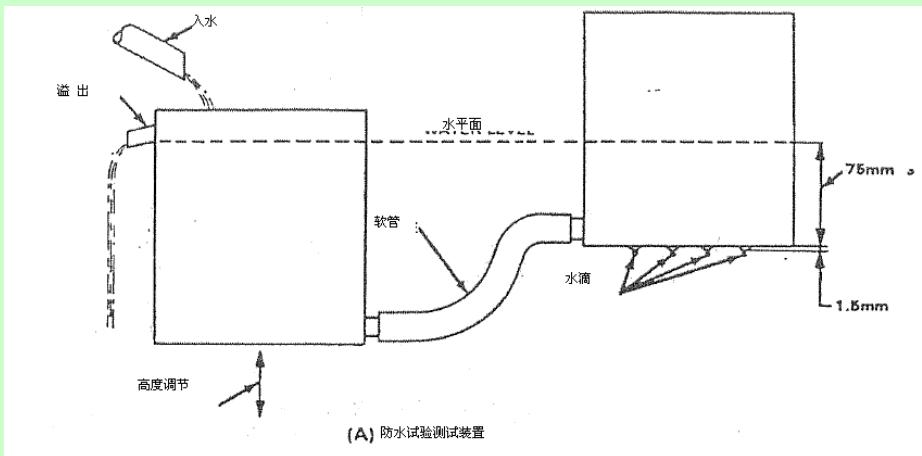

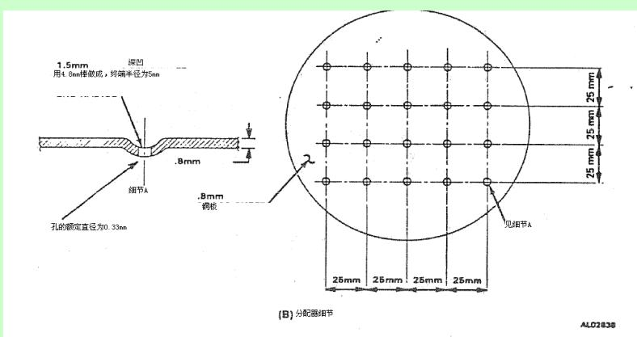  
图10-1：防滴水试验细节

注：应满足  $140 \mathrm{~I} / \mathrm{m}^{2} / \mathrm{hr}$  或更大的水量。应对滴水表中水排放量进行预调节及后调节，并应注意滴水表中的水平。

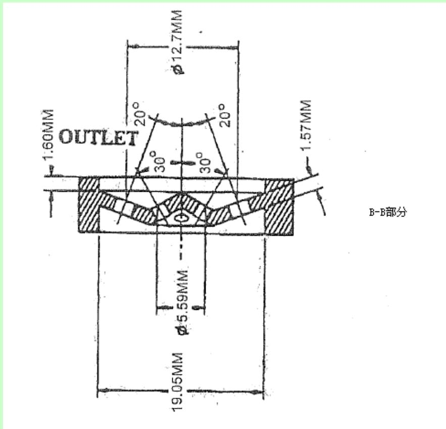

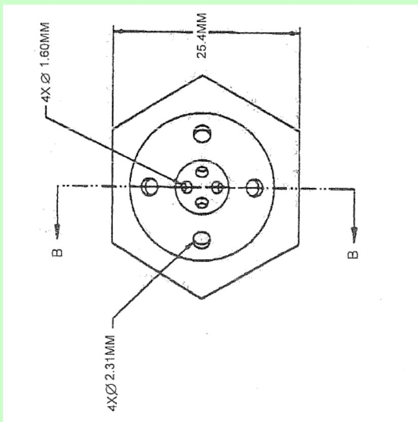  
图10-2：喷头细节

# 第11部分 流体敏感性

# 11.0 流体敏感性试验

# 11.1 试验目的

本试验用于确定设备结构中使用的材料能否耐受流体污染的有害影响。只有当设备安装在可能遇到流体污染的区域时才能进行流体敏感性试验。该流体是在机载和地面操作中常常遇到的那种流体。如需要用本标准未列出流体做流体敏感性试验时，有关标准中应加上说明。

# 11.2 注意事项

由于许多污染流体的闪点可能在试验温度范围内，必须十分小心，采用适当的措施，避免着火或爆炸。

某些污染流体本身或同其他污染物或和试验样品化合后可能是有毒的，试验之前必须采取预防措施。

# 11.3 设备种类

F类

通过本章规定试验的设备划为 F 类设备。环境合格表（见附录 A）提供了所涉及试验流体详细情况及使用方法。

注意：本文件的 10.0 和 14.0 章分别为防水试验和盐雾试验。第 11.0 章包括其它七类污染物。此外，还有 25 种特定流体用于这些试验类别。表 11-1 包括了流体种类、特定流体及试验要求的温度。在类别 F 中，不要求对 25 种流体的测试或所有 7 种通用污染流体的测

试进行说明。对使用的流体、测试方法、试验程序中的暴露温度及环境鉴定表，应进行规定。

# 11.4 试验步骤

# 11.4.1盐雾试验

根据有关的设备规范对设备进行机械和电气连接。试验期间不要求该设备运行，条件为室温环境。

（a）用指定的试验流体对试验件可能暴露的全部表面进行喷洒。喷洒应完全湿润并保持在表11-1规定的温度条件下，喷洒方向应指向受试设备样件每个主要表面、密封处及连接处。16小时， $65^{\circ}\mathrm{C}$ 条件下干燥之后，应使试验样件保持湿润状态至少8小时。如果不能保持湿润状态，而且有关标准要求进行喷洒试验而不是浸渍试验时，那么可允许最多每间隔4小时向试验样品全面喷洒一次，使样件在标准环境温度下稳定。  
（b）目视检查试验件材料是否降级、防护是否完成及其无论变化。重复步骤 (a)，直至 3 个 24 小时循环完成为止。在第三个喷雾阶段结束时，如果仍然湿润，产品至少工作 10 分钟。最后一个周期之后，将试验箱调节到环境温度（避免温度冲击）下，使单元工作，直至稳定或最少 30 分钟。确定是否符合设备性能标准。  
(c) 重复步骤 (a) 到 (b) 进行附加的流体试验。  
(d) 所有流体试验完成之后。确定是否符合设备性能标准。

注意：如果设备要在几种污染流体中试验，正常情况下，应当在各个流体中分开进行。但是，如果流体基底相同（例如：油基不能紧跟水

基)，则允许试验同时进行。喷洒前，各种流体不能预先混合。使用的次序应根据设备规范进行。除非在设备规范中另有规定，否则多种流体同时应用的总暴露时间应该与单个流体的暴露时间相同。在本节其它地方应注意的措施在这里也应该遵守。

试验结束时，要对设备进行检查，结果应显示对内部或外部器件没有任何损坏。

# 11.4.2 浸泡试验

根据相关的规范对设备进行机械和电气连接。在试验期间不要求运行设备，在室温下进行试验。不要预先混合任何液体。

将设备浸泡在适当的流体中，至少24小时。流体的温度保持在表11-1所示的温度，并且流体应将试验样件完全浸没。

24 小时结束后，在设备完全浸泡在液体中的情况下运行设备至少 10 分钟。

紧接着这一阶段，卸下试验样件，将它放在适当的箱中，经受  $+65^{\circ} \mathrm{C}$  恒温，至少 160 个小时。该过程结束后，将试验样件温度调至室温，运行至少 2 小时。

2 小时之后，确定是否满足适当的设备性能标准。

# 11.5 材料样件的使用

材料样件的试验可以用来代替设备试验。这些试验结果将保证该材料会保护设备不受到相关流体的有害影响。可以参考设备试验过程（11.4节）。

注意：如果紧接着进行连续防水试验（见10.3.3节），则不允

许进行材料样件试验。

表 11-1: 试验流体的分类和流体的温度  

<table><tr><td>污染流体的类型</td><td>试验用流体</td><td>流体温度(℃)</td></tr><tr><td>燃油</td><td>航空A型燃油活塞式发动机燃油</td><td>401/401/</td></tr><tr><td>液压流体</td><td>矿物基非矿物基IV 2/型磷酸酯基(合成)硅酸酯基(合成)硅酮基(合成)合成碳氢基</td><td>805070707070</td></tr><tr><td>润滑油</td><td>矿物基酯基(合成)内燃机15W40</td><td>7015070</td></tr><tr><td>溶剂和清洁液</td><td>异丙基酒精变性酒精飞机表面清洁化合物反式1-2二氯乙烯(替代1.1.1节的三氯乙烯)</td><td>501/231/2323</td></tr><tr><td>去冰液体</td><td>乙基甘醇丙稀甘醇1、3/型AEA2、3/型AEA1型SAE2型SAE4型SAE</td><td>5050505050232323</td></tr><tr><td>杀虫剂</td><td>敌敌畏(DDVP)(商用最小0.92%浓度)除虫菊酯杀虫剂(商用最小0.92%浓度)</td><td>2323</td></tr><tr><td>废料</td><td>由设备规范规定</td><td>23</td></tr><tr><td>消毒剂(重酚醛)</td><td>透明的、可溶解的酚醛,如酚或溶解在活化剂和稀释于水中的衍生物。黑色流体,如精炼的焦油产品(溶解于舰载油或用洗涤剂乳化)。白色液体,如精炼的媒焦产品的乳液,通常包含小量的活化剂。</td><td>232323</td></tr><tr><td>绝缘冷却剂流体</td><td>PAO绝缘</td><td>70</td></tr><tr><td>灭火剂</td><td>蛋白质氟蛋白质清水泡沫(ATTF)</td><td>232323</td></tr></table>

注：表 11-1:

1/ 该温度超过了燃点温度。试验应该在具有适当压力的容器中进行。  
2/ 这些液体是导电的。设备操作前，将其放在液体中之后应当采取预防措施。  
3/欧洲航空公司协会。

# 第12部分 沙尘

# 12.0 沙尘

# 12.1 试验目的

该试验确定了以适当速度运动的气流中沙尘对设备的影响。估计主要的不利影响是:

(a) 砂尘可以渗入裂缝、孔隙、轴承和接头中, 引起活动部件、继电器、过滤器等受阻或堵塞。  
(b) 形成导电桥。  
(c) 作为水蒸气收集核心，包括可能的腐蚀产生的次要影响。

注意：在环境试验过程中确定应用该试验程序时，由于试验过程有残余沙尘，所以要考虑结合其它环境综合因素可能产生的腐蚀或在试验部件上产生霉菌、以及对后续试验过程结果的不利影响。沙尘磨损可能会影响盐雾、霉菌或湿度试验的结果。

# 12.2 设备种类

D类:

按下面章节推荐方法进行沙尘试验的设备规定为 D 类设备。此类

设备可以安装在飞机上正常工作时经受吹沙和灰尘的地方。这些位置区域包括座舱或任何其它未做沙尘防护的地方。

S类：

按下面章节推荐方法进行沙&尘试验的设备规定为S类设备。此类设备可以安装在飞机上正常工作时经受吹沙和灰尘的地方。这些位置区域包括座舱或任何其它未做沙尘防护的地方。

# 12.3 介质

# 12.3.1 粉尘

在通风的试验箱中使用的粉尘应当被吹起并保持在浓度为 3.5 到  $8.8 \mathrm{~g} / \mathrm{m}^{3}$  之间。二氧化硅浓度应为  $97 \%$  到  $99 \%$  。

所使用的粉尘可以是红瓷土或硅粉，但必须满足重量小于150微克、 $100\%$  均匀分布（介质的直径  $20 \pm 5$  微米、重量  $50 \pm 2\%$ ）。该粉尘可使用140网硅粉（大约  $2\%$  保留在140筛网（108微米），并且应该给试验前的要求提供可比较的结果。国家标准资料可能包含其它更多的特殊分布。

# 12.3.2 沙子

1）如果可以得到沙粒含量数据，则在最坏外场环境下设备也可以正常工作，所以应测试沙粒含量。  
2）对于要在未铺砌表面上工作的直升机关系密切的材料： $2.2 + / - 0.5\mathrm{g / m3}$  (0.06+/-0.015g/立方尺)；  
3）从未在与飞机操作临近的地方使用或者暴露过的材料，但是可能会在未保护情况下在临近操作表面的地方使用或者存储：

1.  $1 + / - 0.3 \mathrm{~g} / \mathrm{m} 3\left(0.033 + / 0.0075 \mathrm{~g}\right)$  立方尺)。

4) 对于仅经受自然条件的材料:  $0.18 \mathrm{~g} / \mathrm{m} 3, -0.0 / +0.2 \mathrm{~g} / \mathrm{m} 3 (0.005 \mathrm{~g} /$  立方尺)。(之所以取这个较大的容限是因为在低水平条件下沙粒含量测量比较难)。

除非另有跪地，对于沙粒试验，使用硅砂（Si02, 至少  $95\%$ ）。使用次棱角形结构的沙粒，对于圆形和半球形，平均 Krumbein 数量范围从 0.5 到 0.7，硬度系数为 7mhos。因为次棱角形结构和杂质在试验中会有所损失，因此，沙粒不能重新。对于较大沙粒试验，建议的沙粒试验粒子分布尺寸为  $150 \mu \mathrm{m}$  到  $850 \mu \mathrm{m}$ ，重量小于 600  $\mu \mathrm{m}$ 、大于或等于  $150 \mu \mathrm{m}$  时，平均百分比为  $90 \pm 5\%$ ；重量为 600  $\mu \mathrm{m}$  或更大时，百分比至少为  $5\%$ 。

# 12.4 粉尘试验步骤

设备应该在每个正交轴方向上连续进行粉尘试验。空气的速率应该保持在0.5至  $2.4\mathrm{m / s}$  之间。

注 1: 除非在相关规范中另有要求, 否则在设备暴露期间不要运行设备。

注 2: 应当遵守有关粉尘使用的健康和安全条例。

# 12.4.1 第一次循环

使试验箱内部温度保持在  $+25 \pm 2^{\circ} \mathrm{C}$ , 相对湿度不高于  $30 \%$ ,这时设备应该在每个正交轴方向上连续暴露至少 1 个小时。

# 12.4.2 第二次循环

随着试验箱的内部温度上升，然后稳定在  $+55 \pm 2^{\circ} \mathrm{C}$ ；相对湿度不超过  $30\%$ 。这时设备在每个正交轴方向上连续暴露至少1个小时。

暴露周期结束之后，将设备从试验箱取出，然后冷却到室温。要求验证正确操作（如显示器、连接器，键盘和试验部件等）的设备，应除去其外部表面上积累的粉尘，即通过刷、擦除和抖动等。但是要注意不要把别的粉尘带入设备表面。在任何情况下都不能用鼓风机或吸尘器除尘。当除去多余的粉尘后，对设备进行10次机械操作，然后检查是否有移动阻塞和咬合。这时，确定是否符合设备性能标准。

# 12.5 沙尘试验步骤

试验设备进行沙尘试验时风速为18至  $29\mathrm{m / s}$  、暴露表面距离沙尘注入口应为3米。这样作可以使得沙尘颗粒在冲击设备表面上能达到最大速度。如果在正常设备操作寿命（座舱屏幕显示）期间经受不到该幅度的风速，那么应设备暴露于0.5和  $2.4\mathrm{m / s}$  的风速中。应该利用垂直试验箱来保持沙尘均匀分布。

注：除非在相关的规范中另有要求，否则设备暴露期间不要操作它。

# 12.5.1 第一次循环

使试验箱的内部温度保持在  $+25 \pm 2^{\circ} \mathrm{C}$ ，相对湿度保持在不高于  $30\%$ ，这时设备应该在每个正交轴方向上连续暴露至少1个小时。

# 12.5.2 第二次循环

随着试验箱的内部温度上升，然后稳定在  $+55 \pm 2^{\circ} \mathrm{C}$ ；相对湿度不超过  $30\%$ 。这时设备在每个正交轴方向上连续暴露至少1个小时。

暴露周期结束之后，将设备从试验箱取出，然后冷却到室温。要

求验证正确操作（如显示器、连接器，键盘和试验部件等）的设备，应除去其外部表面上积累的沙尘，即通过刷、擦除和抖动等。但是要注意不要把别的沙尘带入设备表面。在任何情况下都不能用鼓风机或吸尘器除尘。当除去多余的沙尘后，对设备进行10次机械操作，然后检查是否有移动阻塞和咬合。这时，确定是否符合设备性能标准。

# 第13部分 防霉菌试验

# 13.0 防霉菌试验

# 13.1 试验目的

这些试验确定了设备材料在有利于它们开发的条件下是否受到霉菌的负面影响。所谓的有利条件即高湿度、暖气温和无机盐的存在。

注:

A. 如果在正常操作和维护期间，霉菌接近其他物质、暴露于日常敏感污染物（如液体）、或设备暴露于日光化性影响，那么就可能引起分子键的断裂，从而使物质分解成更小的部分，这些小部分可能就是霉菌的培养基。  
B. 该试验不能在盐雾试验和沙尘试验后进行。因为高浓度的盐雾会影响霉菌生长, 并且沙尘会提供培养基, 一这会使该试验无效 (见 3.2 节: 试验次序)。

# 13.2 一般的影响

由设备上霉菌引起的典型问题有以下四个:

a. 作为正常新陈代谢过程，微生物吸收有机物，这样就降低了培

养基、见效了表面张力、增加了湿气渗透。

b. 在新陈代谢期间产生的酶和有机酸会扩散到细胞外、到培养基上，从而引起金属和玻璃腐蚀、油脂变硬以及对培养基的物理和化学变化。  
c. 微生物的存在会在元器件之间产生生物桥，从而引起电气故障。  
d. 霉菌的存在也会引起健康问题，并且外观也不好看，用户会不喜欢使用该设备。

霉菌生长的有害影响可总结如下:

a. 对材料的直接影响。无抵抗物质更易于受到直接影响，因为霉菌会分解物质并将它们作为培养基。这会对物质材料的特性产生有害的影响。无抵抗物质示例如：

(1) 自然物质。产生于自然源的产品（以碳为基础），最易于受到影响。

(a) 纤维素材料（如，木头、纸、自然纤维纺织品和绳索）。  
(b) 动物基和植物基粘胶。  
(c) 油脂、滑油和碳氢化合物。  
(d) 皮革

(2) 合成材料

(a) PVC 配方（即那些与脂肪和酯类增塑的材料）。  
(b) 某些聚氨酯（如聚酯和某些聚醚）。  
(c) 含有机分层材料的填充剂的塑料。

(d) 含敏感成分的涂料和清漆。

b. 对材料的间接影响。由于间接原因引起的对防霉菌材料的损坏。

(1) 在设备表面形成的霉菌还含有沙尘、油脂、汗渍和其它污染物（它们在制造和操作期间形成）。既使它们不受直接影响，也会引起分层材料的损坏。  
(2) 由霉菌产生的报废产品（如有机酸）会引起金属腐蚀、玻璃侵蚀以及塑料和其它材料的污染和质量下降。  
(3) 在临近材料上由霉菌产生的酸性废品会和防腐材料接触。而这些材料易于受到直接影响。

# 13.3 设备种类

# F类设备

安装在易于受到严重霉菌污染的环境中的设备叫做F类设备。这些设备应进行防霉菌试验。如果设备组成中所使用的所有材料都能显示霉菌生长没有培养基，那么根据其组成或以前的试验，不必做该试验。如果非培养基材料的认证被用于该鉴定，则该情况应当在质量合格表中说明（见附录A）。

# 13.4 试验装置

要求进行该试验的装置由试验箱或能够维持规定的温度和湿度条件的辅助检测仪器组成。为了防止在试验设备上水滴的凝固，应采取相应的措施。在试验设备周围空气应能自由流通，支持设备的夹具的接触面应尽可能小。当使用强气流时，在试验样品的表面气流速度

不应超过每秒一米。

# 13.5 试验步骤

# 13.5.1 矿物盐溶液的准备

使用的溶液应当包含以下物质:

磷酸二氢钾：  $0.7 \mathrm{~g}$

磷酸单水钾：  $0.7 \mathrm{~g}$

七水硫酸钾:  $0.7 \mathrm{~g}$

硝氨:  $1.0 \mathrm{~g}$

氯化钠:  $0.005 \mathrm{~g}$

七水硫酸亚铁:  $0.002 \mathrm{~g}$

七水硫酸锌:  $0.002 \mathrm{~g}$

七水硫化锰:  $0.001 \mathrm{~g}$

蒸馏水： 1000ml

用  $121^{\circ} \mathrm{C}$  的高压锅对矿物盐溶液消毒 20 分钟。通过增加 0.01 氯化钠正常溶液来调节溶液的  $\mathrm{PH}$  值, 那样消毒后的  $\mathrm{PH}$  值在 6.0 至 6.5 之间。配备足够的盐溶液为要求的试验做好准备。

# 13.5.1.1 试剂的纯度

有分类的化学试剂将在所有试验中都使用。除非另有规定，否则所有的试剂都应符合美国化学协会分析试剂委员会制定的规范。

# 13.5.1.2 水的纯度

除非另有规定，否则所谓的水应该理解为蒸馏水或纯度相等的水。

# 13.5.2 混合孢子悬浮液的配制

应当使用下列试验霉菌:

霉菌： ATCC

黑曲菌 9642

黄曲菌 9643

杂色曲菌 11730

绳状青霉 11797

球毛壳霉 6205

# 注 1: ATCC 即美国型培养基

在适当的介质（如马铃薯右旋琼脂培养基）中分别保持这些霉菌培养液。然而，球状菌培养液应当在矿物盐琼脂表面过滤纸上培养。（矿物盐琼脂与13.5.1中描述的矿物盐溶液完全相同，只不过增加了15.0克琼脂/升)。储存的培养液在  $6\pm 4^{\circ}\mathrm{C}$  时不能超过4个月，因为在此时生成子培养液，应当从子培养液中选出新的储备。如果发生基因或生理变化，则获取新的培养液的方法如上所述。用于准备新培养液或孢子的子培养液在  $30^{\circ}\mathrm{C}$  时保持7到10天。准备五种霉菌中每种霉菌的孢子悬浮的方法如下：将10毫升的消毒溶液（含有0,05克/升的无毒湿剂，如二辛基硫化钠或十二烷基硫化钠）倒入每种霉菌的一种培养液中。用消毒过的接有导线的铂或镍铬轻轻擦去试验组织表面的生长物。将孢子倒入消毒过的125毫升玻璃塞子的追星烧瓶（含有45毫升的消毒水和10倒15个玻璃珠子（直径5毫米)。使劲摇晃烧瓶，使孢子在流体中分解，然后打开孢子夹。通过一个6毫米厚的玻璃绒（含在玻璃漏斗中)，将稀释的霉菌孢子过滤到消过毒的

烧瓶。该过程可除去大的真菌碎片以及阻止喷洒过程的琼脂块。分解消过毒的过滤孢子悬浮液，然后丢弃表面悬浮液。在50毫升的消毒水中从新将沉渣再次悬浮，然后分离。以这种方式将每一种霉菌的孢子清晰三次。用消毒过的矿物溶液稀释最后冲洗过的沉渣，使得产生的孢子悬浮液包含  $1000000 \pm 200000$  孢子/毫升（由计数装置决定）。对于每一种在试验中使用的试剂，重复该过程。然后将等量的孢子悬浮液混合。每天都要准备新鲜的孢子悬浮液并且在  $6 \pm 4^{\circ} \mathrm{C}$  下保持14天以内。

# 13.5.3 培菌液存活性控制

随着每一组日常试验，把三张消过毒的滤纸（2.54 厘米  $\times$  2.54 厘米）放在单独的 Petri 盘子中的凝固的矿物盐琼脂上。通过从消过毒的喷雾器喷洒悬浮液培养这些孢子悬浮液直到滴液开始融合。在  $30^{\circ} \mathrm{C}$  、相对湿度不大于  $85 \%$  的条件下培养该溶液，然后在培养 7 天后再对它们进行检查。在所有三张过滤纸控制样品上应该有大量的生长。如果缺少这样的生长，则要求重做该试验。

# 13.5.4 控制项

除了培养液存活性的控制，已经知道的敏感性培养基应该与试验项目一起培养，从而保证在培养箱中建立合适的条件，由此促进霉菌的生长。控制项由未漂白的棉织帆布条234克组成。该帆布3.2厘米宽，浸泡在含有  $10\%$  甘油、  $0.1\%$  磷酸二氢钾、  $0.1\%$  硝氨、0.025磷酸镁、  $0.05\%$  孝母提取液（PH值为5.2）的溶液中。要除去过多的溶液。这些帆布条在培养、放入试验箱之前必须在空气中晒干。

# 13.5.5 试验控制培养基

a. 将试验控制项固定在适当的夹具上或悬挂在支架上。  
b. 预先将试验箱准备好, 然后在  $30^{\circ} \mathrm{C}$  、相对湿度  $97 \pm 2 \%$  条件下保持至少 4 个小时。  
c. 通过将混合的霉菌孢子悬浮液（见 13.5.2）喷洒在试验控制项上来接种。孢子悬浮液以雾状形式，来自消过毒的喷雾器。在喷洒试验和控制项（设备）时要仔细，应喷洒在设备所有表面上。如果这些表面没有湿，则要继续喷洒一直到雾滴融合。培育应该在接种后立即进行。

# 13.5.6 培育

a. 在整个试验期间要保持试验箱温度为  $30^{\circ} \mathrm{C}$  、相对湿度为  $97 \pm 2 \%$  （最少）。在培养期间要保持试验箱关闭，除了检查期间或又进行其它试验项期间。  
b. 七天之后, 检查控制项的生长, 从而保证环境条件适合该生长。如果检查结果表明不适合霉菌生长, 则要重复整个试验。  
c. 如果控制项检查表明霉菌生长很好，那么从接种开始，继续试验28天或按设备规范进行。

# 13.5.7 检查

在培育期结束时，立即检查试验项。如果可能，要在试验箱内检查。如果在8小时内没有检查完，则将试验项返回到湿度环境至少12个小时。除了密封设备，打开设备箱，然后进行内外检查，看是否有故障迹象。设备应进行试验以确定是否满足性能标准。

# 13.5.7.1 结果分析

提供下列信息以帮助试验结果的分析：

a. 试验项上的任何霉菌生长多要进行分析, 从而决定种类以及在试验项材料或污染物上是否有霉菌生长。  
b. 在试验项材料上的任何霉菌生长，无论是从培养基或是其它源，都应由专业人员进行分析。

(1) 敏感元器件或材料上霉菌的生长情况。任何生长情况都要进行详细描述。

(2) 霉菌生长对材料的物理特性的直接影响。  
(3) 霉菌对材料可能产生的长久影响。  
(4) 支持霉菌生长的特殊材料（营养基）。

c. 分析对人的影响（包括健康危险）。

# 13.5.8 预防措施

本试验所规定的霉菌通常不被认为是对人操作的严重危险。对与个人来说对其中一种霉菌过敏是可能的，由于这个原因，明智的做法是做试验时要特别小心。可以带上外科上用的手套，小心不要在衣服和皮肤上洒上悬浮液。此外，霉菌培养之前，要通知有关人员：他们可能进入霉菌培养液喷洒的区域。要采取预防措施，如带上口罩和手套等以避免接触霉菌，从而产生不利的健康反应。

在试验箱培养期间，外面的孢子也可能出现、侵入、产生不利影响。有些霉菌会自然出现在试验处，对人体产生伤害。由于这个原因，样品暴露后可能很危险，所以处理时要小心。

如果某些有害的外部孢子出现在暴露的样品上，那么最大的危险就是那些小的、干燥的、分离的颗粒会变成空气的一部分并被带入人体内。这可能在样品干燥后发生。如果该样品被快速从试验箱中取出，干燥前放入通常的化学罩中，则其气流不会到达操作者、分离的碎渣也就不会进入鼻腔通道。

分离的部分霉菌生长可能很小以至于不带面罩，但对亚微粒，只需带特殊的口罩即可。上述的防烟雾罩在试验结束后，被认为是合适的预防措施。

当试验位置可能含有有害霉菌时，残留的霉菌可能还在试验箱内，这就给试验箱清扫人员带来危险。高温蒸汽、先进的清扫处理将使试验箱的清扫安全可靠。然而，采用丙稀氧消毒时应注意，清洗前的消毒将会保证所有从试验箱清洗的残留完全是无害的。

# 第14部分 盐雾

# 14.0 盐雾

# 14.1 试验目的

该试验确定了在正常操作中延长设备暴露在有盐的空气或盐雾中的时间会对设备产生的影响。

主要的不利影响如下：

a. 金属腐蚀。  
b. 盐雾凝固的结果会产生移动部件的阻塞和粘结。  
c.绝缘故障。

d. 对接点和没有涂层的导线的损坏。

注:盐雾试验应在防霉菌试验之后进行(见3.2节:“试验顺序”)。

# 14.2 设备种类

S类

在飞机正常运行中当设备安装在易于受腐蚀性大气侵蚀时，该设备被称为S类设备。这时，可进行盐雾试验。

T类

当设备安装在易于受到严重的盐雾大气影响时（如：设备直接暴露在未过滤的外部空气中，这时飞机停在空中或停在海附近），该设备被称为T类设备。这时可进行严酷的盐雾试验。

# 14.3 试验装置

在盐雾试验中所使用的试验装置如下：

a. 支持试验项的、带有支架的曝光箱。  
b. 盐溶液储藏箱（具有维持一定浓度溶液的设施）。  
c. 具有喷洒盐雾（包括喷嘴和压缩空气）的设施。  
d. 具有加热和控制箱内温度的设施。  
e. 具有控制箱内温度和湿度的设施。

# 14.3.1 试验箱

试验箱和所有附件应该由不影响盐雾腐蚀性的材料（如玻璃、硬橡胶、塑料或烘干的木头而不是胶合板）组成。此外，所有与试验项接触的部件都应改由不会引起电解腐蚀的材料组成。试验箱及附件的机构和组成应使得对试验项没有直接的盐雾或雾滴侵蚀；盐雾在某种

程度上应能围绕试验项自由流通并且与试验箱接触的流体不能流回盐溶液试验箱。为了防止压力增大，试验箱应通风良好并且使盐雾均匀分布。为了防止强气流出现在试验箱内，要保护好通风装置的通风口。

# 14.3.2 喷雾器

喷雾器的设计和结构应使它能够产生分离的、湿润的浓盐雾。喷嘴应该由不和盐溶液发生化学反应的材料组成。

# 14.3.3 空气供给

进入喷雾器的压缩空气应该不含任何杂质，如油污。应有一种方法提供潮湿和温热的压缩空气，使空气满足要求的操作条件。压缩空气应合适，以便喷雾器产生优质、不同的浓盐雾。为了避免喷雾器盐沉淀产生阻塞，在喷嘴处空气的相对湿度应该为  $85\%$  。有一个好方法：让空气泡通过装有热水的塔，热水保持恒温。水温应当至少为  $35^{\circ}\mathrm{C}$  。随着空气体积的增加、箱体及其热绝缘的减少，允许水温相应地增加。然而，该温度不应超过使过多湿气进入箱体的值（如在气压为  $84\mathrm{kPa}$  时温度为  $43^{\circ}\mathrm{C}$  ）或不可能满足操作温度要求的值。

# 14.3.4 盐溶液的配制

该盐溶液应为含有不超过百分之0.1碘化钠和不超过百分之0.5总杂质的氯化钠。除非另有规定，否则  $5 \pm 1^{\circ} \mathrm{C}$  溶液可按下面的方法准备：将5份重量的盐溶于95份重量的蒸馏水或去掉矿物质的水中。该溶液应该调节并保持在一定浓度（见图14-1：利用所测量的温度和盐溶液的浓度）。

# 14.3.4.1 PH值调节

盐溶液的 PH 值应该每天进行测量并保持不变，那样盐溶液在  $30^{\circ}\mathrm{C}$  时雾化，然后用 14.3.6.3 节规定的方法收集，PH 值就会在 6.5 到 7.2 的范围内。只有化学稀释的纯盐酸或纯化学氢氧化钠可以用来调节 PH 值。PH 值的测量应该用电测方法，即用玻璃电极与饱和的氯化钾桥，通过比色分析法，如溴代百里酚或其它测量仪器或石蕊纸。所提供的结果相当于用电测方法所得的结果。当配备每批溶液时，都应测量其 PH 值（如 14.3.6.4 节所规定）。

# 14.3.5 过滤器

由非腐蚀性材料做成的过滤器（与图14-2中所述类似）应包括在线路安排中。将其浸泡在盐溶液容器中（如图14-2中所示）。

# 14.3.6 试验步骤

# 14.3.6.1 温度

试验进行时，暴露区的温度应保持在  $35^{\circ}\mathrm{C}$  。精确控制温度的最好方法就是将仪器装在一个恒温箱中。该恒温箱将仪器与外部绝缘，雾化前将空气温度预热到一定值。或者将仪器放入试验箱中，然后控制箱内的空气或水温。禁止为了在暴露区里保持温度而将加热器浸泡在试验箱里。

# 14.3.6.2 雾化

可以在试验箱里获得合适的雾化。试验箱体积小于  $0.34 \mathrm{~m}^{3}$ , 并且满足下列条件:

a. 喷嘴压力尽可能低，以便产生一定速率的喷雾。

b. 小孔的直径应该在 0.5 毫米到 0.8 毫米之间。  
c. 每 24 小时, 试验箱内  $0.28 \mathrm{~m}^{3}$  的盐溶液中约有 3 升雾化。

当所使用的大容积试验箱体积超过  $0.34 \mathrm{~m}^{3}$  时, 规定的条件可以做一些修改以满足要求的操作条件。

# 14.3.6.3 盐雾收集容器的放置

暴露区所有部件的盐雾条件应当这样：放在暴露区中任何位置上的盐雾收集器在至少16小时的平均试验中，每  $80\mathrm{cm}^2$  水平收集面积（ $10\mathrm{cm}$  直径）每小时收集  $0.5 \sim 3\mathrm{L}$  溶液。应使用最少两个接收器，一个放在离喷嘴最近的试验项的周边；另一个放在离喷嘴最远的试验项的周边。接收器的放置应使它们不会被试验项遮挡住，并且从试验项或其它源的液滴不被收集。

# 14.3.6.4 盐溶液的测量

该溶液在  $35^{\circ} \mathrm{C}$  测量时应该含有氯化钠，其  $\mathrm{PH}$  值在 14.3.4 节中做了规定并且其收集方法在 14.3.6.3 节中作了规定。从所有收集器中获得的盐溶液可以结合起来提供要求的测量。

# 14.3.6.4.1 氯化钠含量的测量

在规定温度下所保持的溶液能够以内部直径2.5厘米的梯度进行测量。在该体积范围内的测量要求用小型实验室比重计。

# 14.3.6.4.2 PH值的测量

PH值的测量按14.3.4.1节中规定的方法进行。

# 14.3.6.4.3 测量时间

氯化钠和 PH 值的测量应该按下列时间进行:

a. 对于连续使用的盐雾箱, 如在 5 天内使用, 则测量应该在每个试验后进行。  
b. 对于不常使用的盐雾箱，如使用后超过 5 天或如果喷嘴被堵塞，则先进行一个 24 小时的试验，然后再测量。该试验项在试验中不暴露。

# 14.3.6.5 试验项的准备

该试验项应受到最少处理，特别是在重要的表面上。而且试验项应该在暴露前即刻为试验做好准备。除非另有规定，否则有漆或无漆的金属设备都应改进行除油污、灰尘和油脂，一直到表面清洁干净。不允许用具有腐蚀性或能使试验样品表面产生保护膜的物质清洗试验样品。必要时允许采用氧化镁对试验样品表面进行清洗，但不允许采用除氧化镁以外的其他任何研磨剂。含有机涂料的试验项不能用溶剂清除。除非另有规定，设备要求涂层；否则这些与支撑物接触的试验项部分和不要求涂层的样品、切割面和表面，都应当用适当的涂腊或类似的防湿材料进行保护。

# 14.3.6.6 正常盐雾试验（S类）的特性

第一步：在试验箱内连续雾化盐溶液（其组成在14.3.4节给出），24小时或根据试验计划进行。在整个暴露期间以至少24小时间隔测量盐雾滴速率和雾滴溶液的PH值。要保证雾滴速率在1至3毫升/80平方厘米/小时。

第二步：在标准环境温度和  $50\%$  （或小于  $50\%$  ）相对湿度下将试验项烘干，大约24小时。在烘干期间不要移动试验件，也不要调

节任何机械部件。

第三步：在烘干周期结束时，除非另有规定，否则在盐雾试验箱里替换试验项并重复第一、二步。

第四步：在烘干周期结束时，操作试验项并确定是否符合设备性能标准。

然后检查试验项是否有腐蚀。如果必要，可以用不超过  $28^{\circ}\mathrm{C}$  的水轻轻冲洗试验项。要分析腐蚀对试验项功能的任何直接和潜在的影响。

# 14.3.6.7 严酷盐雾试验的性能（T类）

第一步：在试验箱内连续雾化盐溶液（其组成在14.3.4节给出），48小时或根据试验计划进行。在整个暴露期间以至少24小时间隔测量盐雾滴速率和雾滴溶液的PH值。要保证雾滴速率在1至3毫升/80平方厘米/小时。

第二步：在标准环境温度和  $50\%$  （或小于  $50\%$  ）相对湿度下将试验项烘干，大约24小时。在烘干期间不要移动或调解试验件，也不要调节任何机械部件。

第三步：在烘干周期结束时，除非另有规定，否则在盐雾试验箱里替换试验项并重复第一、二步。

第四步：从试验箱取出设备后一小时，打开设备电源并烘干24小时。确定是否符合设备性能标准。

检查试验项是否有腐蚀。在拆卸或清洗前，要根据设备规范测量和记录绝缘或粘接值。如果必要，可以用不超过  $28^{\circ}\mathrm{C}$  的水轻轻冲洗

试验项。要分析腐蚀对试验项功能的任何直接和潜在的影响。

# 14.3.6.8 故障考虑

a. 物理: 盐雾沉积会引起机械元件和组件的阻塞和粘结。由该试验产生的盐雾沉积程度是由于环境所产生, 因而具有代表性。  
b. 电气: 24 小时烘干周期结束后留下的湿气会引起电气功能故障。如果有故障, 则想办法将与维修服务部联系。  
c. 腐蚀: 要分析腐蚀对试验项功能和结构完整性的任何直接和潜在的长期影响。

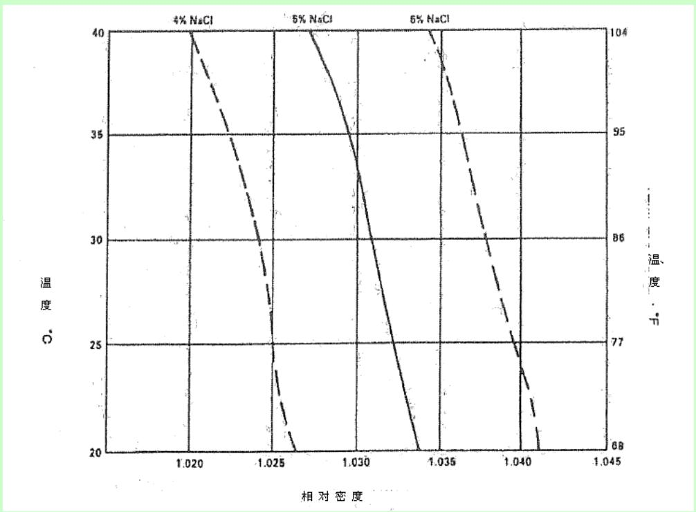  
图14-1：盐溶液随温度的相对密度变化

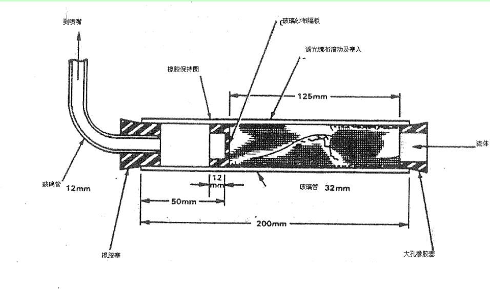

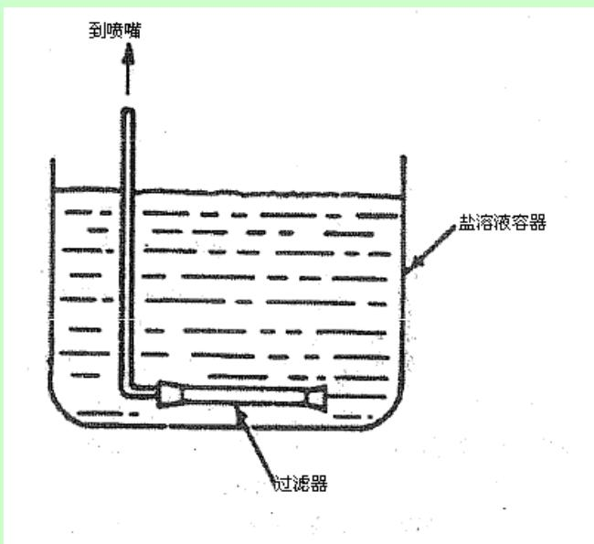  
图 14-2: 盐溶液过滤器的位置

# 第15部分 磁效应

# 15. 磁效应

# 15.1 试验目的

该试验确定了设备的磁影响（磁效应），主要目的是给指南针或者指南针传感器寻找或者提供允许其安装的最短距离。它还能保证该设备正常操作而不受干扰。该干扰会影响附近的设备，从而确定设备是否满足性能标准或帮助安装者在飞机上为设备选择合适的位置。

D 为距离，有  $1^{\circ}$  的偏差，设备类别标识说明如下：  
- Y 类:  $D = 0.0 \mathrm{~m}$  。在临近设备的地方立即测量时, 指南针的偏差  $\leqslant 1^{\circ}$ ; 此类别用于安装位置为, 从磁罗盘或者磁通量闸门开始 0.0 和  $0.3 \mathrm{~m}$  之间的设备;  
- 类别 Z:  $0 < \mathrm{D} \leqslant 0.3 \mathrm{~m}$  。在到设备距离为  $>0.0 \mathrm{~m}$  到  $\leqslant 0.3 \mathrm{~m}$  处测量时, 指南针的偏离等于  $1^{\circ}$  。此类别用于安装位置为  $\geqslant 0.3 \mathrm{~m}$  (到磁罗盘或者磁通量闸门) 的设备;  
- 类别 A:  $0.3 < D \leqslant 1 \mathrm{~m}$  。在到设备距离为  $>0.3 \mathrm{~m}$  到  $\leqslant 1.0 \mathrm{~m}$  处测量时, 指南针的偏离等于  $1^{\circ}$  。此类别用于安装位置为  $\geqslant 1 \mathrm{~m}$  (到磁罗盘或者磁通量闸门) 的设备;  
- 类别 B:  $1 \mathrm{~m} < \mathrm{D} \leqslant 3 \mathrm{~m}$  。在到设备距离为  $>1.0 \mathrm{~m}$  到  $\leqslant 3.0 \mathrm{~m}$  处测量时, 指南针的偏离等于  $1^{\circ}$  。此类别用于安装位置为  $\geqslant 3 \mathrm{~m}$  (到磁罗盘或者磁通量闸门) 的设备;  
• 类别 C: 到设备距离  $>3.0 \mathrm{~m}$  处测量时, 指南针的偏离等于  $1^{\circ}$  。此类别用于安装位置  $>3 \mathrm{~m}$  (到磁罗盘或者磁通量闸门) 的设备。在测试表中, 应该报告  $1^{\circ}$  偏离的距离; 设备的机上位置将据此确定。

# 15.2 试验说明

根据在均匀磁场中（如由地球产生的）自由磁体的等同偏离确定自由磁体（如无补偿罗盘等）放在强度  $14.4\mathrm{A / m}$  （即地球磁场强度  $\pm 10\%$  南北方向的均匀水平磁场中，通过该自由磁体相对于受试设备的偏转程度来确定设备的磁影响。此时，受试设备定在通过自由磁

体中心的东西线上。此测量通常是通过无补偿罗盘或者等同的磁传感器进行。

注 1: 如果自由磁体所处磁场的水平分量不超过规定的容限, 则在 15.3 条中用来确定设备类别的偏转角规定为 1 度  $(\mathrm{Dc} = 1)$  。  
注 2: 如果自由磁体所处的磁场的水平分量超过了规定的容限,则在 15.3 条中用来确定设备类别的偏转角由下式来调整:

$$
\mathrm {D c} = \frac {1 4 . 4 \mathrm {A} / \mathrm {m}}{\text {环 境 场 强 的 水 平 部 分}}
$$

其中，

Dc 用来确定设备类别的等效偏转角度值。

# 15.3 试验步骤

用第20章试验中所用的相同的电缆线为EUT供电。用于EUT的所有电缆线和延伸动力线在试验中放在同一束中。该束电缆在指南针中延东西轴线摆放。

1) 如果HCAFS (HCAFS = 地球产生的环境磁场强度的水平分量)在实验室位置而EUT未知, 则用磁表进行测量（以磁力计为例）。  
2）如果 HCAFS 在 15.2 章所描述的容限范围之内，那么根据 15.2 章“注 1”， $Dc = 1^{\circ}$ 。如果 HCAFS 不在 15.2 章所描述的容限范围之内，则通过将测量的 HCAFS 值代入“注 2”中的公式中即可调节磁偏角的值。  
3）将EUT电缆放在磁铁中心磁力线的东西方向上（根据图15-1）。  
4）使EUT工作，选择能产生最大磁偏转的稳定状态模式。

5）使EUT电缆线摆放在磁铁中心磁力线的东西方向，选择能产生最大磁偏转的EUT位置。  
(6) 减小 EUT 和磁铁之间的距离以获得 Dc。

如果该试验是通过将指南针移向 EUT 而不是将 EUT 移向指南针来完成，那么磁场均匀试验是必要的。该试验按如下完成：

从试验区移走 EUT，指南针的偏转不超过  $\pm 0.5^{\circ}$ ，并且指南针沿着规定的直线移向 EUT 位置。

7）测量和记录磁力中心与 EUT 最近部件之间的最小距离。获得 Dc。  
8）测得的距离用于“7”中Dc的偏移。从下表中选择种类：

设备种类 Dc偏移距离

Y  $\mathrm{D = 0.0m}$  
Z  $0 <   \mathrm{D}\leqslant 0.3\mathrm{m}$  
A  $0.3 <   \mathrm{D}\leqslant 1\mathrm{m}$  
B  $1\mathrm{m} <   \mathrm{D}\leqslant 3\mathrm{m}$  
C 大于  $3.0\mathrm{m}$

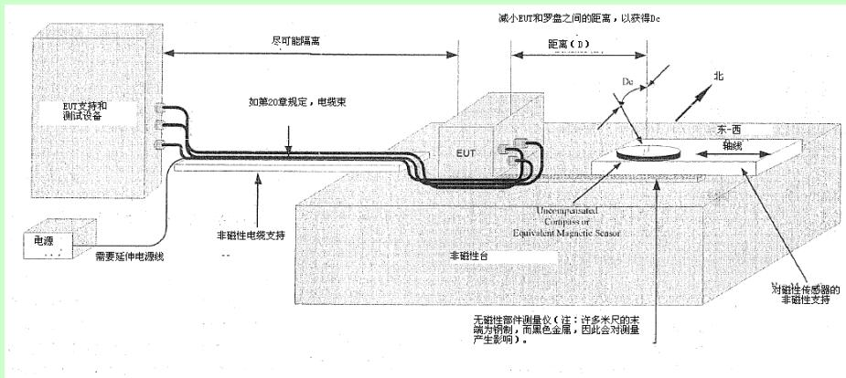  
图15-1：试验安装和试验过程

# 第16部分

电源输入

# 16. 电源输入

# 16.1 试验目的

此部分确定了施加在被测试设备输入端上的 AC 及 DC 电源的试验条件和步骤。它包括了下列电气电源：

A.  $14 \mathrm{~V} \mathrm{dc}$ ,  $28 \mathrm{~V} \mathrm{dc}$  和  $270 \mathrm{~V} \mathrm{dc}$ ;  
B. 在额定的  $400 \mathrm{~Hz}$  频率或包括  $400 \mathrm{~Hz}$  在内的可变频率范围内,  $115 \mathrm{V} \mathrm{rms} \quad \mathrm{ac}$  及  $230 \mathrm{V} \mathrm{rms} \quad \mathrm{ac}$  。

设备种类和频率类别、及使用其它电源的设备的试验条件和步骤必须在应用设备的性能标准中做出规定。

# 16.2 设备种类及测试标记

设备标记包括：

首先，参考类别：

- 对于 AC 设备：A(CF)、A(NF) 或 A(WF);

对于DC设备：A、B，D或Z

其次，对于所有 ac 设备，类别参考后面有一个附加的测试标记字母，用于表明设备是否需要经受下面试验：

- AC 谐波试验（字母 H）或无此实验（字母 X）；

- AC 电流调制试验（字母 L）或可替换试验（字母 Z）；  
- AC 功率因数试验（字母 P）或可替换试验（字母 Z）；  
- AC涌入试验（字母I）或可替换试验（字母Z）无此试验（字母X）。

其次，对于所有 dc 设备，所有 DC 设备类别后都有一个增加的字母，用于指示设备是否需要进行下面试验：

- DC 电流纹波试验（字母R）或无此试验（字母X）；  
- DC 电流涌入试验（字母 I）或可替换试验（字母 Z）或无此试验（字母 X）。

仅针对 AC 设备试验时（如字母 H），不在 DC 设备类别（如 A, B, D 或 Z）后标记；仅针对 DC 设备试验时（如字母 R），不在 AC 设备类别（如 A (CF), A (NF), 或 A (WF)）后标记。

如果产品接受 AC 和 DC 功率，则首先标记 AC 设备类别后面为所有 AC 试验标识，然后是 DC 设备类别，或类别，后跟所有的 DC 试验标识。

类别：A(CF)、A(NF)、A(WF)及 A:

打算在飞机电气系统中使用的设备，其主电源来自于恒频的或可变频的 AC 系统；其 DC 系统是通过整流变压器单元提供。这样的设备被确定为：

- AC 设备：A(CF)、A(NF) 或 A(WF)类；

- DC 设备: A 类。

A(CF)指的是预期用于飞机电气系统上的交流设备, 其主电源来自于恒频 AC 系统 (400Hz)。

注：A(CF)所指设备与以前的 DO-160/ED14 出版物中 A 类到 D 类设备所指的 AC 设备相同。

A(NF)指的是预期用于飞机电气系统中的交流设备，其主电源来自于可变窄频（360到  $650\mathrm{Hz}$ ）AC系统。

A（WF）指的是预期用于飞机电源系统的交流设备，其主电源来自于可变宽频（360-800Hz）交流系统。

A 指的是预定用于飞机电气系统的 28Vdc 设备, 其 dc 是由恒频的或可变频 ac 系统提供的主电源所产生的。A 类 dc 设备可能有一个在 dc 总线上浮置的电池。

B 类设备:

14V或28V DC设备预定用于由发动机驱动的交流发电机/整流器或直流发电机供电的飞机电气系统中，其直流汇流条上始终浮置一个有足够容量的蓄电池。

D类设备：

预定用于飞机电气系统的  $270 \mathrm{~V} \mathrm{dc}$  设备, 其 dc 是通过主电源产生 (恒频或 ac 系统), 此类设备规定为 D 类设备。

Z类设备：

28V DC 设备可使用在适用于这些标准的所有其它类型的飞机电

气系统中。Z 类设备可以代替 A 类或 B 类设备。此类的例子是由变速发电机供电的直流系统，其中：

a. DC 电源的 DC 汇流条上没有浮置的蓄电池, 或  
b. 控制或保护装置可使蓄电池从直流汇流条上断开，或  
c. 蓄电池容量比直流发电机容量要小。

交流电失真试验：H

此试验标记涉及到单独的最大功率损耗大于35VA的AC设备，或某些综合功率损耗大于150VA的多单元装置（相同的设备类型）。如果设备性能标准有要求，则对此类设备应执行16.7.1中的电流失真试验。

AC 电流调制控制试验：标识L

此试验标识涉及到此类 AC 设备，即从 EUT 得到的电流纹波（或电流调制）为可控制的。符合此试验标识的 AC 电源设备将标记标识 L。不符合此类试验要求的设备，仍然要进行试验（仅指报告级）并标记试验标识 Z（其它试验条件）。

AC 功率因数试验: 标识 P

此试验标识涉及到此类 AC 设备，即 EUT 得到的 AC 电源的功率因数是可控制的。符合此试验标识的 AC 电源设备将标记标识 P。不符合 P 类标识的要求的设备，仍然要进行试验（仅指报告级）并标记为 Z（其它试验条件）。

# DC 电流纹波试验：标识 R

此试验标识涉及到此类 DC 设备, 即其单独的最大功耗在 28V 时大于 400W , 270V 时大于 35W; 或者此类装置, 即多个单元的 (同意设备类型) 的综合功耗在 28V 时大于 400W , 270V 时大于 150W. 对于此类设备, 如果设备性能标准要求, 则应执行 16.7.7 部分的 DC 电流纹波试验。

# AC或DC电流涌入控制：标识I

此标识用于标记符合标识 I 电流涌入要求的 AC 或 DC 设备。对于此类设备, 如果设备性能标准要求, 则应执行 16.7.5 中的涌入电流试验。标准试验容限:

除非控制设备规范或者 DO-160 试验程序中另有规定，否则：

- 额定电压大于或等于  $100 \mathrm{~V} \mathrm{AC}$  或 DC 时, 所有输入功率电压应保持在高于试验电压  $+ / - 1.0 \%$  或者额定操作电压的  $+ / - 1.0 \%$  (即:  $115 \mathrm{~V}$  系统上的  $0 \mathrm{~V} \mathrm{ac}$  为  $0 \mathrm{~V} + / - 1.15 \mathrm{~V} \mathrm{ac})$ ;

- 额定电压低于  $100 \mathrm{~VAC}$  或 DC 时, 所有的输入功率电压应保持在高于试验电压  $+ / - 2.0 \%$  或者额定操作电压的  $+ / - 2.0 \%$  (即:  $28 \mathrm{~V} \mathrm{DC}$  系统上的  $0 \mathrm{~V} \mathrm{DC}$  为  $0 \mathrm{~V} + / - 0.56 \mathrm{~V} \mathrm{DC})$ ;

所有时间期限应保持在规定数量的  $+ / - 10\%$  范围内；  
- 在实际电压瞬变的  $10\%$  和  $90\%$  点范围内，所有升高和降低次数应小于  $1.5 \mathrm{msec}$ ;

- 所有频率应保持在规定值的  $+ / - 1.0\%$  范围内。

注：这些容限是为了给受试设备施加标准试验程序，而不是为了反映飞机电源的实际容限。

手动复位:

手动复位是使EUT所有电源从On到Off然后到On，以清除EUT所有故障状态或锁定EUT。除非适用地设备性能标准中另有规定，否则测试之后，在EUT内输入数据（如电源中断）不能算做“手工复位”。

# 16.3 应急电气系统工作

应急电气系统工作定义为在飞行期间当主电源系统不能提供足够的或正常的电源，因而要求使用一个电源输出能力有限的独立应急电源。

# 16.4 标准电源输入参数（交流电源）

某些电气参数可认为是标准的参数，即，它们的变化不会超出本节所要求的额定范围。所有试验均应在满足以下标准参数的情况下进行：

警告：所有的提及的电压值可用于115Vrms交流设备。给这些值乘以2就可以用于230rms交流设备。

a. 相序

三相电源的各相电压彼此相差  $120^{\circ}$ ; 它们分别被指定为  $\mathrm{A}, \mathrm{B}, \mathrm{C}$ ,

并按此顺序分别达到其峰值。

# b. 相移

指在三相波形上零电压点之间的相对移动。相移应在以下极限内：

-A（CF）及A(NF)类设备： $120 \pm 4^{\circ}$ ；

-A(WF)类设备： $120 \pm 6^{\circ}$

# c. 相电压不平衡

# C1. A（CF）及A(NF)类设备

在正常电气系统工作时，对所有飞机工作状态，最高相电压和最低相电压之间的相电压的最大分布不超过6V有效值。当电源为应急电源系统时，此分布不超过8V有效值。

# C2. A(WF)类设备

在正常电气系统工作时，对所有飞机工作状态，最高相电压和最低相电压之间的相电压的最大分布不超过8V有效值。当电源为应急电源系统时，此分布不超过10V有效值。

# d. 电压波形峰值系数及谐波含量

电压波形应具有  $1.41 \pm 0.15$  的峰值系数, 谐波含量见下表:

<table><tr><td>设备分类</td><td>最大电压总谐波偏差*</td><td>最大电压单个谐波含量*</td></tr><tr><td>A(CF)及 A(NF)</td><td>8%</td><td>6%</td></tr><tr><td>A(WF)</td><td>10%</td><td>8%</td></tr></table>

(★) 表示相关说明，见 16.5.1.8.1 节。

e. 电压波形直流电含量

对于正常的电气系统工作, 电压波形直流电含量应在以下范围内:  $0 \pm 0.20 \mathrm{~V} \mathrm{DC}$  。

f. 要求

符合本节后面的要求就表明符合标准条件下的要求。

# 16.5 电源输入参数极限（交流电）

下面内容从数量上对可变电源输入参数及适用的相关的试验条件进行了规定，并将之分为正常和非正常电气系统工作。

A(WF)的测试可使用 A(WF), A(NF), A(CF)输入功率;

A(NF)的测试可使用 A(NF),A(CF)输入功率;

A(CF) 的测试可使用 A(CF)输入功率;

注 1: 所用电源应能提供 EUT 要求的最大电流;

注 2: 当飞机的同一总线提供多个电源输入时, 应同时对这些输入的所有连接进行测试。

# 16.5.1 正常工作条件（交流电）

下面所列工作条件和试验适用于A（CF)，A(NF)及A(WF)类设备。警告：所有提及的电压值均适用于115Vrms交流设备。此值乘以2可适用于230Vrms交流设备。

# 16.5.1.1 电压和频率（交流电）

a. 定义:

<table><tr><td rowspan="5">最 大</td><td colspan="2">设备分类</td><td>A(CF)</td><td>A(NF)</td><td>A(WF)</td></tr><tr><td rowspan="2">电压（Vrms）</td><td>最高相位</td><td>122</td><td>122</td><td>122</td></tr><tr><td>三相平均值</td><td>120.5</td><td>120.5</td><td>120.5</td></tr><tr><td rowspan="2">频率（Hz）</td><td>正常</td><td>410</td><td>650</td><td>800</td></tr><tr><td>紧急</td><td>440</td><td>650</td><td>800</td></tr><tr><td rowspan="4">最 小</td><td rowspan="2">电压（Vrms）</td><td>最低相位</td><td>100</td><td>100</td><td>100</td></tr><tr><td>三相平均值</td><td>101.5</td><td>101.5</td><td>101.5</td></tr><tr><td rowspan="2">频率（Hz）</td><td>正常</td><td>390</td><td>360</td><td>360</td></tr><tr><td>紧急</td><td>360</td><td>360</td><td>360</td></tr></table>

注：

1. 上面所提及的电压值为设备终端电压值；  
2. 对交流网：

一额定电压为115Vrms  
一额定频率为  $400 \mathrm{~Hz}$  (仅指 A(CF)类)

b. 对单相设备的要求

（1）在每个试验中，使设备在最大工作周期循环下工作至少30分钟。在每个30分钟试验期间，确定是否符合有关设备性能标准。对于A(CF)类设备，应在紧急频率级下进行测试，以满足正常和紧急工作条件。

设备终端上施加的频率和电压：  

<table><tr><td>试验</td><td>电压（Vrms）</td><td colspan="3">频率（Hz）</td></tr><tr><td></td><td></td><td>A(CF)</td><td>A(NF)</td><td>A(WF)</td></tr><tr><td>1</td><td>122</td><td>410</td><td>650</td><td>800</td></tr><tr><td>2</td><td>100</td><td>410</td><td>650</td><td>800</td></tr><tr><td>3</td><td>122</td><td>390</td><td>360</td><td>360</td></tr><tr><td>4</td><td>100</td><td>390</td><td>360</td><td>360</td></tr></table>

(2) 对于要在紧急电气系统条件下工作的 A(CF)类设备，在每个试验中，使设备在最大工作周期循环下工作至少 30 分钟。在此次试验期间，确定是否符合有关设备性能标准。

要在 A(CF)类设备终端上施加的频率和电压:  

<table><tr><td>试验</td><td>电压（Vrms）</td><td>频率（Hz）</td></tr><tr><td>1</td><td>122</td><td>440</td></tr><tr><td>2</td><td>100</td><td>440</td></tr><tr><td>3</td><td>122</td><td>360</td></tr><tr><td>4</td><td>100</td><td>360</td></tr></table>

# c. 对三相设备的要求

# c.1 A(CF)和A(NF)类三相设备的要求

（1）首先调节主电源，使之相平衡，然后是相不平衡，在每个试验中，使设备在最大工作周期循环下工作至少30分钟。在此试验期间，确定是否符合有关设备性能标准。对于A(CF)类设备，要在紧急电压和频率级下进行试验，以满足正常和紧急工作条件。对于A(NF)类设备，应按下表中1-4要求进行试验。对于A(NF)，应在5-8的紧急电压和频率下进行，以满足5-8正常工作条件和紧急工作条件。

要在设备终端上施加的频率和电压：  

<table><tr><td>试验</td><td colspan="3">相位 A/B/C 电压（Vrms）</td><td colspan="2">频率（Hz）</td></tr><tr><td></td><td>相A</td><td>相B</td><td>相C</td><td>A(CF)</td><td>A(NF)</td></tr><tr><td>1</td><td>120.5</td><td>120.5</td><td>120.5</td><td>410</td><td>650</td></tr><tr><td>2</td><td>101.5</td><td>101.5</td><td>101.5</td><td>410</td><td>650</td></tr><tr><td>3</td><td>120.5</td><td>120.5</td><td>120.5</td><td>390</td><td>360</td></tr><tr><td>4</td><td>101.5</td><td>101.5</td><td>101.5</td><td>390</td><td>360</td></tr><tr><td>5</td><td>122</td><td>122</td><td>116</td><td>410</td><td>650</td></tr><tr><td>6</td><td>100</td><td>100</td><td>106</td><td>410</td><td>650</td></tr><tr><td>7</td><td>122</td><td>122</td><td>116</td><td>390</td><td>360</td></tr><tr><td>8</td><td>100</td><td>100</td><td>106</td><td>390</td><td>360</td></tr></table>

（2）对于要在紧急电气系统条件下工作的设备，首先调节主电源，使之相平衡，然后是相不平衡，在每个试验中，使设备在最大工作周期循环下工作至少30分钟。在此试验期间，确定是否符合有关设备性能标准。

要在设备输入端上施加的频率和电压：  

<table><tr><td>试验</td><td colspan="3">相位 A/B/C 电压（Vrms）</td><td colspan="2">频率（Hz）</td></tr><tr><td></td><td>相A</td><td>相B</td><td>相C</td><td>A(CF)</td><td>A(NF)</td></tr><tr><td>1</td><td>120.5</td><td>120.5</td><td>120.5</td><td>440</td><td>N/A</td></tr><tr><td>2</td><td>101.5</td><td>101.5</td><td>101.5</td><td>440</td><td>N/A</td></tr><tr><td>3</td><td>120.5</td><td>120.5</td><td>120.5</td><td>360</td><td>N/A</td></tr><tr><td>4</td><td>101.5</td><td>101.5</td><td>101.5</td><td>360</td><td>N/A</td></tr><tr><td>5</td><td>122</td><td>122</td><td>114</td><td>440</td><td>650</td></tr><tr><td>6</td><td>100</td><td>100</td><td>108</td><td>440</td><td>650</td></tr><tr><td>7</td><td>122</td><td>122</td><td>114</td><td>360</td><td>360</td></tr><tr><td>8</td><td>100</td><td>100</td><td>108</td><td>360</td><td>360</td></tr></table>

# c.2 对 A(WF)类三相设备的要求

（1）首先调节主电源，使之相平衡，然后是相不平衡，在每个试验中，使设备在最大工作周期循环下工作至少30分钟。在此试验期间，确定是否符合有关设备性能标准。

要在设备终端上施加的频率和电压：  

<table><tr><td>试验</td><td colspan="3">相位 A/B/C 电压（Vrms）</td><td>频率（Hz）</td></tr><tr><td></td><td>相A</td><td>相B</td><td>相C</td><td></td></tr><tr><td>1</td><td>120.5</td><td>120.5</td><td>120.5</td><td>800</td></tr><tr><td>2</td><td>101.5</td><td>101.5</td><td>101.5</td><td>800</td></tr><tr><td>3</td><td>120.5</td><td>120.5</td><td>120.5</td><td>360</td></tr><tr><td>4</td><td>101.5</td><td>101.5</td><td>101.5</td><td>360</td></tr><tr><td>5</td><td>122</td><td>122</td><td>114</td><td>800</td></tr><tr><td>6</td><td>100</td><td>100</td><td>108</td><td>800</td></tr><tr><td>7</td><td>122</td><td>122</td><td>114</td><td>360</td></tr><tr><td>8</td><td>100</td><td>100</td><td>108</td><td>360</td></tr></table>

（2）对要在紧急电气系统下工作的设备，使主电源相调节为不平衡，在每个试验中，使设备在最大工作周期循环下工作至少30分钟。在此试验期间，确定是否符合有关设备性能标准。

要在设备终端上施加的频率和电压：  

<table><tr><td>试验</td><td colspan="3">相位 A/B/C 电压（Vrms）</td><td>频率（Hz）</td></tr><tr><td></td><td>相A</td><td>相B</td><td>相C</td><td></td></tr><tr><td>1</td><td>122</td><td>122</td><td>122</td><td>800</td></tr><tr><td>2</td><td>100</td><td>100</td><td>110</td><td>800</td></tr><tr><td>3</td><td>122</td><td>122</td><td>122</td><td>360</td></tr><tr><td>4</td><td>100</td><td>100</td><td>110</td><td>360</td></tr></table>

# 16.5.1.2 电压调制（交流）

a..定义

电压调制是循环变化，或随机变化或兼而有之。对于设备稳定工作期间经受的 ac 峰值电压平均级，是由电压有序变化和快速变化引起交流电压的尖峰导致的。对于 115VAC 系统，电压调制最大应为达到调制包络线上最大电压和最小电压之间的 5.0V 峰谷差值，或者高于设备规范中规定的值。

对于  $230 \mathrm{~VAC}$  系统，电压调制为  $115 \mathrm{~VAC}$  系统的两倍。

115V AC 电压调制包络线波形的频率含量不超过图 16-1 所规定的极限。

b. 要求

当设备经受了这一条件后，它应在有关设备性能标准范围内工作。任何试验要求都将在各个设备性能标准中做出规定。此设备应在以下频率中执行：

A(CF)类设备，400Hz；

可变频设备,  $360 \mathrm{~Hz}$ ; A(NF)类设备, 重复  $650 \mathrm{~Hz}$ ; A(WF)类设备,  $800 \mathrm{~Hz}$  。

在进行电压调制调节与图16-1中所列的最小试验级匹配之后，在每一个频步最少驻留120秒，或者以设备性能所指示的时间驻留。在每个拐点，频步大小最小应为以4为对数的空间。

$$
\mathrm {f} _ {\mathrm {n} + 1} = \mathrm {f n} ^ {*} 1 0 ^ {\wedge (1 / 4)}
$$

其中

fn 为测试频率，  $n = 1$  到4;

f1 为起始频率，并且；  
f4 为每一个 10 的终止频率

# 16.5.1.3 频率调制（ac）

# a. 定义

频率调制是指在稳态电气系统工作期间，瞬时频率围绕平均频率的周期性的或随机性的变化或二者兼有。频率调制通常在较窄的频率范围内，由发电机耦合和传动速度调节中速度变化所引起。频率调制引起主系统频率的变化应在图 16-2 所确定的平均频率周围的一个频段内。

# b. 要求

当设备经受了这一条件后，它应在有关设备性能标准范围内工作。此设备应在以下频率中执行：

A(CF)类设备，400Hz；

可变频设备,  $360 \mathrm{~Hz} ; \mathrm{A}(\mathrm{NF})$  类设备, 重复  $650 \mathrm{~Hz} ; \mathrm{A}(\mathrm{WF})$  类设备,  $800 \mathrm{~Hz}$  。

在进行频率宽度调节在每个重复速率试验点与图 16-2 所列的最小试验级匹配之后，驻留 5 个重复速率周期，30 秒或者按设备规

范指示时间驻留。

试验点的最小设置应按照图 16-2 执行。

如果频率偏离使用离散频率而不是正弦或者三角形频率偏离，重复速率驻留时间应与  $+ / - 10\%$  范围内的期限等同，并且最大偏离频步大小应小于或者等于  $2.0\mathrm{Hz}$  。峰值-峰值AC频率调制小于或者等于  $2.0\mathrm{Hz}$  时，方形波频率偏离是可接受波形。

# 16.5.1.4 瞬时电源中断

a. 定义:

电源转换可引起长达  $200 \mathrm{~ms}$  的电源中断。

对于有多个电源的设备, 参考相关性能应用标准中在任何给定功率输入进行 “电源中断试验” 期间, 功率输入保留的说明。

b. 对所有 AC 设备的要求：

对瞬时电源切断敏感的设备会导致性能偏差。此瞬时电源中断可以是瞬态 V 也和瞬态 T 的函数，其中  $\mathrm{V}_{\mathrm{t}}$  可以是稳态电压和零电压之间的任何值， $\mathrm{T}_{1}$  可以是 0 到 200ms 之间的任何值。由于这样的组合有许多种，因此本试验选择那些认为可有效确定设备性能的不相连续的值。

# 试验程序：

设备应满负荷工作。

按每一试验条件进行试验前，给设备提供额定的电压。

相关频率:

A(CF)类设备：按每一试验条件进行试验前，给设备施加额定的频率。

A(NF) 和 A(WF)类设备:

首先，在  $360 \mathrm{~Hz} + 5 / - 0 \mathrm{~Hz}$  条件下进行所有试验；

然后，按下面条件再进行所有的试验：

-A(NF)类设备： $650 \mathrm{~Hz} + 0 / -5 \mathrm{~Hz}$ ;

-A(WF)类设备:  $800 \mathrm{~Hz} + 0 / -5 \mathrm{~Hz}$ .

按每一试验条件进行试验前，无论是手动还是自动加载，应输入可以输入的数据，并且有关的显示器均应正常工作。

对于设备的每个典型操作模式，或如适用的性能标准中所规定的，按表16-1将每个试验条件至少施加2次。如果最大和最小稳态电流之间的差别小于最大稳态电流的  $25\%$  ，则仅需要对最大稳态电流操作模式进行测试。

对设备的每一种工作方式，应将表16-1中的每一试验条件至少施加两次。如果最大和最小稳态电流之间的差别小于最大稳态电流的 $25\%$ ，则只需要对最大稳态电流工作模式进行测试。

系统完全稳定后，施加第二个后继试验。在每一试验过程中或之后，均应对设备的性能进行监测（包括要同时正常工作的任何设备）。除非单个的设备规范中另有规定，否则不允许进行人工复位。

在所有试验条件下暴露之后，仅针对 A(CF)设备，确定设备是否

符合有关设备性能标准。对于 A(NF)和 A(CF)类设备,暴露于 16.4.1.4b 和 16.4.1.4c 条件之后, 确定是否符合设备性能标准。

注：试验期间对设备性能的任何要求应在设备性能标准中做出规定。

c. 增加的要求（仅针对 A(NF)和 A(WF)类设备）

设备应完全工作。

按每一试验条件进行试验之前，施加额定电压。

对设备的每一典型工作模式，或如适用的性能标准中所规定的，至少施加表16-2中规定的每一试验条件两次。如果最大和最小稳态电流之间的差别小于  $25\%$  ，则只需要对最大稳态电流操作模式进行试验。

系统完全稳定后，施加连续的试验。在每一试验期间或之后，对设备的性能进行监测（包括要同时正常工作的任何设备）。

试验完全之后，确定是否符合有关设备性能标准。除非单独的设备规范中另有规定，否则不允许进行手动复位。

注：试验期间对设备性能的任何要求应在设备性能标准中做出规定。

# 16.5.1.5 正常瞬变（AC）

# 16.5.1.5.1 正常浪涌电压

a. 定义：正常浪涌是指由于供电系统的固有调节所引起的受控稳态电平的变化。这个固有调节是由于诸如负载转换、调节器校

正动作等系统正常工作造成的扰动而产生的。

# b. 要求

(1) 使设备在  $115 \mathrm{~V}$  有效值的情况下工作 5 分钟。然后按以下要求循环电压三次:

将电压增加到:

-A(CF)和 A(NF)类设备:  $160 - 0 / +6 \mathrm{~V}$  有效值,  $30 \mathrm{~ms}$ .

-A(WF)类设备： $170 - 0 / + 7 \mathrm{~V}$  有效值， $30 \mathrm{~ms}$ 。

将电压返回到  $115 \mathrm{~V} \mathrm{rms} + / - 5 \mathrm{~V}$  有效值，保持 5 秒。

将电压降到  $70 \mathrm{~V} \mathrm{rms} - 3 / + 0$ , 保持  $30 \mathrm{~ms}$  。

将电压返回到  $115 \mathrm{~V} \mathrm{rms} + / - 5 \mathrm{~V}$  有效值, 保持 5 秒。

不管要求的浪涌电压如何，在EUT输入端测量时应得到要求的浪涌电压。

(2) 电源频率如下:

-A(CF)类设备:  $400 \mathrm{~Hz} \pm 5 \mathrm{~Hz}$ ;

- A(NF)类设备： 首先在  $360 + 5 / - 0\mathrm{Hz}$  情况下进行试验；

然后返回到  $650 + 0 / - 5 \mathrm{~Hz}$  情况下进行试验.

-A(WF)类设备： 首先在  $360 + 5 / - 0\mathrm{Hz}$  情况下进行试验；

然后返回到  $800 + 0 / -5 \mathrm{~Hz}$  情况下进行试验.

应按照类似于图 16-3 的方式施加和监控电压浪涌。

(3) 在正常电压浪涌期间，确定是否符合有关设备性能标准。  
注：除非在设备性能标准中如此规定，否则浪涌期间允许设备性能降低，且当恢复到正常电压和频率时设备必须满足规定性能。  
(4) 在施加电压浪涌之后, 确定是否符合有关设备性能标准。

注：如果设备性能标准要求在 16.5.2.3.1 节的非正常浪涌电压试验和 16.5.2.2 节的非正常瞬态欠压试验期间满足性能，则不必进行上述试验。

# 16.5.1.5.2 正常频率瞬变（所有AC设备）

a. 定义: 正常瞬变来源于受控稳态电平的变化, 此变化由电源供电系统的固有调节引起, 而固有调节则是由正常系统工作, 如发动机速度变化和调节器的校正动作所引起的扰动产生的。此试验在可变频设备上进行以保障与恒频设备的兼容性。

# b. 要求：

(1) 使设备终端为  $115 \mathrm{~V} \mathrm{rms}$ , 频率为  $400 \mathrm{~Hz}$  的情况下, 工作 5 分钟。然后按以下要求循环频率三次:

- 将频率增加到  $440 \mathrm{~Hz} \pm 5 \mathrm{~Hz}$ , 保持  $150 \mathrm{~ms}$ ;  
- 然后降低频率到  $420 \mathrm{~Hz} \pm 5 \mathrm{~Hz}$ , 保持 1.5 秒;  
- 将频率返回到  $400 \mathrm{~Hz} \pm 5 \mathrm{~Hz}$ , 保持 5 秒。  
- 降低频率到  $350 \mathrm{~Hz} \pm 5 \mathrm{~Hz}$ , 保持  $150 \mathrm{~ms}$ ;  
- 然后增加频率到  $380 \mathrm{~Hz} \pm 5 \mathrm{~Hz}$ , 保持 1.5 秒。

- 将频率返回到  $400 \mathrm{~Hz} \pm 5 \mathrm{~Hz}$ , 保持 5 秒。

频率测试点之间的瞬变发生应小于  $1 \mathrm{~ms}$  。

(2) 在正常的频率瞬变期间，确定设备是否符合性能标准。

注：除非在设备性能标准中另有规定，否则瞬变期间设备可以降低性能；但当恢复到额定电压和频率时必须满足规定的性能要求。

(3) 频率瞬变应用之后, 确定设备是否符合性能标准。

注：如果设备性能标准要求性能必须在 16.5.2.3.2 中的非正常频率瞬变试验期间满足，则不需要进行上述试验。

# 16.5.1.6 正常频率变化（仅适用于A(NF)和A(WF)类设备）

a. 定义:

除非设备应用性能标准中另有规定，否则在飞机起飞和发动机中断顺序期间，由于发动机速度的快速变化，在正常工作条件下会发生最大  $200\mathrm{Hz}$  /秒的频率变化。

b. 要求

(1) 使设备在  $115 \mathrm{~V} \mathrm{rms}$ , 频率为  $360 \mathrm{~Hz} + 5 / - 0 \mathrm{~Hz}$  的情况下工作 5 分钟。

然后,按以下要求循环频率三次:

频率增加到:

-A(NF)类设备： $650\mathrm{Hz} + 0 / -5\mathrm{Hz}$ ;

-A(WF)类设备:  $800 \mathrm{~Hz} + 0 / -5 \mathrm{~Hz}$

使恒频变化速率在  $100 \mathrm{~Hz}$  /秒，然后在频率变化速率为  $200 \mathrm{~Hz}$  /秒的条件下，使频率返回到  $360 \mathrm{~Hz} + 5 / - 0 \mathrm{~Hz}$ ，并在  $360 \mathrm{~Hz} + 5 / - 0 \mathrm{~Hz}$  条件下保持此频率 5 秒钟。

（2）在正常频率变化期间，确定设备是否满足性能标准要求。

注：除非设备应用性能标准中另有规定，否则在正常频率变化期间，设备性能不应降低。

# 16.5.1.7 DC电压含量（AC）

a. 定义: 在正常稳态电气系统工作期间, 会遇到的最大  $\pm 0.20$ 伏的 DC 电压含量。此 DC 电压与  $115 \mathrm{~V}$  和  $230 \mathrm{~V} \mathrm{AC}$  系统相同。  
b. 要求: 使设备在  $115 \mathrm{~V}$  有效值, 频率为下面 “注” 中所规定值的情况下, 在最大工作周期内工作。给每个主输入导线上施加  $-0.200 + 0 / -0.040 \mathrm{~Vdc}$  电压偏移。

设备应在此条件下至少工作30分钟。

在此30分钟期间确定设备是否满足性能标准。

如果此设备为三相，则对每个相进行单独的试验然后同时对所有的相进行测试。

用  $+0.200 + 0.040 / - 0\mathrm{VDC}$  的 DC 电压偏移，重复此操作。

对于单相设备，DC电压偏移可以如图16-9一样产生；对三相设备，如图16-10。

注：这些试验应按以下频率执行：

- A (CF) 类设备,  $400 \mathrm{~Hz}$ ;

- 对于可变频设备， $360\mathrm{~Hz}$ ；然后，对于A(NF)类设备，重复  $650\mathrm{~Hz}$ ；对于A(WF)类设备，重复  $800\mathrm{~Hz}$ 。

# 16.5.1.8 电压失真（交流）

在正常条件下（详细定义参见16.5.1.8.1），从非线性AC负载中得到的电流会导致AD电压波形的失真。在此失真下，所有的AC设备预期能正确工作。

# 16.5.1.8.1 定义

# 16.5.1.8.1.1 总的谐波偏差

AC 波形的总谐波偏差是谐波有效值与基波有效值之比。确定总谐波失真的公式如下。变量 X 代表电压或电流，以有效值或峰值表示。

$$
\mathrm {T H D} _ {\mathrm {X}} = 1 0 0. \frac {\sqrt [ 2 ]{\sum_ {n = 2} ^ {\infty} X _ {n} ^ {2}}}{X _ {1}}
$$

其中：X1 = 电流或电压的基值

$\mathrm{Xn} =$  电流或电压  $\mathfrak{n}^{\mathrm{th}}$  谐波值。

注：  $\mathbf{n}^{\mathrm{th}}$  谐波（Fn）的频率是基波频率F1:Fn=n.F1的整数倍数。

# 16.5.1.8.1.2 单个的谐波含量

如果适用，单个谐波含量是给定谐波频率下的电压或电流，用基波百分比表示。确定单个谐波含量（IHCn）的公式如下。

变量 X 表示的是电压或电流，以有效值或峰值表示。分数表示  $\mathrm{n}^{\text{th}}$  谐波的失真数量。

$$
\mathrm {I H C} _ {\mathrm {n}} = 1 0 0 \cdot \frac {\mathrm {X} _ {\mathrm {n}}}{\mathrm {X} _ {1}}
$$

其中：X1=电流或电压的基波值；

$\mathrm{Xn} =$  电流或电压的  $\mathrm{n}$  次谐波值。

# 16.5.1.8.2 要求

当终端上电压为最小值（按照16.5.1.1a要求），频率为下面规定值的条件下，使设备在最大工作周期内工作。经过如图16-8所示的全波形整流桥会产生电压失真。改变整流器上的负载，并在线路上插入源阻抗可以控制电压失真程度。另外，修改供给电压也可以使EUT的输入电压失真。设备应在这些条件下工作至少30分钟。

在此30分钟试验期间内，确定设备是否符合性能标准要求。

此试验应在下面频率下进行:

- A (CF) 类设备,  $400 \mathrm{~Hz}$ ;  
- 可变频设备,  $360 \mathrm{~Hz}$ ; 然后, 对于 A (NF) 类设备, 重复 650

Hz；对于 A (WF) 类设备，重复  $800 \mathrm{~Hz}$ .

此试验应在下面所列电压总失真水平（ $\mathrm{THD}_{\mathrm{v}}$ ）下进行：

A(CF)和 A(NF)类设备，为  $8\% + 2 / -0\%$ ;  
- 对于 A(WF)类设备，为  $10\% + 2 / -0\%$  。

# 16.5.2 非正常工作条件（AC）

下面条件及试验适用于所有 AC 类设备。

警告：所有提及的电压值均适用于115V有效值的AC类设备，乘以2即适用于230V有效值的AC类设备。

# 16.5.2.1 稳态电压中的非正常电压和频率极限（AC）

a. 定义:

<table><tr><td rowspan="4">最 大</td><td colspan="2">设备分类</td><td>A(CF)</td><td>A(NF)</td><td>A(WF)</td></tr><tr><td rowspan="2">电压（Vrms）</td><td>最高相位</td><td>134</td><td>134</td><td>134</td></tr><tr><td>三相平均值</td><td>132.5</td><td>132.5</td><td>132.5</td></tr><tr><td>频率（Hz）</td><td></td><td>430</td><td>N/A</td><td>N/A</td></tr><tr><td rowspan="3">最 小</td><td rowspan="2">电压（Vrms）</td><td>最低相位</td><td>97</td><td>97</td><td>97</td></tr><tr><td>三相平均值</td><td>98.5</td><td>98.5</td><td>98.5</td></tr><tr><td>频率（Hz）</td><td></td><td>370</td><td>N/A</td><td>N/A</td></tr></table>

注：（1）上面所提电压值为设备输入端上的值。

下面电源频率适应于以下 b 和 c 节的要求:

-A(CF)类设备：400Hz；

一A(NF)类设备：首先以  $360 \mathrm{~Hz}$  进行试验，然后以  $650 \mathrm{~Hz}$  进行试验；

-A(WF)类设备：首先以  $360 \mathrm{~Hz}$  进行试验，然后以  $800 \mathrm{~Hz}$  进行试验。

(2) 在非正常电压和/或非正常频率（参见下面 b 和 e）施加期间，对设备性能的任何要求均应在设备性能标准中予以规定。

# b. 对单相设备的要求

按下表调节当设备电压时，对每个试验，使设备在最大工作周期下至少工作5分钟。在每一试验结束时，并且当设备仍然有电压

时，将此电压调节到  $115 \mathrm{~V}$  有效值，然后确定设备是否满足性能标准要求。

<table><tr><td>试验</td><td>电压（有效值）</td></tr><tr><td>1</td><td>134</td></tr><tr><td>2</td><td>97</td></tr></table>

# c. 对三相设备的要求

首先将主电源调节到相平衡，然后调节到相不平衡时，对每个试验，使设备在最大工作周期内工作至少5分钟。在每一试验结束时，并且当设备仍然有电压时，将平均电压调节到115V有效值，然后确定设备是否满足性能标准要求。

在设备输入端施加电压：  

<table><tr><td>试验</td><td>设备类别</td><td colspan="3">相A/B/C上的电压(有效值)</td></tr><tr><td></td><td></td><td>相A</td><td>相B</td><td>相C</td></tr><tr><td>1</td><td>所有</td><td>132.5</td><td>132.5</td><td>132.5</td></tr><tr><td>2</td><td>所有</td><td>98.5</td><td>98.5</td><td>98.5</td></tr><tr><td>3</td><td>A(CF)和 A(NF)</td><td>134</td><td>134</td><td>128</td></tr><tr><td>3</td><td>A(WF)</td><td>134</td><td>134</td><td>126</td></tr><tr><td>4</td><td>A(CF)和 A(NF)</td><td>97</td><td>97</td><td>103</td></tr><tr><td>4</td><td>A(WF)</td><td>97</td><td>97</td><td>105</td></tr></table>

# d. 对单相设备（仅适用于 A(CF)类设备）的附加要求

在每一试验条件下，使设备在最大工作周期内至少工作5分钟。在5分钟试验期限内，确定设备是否满足性能标准要求。

要在设备输入端上施加的电压和频率：  

<table><tr><td>试验</td><td>电压（有效值）</td><td>频率（Hz）</td></tr><tr><td>1</td><td>122</td><td>430</td></tr><tr><td>2</td><td>100</td><td>430</td></tr><tr><td>3</td><td>122</td><td>370</td></tr><tr><td>4</td><td>100</td><td>370</td></tr></table>

# e. 对三相设备的附加要求（仅适用于A(CF)类设备）

使主电源首先调节到相平衡，然后调节到相不平衡时，在每一

试验条件下，使设备在最大工作周期内工作至少5分钟。在5分钟试验期限内，确定设备是否满足性能标准要求。

设备输入端上施加的电压和频率：  

<table><tr><td>试验</td><td colspan="3">相A/B/C上的电压(有效值)</td><td>频率(Hz)</td></tr><tr><td></td><td>相A</td><td>相B</td><td>相C</td><td></td></tr><tr><td>1</td><td>120.5</td><td>120.5</td><td>120.5</td><td>430</td></tr><tr><td>2</td><td>101.5</td><td>101.5</td><td>101.5</td><td>430</td></tr><tr><td>3</td><td>120.5</td><td>120.5</td><td>120.5</td><td>370</td></tr><tr><td>4</td><td>101.5</td><td>101.5</td><td>101.5</td><td>370</td></tr><tr><td>5</td><td>122</td><td>122</td><td>116</td><td>430</td></tr><tr><td>6</td><td>100</td><td>100</td><td>106</td><td>430</td></tr><tr><td>7</td><td>122</td><td>122</td><td>116</td><td>370</td></tr><tr><td>8</td><td>100</td><td>100</td><td>106</td><td>370</td></tr></table>

# 16.5.2.2 瞬时欠压工作（AC）

# a. 定义

可以在 0-97 有效值范围内产生的瞬时电压，持续时间达 7s。

# b. 要求

设备在此此条件下暴露后返回到其正常工作电压范围内事，应能在设备应用性能标准范围内工作。

使设备终端电压为  $115\mathrm{V}$  有效值，频率为下面注中所规定的值下工作，将AC输入电压降低到60V有效值，或按照设备规范中的其它规定进行，持续时间7秒。使设备仍然通电，调节AC电压输入到115V有效值，并确定设备是否满足性能标准。

用  $10 \mathrm{~V}$  有效值而不是  $60 \mathrm{~V}$  有效值进行重复工作。

注：这些试验应在以下频率范围内进行：

A(CF)类设备：400Hz；

- 可变频设备:  $360 \mathrm{~Hz}$ , 然后以  $650 \mathrm{~Hz}$  重复用于 A (NF) 设备,  $800 \mathrm{~Hz}$

重复用于A（WF）设备。

# 16.5.2.3 非正常瞬变（AC）

# 16.5.2.3.1 非正常浪涌电压

# a. 定义

非正常浪涌是指由电源供电系统的固有调节和调节器的校正动作一例如在故障清理期间一引起的受控稳态值的变化。非正常AC浪涌电压特性应在图16-5规定的范围内。

# b. 要求

使设备在终端电压为  $115 \mathrm{~V} \mathrm{rms}$ , 频率为下面注中所规定的条件下工作, 在每一个主输入导线上施加  $180 \mathrm{~V}$  的有效值的电压浪涌, 持续时间  $100 \mathrm{~ms}$ , 然后将电压降低到  $148 \mathrm{~V}$  有效值, 1 秒。在第一和第二个电压浪涌之间, 电压不能返回到额定值。应以与图 16-3 相类似的方式施加并监测电压浪涌。

不管要求的浪涌电流如何，都应获得要求的浪涌电压（如EUT输入终端上测量的）。

以10s的间隔施加每一浪涌三次。施加电压浪涌之后，确定是否符合有关设备性能标准。

对于三相设备，按照下表，在测试之间，以10秒间隔施加浪涌。

<table><tr><td>测试</td><td colspan="3">相A/B/C浪涌型式</td></tr><tr><td></td><td>相A</td><td>相B</td><td>相C</td></tr><tr><td>1</td><td>浪涌</td><td>无浪涌</td><td>无浪涌</td></tr><tr><td>2</td><td>无浪涌</td><td>浪涌</td><td>无浪涌</td></tr><tr><td>3</td><td>无浪涌</td><td>无浪涌</td><td>浪涌</td></tr><tr><td>4</td><td>浪涌</td><td>浪涌</td><td>浪涌</td></tr></table>

在每次试验期间或之后，监测设备性能。

电压浪涌应用之后，确定符合设备性能应用标准。

注：这些试验应以下面的频率进行：

A(CF)类设备：400Hz；  
- 可变频设备： $360\mathrm{~Hz}$ ，然后以  $650\mathrm{~Hz}$  重复用于 A(NF)设备， $800\mathrm{~Hz}$  重复用于 A（WF）设备。

# 16.5.2.3.2非正常频率瞬变（AC）

# a. 定义

非正常频率瞬变是指为响应故障状态，例如发动机速度异常变化，由电源供电系统的固有调节和调节器的校正动作引起的受控稳态值的变化。测试1和2是在可变频上进行的，以确保与恒频设备的兼容性。

# b. 要求

使设备在  $115 \mathrm{~V}$  电压有效值， $400 \mathrm{~Hz}$  的频率下工作 5 分钟。然后，进行下面的试验：

重复下列顺序三次。允许设备在每个试验顺序之间完全稳定。

- 在小于  $1 \mathrm{~ms}$  的时间内, 将频率降低到  $360 \mathrm{~Hz} \pm 5 \mathrm{~Hz}$ , 使设备工作 5 秒;  
- 在小于  $1 \mathrm{~ms}$  的时间内将频率降低到  $320 \mathrm{~Hz} \pm 5 \mathrm{~Hz}$ , 使设备工作  $200 \mathrm{~ms}$ ;  
- 在小于  $1 \mathrm{~ms}$  的时间内将电压降低到  $0 \mathrm{~V}$  有效值, 保持在  $0 \mathrm{~rms}, 200 - 0 / + 20 \mathrm{~ms}$ ;  
- 在小于  $1 \mathrm{~ms}$  的时间内, 将电压恢复到  $115 \mathrm{~V}$  有效值, 频率恢复到

$400 \mathrm{~Hz}$ , 然后使设备工作 10 秒钟。

试验2：所有AC设备：

使设备终端电压在  $115 \mathrm{~V}$  有效值、 $400 \mathrm{~Hz}$  的频率下工作 5 分钟；然后，进行下面的试验：

重复下列顺序三次。允许设备在每个试验顺序之间充分稳定。

按下面指示循环频率三次:

一 将频率降低到  $480 \mathrm{~Hz} \pm 5 \mathrm{~Hz}$ , 保持  $200 \mathrm{~ms}$ ;

- 在小于  $1 \mathrm{~ms}$  的时间内将频率降低到  $440 \mathrm{~Hz} \pm 5 \mathrm{~Hz}$ , 使设备工作 5 秒;  
- 在小于  $1 \mathrm{~ms}$  的时间内将电压降低到  $0 \mathrm{~V}$  有效值, 保持在  $0 \mathrm{~rms}, 200 - 0 / + 20 \mathrm{~ms}$ ;  
- 在小于  $1 \mathrm{~ms}$  的时间内, 将电压恢复到  $115 \mathrm{~V}$  有效值, 频率为  $400 \mathrm{~Hz}$ , 使设备工作 10 秒钟。

试验3：仅指A(NF)和A(WF）ac设备：

使设备终端电压在  $115 \mathrm{~V}$  有效值、 $400 \mathrm{~Hz}$  的频率下工作 5 分钟；然后，进行下面的试验：

重复下列顺序三次。允许设备在每个试验顺序之间充分稳定。

- 在小于  $1 \mathrm{~ms}$  时间内, 将频率增加到:  
- A (NF) 类设备:  $680 \mathrm{~Hz} \pm 5 \mathrm{~Hz}, 200 \mathrm{~ms}$ ;  
- A(WF)类设备： $900\mathrm{Hz} \pm 5\mathrm{Hz}$ ，200ms；  
- 在不大于  $1 \mathrm{~ms}$  时间内, 将电压减小到  $0 \mathrm{VRms}$ ; 在  $200 - 0 / + 20 \mathrm{ms}$  时间内, 保持在  $\mathrm{OV}$ ;

- 在小于  $1 \mathrm{~ms}$  时间内, 将电压返回到  $115 \mathrm{V} \mathrm{rms}$ , 频率为  $400 \mathrm{~Hz}$ ;使设备工作 10 秒。

在上述试验完成之后，确定设备是否符合有关的设备性能标准。16.5.2.3.3 非正常频率变化（仅指 A（NF）和 A(WF) 设备）

a. 定义

除非适用的设备性能标准中另有规定，否则由快速发动机速度变化，特别是在发动机运行或者故障模式下引起的最大  $400\mathrm{Hz}$  /秒， $120\mathrm{Hz}$  /秒（增加）的频率变化可以在非正常操作状态下发生。

a. 要求：

1) 在设备终端电压为  $115 \mathrm{~V} \mathrm{rms}$ , 频率为  $360 \mathrm{~Hz} + 5 / - 0 \mathrm{~Hz}$  条件下, 操作设备 5 分钟;

然后，按下面所示循环频率三次。

- A (NF) 类设备:  $650 \mathrm{~Hz} + 0 / -5 \mathrm{~Hz}$ ;  
- A (WF) 类设备:  $800 \mathrm{~Hz} + 0 / -5 \mathrm{~Hz}$

使恒频速率变化为  $120 \mathrm{~Hz} / \mathrm{s}$ , 使频率返回到  $360 \mathrm{~Hz} + 0 / -5 \mathrm{~Hz}$ ; 使频率速率变化为  $400 \mathrm{~Hz} / \mathrm{s}$ , 在  $360 \mathrm{~Hz} + 0 / -5 \mathrm{~Hz}$  保持频率 5 秒。

2）在上述试验完成之后，确定设备是否符合有关的设备性能标准。

注：对试验期间设备性能的任何要求都应在设备性能标准中做出规定。

16.5.2.4 相输入损失（仅指三相 AC 输入）

a. 定义:

所有三相 AC 负载都应设计为当一个或多个相输入连接取走之后，

不会发生损坏或者不安全条件；

b. 要求

设备电源应由具有  $115 \mathrm{~V} \mathrm{~r} \mathrm{m}$  及下列频率的设备提供:

- AC 类设备：400Hz；  
- 可变频设备:  $360 \mathrm{~Hz}$ ; 然后对于 A (NF) 类设备, 以  $650 \mathrm{~Hz}$ 重复对于 A (WF) 类设备, :  $800 \mathrm{~Hz}$ ;

a. 使所有三相都有电源, 操作设备 5 分钟; 使所有三相都有电源, 去掉 X 相, 给其它两相继续施加最少 30 分钟正常操作电压。  
b. 使电源从 EUT 断开，去掉相 X，然后给其余两个相施加最少 30 分钟正常操作电压。  
c. 给所有三相供电, 操作设备 5 分钟; 使所有三相带电, 去掉相 Y 和 Z, 继续给其余一相施加最少 30 分钟正常操作电压;  
d. 使电源从 EUT 断开, 去掉相 Y 和 Z, 然后给其余一相施加最少 30 分钟正常操作电压。

所选相应通过下面准则进行判定，并且归档到测试报告中。

- 当单相受到损坏时，相 X 是最易受到损坏的相；  
- 当双相受到损坏时，相 Y 和 Z 是最易受到损坏的相。

除非适用的性能标准中另有规定，否则最大允许断路器应放置在与EUT串联的位置。

试验完成之后，确定设备是否满足适用的设备性能标准要求。除非单独的规范不允许，否则可以进行手动复位。

注：试验期间对设备性能的任何要求都在设备性能标准中做了规定。

# 16.6 电源输入参数范围（dc）

下面内容从量上规定了可变电源输入参数及相关试验条件，并将之分为正常，非正常电源系统工作。

除非设备性能标准中另有规定，否则：

所有设备在测试期间，接地时箱体应具有相同的DC电位差。此标准中所列的所有测试限制涉及到负的接地系统。

所有设备测试期间，接地时，所有14V和28VDC设备测试用的返回线（负线）必须是具有相同的DC电位差。

270VDC 设备可以正接地，负接地或者不固定接地。除了注解以外，所有 270V DC 试验都应在 270V 电源负线上进行（所有设备测试期间，接地时都应具有相同的 DC 电位差）。

注1：所用电源应能提供EUT所要求的最大电流。

注 2: 当多电源输入是通过相同的飞机总线提供时, 对这些输入的所有连接应同时进行测试。

# 16.6.1 正常工作条件（DC）

下列条件及试验适用于所有 A、B、D 及 Z 类设备。

警告：所有提及的28V电压值被2除，用于14VDC设备。

# 16.6.1.1 电压（DC平均值）

a. 定义

<table><tr><td>设备输入端电压</td><td>28V dc</td><td>270V dc</td></tr><tr><td>最大</td><td>30.3V</td><td>285V</td></tr><tr><td>最小</td><td>22.0V</td><td>235V</td></tr><tr><td>紧急操作</td><td>18.0V</td><td>235V</td></tr></table>

注：额定 DC 网络电压与以下内容相关：

-A类设备：28V

-B 类设备: 28V 或 14V

Z类设备： 28V;

D 类设备：270V

b. 要求

(1) 将电压调节到合适的最大值, 使设备在最大工作周期内工作至少 30 分钟。在此 30 分钟内, 确定设备是否符合相关的性能标准。此试验可在非正常电压值下进行, 以满足正常与非正常工作条件。

(2) 使设备终端为额定电压, 使设备至少工作 1 分钟, 然后将电压调节到合适的最小  $+0 / - 1 \%$  值上, 并使主设备在最大工作周期内至少工作 30 分钟。在此 30 分钟期限内, 确定设备是否满足相关性能标准。此试验可在非正常电压下进行, 以满足正常与非正常工作条件。

(3) 对于设计为在紧急电源系统条件下工作的设备, 当在电压调节到合适的  $+0 / - 1 \%$  紧急电压值的条件时, 使设备在最大工作周期内至少工作 30 分钟。在此 30 分钟的期限内, 确定设备是否符合有关的性能标准要求。

(4) 仅指 D 类设备: 使电源正线作为接地参考, 以最大工作周期操作设备 30 分钟 (使其终端电压调节到合适的电压值)。在此

30分钟的期限内，确定设备是否符合有关的性能标准要求。

确定设备是否符合适用的设备性能标准之后，关闭270V DC电源，检查电压是否降低到安全级，然后返回到270V电源，使其负线为接地参考。

# 16.6.1.2 波纹电压（DC）

# a. 定义和最大波纹电平

纹波指的是在稳态 DC 电源系统工作期间，围绕 DC 电压平均电平的周期性的变化。

- 在  $28 \mathrm{~V} \mathrm{DC}$  网络中, 如果设备终端电压大于或等于  $22 \mathrm{~V}$ , 周期性峰-峰 DC 纹波电压应小于  $4 \mathrm{~V}$ ; 如果不是, 纹波电压将小于  $2 \mathrm{~V}$  。  
- 在270V DC网络中，周期性峰-峰DC纹波电压小于16V。

# b. 与波纹频率成分有关的要求

参见 18.3 中的 18.3.1。

注：第 18 章中的 R、B、Z 及 Z 类设备分别对应于第 16 章中的 A、B、D 及 Z 类设备。

# 16.6.1.3 瞬时电源中断（DC）

# a. 定义

对于 A 类设备，电源转换可引起长达  $200 \mathrm{~ms}$  的电源中断；B 类设备为  $50 \mathrm{~ms}$ ；D 和 Z 类设备为 1.0 秒。

对于有一个以上电源的设备，在适用的性能标准中查找，在任何给定电源输入上进行电源切断试验期间，保留电源输入的说明。预定用于在装置外部与EUT并行连接的多个主电源输入的连接应使用相

同的电源。

# b. 对具有数字电路的设备的要求

本试验仅适用于装有数字电路和/或存储仪的设备，具有延迟电路的设备也包括在内。

这种设备对能引起性能失常的瞬时电源中断很敏感。此瞬时电源中断可以是瞬态电压  $\mathbf{V}$  和瞬态  $\mathrm{T}$  的函数，其中  $\mathbf{V}_{\mathrm{t}}$  可以是稳态电压和零电压之间的任何值，  $\mathrm{T}_{1}$  可以是0到1s之间的任何值。由于这样的组合有许多种，因此本试验选择那些认为可有效确定设备性能的不相连续的值。

试验步骤：

设备应满负荷工作。

按每一试验条件进行试验前，给设备提供额定的电压。

按每一试验条件进行试验前，无论是手动还是自动加载，应输入可以输入的数据，并且有关的显示器均应正常工作。

对于设备的每个典型操作模式，或者如适用的性能规范中所规定的，按表16-3至少施加每个试验条件两次。如果最大和最小稳态电流之间的差别小于最大稳态电流的  $25\%$  ，则只需要对最大稳态电流操作模式进行试验。

系统完全稳定后，施加第二个随后的试验。在每一试验过程中或之后，均应对设备的性能进行监测（包括要同时正常工作的任何设备）。

试验之后，确定是否符合有关设备性能标准。

注：试验期间对设备性能的任何要求应在设备性能标准中做出规定。

c. 对所有设备的要求

本试验适用于所有 DC 设备。

试验步骤:

使设备在其设计的电压和频率下工作，至少中断电源5次；无论是那类设备，每次中断时间为  $50\mathrm{ms}$  。重复此步骤，对A和D类设备，中断时间为  $200\mathrm{ms}$  ；对Z类设备为1秒。

系统完全稳定后，施加每一随后的试验。在每一试验期间或之后，对设备的性能进行监测（包括要同时正常工作的任何设备）。

确定是否符合有关设备性能标准。除非单独的设备性能设备规范另有规定，否则不允许手动复位。

注：对试验期间设备性能的任何要求都应在设备性能标准中做出规定。

d. 对具有数字或存储仪的 DC 设备的双切断要求

此测试仅用于包括有数字电路和/或存储仪的 DC 设备，及具有电气或机械延迟仪器的设备。

此试验涉及到所有会经受到双切换现象的DC设备类别。

试验程序:

设备应完全操作。

应在每次试验条件之前施加额定电压。

无论是以手动还是自动方式，均应输入数据；并且在每次试验之前，所有相关的显示功能也应正常运行。

对于设备的每个典型操作模式，或如性能应用标准中所规定的，以  $\mathrm{T}2 = 10\mathrm{ms}$  将表16-7中的试验条件施加一次，再以  $\mathrm{T}2 = 50\mathrm{ms}$  施加一次。如果最大和最小稳态电流之间的差别小于最大稳态电流的  $25\%$  ，则只要求进行最大稳态电流操作模式试验。

在试验期间或者试验之后，检测设备性能（包括通常以并行方式操作的任何设备/系统）。每次试验条件之后，按照制造商推荐的方法检查设备操作。试验条件可以以任何顺序施加。下一个试验应在系统完全稳定之后施加。除非单独的设备规范中另有规定，否则不允许进行手动复位。

试验完成之后，确定设备是否满足性能要求。

注：对试验期间设备性能的任何要求都应在设备性能标准中做出规定。

# 16.6.1.4 正常浪涌电压（DC）

a. 定义：正常浪涌是指由于供电系统的固有调节所引起的受控稳态电平的变化。这个固有调节是由于诸如负载转换、调节器校正动作等系统正常工作造成的扰动而产生的。

# b. 要求

(1) 使设备在  $28 \mathrm{~Vdc}$  情况下工作 5 分钟。然后按以下要求循环电压三次:

将电压增加到  $47\mathrm{Vdc} \pm 0.5\mathrm{Vdc}$ , 保持  $5\mathrm{ms}$ ; 然后将电压降低到  $40\mathrm{Vdc} \pm 0.5\mathrm{Vdc}30\mathrm{ms}$ , 用于 A 类设备及 B 类设备。将电压增加到  $50\mathrm{Vdc} \pm 0.5\mathrm{Vdc}$ , 时间  $50\mathrm{ms}$ , 用于 Z 类设备。将电压恢复到  $28\mathrm{Vdc}5$  秒钟。应在  $1\mathrm{ms}$  时间内将电压从一个值转化到另一个值。对于 A 类和 B 类设备, 在第一和第二个电压浪涌之间电压不能返回到额定值。

降低电压到  $17\mathrm{Vdc} \pm 0.5\mathrm{Vdc}$  保持  $30\mathrm{ms}$  用于 A 类设备及 B 类设备。将电压降低到  $12\mathrm{Vdc} \pm 0.5\mathrm{Vdc}$  保持  $30\mathrm{ms}$  用于 Z 类设备。将电压恢复到  $28\mathrm{Vdc}$ ，保持 5 秒钟。应在  $1\mathrm{ms}$  时间内将电压从一个值转化到另一个值。不管要求的浪涌电流如何，都应达到如 EUT 输入终端上测量到的要求的电压浪涌。

(2) 应以与图 16-4 相类似的方式施加并监测电压浪涌。  
(3) 在额定电源浪涌期间，确定是否符合有关设备性能标准。

注：除非在单个设备标准中另有规定，否则在浪涌期间，设备性能可以降低，并且当恢复到额定电压时，要满足规定的性能要求。

(4) 电压浪涌施加之后, 确定设备是否满足相关的性能标准。

注：如果设备性能标准要求在 16.6.2.4 节的非正常浪涌电压试验和 16.6.2.3 节的瞬态欠压试验期间满足性能，则不必进行上述试验。

c. 对270VDC设备的要求（仅指D类设备）

1）使终端电压为270VDC，操作设备5分钟；然后

按下面指示循环此电压三次:

将电压增加到  $400\mathrm{Vdc - 0 / + }16\mathrm{Vdc},30\mathrm{ms - 0 / + }3\mathrm{ms}$  。然后将电压恢复到  $270\mathrm{Vdc} \pm 11\mathrm{Vdc}$ , 最少 5 秒钟。将电压从一个值增加到另一个值的时间为  $1\mathrm{ms}$ ; 从一个值降低到另一个值的时间为  $5\mathrm{ms}$  。

将电压降低到  $160 \mathrm{~Vdc} - 7 / + 0 \mathrm{~Vdc}$ , 保持  $30 \mathrm{~ms} - 0 / + 3 \mathrm{~ns}$  。然后将电压恢复到  $270 \mathrm{~Vdc} \pm 11 \mathrm{~Vdc}$ , 最少 5 秒钟。将电压从一个值降低到另一个值的时间为  $5 \mathrm{~ms}$ ; 从一个值增加到另一个值的时间为  $1 \mathrm{~ms}$  。

不管要求的浪涌电流如何，在EUT输入终端上测量的浪涌电压都应达到要求的值。

2）电压浪涌的施加和检测应与图16-4所示方式相同。  
3）正常电气系统浪涌期间，确定设备是否符合性能标准要求。

注：除非单独的设备性能标准中另有规定，否则在浪涌期间设备性能可能会降低，并且当返回到正常电压时，设备必须满足规定的性能。  
4) 下面电压浪涌应用之后，确定设备是否满足其性能标准要求。

注：如果设备性能标准要求在 16.6.2.4 中的非正常电压浪涌试验期间，必须满足设备性能要求；并且 16.6.2.3 中的瞬时欠压试验不要求进行正常的电压浪涌试验。

# 16.6.1.5 电压工作时发动机的起动（DC）

a. 定义

此要求适用于Z类设备及  $28\mathrm{V}$  的B类设备。在发动机起动期间，可能出现10.0到20.5V DC范围内的短时电压，持续时间可达35秒，或设备规范中规定的时间。

# b. 要求

使设备在额定电压下通电，将输入电压降低到10.0VDC，然后每秒升高0.30V，持续35秒。然后，恢复到额定电压或设备规范中规定的电压。在此时间内，设备性能下降到设备规范中所限定的水平。恢复该电压到其额定值，确定是否符合有关设备性能标准。

# 16.6.1.6 暴露的电压衰减时间（仅指DC，D类设备）

# a. 定义

正常操作期间，EUT暴露的外表面的电压应保持在安全的水平。从EUT上去掉电压之后，EUT所有外表面上的电压必须在合理的时间内衰减到一个安全水平。

# b. 要求

1）将EUT以飞机上的典型安装方式安装，使终端为正常电压至少操作设备1分钟；不包括阴极连接器插针，此条件下关于箱体的所有电压都应小于50V峰值幅度范围，并且彼此之间也应小于50V峰值。

2）对于箱体接地（包括阴极和阳极连接器插针），以10兆欧  $+ / - 20\% < 30\mathrm{pF}$  探针检测EUT上所有270V高电压和270V返回连接点。当设备终端电压为正常电压，操作设备至少一分钟，然后突然断开所有270V高电压和所有270V返回线路。

从270V高电压到箱体的电压、从270V返回到箱体的电压及270V高电压和270V返回电压之间的电压，应以下面所列次数衰减到小于50V峰值。

a. 当EUT仍然安装在机体上,因为去掉EUT连接器,而暴露的 EUT上的  $270 \mathrm{~V}$  连接点, 应在去掉电源之后, 以  $1 + 0 / - 0.1$  秒进行测试。  
b. 因为将 EUT 从机体上取下而暴露的 EUT 上的  $270 \mathrm{~V}$  连接点, 应在去掉电源之后, 以  $1 + 0 / - 0.1$  秒进行测试。

3）如果 EUT 能够在电源施加时处于非操作模式下，使 EUT 在电源非正常操作模式下，重复步骤 2)。

# 16.6.2 非正常工作条件（DC）

下面条件和试验适用于 A、B、D 及 Z 类设备。

警告：所有提及的28V电压值除以2则适用于14VDC设备。

# 16.6.2.1 稳态电压（DC）

a. 定义

可遇到的非正常电压极限为:

<table><tr><td>电压（在设备输入端）</td><td>28V DC</td><td>270VDC</td></tr><tr><td>最大</td><td>32.2 V</td><td>320V</td></tr><tr><td>最小</td><td>20.5 V</td><td>220V</td></tr></table>

注：额定 DC 网络电压与以下设备相关：

-A 类设备：28V  
-B 类设备:  $28 \mathrm{~V}$  或  $14 \mathrm{~V}$  
-Z类设备：28V  
-D 类设备：270V

b. 要求

(1) 将终端电压调节到相应的最大电压值, 使设备至少工作 5 分钟。设备工作期间, 将电压降低到额定值, 确定设备是否符合有关的性能标准规定。  
(2) 使设备在正常电压条件下至少工作 1 分钟, 然后将电压调节到相应的最小  $+0 / - 1 \%$  电压值, 使设备至少工作 5 分钟。当设备仍处于通电状态时, 将终端电压升到正常值, 确定设备是否符合有关的性能标准规定。

注：在非正常电压施加期间，设备的任何性能要求都应在设备性能标准中规定。

# 16.6.2.2 低电压条件（DC、仅B类设备）

a. 定义

可能出现的、持续时间最长可达  $10 \mathrm{~min}$  的从 0 到相应最低电压范围内的电压。

b. 要求

终端电压正常，使设备至少工作1分钟，然后调节输入电源电压到正常的最小电压，并使设备至少工作1分钟。当设备仍处于通电状态，在10分钟内以线性方式将输入电源电压降低到0。当设备仍处于连接状态，将输入电源电压调节到设备的相应的正常电压并确定设备是否符合不关的性能标准规定。

如果在离散步级中将电压线性衰减到零，则步级应小于  $0.25 \mathrm{~V}$ ，并且每个级最小驻留时间为 600 秒除以每个级的数字。

# 16.6.2.3 瞬时欠压工作（DC）

a. 定义

对于任何达到7秒的时间段，在低于正常电压时，电压会发生瞬时变化。

b.要求（仅指A、B、Z类设备）

当设备经受了此条件、恢复到它的额定工作电压范围时，应能在有关的设备性能应用标准范围内工作。

当设备在正常额定电压范围内仍然通电时，降低输入DC电压到 $12.0\mathrm{V} + / - 0.24\mathrm{V}$ ，持续时间为7秒。当设备仍处于通电状态，将DC输入电压调节到正常的额定值，确定设备是否符合有关的设备性能标准规定。

c. 对 270V DC 设备的要求（仅指 D 类设备）：

当设备暴露在此条件下时，当返回到正常操作电压范围内时，应以适合的设备性能标准操作。

使设备终端电压为  $270 \mathrm{~Vdc}$ , 操作设备; 降低输入 DC 电压到  $140 + / - 2 \mathrm{~V}$ , 或如设备性能标准所规定的最小 7 秒。使设备仍然带电,调节输入 DC 电压到  $270 \mathrm{~V}$ , 确定设备是否满足性能标准要求。

以  $20.0 + / - 1 \mathrm{~V}$  而不是以  $140 \mathrm{~V}$  重复此试验。

# 16.6.2.4 非正常浪涌电压（DC）

a) 定义

非正常浪涌是指由电源供电系统的固有调节和调节器的校正动作一例如在故障清理期间一引起的受控稳态值的变化。可遇到的瞬时浪涌电压见图16-6.

# b. Z类设备要求

当设备在其相应的额定电压下工作时，对正输入引线（DC）施加80VDC电压浪涌，持续时间100ms，然后1秒内将电压减低到48-0/+4V DC。电压从一个级升高到另一个级的时间应在1ms时间内。电压从一个级降低到另一个级的时间为5ms。第一个和第二个电压浪涌期间电压不能返回到正常值。根据图16-4以类似的方式施加并监测电压浪涌。以10秒的间隔，将每一电压浪施加三次。在此试验后，确定设备是否符合有关的设备性能标准规定。

不管要求的浪涌电流如何，在EUT输入终端测量的浪涌电压应为要求的电压。

# c. A 类设备要求

当设备在其相应的额定电压下工作时，对正输入引线（DC）施加  $46.3 - 0 / + 2\mathrm{VDC}$  电压浪涌，持续时间100ms，然后在一秒内将电压降低到  $37.8 - 0 / + 2\mathrm{VDC}$ ；除非设备规范另有规定。电压从一个级升高到另一个级的时间应在1ms时间内；从一个级降低到另一级的时间为5ms。第一个和第二个电压浪涌期间电压不能返回到正常值。应以与图16-4相类似的方式施加并监测电压浪涌。以10秒的间隔，施加每一电压浪涌三次。在此试验后，确定设备是否符合有关的设备性能标准规定。

不管要求的浪涌电流如何，都应获得如EUT终端上测量到的电压浪涌。

# d. B类设备要求

当设备在其相应的额定电压下工作时，对正输入引线（DC）施加  $60 - 0 / + 3$  VDC 电压浪涌，持续时间  $100\mathrm{ms}$ ，然后在一秒内将电压降低到  $40 - 0 / + 2$  VDC，除过设备规范另有规定。电压从一个级升高到另一个级的时间应在  $1\mathrm{ms}$  时间内；从一个级降低到另一个级的时间为  $5\mathrm{ms}$  。第一个和第二个电压浪涌期间电压不能返回到正常值。应以与图 16-4 相类似的方式施加并监测电压浪涌。以 10 秒的间隔，将每一电压浪涌施加三次。在此试验后，确定设备是否符合有关的设备性能标准规定。

不管要求的浪涌电流如何，都应获得如 EUT 终端上测量到的电压浪涌。

# e. D类设备

当设备在其相应的额定电压下工作时，对正输入引线（DC）施加425-0/+17VDC 电压浪涌，持续时间100ms，345-0/+14VDC最少一秒。电压从一个级升高到另一个级的时间应在1ms时间内；从一个级下降到另一个级的时间为5ms。第一个和第二个电压浪涌期间电压不能返回到正常值。应以与图16-4相类似的方式施加并监测电压浪涌。以10秒的间隔，将每一电压浪涌施加三次。在此试验后，确定设备是否符合有关的设备性能标准规定。

不管要求的电流如何，都应获得如EUT终端上测量到的电压浪涌。

# 16.7 飞机电源系统上的负载设备影响

# 16.7.1 负载上的电流谐波发射（AC），标识H

# 16.7.1.1 定义

AC类设备应满足下面标识为H（如第16.2章规定）的试验要求。

更多定义参考 16.5.1.8.1.。

# 16.7.1.2 电流失真

AC供电设备的电流失真测试使用一下两种电压输入条件：

1. 当提供有低“谐波总失真”电压波形（根据16.7.1.3中试验

条件1“检验要求”，EUT输入端的THDv小于  $1.25\%$  ）时，设备不应要求谐波电流部分比表16一4和16一5中规定的相关的单个电压谐波中每  $1\%$  的失真高  $1.25\%$  。

# 注:

a. 如果EUT功率大于2kVA,THDv可能会大于1.25但不超过  $4\%$  。  
b. 关于谐波电流含量极限的计算，参见表16-6。  
2. 当提供失真的电压波形（第 16.7.1.3 部分，试验条件 2 “检验要求”，EUT 输入上的 THDv 小于  $1.25\%$ ）时，设备不应要求谐波电流比表 16-4 和 16-5 中规定的相关的单个电压谐波中每  $1\%$  的失真高  $1.25\%$ 。

注：至于谐波电流部分极限的计算，参见表16-6。

注解：当处于真实的电源系统条件时，要求失真电压谐波保证EUT的稳定性（参考16.5.1.8）。

# 16.7.1.3 电流失真检验要求

警告：所有提及的电压值均适用于115Vrms设备。此值乘以2可用

于  $230 \mathrm{~V} \mathrm{rms}$  设备。

以下数据可作为鉴定试验步骤的一部分提供，验证在所有工作模式下，符合设计要求中的失真要求。

1. 进行测量时，设备工作模式说明；  
2. 试验装置、试验步骤说明，所使用试验设备及其装置说明；  
3. 电流和电压波形曲线，具有刻度信息，可用于设备的每个阶段；  
4. A（CF）类设备：

- 对于  $400 \mathrm{~Hz}$  和  $16 \mathrm{kHz}$  之间的整个频率范围内，在设备的每个阶段，设备输入电流和电压谐波部分幅度及相位表（可选）；

- 对设备每个阶段，对分辨率小于  $20\mathrm{Hz}$  的设备输入电流的频谱分析图（仅指幅度）；

5. A (NF) 类设备

- 对于  $360 \mathrm{~Hz}$  至  $14.4 \mathrm{kHz}$  和  $650 \mathrm{~Hz}$  至  $26 \mathrm{kHz}$  之间的整个频率范围

内，在设备的每个阶段，设备输入电流和电压谐波部分幅度及相位表（可选）；

- 对设备每个阶段，对分辨率小于  $20\mathrm{Hz}$  的设备输入电流的频谱分析图（仅指幅度）；

6. A (WF) 类设备

- 对于  $360 \mathrm{~Hz}$  至  $14.4 \mathrm{kHz}$  及  $800 \mathrm{~Hz}$  至  $32 \mathrm{kHz}$  之间的整个频率下, 对设备的每个阶段, 设备输入电流和电压谐波部分幅度及相位表 (可

选);

- 对设备每个相位，对分辨率小于  $20 \mathrm{~Hz}$  的设备输入电流的频谱分析图（仅指幅度）；

7. 设备每个相位的输入电流的真有效值；及  
8. 设备每个阶段的输入电流和电压的总的谐波失真。

这些测试应在可从试验用电源获得最大稳态电流和最小稳态电流的设备操作模式上进行。如果最大和最小稳态电流之间的差别小于最大稳态电流的  $25\%$  ，则只要求对最大稳态电路模式进行测试。

应按照图 16-7 进行电流谐波测量。在高达  $50 \mathrm{kHz}$  的所有频率下,电流测量仪幅度误差应小于  $3 \%$ , 相位误差应小于 5 度。

小于  $10 \mathrm{~mA}$  或小于  $0.25 \%$  基波的电流谐波部分, 无论两者中那一个大,均可忽略。

应选择频谱分析仪或其它的谐波分析设备，这样在谐波电流测量中所引起的误差就会小于允许极限的  $5\%$  ，所引起的频谱分辨率会小于或等于  $20\mathrm{Hz}$  。谐波分析设备应具有足够高的采样率，足够长的时间窗口，合适的窗口功能及去假频滤波器。作为指导，应考虑以下试验特性：

a. 应使用  $100 \mathrm{kHz}$  或更高的采样率。  
b. 应使用 0.05 秒或更高的时间窗口。  
c. 应使用频率在  $25 \mathrm{kHz}$  至  $50 \mathrm{kHz}$  的去假频滤波器。  
d. 应使用矩形、Hanning、Hamming 或 Blackman-harris 窗口。如果频谱分析仪或其它的 EMI 接收器被用于谐波测量, 则应使用下

列带宽，探测，驻留时间或者最小测量时间：

<table><tr><td>频率范围</td><td>6db带宽</td><td>最小驻留时间/谐波(1)</td><td>最小测量时间(2)</td><td>探测设置(3)</td></tr><tr><td>到第10个谐波的基频</td><td>10Hz</td><td>1s</td><td>0.1s/Hz</td><td>平均</td></tr><tr><td>第11个谐波到第40个谐波</td><td>100 Hz</td><td>1s</td><td>0.1s/Hz</td><td>平均</td></tr></table>

1) 针对离散量频率测量;  
2) 针对使用模拟量测量接收器时的测量;  
3) 放入最大保持的分析仪

应测量最大到第 40 个谐波的电源线频率谐波。

此试验的目的是测量电源线谐波相关辐射。因此，对非谐波相关辐射不做此要求。谐波幅度和频率测量是基本电源线频率精确度的一个函数。确保基频的精确测量，谐波可以在此测量基础上进行计算。

测试期间所使用的驻留和测量时间应足以测量谐波幅度的任何变化。更长时间的驻留或测量时间是可以接受的。模拟扫频应以测试频率以下至少1/2带宽开始，并且以测试频率以上至少1/2结束。试验条件：

应在两种输入电压失真条件下对设备进行测试。在这两种情况下，应由具有  $115 \mathrm{rms}$  的电压和下面所示频率的电源为设备供电：

- A (CF) 类设备： $400\mathrm{Hz} \pm 1\%$  的频率；  
- A (NF) 类设备: 360, 400, 500, 600,  $650 \mathrm{~Hz} + / - 1 \mathrm{~Hz}$ ;  
- A (WF) 类设备: 360, 400, 500, 600, 650, 700 和  $800 + / - 1 \mathrm{~Hz}$ ;

进行测量时，在这些范围内，供给电压和频率应保持稳定。

试验条件1:

对于第一个试验条件，在整个试验期间，设备输入端电压（THDv）的THD应小于  $1.25\%$

注：如果 EUT 功率大于 2kVA, , 则电源输出阻抗就不足以在 EUT 输入时低到可以保持 THDv 低于  $1.25\%$  。在此情况下, THDv 可能会大于  $1.25\%$  但不超过  $4\%$  。

试验条件2：

对于第二个试验条件，在整个试验期间，设备输入端的电压（THDv）的 THD 应为：

- 对于 A (CF) 和 A (NF) 类设备:  $8\% + 2 / -0\%$  
- 对 A (WF) 类设备:  $10\% + 2 / -0\%$

通过如图 16-8 所示的全波整流桥会产生电压失真。可以通过改变整流器上的负载，并在线路上插入电源阻抗来控制电压失真的程度。另外，通过削减电源使到 EUT 的输入电压失真。

16.7.2 允许的相不平衡（仅指三相AC输入）

16.7.2.1 定义

所有三相 AC 设备都应满足下面要求。在任何正常操作模式下，对三相负载任何一相的视在功率（伏特-安培）、真功率（瓦特）和无功功率的(无功伏安)电源要求是，与任何其它相同相位的电源偏差不能大于图16-11的极限。

16.7.2.2 要求

使平衡电压在额定值，频率如下所示，操作设备：

A (CF) 类设备:  $400 \mathrm{~Hz} \pm 1 \%$ ;  
- A (NF) 类设备:  $400 \mathrm{~Hz} \pm 1 \%$ ; 然后  $360 \mathrm{~Hz} \pm 1 \%$ ; 然后,  $650 \mathrm{~Hz} \pm 1 \%$  
- A (WF) 类设备：400Hz ± 1%；然后 360Hz ± 1%；然后 800Hz ± 1%；

进行测试时，供给电压和频率应稳定保持在这些极限范围内。

在最小和最大功率操作模式下，测量每个三相输入负载真功率（W），视在功率（VA）和无功功率（VAR）。如果最大和最小功率要求的操作模式之间的差别小于  $25\%$  ，则只要求进行最大功率要求的操作模式试验。

对于功率要求小于或等于  $1\mathrm{kVA}$  的负载，相不平衡应小于200VA，W或VAR。对于功率要求大于  $20\mathrm{kVA}$  的负载，相不平衡应不大于80VA，W或VAR。当负载在  $1\mathrm{kVA}$  和  $20\mathrm{kVA}$  之间时，相不平衡应保持在图16-11范围内。

16.7.3 稳态操作中的DC电流含量（所有AC设备）  
16.7.3.1 定义  
16.7.3.2 要求

此要求使用于所有获得值大于 10VA 的 AC 设备。获取值小于或等于 10VA 的设备除外。

1) 使其终端电压为  $115 \mathrm{~V} \mathrm{rms}, \mathrm{dc}$  分量为  $0.00 + / - 0.10 \mathrm{~VDC}$ , 频率如下面标注所规定, 在可以从试验用电源上获取的最大稳态电流的模式下操作设备;

设备稳定之后，测量设备线路电流的DC含量。DC含量不应超过设备电流最大RMS值的5mA或  $2\%$  。

2) 使其终端电压为  $115 \mathrm{~V} \mathrm{rms}, \mathrm{dc}$  分量为  $0.00 + / - 0.10 \mathrm{~VDC}$ , 频率如下面标注所规定, 在可以从试验用电源上获取的最小稳态电流的模式下操作设备;

设备稳定之后，测量设备线路电流的DC含量。DC含量不应超过设备电流最大RMS值的5mA或  $2\%$  。

如果最大和最小稳态电流之间的差别小于最大稳态电流的  $25\%$  则只进行最大稳态电流操作模式试验。

注：用下面频率进行测试：

A (CF) 类设备:  $400 \mathrm{~Hz}$ ;  
- 对于变频设备，360Hz；然后，A(NF)类设备，重复650Hz；对于 A(WF)类设备，800Hz。

16.7.4 再启动能量（仅指DC,D类设备）

16.7.4.1 定义

再启动能量所指能量是，从负载流回电源的能量。此能量通常来自发电机制动和负载需求时的突然变化。此试验是通过10uF电容观察电压变化，测量再启动能量的。

16.7.4.2 要求

使EUT终端电压为270VDC，在可以从试验用270VDC电源上获取的最大稳态电流和最大稳态电压的模式下操作设备。如果最大和最小稳态电流之间的差别小于最大稳态电流的  $25\%$  ，则只要求进行最大稳态操作电流模式试验。

操作时，设备应能通过如图 16-12 所示的  $10\mathrm{uF}+/-10\%$  电容感应

小于  $8.0 \mathrm{~V}$  零-正峰值。测试期间，检测与  $270 \mathrm{~V}$  电压并联的二极管的两端。如实验期间在并联二极管阳极上所测量的， $270 \mathrm{~V}$  应具有小于  $1.0 \mathrm{~V}$  零-正峰值纹波。电源和 EUT 之间的二极管应具有  $1 \mu$  秒反向恢复时间。

警告：

1. 潜在的致命电压出现在二极管两端及  $10 \mathrm{uF}$  电容上；  
2. 在此试验失败的 EUT 可能会导致试验设置爆炸。进行此试验之前，安装并使用合适的电气和机械安全装置；  
3. EUT 能量再生测试之前，以制造商设计的方法进行测试。

16.7.5 突入电流要求（AC和DC），标识I  
16.7.5.1 定义

标识为 I 的设备应满足下面要求。满足可替换电流突入试验的设备应标识为 Z。不需要进行此试验的设备应标识为 X。

16.7.5.2 要求

当正常输入电压突加时，突入峰值电流应低于：

第一个3.0毫秒，9倍于最大稳态负载；

最大 500 毫秒时, 4 倍于 最大稳态负载;

最大 2 秒时, 2 倍于最大稳态负载, 随后稳定;

测试条件:

对于 AC 设备，电压升高时间和降低时间应低于 1/4 周期；对于 DC 设备，应低于  $300 \mu$  秒。

对于 DC 类设备测试，最大稳态负载规定为最大稳态工作条件下

额定平均电流值。

对于 AC 雷测试，最大稳态负载规定为最大稳态工作条件下额定 RMS 值的 1.41 倍。

注: 最大稳态负载电流吸收通常发生在到 EUT 的低输入电压线路上。

无负载试验应提供:

115+/-1Vrms ac;

230+/-2Vrms ac;

14+/-0.13 dc;

28.  $0 + / - 0.25\mathrm{V}$  dc或；

$270\mathrm{V} + / - 2.7\mathrm{V}$  dc;

使电源在其无负载电压容限，最大稳态负载电流吸入时，在电源和每个EUT电源输入高压电线之间增加一个电阻，将电源与EUT之间测量的电压降调节到下面值：

对于115Vac设备，  $4.0\mathrm{V} + / - 0.3\mathrm{Vrms}$  ac;

对于  $230 \mathrm{Vac}$  设备,  $8.0 \mathrm{~V} + / - 0.6 \mathrm{V} \mathrm{rms} \mathrm{ac}$ ;

对于  $14 \mathrm{~Vdc}$  设备， $0.5 \mathrm{~V} + / - 0.1 \mathrm{~V} \mathrm{dc}$ ;

对于28Vdc设备，  $1.0\mathrm{V} + / - 0.1\mathrm{V}$  dc;

对于  $270 \mathrm{~V} \mathrm{dc}$  设备,  $9.0 \mathrm{~V} + / - 0.9 \mathrm{~V} \mathrm{dc}$ ;

从线路到EUT的电压降，在电源调节点7英寸内测量，在EUT输入终端7英寸内测量；

在电流突入试验期间，使 EUT 装置上具有合适的并联电阻，实验室电源应提供：

105.5到122Vrmsac;

211dao 244 Vrms ac;

11.5到  $15.2\mathrm{V}$  dc;

23.0到  $30.3\mathrm{V}$  dc或；

244到  $285\mathrm{V}$  dc。

如实验室电源调节点上测量的值。

试验条件1：

使设备稳定并且无电源，最少5分钟，施加额定输入电源并检查设备是否符合此部分的要求；

试验条件2：

使设备稳定并在其最大输入电流操作模式下，将输入电压减少到小于  $5 \%$  额定电压保持  $200 + 20 / - 0 \mathrm{msec}$ ，然后施加额定输入电压并检查设备是否符合此章节的要求；

注：

1. 此试验应在下面频率下执行:

- 对于 A (CF) 类设备,  $400 + 5 / - 5 \mathrm{~Hz}$ ;

- 对于可变频设备， $360 + 5 / - 5\mathrm{Hz}$ ，然后对于A(NF)类设备，以  $650 + 0 / - 5\mathrm{Hz}$  重复；对于A(WF)类设备， $800 + 0 / - 5\mathrm{Hz}$ .

2. 在 ac 电压波形 0 交点时突然施加或去掉 ac 电源, 被认为是满足升高时间要求。

16.7.6 稳态操作时的电流调制（ac），标识L

16.7.6.1 定义

满足下面要求的Ac电源类设备标识为L（如16.2中所规定的），满足可替换条件的AC类设备标识为Z。

电流调制为周期性变化，随机变化，或者两者，ac峰值电流的平均水平可能会在设备问题工作期间发生。任何有负载电流的设备的调制都可能会引起ac电压的调制。标识L预定用于最大功耗为35VA或所有类似设备的总的最大功耗大于150VA的设备。

# 16.7.6.2 要求

使其终端上的电压为115Vrms（见下面注1），频率为下面注2规定，按设备制造商确定的可以从试验用电源上吸入最大输入电流调制的模式下（即：在500msec窗口测量的电流输入“峰到谷”的最大变化），操作设备。如果设备输入电流调制未随工作模式发生变化，则应在吸入最大稳态电流的模式下操作设备。

设备稳定之后，任何时间，对于  $< 1\mathrm{kVA}$  的同类型设备，设备线路输入电流调制值不应超过0.28峰-谷值乘以设备的最大稳态电流的RMS值；对于最大稳态电流  $\geqslant = 1\mathrm{kVA}$  的设备，不应超过0.14峰-谷值乘以的RMS值。负载电流应至少在3个500msec扫频长度内进行测试。

注：

1. 当此 AC 电源提供的电阻性负载吸入电流等于 EUT 最大稳态电流时，无论调制频率在  $1 \mathrm{~Hz}$  和更高的  $200 \mathrm{~Hz}$  及  $1 / 2$  基线频率之间，EUT 使用的 AC 电源，其电压调制的 RMS 值应等于或小于  $420 \mathrm{mV}$  峰-谷值。  
2. 此试验应以下面频率下执行:

- 对于 A (CF) 类设备,  $400 + 5 / - 5 \mathrm{~Hz}$ ;  
- 对于可变频类设备， $360 + 5 / - 0\mathrm{Hz}$ ；对于A(NF)类设备，重复  $650 + 0 / - 5\mathrm{Hz}$ ；对于A(WF)类设备， $800 + 0 / - 5\mathrm{Hz}$ ；

3. 下面负载要求的变化不包括在此要求之内：

- 起始启动;  
- 操作模式之间的变化;  
- 输入电压和频率变化的响应；  
- 最后断电。

4. 此试验不打算用于检测基线频率电流变化；  
5. 电流探针应为 dc 耦合。  
6. 如果受试设备提供其它负载，则测试期间，这些顺流负载可以连接，或者以能够代表相同调制特性的方式进行模拟。

16.7.7 DC 电流纹波试验（dc），标识R

16.7.7.1 定义

电流纹波为周期性变化、随机变化，或者两者；dc 电流的平均水平可能会稳态设备操作时发生。任何有负载电流调制的设备的都可能会引起 dc 电压纹波。标识为 R 的 DC 类设备应满足下面要求（如 16.2 中所规定的）。不进行 DC 电流纹波试验的设备标记为 X。

16.7.7.2 要求

对于 28V 网路, 使电压为  $28 \mathrm{~V} \mathrm{dc}$ , 对于  $270 \mathrm{~V}$  网络, 使电压为  $270 \mathrm{~V} \mathrm{dc}$  (见下面注 1), 在可以从试验用电源上吸入最大和最小稳态电流的模式下操作设备。设备稳定之后, 应至少在 3 个 500msec 扫

频长度对负载电流进行测试；如果最大和最小稳态电流之间的差别小于最大稳态电流的  $25\%$ ，则只进行最大稳态电流操作模式测试。

- 28V dc 设备：

对于同类型的吸入的总组合功率在400W和1kW之间的设备，单个设备线路电流纹波峰-峰值不应超过单独设备最大dc负载电流吸入的0.140倍。

对于同类型的吸入的总组合功率大于  $1 \mathrm{~kW}$  的设备, 单个设备线路电流纹波峰-峰值不应超过单独设备最大 dc 负载电流吸入的 0.070 倍。

- 270 V dc 设备:

对于同类型的吸入的总组合功率小于  $1\mathrm{kW}$  之间的设备，单个设备线路电流纹波峰-峰值不应超过单独设备最大 dc 负载电流吸入的 0.280 倍。

对于同类型的吸入的总组合功率在  $1\mathrm{kW}$  和  $10\mathrm{kW}$  之间的设备，单设备线路电流纹波峰-峰值不应超过单独设备最大 dc 负载电流吸入的 0.140 倍。

对于同类型的吸入的总组合功率大于  $10\mathrm{kW}$  的设备，单个设备线路电流纹波峰-峰值不应超过单独设备最大 dc 负载电流吸入的 0.070 倍。

注:

1. 无论调制频率在  $1 \mathrm{~Hz}$  和  $200 \mathrm{~Hz}$  之间，当此 DC 电源提供的电阻性负载吸入电流等于 EUT 最大稳态电流时，对于 28V 网路，为 EUT 供电的 DC 电源，其电压纹波应等于或小于  $100 \mathrm{mV}$  峰-峰值；对于 270V 网

络，应等于或小于  $1.00 \mathrm{~V}$  峰-峰值；

2. 下面负载要求的变化可以从此要求中免除：

- 起始启动;  
- 操作模式之间的转换;  
- 输入电压变化的响应；  
- 最后电源切断

3. 此试验不是为了用于检测大于  $150 \mathrm{kHz}$  的电流变化（-3dB 点）；  
4. 电流探针应为 DC 耦合。

16.7.8 功率因数（所有 ac 设备），标识为 P

16.7.8.1 定义

具有标识 P（如 16.2 中所规定的）的设备应满足下面条件。不符合要求 P 类标识的 AC 设备仍然要求测试（仅做报告级）并标识为 Z（其它测试标准）。

功率因数是真实功率、功率（W）到视在功率，S（V-A）的比率，如下所示：

$$
\mathrm {P F} = \mathrm {P} / \mathrm {S}
$$

$$
P = 1 / T \int_ {0} ^ {T} V (t) * I (t) d t
$$

$$
S = V r m s * I r m s
$$

此功率因数定义包括输入电流和电压波形中的偏离和失真效应在内，有时指真功率因数。

16.7.8.2 要求

在下面的每个频率和两个测试电压条件下测量设备功率因数时，EUT

应满足功率因数要求:

A (CF):  $400 + / - 1 \mathrm{~Hz}$ ;

A (NF): 360, 400, 500, 600, 650+/-1Hz;

A (WF): 360,400,500,600,650,700,800+/-1Hz

<table><tr><td rowspan="2">测试电压</td><td colspan="2">供给电压
单相</td><td colspan="2">供给电压
三相</td></tr><tr><td>115Vrms</td><td>230V rms</td><td>115Vrms</td><td>230V rms</td></tr><tr><td>1</td><td>100</td><td>200</td><td>101.5</td><td>203</td></tr><tr><td>2</td><td>122</td><td>244</td><td>120.5</td><td>241</td></tr></table>

a) 发电机负载的稳态全负载功率因数应在下面范围内:

- 首位 PF 应大于 0.980;  
- 频率大于  $500 \mathrm{~Hz}$  时, 滞后的 PF 应大于 0.700 ;  
- 对于频率在  $360 \mathrm{~Hz}$  和  $500 \mathrm{~Hz}$  之间时, 滞后的 PF 值应大于下面所示值:

$$
\mathrm {P F} = 2. 8 5 7 1 \mathrm {E} - 3 * \mathrm {H z} - 0. 7 2 8 5 7
$$

- 当频率在  $360 \mathrm{~Hz}$  及一下时，滞后的 PF 应大于 0.300；

b）对于所有其它 AC 负载设备，功率因数应等于或大于下面所列值。对于机上类似设备最大总功耗大于 150VA 的负载，每个负载的稳态全功率因数应在滞后的 0.800 和首位 0.968 之间。

<table><tr><td>负载(KVA)</td><td>功率因数-首位</td><td>功率因数-滞后</td></tr><tr><td>≤0.02</td><td>0.200</td><td>0.200</td></tr><tr><td>0.03</td><td>0.355</td><td>0.321</td></tr><tr><td>0.04</td><td>0.464</td><td>0.406</td></tr><tr><td>0.06</td><td>0.619</td><td>0.527</td></tr><tr><td>0.08</td><td>0.728</td><td>0.613</td></tr><tr><td>0.10</td><td>0.813</td><td>0.679</td></tr><tr><td>0.15</td><td>0.968</td><td>0.800</td></tr><tr><td>大于0.15</td><td>0.968</td><td>0.800</td></tr></table>

- 0.02kVA 和 0.15kVA 之间的首位 PF 是由下面算式给出的:

$$
\mathrm {P F} = 0. 8 7 7 6 * \log (\mathrm {k V A}) + 1. 6 9 1 1 0
$$

- 0.02kVA 和 0.15kVA 之间的滞后 PF 是由下面算式给出的:

$$
\mathrm {P F} = 0. 6 8 5 6 7 * \log (\mathrm {k V A}) + 1. 3 6 4 9 3
$$

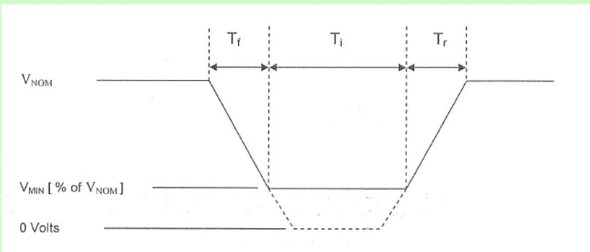  
表 16-1 所有 AC 设备的试验条件

注1 定义：

Ti 电源中断时间；

Tf 施加电压从额定值衰减到最小值所用的时间。

Tr 施加电压从最小值增加到额定值的时间。

Vmin: 要求施加电压衰减的最小电平（用额定电压的百分比表示）。

注2：时间（Ti、Tf、Tr）大于1msec或是直线电压切断的  $10\%$

表 16-2 A(NF)和 A(WF)类设备的附加试验要求  

<table><tr><td>测试条件</td><td>1</td><td>2</td><td>3</td><td>4</td><td>5</td><td>6</td><td>7</td><td>8</td><td>9</td><td>10</td><td>11</td><td>12</td><td>13</td><td>14</td><td>15</td><td>16</td><td>17</td><td>18</td><td>19</td></tr><tr><td>\( T_f \)(mS)</td><td>&lt;1</td><td>10</td><td>17</td><td>18</td><td>19</td><td>20</td><td>20</td><td>10</td><td>25</td><td>50</td><td>43</td><td>48</td><td>50</td><td>18</td><td>20</td><td>13</td><td>5</td><td>&lt;1</td><td>&lt;1</td></tr><tr><td>\( T_i \)(mS)</td><td>2</td><td>0</td><td>8</td><td>32</td><td>56</td><td>80</td><td>180</td><td>0</td><td>0</td><td>0</td><td>33</td><td>53</td><td>150</td><td>13</td><td>15</td><td>27</td><td>20</td><td>50</td><td>200</td></tr><tr><td>\( T_r \)(mS)</td><td>&lt;1</td><td>3</td><td>4</td><td>5</td><td>5</td><td>5</td><td>5</td><td>4</td><td>10</td><td>20</td><td>17</td><td>19</td><td>20</td><td>7</td><td>2</td><td>13</td><td>5</td><td>&lt;1</td><td>&lt;1</td></tr><tr><td>% \( V_{NOM} \)\( (V_{MIN}) \)</td><td>0</td><td>50</td><td>15</td><td>10</td><td>5</td><td>0</td><td>0</td><td>80</td><td>50</td><td>0</td><td>15</td><td>5</td><td>0</td><td>65</td><td>60</td><td>35</td><td>0</td><td>0</td><td>0</td></tr></table>

此条件下的电压达不到零。

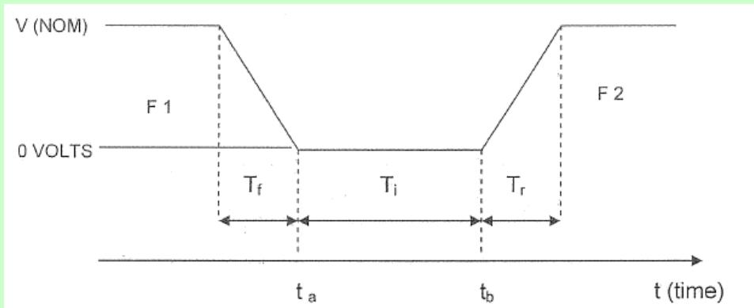

注:

Ti: 0伏时的时间;

Tf: 20ms;

Tr, 5ms;

时间（Ti,Tf,Tr）大于1msec或与直线电压切断相关±10%；

F1: 当  $t \leqslant t a$  时, 设备电压电源频率;

F2：当  $t \geqslant t_b$  时，设备电压电源频率。

<table><tr><td>测试条件号</td><td>I</td><td>II</td><td>III</td><td>IV</td><td>V</td><td>VI</td></tr><tr><td>Ti(ms)</td><td>30</td><td>30</td><td>80</td><td>80</td><td>180</td><td>180</td></tr><tr><td>F1(Hz)</td><td>360</td><td>FMAX</td><td>360</td><td>FMAX</td><td>360</td><td>FMAX</td></tr><tr><td>F2(Hz)</td><td>FMAX</td><td>360</td><td>FMAX</td><td>360</td><td>FMAX</td><td>360</td></tr></table>

其中， $\mathrm{F}_{\text {最大}} =$  对于 A（NF）类设备， $650 \mathrm{~Hz}$ ；

$\mathrm{F}_{\text {最大}} =$  对于  $\mathrm{A}(\mathrm{WF})$  类设备,  $800 \mathrm{~Hz}$ ;

表 16-3 具有数字电路的 DC 设备的试验条件

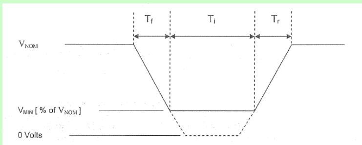

注1 ：定义：

Ti: 电源中断时间;

Tf 施加电压从额定值衰减到最小值所用的时间。

Tr 施加电压从最小值增加到额定值的时间。

$\mathrm{V}_{\text {最小 }}$  ：施加电压允许衰减的最小电平（用额定电压的百分比表示）。

注2：(Ti,Tf和Tr)时间为1msec或与直线电压切断相关的±10%。

表 16-4 单相电气设备电流谐波极限  

<table><tr><td>适用的类别</td><td colspan="4">A, B, D, Z</td><td colspan="3">A, D, Z</td><td>D, Z..</td><td colspan="2">A, B, D, Z.</td><td colspan="4">A, D, Z</td><td>D, Z.</td><td colspan="4">A, B, D, Z</td></tr><tr><td>测试条件</td><td>1</td><td>2</td><td>3</td><td>4</td><td>5</td><td>6</td><td>7</td><td>8</td><td>9</td><td>10</td><td>11</td><td>12</td><td>13</td><td>14</td><td>15</td><td>16</td><td>17</td><td>18</td><td>19</td></tr><tr><td>\( T_f \)(ms)</td><td>&lt;1</td><td>10</td><td>17</td><td>18</td><td>19</td><td>20</td><td>20</td><td>20</td><td>10</td><td>25</td><td>50</td><td>43</td><td>48</td><td>50</td><td>50</td><td>18</td><td>20</td><td>13</td><td>5</td></tr><tr><td>\( T_i \)(ms)</td><td>&lt;1</td><td>0</td><td>8</td><td>32</td><td>56</td><td>80</td><td>180</td><td>980</td><td>0</td><td>0</td><td>0</td><td>33</td><td>53</td><td>150</td><td>950</td><td>13</td><td>15</td><td>27</td><td>20</td></tr><tr><td>\( T_r \)(ms)</td><td>2</td><td>3</td><td>4</td><td>5</td><td>5</td><td>5</td><td>5</td><td>5</td><td>4</td><td>10</td><td>20</td><td>17</td><td>19</td><td>20</td><td>20</td><td>7</td><td>2</td><td>13</td><td>5</td></tr><tr><td>% \( V_{NOM} \)\( (V_{MIN}) \)</td><td>0</td><td>50</td><td>15</td><td>10</td><td>5</td><td>0</td><td>0</td><td>0</td><td>80</td><td>50</td><td>0</td><td>15</td><td>5</td><td>0</td><td>0</td><td>65</td><td>60</td><td>35</td><td>0</td></tr></table>

表 16-5 三相平衡电气设备的电流谐波极限  

<table><tr><td>谐波顺序</td><td>极限</td></tr><tr><td>奇数非三倍谐波 (h=5、7、11、13···37)</td><td>Ih=0.3I1/h</td></tr><tr><td>奇数三倍谐波 (h=3、9、15、21···39)</td><td>Ih=0.15I1/h</td></tr><tr><td>偶数谐波 2 和 4</td><td>Ih=0.01I1/h</td></tr><tr><td>偶数谐波&gt;4 (h=6、8、10···40)</td><td>Ih=0.0025 I1</td></tr></table>

<table><tr><td>谐波序列</td><td>极限</td></tr><tr><td>3th、5th、7th</td><td>I3=I5=I7=0.02 I1</td></tr><tr><td>奇数三倍谐波 (h=9、15、21···39)</td><td>Ih=0.1 I1/h</td></tr><tr><td>11th</td><td>I11=0.1 I1</td></tr><tr><td>13th</td><td>I13=0.08 I1</td></tr><tr><td>奇数非三倍谐波 17, 19</td><td>I17=I19=0.04 I1</td></tr><tr><td>奇数非三倍谐波 23, 25</td><td>I23=I25=0.03 I1</td></tr><tr><td>奇数非三倍谐波 29, 31, 35, 37</td><td>Ih=0.3 I1/h</td></tr><tr><td>偶数谐波 2 和 4</td><td>Ih=0.01 I1/h</td></tr><tr><td>偶数谐波&gt;4 (h=6、8、10···40)</td><td>Ih=0.0025 I1</td></tr></table>

$\mathrm{I}_{1} =$  在最大稳态电源期间测量的设备的最大基本电流要求的工作模式条件，单个试验频率（ $\star$ ）。此最大电流用于计算测试频率下  $(\star)$  所有工作模式的谐波极限。

(∗) : 测试频率值, 参见 16.7.1.3 部分。

$\mathrm{h} =$  谐波序列

$\mathrm{I_h} =$  所有正常稳态工作模式下可得到的  $\mathrm{h}$  的最大谐波电流。

测试标识 H，测试条件 2 符合性表  
表 16-6  

<table><tr><td>A谐波顺列</td><td>B电流谐波要求(%)</td><td>C谐波电压波形(%)</td><td>D=(B+C*1.25)修正电流,具有10ma限制;谐波要求(%)</td><td>E由测试单元发射的电流谐波(%)</td><td>F测试结果</td></tr><tr><td>2</td><td>0.50</td><td>0.04</td><td>0.55</td><td>0.51</td><td>P</td></tr><tr><td>3</td><td>5.00</td><td>3.49</td><td>9.36</td><td>11.72</td><td>Fail</td></tr><tr><td>4</td><td>0.25</td><td>0.03</td><td>0.29-&gt;0.40</td><td>0.35</td><td>P</td></tr><tr><td>5</td><td>6.00</td><td>2.99</td><td>9.73</td><td>7.53</td><td>P</td></tr><tr><td>6</td><td>0.25</td><td>0.12</td><td>0.40</td><td>0.15</td><td>P</td></tr><tr><td>7</td><td>4.29</td><td>1.67</td><td>6.37</td><td>13.20</td><td>Fail</td></tr><tr><td>8</td><td>0.25</td><td>0.02</td><td>0.28-&gt;0.40</td><td>0.10</td><td>P</td></tr><tr><td>9</td><td>1.67</td><td>0.21</td><td>1.93</td><td>0.98</td><td>P</td></tr><tr><td>10</td><td>0.25</td><td>0.01</td><td>0.26-&gt;0.40</td><td>0.05</td><td>P</td></tr><tr><td>11</td><td>2.73</td><td>0.72</td><td>3.63</td><td>3.00</td><td>P</td></tr><tr><td>12</td><td>0.25</td><td>0.03</td><td>0.29-&gt;0.40</td><td>0.12</td><td>P</td></tr><tr><td>13</td><td>2.31</td><td>0.64</td><td>3.11</td><td>5.20</td><td>Fail</td></tr><tr><td>40</td><td>0.25</td><td>0.0017</td><td>0.252-&gt;0.40</td><td>0.0065</td><td>P</td></tr></table>

A列确定了谐波顺序；例如，对于A(CF)类设备，第1行与电压和电流（2*400Hz）的800Hz部分有关。（对负载的实际确定要符合谐波要求，表格应达到并包括第  $40^{\text{th}}$  个的数据）。

B 列列出了对单相负载的电流谐波要求，如表 16-4 所确定的。

C 列是可以施加到总谐波失真大于  $5\%$  （如试验条件 2 中所确定的）的电压上的电压谐波部分的示例。应该强调的是 C 列仅为示例号，实际上此列应包括施加电压的实际谐波部分。

D 列表示用于 EUT 的允许的电流谐波。10mA 限制同样适用于此点, 对第 4, 8, 10, 12 和 40 , 此限制可以放松。在此示例中, 10mA

为基本频率的  $0.40\%$  ，如果没有通过，改变第四个谐波。

E列提供了在失真电压条件下测试的设备项目的电流谐波数据。

F列表示设备是否通过每个专门的谐波。这是由设备输入时测量的（E列）谐波之间的关系及在失真电压输入条件下（D列）允许的电流谐波确定的。

表 16-7 具有数字电路的 DC 设备的测试条件  
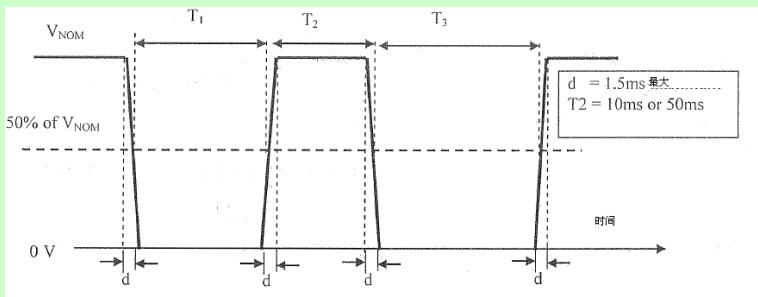  
注：1. 定义:  
Vnom: 额定电压;

T1：第一个切断时间段（当电压等于Vnom的  $50\%$  时进行测量）；  
T3: 第二个切断的时间段（当电压等于Vnom的  $50\%$  时测量）；  
2. 到 T1, T2, T3 的容限  $= \pm 10\%$ ; 当 9000msec 为最小时, 测试条件 1、2 除外。  
3. 在波形的  $10 \%$  和  $90 \%$  之间测量升高和降低时间 “d “;

<table><tr><td>测试</td><td>1</td><td>2</td><td>3</td><td>4</td><td>5</td><td>6</td><td>7</td><td>8</td><td>9</td><td>10</td><td>11</td><td>12</td><td>13</td><td>14</td><td>15</td><td>16</td><td>17</td></tr><tr><td>类别A,D,Z</td><td>Y</td><td>Y</td><td>Y</td><td>Y</td><td>Y</td><td>Y</td><td>Y</td><td>Y</td><td>Y</td><td>Y</td><td>Y</td><td>Y</td><td>Y</td><td>Y</td><td>Y</td><td>Y</td><td>Y</td></tr><tr><td>类别B</td><td>Y</td><td>Y</td><td>Y</td><td>Y</td><td>N/A</td><td>Y</td><td>N/A</td><td>N/A</td><td>N/A</td><td>Y</td><td>Y</td><td>N/A</td><td>N/A</td><td>N/A</td><td>N/A</td><td>N/A</td><td>N/A</td></tr><tr><td>T1 (ms)</td><td>9000</td><td>9000</td><td>10</td><td>10</td><td>10</td><td>20</td><td>20</td><td>20</td><td>20</td><td>50</td><td>50</td><td>50</td><td>50</td><td>100</td><td>100</td><td>150</td><td>150</td></tr><tr><td>T3 (ms)</td><td>20</td><td>50</td><td>10</td><td>50</td><td>100</td><td>10</td><td>50</td><td>100</td><td>170</td><td>10</td><td>50</td><td>100</td><td>140</td><td>50</td><td>90</td><td>10</td><td>40</td></tr></table>

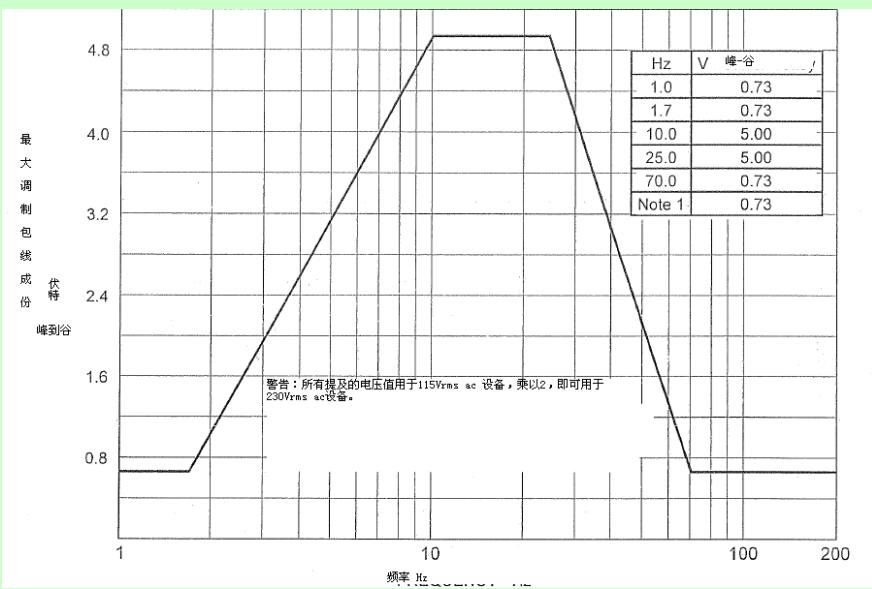  
注：对于 A(CF)类系统，最后的测试频率等于  $200\mathrm{Hz}$ ;

对于 A(WF)和 A(NF)类设备，上述曲线中的最后的测试频率从 200 Hz 开始变化，到施加线路频率的 1/2

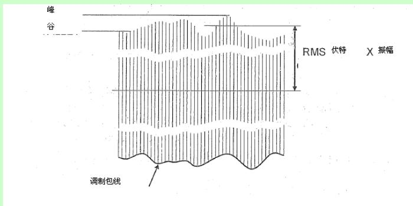  
AC 电压调制范围的频率特性

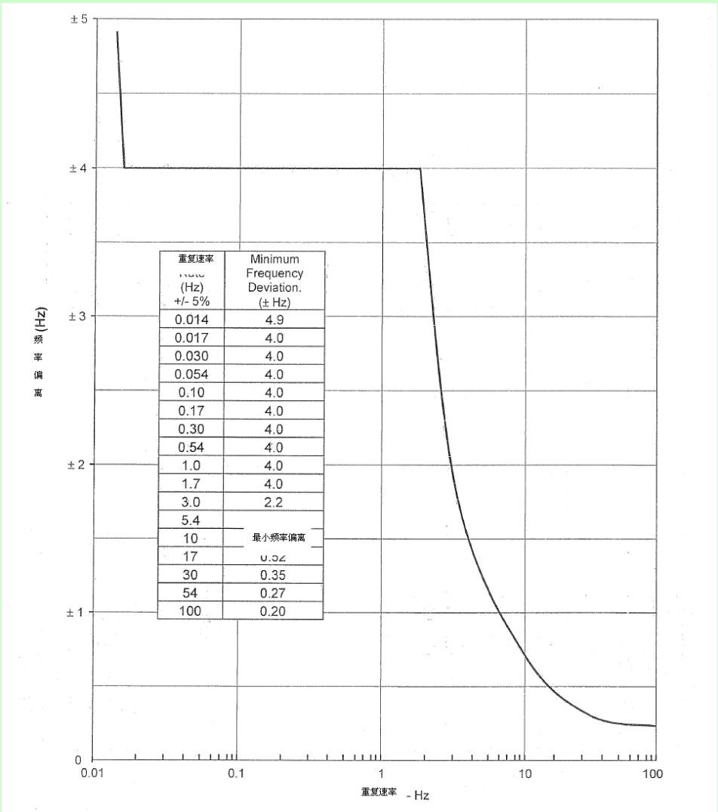  
图16-2 AC频率调制特性

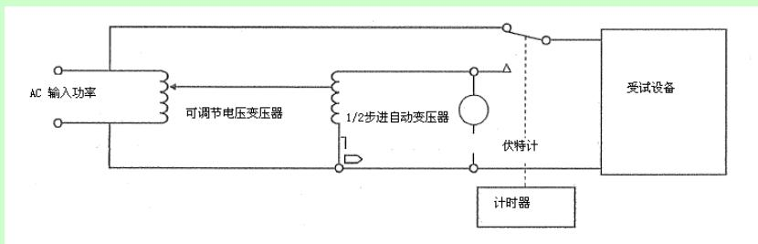

对受试设备，应具有足够的伏—安容量。

电路 A

注：计时器转换期间，受试设备可接收零功率。

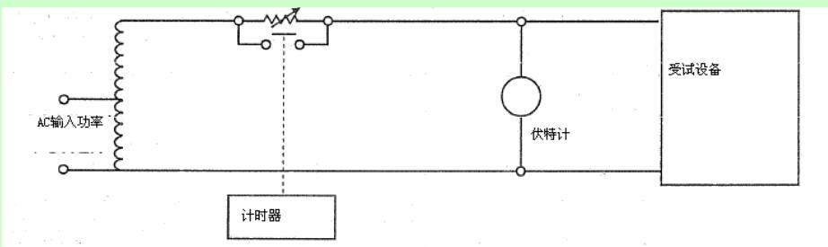  
电路B

注：电路 B 为可选项；并且只有当电源阻抗不是设备的主要性能时，才能使用。

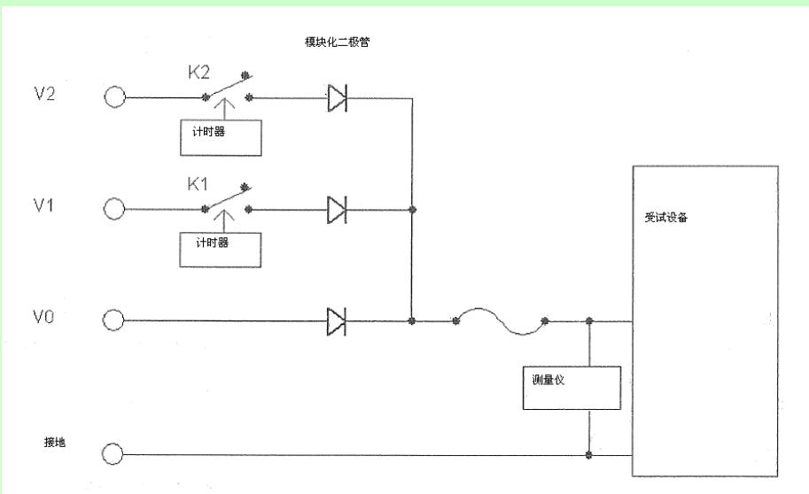  
图 16-3 AC 设备浪涌电压试验

<table><tr><td rowspan="2" colspan="2"></td><td colspan="3">要施加到受试设备上的电压</td></tr><tr><td>电压 V0</td><td>电压 V1</td><td>电压 V2</td></tr><tr><td rowspan="2">K1和K2状态</td><td>K1</td><td>开</td><td>关</td><td>开</td></tr><tr><td>K2</td><td>开</td><td>开</td><td>关</td></tr></table>

注:

1. 根据 16.6.1.4（正常浪涌电压）或 16.6.2.4（非正常浪涌电压），调节 K1 和 K2 状态配置时间满足电压浪涌的时间。  
2. K1 和 K2 应被启动, 这样在 V1 和 V2 之间瞬变开始时, 这两者都可以关闭。

3. 电压源应提供足够的电流以达到要求的测试电压（如在 EUT 输入时测量的值）；  
4. V0, V1, V2 对应于适用的测试章节的电压值。V0 一直低于 V1 和 V2;  
5. 可选的电阻或有源仪器可能存在于二极管的阴极到地上，使电压在电压测试级之间降低；  
6. 可使用能提供要求波形的可替换测试设备。

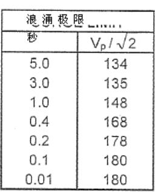  
图16-4 DC设备浪涌电压试验

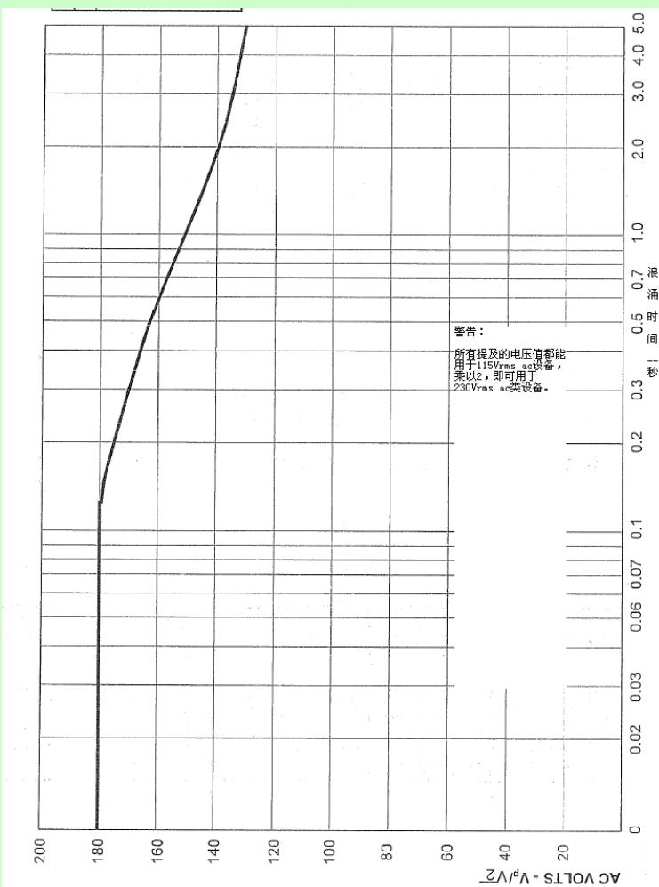  
图16-5 AC非正常电压浪涌包线图

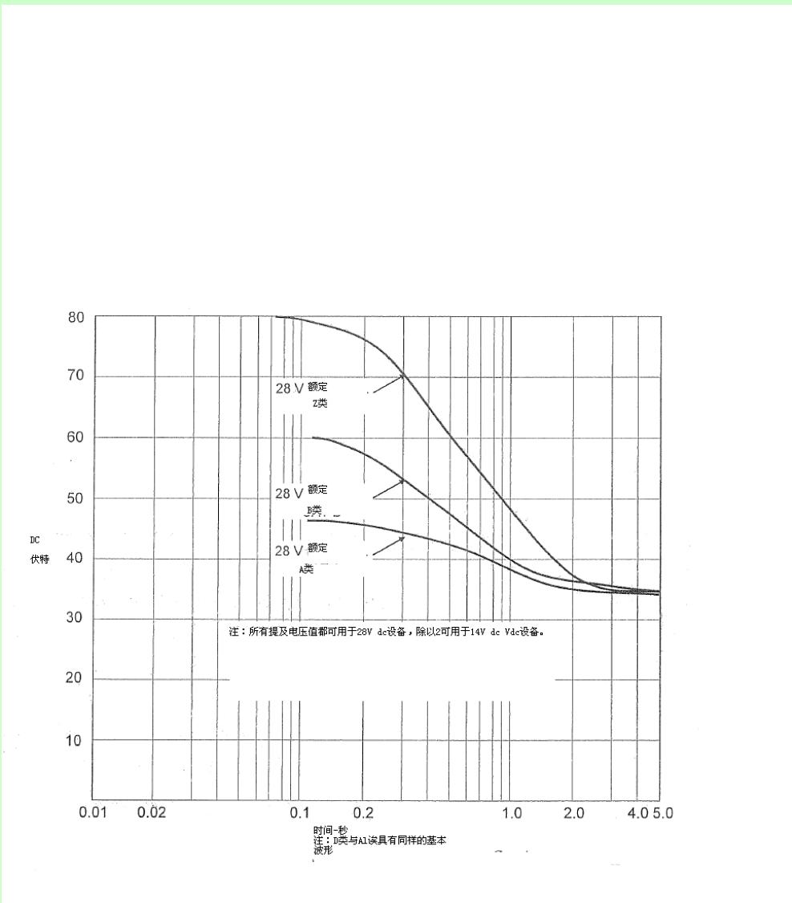  
图16-6 典型的非正常DC浪涌电压特性

<table><tr><td></td><td></td><td></td><td></td><td></td></tr><tr><td>秒</td><td>A类</td><td>B类</td><td>Z类</td><td>D类</td></tr><tr><td>5.0</td><td>32.2</td><td>32.2</td><td>32.2</td><td>315</td></tr><tr><td>1</td><td>37.8</td><td>40</td><td>48</td><td>345</td></tr><tr><td>0.5</td><td>42.5</td><td>47</td><td>60</td><td>385</td></tr><tr><td>0.1</td><td>46.3</td><td>60</td><td>80</td><td>425</td></tr></table>

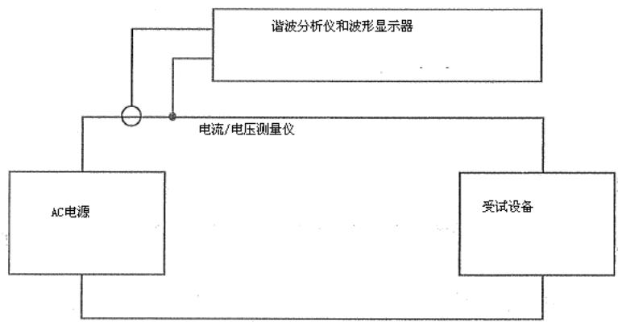

单相设备电流谐波测量。

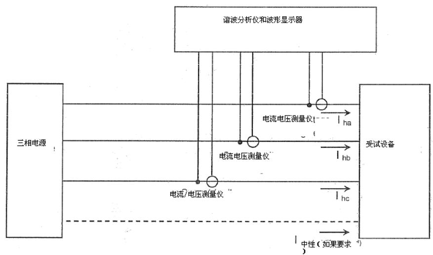

三相设备电流谐波测量。

  
图16-7 典型的电流谐波测量图

  
图16-8 谐波测试的典型的电压失真电路


单相设备 DC 电压偏移产生

“E”对应于一个可调节的DC电压源。此源应:

- 与所有正常工作模式可获得的 EUT 最大稳态有效值电流兼容；

- 在 AC 电源上产生以下 DC 电压偏移

• 115V AC 设备: -0.200+0/-0.040Vdc 和+0.200 +0.040/-0Vdc;  
• 230V AC 设备: -0.200V +0/-0.040Vdc 和+0.200 +0.040/-0Vdc; ; K1 和 K4 开关状态:

• EUT 初始加电: K1 和 K2 (或 K3 和 K4) 均关闭, 以便于不提供 E 给 EUT 涌入电流;

- 试验条件：AC电源上施加负的DC成分

□ K1和K4关闭；  
K2和K3打开

- 试验条件：AC电源上施加的正的DC成分

□ K1和K4打开;  
□ K2和K3关闭。

  
图16-9 AC单相设备DC偏移试验

相 EA、EB 和 EC 电源对应可调节 DC 电压源。这些源应:

- 与所有正常工作模式获得的 EUT 最大稳态有效值电流兼容；  
- 在 AC 电源上产生以下 DC 电压偏移

- 115V AC 设备: -0.200V +0/-0.040Vdc 和 +0.200 +0.040/-0Vdc;  
• 230V AC 设备: -0.200V +0/-0.040Vdc 和+0.200 +0.040/-0Vdc; ; KA1 到 KA4, KB1 到 KB4 和 KC1 到 KC4 开关的状态:  
EUT 起始加电:

KA1, KB1, KC1 和 KA2, KB2, KC2 (或 KA3, KB3, KC3 和 KA4, KB4, KC4) 关闭，以便于不为 EUT 涌入电流提供 EA, EB 和 EC。

- 试验条件：AC电源上施加的负的DC含量：

$\bigcirc$  KA1, KB1, KC1 和 KA4, KB4, KC4 关闭;  
○KA2, KB2, KC2 和 KA3, KB3, KC3 打开。

- 试验条件：AC电源上施加的负的DC含量：

$\bigcirc$  KA1, KB1, KC1 和 KA4, KB4, KC4 打开;  
○KA2, KB2, KC2 和 KA3, KB3, KC3 关闭。

  
图16-10 三相设备DC偏移试验

  
图16-11 允许的三相AC负载的相不平衡

注:

1. D3齐纳/transorb堆积的已测量反相损坏泄露电流应  $< 24\mathrm{V}+/-1\mathrm{V}$  dc, 如EUT测试前和测试后测量的值。D3堆积中可能使用单向和/或双向夹持装置。

2. D1 和 D2 应额定为大于 EUT 最大电流吸入，两者的反向恢复时间都应小于  $1.0 \mu \mathrm{sec}$  。  
3. D3 齐纳/transorb 堆积应额定为 1msec 脉冲电流大于 EUT 最大电流吸入。  
4. 通过示波器检查可能的接地回路，不应导致示波器读出错误和/或损坏。

警告：

1. 在二极管两端及  $10 \mathrm{uF}$  电容上会出现潜在的致命电压;  
2. 此试验失败的 EUT 可能会导致试验装置爆炸；进行此试验之前，应安装并使用合适的机电安全装置；  
3. 进行 EUT 能量再生试验之前，用 EUT 制造商所规定的可通过此试验的方法进行测试。

图16-12 270V dc 能量再启动测试装置

# 第17章

# 电压尖峰

# 17.0 电压尖峰

# 17.1 该试验的目的

本试验的目的是要确定设备耐受其交流或直流引线上电压尖峰影响的能力。

预期的影响如下：

a. 永久性的损坏、元器件故障和绝缘击穿。

b. 敏感性降低或设备性能改变。

# 17.2 设备种类

A类

预定安装在能够防电压尖峰造成损坏的、具有高防护级别装置上的设备确定为A类设备。

B类

主要预定安装在可接受的、降低了电压尖峰损坏标准的设备规定为B类设备。

# 17.3 试验装置和仪器

所使用的瞬态发生器产生的波形如图17-1所示。通常的试验装置如图17-2所示。如果波形符合图17-1，则可以使用任何方法产生该尖峰。

# 17.4 试验步骤

断开受试设备，调节尖峰发生器输出，得到其波形必须与图17-1一致。

使受试设备在设计电压下工作，按图17-1所示，在每个主电源输入端施加正负极性尖峰；在多电源输入都由相同的总线提供时，所有输入连接都进行同步检测。要求在一分钟内施加正极瞬变至少各50次。要求在一分钟内施加负极瞬变至少50次。正负瞬变应用之间的时间与试验内容无关，应由试验人员考虑。对设备的每一种工作方式或功能重复此试验。

施加尖峰结束后，即检查受试设备是否符合有关设备性能标准的要求。

注：如果在试验期间要检查受试设备的性能，则要采用有关设备性能标准中规定的要求。


发生器源阻抗为  $50\Omega$  额定值。特定电压和持续时间只适于开路条件。峰值电压实际上比所连接设备低。发生器源阻抗可通过装备  $50\Omega \pm 10\%$  负载电阻校验，并产生大小为  $1/2$  “特定电压  $\pm 10\%$ ”的电压。

注：以上所示是典型的波形。要求波形上升时间小于等于2微秒，至少持续10微秒。

  
图17-1 电压尖峰波形

注：对于高电流吸入设备，可能要求可替换试验方法（避免变压器浸透，等）。

图17-2 电压尖峰试验安装，DC或单相AC  
图17-3 电压尖峰试验设置，三相AC  
  
注：对于电流吸入设备，要求使用可替换方法（避免变压器浸透，等）。

# 第18章

# 音频传导敏感性试验一电源输入

# 18.0 音频传导敏感性试验一电源输入（闭合电路试验）

# 18.1 试验的目的

该试验的目的是确定，当受试设备安装在飞机上时，是否能够接受通常预期量级的频率分量的考验。这些频率分量通常与电源基波频率的正常谐波有关。

# 18.2 设备种类及频率级

# 18.2.1 设备分类

设备标识包括：

类别参考：

- 对于 AC 雷设备，R(CF)、R(NF)、或 R(WF)；

- 对于 DC 类设备，R、B 或 Z；

类别 R(CF)、R(NF)、R(WF) 和 Z

该类设备预定用于机上电气系统，电气系统由自恒频或变频AC系统的主电源供电，并且DC系统是由变压器-整流器单元供电的设备，确定为：

B类设备：

该类设备预定用于飞机电气系统，该电气系统是由发动机驱动的交流发电机/整流器或直流发电机供电，在直流发电机中大容量的电池一直悬浮在直流汇流条。除非另有规定，否则14伏直流设备的试验级别是28伏直流设备试验级别的一半。

Z类设备：

用于适用于这些标准的、所有其它类型飞机电气系统的 DC 类设备。Z 类设备可以代替 R 或 B 类设备。此类设备的示例如，由变速直流发电机供电的 DC 系统：

a. DC 电源，在直流汇流条上没有悬浮电池，或  
b. 控制保护装置可以使蓄电池与直流汇流条断开，或  
c. 蓄电池容量比直流发电机容量小。

K类:

预定用于飞机电气系统上的设备，电气系统电源由恒频或变频AC系统提供，其特性是电压失真高于R类设备使用的AC电源。

K类设备可以替代R类设备。

18.3 试验程序

除非另有规定，否则应在下面性能测试期间提供额定输入电压。

# 18.3.1 直流输入电源导线

a. 对于 R、B 和 Z 类设备，根据图 18-1 连接设备。设备操作时，依次施加一个正弦波无线电音频信号，该信号与每个未接地的直流输入电源导线连接。当施加的无线电音频信号改变时，该信号的峰-峰之间振幅值在图 18-3 或图 18-4 中作了规定。当以图 18.3.3 规的速率扫描时描时，确定是否符合设备性能标准。对所有性能方式，根据图 18.3.3 重复该试验。

b 对与 270 伏 Z 类设备，根据图 18-1 连接受试设备，使 270 伏负极接地。使设备工作，连续施加一个正弦波无线电音频信号，该信号与每个未接地的直流输入电源导线连接。除非规定了应用性能标准，则在检测时，应将负线应接地。当施加的无线电音频信号改变时，该信号的峰-峰之间振幅值在图 18-3 规定的幅值内，当以 18.3.3 规定的速率扫描时，确定是否符合设备性能标准。对所有工作模式，根据图 18.3.3 重复该试验。

c 对与 270 伏 Z 设备，根据图 18-2 进行连接，使施加到所有 270VDC 设备上的电压纹波为通用模式，以要求的频率范围重复试验类别。（注：负线通过耦合转换器接地）。通用模式试验级是差分试验级的两倍（图 18-3）。当以图 18.3.3 规定的速率扫描时，确定是否符合设备性能标准。对所有操作模式，根据图 18.3.3 重复该试验。

# 18.3.2 交流输入电源线

a. 对于 R(CF) 和 K 类设备

如图18-1所示连接试验设备。当设备工作时，对每个非接地直流输入电源线施加一系列连续的正弦声波信号。使音频在 $700\mathrm{Hz}\sim 16\mathrm{kHz}$  变化。

对R(CF)类设备，保持信号的有效振幅不小于最大正常交流输入电压的  $6\%$  ，扫描频率如18.3.3节所示。确定是否符合有关设备性能标准的要求。对18.3.3中所提的所有工作模式重复该试验。

对K类设备，保持信号的有效振幅不小于最大正常交流输入电压的  $8\%$  ，这时信号频率为  $7.6\mathrm{kHz}$  ；  $6\%$  时，频率大于  $7.6\mathrm{kHz}$  。按18.3.3节所示扫描频率进行扫描时，确定是否符合有关设备性能标准的要求。对18.3.3中所提的所有工作模式重复该试验。

对于K类设备，保持信号的有效振幅不小于最大正常交流输入电压的  $8\%$  ，这时信号频率为  $7.6\mathrm{kHz}$  ；  $6\%$  时，频率大于  $7.6\mathrm{kHz}$  。按18.3.3节所示扫描频率进行扫描时，确定是否符合有关设备性能标准的要求。对18.3.3中所提的所有工作模式重复该试验。

# b. 对于 R(NF) 和 K 类设备

（1）根据图 18-1 连接试验设备。当设备在电源频率为  $360\mathrm{Hz} + 5 / -0\mathrm{Hz}$  运行时，通过每个未接地的交流输入电源线连续施加一系列正弦波无线电音频信号。同时，改变  $700\mathrm{Hz}$  至  $26\mathrm{KHz}$  范围内施加信号的频率。

对R(NF)类设备，以18.3.3节所示频率扫描时，保持信号的有效振幅不小于最大正常交流输入电压的  $6\%$  。确定是否符合有关设备性能标准的要求。以18.3.3中所提的所有工作模式重复该试验。

对K类设备，当扫描频率如18.3.3节所示时，保持信号的有效振幅不小于最大正常交流输入电压的  $8\%$  ，信号频率为  $12.4\mathrm{kHz}$  ；  $6\%$  时，频率大于  $12.4\mathrm{kHz}$  。确定是否符合有关设备性能标准的要求。以18.3.3中所提的所有工作模式重复该试验。

(2) 设备工作的电源频率为  $650 \mathrm{~Hz} + 0 / -5 \mathrm{~Hz}$ , 在  $1100 \mathrm{~Hz} \sim 32 \mathrm{kHz}$  范围内进行音频变化时, 重复试验 (1)。

c. 对 R(WF) 和 K 类设备

（1）根据图 18-1 连接受试设备。当设备运行电源频率为  $360\mathrm{Hz} + 0 / -0$  时，通过每个未接地的交流输入电源线连续施加一系列正弦波无线电音频信号。同时，在  $700\mathrm{Hz}$  至  $32\mathrm{KHz}$  频率范围内对所施加信号进行变化。

对 R(WF)和 K 类设备，当扫描频率如 18.3.3 节所示时，保持信号的有效振幅不小于最大正常交流输入电压的  $6\%$  。确定是否符合有关设备性能标准的要求。以 18.3.3 所述所有工作模式重复该试验。

(2) 设备工作的电源频率为  $800 \mathrm{~Hz} + 0 / -5 \mathrm{~Hz}$ , 在  $1400 \mathrm{~Hz} \sim 32 \mathrm{kHz}$  范围内进行音频变化时, 重复试验 (1)。

18.3.3 中所提的所有工作模式重复该试验。

(2) 设备工作的电源频率为  $650 \mathrm{~Hz} + 0 / -5 \mathrm{~Hz}$ , 使音频在  $1400 \mathrm{~Hz} \sim 32 \mathrm{kHz}$  变化, 重复试验 (1)。

# 18.3.3 频率扫描速率

对于产生离散量频率的测试设备，频率最小数量应为每30频率/10个。试验频率以对数间隔。例如，以下公式以降序计算30步/10的频率：

$$
\mathrm {F} _ {\mathrm {n + 1}} = \mathrm {f} _ {1} * 10 ^ {(\mathrm {n / 30})} \pm 1 \%
$$

其中， $f_{n}$  是一个试验频率，并且  $n = 1$  至  $m$

$\mathrm{f}_{1}$  是开始频率

$\mathrm{f}_{\mathrm{m}}$  结束频率

$$
\mathrm {m} = 1 + 3 0 * \log \left(\mathrm {f} _ {\mathrm {m}} / \mathrm {f} _ {1}\right)
$$

除试验设定时间外，每个试验频率至少保持1分钟。如果  $\mathrm{F}_{\mathrm{n} + 1}$  的最后试验步骤产生的频率大于  $\mathrm{f_m}$ ，则四舍五入为  $\mathrm{f_m}$ 。

试验设备产生的连续线性频率扫描，最小（即，最快）扫描率应等于每10单位的离散频率的个数乘以保持时间，例如，30离散频率/10单位乘以2个1分钟的保持时间，扫描率等于60分钟/10扫描速率。

这些试验分别在从主电源系统上吸入最大稳态电流模式和最小稳态电流模式下进行。最大稳态电流与最小稳态电流比值为2：1或更小。在最单稳态电流模式下的，只进行一次试验。

# 10.4 18.4一般注释

a. 如果试验电源线阻抗要求有过度导入电流以便于产生特定的音频信号电压电平，则测试条件应足以满足电流被限定到至少36安培的峰-峰导入电流条件。此峰-峰电流是除EUT从电源中正常吸入的电流之外。

b. 对于 DC 输入电源线, 第 18.3.1 章, 应通过 DC 电源连接一个大的电容 (100 微法拉或更大)。对于 AC 输入电源, 应通过电源线连接一个 10 微法拉的电容。

c. 在安装中,要从外部并联到 UUT 的多个基础电源输入连接将同步检测。

  
图18-1音频传导敏感性试验的试验装置

注:

仅针对直流电源 C≥100 微法

仅针对交流电源  $\mathrm{C} \geq 8$  微法

可选 DC 阻塞网络（ $\mathbf{C}_{\mathrm{N}}$  和  $\mathbf{R}_{\mathrm{N}}$ ）不应影响已获得测试电平。

可选电流监测器预定用于测量音频电流的 AC 部分，而不是 EUT 电流吸入。

(对于交流和直流电源线，差分模式)

  
图18-2音频传导敏感性试验的试验装置

  
(对于 270V 直流电源线, 普通模式)  
图18-328V&270V直流电源系统中的纹波频率特性

-R, K和Z类

  
图18-428V直流电系统中的纹波频率特性-B类

# 用户指南 --- 附录18

# 音频传导敏感性-电源输入

第18章规定了环境、试验程序和要求。为了正确说明第18章所述程序和要求，在附录18章中提供了用户指南。

用户指南包括了关于环境、试验程序和要求、指南的合理说明、指南和背景信息，以及从飞机和实验室取得的经验。此信息应帮助用户理解这些要求的意图，帮助用户根据其特殊应用对要求进行剪裁，帮助用户在第18章所述的总的测试要求的基础上，研究详细的测试步骤。

用户指南与第18章主体保持了类似的格式，已便于进行交叉参考。用户指南中还包括了与第18章每个章节对应的章节号。如果用

户指南中没有提供更多的信息，则只提供章节标头，内容为空。

18.A.0 音频传导敏感性—电源输入

18.A.1 试验目的

本章旨在提供用于测试设备电源输入线设备音频传导敏感性的试验程序和测试级。安装者的职责是确保试验结果满足所推荐安装的鉴定要求。本用户指南不包含任何要求；其目的是提供能够增强试验成功的背景信息。

18.A.2 设备类别和频率类别

对于 AC 设备, 类别 R(CF)、R(NF)和 R(WF)分别对应于第 16 章的类别 A(CF)、A(NF) 和 A(WF)。

对于 DC 设备, 类别 R、B 和 Z 分别对应于第 16 章的类别 A、B 和 Z。

18.A.2.1 设备类别

18.A.3 测试程序

a. 在某些装置中，返回电源不需局部连接到接地板，但是，应与地面隔离。在这种情况下，需要将电压测量仪与地面隔离，以便于正确测量注入信号。有一些方法可用于隔离电压测量仪，包括使用不同的探测放大器和与测量仪电源输入相连的隔离变压器。使用差分探测放大器的益处是不会出现潜在的冲击危害，同时包括测量仪电源输入上的隔离变压器。

18.A.3.1 DC 输入电源线

18.A.3.2 AC 输入电源线

a. 执行此试验时，通常应避免相移网络（PSN）。PSN 会在测量通道上引入多余的元件，如果没有正确调节，则会在过度测试和欠测试情况下，导致测量结果产生误差。  
b. 第18章中图形的说明了所有需要通过UET输入终端进行的测量。当使用通过电源的电容为AFCS试验信号提供低阻抗时，传送到系统的大部分AFCS信号被施加到EUT上时，仍然有与电源盒电容相关的阻抗存在。Kirchoff电压定律说明了通过隔离变压器辅助绕组的电压输入等同于通过EUT和电容/电源组合的电压总和。这会导致通过EUT的电压低于通过隔离变压器辅助绕组的电压，或，如果变压器上有，则低于“电压测量绕组”电压。

# 18.A.3.3 频率扫描速率

测试步骤/十组和保持时间是在最“佳”设计和“最差”设计值的基础上进行的最佳选择。在“最坏”设计情况下，需要执行更多的步骤以发现所有的故障点。在“最佳”设计情况下，需要更长的保持时间在输入电源线路的潮湿元件上引起过热。

# 18.A.4 总的标记

a. 36Amp（峰-峰）电流极限是以100Wrms电源极限和DO-160E中出现的0.6Ohm额定阻抗为基础的。此两者均起源于该试验性能中使用的测试设备。36Ap-p是从下面公式中得到的：

$$
\begin{array}{l} P _ {r m s} = \left(I _ {r m s} ^ {\wedge} 2\right) ^ {*} Z \\ I _ {p - p} = I _ {\text {r m s}} * (\text {s q r t 2}) * 2 \\ \end{array}
$$

100Wrms，通过 0.6ohm：sqrt(100W/0.6ohm)=12.91 Arms=36.52amp pk-pk

b. 0.6ohm 额定阻抗是以该试验早期版本使用的传统设备为基础的。当这些规范制定为标准时，所使用电子管放大器大概为 2-2.5 ohm 输出阻抗，此阻抗可导致隔离变压器辅助绕组上产生 0.5-0.6ohm 额定负载阻抗。  
c. 当变压器被用于将音频能量耦合到电源线上时, 如果受试设备吸入的 ac 或 dc 负载电流流经其辅助绕组, 则变压器必须能够运行。  
d. 在 AC 线路上, 不应使用相移网络, 因为使用这些仪器, 会导致测量不精确。  
e. 对于下面请看必须进行警告, 以防止由输入电源电流引起的反射电压对音频电源产生系统造成损坏。  
f. 为变压器进行馈送的音频发生器的 DC 偏移会引起音频发生器和/或变压器过热和失效。将与  $10 \mathrm{~hm}$  电阻并行的电容, 插入到音频发生器和变压器之间, 会防止此问题的发生。电容和电阻必须进行额定, 以便于电流通过。电容的电阻必须足够低, 以得到要求的测试级。

# 图18-A-1音频传导敏感性试验测试装置

# (对于 AC 和 DC 电源线，差分模式)

a. 不管有无过度试验的危险，电流监测器作为可选项列出，允许测试导体仅针对试验期间的测试电压进行监测。此操作的危险是，存在着 EUT 输入滤波在 AFCS 信号频率上变成共振的危险，并要求电流大于 36Ap-p 以达到要求的测试电压，并且可能会对 EUT 造成潜在的损坏。

# 图18-A-2 音频传导敏感性测试试验装置

(对 270V DC 电源线, 通用模式)

a. 不管有无过度试验的危险，电流监测器作为可选项列出，允许测试导体仅针对试验期间的测试电压进行监测。此操作的危险是，存在着 EUT 输入滤波在 AFCS 信号频率上变成共振的危险，并要求电流大于  $36\mathrm{Ap-p}$  以达到要求的测试电压，并且可能会对 EUT 造成潜在的损坏。

图18-A-3 28&270伏DC电系统纹波频率特性—类别R、K&Z

图18-A-4 28伏DC电系统纹波频率特性—类别B

# 第19章

# 感应信号敏感性试验

# 19.0 感应信号敏感性试验

# 19.1 试验的目的

本试验决定是否设备的互连电路配置适应安装环境引起的某个级别的感应电压。本节涉及的特定干扰信号与电源频率和谐波，音频信号和由另一个机载设备或系统产生的瞬间电场有关，还通过EUT的互连线影响EUT中的敏感电路。第18章的测试电源线除外。

# 19.2 设备种类

感应信号敏感性试验种类由两个字母来定义。第一个字母（C、Z、A或B）指的是试验级别。第二个字母（C、N或W）指的是主电源设备的类型。第三个字母（E或X）指的是在“E磁场到设备”

（第19.3.2章）试验中，设备是否合格（E）或设备，不合格（X）。

# C类设备

主要用于要求无干扰和由于导线太长或分开太小而引起严重耦合的系统内性能的设备被标识为C类设备。

CC类设备：安装在主电源频率恒定（如  $400\mathrm{Hz}$  ）或直流的飞机上的设备。

CN类设备：安装在主电源可以在一个窄频范围内变化（如：350Hz到650Hz）的飞机上的设备。

CW类设备：安装在主电源在一个宽频范围内变化（如：350Hz到 $800\mathrm{Hz}$ ）的飞机上的设备。

# Z类设备

主要用于要求无干扰的系统内性能的设备被标识为Z类设备。

ZC 类设备：安装在主电源频率恒定（如  $400\mathrm{Hz}$ ）或直流的飞机上的设备。

ZN类设备：安装在主电源在一个窄频范围内变化（如：350Hz到650Hz）的飞机上的设备。

ZW 类设备: 安装在主电源在一个宽频范围内变化 (如:  $350 \mathrm{~Hz}$  到  $800 \mathrm{~Hz}$ ) 的飞机上的设备。

# A类设备

主要用于要求无干扰的系统内性能的设备被标识为A类设备。

AC 类设备：安装在主电源频率恒定（如  $400\mathrm{Hz}$ ）或直流的飞机上的设备。

AN 类设备：安装在主电源在一个窄频范围内变化（如：350Hz到  $650\mathrm{Hz}$ ）的飞机上的设备。

AW 类设备：安装在主电源在一个宽频范围内变化（如：350Hz到  $800\mathrm{Hz}$ ）的飞机上的设备。

# B类设备

主要用于要求将干扰控制在允许级别的系统内性能的设备被标识为B类设备。

BC类设备：安装在主电源频率恒定（如  $400\mathrm{Hz}$  ）或直流的飞机上的设备。

BN 类设备：安装在主电源在一个窄频范围内变化（如：350Hz到650Hz）的飞机上的设备。

BW 类设备：安装在主电源在一个宽频范围内变化（如：350Hz到  $800\mathrm{Hz}$ ）的飞机上的设备。

# 19.3 试验程序

# 19.3.1 设备中的感应磁场

将设备置于表 19-1 所示的电流产生的磁场中，电流辐射体位于受试设备或部件  $0.15 \mathrm{~m}$  处。确定是否符合有关设备性能标准的要求。

试验期间，要将辐射体定位在引起最大干扰的方位上。辐射体的长度应保证伸出受试部件的两端，每端至少伸出  $0.6\mathrm{m}$ ，向辐射体输入电流的引线，放置在离受试部件的任何部分和辐射体本身至少  $0.6\mathrm{m}$  处。受试设备的所有部件均应单独进行试验。电场源和磁场源不应与设备电源同步。在此测试期间，水平放置导线，在EUT前表面上

扫描，通过顶部，向下扫描EUT后表面。将辐射导线或EUT旋转90度，向上扫描左表面，通过顶部，然后向下扫描右（或）表面。可以增加辐射线/EUT方向。扫描目的是测试所有四个面以及箱体顶部。扫描速率应低于系统响应时间。

# 19.3.2 设备电场感应

使受试设备经受由位于受试设备单元外围  $0.01\mathrm{m}$  范围内的  $0.20\mathrm{m}$  长直线辐射体上 170Vrms 产生的音频电场。参考表 19-1 查找适用地测试频率和电平。确定是被是否符合性能标准要求。

在此测试期间，辐射体应面向受试单元的每个外表面，以引起最大的干扰。试验装置件图19-2. 给辐射体施加电压的导线的路线应距离受试单元任何部件至少  $0.6\mathrm{m}$ ，包括辐射体自身。电场电源不应与设备电源同步。

此测试期间，水平放置线路，向上扫描EUT前表面；从顶部到下部扫描EUT后表面。90度旋转辐射线或EUT，向上扫描EUT左表面，通过顶部，向下扫描EUT右（或左）表面。该试验的目标是测试所有四个面和箱体顶部。以低于系统响应时间的速率进行扫描。

按人员防护制定大小的电阻应安装在辐射器线路上。

注：电场试验只需要施加到预定用于外部无金属密封装置的设备上，或者由非传导材料覆盖的设备上。

# 19.3.3 互连电缆的感应磁场

将试验设备的互连电缆束置于音频频率磁场中，如图19-3所示。当磁场强度如表19-1所规定时，确定是否满足设备性能标准。

在试验期间，所有用电缆连接的设备都应该根据设备和接口控制图来安装。与试验设备有关的其它设备的任何输入或输出都应当充分地模拟。磁场源不应与设备电源同步。频率扫描率与驻留时间应该一致（见19.3.6节）。

# 19.3.4 互连电缆感应电场

将试验设备的互连电缆束置于音频频率电场中，如图19-4所示。当电场强度如表19-1所规定时，确定是否满足设备性能标准。

在试验期间，所有用电缆连接的设备都应该根据设备和接口控制图来安装。应根据设备制造厂家的规定使用屏蔽的或绞合线。充分模拟与试验设备有关的其它设备的任何输入或输出。电场源不应与设备电源同步。频率扫描率与驻留时间应该一致（见19.3.6节）。

注：该试验要求螺旋缠绕受试线束散热器导线。散热器导线应螺旋缠绕受试线束，如图19-4所规定的，沿整个线的长度，线束每米长度螺旋缠绕三圈。

# 19.3.5 互连电缆的感应尖峰

试验期间，所有用电缆连接的设备都应该根据设备和接口控制图来安装。应根据设备制造厂家的规定使用屏蔽或绞合线。应充分模拟与试验设备有关的其它设备的任何输入或输出。

用图19-5所示的试验方案将试验设备的互连线束置于正负瞬态磁场中。表19-1规定了19.2节所要求的电缆长度。在图19-5中所示的定时器可以调节，以产生每秒8至10个脉冲的重复率。在图19-5中A点出现的波形应该与图19-6所描述的相似。至于瞬态正负

极性，如果相关设备规范中有规定，则每个极性的脉动应当保持不少于2分钟或更长的时间。

注：散热器导线应螺旋缠绕受试线束，如图 19-5 所规定的，沿整个线的长度，线束每米长度螺旋缠绕三圈。

当暴露在磁场之后，确定是否符合设备性能标准。试验应用期间设备性能的任何要求都在设备性能标准中作了规定。

当在图19-5的A点监视，并触点断开与图19-6所示一致时，发生瞬时感应交换。当触点断开时，A点的电压，大约在2微秒的时间内，从  $+28\mathrm{V}$  （直流）变为一个大负压（此时线圈绕组之间典型电容 $250\sim 3000\mathrm{PF}$ ，在负极情况下充电）。当电压达到电离电势时，则触点处出现电弧放电，通过电离通道很快升向  $+28\mathrm{v}$  (直流)，此时放电完毕，此循环反向进行。在典型情况下，重复时间为0.2-10毫秒，其次数为5-1000次，至到电感性负载的能量（  $\mathrm{E} = 1 / 2\mathrm{LI}^2$  ）消耗掉为止。

# 19.3.6 频率扫描率

对于产生离散频率的试验设备，试验频率的最小数应该为每10个30个频率。试验频率将以对数空间隔开。例如，对每10个30步、以递增次序用来计算这些频率的公式为：

$$
F _ {n + 1} = f _ {n} * 1 0 ^ {(1 / 3 0)}
$$

其中， $f_{n}$  是试验频率，并且  $n = 1$  至  $m$ 。

$f_{1}$  是开始频率

$\mathrm{f}_{\text{m}}$  是结束频率

$$
m = 1 + 3 0 * \log \left(f _ {n} / f _ {1}\right)
$$

每个试验频率的驻留时间应该至少为10秒，不包括试验设备的调整时间。如果  $\mathrm{F}_{\mathrm{n} + 1}$  的最后一个试验步骤产生频率大于  $\mathbf{F}_{\mathrm{m}}$  ，四舍五入到  $\mathbf{F}_{\mathrm{m}}$  。

对于产生连续频率扫描的试验设备，最小（即，最快）扫描率应该等于每10个单位的离散频率数乘以驻留时间，即：每10个单位的离散频率数30乘以驻留时间等于5分钟。

表 19-1: 感应信号灵敏度应用种类  

<table><tr><td>章节号</td><td>试验</td><td>种类ZC</td><td>种类AC</td><td>种类BC</td><td>种类CC</td></tr><tr><td>19.3.1</td><td>设备磁场感应</td><td>在400Hz时,20A rms</td><td>在400Hz时,20A rms</td><td>在400Hz时,20A rms</td><td>在400Hz时,20A rms</td></tr><tr><td>19.3.2</td><td>设备感应电场</td><td>在400Hz时,170V rms</td><td>在400Hz时,170V rms</td><td>在400Hz时,170V rms</td><td>在400Hz时,170V rms</td></tr><tr><td>19.3.3</td><td>互连电缆感应磁场</td><td>在 400Hz 时 , I×L=30A-m; 15kHz时,减少到0.8A-m</td><td>I×L=18A-m,从 380 到420Hz</td><td>不适用</td><td>I×L=120A-m,从380到420Hz,60A-m;在400Hz时,减少到15kHz时1.6A-m</td></tr><tr><td>19.3.4</td><td>互连电缆的感应电场</td><td>V×L=1800V-m,从380到420Hz</td><td>V×L=360V-m,从 380 到420Hz</td><td>不适用</td><td>V×L=5400V-m,从380到420Hz,并且在400Hz时,5400V-m;在15kHz时,减少到135V-m</td></tr><tr><td>19.3.5</td><td>互连电缆的感应尖峰</td><td>图19-4: L=3.0m</td><td>图 19-4: L=3.0m</td><td>图 19-4: L=1.20m</td><td>图19-4:L=3.0m</td></tr><tr><td></td><td></td><td></td><td></td><td></td><td></td></tr><tr><td>章节号</td><td>试验</td><td>种类ZN</td><td>种类AN</td><td>种类BN</td><td>种类CN</td></tr><tr><td>19.3.1</td><td>设备感应磁场</td><td>在350Hz和650Hz时,20Arms</td><td>在350Hz和650Hz时,20Arms</td><td>在350Hz和650Hz时,20Arms</td><td>在350Hz和650Hz时,20Arms</td></tr><tr><td>19.3.2</td><td>设备感应电场</td><td>在400Hz时,170V rms</td><td>在400Hz时,170V rms</td><td>在400Hz时,170V rms</td><td>在400Hz时,170V rms</td></tr><tr><td>19.3.3</td><td>互连电缆的感应磁场</td><td>I×L=30A-m,从350Hz到650Hz;在26KHz时,减少到0.8A-m</td><td>I×L=18A-m,从 350 到650Hz</td><td>不适用</td><td>I×L=120A-m,从350到650Hz,在26KHz时,减少到1.6A-m</td></tr><tr><td>19.3.4</td><td>互连电缆的</td><td>V×L=1800V-m,从</td><td>V×L=360V-m,</td><td>不适用</td><td>V×L=5400V-m,从360到</td></tr><tr><td></td><td>感应电场</td><td>350Hz 到 650Hz</td><td>从 350 到 650Hz</td><td></td><td>6520Hz,并且在 26KHz 时 135V-m</td></tr><tr><td>19.3.5</td><td>互连电缆的 感应尖峰</td><td>图 19-4: L=3.0m</td><td>图 19-4: L=3.0m</td><td>图 19-4: L=1.2m</td><td>图 19-4: L=3.0m</td></tr></table>

<table><tr><td>章节号</td><td>试验</td><td>种类ZW</td><td>种类AW</td><td>种类BW</td><td>种类CW</td></tr><tr><td>19.3.1</td><td>设备感应磁场</td><td>在350Hz和800Hz时,20Arms</td><td>在350Hz和800Hz时,20Arms</td><td>在350Hz和800Hz时,20Arms</td><td>在350Hz和800Hz时,20Arms</td></tr><tr><td>19.3.2</td><td>设备感应磁场</td><td>在400H时,170V rms</td><td>在400H时,170V rms</td><td>在400H时,170V rms</td><td>在400H时,170V rms</td></tr><tr><td>19.3.3</td><td>互连电缆的感应磁场</td><td>I×L=30A-m,从350Hz到800Hz;在32KHz时,减少到0.8A-m</td><td>I×L=18A-m,从350到800Hz</td><td>不适用</td><td>I×L=120A-m,从350到800Hz,在32KHz时,减少到1.6A-m</td></tr><tr><td>19.3.4</td><td>互连电缆的感应电场</td><td>V×L=1800V-m,从350Hz到800Hz</td><td>I×L=360V-m,从350到800Hz</td><td>不适用</td><td>V×L=5400V-m,从350到8000Hz;在32KHz时135V-m</td></tr><tr><td>19.3.5</td><td>互连电缆的感应尖峰</td><td>图 19-4:L=3.0m</td><td>图 19-4:L=3.0m</td><td>图 19-4:L=1.2m</td><td>图 19-4:L=3.0m</td></tr></table>

注：当制造商“安装和接口控制图”或图纸规定了固定电缆长度小于  $3.3\mathrm{m}$ ，则磁场源导线的连接长度（L）应减小到能够在每个末端保持最小  $0.15\mathrm{m}$  隔离距离即可。按照长度减小比率的比例，将试验电平向下调节到规定的连接长度（ $L = 3.3 - (2\times 0.15) = 3\mathrm{m}$ ）。例如：如果制造商规定的电缆最大长度为  $1.8\mathrm{m}$ ，则  $L = 1.5\mathrm{m}$ 。所调节电平为  $(1.5 / 3.0) = 0.5$  乘以电压（V-m）或电流（A-m）测试极限。如果制造商安装和控制接口图或图纸规定的电缆固定长度小于  $1.5\mathrm{m}$ （L小于  $1.2\mathrm{m}$ ），则不要求进行此试验。

  
图19-1（a）音频磁场敏感性试验电平-恒频

  
图19-1（b）音频磁场敏感性试验电平-窄频

  
图19-1（c）音频磁场敏感性试验电平-宽频

  
图19-1（d）音频电场敏感性试验电平-恒频

  
图19-1（e）音频电场敏感性试验电平-窄频

  
图19-1（f）音频电场敏感性试验电平-宽频

  
图19-2 音频电场--设备敏感性试验装置

图19-3 音频磁场敏感性试验装置  
  
注1：互连线必须放置在接地面板上方至少  $50\mathrm{mm}$  处

图19-4 音频电场敏感性试验装置  
  
注2: 磁场环境 = 电流 (I) × 长度 (L) (安培 rms × 米)  
注1：互连线必须放置在地面上方至少  $50\mathrm{mm}$  处  
注2: 电场强度 = 电压 (V) x 长度 (L) (V rms x 米)  
注3：电阻R用于个人高压保护

图19-5 连接电缆尖峰试验装置  
  
注1：互连线必须放置在接地面板上方至少  $50\mathrm{mm}$  处。  
注2: 非受压继电器线圈的特性如下:  
注3：带极性翻转开关的非地28V直流供电设备。

电压 = 直流  $28 \mathrm{~V}$

电流  $= 160 \mathrm{~mA}$

电阻  $= 175\Omega \pm 10\%$

电感 = 1.5 亨利 ± 10% (在启动状态下)

  
图19-6 瞬时感应变换

注：电压波形的测量应在图 19-4 所示点 A 和接地之间进行。测试应在脉冲范围内产生可变幅度尖峰。某些尖峰可能小于  $600 \mathrm{~V} p - p$  电平。

(以上为胡小卫翻译)

# 第20章

# 射频敏感度（辐射和传导）

# 重要通知

本章包含的信息与本资料其它各章描述的所有试验程序有关。此外，附录A适用于标识所进行的环境试验。

# 20.0 无线电频率敏感性（辐射和传导）

# 20.1 试验的目的

这些试验判断设备及其相互连接线路暴露在某一级别的射频调制功率下时是否可以在性能规范内正常运转，调制功率是由一个RF辐射场产生或由在电源线上或接口回路电缆上的插入探测器感应形成。

可以使用两种试验方法：1）频率从  $10\mathrm{kHz}$  到  $400\mathrm{MHz}$ ，射频信号通过插入探测器与被测设备（EUT）的电缆束耦合作用进行试验。2）当频率处于  $100\mathrm{MHz}$  到频率上限之间时，EUT 通过 RF 辐射场作用进行试验。两个试验方法有一个从  $100\mathrm{MHz}$  到  $400\mathrm{MHz}$  的有意重迭区。

从  $100\mathrm{MHz}$  到  $18\mathrm{GHz}$  的辐射敏感度试验，可以运用在20.5节中所描述的方法和材料进行试验性能，也可以运用在20.6节中所描述的方法和材料进行性能。由申请者来选择使用那一种方法。

具有特殊信号、频率、调制方式或带通特性的设备，可以按照可应用设备性能标准的详细说明变更试验。

这些试验结果可以用来:

a) 确定设备对各种 RF 威胁，例如 HIRF, T-PED 及安装系统的发射。  
b) 允许分配种类以确定设备传导和辐射 RF 试验级别。

这些试验需要充分满足设备射频敏感度的试验环境条件。为了证明系统在飞机上的装置，可能根据其所执行的功能附加一些试验。

# 20.2 设备种类

设备类别指定RF的试验标准并确定EUT的最低RF抗干扰标准。可能在可应用设备性能规范中给出设备类别。

设备或系统的应用类别常常是在飞机的内部RF环境确定之前就已经被选定。此外，许多系统或设备根据它们将被安装的不同飞机类型来指定设备类别。因此，如果在设备规范中没有确定设备类别，则设备制造商应根据与设备可能的安装位置、裸露情况和使用情况相一致的类别标准来进行设计、试验和验证设备。

设备类别指定方式由两方面特性构成。第一个分类特性指定传导敏感度试验标准，第二个分类特性指定辐射敏感度试验标准。

为了帮助设备制造商选择合适的设备及其相互连接线路的试验范围，在下面定义各个类别标准，这仅仅是指导性的描述。设备的安装位置、相互连接线路可能的安装位置/暴露情况和飞机大小及结构确定试验标准。

B、D、F、G、L、M和Q类提供试验标准，直接与高强度辐射

场（HIRF）的外部场环境相联系，该系统具有最高临界性，这在HIRF有关规则中作了规定。

当下列条件满足时，R 类提供设备试验标准：

a) 对具有高临界性系统，试验台允许满足 HIRF。见 HIRF 规则。  
b) 显示后门便携式电子发射设备(T-PED)的容差。

‘S’类给以下情况提供一个最低试验标准，来自外部电磁环境对飞机的影响是次要的，并且飞机上自动性能的干扰是合理的但不是必需的。这个类也可以是来自飞机设备的内部EMI环境的典型代表。

‘T’类给以下的检测台试验提供试验标准，该检测台试验是满足适度临界性系统的HIRF，这个条件在HIRF规则中也有详细说明。这个类也可以是来自飞机设备的内部EMI环境的典型代表。

‘W’ 类和 ‘Y’ 类给下列提供试验标准:

a) 该检测台试验是满足间歇的 HIRF 特殊条件。  
b) 显示后门 T-PED 容差。

‘Q’类是为了指出在试验界限的试验性能，或者是采用这些步骤中详细说明以外的调制方式时的试验性能。

# 20.3 一般试验要求

# a. 被测设备

被测设备应安装在接地平板（试验台）上，并且依照以下标准来配置：

(1) 接地平板——由铜、黄铜或铝构成地线平板，铜板或铝板的厚度至少为  $0.25 \mathrm{~mm}$ ，黄铜板的厚度至少为  $0.5 \mathrm{~mm}$ ，面积为  $2.5 \mathrm{~m}^{2}$  或更大，最小深度（前后）为  $0.75 \mathrm{~m}$ 。在使用屏蔽罩时，接地平板的首尾并且每间隔小于 1 米都要和屏蔽罩连接。建议直流阻抗应小于 2.5 毫欧。  
(2)冲击和振动隔离装置——如果设备生产厂商有特殊说明，EUT应该固定在装有冲击或振动隔离装置的基座上来保护。安装基座上的搭接条应与接地平板连接。如果搭接条没有连接在安装基座上，则不可以连接接地平板。  
(3) 电气连接——应按照在 EUT 的设计和安装说明（如外壳、安装基座和接地层的连接）中的规定进行连接。

设备、连接器和电线束的电气连接应该具备飞机安装的典型性，按照可应用安装和接口管理图表中的详细说明进行。试验报告应记录工作中连接方式。

(4)外部接地终端——如果 EUT 的外部接线柱可以当作接地线路，为了确保在试验中的性能环境安全，接线柱必须与接地平板连接。应使用安装说明中确定的连接长度；如果长度没有确定，使用约  $30 \mathrm{~cm}$  的典型电线。  
(5)连接电缆——所有 EUT 相互连接的线路（如屏蔽线、绞合线等等）、电缆束和 RF 传输线必须与应用安装和接口管理图表一致。

以在飞机上安装的类似方式把电缆束捆扎在一起，并以大约  $50 \mathrm{~mm}$  的高度支撑在接地平板上（如果有更大的高度，要根据根据飞机安装说明，并在试验报告中记录）。支撑材料

应为非吸收性、非导电性和非反射性材料。对于复杂的电缆束结构，所有电缆束和相互连接的负载应保持彼此独立，尽可能最小化电缆之间耦合影响。

除非特殊说明，电缆束长度至少要  $3.3\mathrm{m}$  。如果一条相互连接电缆束的长度比试验台长，电缆束以大约  $50\mathrm{mm}$  的高度支撑在接地平板上，超出长度部分以Z字形排列在试验台的背后。如图20-2和图20-9所示，从EUT引出来的电缆至少应有1米，这部分电缆必需距离试验台前面  $10\mathrm{cm}$  并且与试验台前面平行。对于复杂电缆束，第一条分离电缆的边缘应距离电缆束的边缘  $10\mathrm{cm}$  （见图20-2和图20-9）。连接在EUT上的弯曲电缆不可以超出接地平板的边。可以移动EUT来满足电缆弯曲需要的最小半径。EUT的天线空间应满足如图20-2所示的要求。

一些特殊装置也许需要非常长的电缆束，试验台无法容纳；因此，建议使用这些方式试验的相互连接电缆束最长不超过  $15\mathrm{m}$  。这个限制范围以外的电缆是为了匹配电缆束长度，或是为了相位匹配或类似原因而指定特殊长度。

与EUT相互连接的设备或负载，来自它们的任何输入或发送到它们的任何输出应由一个实际运行的装置来提供，或者考虑依赖于阻抗的导线间和导线对地的频率来模拟输入输出。

(6) 电源引线——在电缆束试验中，电源线和回流线一般与控制线

/信号线一起捆扎在电缆束中，只有与超出试验范围的电缆束部分分离。这些引线应连接到线路阻抗稳定网络（LISN）上。

当实际飞机电缆束结构不明确或电源线通过与控制线/信号线独立的一般通道传送时，电源线必须在EUT的连接器附近与电缆束分离并且独立于LISN传送。在这种情况下，电源线到LISN的长度不可以超过  $1.0\mathrm{m}\pm 10\mathrm{cm}$ ，除非应用设备规范有详细说明。

当电源回流线是一个局部接地点（小于  $1 \mathrm{~m}$ ），这根线也许直接与试验台接地，与应用装置和接口控制图一致。

(7) 虚拟天线或负载——为了试验目的，天线电缆终端接在一个相当于电缆特性电阻的负载或是一条虚拟天线。如果使用虚拟天线，应加以屏蔽并且设法精确模拟实际使用天线的电特性。也应包括在天线中一般使用的电气元件，比如滤波器、晶体二极管、同步器和电动机。

# b. 屏蔽罩和试验设备

屏蔽罩、试验设备和工具应该按照以下标准来设置和操作：

c) 试验设备连接——试验设备应与最小的接地回路连接并且确保人员安全。

线路阻抗稳定网络（LISN）——一个LISN应接入每个EUT的主要电源线。已经(2)与飞机设备接地的电源回流线不必连接到LISN。LISN必须连接到接地层。LISN的自震荡高于 $10\mathrm{kHz}$ （例如标准为5uH的LISN)时，所有试验中在每个LISN的电源输入终端和接地平板之间应接入一个10微法的电容。

在所有试验中LISN的射频测量端口应保持在50欧姆以内。LISN的输入电阻特性如图22-1所示。

(3) 天线在屏蔽室中的方向和位置——偶极天线、双锥形天线或喇叭状天线应集中在接地平板上方  $0.3 \mathrm{~m}$  的水平位置上，并且与接地平板平行，如图 20-2 所示。如果使用的发射天线是一个锥角形，例如一个标准增益喇叭天线或类似辐射体，当天线尺寸变小则频率就会变大，允许把天线移到接近 EUT 小于 1 米距离的位置，如图 20-2 所示。只有当天线的远场边界在一米距离内，才可以这样做。发射天性相对于 EUT 的位置应保持等于或大于这个喇叭状发射天线的远场边界。如果天线的远场边界超过一米，那么应使用间隔一米的标准。

如果发射天性的远场边界小于或等于一米，允许把天线移到距离EUT超过一米的位置。应保持在EUT处有适当的场强度。把发射天线移到更远距离可以提高它的照射范围，可以降低在大型EUT配置中所需要的天线放置次数。

注：天线的远场边界用以下等式计算：

$$
\frac {2 \times \mathbf {D} ^ {2}}{\lambda}
$$

这里，D=发射天线孔径的最大尺寸，以米为单位。

$\lambda =$  频率的波长，以米为单位。

注：对于很小的天线，只有当频率在大约  $8\mathrm{GHz}$  以上时，远场边界距离天线才小于一米。

天线的波束宽度不能完全覆盖被测系统时，应执行多重区域扫描。在扫描期间，EUT和至少一半波长的电缆应被暴

露。在屏蔽室里试验时，天线应距离屏蔽室墙壁或吸收体至少  $0.3 \mathrm{~m}$  。可以使用替代天线提供所需要获得的场强。

注：如果使用 20.6 节替代的辐射敏感度试验程序，则不需要以上条件。

(4) 插入传感器——传感器必须有必要的功率和范围性能。插入传感器的插入损失限制如图 20-3 所示。建议使用如图 20-4 所示的试验装置来测量插入传感器的插入损失。把传感器安装在固定装置上。  
(5) 屏蔽室——应尽可能在最大范围内使屏蔽室对设备和试验装置的影响最小化。屏蔽室内部在辐射试验期间应使用RF吸收体材料，以减少电磁能量的反射并且提高精度和可重复性。最低要求，如图20-2所示，在EUT的上方、背后和两个侧面及辐射天线的后面应安装RF吸收体。在表20-1中详细说明了吸收体材料的最低性能要求。可以使用设备制造商有关RF吸收体材料（只是基本材料，不是已安装的）的规范。

注意：如果使用20.6节的替代辐射敏感度试验程序，则不需要以上条件。

为了达到试验设备和传感器的无敏感度监视，可以使用光导纤维接口。辅助试验设备、监视器和负载激励单元的结构和保护措施，应确保试验设备接口回路对RF电流的适当仿真、绝缘和抗干扰性。

(6) 放大器系统谐波: 非线性效应在功率放大器中所引起的正弦敏感性信号的失真可能会导致结果的错误解释。当存在

失真时，试验设备可能会响应要求的敏感性频率的谐波，这里所要求的极限会较小。当使用频率选择接收器来监视输入电平时，失真不会影响在理想频率下的有效敏感性信号电平。然而，当出现敏感性以决定是否影响结果时，谐波电平可能会被抑制。当使用宽带传感器时，失真会导致传感器在理想频率下错误地显示要求的信号电平。在这种情况下，需要控制失真以测出正确的电平。

# c. 幅值测量

与各种类关联的幅值是基于在整个调制周期内包络线均方根（RMS）的尖峰，如图20-5所示。应使用一种可以明显确定调制波形波峰幅值的方式进行幅值测量。这个装置必需有足够的快速响应时间对信号幅值变化产生反应，详细描述见20.6节，可以使用光谱分析仪。试验仪器的检波、分离度和视频带宽应比调制频率大。测量带宽应以三倍变化因子提高，直到被测信号的幅值变化不超过1dB。然后在试验中使用这个带宽设置。在这个适当的设置中，不分解单个调制的边频带。对于20.4节的传导敏感性试验，可以用示波器作为测量设备。该示波器的模拟带宽必须与试验高频极限兼容且有适当的50欧姆端点。

# d. 试验频率隔绝

RF接收设备在敏感度试验期间会表现出对接收频率带的灵敏度。根据接收机MOPS要求设备必需是灵敏的，因此对于设备来说这个灵敏度是正常的。在试验期间必须把这些频率排除在外或者降低这些频率试验标准。

除非接收器最小性能标准另有规定，否则下列隔离频带适应于无线电接收器。从最低性能频率以下百分之10到最高性能频率以上百分之10，所有的频带都应该进行S类级别的试验。要求的接收器性能在试验程序和报告中，或者在特殊接受器性能标准中作了规定。从无线电接收器调频频率以下百分之一到调频频率以上百分之一，所有的频率应当根据S类进行试验以便对损坏作出评估。

这个试验不是用来评估接收机的常规MOPS射频性能特性，也不是为了评估接收机在有任何干扰信号感应或耦合到接收机的RF输入端口时的性能。由于电源线或控制/信号线耦合，或通过接收机外壳直接耦合的这些响应应该评估，基于详细的接收机规范或性能要求判断是否符合标准。

# e. 频率扫描速率

选择扫频速率或步进率应考虑被测设备（EUT）响应时间、EUT敏感度带宽和监视试验设备响应时间。以这个标准来验证所选择的扫描速率，并且记录在试验报告中。

对于产生离散频率的试验设备，超过  $100\mathrm{kHz}$  时每10倍频率最少取100个试验频率点，低于  $100\mathrm{kHz}$  的每10倍频率最少取10个试验频率点。这些试验频率点以对数方程分布。例如（超过  $100\mathrm{kHz}$ ），可以使用以下方程式来计算这些以升序排列的频率点：

$$
f _ {n + 1} = f _ {n} * 1 0 ^ {(1 / 1 0 0)}
$$

这里，  $f_{n}$  是试验频率，  $n$  从1到  $m$ ，

$\mathrm{f}_{1}$  是开始频率，

$\mathbf{f}_{\mathrm{m}}$  是终止频率。

$$
m = 1 + 1 0 0 * \log \left(f _ {m} / f _ {1}\right)
$$

如果上一次试验步进  $f_{n+1}$  产生一个大于  $f_m$  的频率，那么将上一次频率设置为  $f_m$ 。

每个试验频率的保持时间至少应持续一秒时间，不包括试验设备的稳定时间。此外每个试验频率的保持时间必需允许EUT以适当的性能模式演练并且需要考虑在低频率调制期间的不工作时间。至少应用两个完整调制周期。例如，如果应用的是一个1Hz的方波（SW）调制方式，则保持时间不得低于两秒。与所应用的调制方式一样，选择的保持时间应基于EUT和试验设备的响应时间来验证，并且记录在试验报告中。该要求不适用于20.6节。

对于产生连续扫描频率的试验设备，最小（最快）扫描速率应等于每10倍的离散试验频率个数乘以保持时间，也就是，每10倍频率中有100个离散频率，保持时间为1秒，则等于每10倍频率为100

秒的扫描速率。只有当 EUT 和辅助的试验设备能完全响应试验触发时，才使用最快扫描速率。典型的，要求使用比上面描述低的扫描速率。

注：对于已知设备响应频率，应包括附加试验频率，例如镜像频率（nLO±IF，这里 n 是一个从 1 到 10 的整数，LO 是一个局部振荡器频率，IF 是中频），IF，时钟频率，等等。

# f. 试验报告中要求的数据

试验报告必须包括（直接或间接）以下试验设备和数据项目：

1. 电缆配置---每个电缆束的长度、线的类型、屏蔽和屏蔽端（包括单个和所有屏蔽）以及试验线束的连接图。  
2. 试验设备---原理图或每个试验设备的照片，包括电缆束布局、插入位置、测量探针和试验设备连接。  
3. 试验设备运行方式---试验期间的运行方式。  
4. 负载---所有负载的描述，或实际的或模拟的。模拟负载应标识阻抗模拟的程度（线对线及线对机壳）。  
5. 通过/失败标准---通过/失败标准的描述。  
6. 试验结果。

# 20.4 传导敏感性试验

a. 适用范围/目的

当监视电缆感应电流时，对应图20-6，确定EUT和相互连接电缆或线路属于适当的类别。连接EUT和飞机系统中其他设备或接口单元的所有电缆束和适当的支线都适用本试验。

对于所有试验项，线束上感应电流用来建立试验电平，极限是正向功率到插入探测。

相互连接线路可以当作一个整体来试验也可以单独试验。通过分布在几条电缆束上的探测器，可以使用同步输入，并且要求设备带有内部冗余。电源回流线或接地线直接与试验台接地，如20.3.a.(6)节的要求，不应包括在被测电缆中并且不需试验。

# b. 探测器校准

如图20-7所示设置信号发生器、功率放大器、定向耦合器、衰减器、幅值测量设备，在校验装置中安装插入探测器，探测器放置在装置的中间。把信号发生器设置为未调制  $10\mathrm{kHz}$  。在  $10\mathrm{kHz}$  时通过定向耦合器提高放大器发送到输入探测器的功率，直到在幅值测量设备1上测到的电流或功率达到图20-6所选类别的校验装置的电流或功率。

警告：由于校准夹具的反射，RF场是有害的。因此应遵守适当RF辐射限制。

记录信号发生器/功率放大器发送到在幅值测量设备2上插入探测器的正向功率。

依据表20-2或图20-6，从  $10\mathrm{kHz}$  到  $400\mathrm{MHz}$ ，对适当的探测器进行频率段（未调制的）扫描，同时记录幅值测量设备2上的正向功

率并且维持幅值测量设备 1 上的功率幅值。根据 20.4.d，使用正向功率曲线建立或限制传导敏感度试验的标准。

衰减器和负载的VSWR应小于1.2:1。没有安装探测器的校准夹具的VSWR不可超过图20-8的值。

# c. CS试验设置

按照图20-9设置EUT、线路、辅助接口电路和试验设备。对于具有屏蔽电缆束的设备，电缆束包括同轴连接器（例如飞机安装支柱或分离舱壁），为了使CS电流在屏蔽线上最少可以传输  $3\mathrm{m}$  的距离，这个同轴屏蔽终端必须提起来离开地面。距离EUT约5厘米的地方安装感应电流监视器探头。如果EUT连接器正极的后壳长度超过5厘米，探头应尽可能安装在接近连接器后壳的地方，并且记录位置。把探头安装在中间。把插入探测器安装在距离监视器探头前面5厘米的地方。

# d. CS 试验程序

正确设立以下各个方面：探测器位置、软件安装、EUT 性能模式和稳定性、试验设备和所有监视回路和负载。

警告：由于被测电缆束的反射，RF场是有害的。因此应遵守适当RF辐射限制。

把信号发生器设置为  $10 \mathrm{kHz}$  。给插入探测器使用正向功率, 直至达到表 20-2 或图 20-6 所选类别的电流或正向功率。必要时, 限定正

向功率不超过 6dB 根据探头校正程序 20.4.b。不超过正向功率极限以正确的束电流电平扫描波尖峰。记录感应电流和应用正向功率。

停留在所要求的内调制、数据、时钟频率和其他关键点的频率。如果应用调制，确保波峰幅值满足20.3.c节和图20-5所确定的要求。

扫描期间，评估EUT运行情况并且依据可应用设备性能标准来判断。

# e. CS 调制

应用CW和方波调制。在超过  $90\%$  的深度，以1kHz方波调制RF载波信号。

也可以考虑应用与EUT关联的其他调制方式，例如时钟、数据、IF、内部处理或调制频率。特殊的，可以考虑任何反应EUT特性的低频率，例如，一个飞行控制设备在2MHz至30MHz的HF范围内响应1Hz调制。选择一个EUT最敏感的调制，可以仅仅使用这个调制来进行试验。

# 20.5 辐射敏感（RS）性试验

a. 适用范围和目的

对应表 20-3 和图 20-10，确定 EUT 和相互连接电缆或线路属于适当的类别。

b. 辐射场校验

在安装 EUT 之前先校验辐射场，根据所选定的类别设立恰当的场强。

警告：RF场是有害的。应遵守适当RF暴露限制。

使用一个三轴全向电场天线（各向同性探测器）或者等价物，以适当的频率响应来校验参考的CW场。各向同性探测器应安装在接地平板上方  $30\mathrm{cm}$  高、大致与安装在接地平板上的EUT相同位置的中间。作为选择，在类似接地平板上方  $30\mathrm{cm}$ ，并且有一个类似的吸收体配置，探测器可以置于屏蔽体内不同的位置。调整发射天线的正向功率使各向同性探测器的整个场强达到所选类别的要求。整个场强等于矩形分量（三轴）平方和的平方根。记录正向功率并且在EUT辐射场试验中使用这个功率设置。对所要求的整个频率范围内重复这个校验。

注：校验必须先于每个试验，不允许从一个试验到另一个试验使用校验数据除非从校验起试验设备没有被拆开过。在校验循环中如果有设备拆分（包括同轴电缆，天线，波导，等）就要求验证试验之前的校验依然有效。

以一个 CW 信号, 正向功率需要在各向同性探测器产生预期类别的场强, 这个功率就成为参考正向功率。采用方法加强方波 (SW) 和脉冲调制 (PM) 信号, 可以在发射天线上产生与校验标准相同的正向功率。（注意所有标准是在 20.3.c 节和图 20-5 所指定的 ‘尖峰均方根’）。如果在不同类别标准上使用参考 CW 进行校准, 所预期类别的方波或脉冲场强可以使用合适的比例因子。

使用 20.3.c 节所要求的振幅测量设备来监视并且记录输送到发射天线的正向功率。

水平和垂直极化场辐射都有要求。不允许使用圆形极化发射天线。

# c. RS 试验设置

按照图20-2设置EUT、线路、辅助接口电路和试验设备。

信号发生器、放大器、天线和探测器应维持所要求的RF场标准，使之能完全照射EUT和相互连接线路。放置和瞄准天线，在EUT和相互连接线路上建立RF场强。使用天线波束宽度规格或通过映射EUT安装的区域来指定辐射场3dB的点。当天线的波束宽度不能完全覆盖EUT和线路时，执行多重区域扫描。把在EUT（例如显示器，CRT，连接器）上的孔直接暴露在发射天线下，这也许要求附加LRU方位。垂直和水平发射天性方位是必需的。

# d. RS 试验程序

正确设立以下各个方面：天线和各向同性探测器位置、软件安装、EUT 性能模式和稳定性、试验设备和所有监视回路和负载。使用各向同性探测器验证发射路径是正常运行的。应用源自 20.5.b 节的正向功率校验中确定的场强。

警告：RF场是有害的。应遵守适当RF辐射限制。

使用由发射场校验确定的正向功率设置。当应用调制时，确保波峰幅值符合20.3.c节和图20-5的限定值。

使用适当的调制方式扫描频率范围直到频率上限。在所要求的内调制、数据和时钟频率处停留。

扫描期间，评估EUT运行情况并且依据可应用设备性能标准来判断。

# e. RS 调制

对于‘R’类设备使用以下标准和调制：

从  $100 \mathrm{MHz}$  到  $400 \mathrm{MHz}$ , 使用场强为  $20 \mathrm{~V} / \mathrm{m}$  的 CW。以  $1 \mathrm{kHz}$  的方波进行调制, 调制度至少为  $90 \%$ , 使用场强也为  $20 \mathrm{~V} / \mathrm{m}$  。

从  $400\mathrm{MHz}$  到  $8\mathrm{GHz}$ , 使用占空比为  $0.1\%$  、  $1\mathrm{kHz}$  脉冲重复频率、场强为  $150\mathrm{V/m}$  的脉冲调制。以  $1\mathrm{Hz}$  频率和占空比为  $50\%$  的开关转换信号来调制旋转无线电探测器的影响。此外, 对于一般的要求, 以  $1\mathrm{kHz}$  的方波调制, 调制度至少为  $90\%$ , 使用场强为  $28\mathrm{V/m}$  。这个信号也以  $1\mathrm{Hz}$  频率和占空比为  $50\%$  的开关来调制。

对于‘S’类、‘T’类、‘W’类和‘Y’类设备使用以下调制：

如图 20-10, 从  $100 \mathrm{MHz}$  到频率上限, 使用 CW 调制, 调制都为  $90 \%$  频率为  $1 \mathrm{kHz}$  的方波调制。也考虑使用与 EUT 关联的其他调制, 如时钟、数据、IF、内部处理或调制频率。

对于 ‘B, D, F, G, & L’ 类设备使用以下调制:

当以表20-5中适当的SW/CW标准试验时，从100MHz到18GHz，使用CW和一个的1kHz方波调制，调制度为  $90\%$  。也考虑使用与EUT关联的其他调制，如时钟、数据、IF、内部处理或调制频率。

从  $400\mathrm{MHz}$  到  $4\mathrm{GHz}$ ，使用宽度为  $4\mu \mathrm{s}$ （或更大）、 $1\mathrm{kHz}$  重复频率的脉冲调制（PM）试验标准。从  $4\mathrm{GHz}$  到  $18\mathrm{GHz}$ ，使用宽度为  $1\mu \mathrm{s}$ （或更大）、 $1\mathrm{kHz}$  重复频率的脉冲调制（PM）试验标准。特别的注意，以  $1\mathrm{Hz}$  频率和占空比为  $50\%$  的开关信号进行调制，因为EUT可能对低频有响应（例如飞行控制设备）。

对于所有设备：超过1GHz，使用SW调制以CW场强要求的1.42倍来同时满足CW和SW，这是允许的。（e.g.142V/m SM,50%占空比保证100V/m CM和SM）。

# 20.6 辐射敏感性试验（RS）；可替换程序一混响室

# 20.6.1 应用性/目的

根据表 20-3 和/或 20-10 将，试验设备和互联电缆置于适当种类的 RF 场。

# 20.6.2 程序综述

本试验程序使用混响室来确定一个可选用的辐射敏感度试验。

在混响室试验中，试验设备的场通过金属调谐器的旋转以极化和辐射角改变。对每个频率，要求金属调谐器旋转一圈。施加预定的功率电平以产生要求计算的场给试验设备。

该过程由下列步骤组成:

在安装试验台和/或试验设备之前：

a. 执行基于场强均匀的性能检验方法, 来验证混响室的初始结构或在大修以后其性能是满足要求的。执行这种检验方法是为了

验证混响室符合这个试验程序中确定的场强均匀性条件。此外，很重要一点是确定工作混响室的最低可用频率（LUF）。所描述的混响室场强均匀校验是包括整个试验工作空间，包含在混响室中传导试验台的区域。混响室校验只能用调谐（步进旋转调谐器）性能模式，不可以用移动（连续旋转调谐器）性能模式。场均匀性测量时把传导试验台从混响室撤离。在9个试验位置的每个位置的3个方向轴（x，y，z）进行试验，也就是总共27个试验点（20.6.3.1节）。超过400MHz时标准偏差在3dB以内，并且从100MHz到400MHz的线性倾斜（在半对数曲线图上）在4dB到3dB之间，则认为试验室内的场是均匀的。

b. 试验开始前，将试验台和试验设备安装在试验室内：

典型的试验安装应该如图 20-13 所示。设备布局在第 20.3.a.(5) 中作了规定。试验设备的位置在 20.6.3.1 节中作了规定。

发射天线和接收天线应该是相同的天线（见20.6.3.1）。

接收天线必须在工作区间内（见20.6.3.1）。安装软件，设置操作方式和试验设备的稳定性、所有监控电路和负载。

a) 给带有发射天线的试验室输入 CW 信号。用方向偶合器和适当的测量设备（如 RF 功率探针和光谱分析仪）在一个调谐器旋转上监控最大正向功率。  
b)在一个调谐器旋转上、在试验室工作区域内的接收天线上监控接收功率。

c) 用下列公式确定室内尖峰场强度:

$$
E _ {\max } = \sqrt {\frac {3 7 7 * 8 * \pi * \left(P _ {r c v \max }\right)}{\lambda^ {2}}}
$$

这里， $E_{\max} =$  室内最大场强度（ $\mathrm{V/m}$ ）

$P_{RCV1max} =$  一个调谐器旋转上测量到的最大记录功率。

$\lambda =$  试验频率的波长

d)在一个满调谐器旋转上记录最大正向功率和最大场强度。  
e) 移向下一个试验频率。  
f) 重复 a) 到 e)。

注：从该校准获得的正向功率和接收功率应保持线性关系（如：如果正向功率增加 6dB，接收功率将增加 6dB）。该关系也适用于脉冲试验。

c. EUT 试验

a) 用从试验室校准程序获得的信息，利用下列等式计算目标正向功率：

$$
P _ {T a r g e t} = 2 0 * \log \left(\frac {E _ {d e s i r e}}{E _ {\max}}\right) + P _ {F w d}
$$

这里， $\mathrm{P}_{\text {Target }} =$  目标正向功率(dBm)

$\mathrm{E}_{\text {desired}} =$  室内要求场强  $(\mathrm{V} / \mathrm{m})$

$\mathrm{E}_{\max} =$  根据 20.6.2.b 节测量到的场强  $(\mathrm{V} / \mathrm{m})$

$\mathrm{E}_{\max} =$  根据20.6.2.b测量的正向功率

b) 在  $1 \mathrm{GHz}$  以下以每分钟 4 圈旋转调谐器;  $1 \mathrm{GHz}$  以上每分钟 2 圈, 或当施加一圈调谐器功率是较慢。对于选通调制 (如

R 类 1Hz 选通) 调谐器旋转率必须根据工作循环来减小 (例如  $50\%$  的选通工作循环将减小调谐器至  $2 \mathrm{rpm}$  )。只要连续加电并且停顿间调谐器速度不超过每分钟 4 转, 调谐器旋转的停止是允许的。

c) 在适合的试验频率，启动正向功率到  $P_{\text {Target }}$ ，通过测量一个满旋转上峰值正向功率来鉴定方向偶合器和测量设备的正向功率读数。  
d) 要保证接收天线正确地连接到监控设备以监控接收天线上的功率（在一个满旋转上）。如果监控设备来自有噪音的地板，无需采取进一步措施。如果在天线上没有测到功率，应进一步调查以保证在混响室内存在场。如果不能鉴定在接受天线上有功率（有电），该试验被认为无效。  
e) 移向下一个试验频率。  
f) 重复 a) 到 e)。

从频率范围到较高频率极限，使用适当的调制。根据20.5调制载波。使用调制时，保证尖峰幅度符合图20-5的规定。根据要求测试内部调试、数据和时钟频率。

在每个频率，评估EUT操作并确定在整个调谐器旋转期间遵守设备性能标准。

# 20.6.3 校准：场均匀性和负载有效性

作为混响室性能和输入功率的一个初始要求，根据20.6.3.1节程序进行先期空室（无EUT）校验。建议在年度基准或混响室大修后进行空室校验。

对于一般性能的最低试验频率（ $\mathrm{f_s}$ ）是  $100\mathrm{MHz}$ ，场均匀性在第一次十个步骤中被验证。如果选择的是  $100\mathrm{MHz}$  以外的开始频率，例如一个小试验产生的场强一般比较高，混响室的均匀性还是必须在第一次的十个步骤中得到验证。试验室可以被用来测量的所在频率点就是试验室满足图20-11中均匀性要求的所在频率点。

# 20.6.3.1 场均匀性的有效性

a. 清除工作空间（也就是撤离试验台）并且把接收天线放置在试验室的工作空间内，如图 20-12 所示。在恰当的频率点设置幅值测量设备监视接受天线。  
b. 把 E 场探测器放置在工作空间的周围, 如图 20-12 所示。  
c. 从最低试验频率（fs）开始，调节射频源使一个适当的输入功率（PI nput）输入到发射天线。发射天性不可以直接照射工作空间或接受天线和探测器。使源天线直接指向试验室的一角是最佳配置。这个频率应同时在发射天线和接收天线的频段中，两者都是线性极化天线。  
d. 调谐器以分立的阶段（调谐性能模式）在  $360^{\circ}$  范围内步进，因此幅值测量设备和 E 场探测器捕获调谐器旋转一周的最少采样个数。应注意确保停留时间足够长，使幅值测量设备和 E 场探测器有时间完全响应。

e. 记录 E 场探测器每个轴上场强的最大值  $\mathrm{E}_{\mathrm{Maxx}}, \mathrm{y}, \mathrm{z}$ , 所有整个矢量场强的最大值  $\mathrm{E}_{\mathrm{total}}$ , 调谐器整个旋转过程中的输入功率平均值  $\mathrm{P}_{\mathrm{Input}}$  。

注：输入功率值  $\mathrm{P}_{\mathrm{Input}}$  是调谐器整个旋转过程中正向功率平均值，整个E场的最大值是调谐器所在位置的矩形分量（三轴）平方和的平方根。用来确定平均值的采用个数至少应等于试验室校验时使用的采用个数。输入功率的偏差值大（3dB或更大）则表示源或放大器的性能差。所有校验是对于指定天线而言。改变天线使校验无效。所有功率测量都与天线终端有关联。这个试验程序提供喇叭天线效率对于对数周期的一般值。如果效率值已知，则可以使用其它类型的天线。

f. 以表 20-4 所述的对数间隔频率步长重复以上试验步骤，直到 10fs。

g. 对于如图 20-12 所示九个探测器位置的每个位置和九个接收天线位置（其中一个必须在工作空间的中心）进行重复试验，直到 10 fs。

注：对于探测器位置的每次改变，接收天线应移到在工作空间中一个新的位置。这个天线也应放置在一个相对于每个位置房间轴向的新方位（在每个轴上至少  $20^{\circ}$ ）。一个参照坐标， $x =$  房间长向（最长）， $y =$  房间宽， $z =$  房间高。在校验期间，探测器不一定需要沿着房间轴向来定位。

应注意确保维持天线和探测器之间适当的间隔空间。每个位置与前面任何一个位置至少间隔0.75米（或最低频率的  $\lambda /4$  ）。如果接收天线在常规试验中放置在固定的位置，建议其中一个位置为接收天线的永久位置。

h. 使用步骤 v .中获得的数据，把每个 E 场探测器最大测量值与输入功率平均值的平方根的比，使之规范化：

$$
\tilde {E} _ {x, y, z} = \frac {E _ {\text {M a x} , y , z}}{\sqrt {P _ {\text {I n p u t - e m p t y}}}}
$$

这里， $\mathrm{E}_{\mathrm{Maxx}, \mathrm{y}, \mathrm{z}} =$  探测器每个轴分量的最大测量值（低于  $10 \mathrm{~f}_{\mathrm{s}}$  有27个），

$\vec{E}_{x,y,z} =$  规范化后的探测器每个轴分量的最大测量值，

[ P_{\text{Input - empty}} = \text{调谐器旋转中在} \mathrm{E}_{\text{Maxx, y, z}} \text{记录点时试验室的输入功率平均值。} ]

$$
\vec {E} _ {\text {T o t a l}} = \frac {E _ {\text {M a x T o t a l}}}{\sqrt {P _ {\text {I n p u t - e m p t y}}}}
$$

这里,  $\mathrm{E}_{\text {MaxTotal}} =$  每个位置探测器的  $\mathrm{E}$  场合量最大测量值（低于  $10 \mathrm{~f}_{\mathrm{s}}$  有 9 个),

$\overline{E}_{\text {Total}} =$  规范化后的每个探测器的合量最大测量值,

PInput = 调谐器旋转中在 EMaxTotal 记录点时试验室的输入功率平均值。

i. 对于每个校验频率, 计算规范化后的探测器每个轴分量的最大测量值的平均值  $\left\langle \vec{E}_{x,y,z} \right\rangle$ :

1. 对于低于  $10 \mathrm{~f}_{\mathrm{s}}$  的频率:

$$
\left\langle \vec {E} _ {x} \right\rangle_ {9} = \left(\sum \vec {E} _ {x}\right) / 9
$$

$$
\left\langle \vec {E} _ {y} \right\rangle_ {9} = \left(\sum \vec {E} _ {y}\right) / 9
$$

$$
\left\langle \vec {E} _ {z} \right\rangle_ {9} = \left(\sum \vec {E} _ {z}\right) / 9
$$

也计算规范化后的所有 E 场探测器每个轴分量（也就是每个矩形分量）的最大测量值的平均值  $\left\langle \vec{E} \right\rangle_{27}$  :

$$
\left\langle \vec {E} \right\rangle_ {2 7} = \left(\sum \vec {E} _ {z, y, z}\right) / 2 7
$$

注:  $\langle \rangle$  表示的是算术平均值, 也就是

$$
\left\langle \vec {E} \right\rangle_ {2 7} = \left(\sum \vec {E} _ {z, y, z}\right) / 2 7
$$

表示 27 个 E 场矩形分量最大值（规范化后）的总和除以测量次数。

j. 对于低于  $10 \mathrm{~f}_{\mathrm{s}}$  的每个频率, 判断房间满足是否以下的场均匀性条件:

1. 场均匀性是通过标准偏差来确定，标准偏差根据在调谐器旋转一周中9个位置的每个位置最大值的平均值确定。使用探测器每个轴向分量数据（例如  $\sigma_{\mathrm{x}}$ ）和合量数据（例如  $\sigma_{27}$ ）计算标准偏差。

(注意: 不要把合量数据与 E 场合量混淆)。

标准偏差由以下公式给出:

$$
\sigma = \alpha \times \sqrt {\frac {\sum \left(\vec {E} _ {i} - \left\langle \vec {E} \right\rangle\right) ^ {2}}{n - 1}}
$$

这里， n=测量次数，

$\vec{E}_i =$  规范化后的单个  $\mathrm{E}$  场测量值，

$\left\langle \vec{E} \right\rangle =$  规范化后的 E 场测量值的算术平均值, 和

$\alpha = \mathrm{n} \leqslant 20$  时为  $1.06, \mathrm{n} > 20$  时为  $1$  。

例如，对于  $\mathbf{X}$  轴向：

$$
\sigma_ {\mathrm {x}} = 1. 0 6 \times \sqrt {\frac {\sum \left(\vec {E} _ {i x} - \left\langle \vec {E} _ {x} \right\rangle_ {9}\right) ^ {2}}{9 - 1}}
$$

这里，  $\vec{E}_{ix} = x$  轴向的单个测量值，

$\left\langle \vec{E}_x\right\rangle = 9$  个测量位置  $\mathbf{x}$  轴向的最大值  $\mathrm{E}_{\mathrm{Maxx}}$  规范 化后的算术平均值。

对于所有轴向:

$$
\sigma_ {2 7} = \sqrt {\frac {\sum \left(\vec {E} _ {i x , y , z} - \left\langle \vec {E} \right\rangle_ {2 7}\right) ^ {2}}{2 7 - 1}}
$$

这里，  $\vec{E}_{ix,y,z} =$  所有轴向（x，y和z）的各个测量值，

$\left\langle \tilde{E}\right\rangle_{27} =$  所有 27 个轴向最大测量值  $\mathrm{E}_{\mathrm{Maxx},\mathrm{y},\mathrm{z}}$  规范

化后的算术平均值,

$\sigma_{27} =$  所有轴向  $(x, y$  和  $z)$  的标准偏差。

以dB为单位来表达相对于平均值的标准偏差：

$$
\sigma (\mathrm {d B}) = 2 0 \times \log \left[ \frac {\sigma + \left\langle \ddot {E} \right\rangle}{\left\langle \ddot {E} \right\rangle} \right]
$$

2. 如果单个场分量（也就是  $\sigma_{\mathrm{x}, \mathrm{y}, \mathrm{z}}$ ）的标准偏差不超过如图 20-11 所示的标准偏差 2 个频率每倍频程，并且全向标准偏差（也就是  $\sigma_{27}$ ）不超过所示标准偏差，则试验室满足场均匀性条件。如果试验室不满足均匀性条件，则可能在预期

的低频率段不起作用。如果在试验室的边缘不满足均匀性条件，则关系不大，可以通过以下方法来满足均匀性要求：

增加采样（也就是调谐器的档）个数  $10\%$  到  $50\%$  
- 规范化有效输入功率数据  $\left(\mathrm{P}_{\text {Net }} = \mathrm{P}_{\text {Input}} - \mathrm{P}_{\text {Reflected}}\right)$ , 或者

——缩小工作空间。

如果房间超过所要求的场均匀性，可以减少采样个数，但是最低不能少于12个档。优化试验室性能，最少化采样个数从而降低试验时间。

注：如果调谐器不能提供所要求的均匀性，则可通过以下方法提高均匀性，增加调谐器个数、使用更大调谐器或者增加吸收体以降低Q值。评估试验的特性参数（大小尺寸，结构模式，墙体材料）来判断是否可能满足条件。试验室在最低试验频率时的模式不超过60到100或者Q值很高（例如在全部以铝焊接的房间里），则可能难以满足均匀性要求。

重点：一旦房间变动（例如增加吸收体，等等）或者校验程序更改（例如改变调谐器的档数，等等）满足所要求的特性后，为了使校验结果保持有效，在试验期间试验配置和程序必须与校验时保持一致。

# 20.6.3.2 试验箱时间常数校准

对每个频率，用下列公式计算试验箱校准因子（CCF）：

$$
C C F = \left\langle \frac {P _ {A v e R e c}}{P _ {A v e I n p u t}} \right\rangle
$$

这里，CCF: EUT 和支持设备存在时一个调谐器旋转的规范化平均接收功率。

$P_{\text{AveRec}}$  :EUT和支持设备存在时一个调谐器旋转的平均接收功率。  
$P_{\text{AveInput}}$  :EUT 和支持设备存在时一个调谐器旋转的正向平均功率。

为了保证试验箱的时间响应足够快以允许脉冲波形试验，试验箱时间常数的确定应用下列过程完成：

1）用CCF计算质量因子Q。对每次试验试验频率在  $400\mathrm{MHz}$  以上，用公式：

$$
Q = \left(\frac {1 6 \pi^ {2} V}{\eta_ {T x} \eta_ {R x} \lambda^ {3}}\right) (C C F)
$$

这里， $\eta_{Tx}, \eta_{Rx} =$  发射和接收天线的天线效率因子，一半假设为 0.75（对数周期天线）；对喇叭形天线为 0.9。

V =箱体容积（立方米）。

$\lambda =$  具体频率的自由空间波长。

CCF =箱体校准因子。

2) 对  $400 \mathrm{MHz}$  以上每个试验频率, 用下列公式计算箱体时间常数  $\tau$ :

$$
\tau = \frac {Q}{2 \pi f}
$$

这里， $\tau =$  时间常数

$Q =$  根据第1）步计算的值

$f$   =试验频率

在脉冲调制期间，箱体时间常数必须加到任何要求的脉冲宽度（例如，如果时间常数是6毫秒，要求的脉冲宽度是4毫秒，则要求完成10毫秒的脉冲宽度的脉冲调制试验）

注：将要求的脉冲宽度加到空箱体时间常数以代替上述的脉冲宽度是可以的。

表 20-1: 正常事件的 RF 吸收  

<table><tr><td>频率</td><td>最小吸收</td></tr><tr><td>100到250MHz</td><td>6dB</td></tr><tr><td>250MHz以上</td><td>10dB</td></tr></table>

表 20-2: 传导敏感性试验级别与种类

表 20-3: 辐射敏感性试验级别与种类

TABLE 20-3 RADIATED SUSCEPTIBILITY TEST LEVELS VERSUS CATEGORY  

<table><tr><td rowspan="2">Frequency (MHz)</td><td colspan="7">Category Levels (mA)</td></tr><tr><td>M</td><td>O</td><td>R</td><td>S</td><td>T</td><td>W</td><td>Y</td></tr><tr><td>0.01</td><td>0.6</td><td>3</td><td>0.6</td><td>0.03</td><td>0.15</td><td>3</td><td>6</td></tr><tr><td>0.5</td><td>30</td><td>150</td><td>30</td><td>1.5</td><td>7.5</td><td>150</td><td>300</td></tr><tr><td>1</td><td>70</td><td>250</td><td>30</td><td>1.5</td><td>7.5</td><td>150</td><td>300</td></tr><tr><td>30</td><td>70</td><td>250</td><td>30</td><td>1.5</td><td>7.5</td><td>150</td><td>300</td></tr><tr><td>40</td><td>*</td><td>*</td><td>30</td><td>1.5</td><td>7.5</td><td>150</td><td>300</td></tr><tr><td>100</td><td>*</td><td>*</td><td>*</td><td>*</td><td>*</td><td>*</td><td>300</td></tr><tr><td>400</td><td>32</td><td>50</td><td>3</td><td>0.15</td><td>0.75</td><td>32</td><td>100</td></tr><tr><td colspan="8">* Interpolate per figure 20-6</td></tr></table>

<table><tr><td>Environment</td><td colspan="2">Cat B(V/m)</td><td colspan="2">Cat D(V/m)</td><td colspan="2">Cat F(V/m)</td><td colspan="2">Cat G(V/m)</td><td colspan="2">Cat L(V/m)</td><td colspan="2">Cat R(V/m)</td><td>Cat S(V/m)</td><td>Cat T(V/m)</td><td>Cat W(V/m)</td><td>Cat Y(V/m)</td></tr><tr><td>Frequency</td><td></td><td>PM</td><td></td><td>PM</td><td>SW/CW</td><td>PM</td><td>SW/CW</td><td>PM</td><td></td><td>PM</td><td>SW/CW</td><td>PM</td><td>SW/CW</td><td>SW/CW</td><td>SW/CW</td><td>SW/CW</td></tr><tr><td>100-200 MHz</td><td>20</td><td></td><td>25</td><td></td><td>50</td><td></td><td>100</td><td></td><td>200</td><td></td><td>20</td><td></td><td>1</td><td>5</td><td>100</td><td>200</td></tr><tr><td>200-400 MHz</td><td>20</td><td></td><td>25</td><td></td><td>50</td><td></td><td>100</td><td></td><td>200</td><td></td><td>20</td><td></td><td>1</td><td>5</td><td>100</td><td>200</td></tr><tr><td>400-700 MHz</td><td>20</td><td>150</td><td>20</td><td>175</td><td>25</td><td>350</td><td>50</td><td>700</td><td>200</td><td>730</td><td></td><td>150</td><td>1</td><td>5</td><td>100</td><td>200</td></tr><tr><td>700 MHz-1 GHz</td><td>20</td><td>150</td><td>25</td><td>175</td><td>50</td><td>350</td><td>100</td><td>700</td><td>240</td><td>1400</td><td></td><td>150</td><td>1</td><td>5</td><td>100</td><td>200</td></tr><tr><td>1-2 GHz</td><td>25</td><td>250</td><td>50</td><td>500</td><td>100</td><td>1000</td><td>200</td><td>2000</td><td>250</td><td>5000</td><td></td><td>150</td><td>1</td><td>5</td><td>100</td><td>200</td></tr><tr><td>2-4 GHz</td><td>25</td><td>375</td><td>50</td><td>750</td><td>100</td><td>1500</td><td>200</td><td>3000</td><td>490</td><td>6000</td><td></td><td>150</td><td></td><td>5</td><td>100</td><td>200</td></tr><tr><td>4-6 GHz</td><td>25</td><td>375</td><td>50</td><td>750</td><td>100</td><td>1500</td><td>200</td><td>3000</td><td>400</td><td>7200</td><td></td><td>150</td><td></td><td>5</td><td>100</td><td>200</td></tr><tr><td>6-8 GHz</td><td>25</td><td>150</td><td>50</td><td>250</td><td>100</td><td>500</td><td>200</td><td>1000</td><td>200</td><td>1100</td><td></td><td>150</td><td></td><td>5</td><td>100</td><td>200</td></tr><tr><td>8-12 GHz</td><td>38</td><td>375</td><td>75</td><td>750</td><td>150</td><td>1500</td><td>300</td><td>3000</td><td>330</td><td>5000</td><td></td><td></td><td></td><td></td><td>100</td><td>200</td></tr><tr><td>12-18 GHz</td><td>25</td><td>250</td><td>50</td><td>500</td><td>100</td><td>1000</td><td>200</td><td>2000</td><td>330</td><td>2000</td><td></td><td></td><td></td><td></td><td>100</td><td>200</td></tr></table>


表 20-4: 混响箱体试验标准  

<table><tr><td>频率范围（1）</td><td>要求建立场均匀性的频率数（2）</td></tr><tr><td>fs to 4fs</td><td>50/10倍</td></tr><tr><td>4fs to 8fs</td><td>50/10倍</td></tr><tr><td>8fs以上</td><td>20/10倍</td></tr></table>

1.  $f_{s}$  是开始频率  
2. 对数空间

  
图20-1 LIsN阻抗稳定网络的输入阻抗


注1：被测设备的一般要求见20.3节。

注2：裸露电缆的末端。未屏蔽电缆在这点和墙壁之间可以屏蔽。

注3：搭接条。

注 4: 从天花板到接地平板之间, 在试验装置的上面、后面和两个侧面安装射频吸收体。在接地平板前面吸收体延伸应超过  $50 \mathrm{~cm}$  。

注 5: 从天花板到接地平板之间, 在试验天线的背后应安装射频吸收体。吸收体和天线之间的距离应大于或等于  $30 \mathrm{~cm}$  。

  
图20-2 辐射敏感度试验设置

  
图20-3 插入探测器插入损耗界限

  
图20-4 插入探测器插入损耗试验设置  
图20-5 幅值测量

  
图20-6 (A&B) 传导敏感度试验标准

  
图20-7 传导敏感度校准设置

  
图20-8校准装置最大VSWR界限

图20-9 传导敏感度试验设置  
  
注1：EUT的一般要求见20.3节。  
注 2: 裸露电缆末端。未屏蔽电缆在这点和墙壁之间可以屏蔽。  
注3：搭接条。


  
图20-10 (A&B) 辐射敏感度试验标准


  
图20-10 (C&D)  
辐射敏感度试验标准


图20-11场均匀性试验的允许标准偏差  
  
注1：混响室中的场校验由9个探测器位置组成。

注2：探测器位置应在上图所示的空间以内。这是试验室的‘工作空间’。工作空间的各个面与试验室表面、场发生天线和调谐器组件之间间隔不得少于0.75米（或最低频率的  $\lambda /4$ ）。为了校验和监视，接收天线可以放置在工作空间内的任何位置。如果可以的话，发送天线应指向试验室的一个角，也可以指向调谐器。在校验和试验期间，发送天线的位置应保持固定，并且校验和试验时的位置一样。

注3：工作空间可以按照试验室所允许的最大工作空间来设置，或按照试验的所需空间设置。建议工作空间按照所允许的最大工作空间来设置，否则试验用到更大的空间时需要重新校验。

注4：校准时使用具有三个轴向通路的各向同性探测器。也可以用经过校准的电特性弱的偶极天线（也就是小于  $0.1\mathrm{m}$ ），放置在每个测量位置的三个相互垂直方位。注意确保连接的电缆不影响偶极子。建议使用光线隔离的测量系统（各向同性探测器或偶极天线）。

注 5: 最小间隔距离可以少于  $0.75 \mathrm{~m}$  但大于最低频率的  $\lambda / 4$  。在任何情况下, 间隔距离不得少于  $0.25 \mathrm{~m}$  。

图20-12混响室校准的探测器位置

图20-13适合的混响室试验设施的样板  
  
注 1: 工作空间与试验室的各个墙面、场发生天线和调谐器组件之间的至少为 0.75 米（或  $\lambda / 4$ ）。  
注2：试验室不能有任何多余的吸收材料。不可用木制的台子、地毯、楼面料、墙面料或天花板。裸露的电灯组件也是电势负载的源。对于新试验室，在除了门、通风口和检查口以外没有安装任何其他支援设备之前先进行评估。

# 机载设备的环境条件和试验程序

# 第20章附录：用户指南

第20章规定了试验标准、步骤和要求。为了正确解释第20章规定的步骤和要求，提供了用户指南作为附录。

用户指南包括试验环境、试验步骤和试验要求的依据、指南和背景信息以及从飞机和试验室所获得的知识。该信息可以帮助用户理解要求的意图以及帮助用户在第20章一般试验程序基础上建立详细的试验程序。

本用户指南遵循与第20章类似的格式便于参考。相应于第20章每段的段号在用户指南中给出。如果没有附加信息提供，只给出段标题，随后的段是空白。

20.0 无线电频率敏感性（辐射和传导）  
20.1 试验的目的  
20.2 设备种类  
20.3 一般要求

通过/失败标

注意表明设备符合 T-PED RF 环境的的通过/失败标准可以不同于 HIRF RF 环境的标准。T-PED RF 环境可以看做“稳定状态”，而 HIRF RF 环境可以看做“短暂状态”。

20.4 传导敏感性试验

当以共振频率给电缆施加正向功率时，经验可以识别由于超限引起的问题。建议减小功率开始试验以限制遇到这些问题的风险。由于

线束可能共振，对付 500Khz 以上的方法是减小输入功率每频率步 12dB 以减小由于超限而引起的问题。

辐射敏感性试验

对于用传统辐射方法辐射试验设备，可以使用2种不同的方法。一种是扫描频率范围同时保持功率输出给天线。第二种方法是步进前停止照明，然后增加功率到要求的级别。这两种方法可以产生不同的结果。第二种方法在探测窗口效应时可能有用。这种窗口效应直接解释了用混响室试验程序。

辐射敏感性试验；交替程序—混响试验室

应用性/意图

程序

虽然驻留时间在本章不合适，但是试验设备和试验设备响应时间应被看做可以鉴定该扰动速度能保证场变化足够慢以检测出敏感性。该鉴定应记录在试验报告中。

# 20.6.2.a 试验程序：试验开始前

在20.6.2.b.iii中描述试验箱内场强之间关系的等式的精度以及接受的功率可以被确定。在20.6.3.1中使用的接收天线应被放入试验空间。使用天线上接收到的功率及E场探针，提供室内最大场强和最大记录功率的公式才能有效。

# 20.6.2.c 试验程序：试验设备试验

场稳定性是对试验一致性（频率的功能）、可靠性（设备响应时间的功能）以及重复性（试验箱的功能）的一个关键问题。对于如何

定义低频（在该频率以上可以确定标准程序），下面给出了一个建议。

根据20.6.2.c.ii转动调谐器。对于给定的试验设备，场强保持在最大值-3dB以上（围绕最大场峰）的时间将取决于该频率。在高频当场不稳定时要放慢调谐器速度或停止它。规定这样的频率要求定义EUT和/或监控设备响应时间。在下面的图中，给出了直方图和如何使用它的例子。

如果选择停止，那么位置数将最小为12，可以增加以达到更高的级别（如20.6.3.1所述）。

  
持续时间大于EUT时间。

对于规定改动程序的方法，已经有一些考虑，如允许调谐器慢速转动时以多个试验频率。这样的程序会产生合理的稳定性而不停止调谐器旋转、也不会产生过多的试验时间。委员会认为该程序很成熟（根据试验数据），应该引进本资料。

# 第21章 射频能量发射

重要提示：这些章节中包含的信息与本文件中其它章节中描述的信息相关。此外，附录A用于鉴定执行了的环境试验。

10.5  
10.6  
10.7  
10.8 21.0 射频能量发射  
10.9 21.1 试验目的

本试验用于确定设备不会发射超过下面规定电平的不希望的射频噪声。辐射发射限制中规定的凹槽是用来保护飞机射频传感器的工作频率。

# 10.10 21.2 设备分类

设备类别是根据设备和飞机无线电天线之间的位置和距离确定的。这些参数与飞机类型和规格有广泛的联系，因此每一种类别都给了一些实例。

# B类

预定主要在工作时能把干扰控制到容许电平内的设备。

# L类

该类别是指距离飞机上的舱口（如窗户）和无线电接收器的天线较远的设备和互连电路。这一类别适合于位于飞机电子舱内的设备和

相关的互连电缆。

# M类

该类别是指位于飞机上开口电磁明显且不能直接看到无线电接收器天线的设备和互联电缆。该类别适用于位于客舱或运输机座舱中的设备和相关互联电缆。

# H类

该类别是指位于可以直接看到对无线电接收器的天线的地方安装的设备。该类别一般适用于位于飞机外面的设备。

# P类

该类别是指位于靠近高频，VHF,或GPS无线电接收器的天线或几乎没有屏蔽的飞机结构的设备和连接电路。

# Q类

该类别是指位于靠近VHF，或GPS无线电接收器的天线或几乎没有屏蔽的飞机结构的设备和连接电路。

# 10.11 21.3 一般要求

这部分并不测量或控制从接收器和发射机天线端向外传导的寄生信号。关于此控制应在接收器或发射机设备性能标准中规定。当处于非发送或接收模式下时，无线电发送器或接收/发送器必须满足规定的发射要求（包括相邻通道间频带的  $\pm 50\%$  选择频率）。

注释：不测量从天线发出的辐射，或者在使用发射机的情况下，

当调节发射机并且向射频提供负载时，不包括相邻通道间频带的  $\pm 50\%$  选择频率上的任何辐射。

受试设备应安置在接地板上，根据20.3节中a.条和b.条1、2、5中规定的准则以及下列准则性能：

a 对于 21-5 部分中的辐射试验，到地面机端的天线空间和来自地面机端的 EUT 空间应如图 21-11 所示处理。

b 应使用干扰测量设备的尖峰检波功能测量干扰。可以使用能选择 IF 带宽（BW）的干扰测量仪器，选择的 IF 带宽（BW）必须在下表 1 中给出值范围内。

c 应依图 21-6 所示使用线路阻抗稳定网络（LISN）。图 20-1 提供 LISN 的技术数据。

d 如 20.3 节 a（6）中所述，电源回路就近系在地面板上，不必对其进行试验。

e 尖峰检波的时间常数必须低于或等于 1/BWI。如果可以，应把视频带宽选择成大于或等于分辨率带宽。

f 监测时变辐射比表 1 所示更长的暂停，搜索和测量是必要的。表 1 中的暂停时间和大约  $60\mathrm{Hz}$  的电势变化率有关系。

g 对于辐射测量，应扫描每个适用检测的全频率范围。模拟试验接收器最小试验时间应按表 1 规定。同步试验接收器带宽增量 1/2 或更少，试验间歇时间按表 1 规定。可使用更大接收器带宽；但可能导致更高测量辐射极。此情况下无应用于试验数据的带宽校正系数。

h 记录数据应提供测量接收器带宽 1%或两倍的不太严格的最小频率

分辨率，1dB 的最小振幅分辨率。

i 辐射数据的幅度—频率曲线概况将自动产生并持续。  
j 试验报告中要求的数据一试验报告包括下列试验装置和数据项：

1. 电缆配置—电缆束的长度，布线类型，保护和保护终止（包括单独和整体保护），及试验布线图。  
2. 试验装置—原理图，框图，每个试验装置包括电缆束布置的图片，瞬间注入，试验探头和EUT连接方法。  
3 EUT 性能方式—辐射试验中的性能方式。  
4 负载—包括实际和模拟在内的所有描述。模拟负载将支持线间和线地的抗阻模拟。

表 1: 带宽和测量时间  

<table><tr><td>频带</td><td>6dB带宽</td><td>最小驻留时间（对21.4和21.5节）</td><td>最小扫描时间（对21.6节的频带</td><td>对模拟测量接收器的最小测量时间</td></tr><tr><td>.150 to 30 MHz</td><td>1 KHz</td><td>0.015</td><td>N/A</td><td>0.015 sec/KHz</td></tr><tr><td>30 to 100 MHz</td><td>10 KHz</td><td>0.015</td><td>N/A</td><td>1.5 sec/MHz</td></tr><tr><td>100 to 400 MHz</td><td>10 KHz</td><td>0.015</td><td>9</td><td>1.5 sec/MHz</td></tr><tr><td>.400 to .96 GHz</td><td>100 KHz</td><td>0.015</td><td>1</td><td>0.15 sec/MHz</td></tr><tr><td>.96 GHz to 6 GHz</td><td>1 MHz</td><td>0.015</td><td>1</td><td>15 sec/GHz</td></tr></table>

注释1：有必要在感应天线输出端使用低噪音前置放大器，与测量接收器连接以降低该测量噪音地板，用于来确保在960MHz

以上为 M、H 及 P 和 Q 类规定的凹槽中进行正常测量。

注释 2: 对与在所给频率范围内多次扫描后保持最大监测等级且具有 ‘最大保持’特征的试验接收机和光谱分析仪, 多次快速扫描产生如表 1 所示相同的最小试验次数是可接受的。

# 21.4 频传导发射

在  $150 \mathrm{kHz} \sim 152 \mathrm{MHz}$  范围内测量传导发射。 , 由设备产生的干扰电流用钳形干扰装置测量.

a 在频率范围内测量的 EUT 发射或超过图 21-1 或 21-3 或 21-4 中给定值的不应出现在任何正常连接到飞机总线的电源线上。  
b 在频率范围内测量的 EUT 发射或超过图 21-2 或 21-3 或图 21-5 中给定值的不应出现在任何交联电缆束。基础电源线并不是交联电缆束。在非转换和接收模式时被认为天线馈电缆是交联电缆  
c.图 21-6 显示的是简单化了的试验计划，使用电流探针。  
d 把电流探针安装到距 EUT 五厘米处。如果 EUT 连接器加上后盖长度超过 5 厘米，探针应放置在尽量靠近连接器后盖处标注位置上。  
e 测量并记录 EUT 发射，应用图 21-1，21-2 或 21-3,21-4, 21-5 中适当极值到选择项。

# 21.5 射频辐射发射

在  $100 \mathrm{MHz}$  到  $6000 \mathrm{MHz}$  范围内测量辐射发射

a 设备的任何单元，电缆或互连线路所产生的辐射干扰场不应超过图 21-7、21-8，21-9 和 21-10 中规定的各类设备的频率范围内相应类别设备的辐射干扰场。

b 进行射频辐射发射试验的典型设备布置见图 21-11。

c 使用任何适当的天线并且在测量的电压（单位：为分贝毫伏）上增加适当的天线系数就得到场强。对于电缆损耗和匹配的网络都必须采用适当的修正系数。

d 辐射试验要求使用线性极化天线。在垂直和水平极化两个方位上均应对辐射发射进行测量。

e 直接把 EUT1 里的孔（如：显示器，CRTs，连接器）暴露于接收天线，需要另外的 EUT 位置或接收天线位置。如果所有的 EUT 孔并没有暴露于接收天线，就需要在报告中解释正当理由。

f 应考虑能产生最大发射的 EUT 的实际工作模式。

g 只有当 EUT 发射高于 3 分贝、低于选择的类别限制值, 才需要环境辐射数据 (EUT 为 OFF, 试验支持设备 On)。

h 在辐射干扰试验之前检测环境辐射干扰是一个很好的工程实践，并且环境发射至少为 6dB 并低于所选的极限值。

i 测量并记录 EUT 发射状况，采用图 21-7、21-8, 21-9 和 21-10 中针对所选择的类别规定的相关极限值。

21.6 射频辐射发射；混响室程序

本部分解释的混响室射频辐射发射测量可用于21.5.

21.6.1 混响室要求

混响室必须持续旋转混响调音器（混响模式），混响室必须符合

20.6.3 部分磁场一致性要求或高于  $100\mathrm{Hz}$

21.6.2 混响室插入丢失

a 在混响室安装试验工作台,EUT 和布线。EUT 不接通电源。支持设备也不接通电源。设备和布线符合 20.3.a.(5)中要求.EUT 和相关线路如图 20-13 所示在工作空间内。简化图如 21-12 所示。  
b 接收天线在试验频率波段内。接收天线位置必须符合 20.6.3.一致性要求。如果接收天线在常规试验中被安装于固定位置，在一致性检查中就要求其中一个位置必须在接收天线的预期永久位置。

注释：最小化接收天线和 EUT 之间的直接耦合效应是重要的。

c 选择光谱分析仪或EMI接收器尖峰检测器模式并设置尖峰保持显示。

d 设置信号发生器扫描如表 1 所示频率范围。，用  $1 \mathrm{MHz} \mathrm{IF} \mathrm{BW}$  设置光谱分析仪扫描时间到用 100 除以信号发生器扫描时间的值。用 100 乘信号发生器扫描速度以获得旋转调音器最小时间。  
e 用 21.6.2(d) 所选射频信号发生器扫描频率范围，调整射频源注入一个已知的输入功率到发射天线。发射天线不直接照亮工作空间或接收天线。扫描频率范围在线性偏振接收天线端内。一定确保试验是在试验设备背景噪音之上。

f 以 dBm(Pinput)为单位记录射频信号发生器输入功率。

g 旋转调音器一圈使光谱分析仪或 EMI 接收器在选定频率范围内从接收天线捕获功率尖峰。按 21.6.3.（e）规定进行所要求光谱分析仪扫描。

h 使用下列公式计算混响室插入损耗:

$$
\mathrm {I L} = \left(\mathrm {P} _ {\text {i n p u t}} - \mathrm {L} _ {\text {l o s s}}\right) + (1 0 \log (\eta) - \mathrm {P} _ {\text {r e c}}
$$

此处:

IL=在给定频率范围内负载插入损耗 Db)

$\mathrm{P_{input}}$  =射频信号发生器输出功率（dBm）

$\mathrm{L}_{\text {loss}} =$  发射天线线损耗（dB）

$\eta =$  发射天线效率。对于log周期性天线发射天线效率被认定为.75，对与角形天线被认定为.9

$$
\mathrm {P} _ {\mathrm {r e c}} = \text {接 收 功 率 (d B)}
$$

注释：对与插入损耗试验和射频辐射发射试验必须使用相同的接收天线和接收天线传送线路。

# 21.6.3 射频辐射发射试验

混响室辐射发射试验测量EUT发出的功率。通过在每一试验频率加混响(以dB为单位)插入损耗到受测EUT射频辐射功率(dBm)来计算总EUT射频辐射功率。

应用功率到EUT并检查正确性能。任何必要的支持设备都应通电并固定。设备和布线都应符合20.3.a（5）规定。EUT和相关布线如图20-13所示在工作空间内。

a 选择产生最大辐射的 EUT 性能模式。  
b 在屏蔽室外从信号产生器拆分发射天线传送线并用图 21-13 所示 50ohm 负载连接传送线到天线。  
c 接收天线必须符合21.6.2.(b）要求。  
d 光谱分析仪或EMI接收器到检测接收天线的带宽按21.3.a表1

设置

e 选择光谱分析仪或EMI接收器尖峰检测器模式并设置尖峰保持显示。  
f 按 21.3 表一规定。选择光谱分析仪扫描时间或 EMI 接收器。用 200 乘以分析仪扫描时间或 EMI 接收器获得调音器旋转一周的时间。  
g 旋转调音器一圈使光谱分析仪或EMI接收器在选定频率范围内从接收天线捕获功率尖峰。要求扫描最小值为200.  
h 用下面公式计算EUT射频辐射功率：

$$
\mathrm {P t} = \frac {\left(1 0 ^ {\left(\text {P r e c} + \mathrm {I L}\right) / _ {1 0}}\right)}{1 0 0 0}
$$

这里：

Pt=在给定频率范围内由EUT发送的总功率(瓦特)

$\mathrm{P_{rec}}$  =接收天线最大功率（dBm）

IL=21.6.2(h)中计算出的插入损耗（dB）

i 计算电场强E.

$$
\mathrm {E} = \sqrt {\frac {D * \mathrm {P t} * 3 7 7}{4 * \pi}}
$$

这里:

E=场强（V/M）

Pt=最大功率（瓦特）同21.6.2（h）

D=1.64，EUT等效方向性

注释：EUT等效性被认定和半波偶极天线等效

j 计算电场辐射（ $\mathrm{dbuV / m}$ ）

$$
\mathrm {d b u V / m = (2 0 \log (E) + 1 2 0}
$$

这里：

E=场强（伏/米），同21.6.3（i）

k 记录 EUT 电场发射状况并从图 21-7，21-8，21-9 或 21-10 选择项中采用合适极限值。

如果EUT辐射高于被选项极值负3dB，测量环境射频辐射（EUT为OFF，试验支持设备为ON)，在辐射干扰试验之前检测环境辐射干扰是一个很好的工程实践，并且环境发射至少为6dB并低于所选的极限值。

  
图21-1 射频传导干扰的最大电平一电源线

曲线定义: 极限电平  $=$  斜率  $\ast \log$  (频率  $\mathrm{MHz}$  ) + 截距

B 类:  $F<2 \mathrm{MHz}$  斜率=-29.335, 截距=48.83

L 类, M 和 H: F<2MHz 斜率=-29.335, 截距=28.83

  
图21-2 射频传导干扰最大电平一互连电缆束

曲线定义：极限电平  $=$  斜率  $\ast \log$  (频率  $\mathrm{MHz}$  ) + 截距

B 类:  $F<2 \mathrm{MHz}$  斜率=-29.335, 截距=68.83

L, M 和 H 类: F<2MHz 斜率=-29.335, 截距=48.83

  
图21-3射频传导干扰最大电平一互连电缆束和电源线（P项）

曲线定义：极限电平  $=$  斜率  $\ast \log$  (频率  $\mathrm{MHz}$  ) + 截距

P 类:  $F<2 \mathrm{MHz}$  斜率=-29.335, 截距=48.83

图21-4 射频传导干扰试验的典型布置  
  
注释1 见20.3 EUT一般要求

注释2 暴露电缆的末端。从这到墙没有遮蔽的电缆可以遮蔽注释3 连接带

图21-5 射频辐射干扰最大电平-B类和L类  
  
曲线定义: 极限电平  $=$  斜率  $\ast \log$  (频率  $\mathrm{MHz}$  ) + 截距  
B 类:  $F > 100 \mathrm{MHz}$  斜率  $= 15.965$ , 截距  $= 32.682$

  
图21-6 最高电平的射频辐射干扰一M类

凹槽外部曲线定义：极限电平  $=$  斜率  $\ast \log$  (频率  $\mathrm{MHz}$  ) + 截距

M 类:  $F > 100 \mathrm{MHz}$  斜率  $= 15.965$ , 截距  $= 12.682$

注 1: EUT 一般要求, 见 20.3 节。

注2：暴露电缆的末端。未屏蔽电缆应屏蔽。

注3：连接带。

图21-7 射频辐射干扰最大电平一H类  
图21-8 射频辐射干扰最大电平一P类  
  
凹槽外曲线定义：极限电平  $=$  斜率  $\ast \log$  (频率  $\mathrm{MHz}$  ) + 截距  
H 类:  $F > 100 \mathrm{MHz}$  斜率  $= 15.965$ , 截距  $= 12.682$

  
凹槽外曲线定义：极限电平  $=$  斜率  $\ast \log$  (频率  $\mathrm{MHz}$  ) + 截距  
P 类:  $F > 100 \mathrm{MHz}$  斜率  $= 15.965$ , 截距  $= 12.682$

  
图21-9 射频辐射试验的设置  
图21-10混响射频辐射插入损耗试验设置

  
图21-11 混响辐射发射试验装置

  
图21-12：混响辐射发射插入损失测量设备

注释1见20.3EUT一般要求

注释2 暴露电缆的末端。从这到墙没有遮蔽的电缆可以遮蔽

注释3 搭接带

注释 4 射频吸收体放置于试验设置分界线上面, 后面, 及两边, 从天花板到地面机。吸收体在地面机前延伸  $\geqslant 30 \mathrm{~cm}$ .

注释5 射频吸收体放置于试验天线的后方，从天花板到地面。吸收体和天线之间的距离  $\geqslant 30\mathrm{cm}$


  
图21-13：混响辐射发射试验设备

# 第21章 用户指南

第21章规定了试验标准、步骤和要求。为了正确解释第21章规定的步骤和要求，提供了用户指南作为附录。

用户指南包括试验环境、试验步骤和试验要求的依据、指南和背景信息以及从飞机和试验室所获得的知识。该信息可以帮助用户理解要求的意图以及帮助用户在第21章一般试验程序基础上建立详细的试验程序。

本用户指南遵循与第21章类似的格式便于参考。相应于第21章每段的段号在用户指南中给出。如果没有附加信息提供，只给出段标题，随后的段是空白。

21.0 无线电频率能量发射  
21.1 试验目的  
21.2 设备种类  
21.3 一般要求  
21.4 传导RF发射  
21.5 辐射RF发射  
21.6 辐射RF发射；混响室程序  
21.6.4 辐射RF发射试验

在混响技术发展期间，人们注意到最初结合进21章的限制线是基于偶极子的方向。这使得工作组得出结论：注1与初试线一致。

# 第22章 雷电感应瞬态敏感性

重要提示：与本试验相关的信息包含在第1、2、3节中。此外，附录A用于鉴定执行了的环境试验。

# 22.0 雷电感应瞬态敏感性

# 10.12 22.1 试验目的

这些试验方法和程序采用理想的波形验证设备承受雷电感应电瞬变效应的能力。在应用设备规范中说明设备在雷击瞬变状态时的性能标准。

有两组试验可以用于设备鉴定。第一组是损坏容许试验，采用引脚注入方法执行，如图22.5.1所示。第二组，如22.5.2节中规定，在把瞬间电流施加到互联电缆束上时，评估设备的功能干扰容许程度。电缆束试验包括单冲程、多冲程和多重脉冲，响应试验（此处之后指单冲程、多冲程和多重脉冲）。电缆束试验也可以提供损坏容许指示。

# 注释

这些试验可能不能覆盖雷电感应对设备交互作用和效应的所有方面，尤其是当设备被合并到一个系统中时。根据所执行的功能，应进行做额外试验如不同波形的应用、同步电缆注入和多路频率等，以获得设备/系统安装证明。雷电对设备的直接效应见本文件第23.0节。

# 10.13 22.2 定义

# 电缆束

路径相同的一组电线或电缆束，把设备连接到组成受试系统的一个或多个设备上。

# 校准回路

这是一条负载较高、自感系数较低、阻抗较低的单条电线回路，穿过注入变压器，形成绝缘次级线圈。该回路的阻抗应低到足以获得试验所需的电平和波形。

# 芯线

屏蔽内的一条单个导线。由于屏蔽作用（例如屏蔽传送阻抗的作用），该电线上的感应电压/电流从驱动回路电压/电流降低。

# 发生器

通过直接或间接与受试设备耦连发送电压或电流波形的一组设备（波形同步器、放大器、耦合器等）。

# 局部接地

连接到设备上和设备在飞机机架上相同安装部位的任何接地条或导体。接地条或导体应绑扎到设备要安装的相同接地板上，在雷电雷击期间，这些设备与设备处于同一电势。

# 监测回路

一个接近装置、单一方向的导线回路经过输入变压器组成一个绝缘的二级线圈。该线圈用于监视电缆束感应电压或校准回路电压。

# 多重脉冲串的应用

利用一组瞬变状态波形再现外部雷击产生多重脉冲串波形对飞机线路的感应影响。多重脉冲串应用包括在外部环境中每个电流脉冲对应的一个感应瞬变状态。每个感应瞬变状态是对外部环境的响应。在多重脉冲串应用中有三组二十个瞬变状态。

# 多冲程应用

利用一组瞬变状态波形模拟外部雷击产生多冲程波形对飞机线路的感应影响。多冲程应用包括在外部多冲程环境中每个冲程相应的感应瞬变状态波形。在多冲程应用中有十四个瞬变状态。第一个感应瞬变状态是对外部环境第一个返回冲程的响应，接下来的十三个瞬变状态是对外部雷击环境接下来的或多重的返回冲程的响应。

# 屏蔽

与电缆束平行传送并且捆扎在电缆束里，把设备机箱或机身结构的终端接地的导体。该导体经常是一条包围在一些电线或电缆的电缆束外面的金属线编织物，或是一条金属管道，或电缆束末梢接地的电线。屏蔽罩作用是对相互连接的设备提供低阻抗通路。

# 屏蔽电缆束

包含一条或多条屏蔽的电缆束，这种电缆束中可以包含一些未屏蔽的电线。

# 单冲程响应

对飞机外部产生的、最严酷的雷击冲程的最具代表性的电线响应。

阻抗传送

芯线开路电压与屏蔽电流之比。

# 未屏蔽电缆束

由非屏蔽线组成的电缆束。

# 10.14 22.3 类别

根据设备的预定用途和在飞机上的安装，设备制造商必须选择相应的试验等级和波形对设备进行试验。

设备的类别指示符由下面 6 个字符成:

a. 按照表 22-1 或 Z 或 X 中指定，引脚试验波形为字母（A 或者 B）

b.按照表 22-2 或 Z 或 X 中指定，引脚试验等级为（1 到 5）

c.按照表 22-1 或 Z 或 X 中指定, 电缆束试验波形为字母 (C 到 K)

d.按照表 22-3 和表 22-4 或 Z 或 X 中指定，电缆束单冲程或多冲程试验等级（1 到 5）

e.按照表 22-1.2 或 Z 或 X 中指定，电缆束多重脉冲试验波形等级字母（L 或 M）。

f.按照表22-5或Z或X中指定，电缆束多重脉冲试验等级（1到5）

因此，类别指示符应如下表示：

<table><tr><td>B</td><td>3</td><td>G</td><td>4</td><td>L</td><td>3</td></tr><tr><td>引脚试验波形</td><td>引脚试验电平</td><td>电缆束试验波形</td><td>电缆束单次和多次冲程</td><td></td><td>电缆束多次冲</td></tr></table>

试验电平

试验电平

上面例子中，类别 B3G43 表示设备的引脚注入试验使用的波形

为 B（表 22-1），电平 3（表 22-2），电缆束试验波形为 G，包括在电平 4 下的单冲程试验（如表 22-3 中所示）、在电平 4 下的多冲程试验（如表 22-4 中所示）。以及在电平 3 下的多次爆发试验（如表 22-5 中所示）。另外一个例子 B3XXX，表示设备引脚试验波形为 B，电平为 3，如表 22-2 中所示。不需要进行试验时，类别符号为XXXXX。如上图所示，引脚-到-壳体试验电平和电缆束试验电平不同。

图22-1到图22-8定义了波形A到L相关的单个波形。

波形指示符位置上使用 Z 指示波形或试验配置（例如，屏蔽、接地等）都与表 22-1 指定的不同。同样，试验等级位置上的 Z 指示施加的试验等级与表 22-2 至表 22-5 中指定的不同。例如，AZZ33 说明引脚试验没有使用指定的试验，单冲程、多冲程和多重脉冲串试验使用预先的波形设置或配置标准 3 进行试验。试验报告中应描述详细的试验条件和试验等级。

# 22.3.1 波形指示符（第一个、第三个和第五个字符）

波形A、C、E、G和J都适用于与安装在飞机机身上特定区域内的导线互联的设备，在这些区域中，感应瞬态的主要来源是那些开口（如门、窗等）而不是结构阻抗，这与机身为全金属时的情况一样。同样的原因，波形也适用于安装在机身内、由金属机架和合成蒙皮面板构成的设备，以及安装在碳纤维合成机身内的设备，这些设备的主表面都采用金属网或金属薄片保护。

如果结构阻抗也是感应瞬态的一个主要来源（例如碳纤维合成结

构）时，那么波形 B、D、F、H 和 K 都适用于与安装在机身任何区域的电线互联的设备。在这些情况下，电线暴露在高结构电压和重新分配的雷电电流下，这种情况用波形 5A 表示。

电缆束试验波形设置E、F、J和K适用于与屏蔽线互联的设备。一个例外是为屏蔽电源线中E、F、J和K仍然适用于所有电缆束。

电缆束试验波形设置C、D、G和H适用于所有电缆束与为屏蔽导线连接的设备。

A 和 B 都用于引脚注入试验。

C 至 F 用于电缆束单冲程试验。

G 到 K 用于电缆束单冲程、多冲程

L 到M用于电缆束多重脉冲串试验

Z表示执行的是表22-1或22-2中规定以外的试验，如使用带屏蔽电缆的C、D、G或H波形。例如，带屏蔽和未屏蔽电缆束的设备，在电缆束中E、F、J和K波形适用于屏蔽电缆束；C、D、G和H适用于未屏蔽电缆束。Z波形指示符应用的其它例子在22.5.1和22.5.2节中给出。

# 22.3.2 试验等级指示符（第2、4和6个字符）

下面提供了飞机内部环境试验等级说明以及表22-2至表22-5中所列每种波形的详细等级。1至5级允许灵活保护设备。这些说明只供指导。试验等级由互联导线和设备位置预期的暴露情况决定。

1 级：预定用于将安装在良好保护环境下的设备和互联导线  
2 级：预定用于将安装在被部分保护起来环境下的设备和互联导线  
3 级：预定用于将安装在适度暴露环境下的设备和互联导线  
4级和5级：预定用于将安装在严酷电磁环境中的设备和互连导线。  
Z 指示试验是在表 22-2 至表 22-5 中规定以外的电压和/或电流电平下进行。

# 10.15 22.4 一般试验要求

a. 受试设备一除非每台设备的规范中另有规定，否则受试设备应安装在接地板上，并根据下列准则配置：

1. 接地板一铜，黄铜或铝质接地板（铜或铝：至少  $0.25 \mathrm{~mm}$  厚；黄铜，至少  $0.5 \mathrm{~mm}$  厚；面积  $2.5 \mathrm{~m}^{2}$  或更大），最小厚度（从前到后）应为  $0.75 \mathrm{~m}$  。如果使用屏蔽罩，则应以不大于一米的间隔将其连接到接地板的两端。建议直流连接阻抗应为 2.5 毫欧或更小。

2. 冲击和振动隔离器——如果设备制造商有规定，那么受试设备应固定在带有冲击/振动隔离器的安装座上。安装座上附带的搭接条应连接到接地板上。不带搭接条的安装座不在安装设置中使用。  
3 电气搭接一只有在受试设备的设计、安装说明中有规定（例如壳体、安装座和接地板的搭接等），才使用搭接。设备、连接器和导线束的电气搭接应能代表在飞机上的安装，并且满足设备制造商的最低性能要求。

对于不使用安装方式进行连接，而预定使用其它方法接地的设备应放置在一块绝缘垫子上。在试验报告中应说明所使用的连接方式。

4 外部接地终端一如果受试设备的接地连接上有外部端子，而且试验没有特殊规定，那么这个端子应连到接地板上，以保证试验过程中的安全性能条件。应使用安装说明中的规定的连接长度。如果未规定长度，使用约  $30 \mathrm{~cm}$  长的具有代表性的导线或搭接条。

这些接地不能包含在受试电缆束的并联电流路径中，除非这些接地从头至尾都是和电缆束在同一路径中。如果在接地注入试验中，受试单元中存在有接地，则这些接地应连接到受试设备的基座上。

5. 互联导线/电缆束一在电缆束试验中, 所有受试设备的互联导线 (例如屏蔽导线、绞合线等)、电缆束和射频传送线都应符合相应的安装和干扰控制图。

除非已有规定，或者飞机上的安装更具代表性（这一点应记录在试验报告中），否则电缆的捆扎方法应与飞机上的安装相似，电缆束的最低点应被支撑在高于接地板  $50\mathrm{mm}$  处，支撑架的材料必须是非吸收性、非传导性、非反射性的。对于复杂的电缆束结构，所有的电缆束和互联负载都应尽量保持彼此分离，从而把电缆之间的耦合效应降至最小。

除非另有规定，否则电缆束应至少长 3.3 米。如果互联电缆束的长度大于试验台，把电缆束的超出部分以 Z 字形排在试验台后部，

高出接地板约50毫米处。

一些特殊装置会要求很长的电缆束，它们不能完全放在试验台上，那么建议这些试验所需的互联电缆的长度不应超过15米。这种限制也可以有例外情况，比如电缆束的长度匹配、或者要求特定长度用于相位匹配或类似的相同的理由等。

6 电源引线一电缆束试验中，电源引线和回流线一般都与控制/信号导线绑扎在一起，并应保留在电缆束中，只有在电缆束退出试验区域之前才从电缆束中分离出来。然后将这些引线连接到线路阻抗稳定网络。参看第22.4b（2）节。

如果实际的飞机电缆束结构未知，或者电源线和/或回流线的路径与控制/信号导线分离时，电源线和回流导线应在靠近受试设备的连接器处从电缆束中分离出来，单独连接到线路阻抗稳定化网络（LISN）。在这些情况下，除非设备规范中另有规定，否则到LISN的引线长度不应超过1.0米。

当回流线是局部地线（长度小于1米）时，根据适用的安装和接口控制图，这根导线可以直接接地到试验台。

7 接口负载和支持设备一理想的电缆束试验应在完全运行的设备上进行。受试设备应用合适的实际接口设备加载。

如果必须模拟接口设备，那么负载的模拟电气、电子和机电特性应能代表飞机上的安装。为了避免改变电缆束上的电压和电流分布，电子/电气负载应尽可能模拟实际负载线到线和线到地阻抗（包括寄生电容）。当浪涌抑制器（如果有）被触发时，这种

负载模拟应考虑到在雷电状况下系统中存在的实际阻抗。

对任何试验配置都应注意，模拟负载或监视设备不应改变受试设备的敏感性和免干扰性。为了避免瞬变状态的影响对支援设备产生干扰和损害可以采取保护措施。

8 虚拟天线或负载一为了本试验目的, 天线电缆可以端接在与电缆特征阻抗相等的负载上, 或者虚拟天线上。如果使用虚拟天线,应将之屏蔽, 并且把它的电气特征设计成使之具有接近所模拟的使用中天线。此外, 还应包含天线中一般的电气成分, 如滤波器、晶体管、同步器和电机等。

b. 试验设备一这些设备应根据下列准则设置和配置:

1) 连接一试验设备应连接和接地到最小地面回路，并且确保人员的安全性。当大电流电平施加到电缆束上时，应注意确保这些电流被安全地从屏蔽传送到屏蔽外罩的壁上，或者应注意确保在屏蔽罩外面提供合适的连接和屏蔽，从而把对工作人员的风险降至最低。

2) 线路阻抗稳定化网络（LISN）一：在每个主电源输入和回流线路上应插入一个 LISN。在飞机上的安装中局部接地的电源返回线路不要求有 LISN。LISN 的壳体应连接到接地板上。如果使用的 LISN 自共振高于  $10\mathrm{KHz}$  （例如标准的 5 uK LISN），那么在每个 LISN 电源输入端子上应插入电容器，如图 22-17 或图 22-19 中所示。所有试验中，LISN 的射频测量端口应连接到 50 欧上。LISN 的输入阻抗特征见图 22-9.

3) 测量和注入探针一探针上应有所需的电源、波宽和动态范围能力, 可以再现试验波形。波形 3 试验应使用带静电屏蔽的探针。

c. 试验报告中要求的数据一试验报告应包括下列试验布置和数据项:

1) 电缆配置一每根电缆束的长度、电线类型、屏蔽和屏蔽终端（包括单个或整体屏蔽），以及试验线束的电路图。  
2) 试验布置一每个试验布置的简图或方框图或照片, 包括电缆束的布局。瞬态注入和测量探头的放置、受试设备的连接方法等。  
3) 受试设备的性能方法一电缆束试验过程中使用的性能方法  
4) 负载一所有负载, 实际或模拟负载的说明。模拟负载应识别线到线及线到壳体（地）阻抗的范围。  
5) 试验波形和电平一校准/验证每个波形的示波图和电平。  
6) 施加的瞬变—代表互联电缆束上或试验中所用引脚上的被测量的试验电流和电压的波形。  
7) 通过/失败准则一通过/失败准则的说明。  
8) 试验结果一试验结果和未满足通过/失败准则的任何反应。

# 10.16 22.5 试验过程

引脚注入试验主要用于损坏评估，以及直接注入受试设备接口电路的瞬变。

电缆束试验确定当设备及互联电路暴露到施加的瞬变时，工作中的设备是否会发生故障或者元件发生损坏。试验方法和过程都适用于配置的受试设备、互联电缆束和负载。

当不同的电缆暴露到各种环境中时，环境复杂系统中包含的受试设备对不同的电缆束会要求不同的试验电平，要求Z类指示符（参看第22.3节）。

# 警告

在这些试验过程中使用的瞬态发生器会产生致命的电压和电流电平。请实施所有的性能安全保护措施，防止对试验和服务人员造成伤害或引起死亡。

# 22.5.1 引脚注入试验

引脚注入技术，将选择的瞬态波形直接施加到受试设备指定引脚，通常是在每个引脚和箱体地之间。这种方法用于评估设备接口电路的绝缘体承受电压或损坏容许极限。

a. 可使用绝缘体承受电压或高电位试验代替引脚注入试验验证简单电气装置的能力，如触发器、线性可变差分变压器，以及速度传感器，以证明符合引脚试验要求。这些简单电气装置必须是无源的，无EMI滤波器或瞬态电压抵制（或其它类似的连接到飞机结构上的壳体地的电路元件）。此外，高电势试验适用于那些与壳体和局部机身地隔电气隔离的电气装置。在这些情况下，在预定安装时，接口信号和返回电线都必须经由同一路径（例如：扭结在一起），这样就不会产生明显的线到线感应电压。高电势电压电平至少是表22-2中的电平尖峰（注：试验引脚一般带有偏压，例如，电源线输入或其它源，必须把该电压加到表22-2中的试验尖峰电压上）。该试验电压可以从

一个引脚施加到壳体上或从所有引脚同时施加到壳体上。

b 除过当受试设备只有无源元件（例如机电装置、温度探头、液压阀等）并且工作电压及相关电流不是元件发生故障的因素时，才能给 EUT 施加电源。

c 在试验一个通电的单元时，必须采用合适的方法确保瞬态发电机不会产生过度的电源或信号电线负载。此外，当使用施加到单元的电源试验输入电源线路时，需要使用某种构造的防护装置，确保施加的瞬态状态直接提供到设备的接口，而不是到电源或其它负载。

d 对于引脚试验，波形 3 适用于  $1.0 \mathrm{MHz}(\pm 20 \%)$  。不允许测试波形 3 的两个极性时使用一个极性设置。施加波形时用第一个正半周期，然后负半周期。

e为了简化试验难度，由输入电源激励的引脚试验也可以通过使用合适的引脚试验波形和电平、用电缆感应试验完成（按照图22-1校准，按照图22-14试验）。使用这种方法，受试主电源线上的任何屏蔽都应去除掉。

f 在防护和性能方面具有相同接口的几组（4 组或更多）EUT 电路（引脚）可以通过试验每组三个典型引脚来证明其是否合格。每组剩余的引脚可以根据其类似性来限制

g 如果施加的试验电压幅值和波形保持在校准开路电压幅值和波形容许范围内，则可以同时试验多个引脚。这只适用于高阻抗甚至低于雷电条件（试验过程中）的输入/输出引脚。

h 当设备安装要求中规定了远程负载阻抗特性（包括绝缘强度特

性）时，假若负载未采用可以使负载阻抗短路的保护性装置，该阻抗可以串联插入电机和受试设备。考虑到电缆特性阻抗效应，在波形3试验过程中，应把最大插入串联阻抗限制到75欧，由此产生100欧的最大的源阻抗。当远程负载阻抗被插入到试验电路中时，类别指示符应为Z。试验方法，远程负载阻抗和绝缘强度都应在鉴定试验表和报告中说明。

i 如果在实际安装中信号地是连接到设备外面的结构时，那么在试验室试验时，也应把它连接到地。参看图22-13中注4。

警告：一些设计中可以使用一个保护装置来保护多个接口。这些设计中，一个简单的引脚到壳体的试验不会说明同一时间在多个接口上出现瞬态。可以要求评估保护装置的等级及试验方法。

# 22.5.1.1 过程一电机校准

校准布置图如22-10所示。引脚注入试验在通电情况下进行。为了避免受试设备电流在通过电机低源阻抗时短路，引脚试验电机的输出端应包含一个电流阻隔元件。该电流阻隔元件作为校准设置的一部分出现，如图22-10中所示。

当试验电源引脚施加了外部电源时，图22-11或图22-12中的校准布置适用。这些布置中，必须提供一种方法，可以绕开电源阻抗，以保证可以在校准点上获得瞬态波形。这种旁通电路可以对电源提供保护作用。注意在执行下列校准过程时，不应施加电源：

(a) 调整瞬态电机, 使在校准点上 (如图 22-10 和图 22-11)

中所示）获得图 22-4 和图 22-6 中标识的合适的开路电路电压波形参数。

(b) 记录电压值, 验证已满足适用的波形参数。注意波形的极性。  
(c) 在相同的机电设置时, 测量短路电流  $\left(\mathrm{I}_{\mathrm{sc}}\right)$  (如图 22-10、22-11 或图 22-12)。鉴定表 22-2 的  $\left(\mathrm{I}_{\mathrm{sc}}\right)$  级别在规定的容限内获得, 并且获得一般的波形。  
(d) 记录  $\left(\mathrm{I}_{\mathrm{SC}}\right)$  波形参数、级别和波形极性。

# 22.5.1.2 过程一试验顺序

1）如图22-13所示，或图22-14和图22-15中的电源引脚，用短的、低感应导线把校准点连接到指示的受试设备引脚上。  
2) 如果合适, 把电源施加到受试设备上。  
3）根据22.5.1.1节中预先确定的电机设置，给选择的引脚上施加10个单独瞬态。监视每个瞬态的波形是否有意料之外的变化迹象。每个瞬态应用之间的最大时间不超过1分钟。  
4）在受试设备每个连接器的每个指定引脚上重复步骤C。  
5) 反转瞬态电机的极性, 重新进行电机校准, 然后重复步骤  $a \sim d$  。  
6）为每一个波形重新校准电机，重复试验步骤。  
7) 确定符合适用的设备性能标准。

# 22.5.2 电缆束试验

电缆束试验技术是通过电缆感应或接地注入施加瞬态。这些方法用于验证飞机设备能够承外部雷电效应产生的内部电磁效应，不会引起功能损坏或元件毁坏。使用任一种方法，试验都必须在设备完全配置、完全工作、且带有完整的互联电缆和接口负载的情况下进行。这些试验要求通过使用规定的波形满足，并且限制到逐个电缆束或同时进行。

A 来自单导体电缆束的所有导线都应一起试验以获得特殊的种类，或波形设置指示必须是 Z。如果一个电源线与电缆束分开，那么它就应该分开测试。在这种情况下，焊心电流不超过对应引脚试验短路电路电平，如表 22-2 中所示。对应引脚试验短路电路电平和电缆束试验电平相同。波形 1 和 2 使用波形 4/1 短路电流值。例如：对于 A2J3 L3 项，波形 1 短路电流在芯线上是 60amps(不是 25amps)。如果电缆束根据导线路径和试验级别分开，指示必须是 Z。  
B 为了进行多总程和多重脉冲试验, 随机间隔效应通过使用瞬态组中的单次脉冲和多重脉冲中的计时获得。参看图 22-7 和图 22-8。  
C 一般情况下，电缆束试验是在电缆束及两端带有全套屏蔽的情况下进行的。如果试验方法选项，对于电缆束试验波形集，类别指示符应为 Z。试验电平符应反映实际使用的电平。  
D 电缆束单冲程试验应与多冲程试验相结合。在这种情况下，多冲程试验的第一个瞬态的试验电平被表 22-3 中提供的单次试验电平替代。

E 电缆束试验使用波形3，1.0MHz（±20%）和10MHz（±20%）

F 使用 22.5.2.1（电缆感应试验）或 22.5.2.2（接地注入试验）中任何试验方法壳应用波形 1.

G 对于每个波形， $\mathrm{V}_{\mathrm{T}}$  表示试验电压电平（伏特）， $\mathrm{I}_{\mathrm{T}}$  表示试验电流电平（安培）。 $\mathrm{V}_{\mathrm{L}}$ （伏特） $\mathrm{I}_{\mathrm{L}}$ （安培）表示会阻止超负载受试设备超出要求的极值。如果试验极先于限制级达到试验可进行，如果限制级先于试验极达到就使用下列准则：

H 波形 2, 3, 4 按电压波形规定。试验电压电平 VT 如波形 2, 3, 4 规定, 此波形理想状态应存在于电缆束但必须在发生器校验过程中产生, 如图 22-16 或 22-18 测量所示。试验中如果达到规定试验电压波形并在图 22-3, 22-4 或 22-5 所示容许范围内, 就不需要进行发生器性能校验。电缆束上尖峰电压电平应如图 22-17, 或图 22-19 所示进行。在监测和波形 2, 3, 或 4 试验级 (VT) 相关的电流限制 (IL), 电流波形应如下:

# （1）对于电压波形2试验：

如果在电压试验级之前达到电流试验限制并且在性能校验过程中发生器产生波形1，那么试验是可接受的。这是波形1和波形2之间要达到的预期状态。如果在校验过程中放大器并没有产生相应波形1就需要进行波形1电流试验。在这种情况下，波形设置指示符应为Z。

# (2) 对于电压波形 3 试验:

如果达到试验级或试验限制，电压电流波形相同，就可进行试验。

# (3) 对于电压波形 4 试验:

如果在电压试验级之前达到电流试验限制并且在性能校验过程中发生器产生等效于或比电压试验波形较长增大（T1）和衰减时间的电流波形，那么试验是可接受的。在性能校验过程中电流波形更短时间持续是不可接受的。在校验过程中如果发生器没有产生相对应的电流波。就需要进行波形5A电流试验。在这种情况下，波形设置指示符应为Z。

# (4) 波形  $5 \mathrm{~A}$  和电压波形定义相同。

虽然波形5A和电流波形定义相同，但当试验方法规定去掉线屏蔽直接进行芯线脉冲，波形5A可定义为电压试验等级，此波形也可用作电压波形。

在性能校验过程中如当如图22-16或22-18试验时一定产生此波形。

尖峰电压电平在电缆束上测量，如图22-17或22-19所示。对于这种情况要使用表22-3波形4和波形5A的正确试验等级（VT)。标此类情况为Z类。

I 波形 1，5A 和 5B 和 6 定义为电流波形。当电流试验级别  $(\mathrm{I}_{\mathrm{T}})$  被规定为波形 1，5A 和 5B 和 6 时，如图 22-16 或 22-18 所示测试，波形 1，5A 和 5B 和 6 理想状态存在于电缆束但必须在发生器性能校验过程中产生。如果在实验过程中获得规定试验电流波形并且在如图 22-3 或图 22-4 所示容许范围内，就不要求进行发生器性能校验。电缆束内尖峰电流电平如图 22-17 或 22-19 测试。

当监测与波形 1, 5A 和 5B 和 6 试验电平  $\left(\mathrm{I}_{\mathrm{T}}\right)$  相关的电压极限  $\left(\mathrm{V}_{\mathrm{L}}\right)$  时, 电压波形应如下:

# (1) 电压波形 1 试验

如果电压极限先于电流试验等级达到并且发生器在性能校验过程中产生一个短于波形1T1上升时间和持续时间长于波形2的电压波形，那么试验是可行的。在校验过程中如果发生器无法产生相适应的电压波形，就要进行波形2电压试验。在此情况下，波形设置指示符应为Z。

# (2) 电流波形  $5 \mathrm{~A}$  或  $5 \mathrm{~B}$  试验:

如果电压极限先于电流试验等级达到并且发生器在性能校验过程中产生一个短于波形 5T1 上升时间但并不短于波形 4T1 的电压波形，那么试验是可行的。如果发生器在鉴定期间不能产生这样的电压波形，那么就要求波形 4 电压试验。在此情况下，波形设置指示符应为 Z。在某些与主机设计和布线有关的情况中，设备可以暴露在较长的时间波形，如波形 5B(见图 22-5)。在此条件下进行的试验应该给与指示符 Z。

# (3) 电流波形 6 试验

波形 6 用于多脉冲要求设备，该设备利用低阻抗电缆束装置。如图 22-6 所示，波形 6 在理想情况下存在于电缆束中，但是在发生器性能鉴定期间必须产生。如果在试验期间达到规定的试验电流波形并且在容限内，则不要求鉴定发生器性能。尖峰电流电平应该在电缆束中测量（如图 22-17 或图 22-19）。当监控电压极限  $(V_{\mathrm{L}})$ ，以及波形 6

试验电平  $\left(\mathrm{I}_{\mathrm{T}}\right)$  时，如果电压极限在电流试验电平之前到达、开路电压与电路电流之比小于15欧姆，那么该试验是可接受的。如果发生器不满足该标准，那么就要求波形3多脉冲试验。

# 22.5.2.1 电缆感应试验

下面各节中介绍的过程适用于单冲程、多冲程和多重脉冲试验。电缆感应是针对脉冲波形1、2、3推荐的过程。如果根据22.5.2.1.1（B）节内容，如果波形校准过程可以在注入变压器的校准回路中获得，则此应用技术可和其它波形结合使用。

直接接地到试验台的局部接地导线（小于1米长度）不应包括在受试电缆束中，并且不需要对其进行试验。

# 22.5.2.1.1 试验过程一发生器的性能

A 连接瞬态发生器到注入变压器的主输入上（参看图 22-16）.

B 对于每一个发生器，在标志试验等级时，在校准回路为开路下，记录电压波形，在校准回路短路下记录电流波形。对于单冲程试验，验证图22-1、图22-2，图22-3或图22-6中相关的波形参数，并且验证可以获得表22-3中的最大指示的试验电平  $\left(\mathrm{V}_{\mathrm{T}} \text { or } \mathrm{I}_{\mathrm{T}}\right)$  。不要求试验电机产生校准电压或电流试验极限值，只要电机可以产生电压或电流试验电平就可以。

C 对于多冲程和多重脉冲试验, 验证可以获得图 22-7 至图 22-8 中

标识的相关波形参数和适用的脉冲图形和计时。

# 22.5.2.1.2 过程一试验顺序

a. 按图22-17所示,对受试设备、支持设备和互联电缆束进行配置,使注入变压器围绕受试电缆束。如果使用的是第22.5.2节描述的屏蔽断开试验方法, 则断开屏蔽。  
b. 把电流和电压监视探针连接到示波器上。为了试验结果的一致性, 探针的位置应尽可能靠近所示位置。

c. 给受试设备施加电源，并把它配置到选择的工作模式。验证系统工作正常，如设备规范中所示。  
d. 施加瞬态时，增加电机设置，直到达到预定的试验电平（Vt 或 It）或极限电平（VL 或 IL）。必要时在电机设置和/或注入变压器配置里进行调整以使收试电缆获得要求的试验电压或电流电平，除非对应的极限电流 IL 或电压电平 VL 先达到。如果对注入变压器配置有改变，那么就对电机性能重新校验。记录波形，如果 VL 或 IL 先于 Vt 或 It 到达，那么应重新评估试验，确定是否需要设置另外的电机和/或波形。当测量电压或电流波形电平时，短时间尖峰或高频噪音、开关瞬态或加载效应应该被忽略。  
e. 对于单冲程试验，在步骤 d 中确定的电机设置上，施加最少 10 次瞬态，同时监视受试设备的工作。每施加一次单冲程瞬态间隔时间最大时间不超过一分钟。  
f. 对于多冲程试验, 在步骤 d 中确定的电机设置上, 施加最少 10 次多次雷击, 同时监视受试设备的工作。

g. 对于多重脉冲串试验，在步骤 d 中确定的电机设置上，每 3 秒钟施加一次多重脉冲串（在每一组三次重脉冲串开始之间相隔 3 秒），持续至少 5 分钟。设备规范中可能规定的周期更长些。

h. 对受试设备每个待试验的工作模式重复步骤  $\mathrm{d} \sim \mathrm{g}$  。

i. 反转瞬态电机极性，重复电机性能校验，重复步骤  $\mathrm{b} \sim \mathrm{h}$  。  
j. 对每个受试电缆，重复步骤  $b \sim i$  。  
k. 对每个应用的波形，重复电机性能校验和步骤  $b \sim j$  。  
1. 确定符合适用的设备性能标准。

# 22.5.2.2 接地注入

下列各节内容适用于单冲程串和多冲程试验。建议脉冲波形4和5A使用接地注入过程。如果可以在注入点可以获得22.5.2.2.1中过程，那么这种应用技术就可以使用波形1和2。

按照安装接口控制图，局部连接到接地板的设备外部接地端子、箱体地导线和电源回路导线都必须与接地板隔离。此外，如果电源电线单独经由主信号束，则需要在电源束中插入AC串行阻抗（除了LISN外），确保达到信号束试验电平。

本试验的目的是为了在每根电缆束上获得合适的试验电平，因此需要在多个注入点进行试验。对于电压或电流试验，试验方法可以不同。

当电压试验电平在EUT和地平面之间到达时，电压试验有效。对于电压试验，如果电流极限在电压试验电平之前在任何一个电缆束

中到达，那么就有 2 个选择：（1）增加发电机的输出以达到电压试验电平或电流极限（在每个电缆束上），但有可能超过电流极限；（2）在每根电缆束上单独完成。

当电流试验电平在每个电缆束上到达、或电压极限在EUT和地面之间到达时，电流试验有效。

# 22.5.2.2.1 程序方法—发电机性能鉴定

A 对每个电机，记录通过开路电路的电压波形和通过短路校准回路的电流波形，如图 22-18 所示。对于单冲程试验，验证图 22-4 或 22-5 中标识的相关的波形参数。（注：只要电机可以产生电平或电流试验电平就可以，不必产生校正的电压或电流试验极限）。  
B 对于多冲程试验, 校验图 22-7 或图 22-8 中相关的波形参数和适用的脉冲图形和计时.

# 10.17 22.5.2.2.2 过程一试验顺序

a. 除过壳体和瞬态注入点的所有的局部接地或者回路应与接地板绝缘，并且连接到设备壳体上以外，该试验设置应根据22.4节中的一般要求进行。壳体和接地板之间使用的绝缘体必须能够承受施加的最大电压。  
b. 如图 22-19 中所示，配置受试设备，支撑设备和互联电缆束，把瞬态电机连接在受试设备壳体和接地板之间。如果使用 22.5.2 节中描述的断开屏蔽试验方法，请断开屏蔽。

c. 把合适的的电流和电压监视探头连接到示波器。  
d. 给受试设备施加电源，配置成正确的工作模式。根据设备规范中的描述，验证系统工作正常。

e. 在施加瞬态状态时，增加电机设置，直到达到预定的试验电平（Vt 或 Ir）或极限电平（Vt 或 IL）。必要时在电机设置和/或注入变压器配置里进行调整以使收试电缆获得要求的试验电压或电流电平，除非对应的极限电流 IL 或电压电平 VL 先达到。如果对注入变压器配置有改变，那么就对电机性能重新校验。记录波形。如果 VL 或 IL 先于 Vt 或 It 到达，应对试验进行再评估，确定是否需要另外的电机和/或波形设置。如有 HF 噪音或开关瞬态，试验电平或极限应根据图 22-1 来确定。

f. 对于单冲程试验，在步骤 e 中确定的电机设置上，施加最少 10 次瞬态，同时监视受试设备的工作。每施加一次单冲程瞬态间隔时间最大时间不超过 1 分钟。  
g. 对于多冲程试验，在步骤 e 中确定的电机设置上，施加最少 10 次雷击，同时监视受试设备的工作。每施加一次多冲程瞬态间隔时间最大时间不超过 5 分钟。

h. 对每个待测的受试设备的模式, 重复步骤  $e \sim g$  。

i. 反转瞬态电机的极性，重复电机性能验证，重复步骤  $\mathrm{b} \sim \mathrm{h}$  。  
j. 在每个指定的注入位置上重复步骤  $b \sim i$  。  
k. 重复电机性能验证，对每个指定的波形，重复步骤  $b \sim j$  。

# 1. 确定符合适用的设备性能标准。

表 22-1 试验要求  

<table><tr><td>波形设置</td><td>试验类型</td><td>试验电平</td><td>波形数</td><td>建议的试验方法</td><td>附注</td></tr><tr><td>A(舱口偶合)</td><td>引脚</td><td>表22-2</td><td>3,4</td><td>22.5.1</td><td>1</td></tr><tr><td>B(舱口及电阻耦合)</td><td>引脚</td><td>表22-2</td><td>3,5A</td><td>22.5.1</td><td>1</td></tr><tr><td rowspan="2">C电缆束(未屏蔽,舱口耦合)</td><td rowspan="2">单冲程</td><td rowspan="2">表22-3</td><td>2,3</td><td>22.5.2.1</td><td rowspan="2">2,5</td></tr><tr><td>4</td><td>22.5.2.2</td></tr><tr><td rowspan="2">D电缆束(未屏蔽,舱口及电阻耦合)</td><td rowspan="2">单冲程</td><td rowspan="2">表22-3</td><td>2,3</td><td>22.5.2.1</td><td rowspan="2">2,3,5</td></tr><tr><td>5A</td><td>22.5.2.2</td></tr><tr><td>E电缆束(舱口屏蔽耦合)</td><td>单冲程</td><td>表22-3</td><td>1,3</td><td>22.5.2.1</td><td>2,4,5</td></tr><tr><td rowspan="2">F电缆束(屏蔽的舱口及电阻耦合)</td><td rowspan="2">单冲程</td><td rowspan="2">表22-3</td><td>3</td><td>22.5.2.1</td><td rowspan="2">2,5</td></tr><tr><td>5A</td><td>22.5.2.2</td></tr><tr><td rowspan="5">G电缆束(未屏蔽的舱口耦合)</td><td rowspan="2">单冲程</td><td rowspan="2">表22-3</td><td>2,3</td><td>22.5.2.1</td><td rowspan="4">2,5</td></tr><tr><td>4</td><td>22.5.2.2</td></tr><tr><td rowspan="2">多冲程</td><td rowspan="2">表22-4</td><td>2,3</td><td>22.5.2.1</td></tr><tr><td>4</td><td>22.5.2.2</td></tr><tr><td>多重脉冲串</td><td>表22-5</td><td>3</td><td>22.5.2.1</td><td>2</td></tr><tr><td rowspan="4">H电缆束(未屏蔽的舱口及电阻耦合)</td><td rowspan="2">单冲程</td><td rowspan="2">表22-3</td><td>2,3</td><td>22.5.2.1</td><td rowspan="4">2,3,5</td></tr><tr><td>5A</td><td>22.5.2.2</td></tr><tr><td rowspan="2">多冲程</td><td rowspan="2">表22-4</td><td>2,3</td><td>22.5.2.1</td></tr><tr><td>5A</td><td>22.5.2.2</td></tr><tr><td></td><td>多重脉冲串</td><td>表22-5</td><td>3</td><td>22.5.2.1</td><td>2</td></tr><tr><td rowspan="3">J电缆束(屏蔽的舱口耦合)</td><td>单冲程</td><td>表22-3</td><td>1,3</td><td>22.5.2.1</td><td rowspan="2">2,4,5</td></tr><tr><td>多冲程</td><td>表22-4</td><td>1,3</td><td>22.5.2.1</td></tr><tr><td>多重脉冲串</td><td>表22-5</td><td>3</td><td>22.5.2.1</td><td>2</td></tr><tr><td rowspan="5">K电缆束(屏蔽的舱口及电阻耦合)</td><td rowspan="2">单冲程</td><td rowspan="2">表22-3</td><td>3</td><td>22.5.2.1</td><td rowspan="4">2,5</td></tr><tr><td>5A</td><td>22.5.2.2</td></tr><tr><td rowspan="2">多冲程</td><td rowspan="2">表22-4</td><td>3</td><td>22.5.2.1</td></tr><tr><td>5A</td><td>22.5.2.2</td></tr><tr><td>多重脉冲串</td><td>表22-5</td><td>3</td><td>22.5.2.1</td><td>2</td></tr></table>

# 附注:

1. 对于引脚注入试验，在  $1.0 \mathrm{Mhz}$  （ $\pm 20 \%$ ）下采用波形 3.  
2. 对于电缆束试验，在  $1.0 \mathrm{Mhz}$  （ $\pm 20 \%$ ）和  $10 \mathrm{Mhz}$  （ $\pm 20 \%$ ）下采用波形 3.  
3. 当在飞机上安装时, 如果未屏蔽的线束经由金属支架、导管或有金属纺织物, 波形 5A 作为电压波形发生。对于电缆束试验,相关的试验电平 (Vt) 是表 22-3 和表 22-4 中的 5A 电压极限 (Vi)。  
4. 波形 1 可以通过使用第 22.5.1 或 22.5.2.2 中的任一种试验方法使用。  
5. 决定是否使用另一个电机或波形设置的准则是测量的电压和电流波形的形状是否适合于所考虑的波形设置。例如波形设置 E 适用于屏蔽电缆, 这通常会在受试时产生回路, 表现为感应

负载。在这种情况下，电机能够发送要求电流波形。如果感应较高，那么可以首先到过电压极限，但是波形形状正确，不需重做试验。

如果负载明显有阻抗，将首先到达电压极限，但是监视的电压波形形状会不正确，需选择另外的电机/波形，设置重做试验。

波形设置C适用于未屏蔽的电缆，通常在试验时产生回路，表现为阻抗负载。在这种情况下，要求电机能够发送电压波形。如果阻抗和感应较低，将首先到达电流极限，而且根据电机阻抗，波形会不正确。在这种情况下，评估会指示应使用波形集设置。

应注意：如果可以使用低阻抗源电机，将会获得相关的响应，此时，当达到试验电平或者极限时，试验完成。

标签上的类别适用于已通过的试验。

表 22-2 引脚注入试验电平  

<table><tr><td rowspan="3">电平</td><td colspan="3">波形</td></tr><tr><td>3</td><td>4</td><td>5A</td></tr><tr><td>Voc/Isc</td><td>Voc/Isc</td><td>Voc/Isc</td></tr><tr><td>1</td><td>100/4</td><td>50/10</td><td>50/50</td></tr><tr><td>2</td><td>250/10</td><td>125/25</td><td>125/125</td></tr><tr><td>3</td><td>600/24</td><td>300/60</td><td>300/300</td></tr><tr><td>4</td><td>1500/60</td><td>750/150</td><td>750/750</td></tr><tr><td>5</td><td>3200/128</td><td>1600/320</td><td>1600/1600</td></tr></table>

注：

i. Voc=图22-10、图22-11或图22-12中所示的校准点上可获得的尖峰开路电压。

ii.  $\mathrm{Isc} =$  图22-10、图22-11或图22-12中所示的校准点上可获得的尖峰短路电压。

iii. 幅值容差  $+10\%$  ，  $-0\%$  
iv. Voc与Isc的比率是要用于电机校准的电机源阻抗。

v. 波形3、4、和5A在图22-4、图22-5和图22-6中标识。

vi. 在与机身设计和电路布局相关的一些情况下，设备可以暴露在电平较高的波形 5A 或更长时间的波形（为波形 5B 设计）（参看图 22-6）。在这些条件下进行的试验都应指定为指示符 Z。

表 22-3 电缆束单冲程试验的试验电平  

<table><tr><td rowspan="3">平</td><td colspan="5">波形</td></tr><tr><td>1</td><td>2</td><td>3</td><td>4</td><td>5A</td></tr><tr><td>Vi/It</td><td>Vr/It</td><td>Vt/It</td><td>Vt/It</td><td>Vt/It</td></tr><tr><td>1</td><td>50/100</td><td>50/100</td><td>100/20</td><td>50/100</td><td>50/150</td></tr><tr><td>2</td><td>125/250</td><td>125/250</td><td>250/50</td><td>125/250</td><td>125/400</td></tr><tr><td>3</td><td>300/600</td><td>300/600</td><td>600/120</td><td>300/600</td><td>300/1000</td></tr><tr><td>4</td><td>750/1500</td><td>750/1500</td><td>1500/300</td><td>750/1500</td><td>750/2000</td></tr><tr><td>5</td><td>1600/3200</td><td>1600/3200</td><td>3200/640</td><td>1600/3200</td><td>1600/5000</td></tr></table>

附注：

i. 幅值容差  $+20\%$  ，  $-0\%$  
ii. 波形 1、2、3、4、和 5A 分别在图 22-2、图 22-3、图 22-4、图 22-5 和图 22-6 中标识  
iii. 在每个波形下，Vt 代表试验电压电平（单位为伏），It 代表试验电流电平，单位为安培。Vt（V）和 It（A）代表用来防止在受试设备上产生超出要求的过程应力的极限。  
iv. 在每个波形的早期阶段，试验电机会产生转换瞬态。这些

转换瞬态不应用来确定试验波形的幅值。

v. 在与机身设计和电路布局相关的一些情况下，设备可以暴露在电平较高的波形 5A（例如高达 10KA）或者预定用于 5B 的更长时间的波形（达 5KA。参看图 22-6）。在这些条件下进行的试验都应指定为指示符 Z。

表 22-4 电缆束多冲程试验的试验电平  

<table><tr><td rowspan="3" colspan="2">电平</td><td colspan="5">波形</td></tr><tr><td>1</td><td>2</td><td>3</td><td>4</td><td>5A</td></tr><tr><td>Vi/It</td><td>Vr/It</td><td>Vt/It</td><td>Vt/It</td><td>Vt/It</td></tr><tr><td rowspan="2"></td><td>首次冲程</td><td>50/50</td><td>50/50</td><td>100/20</td><td>25/50</td><td>20/60</td></tr><tr><td>接着冲程</td><td>25/25</td><td>25/25</td><td>50/10</td><td>12.5/25</td><td>10/30</td></tr><tr><td rowspan="2"></td><td>首次冲程</td><td>125/125</td><td>125/125</td><td>250/50</td><td>62.5/125</td><td>50/160</td></tr><tr><td>接着冲程</td><td>62.5/62.5</td><td>62.5/62.5</td><td>125/25</td><td>31.25/62.5</td><td>25/80</td></tr><tr><td rowspan="2"></td><td>首次冲程</td><td>300/300</td><td>300/300</td><td>600/120</td><td>150/300</td><td>120/400</td></tr><tr><td>接着冲程</td><td>150/150</td><td>150/150</td><td>300/60</td><td>75/150</td><td>60/200</td></tr><tr><td rowspan="2"></td><td>首次冲程</td><td>750/750</td><td>750/750</td><td>1500/300</td><td>375/750</td><td>300/800</td></tr><tr><td>接着冲程</td><td>375/375</td><td>375/375</td><td>750/150</td><td>187.5/375</td><td>150/400</td></tr><tr><td rowspan="2"></td><td>首次冲程</td><td>1600/1600</td><td>1600/1600</td><td>3500/640</td><td>800/1600</td><td>640/2000</td></tr><tr><td>接着冲程</td><td>800/800</td><td>800/800</td><td>1600/320</td><td>400/800</td><td>320/1000</td></tr></table>

附注:

1). 第一次冲程的幅值容差  $+20\%$ ,  $-0\%$ , 接着冲程的幅值范围是  $+50\%$ ,  $-0\%$ .  
2). 波形 1、2、3、4、和 5A 分别在图 22-2、图 22-3、图 22-4、图 22-5 和图 22-6 中标识  
3）在图22-7中确定了多冲程。  
4). 在每个波形下, Vt 代表试验电压电平 (单位为伏), It 代表试

验电流电平，单位为安培。Vt（V）和 It（A）代表用来防止在受试设备上产生超出要求的过程应力的极限。

5). 在每个波形的早期阶段，试验电机会产生转换瞬态。这些转换瞬态不应用来确定试验波形的幅值。

表 22-5 电缆束多重脉冲串试验的试验电平  

<table><tr><td rowspan="3">电平</td><td>波形</td></tr><tr><td>3</td></tr><tr><td>Vt/It</td></tr><tr><td>1</td><td>60/1</td></tr><tr><td>2</td><td>150/205</td></tr><tr><td>3</td><td>360/6</td></tr><tr><td>4</td><td>900/15</td></tr><tr><td>5</td><td>1920/32</td></tr></table>

注:

1. 幅值容差是  $+20\%$  ，  $-0\%$  。  
2. 波形3在图22-4中标识。  
3. 多重脉冲串在图 22-8 中标识  
4. 在每个波形下，Vt 代表试验电压电平（单位为伏），It 代表试验电流电平，单位为安培。Vt（V）和 It（A）代表用来防止在受试设备上产生超出要求的过程应力的极限。

图22-1 电流波形1

  
图22-2 电压波形2

  
图22-3 电压/电流波形3


附注:

1). 在相位中，电压和电流都不是必要的；  
2). 波形可以是减幅正弦或余弦波形。

  
图22-4 电压波形4  
图22-5 电流/电压波形5

  
图22-6 电流波形6

  
图22-7 多冲程应用

  
图22-8 多次爆发应用


  
图22-9 LISN输入阻抗特点

  
图22-10 信号引脚的引脚注入校准试验布置

# 附注:

1）AC有源电路试验要求变压器把施加的瞬态与电源线耦合，同时瞬态应与AC波形尖峰同步。  
2). 可以使用阻塞装置把受试设备引脚上的电压从电机低阻抗源隔离开，并且在校准时必须存在，因为它们对波形校准存在负面影响。对于波形4和5而言，一般的阻塞装置是双极抑制装置，对于波形3则是一个串行电容。双极抵制装置是用接近于预定受试设备工作电压的电压选择的，但是必须有标定值，这样就可以用校准设置试验。代表所施加瞬态的有效百分比的电压额定值会影响波形校准。选择电容器以获得校准电流，如果值太大，则在试验过程中会产生不希望有的谐振。  
3). 试验无供给电源的设备时不需要阻塞装置。


附注:

1、该设置预定用于任何波形，如果耦合变压器可以支持开路电压波形和相关短路电路电流。所有指示的支持设备在校准时都必须在现场。在校准点上必须获得规定的波形。校准时，旁路电路和电源必须存在。  
2、电流旁通电路用于限制校准回路的规格，确保短路电路电路的发送。对于DC电源插针，可以只包含相关规格和电源额定值的电容。对于AC电源插针，旁通电路可以包含电容和/或低阻抗绝缘变压器。配合正确的波形和源阻抗，校准布置的目标应是在校准点上可以获得预定的开路电路电压和短路电路电流幅值。  
3、如果设备从多相供电，必须为每一相复制旁通电路。

瞬态一般同时施加到所有相上，以评估公共模式状况。但是，必须调整短路电流，构成试验中的多条线路。

  
图22-11 引脚注入校准试验布置，电源引脚一电缆感应方法

注:

1、该布置预定和任何波形使用，如果规定的波形在校准点上到达。瞬态发生器必须有低阻抗 DC 通路以允许过多的电压降在电源线上。所有指示的支持设备在校准时都必须在现场。

2、电流旁通电路用于限制校准回路的规格，确保短路电路电路的发送。对于DC电源插针，可以只包含相关规格和电源额定值的电容。对于AC电源插针，旁通电路可以包含电容和/或低阻抗绝缘变压器。配合正确的波形和源阻抗，校准布置

的目标应是在校准点上可以获得预定的开路电路电压和短路电路电流幅值。

3、如果设备从多相供电，必须为每一相复制旁通电路。由于瞬态是通过中性线同时施加到所有相上，必须调整短路电流以构成试验中的多条线路。不要求应用到所有相上。

  
图22-12 引脚注入校准布置，电源引脚一接地注入方法

附注：

1). 图 22-10 校准试验布置的附注适用。  
2）试验布置和过程假设在所有信号引脚和壳体之间雷电瞬态表现为通用模式，而且根据电源和返回电线而不同。如果电源和回路从远程LRU供电，那么在带信号的同一根电缆束上，试验布置应使用

绝缘电源回路，以确保正确的公共模式评估。

3）.对非用电设备的试验不必使用电源。  
4). 试验过程假设在所有引脚和壳体之间雷电瞬态表现为公共模式。如果预定的绝缘隔离把局部电源和/或信号回路内部或外部连接到壳体或飞机结构上，那么试验应在把回路连接到壳体上进行。  
5）返回线长度应尽可能短。

  
图22-13 引脚注入试验布置，信号引脚

附注:

1). 图22-11校准试验布置的附注适用。

2). 试验布置和过程假设雷电瞬态根据电源和回路/中线而表现不同。

如果电源和回路/中线是从远距离 LRU 供电，那么在带信号的同一

根电缆束上，试验布置应使用绝缘电源回路，以确保正确的公共模式评估。

3). 除非直接连接到连接器上, 否则还应在电源回路/中线上进行注入。  
4）返回线长度应尽可能短。

  
图22-14 引脚注入试验布置，电源引脚一电缆感应方法

附注:

1). 图22-12校准试验布置的附注适用。  
2). 试验布置和过程假设雷电瞬态根据电源和回路/中线而表现不同。如果电源和回路/中线是从远距离 LRU 供电，那么在带信号的同一根电缆束上，试验布置应使用绝缘电源回路，以确保正确的公共模式评估。  
3). 除非是直接连接到连接器上，否则还应在电源回路/中线上进行

注入。

4）EUT返回线长度应尽可能短。

  
图22-15 引脚注入试验布置，电源引脚一接地注入方法  
图22-16 用于电缆感应试验的典型的电机性能验证布置

附注:

串联电流一监测电阻可替代电流监测变压器使用。

  
图22-17 典型的电缆束试验布置


附注:

1). 电源输入应使用电容，为接地提供低阻抗。如图所示。  
2). 串联电流一监测电阻可替代电流监测变压器使用。

图22-18 用于接地注入试验的典型的电机性能验证布置  
  
附注：串联电流一监测电阻可替代电流监测变压器使用。


  
图22-19 典型的接地注入试验布置


附注:

1). 电源输入应使用电容, 为接地提供低阻抗。如图所示。  
2). 瞬态发生器输出阻抗应足够低以避免电源线上过多电压降。瞬态发生器必须降低阻抗以允许电源电流流动。  
3）串联电流一监测电阻可替代电流监测变压器使用。

# 用户指南 附录22

# 闪电感应瞬变敏感性

以 DO-160G 第 22 部分为基础

# 用户指南 附录22

第22部分规定了环境、试验程序及要求。为了正确解释第22部分所述程序和要求，在附录2为中提供了“用户指南”。

“用户指南”包括环境、测试程序和要求的理由、指南和背景信息以及从飞机和实验室获得的经验。此信息会帮助用户理解这些要求背后的内容，帮助用户按其自身需要剪裁要求，帮助用户在第22部分通用试验程序的基础上，研究详细的实验程序。

“用户指南”与文件主体格式保持一致，以便于相互参考。与第22部分每一章节对应的章节号同时包括“用户指南”。如果“用户指南”中没有提供附加信息，则只提供章节标头，下面为空白页。

# 22.0 闪电感应瞬变敏感性

# 22.1 试验目的

DO-160 的目的是提供非直接雷电效应设备试验的测试程序和测试级。安装者应负责确保测试结果满足推荐的安装鉴定要求。该指南不包含要求；仅用于提供背景信息和提高测试成功的相关考虑。

# 22.2 定义

# 电缆束：

需要测试的内部连接电缆束，通常与一个连接器相关。测试期间，将多连接器电缆束分成组不会使单个的连接器束感应到合适的电流。

# 局部接地：

为了满足DO-160第20、21和22章的测试目的，规定局部接地线长度小于1米。在实际的安装中，可能会有很多免除条件。EUT可能会进行局部接地，但是接地线可能超过1米。随着接地线长度的增加，进入导线的雷电能量可能会增加。如果预测到安装配置中的接地线长度超过1米，则应考虑进行导线测试。然后，如要求中所规定的，如果不知道导线是否会像通常情况一样整个缠绕内部连接电缆束，则在测试期间不包括沿着电缆束的部分，该部分应该单独进行测试。

# 低阻抗屏蔽电缆束：

低阻抗屏蔽电缆束应全部或部分具有下面特性：电缆束物理尺寸应该短，布线路线应接近接地板，终端屏蔽良好（如360度屏蔽终端或很短的辫形终端）及粘接良好的连接器和设备啮合触面。此定义仅适合波形6应用，如多爆炸电缆束测试波形。

# 22.3 类别

对于引脚注入和电缆束测试级是否相同，没有特别要求。同样，对于单/多冲程测试级和多爆炸测试级是否相同，也没有特别要求。

对引脚、单/多冲程和多爆炸进行单独标记，以便于对每个类别要求的最大级别进行选择，同时允许EUT安装在更多的应用中。

Z 类的使用并不意味 EUT 不符合特殊类别的要求或者该测试不被接受。类别 Z 的意思是说安装者应查看附加测试数据“环境鉴定表和/或环境鉴定报告”。实际测试资料检查之后，安装者可能会接受使用类别 Z 。

22.3.1 波形设置标识符（第一和第三和第五字符）  
22.3.2 测试级标识符（第二、第四和第六字符）  
22.4 总的测试要求

a. 受试设备;

(1) 接地板;  
(2) 冲击和振动隔离器;  
(3) 电气连接

将EUT连接到铜或铝台面上，可能是“理想”的连接布局。在一种装置中，EUT可能被安装在支架上，在另一种装置中，EUT可能安装在面板上。

(4) 外部接地终端;  
(5) 内部连接线路/电缆束;  
(6) 电源线;  
(7) 接口负载和支持设备;  
(8) 伪天线或负载;

b. 测试设备

(1) 连接;  
(2) 线路阻抗稳定网络;

LISN 的目的是使为 EUT 提供输入电源的电源阻抗标准化。一旦电源阻抗对测试结果造成影响（如电源线闪电测试），则需要使用 LISN。因为电源阻抗可以因为各种原因（例如，不同的电源供给，电源线长度，EMI 滤波，线路尺寸等）随着设施

变化，因此需要执行此控制。此稳定性可以确保测试设施之间一致性结果。通常用于 DO-160EMI 和闪电测试的 LISN 为 5 μH LISN，模拟小型和中型飞机的电源线阻抗。但是，这点未作为要求规定。阻抗图（图 22-9）是以 5 μH LISN 为基础的。

$5 \mu \mathrm{H}$  LISN 的使用是因为 RF 敏感性驱动的; RF 发射和闪电测试要求在低于  $150 \mathrm{KHz}$  下进行。某些问题可以在  $5 \mu \mathrm{H}$  LISN下观察, 如  $70 \mathrm{kHz}$  附近的共振。通过增加  $10 \mu \mathrm{F}$  帽, 将共振降到大约  $20 \mathrm{kHz}$  解决此问题。增加电容可以进一步降低共振,但是会反过来影响  $400 \mathrm{Hz}$  电源。图 22-9 图示了 LISN 阻抗, 外部  $10 \mu \mathrm{F}$  包括在内。因为测量的不确定性, 阻抗容限已经放宽到高于  $150 \mathrm{MHz}$  。应注意因为需要使用  $10 \mu \mathrm{F}$  电容以满足图 22-9的阻抗波形, 因此, 此电容必须包括在测试装置内。此外, 图 22-17 表明可通过在 LISN 上增加电容进行 DC 测试。该电容的目的是进行 DC 电源防护。AC 电源通常不要求此附加的防护,并且此防护会增加  $400 \mathrm{Hz}$  输入电流, 通过电容分路到地面。

# (3) 测量探针和注入变压器

示波器：当选择示波器进行闪电波形测量时，应考虑某些因素：

- 示波器带宽；  
- 示波器采样速率;  
- 示波器时基和存储长度;

示波器带宽:

示波器带宽规定为频率响应波形上-3dB 点处。也可以将-3dB 解释为  $-29\%$  。因此，在宽带频率上，幅度测量精确度为  $-29\%$  。带宽上部频率必须足够高以确保做够的精度。

示波器制造商给出了下面指南：

使用  $\mathrm{BW} \, \mathrm{MHz} \geqslant 0.45 / \mathrm{tr}$ , 其中  $\mathrm{tr}$  是以  $\mu \mathrm{S}$  为单位, 从  $10\%$  到  $90\%$  德波形增长时间。在此带宽上的幅度测量精度仍然为  $-10\%$  。  $\mathrm{BW} \geqslant 1 / \mathrm{tr}$  会使幅度测量精度提高  $-2\%$ .

对于正弦波形，tr=period/5;

例如:

对于 WF3 10MHz 正弦测量， $\mathrm{tr} = 100 \, \mathrm{ns} / 5 = 20 \, \mathrm{ns}$ ；

$\mathrm{BW} \geqslant 1 / 20 \mathrm{~ns} \geqslant 5 \mathrm{MHz}$ ;

对于 WF2—80ns 上升时间：

$\mathrm{BW} \geqslant 1 / 80 \mathrm{~ns} \geqslant 12.5 \mathrm{MHz}$

# 示波器采样速率:

数字示波器采样速率是美秒记录的数据点数。要求使用单点采样获取单触发闪电波形。采样速率必须足够高以提供足够的精度。

示波器制造商所给指南如下：

为防止出现混淆，Nyquist Theorem 说，每个阶段必须至少有 2 个采样以重建基本频率信息。

大部分制造商推荐的最小采样速率为  $1 / \mathrm{tr}$  的两倍，即每个阶段 10 个采样。

例如:

对于 WF3 10MHz 正弦测量， $\mathrm{tr} = 100 \, \mathrm{ns} / 5 = 20 \, \mathrm{ns}$ ；

采样速率  $\geqslant 2 \times 1 / 20 \mathrm{~ns} \geqslant 100 \mathrm{MS} / \mathrm{s}$ ；

对于 WF2—80ns 上升时间：

采样速率  $\geqslant 2 \mathrm{~x} 1 / 80 \mathrm{~ns} \geqslant 25 \mathrm{MS} / \mathrm{s}$

# 示波器时基和存储长度:

时基是示波器每个分隔的时间。存储长度是每个示波器通道采样存储的数量。时基应调节到显示 T1, T2 和阻尼波形所有应用参数需要的最小值。存储长度应足够长以保持所计算的采样速率。

# 电流和电压探针:

选择电流和电压探针测量闪电波形的时候，应对某些因素进行考虑：

- 探针宽带/频率响应；  
- 探针最大峰值容量 (单脉冲波形);  
- 探针最大RMS容量（电源线测量）；  
- 电流探针饱和极限;  
- 电流探针传送阻抗（电压到电流比率）；  
- 电流探针测量阻抗;  
- 电流探针建立（固定窗口对钳形电流）；  
- 电流探针必须为静电屏蔽。

# 探针宽带/频率响应：

理想的探针应在通过整个频率范围时（要求me波形具有一些MHz含量，和/或频率含量)，具有平坦（或尽可能平坦）响应，

以精确测量校准和测试波形。例如，在低  $\mathrm{kHz}$  中，具有宽带，但是频率响应平坦的探针可用于对感兴趣的频率进行精确测量。

# 探针最大峰值容量：

对于单脉冲波形，建议探针峰值容量至少为期望测量峰值的两倍，以确保探针不会使波形饱和和变形。

# 探针最大RMS容量：

在执行运载 AC 或 DC 电源的电源线上执行这些测试时，必须考虑探针最大 RMS 容量。推荐的探针 RMS 电流容量至少为期望测量的 RMS 电流级的两倍，以确保探针不会使波形饱和和变形。

# 电流探针饱和极限:

电流探针具有饱和极限，不应超过能够确保正确电流测量的值。

对于单相脉冲，确保电流探针额定到“电流 x 脉冲产生的时间”。

例如：WF 5B 级 5 为  $5000 \mathrm{~A} \times 500 \mathrm{us} = 2.5 \mathrm{Amp} - \mathrm{Sec}$

对于连续波形，确保电流探针额定到脉冲电流/频率商数。

例如：WF 3 1MHz 级 5 为  $640 \mathrm{~A} / 1 \mathrm{MHz} = 0.01 \mathrm{Amp} / \mathrm{Hz}$  。

如果电流探针制造商没有规定饱和极限，联系他们。将您的波形发给他们，请他们提供正确电流探针选择的指南。

# 电流探针传输阻抗（电压到电流比率）：

商业上可获得的电流探针的传输阻抗变化范围很大，通常在-20dB（1：10）到60dB（1000：1）。传输阻抗通常被称为示波器探针因数或衰减因数，可应用于dB因数或电流到电压比率。例如：可以施加26dB或20：1到电流探针，通过连接器，在每20安培瞬变电流上产生1V电流。如上所述，通过整个波形频率成分范围的传输阻抗应为26dB平坦响应。

选择传送阻抗过高或者过低的电流探针会导致示波器过度驱动或驱动不足。因为测试类别电流级变化非常大，因此会要求使用不同探针或探针/天线配置以保护示波器以显示正确的、有用的波形。

电流探针建立:

使用钳形电流探针时，应注意确保钳形电流探针中间触点正确、并正确校直，以提供探针中间触点的一致性。

# 阻抗测量：

商业获得的电流探针通常设计为与  $50\Omega$  或  $1\mathrm{M}\Omega$  测量阻抗的数字示波器仪一起使用。为了进行正确的电流测量，示波器应一直设置为电流探针设计的测量阻抗。

# 注入变压器：

作为通用规则，发生器校验程序期间或电缆实际测试期间，任何会产生可接受电压和电流波形注入变压器（也被称为钳形、耦合变压器或注入式探针）都是可接受注入变压器，用于特殊试验波形。

选择注入变压器用于电缆束和/或引脚注入测试时，应考虑某些因素：

带宽/频率响应；  
- 饱和;  
- 注入变压器建立；

# 带宽/频率响应：

因为注入变压器必须设计为能够有效传送瞬时波形到受试电缆，且没有导致波形变形发生的内部电弧放电或饱和，同时必须能够产生试验波形的正确上升时间和期限，因此，在性能和其它因素之间，总是会有这些折中，如方便性或通用性。通常情况是，注入变压器带宽通常非常有限，特殊注入变压器被“调节”到一定程度用于特殊波形。

注入变压器的正确设计（特别是在特别高的电压和/或电流级下）在某些时候会被认为是“更为艺术，而不是科学”，因此，会导致各种不同的设计，它们的共性是一特殊变压器在特殊波形下工作特别良好，但是在其它波形下工作情况一般。通常要求，特殊的注入变压器或注入变压器配置（例如，不同的转动、气体间隙等）用于每个测试波形。

注意相同的注入变压器和配置必须用于性能校验和测试。

# 饱和:

注入变压器的典型限制因数为饱和点。选择注入变压器时，必须特别注意，使测试波形能够有效耦合到电缆或受试导线，而不会

因为变压器饱和导致测试波形变形。特别是在最高测试级时，要求提供正确建立与测试波形成分匹配的材料。在较长期限波形中，铁芯更好，铁酸盐芯对于上升时间较快期限更短的波形，执行情况更好。从不同供应商处可以得到更多不同变化，同时还可以根据不同的试验室进行“定制”。

在承载 AC 或 DC 电流的电源线或电缆束上进行试验时, 必须变压器饱和点上的电流效应。即使波形校验程序给出的是可接受的波形, 动力电流也会导致注入变压器饱和, 测试波形变形。

# 注入变压器构建：

不要求注入变压器进行静电屏蔽。

固定窗注入变压器提供的性能通常比钳形注入变压器更好，但是因为典型电缆感应测试装置特性，固定窗类型注入变压器一般很难与其它元件共同工作。此外，在性能方便性方面还有折中。

需要注意的其它构建特性是较长期限波形通常要求注入变压器具有更多含铁材料以避免饱和或变形。为了处理高级波形5A或5B测试，使用由大约500磅铁构建的注入变压器并奇怪。另一方面，在10MHz时用于波形3的注入变压器，可能是普通用途的RF注入变压器，该变压器同样可以用于RF传导敏感性测试，该变压器由几个大约1磅或两磅的较小的铁芯组成。

商业上可获得的注入变压器可能具有输入到输出变化速率，从5：1到1：4变化；期间有多个步骤。各种变化速率允许发生器到受试电缆之间的匹配灵活变化。注意：改变注入变压器上的变

化速率会导致其很快饱和。其它注入变压器具有固定的转化速率，通常为1：1或2：1。总之，使用电流步进改变速率对于使用高电流测试电平波形的屏蔽束测试有用。相反，如果在未屏蔽束上进行测试，使用具有高电压测试电平的电压波形，电压步进改变速率较为有用。

c. 测试报告中的数据：

(1) 电缆配置  
(2) 测试装置;  
(3) EUT 工作模式;  
（4）负载；  
(5) 测试波形和电平;  
(6) 施加的瞬变;  
(7) 通过/失效标准;  
(8) 测试结果

22.5 测试程序  
22.5.1 引脚注入测试

施加的测试波形:

按照实际测量的瞬变，本章使用的测试波形是理想化的波形。当设计“调”为理想波形和相关源阻抗时，差异就会出现。

例如，如果EUT内部的闪电防护电路使用其测试频率时的预测阻抗与源（阻抗分隔）阻抗之间的关系，当图22-1所示实际装置中出现由双指数和振动含量组合组成的波形时，此相同设计就

会失败。

  
图22-1 组合式双指数和振动波形

因为一些较好的理由，也不能提出一些不切实际的、不合理的要求，以执行组合试验。但是，应考虑确保EUT设计目的在实际环境下的瞬变发生和相关阻抗vs频率关系下组合特性。

# a. 绝缘体或高电势测试

按照引脚注入测试，应使用经受高压或低压（高电势）测试的绝缘体对电气性能单一的仪器进行验证，如激励器、线性可变差分变压器（LVDT）及速度传感器，以证明符合引脚试验要求。这些简单的电气仪器必须是无源的、无EMI滤波或瞬变电压抑制器（或其它通过箱体接地连接到飞机上的类似的电气电路元件）。此外，经受电压测试的绝缘体适用于与箱体和机身局部接地隔离的电气仪器。这些情况下，接口信号和返回线路布线路线在预定的装置

中，必须相同（例如，双绞线），这样就会产生不重要的线到线感应电压。经受电压测试电压电平的绝缘体至少为表22-2所示电平峰值幅度。注意，当对具有偏差电压的测试引脚进行测试时（即，电源线输入或其它源)，此电压必须增加到表22-2中的峰值测试电压中。此测试电压可以同时从引脚施加到箱体，或从所有引脚到箱体。

选择是否执行绝缘体测试或引脚注入试验时，飞机装置必须考虑。如局部接地或高阻抗接地的使用，安装的某些方面可能会对环境有重大的影响，EUT应暴露在飞机上。例如，如果单元使用了飞机结构作为接地返回，并且返回位置与单元接近（例如，局部接地），则引脚注入为合适的测试。

示例：经受电压测试程序的绝缘体一典型试验序列：

3. 连接绝缘体，在 EUT 指定引脚和地面或箱体之间，使其经受电压试验设置；  
4. 使绝缘体经受电压试验设置，调节到引脚注入试验电平电势加上偏压电压，在接地和合适的引脚之间进行60秒电流泄漏测量。所测量泄漏电流值应小于预先确定的可接受极限。  
5. 对于存放在箱体接地和引脚之间的电压进行放电。  
6. 对于每个指定的引脚或 EUT 每个连接器的引脚，重复步骤 2 到 3；  
7. 确定设备是否符合性能标准。

测试报告应包括简单仪器的说明，测试执行说明，使用的测试设备

等。其它类似的经受测试程序的绝缘体也可以使用，进行该试验。

# b. 引脚注入测试考虑

大部分情况下都要求EUT在引脚注入期间启动，但是不要求连接到任何外部飞机系统。在此状态中，EUT中的软件应将其动态I/O设置为缺省状态，此状态不能代表闪电事件条件。对所有电势工作状态中的接口电路损坏容限，应予以考虑。

图22A-2 图示了“离散量输出接口”简化电路图，通常称为“低-面开关”。在此接口中，EUT可以指挥晶体管为打开或关闭状态，如开关。此种情况下，接口应拥有2种完全不同的状态，每个状态应能对所应用的闪电瞬变产生不同的特性。

  
图22A-2 简化的离散量输出接口

图22A-3 图示了当晶体管为打开状态时，正闪电瞬变应用到此电路上的情况。因此而发生的试验，将会给晶体管终端施加电压，测试其接线断开电压性能。对于电压瞬变抑制器（TVS）二极管或任何等同的防护方法，强迫断开，并且使  $100\%$  的源电流通过此二极管，在此元件上进行电源分散试验。

  
图 22A-3 开路状态电路上施加的瞬变

在图22A-4中，相同的晶体管在闭路状态。此时，闪电发生器上出现的阻抗会非常低（特别是当电源接地板连接到EUT箱体时）。在此情况下，晶体管、读出电阻和系列二极管都会经受其浪涌电流性能。然后，出现在读出电阻终端的电压可能不足，直到电流电平非常高时，才能打开TVS二极管。在那个点上，TVS二极管动态电阻将会在两个支线之间的共享电流上建立平衡。

  
图22A-4 施加到闭路状态电路上的闪电瞬变

因为每个状态下，经受电子元件特性不同，因此，所给出的电路设计应能容忍一个状态下的所有瞬变，经受施加到相反工作模式下的相

同的损坏。

C.  
d.  
e.

f. EUT 电路（引脚）组（四个或更多）

如果允许使用类似的接口使未测试引脚满足要求，类似性不会严格按照电路图示上的定义，但是应考虑布线图或印制线路板布局对测试结果存在什么样的潜在的影响。

示例:

- 从连接器开始，印制线路板轨迹宽度和长度；  
- 在分层上（用于每个接口线路制定）印制线路板上铜的厚度；  
- 每个接口路径上通过的线路板数量、尺寸和类型；  
- 接口上每个线路元件（二极管、电子、晶体管等）之间的间隔；  
- 每个电路轨道和焊接点之间的间隔；  
- 电路定位板的温度;

根据接口阻抗，引脚上会出现占主导地位的电压和电流。对于主导电压波形测试（高阻抗输入），应对离散量电子元器件保持电压的性能进行测试并且不能有所损坏。在此情况下，应对任何两个轨道、通孔、焊盘或任何其它相邻布线图元器件之间的电弧成形进行考虑。对于电流信号占主导地位的低阻抗输入和离散量电子元器件，在没有损坏的情况下，应对其浪涌电流能力进行测试。

在此情况下，应考虑铜轨迹熔合用作导体或印制线路板上的通孔。

g.

h. 远程负载阻抗—负载/TVS/阻抗

闪电瞬变主要发生在通用模式中（线到地）。因此，通用模式回线阻抗应最大程度的确定由外加瞬变电压驱动的回线电流瞬变。下面条款提供了通用配置示例：

1. 如果电路任何一个末端（在 EUT 活负载末端）从壳体或飞机接地隔离，则会有高阻抗回线存在，波形 4 和波形 5 电流大大降低。甚至在一个末端上有 TVS，无论此末端是否具有负载或者 EUT，因为在其它/远程末端的隔离，回线阻抗仍然非常高。远程负载中术语“隔离”的指的是，无电气/电子元器件的引脚，该引脚是从引脚到壳体安装。此隔离与所设计的绝缘体强度一样良好。即：如果隔离器件或导体设计为  $1000\mathrm{V}$  绝缘强度，则当具有最大  $1000\mathrm{V}$  峰值电压的瞬变外加到线路上时，回线将保持高阻抗。在此情况下，串联阻抗可能会插入到发生器和受试引脚之间。按照图 22-13，在引脚注入试验期间，必须对 EUT 边上（校准点）的电压进行监测，以确保测试期间电阻不会受到损坏。非感应电阻应用于串联阻抗，使校准波形上的影响最小化。

2. 如果回线形成了一个低的阻抗, 则几乎没有任何阻抗会对瞬变电流进行限制。此低阻抗会存在于导体或电路的两个末端

(EUT 和负载)。在此情况下，串联阻抗不应插入到发生器和受试引脚之间。

3. 如果 TVS 被用于提供防护，并且这些仪器用于负载和 EUT 末端，则会存在低阻抗。即，当 TVS 没有“打开”，没有高阻抗存在。当闪电瞬变电压电平超过 TVS 钳形电压时，TVS“打开”，并变成低阻抗，将回线电流分路并使电压最小化。因此，如果每个末端（EUT 和负载）上有一个阻抗时，总的回路阻抗非常低，如同两个 TVS 都“打开”，并且不会存在极限阻抗。在此情况下，串联阻抗不应插入到发生器和受试引脚之间。

4. 如果远程负载阻抗特性未知，则串联阻抗不应插入到发生器与受试引脚之间。

# i. 用于保护多引脚的单个仪器

在某些设计中，单个防护仪器可以用于保护多个接口。在此情况下，单个引脚到壳体的测试可以不考虑同一时间出现在多接口上的瞬变。要求对防护器件额定和/或测试方法进行评价。

例如，控向二极管可用于一些引脚，并且重新将瞬变方向确定到单个抑制器上。当抑制器大于普通二极管时，此工具通常用于保护印制线路板区域。图22A-5为工具示例。在此情况下，每个引脚的电流通道都会包括其单个串联和并联元器件；但是，所有此类线路上的瞬变电流将会并入到一个单个的TVS中。必须注意，此设计方法可能会/不会在抑制器前，使用等同的并联电路；因此，应限制共享电流假定。

下面示例为三个EUT接口，通过使用单个控向二极管，将其线路规划到EUT连接器上的三个引脚。每个引脚都应单独进行测试，以强调单个接口元器件和引脚组应同时进行测试，强调通用元器件及TVS进行单独测试。从试验的立场上看，此方法也许不太实际，因为次方法不能在不使用多个同步发生器的情况下，同时在所有引脚上注入瞬变。因此，不可能对通用TVS预定电平进行足够的测试。只能使用分析的方法确保印制线路板特性和抑制器尺寸，使其能够经受组合接口上的瞬变电流。

  
图22A-5 单个仪器防护的多引脚

# 施加测试波形：

根据实际测量的瞬变，该部分所使用的测试波形是理想的波形。当设计“调节”到理想的波形和其相关源阻抗时，可能会出现偏差。

例如, 如果 EUT 内部的闪电防护电路使用了在测试频率下预定的阻抗 和源阻抗 (阻抗分隔器), 则当由双指数和实际装置中的振动含量组合组成的波形出现时, 相同的设计可能会失败。

# 22.5.1.1 程序-发生器校准

# a. 引脚注入发生器校准

以前的引脚注入校准程序版本规定使用阻抗校验非感应电阻方法。该方法不能证明在非常低或短的电路条件下，波形的发生性能。作为优先选择的校准方法，并可用于消除两个方法之间允许容差的差异，电阻方法作为校验方法取消。该程序仍然规定电压波形必须满足波形要求，但是短路电流仅保持总的波形。这点意味着因为某些波形发生器的极限，会使规定的波形容限可能会超过短路电流。测试的目的是传送等同数量的能量到受试电路，无论发生器是否使用，都会保持一致。因此，与规定波形的偏离应尽可能最小化。如果短路电流波形不在规定的容限范围内，下面指南适用：

对于双指数短路电流波形，如果T2（衰减时间）较长，或T1（上升时间）较短，则波形可以接受。如果衰减时间短于T2减去  $20\%$  ，则建议增加测试电平，使T2电流等于规定峰值的  $50\%$  ，而不是测量峰值。同样的，如果升高时间长于T1加上  $20\%$  ，则应增加测试电平，使规定的峰值电流在那个时间段呢发生。

# 附加的发生器引脚注入源阻抗校验：

这是对不大可能发生事件（发生器可通过Voc和Isc，但是在引脚注入源阻抗校验电阻测试中失败）的附加校验检查，例如，如果发生器不是线性的。

除 22.5.1.1 中规定的 Voc 和 Isc 测试用于检查两个极端（Voc 和 Isc）上发生器引脚注入源阻抗以外，用户可以使用非-感应电阻负载作为发生器引脚注入源阻抗附加校验。

此附加校验步骤仅需要执行一次，检验发生器输出设计正确；或如果用户怀疑发生器出现问题。不需要持续进行校准或测试。

1. 无电阻负载，在Voc测试电平时，设置/测量发生器/测试导线开路电路电压；  
2. 使非感应电阻负载（R）等同于发生器/测试导线规定源阻抗（Voc 和 Isc）测试波形的值；  
3. 使发生器在能够产生上述步骤 1 中要求 Voc 的相同设置，测量通过非感应电阻  $\left(\mathrm{V}_{\mathrm{R}}\right)$  的电压降。如果非感应电阻负载（R）在规定源阻抗（Voc/Isc）测试波形  $1 \%$  范围内，则此电压必须为  $\mathrm{Voc} / 2 + 5 \%$  。如果 R 大于规定源阻抗（Voc/Isc）测试波形的  $1 \%$  ，则应通过欧姆定律补偿 R 电阻误差，确定实际发生器源阻抗  $\left(\mathrm{Z}_{\mathrm{GEN}}\right)$  是否在规定（Voc/Isc）  $+10 \%$  范围内。

$$
\mathrm {Z _ {G E N} = (V o c * R / V _ {R}) - R ;}
$$

$Z_{\text{GEN}} =$  发生器源阻抗（欧姆）；

Voc = 发生器/测试导线开路输出电压 (V);

$\mathrm{R} =$  非感应电阻（欧姆）；

$\mathrm{V}_{\mathrm{R}} =$  通过  $\mathbf{R}$  测量的电压 (V)。

例如，如果执行波形 4、电平 3 校准，则应将卸载发生器/测试导线设置为可以产生 300 伏 Voc，然后通过发生器/测试导线输出，防置一个  $<1\%$  的非感应 5 欧姆电阻（R），通过电子检验电压测量，应为  $150 \mathrm{~V} + 5\%$ ；或如果非感应 5 欧姆电阻大于  $1\%$  容限（如精确欧姆计所测量的），使用上述公式确定实际发生器源阻抗（ZGEN）

为5欧姆+10%。

b.  
c.  
d.

# 22.5.1.2 程序-测试序列

a.  
b.

c. 对于引脚注入瞬时应用的最小时间间隔没有要求。波形 3 不被认为是热应力, 但是, 对于双指数波形最小间隔 (不超过一分钟) 应予以考虑, 以避免过度热应力。

d.  
e.  
f.  
g.  
h.  
i.  
j.  
k.  
1.

# 22.5.2 电缆束测试

a. 要进行测试的内部连接电缆束通常与一个连接器连接，不包括在接器电缆束中的电源线除外。

当飞机安装线路与其它内部连接线路不同或未知时，应对电源线进行单独测试。当连接器包含多个电源线时，如具有远程返回DC电源、具有远程返回的AC电源、或三相AC电源等，则最坏的情况是对每个电源线进行单独测试（包括远程返回单独测试），将电流电平限定到引脚注入电流电平，然后测试无电源线路的信号束。但是，存在这种情况，即DC电源线应进行单独测试及附加测试，确保将最坏的情况包括在内。例如，设备可能会使用从不同电源进行多DC电源线输入馈入，确定是否因为冗余，进入一个连接器或者多个连接器。这种情况下，应对电源线一起进行测试，将测试电流增加到电源乘以合适的电流测试电平后的数值。如果从相同的电源通过多线路馈入电源，即使用多线路负载（使用较小的标准线）电流时，应对这些线路一起进行测试，但是电流极限不超过单个电源线。电缆感应测试期间，将多个内部连接电缆束分成组，则不会感应到每个单独内部连接电缆束上的电流，不能满足安装要求，因此不推荐该方法。

因为差分模式瞬变的某些电平仍会发展，因此，与规定线束连接的远程负载 DC 隔离不足以作为判定使用，所以不能取消特殊线路的电缆束测试。

b.  
c.  
d.  
e.  
f.

g. 电缆束测试期间，如果极限电平（ $\mathrm{I_L}$  或  $\mathbf{V}_{\mathrm{L}}$ ）在测试电平（ $\mathrm{I_T}$  或  $\mathbf{V}_{\mathrm{T}}$ ）之前到达，则程序（第22.5.2.1.2i(1)）要求此测试必须进行评价，以确定有效性。如果所使用发生器不符合规定的极限标准，则程序中会说明必须选择不同波形的发生器以完成测试。

执行电流测试时，使用 WF1 和/或 WF5，达到要求的电流测试电平  $\left(\mathrm{I}_{\mathrm{T}}\right)$  。对于低阻抗线束，这种典型试验不是问题，并且  $\mathbf{I}_{\mathrm{T}}$  要求会在电压极限（ $\mathrm{V}_{\mathrm{L}}$ ）之前达到。然而，当  $\mathrm{V}_{\mathrm{L}}$  在  $\mathbf{I}_{\mathrm{T}}$  之前达到时，用户可能会要求改变发生器。在此情况下，用户可以根据可以接受的电平，改变发生器之前，选择继续增加电流波形发生器电平。通过将发生器电平增加到  $\mathbf{I}_{\mathrm{T}}$  并在该电平时评价性能，屏蔽波形类别和测试电平标志仍可保留。

已经认识到在很多情况下，此方法不可行，并且仅仅增加发生器电平直至达到  $\mathrm{I}_{\mathrm{T}}$  ，是很严酷的试验。

在有限的几种情况下，如那些具有“混合线束”（高阻抗，屏蔽数受限），可能会满足测试要求，即：虽然不能满足测试目的，但是将要求的电源传送到线束上，以符合的波形2或波形4发生器达到  $\mathrm{V_L}$ 。使用该方法的一个理由是需要通过注入变压器开路回路上的电压。通过变压器次绕组上的电流（即，受试电缆束），与传送到实际EUT接口芯线的电压相比，会导致高开路电压测量。

在电流测试发生器性能校验期间，如果电压波形符合要求，并且  $\mathrm{V_L}$  达到要求，则认为试验有效。但是，如以上讨论，不要求该方法会产生正确的芯线电压，并且不要求满足总的试验目的。如果认为将电流

波形发生器驱动到  $\mathrm{I_T}$  过度严酷，建议增加发生器电流，并超过符合的波形2或波形  $4\mathrm{V_L}$ ，直至达到的电流电平至少为  $\mathrm{I_T}$  的  $75\%$  。如果此情况会引起发生器电源增加，则符合的波形2和波形4电压电平过度，并且会对设备造成损坏，建议取消屏蔽，并使用合适的电压波形（波形2或波形4）和测试电平，进行电压测试。

在屏蔽电缆束中获得可接受感应电流电平，对于混合电缆束来说具有很大的挑战，按照定义可以只包含一个单屏蔽线。如果用户尝试使用上述步骤满足试验要求，在不满足建议的电平情况下，继续驱动发生器到过度电平时，因为对于建议的安装此方法可能无效，则应对所选择的波形重新评价。

此过程说明见图 22A-6.

  
图22A-6 波形测试过程

与每个测试级相关的电压幅度与引脚注入测试和电缆束测试相同。因为反映的是多导体注入而不是单个导体引脚注入，因此电缆束测试相关电流较高。使用电缆感应进行单个导体测试时，应该认识到这是更为严酷的试验，与引脚注入使用的控制源阻抗发生器方法相反，应

将测试发生器调节到满足测试级（ $\mathbf{V}_{\mathrm{T}}$  或  $\mathbf{I}_{\mathrm{T}}$ ）。注意，如测试要求中所规定的，导体单独测试的条件是电源线和单个导体连接器情况下执行。

当电缆束包含有相对较低绕线数时，因为分配有感应电缆电流的绕线很少，因此电缆束测试可能会比引脚注入测试更为严酷。发生严酷阈值的绕线数根据施加的波形而定。例如，波形1电流测试电平（ $\mathrm{I_T}$ ）是相关波形4引脚注入短电路电流（Isc）10倍的因数。根据所选择的测试电平，在波形5A情况下，比率从2.67到3.33乘以单个引脚Isc之间变化。

如果电缆束测试单个导体电流会严重超过引脚注入测试 Isc, 则过度应力引脚就会成为一个问题, 按比例调节总电流的百分比, 使之不超过单个引脚短电路电流电平。如果用户调节电流, 可以接受; 但是,未执行标准电缆束测试, 则测试电平标志必须为 Z。确定导体数量进行调节时, 在屏蔽或未屏蔽线之间没有区别。

天线代表的情况是，可能具有单个导体的连接器存在。因为天线通常安装在高危险区域中，因此不建议进行电流调节。

h.

i.

(1)  
(2)  
(3) 波形 6 的适用性

电流波形 6, 在闪电多冲击波形设置 H 电流含量中出现。电流波形

6 将会在屏蔽良好的终端出现，例如，360 度屏蔽到连接器终端、屏蔽电缆内部连接系统设备。同样的，为了使电流波形 6 会对电流含量 H 发生响应，回线区域和阻抗（电缆长度、连接器终端、第阻抗壳体连接到“接地面板”等）在频率区必须足够小；对于传送功能，电流含量 H 到电流波形 6 耦合应平坦。换言之，电流波形 6 的频率含量应为频率电流含量 H 范围内的电流含量 H。

如果回线区域和阻抗情况是波形 6 不响应，则电流含量 H 升高时间足够快，内部连接电缆长度会出现“电气”长度或阻抗不匹配；响应的是电压/电流波形 3.

要求应用波形6的低阻抗电缆通常定位在飞机电磁暴露区，或抗耦合占主导地位的区域。示例如下：波形6需要进行评价的区域，包括起落架区域、发动机装置区域、飞行控制面、翼尖或尾翼区域。一般情况是，具有机身或机翼结构的区域一般没有波形6的主要耦合。

# 22.5.2.1 电缆感应测试

# 22.5.2.1.1 程序-发生器性能验证

a.  
b.  
C.

# 22.5.2.1.2 程序-测试序列

a.

b. 受试电缆束可能需要通过多个转数的注入变压器，以便于在 EUT 测试期间，达到电压测试电平  $\left(\mathrm{V}_{\mathrm{T}}\right)$  。为了得到精确的电压测量，开

路电压监测器转数的回线数必须与 EUT 电缆束转数匹配。但是，可以接受电压波形，通过使用多 EUT 电缆束河开路电压监测器回线转数增加电压到电流的比率。电流波形测试期间，永远不会使用此技术达到电压极限（ $\mathrm{V_L}$ ）。

c.  
d. 瞬变幅度确定

介绍：

瞬变幅度确定是测试可变性和误差的重要来源。此技术不但用于确定施加到EUT的敏感性危害级别，同时还是确定发生器校准/校验期间，波形是否符合定是测量的基础。进行瞬变测量时，通过使用一致示波器测量技术，使可变性和误差最小化。下面指南的目的是，在使用数字存储示波器时，帮助瞬变幅度确定。

a. 使用光标，非自动测量功能；  
b. 选择正确的时标;  
c. 在高频率噪音和负载影响时，正确放置光标。

# 光标的使用:

一旦电压或电流瞬变幅度测量确定了施加到EUT上的电平，包括引进注入测试发生器校准、电缆束测试发生器性能校验及电缆束测试的测试序列、峰值幅度都应通过人工水平放置示波器光标而不能通过自动测量功能确定（该功能仅报告绝对峰值）。对于引脚注入测试试验序列，测量幅度仅用于获取信息；而施加到EUT上的电平已经通过点进行确定，因此自动测量功能一直可以接受。

使用测量确定施加到 EUT 上的电平时，使用光标进行测试的可能性是合理的。该章所述瞬变特性（如高频噪音和感应效应）并不常见，会导致瞬变绝对峰值高于实际瞬变幅度。如果瞬变免于此类特性，则这两种测量技术都会产生相同的幅度。

# 时间调节选择：

与瞬变幅度测量一致的第二个键要选择正确的时间刻度。这样会增强确定高频噪音及需要测量瞬变的一致性。

发生器校准/发生器性能校验期间，应将时间刻度设置到最小时间/刻度，显示说明符合性的所有波形参数。例如，按照图22-4，对于大多数示波器，每刻度  $1\mu \mathrm{s}$  为最小时间刻度，可以显示1MHz时波形3要求的波形参数。根据瞬变发生器设计，开路电路电压和短路电流时间刻度可能不同。

在电缆束测试 EUT 测试序列中, 应保持发生器分级电压和电流性能校验期间确定的相同的时间刻度。当  $\mathrm{I}_{\mathrm{T}}$  在  $\mathrm{V}_{\mathrm{L}}$  之前到达时, 使波形 1 使用短路电流期间确定的时间刻度, 例如, 每刻度 10 或  $20 \mu \mathrm{s}$  比较合适。当  $\mathrm{V}_{\mathrm{L}}$  在  $\mathrm{I}_{\mathrm{T}}$  之前到达时, 使用开路电路电压期间确定的较短时间刻度, 如  $4 \mu \mathrm{s}$  /分隔。

# 高频噪音和负载效应时的光标放置

# 高频噪音

发生器校准/发生器性能验证期间或EUT测试序列负载效应期间，可能出现的一个瞬变特性是高频（与预期瞬变频率含量相比）噪音。高频噪音会在阻尼正弦和双指数波形的前缘和/或峰值上出

现，可以忽略/无给定指数。

图22A-7为具有高频噪音的波形3阻尼正弦瞬变 正确振幅确定示例。此瞬变第一个周期峰值上的窄尖峰为高频噪音，在负载效应确定期间可以忽略。随着振幅降低，窄尖峰可以逐渐打开，对于光标放置，应进行客观的判断。发生器校准/发生器性能校验期间，窄尖峰应最小化或不存在；但是在EUT测试序列期间，因为负载效应，此尖峰不可避免。如本示例所示，将光标放置在峰值上，其中曲线下某些能量可以辨别。曲线振幅确定标准之下的、可辨别能量，图示了时间刻度选择的重要性。

图22A-8为具有高频噪音的波形4双指数正弦瞬变 正确振幅确定示例。负载效应高频噪音作为前缘窄尖峰和瞬变峰值出现，并作为瞬变衰减刺耳噪声出现。因为双指数测试瞬变被高频噪音掩盖，因此提取一个表示通用的、基本波形基础上测试瞬变曲线，此瞬变可能与发生器校准/发生器性能验证波形有所差别。如本示例所示（与图22A-7类似），将峰值幅度光标放在表示测试瞬变的曲线峰值处。应该了解曲线下某些能量被噪音掩盖，因此应避免噪音基础上光标放置过度保守。在印制波形上提取一个表示测试瞬变的曲线，或仅仅由一个有经验的人员提取波形。理想方式是，发生器校准/发生器性能验证期间，瞬变发生器不会产生接近高频噪音值数值的噪音；但是，某些噪音可能会出现。在此情况下，以 $50\%$  振幅点为基础（该幅度确定了峰值振幅光标上的T2）。

上述两个示例中，要求对操作员进行客观评价，但是这一要求可

以避免。对任一瞬变使用自动测量功能都会导致振幅过度报告；如果该测量确定了施加到 EUT 上的电平，则会导致不可接受的欠测试。注意光标放置会导致振幅欠报告及不需要的过度测试。

# 负载效应:

通常，具有负载效应的瞬变幅度的确定与理想阻尼正弦或双指数波形中出现的瞬变幅度确定没有差别；如果峰值下有可辨别的能量，则瞬变峰值为振幅。

例如，图22A-9为波形5A双指数瞬变，具有双显著负载效应-纹波和高频噪音。纹波仅作为负载效应出现，如果发生器设计良好，则不会在发生器校准/发生器性能验证期间出现。纹波可出现在阻尼正弦和双指数波形上，包括有或没有更高的频率尖峰。如其它大部分负载效应一样，测试瞬变峰值为纹波峰值，但是高频噪音仍可忽略。在此示例中，上部光标给出了高频噪音指数，因此导致非正确振幅确定，会引起欠测试。如上所述，因为忽略了高频噪音，并且未给出纹波峰值指数，因此第二个光标为正确的振幅确定。如图22A-8，在纹波峰值之间提取曲线（如另外一个示例所述，能够代表以通用、基本波形为基础的测试瞬变），此曲线可能与发生器校准/发生器性能验证波形有所差异。

大部分通用阻尼正弦负载效应为感应冲击效应，因为负载电路（EUT）中的感应性能最初根据瞬变发生器放电存储的能量，此效应会升高。所存储的能量在随后的循环中释放，在开路电路电平中，增加发生器振荡回路电容的电量。其结果是随后的振幅比

前面的峰值高，比发生器振幅高，如图22A-10所示。感应冲击效应振幅确定是一个特殊示例。下面步骤为确定发生器和确定振幅水平的最佳实践。

增加发生器振幅，直到验证峰值等于要求的值，或直到随后的最高峰值等于要求峰值的  $20\%$  。换言之，最多超过  $20\%$  要求值，以满足要求。记录最高峰值振幅极性，这些振幅在要求的值和要求值  $+20\%$  之间。

图22A-10为正极波形3电缆束测试。因为第二个正极峰值大于第一个正极峰值的  $20\%$  ，记录第二个正极峰值的振幅，该振幅在要求电平的  $+20\%$  。

  
图22A-11为负极波形3电缆束试验示例。  
图22A-7 高频噪音-波形3振幅确定

  
图22A-8 高频噪音-波形4振幅确定

  
图22A-9 具有HF噪音的纹波—波形5A振幅确定

  
图22A-10 正极感应冲击效应-波形3振幅确定正极性施加

  
图22A-11 负极感应冲击效应-波形3振幅确定正极性施加

e.  
f.  
g.  
h.  
i.

j.  
k.  
1.

22.5.2.2 地面注入试验  
22.5.2.2.1 步骤-发生器性能验证

a.  
b.

22.5.2.2.2 步骤-测试序列

a.  
b.  
c.  
d.  
e.  
f.  
g.  
h.  
i.  
j.  
k.  
1.

表 22-1.1 引脚注入试验要求

表 22-1.2 电缆束测试要求

表 22-3 电缆束单冲程试验测试和极限电平

表 22-4 电缆束多冲程测试测试电平和极限

表 22-5 电缆束多冲程测试测试电平

图22-1 电流波形1

图22-2 电压波形2

图22-3 电压/电流波形3

图22-4 电压波形4

图22-5 电流/电压波形5

图22-6 电流波形6

双指数波形负脉冲信号

第22章图示了理想的双指数波形，未确定负脉冲信号。设备制造商应明白重要的负脉冲信号会在实际的飞机装置中发生，并且可能会作为电缆束测试方法的意外结果发生。如果在电缆束测试期间，作为施加波形（负脉冲信号不会在发生器校准期间出现）电缆束实际响应结果出现，则此负脉冲信号不会受到测试装置上外部夹具的限制。

图22-7 多冲程应用

图22-8 多脉冲应用

图22-9LISN输入阻抗特性

图22-10 引脚注入校准装置，信号引脚&电源引脚—直接注入方法

图22-11 引脚注入校准装置，信号引脚—电缆感应方法

图22-12 引脚注入校准装置，信号引脚—地面注入方法

图22-13 引脚注入测试装置，信号引脚&电源引脚—直接注入方法

图22-14 引脚注入测试装置，电源引脚—电缆感应方法  
图22-15 引脚注入测试装置，电源引脚—地面注入方法  
图22-16典型发生器性能验证装置—电缆感应试验  
图22-17 典型电流感应测试装置  
图22-18 典型发生器性能验证装置—地面注入测试  
图22-19 典型地面注入测试装置

# 第23部分

# 雷电直接效应

重要通告

此试验程序的相关信息包括在第1、2和3部分中。此外，附录A适用于确定已进行了的环境试验。

# 23 雷电直接效应

# 23.1 试验目的

此部分中所描述的试验旨在确定外部安装的电气和电子设备经受严酷的雷电放电直接效应时的性能。“外部安装设备”指所有从飞机外部安装的电气和电子设备，以及所有仅由绝缘外壳或作为设备主要部分的整流板覆盖的此类设备。同时包括设备制造商作为设备部件配备的连接电缆和相关终端设备。此处所描述的试验特别排除了外部安装设备感应的及由于磁或电场耦合感应到的相关电路的电压和电流。这些非直接效应见22.0部分。

此部分所包含设备示例有，天线、外部灯、大气数据探测器、外部传感器及防冰和去冰设备，它们均安装在机体外部，即电加热防护罩外。此部分还包含了这样的电气和电子设备，如安装在油箱上或直接暴露在雷电放电或扫描环境下的灯和的燃油量探测器。

此部分中未包含设备的示例有机械类设备如燃油加油口盖、飞机结构的主要部件（即，被加热的或未被加热的防风罩、电气去冰机翼前缘，其中去冰系统是机翼前缘结构中的主要部件或包括在其结构中）、及外部安装设备，它们是由飞机机头雷达天线罩或电介质覆盖物保护的外部安装设备，此覆盖物是专门针对飞机结构的并且不是设备本身的组成部分。应对诸如此类的组件进行说明，这些设备还应作为机体雷电验证程序的一部分经受飞机制造商专门规定的试验，或经受其它适合的试验方法。

直接效应试验的两种类型包含于以下部分：强电压冲击连接试验和强电流物理破坏试验。强电压冲击连接试验确定实验体上可能的雷电连接方位。强电流物理破坏试验确定在雷电通道连接在或靠近实验体是破坏情况。强电流物理破坏试验用来评估：

电弧根部损坏  
$\bullet$  热点成形  
$\bullet$  彻底熔化表现  
$\bullet$  充分保护  
$\bullet$  连接表现 (瞬态放电和破坏)

$\bullet$  感应到和实验体上相接的电导体的电压电流电平

典型情况时，强电压冲击连接试验首先确定实验体上可能的雷电连接方位。然后，强电流物理破坏试验施加于在强电压试验中确定的连接位置如果能认定可能的雷电连接点，没有电介质覆盖物的实验体可以不要求强冲击电压连接试验先于强电流测试。在这种情况下试验计划规定实验体强电流的施加位置。

在此处所描述试验进行期间，设备通常不启动或操作。当电源启动状态可以改变雷电直接效应下设备的敏感性和受损度时，应启动此设备，或模拟电源启动状态。在测试计划中应对此需求做出明确说明。

有时很有必要评估实验体和其他飞机系统之间在雷电连接期间潜在的相互影响。通常评估的两种相互影响类型如下：

直接注入实验体电线并传输到其他电子电气设备的电压特性。

位于汽油蒸气区实验体的电弧/火花电势。

此部分提供可能引燃200微焦敏感性汽油混合物的电弧和火花的监测程序并测量直接注入在实验体电线上电压，对这些程序的需求将在试验计划中提出。

要求附加监测技术以确保外部安装的燃油设备在能量等于或大于200微焦时不会制造火源。24.3.4.1描述如何运用外部安装燃油设备的测试方法。其目的是确定是否对组件的冲击会制造火源。这一部分的试验运用到燃烧控制，火焰传播或燃烧喷出的压力。

因此本部分所述火源监测技术无法应用到火焰阻止器件诸如火焰拦阻装置。对于火焰传播或火焰过压NACA孔的测试需要评估，氢氩混合物是不合适的，应用碳氢化合物。

试验系列流程图见图 23-1

# 23.2定义

雷电作用积分: 电流波形作用积分是持续时间过程中, 随时间平方变化的电流的作用积分。通常用 “安培  ${ }^{2} \text{秒}$  ” 表示  $\left(\mathrm{A}^{2} \mathrm{s}\right)$  。

电弧根部：当强电流流过时雷击通道所依附的导体表面位置。

# 连接点：雷电和飞机的连接点

连续电流：可能发生在强电流冲击之间或之后的低电平、长持续时间的电流脉冲。

# 电晕：由于飞机和周围环境的电势差而产生的发光的放电。

直接效应：因为雷电通道和/或雷电电流传导时的直接附着，对飞机和/或设备造成的任何物理损害。包括：绝缘体击穿、爆炸、弯曲、熔化、燃烧、和飞机或设备表面构件汽化。还包括直接在相关接线和管路中传入电压和电流。

放电：强电压（HV）或强电流（HC）脉冲发生器放电

首次回击：当梯级先导完成了在两个电荷中心之间的电路后，发生的强电流浪涌。强电流浪涌有一个大的峰值电流、相对于时间（di/dt）的强电流改变，及强作用积分。

电火花闪掠：该术语是指当间隙击穿通过或靠近一个电介质表面并

且未产生击穿时所产生的电弧。

间隙击穿：当由于连接到发生器输出终端的电极之间间隙发生电气击穿引起强电压或强电流脉冲发生器电容器放电。

热点：与燃油/空气油混合物有关联的表面。

中间电流：闪击峰值电流后的初次电流衰减完成之后，通常有一个低电平电流，只有几千安培，持续几毫秒。此电流称为中间电流。

梯级先导：雷电回击时的低光度、低电流压力，伴随有一个强强度电场。

雷电电闪：整个雷电事件，就是电荷从一个电荷中心传输到另一个中心。它可以在云层中发生，在两个云层之间或在云层与地之间发生。由梯级先导和首次回击组成。它还包括一个中间电流，持续电流和一个或更多再闪击。

雷电冲击：雷电电闪与飞机的连接。

雷电冲击区：根据雷电连接，驻留时间和电流传导对机面和结构的划分，参考见 ARP5414/ED-91。

雷电回击：发生在梯级先导和地面或其他充电中心接触时的雷电电流浪涌。

穿孔：固体绝缘材料绝缘性能局部不可更改的击穿。

流光: 发生在雷击或即将雷击时的树枝形电离轨迹。

扫描通道：飞机相关的雷电通道，由于雷电对飞机的扫掠，导致一系列连续附着。

扫描梯级先导：在持续先导过程中，根据飞机的移动，并且在第一次

回击之前，雷电梯级先导相对飞机移动，随后到达首次梯级先导附着。

热瞬态点火：由于带电的传导材料快速熔化和气化通过一个连接点发出燃烧颗粒。

电压瞬态点火：两个分离的导体间气态电介质的电穿击。

# 23.3 设备分类

根据指定的设备分类，在外部安装设备上施加的自然的和严酷的试验。指定试验项与设备所在雷击区一致，由四个字母组成：

前两个字母标示强电压冲击连接试验  
- 第三和第四标示强电流物理破坏试验

试验项标示如下：

2A

2A

强电压冲击连接试验

强电流物理破坏试验

如果不进行强电压冲击连接试验那么前两个字母为 XX，如果不进行强电流物理破坏试验第三第四个字母为 XX。如不进行试验用XXXX.

如进行强电压或强电流试验使用不同于本部分所标示波形或试验用 ZZ。例如，用非标准波形的强电压冲击连接试验，接着是 1A 的强电流物理破坏试验标为 ZZ1A。用 ZZ 时在报告中描述试验条件和等级。

1A 类: 规定安装在飞机区域 1A 的外部设备, 为 1A 类, 最有可能发生首次雷电附着, 并且持续电闪可能性很小的飞机表面

上的所有区域被确定为区域  $1 \mathrm{~A}$  。

1B 类：规定的飞机区域内安装的外部设备，确定为 1B 类，最有可能发生首次雷电附着和最有可能发生持续电闪的飞机表面上的所有区域，被确定为区域 1B。

1C 类：规定的飞机区域内安装的外部设备，确定为 1C 类，最有可能发生缩小振幅的首次雷电附着，并且持续电闪可能性很小的飞机表面上的所有区域。

2A 类：规定的飞机区域内安装的外部设备，确定为 2A 类，最有可能扫掠随后的雷电并且持续电闪可能性很小的飞机表面上的所有区域。

2B 类: 规定的飞机区域内安装的外部设备, 确定为 2B 类, 扫掠最有可能携带随后的雷电附着, 最有可能发生持续电闪的飞机表面上的所有区域。

3N类：规定的飞机区域内安装的外部设备，确定为3N类，有新颖的设计特点能明显减少传统设计的保护等级或没有经过验证的服务历史。

# 23.4 一般测试程序

本部分描述强电压冲击连接试验和强电流物理破坏试验程序。

强电压冲击连接试验确定雷电附着的区域并验证非传导材料的足够保护。强电流试验验证设备的容雷电电流能力。

# 警告

雷电模拟试验可充高压的高能量电器。因此，应遵从所有相关安全预警。试验在可控入口区由在强电压电流试验中有经验的执行人员操作。

# 23.4.1强电压冲击连接试验

本部分描述两种强电压试验。在实验体上操作的强电压试验取决于试验类型。首次梯级先导附着试验确定可能的雷电附着位置。

扫掠附着试验确定由于扫描而可能的雷电附着位置。试验类型和相关每一类的强电压试验波形见图23-1。

表 23-1: 强电压试验类型和试验波形  

<table><tr><td>强电压冲击试验种类</td><td>试验类型</td><td colspan="2">强电压波形
A D</td></tr><tr><td>1A</td><td>初始引领附加试验（23.4.1.2）</td><td></td><td>X</td></tr><tr><td>1B</td><td>初始引领附加试验（23.4.1.2）</td><td></td><td>X</td></tr><tr><td>1C</td><td>扫描通道附加试验（23.4.1.3）</td><td>X</td><td></td></tr><tr><td>2A</td><td>扫描通道附加试验（23.4.1.3）</td><td>X</td><td></td></tr><tr><td>2B</td><td>扫描通道附加试验（23.4.1.3）</td><td>X</td><td></td></tr><tr><td>3N</td><td>扫描通道附加试验（23.4.1.3）</td><td>X</td><td></td></tr></table>

# 23.4.1.1 强电压试验波形

强电压冲击连接试验用下列一个或多个波形:

电压波形 A

电压波形 A 以  $1000 \mathrm{kV} / \mu \mathrm{s} \pm 50 \%$  速率增加的电压, 见图 23-2.

测量加速率从电压峰值的  $30\%$  到  $90\%$ .

电压波形D

电压波形 D 电压在  $50 \mu \mathrm{s}$  和  $250 \mu \mathrm{s}$  时间之间，增加到峰值约  $2000 \mu \mathrm{s}$  的  $50 \%$  。见图 23-3

# 23.4.1.2 首次梯级先导

# 23.4.1.2.1 试验目的

用于标为 1A 和 1B 的强电压冲击连接试验。鉴定可能的雷电附着位置，例如有电介质覆盖物的设备，确定其击穿通道。

# 23.4.1.2.2 受试体

受试体是原件或代表性样机。在计划中将将规定试验条款。

# 23.4.1.2.3 试验固定装置

受试体安装在代表实际或预期固定装置上。此项将在试验计划中规定。

# 23.4.1.2.4 试验设置

根据试验计划安装受试体和试验固定装置在如图 23-4 所示的传导性接地板。正常情况下连接到机架的传导性部分应连接到与强电压发生器一个终端相连的接地板上，发生器另一个终端连接到如图 23-4 所示的电极板上。接地板和电极板需要充足尺寸和倒圆的棱边（释放电压），在平面图里可以是方形或圆形。试验设置是为了实验体而不

是电极上的电气运行开始，如电晕和流光。

步骤如下：

A 安装实验体在固定装置上。确保实验体在固定装置上的电连接，代实际或计划的安装。  
B 安装实验体和固定装置在接地板上。  
C 电连接接到机身的实验体上或内部所有传导性硬件到接地板如计划中规定。  
D 电连接强电压发生器输出到电极。  
E 电连接强电压发生器返回接地板。  
F 确保强电压发生器和实验体之间的高架连接离接地板比实验体更远。  
G 实验体和试验设置里飞机的电连接时必要的，而规定的电连接阻抗没必要满足强电压冲击连接试验。电持续重要但低通路电阻连接并不重要。  
H 搭建包括强电压分压器，记录示波器和闪掠快照在内的感应和记录设备。另外还需要测量放电电流，在实验体内或后面拍摄流光的仪器。

# 23.4.1.2.5 试验波形

应用图23-3 电压波形D。如果强电压发生器放电电流超过高达几千安培的典型梯级电流范围，就会产生超过试验范围的不真实效应。

# 23.4.1.2.6 测试和数据记录

首次梯级先导试验记录下列测试和数据记录：

- 每一台试验设置的照片和描述。  
$\bullet$  电压和电流波形绘制  
- 强电压放电照片记录。照片应完全覆盖受试体表面。试拍形成初步分析以便在附加测试之前立即确认穿孔。  
- 每一电极配置的照片。  
- 穿孔位置或其他显著效应的照片。  
- 记录实验室环境数据（如温度，压力盒湿度），测试日期，执行人员操作，试验证据及试验位置。  
- 记录试验程序的偏离。  
- 记录每一次放电极性，电压幅度和波形。

# 23.4.1.2.7 试验程序

进行初始梯级附加试验时应遵循下列程序：

a 检测实验室环境状况。  
b 回顾和执行安全程序。涉及以下方面：

实验区必须首先保证工作人员管理试验设备之前的安全及清洁。

在工作人员再进入实验区之前电容器组合必须短路。

正确保护眼睛和耳朵。

# C 校正强电压发生器和仪器如下:

1 仔细检查实验体找出会影响试验效果的缺损。  
2 用金属箔围起实验体并连接金属箔到地面。  
3 选择最初的极性开始试验，同时测量所用电压。建议实验

体最初为正极。

4 如果波形不符合要求，必要时调整发生器参数或电极间距以获得规定波形。  
5 必要时重复校正步骤以获得要求的条件。  
6 去掉金属箔。

D 用正确的技术清洁实验体去掉灰尘, 碎片和其他会影响试验的污染物。  
E 给实验体施加一次放电, 用时测量电压并摄取闪掠路径的图片证据。确保在波阵面上的放电发生在电压波峰之前。有效试验有三种情况:

• 外部电极至少距最近的传导性元件（实验体里或外）  $1 \mathrm{~m}$  。  
流光的连接应发生在距实验体的空气中（闪掠的照片可以确证）  
- 从外部电极的梯级连接禁止源自电极边缘。

F 用接地的棍子移除实验体上的电荷。

G 检查实验体并对结果存档。;可用特斯拉感应圈确定肉眼很难看清的细小穿孔的位置。如发生击穿，进行评估以确定是否实验体和适用的设备性能标准相符合。如认为不相符，就终结试验。

H 重复步骤E到G以得到两次强电压放电的最小值。

注释：由于实验体电介质性能会逐渐降低，总放电应被限制

到2（2）任何特别的强电压电极和实验体位置组合。

I 转换强电压发生器的相对极。  
J 重复步骤E到H 。  
K 按计划要求重新配置强电压电极和实验体。  
I 按计划要求重复步骤E到K。

# 23.4.1.2.8 数据解释

对实验体进行彻底的事后试验评估。确定是否和适用的设备性能标准相符合。

# 23.4.1.3 扫描通道连接试验

# 23.4.1.3.1 试验目的

适用于标为强电压冲击连接试验 1C, 2A, 2B, 或 3N 的设备。鉴定可能的雷电附着位置，例如有电介质覆盖物的设备，确定其击穿通道。

# 23.4.1.3.2 实验体

受试体是原件或代表性样机。在计划中将将规定试验条款。

# 23.4.1.3.3 试验固定装置

受试体安装在代表实际或预期固定装置上。此项将在试验计划中规定。

# 23.4.1.3.4 试验设置

实验体和典型试验电极位置如图 23-5 所示。尺寸规格大约  $0.25 \mathrm{~m}$  的大型实验体要求几个电极位置如图 23-6 所示。

步骤如下：

A 安装实验体在固定装置上。确保实验体在固定装置上的电连接代实

际或计划的安装。

B 安装实验体和固定装置在接地板上。  
C 电连接接到机身的实验体上或内部所有传导性硬件到接地板，如计划中规定。  
D 连接强电压发生器输出终端到强电压电极。如图 23-7.  
E 搭建包括强电压分压器, 记录示波器和闪掠快照在内的感应和记录设备。另外还需要测量放电电流, 在实验体内或后面拍摄流光的仪器。

# 23.4.1.3.5 试验波形

应用图23-2规定的电压波形A

# 23.4.1.3.6 测试和数据记录

扫描通道连接试验记录下列测试和数据记录：

- 每一台试验设置的照片和描述。  
- 拍摄所有试验。照片应  $360^{\circ}$  覆盖受试体表面。试拍形成初步分析以便在附加测试之前立即确认穿孔。  
- 穿孔位置或其他显著效应的照片。  
- 记录实验室环境数据（如温度，压力盒湿度），测试日期，工作人员操作，试验证据及试验位置。  
- 记录试验程序的偏离。  
- 记录每一次电压极性，电压幅度和波形。

# 23.4.1.3.7 试验程序

为了进行扫描通道附加试验，应遵守下列程序：

a 检测实验室环境状况。  
b 回顾和执行安全程序。涉及以下方面：

实验区必须首先保证工作人员管理试验设备之前的安全及清洁。

在工作人员再进入实验区之前电容器组合必须短路。

正确保护眼睛和耳朵。

c 仔细检查实验体找出会影响试验效果的缺损。  
d 校正发生器和仪器如下：

1 确定要求达到的测试电压是  $140\mathrm{kv / m}$  乘以扫描距离的值。扫描距离将在试验计划中规定（参照图23-5和23-6）。如果扫描距离等于或小于  $0.5\mathrm{m}$ ，理想测试电压为  $70\mathrm{kv}$  。要获得电压波形A必须配置强电压发生器。

2 按图 23-5 设置球间隙（g），在要求测试电压的  $120\% - 130\%$  范围内将球间隙为打火。启动强电压发生器以便在球间隙有闪掠出现。在波形 A 波阵面出现球间隙打火。记录绝缘击穿电压。必要时，调整球间隙间距以便在理想电压的  $120\% - 130\%$  时球间隙击穿并重复。如果要求的波形不正确，调整发生器参数或电极间距以获得规定的波形。

3 连接强电压发生器输出终端到强电压试验电极。如图 23-7.

4 在试验电极正下方安装实验体。要在计划中规定所有实验体正上方的试验电极位置。实验体接地到强电压发生器返回端。在实验体顶部放置金属箔并接金属箔到强电压发生器返回端。电极放置在实验体表面（d）不超过  $50\mathrm{mm}$  的地方。

5 运行强电压发生器记录试验电极的击穿电压。试验电压  $140 \mathrm{kv}$  以下时, 缩小间距以便在理想电压  $(-0 / +10\%)$  时电极击穿并重复。实验体电极最大间距  $50 \mathrm{~mm}$ .  
6 去掉实验体上的金属箔。

e 用正确的技术清洁实验体去掉灰尘, 碎片和其他会影响试验的污染物。

f 给电极施加测试电压，用时测量电压并拍摄出现的闪掠。

注释：如实验体上没出现闪掠就证明试验成功。表明实验体绝缘面能够承受雷电通道电压。

g 检查实验体并对结果存档。对实验体上任何击穿或其他效应做标记并拍照。如发生击穿，进行评估以确定是否实验体和适用的设备性能标准相符合。如认为不相符，就终结试验。

h 重复步骤e到g以得到两次强电压放电的最小值。

注释：由于实验体电介质性能会逐渐降低，总放电应被限制到 2（2）任何特别的强电压电极和实验体位置组合。

i 转换强电压发生器的相对极。

j 重复步骤E到H 。

k 按计划要求重新配置强电压电极和实验体。

i 按计划要求重复步骤d到k.

# 23.4.1.3.8 数据解释

对实验体进行彻底的试验后评估。确定是否和适用的设备性能标准相符合。

# 23.4.2 强电流物理破坏测试

# 23.4.2.1 强电流试验波形

应用于每一类的电流分量如表 23-2

表 23-2: 强电流部分  

<table><tr><td rowspan="2">强电流物理损坏试验种类</td><td rowspan="2">试验类型</td><td colspan="7">强电流波形</td></tr><tr><td>A</td><td>Ah</td><td>A/5</td><td>B</td><td>C*</td><td>C</td><td>D</td></tr><tr><td>1A</td><td>弧输入(23.4.2.2)</td><td>X</td><td></td><td></td><td>X</td><td>X</td><td></td><td></td></tr><tr><td>1B</td><td>弧输入(23.4.2.2)</td><td>X</td><td></td><td></td><td>X</td><td></td><td>X</td><td>X</td></tr><tr><td>1C</td><td>弧输入(23.4.2.2)</td><td></td><td>X</td><td></td><td>X</td><td>X</td><td></td><td></td></tr><tr><td>2A</td><td>弧输入(23.4.2.2)</td><td></td><td></td><td></td><td>X</td><td>X</td><td></td><td>X1</td></tr><tr><td>2B</td><td>弧输入(23.4.2.2)</td><td></td><td></td><td></td><td>X</td><td></td><td>X</td><td>X1</td></tr><tr><td>3N</td><td>弧输入(23.4.2.2)</td><td></td><td></td><td>X</td><td>X</td><td>X</td><td></td><td></td></tr></table>

注释 1: 首先应用分量 D。

为了校正, 用试验电流分量 A, Ah, A/5, B, C*, C 和 D 代替自然雷电环境。每一部分模拟一次雷电火花的电流特征。执行试验时应用到试验项合适的波形参照 23-2. 可独立使用或综合使用。

A 部分- 首次冲击电流

A 部分峰值振幅为  $200 \mathrm{KA} \pm 10 \%$ , 作用积分为  $2 \times 10^{6} \mathrm{~A}^{2} \mathrm{~s} \pm$ $20 \%$ , 总时间段为峰值不超过  $500 \mu \mathrm{s}$  的  $1 \%$  。试验电流波形可以是单向或振荡的。在 10 到  $90 \%$  范围内峰值电流增大时间不超过  $50 \mu \mathrm{s}$ .

Ah 部分- 跃迁区电流

Ah 部分峰值振幅为  $150 \mathrm{kA} \pm 10 \%$ , 作用积分为  $0.8 \times 10^{6} \mathrm{~A}^{2} \mathrm{~s} \pm 20 \%$ , 总时间段为峰值不超过  $500 \mu \mathrm{s}$  的  $1 \%$  。试验电流波形可以是单向或振荡的。在 10 到  $90 \%$  范围内峰值电流的增大时间不超过  $50 \mu \mathrm{s}$ .

A/5部分-区域3电弧输入电流

A/5 部分峰值振幅为  $40 \mathrm{KA} \pm 10 \%$ , 作用积分为  $0.08 \times 10^{6} \mathrm{~A}^{2} \mathrm{~s} \pm 20 \%$ , 总时间段为峰值不超过  $500 \mu \mathrm{s}$  的  $1 \%$  。试验电流波形可以是单向或振荡的。在 10 到  $90 \%$  范围内峰值电流的增大时间不超过  $50 \mu \mathrm{s}$ .

B 部分- 中电流

B 部分平均振幅为  $2 \mathrm{kA} \pm 20 \%$ , 在 5 毫秒  $\pm 10 \%$  内电荷转移为 10 库伦  $\pm 10 \%$  。试验电流波形可以是单向或矩形或指数或线形衰变的。

C部分-持续电流

C部分在0.25s到1.0s内电荷转移为200库伦  $\pm 10\%$  。试验电流波形可以是单向或矩形或指数或线形衰变的。电流平均振幅在200到800A之间。

C*部分-持续电流短持续扫描通道区

C*部分在45毫秒(±20%)内电荷转移为18库伦±20%。试验电流波形可以是单向或矩形或指数或线形衰变的。电流平均振幅不超过400A。

D 部分- 重穿击电流

D 部分峰值振幅为  $100 \mathrm{KA} \pm 10 \%$ , 作用积分为  $0.25 \times 10^{6} \mathrm{~A}^{2} \mathrm{~s} \pm 20 \%$ , 总时间段为峰值不超过  $500 \mu \mathrm{s}$  的  $1 \%$  。试验电流波形可以是单向或振荡的。在 10 到  $90 \%$  范围内峰值电流的时间不超过  $50 \mu \mathrm{s}$ .

# 23.4.2.2 电弧输入试验

23.4.2.2.1 试验目的

适用于标为强电流物理破坏试验 1A, 1B, 1C, 2A, 2B, 3N 类的设备。试验对直接注入雷电电流的设备所遭受的破坏进行评估。对燃油器件的火源侦查可用 23.4.3.2 的附加程序。在直接施加雷电附着的过程中，电路可

注入电压瞬态，此种设备可使用23.4.3.3的附加程序来测量这些瞬态。

# 23.4.2.2.2 实验体

受试体是原件或代表性样机。在计划中将将规定试验条款。

# 23.4.2.2.3 试验固定装置

受试体安装在代表实际或预期固定装置上。此项将在试验计划中规定.

# 23.4.2.2.4 试验设置

步骤如下：

a 安装实验体在固定装置上。

b 把发生器返回端连接到计划中规定的试验固定装置上。用代表飞机遭受雷击时的方式导走实验体上的雷电。

c 确定试验电极的位置以便电极暴露的传导部分在待评估试验体正上方  $50 \mathrm{~mm}$  或更大的区域。对于大部分电弧输入试验, 电极应为如图 23-8 所示的喷射转移型。喷射转移型电极朝向实验体的表面完全覆盖绝缘材料。因此迫使电弧从远离实验体的表面开始。实验体和最近的喷射转移型电极非传导部分之间的距离至少为  $25 \mathrm{~mm}$  。如果不考虑爆炸或震动波效应, 可用直径为  $50 \mathrm{~mm}$  或更大的圆头杆条式电极且电极能传导试验要求的电流。

d 可用直径不超过  $0.1 \mathrm{~mm}$  的金属线把电弧校正到实验体指定点上。此方法对使用低电压的发生器很有用。

e 设置感应和记录设备。

# 23.4.2.2.5 试验波形

根据试验项（见表23-2）使用电流波形A,Ah,A/5,B,C,C*和D的子集。

# 23.4.2.2.6 测试和数据记录

电弧输出试验要求得到下列测试和数据：

$\bullet$  试验设置的照片和描述。  
- 实验体每一次放电前后的照片。  
- 实验体遭受破坏的照片和描述。  
- 记录实验室环境数据（如温度，压力盒湿度），测试日期，工作人员操作，试验证据及试验位置。  
- 记录试验程序的偏离。  
- 记录每一次放电的结果，包括极性，电流振幅，波形，作用积分和在适用测试点上电荷的转移。  
- 记录与实验体有关的电导体上电压或电流瞬态（按计划要求）。

# 23.4.2.2.7 试验程序

步骤如下：

a 记录实验室环境状态。  
b 回顾和执行安全程序。  
c 校正强电流发生器，放电电路和感应记录设备，操作如下：

1. 把仿制实验体插在位于电极下的试验固定装置上或放置一个导电条在实际的实验体上方以便波形检查放电不会破坏

实验体。仿制实验体和导电条的尺寸和导电性能应和实验体接近。

2. 连接试验固定装置或导电条到发生器返回端。  
3. 给仿制实验体/导电条施加一次放电，同时测量电流波形。  
4. 如电流电平或波形不正确，就调整发生器参数。  
5. 必要时重复步骤3到4以获得要求的电流电平或波形。  
6. 移除仿制实验体/导电条。在固定装置上安装实验体。

d 给实验体施加一次放电。  
e 检查实验体并对结果存档。  
f 如有要求，安装电极在新的位置并重复步骤 d 到 e.

# 23.4.2.2.8 数据解释

对实验体进行彻底的试验后评估。确定是否和适用的设备性能标准相符合。

23.4.3 附加试验要求  
23.4.3.1 外部安装燃油设备

外部安装燃油设备如油箱，燃油量探测器，要求附加的监测技术以确保在能量大于或等于200微焦时不会制造点火源。下列方法适用于所有强电流物理破坏试验项。

23.4.3.2 监测点火源的方法

可通过拍照法或敏感易燃混合油的方法来监测能量大于或等于200微焦的点火源。强电流物理破坏试验要求使用侦查火源技术，具体操作程序遵照23.4.2.2。

23.4.3.2.1 拍照方法

23.4.3.2.1.1 试验目的

使用摄影术来监测燃油系统组件在强电流测试中发生的电压瞬态

点火或热瞬态点火。无论从那个角度都可观察到实验体时才可使用此方法。如果无法观察或有来自复合结构的障碍物，则用拍照和易燃混合物测试相结合的方法。所用拍照法必须能监测到 200 微焦的电气火花。有等效危害的热瞬态火花通常会释放更多的光，比 200 微焦的电压瞬态点火更容易检测到。

拍照法有几个优势，包括测试仪器容易设置，永久记录点火源的开始状态，因此有助于故障分析。

# 23.4.3.2.1.2 试验设备

# a 照相机和胶片

只能使用  $35\mathrm{mm}$  即显胶片。为获得足够敏感性来识别 200 微焦的电压瞬态火花，要配套使用胶片和相机。3000ASA 速度，通过 F4.7 镜头（不带过滤）曝光且离潜在点火源不超过 1.5 米黑白即显胶片符合这一要求。对于 200 微焦的电压瞬态火花， $35\mathrm{mm}$  胶片有足够的敏感性并且有足够的间隔尺寸以保证所用镜头拍摄火花的清晰度。后续还有由制造商推荐的时间-温度开发。不能使用过期的胶片。

# b 反射镜

在试验过程中可使用前表面反射镜来观察实验体的几个角。应尽量让反射损失最小化以防改变相机敏感性。通常一个面的反射损失时可接受的。如使用一个或多个反射镜，总反射损失会少于  $15\%$  。

# c 不透光实验室

在雷电试验电流放电过程中考虑到拍照设备要打开，就要求使用不透光实验室。发光二极管或小光源有助于识别点火源位置并且检查相

机快门是否开启。

# 23.4.3.2.1.3 试验程序

a 设置相机确保所有相机聚焦并对潜在的火源有足够的视程。  
b 预测照片设置。对照亮的实验体拍照以便识别火花位置。  
c 检查设备是否完全不透光，确保试验设备连接打火不会对实验体上危害火花的监测产生混淆。  
d 打开相机快门，按 23.4.2.2 的强电流试验设计和放电进行。  
e 在关闭相机快门之前，打开试验项里的小光源来检查在试验过程中快门是否打开。关闭快门。

f 检查胶片一确认点火源的存在。应首先研究底片因为即显胶片的底片是最敏感。任何亮点都有可能代表点火源。如使用两到三架照相机就可消除点火源与灯光之间可能出现的混淆。

# 23.4.3.2.1.4 数据要求

如使用摄影术就要求有附加的数据记录：

- 相机设置，胶卷类型及其生产厂家。  
- 从相机到实验体的距离。  
- 镜面反射损失。  
- 如果摄影术超出上述要点，要校正胶片速度，光圈设置，反射面，及从胶片平面的距离，则用200微焦受控能量点火电压瞬态火源来验证200微焦电压瞬态火花的敏感性。

# 23.4.3.2.2 易燃混合物（易燃汽油）测试法

# 23.4.3.2.2.1 试验目的

警告：使用易燃汽油混合物测试是很危险的方法 此法可被替换为或和摄影术结合以监测潜在的点火源。易燃混合物更适合瞬态热点火。试验配置内所有可能的点火源无法用相机看清楚时用此方法。易燃混合物测试法可用氢氧氙混合物（氢  $5\%$  ，氧  $12\%$  ，氙  $83\%$  ）。混合物经论证在暴露于200微焦电压瞬态点火源时点火可能性大于 $90\%$  。而且，这种混合物在燃烧过称中释放的能量较小，可提高试验安全性，降低试验室压力。氢在燃烧时不会放出可见光，就可同时使用摄影术，增加试验的证据。

如使用易燃混合物但没有打火，就在雷电试验后立即在实验室内引入不超过200微焦的受控能量点火电压瞬态火源来验正混合物的易燃性。如果受控能量点火电压瞬态火源没有点燃易燃混合物，就要考虑雷电试验是否有效。用新的混合物重复试验直到雷电试验或受控能量点火电压瞬态火源点燃混合物。

用200微焦电压瞬态点火源要求有9/10的点火率，如符合这个汽油验证程序有困难时，应根据程序评估受控能量点火电压瞬态火源以建立200微焦时的可信度，注明温度，湿度，间隙距离，电极清洁度对敏感性的影响。

如有受控能量火源的可信度，氢氧氙混合物中氢的含量可增长  $0.5\%$  （维持1.2化学计算的含量）直到达到9/10的要求。氢浓缩度不超过  $7\%$  。

<table><tr><td></td><td>氢</td><td>氧</td><td>氩</td></tr><tr><td>易燃混合物</td><td>5%</td><td>12%</td><td>83%</td></tr><tr><td>增加 0.5% 氢</td><td></td><td>5.5%</td><td>13.2%</td></tr><tr><td>81.3%</td><td></td><td></td><td></td></tr><tr><td>增加 1.0% 氢</td><td></td><td>6.0%</td><td>14.4%</td></tr><tr><td>79.6%</td><td></td><td></td><td></td></tr><tr><td>增加 1.5% 氢</td><td></td><td>6.5%</td><td>15.6%</td></tr><tr><td>77.9%</td><td></td><td></td><td></td></tr><tr><td>增加 2.0% 氢</td><td></td><td>7.0%</td><td>16.8%</td></tr><tr><td>76.2%</td><td></td><td></td><td></td></tr></table>

警告：必要时使用最小的氢含量混合物以获得用 200 微焦电压瞬态火源时 9/10 打火率的气体验证要求。氢含量为  $5 \%$  时最小点火能量（MIE）是 200 微焦。增加氢含量时会得到保守的试验敏感性。

# 23.4.3.2.2.2 试验设备

a 试验壳体和气流控制系统

为使点火时释放热量最小就需要气体混合物的体积最小这就要求试验壳体体积和实际一样小。试验壳体包括通风口以阻止压力堆积并验证混合物的点火。用气体混合物流换试验壳体体积五次以验证混合物存在的可信度。控制引入实验室的混合气体需要气流控制系统。压缩气流进入实验室时用流量表来控制。流量计算如下例：

5%氢，12%氧，83%氩

试验壳体体积=1立方根=28.3升

5分钟引入5体积需要28.3升/分（SLPM).流速是：

氢1.4SLPM;氧3.4SLPM;氩23.5SLPM

# b 受控能量点火电压瞬态火源

受控能量点火电压瞬态火源可验证并量化气体混合物在雷电试验放电前后的点火特征，在两个间距  $1.5 - 2.0\mathrm{mm}$ ，长  $3.2\mathrm{mm}$  的铝电极之间产生电压瞬态火花。电压瞬态火花不大于200微焦。

使电容器在间隙放电可产生电压瞬态火花。放电释放的能量可以以电容值（C）和电荷电势（V）为基础来计算。假设系统中存储的所有潜在能量（ $\frac{1}{2}CV^2$ ）都释放到穿越电极的电压火花中，为使假设有效，在电容器和电压火花间隙之间使用短而重的导线和稳定连接。例如在空气中， $2\mathrm{mm}$  间隙产生火花  $7.95\mathrm{KV} \pm 5\%$  。此电压时需要6pF电容量来存储200微焦的能量以验证气体混合物的易燃性。氢氧氯混合物中的实际击穿电压低于空气中的击穿电压。因此需要更高的电容量来确保200微焦火花。

图23-9所示电路图例证了受控能量火源。为阻止多重放电，电荷时间常量与秒相似，要求约  $150\mathrm{G}\Omega$  电阻。这个数值的电阻需要高电阻的支持结构或不会增压到击穿等级的系统。用静电电压表测试间隙火花电压。间隙和地面间  $50\mathrm{M}\Omega$  绝缘电阻可保证真空电容器里存储的能量释放到间隙。而且，电晕放电可确保间隙连续的击穿电压。

# 23.4.3.2.2.3 试验程序

# a 气体混合物验证程序

在进行雷电试验之前，必须首先验证和记录在200微焦的最小能

量电压火花时混合气体/试验体积点火可能性。这样可以保证试验的可信度。在实验室里安装样机之前进行验证试验。

1 设置气流速。  
2 观察电极顶部并对其清洗和抛光，按要求设置/校正间距。每一试验阶段进行一次。  
3 密封试验壳体的透气孔。  
4 调整受控能量点火电压瞬态火源到 200 微焦。  
5 填充实验室替换 5 试验体积，开始试验程序。  
6 使受控能量点火电压瞬态火源放电并记录击穿电压，是否打火，试验时间，运算注入的能量。

7 如没有打火，等两分钟再重复试验程序。尝试 5 次以后用高能量火源打火。

8 重复步骤5到7至少九次，记录打火次数以验证混合气体十次中有九次打火成功。阶段性地检查，清洗/抛光电极顶部并在每一阶段开始和结束时校正电容。  
b 雷电试验程序

1 设置气流速。  
2 密封试验壳体的透气孔。

3 调整受控点火源到 200 微焦。  
4 填充实验室替换 5 试验体积，开始试验程序。  
5 遵照强电流电弧输入（23.4.2.2）试验设置和放电试验程序。  
6 强电流放电过程中如发生点火，务必确定是否符合设备性能标

准。

7 强电流放电过程中如没发生点火，点燃受控能量点火电压瞬态火源以验证混合物是否可燃。  
8 如果受控能量点火电压瞬态火源没有点燃混合物, 等待两分钟并重复。尝试 5 次以后用高能量火源打火。如果受控能量点火电压瞬态火源没有点燃混合物, 则试验无效。  
9 为随后的试验重复步骤 1 到 8。阶段性地检查，清洗/抛光电极顶部并在每一阶段开始和结束时校正电容。

注意：如有附加试验，那么在点燃受控能量点火电压瞬态火源之前执行所有试验。如果按照步骤7和8用受控能量点火电压瞬态火源都没有成功打火，则必须认为所有试验无效。整个试验过程中实验室内要使用正确的混合物。

# 23.4.3.2.2.4 数据要求

如果执行了易燃混合物试验，数据记录要求如下：

- 类型，等级，油含量。  
流速计算。  
- 根据受控电压火源来计算打火的可能性。（如：10次校正打火结果）。  
- 在受控能量点火电压瞬态火源范围内能量的校正。

# 23.4.3.3 外部硬件感应电压的测量

# 23.4.3.3.1 试验目的

此试验方法应用于标为强电流物理破坏试验项为 1A, 1B, 1C, 2A, 2B,

和 3N 的设备。此方法测量当设备暴露于雷电电流时受试设备电连接器上直接出现的电压。试验设备特征可用来选择连接器类型，并标出内部设备连接到外部安装设备保护设施的尺寸。

# 23.4.3.3.2 实验体

受试体是原件或代表性样机。结构，布线和设备安装要和预产产品的配置近似。实验体应包括安装条款诸如垫圈，金属片，油漆和密封剂。此项将在试验计划中规定。

# 23.4.3.3.3 试验固定装置

受试体安装在代表实际或预期固定装置上。此项将在试验计划中规定。

# 23.4.3.3.4 试验设置

步骤如下：

a 安装实验体到试验固定装置上，如图 23-10 所示。在试验计划中会规定此项。  
b 根据电弧输入的试验设置要求设置强电流发生器（23.4.2.2）。  
c 设置电压测试探针和记录设备。记录仪器最小带宽应有  $30 \mathrm{MHz}$  。  
d 遮蔽测试探针和记录设备以减少设备噪音。在测试探针和记录设备之间使用适当遮蔽的仪器电缆或光纤连接。

# 23.4.3.3.5 测试和数据记录

- 试验设置的照片和描述。  
- 电路仪表探针和导线布置的照片和描述。  
- 实验体每一次放电前后的照片。

- 实验体遭受破坏的照片和描述。  
- 记录实验室环境数据（如温度，压力盒湿度），测试日期，工作人员操作，试验证据及试验位置。  
- 记录试验程序的偏离。  
- 记录每一次放电的结果，包括极性，电流振幅，波形，作用积分和在适用测试点上电荷的转移。  
$\bullet$  电压振幅和波形的记录。

# 23.4.3.3.6 试验程序

a 测试实验室环境状态。  
b 回顾和执行安全程序。涉及方面如下：

$\bullet$  实验区必须安全，在管理设备之前执行人员保持清洁，人员进入实验区之前电容器组合必须短路。  
- 恰当保护眼睛和耳朵。

c 按下列步骤校正发生器和仪器：

1 从实验体上拆分强电流发生器强的一边, 把它连接到与实验、体发生器回路端连接的导电条上。导电条和实验体的金属含量相似。  
2 给带电条施加一次放电，同时测试适用电流波形和在电路仪表里的感应等级。  
3 如电流电平或波形不正确，调整发生器参数。  
4 如电路仪表里的感应噪音等级超过预期，修正仪表设置以降低等级。  
5 必要时重复步骤2到5以获得需要的状态。

e 移除导电条，重新连接发生器到实验体上。

f 根据23.4.2.2给实验体施加放电。同时测量实验体电线上

适用的电流波形和电压瞬态。

g 观察实验体并对结果存档。

23.4.3.3.7 数据解释

对受测电压响应进行评估以确定是否与适用设备性能标准相符合。

  
图23-1 强电压和强电流测试流程表


<table><tr><td>Total Cap
Length</td><td>Electrode
Positive</td><td>Electrode
Negative</td></tr><tr><td>0.5m</td><td>750kV</td><td>790kV</td></tr><tr><td>1.0m</td><td>1300kV</td><td>1400kV</td></tr><tr><td>1.5m</td><td>2250kV</td><td>2400kV</td></tr></table>

  
图23-2 电压波形A  
图23-3 电压波形D

<table><tr><td>Total Cap Length</td><td>Electrode Positive</td><td>Electrode Negative</td></tr><tr><td>0.5m</td><td>350kV</td><td>400kV</td></tr><tr><td>1.0m</td><td>500kv</td><td>600kV</td></tr><tr><td>1.5m</td><td>600kV</td><td>700kV</td></tr></table>

  
图23-4 首次梯级先导附着测试设置

  
图23-5 小实验体扫描通道附着测试安排

  
图23-6 大实验体扫描通道附着测试安排

  
图23-7 扫描通道附着测试中所用电极

  
图23-8 典型测试电极

  
图23-9 受控能量点火电压瞬态火源

  
图23-10 测试注入瞬态电压的典型安装

# 第24部分

# 结冰

# 重要通知

与本试验程序有关的信息包含在第 1、2 和第 3 部分。此外，附录 A 适用于标识所完成的环境试验。

# 24.0 结冰

# 24.1 试验目的

本试验用于确定暴露于结冰环境中时尚必须工作的设备的性能特性，这种结冰环境在温度高度和湿度快速变化时出现。

# 24.2 概述

根据设备在飞机上指定使用和安装的类别，规定了三种结冰试验程序（见24.3节）。

注：结冰类型的选择取决于设备在机上（或机内）的位置及预期结冰条件的类型。这些条件必须由设备设计人员在评价由设备最终应用和使用情况确定的这些要求时加以考虑。这些试验通

常适用于安装在飞机的外表面或温度不控制区内的设备，这些地方通常会遇到温度、高度和温度的快速变化。

这些程序规定了评价各种结冰条件对飞机设备性能影响的方法，即：

a.粘附于设备外部的冰或霜的影响；  
b.由冷凝水冻结或熔化的冰重新冻结产生的冰的影响；  
c.由直接水暴露引起的积冰的影响。

# 24.3 设备分类

以下类别包括飞机上通常会遇到的预期的冰形成条件。

A 类: 本试验适用于安装在飞机外部的设备或在温度不控制区域内的设备, 安装在该处的设备由于冷浸在极端低温下后接着又遇到高于冰点的潮湿空气, 会在其表面产生冷凝而后又产生结冰或结霜现象。

B 类: 本试验适用于装有活动部件的设备, 而且由于结冰会使其活动部件的活动受到阻碍或限止, 或者由冰膨胀产生的力使其结构或功能受到损坏 。设备内部或外部形成的冰是由冷凝、冻结、熔化和/或重新冻结形成的, 而且这种冰或许会在非密封壳体内部逐渐积累起水或冰。

C 类: 本试验适用于安装在飞机外部的设备或温度不受控制的区域内的产品, 在这些地方, 有积累起自由水的危险, 这些自由水随后在设备的冷表面结成冰。本试验用来检验典型厚度的冰对设备性能的影响, 或用来确定必须采取除冰措施前能允许冰达

到的最大厚度。冰的厚度和分布要求以及逐渐积冰的要求应由有关设备性能标准规定。

# 24.4 试验程序

# 24.4.1总述

按能代表飞机上正常安装的方式安装受试设备。在进行试验前，除去所有非典型 的沾染物，如油、油脂和油泥，这些沾染物会影响冰和受试设备表面间的附着作用。会发热设备的工作时间应仅限于能确定其性能是否符合要求所需的时间。A类和B类程序的步骤在图24-1和图24-2中说明。

# 24.4.2 A类

a. 设备不工作，在试验室压力和湿度条件下将设备温度稳定在表4-1中规定的地面低温耐受温度；  
b. 尽快将设备暴露于温度为  $30^{\circ} \mathrm{C}$ , 相对温度至少为  $95 \%$  的环境中。监测设备表面温度。  
c. 在设备表面温度达到  $5^{\circ} \mathrm{C}$  前, 保持箱内温度为  $30^{\circ} \mathrm{C}$  和至少  $95 \%$  的相对湿度。而后在试验室压力和湿度条件下, 尽快将箱内温度降到适当的地面低温耐受温度。  
d. 重复步骤 a 到 c, 并完成二个附加循环 (总计为三个循环)。  
e. 第三个循环结束时, 将设备温度稳定在地面低温耐受温度。升高并保持试验箱温度到  $-10^{\circ} \mathrm{C}$  并允许设备表面温度升高。当表面温度达到  $-10^{\circ} \mathrm{C} \pm 5^{\circ} \mathrm{C}$  时, 使设备处于工作状态并确定其是否符合有关设备性能标准。

注：本试验设计得使设备交替暴露于干冷和暖湿环境。建议使用模拟这两种不同环境的两个不同的试验箱。

# 24.3.3 B类

a. 设备不工作, 在试验室压力和湿度条件下将设备温度稳定  $-20^{\circ} \mathrm{C}$ . 保持此温度, 并降低试验箱压力到表 4-1 中规定的适当的最高工作高度。保持此条件至少到 10 分钟。  
b. 以不超过  $3^{\circ} \mathrm{C}$  / 分钟的速率升高试验箱温度, 同时升高并保持试验箱内相对湿度到不小于  $95 \%$  。保持此条件足够时间, 以使所有的箱和冰熔化或直到设备表面温度达到  $0^{\circ} \mathrm{C} - 5^{\circ} \mathrm{C}$ . 这一步骤期间的任何时间试验箱温度不得超过  $30^{\circ} \mathrm{C}$ .  
c. 在 15-30 分钟时间内, 以均匀速率将试验箱压力升高到室内环境压力。压力恢复完成后, 将试验箱的相对湿度降到室内正常环境进的相对温度。  
d. 重复步骤 a 到 c，并完成 25 个附加循环或按有关设备规范的规定进行，以少者为准。

注：如果有必要中断试验程序，应在设备处于低温条件时中断试验。

a. 最后一个试验循环期间，设备温度已稳定在  $-20^{\circ} \mathrm{C}$  条件之后，确定其是否符合有关设备性能标准。

# 24.4 C类

a) 设备不工作, 将设备温度稳定在喷水时能在设备上结成透

# 明、坚硬的冰的温度；

注1 对于这一试验，形成的冰应为透明和坚硬的。“白色”带气穴的冰是不允许的。

注2 最佳温度可能在-1 到  $-10^{\circ} \mathrm{C}$  之间，具体取决于设备的热质量。此温度最好通过试验确定。

b) 采用手动方法喷洒接近于冻结温度的细雾状水, 以积聚起有关设备性能标准规定厚度的透明坚硬的均匀冰层。  
c) 冰层达到所要求的厚度时, 停止喷洒。使设备进入工作状态并将设备温度稳定在  $-20^{\circ} \mathrm{C}$ . 确定其是否符合有关设备性能标准。

注：为了增加冰的厚度，需要进行多次试验时，则应以使每一厚度等级连续形成的方式进行一系列的单独试验。

图24-1 A类结冰试验


注：

1 除非另有规定，温度和湿度变化速率可任意选择。  
2 T1到T2和T5到T6是设备温度达到稳定的时间；  
3 T2 到 T3 和 T4 到 T5 应按实际可能尽快完成;  
4 T3 到 T4 为设备表面达到  $5^{\circ} \mathrm{C}$  的时间;  
5 T7 到 T8 为设备表面温度达到  $-10^{\circ} \mathrm{C}$  的时间。

  
图24-2 B类结冰试验

注：

1 除非另有规定，温度和湿度变化速率可任意选择。

2 T1 到 T2 和 T9 到 T10 是设备温度达到稳定的时间；

3. 从 T3 到 T4 最小为 10 分钟；  
4 从 T4 到 T5 温度变化速率最大为  $3^{\circ} \mathrm{C}$  / 分钟;  
5 T5 到 T6 为设备表面达到  $5^{\circ} \mathrm{C}$  的时间；  
6 T5 到 T8 的试验箱温度应不超过  $30^{\circ} \mathrm{C}$  。  
7T6到T7为15到30分钟。

# 第25部分

# 静电放电

# 重要通知

与本试验程序有关的信息包含在第1、2和第3部分。此外，附录A适用于标识所完成的环境试验。

# 25 静电放电（ESD）

# 25.1 范围

ESD试验涉及到因为与人的接触而产生静电放电的机载设备。可导致ESD现象的一些因素为：低相对湿度、温度，以及飞机内处处存在的低传导性（人工纤维）地毯，乙烯基材料座椅和塑料构件的使用。此试验适用于所有在飞机正常工作和维护期间可接近的设备和表面。该试验不适用于连接器引脚。

# 25.2 试验目的

静电试验被指定用于确定设备执行其预定功能时的抗扰性或性能，

而不会因为排气静电脉冲使性能永久降低，。

# 25.3 试验说明

对静电放电的抗扰性应由受试设备经受一系列的静电脉冲后的性能来确定，此静电脉冲是在选定的  $15000 \mathrm{~V}$  严酷等级下，直接指向 EUT 上人们会专门接触的位置进行的。在每个选定位置上，此脉冲在正负电压极上的量均应 10。试验配置见图 25-1.

# 25.4 设备类别

A 类: 要在航空航天环境下安装、维修或工作的设备;

# 25.5 试验程序

使设备在要求的方式下启动并工作，可在下面条件下进行静电放电试验：

# 25.5.1试验装置

应按 20.3a（总的试验要求）所示装置 EUT。按适用的安装和接口控制图或框图规定连接并确定设备定位。在选择与 ESD 发生器相连的电缆线路路径和接地时应特别小心，以减小电缆线路辐射场产生二次影响的可能。本试验旨在测试从 ESD 发生器到受试设备壳体上的放电的主要影响。包括设备的正常安装、焊接及接地方法。

25.5.2 如 25-2 所示，ESD 发生器有一个总的示意图。它包括有一个 25.5.3 30ohms(±20%)的放泄电阻和一个 150pf(±20%)的储能电容器。并应能在正极和负极上产生 15000V 的脉冲。如图 25-3 所示，ESD 发生器还应具有一个排气顶。应对 ESD 发生器输出进行校准，以产生正负 15000V（+10%，-0%）的峰值输出脉冲。对于产生此输

出的发生器的设置应做记录。

# 25.5.4 EUT试验模式

EUT试验方式应包括可用于EUT所有正常工作模式的软件。

注：如果要求使用监测设备，则应将其去藕，以减小错误故障指示的可能性。

# 25.5.5 测试点选择

要考虑的测试点应包括以下适用的位置；控制或键盘区域上的任何和人们会接触到的任何其它的点，如开关、旋钮、按钮、指示器、LED、缝隙、格栅、连接器外壳及工作人员可接近的其它区域。

# 25.5.6 脉冲应用

ESD放电仅应施加到当EUT正常工作期间，工作人员可以接近的哪些点和面上（包括飞机维修时所安装的）。

将 ESD 发生器设置到校准时所记录的值上，ESD 发生器将与放电所施加的面保持垂直。发生器的放电回路电缆应放于接地面上并且与EUT 及其电缆的距离至少保持为 0.2 米。

# 25.5.7 试验方法

以工作人员手能接触到物体（大约  $0.3 \mathrm{~m}$  /秒）的速度，将 ESD 发生器顶部移动到 EUT 发生器，直到发生器放电或接触到 EUT 为止。每次放电后，ESD 发生器（放电电极）应从 EUT 移开。然后发生器再启动进行单次放电。重复此程序直到每个极和每个位置上完成 10 次放电为止。对于选择的试验点如果没有放电，则需在试验点周围尝试定位放电点，例如沿标识为单个试验点槽尝试排放多个点（或围绕标

识为单试验点按钮周围)。

# 25.5.8试验结果评价

除非另有规定，按照所适用的脉冲，确定是否符合有关设备性能标准。

  
图25-1 静电放电典型装置

  
图25-2 ESD发生器简图  
图25-3 ESD发生器放电电极

  
注：放电开关（例如，真空继电器）应该安装在与放电电极接触点尽可能靠近的位置。

# 第26部分

火烧，易燃性

# 重要通知

与本试验程序有关的信息包含在第1、2和第3部分。此外，附录A适用于标识所完成的环境试验。

# 26. 火烧，易燃性

# 26.1 目的

此部分的目的是确定易燃性和抗火烧试验条件和程序。

# 26.2 可适用性

易燃性和火烧试验适用于固定翼螺旋桨驱动的飞机，固定翼涡喷气飞机，涡轮风扇飞机，螺旋桨风扇飞机及直升机。

这些试验适用于以下设备：

- 安装在压力区的设备；  
- 安装在火烧区的飞机；  
- 安装在非压力区、非火烧区的设备

# 26.3 设备类别

# 26.3.1 A类：防火烧

安装在火烧区域的设备，必须在火烧的第一个5分钟正常工作，并且必须保持至少15分钟的安全工作。对于液体处理的元件，应无泄露，以免在燃烧器取走之后不能继续支持火烧（打湿或小滴滴湿，可以使用自熄方法）。对于气体处理的元件，也应无泄露以免继续支持火烧。设备应牢固的安装在安装架上。

应使用防火烧程序。

应在工作模式下在设备上进行试验。

# 26.3.2 B类：防火烧

安装在火烧区的设备，在火烧的第一个5分钟期间，必须能正常工作或者不会引起危险的条件，并且其结构不会降低。对于液体处理的元件，应无泄露，以免在燃烧器取走之后不能继续支持火烧（打湿或小滴滴湿，可以使用自熄方法）。对于气体处理的元件，也应无泄露以免继续支持火烧。除非能够表明总的火烧危害没有重大的增长，一般来说，在5分钟结束时任何的泄露或试验物的持续燃烧都被认为是试验失败。例如，火烧熄灭设备能够熄灭剩余的火焰。

应使用抗火烧程序。

应在工作模式时在设备上进行此试验。

# 26.3.3 C 类: 易燃性

安装在压力区或非压力区和非火烧区的封闭区的电子、非金属设备、元器件、组件。试验应在非操作方式下的设备上进行。该实验的目的是为了检查点火出现在设备内或设备外的情况下火焰的非传播性。试验将在材料样品上进行。

应使用易燃性程序。

注：无论是使用组合试验或以前的试验，如果可以证明设备结构中所使用的所有材料符合此处所述的垂直的或水平易燃性试验，则不需要进行此试验。

如果下列下列适合，则试验不需要在包含电子器件或非金属材料的封闭区上进行：

1) 封闭区所有面是金属结构，没有透气孔。  
(2) 封闭区的 5 面是金属结构, 一面是玻璃多碳盐酸 (显示器) 结构（该结构满足 12 秒垂直试验，没有透气孔）。

小部件免除

被认为是微小部件或材料的可免除，由于其量和尺寸较小不易引起火的蔓延。如按钮、把手、滚筒、固件、夹子、环管、摩擦环、滑轮等。进一步提供如下定义：

表 26-1: 部件/材料定义  

<table><tr><td>大小关系（类型用法）</td></tr><tr><td>在下面尺寸之内：76.2 mm x 76.2 mm x 12.7 mm</td></tr><tr><td>(3" x 3" x .5") or 50.8 mm x 50.8 mm x 50.8 mm</td></tr><tr><td>(2" x 2" x 2")盒子没有弯曲部分</td></tr><tr><td>小于50.8 mm x 76.2 mm x 1.178 mm (2" x 3" x .07")</td></tr><tr><td>小于6.35mm的直径球</td></tr><tr><td>小于101.6 mm x 2.286 mm (4" x .09") 直径（加边带）</td></tr></table>

要注意当多个小部件位于附近，具有相同或其它小部件组合燃料负载，可能会引起火焰蔓延。在这种情况下，小部件免除不适用。小部件免除不适用于导线和电缆。

# 26.4防火试验程序

# 26.4.1 仪器

防火烧/抗火烧试验：具有  $1100^{\circ}\mathrm{C} \pm 80^{\circ}\mathrm{C}$  的标准火焰。使用具有伸缩管的已调节的枪型燃烧器和煤油。在预测试校准期间，允许调节燃油流量和空气以得到要求的火焰特性。

# 26.4.2 火炉校准

5分钟预热期之后必须采取下列火炉校准步骤。在预热期间不要把导热铜管暴露在火焰中以避免管子破裂。

# 26.4.3 火焰温度

火焰温度必须调节以提供  $1100^{\circ} \mathrm{C} \pm 80^{\circ} \mathrm{C}$  （由热电偶靶距火炉  $100 \mathrm{~mm}$  处测得）。在试验期间受试设备必须置于距火炉  $100 \mathrm{~mm}$  （额定）。靶由 7 个热电偶组成通过喷嘴前  $100 \mathrm{~mm}$  的火把中心（见图 26-15）。在试验火焰温度校准前后期间至少每隔 39 秒就要记录一次温度，连续 3 分钟以保证稳定条件。

# 26.4.4 火焰强度

火焰热度要求提供  $4,500 \mathrm{Btu} / \mathrm{hr}$  最小输入给暴露长度为  $380 \mathrm{~mm}$  的  $127 \mathrm{~mm} \times 0.81 \mathrm{~mm}$  的冷却型铜管，水流速率为 1 加仑/分钟 (500 lb/hr)。该测量是在满足火焰温度的相同位置进行的。该温度乘以水流速度 (500 lb/hr) 等于输入管子的 Btu/hr。

1）在预试验校准之前用细钢绒擦洗铜管  
2）提供的水温应该在  $10^{\circ}\mathrm{C}$  到  $21^{\circ}\mathrm{C}$  之间  
3) 通过管子的水流速应调节到最小  $500 \mathrm{~lb} / \mathrm{hr}$  
4）移动火炉到热传送管，开始3分钟的预热以保证稳定条件。  
5）每隔30秒记录一次入口和出口的水温，连续3分钟。  
6) 完成计算以保证满足最小要求。对于热流量测量仪器的详细情况，参考图 26-17 及图 26-18.

# 26.4.5稳态工作条件

选择稳态工作条件代表受试设备要经受的更坏的情况。这些考虑包括设备要经受的最小冷却、最大压力，和最大工作液体温度。不要求箱体模拟设备的最大环境温度，室温环境就可以了。通常选择地面理想条件以代表最坏的条件。

# 26.4.6火焰方位和位置确定

通过分析得到测试火焰在测试物上的冲击位置，此分析以相对于火烧源来说最关键的位置及测试物上最易受影响的位置为基础的，如关键电路、流体流量、壁的厚度及密封等。在冲击位置分析中对火焰的最有可能的方向（即，单元的底部）也作了考虑，但是这会对单元以后的改变/使用产生限制。火焰必须在冲击分析所确定的受试物的

最关键的位置上进行。对于已确定有很多个关键位置的测试物，如果一个单个的典型冲击位置不能够代表所有的位置，则要求进行附加试验。如果要求在多个位置上进行试验，则应使用多个试验物，但不强制要求。

# 26.4.7 放火烧试验

按照上述火焰调节细节完成下列试验。连接设备，使其通电并功能正常。所有连接（电气、流体、气动等）都必须符合类型设计配置。非类型设计电缆、线束和连接器的使用在不直接影响试验条款的位置是允许的。在试验期间只要提供的保护不影响试验条款火焰暴露，所有非类型设计硬件可以受到保护。对非类型设计电缆和管子，建议使用高温瓷绝缘来保护。

对于运行设备，施加正常火焰15分钟。

只有在第一个5分钟试验期间才能确定符合设备性能标准。

在完成试验时，不熄灭火焰，进行试验后火焰温度校准。最后10分钟之后，检查设备，应显示无连续燃烧或火焰蔓延的证据，且应能自己熄灭。

注意：在特殊情况下（例如液体系统），具体程序可以由航空器制造商规定。

# 26.5 抗火烧试验

使用 26.4 中所述适用的试验火焰进行下列测试:

连接设备，使之启动并能正常工作。允许使用非型号设计电缆、线束及连接器。测试期间，只要所提供的保护不与测试物火焰暴露处

相接触，则应对所有的非型号设计的硬件进行保护。推荐使用高温陶瓷绝缘保护非型号设计电缆和管子。

预测试火焰校准之后，使设备处于工作状态，施加5分钟火焰。

确定是否符合相关设备要求，或证明在测试期间保持无危害状态。

测试完成之后，当火焰没有熄灭时，应对火焰温度进行试验后校准。此外，应检查设备，并证明无显著故障或连续火烧或火焰蔓延，并且火焰应自行熄灭。通常，对于最后5分钟内的任何泄露或测试物的持续燃烧，将被认为是测试故障，除非可以证明总的火烧危害没有增大。比如，如果火烧熄灭设备能够自行熄灭多余的火焰，则认为不是故障。

警告：在特殊情况下，（例如：流体系统）飞机或发动机制造商应规定专门的步骤。

# 26.5.1 数据记录

a) 要求对整个试验期间的关键参数进行数据记录 (T/C, 流体、等), 包括校准确定用关键参数。  
b）对整个试验应进行视频记录。推荐采用多个视角。同时要求记录试验后照片。

# 26.7 易燃性试验

# 26.7.1试验类型的确定

下表说明了样机尺寸及证明设备符合易燃性要求应施加的试验类型：

表 26-2: 试验类型的确定  

<table><tr><td>元器件</td><td>方法</td><td>章节</td></tr><tr><td>除橡胶、静电部件、导线和电缆之外的所有材料</td><td>垂直12秒本生灯火烧试验</td><td>26.6.2</td></tr><tr><td>橡胶或静电部件</td><td>水平本生灯火烧试验</td><td>26.6.3</td></tr><tr><td>导线和电缆</td><td>60度本生灯火烧试验</td><td>26.6.4</td></tr></table>

# 26.6.2 对座舱和货仓材料的垂直本生灯试验

# 26.6.2.1 定义

# 26.6.2.1.1 点火时间

点火时间是灯火焰施加到样品上的时间。

# 26.6.2.1.2 火焰时间

火焰时间以秒计算，它是火炉火焰从样品下移去之后样品继续燃烧的时间。导致发光但没有火焰的表面燃烧不包括在内。

# 26.6.2.1.3 掉落燃烧

掉落燃烧时间以秒计算，它是燃烧材料从样机落到试验室地板上继续燃烧的时间。如果没有材料从样品上落下，掉落时间为零，并且记录为“无掉落”。如果多于一次掉落，记录的掉落火焰时间为最长燃烧掉落时间。如果后续燃烧掉落重新点燃先前的掉落，则记录的掉落燃烧时间为总的燃烧掉落时间。

# 26.6.2.1.4 燃烧长度

燃烧长度是初始样品边缘到试验样品损坏最远处的距离（由于该区域的燃烧—包括局部燃烧、烧焦或脆裂但不包括熏黑、变脏、翘曲或变脏区域，也不包括材料萎缩或热融化掉的区域）。

# 26.6.2.2 试验仪器

# 26.6.2.2.1 试验室

试验应当在根据图26-1、图26-2和图26-3制造、无牵引力的箱体内进行。其它箱体如果其内无牵引力或有足够的空气允许充分燃烧，也可以。建议箱体位于通风口以便于试验后清理烟雾。不锈钢或其它防腐蚀金属（厚0.04英寸）可以用来作为箱体的底表面。

# 26.6.2.2.2 样品夹子

样品夹子根据图26-3或相应图制作。夹子应能夹住1英寸厚的样品。

# 26.6.2.2.3 火炉

火炉应为本生或梯瑞儿型，筒内径3/8英寸（10mm），炉底有针阀，可调节气体流速，因此可调节火焰高度。当试验箱关闭时应提供方法将炉子移进或移出试验位置。

# 26.6.2.2.3.1 火炉燃料

可以使用最小  $99\%$  纯度的甲烷。使用时无需在炉底气孔加入空气；例如，可以使用纯消散火焰。

# 26.6.2.2.3.2 用管道提供燃气

必要的气体连接和应用管道是必须的，如图26-4。控制阀系统

的气流速率被设计成在炉口压力  $21/2 \pm 1/4 \mathrm{psi}(17 \pm 2 \mathrm{kPa})$  下提供气体给炉子，控制阀安装在供气设备和炉子之间。

# 26.6.2.2.3.3 火焰高度指示器

火焰高度指示器用来帮助设置火焰高度。合适的指示器有一个尖头从炉筒顶部伸出1.5英寸，附在炉筒上、但与炉筒相距1英寸，如图26-4所示。如果使用甲烷作为炉燃料，最好有两个尖头用于测量火焰高度。一个尖头指示火焰内锥高度，另一个指示火焰顶部的高度。对甲烷，已确定内锥高度为7/8英寸（ $22\mathrm{mm}$ ），火焰顶部1.5英寸（ $38\mathrm{mm}$ ）长，应提供适合的火焰横截面。

# 26.6.2.2.4 定时器

秒表或其它仪表当校准到接近0.1秒时可以用来测量炉火的施加时间、火烧时间和掉火时间。

# 26.6.2.2.5 尺子

调节到 0.1 英寸（ $2.5\mathrm{mm}$ ）的尺子或刻度尺可用来测量火长。

# 26.6.2.3 试验样品

# 26.6.2.3.1 样品选择

被测试的样品或者被安装在飞机上的部件切除或被模拟部件的一部分切除，例如被一块平板材料或制造材料的模型切除。样品可能被制造部件的任何位置切除。然而，施加火炉的边不可以由样品的保护边组成。制造单元，如夹层面，不能分离成单个元器件测试。

# 26.6.2.3.2 样品号

每个分开的成套的用于测试的样品应由至少3个样品组成。

# 26.6.2.3.3 样品大小

样品应为至少3英寸  $\times 12$  英寸的矩形，除非在飞机中的实际尺寸比较小，不可能获得较大的材料样品。因为允许的燃烧尺寸是8英寸，小于8英寸的样品将不能满足通过要求（如果要完全燃烧的话）。

# 26.6.2.3.4 样品厚度

样品厚度应当与飞机上合格部件的厚度相同，但是下列例外：

1) 如果部件结构在使用中有几个厚度, 则测试最小厚度。  
2）厚度大于  $1 / 2$  英寸的泡沫部件按  $1 / 2$  英寸厚度测试。  
3）小于样品尺寸的部件及不能从中切成样品的的部件可以用平板材料制成飞机中实际厚度的部件来测试。

# 26.6.2.4 条件监控

样品应当在  $70^{\circ} \pm 5^{\circ} \mathrm{F}$ $(21^{\circ} \pm 3^{\circ} \mathrm{C})$  和  $50\% \pm 5\%$  的相对湿度下监控至少24小时。测试前只能从监控环境一次去掉一个样品。

# 26.6.2.5 程序

# 26.6.2.5.1 火炉调节

1）如果用甲烷作燃料，则要保证提供给炉子的空气源被关闭。  
2）完全打开气体管塞，然后点燃炉子。  
3）调节火炉上的针阀以获得1.5英寸高的火焰（根据26.6.2.2.3.3）。

# 26.6.2.6 试验程序

1）在试验期间将火炉置于距样品位置至少3英寸的地方。  
(2) 将较低边  $3 / 4$  英寸的样品插入炉子顶部之上。

3）关闭炉门并在试验期间保持关闭。  
4）炉子定位时即启动计时器。定位炉子使火焰紧密接触试验样品前面较低边的中部。该火焰位置应用作所有样品厚度（见图26-5）。  
5）施加火焰12秒，然后关闭燃气，将炉子移至距样品至少3英寸。  
6）如果燃烧材料从试验样品中掉落，确定样品的掉落火焰时间。  
7）确定样品的火烧时间。  
8)火烧停止以后，慢慢打开箱门，清除试验箱内的烟雾。可以打开风扇以清除烟雾。  
9）移去样品，确定燃烧长度。为了帮助确定燃烧长度，可以使用干软布或组织、或蘸有适当溶剂（如甲基、乙基或异丙基酒精----它们不溶解或侵袭样品材料)的软布或组织除去受试样品上的烟灰和污渍。  
10）从箱体底部除去从样品上掉落的材料。如果必要，在试验下一个样品前，清除试验箱窗子和/或后面玻璃。

# 26.6.2.7 报告

# 26.6.2.7.1 材料标识

全部标识所测试的材料，包括厚度。此外，如果没有12英寸的样品，还包括样品长度。

# 26.6.2.7.2 试验结果

点火时间—报告施加的点火时间是12秒。

燃烧时间—报告每个试验样品的燃烧时间。确定和记录燃烧时

间的平均值（见26.6.2.1.2）。

掉火时间—报告每个试验样品的掉火时间。确定和记录掉火时间的平均值（见26.6.2.1.3）。对于不掉火的样品，掉火时间记为“0”且记录“无掉火”。

燃烧长度—报告每个试验样品的燃烧长度到最接近0.1英寸。确定并记录燃烧长度的平均值。

# 26.6.2.8 要求

# 26.6.2.8.1 燃烧时间

对于12秒试验，所有受试样品的平均燃烧时间不应超过15秒。

# 26.6.2.8.2 掉火时间

对于12秒垂直试验，所有受试样品的平均掉火熄灭时间不应超过5秒。

# 26.6.2.8.3 燃烧长度

对于12秒垂直试验，所有受试样品的平均燃烧长度不应超过8英寸。

# 26.6.3 其它材料水平本生灯试验

# 26.6.3.1 定义

# 26.6.3.1.1 点火时间

点火时间是炉火施加到样品上的时间长度。对于该试验，点火时间是15秒。

# 26.6.3.1.2 燃烧速率

燃烧速率是火焰前端在规定试验条件下移过试验样品一定距离

的速度。在该试验中，即火焰前端移过水平安装的试验样品的速率。

# 26.6.3.2 仪器

# 26.6.3.2.1 试验箱

试验应当在根据图26-6、图26-7和图26-8制造、无牵引力的箱体内进行。其它箱体如果其内无牵引力或有足够的空气允许充分燃烧，也可以。建议箱体位于通风口以便于试验后清理烟雾。不锈钢或其它防腐蚀金属（厚0.04英寸）可以用来作为箱体的底表面。

# 26.6.3.2.2 样品夹子

样品夹子由防腐蚀金属根据图26-9制成。当完成试验时，样品被安装在框架上使得两边被紧紧抓住。样品的暴露区应为2英寸宽12英寸长。

# 26.6.3.2.3 炉子

火炉应为本生或梯瑞儿型，筒内径3/8英寸（10mm），炉底有针阀，可调节气体流速，因此可调节火焰高度。当试验箱关闭时应提供方法将炉子移进或移出试验位置。

# 26.6.3.2.4 炉子燃油

可以使用最小  $99\%$  纯度的甲烷。使用时无需在炉底气孔加入空气；例如，可以使用纯消散火焰。

# 26.6.3.2.5 供气管道

必要的气体连接和应用管道是必须的，如图26-10。控制阀系统的气流速率被设计成在炉口压力  $21/2 \pm 1/4 \mathrm{psi}(17 \pm 2 \mathrm{kPa})$  下提供气体给炉子，控制阀安装在供气设备和炉子之间。

# 26.6.3.2.6 火焰高度指示器

火焰高度指示器用来帮助设置火焰高度。合适的指示器有一个尖头从炉筒顶部伸出1.5英寸，附在炉筒上、但与炉筒相距1英寸，如图26-10所示。如果使用甲烷作为炉燃料，最好有两个尖头用于测量火焰高度。一个尖头指示火焰内锥高度，另一个指示火焰顶部的高度。对甲烷，已确定内锥高度为7/8英寸（22mm），火焰顶部1.5英寸（38mm）长，应提供适合的火焰横截面。

# 26.6.3.3 计时器

秒表或其它仪表当校准到接近0.1秒时可以用来测量炉火的施加时间、火烧时间和掉火时间。

# 26.6.3.4 直尺

调节到0.1英寸（2.5mm）的尺子或刻度尺可用来测量量规刻度和火焰前端位置。

# 26.6.3.5 试验样品

# 26.6.3.5.1 样品选择

被测试的样品或者被安装在飞机上的部件切除或被模拟部件的一部分切除，例如被一块平板材料或制造材料的模型切除。样品可能被制造部件的任何位置切除。制造单元，如夹层面，不能分离成单个元器件测试。

# 26.6.3.5.2 样品号

每个分开的成套的用于测试的样品应由至少 3 个样品组成。

# 26.6.3.5.3 样品尺寸

样品应为至少 3 英寸  $\times 12$  英寸的矩形。

# 26.6.3.5.4 样品厚度

样品厚度应当与飞机上合格部件的厚度相同，但是下列例外：

1) 样品厚度不可以比飞机中合格使用的最小厚度更厚。样品厚度不应超过  $1 / 8$  英寸（ $3 \mathrm{~mm}$ ）。  
2）小于样品尺寸的部件及不能从中切成样品的的部件可以用平板材料制成飞机中实际厚度的部件来测试。如果正在进行的试验是每分钟4英寸的水平燃烧速率试验，平板厚度不超过1/8英寸（3mm）。

# 26.6.3.5 样品准备

在样品的背面（暴露给火焰的对面）从承受火焰的样品末端作出标志线1.5英寸（38mm）和11.5英寸（292mm）。

(1) 可以用带大孔的精细量规线网来支持试验期间严重松开的样品以精确确定火焰的蔓延。

# 26.6.3.6 条件监控

样品应当在  $70^{\circ} \pm 5^{\circ} \mathrm{F}$ $(21^{\circ} \pm 3^{\circ} \mathrm{C})$  和  $50\% \pm 5\%$  的相对湿度下监控至少24小时。测试前只能从监控环境一次去掉一个样品。

# 26.6.3.7 程序

# 26.6.3.7.1 炉子调节

1）如果用甲烷作燃料，则要保证提供给炉子的空气源被关闭。  
2）完全打开气体管塞，然后点燃炉子。  
3)调节火炉上的针阀以获得1.5英寸高的火焰(根据26.6.3.2.6)。

4）关闭箱门并在试验期间保持关闭。  
5）炉子定位时即启动计时器。定位炉子使炉孔中心线与样品夹的边缘和样品宽度中心线对齐（见图26-11）。  
6）施加火焰15秒，然后关闭燃气，将炉子移至距样品至少3英寸。  
7）注意在样品上下列事件发生的样品时间和/或位置：

a. 如果火焰前端穿过尺度线 1.5 英寸，注意流逝时间  $t_{\mathrm{e}}(1 \frac{1}{2})$ ，以此时间发生穿过。  
b. 如果火焰前端穿过尺度线 11.5 英寸，注意流逝时间  $t_{\mathrm{e}}(1 \frac{1}{2})$ ，以此时间发生穿过。  
c. 如果样品慢慢燃烧使火焰前端在通过 1.5 英寸卡线后 4 分钟内不能达到 11.5 英寸卡线, 要注意火焰前端从样品被点燃末端的位置（英寸） $d_{\mathrm{f}}$ 以及流逝时间  $t_{\mathrm{e}}(\mathrm{f})$ , 然后终止该试验。

8)火烧停止以后，慢慢打开箱门，清除试验箱内的烟雾。可以打开风扇以清除烟雾。从箱体底部除去任何从样品上掉落的材料。  
9）如果必要，在试验下一个样品前，清除试验箱窗子。

# 26.6.3.8 试验结果—燃烧速率

确定燃烧速率如下:

1）如果火焰前端穿过 11.5 英寸卡线之前自己熄灭，燃烧速率记录为零。  
2）如果火焰穿过11.5英寸卡线，确定并记录速率如下：燃烧速率（英寸/分钟）  $= 600 / t_{\mathrm{e}}(10)$ ，其中

$\mathrm{t_e(10) = t_e(11\frac{1}{2}) - t_e(1\frac{1}{2}) =}$  火焰前端从 1.5 英寸卡线燃烧至 11.5 卡线的时间（秒）。

3) 如果样品燃烧很慢（见 26.6.3.7.1，第 7 步），燃烧速率估计和记录如下：

$$
\text {燃 烧 速 率 (英 寸 / 分 钟)} = 6 0 \mathrm {x} \frac {(d _ {f} - 1 . 5)}{(t _ {e} (f) - t _ {c} (1 \frac {1}{2}))}
$$

# 26.6.3.9 报告

# 26.6.3.9.1 材料标识

完全标识试验的材料，包括厚度。

# 26.6.3.9.2 试验报告

对每个试验样品，根据26.6.3.1.2报告燃烧速率。确定并记录燃烧速率的平均值。

# 26.6.3.10 要求

# 26.6.3.10.1 燃烧速率

所有试验样品的平均燃烧速率不应超过4英寸/分钟。

# 26.6.4 电气线60度本生灯试验

# 26.6.4.1 定义

# 26.6.4.1.1 点火时间

点火时间是炉火施加到样品上的时间长度。该试验的点火时间是30秒。

# 26.6.4.1.2 火焰时间

火焰时间以秒计算，它是火炉火焰从样品下移去之后样品继续燃烧的时间。导致发光但没有火焰的表面燃烧不包括在内。

# 26.6.4.1.3 掉火时间

掉落燃烧时间以秒计算，它是燃烧材料从样机落到试验室地板上继续燃烧的时间。如果多于一次掉落，记录的掉落火焰时间为最长燃烧掉落时间。如果后续燃烧掉落重新点燃先前的掉落，则记录的掉落燃烧时间为总的燃烧掉落时间。

# 26.6.4.1.4 燃烧长度

燃烧长度是沿导线上和炉火边缘损坏的距离（由于该区域的燃烧—包括局部燃烧、烧焦或脆裂但不包括熏黑、变脏、翘曲或变脏区域，也不包括材料萎缩或热融化掉的区域）。

# 26.6.4.2 仪器

# 26.6.4.2.1 试验箱及设备

试验应当在高约24英寸、宽12英寸、深12英寸的金属板制造的可以在前面和顶部打开的箱体内进行。箱体周围的外部条件应当在试验期间无牵引力但必须有足够的气流使之充分燃烧。其它箱体如果其内无牵引力或有足够的空气允许充分燃烧，也可以。建议箱体位于通风口以便于试验后清理烟雾。

# 26.6.4.2.2.1 夹子和滑轮

样品应当由夹子夹在样品架上滑轮和低端（或上端杆上）上。夹子和杆或滑轮之间的跨度应该是24英寸(610mm)。

# 26.6.4.2.2.2 重量

应当在样品的空端附一重物使样品在试验期间保持拉紧（见图26-12）。各种导线尺寸的建议重物如表26-3所示。

表 26-3: 导线尺寸和重物建议  

<table><tr><td>AWG</td><td>Pounds</td><td>Kg</td></tr><tr><td>20</td><td>0.8</td><td>0.4</td></tr><tr><td>14</td><td>2.0</td><td>0.9</td></tr><tr><td>8</td><td>3.0</td><td>1.4</td></tr><tr><td>1/0</td><td>11.0</td><td>5.0</td></tr></table>

# 26.6.4.2.3 炉子

火炉应为本生或梯瑞儿型，筒内径3/8英寸（10mm），炉底有针阀，可调节气体流速（见图26-13）。当试验箱关闭时应提供方法将炉子移进或移出试验位置。建议将炉子安装在固定支架上，使其能在水平面上旋转。

# 26.6.4.3.1 炉子燃料

可以使用最小  $99\%$  纯度的甲烷。使用时无需在炉底气孔加入空气；例如，可以使用纯消散火焰。

# 26.6.4.2.3.2 供气管道

必要的气体连接和应用管道是必须的，如图26-13。控制阀系统的气流速率被设计成在炉口压力  $21/2 \pm 1/4$  lb/ft2（ $17 \pm 2\mathrm{kPa}$ ）下提供气体给炉子，控制阀安装在供气设备和炉子之间。

# 26.6.4.2.3.3 火焰高度指示器

火焰高度指示器用来帮助设置火焰高度。合适的指示器有一个尖头从炉筒顶部伸出3英寸，附在炉筒上、但与炉筒相距1英寸，如图26-2所示。最好有两个尖头用于测量火焰高度。一个尖头指示火焰内锥高度，另一个指示火焰顶部的高度。对该试验，已确定内锥高度为1英寸（ $25\mathrm{mm}$ ），火焰顶部3英寸（ $76\mathrm{mm}$ ）长，应提供适合的

火焰横截面。

# 26.6.4.2.4 定时器

秒表或其它仪表当校准到接近0.1秒时可以用来测量炉火的施加时间、火烧时间和掉火时间。

# 26.6.4.2.5 直尺

调节到 0.1 英寸 (2.5mm) 的尺子或刻度尺可用来测量燃烧长度。

# 26.6.4.3 试验样品

# 26.6.4.3.1 样品号

每个分开的成套的用于测试的样品应由至少3个样品组成。

# 26.6.4.3.2 样品长度

样品应切割成30英寸（203mm）长度。较低夹子和较高滑轮（或杆）之间的样品跨度应为24英寸（610mm）。

# 26.6.4.3.3 样品准备

从每件样品的一端作刻度标志8英寸（203mm）。

# 26.6.4.4 条件监控

除非另有规定，否则样品应当在  $70^{\circ} \pm 5^{\circ}\mathrm{F}$ $(21^{\circ} \pm 3^{\circ}\mathrm{C})$  和  $50\% \pm 5\%$  的相对湿度下监控至少24小时。测试前只能从监控环境一次去掉一个样品。

# 26.6.4.5 程序

# 26.6.4.5.1 炉子调节

1）如果用甲烷作燃料，则要保证提供给炉子的空气源被关闭。  
2）完全打开气体管塞，然后点燃炉子。

3）调节炉子火焰以获得火焰截面，使得火焰外锥3英寸长、内锥约1英寸长。通过控制气体流速、调节炉子上的针阀可获得合适的火焰长度。

# 4）炉子的放置

对该试验，炉子应放在炉桶顶端距样品刻度1英寸的位置，炉桶的中心线垂直于样品并在该刻度与样品交叉（见图26-12）。

# 26.6.4.5.2 试验程序

1）在试验期间将火炉置于距样品位置至少3英寸的地方。  
2）炉子定位时即启动计时器。定位炉子使火焰内锥顶部接触导线上刻度标志（见26.6.4.2.3.3）。  
3）施加火焰30秒，然后撤掉。  
4）如果燃烧材料从试验样品掉落，记录该样品的掉火时间。  
5）确定该样品的火烧时间（见26.6.4.1.2）。  
6) 当所有火焰停止后, 去掉样品, 确定燃烧长度 (见 26.6.4.1.4)。为了帮助确定燃烧长度, 用干软棉布或纸或软布蘸适度不溶解或不侵蚀样品材料的溶液（如酒精）来去除试验样品上的油烟和污粒。  
7) 去除从样品掉落到箱底的任何材料。

# 26.6.4.6 报告

# 26.6.4.6.1 材料标识

全部标识试验导线。

# 26.6.4.6.2 试验结果

1）报告每个试验样品的燃烧时间。确定和记录燃烧时间的平

均值。

2）报告每个试验样品的掉火时间。确定和记录掉火时间的平均值。对于不掉火的样品，掉火时间记为“0”且记录“无掉火”。  
3）报告每个试验样品的燃烧长度。确定并记录燃烧长度的平均值。

# 26.6.4.7 要求

# 26.6.4.7.1 熄火时间

所有试验样品的平均熄火时间不应超过30秒。

# 26.6.4.7.2 掉火熄火时间

所有试验样品的的平均掉火熄火时间不应超过3秒。

# 26.6.4.7.3 燃烧长度

所有试验样品的平均燃烧时间不应超过3英寸（76mm）。

# 26.6.4.7.4 导线断线

如果在试验期间导线断线，则不认为是故障。

  
图26-1：垂直本生灯试验箱体

  
图26-2：垂直本生灯试验箱体前视图和俯视图

  
Front View

  
Right Side View (Side Panel Removed)

  
Rear Clamp


  
Specimen Holder

  
Handle

  
图26-3：垂直本生灯试验样品夹子  
26-4: 炉管和炉火焰高度指示器

  
图26-5：垂直样品火焰位置

  
图26-6：水平本生灯试验箱体

  
图26-7：水平本生灯试验箱体正视图和俯视图


  
Right Side View

  
图26-8：水平本生灯试验箱体侧视图  
图26-9：水平本生灯试验箱夹子

  
图26-10：炉管和炉火焰高度指示器

  
图26-11：典型炉子及样品位置

  
图26-12：60度电气导线本生灯试验设备

  
图26-13：炉管及炉火焰高度指示器

  
注：1）热电偶导线的直径应在  $0.6\mathrm{mm}$  与  $1\mathrm{mm}$  之间。

(2) 如果使用金属套, 最大直径不应超过  $3 \mathrm{~mm}$  。  
3) 热电偶应为非屏蔽和非吸气。

  
图26-14：热电偶详细情况  
图26-15：液体燃料炉子---热电偶位置（炉子在水平位置显示）

  
图26-16：液体燃料炉嘴

  
图26-17：标准热通量测量仪器的建立

  
图26-18：热通量密度测量管的安装视图

# 第26章用户指南

# 火烧和火烧性

（基于DO-160G第26章）

G26.4, G26.5 对于在指定火区进行元器件的火烧试验，由很多已接受的火烧试验规范。这些规范中有一些对特殊元器件试验是很具体的，例如传送可燃液体的软管（包括火烧区中管的弯曲部分）以及施加火焰期间产品的振动。其它一些规范则很通用，适用于指定火烧区的所有元器件（包括齿轮盒附件、防火墙、阀门等）。因为不同规范（可接受的方法）的数量以及每种规范在变化，本章所给出的试验方法仅作为指导，试验计划应当进行修改以满足你的批准机构。

G26.4.3 咨询信函 AC 第 33.17-1 指出：“一个部件或元器件应能在  $2000^{\circ}\mathrm{F}$  的平均火焰温度下（ $\pm 150 \mathrm{~F}$  单个热电偶容限）忍受相当于或优于钢。”此言意味着在校准过程中所取的平均温度应具有最小  $2000^{\circ}\mathrm{F}$  的读数。

图26-15表示了在水平配置下的炉子。热电偶的针应位于距炉外锥末端4英寸及中心线以上1英寸（由于火焰的浮动性）。如果炉子在垂直配置中放置，热电偶针应位于外锥中心线上。这也适用于铜管（火焰强度校准设备）的放置。

# G26.6 易燃性

# G26.6.2 垂直火炉

本补充包含与参考段落有关的咨询材料。本试验方法用于根据联邦航空条例（FAR）25.853和FAR25.855中规定的12秒垂直本生灯试验确定材料的抗火性。有一个60秒垂直试验，用于表明符合容纳机组人员和乘客的内部箱体。该方法没有被包括进去，因为该60秒试验是用于测试内部顶部面板、内部墙面、分割、厨房结构、大的箱体墙、结构地板以及在储藏舱构建中使用的材料。正如26.6.2.3节中所述，表示符合C类的方法用于电子设备和非金属材料、元器件部件、以及安装在压力或非压力区及无火区的封闭箱。

G26.6.2.1.1 点火时间应当在火焰稳定并在试验样品下适当定位之后开始。

G26.6.2.1.4 燃烧长度的定义在 FAR 25、附录 F、第 I、中阐述道：“燃烧长度是初始边缘到试验样品损坏最远处的距离（由于火焰影响包括部分或全部燃烧、烧焦或脆化，但不包括烟熏、污渍、翘曲、或失色区域（那里材料已萎缩或由于热源而融化掉。”主要点是“由于火焰侵害所引起的对样品的损坏”被说明为“由于该区域的燃烧对样品的损坏”，因为这是根据规则的更好描述并且符合当前的试验做

法。

在 FAR 25 附录 F 中规定的燃烧长度定义适用于在第 25.853 和 FAR 25.855 中列出的所有材料。由于这样宽泛的材料变化要求垂直本生灯试验, 因此明显被包括作为燃烧长度的区域在某些材料中可能不总是在其它规范中很好地规定。

对于大部分来说，这些材料可以被分成4个通用种类；它们是聚合材料（例如面板、分割部分、透明设备等，可以是混合或单一塑料材料）、纺织品、地毯和泡沫。

要确定燃烧长度，建议用下列方法：

1）聚合材料。为了固定边缘（此处火焰前端侵袭样品表面并损坏样品---由于该区域的燃烧，例如边缘下会发生样品燃烧，但边缘上样品不会燃烧），有必要在试验期间不停地观察样品。火焰侵袭会导致漏气（由于热分解）。随着这些气体的燃烧，辐射热会引起火焰前端上区域失色、烟熏、污渍和融化等。这种类型的损坏不是由于燃烧而引起的热分解结果，因此不应被算进燃烧长度。

2）聚氨酯泡沫。聚氨酯泡沫本来是蜂窝似的，因此热传导性很低。因为在炉子火焰下会产生高表面温度，这是一个几乎立即转化成可燃气体的结果，所以随着泡沫在点火源上方的立即完全燃烧，会产生快速表面火焰的传播。根据定义，一个区域的完全燃烧是燃烧长度的一部分，因此应当被算进。

G26.6.2.2.1 规定类型的合适试验箱由下列美国公司制造：美国试验公司 1415 Park Ave., Hoboken, New Jersey 07030；Atlas 电气设备公司，4114 N. Ravenswood Ave., Chicago, Illinois 60613; Govmark 组织公司 P.O. Box 807, Bellmore, New York 11710.

无牵引力意味着封闭空间内无气流。确定箱内是否无牵引力的一种方法是将一个闷烧和冒烟的材料（如点燃的香烟）放进试验箱，然后关门，观察烟的行为，看是否有牵引力迹象。一个试验箱如果不是根据图26-1至图26-2制造，则必须经FAA审查后方可接受。

试验箱的整个内后墙可以刷成黑色以便于观察试验样品。箱体的内后表面上可以安装一面镜子以便于观察隐藏的表面。

G26.6.2.2.3 合适的炉子可以从Rascher & Betzold公司获得，该公司在5410 N. Damen Ave., Chicago, Illinois 60625, Catalog No. R3726A.

G26.6.2.2.3.3 甲烷火焰的尖端是蓝色、透明，因此很难看见。如果火焰上没有灯（如黑暗的房间），那就很容易看见。但火焰的内锥更容易被看见，因此可用来监视火焰高度。当火焰高度（蓝色透明尖端）被设置成1.5英寸时，内锥的高度随不同的炉子而不同，但一般为7/8英寸。所以如果那内锥高度来监控火焰高度，那么就需要确定炉子的内锥高度。

G26.6.2.3.3 根据规定，至少必须有 2 英寸的样品暴露，然而文本规定样品的切割必须 3 英寸宽。这就允许有足够的材料保证样品被安全地夹在夹子上。根据经验，已发现材料（如薄膜）难以固定在夹子上，因此可以被切成大于 3 英寸宽。这就允许操作者有足够的材料拉

或调节，使得样品不会扣住或从夹子上落下。

G26.6.2.3.4 根据 FAR 25.853，样品的厚度不可以比实际飞机使用中合格的最小厚度更厚。如果试验设备在实际中发现或有更厚样品燃烧性问题，那么可进行垂直试验并将记录的试验数据作进一步评估。

G26.6.2.4 正如 FAR 25.853 所述，在承受火烧之前，一次只能有一个样品从监控箱中除去。然而，一些设备的条件监控箱远离试验区，在这种情况下，只要每个样品被放在密封的容器内（塑料贮藏袋可以接受）并且防污染（如脏的试验室顶部、空气中的烟灰等，直到样品接受火烧），允许一次从监控箱除去多个样品。

G26.6.2.6 第 4 项更多的信息可在 DOT/FAA/CT-86/22 中获得：“FAA 垂直本生灯燃烧性试验方法的调查”附录 F, FAR 25.853 第 1 部分描述了该试验并规定应将火焰置于“沿低边的中心线上。”“低边的中心线”指的是从样品前面到后面的线。对于更厚的样品，这有点模糊，因为“低边的中心线”确切在哪里并没有规定。

历史上，关于炉子火焰放置的试验做法在 FAA 或飞机制造商之间并无统一或一致的标准。过去最通常的放置做法在本手册的初始版本中作了规定，即：

对于3/4英寸厚度左右的样品，将炉桶中心线置于样品底面中心之下。

对于比3/4英寸更厚的样品，将炉桶放在样品底面下中心距暴露在飞机内部表面3/8英寸（10mm）的地方，分别测试每个表面，除

非表面有相同的材料和相同的构造。

另一个不常使用的放置在此规定，即：直接置于暴露于飞机内部的样品面部低边的中间。对于比炉桶厚度（3/8英寸）薄的样品，试验结果对于炉火被放置的“沿低边中心线”确切在哪里并不敏感。然而对于更大厚度的样品，如果炉桶中心线被置于样品面之下或接近样品，燃烧长度典型约1英寸长，燃烧时间有时稍长---如果火焰的放置根据初始手册：报告DOT/FAA/CT-89/15, 1990年9月。

在当前设计中（尤其在热释放后）使用的材料产生的燃烧长度和燃烧时间被认为小于鉴定可接受的标准（6英寸和15秒），不管火焰被放在那里。虽然炉火放置在哪里在该试验中对通过/失败并不重要，但直接放在样品面下通常代表最糟糕的情形。

FAA 应当接受用本手册初始版中描述的火焰放置方法或使用火焰放置于试验样品暴露面之下的方法来鉴定的数据。然而，FAA 和飞机制造商们已经一致同意：在将来，优选的炉火放置是在样品面的低边中心之下。

G26.6.3.6 第 5 项: 如果火炉在点火时间期间因为任何原因熄灭,重做该试验。根据经验, 发现一个必须的要求是当正进行一个 12 秒的试验。如果中断试验的燃烧长度小于 3 英寸 (76mm), 相同样品的相反端可用来重新试验。如果中断试验的燃烧长度大于 3 英寸 (76mm), 则必须使用新样品。

G26.6.2.6 第 8 项：对于处理烟和燃烧性副产品的进一步信息，操作者可参考设备的安全手册。

# G26.6.3 水平火炉

该补充包含与参考段落有关的咨询材料。

G26.6.3.1.1 点火时间只有在火焰稳定并正确放置在试验样品下之后才开始。

G26.6.2.1 规定类型的合适试验箱由美国试验公司，1415 Park Ave., Hoboken, New Jersey 07030; Atlas 电气公司，4114 N. Ravenswood Ave., Chicago, Illinois 60613; Govemark 组织公司，P.O. Box 807, Bellmore, New York 11710.

无牵引力意味着封闭空间内无气流。确定箱内是否无牵引力的一种方法是将一个闷烧和冒烟的材料（如点燃的香烟）放进试验箱，然后关门，观察烟的行为，看是否有牵引力迹象。一个试验箱如果不是根据图26-6至图26-8制造，则必须经FAA审查后方可接受。

试验箱的整个内后墙可以刷成黑色以便于观察试验样品。箱体的内后表面上可以安装一面镜子以便于观察隐藏的表面。

G26.6.2.3 合适的炉子可从美国Rascher & Betzold.公司获得，该公司在5410 N. Damen Ave., Chicago, Illinois 60625, Catalog No. R3726A.

G26.6.3.2.6 甲烷火焰的尖端是蓝色、透明，因此很难看见。如果火焰上没有灯（如黑暗的房间），那就很容易看见。但火焰的内锥更容易被看见，

G26.6.3.5.3 可以用 3 英寸  $\times 13$  英寸的样品在样品夹的末端稳定样品。

G26.6.3.5.4 根据 FAR 25.853, 样品的厚度不可以比实际飞机使用中合格的最小厚度更厚。如果试验设备在实际中发现或有更厚样品

燃烧性问题，那么可进行垂直试验并将记录的试验数据作进一步评估。

G26.6.3.6 正如 FAR 25.853 所述，在承受火烧之前，一次只能有一个样品从监控箱中除去。然而，一些设备的条件监控箱远离试验区，在这种情况下，只要每个样品被放在密封的容器内（塑料贮藏袋可以接受）并且防污染（如脏的试验室顶部、空气中的烟灰等，直到样品接受火烧），允许一次从监控箱除去多个样品。

G26.6.7.1 第 4 项：重要的是要注意在试验进行时要仔细观察试验。这适用于所有样品。

G26.6.3.7.1 第 6 项：有些实验室在试验结束时即关掉气体。然而，大多数试验设备（包括 OEM）是通过将炉子从样品下移走来去掉火焰。

G26.6.3.7.1 第 8 项：对于处理烟和燃烧性副产品的进一步信息，操作者可参考设备的安全手册。

G26.6.4 60度炉子

该补充包含与参考段落有关的咨询材料。

G26.6.4.1.1 点火时间只有在火焰稳定并正确放置在试验样品下之后才开始。

G26.6.4.2.1 无牵引力意味着封闭空间内无气流。确定箱内是否无牵引力的一种方法是将一个闷烧和冒烟的材料（如点燃的香烟）放进试验箱，然后关门，观察烟的行为，看是否有牵引力迹象。一个试验箱如果不是根据 26.6.4.2 所描述的那样，则必须经 FAA 审查后方可

接受。

试验箱的整个内后墙可以刷成黑色以便于观察试验样品。箱体的内后表面上可以安装一面镜子以便于观察隐藏的表面。

G26.6.4.2.3 合适的灯可从美国Rascher & Betzold公司获得，该公司在5410N.Damen Ave.,Chicago, Illinois 60625,Catalog No.R3726A.

G26.6.4.2.3.1 气体如天然气和丙烷可以用来作为炉子燃料。然而，用 24 AWG 热电偶时要求符合  $1750^{\circ} \mathrm{F}$  最低火焰温度。

G26.7.4.3.2 强烈建议采用长度为 30 英寸的样品。然而，如果没有 30 英寸的样品，可以使用试验项的实际长度并且可将非易燃附加电缆附在样品上（用金属夹子或类似的东西），用滑轮完成张力。此外，实际样品长度应该足够长，使其能证明符合小于 3 英寸的燃烧长度要求。

G26.6.4.4 正如 FAR 25.853 所述，在承受火烧之前，一次只能有一个样品从监控箱中除去。然而，一些设备的条件监控箱远离试验区，在这种情况下，只要每个样品被放在密封的容器内（塑料贮藏袋可以接受）并且防污染（如脏的试验室顶部、空气中的烟灰等，直到样品接受火烧），允许一次从监控箱除去多个样品。

G26.6.4.5.1 第 4 项：另外一种炉子安放位置

将炉子放在一个位置，使炉桶的顶端距样品上的标志1英寸远。保证使炉桶的中心线垂直于样品上标志的下边，使炉桶的中心线与包含样品两端的垂直平面上的线形成30度角且垂直于样品、通过样品上的标志。方便的是做一个夹子，快速地、重复地保持和固定炉子的

位置（见图G26-19）。

  
图 G26-19: 60 度电气线本生灯试验的另一种设置

G26.6.4.5.2 第 6 项: 对于处理烟和燃烧性副产品的进一步信息,操作者可参考设备的安全手册。

注意：可替换的炉子安放位置应符合 FAR 25 中附录 F、第 1 部分到修订 25-72 中描述的 30 度和 60 度本生灯试验规范。FAA 的 Wiliam J.Hughes 技术中心已经决定;26.6.4.5.1 节中第 4 项描述的炉子位置会产生等效的试验结果。

# 附录A

环境试验标识

# 重要通知

与本部分有关的信息包含在第1、第2和第3部分。本附录适用于标识所进行的环境试验。

# A.1 介绍和范围

提供设备业已通过的特定环境试验种类永久性记录的要求已经提出。这些要求包括事件或事故后调查、安装合格证及维修等。此方法提供纸质记录（后面称为环境合格鉴定表）。该表包括在提交给技术标准规定（TSO）管理部门的设备的全套资料中，及安装和维修说明书中。

既然可预计到环境合格鉴定表不能通过一系列数字或制造日期与某一特定设备建立联系，所以必须通过设备类型，型号或零部件号建立这种联系。制造厂应当标明用于确立设备已经受的环境试验种类可溯性方法，包括所用试验方法的修订号（RTCADO160章节号）的方法。

# A.2 环境鉴定表（见图A-1）

本表提供了有关已进行过的环境试验，以及(如果适用)受试设备适当的环境类别方面的必要信息。

附加信息用于标识与环境试验结果相对应的特殊设备的类型或型号。图A-1提供了带有实例标记的推荐格式。这一实例图如图A-2

并已附上注释并构成一个完整的表格，设备制造厂应扩大此表中所列的数据范围，以表达得更加清楚。

在某些情况下，对于一个特殊环境试验，生产厂可能希望使设备符合一个以上类别。如果某一类别更严酷，仅需标识最严酷的类别。在其他情况下，如温度/高度或振动的情况下，各类试验要求不同，但并不一定更严酷。表中应说明多于一个类别。

此外表中应包括这些信息：进行振动试验带不带减震器，进行液体试验用A级空气燃油、防冰流体类型和用于此试验的其它参数。

# 图A-1 环境鉴定表

名称：

类型/型号零件号： TSO号：

制造厂规范和/或其他适用规范：

制造商名称：

制造商地址：

DO-160E修订&更改号： 测试日期：

# 表 A-1

<table><tr><td>条件</td><td>章节</td><td>试验说明</td></tr><tr><td>温度和高度</td><td>4.0</td><td></td></tr><tr><td>低温</td><td>4.5.1</td><td></td></tr><tr><td>高温</td><td>4.5.2&amp;4.5.3</td><td></td></tr><tr><td>飞行中冷却损失</td><td>4.5.4</td><td></td></tr><tr><td>高度</td><td>4.6.1</td><td></td></tr><tr><td>减压</td><td>4.6.2</td><td></td></tr><tr><td>过压</td><td>4.6.3</td><td></td></tr><tr><td>温度变化</td><td>5.0</td><td></td></tr><tr><td>湿度</td><td>6.0</td><td></td></tr><tr><td>工作冲击和撞击安全</td><td>7.0</td><td></td></tr><tr><td>振动</td><td>8.0</td><td></td></tr><tr><td>爆燃性大气</td><td>9.0</td><td></td></tr><tr><td>防水</td><td>10.0</td><td></td></tr><tr><td>流体敏感性</td><td>11.0</td><td></td></tr><tr><td>霉菌</td><td>13.0</td><td></td></tr><tr><td>盐雾试验</td><td>14.0</td><td></td></tr><tr><td>砂尘</td><td>12.0</td><td></td></tr><tr><td>磁效应</td><td>15.0</td><td></td></tr><tr><td>电源输入</td><td>16.0</td><td></td></tr><tr><td>电压尖峰</td><td>17.0</td><td></td></tr><tr><td>音频敏感性</td><td>18.0</td><td></td></tr><tr><td>感应信号敏感性</td><td>19.0</td><td></td></tr><tr><td>射频敏感性</td><td>20.0</td><td></td></tr><tr><td>射频发射</td><td>21.0</td><td></td></tr><tr><td>雷电感应瞬态敏感性</td><td>22.0</td><td></td></tr><tr><td>雷电直接效应</td><td>23.0</td><td></td></tr><tr><td>结冰</td><td>24.0</td><td></td></tr><tr><td>静电放电</td><td>25.0</td><td></td></tr><tr><td>火烧,易燃性</td><td>26.0</td><td></td></tr><tr><td>其它试验</td><td></td><td></td></tr></table>

标记：

特殊条件：包括电源、专用夹具、安装说明，等。

图A-2 环境鉴定表

# 示例

名称：

类型/型号/零件号： TSO号：

制造厂  $\equiv$  S 规范和/或其他相应规范：

制造厂：

地址：

DO-160 的修订&更改号： 试验日期

<table><tr><td>条件</td><td>章节号</td><td>试验说明</td></tr><tr><td>温度和高度</td><td>4.0</td><td>按A2,F2类进行试验的设备</td></tr><tr><td>低温</td><td>4.5.1</td><td></td></tr><tr><td>高温</td><td>4.5.2&amp;4.5.3</td><td></td></tr><tr><td>飞行中冷却损失</td><td>4.5.4</td><td>具有辅助空气冷却,按W类进行试验</td></tr><tr><td>高度</td><td>4.6.1</td><td></td></tr><tr><td>减压</td><td>4.6.2</td><td></td></tr><tr><td>过压</td><td>4.6.3</td><td></td></tr><tr><td>温度变化</td><td>5.0</td><td>按B类进行试验</td></tr><tr><td>湿度</td><td>6.0</td><td>按A类进行试验</td></tr><tr><td>工作冲击和撞击安全</td><td>7.0</td><td>按B类进行试验</td></tr><tr><td>振动</td><td>8.0</td><td>按S类进行试验,固定翼涡轮喷气发动机,固定翼无输送管道涡轮风扇发动机飞机和固定翼往复式/涡轮喷气发动机飞机,小于5,700kg,使用W和L试验曲线。</td></tr><tr><td>爆燃性大气</td><td>9.0</td><td>设备不要求此试验,标为X类</td></tr><tr><td>防水</td><td>10.0</td><td>设备不要求此试验,标为X类</td></tr><tr><td>流体敏感性</td><td>11.0</td><td>设备标为F类,设备用磷酸盐脂基液压流体喷洒和用AEA1型除冰流体进行浸喷试验</td></tr><tr><td>霉菌</td><td>13.0</td><td>按F类进行试验</td></tr><tr><td>盐雾试验</td><td>14.0</td><td>设备不要求此试验,标为X类</td></tr><tr><td>砂尘</td><td>12.0</td><td>设备不要求此试验,标为X类</td></tr><tr><td>磁效应</td><td>15.0</td><td>设备归为A类</td></tr><tr><td>电源输入</td><td>16.0</td><td>按A类进行试验</td></tr><tr><td>电压尖峰</td><td>17.0</td><td>按A类进行试验</td></tr><tr><td>音频敏感性</td><td>18.0</td><td>按R类进行试验</td></tr><tr><td>感应信号敏感性</td><td>19.0</td><td>按A类进行试验</td></tr><tr><td>射频敏感性</td><td>20.0</td><td>设备传导敏感性按R类进行试验,射频按R类进行试验</td></tr><tr><td>射频发射</td><td>21.0</td><td>按H类进行试验</td></tr><tr><td>雷电感应瞬态敏感性</td><td>22.0</td><td>设备按引脚试验波形设置B,3级,电缆束试验波形设置D,单/多个撞击级4,多爆炸级3进行试验。</td></tr><tr><td>雷电直接效应</td><td>23.0</td><td>设备不要求此试验,标为X类</td></tr><tr><td>结冰</td><td>24.0</td><td>设备不要求此试验,标为X类</td></tr><tr><td>静电放电</td><td>25.0</td><td>设备不要求此试验,标为X类</td></tr><tr><td>火烧,易燃性</td><td>26.0</td><td>设备按B类进行试验</td></tr><tr><td>其它试验</td><td></td><td>抗火烧试验按FAR第25部附录F进行试验</td></tr></table>

标注：

设备应在环境试验室进行；

在流体敏感性试验中，使用材料样机；

在电源输入试验中，设备按16.5.1.4b中对具有数字电路的设备的要求进行试验。

附录B

成员

(本节略)

附录C

更改联系人

(本节略)

(以上翻译: 李吉安)