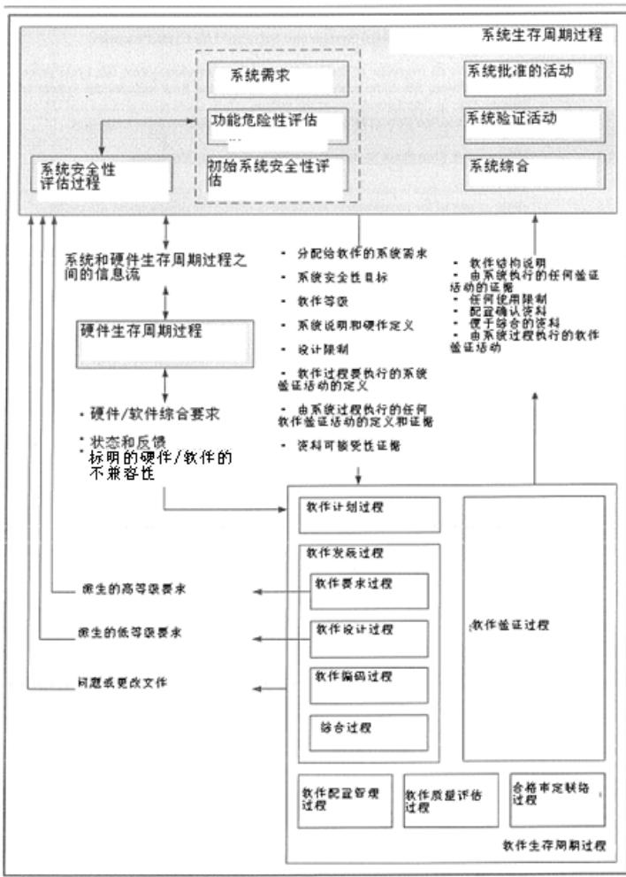
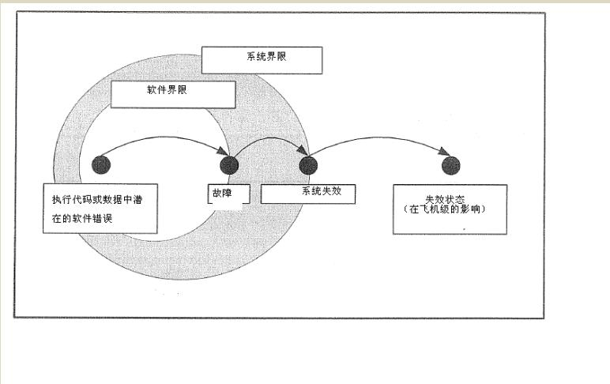
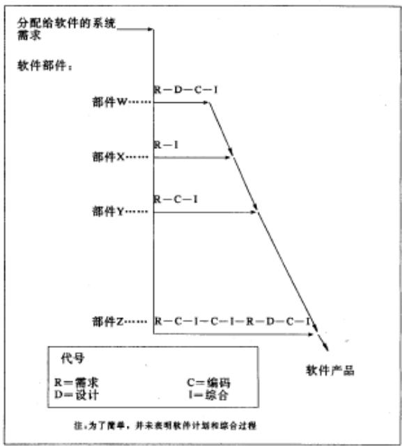
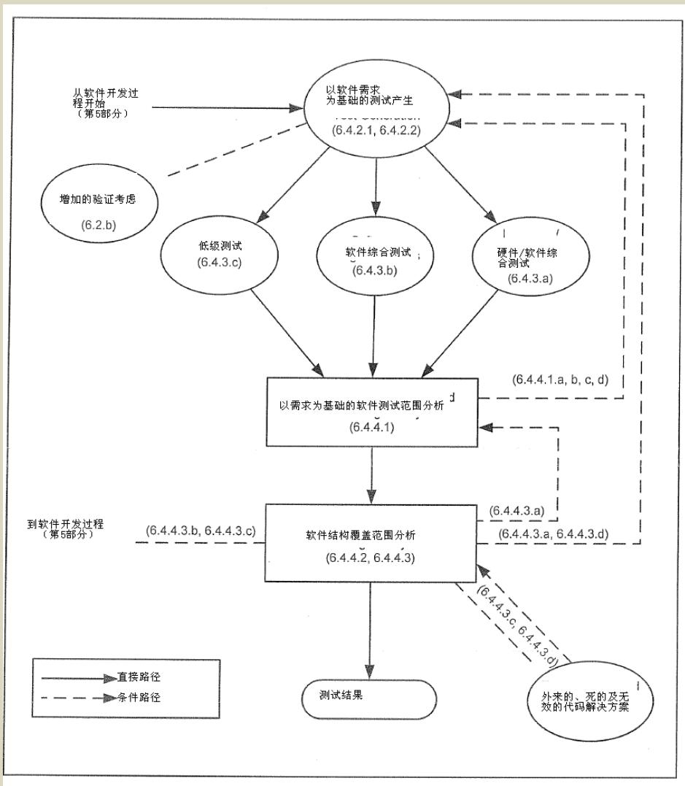

# RTCA DO-178C

# 机载系统和设备合格审定

# 中的软件考虑

二零一一年十二月十三日

# 前言

本文件是由美国航空无线电技术委员会（RTCA）205（SC-205）特别委员会和 EUROCAE 工作组 71（WG71）制定，由 RTCA “项目管理委员会”（PMC）于 2011 年 12 月 13 日批准。

RTCA，是一个非营利性的、致力于促进航空技术和航空电子系统更好地为公众服务的协会。该组织职能：作为联邦顾问委员会，就当前航空领域中的问题提出建议。RTCA的目标包括但不限于：

- 从协助政府及企业实现共同的目标和责任的角度出发综合航空系统用户和供应商的技术要求；  
- 分析航空领域在不断追求更高的安全性、舒适性和更大的运载能力过程中所遇到的技术问题并推荐解决方案。  
- 促进那些满足用户和供应商要求的相关技术应用的一致性，包括制定航空设备和航空电子系统的最低工作性能标准。  
- 协助国际民间航空组织和国际电信联盟以及其他相应的国际组织在制定相应的技术文件方面提供依据。

本组织所提出的建议经常被用作政府和私营企业决策依据，也是联邦航空局（FAA）许多技术标准指令的基础。

RTCA 不是美国政府的官方机构，除非美国政府强制执行，RTCA 的建议不能作为正式的政府官方文件。政府机关或部门对是否采用 RTCA 所提出的建议有最终的决定权。

# 1.0 引言

早在二十世纪八十年代，在航空器和发动机上所使用的机载系统和设备中，对软件的使用迅速增加，从而导致了要求有一个工业可接受的指南，以满足适航性要求。制定DO-178B《机载系统和设备合格审定中的软件考虑》就是为了满足这个要求。

现在，按经验修订的本文件，以可协调的方法和可接受的置信度，为航空界确定机载系统和设备中软件是否符合适航要求提供了指南。由于软件使用的增加、技术发展和本文件使用中获得的经验，本文件将被评审和修订。附录A说明了本文件的历史情况。

# 1.1 目的

本文件的目的是为机载系统和设备中的软件开发提供指南，以使软件在安全方面以一定的置信度完成其预定功能，并符合适航要求。这些指南是：

- 软件生存周期中各过程的目标；  
- 为达到这些目标所进行的活动；  
- 以软件生存周期资料的形式进行证据说明，表明这些目标已达到；  
- 目标、独立性、软件生存周期数据及软件级控制类别的变动；  
- 适用于某些应用的增加的考虑（例如，先前研制的软件）；  
- 术语表中提供的术语定义；

除指南之外，还提供了支持信息，帮助读者理解。

# 1.2 范围

本文件讨论了涉及到航空器、发动机、螺旋桨及辅助动力设备上所用机载系统和设备中的软件开发过程中的适航性合格审定方面的问题。在讨论这些问题中，说明系统生存周期及其与软件生存周期之间的关系有助于理解合格审定过程，但不打算对包括系统安全性评估和确认过程的系统生存周期，或合格审定过程中的各个过程有一个完整的说明。

本文件所含指南不规定或暗含合格审定过程中合格审定机构所涉及的级别。为理解合格审定机构涉及程度，申请人应参考相关合格审定机构发布的适用的条例和指南资料。

由于讨论的合格审定问题仅与软件生存周期有关，所以不讨论最终软件运行

的问题。例如，用户可更改资料的合格审定就超出了本文件的范围。

本文件不对固件进行规定。固件应分为硬件或软件，并通过各个适用的过程进行编址。本文件假定在系统定义过程中，这些功能已经分配到软件或硬件。其它文件对分配到执行硬件的功能提供研制保证指南。

注：这一点允许在系统确定和功能分配时，决定有效的执行方法和研制保障。所有方面都应同意进行分配时对该系统所作的决定

申请人的组织机构、申请人及其供应商之间的商业关系、人员资格准则超出了本文件的范围。

# 1.3 与其他文件的关系

除了适航性要求之外，可以使用不同国家的和国际的软件标准。在一些团体中，可能要求软件符合这些标准。然而，引用具体的国家或国际标准，或者建议使用这些标准作为本文件的替代或补充，均超出了本文件的讨论范围。

我们承认通过合同或其他方式，某些项目可能会被强制要求符合一些增加的标准，如，发动机或航空器制造商所要求的。此类标准可能来自制造商自己编制的或采纳的一些通用标准。在计划制定过程中应考虑此类标准，如果适用，还应在使用供应商监督时予以考虑。

# 1.4 怎样使用本文件

当使用本文件时，应注意下列几点：

a. 本文件准备供国际上的航空团体使用。为了有助于这样的使用，应尽量减少引用具体国家的条例和规章，并使用通用的术语。例如，使用的术语“合格审定机构”意指以国家的名义负责产品（例如，航空器、发动机）批准的组织或人员。在第二国或国家集团批准或参与该合格审定之处，如果承认已签订的双边协议或涉及到国家之间双方谅解的备忘录，那么可以使用本文件。  
b. 本文件承认这个指南不是由法律强制的，而是代表了航空团体的意见。它也承认，对申请人来说，用其他方法代替这里描述的方法也是可以的。鉴于这些原因，避免使用像“应”和“必须”这样的词。  
c. 如果申请人采纳了本文件作为符合性方法，则申请人应满足所有适用的目标。本文件适用于申请人及与此处所述软件生存周期过程或那些过程的输出有关的所有供应商。申请人负责对所有供应商进行监督。

d. 申请人应制定能够满足目标的一系列活动计划。本文件对达到这些目标应进行的活动做了说明。申请人可以制定计划，采用本文件所述的可替换活动，并通过合格审定机构批准。申请人还可以制定计划并执行被确定为必须的其它的活动。  
e. 申请人应在软件计划和标准中将任何其它的考虑纳入进来;  
f. 申请人应执行已计划的活动，并提供如第11章所说的证据，以证明目标已经满足。  
g. 本文件包括说明性内容，以帮助读者理解讨论的主题。例如，第 2 章提供的信息对理解系统生存周期和软件生存周期之间的联系是必需的。同样，第 3 章是对软件生存周期的说明，第 10 章合格审定的综述。  
h. 第 11 章包括通常产生的资料, 以帮助软件合格审定过程。文中资料的名称通过该名称每一个字的第一字母的大写注明, 如源代码 (Source Code)。  
i. 第12章讨论了其它的一些考虑，包括以前开发软件的使用、工具鉴定和第2章到第11章规定方法的替代方法的使用。第12章并不是对每一个合格审定都适用。  
j. 附录A规定了目标、活动、每个软件等级软件生存周期资料、以及每个软件级独立变化和控制类别的适用性。为了完全理解本指南，应对整个文件进行全面考虑。  
k. 在使用例子来表明怎样使用本指南的场合，无论图示还是从头到尾的叙述，不要把这些例子理解为是更好的方法。这些情况下，示例被认为是支持信息。

1. 项目清单并不意味着这个清单包括所有一切。  
m. 本文件使用注来提供解释性材料，强调一点或图，使人们注意不完全在上下文中的相关内容。注不包含指南。  
n. 本文件主要章节均标为 X.0。应注意，对整个章节的参考标为“X章”；对 X.0 和 X.1 之间内容的参考，标为“X.0章”。  
o. 对特殊技术，会在本文件中增加一个或更多增补并扩大指南进行说明。该增补和本文件一起使用，也可以和其它文件一起使用。如果该增补仅针对一项特殊技术，则除非使用可替换方法（件 1.4.i 条），该增补可以增加、删除、或修改目标、活动、解释性文字和本文件中的软件生存周期资料，对该项技术进行说

明（如每个增补中规定的）。申请人应负责确保增补的使用取得合适的合格审定机构的认可。作为软件计划过程的一部分，申请人应检查所有可能关联的增补，并确认那些会被使用。增补中的信息的使用方式与本文件相同。每个增补的附录A说明了本文件中相对于特定技术的目标是如何被修改的。

p. 通过执行所有计划活动并获得相应证据，所有适用的目标都满足时，说明达到了符合性要求。

# 1.5 文件综述

图1-1是文件各章及其相互关系的一个图示。

与软件开发有关的系统情况----第2章

软件生存周期-----第3章

软件生存周期过程

软件计划过程----第4章

软件开发过程----第5章

软件要求过程

软件设计过程

软件编码过程

综合过程

综合过程

软件验证过程—第6章

软件配置管理过程--第7章

软件质量保障过程—第8章

合格审定联络过程---第9章

合格审定综述一第10章

软件生存周期资料—第11章

其它考虑---第12章

图1-1 文件综述

# 2.0 与软件开发有关的系统情况

这部分讨论对理解软件生存周期过程所必需的系统生存周期过程的一些情况。系统生存周期过程也可以在其它工业文件中找到（例如，SAE ARP4754A）。

本章讨论内容为：

- 分配给软件的系统需求（见2.1）。  
- 在系统和软件生存周期过程之间、软件和硬件生存周期过程之间的信息流（2.2条）。  
- 系统安全评价过程、失效状态、软件等级定义和软件等级确定（2.3条）。  
- 系统结构考虑（2.4条）。  
- 系统生存周期过程中系统的考虑（2.5条）；  
- 软件生存周期中系统的考虑（2.6条）；

本文件中的术语“系统”仅指机载系统和设备，而不是包括操作人员、操作程序在内的更广泛的定义。

# 2.1 分配给软件的系统需求

作为系统生存周期过程的一部分，系统需求是从系统操作要求和其它与安全相关的、防护和性能要求发展而来。与安全性相关的要求是从系统安全性评估过程而来，包括功能性、完整性及可靠性要求及设计限制。

系统安全性评估过程要确定系统失效状态并对之进行分类。在系统安全性评估过程中，要定义希望避免这些失效状态的与安全性相关的要求及系统对这些失效状态的响应，以确保系统完整性。对硬件和软件规定的这些要求要清除并限制故障的影响，并可提供故障检测、故障容差、故障排除和故障避免。

系统过程负责按系统结构的决定，对系统硬件和/或软件要求进行改进和分配。

包括安全性相关要求在内，分配给软件的系统需求经过发展和改进成为软件要求，并通过软件验证过程活动的验证。这些要求及其相关验证应确定软件能够在任何可预见操作状态下，执行其预定功能。分配给软件的系统需求包括：

a. 功能和操作要求;  
b. 接口要求；  
c. 性能要求；

d. 与安全性有关的要求，包括安全策略、设计限制和设计方法，如划分、非相似性、冗余或安全性监控。当该系统是另外一个系统的一部分时，那个系统的要求和失效状态同样可以成为分配给软件的系统需求的一部分。

e. 防护要求；  
f. 维修要求；  
g. 合格审定要求，包括任何适用的合格审定机构的管理条例、出版文件等；  
h. 其它要求，对系统生存周期过程有所帮助；

  
图2-1 在系统和软件生存周期过程之间的信息流

# 2.2 系统和软件生存周期过程之间的信息流

图2-1是系统生存周期过程和软件生存周期过程之间的信息流综述。该信息流包括系统安全性情况。由于系统的安全性评估过程和系统设计过程是相互关联的，所以在这些部分描述的信息流是重叠的。

# 2.2.1 从系统过程到软件过程的信息流

作为系统分配的一部分或者在生存周期研制期间，下面资料通过系统过程成为软件生存周期过程要求：

a. 系统分配给软件的需求  
b. 系统安全性目标。  
c. 软件等级及其相关故障状态说明。  
d. 系统说明和硬件定义。  
e. 设计限制，包括外部接口、划分要求等。

f. 建议作为软件生存周期的一部分执行的系统的任何活动的详细说明。注意系统需求确认通常不能作为软件生存周期过程的一部分。系统生存周期过程负责确保建议作为软件生存周期的一部分执行的系统的任何活动。  
g. 可接受性证据; 或, 由软件过程到系统过程提供的任何资料, 其中任何活动均已由系统过程执行。

1. 由软件过程提供的派生要求，用于确定是否对系统安全性评估和系统需求有任何影响。

2. 软件过程中提出的关于分配给软件的系统需求的澄清或纠正问题。

h. 由系统生存周期过程执行的软件验证活动证据。

软件过程应对系统过程提供的任何证据（见 2.2.1.f 和 2.2.1.g）进行考虑，并作为软件验证结果（见 11.14）。

# 2.2.2 从软件过程到系统过程的信息流

利用软件生存周期过程分析分配给软件的系统需求（作为软件要求过程一部分）。如果此分析确定了系统需求中的任何不足或不正确，则软件生存周期过程应能发现此问题，并向系统过程指出，以便于解决该问题。此外，随着软件设计和执行的发展，会增加更详细的说明，所做的更改可能会影响系统安全性评估和系统需求。

为了帮助对设计发展和设计更改进行评估，软件生存周期过程应能获得系统过程资料，包括系统安全性评估过程资料在内。此资料易于系统安全评估影响和系统要求的建立。该资料有益于系统和软件过程联合执行的分析和评估。

a. 软件生存周期过程中产生的派生要求的详细说明。

b. 包括软件划分在内的软件结构说明。  
c. 如有有, 由软件生存周期过程执行的系统活动的证据。  
d. 问题或更改文档，包括系统要求中分配给软件的标明的问题以及硬件与软件之间标明的非兼容性。  
e. 对使用的任何限制；  
f. 配置标识和任何配置状态的限制；  
g. 性能、定时、精确度特性；  
h. 便于将软件综合到系统中的资料;  
i. 如果有，建议在系统验证过程中执行的软件验证活动的详细说明。

# 2.2.3 软件过程和硬件过程之间的信息流

作为系统要求分配的一部分，或者研制生存周期过程的一部分，数据会在软件生存周期过程和硬件生产周期过程之间通过。该类数据包括：

a. 包括派生要求在内，硬件/软件综合需要的所有要求，如协议定义、定时限制、硬件和软件之间的接口编址规划。  
b. 硬件和软件验证活动要求协调性示例;  
c. 标明的硬件和软件之间的不兼容性。

# 2.3 系统安全性评估过程和软件等级

本章提供了如何确定软件部分中的软件等级及如何结构考虑如何对软件等级分配产生影响的简要说明。本文件不规定如何执行这些活动；该内容是作为系统生存周期过程的一部分进行规定和执行的。

软件部分的软件等级是以软件在潜在的失效状态中的分布为基础的（如通过建立软件部分中的错误与系统失效状态及该失效状态的严重程度的相关性，由系统安全性评估过程所确定的潜在的失效状态）。

软件到软件等级的研制不是指软件失效率的分配。因此，系统安全性评估过程不能以与硬件失效率相同的方式使用基于软件等级的软件可靠性率。

只有对已划分的软件部分（见2.4.1），才能通过系统安全性评估过程指定单独的软件等级。如果不能证明软件部分之间的划分，则在指定软件等级时，会将软件部分将被视为一个单独的部分（即，所有受软件影响的最严重失效状态的相关软件等级的所有部分都做了规定）。

申请人应在合格审定机构所出指南的基础上，确定要使用的系统安全性评估过程。然后以该过程为基础，指定系统每个软件部分的软件等级，并征得合格审定机构的同意。

# 2.3.1 软件错误和失效状态之间的关系

图2-2显示的是因为软件错误导致的飞机级失效状态事件序列。软件错误可能潜在的，因而不会立刻产生故障。此模块是一个简单的、线性表现。在实际操作中，由软件错误到失效状态导致的事件序列，可能是复杂的、并且用一系列事件不易于表示，如图2-2。

发现不能以和硬件随机失效相同的方式对软件包含的错误进行量化非常重要。

  
图2-2 软件错误导致的失效状态的事件序列

在确定失效状态分类、将软件等级指定到每一个软件部分时，结构考虑（见2.4）和/或系统外部因素也被认为是相同安全性评估的一部分。

# 2.3.2 失效状态类别

为了全面的定义失效状态类别，申请人可参考相关合格审定机构发布的适用的条例和指导性材料。表2-1所列的失效状态类别是以确定用于系统安全性评估过程的咨询材料为基础的，对大型运输机有效。这些材料也被包括进来，以利于本文件的使用。

表 2-1 失效状态类别说明  

<table><tr><td>类别</td><td>说明</td></tr><tr><td>灾难性的</td><td>引起多个灾难性事故、通常会使航空器遭受损失的失效状态。</td></tr><tr><td>危险的/严重的</td><td>降低航空器的性能和机组人员克服不利操纵状态的能力的失效状态，这些不利操纵状态达到的程度是：
（1）大大降低了安全性余量或功能能力；
（2）身体疲劳或高负荷使飞行机组不能精确或完整地完成他们的任务；或
（3）对少数乘客而不是机组人员的严重的或致命伤害。</td></tr><tr><td>较重的</td><td>可能降低航空器性能和机组人员克服不利操纵状态的能力的失效状态。这些不利操纵状态达到的程度如：较大的降低安全余量或功能能力、较大地增加了机组人员的工作量或削弱机组人员工作效率的状态，或造成飞行机组人员不舒服、或造成乘客或驾驶员不舒服，可能包括伤害。</td></tr><tr><td>较轻的</td><td>不会严重降低航空器安全性及有关机组的活动在他们的能力内能很好完成的失效状态。较轻的失效状态可能包括：如稍微减少安全余量或功能能力；稍微增加机组人员的工作量，如航线飞行计划更改或乘客的某些不方便。</td></tr><tr><td>无影响的</td><td>对安全性没有影响的失效状态；如不影响航空器的工作性能或不增加机组工作量的失效状态。</td></tr></table>

# 2.3.3 软件等级定义

本文件将软件分为五个等级，等级A到E。例如，第2.3.2节中所列失效状态类别，这些软件等级和失效状态之间的关系为：

a. A 级：可能引起或导致系统功能失效进而引起航空器灾难性失效状态的异常状态的软件。这种异常状态可通过系统安全性评估过程来表明。  
b. B 级: 可能引起或导致系统功能失效进而引起航空器危险的/严重的失效状态的异常状态的软件。这种异常状态可通过系统安全性评估过程来表明。  
c. C 级: 可能引起或导致系统功能失效进而一起航空器较重失效状态的异常状态的软件。这种异常状态可通过系统安全性评估过程来表明。  
d. D 级: 可能引起或导致系统功能失效进而一起航空器较轻失效状态的异常状态的软件。这种异常状态可通过系统安全性评估过程来表明。  
e. E 级: 可能引起或导致系统功能失效的异常状态的软件。这种异常

状态可通过系统安全性评估过程来表明。它不会影响航空器的工作性能活驾驶员工作量。一旦软件由合格审定机构定位E级，本文件就不再提供进一步的指南。

# 2.3.4 软件等级确定

系统安全性评估过程首先要以能够引起软件异常状态的失效状态为基础，确定特定系统中的软件有关的软件等级。并对功能丢失和故障的影响进行分析。当确定失效状态类别，决定软件等级时，应对如不利环境条件及结构策略（如2.4节中所述）等外部因素予以考虑。

注（1）：在进一步的开发过程中，申请人可能希望考虑增加的功能能力以及可能导致更严重的失效状态类别和更高软件等级的分配给软件的系统需求中潜在的更改。可能希望开发的软件能达到高于原申请人在系统安全性评估过程中确定的软件等级，因为为了证实较高的软件等级的应用，软件生存周期资料的后续开发可能是困难的。

注(2):对由运行条例管理的机载系统和设备,只要不影响航空器的适航性,如事故飞行数据记录仪,软件等级要与预定功能相匹配。在某些场合,可在设备最低性能标准中规定软件等级。

如果软件部件的异常状态引起多个失效状态，那么那个部件的最严重的失效状态类别决定了那个软件部件的软件等级，包括组合的失效状态。

# 2.4 结构考虑

本指南提供了几种结构方法，它们可限制错误的影响或利于检测错误和对某些错误提供可接受的系统响应。这些结构技术只是系统设计过程中确定的典型结构，不要将之理解为是更好的或要求的方法。

并行实施是用多个软件部件来实现一个系统功能。这样，任何一个部件的异常状态都会产生失效状态。对并行实施，所有软件部件应具有与那个系统功能最严重的失效状态相应的软件等级。

在实施中，如果需要用两个或以上被分配的软件部件的异常状态来引起失效状态，则系统应在指定这些软件部件的软件等级时，在安全性评估过程中予以考虑。

系统安全性评估过程应确定软件部件之间相对于功能（即，高级别要求）和设计（例如，通用设计元件、语言和工具）有足够的独立性。

如果不能证明软件部件之间的划分和独立性，则在指定软件等级时（即，所有的部件都被指定为可能导致最严重失效状态的软件等级），应将软件部件视为单个的软件部件。

# 2.4.1 划分

划分是在功能上独立的软件部件之间提供隔离的技术，以确定和/或隔离故障，并潜在地减少软件验证过程的工作量。通过对每一个部件（即，系统的每个硬件平台上只能执行一个软件部件）划分专门的硬件资源，实现软件部件之间的划分。可替换方法是，指定划分措施，允许多个软件部件在同一个硬件平台上运行。无论使用什么方法，应注意以下几点以确保软件部件的划分：

a. 被划分软件部件不允许对其它软件部件代码、输入/输出 (I/O), 或数据存储区域造成污染。  
b. 被划分软件部件只有在其计划执行的时段，才能使用共享处理器资源。  
c. 被划分软件部件专用硬件的故障不应对其它被划分软件部件造成不利影响。  
d. 任何软件得划分等级要与划分的软件部件的等级相同或其最高等级相对应。  
e. 任何硬件的划分应由相同安全性评估过程进行评估，以确保不会对安全性造成不利影响。

软件生存周期过程要表明划分的设计考虑，包括划分部件之间允许的内部连接的程度和范围，无论保护是通过硬件还是通过软件和硬件的组合来实现的。

# 2.4.2 多版本非相似软件

多版本非相似软件是系统设计技术，它涉及到产生两个或更多的软件部件。这些部件以可在部件间避免某些共同错误源的方式提供同样的功能。多版本非相似软件也称为多版本软件、多版本独立软件、非相似软件、N版本程序设计或软件多样性。

在非相似性引入到开发之前，完成的或进行的软件生存周期过程保留了潜在的错误源。系统需求规定了执行多版本非相似软件提供的硬件配置。

非相似的程度进而防护的程度通常是不可计量的。系统功能丢失的可能性将增加到这样的程度，即，通过比较器差别门限，与非相似软件版本相关的安全性

监控能检到实际的错误。所以，通常使用非相似软件版本作为某等级的软件在其验证过程目标（如第6章规定的那样）被满足之后提供附加保护的手段。

对非相似软件验证方法，如果它能表明系统功能的最终潜在失效通过系统安全性评估过程能确定是否可以接受，那么它可以减少验证单一版本软件时所用的那些方法。

多版本非相似软件的验证在 12.3.2 条中讨论。

# 2.4.3 安全性监控

安全性监控是通过直接检测可能引起失效状态的功能失效而防止具体失效状态的一种手段。监控功能可通过硬件、软件或硬件和软件的组合来实现。

通过监控技术的使用，所监控的功能的软件等级可以降低到与其相关的系统功能的失效相应等级。为了允许这个等级的降低，要确定监控器三个重要的属性：

a. 软件等级：安全性监控软件的软件等级要与被监控功能的最严重的失效状态类别相对应。  
b. 系统故障范围：监控器的系统故障范围的评估要确保监控器的设计和实施能使想要检测的故障所有必要的条件下得以检测。  
c. 功能和监控器的独立性：监控器和防护措施不会由于引起这种危害的同一失效状态而不予动作。

# 2.5 系统生存周期过程中的软件考虑

本章对那些与软件相关的问题进行了综述（不需要相互排除），如果适用，系统生存周期过程应对其予以考虑：

a. 参数数据项；  
b. 用户可更改软件：  
c. 商用成品软件（COTS）；  
e. 外场可加载软件；  
f. 系统验证中的软件考虑

# 2.5.1 参数数据项

软件由可执行目标代码(EOC)和/或数据组成，可以包括一个或更多配置项。不需要更改EOC，数据表能够影响软件活动。数据表作为单独配置项管理时称为参数数据项。即，讨论参数数据项时和EOC时，参数数据项不是EOC的一部分。

参数数据项包括一个单独的部件结构，其中每一个部件都指定一个单独的值。每个部件都具有以下属性：类型、范围、或允许的值。

参数数据项包括配置表盒数据库，但不包括航空数据，因为该数据超出本文件范围。参数数据项可能包括下面数据，该数据能够：

a. 通过EOC执行的影响通道；  
b. 激活软件部件及功能或使其无效;  
c. 使软件计算与系统配置适配;  
d. 作为计算数据使用；  
e. 确定时间和存储器划分份额;

f. 为软件部件提供起始值；

根据参数数据项在机载系统中的使用，应考虑下面几点：

- 用户可更改软件指南；  
- 可选择选项软件指南。当参数数据项功能激活或失效时，失效代码指南也应考虑；  
- 外场可加载软件指南。对出错的参数数据项以及 EOC 和参数数据项之间的非兼容性应特别考虑。

参数数据项的软件等级应和使用它的软件部件的等级相同。

关于参数数据项验证的更多的信息，请参考6.6章。

# 2.5.2 用户可更改软件

如果系统需求中提供了用户更改，那么用户可在更改限制范围内修改软件，而无需经过合格审定机构的评审。不可更改部件指的是不打算由用户更改的部件。

用户更改的潜在影响由系统安全性评估过程确定，并用于开发软件需求和软件验证过程的活动，然后，软件验证过程激活。在5.2.3条中，进一步讨论用户可更改软件的设计。影响不可更改的软件、它的保护或可更改软件界限的更改是一种软件更改，并在12.1.1条中讨论。

用户可更改软件指南包括：

a. 用户可更改软件不应影响安全性、可操作性能、飞行机组人员工作负担、任何不可更改软件部件或使用的任何软件防护机制。除非能够确定这一点，否则软件不会归类为用户可更改软件。

b. 如果系统需求中提供了用户更改，那么用户可在更改限制范围内修改软件，而无需经过合格审定机构的评审。  
c. 系统需求将规定防止用户更改影响到系统安全性而没有正确实施更改的方法。为用户更改提供保护的软件将具有与防止更改部件出错的功能软件一样的等级。  
d. 如果系统需求不包括更改的条款，除非证明更改符合本文件，否则软件不得由用户更改。  
e. 在用户更改时，用户要对用户可更改软件的所有方面负责。例如软件配置管理、软件质量保证和软件验证。  
f. 申请人应提供这些必需信息，即，允许用户不将飞机安全性包括在内的方式进行软件管理。

# 2.5.3 COTS软件（商用成品软件）

机载系统或设备中包括的COTS软件应满足本文件目标。

如果COTS软件生存周期资料中存在缺项，则应在该资料中增加这些缺陷以满足本文件要求。第12.1.4章“开发基线升级”中以及第12.3.4章中“产品使用历史”中的指南，可能与本示例有关。

# 2.5.4 可选择选项软件

一些机载系统和设备可包括选择性功能，它是由软件编程来选项的，而不是通过硬件连接器引脚来选择。可选择选项的软件功能用于在目标机中选择特定的配置。对非激活码的指南见 4.2.h,5.2.4 和 6.4.4.3.d.2。

当包括编程选项的软件时，要提供手段确保不会为按照环境中的目标机偶然选择到涉及未经批准的配置。

# 2.5.5 外场可加载软件

外场可加载机载软件是无需把系统或设备从它安装位置上拆下来即可装入的软件。与软件加载功能相关的有关安全性的需求是系统需求的一部分。如果软件加载功能可能偶然会引起系统失效状态，那么对于软件加载功能，与安全性有关的要求要在系统需求中规定。

与外场可加载软件有关的系统安全性考虑包括：

- 不可靠的或部分加载的软件的检测；

- 加载不合适软件的影响的确定；  
- 硬件/软件兼容性；  
- 软件/软件兼容性；  
- 航空器/软件兼容性；  
- 外场加载功能的偶然使能；  
- 软件配置标识显示的丢失或不可靠；

对外场可加载软件的指南包括：

a. 除非由系统安全性评估过程证明是正确的，否则部分或不可靠软件加载的检测机制要有与软件加载功能有关的最严重的失效状态或软件等级一样的失效状态或软件等级。  
b. 如果探测到损坏的或不合适的软件加载，系统就会恢复到缺省模式或安全状态，则系统中每个被划分的部件应规定有恢复到该模式并在该模式下操作的与安全性相关的要求。  
c. 软件加载功能，包括支持系统和过程，要包括检测不正确软件和/硬件和/或航空器组件的手段，并对功能的失效状态提供合适的保护。如果软件由多个配置项目组成，应确保其兼容性。  
d. 如果软件是确保航空器符合合格审定配置的机载显示方法的一部分, 那么该软件要么按最高级软件开发并加载, 要么系统安全性评估过程要能够说明软件配置标识的不断检查的完整性。

# 2.5.6 系统验证中的软件考虑

系统验证的指南超出了本文件的范围。然而，软件生存周期过程可帮助系统验证过程并与系统验证过程相互作用，并满足一些系统过程目标。与系统功能性相关的软件设计细节也可用于帮助系统验证。

# 2.6 软件生存周期过程中的系统考虑

可信度取自系统生存周期过程，用于满足、或部分满足本文件规定的软件目标。在这种情况下，应表明寻找可信度所进行的系统活动满足本文件中适用的目标，并提供计划活动完成的证据，及其输出（规定为软件生存周期资料的一部分）。

# 3.0 软件生存周期

本章讨论了软件生存周期过程、软件生存周期定义以及软件生存周期过程之

间的转换准则。本文件并未描述一个特定的软件生存周期及其间的相互关系。过程的分离并不打算表明完成他们的组织结构。对每一个软件产品，要构造包括这些过程的软件生存周期。

# 3.1 软件生存周期过程

软件生存周期过程是：

a. 软件计划过程：定义并协调一个项目的软件开发和综合过程的活动。第 4 章描述了软件计划过程。  
b. 产生软件产品的软件开发过程。这些过程是软件需求过程、软件设计过程、软件编码过程和综合过程。第 5 章描述了软件开发过程。  
c. 综合过程：保证软件生存周期及其输出正确、受控和可信。综合过程是软件验证过程、软件配置管理过程、软件质量保证过程和合格审定联络过程。在整个软件生存周期中，了解同软件开发过程同时完成的综合过程是重要的。第 6-9 章描述了综合过程。

# 3.2 软件生存周期定义

通过选择每一个过程的活动、规定活动的顺序和分配给活动的责任，一个项目可以定义一个或多个软件生存周期。

对每一个具体项目，由项目的特性来确定这些过程的顺序，如系统功能性和复杂性，软件大小和复杂性，需求稳定性，以前开发结果的使用，开发策略和硬件可用性。整个软件开发过程的一般顺序是需求、设计、编码和综合。

图3-1对具有不同软件生存周期的单个软件的几个部件的软件开发过程的顺序进行了说明。通过开发软件需求，部件W实施一系列系统需求，使用那些需求来确定软件设计，将设计转化为源代码，并且把软件部件综合到硬件中去。部件X是对在已经合格审定的产品中使用的以前开发的软件的使用说明。部件Y说明了利用能从软件需求直接编码的简单的、划分的功能。部件Z说明了使用原型策略。通常，原型的目标是更好理解软件需求并减少开发和技术的冒险。用原始需求作为开发原型机的基础。这个原型机在代表被开发系统的预定的使用环境中进行评估。评估结果被用来改进需求。

软件生存周期过程可反复迭代，即进入和再进入。迭代的时机和程度随系统功能、复杂性、需求开发、硬件可用性、对以前过程的反馈和项目的其他特征的

进一步开发而变化。

选择软件生存周期的各个不同部分与进一步的综合过程和软件验证过程的活动紧密连在一起。

  
图3-1 使用四种不同开发顺序的软件项目的例子

# 3.3 过程之间的转换准则

使用转换准则来确定一个过程是否可以进入或再进入。每一个软件生存周期过程完成输入到产生输出的活动。一个过程可对其他过程产生反馈，并从其他过程接受反馈。反馈的定义包括如何通过接收过程识别、控制和处理信息。一个反馈定义的例子是问题报告。

转换准则将取决于软件开发过程和综合过程的预定顺序，并且可能会受到软件等级的影响。可供选择的转换准则的例子是：已完成的软件验证过程评审；输入是一个被标识的配置项；完成了输入的可追踪分析。

如果一个过程对部分输入起作用，那么要检查到过程的这些输入，以确保满足转换准则。同样，要检查到过程的后续输入，以确定以前的软件开发输出和软件验证过程仍然有效。

# 4.0 软件计划过程

本章讨论软件计划过程的目标和活动。这个过程产生指导软件开发过程和综合过程的软件计划和标准。附件A的表A-1是各级软件的软件计划过程的目标和输出的总结。

# 4.1 软件计划过程目标

软件计划过程的目标是定义产生满足系统需求并提供与软件等级相一致的置信度水平的软件方法。软件计划过程的目标是：

a. 定义表明系统需求和软件等级的软件生存周期的软件开发过程和综合过程的活动（4.2条）  
b. 确定软件生存周期，包括过程之间的内部关系、它们的顺序、反馈机理和转换准则（第3章）。  
c. 选择软件生存周期环境，包括用于每一个软件生存周期过程活动的方法和工具（4.4条）。  
d. 其它考虑。如果必要，可提出如第 12 章讨论的那些。  
e. 定义与被生产软件的系统安全目标相符的软件开发标准 4.5 条)。  
f. 编制了符合 4.3 条和第 11 章的软件计划。  
g. 协调软件计划的开发和修订。

# 4.2 软件计划过程活动

有效的计划是生产的软件满足本文件指南的决定因素。软件计划过程的活动包括：

a. 软件计划应予以开发，以便为完成软件生存周期过程的人员提供指导。也可参见 9.1 条。  
b. 要明确或选择用于项目的软件开发标准。  
c. 要选择防止错误的方法和工具，并在软件开发过程中提供缺陷探测。  
d. 软件计划过程将在软件开发和综合过程之间提供协调，以保证在软件计划中的策略之间保持一致。  
e. 要规定随项目进展修订软件计划的方法。  
f. 在系统中使用多版本非相似软件时, 软件计划过程要选择满足系统安全性目标所必需的方法和工具, 以达到非相似性。  
g. 对将被完成的软件计划过程，软件计划和软件开发标准要在更改控制之下并完成对它们的评审（4.6条）。  
h. 如果准备使用非激活码，软件计划过程将描述如何定义和验证失效机制和失效代码满足系统安全性要求。

i. 如果准备使用用户可更改软件，在软件计划和标准中将规定证实5.2.3条指南的过程、工具、环境和数据项。

j. 如果使用参数数据项，则应规定以下几点：

1）参数数据项的使用方式；  
2）参数数据项的软件等级；  
3）开发、验证、更改参数数据项及任何相关工具鉴定的过程；  
4）软件加载控制盒兼容性。  
k. 软件计划过程应规定任何适用的增加的考虑。

1. 如果软件开发活动由供应商执行，则计划中应规定供应商监督。

如果满足特定过程活动的转换准则，那么其它软件生存周期过程可在软件计划过程完成之前开始。

# 4.3 软件计划

软件计划应确定满足本文件目标的方法。它们规定了将完成哪些活动的组织。软件计划是：

- 软件合格审定计划（11.1 条）：为征得合格审定机构对建议的开发方法的同意而与其进行联络的主要手段，并且定义了符合本文件的方法  
- 软件开发计划（11.2条）：定义了软件生存周期和软件开发环境；及满足软件开发过程目标要求的方法；  
- 软件验证计划（11.3条）：定义了满足软件验证过程目标的方法；  
- 软件配置管理计划（11.4条）：定义了满足软件配置管理过程目标的方法；  
- 软件质量保证计划（11.5条）：定义了满足软件质量保证过程目标的方法；软件计划活动包括：

a. 软件计划要符合本文件；  
b. 通过下面几点，软件计划要定义软件生存周期过程之间的转换准则；

(1) 过程的输入, 包括从其它过程的反馈;  
(2) 可能需要的对这些输入起作用的任何综合过程的活动;  
(3) 工具、方法、计划和规程的可用性。

c. 在合格审定的产品上使用之前，软件计划要表明用于实施软件更改的规程。这种更改可能是由于其它过程反馈的结果，且可能引起软件计划的更改。

# 4.4 软件生存周期环境计划

对软件生存周期环境计划定义了用于开发、验证、控制和编制软件生存周期资料（第11章）和软件产品所使用的方法、工具、规程、程序设计语言和硬件。选择的软件环境如何对机载软件产生有利的影响的例子包括强化标准、检测错误、实施错误防护和故障容错方法。软件生存周期环境是一个可能引起失效状态的潜在的错误源。这个软件生存周期环境的构成可能受在系统安全性评估过程中确定的与安全性有关的要求的影响，例如非相似的使用，冗余部件。

错误防止方法的目标是在软件开发过程期间避免可能引起失效状态的错误。基本原则是选择需求开发和限制引入错误机会的设计方法、工具和程序设计语言以及保证能检测到引入错误的验证方法。故障容错方法的目标要包括软件设计或源代码中的安全特性，以保证软件正确地响应输入数据错误，并防止输出和控制错误。用系统需求和系统安全性评估过程确定对错误防护或故障容错方法的要求。

上述考虑可能影响到：

a. 软件需求过程和软件设计过程中所用的方法和表示法；  
b. 软件编码过程使用的程序设计语言和方法;  
c. 软件开发环境工具;  
d. 软件验证和软件配置管理工具;  
e. 工具鉴定要求（12.2条）

# 4.4.1 软件开发环境

软件开发环境是生产高质量软件的主要因素。软件开发环境可以几种方式对软件的生产产生不利影响。例如，编译程序可通过产生一个错误输出而引入错误。或者连接器不能暴露出表现出来的存储器分配错误。选择软件开发环境方法和工具的指南包括：

a. 在软件计划过程周期间，选择的软件开发环境应降低所要开发软件的潜在风险。  
b. 选择使用工具或工具的组合以及软件开发环境的部件，以便由另一个部件检测到的某个部件引入的错误能达到必要的置信度水平。当两个部件同时使用时，能产生一个可接受的环境。  
c. 定义的软件验证过程活动或软件开发标准，包括对软件等级的考虑，要

能减少与软件开发环境有关的潜在的错误。

d. 对组合工具的使用，如果寻求合格审定置信度，那么工具操作的顺序要在合适的计划中规定。  
e. 如果在项目使用中选择了软件开发工具的可选择特性，那么选项的效果要加以检查并在有关计划中规定。编译程序和自动编码产生器特别重要。  
f. 应对已知的工具问题和限制进行评估，应对那些可能对机载软件造成有害影响的问题进行说明。

# 4.4.2 语言和编译程序考虑

在成功地完成软件产品的验证时，要考虑编译程序对那个产品的可接受性。为了确认这一点，软件验证过程活动要考虑编程语言和编译程序的特殊特性。当选择编程语言和计划验证时，软件计划过程要考虑这些特性。指南包括：

a. 一些编译程序具有优化目标代码性能的特征。如果测试用例给出的覆盖范围与软件等级一致，那么不需要验证优化的正确性，否则这些特征对结构覆盖范围分析的影响要按6.4.4.2条的指南来确定。  
b. 为了实施某些特征，对一些语言的编译程序可能产生不能直接追踪到源代码的目标代码，例如初始化、机内错误检测或异常处理（6.4.4.2条b项）。软件计划过程要提供检测这个目标代码的方法，以保证验证的覆盖范围并在有关计划中定义了这些方法。  
c. 如果引入了一个新的编译程序、连接编辑程序或加载程序版本或者在软件生存周期期间更改了编译程序的选项, 那么以前的测试和覆盖范围分析可能不再是有效的。验证计划要提供与第 6 章和 12.1.3 条的指南相符的重新验证的方法。

注：尽管当所有的验证目标都满足时，编译程序被认为是可接受的，但是仅认为那个产品可以接受该编译程序而不包括其它产品。

# 4.4.3 软件测试环境

软件测试环境计划是定义将用于测试综合过程输出的方法、工具、规程和硬件。测试可使用目标计算机、目标计算机的模拟器或宿主机仿真器来完成。指南包括：

a. 仿真器或模拟器可能需要按 12.2 条规定进行鉴定。  
b. 要考虑在目标机和模拟器或仿真器之间的差异以及这些差异对检测错误

和验证功能的能力的影响。那些错误的检测要由其它的软件验证过程活动提供并在软件验证计划中规定。

# 4.5 软件开发标准

软件开发标准为软件开发过程定义规则和限制。软件开发标准包括软件需求标准、软件设计标准和软件编码标准。软件验证过程使用这些标准作为评估过程实际输出与预定输出符合性的基础。对软件开发标准的指南包括：

a. 软件开发标准要符合第 11 章;  
b. 软件开发标准要保证某给定的软件产品或相关的一套产品的软件部件的设计和实施是一致的；  
c. 软件开发标准不允许使用产生不能验证或与安全性有关的需求不相符的输出的结构或方法。

注 1: 在开发标准中, 要考虑以前的经验。要包括在开发、设计和编码方法中的限制和规则, 以控制复杂性。要考虑保护程序的方法以改进耐用性。

注2：如果通过系统需求分配给软件，则可使用在存储数据中进行的错误探测和控制、硬件状态及配置的更新和监控，减少单个的事件麻烦。

# 4.6 软件计划过程的评审

要进行软件计划过程的评审，以确保软件计划和软件开发标准符合本文件的指南，并提供执行它们的方法。指南包括：

a. 选择的方法将能够满足本文件的目标;  
b. 软件生存周期过程一直适用;  
c. 每一过程产生其输出能追溯到它们的活动和输入的证据，并表明活动、环境和所用方法的独立程度；  
d. 软件计划过程的输出是一致的，且符合第 11 章要求。

# 5.0 软件开发过程

本章讨论软件开发过程的目标和活动。应用的软件开发过程由软件计划过程（第4章）和软件开发计划（第11.2章）来定义。附件A的表A-2是按软件等级划分的软件开发过程的目标和输出的总结。软件开发过程是：

- 软件需求过程；  
- 软件设计过程；

- 软件编码过程；  
- 综合过程

软件开发过程产生一个或多个等级的软件需求。高级需求直接通过系统需求和系统结构的分析来产生。通常，这些高级需求在软件设计过程中进一步开发，这样产生一个或多个成功的较低级需求。然而，如果源代码直接从高级需求产生，高级需求也要考虑低级需求，并且对低级需求的指南也适用。

注：申请人可能会被要求对软件开发过程中产生的单个的需求等级进行判定。

软件结构的开发涉及到关于该软件结构所做的决策。在软件设计过程期间，要定义软件结构并开发低级需求。低级需求是不用进一步信息而直接实现源代码的软件需求。

每一个软件开发过程都可能产生派生需求。可能确定为派生需求的一些示例：

- 为选择的目标主计算机而开发中断处理软件的要求；  
- 未通过系统需求分配给软件时，周期性监控器重复率的规定；  
- 使用固定点计算时，刻度限制的增加。

高级需求可包括派生需求，低级需求也可包括派生需求。为了确定派生需求对于安全性有关的需求的影响，系统过程包括系统安全性评估过程在内都可应用所有派生需求。

# 5.1 软件需求过程

软件需求过程使用系统生存周期过程的输出来开发软件高级需求。这些高级需求包括功能、性能、接口和与安全性有关的需求。

# 5.1.1 软件需求过程目标

软件需求过程目标是：

a. 开发高级需求；  
b. 定义派生的高级需求，并提供给系统过程，包括系统安全性评估过程；

# 5.1.2 软件需求过程活动

软件需求过程的输入包括来自系统生存周期过程的系统需求、硬件接口和系统结构（在需求中并未包括）以及来自软件计划过程的软件开发计划和软件需求标准。当计划的转换准则已被满足时，这些输入用于开发软件高级需求。

这个过程的主要输出是软件需求资料（11.9条）。

当它的目标和与它有关的综合过程的目标被满足时，软件需求过程就完成了。对这个过程的指南包括：

a. 对不明确的、不一致的和未定义的状态，要分析分配给软件的系统功能和接口要求；  
b. 要报告软件需求过程检测到的不合适的或不正确的输入，并反馈到输入的源过程以澄清或纠正；  
c. 要在高级需求中规定分配给软件的每一个系统需求；  
d. 表明分配给软件的用来排除系统危害性的系统需求的高级需求要加以定义；  
e. 高级需求要符合软件需求标准，并且是可验证的和一致的；

f. 若适用，高级需求要用容差的定量术语来说明；

g. 除了规定的和合理的设计限制外，高级需求不应详细描述设计和验证细节；  
h. 派生需求及其存在理由要加以定义;

i. 要为系统安全性评估过程提供派生的高级需求；  
j. 如果参数数据项已被计划，高等级的需求应对软件如何使用任何参数数据项进行描述；高等级的需求同样应该规定其结构、每个数据元素的属性，如果适用，应包括每个元素的值。参数数据项元素的值应和参数数据项及其数据元素的属性一致。

# 5.2 软件设计过程

在软件设计过程中，通过一次或多次迭代，逐步完善出软件高级需求，以开发软件结构和能用于实现源代码的低级需求。

# 5.2.1 软件设计过程的目标

软件设计过程目标是：

a. 根据高级需求开发软件结构和低级需求;  
b. 要为系统过程, 包括安全性评估过程在内, 定义并提供派生的低级需求。

# 5.2.2 软件设计过程活动

软件设计过程输入是软件需求资料、软件开发计划和软件设计标准。当预定的转换准则已被满足时，在设计过程中使用高级需求来开发软件结构和低级需求。

这可能涉及到一个或多个较低级的需求。

这个过程的主要输出是包括软件结构和低级需求的设计说明（11.10条）。

当其目标和与其有关的综合过程的目标被满足时，软件设计过程就完成了。对这个过程的指南包括：

a. 在软件设计过程期间，开发的低级需求和软件结构要符合软件设计标准，并且是可追踪、可验证和一致的。  
b. 要定义和分析派生的需求，以保证不损害高级需求。  
c. 软件设计过程的活动能引入可能的失效模式到软件中或相反地，干扰其他的软件。在软件设计中采用划分或其他结构方法对软件的某些部件可改变软件等级的分配。在这些情况下，将定义附加资料作为派生需求，并把这些资料提供给系统安全性评估过程。  
d. 要定义软件部件之间的数据流和控制流形式的接口，应符合部件之间的接口。  
e. 当规定与安全性有关的需求时，要监控控制流和数据流，如看门狗定时器、合理的检查和交叉通道比较。  
f. 对失效状态的响应要与安全性有关的要求一致。  
g. 在软件设计过程中检测到的不合适的或不正确的输入将提供给系统的生存周期过程、软件需求过程或软件测试过程，作为澄清或纠正的反馈。

注：软件工程目前的状态不允许在复杂性和达到安全性目标之间进行定量对比。当不能提供目标指南时，软件设计过程要避免引入复杂性。因为当软件复杂性增加时，验证设计和表明软件的安全性目标得以满足均是困难的。

# 5.2.3 用户可更改软件的设计

用户可更改软件设计为由用户更改。更改的部件是准备由用户更改的软件的那一部件，而非更改部件是不准备由用户更改的那个部件。用户可更改软件在复杂程度上是可以变化的。例如单个的存储器位，用来选择两设备选项中之一的单个存储位、信息表或能够编程、编译和连接的存储区域。任何等级的软件能包括一个可更改的部件。

对设计用户可更改软件的指南包括：

a. 非更改部件要预以保护，以防止非更改部件在安全运行中受到更改部件

的干扰。这种保护可用硬件、软件、用于更改的工具或三者的组合来实现。如果由软件提供保护，则该软件的设计和验证和非更改软件的软件等级相同。如果是工具提供保护，则应按照 12.2 章中的规定进行分类和鉴定。

b. 要表明申请人提供的方法是更改可更改部分的唯一方法。

# 5.2.4 失效代码设计

相同或需求可能被设计为包括一些配置，但是并不是每一个应用中都要使用这些配置。这样就会使失效代码不能执行，如未选择功能或未使用的库函数、或不使用的数据。失效代码与死码不同。对于失效代码的指南包括：

a. 应设计并执行一种机制，以确保实效功能或部件不会对有效功能或部件造成不利影响；  
b. 应能提供证据，表明失效代码在未预定使用的环境中已被禁止。因为异常系统状态，失效代码的偶然执行与有效代码的偶然执行相同。  
c. 失效代码的开发，如有效代码的开发一样，应符合本文件的目标。

# 5.3 软件编码过程

在软件编码过程中，由软件结构和低级需求实现源代码。

注：本文件的目的是，编辑、链接和加载与综合过程相关（见5.4条）。

# 5.3.1 软件编码过程目标

软件编码过程的目标是：

a.源代码是从低级需求开发的。

# 5.3.2 软件编码过程活动

软件编码过程的输入是来自软件设计过程的低级需求和软件结构、软件开发计划和软件编码标准。当预定的转换准则被满足时，软件编码过程可以进入或重新进入。由这个过程产生的源代码取决于软件结构和低级需求。

这个过程的主要输出是源代码（11.11条）。

当其目标和与其有关的综合过程的目标被满足时，软件编码过程也就完成了。对这个过程的指南包括：

a. 源代码要实现低级需求并符合软件结构;  
b. 源代码要符合软件编码标准;  
c. 在软件编码过程中检测到的不合适的或不正确的输入要提供给软件需求

过程、软件设计过程、和/或软件计划过程，以作为澄清或纠正的反馈。

d. 自动编码产生器应的使用应符合计划过程中规定的限制。

# 5.4 综合过程

目标计算机和来自软件编码过程的源代码被用来在综合过程中编辑、连接和加载数据（件11.16条），以开发综合系统或设备。

# 5.4.1 综合过程目标

综合过程目标是：

a. 产生并加载可执行目标代码及其相关参数数据项文件（如果有）用于软件/硬件综合的目标硬件中。

# 5.4.2 综合过程活动

综合过程由软件综合和硬件/软件综合组成。

当预定的转换准则被满足时，综合过程可以进入或重新进入。综合过程的输入是来自软件设计过程的软件结构和来自软件编码过程的源代码和目标代码。

综合过程的输出是可执行目标代码；执行代码（见11.12条）；参数数据项文件（见11.12条）；及连接和加载数据。当其目标和与之有关的综合过程的目标被满足时，就完成了综合过程。这个过程的指南包括：

a. 目标代码和可执行代码要从源代码和连接、链接及加载数据产生;  
b. 软件综合应在主计算机、目标计算机仿真器、或目标计算机上完成;  
c. 把软件加载到硬件/软件综合的目标计算机中;  
d. 在综合过程中检测到的不合格的或不正确的输入将提供给软件需求过程、软件设计过程、软件编码过程或软件计划过程，以作为澄清或纠正的反馈。  
e. 用于合格审定产品执行需求或结构更改，或在软件验证过程活动中发现的必需进行的更改的软件上不能使用补丁。这些补丁可以用于有限制的、事件-事件为基础的情况，例如解决软件开发环境中已知的缺陷(如已知的编辑器问题)。

f. 如果使用补丁，则确认以下几点：

1. 确认软件配置管理过程能够有效跟踪补丁；  
2. 进行分析，提供证据证明补丁软件满足所有应用目标；  
3. 证明使用补丁的“软件实现摘要”的正确性。

# 5.5 软件开发过程的可跟踪性

软件开发过程可跟追踪性指南包括：

a. 开发追踪资料，表明指定给软件的系统需求与高级需求之间的双向联系。此追踪数据的目的是：

1. 能够验证实施分配给软件的系统需求的完整性；  
2. 对那些不能直接追踪到系统需求的派生的高级需求，要给出明确性。  
b. 开发追踪资料，表明高级需求与低级需求之间的双向联系。此追踪资料的目的是：

1. 能够验证实施高级需求的完整性；  
2. 对那些不能直接追踪到系统需求和软件设计过程期间确定的结构设计的派生的高级需求，要给出明确性。  
c. 开发追踪资料，表明低级需求和源代码之间的双向联系。此追踪资料的目的是：

1. 能够验证源代码不会执行未证明的功能；  
2. 能够验证实施低级需求的完整性。

# 6.0 软件验证过程

这一章讨论软件验证过程的目标和活动。验证是软件计划过程、软件开发过程和软件验证过程三者结果的技术评估。在软件计划过程（第4章）和软件验证计划（11.3条）中定义了适用的验证过程。

验证不是简单的测试。通常，测试不能表明没有错误。所以，当被讨论的软件验证过程目标是评审、分析和测试的组合时，下列各条采用术语“验证”代替“测试”。

附件A的表A-3到A-7包括了各级软件验证过程的目标和输出的总结。

注：对较低的软件等级，较少强调：

- 源代码的验证；  
- 低级需求的验证；  
- 软件结构的验证；  
- 测试覆盖范围；  
- 验证规程的控制；  
- 软件验证过程活动的独立性；

- 重复的软件验证过程活动，即多重验证活动。每一个活动都可能检测到同一级别的错误。  
- 鲁棒测试。  
- 对错误防止或检测有间接影响的验证活动,例如软件开发标准的符合性验证。

# 6.1 软件验证目标

软件验证过程的目标是检测和报告在软件开发过程期间已经引入的错误。消除这些错误是软件开发过程的一种活动。软件验证过程将对以下几方面进行验证：

a. 分配给软件的系统需求已开发到满足那些系统需求的软件高级需求。  
b. 高级需求已开发到满足高级需求的软件结构和低级需求。如果在高级需求和低级需求之间开发了一个或多个等级的软件需求，那么要开发相邻等级的需求以使每一个相邻的更低级需求满足其更高级需求。如果直接从高级需求产生代码，那么该目标不适用。  
c. 软件结构和低级需求已开发到满足低级需求和软件结构的源代码。  
d. 可执行目标代码满足软件需求（即，预定的功能），并提供缺乏未预定功能置信度。  
e. 相对于软件需求，可执行目标代码是稳固的，因而能够对异常输入和状态做出正确响应。  
f. 对软件等级，用来满足这些目标的方法在技术上应是正确的且完整的。

# 6.2 软件验证过程活动概述

通过评审、分析、开发测试用例和规程且进一步执行那些测试规程的组合，来满足软件验证过程的目标。评审和分析为软件需求、软件结构和源代码的精确性、完整性和可验证性提供评估。测试用例和规程的开发可为需求的内部一致性和完整性提供进一步的评估。测试规程的执行可提供符合需求的证明。

软件验证过程的输入包括系统需求、软件需求和结构、可追踪性资料、源代码、可执行目标码和软件验证计划。

软件验证过程的输出被记录在软件验证用例和规程（11.13条）和软件验证结果（11.14条），及相关追踪资料（11.21条）中。

一旦在软件中实现了可验证需求，在软件开发过程中还可能要求增加一些附加的需求和限制。

软件验证考虑包括：

a. 如果所测试的代码与机载软件不同, 那么这些差异要予以规定, 并说明理由;  
b. 在真实测试环境中，当通过使用软件不可能验证具体的软件需求时，要提供其它的手段，并将它们满足软件验证过程目标的理由定义在软件验证计划或软件验证结果中。  
c. 在软件验证过程期间发现的缺陷和错误要在软件开发过程中报告以便澄清和纠正。  
d. 在执行了可能对之前已验证功能性造成影响的纠正活动和/或更改之后，应该再验证。再验证应确保更改的正确执行。  
e. 当验证活动是由个人执行，而不是由要被验证项目的开发者执行时，验证应该是独立的。可能需要使用工具以获得与人工验证活动等同的效果。对于独立性，建立一套以低级需求为基础的测试要例的人员，与从哪些等级需求开发相关源代码的人员不能为同一个人。

# 6.3 软件评审和分析

评审和分析适用于软件开发过程的结果。在评审和分析之间一个界限是分析提供正确性的可重复证据，而评审提供正确性的定量评估。评审是通过一个检查清单或类似帮助作为指导来验证过程的输出。分析可详细检查软件部件的功能、性能、可追踪性和安全性以及它与机载系统或设备中其它部件的关系。

这种情况可能存在，即，不能仅通过评审和分析完全满足本章所述验证目标。在这种情况下，通过对软件产品进行增加的测试，可以满足那些验证目标。例如，对评审、分析和测试的组合进行开发，并建立一个最坏的执行时机或大量的使用验证。

# 6.3.1 高级需求的评审和分析

这些评审和分析活动是检测和报告软件需求过程中可能引入的需求错误。这些评审和分析证实高级需求满足这些目标：

a. 符合系统需求：这个目标是保证由软件完成的系统功能被定义；系统的功能、性能和与安全性有关的需求由软件高级需求满足；派生的需求和他们存在的原因被正确定义；

b. 精度和一致性：这个目标是保证每一个高级需求是精确的、不模糊的和足够详细的，并且需求相互之间没有冲突。  
c. 与目标机的兼容性：这个目标是确保在高级需求和目标机的硬件/软件特征之间不存在冲突。特别地，在系统响应时间和输入/输出硬件之间不存在冲突。  
d. 可验证性：这个目标是确保每一个高级需求均是可验证的。  
e. 与标准的符合性：这个目标确保在软件需求过程期间遵循软件需求标准，并且对标准的偏离提出了理由。  
f. 可追踪性：这个目标是确保分配给软件的系统的功能、性能和与安全性有关的需求被开发成软件的高级需求。  
g. 算法方面：这个目标是确保所建议的算法的精度和特性，特别在不连续区。

# 6.3.2 低级需求的评审和分析

这些评审和分析的活动是来检测和报告在软件设计过程中可能已经引入的需求错误。这些评审和分析要证实软件低级需求满足这些目标：

a. 符合高级需求：这个目标是确保软件低级需求满足软件高级需求，并正确定义了派生需求及其现存的设计基础。  
b. 精度和一致性：这个目标是确保每一个低级需求是精确的并且不模糊，低级需求相互之间没有冲突。  
c. 与目标机的兼容性：这个目标是确保在低级需求和目标机的硬件/软件特征之间，特别是资源（如总线加载）的使用、系统响应时间和输入/输出硬件之间，不存在冲突。  
d. 可验证性：这个目标是确保每一个低级需求均是可验证的。  
e. 与标准的符合性：这个目标是确保在软件设计过程期间遵循软件设计标准，对标准的偏离提出理由。  
f. 可追踪性：这个目标是确保高级需求和派生需求被开发成低级需求。  
g. 算法方面：这个目标是确保所建议的算法的精度和特性，特别在不连续区。

# 6.3.3 软件结构的评审和分析

这些评审和分析的目的是检测和报告在软件结构开发期间可能引入的错误。

这些评审和分析要证实软件设计满足这些目标：

a. 与高级需求的兼容性：这个目标是确保软件结构不与高级需求，特别是保证系统完好性的功能（如划分方案）相矛盾。  
b. 一致性：这个目标是确保在软件结构的各部件之间有一个正确的关系。这个关系的存在于数据和控制流有关。如果接口是到较低软件级的部件，则应确认较高软件等级的部件具有合适的防护机制，对来自较低软件等级的部件的潜在的错误输入进行防护。  
c. 与目标机的兼容性：这个目标是确保在软件结构和目标机的硬件/软件之间没有冲突，特别是初始化、异步操作、同步和中断。  
d. 可验证性：这个目标是确保软件结构是可验证的，如无边界递归算法。  
e. 与标准的符合性：这个目标是确保在软件设计过程期间遵循软件设计标准，并且对标准的偏离提出理由，例如，对复杂性限制和设计结构准则的偏离。  
f. 划分完整性：这个目标是确保划分的分支被保护。

# 6.3.4 源代码的评审和分析

其目标是检测和报告在软件编码过程中可能已经引入的错误。这些评审和分析要证实软件编码过程的输出是精确的、完整的且可验证的。关于软件需求和软件结构，主要关心的内容包括编码的正确性和与软件代码标准的符合性。这些评审和分析通常局限于源代码，并确认源代码满足以下目标：

a. 符合低级需求：其目标是确保根据软件低级需求编制的源代码是精确的和完整的，并且源代码不实施非正式功能。  
b. 符合软件结构：其目标是确保源代码与软件结构中定义的数据流和控制流匹配。  
c. 可验证性：其目标是确保源代码不包含不能被验证的语句和结构，也不含不更改代码就能测试代码的语句和结构。  
d. 与标准的符合性：其目标是确保在编制代码期间遵循软件编码标准例如，复杂性限制和代码约束。复杂性包括在软件部件之间的耦合程度、控制结构的嵌套层数和逻辑或数值表达式的复杂程度。这个分析也确保对标准的偏离提出理由。  
e. 可追踪性：其目标是确保软件低级需求开发成源代码。  
f. 精度和一致性: 其目标是确定源代码的正确性和一致性, 包括堆栈的使用、

存储器的使用、定点算法运算溢出及处理、浮点算法、资源争夺和限制、最坏情况执行定时、异常处理、未初始化度量的使用、缓存管理、未使用的变量、和由于任务或中断干扰造成的数据讹误。编辑器（包括其选项）、连机器（包括其选项）及一些硬件特性可能会对最坏情况执行定时产生影响，对此影响应进行评估。

# 6.3.5 综合过程输出的评审和分析

这些评审和分析的目标是检测和报告在综合过程中可能已经引入的错误。其目标是：

a. 确保综合过程的输出是完整的和正确的。

这些活动包括对耦合、连接和加载数据及存储地图的详细检查来完成。潜在的错误的典型示例包括：

a. 编辑器警告；  
b. 不正确的硬件地址；  
c. 存储覆盖；  
d. 丢失软件部件

# 6.4 软件测试

软件测试用于证明软件满足其需求，并以高置信度验证可能导致在系统安全性评估过程中确定的不可接受的失效状态的错误已被消除。

软件测试有两个目标，用于确认：

a. 可执行目标代码符合高等级需求;  
b. 可执行目标代码对高等级需求是稳固的;  
c. 可执行目标代码符合低等级需求;  
d. 可执行目标代码对低等级需求是稳固的;  
e. 可执行目标代码与目标机兼容。

图6-1是软件测试过程的一个方案。用于达到软件测试目标。该图说明了三类测试：

- 硬件/软件综合测试：验证在目标计算机环境中软件的正确运行；  
- 软件综合测试：验证在软件需求和部件之间的内部关系，验证软件需求和在软件结构中的软件部件的实现。  
低级测试：验证低级需求的实现。

注：对硬件/软件综合测试或软件综合测试，如果测试用例及其相应的测试规程被开发和执行，并能满足基于需求的覆盖范围和结构覆盖范围，那么对低级测试不必重复这个测试。由于所测试的总体功能数量的减少，对高级测试用低级测试等效代替可能很少有效。

  
图6-1 软件测试活动

# 6.4.1 测试环境

为了满足软件测试目标，可能需要一个以上的测试环境。优越的测试环境包括已加载到目标计算机的并在目标计算机环境的仿真中经过测试的软件。

注：很多情况下，基于需求的覆盖范围和结构覆盖范围必须达到对测试输入和代码执行的控制和监测比整个综合环境中一般可能达到的更精确。这样的测试可能需要在功能上与其它软件部件隔离的一个小的软件部件上完成。

为了测试给出定的合格审定置信度, 要使用目标计算机模拟器或宿主机仿真

器。对这些测试环境的指南包括：

a. 选择的测试要在目标计算机环境中完成，因为某些错误仅在这个环境中才能检测到。

# 6.4.2 基于需求的测试选择

强调基于需求的测试，因为发现这种类型对暴露错误是最有效的。对基于需求的测试的选择的指南包括：

1. 具体的测试用例的开发要包括正常范围的测试用例和鲁棒（非正常范围）测试用例。  
2. 具体的测试用例要从软件需求和软件开发过程中内置的错误源开发。

注：鲁棒测试用例是基于需求的测试。如果软件需求没有规定对异常状态和输入的正确相应，则不能完全满足鲁棒测试标准。测试用例可能会暴露软件需求的不足，在此用例中，应对软件需求进行更改。反之，如果出现了一套包括所有异常状态和输入的完整的需求，则，鲁棒测试用例应遵守对哪些软件的需求。

3. 测试规程是从测试用例产生的。

# 6.4.2.1 正常范围测试用例

正常范围测试用例的目标是来证明软件响应正常输入和条件的能力。这些用例包括：

a. 真实的和整型输入变量要使用有效的相应类别和边界值来表示。  
b. 对于时间有关的功能，如滤波器、积分器和延时器，要完成代码的多重迭代，以检查在上下文中功能的特性。  
c. 对状态转换，要开发测试用例以在正常运行期间实现可能的转换。  
d. 对逻辑方法表示的软件需求，正常范围测试用例要检查变量使用和布尔操作符。

# 6.4.2.2 鲁棒测试用例

鲁棒测试用例的目标是要验证软件对异常输入和条件的响应能力。鲁棒测试用例包括：

a. 非激活值的等效类型选择要运用实变量和整型变量。  
b. 在异常状态期间要运用系统初始化;  
c. 要确定输入数据的可能的失效模式, 特别是来自外部系统的复杂的数字

数据串；

d. 对循环计数是一个计算值的循环，要开发测试用例，以计算超出循环计数的值，然后验证与循环有关的码的鲁棒性；  
e. 要进行检查以确保对超过帧数的防护机理能正确响应;  
f. 对于时间有关的功能，如滤波器、积分器和延时器，要开发测试用例以防止算术运算溢出。  
g. 对状态转换，要开发测试用例以引起软件需求不允许的转换。

# 6.4.3 基于需求的测试方法

基于需求的测试方法包括基于需求的硬件/软件综合测试、基于需求的软件综合测试和基于需求的低级测试。对硬件/软件综合测试有一个例外，这些方法不规定具体的测试环境或方法。指南包括：

a. 基于需求的硬件/软件综合测试

这个测试方法将集中在与目标机环境中软件运行相关的错误源和高级功能上。基于需求的硬件/软件综合测试的目标是确保目标机的软件将满足高级需求。通过这种测试方法可检测到的典型错误包括：

- 不正确的中断处理；  
- 不能满足可执行时间的要求；  
- 对硬件瞬变或硬件失效的不正确的软件响应，如起动顺序、瞬态输入过载和输入电源瞬变；  
- 数据总线和其它资源争用问题，如存储器映像；  
- 机内测试不能检测到失效；  
- 硬件/软件接口错误；  
- 控制回路的不正确行为；  
- 在软件控制下的存储器管理硬件或其它硬件设备的不正确控制；  
- 堆栈溢出；  
- 用来确认外场可加载软件的正确性和兼容性的机制的不正确操作；  
- 软件划分的违例；

b. 基于需求的软件综合测试

这种测试方法将集中在软件需求之间的内部关系及通过软件结构对软件需

求的实现上。基于需求的软件综合测试的目标是确保软件部件之间正确地相互作用并满足软件需求和软件结构。这种方法可通过扩展测试用例的范围相应地扩展需求的范围直到编码部件的连续综合来完成。通过这种测试方法可检测到的典型错误包括：

- 变量和常量的不正确的初始化；  
- 参数传递错误；  
- 数据讹误，特别是全局数据；  
- 不适当的首尾相连的数字分辨度；  
- 事件和运行的不正确顺序；

# c. 基于需求的低级测试

这种测试方法要集中证明每一个软件部件符合其低级需求。基于需求的低级测试的目标是保证软件部件满足它们的低级需求。

通过这种测试方法可检测到的典型错误包括：

- 满足某一软件需求的某一算法失效；  
- 不正确的循环操作；  
- 不正确的逻辑决策；  
- 输入状态的正确合理的组合过程失效；  
- 对丢失或损失的输入数据的不正确响应；  
- 例外的不正确处理，如算法故障或排列限制的违例；  
- 不正确的计算顺序；  
- 不合适的算法精度、准确度或性能。

# 6.4.4 测试覆盖范围分析

测试覆盖范围分析是两步过程，涉及基于需求的覆盖范围分析和结构覆盖范围分析。第一步分析测试用例与软件需求的关系，以确认选择的测试用例满足规定的准则。第二步确认基于需求的测试规程使用了编码结构。结构覆盖范围分析可以不满足特定准则。对处理象死码这样的情况，在6.4.4.3条中提出了另外的指南。

测试覆盖范围分析目标为：

a. 达到高级需求的测试覆盖范围；

b. 达到低级需求的测试覆盖范围；  
c. 达到软件结构测试覆盖范围到合适的覆盖范围准则；  
d. 达到软件结构测试覆盖范围（数据耦合和控制耦合）。

# 6.4.4.1 基于需求的测试覆盖范围分析

这种分析的目标是确定基于需求的测试怎样很好地检查软件需求的实施。这种分析可揭示对额外基于需求的测试用例的要求。这些指南包括：

a. 使用相关的追踪资料进行分析，确认每一个软件需求都有测试用例；  
b. 分析将用于确认测试用例满足正常和鲁棒测试准则，如 6.4.2 所定义的；  
c. 在分析中标示任何错误的解决方案。对于可能的解决方案，将增加或增强测试用例。  
d. 分析将用于确认用于达到结构覆盖范围的所有的测试用例、所有的测试规程都是可以追踪到需求的。

# 6.4.4.2 结构覆盖范围

这种分析的目标是确定未通过基于需求的测试规程实施的编码结构，包括部件之间的接口在内。基于需求的测试用例可能没有完全实现编码结构，包括接口，所以完成结构覆盖范围分析并进行附加验证，以提供结构覆盖范围。指南包括：

a. 对基于需求测试中获取的信息进行分析，确认结构覆盖范围的程度与软件等级相适应；  
b. 结构覆盖范围分析可在源代码、目标代码或可执行目标代码上进行。如果软件等级是 A 级且编译器、连接器或其他方法产生不能直接追踪到源代码语句的附加码，要在独立的代码形式上完成结构覆盖范围分析。然后，进行附加验证以确定产生的代码顺序的正确性。

注: “不能直接追踪到源代码语句的附加码”指的是那些引入分支或负面影响的代码, 这些影响不会在源代码级上立刻显现出来。这就意味着编译器产生的数组边界检查是不可以直接追踪到源代码语句用于结构覆盖范围分析, 并应经受附加验证。

c. 分析将证实基于需求的测试已经在代码部件之间执行了数据和控制耦合。  
d. 结构覆盖范围分析解决方案（见6.4.4.3条）。

# 6.4.4.3 结构覆盖范围分析方法

结构覆盖范围分析可表明在测试期间没有用到的编码结构（包括接口）。方法将要求额外的软件验证过程活动。未执行代码结构（包括接口）的原因，及解决该问题的相关活动包括：

a. 基于需求的测试用例或规程的不足：这些测试用例要加以补充或更改测试规程，以供丢失的覆盖范围。用于完成基于需求的覆盖范围分析的方法可能需要加以评审。  
b. 软件需求的缺陷：要修改软件需求，开发额外的测试用例，执行测试规程。  
c. 无关代码，包括死码：要消除这种代码，完成分析以评定这种影响及是否需要重新验证。如果在源代码或目标码级中发现无关码，只有当分析表明该代码不会存在于可执行目标码（例如，由于智能化耦合、连接或其他一些机制）时，才允许保留这些代码，并制定规程防止在未来的结构中包含这些代码。  
d. 非激活码：根据规定的类别，非激活码的处理可以使用以下两种途径之一：

1. 类别 1: 对于在合格审定产品中所用的任何配置中不打算执行的非激活码。对于此类别, 分析和测试的组合要表明防止、隔离或消除无意中执行这种码的方法。对用于 1 类非激活码的软件等级的任何的重新配置都应经过系统安全性评估过程的判定, 并在软件合格审定情况计划中记录。同样的, 对 1 类非激活码软件验证过程的任何减小, 都应通过软件开发过程进行判定, 并应在软件合格审定情况计划中记录。  
2. 类别 2: 仅在某一在目标机环境中批准的配置执行的非激活码。应确定正常执行该代码的可操作配置, 开发附加的测试用例和测试规程以满足要求的范围目标。

# 6.4.5 测试用例、规程和结果的评审和分析

这些评审和分析活动应确认软件测试满足下面目标：

a. 测试用例: 与测试用例验证有关的这些目标见 6.4.4.a 章和 6.4.4.b 章.  
b. 测试规程：其目标是检查测试用例正确开发到测试规程（包括期望的结果）。  
c. 测试结果: 其目标是确保测试结果正确, 并对实际的和期望的结果之间

的差异做了说明。

# 6.5 软件验证过程可追踪性

软件验证过程的可追踪性活动包括：

a. 追踪数据，表明开发软件需求和测试用例之间的双向关系。此追踪数据支持基于需求的测试覆盖范围分析；  
b. 追踪数据，表明开发测试用例和测试规程之间的双向关系。此追踪数据允许验证整个测试用例已经开发为测试规程。  
c. 追踪数据，表明开发测试规程和测试结果之间的双向关系。此追踪数据允许验证整个测试规程已经开发。

# 6.6 参数数据项验证

如果以下所有条款适用，参数数据项的验证可以通过可执行目标代码单独进行：

通过正常范围测试，开发并验证可执行目标代码，以正确处理所有符合其规定结构和特性的参数数据项文件；  
- 对于参数数据项文件结构和特性，可执行目标代码是稳定的；  
- 因为参数数据项文件内容导致的所有可执行目标代码行动；  
- 生存周期数据结构允许对参数数据项单独管理；

除非上述所有的状态均满足，否则参数数据项不能通过软件结果单独验证。在此情况下，可执行目标代码和参数数据项文件必须一起验证。

对于通过可执行目标代码单独进行验证的参数数据项，下面指示目标适用。下面目标可以通过测试、分析和评审组合获得。

a. 验证参数数据项文件符合其高级需求规定的结构；此验证包括确保参数数据项文件不包含高级需求中未规定的任何元素；参数数据项文件中的每个数据元素同样会表明具有正确的值、表明与其它数据元素一致，并符合高级需求中规定的对其属性的要求。

注：对某一数据元素，其属性可能是唯一需要验证的项目。其它情况下，数据元素的值也需要验证。

b. 参数数据项文件的所有元素在验证期间已被覆盖。

如果对参数数据项的结构和属性进行更改，则应对可执行目标代码的更改和

再验证需要进行分析。

# 7.0 软件配置管理过程

这一章讨论软件配置管理过程（SCM）的目标和活动。在软件计划过程（第4章）和软件配置管理计划（11.4条）中定义了SCM过程。SCM过程的输出记录在软件配置管理记录（11.18条）或其它的软件生存周期资料中。

在整个软件生存周期期间，SCM过程与其它软件生存周期过程一起工作，以帮助：

a. 提供软件整个生存周期中定义的和受控的软件配置;  
b. 提供始终为软件制作重现可执行目标代码或在对要求调查或修改的场合重新产生可执行目标代码的能力；  
c. 在软件生存周期期间，提供过程输入和输出的控制，以保证过程活动的一致性和可重复性；  
d. 通过对控制配置项控制和基线的确定，为评审、评估状态及更改控制提供已知的点；  
e. 要提供控制，以保证问题引起注意且更改得以记、批准和实施;  
f. 通过控制软件生存周期过程的输入，来提供软件批准的证据；  
g. 帮助软件产品符合需求的评估;  
h. 确保对配置项安全地进行物理归档、恢复和控制的维护工作。

# 7.1 软件配置管理过程目标

SCM 过程目标是:

a. 配置标识活动的目标是清楚的为每一个配置项（及其逐次版本）打标记，以便为配置项的控制盒参考确定一个基准；  
b. 确定基线的目标是为进一步的软件生存周期过程活动确定一个基准，并允许在配置项之间参照、控制盒可追踪。  
c. 问题报告的目标是记录不符合软件计划和标准的过程、记录软件生存周期过程输出的缺陷、记录软件产品的异常状态并确保这些问题的解决。  
d. 更改控制活动的目标是在软件生存周期内为更改提供记录、评估、处理和批准。  
e. 更改评审活动的目标是确保问题及更改得以评定、批准或不批准，批准

的更改得以实施，并给在整个问题报告中受影响的过程和在软件计划过程期间所定义的更改控制方法提供反馈。

f. 状态纪实活动的目标是为软件生存周期过程的配置管理提供资料。主要关系到配置标识基线、问题报告和更改控制。  
g. 归档和检索活动的目标是确保与软件产品有关的软件生存周期资料在需要复制、再生、重新测试或更改软件产品的情况下能够检索。发放活动的目标是确保归档、可检索和智能使用认可的软件，特别是对软件制作来说。  
h. 软件加载控制的目标是用合适的保安措施保证可执行目标代码被加载到机载系统或设备中。  
i. 软件生存周期环境控制的目标是确定产生软件被标识、控制和检索所用到的工具。

SCM 的目标与软件等级无关。然而，两类软件生存周期资料的存在是基于适用于该种资料的 SCM 控制（见 7.3 条）。

附录A的表A-8为SCM过程的目标和输出的摘要。

# 7.2 软件配置管理过程活动

SCM 过程包括配置标识、更改控制、基线确定和软件产品（包括有关软件的软件生存周期资料）归档的活动。当软件产品被合格审定机构接受时，SCM 过程不能停止，而是持续到机载系统或设备的使用期限。如果软件生存周期活动由供应商执行，则配置管理活动应施加给供应商。

# 7.2.1 配置标识

该指南包括：

a. 要对软件生存周期资料确定配置标识;  
b. 要对每一个配置项、配置项的每一个独立的控制部件和组成一个软件产品的配置项的组合确定配置标识;  
c. 要在更改控制和可追踪性分析之前对配置项进行配置标识;  
d. 在其它的软件生存周期使用之前、其它的软件生存周期资料引用之前或软件制造或软件使用之前，要对该配置项进行配置标识。  
e. 如果软件产品标识不能由物理检查（如部件号铭牌）确定，那么可执行目标码和参数数据项文件，要包含可由系统或设备的其它部件存取的配置标识。

这可能适用于外场可加载软件。

# 7.2.2 基线和可追踪性

该指南包括：

a. 要为用于合格审定置信度的配置项确定基线。确定在中间基线有助于控制软件生存周期过程的活动；  
b. 要对软件产品确定软件产品基线，并在软件配置索引中定义（见11.6条）；

注：在软件产品基线中并不包括用户可更改软件，但它的有关防护和边界部件例外。所以，只要不影响软件产品基线的配置标识，就可以对用户可更改软件进行更改。

c. 要在受控的软件库（物理的、电子的或其它的）中确定基线，以保证它们的完整性。一旦确定了基线，不要对其进行更改。  
d. 更改控制活动将从一个确定的基线跟随到开发一个派生基线。  
e. 如果合格审定置信度被看作是软件生存周期过程的活动，或者是与以前基线的开发有关的资料，那么基线要能追踪到其派生出的那个基线。  
f. 如果合格审定置信度被看作是软件生存周期过程的活动，或者是与以前配置项的开发有关的资料，那么配置项要能追踪到其派生的那个配置项。  
g. 基线或配置项要追踪到它表明的输出或与之有关的过程。

# 7.2.3 问题报告、追踪和纠正活动

该项活动指南包括：

a. 要编制描述过程不符合计划、输出缺陷或软件异常状态及采取的纠正措施的问题报告，正象 11.17 条定义的那样；  
注：软件生存周期和软件产品问题可能记录在单独的问题报告系统中。  
b. 对受影响的配置项的配置标识或受影响的过程活动、问题报告的状态报告和问题报告的批准和封存，要提交问题报告；  
c. 对软件产品或软件生存周期过程的输出的纠正活动的问题报告将应用更改控制活动。

# 7.2.4 更改控制

该活动指南包括：

a. 更改控制要通过对它们的更改提供防护来保持配置项和基线的完整性。

b. 更改控制要确保对每一个配置项的任何更改都需要对齐配置标识进行更改。  
c. 在更改控制下对基线和配置项的更改要加以记录、批准和追踪。由于报告的问题的处理可能导致配置项或基线的更改，所以问题报告与更改控制有关。

注：一般认为，尽早实现更改控制有助于软件生存周期过程活动的控制和管理。  
d. 软件更改要追踪到更改影响它们输出的原始处，并从该处重复软件生存周期过程。例如，在硬件/软件综合阶段发现的错误，如果表明由不正确设计引起，那么将导致与综合过程活动有关的设计改正、编码更改和重复。  
e. 在整个更改活动中，要更新受更改影响的软件生存周期资料。要保存更改控制活动的记录。

可通过更改评审活动帮助更改控制活动。

# 7.2.5 更改评审

该指南包括：

a. 对问题或系统需求的更改的影响的评估。对系统过程提供反馈（包括系统安全性评估过程在内），对系统过程的任何响应都应进行评估。  
b. 对问题或软件生存周期资料的更改的影响的评估（确认这些更改已经执行，纠正措施已经采取）。  
c. 证实受影响的配置项得以配置标识  
d. 问题报告的反馈或更改影响过程的决定。

# 7.2.6 配置状态纪实

该指南包括：

a. 对配置项标识、基线标识、问题报告状态、更改历史和发放状态的报告；  
b. 定义保存的资料及记录和报告这些资料的状态的方法。

# 7.2.7 归档、检索和发放

该指南包括：

a. 与软件产品有关的软件生存周期资料将能从批准源（如开发组织或公司）处检索；  
b. 要确定通过下列方法保证储存资料完整性的规程（不考虑储存介质）；

（1）保证不进行未批准的更改；  
（2）选择可使再生错误或缺陷降至最低的储存介质；  
（3）防止资料随着时间丢失或损坏。根据所使用的存储介质，定期使用或更新归档资料；  
(4) 储存复制的副本要在物理上分别归档, 以把由灾难事件引起的丢失的风险减至最小;  
c. 要验证复制过程以产生准确的副本，且要有规程保证可执行目标代码无错误地进行复制。  
d. 在软件制作使用前，要对配置项加以标识和发放，并且对它们发放的权限要加以规定。作为一个最低要求, 加载到机载系统或设备中的软件产品部件 (包括可执行目标码, 也可能包括用于软件加载的有关介质) 将被发放。

注：为加载到机载系统或设备中的批准软件定义的资料一般要求发放。那些资料的确定超出了本文件的范围，但可包括软件配置索引。

e. 要规定资料保存规程，以满足适航要求且使软件能够更改。

注：其它资料保存的考虑可包括诸如商业性需要和进一步合格审定批准的评审所需的项目，但它超出了本文件的范围。

# 7.3 资料控制类

软件生存周期资料可定义为以下两类：控制类1（CC1）和控制类2（CC2）。这些分类关系到对资料配置管理控制。表7-1定义了与每个控制类有关的SCM过程目标的集合。其中●表示适用于那一类软件生存周期资料的最小目标。CC2目标是CC1的子集。

附录A的表通过软件生存周期资料项目的软件级别规定了控制种类。

表 7-1: 与 CC1 和 CC2 有关的 SCM 过程目标  

<table><tr><td>SCM过程目标</td><td>参考</td><td>CC1</td><td>CC2</td></tr><tr><td>配置标识</td><td>7.2.1</td><td>●</td><td>●</td></tr><tr><td>基线</td><td>7.2.2.a
7.2.2.b
7.2.2.c
7.2.2.d
7.2.2.e</td><td>●</td><td></td></tr><tr><td>可跟踪性</td><td>7.2.2.f
7.2.2.g</td><td>●</td><td>●</td></tr><tr><td>问题报告</td><td>7.2.3</td><td>●</td><td></td></tr><tr><td>更改控制—完整性和标识</td><td>7.2.4.a
7.2.4.b</td><td>●</td><td>●</td></tr><tr><td>更改控制---追踪</td><td>7.2.4.c
7.2.4.d
7.2.4.e</td><td>●</td><td></td></tr><tr><td>更改评审</td><td>7.2.5</td><td>●</td><td></td></tr><tr><td>配置状态纪实</td><td>7.2.6</td><td>●</td><td></td></tr><tr><td>检索</td><td>7.2.7.a</td><td>●</td><td>●</td></tr><tr><td>防止未认可的更改</td><td>7.2.7.b.1</td><td>●</td><td>●</td></tr><tr><td>介质选择、刷新、复制</td><td>7.2.7.b.2
7.2.7.b.3
7.2.7.b.4
7.2.7.c</td><td>●</td><td></td></tr><tr><td>发放</td><td>7.2.7.d</td><td>●</td><td></td></tr><tr><td>资料保存</td><td>7.2.7.e</td><td>●</td><td>●</td></tr></table>

# 7.4 软件负载控制

软件负载控制指的是程序指令和数据从主存储器被传送到系统或设备的过程。例如，所使用的方法包括（被审查当局批准的）安装厂家程序设置的存储器设备或原来程序重置的系统或使用域加载仪器的设备。无论使用哪种方法，软件负载控制应当包括：

a. 用于标识软件配置的部件号和介质标识的过程。软件配置应被批准用于加载到机载系统或机载设备。  
b. 无论软件是作为目的项交付或需要安装在机载系统或设备，应保留记录以保证符合软件与机载系统或设备硬件的兼容性。

# 7.5 软件生存周期环境控制

软件生存周期环境工具由软件计划过程定义并在软件生存周期环境配置索引（见11.15）中标识。活动包括：

a. 应当建立配置标识，用于可执行目的代码或用于开发、控制、鉴定和加载软件的工具。  
b. 根据 12.2.3 节提供的指南，用于控制合格工具的 SCM 过程应当符合与 CC1 或 CC2 资料（见 7.3）有关的目标。  
c. 除非 7.5b 另有规定, 否则用于控制可执行目标代码的 SCM 过程或相应的用于建立和加载软件的工具（如编译程序、装配程序和链接编辑程序）至少应当符合与 CC2 有关的目标。

# 8.0 软件质量保证过程

这一章讨论软件质量保证（SQA）过程的目标和活动。SQA过程在软件计划过程（第4章）和软件质量保证计划（见11.5节）中定义。SQA过程活动的输出是软件质量保证记录（见11.19节）或其它软件生存周期资料中的记录。

SQA 过程评估软件生存周期过程及其输出，以保证目标得以满足，故障得以检测、评估、追踪和解决，并保证软件产品和软件生存周期资料符合合格审定要求。

# 8.1 软件质量保证过程目标

SQA 过程的目标是为软件生存周期过程产生的软件符合其需求提供置信度。这可通过保证完成的这些过程符合批准的软件计划及标准来完成。

SQA 过程的目标是保证：

a. 软件开发过程和综合过程符合批准的软件计划和标准。  
b. 软件生存周期过程（包括供应商的）符合批准的软件计划和标准。  
c. 满足软件生存周期过程的转换准则。  
d. 进行软件产品的符合性评估。

附件A的表A-9是SQA过程的目标和输出的总结。

# 8.2 软件质量保证过程活动

满足SQA过程目标的活动包括：

a. SQA 过程将在软件生存周期过程中主动进行，要使完成 SQA 过程的那些活动具有一定的权限、职责和独立性，以保证满足 SQA 过程的目标；  
b. SQA 过程将为开发和评审软件计划和标准的一致性提供保证；  
c. SQA 过程将为软件生存周期过程符合批准的软件计划和标准提供保证;  
d. SQA 过程将包括在软件生存周期期间软件开发和综合过程的审核，以获得下列保证：

（1）可采用4.2节规定的软件计划；  
(2) 对软件计划和标准的偏离得以检测、记录、评估、追踪和解决;

注：过程偏离的早期检测有助于软件生存周期过程目标的有效改进。

(3) 批准的偏离得以记录;  
（4）软件开发环境已在软件计划中规定；  
（5）问题报告、追踪和纠正活动过程符合软件配置管理计划；  
(6) 通过系统过程（包括系统安全性评估过程）表明提供给软件生存周期过程的输入已经解决。

注：可完成对软件生存周期过程活动的监测，以提供活动在控制之下的保证。

e. SQA 过程将依据批准的软件计划提供软件生存周期过程的转换标准;  
f. SQA 过程将依据 7.3 节和附件 A 定义的控制类别提供软件生存周期资料被控制的保证;

g. 在作为合格审定申请的一部分提交的软件产品交付之前，将进行软件符合性评审；  
h. SQA 过程将产生 SQA 过程活动的记录（见 11.19 节）。对每一个作为合格审定申请一部分提交的软件产品，这些记录包括审核结果和完成软件符合性评审的证据；

i. SQA 过程应提供保证：提供者的过程和输出符合批准的软件计划和标准。

8.3 软件符合性评审

软件符合性评审的目标是为作为合格审定申请一部分提交的软件产品获得软件生存周期过程得以完成、软件生存周期资料得以完成且可执行目标代码得以控制并能再生的保证。

这一评审要确定：

a. 为了合格审定的置信度，已经完成了预定的软件生存周期过程活动，包括软件生存周期资料的产生。完成它们的记录得以保存。  
b. 从具体的系统需求、与安全有关的需求或软件需求开发的软件生存周期资料能追踪到那些需求。  
c. 软件生存周期资料符合软件计划和标准，并按照 SCM 计划进行控制。  
d. 符合 SCM 计划的问题报告已经评估并且记录了它们的状态。  
e. 软件需求偏离被记录和批准。  
f. 可执行目标代码能从归档的源代码中重新产生。  
g. 通过使用发布指令，成功地加载了批准的软件。  
h. 来自以前软件符合性评审的问题报告被重新评估以确定它们的状态。

i. 如果合格审定的置信度用于以前开发的软件，那么目前的软件产品基线可追踪到以前的基线和对那个基线的更改。

注：对软件合格审定后的软件更改，可能要求完成一系列的软件符合性评审活动，这取决于更改的重要性。

9.0 合格审定联络过程

合格审定联络过程的目标是：

a. 在整个软件生存周期中，在申请人和合格审定机构之间建立通信和相互了解，以有助于合格审定过程。

b. 对软件合格审定方面通过批准计划获得符合一致性。  
c. 提供符合性证据。

合格审定联络过程在软件计划过程（第4章）和软件合格审定计划（11.1节）中定义。附件A的表A-10是这一过程的目标和输出的总结。

# 9.1 符合性方法和计划

申请人要建议确定机载系统或设备的开发怎样满足合格审定基础的符合性方法。软件合格审定计划（11.1节）定义了在建议的符合性方法内对机载系统和或设备软件方面的内容。这个计划也规定了由系统安全性评估过程确定的软件等级。

申请人要：

a. 提交软件合格审定计划或其它要求的资料到合格审定机构用于评审。  
b. 解决涉及计划软件合格审定的由合格审定机构指明的有争议的问题。  
c. 得到合格审定机构对软件合格审定计划的认可。

# 9.2 符合性证明

申请人要提供软件生存周期过程满足软件计划的证据。合格审定机构的评审可发生在申请人的工厂或申请人的供应商工厂。这可能涉及到与申请人或其供应商讨论。申请人安排软件生存周期过程活动的这些评审并编制必要的有效的软件生存周期资料。

申请人要：

a. 解决由合格审定机构评审结果引起的有争议的问题。  
b. 向合格审定机构提交软件实施概要（11.20节）和软件配置索引（11.16节）。  
c. 提交或编制合格审定机构要求的有效的其它资料或符合性证据。

# 9.3 提交给合格审定机构的最少软件生存周期资料

提交给合格审定机构的最少软件生存周期资料是：

$\bullet$  软件合格审定计划  
$\bullet$  软件配置索引  
$\bullet$  软件实施概要

# 9.4 与型号设计有关的软件生存周期资料

除非合格审定机构同意，否则关系到与型号设计有关的软件生存周期资料的

检索和批准的条例适用于：

$\bullet$  软件需求资料  
$\bullet$  设计说明  
源代码  
$\bullet$  可执行目标代码  
$\bullet$  软件配置索引  
$\bullet$  软件实施概要

# 10. 合格审定过程综述

本章关系到机载系统和设备软件方面合格审定过程的综述，并仅提供信息。

机载社区和合格审定当局使用了几个与航空器批准及其飞行设备有关的术语。这些术语是“合格审定”、“批准”以及工具方面的“合格”。

“合格审定”适用于航空器、发动机或螺旋桨以及相关合格审定当局和辅助动力单元。合格审定当局将软件看作安装在产品上的机载系统或设备的一部分。也就是说，合格审定当局不将软件作为唯一的、单独的产品来审定。

为了被接受作为合格审定的一部分，系统和设备（包括软件）应当被“批准”。合格审定当局所给出的批准取决于软件生存周期产品的成功演示与评估。这样的批准在具体合格审定范围内非常重要。

工具的“合格”在12.2节中讨论。

# 10.1 合格审定基础

合格审定机构与申请人协商确定航空器或发动机的合格审定基础。合格审定基础要定义专用条例和可用来补充已出版条例的任何专用条件。

对已更改的航空器或发动机，合格审定机构考虑更改对航空器或发动机原始合格审定基础的影响。在某些场合，更改可能不改变原始的合格审定基础，然而，原始的符合性方法不再适用于表明更改是否符合合格审定基础。所以，可能要求更改原始的符合性方法。

# 10.2 合格审定的软件方面

合格审定机构借助认可的满足合格审定基础的符合性方法来评定软件合格审定计划的完整性和一致性。合格审定机构要查明由申请人建议的软件等级是否符合系统安全性评估过程的输出及其它系统生存周期资料。合格审定机构通知申

请人在合格审定机构同意前满足建议的软件计划中的争议性问题。

# 10.3 符合性确定

在合格审定之前，合格审定机构要确定航空器或发动机（包括其系统或设备的软件方面）满足的合格审定基础。对软件，可通过评审软件实施概要和符合性证据来完成。合格审定机构使用软件实施概要作为对软件方面进行合格审定的一个综述。

合格审定机构可在9.2节讨论的软件生存周期期间自行决定评审的软件生存周期过程及其输出。

# 11 软件生存周期资料

在软件生存周期期间产生一些资料用于计划、指导、解释、定义、记录或提供活动的证据。这些资料能使软件产品的软件生存周期过程、系统或设备合格审定后的更改得以进行。这一章讨论软件生存周期资料的特性。形式、配置管理控制及其内容。

软件生存周期资料的特性是：

a. 不含糊的。如果措词仅有唯一的解释，必要时借助于定义，那么信息是不含糊的。  
b. 完整的。当它包括了必要的、相关的要求和/或说明材料；为有效输入资料的范围定义了响应；已标识了所用的图；定义了计量的术语和单位时，信息是完整的。  
c. 可验证的。如果它可以由人或工具检查正确性, 那么信息就是可验证的。  
d. 一致的。如果在其中没有冲突，那么信息就是一致的。  
e. 可更改的。如果它已是结构化的、有风格的、以致当保持这个结构时能完整地、正确地完成更改，那么信息是可更改的。  
f. 可追踪的。如果能确定部件的原始情况，那么信息是可追踪的。

另外，指南适用于：

g. 形式。在机载系统或设备的整个使用期限内，为了有效地检索和评审软件生存周期资料，要提供这种形式。这些资料及其具体形式在软件合格审定计划中规定。

注1：软件生存周期资料可采用多种形式（例如电子形式或印刷形式）。

注2：申请者可以以其方便的任何方式包装软件生存周期资料（例如以单独数据项或组合数据项）。  
注3：某些合格审定机构要求软件合格审定计划和软件实施概要作为分开的文档。  
注4：术语“资料”指的是证据和其它信息，不包含这样的资料采取的形式。

h. 配置管理控制：软件生存周期资料能归入与所用的软件配置管理控制有关的两类中的一类：CC1 和 CC2（见 7.3）。分配给每一个资料项目的最少控制类及其随软件等级的变化在附录 A 中作了规定。如果有附加资料项目而不是在此描述的项目被产生作为帮助合格审定过程的证据，最为最低要求，它们要使用 CC2 控制。

i. 内容：在下列各章提供的软件生存周期资料描述标识了通常由软件生存周期产生的资料。这些描述不打算描述开发软件产品可能必要的所有数据，也不打算包含具体的资料包装方法或包内的资料组织。这里提供的软件生存周期资料项目的内容描述不包含所有，阅读它们时要结合本文档，因为它们适合于申请者的需求。

# 11.1 软件合格审定计划

软件合格审定计划是合格审定机构使用的主要手段，以确定申请人是否正在计划与被开发软件的等级的主要要求相匹配的软件生存周期。这个计划将包括：

a. 系统综述。这部分要提供系统的一个综述，包括它的功能及其分配给硬件和软件的功能、结构、所用处理器、硬件/软件接口和安全特征的说明。  
b. 软件综述。这部分简要说明软件功能、强调所建议的安全性和划分的概念，例如资源共享、冗余、多版本非相似软件、故障容差和定时以及调度策略。  
c. 合格审定考虑。这部分提供合格审定基础总结，包括与合格审定有关的软件方面的符合性方法。这部分也说明所建议的软件等级，总结由系统安全性评估过程提供的证据，包括潜在的软件对失效状态的影响。  
d. 软件生存周期。这部分要定义使用的软件生存周期并包括在其各自的软件计划中定义的详细信息的每一软件生存周期及其过程的总结。这个总结要说明每一个软件生存周期过程的目标将怎样得以满足，并规定被涉及到的组织、组织责任以及系统生存周期过程和合格审定联络过程的责任。

e. 软件生存周期资料。这部分规定在软件生存周期过程中编制并控制的软件生存周期资料。这部分也要说明这些资料之间的相互关系或这些资料与定义系统的其它资料之间的相互关系、提交合格审定机构的软件生存周期资料、资料的形式及使软件生存周期资料对合格审定机构是可用的方法。  
f. 计划。这部分要说明申请人提供给合格审定机构对软件生存周期过程活动具有可视性的方法，以便安排评审。  
g. 其它考虑。这部分说明可能影响合格审定过程的具体细节，如符合性的替代方法、工具资格、以前开发的软件、可选择选项软件、用户可更改软件、商用成品（COTS）软件外场可加载软件、多版本非相似性软件和产品服务历史。

h. 供应商监督。本章描述了保证供应商过程和输出符合批准的软件计划和标准的方法。

# 11.2 软件开发计划

软件开发计划包括用于软件开发过程的目标、标准和软件生存周期。它可以包含在软件合格审定计划中。这个计划将包括：

a. 标准。指明项目的软件需求标准、软件设计标准和软件编码标准。也可引用与这些标准不同的以前开发软件（包括COTS软件）所用的标准。  
b. 软件生存周期。构成项目所用的特定软件生存周期的软件生存周期过程的说明，包括软件开发过程的转换准则。这个说明不同于在软件合格审定计划中提出的总结。在那里，它提供必要的细节，以保证软件生存周期过程的合理实施。

c. 软件开发环境。根据硬件和软件，选择软件开发环境的说明包括：

（1）选择将使用的需求开发方法和工具；  
(2) 选择将使用的设计方法和工具。  
(3) 选择将使用的编码方法、编程语言和编码工具, 适当时包括自动代码产生器的选项和限制;  
（4）使用的编译程序、链接编辑程序和加载程序；  
（5）所使用的工具的硬件平台。

# 11.3 软件验证计划

软件验证计划是满足软件验证过程目标的验证规程的说明。这些规程可随附

件A表中所定义的软件等级而变化。这个计划将包括：

a. 组织。在软件验证过程和其它软件生存周期过程的接口中的组织责任。  
b. 独立性。当要求时，确定验证的独立性的方法说明。  
c. 验证方法。对软件验证过程的每一个活动所用的验证方法的说明。

(1) 评审方法。包括检查清单或其它支持；  
(2) 分析方法。包括可追踪性和覆盖范围分析；  
(3) 测试方法。包括确定测试用例选择过程、所用测试过程及产生的测试数据的指南。

d. 验证环境。测试设备、测试和分析工具及应用这些工具和硬件测试设备指南的说明（也可见4.4.3条b项，对表明目标机和仿真器或模拟器差别的指导）。  
e. 转换准则。进入本计划中定义的软件验证过程的转换准则。  
f. 划分考虑。如果使用划分，用于验证划分完整性所用的方法。  
g. 编译程序前提。由申请人关于编译程序、连接编辑程序或加载程序（4.4.2节）正确性所作前提的说明。  
h. 重新验证指南。对软件更改，表明标识、分析和验证软件受影响范围及可执行目标代码受更改部分的方法描述。  
i. 以前开发的软件。对以前开发的软件，如果验证过程的原始符合性基线不满足本文件，那么要说明满足本文档目标的方法。  
j. 多版本非相似软件。如果使用多版本非相似软件，那么要说明软件验证过程活动（12.3.3节）。

# 11.4 软件配置管理计划

软件配置管理计划确定在整个软件生存周期中用来达到软件配置管理过程目标的方法。这个计划包括：

a. 环境。被使用的 SCM 环境的说明，包括规程、工具、方法、标准、组织责任及接口。  
b. 活动。在软件生存周期中，满足目标的下列 SCM 过程活动的说明：

(1) 配置标识。被标识的项目, 何时标识; 软件生存周期资料的标识方法 (如部件编号) 及软件标识和机载系统或设备标识之间的关系。  
(2) 基线和可追踪性。确定基线的方法，确定什么样的基线；何时确定这些

基线；软件库控制、配置项及基线可追踪性。

(3) 问题报告。软件产品及软件生存周期过程中问题报告的内容及标识，何时写；结束问题报告的方法及与更改控制活动的关系。  
(4) 更改控制。受控的配置项及基线, 何时予以控制; 控制它们的问题/更改控制活动、合格审定前的控制、合格审定后的控制及保持基线和配置项完整性的方法。  
(5) 更改评审。处理软件生存周期过程反馈或反馈到软件生存周期过程的方法。评估及按重点排列问题、批准更改和处理它们的解决办法或更改实施的方法。问题报告及更改控制活动的这些方法之间的关系。  
(6) 配置状态纪实。记录能够报告配置管理状态的资料，确定哪些资料在哪里保存、为了报告怎样检索及何时可用。  
（7）归档、检索和发放。完整性控制、发放方法和机构、资料保存。  
(8) 软件加载控制。软件加载控制保护及记录的说明。  
(9) 软件生存周期环境控制。对用于开发、制作、验证和加载软件的工具的控制（考虑（1）至（7）项的控制）。这包括对鉴定工具的控制。  
（10）软件生存周期资料的控制。与控制类1和控制类2有关的控制。

c. 转换准则。进入 SCM 过程的转换准则。  
d. SCM 资料。确定 SCM 过程产生的软件生存周期资料，包括 SCM 记录、软件配置索引和软件生存周期资料配置索引。  
e. 供应商配置。SCM 过程要求用于子供应商的方法。

# 11.5 软件质量保证计划

软件质量保证计划确定了用于达到软件质量保证（SQA）过程目标的方法。可包括过程进度、度量标准及不断改进的管理方法的说明。这个计划将包括：

a. 环境。SQA 环境的说明，包括范围。组织责任及接口、标准、规程、工具和方法。  
b. 权限。SQA 权限、责任及独立性说明，包括对软件产品批准的权限。  
c. 活动。将在每一个软件生存周期过程完成的贯穿整个软件开发周期的 SQA 活动包括:

(1) SQA 方法, 例如软件生存周期过程的评审、审核、报告、检查和监督。

(2) 与问题报告、追踪和纠正措施系统有关的活动。  
(3) 软件符合性评审活动的说明。

d. 转换准则。进入SQA过程的转换准则。  
e. 时间安排。与软件生存周期过程的活动有关的 SQA 过程活动的时间安排。  
f. SQA 记录。确定由 SQA 过程产生的记录。  
g. 供应商控制。保证子供应商的过程和输出将符合SQA计划的方法描述。

11.6 软件需求标准

软件需求标准的目标是确定用于开发高级需求的方法、规则和工具。这些标准将包括：

a. 用于开发软件需求的方法，如结构化的方法。  
b. 用于表示需求的表示法，如数据流图和正是规范的语言。  
c. 需求开发工具的使用限制。  
d. 用于对系统过程提供派生需求的方法。

11.7 软件设计标准

软件设计标准的目的是确定用于开发软件结构和低级需求的方法、规则和工具，这些标准将包括：

a. 使用的设计说明方法。  
b. 使用的命名约定。  
c. 影响允许的设计方法的条件, 如调度、中断及事件驱动结构、动态任务运行、重入、全局数据和异常处理的使用及使用它们的合理性。  
d. 设计工具的使用限制。  
e. 设计限制，如不包括逆归、动态目标、数据替换入口和简洁表达式。  
f. 复杂性限制。如嵌套调用或条件结构的最大层次、无条件分支的使用和代码部件的入/出口点的数目。

11.8 软件编码标准

软件编码标准的目标是确定用于编码软件的程序设计语言、方法、规则和工具。这些标准将包括：

a. 使用的程序设计语言和/或定义的子集。对于一个程序设计语言, 参照明确定义语言的语法、控制特性、数据特性及副作用的资料。这可要求限制使用某

些语言特征。

b. 源代码表示标准。如行长限制、标识及空行使用；源代码文件标准，如作者姓名、版本历史、输入和输出及受影响的全局数据。  
c. 部件、子程序、变量及常量的命名约定。  
d. 影响允许的编码约定的条件和限制，如在软件部件之间的耦合程度、逻辑或数值表达式的复杂性及它们使用的合理性。  
e. 编码工具的使用限制。

# 11.9 软件需求资料

软件需求资料是确定包括派生需求的高级需求。该资料要包括：

a. 系统需求分配给软件的说明。注意到与安全性有关的需求和潜在失效状态。  
b. 每一操作模式下的功能性或操作性要求。  
c. 性能准则，如精度和准确度。  
d. 定时要求和限制。  
e. 存储量限制。  
f. 硬件和软件接口，如协议、格式、输入频率和输出频率。  
g. 失效检测和安全性监控要求。  
h. 划分分配给软件的需求，划分的软件部件怎样与其它部件接口，每一划分的软件等级。

# 11.10 设计说明

设计说明是确定软件结构和满足软件高级需求的低级需求。该资料将包括：

a. 软件怎样满足规定的软件高级需求的详细说明，包括算法、数据结构；软件需求怎样分配到处理器及任务的详细说明。  
b. 实现需求的定义软件结构的软件体系结构的说明。  
c. 输入/输出说明，如贯穿软件结构的内部和外部的数据字典。  
d. 该设计的数据流和控制流。  
e. 资源限制，管理每一资源及其限制的方法；裕度及测量这些裕度的方法，如定时和存储器。  
f. 调度过程和处理器内部/任务内部通讯机理, 包括严格定时序、优先调度、Ada 交会和中断。

g. 设计方法及其实施细节。如软件数据加载、用户可更改软件或多版本非相似软件。  
h. 划分方法及防止划分分支的方法。

i. 软件部件的说明，无论它们是新的还是以前开发的。如果是以前开发的，要参照它们产生的那个基线。

j. 由软件设计过程产生的派生需求。  
k. 如果系统包含无效码, 应说明确保该码不能在目标机中起作用的方法。

1. 可追踪到与安全性有关的系统需求的那些设计决策的合理性。

11.11 源代码

该资料由以源语言写成的代码从源代码产生目标代码的编译程序指令及连接和加载数据组成。当适用时，该资料将包括软件标识，包括修订本和/或版本的名称和日期。

11.12 可执行目标代码

可执行目标代码由目标机中央处理单元直接使用的源代码形式组成。所以它是加载到硬件或系统中的软件。

11.13 软件验证用例和规程

软件验证用例和规程详细说明怎样实施软件验证过程活动。该资料将包括下列说明：

a. 评审和分析规程。详细补充软件验证计划的说明，规定所用评审或分析方法的范围和深度。  
b. 测试用例。每一测试用例的用途、成套输入、条件和希望的结果，以达到覆盖范围准则及通过/不通过准则。  
c. 测试规程。每一个测试用例如何设置及执行、怎样评估测试结果及所用测试环境的一步一步的指令。

11.14 软件验证结果

软件验证结果由软件验证过程产生。软件验证结果将：

a. 对每一个评审、分析和测试，表明在活动期间通过或不通过的每一规程及最终通过/不通过的结果。  
b. 表明被评审、分析或测试的配置项或软件版本。

c. 包括测试、评审和分析的结果，包括覆盖范围分析和可追踪性分析。

发现的任何不一致都应当被记录并通过问题报告跟踪。

另外，支持由软件过程（见2.2.1.f和2.2.1.g）提供的信息的系统过程评估的证据应当被认为是软件验证结果。

# 11.15 软件生存周期环境配置索引

软件生存周期环境配置索引（SECI）表明了软件生存周期环境的配置。对软件恢复、重新验证或软件更改，写出这个索引有助于硬件和软件生存周期环境的再生。并将：

a. 表明软件生存周期环境硬件及其操作系统软件。  
b. 表明软件开发工具, 如编译程序、连接编辑程序和加载程序及数据综合工具 (如计算工具、嵌入校验和工具或循环冗余校验)。  
c. 表明用于验证软件产品的测试环境，如软件验证环境。  
d. 表明鉴定的工具及与其有关的工具鉴定资料。

注：该资料可包括在软件配置索引中。

# 11.16 软件配置索引

软件配置索引（SCI）表明软件产品的配置。应当提供具体的配置标示符和版本标识。

注：SCI 能包含一个资料项或一套资料项。SCI 能包含下列所列项或它可参照另一个 SCI 或其它的规定单独项目及其版本的配置标识资料。

SCI将表明：

a. 软件产品。  
b. 可执行目标代码。  
c. 每一个源代码部件。  
d. 如果使用，在软件产品中以前开发的软件。  
e. 软件生存周期资料。  
f. 归档和发放的介质。  
g. 制作可执行目标代码的指令，如包括对编译和链接的指令和数据，用于恢复软件以再生、测试或更改的规程。  
h. 如果它分开包装，参考软件生存周期环境配置索引（11.15节）。

i. 如果使用，对可执行目标代码的数据完整性检查。  
j. 对用户可更改软件作出更改的规程、方法和工具。  
k. 将软件加载到目标硬件中的过程和方法。

注：编制的SCI可包括一个软件产品版本或它可扩展到包含几个替代的或后续的软件产品版本资料。

# 11.17 问题报告

问题报告是表明和记录解决软件产品的模糊行为、过程不符合软件计划和标准及软件生存周期资料缺陷的方法。问题报告将包括：

a. 配置项和/或软件生存周期过程活动中发现问题的标识。  
b. 被更改的配置项的标识或被更改过程的说明。  
c. 使问题能够被理解并解决的问题说明。该问题说明应包含足够的细节以帮助对潜在安全问题和问题的功能影响的评估。  
d. 解决报告的问题所采取的纠正措施的说明。

# 11.18 软件配置管理目录

SCM过程活动的结果被记录在SCM记录中。例子包括配置标识清单、基线或软件库记录、更改历史报告、归档记录和发放记录。这些例子不意味着必须产生这些具体类型的记录。

注：由于 SCM 过程的综合性，它的输出将经常被包括在其它的软件生存周期资料中。

# 11.19 软件质量保证记录

SQA 过程活动的结果被记录在 SQA 记录中。这些可包括 SQA 评审或审核报告、会议记录、批准的过程偏离的记录或软件符合性评审记录。

# 11.20 软件实施概要

软件实施概要是表明符合软件合格审定计划的主要资料项。该概要将包括：a. 系统综述。这一部分提供一个系统综述，包括它的功能及其分配到的硬件和软件、结构、使用的处理器、硬件/软件接口及安全性特征的说明。这部分也说明与软件合格审定计划中的系统综述的差异。  
d. 软件综述 这一部分简要说明软件功能，强调安全性和用到的划分概念，并解释软件合格审定计划中建议的软件综述的差异。

e. 合格审定考虑 这一部分重新说明软件合格审定中规定的软件考虑及其间的任何差异。  
f. 软件生存周期 这一部分概括了真实的软件生存周期并解释与软件合格审定计划中推荐的软件生存周期及软件生存周期过程的差异。  
g. 软件生存周期资料 这一部分描述了产生的软件生存周期资料在软件合格审定方面所提建议的一些差异。它说明了资料间的相互关系及该资料与定义系统的其它资料间的相互关系。也说明了使软件生存周期资料对合格审定机构是可用的方法。这部分还明确参考了（通过配置标示符和版本）适当的软件配置索引和软件生存周期环境配置索引。详细的有关配置标示符和软件生存周期资料的具体版本信息在软件配置索引中提供。  
h. 其它考虑这一部分概括了可能引起合格审定机构注意的具体合格审定问题。它还解释了包含在软件合格审定计划中的建议的差异。应当作一些适合于这些事的资料项目的参考，例如问题报告和特殊条件。  
i．供应商监控本部分描述了供应商过程和输出。它们必须符合计划和标准。  
j. 软件标识 这一部分通过部件号和版本标明软件配置。  
k. 软件特性 这一部分说明可执行目标代码容量大小、包括最差情况执行时间的定时裕度、存储器裕度、资源限制及测量该特性的方法。  
1. 更改历史 若适用，这一部分包括软件更改的总结，并注意到由于影响安全性而引起的更改，并表明由于以前合格审定引起的对软件生存周期过程的更改。  
m. 软件状态 这部分包含在合格审定时为解决的问题报告。问题报告总结包括每个问题及其相关错误、功能限制、操作限制、对安全的潜在不利影响、允许问题报告继续存在的理由以及已经采取或需要采取的缓解措施的细节的描述。  
n. 符合性声明 这一部分包括符合本文件的声明及用于证实符合软件计划中规定的方法总结。它还讨论了合格审定机构所做的规则及与软件计划、标准的偏离。本资料没有在软件实施概要中其它地方阐述。

# 11.21 追踪数据

追踪数据建立了生存周期数据项目内容之间的联系。追踪数据应当被建立以

证实以下各项之间的双向关系。

a. 分配给软件和高级需求的系统需求。  
b. 高级需求和低级需求。  
c. 低级需求和源代码。  
d. 软件需求和试验例子。  
e. 试验例子和试验规程。  
f. 试验规程和试验结果

# 11.22 参数数据项文件

参数数据项文件由直接被目标机处理单元所使用的数据格式组成。

软件生存周期的产生是为实现参数数据项。如果分开包装，该数据资料应该包括与可执行目标代码有关的软件实施概要的参考。

# 12.0 其它考虑

本文件前几章为满足合格审定要求而对申请人提供的软件生存周期过程的证据提供了指南。这一章介绍其它考虑指南，这里的目标和/或活动可以取代、修改或增加到本资料其余部分规定的一些或全部目标和/或活动。其它考虑的使用和本文件其它章节提供的指南的影响应该与合格审定机构的具体例行基础相一致。

# 12.1 以前开发软件的使用

本条的指南讨论与以前开发软件的使用相关的问题，包括更改的评估，更改对航空器安装、应用环境或开发环境、开发基线升级及SCM和SQA考虑的影响。在软件合格审定计划中规定了准备使用以前的开发软件。

与以前开发软件有关的未解决问题报告应该对其影响进行评估。

# 12.1.1 以前开发软件的更改

本指南讨论以前软件生存周期过程的输出符合本文件的以前开发软件的更改。更改可由需求更改、错误检查和/或软件改进产生。对建议的更改，分析活动包括：

a. 考虑到建议的更改，系统安全性评估过程的改变的输出要重新评审。  
b. 如果改变了软件等级，要考虑 12.1.4 节的指南。  
c. 要分析软件需求更改的影响及软件结构更改的影响, 包括软件需求更改

对其它需求的影响及可能导致涉及更多更改区域的重新验证工作的几个软件部分之间的耦合的影响。

d. 要确定更改影响的区域。这可由数据流分析、控制流分析、定时分析及可追踪性分析来完成。  
e. 考虑到第6章的指南，要重新验证受更改影响的区域。

# 12.1.2 航空器安装的更改

包含在某一软件等级和特定合格审定基础下以前已合格审定的软件的机载系统或设备可在新航空器安装中使用。如果使用以前开发的软件，本指南可用于新航空器安装：

a. 系统安全性评估过程要评估新航空器的安装并确定软件等级和合格审定基础。如果这些新的安装于以前的安装是一样的，不要求再做其它的工作。  
b. 如果对新的安装需要功能更改，那么要满足 12.1.1 节“以前开发软件的更改”的指南。  
c. 如果以前开发活动并没有产生证实新安装的安全性目标的输出，那么要满足 12.1.4 节 “开发基线升级” 的指南。

# 12.1.3 应用或开发环境的更改

以前开发软件的使用和更改可能涉及到新的开发环境、新的目标处理器或其它硬件，或与软件（不是原来应用所使用的软件）综合。新的开发环境可能增加或减少软件生存周期中的一些活动。新的应用环境可能要求表明除更改的软件生存周期过程活动以外的活动。应用或开发环境的更改指南包括：

（应用或开发环境的改变应当被标识、分析和重新验证）。

a. 如果一个新的开发环境使用了软件开发工具, 那么 12.2 节 “工具鉴定”的指南可能会适用。  
b. 一个应用更改评估的严密性将考虑编程语言的复杂性和窜改。例如，如果类属参数在新的应用中是不同的，那么对 Ada 类属的评估的严密性将更大。对面向目标的语言，如果在新的应用中继承的目标是不同的，那么将更为严密。  
c. 如果使用了一个不同的编译程序或一套不同的编译程序选项，产生了不

同的目标码，那么使用该目标码由以前软件验证过程活动的结果是无效的，并且不要在新的应用中使用。在这种情况下，以前测试的结果对新应用的结构覆盖范围准则可能不再有效。同样，对编译程序最佳化的假设可能是无效的。

d. 使用不同的自动代码发生器或不同类的自动代码发生器选项可能会改变产生的源代码或目标代码。要对任何改变的影响作出分析。  
e. 如果使用不同的处理器，则应进行改变影响分析以确定：

(1) 新的或需要更改作为改变处理器结果的软件部件，包括任何软/硬件综合的更改。  
(2) 由指向硬件/软件接口的以前的软件验证过程产生的结果可以在新的应用中使用。  
(3) 以前的软/硬件综合应该为新的应用被执行。希望总是有一个将进行的最小种类试验。  
（4）附加的软/硬件综合及必要的评估。

f. 如果硬件项目（而不是处理器）被改变，并且软件的设计使接口模块与其它模块隔离，那么应进行更改影响的分析以：

(1) 确定新的或需要改变以包容被改变的硬件部件的软件模块或接口。  
(2) 确定需要重新验证的程度。

g. 当以前开发的软件被用于不同的接口模块时，应当进行软件接口验证。改变的影响分析可以用来确定需要重新验证的程度。

# 12.1.4 开发基线升级

由于与新的应用相关的安全性目标，确定来自以前应用的软件生存周期资料是不充分或不满足本文件目标的软件要遵循下列指南。这些指南用于帮助下列软件验收：

$\bullet$  商用成品软件  
- 相对其它指南所开发的机载软件。  
- 相对本文件在一个更低的软件等级上以前所开发的软件。  
- 本文件存在之前开发的机载软件。

开发基线升级的指南包括：

a. 当采用满足新的应用目标的以前开发的软件生存周期资料的优点时，要满足本文件的目标。  
b. 合格审定的软件方面要基于由系统安全性评估过程确定的失效状态和软件等级。与以前应用的失效状态的比较将确定需要被升级的区域。  
c. 要评估来自以前开发软件生存周期资料，以保证那个软件等级的软件验证过程目标满足新的应用。  
d. 反向工程可用于重新产生不充分或遗漏满足本文件目标的软件生存周期资料。除了生产软件产品之外，为了满足软件验证过程的目标可能需要完成其它活动。  
e. 为了在上一个开发基线升级中满足本文件的目标，如果打算使用产品服务历史，那么要考虑12.3.4节的指南。  
f. 申请人要在软件合格审定计划中规定完成符合本文件的方法。

# 12.1.5 软件配置管理考虑

如果使用以前开发的软件，那么对新的应用，除了第7章的指南外，软件配置管理过程还将包括：

a. 从以前应用的软件产品及软件生存周期资料到新的应用的可追踪性。  
b. 对在多个应用中使用的软件部件，能使问题得以报告、问题得以解决和更改得以追踪的更改控制。

# 12.1.6 软件质量保证考虑

如果使用以前开发的软件，那么对新的应用，除了第8章的指南外，软件质量保证过程将包括：

a. 对新的引用，保证软件部件满足或超出该软件等级的软件生存周期准则。  
b. 保证在软件计划中规定对软件生存周期过程的更改。

# 12.2 工具鉴定

# 12.2.1 确定是否需要工具鉴定

当本文件的过程通过使用某一软件工具而取消、减少或自动进行，且其输出不按第6章规定进行验证时，要求对工具进行鉴定。

工具鉴定过程的目标是确保工具提供至少等效于取消的、减少的或自动进行的过程的置信度。

工具鉴定过程可应用于单个工具、工具组合或一个工具内多个功能。对于具有多个功能的某个工具，如果工具功能的保护能够被演示，则只有那些用来消除、减少或自动进行的的软件生存周期过程的功能及其输出没有验证的功能才修要鉴定。保护就是使用某一种机理来保证一个工具的功能不会影响到另一个工具的功能。

只有当一个工具用在具体系统中，其使用的目的在支持该系统的软件合格考虑方面计划中作了规定，这时一个工具才是合格的。如果之前在一个系统中合格的工具要在另一个系统上使用，那么该工具应该在另一个系统的环境下重新鉴定。

# 12.2.2 确定工具鉴定级别

如果需要工具鉴定，则应当评估工具使用在软件生存周期过程的影响以确定其工具鉴定级别（TQL）。下列标准被用来确定工具的影响：

a. 标准 1: 一个工具其输出是机载软件的一部分, 因此可以插入一个错误。  
b. 标准 2: 一个工具使鉴定过程自动化, 因此不能检测错误。其输出被用来鉴定下列鉴定过程的消除和减小:

(1) 并非有工具自动化的鉴定过程  
(2) 对机载软件有影响的开发过程。

c. 标准 3: 在使用目的范围内不能检测出错误的工具。

如果工具在本资料中消除、减小或过程自动化且其输出没有在第 6 章中按规定验证，则适当的 TQL 在表 12-1 中给出。工具鉴定的 5 个级别：TQL-1 至 TQL-5 根据工具使用及其在软件生存周期过程中的可能影响作了标识。当评估一个给定工具的影响时，应当考虑标准 1 至标准 3。工具鉴定级别应尽早和验证机构协调。

表 12-1: 确定工具鉴定级别  

<table><tr><td rowspan="2">软件级别</td><td colspan="3">标准</td></tr><tr><td>1</td><td>2</td><td>3</td></tr><tr><td>A</td><td>TQL-1</td><td>TQL-4</td><td>TQL-5</td></tr><tr><td>B</td><td>TQL-2</td><td>TQL-4</td><td>TQL-5</td></tr><tr><td>C</td><td>TQL-3</td><td>TQL-5</td><td>TQL-5</td></tr><tr><td>D</td><td>TQL-4</td><td>TQL-5</td><td>TQL-5</td></tr></table>

# 12.2.3 工具鉴定过程

每个工具鉴定级别要求的目标、活动、指南和生存周期资料在DO-330中作了描述（DO-330：软件工具鉴定合格考虑）。

# 12.3 替代方法

有些方法并未在本文件的前几章中讨论，因为在编制本文件或限制本文件适用于机载软件时，有些方法尚不成熟。本文件并不打算限制使用任何香型的或将来的方法。在这一条中讨论的任何单个替代方法并不用来替代本文件中推荐的一套方法，但可用来满足本文件的一个或多个目标。

此外，替代方法可用来互相支持。

考虑的替代方法不能脱离一套软件开发过程。获得替代方法合格审定置信度的工作取决于软件等级和替代方法对对软件生存周期过程的影响。使用替代方法的指南包括：

a. 要表明替代方法满足本文件的目标。  
b. 申请人要在软件合格审定计划中规定下列问题并与合格审定机构达成一致:

（1）建议的方法对软件开发过程的影响；  
(2) 建议的方法对软件生存周期资料的影响；  
(3) 表明满足系统安全性目标的替代方法使用的合理性。

使用替代方法表达合理性的一个技术是一个可靠方法，在这种情况中论点被明确表达，从而将证据与系统安全目标的一致性要求相联系。

c. 合理性要通过软件计划、过程、期望结果和方法使用的证据来进一步证实。

# 12.3.1 穷举输入测试

有些情况，机载系统或设备的软件部件是简单的和独立的，所以一套输入和输出能加以束缚。如果这样，对软件验证过程活动，证明这个输入空间的穷举测试能进一步被证实是可能的。

这些软件验证过程活动在第6章中作了标识。

对于该替换方法，活动包括：

a. 软件的一套有效的输入和输出的完整定义。  
b. 证实软件输入被隔离的分析。  
c. 穷举输入测试用例和规程的合理性。  
d. 测试用例、测试规程和测试结果。

# 12.3.2 多版本非相似软件验证考虑

下列指南涉及到适用于多版本非相似软件的软件验证过程。如果由于多版本非相似软件的使用而更改了软件验证过程，那么要提供软件验证过程目标得以满足对每一软件版本实现了等效错误检测的证据。

使用下列技术的组合可产生软件的多版本非相似软件：

- 用两种或更多种不同程序设计语言实现源代码  
- 用两种或更多种不同的编译程序产生目标代码  
- 可执行目标代码的每一软件版本在分离的、非相似处理器或单一处理器上，在软件版本之间提供划分的方法来执行。  
- 软件需求、软件设计和/或源代码由交互作用受控制的两个或多个开发组来开发。  
- 软件需求、软件设计和/或源代码在两种或多种软件开发环境中开发，和/或使用分离的测试环境来验证每个版本。  
- 使用两种或多种不同的连接编辑程序和两种或多种不同加载程序来连接和加载可执行目标代码。  
- 开发的软件需求、软件设计和/或源代码分别符合两种或多种不同的软件需求标准、软件设计标准和/或软件编码标准。

当使用软件的多种版本时，可通过改变软件验证方法来验证单一版本的软件。它们适用于多线索的软件开发过程活动，如分离的多重开发组。软件验证过程取决于组合的硬件和软件结构，因为它影响到多重软件版本的非相似性。其它的要满足的软件验证过程的目标是：

a. 验证版本间兼容性要求得以满足，包括在正常和非正常运行和状态瞬变期间的兼容性。

b. 验证实现了等效错误检测。

如果软件验证过程活动的其它更改通过合理地证实等效的软件验证覆盖范围而进一步得到证实，那么合格审定机构同意这些更改。

# 12.3.2.1 多版本非相似性软件的独立性

当使用所控制的方法独立地开发多版本非相似软件版本时，开发过程有能力揭示某些类型的错误，以使每一软件版本的验证等效于软件开发过程的独立验证。为了利用这一潜在能力的优点，对独立性指南包括：

a. 申请人要证实由限制其交互作用的不同开发组开发每一软件版本的软件需求、软件设计和源代码。  
b. 当仅有单一版本时，仍要完成独立的测试覆盖范围分析。

注：第12.3.2.1节只解决了独立性的主题。软件级别的减少没有讨论、也不打算讨论。

# 12.3.2.2 相关多处理器的验证

当非相似软件的每一版本在一个不同类型的处理器上执行时，代码与处理器（6.4.3a节）兼容性的某些方面的验证可通过确保多种类型的处理器产生正确的输出验证来代替。该验证由在基于需求的测试用例中交叉比较多版本输出的综合测试组成。申请人要表明：

a. 实现等效错误检测。  
b. 每一个处理器由不同开发者设计。  
c. 多版本输出是等效的。

# 12.3.2.3 多版本源代码验证

对结构覆盖范围分析的指南（见 6.4.4.2）可由于系统或设备使用多版本非相似软件更改。对于结构覆盖分析，如果申请者完成下列活动，则用来评估任何不能直接追踪到源代码表述的其它代码（由编译程序、链接程序或其它方法产生的）的伴随级别 A 活动（见 6.4.4.2.b）不需要做。

a. 软件的每一版本使用不同的程序设计语言编码。  
b. 使用的每一个编译程序都来自不同的开发者。

# 12.3.2.4 多重仿真器及验证

如果使用的独立的、非相似仿真器来验证多版本非相似软件版本，那么仿真

器的工具鉴定可更改。这取决于使用多个仿真器的多个软件版本的仿真中等效的软件验证活动过程的确定。对将是非相似的多个仿真器，除非能证明证据是不必要的，否则将使用下列证据：

a. 每个仿真器由不同的开发组开发。  
b. 每个仿真器有不同的需求、不同的设计和不同的程序设计语言。  
c. 每个仿真器在不同的处理器上执行。

注：当使用多版本非相似软件的多重处理器在标识处理器上执行时，证实仿真器的非相似性可能是困难的，因为这依赖于从共同源（处理器制造商）获得的信息。

# 12.3.3 软件可靠性模型

基于开发工具的预测软件可靠性的许多方法都已出版。例如，软件结构、故障检测率等。本文件不提供这些方法类型的指南，因为在编写该文件时，当前可利用的方法没有提供置信度所在的结果。

# 12.3.4 产品使用历史

如果能通过使用软件产品使用的历史情况来证明软件具有等效安全性，那么可以承认一些合格审定置信度。这种方法的可接受性取决于：

$\bullet$  软件配置管理  
$\bullet$  问题报告活动的有效性  
$\bullet$  软件的稳定性和成熟性  
$\bullet$  产品使用历史环境的适用程度  
$\bullet$  实验错误率和产品使用历史  
$\bullet$  更改的影响  
$\bullet$  产品使用历史的长短

用于合格审定信誉的服役历史资料的使用可根据效率、相关性和在服役期间发生的问题类型来预测。该使用及其条件及软件服役历史的结果可以由系统过程规定和评估，包括系统安全性评估过程（提交给适当的验证机构）。确定服役历史的长度和适用性的指南现表述如下。

# 12.3.4.1 使用历史的相关性

下列适用于建立使用历史的相关性：

a. 使用历史的类型：使用历史应当被定义并且与合格认证机构取得一致。应当采用与系统操作相关的方法提供使用历史资料。例如飞行时间对连续使用的的软件是一个合适的方法，如飞行控制软件。对于按需执行的软件，需求的数量是一个适当的方法，如起落架软件。  
b. 已知配置：申请者应当表明符合系统安全目标的软件及相关证据在产品整个使用历史期间都在配置管理之下。  
c. 操作时间收集过程: 申请者应当表明, 对连续使用的软件, 采集和计算飞行时间的方法以及对按需执行的软件的需求数应当精确和完整。飞行时间或需求数应当解释为任何重要因数的改变, 它包括但不限于:

（1）软件和系统配置。  
(2) 操作方式和状态。  
(3) 操作环境。

d. 软件的改变：在产品使用历史期间的配置变化应当作出标识。应当进行分析以确定对软件所做的改变是否影响改变之前使用历史资料的适用性。  
e. 使用和环境：目的软件的使用应当进行分析以表明产品使用历史的相关性。

（1）应当保证软件能使用于所有的操作方式。  
(2) 应当进行分析以保证输入数据的相关变化被执行。  
(3) 用来采集使用历史数据的操作环境应进行评估以表明所建议应用中使用的相关性。如果现存的和建议的应用的操作环境不同, 则应确认附加的验证符合目标环境的系统安全目标。  
(4) 如果寻求信誉用于与硬件环境兼容, 那么应当处理好使用历史环境与目的环境之间的关系。在使用历史期间硬件变化的影响应当被评估。

f. 释放代码：应当进行分析以表明在使用历史期间被释放的任何代码不在新环境中被激活。如果发现之间释放的代码在新环境中被激活，则需进行附加验证。

# 12.3.4.2 积累的使用历史的充足性

要求的使用历史的量由下列因数确定：

a. 软件的系统安全目标及软件级别。  
b. 使用历史环境和系统操作环境的不同。  
c. 第4章到第9章的目标正在被使用历史解决。  
d. 除了使用历史外的证据解决这些目标。

# 12.3.4.3 在使用历史期间发现问题的收集、报告及分析

a. 问题报告过程：申请者应当表明在产品使用历史期间的问题报告提供保证，即典型的数据可利用，并且在使用历史期间的问题被报告和记录、同时可检索。

（1）需要采集的具体数据应当与验证机构保持一致，除了第 11.17 章的项目之外，对每个记录问题，应包括下列：

(a) 当问题发生时起作用的软/硬件配置。  
(b) 问题发生期间的操作环境。  
(c) 问题发生期间的操作方式或操作状态。  
(d) 问题评估所需的具体应用信息。  
(e) 有关严重性、安全性的问题分类，以及该问题是否是使用历史数据收集开始以来软件配置改变的结果。

(f) 问题的评估是否是:

- 可再生的。  
·可重新覆盖的。  
- 与其它之前报告问题有关，包括但不限于常见原因。

（2）问题报告的时间趋势应当被评估并解释任何增加的趋势。

（3）软件错误历史的完整性应当解决这包括：

(a) 检测故障并保持故障履历的能力。  
(b) 操作者报告问题的方法。  
(c) 问题报告记录的完整性。  
(d) 申请者确定任何开放问题报告的系统安全性影响及确定使用历史期间与安全无关的问题是否在目的环境之中与安全相关。在使用经历环境中与安全无关、但在目标环境中将与安全有关的的问题可能会指示需要另外的验证。

(e) 申请者确定具体问题发生个数的方法。

b. 与过程相关的问题: 表明不充分过程 (例如设计或代码错误) 的那些问题应当与原因在本文件范围之外的问题分开指明, 并且要确认所有安全有关问题都已改正。

c. 安全有关问题: 所有使用中的问题都应进行评估已确定哪些问题与安全相关, 并确认所有安全问题都已解决。

# 12.3.4.4 包括在软件合格审定方面计划中的使用历史信息

当寻求使用历史的合格审定信誉时，下列项目应当在软件合格审定计划中规定并与合格审定机构取得一致：

a. 表明相关使用历史的合理性，在第 12.2.4.1 节中讲述了该项目。  
b. 使用历史的长短需要合理性。这应包括第 12.3.4.2 节中的项目、在评估中使用的数据的审查规则以及被测量的参数（如果合适）。使用与系统操作相关的方法提供该数据。  
c. 计算总的相关使用历史周期的合理性，包括操作方式、在安装和使用中独立操作拷贝数以及“正常操作”和“正常操作时间”定义等因数。

注：如果错误率大于计划中所标识的，则应当分析这些错误并与合格审定机构复审。使用历史周期的长度可能需要延长，或者使用历史可能不适用作为符合性的替换方法。

d. 何为错误的定义以及该定义的合理性。这应当解决 12.3.4.3a 节中的项目问题。  
e. 除了系统安全性和建议的错误率，还有建议的可接受的错误率和产品使用历史周期的合理性。这应解决 12.3.4.3b 节和 12.3.4.3c 节中的项目问题。  
f. 使 12.3.4.3 节中使用历史无效的问题或其它方法的标准定义。  
g. 用于将会被改正的错误的标准; 它们如何被改正和验证; 对故障不采取措施的理由。  
h. 通过使用历史将在第4章到第9章讲述的目标。

# 附件A 按软件等级描述的过程目标和输出

在这些表格中的参考指出了本文件中的章节，它们规定了具体的目标、相关活动和输出。

a. 对每一软件等级，过程目标和适用性。对E级软件，见2.3.3。  
b. 通过软件等级独立划分的软件生存周期过程活动适用于满足过程目标。  
c. 依据软件等级，由软件生存周期过程活动产生的软件生存周期资料的控制类（7.3节）。

这些表格不应当作为检查清单使用。它们不反映本文件符合性的所有方面。为了充分理解该指南，应当考虑本文件的整体。

下列符号适用于所有表格的“软件级别适用性”和“软件级别控制种类”。

表中符号：

$\bullet$  该目标要单独满足  
O该目标要满足

空格 申请人自由决定是否满足该目标

① 资料满足控制类1(CC1)的目标  
② 资料满足控制类 2(CC2)的目标

表 A-1: 软件计划过程  

<table><tr><td rowspan="2"></td><td colspan="2">目标</td><td>活动</td><td colspan="4">软件等级适用性</td><td colspan="2">输出</td><td colspan="5">各软件等级的控制类</td></tr><tr><td>描述</td><td>参考</td><td>参考</td><td>A</td><td>B</td><td>C</td><td>D</td><td>数据项</td><td>参考</td><td>A</td><td>B</td><td>C</td><td>D</td><td></td></tr><tr><td rowspan="6">1</td><td rowspan="6">定义软件生存周期过程的活动</td><td rowspan="6">4.1.a</td><td>4.2.a</td><td rowspan="3">○</td><td rowspan="6">○</td><td rowspan="6">○</td><td rowspan="6">○</td><td rowspan="3">PSAC SDP SVP</td><td>11.1</td><td>①</td><td>①</td><td>①</td><td>①</td><td></td></tr><tr><td>4.2.c</td><td>11.2</td><td>①</td><td>①</td><td>②</td><td>②</td><td></td></tr><tr><td>4.2.d</td><td>11.3</td><td>①</td><td>①</td><td>②</td><td>②</td><td></td></tr><tr><td>4.2.e</td><td>4.2.g</td><td rowspan="2">SCM 计划</td><td>11.4</td><td>①</td><td>①</td><td>②</td><td>②</td><td></td></tr><tr><td>4.2.i</td><td>4.2.l</td><td>11.5</td><td>①</td><td>①</td><td>②</td><td>②</td><td></td></tr><tr><td>4.3.c</td><td>4.3.c</td><td>SQA 计划</td><td></td><td></td><td></td><td></td><td></td><td></td></tr><tr><td>2</td><td>定义软件生存周期(包括过程,顺序、反馈机理和转换标准之间的关系)</td><td>4.1.b</td><td>4.2i4.3.b</td><td>○</td><td>○</td><td>○</td><td></td><td>PSACSDPSVPSCM计划SQA计划</td><td>11.111.211.311.411.5</td><td></td><td>10101010</td><td>10101010</td><td>10101010</td><td></td></tr><tr><td>3</td><td>软件生存周期环境被选择和定义</td><td>4.1.c</td><td>4.4.14.4.2.a4.4.2.b4.4.2.c4.4.3</td><td>○</td><td>○</td><td>○</td><td></td><td>PSACSDPSVPSCM计划SQA计划</td><td>11.111.211.311.411.5</td><td></td><td>10101010</td><td>10101010</td><td>10101010</td><td></td></tr><tr><td>4</td><td>另外的考虑和处理</td><td>4.1.d</td><td>4.2.f4.2.h4.2.i4.2.j4.2.k</td><td>○</td><td>○</td><td>○</td><td>○</td><td>PSACSDPSVPSCM计划SQA计划</td><td>11.111.211.311.411.5</td><td></td><td>10101010</td><td>10101010</td><td>10101010</td><td>10101010</td></tr><tr><td>5</td><td>定义软件开发标准</td><td>4.1.e</td><td>4.2.b4.2.g4.5</td><td>○</td><td>○</td><td>○</td><td></td><td>SW要求标准SW设计标准SW代码标准</td><td>11.611.711.8</td><td></td><td>10101010</td><td>10101010</td><td>10101010</td><td></td></tr><tr><td>6</td><td>软件计划</td><td>4.1.f</td><td>4.3.a4.6</td><td>○</td><td>○</td><td>○</td><td></td><td>软件验</td><td>11.14</td><td></td><td>20</td><td>20</td><td>20</td><td></td></tr></table>

<table><tr><td></td><td>符合本文
件</td><td></td><td></td><td></td><td></td><td></td><td></td><td>证结果</td><td></td><td></td><td></td><td></td><td></td></tr><tr><td>7</td><td>协调软件
开发和复
审</td><td>4.1.g</td><td>4.2.g
4.6</td><td>○</td><td>○</td><td>○</td><td></td><td>软件验证结果</td><td>11.14</td><td>②</td><td>②</td><td>②</td><td></td></tr></table>

表 A-2: 软件开发过程  

<table><tr><td rowspan="2"></td><td colspan="2">目标</td><td>活动</td><td colspan="4">软件等级适用性</td><td colspan="2">输出</td><td colspan="4">各软件等级的控制类</td></tr><tr><td>描述</td><td>参考</td><td>参考</td><td>A</td><td>B</td><td>C</td><td>D</td><td>数据项</td><td>参考</td><td>A</td><td>B</td><td>C</td><td>D</td></tr><tr><td>1</td><td>开发高级要求</td><td>5.1.1.a</td><td>5.1.2.a5.1.2.b5.1.2.c5.1.2.d5.1.2.e5.1.2.f5.1.2.g5.1.2.j5.5.a</td><td>○</td><td>○</td><td>○</td><td>○</td><td>软件要求数据追踪数据</td><td></td><td>①①</td><td>①①</td><td>①①</td><td>①①</td></tr><tr><td>2</td><td>获得高级要求被定义,并提供给系统过程,包括系统安全评估过程</td><td>5.1.1.b</td><td>5.1.2.h5.1.2.i</td><td>○</td><td>○</td><td>○</td><td>○</td><td>软件要求数据</td><td>11.9</td><td>①</td><td>①</td><td>①</td><td>①</td></tr><tr><td>3</td><td>开发软件体系</td><td>5.2.1.a</td><td>5.2.2.a5.2.2.d</td><td>○</td><td>○</td><td>○</td><td>○</td><td>设计描述</td><td>11.10</td><td>①</td><td>①</td><td>①</td><td>①</td></tr><tr><td>4</td><td>开发低级要求</td><td>5.2.1.a</td><td>5.2.2.a5.2.2.e5.2.2.f5.2.2.g5.2.3.a5.2.3.b5.2.4.a5.2.4.b5.2.4.c5.5.b</td><td>○</td><td>○</td><td>○</td><td></td><td>设计描述追踪数据</td><td>11.1011.21</td><td>1010</td><td>1010</td><td>1010</td><td>1010</td></tr><tr><td>5</td><td>获得低级要求被定义,并提供给系统过程,包括系统安全评估过程</td><td>5.2.1.b</td><td>5.2.2.b5.2.2.c</td><td>○</td><td>○</td><td>○</td><td></td><td>设计文件</td><td>11.10</td><td>10</td><td>10</td><td>10</td><td>10</td></tr><tr><td>6</td><td>开发源代码</td><td>5.3.1.a</td><td>5.3.2.a5.3.2.b5.3.2.c5.3.2.d5.5.c</td><td>○</td><td>○</td><td>○</td><td></td><td>源代码追踪数据</td><td>11.1111.21</td><td>1010</td><td>1010</td><td>1010</td><td></td></tr><tr><td>7</td><td>可执行目标代码和参数数据项目文件在目标计算机中产生和加载</td><td>5.4.1.a</td><td>5.4.2.a5.4.2.b5.4.2.c5.4.2.d5.4.2.e5.4.2.f</td><td>○</td><td>○</td><td>○</td><td>○</td><td>可执行目标代码参数数据项文件</td><td>11.1211.22</td><td>1010</td><td>1010</td><td>1010</td><td>1010</td></tr></table>

表 A-3: 软件要求过程的输出验证  

<table><tr><td rowspan="2"></td><td colspan="2">目标</td><td>活动</td><td colspan="4">软件等级适用性</td><td colspan="2">输出</td><td colspan="4">各软件等级的控制类</td></tr><tr><td>描述</td><td>参考</td><td>参考</td><td>A</td><td>B</td><td>C</td><td>D</td><td>数据项</td><td>参考</td><td>A</td><td>B</td><td>C</td><td>D</td></tr><tr><td>1</td><td>高级要求符</td><td>6.3.1.a</td><td>6.3.1</td><td>●</td><td>●</td><td>○</td><td>○</td><td>软件验证</td><td>11.14</td><td>②</td><td>②</td><td>②</td><td>②</td></tr><tr><td></td><td>合系统要求</td><td></td><td></td><td></td><td></td><td></td><td></td><td>结果</td><td></td><td></td><td></td><td></td><td></td></tr><tr><td>2</td><td>高级要求精确一致</td><td>6.3.1.b</td><td>6.3.1</td><td>●</td><td>●</td><td>○</td><td>○</td><td>软件验证结果</td><td>11.14</td><td>②</td><td>②</td><td>②</td><td>②</td></tr><tr><td>3</td><td>高级要求与目标机兼容</td><td>6.3.1.c</td><td>6.3.1</td><td>○</td><td>○</td><td></td><td></td><td>软件验证结果</td><td>11.14</td><td>②</td><td>②</td><td></td><td></td></tr><tr><td>4</td><td>高级要求可验证</td><td>6.3.1.d</td><td>6.3.1</td><td>○</td><td>○</td><td>○</td><td></td><td>软件验证结果</td><td>11.14</td><td>②</td><td>②</td><td>②</td><td></td></tr><tr><td>5</td><td>高级要求符合标准</td><td>6.3.1.e</td><td>6.3.1</td><td>○</td><td>○</td><td>○</td><td></td><td>软件验证结果</td><td>11.14</td><td>②</td><td>②</td><td>②</td><td></td></tr><tr><td>6</td><td>高级要求可追踪至系统要求</td><td>6.3.1.f</td><td>6.3.1</td><td>○</td><td>○</td><td>○</td><td>○</td><td>软件验证结果</td><td>11.14</td><td>②</td><td>②</td><td>②</td><td>②</td></tr><tr><td>7</td><td>算法精确</td><td>6.3.1.g</td><td>6.3.1</td><td>●</td><td>●</td><td>○</td><td></td><td>软件验证结果</td><td>11.14</td><td>②</td><td>②</td><td>②</td><td></td></tr></table>

表 A-4: 软件设计过程的输出验证  

<table><tr><td rowspan="2"></td><td colspan="2">目标</td><td>活动</td><td colspan="4">软件等级适用性</td><td colspan="2">输出</td><td colspan="4">各软件等级的控制类</td></tr><tr><td>描述</td><td>参考</td><td>参考</td><td>A</td><td>B</td><td>C</td><td>D</td><td>数据项</td><td>参考</td><td>A</td><td>B</td><td>C</td><td>D</td></tr><tr><td>1</td><td>低级要求符合高级要求</td><td>6.3.2.a</td><td>6.3.2</td><td>●</td><td>●</td><td>○</td><td></td><td>软件验证结果</td><td>11.14</td><td>②</td><td>②</td><td>②</td><td></td></tr><tr><td>2</td><td>低级要求精确和一致</td><td>6.3.2.b</td><td>6.3.2</td><td>●</td><td>●</td><td>○</td><td></td><td>软件验证结果</td><td>11.14</td><td>②</td><td>②</td><td>②</td><td></td></tr><tr><td>3</td><td>低级要求与目标机兼容</td><td>6.3.2.c</td><td>6.3.2</td><td>○</td><td>○</td><td></td><td></td><td>软件验证结果</td><td>11.14</td><td>②</td><td>②</td><td></td><td></td></tr><tr><td>4</td><td>低级要求可以验证</td><td>6.3.2.d</td><td>6.3.2</td><td>○</td><td>○</td><td></td><td></td><td>软件验证结果</td><td>11.14</td><td>②</td><td>②</td><td></td><td></td></tr><tr><td>5</td><td>低级要求符合标准</td><td>6.3.2.e</td><td>6.3.2</td><td>○</td><td>○</td><td>○</td><td></td><td>软件验证结果</td><td>11.14</td><td>②</td><td>②</td><td>②</td><td></td></tr><tr><td>6</td><td>低级要求可追踪到高级要求</td><td>6.3.2.f</td><td>6.3.2</td><td>○</td><td>○</td><td>○</td><td></td><td>软件验证结果</td><td>11.14</td><td>②</td><td>②</td><td>②</td><td></td></tr><tr><td>7</td><td>算法精确</td><td>6.3.2.a</td><td>6.3.2</td><td>●</td><td>●</td><td>○</td><td></td><td>软件验证结果</td><td>11.14</td><td>②</td><td>②</td><td>②</td><td></td></tr><tr><td>8</td><td>软件体系与高级要求兼容</td><td>6.3.3.a</td><td>6.3.3</td><td>●</td><td>○</td><td>○</td><td></td><td>软件验证结果</td><td>11.14</td><td>②</td><td>②</td><td>②</td><td></td></tr><tr><td>9</td><td>软件体系一致</td><td>6.3.3.b</td><td>6.3.3</td><td>●</td><td>○</td><td>○</td><td></td><td>软件验证结果</td><td>11.14</td><td>②</td><td>②</td><td>②</td><td></td></tr><tr><td>10</td><td>软件体系与目标机兼容</td><td>6.3.3.c</td><td>6.3.3</td><td>○</td><td>○</td><td></td><td></td><td>软件验证结果</td><td>11.14</td><td>②</td><td>②</td><td></td><td></td></tr><tr><td>11</td><td>软件体系可验证</td><td>6.3.3.d</td><td>6.3.3</td><td>○</td><td>○</td><td></td><td></td><td>软件验证结果</td><td>11.14</td><td>②</td><td>②</td><td></td><td></td></tr><tr><td>12</td><td>软件体系符合标准</td><td>6.3.3.e</td><td>6.3.3</td><td>○</td><td>○</td><td>○</td><td></td><td>软件验证结果</td><td>11.14</td><td>②</td><td>②</td><td>②</td><td></td></tr><tr><td>13</td><td>软件划分完整性确认</td><td>6.3.3.f</td><td>6.3.3</td><td>●</td><td>○</td><td>○</td><td>○</td><td>软件验证结果</td><td>11.14</td><td>②</td><td>②</td><td>②</td><td>②</td></tr></table>

表 A-5: 软件代码和综合过程的输出验证  

<table><tr><td rowspan="2"></td><td colspan="2">目标</td><td>活动</td><td colspan="4">软件等级适用性</td><td colspan="2">输出</td><td colspan="4">各软件等级的控制类</td></tr><tr><td>描述</td><td>参考</td><td>参考</td><td>A</td><td>B</td><td>C</td><td>D</td><td>数据项</td><td>参考</td><td>A</td><td>B</td><td>C</td><td>D</td></tr><tr><td>1</td><td>源代码符合低级要求</td><td>6.3.4.a</td><td>6.3.4</td><td>●</td><td>●</td><td>○</td><td></td><td>软件验证结果</td><td>11.14</td><td>②</td><td>②</td><td>②</td><td></td></tr><tr><td>2</td><td>源代码符合软件体系</td><td>6.3.4.b</td><td>6.3.4</td><td>●</td><td>○</td><td>○</td><td></td><td>软件验证结果</td><td>11.14</td><td>②</td><td>②</td><td>②</td><td></td></tr><tr><td>3</td><td>源代码可验证</td><td>6.3.4.c</td><td>6.3.4</td><td>○</td><td>○</td><td></td><td></td><td>软件验证结果</td><td></td><td>②</td><td>②</td><td></td><td></td></tr><tr><td>4</td><td>源代码符合标准</td><td>6.3.4.d</td><td>6.3.4</td><td>○</td><td>○</td><td>○</td><td></td><td>软件验证结果</td><td>11.14</td><td>②</td><td>②</td><td>②</td><td></td></tr><tr><td>5</td><td>源代码可追踪到低级要求</td><td>6.3.4.e</td><td>6.3.4</td><td>○</td><td>○</td><td>○</td><td></td><td>软件验证结果</td><td>11.14</td><td>②</td><td>②</td><td>②</td><td></td></tr><tr><td>6</td><td>源代码精确和一致</td><td>6.3.4.f</td><td>6.3.4</td><td>●</td><td>○</td><td>○</td><td></td><td>软件验证结果</td><td>11.14</td><td>②</td><td>②</td><td>②</td><td></td></tr><tr><td>7</td><td>软件综合过程的输出是完整和正确的</td><td>6.3.5.a</td><td>6.3.5</td><td>○</td><td>○</td><td>○</td><td></td><td>软件验证结果</td><td>11.14</td><td>②</td><td>②</td><td>②</td><td></td></tr><tr><td>8</td><td>参数数据项文件是正确和完整的</td><td>6.6.a</td><td>6.6</td><td>●</td><td>●</td><td>○</td><td>○</td><td>软件验证结果</td><td>11.1311.14</td><td>②</td><td>②</td><td>②</td><td>②</td></tr><tr><td>9</td><td>参数数据项文件的验证可行</td><td>6.6.b</td><td>6.6</td><td>●</td><td>●</td><td>○</td><td></td><td>软件验证结果</td><td>11.14</td><td>②</td><td>②</td><td>②</td><td></td></tr></table>

表 A-6: 综合过程的输出试验  

<table><tr><td rowspan="2"></td><td colspan="2">目标</td><td>活动</td><td colspan="4">软件等级适用性</td><td colspan="2">输出</td><td colspan="4">各软件等级的控制类</td></tr><tr><td>描述</td><td>参考</td><td>参考</td><td>A</td><td>B</td><td>C</td><td>D</td><td>数据项</td><td>参考</td><td>A</td><td>B</td><td>C</td><td>D</td></tr><tr><td>1</td><td>可执行目标代码符合高级要求</td><td>6.4.a</td><td>6.4.26.4.2.16.4.36.5</td><td>○</td><td>○</td><td>○</td><td>○</td><td>软件验证事例和过程、软件验证结果追踪数据</td><td>11.1311.1411.21</td><td>1①2①</td><td>1②①</td><td>2②②</td><td>2②②</td></tr><tr><td>2</td><td>可执行目标代码与高级要求一致</td><td>6.4.b</td><td>6.4.26.4.2.26.4.36.5</td><td>○</td><td>○</td><td>○</td><td>○</td><td>软件验证事例和过程、软件验证结果追踪数据</td><td>11.1311.1411.21</td><td>1①2①</td><td>1②①</td><td>2②②</td><td>2②②</td></tr><tr><td>3</td><td>可执行目标代码符合低级要求</td><td>6.4.c</td><td>6.4.26.4.2.16.4.36.5</td><td>●</td><td>●</td><td>○</td><td></td><td>软件验证事例和过程、软件验证结果追踪数据</td><td>11.1311.1411.21</td><td>1①2①</td><td>1②①</td><td>2②②</td><td></td></tr><tr><td>4</td><td>可执行目标代码与低级要求一致</td><td>6.4.d</td><td>6.4.26.4.2.26.4.36.5</td><td></td><td>○</td><td>○</td><td></td><td>软件验证事例和过程、软件验证结果追踪数据</td><td>11.1311.1411.21</td><td>①②①</td><td>①②①</td><td>②②②</td><td></td></tr><tr><td>5</td><td>可执行目标代码与目标机兼容</td><td>6.4.e</td><td>6.4.1.a6.4.3.a</td><td>○</td><td>○</td><td>○</td><td>○</td><td>软件验证事例和过程、软件验证结果</td><td>11.1311.14</td><td>①②</td><td>①②</td><td>②②</td><td>②②</td></tr></table>

表 A-7: 验证过程结果的验证  

<table><tr><td rowspan="2"></td><td colspan="2">目标</td><td>活动</td><td colspan="4">软件等级适用性</td><td colspan="2">输出</td><td colspan="4">各软件等级的控制类</td></tr><tr><td>描述</td><td>参考</td><td>参考</td><td>A</td><td>B</td><td>C</td><td>D</td><td>数据项</td><td>参考</td><td>A</td><td>B</td><td>C</td><td>D</td></tr><tr><td>1</td><td>试验规程正确</td><td>6.4.5.b</td><td>6.4.5</td><td>●</td><td>○</td><td>○</td><td></td><td>软件验证结果</td><td>11.14</td><td>②</td><td>②</td><td>②</td><td></td></tr><tr><td>2</td><td>试验结果正确且差异得到解释</td><td>6.4.5.c</td><td>6.4.5</td><td>●</td><td>○</td><td>○</td><td></td><td>软件验证结果</td><td>11.14</td><td>②</td><td>②</td><td>②</td><td></td></tr><tr><td>3</td><td>获得高级要求的试验覆盖</td><td>6.4.4.a</td><td>6.4.4.1</td><td>●</td><td>○</td><td>○</td><td>○</td><td>软件验证结果</td><td>11.14</td><td>②</td><td>②</td><td>②</td><td>②</td></tr><tr><td>4</td><td>获得低级要求的试验覆</td><td>6.4.4.b</td><td>6.4.4.1</td><td>●</td><td>○</td><td>○</td><td></td><td>软件验证结果</td><td>11.14</td><td></td><td></td><td></td><td></td></tr><tr><td></td><td>盖</td><td></td><td></td><td></td><td></td><td></td><td></td><td></td><td></td><td></td><td></td><td></td><td></td></tr><tr><td>5</td><td>获得软件结构的试验覆盖(改变的条件/决定覆盖)</td><td>6.4.4.c</td><td>6.4.4.2a6.4.4.2b6.4.4.2d6.4.4.3</td><td>●</td><td></td><td></td><td></td><td>软件验证结果</td><td>11.14</td><td>②</td><td></td><td></td><td></td></tr><tr><td>6</td><td>获得软件结构的试验覆盖(决定覆盖)</td><td>6.4.4.c</td><td>6.4.4.2a6.4.4.2b6.4.4.2d6.4.4.3</td><td>●</td><td>●</td><td></td><td></td><td>软件验证结果</td><td>11.14</td><td>②</td><td>②</td><td></td><td></td></tr><tr><td>7</td><td>获得软件结构的试验覆盖(说明覆盖)</td><td>6.4.4.c</td><td>6.4.4.2a6.4.4.2b6.4.4.2d6.4.4.3</td><td>●</td><td>●</td><td>○</td><td></td><td>软件验证结果</td><td>11.14</td><td>②</td><td>②</td><td>②</td><td></td></tr><tr><td>8</td><td>获得软件结构的试验覆盖(数据偶合及控制偶合)</td><td>6.4.4.d</td><td>6.4.4.2c6.4.4.2d6.4.4.3</td><td>●</td><td>●</td><td>○</td><td></td><td>软件验证结果</td><td>11.14</td><td>②</td><td>②</td><td>②</td><td></td></tr><tr><td>9</td><td>不能追踪到源代码的其它代码的验证已获得</td><td>6.4.4.c</td><td>6.4.4.2.b</td><td>●</td><td></td><td></td><td></td><td>软件验证结果</td><td>11.14</td><td>②</td><td></td><td></td><td></td></tr></table>

表 A-8: 软件配置管理过程  

<table><tr><td rowspan="2"></td><td colspan="2">目标</td><td>活动</td><td colspan="4">软件等级适用性</td><td colspan="2">输出</td><td colspan="4">各软件等级的控制类</td></tr><tr><td>描述</td><td>参考</td><td>参考</td><td>A</td><td>B</td><td>C</td><td>D</td><td>数据项</td><td>参考</td><td>A</td><td>B</td><td>C</td><td>D</td></tr><tr><td>1</td><td>配置项被标识</td><td>7.1.a</td><td>7.2.1</td><td>○</td><td>○</td><td>○</td><td>○</td><td>SCM记录</td><td>11.18</td><td>②</td><td>②</td><td>②</td><td></td></tr><tr><td>2</td><td>基线和可追踪性已建立</td><td>7.1.b</td><td>7.2.2</td><td>○</td><td>○</td><td>○</td><td>○</td><td>软件配置索引SCM记录</td><td>11.1611.18</td><td>①②</td><td>①②</td><td>①②</td><td></td></tr><tr><td rowspan="2">3</td><td rowspan="2">问题报告、改变控制、改变评审和配置状态统计已建立</td><td rowspan="2">7.1.c7.1.d7.1.e7.1.f</td><td rowspan="2">7.2.37.2.47.2.57.2.6</td><td rowspan="2">○</td><td rowspan="2">○</td><td rowspan="2">○</td><td rowspan="2">○</td><td>问题报告</td><td>11.17</td><td>②</td><td>②</td><td>②</td><td>②</td></tr><tr><td>SCM记录</td><td>11.18</td><td>②</td><td>②</td><td>②</td><td>②</td></tr><tr><td>4</td><td>档案、检索和释放已建立</td><td>7.1.g</td><td>7.2.7</td><td>○</td><td>○</td><td>○</td><td>○</td><td>SCM记录</td><td>11.18</td><td>②</td><td>②</td><td>②</td><td>②</td></tr><tr><td>5</td><td>软件加载控制已建立</td><td>7.1.h</td><td>7.4</td><td>○</td><td>○</td><td>○</td><td>○</td><td>SCM记录</td><td>11.18</td><td>②</td><td>②</td><td>②</td><td>②</td></tr><tr><td>6</td><td>软件生存周期</td><td>7.1.i</td><td>7.5</td><td>○</td><td>○</td><td>○</td><td>○</td><td>软件生存周期</td><td>11.1511.18</td><td>①②</td><td>①②</td><td>①②</td><td>②②</td></tr><tr><td></td><td>环境控制已建立</td><td></td><td></td><td></td><td></td><td></td><td></td><td>环境配置索引SCM记录</td><td></td><td></td><td></td><td></td><td></td></tr></table>

表 A-9：软件质量保证过程  

<table><tr><td rowspan="2"></td><td colspan="2">目标</td><td>活动</td><td colspan="4">软件等级适用性</td><td colspan="2">输出</td><td colspan="4">各软件等级的控制类</td></tr><tr><td>描述</td><td>参考</td><td>参考</td><td>A</td><td>B</td><td>C</td><td>D</td><td>数据项</td><td>参考</td><td>A</td><td>B</td><td>C</td><td>D</td></tr><tr><td>1</td><td>要保证软件计划和标准被开发和复审,用于符合本文件及一致性</td><td>8.1.a</td><td>8.2.b8.2.h8.2.i</td><td>●</td><td>●</td><td>●</td><td></td><td>SQA记录</td><td>11.19</td><td>②</td><td>②</td><td>②</td><td></td></tr><tr><td>2</td><td>要保证软件生存周期过程符合批准的软件计划</td><td>8.1.b</td><td>8.2.a8.2.c8.2.d8.2.f8.2.h8.2.i</td><td>●</td><td>●</td><td>●</td><td>●</td><td>SQA记录</td><td>11.19</td><td>②</td><td>②</td><td>②</td><td>②</td></tr><tr><td>3</td><td>要保证软件生存周期过程符合批准的软件标准</td><td>8.1.b</td><td>8.2.a8.2.c8.2.d8.2.f8.2.h8.2.i</td><td>●</td><td>●</td><td>●</td><td></td><td>SQA记录</td><td>11.19</td><td>②</td><td>②</td><td>②</td><td></td></tr><tr><td>4</td><td>要保证满足软件生存周期过程的转换标准</td><td>8.1.c</td><td>8.2.e8.2.h8.2.i</td><td>●</td><td>●</td><td>●</td><td></td><td>SQA记录</td><td>11.19</td><td>②</td><td>②</td><td>②</td><td></td></tr><tr><td>5</td><td>要保证进行</td><td>8.1.d</td><td>8.2.g8.2.h8.3</td><td>●</td><td>●</td><td>●</td><td>●</td><td>SQA记录</td><td>11.19</td><td>②</td><td>②</td><td>②</td><td>②</td></tr><tr><td></td><td>软件符合性评审</td><td></td><td></td><td></td><td></td><td></td><td></td><td></td><td></td><td></td><td></td><td></td><td></td></tr></table>

表 A-10: 合格审定联络过程  
附件B：缩略语及术语汇编  

<table><tr><td rowspan="2"></td><td colspan="2">目标</td><td>活动</td><td colspan="4">软件等级适用性</td><td colspan="2">输出</td><td colspan="4">各软件等级的控制类</td></tr><tr><td>描述</td><td>参考</td><td>参考</td><td>A</td><td>B</td><td>C</td><td>D</td><td>数据项</td><td>参考</td><td>A</td><td>B</td><td>C</td><td>D</td></tr><tr><td>1</td><td>申请者和合格审定机构之间的通讯和理解已经建立</td><td>9.a</td><td>9.1.b9.1.c</td><td>○</td><td>○</td><td>○</td><td>○</td><td>软件合格审定方面的计划</td><td>11.1</td><td>①</td><td>①</td><td>①</td><td>①</td></tr><tr><td>2</td><td>已建议符合性方法并获得软件合格审定方面计划的一致</td><td>9.b</td><td>9.1.a9.1.b9.1.c</td><td>○</td><td>○</td><td>○</td><td>○</td><td>软件合格审定方面的计划</td><td>11.1</td><td>①</td><td>①</td><td>①</td><td>①</td></tr><tr><td>3</td><td>以提供符合性验证</td><td>9.c</td><td>9.2.a9.2.b9.2.c</td><td>○</td><td>○</td><td>○</td><td>○</td><td>软件实施概要软件配置索引</td><td>11.2011.16</td><td>①①</td><td>①①</td><td>①①</td><td>①①</td></tr></table>

缩略语 意义

ARP 建议的航空航天实践

ATM 空中交通管理

CAST 合格审定机构软件组

CC1 控制类1

CC2 控制类2

CNS 通讯、导航和侦查

COTS 商用成品

CRC 周期性冗余检查

DO 资料文件

EASA 欧洲航空安全组织

EUROCAE 欧洲民用航空设备组织

FAA 联邦航空局

IDAL 项目开发保证级别

I/0 输入和/或输出

MC/DC 改变条件/决策覆盖

PMC 程序管理委员会

PSAC 软件合格审定方面的计划

RTCA 航空无线电技术委员会

SAE 自动化工程师协会

SC 特殊委员会

SCI 软件配置索引

SCM 软件配置管理

SDP 软件开发计划

SECI 软件生存周期环境配置索引

SQA 软件质量保证

SVP 软件验证计划

SW 软件

TOR 参考术语

TQL 工具鉴定等级

USA 美国

WG 工作组

# 术语汇编

为本文件使用的术语提供这些定义。如果某术语未在本附件中定义，那么它们可能在本文件的正文中定义。

活动---提供满足目标方法的任务。

航空数据---用于航空应用（例如导航、飞行计划、飞行模拟、地形识别和其它用途）的的数据。

机载---用来表示飞机上所使用的软件、设备或系统的合格者。

算法---给出完成具体任务操作序列的明确定义的规则的有限集合。

替换方法---满足本文件一个或多个目标的不同方法。

异常行动---不符合特定要求的动作。

申请人---寻求合格审定机构批准的人或组织。

批准---表明赞同观点或给出正式或官方许可的活动或提议。

批准源---将要检索的软件生存周期资料的位置在软件配置索引中作了标识。“批准源”可能是一个软件配置管理图书馆、电子文档或非开发机构的组织。

保证---提供产品或过程满足给定要求的合适置信度和证据所必须的有计划和系统的活动。

审核---独立检查软件生存周期过程及其输出以证实要求的属性。

自动代码发生器---根据低级要求自动产生源代码和目标代码的编码工具。

基线---一个或多个配置项的批准的、记录的配置，作为进一步开发的基础，且只能通过更改控制规程更改。

布尔表达式---产生“真”或“假”值的表达式。

布尔运算符---带有布尔运算数、产生布尔结果的运算符。

合格审定---合格审定机构在法律上承认产品、服务、组织或人员符合要求。这种合格审定对产品、服务、组织或人员的技术检查活动及通过颁发国家法律和法规要求的合格证、许可证、批准或其它文件正式承认符合适用要求的活动组成。尤其，一个产品的合格审定涉及到：（a）评估产品设计的过程，以保证其符合适用于产品型号的一系列标准，并证明安全性的可接受性；(b)评估独立产品的过程，以保证它符合合格审定的型号设计；(c)颁发国家法律要求的合格证，以宣

布符合了上述（a）或(b)的一致性。

合格审定机构---在州或国家内，涉及到符合要求的合格审定并对之负责的组织或人员。

注 1: 合格审定机构通常负责航空器、发动机或螺旋桨型号合格审定或设备批准。适航机构负责持续适航。

注 2: 合格审定机构可能会适用一种制度, 在该制度下符合性的实际确定由批准的设计组织或授权的个人决定。

合格审定置信度---合格审定机构对过程、产品或证明满足合格审定要求的可接受程度。

合格审定联络过程---在申请者和合格审定机构之间建立通讯、理解和一致性的过程。

更改控制---（1）在它们的配置标识正式确定之后对配置项或在它们确定后对基线的记录、评估、批准或不批准和协调更改的过程；（2）在正式确定它的配置标识后配置项的配置或在它们确定后对基线的系统评估、协调。批准或不批准的更改实施。

注：这个术语在其它工业标准中可称为配置控制。

代码---专用数据或专用计算机程序实现的符号形式。如源代码、目标代码或机器代码。

商用成品（COTS）软件---由货主出售的在公开的产品目录清单上的商业应用软件COTS软件不打算定做或改进。按具体应用开发的合同订购的软件不是COTS软件。

缩合表达式---结构被结合成一个简单表达式的源代码表示。

编译程序---将一种高级语言（如FORTRAN或Pascal）的源代码翻译成目标代码的程序。

部件---完成系统的明确功能的自包含零件、零件组件、子组件或单元。

条件---含有非布尔操作符的布尔表达式。

配置标识---（1）在系统中指定配置项和记录其特性的过程；（2）定义一个配置项的批准文件。

配置项---（1）作为一个单元用于配置管理用途的一个或多个硬件或软件部件；（2）作为一个单元用于配置管理用途的软件生存周期资料。

配置管理---（1）这是一个过程：（a）标识和定义一个系统的配置项的过程；（b）在整个软件生存周期期间这些项的释放和更改的控制的过程；（c）记录和报告配置项状态和问题报告的过程。（2)这是使用技术和管理说明和监控的科学：（a）标识和记录一个配置项的功能特性和物理特性；（b）控制对这些特性的更改；（c）记录和报告控制处理和实施状态的改变。

控制类---置于软件生存周期资料之上的配置管理控制。两个类别：CC1和CC2。它们定义了应用于控制软件生存周期资料的软件管理过程和活动。

控制偶合----一个软件部件影响另一个软件部件执行的方式或程度。

控制程序----设计用来安排和监控一个计算机系统中程序执行的程序。

覆盖分析---确定一个软件验证过程活动满足其目标的程度的过程。

数据偶合---数据上的某个软件部件不唯一受该软件部件控制的依赖性。

数据词典---系统使用的数据、参数、变量和常量的详细描述。

数据库---数据集、另一数据集的一部分或整体、由至少一个文件组成的足够用于给定用途或给定数据处理系统的数据。

无效代码---可执行目标代码（或数据）可追踪到一个要求。它们或者是（a）不打算被执行（代码）或使用（数据），例如之前开发的软件部件（例如未使用的遗留代码、未使用的图书馆功能或将来的增长代码；（b）或者仅被执行（代码）或在目标机环境的某个配置中被使用（数据），例如被一个硬件引脚选择或软件编程选择启动的代码。下列例子通常被误认为是无效代码，但应该被标识为设计/要求的实现：插入作为增强的防御编程结构，包括插入编译程序的目标代码用于范围和序列索引检查、错误或例外处理例程、返回或合理性检查、排队控制和时间标记。

死代码---作为软件开发错误的结果存在但不能在任何目标机环境的操作配置中执行或使用。它不可追踪至某个系统或软件要求。下列例外通常被误认为是死代码但对实现设计或要求是必要的：嵌入式标识符、防御性编程结构来改进和增强，以及失效代码如未使用的图书馆功能。

决定---由条件和零或更多布尔操作符组成的布尔表达式。如果一个条件在

某个决定中出现一次以上，则该情况是一个特殊的条件。

决定覆盖---在程序中的每个输入和退出点至少被启用一次，每个决定都可产生至少一次所有可能的结果。

获得性要求---由软件开发过程产生的要求。该过程不能最直接追踪到更高级的要求，它规定了系统要求或更高级软件要求以外的行为。

嵌入式标识符---这是软件的表示属性，例如创建日期、部件号、链接程序完整性验证检验和/或冗余检验（CRC）、或版本标识（包括在该目标的可执行目标代码中）。

仿真器---在软件验证期间使用的、接受同样的输入并产生与给定系统同样输出的设备、计算机程序或系统。它使用来自原目标代码的目标码。

端对端数字分辨率---测量由于综合系统计算产生的数字精度。

相当类别---是程序输入域的划分。该类的一个代表值的测试相当于该类其它值的测试。

相当的安全性---用其它方法满足本文件的目标和系统安全性目标的安全性级别。

错误---对软件而言，在需求、设计或代码中的过错。

可执行目标代码---一种代码形式，直接由目标机处理单元使用，因此可编译、汇编并链接二进制图像。该图像被加载到目标计算机硬件。

外部代码---这是不可追踪到任何系统或软件要求的代码或数据。外部代码的一个例子即是虽有要求但不能正确获得的遗留代码，外部代码的另一个例子是死代码。

失效---系统或系统部件不能在规定的限制内完成要求的功能。当遇到故障时，可能产生失效。

失效条件---考虑到有关不利的操作和环境条件，有一个或多个失效引起或作用的航空器及其乘客直接的后继的影响。失效条件是根据其严重性（由合格审定机构在咨询材料中发布）分类的。

故障---软件中错误的体现。一个故障发生，可能引起失效。

故障容差---在硬件或软件有限故障的情况下，系统能提供继续正确执行的内部能力。

形式法---使用与系统行为有关的数学模型的结构、开发和理由的描述性表示法和分析方法。形式法是在形式模型上进行的形式分析。

硬件/软件综合---把软件组合到目标计算机中去的过程。

高级需求---从分析系统需求、与安全性有关的需求及系统设计结构而开发的软件需求。

宿主计算机---在其上开发软件的计算机。

独立性---确保完成目标评估责任的独立性（1）对软件验证过程活动，当验证活动由在被验证项目的开发者之外的人完成时才实现了独立性。可使用工具来等效人的验证活动（2）对软件质量保证过程，独立性也包括确保纠正措施的人力。

综合过程---协助软件开发过程及其它综合过程并在软件生存周期内保持活动的过程。综合过程是软件验证过程、软件质量保证过程、软件配置管理过程及合格审定联络过程。

完整性---它是系统或一个项目的属性。它表明能被依靠、按需正确地工作。

中断---由外部事件引起的一个任务（如计算机程序的执行）的挂起，并且能以该任务恢复的方式执行。

低级需求---来自高级需求、派生需求及源代码能直接实施而没有进一步信息的设计限制的软件需求。

符合性方法---申请人准备使用的满足航空器、发动机或螺旋桨或通过区域、辅助动力单元合格审定基础中规定的方法。如包括说明、图纸、分析、计算、测试、仿真、检验和环境鉴定。如合适可使用由合格审定机构颁发的咨询材料。

介质---用作传递或存储软件的设备或材料。如可编程只读存储器、磁带和纸。

存储设备---能存储机器可读计算机程序及有关数据的硬件物品。它可以是一个集成电路芯片，包含集成电路芯片的电路板、核心存储器、硬盘或磁带。

修改状态/决策范围---程序的每一入出口至少涉及到一次，程序中决策的每一状态在所有可能的输出上至少发生一次，程序中的每一决策在所有可能的输出上至少发生一次，并且以表明决策中的每一个状态不影响决策的输出。当保持并固定所有其它可能的状态时，通过及时改变状态表明每个状态不影响决策的输出

监控---保证或检查选择的测试用例、检验或其它活动或记录那些活动的活动，以保证活动在控制之下且所报告的结果是代表了期望的结果。监控通常关系到一个扩展的时间段内完成的活动，在那里，百分之百的保证被认为是不可行或不必要的。监控允许证实要求的活动按计划完成。

多版本非相似软件---分别开发两套或多套程序以满足同样的功能需要，但是彼此故意不同。例如包括使用不同的开发机构或使用不同的开发技术。通常的方式错误可以通过使用多版本非相似软件技术极大地减小。

目标码---计算机程序的低级表示。不常以由目标机直接使用的形式，而是以包括再定位信息附加处理器指令信息的形式。

目标---当本文件被标识为符合规则的方法时，目标就是满足演示符合性的要求。

参数数据项---一个数据集，当它以参数数据项文件形式时影响软件的行为但不改变可执行目标代码，它作为一个分开的配置项目管理。例子包括数据库和配置表。

参数数据项文件----参数数据项的表示，该数据项直接由目标机的处理单元使用。一个参数数据项文件是一个包含每个数据元素定义值的参数数据项的例子。

部件号---用来标识一个配置项的一套数字、字母或其它字符。

划分---在软件部件之间提供隔离以包含和/或隔离故障的技术。

补丁---对可执行目标代码的更改。在该代码中重偶合、重汇编或重链接的一个或多个计划步骤被忽略。这不包括嵌入式标识。

之前开发的软件---已经开发可用的软件。这包括广泛的软件，包括COTS软件、通过之前或目前软件指南开发的软件。

过程---在软件生存周期中完成的将产生确定输出或产品的活动的集合。

产品使用历史---软件在已知环境中运行及相继失效得以记录期间，一个连续的时间段。

发放---使配置项可以使用且有权重新收回的正式行动。

重新验证---一个更改过程结果的评估，例如改正错误、引入新的或其它功能以保证提供给该过程的输入和标准的正确性和一致性。

反向工程---从现存的软件数据开发更高级软件数据的过程。例如由目标代

码或可执行目标代码开发源代码，或由低级要求开发高级要求。

鲁棒性---尽管有失效输入，但软件能继续运行的范围。

安全监控---通过直接监控某个功能（看是否有导致故障条件的失效）来防止具体故障条件的方法。

使用经历一在已知的相关和受控环境内（在该环境期间连续故障被记录）软件运行的时间间隔。

使用历史数据---在使用历史期间采集的数据。

仿真器---在软件验证期间使用的、接受同样输入并产生与给定系统同样输出的设备、计算机程序或系统。它使用来自原始目标代码的目标码。

单个事件扰乱---在硬件中发生的随机位倒装。

软件---计算机程序，可能还有有关文档及计算机系统运行所需的数据。

软件结构---实现软件需求所选择的软件的结构。

软件保障---提供软件产品或过程满足给定需求的置信度和证据所必要的有计划和系统化的措施。

软件更改---从其基线对源代码、目标码、可执行目标码或其有关文档的更改。

软件一致性评估---在软件开发项目结束后所作的评估，目的是为了保证软件生存周期过程完整，软件生存周期数据完整，可执行目标代码可控并可再生。

软件开发标准---定义软件开发过程的规则和限制的标准。软件开发标准包括软件要求标准、软件设计标准以及软件代码标准。

软件综合---组合代码部件的过程。

软件级别---由系统安全评估过程确定的分配给软件部件的标志。软件级别建立了演示符合本文件所必须的严格标准。

注：其它工业文件可能会使用不同的术语来表示系统安全评估过程产生的结果。例如术语“项目开发保证级别”（IDAL），对软件来说该术语与“软件级别”同义。

软件图书馆---一个可控的存储，包含软件及其相关数据和文件（用来帮助软件开发、使用或更改）。例如包括软件开发图书馆、主图书馆、程序图书馆和软件存储。

软件生存周期---（1）由有效的且合适的产生软件产品的组织确定的过程的预定集合（2）起始于决定生产或更改一个软件产品到该产品退出服役为止的时间段。

软件划分---分离的过程，通常要表明隔离一个或多个软件属性的目的，以防止特殊的相互作用和交叉偶合干扰。

软件产品---设计的用来交给用户的一套计算机程序及其相关文档和数据。在本文件的内容中，这个术语表示预定用在机载应用及相关软件生存周期资料中的软件。

软件需求---由给定输入和限制的软件产生的一组说明。软件需求包括高级需求和低级需求。

软件工具---用来帮助开发、测试、分析。编制或更改另一个程序或其文档的计算机软件，如自动设计工具、编译程序、测试工具和更改工具。

源代码---用源语句写成的代码。如汇编语言和/或高级语言。它以机器可读形式输入给汇编程序或编译程序。

标准---特定活动或特定数据项的内容的性能指南和评估中所用的比较规则或基础。

说明范围---程序中的每一个说明至少已涉及一次。

注：说明由编程语言定义。

结构范围分析---代码结构的评估，包括接口，在基于要求的测试中进行。

结构---规定的形成整体的部件的排列和相互关系。

补充---在本文件中用于处理具体方法或技术的本质的指南。一个补充增加、删除或更改目标、活动、解释文本及本文件中软件生存周期资料。

系统---完成特定功能或一系列功能的硬件和软件的结构。

系统体系---选择用来完成系统要求的软/硬件结构。

系统安全性评估过程---对建议系统进行的系统的、综合性的评估以表明满足相关的安全要求。在这个过程中的主要活动包括：功能损害度评估、最初系统安全性评估及系统安全性评估。活动的严酷程度取决于涉及系统的危害度、复杂性和有关的系统使用经验。

任务---来自控制程序驻点的基本工作单元。

测试用例---为特殊目的开发的一系列测试输入、执行状态及希望结果，以实现特殊程序路径或验证符合特殊要求。

测试过程---对设立并执行给定的一套测试用例的详细说明及对执行测试用例记过的评估的说明。

测试---实践系统或系统部件以验证它满足规定要求并检测错误的过程。

工具鉴定---在规定的机载系统的内容内，对软件工具获得合格审定置信度必需的过程。

追踪数据---提供开发和验证过程的软件生存周期资料可追踪性证据而不产生任何特别假象的数据。追踪数据可以表明链接，例如通过命名条件或通过使用参考或软件生存周期资料之内或之外的指针。

可追踪性---项目之间相互关系的证据。如过程输出之间、一个输出及其原始过程之间及其实施之间。

转换标准---由软件计划过程定义的、将满足进入一个过程的最低条件。

型号设计---对于本文件的目的，型号设计由下列组成：（1）图和规范，定义了合格产品的设计特性和配置符合该产品的要求；（2）其它必要数据，通过比较，允许确定相同型号的后期产品的适航性。

注：在本文件中“产品”这一术语指的是认证机构已给型号证书的任何项目，例如航空器、发动机、螺旋桨以及区域辅助动力单元。

无边界递归算法---直接涉及自身（自递归）或间接涉及自身（相互递归），以及在完成前不限制这样做的次数的算法。

用户可更改软件---可以更改而无需认证机构、主机厂或设备供应商评估的软件，条件是在初始认证项目期间已在建立的更改限制之内。

确认---确定需求是正确的需求且它们是完整的过程。在系统确认中，系统生存周期过程可以使用软件需求及派生需求。

验证---评估过程的结果以保证提供给那个过程的输入和标准的正确性和符合性。

# 附录A：DO-178/ED-12文件的背景

# 1. 以前文件版本的历史

1980年5月，航空无线电技术委员会（RTCA）成立了SC-145号特别委员会“数字航空软件”来开发和编制用于支持以软件为基础的机载系统和设备开发的软件方法。欧洲民用航空电子组织，现在是欧洲民用航空设备组织（EUROCAE），早就成立了WG-12工作组来编制类似文件，并在1980年10月出版了ED-35文件《为机载系统推荐的软件方法和文档》。EUROCAE决定不再出版自己的文件，而是与RTCA一道工作来开发一套通用指南。SC-145号特别委员会编制的RTCA D0-178《机载系统和设备合格审定中的软件考虑》由RTCA执委会批准并与1982年1月出版。之后不久，EUROCAE出版了ED-12。ED-12的技术内容与DO-178相同。

早在1983年，RTCA执委会决定修订D0-178文件，以反映在包括以软件为基础的的系统和设备的航空器和发动机的合格审定中所获得的经验。出于这种目的，它成立了SC-152特别委员会。

作为这个委员会工作的结果，一个修订的RTCA文件，DO-178A《机载系统和设备合格审定中的软件考虑》于1985年出版，之后不久，EUROCAE出版了ED-12A，它与DO-178A在技术内容上是相同的。

早在1989年，FAA正式呼吁RTCA成立一个特别委员会来修订DO-178A。1985年，由于它的出版，使世界上所有的航空器制造商、航空电子工业及合格审定机构均使用了DO-178A或等效的EUROCAE ED-12A作为确定含有软件的系统和设备可接受性的主要指南。

然而，SC-152特别委员会并未预料到软件技术如此迅速的发展，并且在一些关键场合有不同的解释，这都表明该指南需要修订。因此，由来自航空无线电公司（ARINC）、航线飞行员协会、国家商用航空器协会、空中运输协会及FAA的代表组成RTCA特别小组来考虑FAA的要求。这个小组讨论了与DO-178A应用有关的问题和经验，并得出了应成立一个修订DO-178A特别委员会的结论。在1989年秋季，RTCA执委会成立了SC-167特别委员会来完成成这个任务。EUROCAE WG-12重新建立，与SC-167一起工作。

SC-167与WG-12的合作努力使得RTCA在1992年12月出版了DO-178B。之后不久，EUROCAE出版了ED-12B,它在技术内容上与DO-178B完全相同。

# 2. 文件编制过程中 RTCA/EUROCAE 委员会的活动

自从1992年，世界上的航空工业和认证机构使用DO-178B/ED-12B的考虑作为机载系统和设备合格审定中软件批准的可接受的符合方法。随着DO-178B/ED-12B使用中经验的积累，关于文件内容及应用出现了一些问题。其中一些问题通过SC-190/WG-52的工作，在DO-248B/ED-94B的开发中得以解决。然而，DO-248B/ED-94B不包含用作符合性的指南，只有说明。另外，软件和硬件技术的发展产生了软件开发方法方面的问题，这些问题在DO-178B/ED-12B或DO-248B/ED-94B中没有充分地解决。

2004年，FAA和航空工业界代表们开始与RTCA讨论关于1992年以来软件技术的发展，这时，DO-178B/ED-12B出版了。RTCA然后要求软件AdHoc委员会对这些问题进行评估，并确定是否需要根据技术发展出版改进的指南。软件AdHoc委员会（包括欧洲的参加者）建议RTCA成立一个特别委员会处理这些问题。2004年12月，RTCA和EUROCAE批准成立联合特别委员会/工作组、特别委员会205/工作组71,即SC-205/WG-71。

a. 提供给SC/WG的参考条件是：

1）更改DO-178B/ED-12B为DO-178C/ED-12C或其它文件号。  
2）更改D0-248B/ED-94B为D0-248C/ED-94C或其它文件号。  
3）加强软件开发指南。  
4）加强软件开发准则。  
5）开发和编制具体技术和具体方法指南和准则。  
6）确定、编制并报告DO-178C/ED-12C或其它更改的文件DO-278/ED-109的效果，同时保证一致性。  
7）开发并编制每个DO-178B/ED-12B目标的合理性。  
8）由软件 Ad Hoc 委员会评估在“Software Issue List.xls”电子表格中的问题和其它标识的问题。确定每个问题是否解决、在哪里解决和如何解决。  
9）与软件合格审定机构协调SC/WG产品（通过认证机构软件组或其它组

织）。

10） 与其它组织和现存组织（如SAES18/WG-63、SC-200/WG-60）协调。  
11）给SC/WG组织报告委员会在第1次SC/WG会议后6至9个月之内才去的措施。  
12）与RTCA和EUROCAE一起开发和实施扩大传递的使用（如超文本电子版本）。  
13） 修改D0-278/ED-109为D0-278A/ED-109A或其它文件号。  
14）当文件确定时将DO-178C/ED-12C和DO-278A/ED-109A普通分析提交给RTCA和EUROCAE。

b. RTCA 程序管理委员会指导 SC/WG 在完成 TOR 时保持或坚持下列：

1）保持当前基于目标的软件保证方法。  
2）保持D0-178B/ED-12B和D0-278/ED-109目标的技术独立本质。  
3）评估带给SC/WG的问题。如果该问题第一次在有关文件的准则中满足，则任何替补指南更改即可确定。  
4）对DO-178B/ED-12B和DO-278/ED-109的更改应该：

a) 在保持与 D0-178B/ED-12B 向后兼容性的条件下, 对现存的需要解决当前技术和实践的状态的文本做一些改变, 在支持系统安全的软件开发中解决出现的趋势, 以允许技术改变。  
b）考虑与系统合格审定或批准有关的经济影响，无需牺牲系统的安全性。  
c）在D0-178B/ED-12B和D0-278/ED-109中解决清除错误和不一致的问题。  
d) 填充和清除 D0-178B/ED-12B 和 D0-278/ED-109 中的空白。  
e）满足一个规定的保证好处的需要。  
f）向SC/WG组织报告软件级别的变化，在尽可能早的时间提供文件证实的需要。  
g）保证所有的传送（由委员会产生）都包含一致的和完整的使用性机制（例如索引和词汇汇编）。

c. 7个联合RTCA/EUROCAE分组被形成以解决TOR：

1）文件综合。  
2）问题及合理性。  
3）工具鉴定。  
4）基于模型的开发和验证。  
5）面向目标的技术。  
6）形式方法。  
7）特殊考虑和CNS/ATM。

d. SC-205 和 WG-71 的合作努力产生了 RTCA 文件 DO-178C 和 EUROCAE 文件 ED-12C 的出版。

3. D0-178C 和 D0-178B 的差异总结

DO-178C是DO-178B的升级版。DO-178C升级版可分成下列种类：

a. 错误和不一致：D0-178C 纠正了 D0-178B 的已知错误和不一致。例如，D0-178C 解决了 D0-178B 的勘误表，已经去掉了 D0-178B 附录 A 中不同表之间的不一致。  
b. 一致的术语: D0-178C 解决了有关具体术语使用的问题, 如 “指南”、“准则”、“用途”、“目的”、“目标” 和 “活动”, 改变了文本, 所以这些术语的使用在整个文件中是一致的。  
c. 措辞改进: D0-178C 通篇进行了措辞改进。所有这些改变都是为了使文件更精准; 它们不是为了改变 D0-178B 的原始内容。  
d. 目标和活动: D0- 178C 加强了这一点, 即为了充分理解该建议, 考虑了本文件的整体。例如, 附录 A 包括了每个活动及每个目标的的参考; 第 1.4节, 标题为 “如何使用该文件” 强调了这一点: 活动是整个指南的主要部分。  
e. 补充: D0-178C 承认新的软件技术会产生新的问题。不是扩展文本解释所有当前的软件开发技术, D0-178C 承认一个或多个补充可以和 D0-178C一起修改具体技术的指南。第 12 章被缩减, 因为计划的补充更完善地解决了具体技术。  
f. 工具鉴定（第12.2节）：术语“开发工具”和“验证工具”被3个工具

鉴定标准取代，以确定与软件级别相关的实用工具鉴定。一个工具鉴定的指南从D0-178C中删除，但是在一个域独立、外部的文件中作了提供，参考12.2节。

g. 协调的系统/软件方面：DO-178C 改进了第 2 章，提供了与软件开发有关的系统方面，反映了当前的系统实践。这些升级和改进与委员会进行了协调，升级了 ARP4754(系统级指南)，与此同时 SC-205/WG-71 也升级了 DO-178B（软件级指南）。  
h. DO-178B“隐藏的”目标：DO-178C在附录A中增加了所谓的“隐藏目标”：

1）一种检测附加代码（该代码不能直接追踪到源代码）的方法及一种保证其验证范围的方法被定义（见表 A-7 的目标 9）。  
2）要保证软件计划和标准被开发并评估其一致性（见表A-9的目标1）。

i. 一般主题：D0-178C 讨论了一些一般主题。这些主题会产生对本文件几章的变化。这些主题有很多变化，例如申请者对供应商、参数数据项和可追踪性的监督。在讨论这些主题中，有 2 个目标被加进附录 A:

1）参数数据项文件是正确和完整的（见表A-5的目标8）。  
2）已获得参数数据项文件的验证（见表A-5的目标9）。

j. D0- 178B 空白和说明: D0- 178C 解决了几个具体问题, 这些问题产生了仅一两个段。每个这样的改变会对申请者有影响, 因为这些变化或者清除了 D0- 178B 中的空白或者说明了适用于不同解释的指南。

1）解决的空白例子包括：

a）“修改的条件/决策范围”（MC/DC）定义改变了。现在允许屏蔽MC/DC和短路电路以及DO-178B中MC/DC的解释（见术语表）。  
b）获得的要求现在应该提供给系统过程，包括系统安全评估过程但不仅仅该过程（见第5.1.1.b和5.2.1.b）。

2）说明例子包括：

a）说明了在代码部件之间的控制偶合和数据的结构范围分析应该通过评估基于要求的测试结果来获得。  
b）说明了所增加的为了获得结构范围的所有试验是基于要求的（见第6.4.4.2.d节）。