# 新品库存物资规模查询操作指导书

共8页

陕西千山航空电子有限责任公司

2025年4月

# 目次

1适用范围. 1  
2 操作向导

2.1 新品物资库存规模查询

2.1.1 模块功能 ..... 1  
2.1.2 使用方法 ..... 1

2.1.2.1 新品库存金额查询 3  
2.1.2.2 新品库存金额分布情况查询

# 1 适用范围

本文件规定了新品库存物资查询的相关操作示例，包括库存数量、库存占用金额、物资类别、库存期等。

# 2 操作向导

# 2.1 新品物资库存规模查询

# 2.1.1 模块功能

用于新品库存物资查询，包括项目代号、产品型号、副总师、库存数量、库存占用金额、物资类别等关键要素信息。

# 2.1.2 使用方法

用户可先通过“中航工业千山门户系统”进入“生产管控系统”。

步骤1：点击中航工业千山门户系统首页如图所示标注进入，见下图。

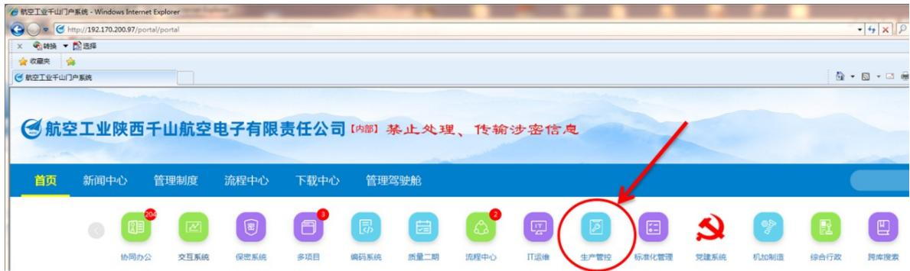

步骤2：生产计划管控系统进入后默认页面见下图。

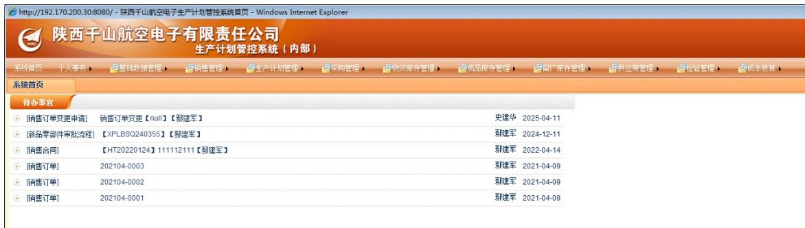

步骤3：选择“物资库存管理”——“库存看板”——“原材料库存看板”，鼠标单机“原材料库存看板”。

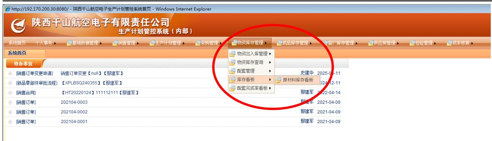

步骤4：进入“原材料库存看板”后，界面显示如下图所示。

步骤5：拖动右侧滚动条至最底端，点击屏幕左侧框“加载新品库”。

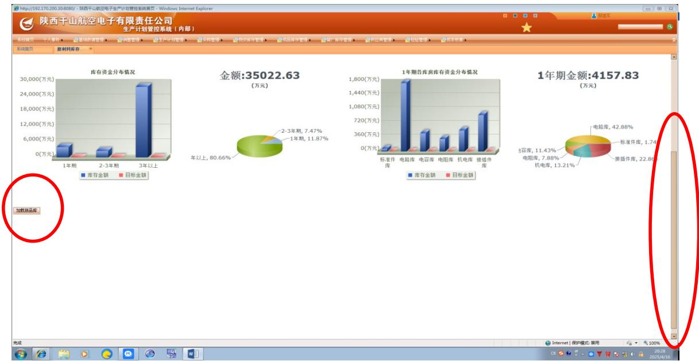

步骤6：点击屏幕左侧框“加载新品库”后，显示界面如下。在如下界面中，出现“新品库存金额”和“新品库存金额分布情况”两个柱状看板。

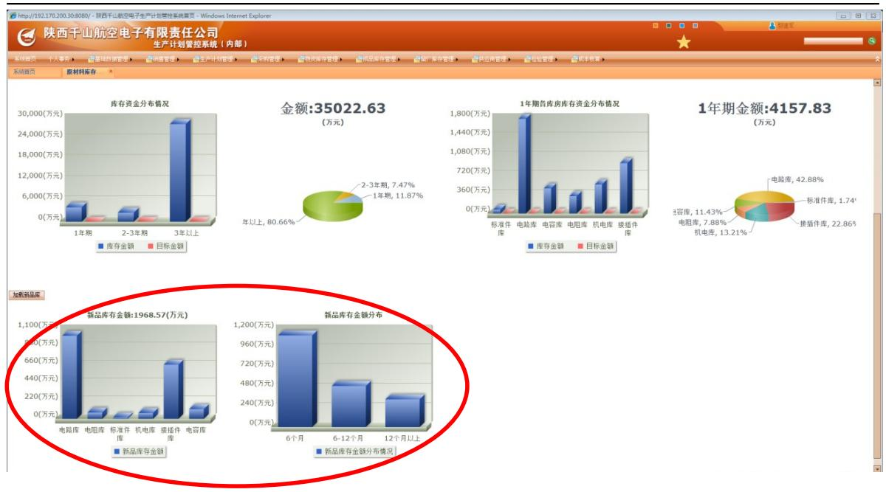

# 2.1.2.1 新品库存金额查询

步骤7：“新品库存金额”柱状图分为：电路库、电阻库、标准件库、机电库、接插件库、电容库等6个库别。点击“新品库存金额”柱状图中任一图柱，即可显示该库别的详细库存物资清单。示例，如点击电路库，进入界面图例如下。

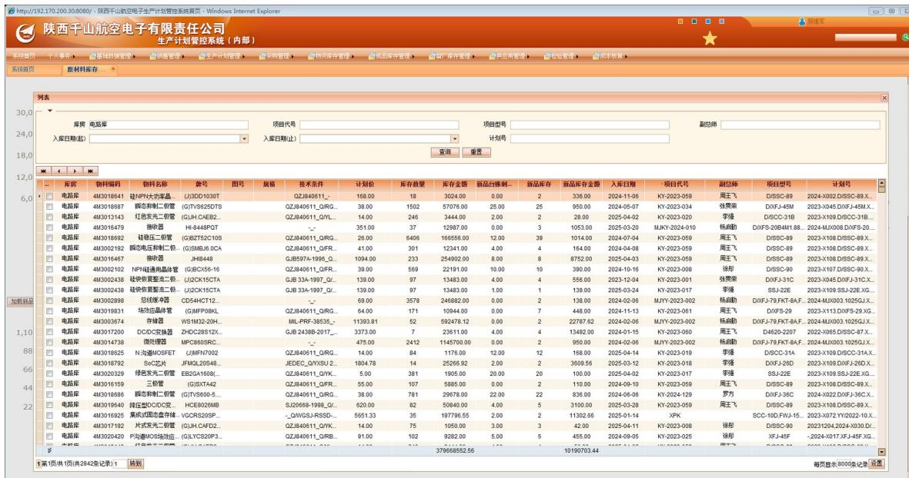

在该页面，可通过项目代号、副总师、计划号等信息查阅库存物资情况。

同时，也可通过下载导出Excel表格的形式进行物资库存情况查阅。示例如下。

步骤8：点击网页表格中最左侧小方格，单机选择“导出到Excel”，实现Excel表格的下载导出。

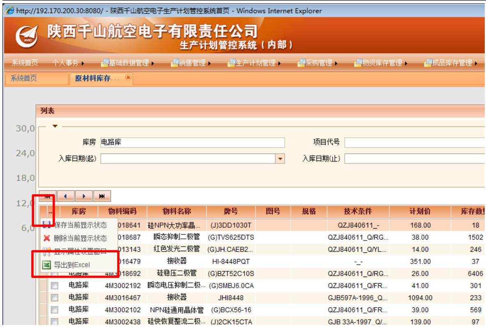

步骤9：点击Excel表格的打开或保存，即可实现新品库存物资的全部展示。

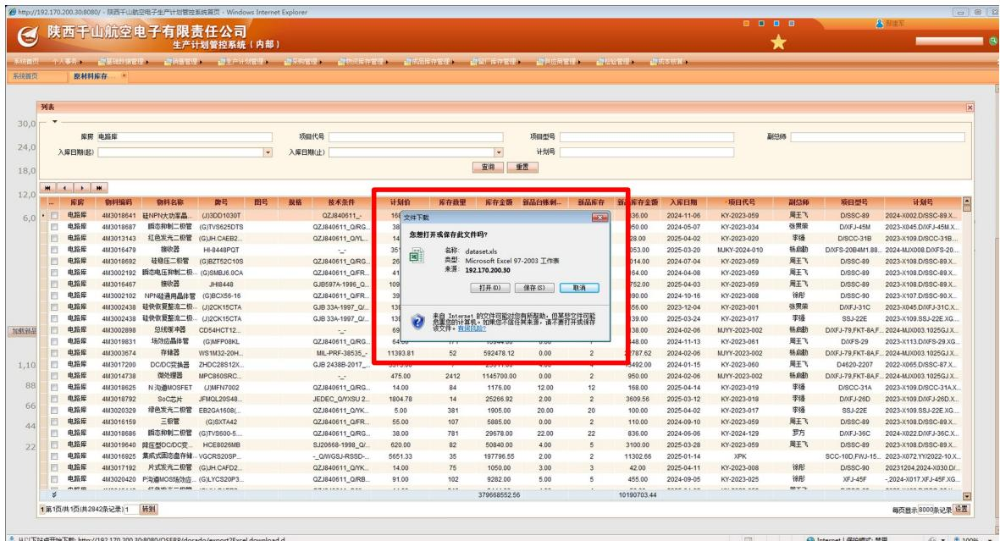

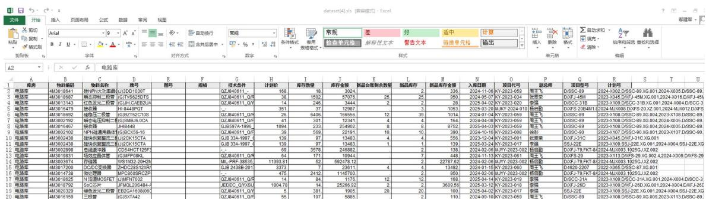

# 2.1.2.2 新品库存金额分布情况查询

步骤10：“新品库存金额分布情况”柱状图，按照库龄分为：6个月、6-12个月、12个月以上等3个类别。点击“新品库存金额分布情况”柱状图中任一图柱，即可显示该类别的详细库存物资清单。示例，如点击“12个月以上”，进入界面图例如下。

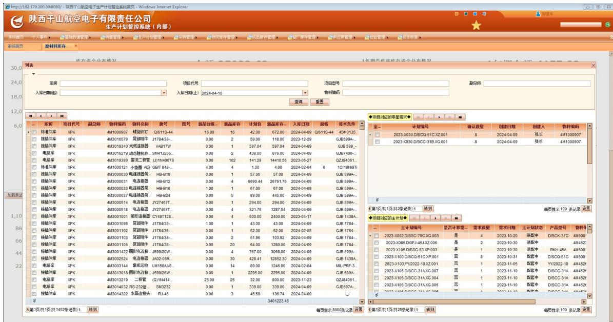

在该页面，可通过项目代号、项目型号、副总师等信息查阅库存物资情况。

同时，也可通过下载导出Excel表格的形式进行物资库存情况查阅。示例如下。

步骤11：点击网页表格中最左侧小方格，单机选择“导出到Excel”，实现Excel表格的下载导出。

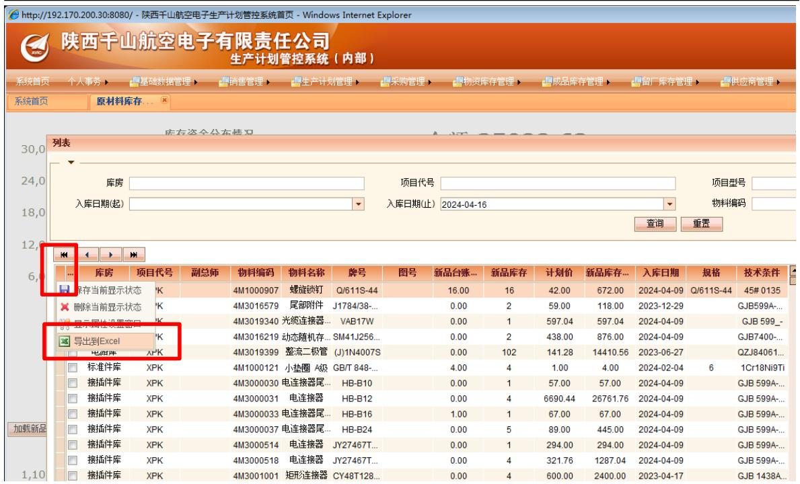  
步骤12：点击Excel表格的打开或保存，即可实现新品库存物资的全部展示。

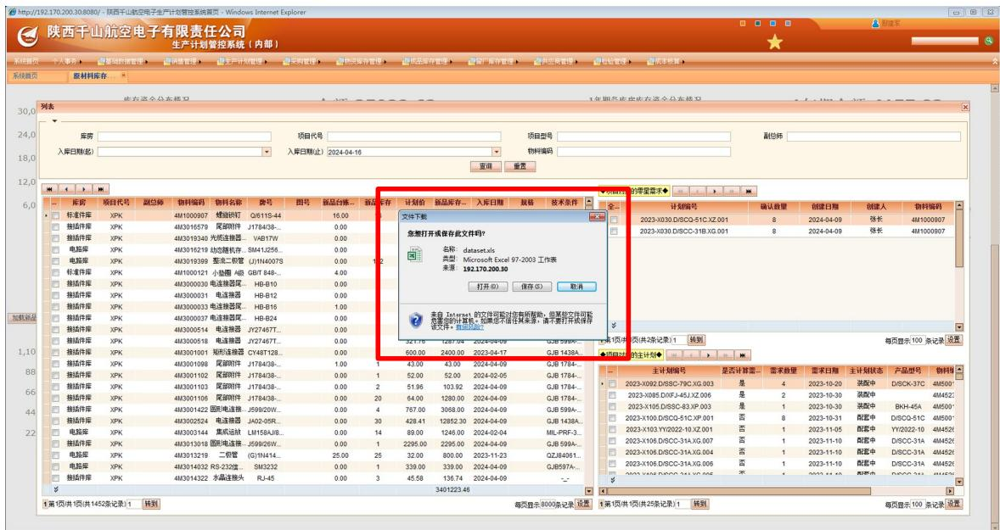

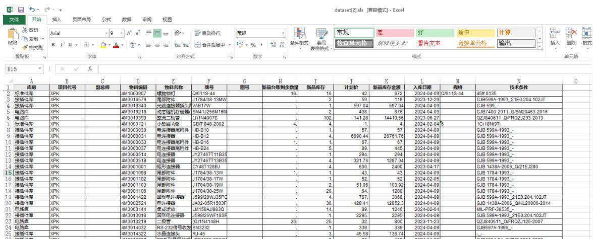