# 1.1 需求执行情况查询（适用于需求提请部门）

# 1.1.1 适用场景

适用于设计人员对于投入的物资需求（含零星需求投入和BOM投入）执行情况（需求情况、采购计划订单情况、机加外协计划情况、到货检验情况、入库发出情况）的追踪查询。

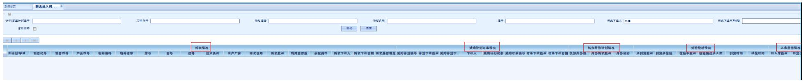

# 1.1.2 操作方法示例

a）界面计入：生产计划管理—新品计划管理—新品投入需求执行情况查询。

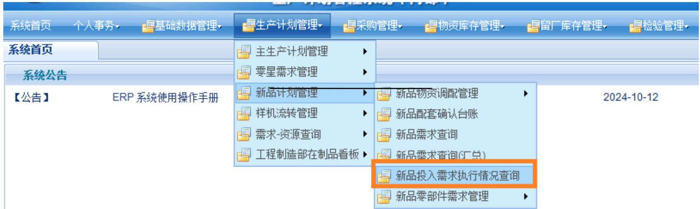

b) 显示列的调整：显示列项数可根据个人情况自行掉正。右键“主计划/零星计划编号”前面的小框，选择“显示属性设置窗

口”，出来“列属性”框，根据个人情况设置是否“可见”，设置完成后点击“保存当前状态”即可。

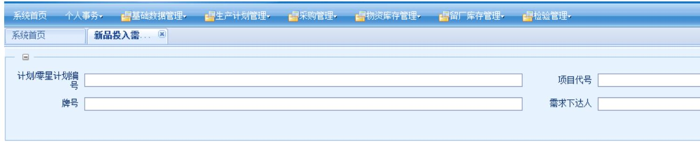

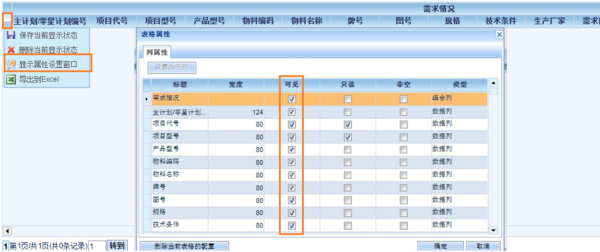

c) 查询页面：根据查询条件查询需求执行情况

(1) 查询条件：“主计划号/零星需求编号”、“项目代号”、“物料编码”、“物料名称”、“牌号”、“需求下达人”、

“需求下达日期”。

(a) 打开功能后系统自动默认是本人的未闭环需求。  
(b) “需求下达人” 是谁查询出就是谁的需求，为空是所有人的需求。  
(c) “含已闭环”未勾选上查出的是未闭环需求，勾选上是全部需求。

# 【举例1】查询自己的未闭环需求

“代方远”进入ERP系统，打开“新品投入需求执行情况查询”，点击“查询”，默认查询出来的是代方远自己的未闭环需求。

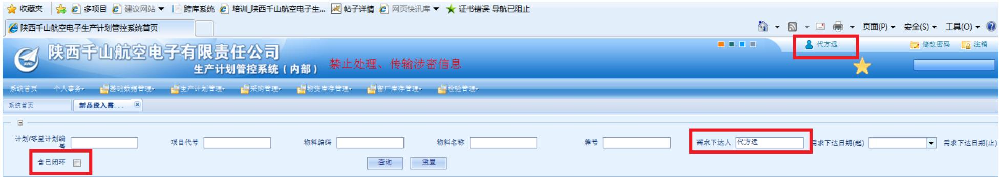

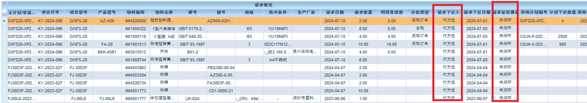

【举例2】查询自己的所有需求（已闭环和未闭环）

“代方远”进入ERP系统，打开“新品投入需求执行情况查询”，设置查询条件“含闭环需求”打钩，再点击“查询”，查询出来的是代方远自己的所有需求。

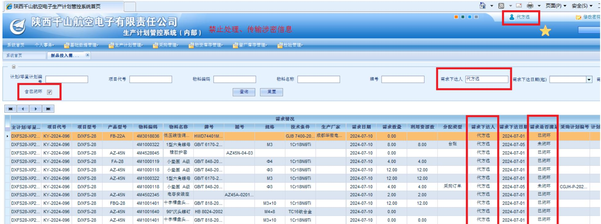

# 【举例3】查询所有人的未闭环需求

“代方远”进入ERP系统，打开“新品投入需求执行情况查询”，设置查询条件“需求下达人”为空和“含已闭环”不打钩，再点击“查询”，查询出来的是所有人的未闭环需求。

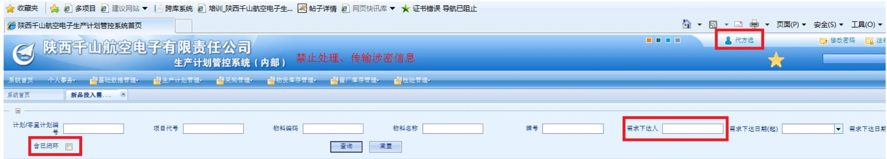

# 【举例4】查询所有人的所有需求

“代方远”进入ERP系统，打开“新品投入需求执行情况查询”，设置查询条件“需求下达人”为空和“含已关闭”打钩，再点击“查询”，查询出来的是所有人的所有需求。

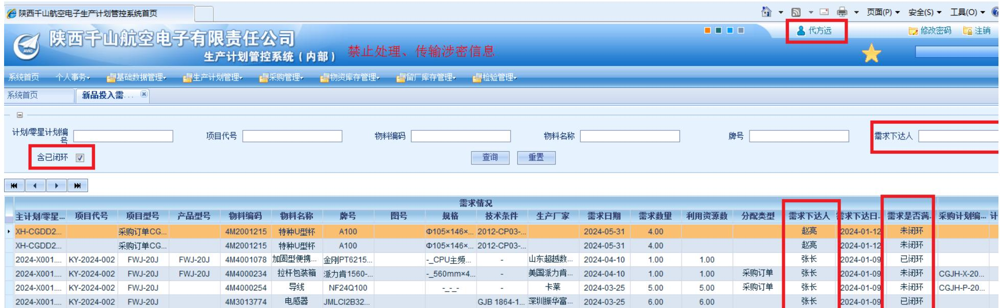

(2）查询情况：查询情况有4部分（需求情况、采购计划订单情况、机加外协计划情况、到货检验情况、入库发出情况）【举例1】生成采购计划

查询条件：主计划/零星计划编号="2024-X022.KY-2024-128.XZ.001"，物料编码="4M3019360"

查询情况：

需求情况。2024年5月28日牛浩下达2个物资需求，用于项目代号KY-2024-128下的D/SCQ-47A产品上，要求完成时间2024.9.30。

采购计划订单情况。2024年5月13日计划员邱甜下达计划，计划号为CGJH-X-20240513，2024年6月28日采购员下达订单，订单号为CGDD2024050256。

机加外协计划情况。因该物料是外购件，生成采购计划，不生成机加外协计划。

到货检验情况。已到货，正在检验中。

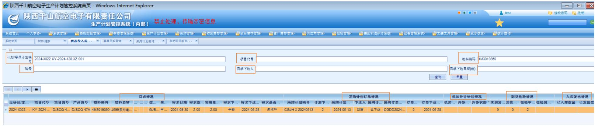  
入库发出情况。未入库。

【举例2】生成机加外协计划

查询条件：主计划/零星计划编号="20240530", 物料编码="4M4515946"

查询情况：

需求情况。2024年6月5王瀛东下达4个物资需求，用于项目代号KY-2023-044下的D/SSC-79C产品上，要求完成时间2024.8.15。

采购计划订单情况。该物料为自制零件，不生成采购计划，生成机加外协计划。

机加外协计划情况。机加外协计划号为WO2406002780，已完成。

# 【举例3】利用库存资源

查询条件：主计划/零星计划编号="XFJ45A(1)-01"，物料编码="4M3016437"

查询情况：

需求情况。2024年7月3日杨文强下达3个物资需求，用于项目代号KY-2023-042下的D/SSC-83产品上，要求完成时间2024.7.15。

采购计划订单情况。该物资在需求下达时，库存资源满足该需求，不再生成采购计划。零星领用方式可以到库房领用，配套方式计划员可以手动或每天晚上系统自动分配到该需求上，分配成功或领用成功后“需求是否满足”状态为“已闭环”。

机加外协计划情况。不涉及。

到货检验情况。不涉及。

入库发出情况。不涉及。

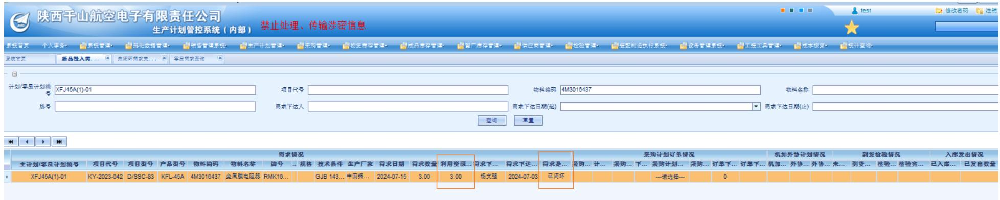

# 【举例4】利用在途资源

查询条件：主计划/零星计划编号="2024-X028.D/XFS-12(1).XP.002"，物料编码="4M3020398"

查询情况：

需求情况。2024年7月6日张长下达3个物资需求，用于项目代号KY-2023-050下的D/XFS-12产品上，要求完成时间2024.9.30。

采购计划订单情况。该物资在需求下达时，有在途计划满足2个需求，所以利用资源数为“2”，利用了2024.6.28邱田下达的计划CGJH-X-20240628，对应订单为CGDD2024060583。

机加外协计划情况。不涉及。

到货检验情况。未到货。

入库发出情况。未入库。

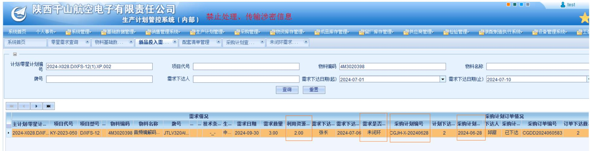

# 【举例5】还未生成采购计划

查询条件：主计划/零星计划编号="2024-X028.D/XFS-12(1).XP.002"，物料编码="4M3019952"

查询情况：

需求情况。2024年7月6日张长下达1个物资需求，用于项目代号KY-2023-050下的D/XFS-12产品上，要求完成时间2024.9.30。

采购计划订单情况。利用资源数为“空”，采购计划订单情况为“空”，说明需求还未生成计划。

机加外协计划情况。不涉及。

到货检验情况。未到货。

入库发出情况。未入库。

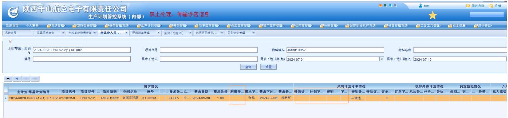