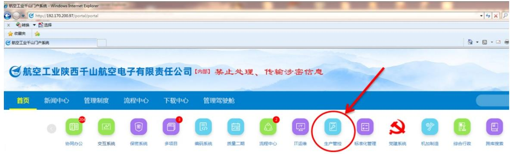
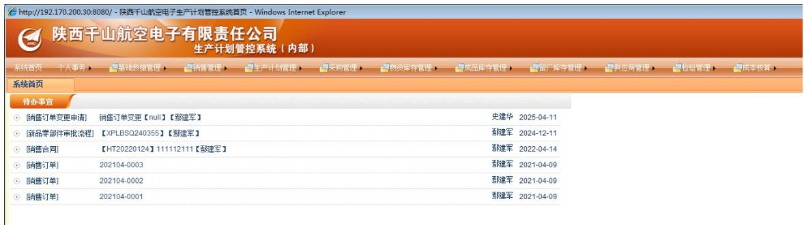
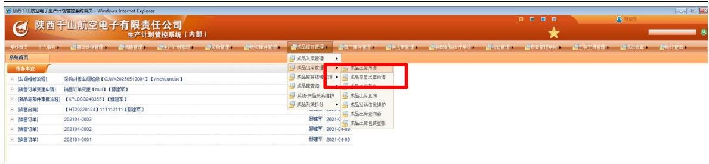
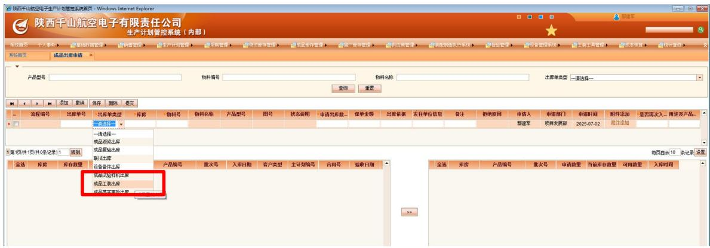

# 新品测试工装计量挂签业务流程操作指导书

共5页

陕西千山航空电子有限责任公司

2025年7月

# 目次

1适用范围. 1  
2 操作向导

2.1 新品科研样机入库 1  
2.2 新品科研样机出库  
2.3 新品科研样机入固定资产台账 2  
2.4固定资产领用 3  
2.5测试工装计量挂签 3

# 1 适用范围

本文件规定了通过新品科研样机方式投产的测试工装的入库、出库、固定资产管理、计量挂签的相关流程和步骤，有效衔接测试工装的新品生产管理、固定资产管理、计量挂签管理。

# 2 操作向导

新品测试工装计量挂签的基本流程步骤为：新品科研样机入库  $\rightarrow$  新品科研样机出库  $\rightarrow$  新品科研样机入固定资产台账  $\rightarrow$  固定资产领用  $\rightarrow$  测试工装计量挂签。

步骤1：点击中航工业千山门户系统首页如图所示标注进入，见下图。

步骤2：生产计划管控系统进入后默认页面见下图。

# 2.1 新品科研样机入库

步骤3：通过新品科研样机方式投产的测试工装，按照新品生产管理模式，完成样机产出，按照主计划完成样机入库。科研样机入库后，测试设备在“新品成品库”进行管理。此时，测试工装的身份属性为：新品科研样机。

# 2.2 新品科研样机出库

步骤4：选择“成品库存管理”——“成品出库申请”，按照“成品出库申请”提交样机出库申请。

在成品出库申请中，测试工装的出库选择“对内出库”，出库对象为需求部门（设计研发部门），“谁提的需求，出库给谁”，出库单类型选择“成品工装出库”。

步骤5：成品对内出库申请批准后，需求部门（设计研发部门）需求提出人至成品库房完成测试工装领取。同步，通知生产检验中心（张擎东）办理固定资产验收事宜。此时，测试工装的属性为：新品科研样机。

# 2.3 新品科研样机入固定资产台账

制度依据：《陕西千山航空电子有限责任公司固定资产管理办法》，司规[2024]532号。

职责：生产检验中心，负责公司仪器仪表及测试试验设备和测试工装的运维管理。

# 第四章 日常管理

第十四条 公司固定资产日常管理主要包括建账、标识、维修保养、退库、内部调配、盘点、减值处理、投保等活动。

第十五条 固定资产采购到场并完成最终验收后，采购部门填写《固定资产验收单》（附件1），通知规划经营部到场确认，通知使用部门或需求提出部门办理《固定资产领用单》（附件2）。

公司自制固定资产，由生产检验中心统一办理固定资产验收，并通知使用部门办理《固定资产领用单》。属工装设备的，按照公司相关管理规定和标准办理验收、检定、入库、使用。

步骤6：生产检验中心，按照制度规定，办理《固定资产验收单》（详见司规〔2024〕532号制度附件1）。由规划经营部完成测试设备入公司固定资产台账管理，并对测试设备粘贴“固定资产”标签。“固定资产”标签是固定资产合格的标志物。此时，测试工装的属性为：公司固定资产。

# 2.4 固定资产领用

步骤7：需求部门（设计研发部门）需求提出人办理《固定资产领用单》（详见司规〔2024〕532号制度附件2）并提交至规划经营部，完成固定资产领用登账。此时，测试工装的属性为：固定资产。

# 2.5 测试工装计量挂签

步骤8：生产检验中心，完成测试工装计量检定，出具计量检定合格证，并在产品表面粘贴“计量标签”，纳入公司测试设备“计量检定设备台账”进行计量管理，并定期开展计量检定维护。

使用需求部门负责测试设备的使用和保管。测试设备经计量检定合格后方可用于新品科研样机的测试、验收、试验等。

此时，测试工装的属性为：测试工装。