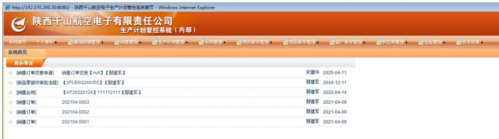
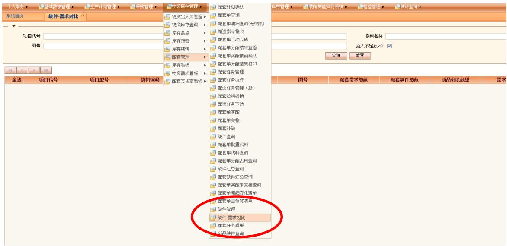
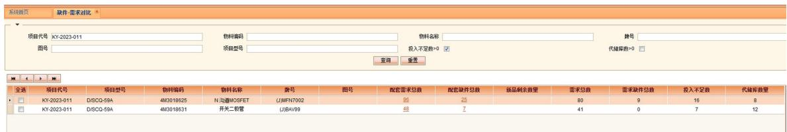
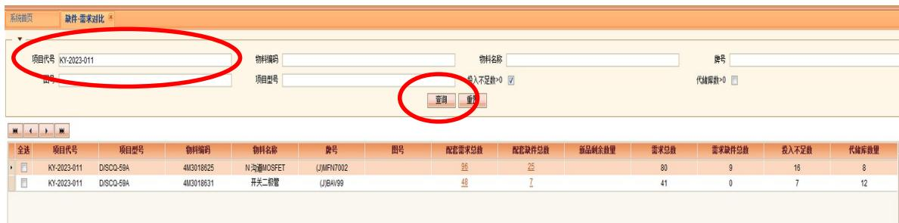

# 新品缺件需求对比查询操作指导书

共5页（含封面）

陕西千山航空电子有限责任公司

2025年8月

# 目次

1适用范围 2  
2 操作向导 3

2.1 缺件需求对比查询

2.1.1模块功能 3  
2.1.2 使用方法

# 1 适用范围

本文件规定了新品缺件需求对比查询相关操作示例。

# 2 操作向导

# 2.1 缺件需求对比查询

# 2.1.1 模块功能

用于查询新品缺件-需求对比情况。

# 2.1.2 使用方法

用户可先通过“中航工业千山门户系统”进入“生产管控系统”。

步骤1：点击中航工业千山门户系统首页如图所示标注进入，见下图。

步骤2：生产计划管控系统进入后默认页面见下图。

步骤3：选择“物资库存管理”——“配套管理”，鼠标单机“缺件-需求对比”。

步骤4：进入“缺件-需求对比”后，界面显示如下图所示。

该界面默认显示需求投入不足数  $>0$  的物资

步骤5：在项目代号中输入需查询的项目代号，点击“查询”。

“配套需求总数”是指对应项目某一项物资在配套单中需求的累计求和，如上图表示项目代号 KY-2023-011 中物料 4M3018625 配套单中需求累计为 96；

“配套缺件总数”指对应项目某一项物资目前缺件的累计求和；如上图表示项目代号 KY-2023-011 中物料 4M3018625 累计缺项数为 25;

“新品剩余数”指所有新品项目已分配未发放的数量；

“需求总数”指需求部门在该项目下某一项物资投入的总数量；如上图表示物料4M3018625在项目代号KY-2023-011中投入数量合计为80;

“需求缺件总数”指对应项目某一项物资已经投入未分配的数量。如

上图表示项目代号 KY-2023-011 中物料 4M3018625 投入的 80 只中有 9 只未分配;

“投入不足数”指该项目下某一项物资配套需求总数与需求总数的差值，即在该项目中缺的需求数量。如上图表示项目代号 KY-2023-011中物料4M3018625需求少投入16只。

步骤 6: 点击配套需求总数对应的数字, 进入如下图所示  

<table><tr><td>全送</td><td>项目代号</td><td>配件单号</td><td>主计划编号</td><td>产品型号/图号</td><td>物料编码</td><td>物料名称</td><td></td><td>需求数量</td><td>已分配数量</td><td>缺件数量</td><td>下线状态</td><td>备注</td></tr><tr><td>KY-2023-011</td><td>250845</td><td>2025-X007 DISCO-59A.X</td><td>DISCO-59A</td><td>4M3018625</td><td>N沟道MOSFET</td><td>UJMFN7002</td><td>32.00</td><td>7.00</td><td>25.00</td><td>未下表</td><td></td><td></td></tr><tr><td>KY-2023-011</td><td>233058</td><td>2023-X110 DISCO-59A.X</td><td>DISCO-59A</td><td>4M3018625</td><td>N沟道MOSFET</td><td>UJMFN7002</td><td>16.00</td><td>16.00</td><td>0.00</td><td>下降已满足</td><td></td><td></td></tr><tr><td>KY-2023-011</td><td>233058</td><td>2023-X110 DISCO-59A.X</td><td>DISCO-59A</td><td>4M3018625</td><td>N沟道MOSFET</td><td>UJMFN7002</td><td>16.00</td><td>16.00</td><td>0.00</td><td>下降已满足</td><td></td><td></td></tr><tr><td>KY-KY-2023-011</td><td>240281</td><td>2024-X004 DISCO-59A.X</td><td>DISCO-59A</td><td>4M3018625</td><td>N沟道MOSFET</td><td>UJMFN7002</td><td>32.00</td><td>32.00</td><td>0.00</td><td>下降已满足</td><td></td><td></td></tr></table>

该界面显示的为配套需求总数的来源及发放状态