# 新品零部件需求BOM变更操作指导书

共7页

陕西千山航空电子有限责任公司

2025年9月

# 目次

1适用范围  
2 操作向导

2.1 释放多余物资需求（视情） 1

2.2物资补充投入（视情） 2  
2.3 重新勾选BOM，更新配套单

# 1 适用范围

本文件适用于新品科研样机按照勾选BOM的方式投入后，发生的设计更改、投入物资变化后，更新前期已勾选的BOM，达到“按需投入、按需产出”目的，使得配套单精准、物料上线精准、产出过程顺利。

# 2 操作向导

当发生的设计更改、投入物资变化后，为更新配套单，需更新前期已在零部件需求申请中勾选的BOM。分三个步骤，具体如下。

# 2.1 释放多余物资需求（视情）

当设计更改、产出策略及目标发生变化后，存在前期物资多余的情况，需对前期已投入物资进行需求变更，释放需求资源。

步骤1：点击中航工业千山门户系统首页如图所示标注进入，见下图。

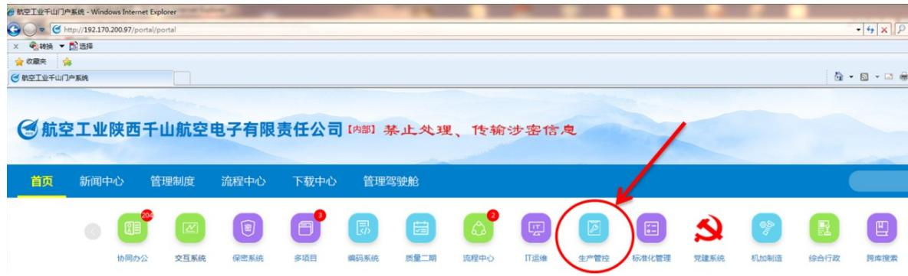

步骤2：生产计划管控系统进入后默认页面见下图。

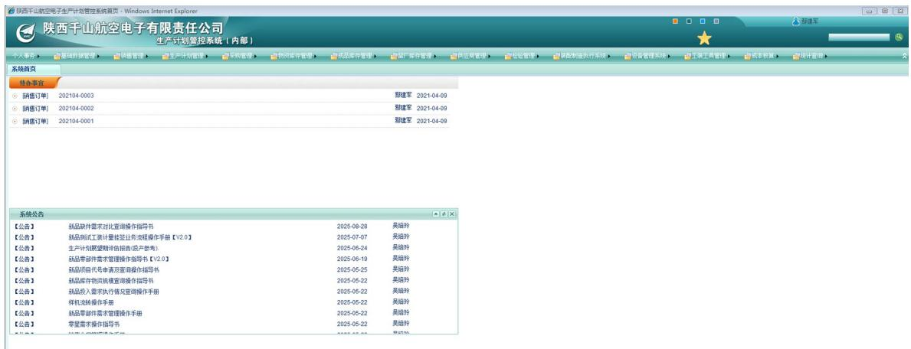

步骤3：选择“生产计划管理”——“零星需求管理”——“零星需求变更申请”。

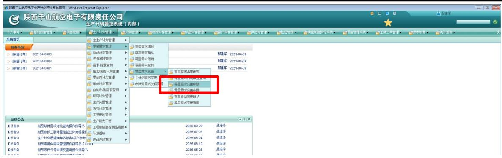

步骤4：点击“添加”，通过项目代号、物料编码、器件牌号、图号等查询信息，找到需求变更的物料信息，变更需求数量，提交审批，审批通过后，即可完成物资需求变更及资源释放。

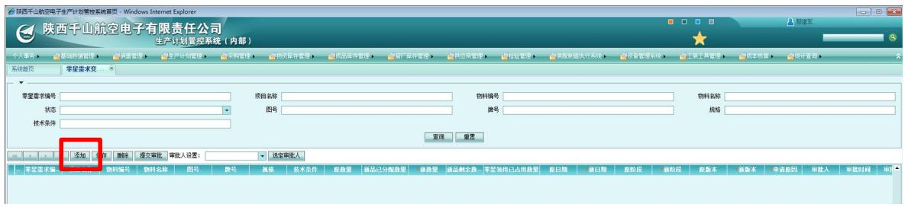

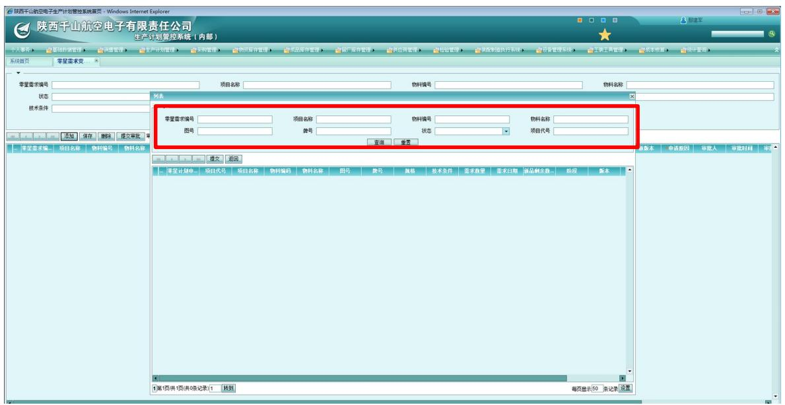

# 2.2 物资补充投入（视情）

当设计更改、产出策略及目标发生变化后，前期投入物资发生变化，新增的物资未投入时，则可通过“新品零部件需求申请（新）”完成补充投入，或通过“零星需求申请”完成补充投入。

若设计更改的内容为调整装配关系，联动导致BOM结构变化，物资无实质性变化是，重新勾选BOM不涉及物资变化，无需进行物资补充投入。

# 2.3 重新勾选BOM，更新配套单

步骤5：选择“生产计划管理”——“新品计划管理”——“新品零部件管

理（新）”——“新品零部件需求BOM变更”。

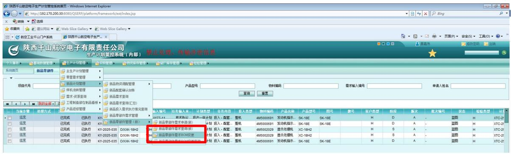

步骤6：点击“添加”。

步骤7：选择前期已执行的新品零部件需求，点击“确认选择”。

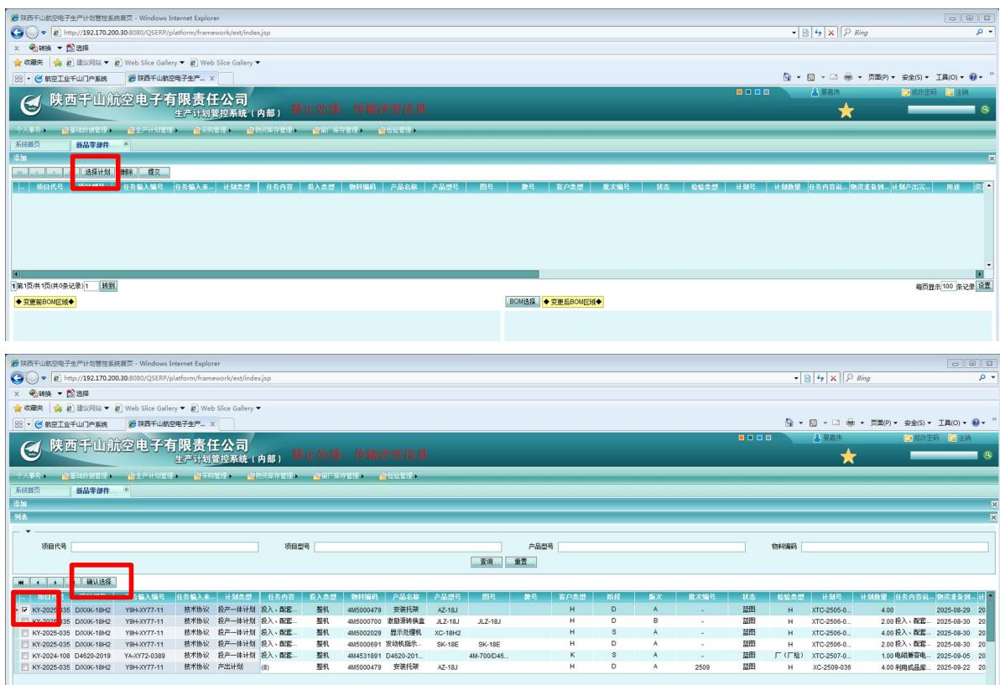

步骤8：在“BOM选择”处，点击“BOM选择”，重新进行BOM勾选确认。

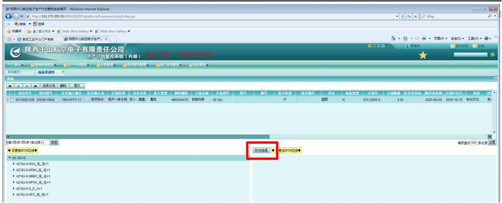

步骤9：在BOM待选择区域，选择确认新的BOM，点击“确认选择”，点击“☑”。

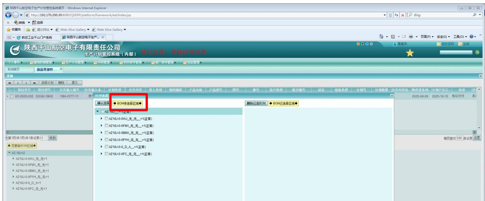

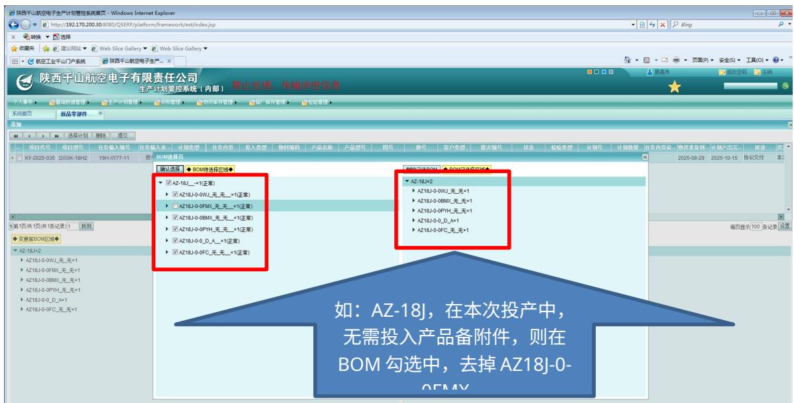

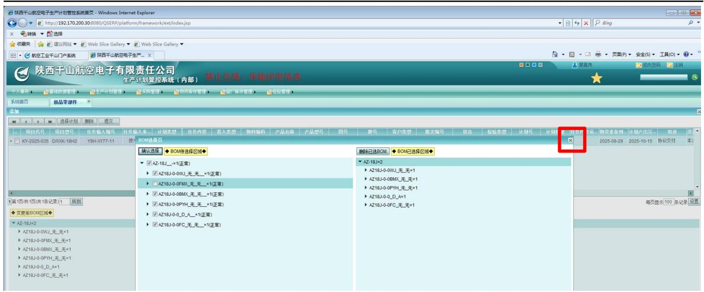

步骤10：提交审批，分别通过部门领导、副总师审批节点审批，即可完成BOM的重新勾选。

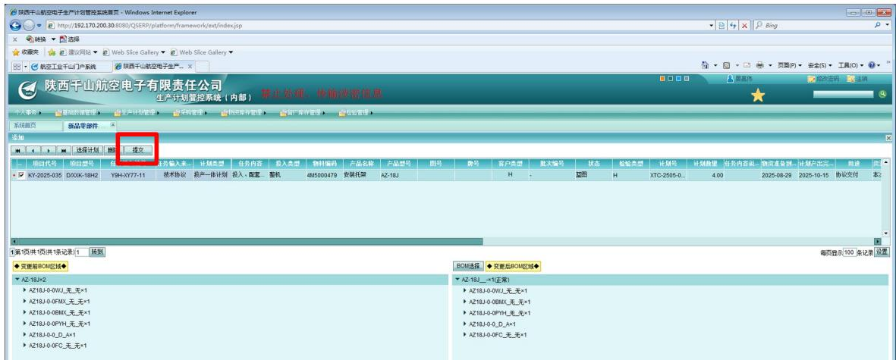

步骤11：新品计划配套员依据“新品零部件需求BOM变更”申请，完成配套单贯改。