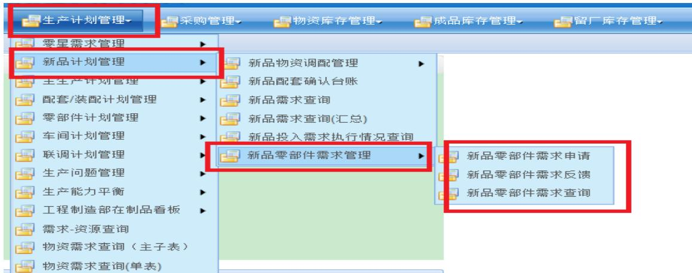
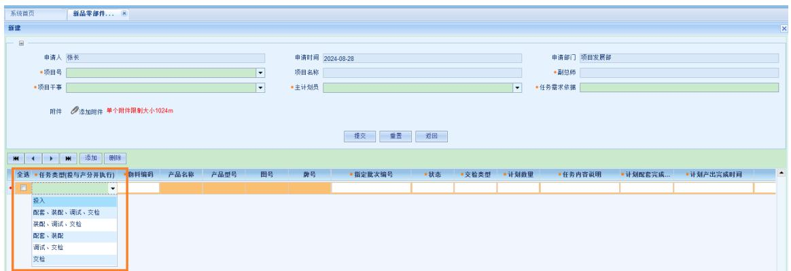
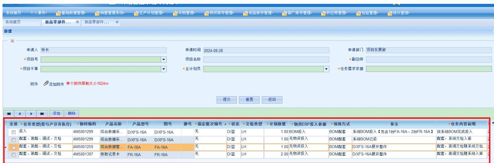
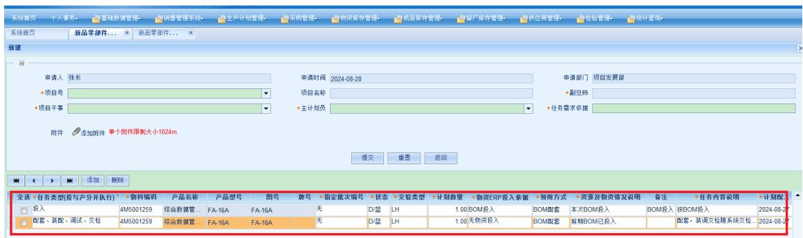
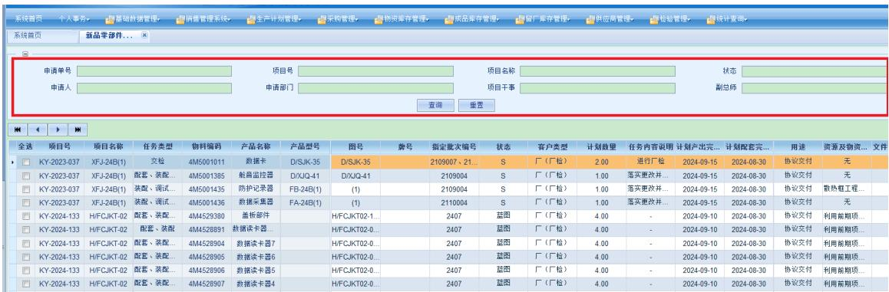

# 生产计划管控系统中“新品零部件需求管理”模块使用说明

# 目的

1、替换原纸质“新品科研样机零、部件需求”，编制、审批过程由“线下”转为“线上”。  
2、减少审批环节：由6个减为4个。  
3、减少周转环节：零星需求投入由设计在“新品零部件需求申请”总师审批后自行在生产计划管控系统中的“零星需求编制”中直接上传。  
4、增加“新品零部件需求反馈”环节，便于需求提出者及时掌握任务下达情况。  
5、增加“新品零部件需求查询”环节，便于项目投/产情况的集中查询。

# 位置

生产计划管控系统:

新品零部件需求管理包含“新品零部件需求申请”、“新品零

部件需求反馈”、“新品零部件需求查询”三个部分。

# 职责

设计员：

在“新品零部件需求申请”进行编制。“新品零部件需求申请”批准生效后，如有“零星需求”投入，则在“零星需求编制”中完成本次“零星需求”的上传及下达。

新品零部件需求反馈：新品零部件需求批准生效后，设计员在“零星需求编制”中完成当次零星需求的上传及下达，并将系统生成的零星需求编号填写在“新品零部件需求反馈”中零星需求编号列对应投/产项中。如本次无零星需求投入，则填写“本次无零星需求投入”。

新品零部件需求查询：定期检查投、产需求情况。

设计部门主管部长

新品零部件需求申请：对设计员编制的零部件需求内容进行审定。

项目干事：

新品零部件需求申请：对零部件需求内容进行审核并填写“目标成本是否下达”、“两金压控会签”、“经费管理会签”。

新品零部件需求反馈：新品零部件需求批准生效后，项目干事完成销售订单/投产指令下达（BOM投入/BOM配套），并将系统生成的销售订单编号填写在新品零部件需求反馈中订单号列对应投/产项中。如本次无需下达销售订单，则填写“本次无需下达销售订单”。

新品零部件需求查询：定期检查投、产需求情况。

副总师：

新品零部件需求申请：批准。

主计划员：

新品零部件需求反馈：BOM投入主计划下达，BOM配套指令下达，计划号填写。

新品零部件需求查询：定期检查投、产需求情况。

# 新品零部件需求申请使用说明

# 进入界面

点击添加按钮，进入编辑界面。

# 编辑界面

上方“红色”框内为基础信息填报，点击下方“红色”框内“添加”按钮进行本次需求填报【注意：等同于原“新品科研样机零、部件需求”中“任务需求明细”。必填。】

# 申请界面

“红色”框内为任务类型，投与产分开执行。先完成投入满足基本零件加工、物资采购周期后再提出产出需求。

# 系统投/产填写事例

系统BOM投入只填报系统号，无系统BOM需按整机BOM投入需逐条填写整机【注意：同一型号不同产出节点、同批次投产不同资金类型的需分别例出。无系统BOM需按整机BOM投入，需另行投入差异部分】。

系统产出需列出系统及各整件，并在备注中明确隶属关系，“资源及物资情况说明”中明确前期物资投入计划号及是否已完成投入【注意：计划号可在“新品零部件需求反馈”中查询对应计划号】。

# 整件投/产填写事例

整件BOM投入需按整机逐条填写【注意：同一型号不同产出节点、同批次投产不同资金类型的需分别列出。】。

部件投/产、零件与物资投入

部件【注意：独立产出】填写要求参照系统填写要求。部件【注意：用于整机产出】建议仅完成物资投入，再随整机BOM配套产出更为高效，且避免重复配套。

零件、物资投入需逐条填写，重点关注“领用方式”的填写。领用方式

零星领用：适用于无BOM情况、单独领取类【注意：需设计

员向工程制造部提出配送清单明确领用物料的名称、规格、数量等】。

配套领用：适用于后续通过BOM配套。

通过零星需求投入的物资，“新品零部件需求申请”与“零星需求编制”中“领用方式”必须保持一致【注意：领用方式不一致系统无法识别】。

# 新品零部件需求反馈使用说明

新品零部件需求反馈界面  

<table><tr><td>全选</td><td>零星需求编号</td><td>订单编号</td><td>计划号</td><td>项目号</td><td>项目名称</td><td>任务类型(投与产分开执行)</td><td>物料编码</td><td>产品名称</td><td>产品型号</td></tr><tr><td></td><td>无</td><td></td><td>2024-X035</td><td>KY-2023-037</td><td>XFJ-24B(1)</td><td>交检</td><td>4M5001011</td><td>数据卡</td><td>D/SJK-35</td></tr><tr><td></td><td>无</td><td></td><td>2024-X035</td><td>KY-2023-037</td><td>XFJ-24B(1)</td><td>配套、装配、调试、交检</td><td>4M5001385</td><td>舱音监控器</td><td>D/XJQ-41</td></tr><tr><td></td><td>无</td><td></td><td>2024-X035</td><td>KY-2023-037</td><td>XFJ-24B(1)</td><td>装配、调试、交检</td><td>4M5001435</td><td>防护记录器</td><td>FB-24B(1)</td></tr><tr><td></td><td>无</td><td></td><td>2024-X035</td><td>KY-2023-037</td><td>XFJ-24B(1)</td><td>装配、调试、交检</td><td>4M5001436</td><td>数据采集器</td><td>FA-24B(1)</td></tr><tr><td></td><td>本次无零星...</td><td></td><td>2024-X034</td><td>KY-2024-133</td><td>H/FCJKT-02</td><td>配套、装配、调试、交检</td><td>4M4529380</td><td>盖板部件</td><td>H</td></tr><tr><td></td><td>本次无零星...</td><td></td><td>2024-X034</td><td>KY-2024-133</td><td>H/FCJKT-02</td><td>配套、装配</td><td>4M4528891</td><td>数据读卡器...</td><td>H</td></tr><tr><td></td><td>本次无零星...</td><td></td><td>2024-X034</td><td>KY-2024-133</td><td>H/FCJKT-02</td><td>配套、装配、调试、交检</td><td>4M4528904</td><td>数据读卡器7</td><td>H</td></tr><tr><td></td><td>本次无零星...</td><td></td><td>2024-X034</td><td>KY-2024-133</td><td>H/FCJKT-02</td><td>配套、装配、调试、交检</td><td>4M4528905</td><td>数据读卡器6</td><td>H</td></tr><tr><td></td><td>本次无零星...</td><td></td><td>2024-X034</td><td>KY-2024-133</td><td>H/FCJKT-02</td><td>配套、装配、调试、交检</td><td>4M4528906</td><td>数据读卡器5</td><td>H</td></tr><tr><td></td><td>本次无零星...</td><td></td><td>2024-X034</td><td>KY-2024-133</td><td>H/FCJKT-02</td><td>配套、装配、调试、交检</td><td>4M4528907</td><td>数据读卡器4</td><td>H</td></tr><tr><td></td><td>本次无零星...</td><td></td><td>2024-X034</td><td>KY-2024-133</td><td>H/FCJKT-02</td><td>配套、装配、调试、交检</td><td>4M4528908</td><td>数据读卡器3</td><td>H</td></tr><tr><td></td><td>本次无零星...</td><td></td><td>2024-X034</td><td>KY-2024-133</td><td>H/FCJKT-02</td><td>配套、装配、调试、交检</td><td>4M4528909</td><td>数据读卡器2</td><td>H</td></tr><tr><td></td><td>本次无零星...</td><td></td><td>2024-X034</td><td>KY-2024-133</td><td>H/FCJKT-02</td><td>配套、装配、调试、交检</td><td>4M4528910</td><td>数据读卡器1</td><td>H</td></tr><tr><td></td><td>本次无零星...</td><td></td><td>2024-X034</td><td>KY-2024-133</td><td>H/FCJKT-02</td><td>配套、装配、调试、交检</td><td>4M4528914</td><td>集中卸载装置</td><td>H</td></tr></table>

1、设计员、项目干事、主计划员可在此界面接收批准生效后的“新品零部件需求”，并按照需求内容开展“零星需求”下达、“销售订单/投产指令”下达，计划号下达。  
2、零星需求编号：设计员填写。如本次无零星需求投入，也需填写“本次无零星需求投入”。  
3、订单编号：项目干事填写。如本次无需下达订单，也需填写“本次无需下达销售订单”。  
4、计划号：主计划员填写司计任务号【例：2024-X001】。

5、零星需求编号、订单编号、计划号完成反馈填写后，新品零部件需求反馈界面将不再显示该条信息，新品零部件需求查询可进行查询【显示该需求：申请单号】。

<table><tr><td>全选</td><td>申请单号</td><td>零星需求编号</td><td>订单编号</td><td>计划号</td><td>项目号</td></tr><tr><td></td><td>XPLBSQ240019</td><td>按BOM投入，无零星投入</td><td>CCON202408-0130</td><td>2024-X034</td><td>KY-2024-161</td></tr><tr><td></td><td>XPLBSQ240024</td><td>按BOM投入，无零星投入</td><td>CCON202408-0130</td><td>2024-X034</td><td>KY-2024-161</td></tr></table>

# 新品零部件需求查询使用说明

  
新品零部件需求查询界面

“红色”框内输入选取一种或多种查询条件进行查询。

项目发展部

2024-8-28