# 新品零部件需求管理操作指 导书

共10页

陕西千山航空电子有限责任公司

2025年5月

# 目次

1适用范围. 1  
2 操作向导

2.1 新品零部件需求申请 ..... 1  
2.2 新品零部件需求拒回  
2.3 新品零部件需求确认执行 ..... 8  
2.4 新品主计划编制 ..... 8  
2.5 新品零部件需求查询 ..... 8

# 1 适用范围

本文件规定了新品零部件需求申请、拒回、确认、主计划编制及查询等功能的使用规范，采用图例进行展示，方便实际操作。

本文件规定了新品零部件需求在审批各环节，各审签责任人的审批要点、审批意见填写规范。

# 2 操作向导

# 2.1 新品零部件需求申请

步骤1：点击中航工业千山门户系统首页如图所示标注进入，见下图。

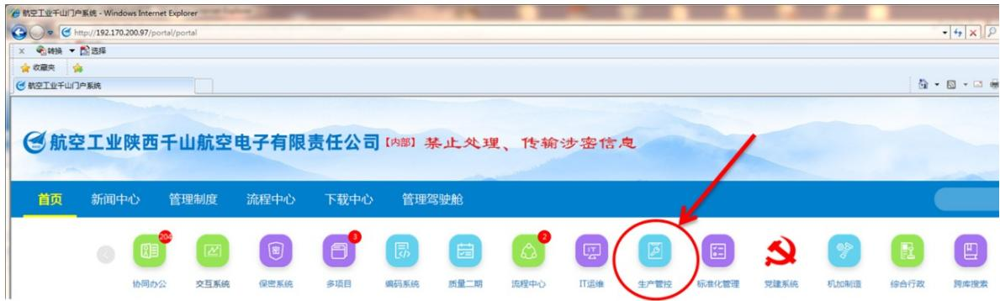

步骤2：生产计划管控系统进入后默认页面见下图。

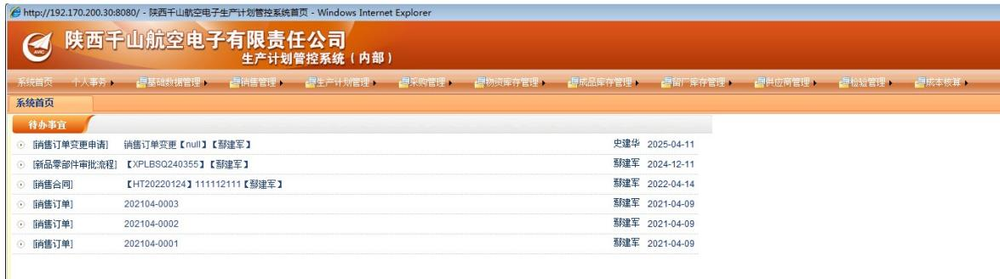

步骤3：选择“生产计划管理”——“新品零部件需求管理（新）”——“新品零部件需求申请（新）”，单机选择“新品零部件需求申请（新）”。

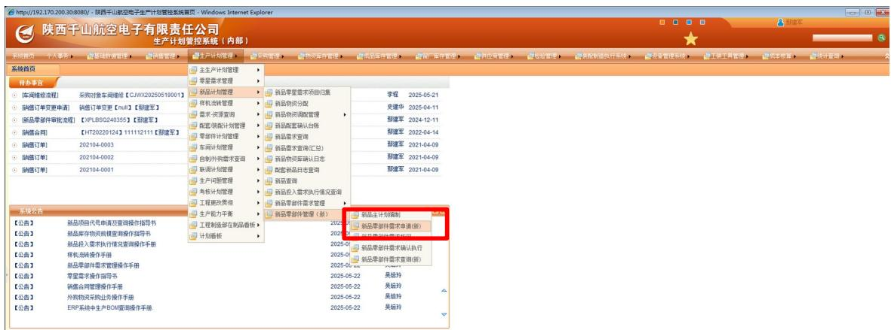

步骤4：进入“新品零部件需求申请（新）”后，界面显示如下图所示。

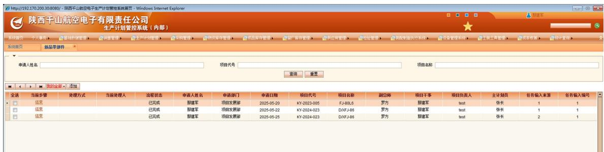

步骤5：点击“添加”，进入新品零部件需求申请编制页面。

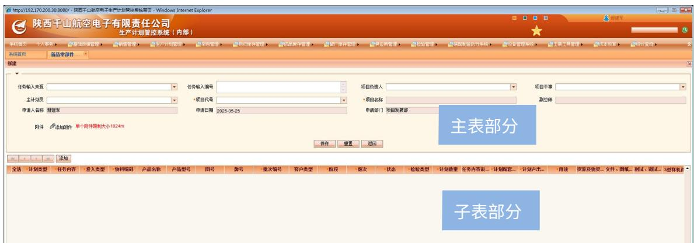

步骤6：维护“新品零部件需求申请”主表。按照上述图示中“主表部分”、“子表部分”标识要求，首先在“主表部分”选择任务输入来源，填写任务输入来源编号，选择项目负责人、项目干事、主计划员、项目代号。

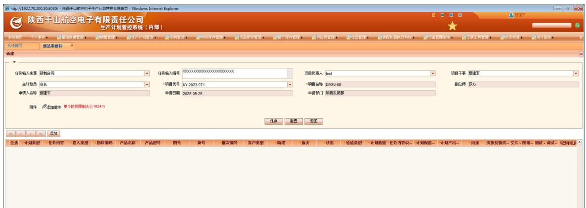

步骤7：维护“新品零部件需求申请”子表。“新品零部件需求申请”子表为本次新品投产的核心和关键。点击子表中“添加”按钮，逐项填报，直至全部

内容完成编制，点击“保存”。图例如下。

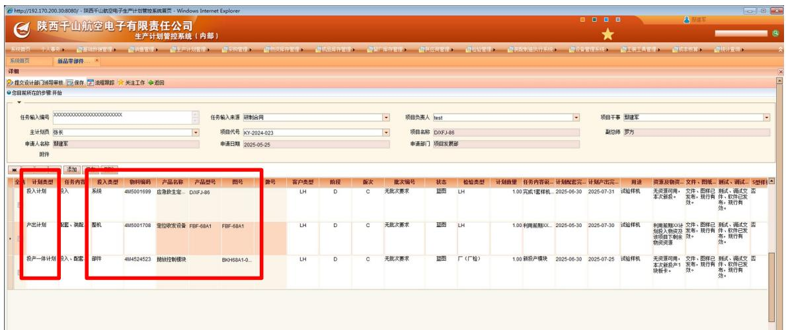

零部件需求申请内容，从计划类型上，支持投入计划、产出计划、投产一体计划等3中投产模式。从投产内容上，支持系统、整机、部件、零组件的投入产出。

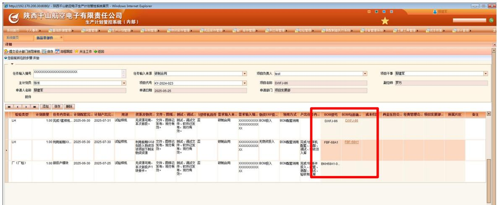

零部件需求申请内容，在物资投入环节，支持灵活选择的模式，可通过“BOM勾选确认”勾选本次投入的物资内容，即“勾选什么，投入什么”。

在“BOM勾选确认”环节，点击BOM结构中左侧方框，点击“确认选择”按钮，即可完成“BOM勾选确认”。

注意：若投入的物资为元器件、零件（最小单元）、外购成件（二配板卡、整机），则无需进行“BOM勾选确认”。其余均需进行“BOM勾选确认”。

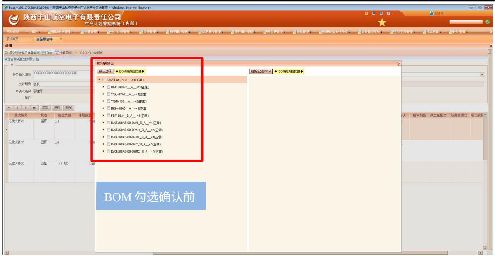

完成BOM勾选确认后，新品零部件需求申请页面显示结果如下。若投入物资在“BOM勾选确认”为空白，未能展现投入物资型号/图号，则“BOM勾选确认”未完成。

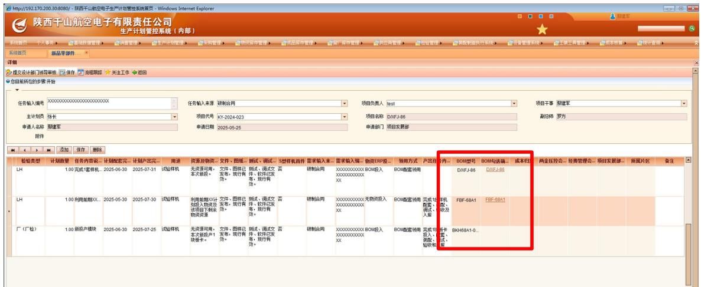

完成新品零部件需求申请编制后，设计员可在申请界面，修改申请内容，包括“添加”新的投产需求、“删除”已编制的投产需求。

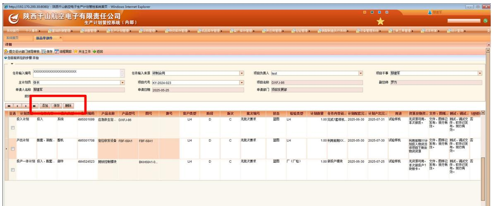

步骤8：新品零部件需求审批。完成新品零部件需求申请编制后，提交审批。

第一步，提交部门领导审批。提交审批申请后，在ERP系统中，部门领导的“待办事宜”界面出现待审批流程，部门领导审批通过后，进入项目干事填写及审批界面。

部门领导审批要点：重点审查投产策划是否合理、投产依据是否科学合理、投产数量是否准确、计划配套时间及计划产出时间是否科学、图样是否发布、文件软件及测试工装等是否齐备、BOM勾选确认是否正确。

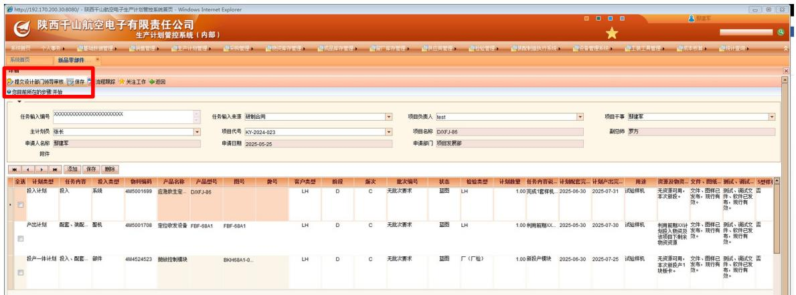

第二步，项目干事填写及审批。在项目干事的ERP系统中“待办事宜”界面出现待审批流程，点击进入，完成本次投产需求核对确认，并完成成本归集、项目发展部领导、所属片区等3项信息选择，完成两金压控信息填写，点击“保存”。图示如下。

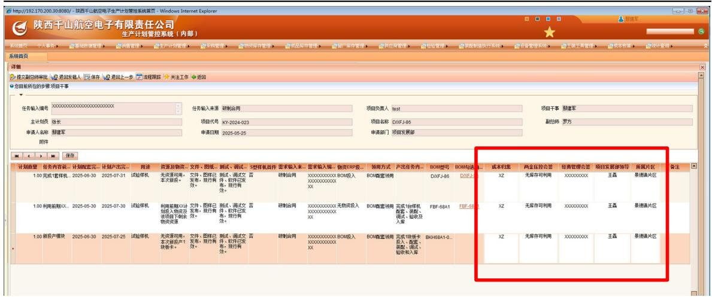

项目干事完成上述工作事项后，新品零部件需求提交型号副总师审批。

项目干事审批要点：重点审查投产策划是否合理、投产依据是否科学合理、投产数量是否准确、批次编号是否正确、计划配套时间及计划产出时间是否科学检验类型是否准确、物资投入类型及物资领用方式是否正确、是否完成BOM勾选确认。

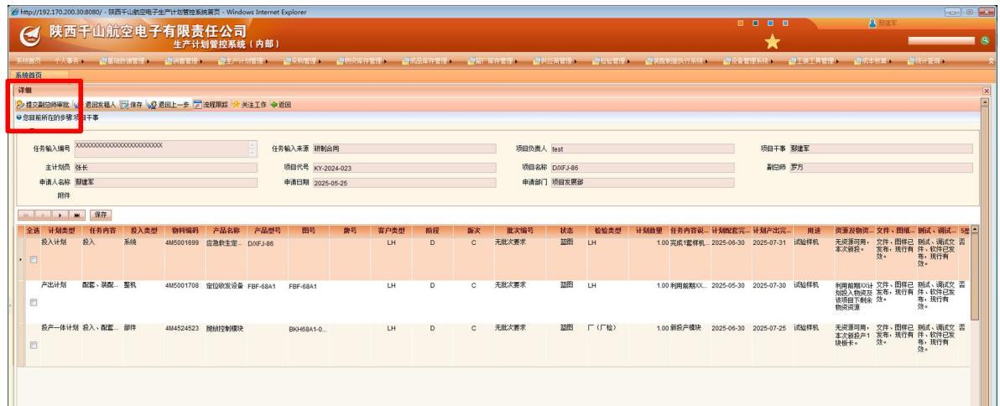

第三步，型号副总师审批。在副总师的ERP系统中“待办事宜”界面出现待审批流程，点击进入，审批通过后，进入副总经理审批。

副总师审批要点：重点审查投产策划是否合理、投产数量是否准确、计划配套时间及计划产出时间是否科学、BOM勾选确认是否正确。

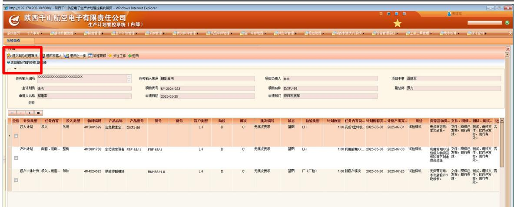

第四步，副总经理审批。在副总经理的ERP系统中“待办事宜”界面出现待审批流程，点击进入，审批通过后，新品零部件需求完成审批。

副总经理审批要点：重点审查投产策划是否合理、投产依据是否充分、前序审签是否履职尽责。

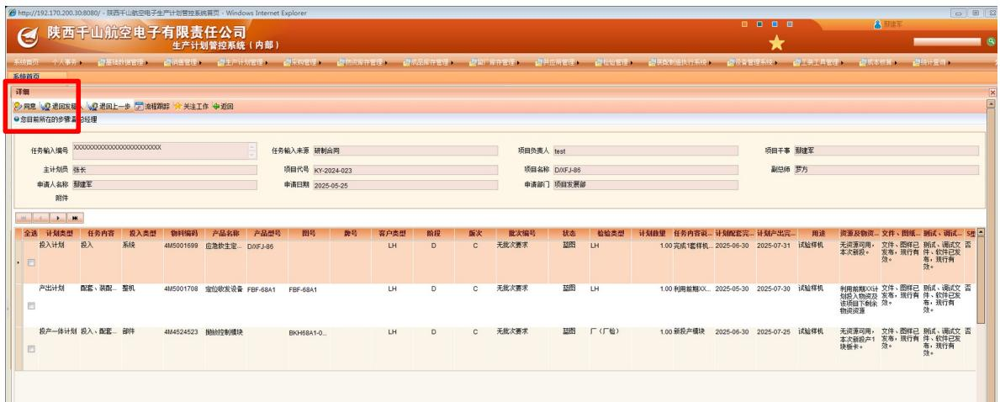

# 2.2 新品零部件需求拒回

步骤9：新品零部件需求审批通过后，新品计划管理员（张长）确认零部件需求内容，若发现零部件需求存在重大失误、计划下达后无法执行的任务项，则执行“新品零部件需求拒回”。页面图示如下。

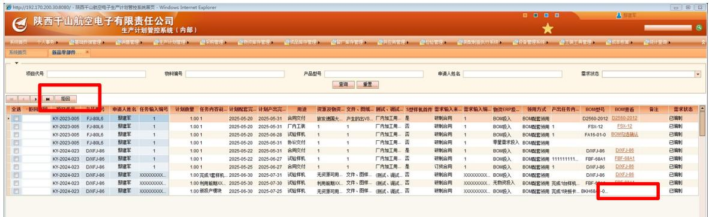

步骤10：新品计划管理员（张长）填写“拒回原因”，点击“拒回”。新品

零部件需求“拒回”后，设计员重新提请新品零部件需求申请。

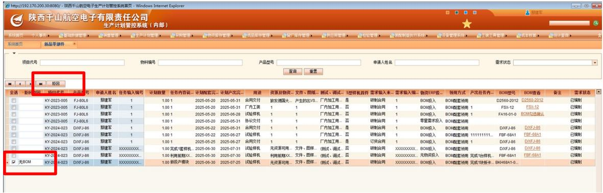

# 2.3 新品零部件需求确认执行

新品计划管理员（张长）在“新品零部件需求确认执行”页面，点击“执行”，完成新品零部件需求确认执行。

待完善。

# 2.4 新品主计划编制

待完善。

# 2.5 新品零部件需求查询

待完善。