# 新品项目代号申请及查询操作指导书

共7页

陕西千山航空电子有限责任公司

2025年5月

# 目次

1适用范围. 1  
2 操作向导

2.1 新品项目代号申请 1  
2.2 新品项目代号审核 ..... 4  
2.3 新品项目代号查询 ..... 5

# 1 适用范围

本文件规定了新品项目代号的申请、查询相关操作示例，包括项目代号申请内容编制及审核、项目代号查询等主要内容。

# 2 操作向导

# 2.1 新品项目代号申请

步骤1：点击中航工业千山门户系统首页如图所示标注进入，见下图。

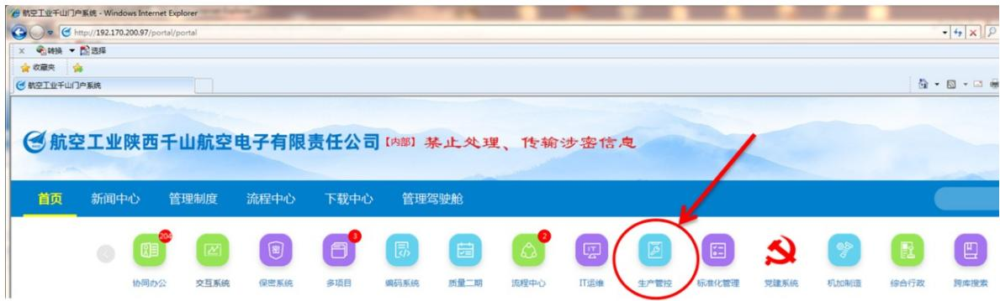

步骤2：生产计划管控系统进入后默认页面见下图。

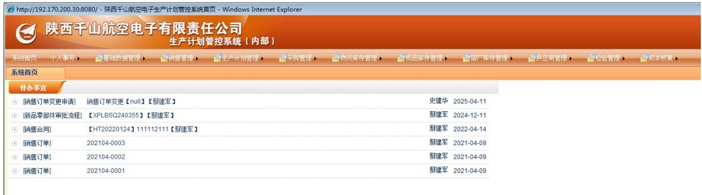

步骤3：选择“基础数据管理”——“基础功能管理”——“项目信息定义”，鼠标单机选择“项目信息定义”。

步骤4：进入“项目信息定义”后，界面显示如下图所示。

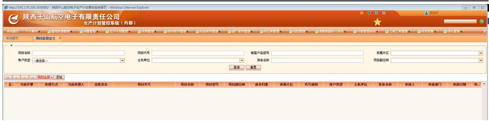  
步骤5：点击“添加”，进入项目代号申请编制页面。

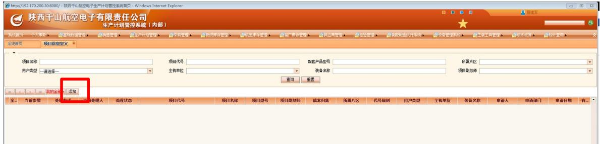

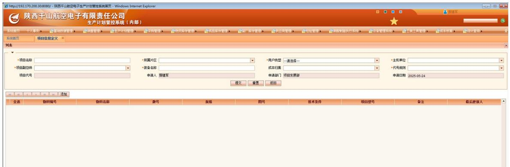

步骤6：分别填写步骤5中项目名称、装备名称，点击选择所属片区、用户类型、主机单位、项目副总师、代号规则。此处注意装备名称不能涉密（ERP系统为密级为内部，装备名称需要脱密填写）

项目名称，填写规则为：XXX飞机XX产品研制、XXX飞机XX产品应用验证等等。如：176项目综合数据管理子系统研制，Z-20T直升机综合数据采集系统国产化应用验证，Z-20T直升机飞行参数及音频记录设备国产化应用验证。

装备名称，填写规则为：XX飞机、XX运输机、XX直升机等。如：直-10ME直升机、Z-20T直升机、GJ-11E无人机（176外贸型无人机）。

项目代号申请编制完成的界面如下图所示。

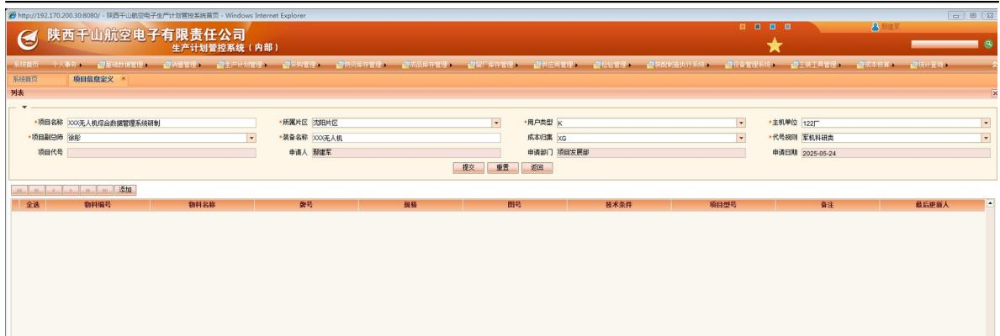

步骤7：维护“子表”，添加产品型号及物料名称，并提请项目代号申请的审核确认。详细操作如下图示。

步骤7-1：点击“添加”。

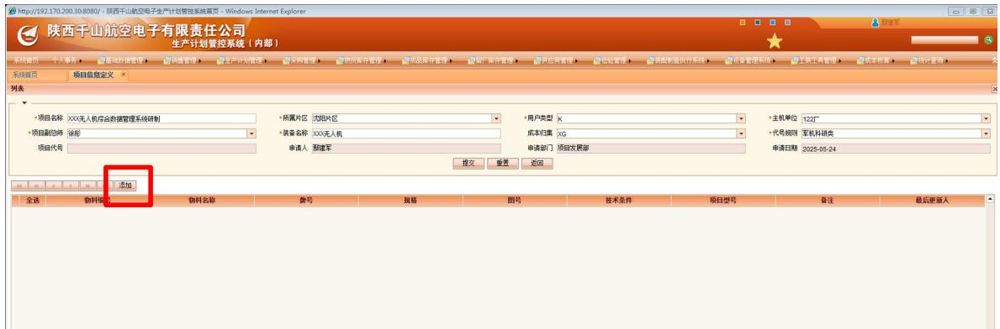

步骤7-2：填写“物料编号”。

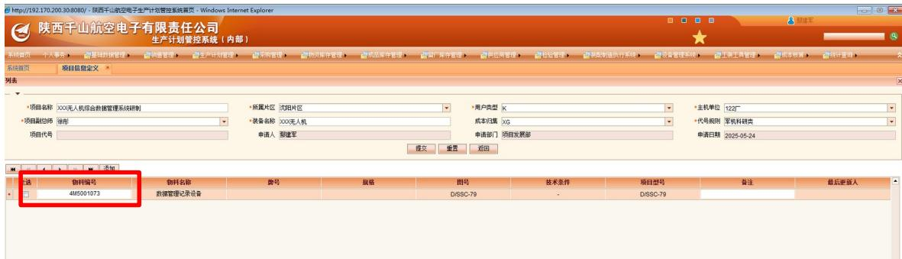

步骤7-2：点击“提交”，提交项目代号申请的审核确认。

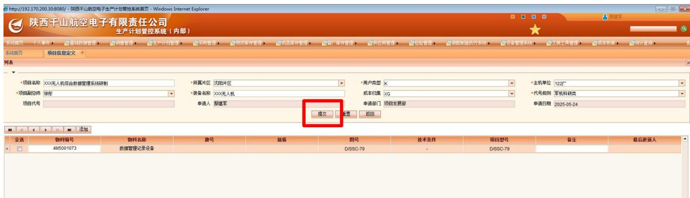

步骤8：继续维护“子表”或提交审核流程。

步骤8-1：继续维护子表，点击“添加”，增加项目名称下的产品物料编号，物料编号添加完成后，点击“保存”。此处可点击“保存”，也可删除添加错误的物料编号。

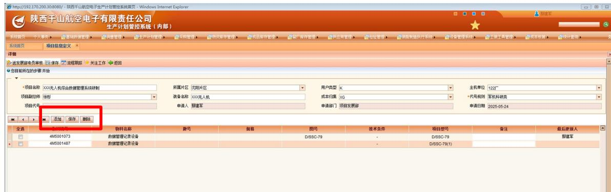  
步骤8-2：若不涉及步骤8-1，可略过步骤8-1，直接提交项目代号审核确认。

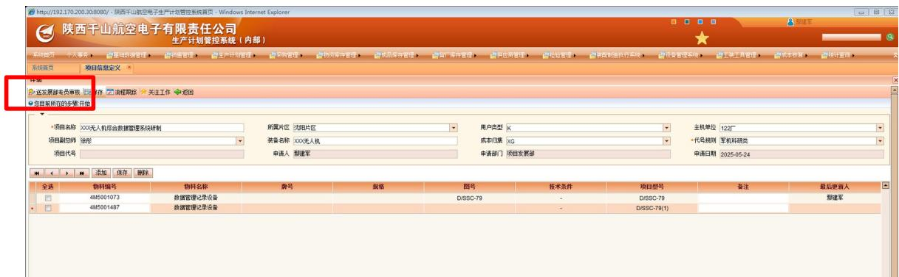

# 2.2 新品项目代号审核

项目代号申请提交后，在项目代号审核专员ERP系统中“待办事宜”页面，出现待办事宜。

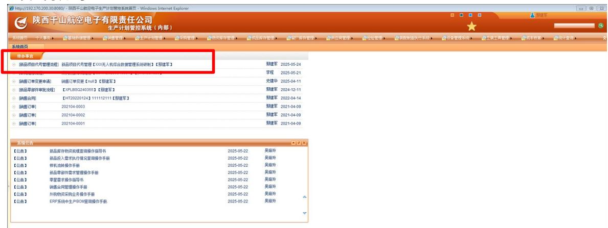

步骤9：项目代号审核专员审核项目代号申请信息填写的规范性、准确性，点击“结束”或“退回上一步”、“退回发稿人”。

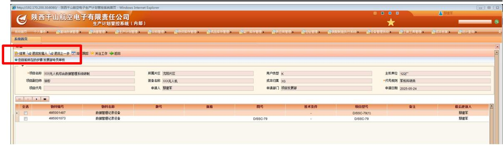

# 2.3 新品项目代号查询

步骤10：选择“基础数据管理”——“基础功能管理”——“项目定义查询”，鼠标单机选择“项目信息查询”。

步骤11：项目代号查询，可通过项目名称、项目代号、配套产品型号、所属片区、用户类型、主机单位、装备名称、项目副总师等查询属性进行查询。

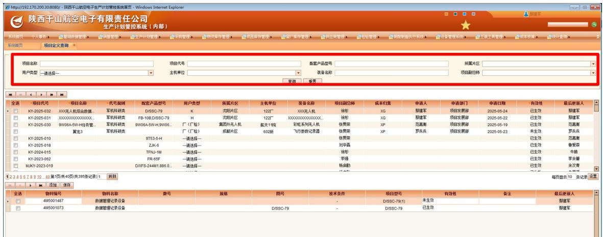