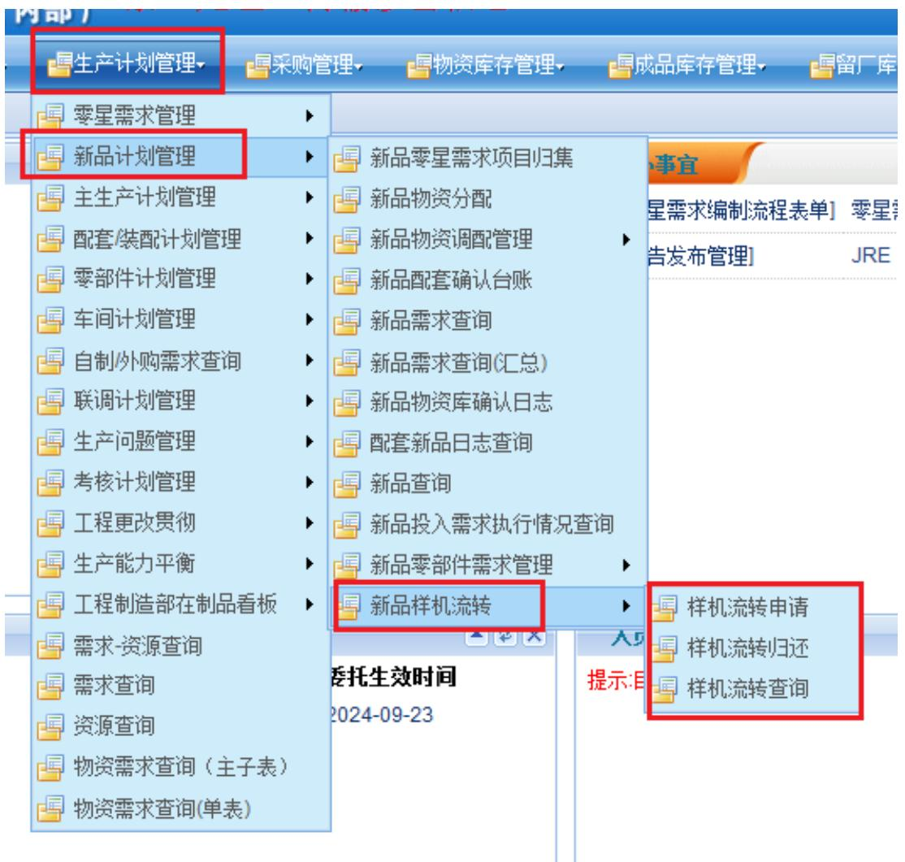
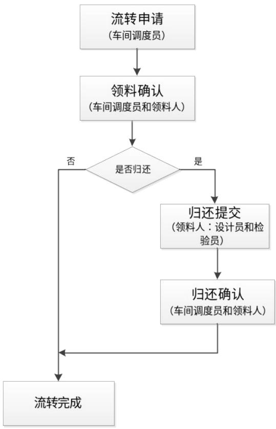
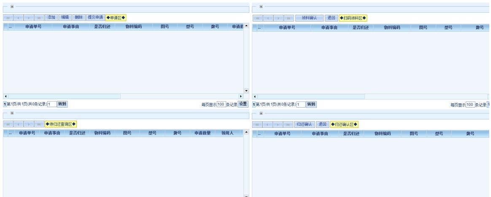
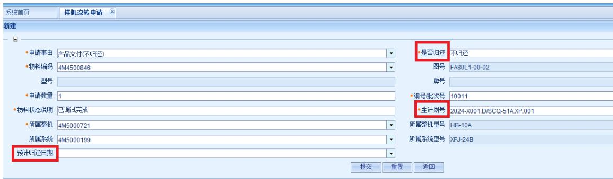
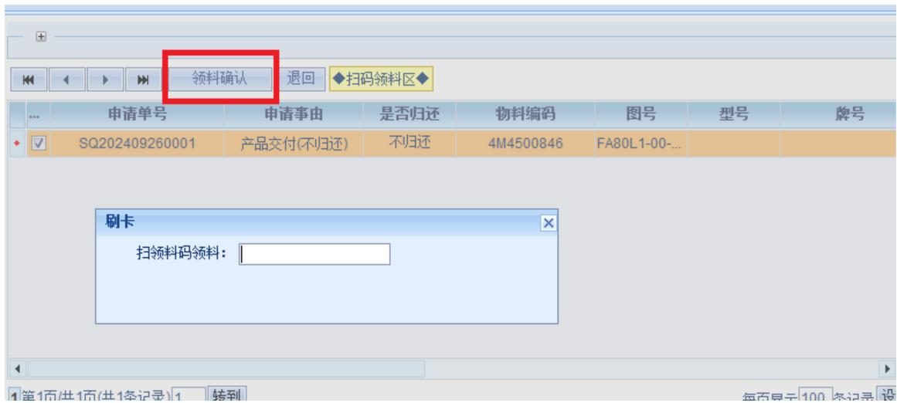
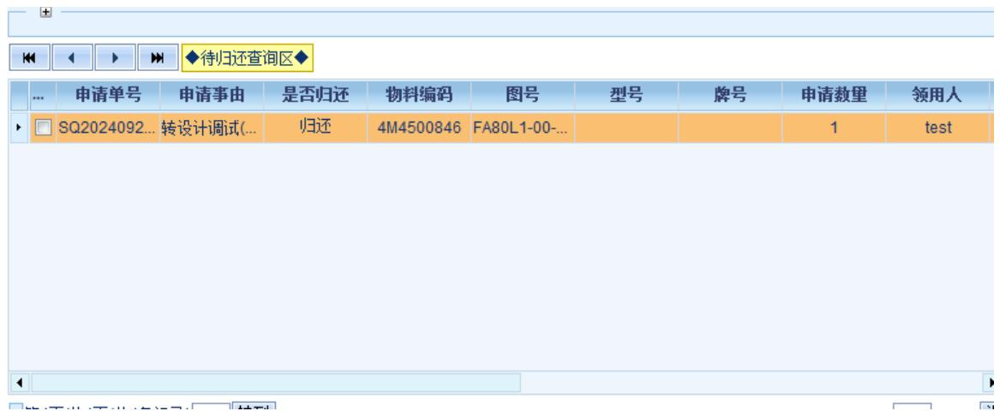
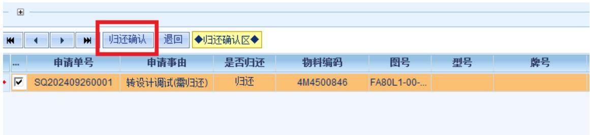
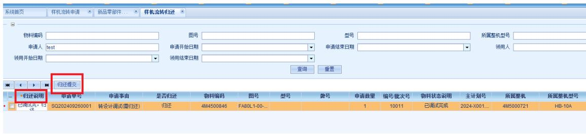
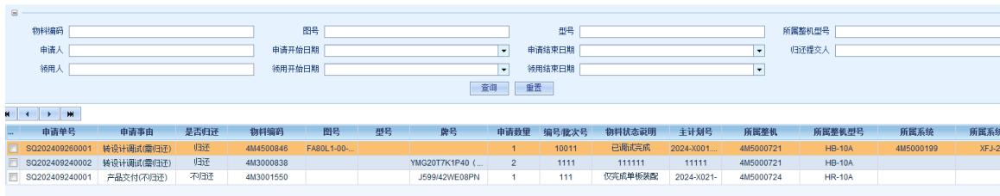

# 样机流转功能操作说明

# 1. 适用场景

适用于装调中心调与设计和检验之间样机流转进行跟踪记录，随时查看样机流转的状态。

# 2. 操作方法

# 2.1界面进入操作

门户首页--生产计划管控系统--新品计划管理--新品样机流转，包含“样机流转申请”、“样机流归还”和“样机流查询”三个部分。

# 2.2功能操作

# 1) 样机流转申请

该功能主要是转出人操作使用，分4部分：申请区、扫码领料区、待归还查询区和归还确认区。

# (1) 申请区

点击“添加”，填写领用物料的相关信息，点击提交即可。

注意点：【是否归还】选择“归还”和“不归还”，【主计划

号】可手填和选择已有的主计划，【预计归还日期】选择归还日期，若到期还未归就标红提示。

# (2）领料确认区

申请区点提交后，流程就到了领料确认区，点击“扫码领料”就出现扫码地方，扫领料人的条码领料即可。

# (3) 待归还区

对于需归还的申请，扫码领料后申请人在待归还区查看。

# (4) 归还确认区

领料人归还提交后，流程会到申请人的归还确认区，点“归还确认”，流程结束，说明物料已归还给申请人。

# 2) 样机流转归还（领用人归还操作界面）

归还人点击“归还提交”，拿着产品去归还即可。

# 3) 样机流转查询

根据条件可查看流转相关信息。

