销售管理业务是对厂内销售合同执行过程进行管控。主要涉及销售基础数据维护、销售指标管理、销售合同管理、销售订单管理、投产指令管理、销售发货管理、销售收入确认、应收台账管理、开票与回款管理、销售预警和销售财务综合查询。

业务流程如下：

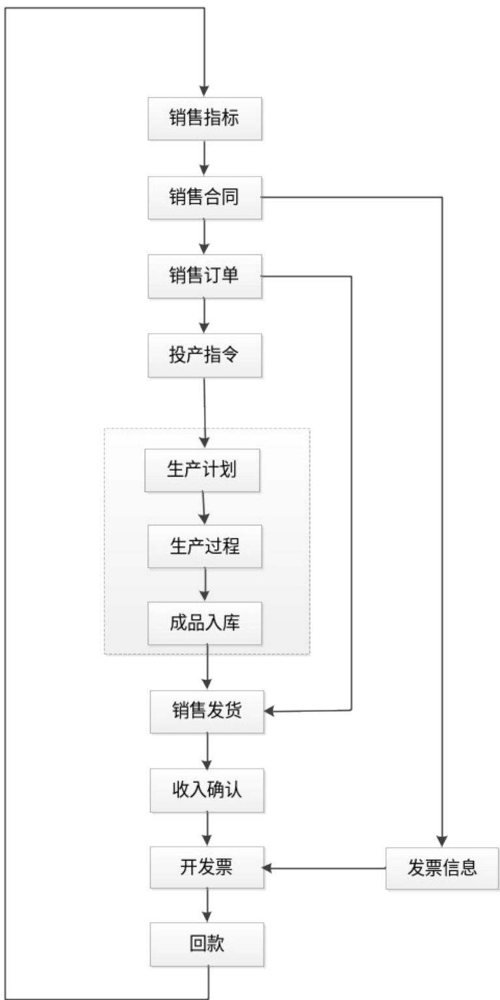

# 1. 销售管理基础数据

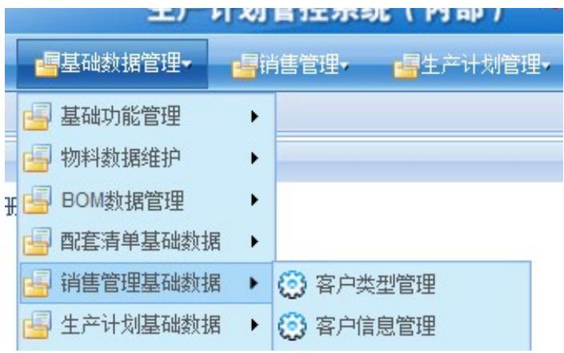

# 1.1. 客户类型管理

# $\bullet$  功能描述

销售人员对销售客户类型进行维护。

# $\bullet$  操作说明

点击“基础数据管理”  $\rightarrow$  “销售基础数据管理”  $\rightarrow$  “客户类型管理”。弹出客户类型添加和查看页面，点击“添加”输入“客户类型代码”、“名称”、“有效性”、“是否军检”、“显示顺序”、“备注”等信息，点击“保存”即可生成一条客户类型。作为基础数据供后端使用时选择。

# 1.2. 客户信息管理

# $\bullet$  功能描述

销售人员对销售客户信息进行维护。

# $\bullet$  操作说明

点击“基础数据管理”  $\rightarrow$  “销售基础数据管理”  $\rightarrow$  “客户信息管理”。弹出客户信息添加、编辑和置为无效页面，点击“添加”输入“客户编码”、“客户名称”、“开票名称”、“有效性”等信息，点击“编辑”可对已添加的客户信息进行编辑，点击“置为无效”即可将有效的客户设置成无效。

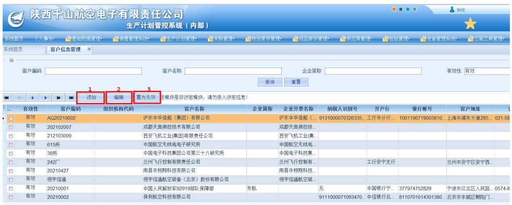

# 2. 销售管理

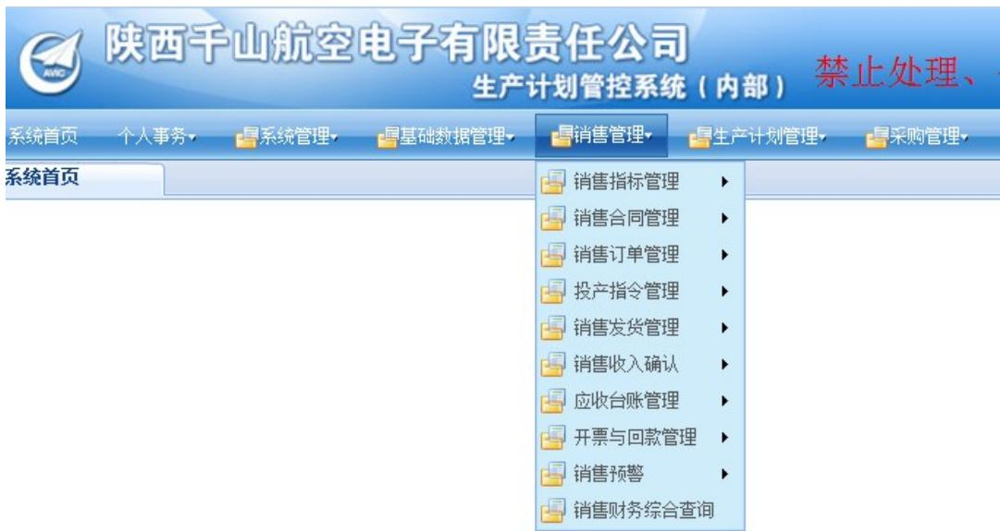

# 2.1. 销售指标管理

# 2.1.1. 销售指标维护

# $\bullet$  功能描述

销售人员根据每年部门销售指标情况进行销售指标添加、编辑、删除和确认。

# $\bullet$  操作说明

点击“销售管理”  $\rightarrow$  “销售指标管理”  $\rightarrow$  “销售指标维护”。弹出销售指标添加、编辑、删除和确认页面，点击“添加”输入“年份”、“客户”、“合同指标”等信息进行保存，点击“编辑”可对已添加的指标信息进行编辑，点击“删除”可对添加的指标信息进行删除，点击“确认”可对已添加的指标进行确认生效。

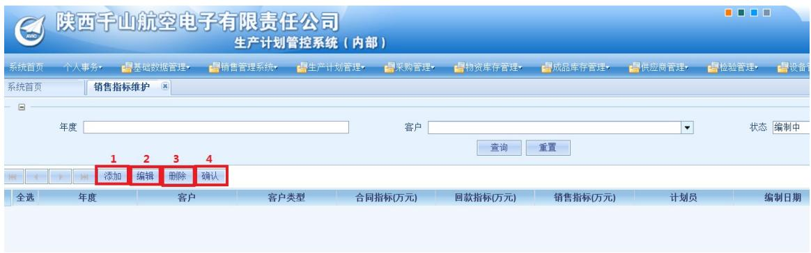

# 2.1.2. 销售指标查询

# $\bullet$  功能描述

销售人员根据已确认的销售指标进行销售指标查询。

# $\bullet$  操作说明

点击“销售管理”  $\rightarrow$  “销售指标管理”  $\rightarrow$  “销售指标查询”。弹出已生效的销售指标页面，可以按照“年份”、“客户”、“状态”等查询条件进行指标查询。

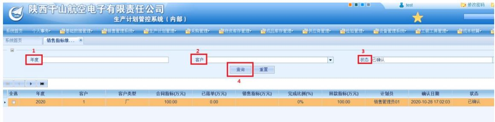

# 2.2. 销售合同管理

# 2.2.1. 销售合同录入

# $\bullet$  功能描述

销售人员根据合同信息进行合同录入，提交审批。

# $\bullet$  操作说明

点击“销售管理”  $\rightarrow$  “销售合同管理”  $\rightarrow$  “销售合同录入”。弹出销售合同录入添加

页面，点击“添加”，录入合同信息。点击明细“添加”可以选择合同明细产品，点击明细“删除”可以删去已选的产品信息，点击明细“从销售订单选择”可以让该合同与已生成的预测订单进行关联。都录入完后点击“保存”就到提交界面进行“提交”审批。

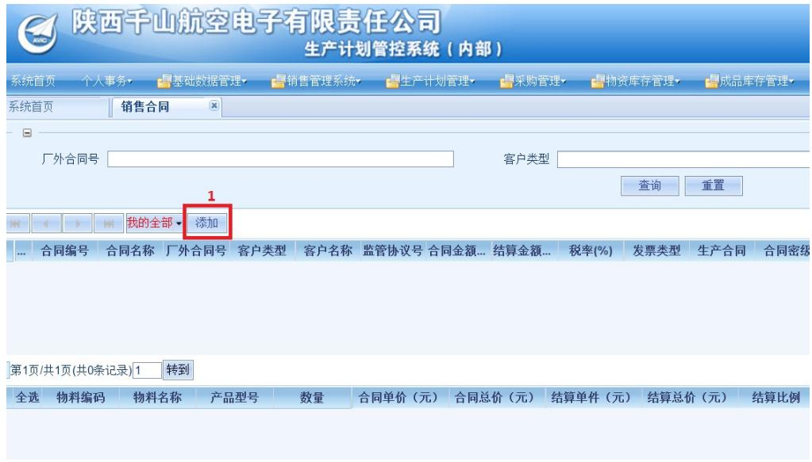

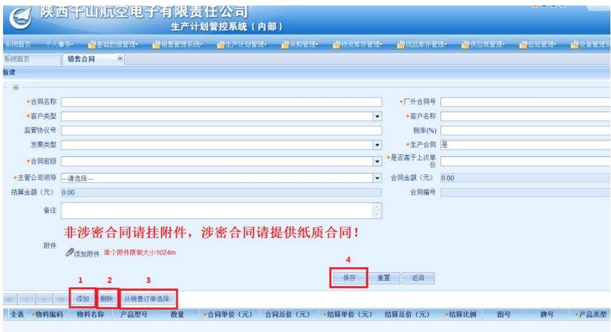

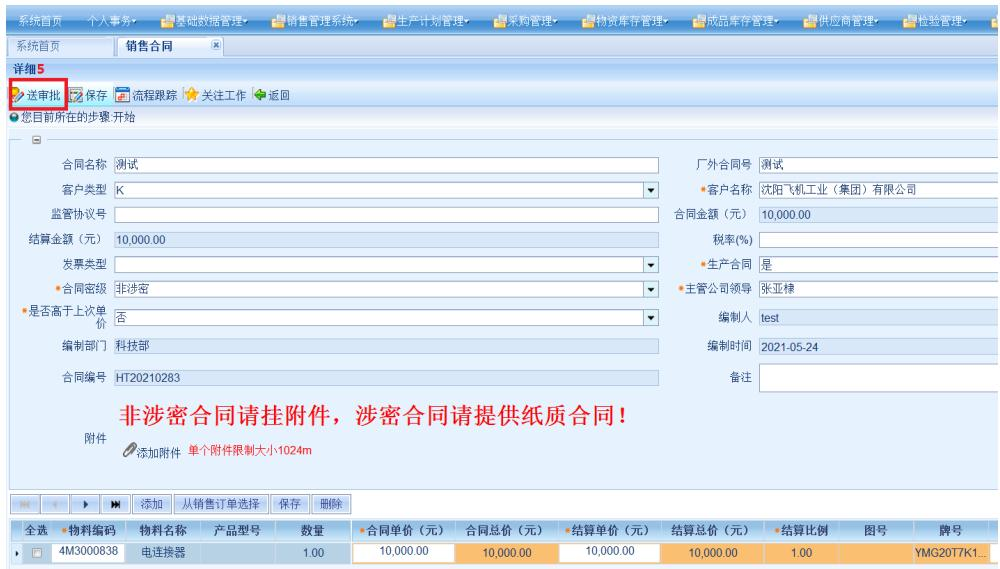

# 2.2.2. 销售合同明细综合查询

# $\bullet$  功能描述

销售人员查看合同明细执行情况。

# $\bullet$  操作说明

点击“销售管理”  $\rightarrow$  “销售合同管理”  $\rightarrow$  “销售合同明细综合查询”。弹出查询页面，填写“编制部门”、“编制人”、“合同号”、“合同名称”、“客户名称”等信息，点击“查询”下面就会显示查询出来的相关信息（合同信息、合同明细信息、发货信息、发货信息、收入信息、开票信息和回款信息）。

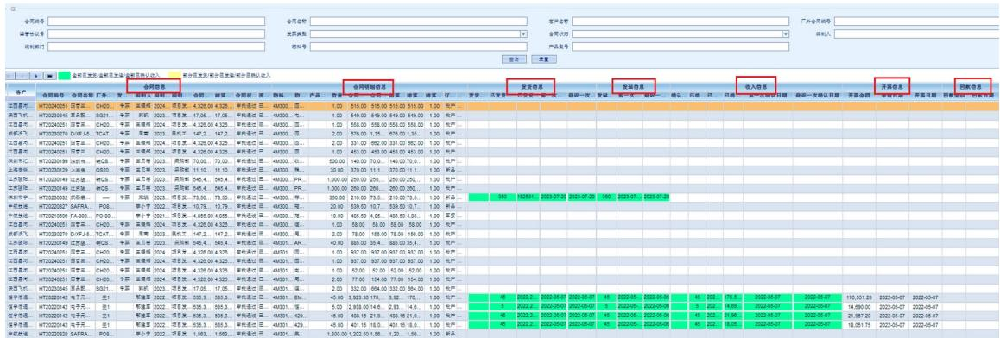

# 2.2.3.冲抵查询

# $\bullet$  功能描述

销售人员可以查看合同和订单的冲抵情况。

# $\bullet$  操作说明

点击“销售管理”  $\rightarrow$  “销售合同管理”  $\rightarrow$  “冲抵查询”。弹出冲抵查询页面，填写“合同编号”、“销售订单编号”、“物料号”、“物料名称”等信息，点击“查询”下面就会显示查询出来的信息。

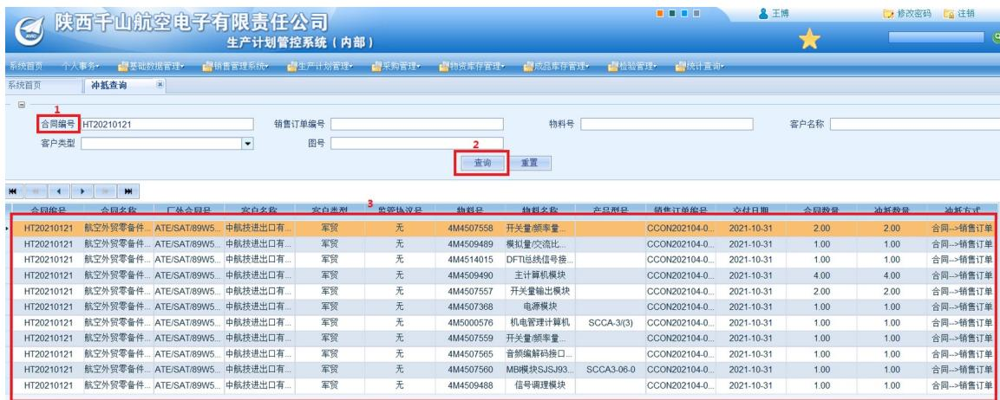

# 2.2.4. 销售合同看板

# $\bullet$  功能描述

公司领导和部门领导可以查看公司和销售各部门年度销售情况统计。

# $\bullet$  操作说明

点击“销售管理”  $\rightarrow$  “销售合同管理”  $\rightarrow$  “销售合同看板”。

# 1. 公司级

年度各部门销售金额：

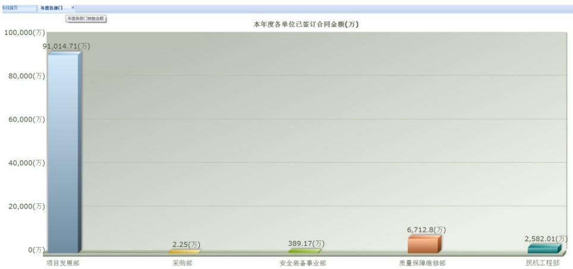

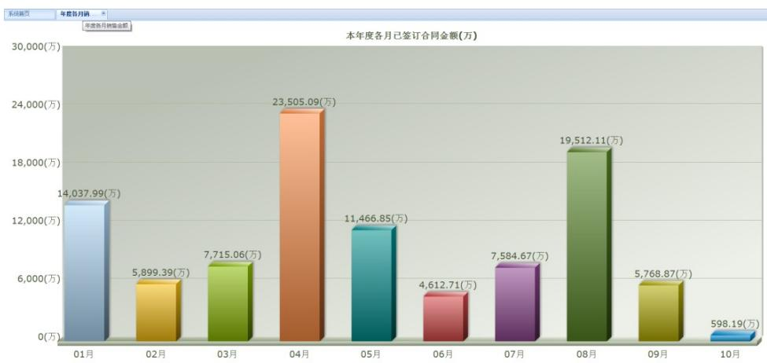  
年度各月销售金额：

# 2. 部门级

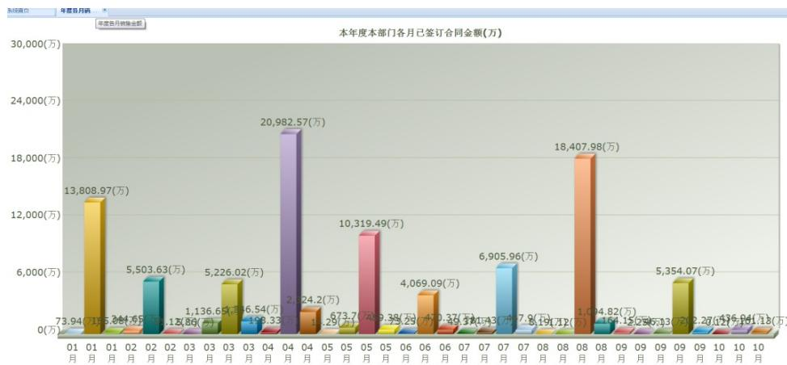  
年度本部门销售金额：  
年度各人销售金额：

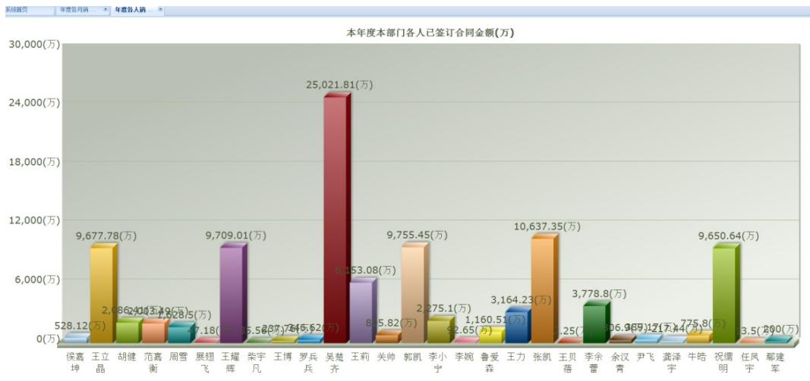

# 2.3. 销售订单管理

# 2.3.1. 合同生成销售订单

# $\bullet$  功能描述

销售人员对审批通过的合同明细生成订单。

# $\bullet$  操作说明

点击“销售管理”  $\rightarrow$  “销售订单”  $\rightarrow$  “合同生成销售订单”。弹出合同生成销售订单页面，选中已经审批通过的合同，点击“添加”，填写数量和需求时间。点击“保存”可以将填写好的信息保存。点击“删除”可以将填写好的信息进行删除。点击“生成订单”对已填好的信息生成了订单。

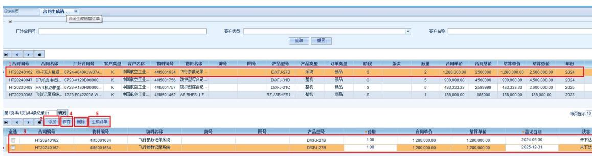

# 2.3.2. 销售订单维护

# $\bullet$  功能描述

销售人员对无合同需提前投产（风险投入和投产函），可以进行订单维护进行投产（销售需求添加），合同确定后再关联该订单；内部投产样机不进行销售（内部需求添加）。

# $\bullet$  操作说明

点击“销售管理”  $\rightarrow$  “销售订单管理”  $\rightarrow$  “销售订单维护”，弹出订单维护页面。

点击“销售需求添加”或“内部需求添加”，弹出添加页面，输入数据并上传附件后点击“保存”，保存后到订单维护界面可以进行“编辑”、“删除”和“提交审批”操作“提交审批”后经三级审批后到投产指令。“复制”是对已走过的订单进行再次投产可以直接复制进行提交。

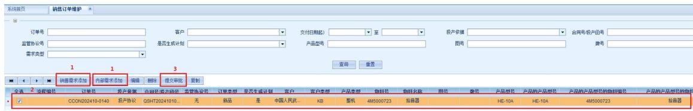

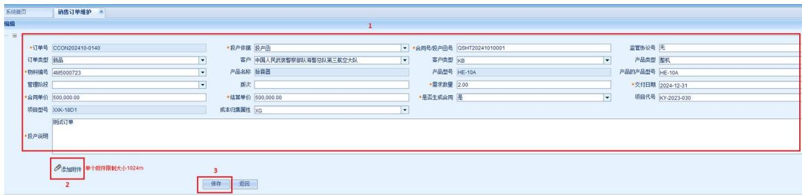

# 2.3.3. 销售订单查询

# $\bullet$  功能描述

销售管人员对销售订单进行查询。

# $\bullet$  操作说明

点击“销售管理”  $\rightarrow$  “销售订单管理”  $\rightarrow$  “销售订单查询”，弹出订单查询页面。

用户点击“查询”或“重置”按钮，可按照输入的查询条件模糊筛选出对应的记录，在点击“重置”按钮时可清空查询条件。

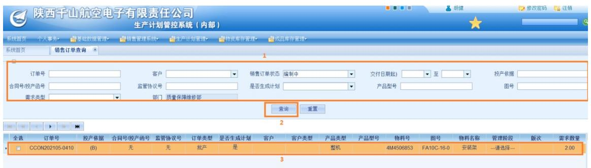

# 2.3.4. 销售订单回款统计

# $\bullet$  功能描述

销售管人员对销售订单汇款信息进行统计。

# $\bullet$  操作说明

点击“销售管理”  $\rightarrow$  “销售订单管理”  $\rightarrow$  “销售订单回款统计”，弹出订单维护页面。

销售人员点击“选择发票”进行回款登记。点击“查询”或“重置”按钮，可按照输入的查询条件筛选出对应的记录，在点击“重置”按钮时可清空查询条件。

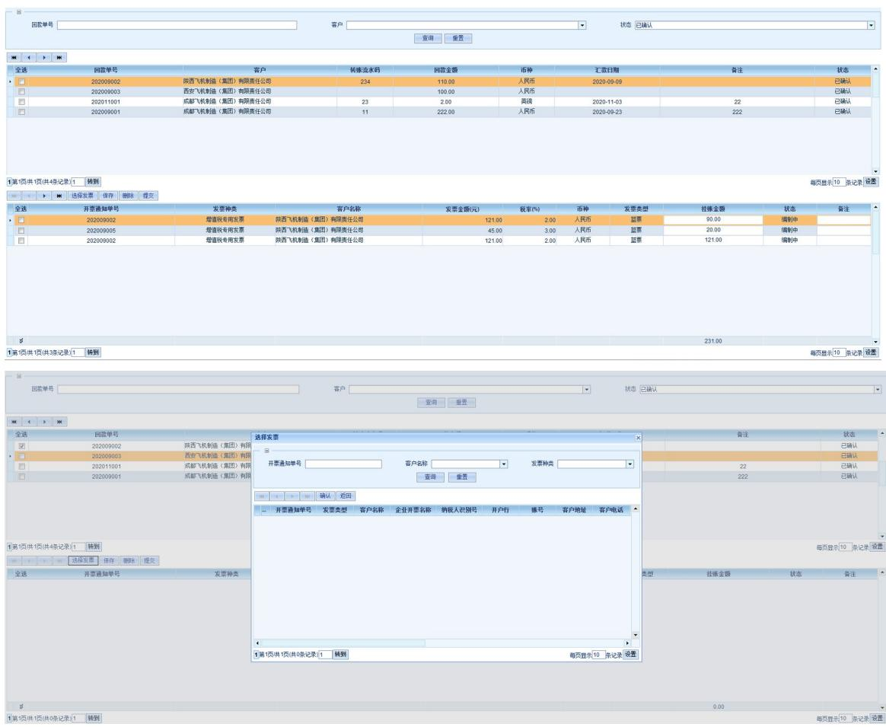

# 2.3.5. 销售订单变更申请

# $\bullet$  功能描述

销售人员对销售订单变更进行申请。

# $\bullet$  操作说明

点击“销售管理”  $\rightarrow$  “销售订单管理”  $\rightarrow$  “销售订单变更”，弹出订单维护页面。

用户选择数据点击“变更”按钮，弹出变更页面，输入变更信息后点击提交按钮。用户选择数据点击“订单废止”按钮，将所选数据废止。用户选择数据点击“编辑”按钮，成功弹出编辑页面，输入信息后点击提交按钮。用户点击“查询”或“重置”按钮，可按照输入的查询条件模糊筛选出对应的记录，在点击“重置”按钮时可清空查询条件。

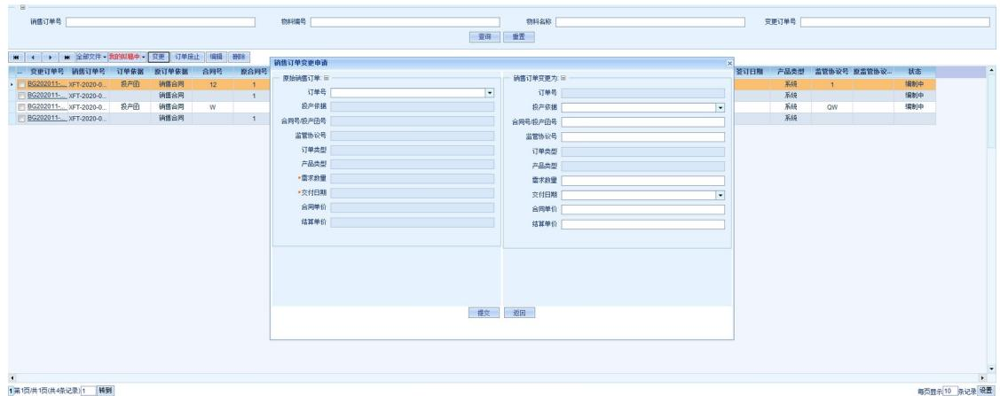

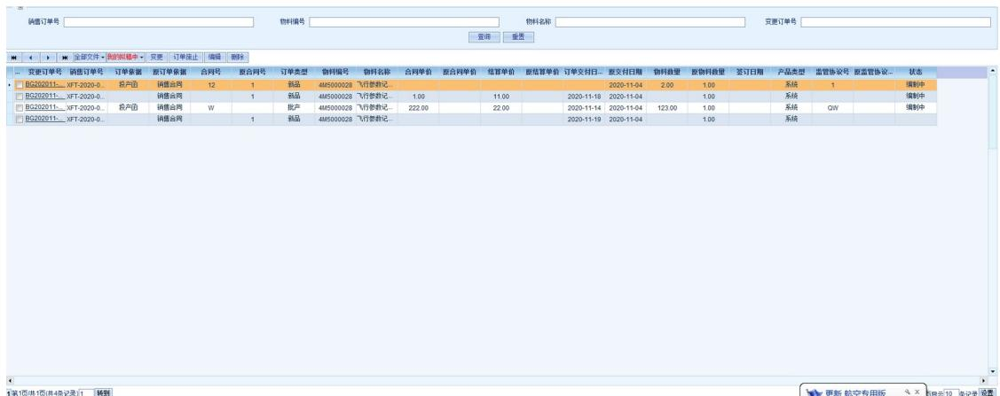

# 2.3.6. 销售订单变更查询

# $\bullet$  功能描述

销售管人员对销售订单变更申请进行查询。

# $\bullet$  操作说明

点击“销售管理”  $\rightarrow$  “销售订单管理”  $\rightarrow$  “销售订单变更查询”，弹出变更查询页面。

用户点击“查询”或“重置”按钮，可按照输入的查询条件模糊筛选出对应的记录，在点击“重置”按钮时可清空查询条件。

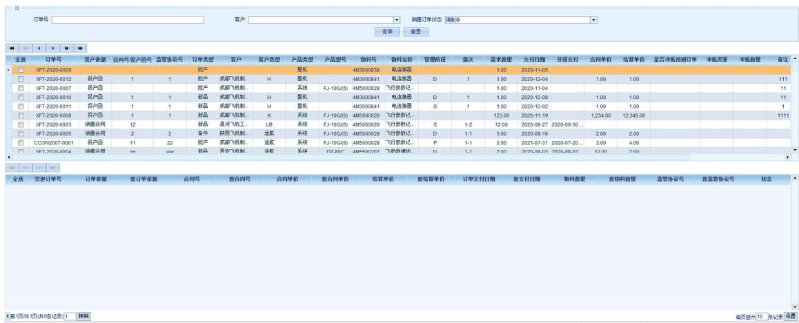

# 2.3.7. 销售订单完成情况统计

# $\bullet$  功能描述

销售人员对销售订单完成情况进行统计查询。

# $\bullet$  操作说明

点击“销售管理”  $\rightarrow$  “销售订单管理”  $\rightarrow$  “销售订单完成情况统计”，弹出订单完成情况统计页面。

用户点击“查询”或“重置”按钮，可按照输入的查询条件模糊筛选出对应的记录，在点击“重置”按钮时可清空查询条件。可以查询订单入库情况、发货情况、回款情况、完成率等。

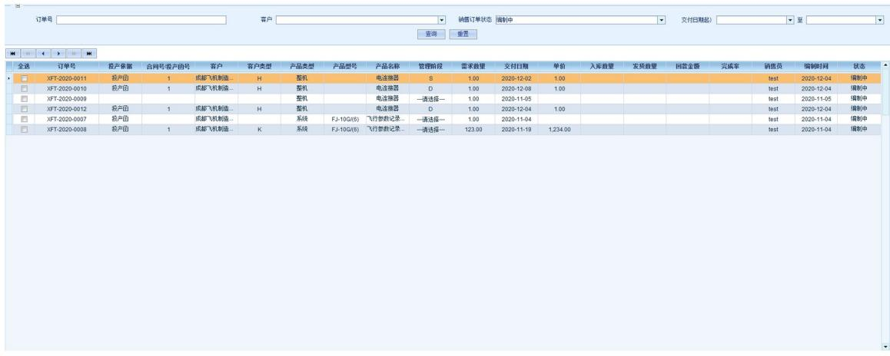

# 2.4.投产指令管理

# 2.4.1. 销售订单生成投产指令

# $\bullet$  功能描述

销售人员根据订单情况下达投产指令。

# $\bullet$  操作说明

点击“销售管理”  $\rightarrow$  “投产指令管理”  $\rightarrow$  “销售订单生成投产指令”。弹出投产指令下达页面，选中需投产的订单。

是否生成计划：“是”表示下一步会到主计划进行进行投产；“否”表示不进行投产只用来订单发货。

库存冲抵：利用已有库存冲抵，直接销售发货。选择库存冲抵的产品会被占用，只有该订单对的发货才能使用。

库存改装：利用库存已有产品进行改装\复验后再销售发货。选择改装的产品会被占用，同时会自动生成出库单。

选配：针对BOM中有选配件的进行选配。

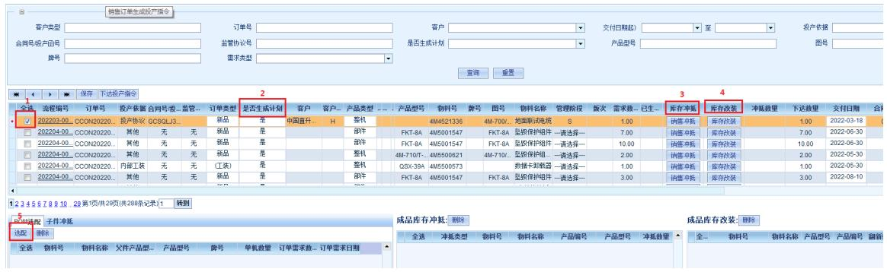

# 2.4.2. 销售订单库存\改装冲抵查询

# $\bullet$  功能描述

销售人员对销售订单库存\改装冲抵情况进行查询。

# $\bullet$  操作说明

点击“销售管理”  $\rightarrow$  “投产指令管理”  $\rightarrow$  “销售订单库存\改装冲抵查询”。弹出查看页面。冲抵的产品在库存中已被占用。

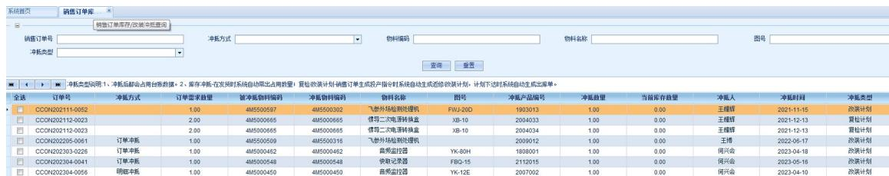

# 2.5. 销售发货管理

# 2.5.1. 发货申请

# $\bullet$  功能介绍

销售人员进行发货申请，提交审批。

# $\bullet$  操作说明

点击“销售管理”  $\rightarrow$  “销售发货管理”  $\rightarrow$  “发货申请”，弹出发货页面（上面是发货信息、左下是发货对应的订单信息、右下是订单对应的产品信息）。

点击“添加”按钮，弹出添加页面，填写发货信息提交之后生成发货要关联的订单。然后点击发货信息下面“选择订单”按钮，弹出订单选择页，选择要发货的订单，“提交”后进入了发货页面。点击“编辑”按钮，弹出对发货编辑页面，用户对数据编辑完成之后进行提交保存。选择数据点击“删除”按钮，成功删除所选数据。点击“复制”按钮是对之前发货信息再次发货。最后点击“提交审批”按钮，提交给部门领导审批。

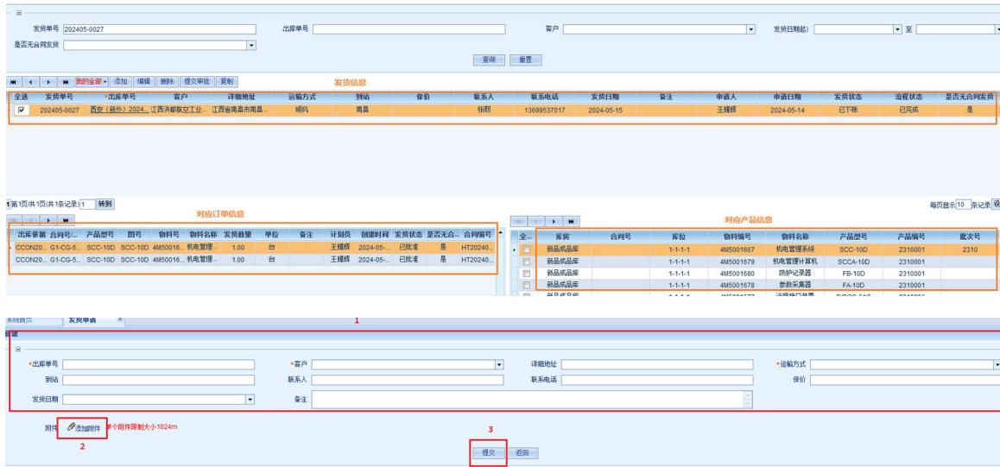

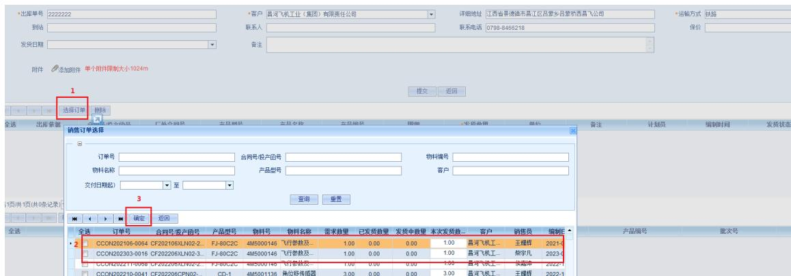

# 2.6. 销售退货管理

# $\bullet$  功能介绍

销售管人员对已销售出库的产品进行退货。

# $\bullet$  操作说明

点击“销售管理”  $\rightarrow$  “销售发货管理”  $\rightarrow$  “销售退货管理”  $\rightarrow$  “退货管理”，弹出退

货页面。

点击“添加”按钮，成功弹出添加页面，输入退货客户信息确认后，生成一条客户信，点击“选择发货单”选择该客户对应的发货单，点击“添加”添加该发货单对应的产品，最后选择数据后点击“提交审批”按钮，成功将数据提交至退货检验确认。用户点击“查询”或“重置”按钮，按照输入的查询条件模糊筛选出对应的记录，在点击“重置”按钮时可清空查询条件。

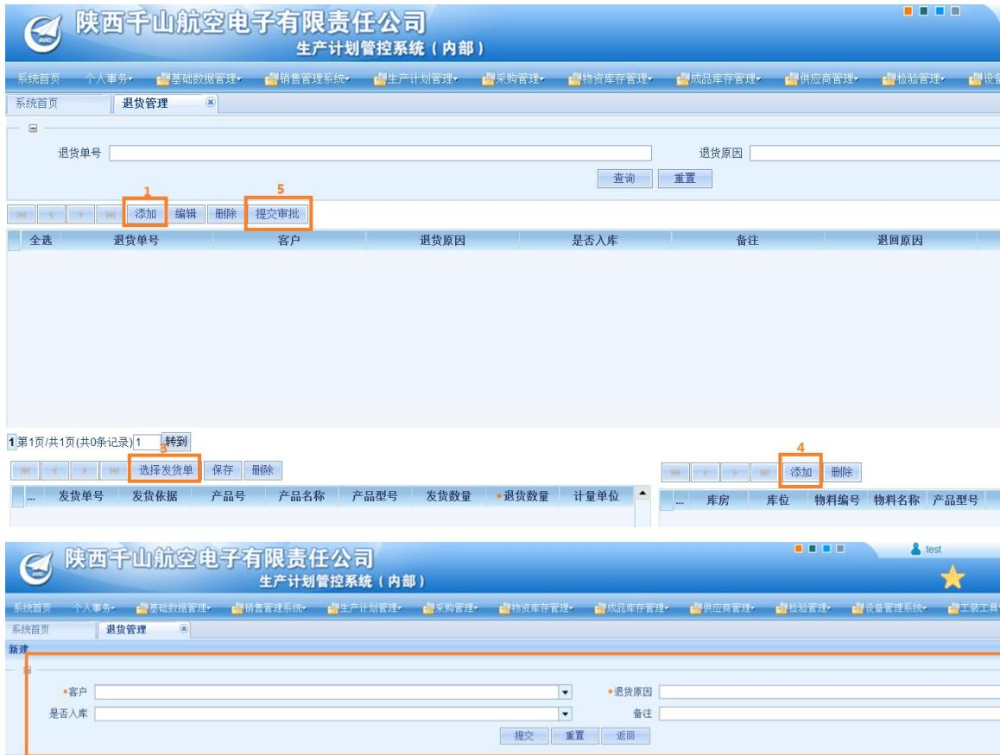  
2

# 2.7. 退货检验确认

# $\bullet$  功能介绍

检验人员对退货检验进行确认。

# $\bullet$  操作说明

点击“销售管理”  $\rightarrow$  “销售发货管理”  $\rightarrow$  “销售退货管理”  $\rightarrow$  “退货检验确认”，弹出退货页面。

选择数据后点击“检验完成”按钮，成功将所选数据检验完成。选择数据后点击“拒回”按钮，填写拒回原因后，成功将数据拒回至销售退货管理。用户点击“查询”或“重置”按钮，按照输入的查询条件模糊筛选出对应的记录，在点击“重置”按钮时可清空查询条件。

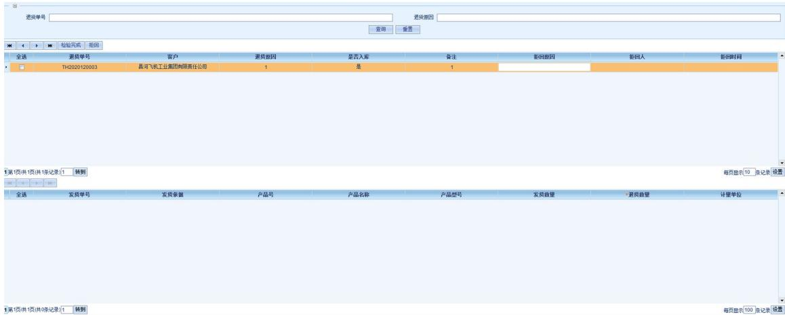

# 2.8. 退货入库登帐

# $\bullet$  功能介绍

库房管理员对退货入库进行登帐

# $\bullet$  操作说明

点击“销售管理”  $\rightarrow$  “销售发货管理”  $\rightarrow$  “销售退货管理”  $\rightarrow$  “退货入库登帐”，弹出退货页面。

选择数据后点击“登帐”按钮，成功将所选数据进行登帐。用户点击“查询”或“重置”按钮，按照输入的查询条件模糊筛选出对应的记录，在点击“重置”按钮时可清空查询条件。

# 2.9. 开票申请

# $\bullet$  功能描述

销售人员对开票信息进行定义。

# $\bullet$  操作说明

用户点击“查询”或“重置”按钮，可按照输入的查询条件模糊筛选出对应的记录，在点击“重置”按钮时可清空查询条件

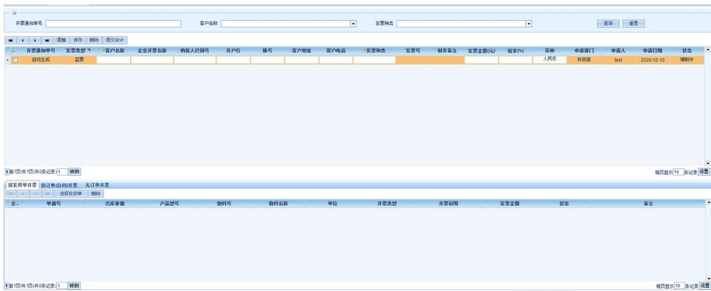

用户点击“添加”按钮

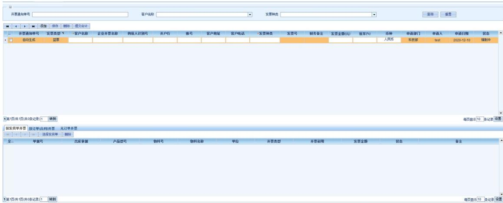  
用户点击“保存”按钮

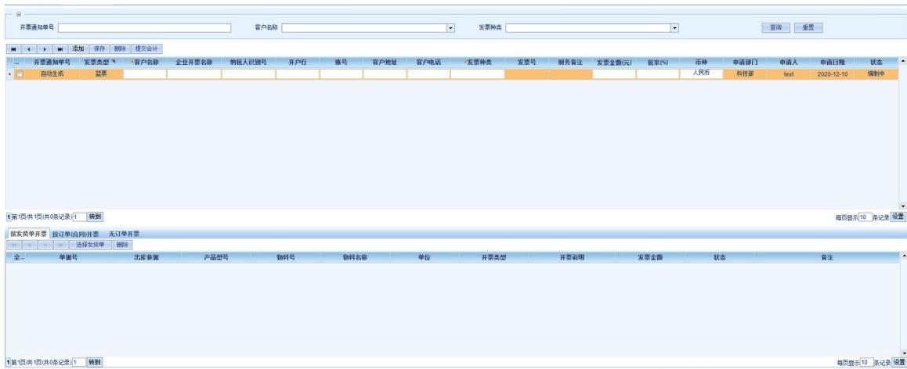  
用户点击“删除”按钮

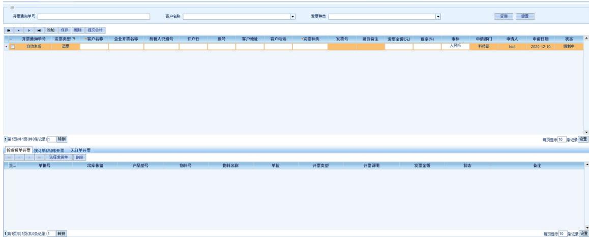  
用户点击“提交会计”按钮。

# 2.10.销售开票

# $\bullet$  功能描述

销售管理员对销售开票信息进行定义。

# $\bullet$  操作说明

用户点击“已开票”按钮，成功操作所选数据。用户点击“驳回”按钮，勾选数据点击按钮弹出驳回意见弹出框，填写完成后点击提交按钮。用户点击“查询”或“重置”按钮，可按照输入的查询条件模糊筛选出对应的记录，在点击“重置”按钮时可清空查询条件。

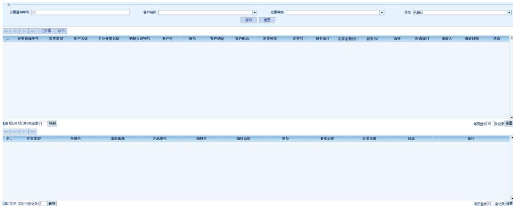

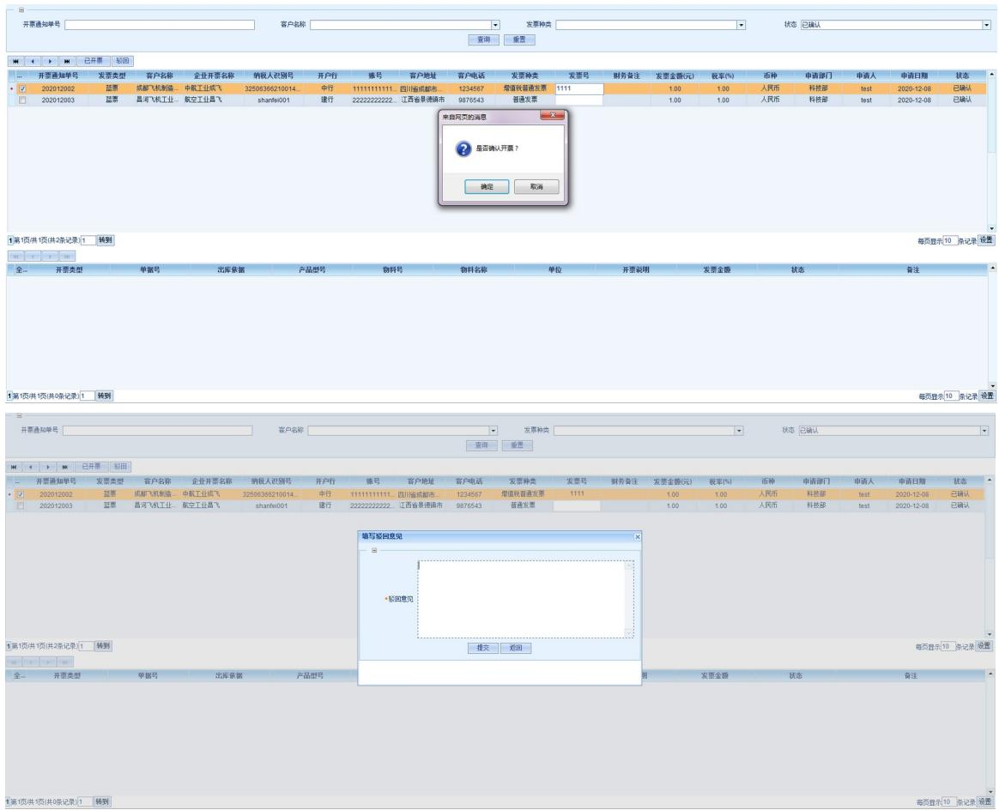

# 2.11. 应收账款查询

# $\bullet$  功能描述

销售管理员对应收账款信息进行查询。

# $\bullet$  操作说明

用户点击“查询”或“重置”按钮，可按照输入的查询条件模糊筛选出对应的记录，在点击“重置”按钮时可清空查询条件。

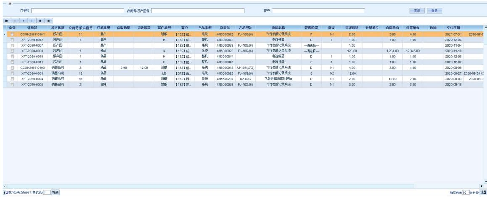

# 2.12.销售回款登记

# $\bullet$  功能描述

销售人员进行销售回款登记。

# $\bullet$  操作说明

用户点击“添加”按钮，弹出添加页面，用户输入信息提交之后生成数据。用户点击“删除”按钮，可以将选中的数据进行删除。用户点击“编辑按钮”，弹出编辑页面，用户输入信息提交之后保存数据。销售管理员对销售回款信息进行登记可按照输入的查询条件模糊筛选出对应的记录，在点击“重置”按钮时可清空查询条件。

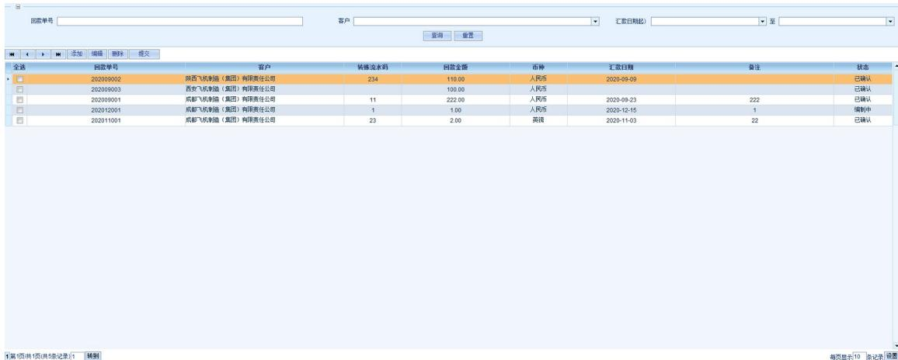

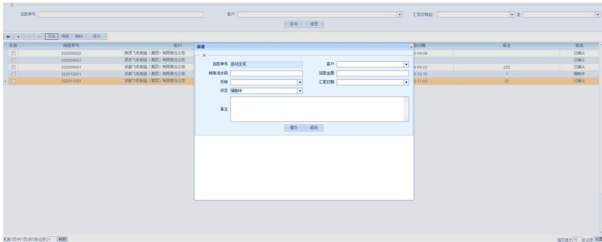

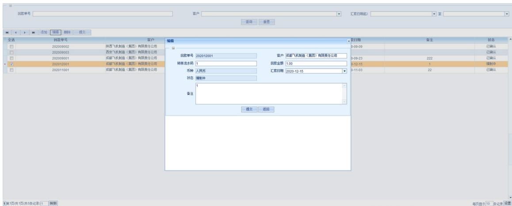